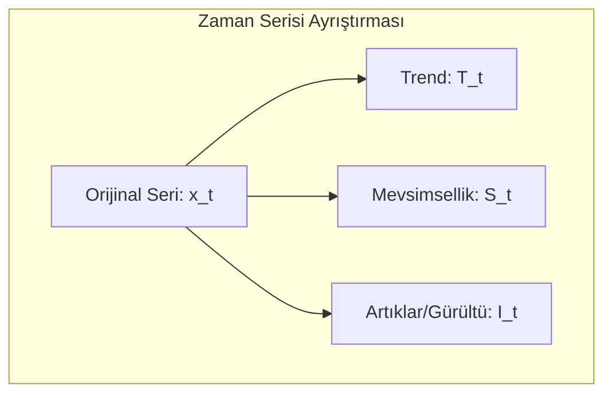
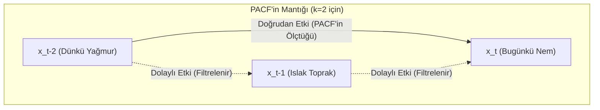

# Yapay Zeka Tabanlı Zaman Serisi ve Veri Analizi
### Ders Notları

---

## Bölüm 1: Zaman Serisi Analizine Giriş

### Zaman Serisi Nedir?

En basit tanımıyla zaman serisi, belirli bir zaman aralığında ardışık olarak gözlemlenen veri noktaları dizisidir. Box ve Jenkins’in klasik tanımına göre, “zamana bağlı olarak düzenli aralıklarla kaydedilen gözlemler dizisidir.”

Bu ne anlama geliyor? Günlük hayattan birkaç örnek verelim:
- Bir hastanedeki günlük hasta kabul sayısı.
- Bir şirketin aylık satış rakamları.
- Bir meteoroloji istasyonunda kaydedilen saatlik sıcaklık ölçümleri.
- Bir hisse senedinin dakikalık fiyat hareketleri.

Gördüğünüz gibi, zaman serisi analizi; finans, ekonomi, sağlık, mühendislik ve çevre bilimleri gibi sayısız alanda karşımıza çıkar. Peki amacımız ne? Geçmiş verilerden yola çıkarak geleceği tahmin etmek, verideki anormal durumları tespit etmek ve verinin altında yatan temel desenleri, yani yapısını ortaya çıkarmaktır.

Bu ders boyunca şu temel sorulara yanıt arayacağız:
- Verinin geçmişindeki desenler (pattern) nelerdir?
- Gelecekteki değerleri nasıl tahmin edebiliriz?
- Serideki olağan dışı değişimleri (anomalileri) nasıl tespit ederiz?
- Bir zaman serisini hangi temel bileşenler oluşturur?

---

## Bölüm 2: Zaman Serisinin Temel Kavramları ve Bileşenleri

Bir zaman serisini analiz etmeden önce, onun temel kavramlarını anlamamız şart. İşte en temel kavramlar:

- **Gözlem (Observation):** $x_t$ ile gösterilir ve $t$ anındaki veri noktasını ifade eder. Örneğin, 15. gündeki işlem sayısı $x_{15} = 120$.
- **Zaman Dizini (Time Index):** $t = 1, 2, ..., T$ şeklinde, gözlemlerin sıralandığı zaman noktalarıdır.
- **Trend:** Serideki uzun vadeli artış veya azalış eğilimidir. Bir e-ticaret sitesinin yıllık satışlarının sürekli artması pozitif bir trend örneğidir.
- **Mevsimsellik (Seasonality):** Belirli ve sabit periyotlarda (günlük, haftalık, yıllık) tekrar eden dalgalanmalardır. Yaz aylarında artan dondurma satışları klasik bir mevsimsellik örneğidir.
- **Döngüsellik (Cyclicity):** Mevsimsellik gibi periyodiktir ancak periyotları sabit değildir ve genellikle daha uzun vadelidir. Ekonomideki iş döngüleri (genişleme ve daralma dönemleri) bu duruma örnektir.
- **Durağanlık (Stationarity):** Bu, dersin en kritik kavramlarından biridir. Bir serinin ortalama, varyans gibi istatistiksel özelliklerinin zamanla değişmemesi durumudur. Bunu anlamadan modelleme yapamazsınız. Birçok klasik model, serinin durağan olmasını veya durağanlaştırılmasını gerektirir.

### Zaman Serisi Bileşenleri

Bir zaman serisini, genellikle dört ana bileşenin birleşimi olarak düşünebiliriz. Amacımız, bu bileşenleri ayrıştırarak serinin yapısını ortaya çıkarmaktır:

$$
x_t = \text{Trend}_t + \text{Mevsimsellik}_t + \text{Döngü}_t + \text{Rastgele Gürültü}_t
$$
$$
x_t = T_t + S_t + C_t + I_t
$$

- $T_t$: Trend (Uzun vadeli yön)
- $S_t$: Mevsimsellik (Sabit periyotlu dalgalanmalar)
- $C_t$: Döngü (Değişken periyotlu dalgalanmalar)
- $I_t$: Rastgele Gürültü (Açıklanamayan, öngörülemeyen dalgalanmalar)

Bu ayrıştırma işlemi, serinin yapısını anlamamızda ve doğru modeli seçmemizde bize yol gösterir.



---

## Bölüm 3: Zaman Serisi Tipleri

Analize başlamadan önce, elinizdeki verinin türünü doğru sınıflandırmanız gerekir. Çünkü her seriye aynı yöntem uygulanmaz.

1.  **Değişken Sayısına Göre:**
    *   **Tek Değişkenli (Univariate):** Tek bir değişkenin zaman içindeki değişimini inceleriz. Örnek: Sadece altın fiyatları.
    *   **Çok Değişkenli (Multivariate):** İki veya daha fazla değişkenin eş zamanlı değişimini inceleriz. Örnek: Altın fiyatları, enflasyon oranı ve faiz oranlarının birlikte analizi.

2.  **İstatistiksel Özelliklere Göre:**
    *   **Durağan (Stationary):** İstatistiksel özellikleri zamanla değişmeyen seriler.
    *   **Durağan Olmayan (Non-Stationary):** Trend veya mevsimsellik gibi nedenlerle istatistiksel özellikleri zamanla değişen seriler.

3.  **Ölçüm Zamanına Göre:**
    *   **Kesikli (Discrete-Time):** Gözlemlerin belirli zaman aralıklarında (saatlik, günlük, aylık) yapıldığı seriler. Analiz ettiğimiz serilerin büyük çoğunluğu bu tiptedir.
    *   **Sürekli (Continuous-Time):** Gözlemlerin zamanın her anında mevcut olduğu teorik seriler. EKG sinyalleri gibi.

4.  **Rastgelelik Durumuna Göre:**
    *   **Deterministik:** Gelecek değerleri hatasız tahmin edilebilen, matematiksel bir fonksiyonla ifade edilebilen seriler.
    *   **Stokastik:** Gelecek değerleri belirsizlik içeren ve rastgele bir bileşene sahip olan seriler. Gerçek dünyadaki serilerin neredeyse tamamı stokastiktir.

---

## Bölüm 4: R ile Pratiğe Giriş - Tarih ve Zaman Nesneleri

Bugün zaman serisi analizinin belki de en can sıkıcı ama en önemli konusuna gireceğiz: tarih ve zaman nesneleri. Birçok öğrenci burada takılıyor. Neden? Çünkü tarih formatları dünyada standart değil.

### Tarih Formatı Sorunsalı

Şu tarihe bir bakın: `01/02/2024`. Bu ne anlama geliyor?
- **Amerika'da:** 2 Ocak 2024 (Month/Day/Year)
- **Avrupa'da:** 1 Şubat 2024 (Day/Month/Year)
- **Japonya'da:** 2024, 1 Şubat (Year/Month/Day)

Eğer verinizi okurken bu formata dikkat etmezseniz, tüm analiziniz en başından çöp olur. Bu yüzden kendinize bir iyilik yapın ve tek bir standarda bağlı kalın: **ISO 8601 formatı (YYYY-MM-DD)**. Bu format evrenseldir, makine dostudur ve sizi gelecekteki baş ağrılarından kurtarır.

### R'da Tarih Nesneleri

R, bu format karmaşasını yönetmek için bize özel veri tipleri sunar. Bunlardan ikisini bilmek zorundasınız:
1.  **`Date`**: Sadece tarih bilgisi (gün, ay, yıl) tutar. Saatle işiniz yoksa bunu kullanın.
2.  **`POSIXct` / `POSIXlt`**: Tarih, saat ve hatta saat dilimi gibi daha detaylı bilgileri içerir. `POSIXct` daha yaygın kullanılır ve genellikle daha verimlidir.

```r
# Bugünün tarihini al
bugun <- Sys.Date()
print(bugun)
#> [1] "2024-10-26"
class(bugun)
#> [1] "Date"

# Şu anki zamanı al
simdi <- Sys.time()
print(simdi)
#> [1] "2024-10-26 15:30:00 EEST"
class(simdi)
#> [1] "POSIXct" "POSIXt"
```

Peki, elimizdeki "03/15/2024" gibi bir metni R'ın anlayacağı bir `Date` nesnesine nasıl çeviririz? `as.Date()` fonksiyonu ile. Ama bir püf noktası var: R'a hangi formatta yazdığınızı söylemeniz gerekir.

```r
# Amerikan formatı (MM/DD/YYYY)
tarih_us <- as.Date("03/15/2024", format = "%m/%d/%Y")

# Avrupa formatı (DD/MM/YYYY)
tarih_eu <- as.Date("15/03/2024", format = "%d/%m/%Y")

# Uzun format
tarih_uzun <- as.Date("15 Mart 2024", format = "%d %B %Y")
```

**Ezberlemeniz Gereken Format Kodları:**
Bu kodlar, R'a metnin hangi parçasının gün, ay veya yıl olduğunu anlatır. Bunları bilmeden ilerleyemezsiniz.
- `%Y`: 4 haneli yıl (örn: 2024)
- `%m`: Sayısal ay (01-12)
- `%B`: Tam ay ismi (örn: Ocak, February)
- `%b`: Kısa ay ismi (örn: Oca, Feb)
- `%d`: Gün (01-31)

### `lubridate` Paketi: Akıl Sağlığınız İçin

`as.Date()` ve format kodları güçlüdür ama her seferinde uğraşmak yorucu olabilir. İşte burada `lubridate` paketi devreye giriyor. Bu paket, tarih işlemlerini o kadar basitleştirir ki, bir kere kullandıktan sonra asla geri dönmek istemezsiniz.

```r
# install.packages("lubridate") # Yüklü değilse
library(lubridate)

# lubridate'ın güzelliği, format kodlarını düşünmeden tarihleri okuyabilmenizdir.
tarih1 <- ymd("2024-03-15")      # Year-Month-Day
tarih2 <- dmy("15-03-2024")      # Day-Month-Year
tarih3 <- mdy("03/15/2024")      # Month-Day-Year

# Tarihten bilgi çekmek çok kolay
year(tarih1)   # 2024
month(tarih1)  # 3
day(tarih1)    # 15
wday(tarih1, label = TRUE) # Haftanın günü (örn: "Fri")
```

### Tarih Aritmetiği ve Diziler

Tarihleri bir kere doğru formata getirdikten sonra onlarla matematiksel işlemler yapabiliriz. Bu, özellikle "30 gün sonrası" veya "iki olay arasındaki gün sayısı" gibi hesaplamalar için kritiktir. Ayrıca, analiz için baştan sona düzenli bir zaman dizini oluşturmamız gerektiğinde de hayat kurtarır.

```r
baslangic <- as.Date("2024-01-01")

# Tarihe gün, ay, yıl ekleme (lubridate ile daha kolay)
baslangic + days(30)
baslangic + months(3)
baslangic + years(1)

# İki tarih arasındaki fark
bitis <- as.Date("2024-12-31")
fark <- bitis - baslangic
print(as.numeric(fark)) # 365 gün

# Aylık bir tarih dizisi oluşturma (çok sık kullanılır)
aylik_dizi <- seq.Date(from = as.Date("2024-01-01"),
                       to = as.Date("2024-12-31"),
                       by = "month")
print(aylik_dizi)
```

---

## Bölüm 5: R'da Zaman Serisi Nesnesi: `ts`

Tarih ve zaman sorununu çözdükten sonra, veriyi R'ın analiz için kullandığı özel bir nesneye dönüştürmemiz gerekiyor: `ts` (time series) nesnesi.

Bir `ts` nesnesi iki temel bilgiyi içerir:
1.  **Veri:** Sayısal değerlerden oluşan bir vektör.
2.  **Zaman Bilgisi:** Serinin başlangıç zamanı (`start`) ve frekansı (`frequency`).

### Frekans Kavramı: Modellemeyi Doğru Yapmanın Anahtarı

Frekans, bir zaman döngüsünde kaç gözlem olduğunu belirtir. Bu parametreyi yanlış ayarlarsanız, mevsimsellik gibi önemli desenleri modelleyemezsiniz. Bu yüzden buraya çok dikkat edin.
-   **Aylık veri:** `frequency = 12`
-   **Çeyreklik veri:** `frequency = 4`
-   **Yıllık veri:** `frequency = 1`
-   **Günlük veri:** `frequency = 365` (veya 365.25)
-   **Haftalık veri:** `frequency = 52`
### `ts` Nesnesi Oluşturma ve İnceleme

```r
# Örnek 1: Manuel Veri ile ts Nesnesi Oluşturma
# 2024 yılına ait aylık satış verisi
veri <- c(100, 105, 98, 112, 108, 115, 120, 118, 125, 130, 128, 135)

# ts nesnesi oluşturalım: 2024'ün 1. ayından başlıyor, frekansı 12
satis_ts <- ts(data = veri, start = c(2024, 1), frequency = 12)

print(satis_ts)
#>      Jan  Feb  Mar  Apr  May  Jun  Jul  Aug  Sep  Oct  Nov  Dec
#> 2024 100  105   98  112  108  115  120  118  125  130  128  135

# Örnek 2: Paketten Gelen Veri Seti (USgas)
# install.packages("TSstudio") # Yüklü değilse
library(TSstudio)
data(USgas) # ABD aylık doğal gaz tüketimi verisi

ts_info(USgas)
#> The USgas series is a ts object with 1 variable and 227 observations
#> Frequency: 12
#> Start time: 2000 1
#> End time: 2018 11

# Temel özelliklere erişim
start(USgas)     # Başlangıç zamanı
end(USgas)       # Bitiş zamanı
frequency(USgas) # Frekans

# Örnek 3: R'ın Dahili Veri Seti (AirPassengers)
# Bu veri seti, 1949-1960 yılları arasındaki aylık uluslararası havayolu yolcu sayılarını içerir.
data(AirPassengers)

# Veriyi ve yapısını inceleyelim
print(AirPassengers)
class(AirPassengers) # Zaten 'ts' formatında olduğunu görebiliriz

# ts nesnesinin özelliklerini kontrol edelim
start(AirPassengers)     # Başlangıç: [1] 1949    1
end(AirPassengers)       # Bitiş:   [1] 1960   12
frequency(AirPassengers) # Frekans: [1] 12 (aylık veri)
cycle(AirPassengers)     # Her bir gözlemin döngüdeki yerini gösterir (1'den 12'ye kadar)

# AirPassengers veri setini görselleştirelim
# Grafikte hem artan bir trend (yıllar içinde yolcu sayısının artması)
# hem de belirgin bir mevsimsellik (her yıl yaz aylarında zirve yapması) görüyoruz.
plot(AirPassengers,
    main = "Aylık Uluslararası Havayolu Yolcu Sayıları (1949-1960)",
    ylab = "Yolcu Sayısı (Bin)",
    xlab = "Yıl",
    col = "darkblue")
grid()
```
### `ts` Nesnesinin Ötesi: `xts` ile Gerçek Dünya Verileri

Gençler, şimdiye kadar gördüğümüz `ts` nesnesi, ders kitaplarındaki gibi düzenli aralıklı veriler (aylık, yıllık) için harikadır. Ancak gerçek dünya verileri nadiren bu kadar düzenlidir. Hafta sonları işlem görmeyen borsa verilerini veya bazen kesintiye uğrayan saniyelik sensör kayıtlarını düşünün. `ts` nesnesinin sabit frekans yapısı bu gibi durumlarda yetersiz kalır.

İşte bu noktada, R'ın zaman serisi analizindeki en güçlü paketlerinden biri olan `xts` (eXtensible Time Series) devreye giriyor. `xts`, `zoo` paketi üzerine inşa edilmiştir ve her bir gözlemi kendi hassas zaman damgasıyla eşleştirir. Bu sayede düzensiz ve yüksek frekanslı verilerle çalışmak son derece kolaylaşır.

`xts`'in temel gücü, bir zaman indeksine sahip bir matris olmasıdır. Bu yapı, onu hem çok hızlı yapar hem de veriyi zaman bazlı olarak filtreleme ve manipüle etme konusunda inanılmaz bir esneklik sunar.

```r
# Gerekli paketleri yükleyelim ve çağıralım
# install.packages("xts") # Yüklü değilse
library(xts)

# Düzensiz aralıklı bir veri oluşturalım (hafta sonları atlanmış)
degerler <- c(101, 103, 102, 105, 104)
tarihler <- as.Date(c("2024-01-22", "2024-01-23", "2024-01-24", "2024-01-25", "2024-01-26"))

# xts nesnesi oluşturalım
veri_xts <- xts(x = degerler, order.by = tarihler)

print(veri_xts)
#>            [,1]
#> 2024-01-22  101
#> 2024-01-23  103
#> 2024-01-24  102
#> 2024-01-25  105
#> 2024-01-26  104
```

#### `xts`'in Gücü: Sezgisel Filtreleme ve Manipülasyon

`xts`'in en büyük avantajlarından biri, tarih bazlı alt kümelemenin çok kolay olmasıdır. ISO 8601 formatında (`YYYY-MM-DD`) metinler kullanarak verinin istediğiniz bölümünü rahatça seçebilirsiniz.

```r
# Belirli bir tarih aralığını seçmek
veri_xts["2024-01-23/2024-01-25"]

# Sadece belirli bir ayı veya yılı seçmek
# veri_xts["2024-01"] # Ocak ayının tamamı
# veri_xts["2024"]    # 2024 yılının tamamı
```

`xts`'in bir diğer güçlü özelliği ise veriyi farklı zaman periyotlarına kolayca dönüştürebilmesidir. Örneğin, günlük veriden haftalık veya aylık özetler çıkarmak son derece basittir.

```r
# Günlük veriden haftalık verilere geçelim
# to.period() fonksiyonu, açılış, en yüksek, en düşük ve kapanış (OHLC) değerlerini otomatik olarak hesaplar
haftalik_veri <- to.period(veri_xts, period = "weeks")
print(haftalik_veri)
#>            veri_xts.Open veri_xts.High veri_xts.Low veri_xts.Close
#> 2024-01-26           101           105          101            104

# Aylık ortalamaları hesaplayalım
aylik_ortalama <- apply.monthly(veri_xts, FUN = mean)
print(aylik_ortalama)
#>            [,1]
#> 2024-01-26  103
```

Özetle, elinizdeki veri düzenli aralıklı ve klasik bir zaman serisi ise `ts` nesnesi işinizi görecektir. Ancak düzensiz, yüksek frekanslı veya üzerinde karmaşık tarih/saat manipülasyonları yapmanız gereken bir veriyle çalışıyorsanız, `xts` sizin için doğru ve daha güçlü bir araçtır.

### Pratik `lubridate` Örnekleri

`lubridate` paketinin gücünü birkaç pratik örnekle görelim.

#### Örnek 1: Kaç Gündür Hayattasınız?

Örneğin  (`2021-06-29`) tarihini sembolik olarak kullanabiliriz. Bu tarih ile bugün arasındaki farkı hesaplayarak kaç gün geçtiğini ve kaç kış gördüğümüzü bulalım.

```r
library(lubridate)

# Sembolik doğum günü ve bugün
ben_dogum <- ymd("2021-06-29")
bugun <- today()

# Kaç gün geçti?
yasanan_gun_sayisi <- bugun - ben_dogum
cat("Bent", as.numeric(yasanan_gun_sayisi), "gündür hayatta.\n")

# Kaç kış gördü? (Yaşı yıl olarak hesaplayarak basit bir yaklaşım)
yas_araligi <- interval(ben_dogum, bugun)
gorulen_kis_sayisi <- yas_araligi %/% years(1)
cat("Ben", gorulen_kis_sayisi, "kış gördüm.\n")
```

#### Örnek 2: Atatürk Kaç Gün Yaşadı ve Hangi Gün Vefat Etti?

Tarihi kişiliklerin yaşam sürelerini ve önemli günlerini `lubridate` ile kolayca analiz edebiliriz. Atatürk'ün doğum günü olarak 19 Mayıs 1881'i kabul edelim.

```r
library(lubridate)

# Atatürk'ün doğum ve vefat tarihleri
ataturk_dogum <- ymd("1881-05-19")
ataturk_vefat <- ymd("1938-11-10")

# Toplam yaşadığı gün sayısı
yasadigi_gun <- ataturk_vefat - ataturk_dogum
cat("Mustafa Kemal Atatürk", as.numeric(yasadigi_gun), "gün yaşamıştır.\n")

# Vefat ettiği günün adı
# Not: Sistemin dil ayarlarına göre sonuç değişebilir.
vefat_gunu <- wday(ataturk_vefat, label = TRUE, abbr = FALSE)
cat("Vefat ettiği gün:", as.character(vefat_gunu), "\n")
```

#### Örnek 3: Toplam Kaç Saat Yaşadınız?

Daha hassas hesaplamalar için tarihle birlikte saati de kullanmamız gerekir. `ymd_hms()` fonksiyonu ile `POSIXct` türünde bir nesne oluşturup şimdiki zamandan çıkararak toplam yaşanılan saati bulabiliriz.

```r
library(lubridate)

# Örnek bir doğum tarihi ve saati
dogum_zamani <- ymd_hms("1995-04-23 14:30:00")

# Şimdiki zaman
simdi <- now()

# İki zaman arasındaki farkı saat cinsinden hesaplama
yasanan_saat <- as.numeric(simdi - dogum_zamani, units = "hours")

cat("1995-04-23 14:30'da doğan bir kişi, yaklaşık olarak",
    round(yasanan_saat), "saattir hayattadır.\n")
```

### Veri Alt Kümesi Alma: `window()`

Bir zaman serisinin belirli bir bölümünü analiz etmek için `window()` fonksiyonu kullanılır. Bu, en sık kullanacağınız fonksiyonlardan biridir.

```r
# 2010-2015 yılları arasındaki veriyi seçelim
subset_gas <- window(USgas,
                     start = c(2010, 1),
                     end = c(2015, 12))
```

---

## Bölüm 6: Veri Manipülasyonu ve Görselleştirme

Elimizde bir `ts` nesnesi var. Şimdi ne yapacağız? İlk kural: Veriyi çizin. Her zaman. Veriyi görselleştirmeden analize başlamak, gözü kapalı araba kullanmaya benzer.

### Temel Görselleştirme

`ts` nesneleri, `plot()` fonksiyonu ile doğrudan görselleştirilebilir.

```r
plot(USgas,
     main = "ABD Doğal Gaz Tüketimi (2000-2018)",
     ylab = "Milyar Kübik Fit",
     xlab = "Yıl",
     col = "blue")
grid()
```

### Zaman Serisi Manipülasyonu

- **`aggregate()`:** Yüksek frekanslı veriyi daha düşük bir frekansa toplamak için kullanılır. Örneğin, aylık veriyi yıllık toplamlara çevirebiliriz.

```r
# Aylık veriyi yıllık toplam satışlara çevirelim
USgas_yillik <- aggregate(USgas, nfrequency = 1, FUN = sum)
```

- **`lag()`:** Şimdi, zaman serisi analizinin en temel fikirlerinden birine gelelim: gecikmeli değerler. Şöyle düşünelim: Bugünkü hava sıcaklığını tahmin etmeye çalışırken, aklınıza ilk gelen verilerden biri dünkü sıcaklık olmaz mıydı? Ya da bu ayki satışları değerlendirirken, geçen ayın satışlarıyla veya daha da önemlisi, geçen yılın aynı ayındaki satışlarla karşılaştırmak istemez miydiniz? İşte bu "bir önceki değer" veya "geçen yılki değer" kavramı, analizdeki en güçlü araçlarımızdan biridir. Biz buna **gecikmeli değer (lagged value)** diyoruz.

`lag()` fonksiyonu, seriyi zamanda geriye kaydırarak bu geçmiş değerleri bugünkü değerlerle aynı hizaya getirmemizi sağlar. Amacımız ne? Geçmişin, bugünü nasıl etkilediğini görmek ve bu bilgiyi modelimize bir girdi, yani bir **özellik (feature)** olarak sunmak. Örneğin, 12. aydaki satışları tahmin etmek için 11. aydaki satışları (lag-1) veya bir önceki yılın 12. ayındaki satışları (lag-12) kullanabiliriz. Bu, özellikle mevsimsel etkileri yakalamak için hayati öneme sahiptir. `stats::lag()` fonksiyonunda `k` parametresinin negatif olduğuna dikkat edin; `k = -1` bir dönem geriye, `k = -12` ise on iki dönem geriye gitmek anlamına gelir.

```r
# 1 ay önceki değeri (lag-1) ve 12 ay önceki değeri (lag-12) oluşturalım
USgas_lag1 <- stats::lag(USgas, k = -1)
USgas_lag12 <- stats::lag(USgas, k = -12)
```

- **`decompose()`:** Şimdi, bir serinin iç yapısını, adeta bir motorun parçalarını ayırır gibi incelememizi sağlayan `decompose()` fonksiyonuna bakalım. Bu fonksiyon, bir zaman serisini üç temel bileşenine ayırır: trend, mevsimsellik ve geriye kalan rastgele gürültü. Bu ayrıştırma, serinin hangi dinamiklerden etkilendiğini anlamak için kritik bir adımdır.

Örneğin, `USgas` veri setini ele alalım. Bu seride hem yıllar içinde artan bir tüketim (trend) hem de her yıl kış aylarında zirve yapan bir dalgalanma (mevsimsellik) olduğunu gözlemlemiştik. `decompose()` fonksiyonu bu gözlemlerimizi matematiksel olarak doğrular ve görselleştirir.

```r
# USgas serisini bileşenlerine ayıralım
USgas_ayristir <- decompose(USgas)

# Sonuçları çizdirelim
plot(USgas_ayristir)
```

Bu komutu çalıştırdığınızda karşınıza dört parçadan oluşan bir grafik çıkar:
-   **Observed:** Orijinal verinin kendisi.
-   **Trend:** Serideki uzun vadeli artış veya azalış eğilimi. Grafikte bu, yumuşatılmış bir çizgi olarak görünür.
-   **Seasonal:** Her yıl tekrar eden sabit döngü. Doğal gaz verisinde bu, kışın zirve yapıp yazın düşen dalgadır.
-   **Random:** Trend ve mevsimsellik çıkarıldıktan sonra geriye kalan, açıklanamayan kısım. İdeal bir modelde bu kısmın rastgele bir gürültüye benzemesini bekleriz.

```r
USgas_ayristir <- decompose(USgas)
plot(USgas_ayristir)
```
Bu komut size dört grafik sunar: orijinal veri, tahmin edilen trend, tahmin edilen mevsimsel etki ve geriye kalan rastgele gürültü.

### Keşifsel Analiz Grafikleri: Serinin Hafızasını Okumak (ACF ve PACF)

Evet gençler, verimizi hazırladık, grafiğini çizdik ve genel yapısını anladık. Şimdi dedektiflik zamanı. Elimizdeki serinin içinde gizlenen matematiksel yapıyı nasıl ortaya çıkarırız? Hangi modelin ona en uygun olacağına nasıl karar veririz? İşte bu noktada iki temel aracımız devreye giriyor: ACF ve PACF. Bu iki grafik, serinin adeta bir röntgenini çekerek onun 'hafızasını' ve içsel dinamiklerini bize gösterir.

#### ACF (Autocorrelation Function - Otokorelasyon Fonksiyonu)

Önce ACF'ye bakalım. Adı karmaşık gelebilir ama mantığı çok basit. Bir serinin bugünkü değeri, dünkü değerine ne kadar benziyor? Peki ya geçen haftaki değerine? Veya tam bir yıl önceki değerine? ACF, işte bu soruların cevabını verir. Serinin kendi geçmişiyle olan korelasyonunu, yani 'bağını' ölçer.

ACF grafiğini okumak sezgiseldir. Grafikteki her dikey çubuk, belirli bir gecikmedeki (lag) otokorelasyonu gösterir. Mavi kesikli yatay çizgiler güven aralığını (yaklaşık ±1.96 / sqrt(N)) temsil eder; bir çubuk bu bantların dışına çıkarsa o gecikme istatistiksel olarak anlamlıdır — yani gözlenen korelasyon tesadüf değildir.

Kısa yorum rehberi:
- Pozitif çubuklar geçmiş değerlerin aynı işaretli etkisini, negatif çubuklar ters etkiyi gösterir.
- Çubuklar yavaşça azalıyor ise güçlü bir trend olabilir.
- Belirli aralıklarda (ör. lag-12, lag-24) tepe görmek mevsimselliğe işaret eder.

Aşağıdaki SVG, tipik bir ACF örneğini görselleştirir: ilk lags'te azalan çubuklar (trend), 12. lags çevresinde mevsimsel zirve ve mavi kesikli güven aralığı:

<div align="center">

<svg width="600" height="240" viewBox="0 0 600 240" xmlns="http://www.w3.org/2000/svg" role="img" aria-label="ACF örneği: trend ve mevsimsellik">
    <!-- Arka ve eksenler -->
    <rect width="100%" height="100%" fill="#fff"/>
    <line x1="60" y1="200" x2="540" y2="200" stroke="#333" stroke-width="1.5"/>
    <line x1="60" y1="40" x2="60" y2="200" stroke="#333" stroke-width="1.5"/>
    <!-- Sıfır çizgisi -->
    <line x1="60" y1="120" x2="540" y2="120" stroke="#888" stroke-dasharray="4,4"/>
    <!-- Güven aralıkları -->
    <line x1="60" y1="80" x2="540" y2="80" stroke="#0074D9" stroke-dasharray="6,4" stroke-width="1.5"/>
    <line x1="60" y1="160" x2="540" y2="160" stroke="#0074D9" stroke-dasharray="6,4" stroke-width="1.5"/>
    <!-- Lag çubukları: trend (azalan) -->
    <rect x="90"  y="60" width="18" height="140" fill="#39CCCC"/>
    <rect x="120" y="80" width="18" height="120" fill="#39CCCC"/>
    <rect x="150" y="95" width="18" height="105" fill="#39CCCC"/>
    <rect x="180" y="110" width="18" height="90" fill="#39CCCC"/>
    <rect x="210" y="125" width="18" height="75" fill="#39CCCC"/>
    <!-- küçük negatif örnek -->
    <rect x="240" y="130" width="18" height="70" fill="#FF4136" transform="translate(0,0)"/>
    <!-- Mevsimsellik (lag 12 civarı) -->
    <rect x="360" y="60" width="18" height="140" fill="#FF851B"/>
    <rect x="390" y="110" width="18" height="90" fill="#FF851B"/>
    <rect x="420" y="60" width="18" height="140" fill="#FF851B"/>
    <!-- Lag etiketleri -->
    <text x="99"  y="216" font-size="12" text-anchor="middle" fill="#333">1</text>
    <text x="129" y="216" font-size="12" text-anchor="middle" fill="#333">2</text>
    <text x="159" y="216" font-size="12" text-anchor="middle" fill="#333">3</text>
    <text x="189" y="216" font-size="12" text-anchor="middle" fill="#333">4</text>
    <text x="219" y="216" font-size="12" text-anchor="middle" fill="#333">5</text>
    <text x="369" y="216" font-size="12" text-anchor="middle" fill="#333">12</text>
    <text x="423" y="216" font-size="12" text-anchor="middle" fill="#333">24</text>
    <!-- Açıklamalar -->
    <text x="300" y="30" font-size="14" text-anchor="middle" fill="#222" font-weight="bold">ACF Örneği: Trend ve Mevsimsellik</text>
    <text x="300" y="44" font-size="11" text-anchor="middle" fill="#555">Mavi kesikli çizgiler ~ %95 güven aralığıdır; dışarı çıkan çubuklar anlamlıdır.</text>
    <rect x="72" y="46" width="12" height="8" fill="#39CCCC"/><text x="90" y="52" font-size="11" fill="#333">Trend (azalan çubuklar)</text>
    <rect x="72" y="62" width="12" height="8" fill="#FF851B"/><text x="90" y="68" font-size="11" fill="#333">Mevsimsellik (lag ≈ 12)</text>
</svg>

</div>

Peki bu bize ne anlatır?
-   Eğer çubuklar yavaş yavaş sıfıra doğru azalıyorsa, bu seride güçlü bir **trend** olduğunun habercisidir. Seri, geçmişini kolay kolay unutmuyor demektir.
-   Eğer çubuklar belirli aralıklarla (örneğin her 12. ayda bir) tekrar tekrar yükseliyorsa, bu da bariz bir **mevsimsellik** işaretidir.

<!-- ACF grafiğinin tipik görünümünü ve yorumunu anlatan bir SVG çizim -->
<div align="center">

<svg width="480" height="220" viewBox="0 0 480 220" xmlns="http://www.w3.org/2000/svg">
    <!-- Eksenler -->
    <line x1="40" y1="180" x2="440" y2="180" stroke="#333" stroke-width="2"/>
    <line x1="60" y1="40" x2="60" y2="200" stroke="#333" stroke-width="2"/>
    <!-- Sıfır çizgisi -->
    <line x1="60" y1="110" x2="440" y2="110" stroke="#888" stroke-dasharray="4,3"/>
    <!-- Güven aralığı (mavi kesikli çizgiler) -->
    <line x1="60" y1="70" x2="440" y2="70" stroke="#0074D9" stroke-dasharray="6,4" stroke-width="2"/>
    <line x1="60" y1="150" x2="440" y2="150" stroke="#0074D9" stroke-dasharray="6,4" stroke-width="2"/>
    <!-- Lag çubukları (örnek: trend ve mevsimsellik) -->
    <!-- Trend: Yavaşça azalan çubuklar -->
    <rect x="80" y="60" width="16" height="120" fill="#39CCCC"/>
    <rect x="110" y="80" width="16" height="100" fill="#39CCCC"/>
    <rect x="140" y="100" width="16" height="80" fill="#39CCCC"/>
    <rect x="170" y="120" width="16" height="60" fill="#39CCCC"/>
    <rect x="200" y="135" width="16" height="45" fill="#39CCCC"/>
    <!-- Mevsimsellik: 12. lag'da tekrar yükselen çubuk -->
    <rect x="260" y="60" width="16" height="120" fill="#FF851B"/>
    <rect x="290" y="140" width="16" height="40" fill="#FF851B"/>
    <rect x="320" y="150" width="16" height="30" fill="#FF851B"/>
    <rect x="350" y="60" width="16" height="120" fill="#FF851B"/>
    <!-- Lag etiketleri -->
    <text x="80" y="200" font-size="12" text-anchor="middle" fill="#333">1</text>
    <text x="110" y="200" font-size="12" text-anchor="middle" fill="#333">2</text>
    <text x="140" y="200" font-size="12" text-anchor="middle" fill="#333">3</text>
    <text x="170" y="200" font-size="12" text-anchor="middle" fill="#333">4</text>
    <text x="200" y="200" font-size="12" text-anchor="middle" fill="#333">5</text>
    <text x="260" y="200" font-size="12" text-anchor="middle" fill="#333">12</text>
    <text x="350" y="200" font-size="12" text-anchor="middle" fill="#333">24</text>
    <!-- Y ekseni etiketleri -->
    <text x="45" y="115" font-size="12" text-anchor="end" fill="#333">0</text>
    <text x="45" y="75" font-size="12" text-anchor="end" fill="#333">+0.5</text>
    <text x="45" y="155" font-size="12" text-anchor="end" fill="#333">-0.5</text>
    <!-- Açıklamalar -->
    <text x="120" y="50" font-size="13" fill="#39CCCC">Trend: Yavaş azalan çubuklar</text>
    <text x="270" y="50" font-size="13" fill="#FF851B">Mevsimsellik: 12. lagda tepe</text>
    <!-- Başlık -->
    <text x="240" y="25" font-size="16" text-anchor="middle" fill="#222" font-weight="bold">
        ACF Grafiği: Trend ve Mevsimsellik Örneği
    </text>
</svg>

</div>

<p align="center" style="color:#555;font-size:13px;">
Yukarıdaki örnek ACF grafiğinde, ilk çubuklar yavaşça azalarak güçlü bir trendi, 12. ve 24. laglarda tekrar yükselen çubuklar ise belirgin bir mevsimselliği gösteriyor.<br>
Mavi kesikli çizgiler ise istatistiksel anlamlılık sınırlarını temsil eder.
</p>

Şimdi biraz daha derine inelim. ACF'nin ($\rho_k$) matematiksel tanımı, bir serinin $k$ dönem önceki haliyle ($x_{t-k}$) olan kovaryansının, serinin kendi varyansına bölünmesidir. Bu, bildiğimiz standart korelasyon hesabından başka bir şey değildir.

*   **Formül:**
    $$
    \rho_k = \frac{\text{Cov}(x_t, x_{t-k})}{\text{Var}(x_t)} = \frac{\sum_{t=k+1}^{T} (x_t - \bar{x})(x_{t-k} - \bar{x})}{\sum_{t=1}^{T} (x_t - \bar{x})^2}
    $$

Şimdi, bu ACF'nin nasıl hesaplandığını basit bir örnekle görelim. Bu, aslında bildiğiniz korelasyon hesabının bir benzeri. Elimizde beş günlük sıcaklık verisi olsun: $x = [10, 12, 15, 11, 17]$. Sorumuz şu: Dünkü sıcaklık ile bugünkü sıcaklık arasında bir ilişki var mı? Yani, lag-1 otokorelasyonu nedir?

*   **Örnek Hesaplama (ACF Lag-1):**
    1.  **Ortalamayı Bul:** Serinin ortalaması, yani referans noktamız:
        $$ \bar{x} = (10 + 12 + 15 + 11 + 17) / 5 = 13 $$
    2.  **Hesaplama Tablosu:** İşlemleri adım adım görelim. Amacımız, bugünkü değerin ortalamadan sapması ile dünkü değerin ortalamadan sapması arasındaki ilişkiyi ölçmektir.

        | Zaman (t) | $x_t$ (Bugün) | $x_{t-1}$ (Dün) | Bugünün Sapması <br> $(x_t - \bar{x})$ | Dünün Sapması <br> $(x_{t-1} - \bar{x})$ | **Pay İçin Çarpım** <br> $(x_t - \bar{x})(x_{t-1} - \bar{x})$ | **Payda İçin Kare** <br> $(x_t - \bar{x})^2$ |
        |:---:|:---:|:---:|:---:|:---:|:---:|:---:|
        | 1 | 10 | - | -3 | - | - | 9 |
        | 2 | 12 | 10 | -1 | -3 | $(-1) \times (-3) = 3$ | 1 |
        | 3 | 15 | 12 | 2 | -1 | $2 \times (-1) = -2$ | 4 |
        | 4 | 11 | 15 | -2 | 2 | $(-2) \times 2 = -4$ | 4 |
        | 5 | 17 | 11 | 4 | -2 | $4 \times (-2) = -8$ | 16 |
        | **Toplam** | | | | | **-11 (Pay)** | **34 (Payda)** |

    3.  **Sonucu Bul:** Formülün pay ve payda kısımlarını tablodan alıp bölelim.

        $$
        \begin{align*}
        \rho_1 &= \frac{\sum_{t=2}^{5} (x_t - \bar{x})(x_{t-1} - \bar{x})}{\sum_{t=1}^{5} (x_t - \bar{x})^2} \\
               &= \frac{-11}{34} \\
               &\approx -0.324
        \end{align*}
        $$

**Peki, bu `-0.324` ne anlama geliyor?**
<p align="justify">
Bu sonuç, dünkü ve bugünkü sıcaklıklar arasında zayıf, <strong>negatif bir ilişki</strong> olduğunu gösterir. Yani, sıcaklık bir gün ortalamanın üzerine çıktığında, ertesi gün ortalamanın altına düşme eğilimindedir. Bu durum, seride bir tür <strong>salınım</strong> veya dengeye geri dönme (mean-reverting) davranışı olduğunu ima eder.
</p>
<p align="justify">
Bu bulgu, modelleme için kritik bir ipucudur çünkü serinin "hafızası" hakkında bilgi verir. Negatif korelasyon, serinin bir önceki adıma ters tepki verdiğini, yani kendi kendini düzenleyen bir yapısı olabileceğini düşündürür. Elbette bu, sadece bir adım geriye (lag-1) baktığımızdaki ilişkidir. Serinin tam dinamik yapısını anlamak için tüm ACF grafiğini incelemek gerekir.
</p>

*   **Kod Örnekleri ve Yorumlanması:**

    Aşağıda, hem Python hem de R dillerinde, `[20, 22, 21, 23, 24]` gibi basit bir veri seti için 1. gecikme (lag-1) otokorelasyonunun nasıl hesaplandığını göreceğiz.

    *   **Python ile ACF:**
        ```python
        from statsmodels.tsa.stattools import acf # ACF fonksiyonunu içeri aktar
        import numpy as np # Numpy kütüphanesini içeri aktar
        
        data = np.array([20, 22, 21, 23, 24]) # Örnek bir zaman serisi verisi oluştur
        acf_values = acf(data, nlags=2) # 2 gecikmeye kadar ACF değerlerini hesapla
        print(f"Lag-1 ACF: {acf_values[1]:.3f}") # 1. gecikmedeki (lag-1) ACF değerini yazdır
        ```
        **Çıktı:**
        ```
        Lag-1 ACF: 0.100
        ```

    *   **R ile ACF:**
        ```r
        data <- c(20, 22, 21, 23, 24) # Örnek bir zaman serisi vektörü oluştur
        acf_result <- acf(data, plot = FALSE) # Grafik çizmeden ACF değerlerini hesapla
        # Not: R'da acf() çıktısının ilk elemanı lag-0'dır, bu yüzden lag-1 için 2. elemanı alırız.
        cat("Lag-1 ACF:", round(acf_result$acf[2], 3)) # 1. gecikmedeki (lag-1) ACF değerini yazdır
        ```
        **Çıktı:**
        ```
        Lag-1 ACF: 0.1
        ```

    *   **Sonuçların Görselleştirilmesi ve Yorumu:**

        ```mermaid
        xychart-beta
            title "Örnek Veri için ACF Değerleri"
            x-axis ["Lag 0", "Lag 1"]
            y-axis "Korelasyon"
            bar [1.00, 0.10]
        ```
        <p align="justify">
        Her iki dilde de hesaplanan <strong>Lag-1 ACF değeri 0.1</strong>'dir. Bu sonuç, serinin bir önceki değeri ile bugünkü değeri arasında çok zayıf, pozitif bir doğrusal ilişki olduğunu gösterir. Değerin 1'e değil de 0'a çok yakın olması, dünkü değerin bugünkü değeri tahmin etmede neredeyse hiç bilgi taşımadığı anlamına gelir. Bu kadar küçük bir veri setinde, bu zayıf korelasyonun istatistiksel olarak anlamsız ve büyük olasılıkla rastgele gürültüden kaynaklandığını söyleyebiliriz.
        </p>


#### PACF (Partial Autocorrelation Function - Kısmi Otokorelasyon Fonksiyonu)

Şimdi gelelim PACF'ye. ACF bize genel ilişkiyi gösterirken, PACF daha incelikli bir iş yapar: **doğrudan etkiyi** ölçer.

Şöyle bir senaryo düşünün: Dünkü yağmur toprağı ıslattı, ıslak toprak da bugünkü havanın nemli olmasına neden oldu. Bu bir zincirleme reaksiyondur. ACF, 'dünkü yağmur' ile 'bugünkü nem' arasında bir ilişki bulacaktır, çünkü arada bir bağlantı var. PACF ise aradaki 'ıslak toprak' etkisini matematiksel olarak devreden çıkarır ve şu can alıcı soruyu sorar: "Peki, dünkü yağmurun, bugünkü nem üzerinde *doğrudan*, başka hiçbir şeyin aracılığı olmadan bir etkisi oldu mu?" İşte bu, bir etkinin kök nedenini bulmaya benzer.



Bu ayrım, modelleme için hayati önem taşır. Çünkü bir seriyi modellerken, bir değerin geleceği ne kadar *doğrudan* etkilediğini bilmek isteriz. PACF grafiği, ARIMA gibi modellerin 'AR' kısmının, yani otoregresif terimin derecesini (p) belirlememizde bize yol gösterir. Eğer PACF grafiğindeki çubuklar, örneğin 2. gecikmeden sonra aniden kesilip anlamsız hale geliyorsa, bu bize serinin hafızasının sadece iki dönem geriye, doğrudan gittiğini söyler.

Teknik olarak PACF ($\phi_{kk}$), $x_t$ ve $x_{t-k}$ arasındaki korelasyonu, aradaki $x_{t-1}, x_{t-2}, ..., x_{t-k+1}$ değerlerinin etkisinden arındırarak hesaplar. Bu, bir dizi otoregresif modelin son katsayısı olarak bulunur.
    *   **Kod Örnekleri:**
        *   **Python ile PACF:**
        ```python
        from statsmodels.tsa.stattools import pacf
        import numpy as np
        
        data = np.array([20, 22, 21, 23, 24])
        pacf_values = pacf(data, nlags=2)
        print(f"Lag-2 PACF: {pacf_values[2]:.3f}")
        ```
        
        *   **R ile PACF:**
        ```r
        data <- c(20, 22, 21, 23, 24)
        pacf_result <- pacf(data, plot = FALSE)
        cat("Lag-2 PACF:", round(pacf_result$acf[2], 3))
        ```

```r
# USgas verisinin ACF ve PACF grafiklerini çizelim
par(mfrow = c(2, 1)) # Grafikleri alt alta göstermek için
acf(USgas, main = "Otokorelasyon Fonksiyonu (ACF)")
pacf(USgas, main = "Kısmi Otokorelasyon Fonksiyonu (PACF)")
```

### AR ve MA Modelleri için ACF ve PACF Yorumlama
Gençler,

Kısa ve açık şekilde: ACF grafiğinde ilk q gecikmeye kadar anlamlı çubuklar görülüp hemen ardından çubuklar güven aralığına giriyorsa bu MA(q) modeline işaret eder. PACF grafiğinde ise ilk p gecikmeye kadar anlamlı çubuklar olup hemen sonra sıfıra yakınlaşıyorsa bu AR(p) modeline işaret eder.


- ACF: Eğer korelasyonlar birkaç gecikme sonra ansızın kayboluyorsa (cut‑off) bu hareketli ortalamaya (MA) işaret eder. Kaç gecikmeden sonra kaybolduysa o q değeridir.
- PACF: Eğer kısmi korelasyonlar birkaç gecikme sonra ansızın kayboluyorsa bu otoregresyona (AR) işaret eder. Kaç gecikmeden sonra kaybolduysa o p değeridir.
- Pratik kural: ACF cut‑off → MA(q). PACF cut‑off → AR(p). Cut‑off demek, çubukların güven aralığına girip kaybolmasıdır.


- Neden böyle? Bir MA(q) süreci, hata terimlerinin son q adımıyla sınırlı olduğundan ACF q'ya kadar anlamlı olabilir ama daha ileride korelasyon göstermez; PACF ise genellikle geometrik veya yavaş bir azalma gösterir. Bir AR(p) sürecinde tersine, PACF doğrudan etkileri filtreleyince p'den sonra kesilir; ACF ise genellikle yavaşça azalır veya sönümlenir.
- Uygulamada gözlem sayısı ve güven aralıkları önemli: küçük veri setlerinde kesilme net olmayabilir; ayrıca mevsimsellik gibi diğer yapılar kafa karıştırır. Kesin model seçimi için ACF/PACF gözlemi + bilgi kriterleri (AIC/BIC) + kalıntı testi (residuals white noise) kombinasyonu en güvenlisidir.

Görsel olarak nasıl görünür?

ACF: MA(q) için cut‑off (örnek q = 3)
<div align="center">
<svg width="540" height="200" viewBox="0 0 540 200" xmlns="http://www.w3.org/2000/svg" role="img" aria-label="ACF MA q cutoff örneği">
    <rect width="100%" height="100%" fill="#fff"/>
    <!-- Eksen -->
    <line x1="40" y1="160" x2="500" y2="160" stroke="#333" stroke-width="1.5"/>
    <line x1="60" y1="20" x2="60" y2="160" stroke="#333" stroke-width="1.5"/>
    <!-- Güven aralığı -->
    <line x1="60" y1="46" x2="500" y2="46" stroke="#0074D9" stroke-dasharray="6,4" stroke-width="1.2"/>
    <line x1="60" y1="134" x2="500" y2="134" stroke="#0074D9" stroke-dasharray="6,4" stroke-width="1.2"/>
    <!-- Lag çubukları: 1..8 -->
    <!-- anlamlı ilk 3 lag -->
    <rect x="90"  y="50" width="24" height="110" fill="#FF851B"/><!-- lag1 -->
    <rect x="130" y="70" width="24" height="90"  fill="#FF851B"/><!-- lag2 -->
    <rect x="170" y="90" width="24" height="70"  fill="#FF851B"/><!-- lag3 -->
    <!-- sonrası anlamlı değil -->
    <rect x="210" y="120" width="24" height="40" fill="#CCCCCC"/><!-- lag4 -->
    <rect x="250" y="125" width="24" height="35" fill="#CCCCCC"/><!-- lag5 -->
    <rect x="290" y="128" width="24" height="32" fill="#CCCCCC"/><!-- lag6 -->
    <rect x="330" y="130" width="24" height="30" fill="#CCCCCC"/><!-- lag7 -->
    <rect x="370" y="132" width="24" height="28" fill="#CCCCCC"/><!-- lag8 -->
    <!-- Etiketler -->
    <text x="102" y="176" font-size="12" text-anchor="middle" fill="#333">1</text>
    <text x="142" y="176" font-size="12" text-anchor="middle" fill="#333">2</text>
    <text x="182" y="176" font-size="12" text-anchor="middle" fill="#333">3</text>
    <text x="222" y="176" font-size="12" text-anchor="middle" fill="#333">4</text>
    <text x="262" y="176" font-size="12" text-anchor="middle" fill="#333">5</text>
    <text x="302" y="176" font-size="12" text-anchor="middle" fill="#333">6</text>
    <text x="342" y="176" font-size="12" text-anchor="middle" fill="#333">7</text>
    <text x="382" y="176" font-size="12" text-anchor="middle" fill="#333">8</text>
    <text x="280" y="16" font-size="14" text-anchor="middle" fill="#222" font-weight="bold">ACF: MA(q) kesilme örneği (q = 3)</text>
    <text x="100" y="36" font-size="11" fill="#333">İlk 3 lag anlamlı → MA(3) ipucu</text>
</svg>
</div>

PACF: AR(p) için cut‑off (örnek p = 2)
<div align="center">
<svg width="540" height="200" viewBox="0 0 540 200" xmlns="http://www.w3.org/2000/svg" role="img" aria-label="PACF AR p cutoff örneği">
    <rect width="100%" height="100%" fill="#fff"/>
    <!-- Eksen -->
    <line x1="40" y1="160" x2="500" y2="160" stroke="#333" stroke-width="1.5"/>
    <line x1="60" y1="20" x2="60" y2="160" stroke="#333" stroke-width="1.5"/>
    <!-- Güven aralığı -->
    <line x1="60" y1="46" x2="500" y2="46" stroke="#0074D9" stroke-dasharray="6,4" stroke-width="1.2"/>
    <line x1="60" y1="134" x2="500" y2="134" stroke="#0074D9" stroke-dasharray="6,4" stroke-width="1.2"/>
    <!-- Lag çubukları: 1..8 -->
    <!-- anlamlı ilk 2 lag -->
    <rect x="90"  y="50" width="24" height="110" fill="#39CCCC"/><!-- lag1 -->
    <rect x="130" y="70" width="24" height="90"  fill="#39CCCC"/><!-- lag2 -->
    <!-- sonrası cut-off -->
    <rect x="170" y="126" width="24" height="34" fill="#CCCCCC"/><!-- lag3 -->
    <rect x="210" y="128" width="24" height="32" fill="#CCCCCC"/><!-- lag4 -->
    <rect x="250" y="130" width="24" height="30" fill="#CCCCCC"/><!-- lag5 -->
    <rect x="290" y="131" width="24" height="29" fill="#CCCCCC"/><!-- lag6 -->
    <rect x="330" y="132" width="24" height="28" fill="#CCCCCC"/><!-- lag7 -->
    <rect x="370" y="133" width="24" height="27" fill="#CCCCCC"/><!-- lag8 -->
    <!-- Etiketler -->
    <text x="102" y="176" font-size="12" text-anchor="middle" fill="#333">1</text>
    <text x="142" y="176" font-size="12" text-anchor="middle" fill="#333">2</text>
    <text x="182" y="176" font-size="12" text-anchor="middle" fill="#333">3</text>
    <text x="222" y="176" font-size="12" text-anchor="middle" fill="#333">4</text>
    <text x="262" y="176" font-size="12" text-anchor="middle" fill="#333">5</text>
    <text x="302" y="176" font-size="12" text-anchor="middle" fill="#333">6</text>
    <text x="342" y="176" font-size="12" text-anchor="middle" fill="#333">7</text>
    <text x="382" y="176" font-size="12" text-anchor="middle" fill="#333">8</text>
    <text x="280" y="16" font-size="14" text-anchor="middle" fill="#222" font-weight="bold">PACF: AR(p) kesilme örneği (p = 2)</text>
    <text x="120" y="36" font-size="11" fill="#333">İlk 2 lag anlamlı → AR(2) ipucu</text>
</svg>
</div>

Kısa not: Bu gözlemler model seçiminde rehberdir; kesin parametre belirlemek için model tahmini, bilgi kriterleri ve artıkların beyaz gürültü testi uygulanmalıdır.


### R'da Zaman Serisi Veri Manipülasyonu ve Ayrıştırma

R, zaman serisi verilerini işlemek, dönüştürmek ve ayrıştırmak için güçlü fonksiyonlar sunar.

#### `aggregate()` - Zaman Serisini Toparlama

Aylık, günlük gibi yüksek frekanslı verileri daha düşük frekanslı verilere (çeyreklik, yıllık) dönüştürmek için `aggregate()` fonksiyonu kullanılır.

```r
# Aylık veriyi yıllığa çevir ve toplamını al
USgas_yillik <- aggregate(USgas,
                          nfrequency = 1,
                          FUN = sum)
print(USgas_yillik)
```

#### `lag()` - Gecikmeli Değerler

Zaman serisi analizinde bir önceki zaman dilimindeki değerler (gecikmeli değerler - lagged values) önemli bir rol oynar. `stats::lag()` fonksiyonu bu değerleri hesaplamak için kullanılır.

```r
# 12. lag (1 yıl önceki değer, aylık veri için)
USgas_lag12 <- stats::lag(USgas, k = -12)

# Orijinal seri ile gecikmeli değerleri karşılaştırma
head(cbind(USgas, USgas_lag12), 15)
```

#### `decompose()` - Zaman Serisini Ayrıştırma

`decompose()` fonksiyonu, bir zaman serisini trend, mevsimsellik ve rastgele bileşenlerine ayırmak için kullanılır. Bu ayrıştırma, verinin altında yatan yapıları anlayarak daha iyi analizler yapmamıza olanak tanır.

```r
# USgas serisini ayrıştır
USgas_ayristir <- decompose(USgas)

# Ayrıştırılmış bileşenleri görselleştir
plot(USgas_ayristir)
```

#### `dplyr` ile Veri İşleme

Gerçek dünya verileri genellikle `data.frame` formatında gelir ve zaman serisi analizi öncesinde düzenleme gerektirebilir. `dplyr` ve `lubridate` paketleri bu konuda oldukça yardımcıdır.

```r
library(dplyr)
library(lubridate)

# Günlük satış verisi oluşturma
df <- data.frame(
  tarih = seq.Date(as.Date("2023-01-01"), by = "day", length.out = 365),
  satis = rnorm(365, 1000, 100)
)

# Günlük veriyi aylık toplam satışa dönüştürme
aylik_satis <- df %>%
  mutate(ay = floor_date(tarih, "month")) %>% # Her tarihi ayın başına yuvarla
  group_by(ay) %>% # Ay bazında grupla
  summarise(
    toplam_satis = sum(satis)
  )

print(aylik_satis)
```

#### Gelişmiş Görselleştirme (`ggplot2`)

`ggplot2` paketi, R'da profesyonel ve özelleştirilebilir zaman serisi grafikleri oluşturmak için kullanılır. `ts` nesnelerini `ggplot2` ile kullanmak için önce `data.frame` formatına çevirmek gerekir.

```r
library(ggplot2)

# USgas ts nesnesini data.frame'e dönüştür
df_gg <- data.frame(
  tarih = as.Date(time(USgas)), # Zaman indeksini tarihe çevir
  deger = as.numeric(USgas)     # ts değerlerini sayısal vektöre çevir
)

# Profesyonel bir zaman serisi grafiği oluştur
ggplot(df_gg, aes(x = tarih, y = deger)) +
  geom_line(color = "blue", size = 0.8) +
  geom_smooth(method = "loess", color = "red", se = FALSE, linetype = "dashed") + # Trend çizgisi ekle
  labs(title = "ABD Doğal Gaz Tüketimi (2000-2018)",
       subtitle = "ggplot2 ile Gelişmiş Görselleştirme",
       x = "Tarih",
       y = "Milyar Kübik Fit") +
  theme_minimal()
```

---

## Bölüm 7: Zaman Serisi Modellemesine Genel Bakış

Verimizi anladıktan, temizledikten ve görselleştirdikten sonra modelleme aşamasına geçebiliriz.

### 1. Klasik İstatistiksel Modeller

Gençler, şimdi zaman serisi analizinin temelini oluşturan klasik istatistiksel modellere giriş yapacağız. Bu modeller, verinin kendi içindeki dinamiklerini kullanarak geleceğe dair öngörülerde bulunmamızı sağlar. Konuyu önce temel mantığıyla, ardından teknik detaylarıyla ele alacağız.

#### Temel Yaklaşım ve Mantık

En basit haliyle amaç, bir serinin geçmiş değerlerine bakarak bir sonraki adımı tahmin etmektir. Bunu yaparken serinin kendi geçmişinden ve geçmişte yapılan tahmin hatalarından faydalanırız. Bu sürecin üç temel yapı taşı vardır:

*   **AR (Otoregresyon):** Bugünkü değerin, dünkü veya önceki dönemlerdeki değerlerin bir fonksiyonu olduğu varsayımına dayanır. Yani, "geçmiş, geleceği tahmin eder."
*   **MA (Hareketli Ortalama):** Bugünkü değerin, geçmişteki tahmin hatalarının bir fonksiyonu olduğunu varsayar. Yani, "geçmiş hatalarımızdan ders çıkararak geleceği tahmin ederiz."
*   **I (Entegrasyon / Fark Alma):** Birçok zaman serisi durağan değildir; yani ortalaması veya varyansı zamanla değişir (örneğin sürekli artan bir trend). Fark alma işlemi, seriyi durağan hale getirerek modellemeye uygun bir forma sokar. Örneğin, bugünkü değerden dünkü değeri çıkarırız.

Bu üç bileşen bir araya gelerek **ARIMA (p, d, q)** modelini oluşturur. Buradaki `p` AR terimlerinin sayısını, `d` fark alma işleminin derecesini ve `q` MA terimlerinin sayısını belirtir.

Bu süreci bir yol haritası gibi düşünebiliriz:

<div align="center">
<svg width="800" height="200" viewBox="0 0 800 200" xmlns="http://www.w3.org/2000/svg" role="img" aria-label="ARIMA Modelleme Süreci Akış Şeması">
    <defs>
        <style>
            .box { fill: #f9f9f9; stroke: #333; stroke-width: 1.5; rx: 5; }
            .arrow { fill: #333; }
            .text { font-family: sans-serif; font-size: 14px; text-anchor: middle; fill: #222; }
            .title { font-size: 16px; font-weight: bold; }
        </style>
    </defs>
    <text x="400" y="25" class="text title">ARIMA Modelleme Süreci</text>
    <!-- Adım 1: Görselleştirme -->
    <rect x="20" y="60" width="120" height="60" class="box"/>
    <text x="80" y="95" class="text">1. Görselleştir</text>
    <!-- Ok 1 -->
    <path d="M 145 90 L 175 90" stroke="#333" stroke-width="2" fill="none"/>
    <polygon points="175,85 185,90 175,95" class="arrow"/>
    <!-- Adım 2: Durağanlaştır -->
    <rect x="190" y="60" width="120" height="60" class="box"/>
    <text x="250" y="88" class="text">2. Durağanlaştır</text>
    <text x="250" y="105" class="text">(Fark Al)</text>
    <!-- Ok 2 -->
    <path d="M 315 90 L 345 90" stroke="#333" stroke-width="2" fill="none"/>
    <polygon points="345,85 355,90 345,95" class="arrow"/>
    <!-- Adım 3: Model Belirle -->
    <rect x="360" y="60" width="120" height="60" class="box"/>
    <text x="420" y="88" class="text">3. Model Belirle</text>
    <text x="420" y="105" class="text">(ACF/PACF)</text>
    <!-- Ok 3 -->
    <path d="M 485 90 L 515 90" stroke="#333" stroke-width="2" fill="none"/>
    <polygon points="515,85 525,90 515,95" class="arrow"/>
    <!-- Adım 4: Model Kur ve Doğrula -->
    <rect x="530" y="60" width="120" height="60" class="box"/>
    <text x="590" y="88" class="text">4. Model Kur &</text>
    <text x="590" y="105" class="text">Doğrula</text>
    <!-- Ok 4 -->
    <path d="M 655 90 L 685 90" stroke="#333" stroke-width="2" fill="none"/>
    <polygon points="685,85 695,90 685,95" class="arrow"/>
    <!-- Adım 5: Tahmin -->
    <rect x="700" y="60" width="80" height="60" class="box"/>
    <text x="740" y="95" class="text">5. Tahmin</text>
</svg>
</div>

#### R Uygulaması

Şimdi bu adımları daha derinlemesine inceleyelim ve R üzerinde `AirPassengers` veri setiyle uygulayalım. Bu veri seti, belirgin bir trend ve mevsimsellik içerdiği için harika bir örnektir.

**1. Veriyi Görselleştirme ve Durağanlık Kontrolü**

Klasik modellerin çoğu, serinin **durağan** olmasını, yani ortalama ve varyans gibi istatistiksel özelliklerinin zamanla değişmemesini varsayar. `AirPassengers` verisi açıkça durağan değildir; hem yolcu sayısı zamanla artmakta (trend) hem de dalgalanmaların boyutu büyümektedir (varyans artışı).

```r
# Gerekli paketler
# install.packages(c("forecast", "tseries"))
library(forecast)
library(tseries)

# Veriyi yükle ve çiz
data(AirPassengers)
plot(AirPassengers, main="AirPassengers Verisi: Trend ve Artan Varyans",
     ylab="Yolcu Sayısı", xlab="Yıl", col="darkblue")
```

Durağanlığı test etmek için **Augmented Dickey-Fuller (ADF)** testini kullanabiliriz. Bu testin sıfır hipotezi, serinin durağan *olmadığıdır*. Eğer p-değeri 0.05'ten büyükse, serinin durağan olmadığını kabul ederiz.

```r
adf.test(AirPassengers)
#>  Augmented Dickey-Fuller Test
#> data:  AirPassengers
#> Dickey-Fuller = -1.9819, Lag order = 5, p-value = 0.5841
#> alternative hypothesis: stationary
```
p-değeri (0.58) yüksek olduğu için seri durağan değildir.

**2. Seriyi Durağanlaştırma**

Durağanlığı sağlamak için iki yaygın işlem yapılır:
1.  **Logaritmik Dönüşüm:** Artan varyansı stabilize etmek için kullanılır.
2.  **Fark Alma:** Trendi ve mevsimselliği ortadan kaldırmak için kullanılır.

```r
# Önce log dönüşümü, sonra mevsimsel (lag=12) ve normal fark alma
AP_stationary <- diff(log(AirPassengers), lag = 12) %>% diff()

# Durağanlaşmış seriyi çizelim
plot(AP_stationary, main="Dönüştürülmüş AirPassengers Serisi",
     ylab="Fark Değerleri", col="darkblue")
grid()

# Tekrar ADF testi
adf.test(AP_stationary)
#>  Augmented Dickey-Fuller Test
#> data:  AP_stationary
#> Dickey-Fuller = -9.2551, Lag order = 5, p-value = 0.01
#> alternative hypothesis: stationary
```
Artık p-değeri (0.01) düşük olduğuna göre serimiz durağandır ve modellemeye hazırdır.

**3. Model Belirleme (ACF ve PACF)**

Durağan serinin ACF ve PACF grafiklerini inceleyerek ARIMA modelinin `p` ve `q` parametreleri için ipuçları ararız. Eğer veride mevsimsellik varsa, **SARIMA (Mevsimsel ARIMA)** modeli kullanılır. Bu model, normal ARIMA(p,d,q) bileşenlerine ek olarak mevsimsel (P,D,Q) bileşenlerini de içerir.

```r
# Durağan serinin ACF ve PACF grafiklerini çiz
par(mfrow=c(1,2)) # Grafikleri yan yana göster
acf(AP_stationary, main="ACF")
pacf(AP_stationary, main="PACF")
```
Bu grafikler, modelin AR ve MA terimlerinin derecelerini belirlemede bize yol gösterir. Ancak bu süreç deneyim gerektirebilir. Neyse ki, R'daki `auto.arima()` fonksiyonu bu işi bizim için otomatik olarak yapar.

**4. Model Kurma ve Doğrulama**

`auto.arima()` fonksiyonu, en iyi SARIMA modelini **AIC (Akaike Information Criterion)** gibi bilgi kriterlerine göre otomatik olarak seçer.

Gençler, `auto.arima()` fonksiyonu, en iyi SARIMA modelini AIC (Akaike Information Criterion) gibi bilgi kriterlerine göre otomatik olarak seçer. Bu kriterler, veriyi iyi açıklayan (yüksek olabilirlik) ancak gereksiz yere karmaşık olmayan (düşük parametre sayısı) bir denge kurar.

```r
# auto.arima ile en iyi modeli bul
fit <- auto.arima(log(AirPassengers), seasonal = TRUE)
print(fit)
#> Series: log(AirPassengers) 
#> ARIMA(0,1,1)(0,1,1)[12] 
#> 
#> Coefficients:
#>           ma1     sma1
#>       -0.4018  -0.5569
#> s.e.   0.0896   0.0731
#> 
#> sigma^2 estimated as 0.001348:  log likelihood=244.7
#> AIC=-483.4   AICc=-483.21   BIC=-474.77
```

Fonksiyonun bizim için seçtiği `ARIMA(0,1,1)(0,1,1)[12]` modelini yorumlayalım. Bu, aslında bir Mevsimsel ARIMA, yani SARIMA modelidir.

*   **`(0,1,1)` (Mevsimsel Olmayan Kısım):**
    *   `d=1`: Serideki genel artış trendini ortadan kaldırmak için bir kez farkının alındığını gösterir ($Y'_t = Y_t - Y_{t-1}$).
    *   `q=1`: Modelin, bir önceki aydaki tahmin hatasını (`ma1` katsayısıyla) hesaba kattığını belirtir. Bu, kısa vadeli şokların etkisini modellemeye yarar.

*   **`(0,1,1)[12]` (Mevsimsel Kısım):**
    *   `[12]`: Veride 12 aylık bir döngü, yani yıllık bir mevsimsellik olduğunu belirtir.
    *   `D=1`: Bu yıllık mevsimsel deseni ortadan kaldırmak için serinin 12 ay önceki değerinden farkının alındığını gösterir ($Y''_t = Y'_t - Y'_{t-12}$).
    *   `Q=1`: Modelin, geçen yılın aynı ayında yapılan tahmin hatasını (`sma1` katsayısıyla) hesaba kattığını belirtir. Bu sayede her yıl tekrarlayan mevsimsel etkiler daha iyi yakalanır.

Özetle, `auto.arima` bizim için oldukça mantıklı bir model buldu: Seri, hem genel trendden hem de yıllık mevsimsel etkiden arındırılıyor. Ardından, hem bir ay önceki hem de geçen yılın aynı ayındaki hatalardan ders çıkararak tahmin yapıyor. Şimdi bu modelin gerçekten işe yarayıp yaramadığını kontrol etmeliyiz.

Gençler, şimdi modelleme sürecinin en kritik aşamasına geldik: kurduğumuz modelin gerçekten işe yarayıp yaramadığını nasıl anlarız?

Kurduğumuz modeli, verideki hikayeyi açıklamaya çalışan bir dedektif gibi düşünün. Modelin açıklayamadığı, geride bıraktığı kırıntılara ise **artıklar (residuals)** diyoruz. Eğer bu artıklar arasında bir desen varsa, örneğin her pazartesi hata artıyorsa, bu demektir ki dedektifimiz önemli bir ipucunu, yani verideki sistematik bir yapıyı gözden kaçırmış. Bizim amacımız, artıkların tamamen rastgele, öngörülemez bir gürültüden ibaret olmasıdır. Tıpkı bir radyonun boş kanaldaki cızırtısı gibi... İşte bu ideal duruma istatistikte **beyaz gürültü (white noise)** diyoruz.

Şimdi bu fikri biraz daha teknik bir dille ifade edelim. İyi bir model, verideki tüm sistematik bilgiyi, yani trendi, mevsimselliği ve diğer otokorelasyon yapılarını yakalamalıdır. Geriye kalan artıklar, modelin açıklayamadığı saf, rastgele şokları temsil etmelidir. Bu 'beyaz gürültü' dediğimiz artıkların üç temel özelliği olmalıdır:

1.  **Ortalaması Sıfır Olmalı:** Modelimiz sistematik olarak ne yukarı ne de aşağı yönde hata yapmalı. Pozitif ve negatif hatalar birbirini dengelemelidir.
2.  **Sabit Varyansa Sahip Olmalı:** Hataların büyüklüğü zaman içinde değişmemelidir. Eğer modelin hataları zamanla büyüyorsa, geleceğe yönelik tahminlerine olan güvenimiz azalır.
3.  **Otokorelasyon İçermemeli:** Bu en önemlisi. Bir dönemdeki hata, bir sonraki dönemdeki hatayı tahmin etmemize yardımcı olmamalıdır. Eğer artıklar arasında bir korelasyon varsa, bu, modelimizin yakalayamadığı ve tahminlerimizi iyileştirmek için kullanabileceğimiz değerli bir bilgi olduğu anlamına gelir.

Bu özellikleri kontrol etmek için `checkresiduals()` gibi fonksiyonlar kullanırız. Bu fonksiyon bize birkaç önemli grafik sunar:

-   **Artıkların Zaman Grafiği:** Herhangi bir belirgin desen veya trend olmamalıdır.
-   **Artıkların ACF Grafiği:** Bu en kritik grafiktir. Neredeyse tüm korelasyon çubukları, istatistiksel anlamsızlığı gösteren mavi güven aralığının içinde kalmalıdır.
-   **Ljung-Box Testi:** Bu, artıkların genel olarak otokorelasyon içerip içermediğini test eden formel bir istatistiksel testtir. Sıfır hipotezi, 'artıklar arasında otokorelasyon yoktur' der. Bizim istediğimiz de budur. Dolayısıyla, bu testten yüksek bir p-değeri (genellikle 0.05'ten büyük) almayı hedefleriz. Yüksek p-değeri, modelimizin verideki yapıyı başarıyla yakaladığına dair güçlü bir kanıttır.

<div align="center">
<svg width="600" height="200" viewBox="0 0 600 200" xmlns="http://www.w3.org/2000/svg" role="img" aria-label="İyi Model Artıklarının Özellikleri">
    <text x="300" y="20" font-size="16" font-weight="bold" text-anchor="middle">İyi Bir Modelin Artıkları Nasıl Olmalı?</text>
    <!-- Panel 1: ACF -->
    <rect x="20" y="40" width="180" height="140" fill="#f9f9f9" stroke="#ccc"/>
    <text x="110" y="60" font-size="12" text-anchor="middle">Artıkların ACF'si</text>
    <line x1="30" y1="150" x2="190" y2="150" stroke="#333"/>
    <line x1="30" y1="110" x2="190" y2="110" stroke="#0074D9" stroke-dasharray="4,3"/>
    <line x1="30" y1="70" x2="190" y2="70" stroke="#0074D9" stroke-dasharray="4,3"/>
    <text x="110" y="170" font-size="11" text-anchor="middle">Anlamlı çubuk olmamalı</text>
    <!-- Panel 2: Histogram -->
    <rect x="210" y="40" width="180" height="140" fill="#f9f9f9" stroke="#ccc"/>
    <text x="300" y="60" font-size="12" text-anchor="middle">Artıkların Dağılımı</text>
    <path d="M 230 150 C 260 150, 270 80, 300 80 S 340 150, 370 150 Z" fill="#39CCCC" stroke="none"/>
    <text x="300" y="170" font-size="11" text-anchor="middle">Normal dağılıma benzemeli</text>
    <!-- Panel 3: Zaman Grafiği -->
    <rect x="400" y="40" width="180" height="140" fill="#f9f9f9" stroke="#ccc"/>
    <text x="490" y="60" font-size="12" text-anchor="middle">Artıkların Zaman Grafiği</text>
    <polyline points="410,110 425,90 440,120 455,100 470,130 485,80 500,115 515,95 530,125 545,105 560,110" stroke="#FF4136" fill="none" stroke-width="1.5"/>
    <line x1="410" y1="110" x2="570" y2="110" stroke="#333" stroke-dasharray="3,3"/>
    <text x="490" y="170" font-size="11" text-anchor="middle">Belirgin bir desen olmamalı</text>
</svg>
</div>

```r
# Artıkları kontrol et
checkresiduals(fit)
```
`checkresiduals()` fonksiyonu bize bu grafikleri ve **Ljung-Box** testini sunar. Ljung-Box testinin p-değeri yüksekse (genellikle > 0.05), artıkların beyaz gürültüden farksız olduğu, yani modelin verideki yapıyı başarıyla yakaladığı sonucuna varırız.

**5. Tahmin Yapma**

Modelimiz doğrulandıktan sonra, geleceğe yönelik tahminler yapmak için `forecast()` fonksiyonunu kullanabiliriz. Şimdi, bu tahminlerin görselleştirilmesini bir kod ve grafikle açıklayalım.

```r
# Gelecek 24 ay için tahmin yap
fc <- forecast(fit, h = 24)

# Tahminleri çizdir
plot(fc, main="Gelecek 24 Ay için Yolcu Sayısı Tahmini")
grid()
```

Bu tahmin grafiğini basit bir şekilde görselleştirelim. Grafik, nokta tahminlerini (mavi çizgi) ve %80 ile %95'lik güven aralıklarını (gri gölgeli alanlar) temsil eder.

<div align="center">
<svg width="600" height="300" viewBox="0 0 600 300" xmlns="http://www.w3.org/2000/svg" role="img" aria-label="Gelecek 24 Ay için Yolcu Sayısı Tahmini">
    <!-- Arka plan -->
    <rect width="100%" height="100%" fill="#fff"/>
    <!-- Eksenler -->
    <line x1="50" y1="250" x2="550" y2="250" stroke="#333" stroke-width="1.5"/>
    <line x1="50" y1="50" x2="50" y2="250" stroke="#333" stroke-width="1.5"/>
    <!-- Güven aralıkları -->
    <polygon points="50,200 100,180 150,160 200,140 250,130 300,120 350,130 400,140 450,160 500,180 550,200 550,220 500,210 450,190 400,170 350,160 300,150 250,160 200,180 150,200 100,220 50,240" fill="#d3d3d3" stroke="none"/>
    <polygon points="50,190 100,170 150,150 200,130 250,120 300,110 350,120 400,130 450,150 500,170 550,190 550,210 500,200 450,180 400,160 350,150 300,140 250,150 200,170 150,190 100,210 50,230" fill="#b0b0b0" stroke="none"/>
    <!-- Nokta tahminleri -->
    <polyline points="50,190 100,170 150,150 200,130 250,120 300,110 350,120 400,130 450,150 500,170 550,190" stroke="#0074D9" stroke-width="2" fill="none"/>
    <!-- Etiketler -->
    <text x="300" y="280" font-size="14" text-anchor="middle" fill="#333">Zaman (Aylar)</text>
    <text x="20" y="150" font-size="14" text-anchor="middle" fill="#333" transform="rotate(-90,20,150)">Yolcu Sayısı</text>
    <text x="300" y="30" font-size="16" font-weight="bold" text-anchor="middle" fill="#222">Gelecek 24 Ay için Yolcu Sayısı Tahmini</text>
    <text x="300" y="50" font-size="12" text-anchor="middle" fill="#555">Mavi çizgi: Nokta tahminleri, Gri alanlar: Güven aralıkları</text>
</svg>
</div>

Bu grafik, modelin gelecekteki yolcu sayısını nasıl tahmin ettiğini görselleştirir. Mavi çizgi, tahmin edilen değerleri temsil ederken, gri alanlar tahminlerin güven aralıklarını gösterir. Güven aralıkları, tahminlerin ne kadar belirsiz olduğunu anlamamıza yardımcı olur. Gri alanların genişliği, belirsizliğin zamanla arttığını gösterir. Bu, modelin uzun vadeli tahminlerde daha az kesin olduğunu ifade eder.

Tahminler, modelin geçmiş verilerde öğrendiği trend ve mevsimsellik gibi yapıları geleceğe taşıyarak yapılır. Ancak, bu tür modellerin doğrusal varsayımlara dayandığını ve karmaşık, doğrusal olmayan ilişkileri modellemede yetersiz kalabileceğini unutmamak gerekir. Bu gibi durumlarda, yapay zeka tabanlı yöntemler daha etkili olabilir.

### 2. Yapay Zeka ile Zaman Serisi Analizi

Klasik istatistiksel modellerin varsayımlarını karşılamayan karmaşık ve doğrusal olmayan ilişkileri modellemek için yapay zeka yöntemleri giderek daha fazla kullanılmaktadır.

-   **Makine Öğrenmesi (Machine Learning):**
    *   **Yaklaşım:** Zaman serisi problemi, denetimli bir öğrenme problemine dönüştürülür. Geçmiş değerler (örn: $x_{t-1}, x_{t-2}, ...$) girdi (özellik), gelecekteki değer ($x_t$) ise çıktı (hedef) olarak kullanılır.
    *   **Örnek:** Bir mağazanın günlük müşteri sayısını tahmin etmek için Gradient Boosting veya Random Forest gibi modeller kullanılabilir. Girdi özellikleri olarak geçmiş müşteri sayıları (lag features), haftanın günü, ay, tatil olup olmadığı gibi takvim özellikleri ve promosyon bilgileri verilebilir.
-   **Derin Öğrenme (Deep Learning):**
    *   **LSTM (Long Short-Term Memory) ve GRU (Gated Recurrent Unit):** Bu tekrarlayan sinir ağı (RNN) mimarileri, zaman serilerindeki uzun vadeli bağımlılıkları öğrenmek için tasarlanmıştır. Standart RNN'lerin karşılaştığı "kaybolan gradyan" (vanishing gradient) sorununu, "kapı" (gate) mekanizmaları sayesinde aşarlar (Hochreiter & Schmidhuber, 1997).
    *   **Transformer Modelleri:** Başlangıçta doğal dil işleme için geliştirilen "dikkat mekanizması" (attention mechanism) tabanlı bu modeller, zaman serisi tahmininde de son derece başarılı sonuçlar vermektedir. Özellikle çok uzun serilerdeki bağımlılıkları yakalamada LSTM'den daha etkili olabilirler.

    **LSTM Hücresinin Kavramsal Çalışması:**
    ```mermaid
    graph TD
        subgraph "LSTM Hücresi"
            direction LR
            C_prev[Önceki Hücre Durumu c_t-1] --> ForgetGate{Unutma Kapısı};
            Input[Girdi x_t] --> ForgetGate;
            H_prev[Önceki Gizli Durum h_t-1] --> ForgetGate;

            Input --> InputGate{Giriş Kapısı};
            H_prev --> InputGate;

            ForgetGate -- Karar: Neyi Unut? --> CellStateUpdate(Hücre Durumunu Güncelle);
            InputGate -- Karar: Neyi Ekle? --> CellStateUpdate;
            CellStateUpdate --> C_next[Yeni Hücre Durumu c_t];

            C_next --> OutputGate{Çıkış Kapısı};
            Input --> OutputGate;
            H_prev --> OutputGate;
            OutputGate -- Karar: Neyi Çıktı Ver? --> H_next[Yeni Gizli Durum h_t];
        end
        C_prev --> C_next;
    ```

---

