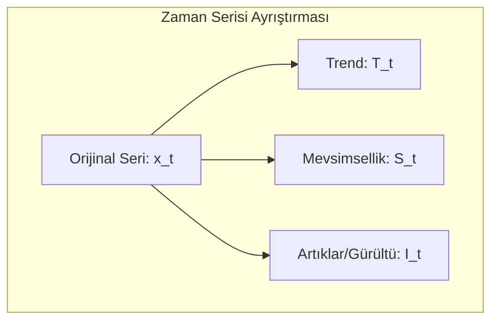
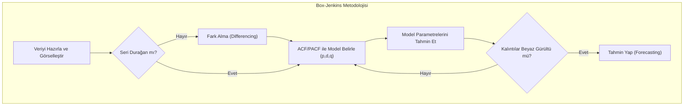

# Yapay Zeka Tabanlı Zaman Serisi ve Veri Analizi
### Ders Notları

---

## Bölüm 1: Zaman Serisi Analizine Giriş

### Zaman Serisi Nedir?

En basit tanımıyla zaman serisi, belirli bir zaman aralığında ardışık olarak gözlemlenen veri noktaları dizisidir. Box ve Jenkins’in klasik tanımına göre, “zamana bağlı olarak düzenli aralıklarla kaydedilen gözlemler dizisidir.”

Bu ne anlama geliyor? Günlük hayattan birkaç örnek verelim:
- Bir hastanedeki günlük hasta kabul sayısı.
- Bir şirketin aylık satış rakamları.
- Bir meteoroloji istasyonunda kaydedilen saatlik sıcaklık ölçümleri.
- Bir hisse senedinin dakikalık fiyat hareketleri.

Gördüğünüz gibi, zaman serisi analizi; finans, ekonomi, sağlık, mühendislik ve çevre bilimleri gibi sayısız alanda karşımıza çıkar. Peki amacımız ne? Geçmiş verilerden yola çıkarak geleceği tahmin etmek, verideki anormal durumları tespit etmek ve verinin altında yatan temel desenleri, yani yapısını ortaya çıkarmaktır.

Bu ders boyunca şu temel sorulara yanıt arayacağız:
- Verinin geçmişindeki desenler (pattern) nelerdir?
- Gelecekteki değerleri nasıl tahmin edebiliriz?
- Serideki olağan dışı değişimleri (anomalileri) nasıl tespit ederiz?
- Bir zaman serisini hangi temel bileşenler oluşturur?

---

## Bölüm 2: Zaman Serisinin Temel Kavramları ve Bileşenleri

Bir zaman serisini analiz etmeden önce, onun temel kavramlarını anlamamız şart. İşte en temel kavramlar:

- **Gözlem (Observation):** $x_t$ ile gösterilir ve $t$ anındaki veri noktasını ifade eder. Örneğin, 15. gündeki işlem sayısı $x_{15} = 120$.
- **Zaman Dizini (Time Index):** $t = 1, 2, ..., T$ şeklinde, gözlemlerin sıralandığı zaman noktalarıdır.
- **Trend:** Serideki uzun vadeli artış veya azalış eğilimidir. Bir e-ticaret sitesinin yıllık satışlarının sürekli artması pozitif bir trend örneğidir.
- **Mevsimsellik (Seasonality):** Belirli ve sabit periyotlarda (günlük, haftalık, yıllık) tekrar eden dalgalanmalardır. Yaz aylarında artan dondurma satışları klasik bir mevsimsellik örneğidir.
- **Döngüsellik (Cyclicity):** Mevsimsellik gibi periyodiktir ancak periyotları sabit değildir ve genellikle daha uzun vadelidir. Ekonomideki iş döngüleri (genişleme ve daralma dönemleri) bu duruma örnektir.
- **Durağanlık (Stationarity):** Bu, dersin en kritik kavramlarından biridir. Bir serinin ortalama, varyans gibi istatistiksel özelliklerinin zamanla değişmemesi durumudur. Bunu anlamadan modelleme yapamazsınız. Birçok klasik model, serinin durağan olmasını veya durağanlaştırılmasını gerektirir.

### Zaman Serisi Bileşenleri

Bir zaman serisini, genellikle dört ana bileşenin birleşimi olarak düşünebiliriz. Amacımız, bu bileşenleri ayrıştırarak serinin yapısını ortaya çıkarmaktır:

$$
x_t = \text{Trend}_t + \text{Mevsimsellik}_t + \text{Döngü}_t + \text{Rastgele Gürültü}_t
$$
$$
x_t = T_t + S_t + C_t + I_t
$$

- $T_t$: Trend (Uzun vadeli yön)
- $S_t$: Mevsimsellik (Sabit periyotlu dalgalanmalar)
- $C_t$: Döngü (Değişken periyotlu dalgalanmalar)
- $I_t$: Rastgele Gürültü (Açıklanamayan, öngörülemeyen dalgalanmalar)

Bu ayrıştırma işlemi, serinin yapısını anlamamızda ve doğru modeli seçmemizde bize yol gösterir.



---

## Bölüm 3: Zaman Serisi Tipleri

Analize başlamadan önce, elinizdeki verinin türünü doğru sınıflandırmanız gerekir. Çünkü her seriye aynı yöntem uygulanmaz.

1.  **Değişken Sayısına Göre:**
    *   **Tek Değişkenli (Univariate):** Tek bir değişkenin zaman içindeki değişimini inceleriz. Örnek: Sadece altın fiyatları.
    *   **Çok Değişkenli (Multivariate):** İki veya daha fazla değişkenin eş zamanlı değişimini inceleriz. Örnek: Altın fiyatları, enflasyon oranı ve faiz oranlarının birlikte analizi.

2.  **İstatistiksel Özelliklere Göre:**
    *   **Durağan (Stationary):** İstatistiksel özellikleri zamanla değişmeyen seriler.
    *   **Durağan Olmayan (Non-Stationary):** Trend veya mevsimsellik gibi nedenlerle istatistiksel özellikleri zamanla değişen seriler.

3.  **Ölçüm Zamanına Göre:**
    *   **Kesikli (Discrete-Time):** Gözlemlerin belirli zaman aralıklarında (saatlik, günlük, aylık) yapıldığı seriler. Analiz ettiğimiz serilerin büyük çoğunluğu bu tiptedir.
    *   **Sürekli (Continuous-Time):** Gözlemlerin zamanın her anında mevcut olduğu teorik seriler. EKG sinyalleri gibi.

4.  **Rastgelelik Durumuna Göre:**
    *   **Deterministik:** Gelecek değerleri hatasız tahmin edilebilen, matematiksel bir fonksiyonla ifade edilebilen seriler.
    *   **Stokastik:** Gelecek değerleri belirsizlik içeren ve rastgele bir bileşene sahip olan seriler. Gerçek dünyadaki serilerin neredeyse tamamı stokastiktir.

---

## Bölüm 4: R ile Pratiğe Giriş - Tarih ve Zaman Nesneleri

Bugün zaman serisi analizinin belki de en can sıkıcı ama en önemli konusuna gireceğiz: tarih ve zaman nesneleri. Birçok öğrenci burada takılıyor. Neden? Çünkü tarih formatları dünyada standart değil.

### Tarih Formatı Sorunsalı

Şu tarihe bir bakın: `01/02/2024`. Bu ne anlama geliyor?
- **Amerika'da:** 2 Ocak 2024 (Month/Day/Year)
- **Avrupa'da:** 1 Şubat 2024 (Day/Month/Year)
- **Japonya'da:** 2024, 1 Şubat (Year/Month/Day)

Eğer verinizi okurken bu formata dikkat etmezseniz, tüm analiziniz en başından çöp olur. Bu yüzden kendinize bir iyilik yapın ve tek bir standarda bağlı kalın: **ISO 8601 formatı (YYYY-MM-DD)**. Bu format evrenseldir, makine dostudur ve sizi gelecekteki baş ağrılarından kurtarır.

### R'da Tarih Nesneleri

R, bu format karmaşasını yönetmek için bize özel veri tipleri sunar. Bunlardan ikisini bilmek zorundasınız:
1.  **`Date`**: Sadece tarih bilgisi (gün, ay, yıl) tutar. Saatle işiniz yoksa bunu kullanın.
2.  **`POSIXct` / `POSIXlt`**: Tarih, saat ve hatta saat dilimi gibi daha detaylı bilgileri içerir. `POSIXct` daha yaygın kullanılır ve genellikle daha verimlidir.

```r
# Bugünün tarihini al
bugun <- Sys.Date()
print(bugun)
#> [1] "2024-10-26"
class(bugun)
#> [1] "Date"

# Şu anki zamanı al
simdi <- Sys.time()
print(simdi)
#> [1] "2024-10-26 15:30:00 EEST"
class(simdi)
#> [1] "POSIXct" "POSIXt"
```

Peki, elimizdeki "03/15/2024" gibi bir metni R'ın anlayacağı bir `Date` nesnesine nasıl çeviririz? `as.Date()` fonksiyonu ile. Ama bir püf noktası var: R'a hangi formatta yazdığınızı söylemeniz gerekir.

```r
# Amerikan formatı (MM/DD/YYYY)
tarih_us <- as.Date("03/15/2024", format = "%m/%d/%Y")

# Avrupa formatı (DD/MM/YYYY)
tarih_eu <- as.Date("15/03/2024", format = "%d/%m/%Y")

# Uzun format
tarih_uzun <- as.Date("15 Mart 2024", format = "%d %B %Y")
```

**Ezberlemeniz Gereken Format Kodları:**
Bu kodlar, R'a metnin hangi parçasının gün, ay veya yıl olduğunu anlatır. Bunları bilmeden ilerleyemezsiniz.
- `%Y`: 4 haneli yıl (örn: 2024)
- `%m`: Sayısal ay (01-12)
- `%B`: Tam ay ismi (örn: Ocak, February)
- `%b`: Kısa ay ismi (örn: Oca, Feb)
- `%d`: Gün (01-31)

### `lubridate` Paketi: Akıl Sağlığınız İçin

`as.Date()` ve format kodları güçlüdür ama her seferinde uğraşmak yorucu olabilir. İşte burada `lubridate` paketi devreye giriyor. Bu paket, tarih işlemlerini o kadar basitleştirir ki, bir kere kullandıktan sonra asla geri dönmek istemezsiniz.

```r
# install.packages("lubridate") # Yüklü değilse
library(lubridate)

# lubridate'ın güzelliği, format kodlarını düşünmeden tarihleri okuyabilmenizdir.
tarih1 <- ymd("2024-03-15")      # Year-Month-Day
tarih2 <- dmy("15-03-2024")      # Day-Month-Year
tarih3 <- mdy("03/15/2024")      # Month-Day-Year

# Tarihten bilgi çekmek çok kolay
year(tarih1)   # 2024
month(tarih1)  # 3
day(tarih1)    # 15
wday(tarih1, label = TRUE) # Haftanın günü (örn: "Fri")
```

### Tarih Aritmetiği ve Diziler

Tarihleri bir kere doğru formata getirdikten sonra onlarla matematiksel işlemler yapabiliriz. Bu, özellikle "30 gün sonrası" veya "iki olay arasındaki gün sayısı" gibi hesaplamalar için kritiktir. Ayrıca, analiz için baştan sona düzenli bir zaman dizini oluşturmamız gerektiğinde de hayat kurtarır.

```r
baslangic <- as.Date("2024-01-01")

# Tarihe gün, ay, yıl ekleme (lubridate ile daha kolay)
baslangic + days(30)
baslangic + months(3)
baslangic + years(1)

# İki tarih arasındaki fark
bitis <- as.Date("2024-12-31")
fark <- bitis - baslangic
print(as.numeric(fark)) # 365 gün

# Aylık bir tarih dizisi oluşturma (çok sık kullanılır)
aylik_dizi <- seq.Date(from = as.Date("2024-01-01"),
                       to = as.Date("2024-12-31"),
                       by = "month")
print(aylik_dizi)
```

---

## Bölüm 5: R'da Zaman Serisi Nesnesi: `ts`

Tarih ve zaman sorununu çözdükten sonra, veriyi R'ın analiz için kullandığı özel bir nesneye dönüştürmemiz gerekiyor: `ts` (time series) nesnesi.

Bir `ts` nesnesi iki temel bilgiyi içerir:
1.  **Veri:** Sayısal değerlerden oluşan bir vektör.
2.  **Zaman Bilgisi:** Serinin başlangıç zamanı (`start`) ve frekansı (`frequency`).

### Frekans Kavramı: Modellemeyi Doğru Yapmanın Anahtarı

Frekans, bir zaman döngüsünde kaç gözlem olduğunu belirtir. Bu parametreyi yanlış ayarlarsanız, mevsimsellik gibi önemli desenleri modelleyemezsiniz. Bu yüzden buraya çok dikkat edin.
-   **Aylık veri:** `frequency = 12`
-   **Çeyreklik veri:** `frequency = 4`
-   **Yıllık veri:** `frequency = 1`
-   **Günlük veri:** `frequency = 365` (veya 365.25)
-   **Haftalık veri:** `frequency = 52`

### `ts` Nesnesi Oluşturma ve İnceleme

```r
# Örnek: 2024 yılına ait aylık satış verisi
veri <- c(100, 105, 98, 112, 108, 115, 120, 118, 125, 130, 128, 135)

# ts nesnesi oluşturalım: 2024'ün 1. ayından başlıyor, frekansı 12
satis_ts <- ts(data = veri, start = c(2024, 1), frequency = 12)

print(satis_ts)
#>      Jan  Feb  Mar  Apr  May  Jun  Jul  Aug  Sep  Oct  Nov  Dec
#> 2024 100  105   98  112  108  115  120  118  125  130  128  135

# Gerçek bir veri seti üzerinde inceleme
# install.packages("TSstudio") # Yüklü değilse
library(TSstudio)
data(USgas) # ABD aylık doğal gaz tüketimi verisi

ts_info(USgas)
#> The USgas series is a ts object with 1 variable and 227 observations
#> Frequency: 12
#> Start time: 2000 1
#> End time: 2018 11

# Temel özelliklere erişim
start(USgas)     # Başlangıç zamanı
end(USgas)       # Bitiş zamanı
frequency(USgas) # Frekans
```

### Veri Alt Kümesi Alma: `window()`

Bir zaman serisinin belirli bir bölümünü analiz etmek için `window()` fonksiyonu kullanılır. Bu, en sık kullanacağınız fonksiyonlardan biridir.

```r
# 2010-2015 yılları arasındaki veriyi seçelim
subset_gas <- window(USgas,
                     start = c(2010, 1),
                     end = c(2015, 12))
```

---

## Bölüm 6: Veri Manipülasyonu ve Görselleştirme

Elimizde bir `ts` nesnesi var. Şimdi ne yapacağız? İlk kural: Veriyi çizin. Her zaman. Veriyi görselleştirmeden analize başlamak, gözü kapalı araba kullanmaya benzer.

### Temel Görselleştirme

`ts` nesneleri, `plot()` fonksiyonu ile doğrudan görselleştirilebilir.

```r
plot(USgas,
     main = "ABD Doğal Gaz Tüketimi (2000-2018)",
     ylab = "Milyar Kübik Fit",
     xlab = "Yıl",
     col = "blue")
grid()
```

### Zaman Serisi Manipülasyonu

- **`aggregate()`:** Yüksek frekanslı veriyi daha düşük bir frekansa toplamak için kullanılır. Örneğin, aylık veriyi yıllık toplamlara çevirebiliriz.

```r
# Aylık veriyi yıllık toplam satışlara çevirelim
USgas_yillik <- aggregate(USgas, nfrequency = 1, FUN = sum)
```

- **`lag()`:** Bir serinin gecikmeli (geçmiş) değerlerini oluşturur. Bu, modellerde "bir önceki dönemin değeri" gibi özellikleri kullanmamızı sağlar.

```r
# 1 ay önceki değeri (lag-1) ve 12 ay önceki değeri (lag-12) oluşturalım
USgas_lag1 <- stats::lag(USgas, k = -1)
USgas_lag12 <- stats::lag(USgas, k = -12)
```

- **`decompose()`:** `decompose()` fonksiyonu, seriyi bileşenlerine ayırarak size büyük resmi gösterir. Trend mi var? Mevsimsellik belirgin mi? Gürültü ne kadar? Bu soruların cevabını bu grafiklerde arayacaksınız.

```r
USgas_ayristir <- decompose(USgas)
plot(USgas_ayristir)
```
Bu komut size dört grafik sunar: orijinal veri, tahmin edilen trend, tahmin edilen mevsimsel etki ve geriye kalan rastgele gürültü.

### Keşifsel Analiz Grafikleri: ACF ve PACF

Model seçimi aşamasına geldiğimizde, iki temel grafiğe bakarak karar vereceğiz: Otokorelasyon (ACF) ve Kısmi Otokorelasyon (PACF). Bu grafikler, serinin 'hafızasını' gösterir ve doğru ARIMA modelini seçmemize yardımcı olur.

-   **ACF (Autocorrelation Function - Otokorelasyon Fonksiyonu):** $\rho_k$ ile gösterilir ve bir zaman serisinin kendi gecikmeli (lagged) değerleriyle olan korelasyonunu ölçer. ACF grafiğinde çubukların yavaşça azalması trendin varlığına, belirli aralıklarda tekrar eden yüksek çubuklar ise mevsimselliğe işaret eder.

    *   **Formül:**
        $$
        \rho_k = \frac{\text{Cov}(x_t, x_{t-k})}{\text{Var}(x_t)} = \frac{\sum_{t=k+1}^{T} (x_t - \bar{x})(x_{t-k} - \bar{x})}{\sum_{t=1}^{T} (x_t - \bar{x})^2}
        $$

    *   **Python ile ACF Hesabı:**
        ```python
        from statsmodels.tsa.stattools import acf
        import numpy as np

        # Örnek veri
        data = np.array([20, 22, 21, 23, 24])
        
        # ACF hesapla
        acf_values = acf(data, nlags=2)
        print("Lag-1 ACF:", acf_values[1])
        ```

    *   **R ile ACF Hesabı:**
        ```r
        # Örnek veri
        data <- c(20, 22, 21, 23, 24)
        
        # ACF hesapla
        acf_result <- acf(data, plot = FALSE)
        print(paste("Lag-1 ACF:", acf_result$acf[2]))
        ```
    *   **Örnek Hesaplama (ACF Lag-1):**
        Diyelim ki elimizde 5 günlük sıcaklık verisi var: $x = [20, 22, 21, 23, 24]$.
        1.  Ortalama: $\bar{x} = (20 + 22 + 21 + 23 + 24)/5 = 22$
        2.  Pay (kovaryans):
            - $(22-22)(20-22) = 0 \times -2 = 0$
            - $(21-22)(22-22) = -1 \times 0 = 0$
            - $(23-22)(21-22) = 1 \times -1 = -1$
            - $(24-22)(23-22) = 2 \times 1 = 2$
            - Toplam pay: $0 + 0 + (-1) + 2 = 1$
        3.  Payda (varyans):
            - $(20-22)^2 + (22-22)^2 + (21-22)^2 + (23-22)^2 + (24-22)^2 = (-2)^2 + 0^2 + (-1)^2 + 1^2 + 2^2 = 4 + 0 + 1 + 1 + 4 = 10$
        4.  $\rho_1 = 1 / 10 = 0.1$


-   **PACF (Partial Autocorrelation Function - Kısmi Otokorelasyon Fonksiyonu):** ACF, bir serinin geçmişiyle olan genel ilişkisini gösterirken, PACF daha incelikli bir analiz sunar. İki zaman noktası arasındaki *doğrudan* ilişkiyi, aradaki diğer noktaların dolaylı etkisini ortadan kaldırarak ölçer.
    -   **Kavramsal Anlatım:** Şöyle düşünelim: Dünkü hava sıcaklığı ($x_{t-2}$) bugünkü sıcaklığı ($x_{t-1}$) etkiler, bugünkü sıcaklık da yarınki sıcaklığı ($x_t$) etkiler. Bu bir zincirleme reaksiyon gibidir. ACF, bu zincir nedeniyle $x_{t-2}$ ve $x_t$ arasında bir ilişki bulacaktır. PACF ise bu zincirin aracı halkasını (yani $x_{t-1}$'in etkisini) matematiksel olarak hesaptan çıkarır ve sorar: "$x_{t-2}$'nin, $x_t$ üzerinde doğrudan, saf bir etkisi var mı?" Bu, bir olayın kök nedenini aramak gibidir.
    -   **Kavramsal Gösterim:**
    ```mermaid
    graph TD
    subgraph "PACF Hesabı (k=2 için kavramsal gösterim)"
    direction LR
    X_t_2["x_t-2"] -->|"Doğrudan İlişki (PACF'in Ölçtüğü)"| X_t["x_t"]
    X_t_1["x_t-1"] -.->|"Dolaylı Etki (Filtrelenir)"| X_t
    X_t_2 -.->|"Dolaylı Etki (Filtrelenir)"| X_t_1
    end
    ```
    -   **PACF Notasyonu:** $\phi_{kk}$ ile gösterilir.

    *   **Önemi:** İki zaman noktası arasındaki doğrudan ilişkiyi ölçtüğü için ARIMA modellerinde AR teriminin derecesini (p) belirlemede kullanılır.
    *   **Hesaplama:** PACF, bir dizi otoregresif modelin son katsayısı ($\phi_{kk}$) olarak hesaplanır:
        $$
        x_t = \sum_{i=1}^k \phi_{ki}x_{t-i} + \epsilon_t
        $$
    *   **Kod Örnekleri:**
        *   **Python ile PACF:**
        ```python
        from statsmodels.tsa.stattools import pacf
        import numpy as np
        
        data = np.array([20, 22, 21, 23, 24])
        pacf_values = pacf(data, nlags=2)
        print(f"Lag-2 PACF: {pacf_values[2]:.3f}")
        ```
        
        *   **R ile PACF:**
        ```r
        data <- c(20, 22, 21, 23, 24)
        pacf_result <- pacf(data, plot = FALSE)
        cat("Lag-2 PACF:", round(pacf_result$acf[2], 3))
        ```

```r
# USgas verisinin ACF ve PACF grafiklerini çizelim
par(mfrow = c(2, 1)) # Grafikleri alt alta göstermek için
acf(USgas, main = "Otokorelasyon Fonksiyonu (ACF)")
pacf(USgas, main = "Kısmi Otokorelasyon Fonksiyonu (PACF)")
```

### R'da Zaman Serisi Veri Manipülasyonu ve Ayrıştırma

R, zaman serisi verilerini işlemek, dönüştürmek ve ayrıştırmak için güçlü fonksiyonlar sunar.

#### `aggregate()` - Zaman Serisini Toparlama

Aylık, günlük gibi yüksek frekanslı verileri daha düşük frekanslı verilere (çeyreklik, yıllık) dönüştürmek için `aggregate()` fonksiyonu kullanılır.

```r
# Aylık veriyi yıllığa çevir ve toplamını al
USgas_yillik <- aggregate(USgas,
                          nfrequency = 1,
                          FUN = sum)
print(USgas_yillik)
```

#### `lag()` - Gecikmeli Değerler

Zaman serisi analizinde bir önceki zaman dilimindeki değerler (gecikmeli değerler - lagged values) önemli bir rol oynar. `stats::lag()` fonksiyonu bu değerleri hesaplamak için kullanılır.

```r
# 12. lag (1 yıl önceki değer, aylık veri için)
USgas_lag12 <- stats::lag(USgas, k = -12)

# Orijinal seri ile gecikmeli değerleri karşılaştırma
head(cbind(USgas, USgas_lag12), 15)
```

#### `decompose()` - Zaman Serisini Ayrıştırma

`decompose()` fonksiyonu, bir zaman serisini trend, mevsimsellik ve rastgele bileşenlerine ayırmak için kullanılır. Bu ayrıştırma, verinin altında yatan yapıları anlayarak daha iyi analizler yapmamıza olanak tanır.

```r
# USgas serisini ayrıştır
USgas_ayristir <- decompose(USgas)

# Ayrıştırılmış bileşenleri görselleştir
plot(USgas_ayristir)
```

#### `dplyr` ile Veri İşleme

Gerçek dünya verileri genellikle `data.frame` formatında gelir ve zaman serisi analizi öncesinde düzenleme gerektirebilir. `dplyr` ve `lubridate` paketleri bu konuda oldukça yardımcıdır.

```r
library(dplyr)
library(lubridate)

# Günlük satış verisi oluşturma
df <- data.frame(
  tarih = seq.Date(as.Date("2023-01-01"), by = "day", length.out = 365),
  satis = rnorm(365, 1000, 100)
)

# Günlük veriyi aylık toplam satışa dönüştürme
aylik_satis <- df %>%
  mutate(ay = floor_date(tarih, "month")) %>% # Her tarihi ayın başına yuvarla
  group_by(ay) %>% # Ay bazında grupla
  summarise(
    toplam_satis = sum(satis)
  )

print(aylik_satis)
```

#### Gelişmiş Görselleştirme (`ggplot2`)

`ggplot2` paketi, R'da profesyonel ve özelleştirilebilir zaman serisi grafikleri oluşturmak için kullanılır. `ts` nesnelerini `ggplot2` ile kullanmak için önce `data.frame` formatına çevirmek gerekir.

```r
library(ggplot2)

# USgas ts nesnesini data.frame'e dönüştür
df_gg <- data.frame(
  tarih = as.Date(time(USgas)), # Zaman indeksini tarihe çevir
  deger = as.numeric(USgas)     # ts değerlerini sayısal vektöre çevir
)

# Profesyonel bir zaman serisi grafiği oluştur
ggplot(df_gg, aes(x = tarih, y = deger)) +
  geom_line(color = "blue", size = 0.8) +
  geom_smooth(method = "loess", color = "red", se = FALSE, linetype = "dashed") + # Trend çizgisi ekle
  labs(title = "ABD Doğal Gaz Tüketimi (2000-2018)",
       subtitle = "ggplot2 ile Gelişmiş Görselleştirme",
       x = "Tarih",
       y = "Milyar Kübik Fit") +
  theme_minimal()
```

---

## Bölüm 7: Zaman Serisi Modellemesine Genel Bakış

Verimizi anladıktan, temizledikten ve görselleştirdikten sonra modelleme aşamasına geçebiliriz.

### 1. Klasik İstatistiksel Modeller

Bu modeller genellikle serinin durağan olmasını gerektirir ve istatistiksel varsayımlara dayanır.

-   **Hareketli Ortalama (Moving Average - MA):** Serideki rastgele gürültüyü veya kısa vadeli dalgalanmaları yumuşatarak ana eğilimi (trendi) daha net görmeyi sağlar. **Üstel Ağırlıklı Hareketli Ortalama (Exponential Moving Average - EMA)** yakın geçmişteki verilere daha fazla ağırlık vererek yeni bilgilere daha hızlı adapte olur.
    $$
    \text{EMA}_t = \alpha \cdot x_t + (1 - \alpha) \cdot \text{EMA}_{t-1}
    $$
-   **ARIMA (Autoregressive Integrated Moving Average) Modeli:** Durağan olmayan zaman serilerini modellemek için en yaygın kullanılan istatistiksel yöntemlerden biridir.
    -   **AR (Autoregressive - p):** Model, değişkenin geçmiş değerlerine bağlıdır.
    -   **I (Integrated - d):** Seriyi durağan hale getirmek için fark alma (differencing) işlemi sayısıdır.
    -   **MA (Moving Average - q):** Model, geçmiş tahmin hatalarına bağlıdır.
    -   Mevsimsellik içeren seriler için **SARIMA** (Mevsimsel ARIMA) kullanılır.



### 2. Yapay Zeka ile Zaman Serisi Analizi

Klasik istatistiksel modellerin varsayımlarını karşılamayan karmaşık ve doğrusal olmayan ilişkileri modellemek için yapay zeka yöntemleri giderek daha fazla kullanılmaktadır.

-   **Makine Öğrenmesi (Machine Learning):**
    *   **Yaklaşım:** Zaman serisi problemi, denetimli bir öğrenme problemine dönüştürülür. Geçmiş değerler (örn: $x_{t-1}, x_{t-2}, ...$) girdi (özellik), gelecekteki değer ($x_t$) ise çıktı (hedef) olarak kullanılır.
    *   **Örnek:** Bir mağazanın günlük müşteri sayısını tahmin etmek için Gradient Boosting veya Random Forest gibi modeller kullanılabilir. Girdi özellikleri olarak geçmiş müşteri sayıları (lag features), haftanın günü, ay, tatil olup olmadığı gibi takvim özellikleri ve promosyon bilgileri verilebilir.
-   **Derin Öğrenme (Deep Learning):**
    *   **LSTM (Long Short-Term Memory) ve GRU (Gated Recurrent Unit):** Bu tekrarlayan sinir ağı (RNN) mimarileri, zaman serilerindeki uzun vadeli bağımlılıkları öğrenmek için tasarlanmıştır. Standart RNN'lerin karşılaştığı "kaybolan gradyan" (vanishing gradient) sorununu, "kapı" (gate) mekanizmaları sayesinde aşarlar (Hochreiter & Schmidhuber, 1997).
    *   **Transformer Modelleri:** Başlangıçta doğal dil işleme için geliştirilen "dikkat mekanizması" (attention mechanism) tabanlı bu modeller, zaman serisi tahmininde de son derece başarılı sonuçlar vermektedir. Özellikle çok uzun serilerdeki bağımlılıkları yakalamada LSTM'den daha etkili olabilirler.

    **LSTM Hücresinin Kavramsal Çalışması:**
    ```mermaid
    graph TD
        subgraph "LSTM Hücresi"
            direction LR
            C_prev[Önceki Hücre Durumu c_t-1] --> ForgetGate{Unutma Kapısı};
            Input[Girdi x_t] --> ForgetGate;
            H_prev[Önceki Gizli Durum h_t-1] --> ForgetGate;

            Input --> InputGate{Giriş Kapısı};
            H_prev --> InputGate;

            ForgetGate -- Karar: Neyi Unut? --> CellStateUpdate(Hücre Durumunu Güncelle);
            InputGate -- Karar: Neyi Ekle? --> CellStateUpdate;
            CellStateUpdate --> C_next[Yeni Hücre Durumu c_t];

            C_next --> OutputGate{Çıkış Kapısı};
            Input --> OutputGate;
            H_prev --> OutputGate;
            OutputGate -- Karar: Neyi Çıktı Ver? --> H_next[Yeni Gizli Durum h_t];
        end
        C_prev --> C_next;
    ```

---

