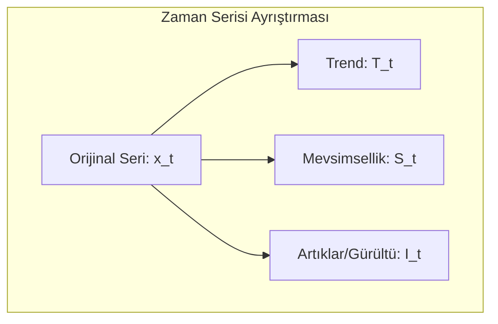
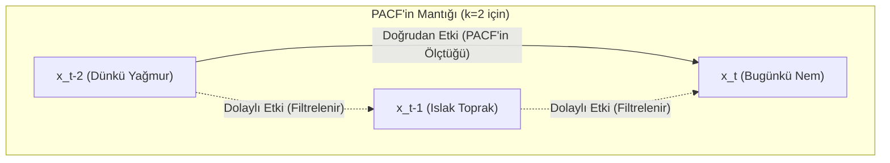
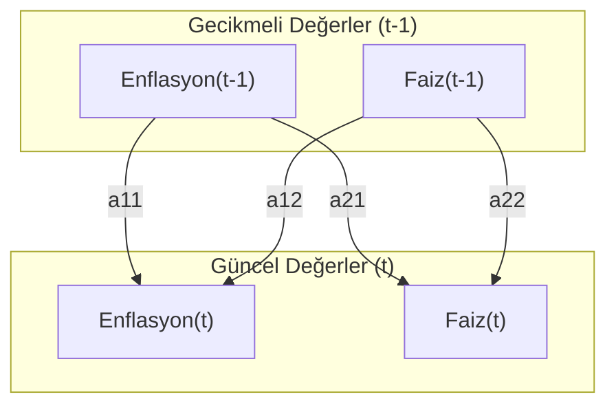
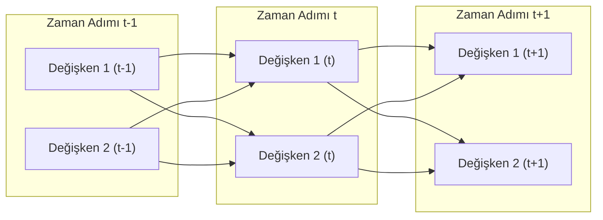
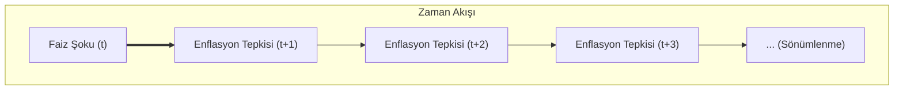

# Yapay Zeka Tabanlı Zaman Serisi ve Veri Analizi

### Ders Notları

---

## 1. Zaman Serisi Analizine Giriş

### 1.1. Zaman Serisi Nedir?

En basit tanımıyla zaman serisi, belirli bir zaman aralığında ardışık olarak gözlemlenen veri noktaları dizisidir. Box ve Jenkins’in klasik tanımına göre, “zamana bağlı olarak düzenli aralıklarla kaydedilen gözlemler dizisidir.”

Bu ne anlama geliyor? Günlük hayattan birkaç örnek verelim:

- Bir hastanedeki günlük hasta kabul sayısı.
- Bir şirketin aylık satış rakamları.
- Bir meteoroloji istasyonunda kaydedilen saatlik sıcaklık ölçümleri.
- Bir hisse senedinin dakikalık fiyat hareketleri.

Gördüğünüz gibi, zaman serisi analizi; finans, ekonomi, sağlık, mühendislik ve çevre bilimleri gibi sayısız alanda karşımıza çıkar. Peki amacımız ne? Geçmiş verilerden yola çıkarak geleceği tahmin etmek, verideki anormal durumları tespit etmek ve verinin altında yatan temel desenleri, yani yapısını ortaya çıkarmaktır.

Bu ders boyunca şu temel sorulara yanıt arayacağız:

- Verinin geçmişindeki desenler (pattern) nelerdir?
- Gelecekteki değerleri nasıl tahmin edebiliriz?
- Serideki olağan dışı değişimleri (anomalileri) nasıl tespit ederiz?
- Bir zaman serisini hangi temel bileşenler oluşturur?

---

## 2. Zaman Serisinin Temel Kavramları ve Bileşenleri

Bir zaman serisini analiz etmeden önce, onun temel kavramlarını anlamamız şart. İşte en temel kavramlar:

- **Gözlem (Observation):** $x_t$ ile gösterilir ve $t$ anındaki veri noktasını ifade eder. Örneğin, 15. gündeki işlem sayısı $x_{15} = 120$.
- **Zaman Dizini (Time Index):** $t = 1, 2, ..., T$ şeklinde, gözlemlerin sıralandığı zaman noktalarıdır.
- **Trend:** Serideki uzun vadeli artış veya azalış eğilimidir. Bir e-ticaret sitesinin yıllık satışlarının sürekli artması pozitif bir trend örneğidir.
- **Mevsimsellik (Seasonality):** Belirli ve sabit periyotlarda (günlük, haftalık, yıllık) tekrar eden dalgalanmalardır. Yaz aylarında artan dondurma satışları klasik bir mevsimsellik örneğidir.
- **Döngüsellik (Cyclicity):** Mevsimsellik gibi periyodiktir ancak periyotları sabit değildir ve genellikle daha uzun vadelidir. Ekonomideki iş döngüleri (genişleme ve daralma dönemleri) bu duruma örnektir.
- **Durağanlık (Stationarity):** Bu, dersin en kritik kavramlarından biridir. Bir serinin ortalama, varyans gibi istatistiksel özelliklerinin zamanla değişmemesi durumudur. Bunu anlamadan modelleme yapamazsınız. Birçok klasik model, serinin durağan olmasını veya durağanlaştırılmasını gerektirir.

### 2.1. Zaman Serisi Bileşenleri

Bir zaman serisini, genellikle dört ana bileşenin birleşimi olarak düşünebiliriz. Amacımız, bu bileşenleri ayrıştırarak serinin yapısını ortaya çıkarmaktır:

$$
x_t = \text{Trend}_t + \text{Mevsimsellik}_t + \text{Döngü}_t + \text{Rastgele Gürültü}_t
$$
$$
x_t = T_t + S_t + C_t + I_t
$$

- $T_t$: Trend (Uzun vadeli yön)
- $S_t$: Mevsimsellik (Sabit periyotlu dalgalanmalar)
- $C_t$: Döngü (Değişken periyotlu dalgalanmalar)
- $I_t$: Rastgele Gürültü (Açıklanamayan, öngörülemeyen dalgalanmalar)

Bu ayrıştırma işlemi, serinin yapısını anlamamızda ve doğru modeli seçmemizde bize yol gösterir.



---

## 3. Zaman Serisi Tipleri

Analize başlamadan önce, elinizdeki verinin türünü doğru sınıflandırmanız gerekir. Çünkü her seriye aynı yöntem uygulanmaz.

1.  **Değişken Sayısına Göre:**
    - **Tek Değişkenli (Univariate):** Tek bir değişkenin zaman içindeki değişimini inceleriz. Örnek: Sadece altın fiyatları.
    - **Çok Değişkenli (Multivariate):** İki veya daha fazla değişkenin eş zamanlı değişimini inceleriz. Örnek: Altın fiyatları, enflasyon oranı ve faiz oranlarının birlikte analizi.

2.  **İstatistiksel Özelliklere Göre:**
    - **Durağan (Stationary):** İstatistiksel özellikleri zamanla değişmeyen seriler.
    - **Durağan Olmayan (Non-Stationary):** Trend veya mevsimsellik gibi nedenlerle istatistiksel özellikleri zamanla değişen seriler.

3.  **Ölçüm Zamanına Göre:**
    - **Kesikli (Discrete-Time):** Gözlemlerin belirli zaman aralıklarında (saatlik, günlük, aylık) yapıldığı seriler. Analiz ettiğimiz serilerin büyük çoğunluğu bu tiptedir.
    - **Sürekli (Continuous-Time):** Gözlemlerin zamanın her anında mevcut olduğu teorik seriler. EKG sinyalleri gibi.

4.  **Rastgelelik Durumuna Göre:**
    - **Deterministik:** Gelecek değerleri hatasız tahmin edilebilen, matematiksel bir fonksiyonla ifade edilebilen seriler.
    - **Stokastik:** Gelecek değerleri belirsizlik içeren ve rastgele bir bileşene sahip olan seriler. Gerçek dünyadaki serilerin neredeyse tamamı stokastiktir.

---

## 4. R ile Pratiğe Giriş - Tarih ve Zaman Nesneleri

Bugün zaman serisi analizinin belki de en can sıkıcı ama en önemli konusuna gireceğiz: tarih ve zaman nesneleri. Birçok öğrenci burada takılıyor. Neden? Çünkü tarih formatları dünyada standart değil.

### 4.1. Tarih Formatı Sorunsalı

Şu tarihe bir bakın: `01/02/2024`. Bu ne anlama geliyor?

- **Amerika'da:** 2 Ocak 2024 (Month/Day/Year)
- **Avrupa'da:** 1 Şubat 2024 (Day/Month/Year)
- **Japonya'da:** 2024, 1 Şubat (Year/Month/Day)

Eğer verinizi okurken bu formata dikkat etmezseniz, tüm analiziniz en başından çöp olur. Bu yüzden kendinize bir iyilik yapın ve tek bir standarda bağlı kalın: **ISO 8601 formatı (YYYY-MM-DD)**. Bu format evrenseldir, makine dostudur ve sizi gelecekteki baş ağrılarından kurtarır.

### 4.2. R'da Tarih Nesneleri

R, bu format karmaşasını yönetmek için bize özel veri tipleri sunar. Bunlardan ikisini bilmek zorundasınız:

1.  **`Date`**: Sadece tarih bilgisi (gün, ay, yıl) tutar. Saatle işiniz yoksa bunu kullanın.
2.  **`POSIXct` / `POSIXlt`**: Tarih, saat ve hatta saat dilimi gibi daha detaylı bilgileri içerir. `POSIXct` daha yaygın kullanılır ve genellikle daha verimlidir.

```r
# Bugünün tarihini al
bugun <- Sys.Date()
print(bugun)
#> [1] "2024-10-26"
class(bugun)
#> [1] "Date"

# Şu anki zamanı al
simdi <- Sys.time()
print(simdi)
#> [1] "2024-10-26 15:30:00 EEST"
class(simdi)
#> [1] "POSIXct" "POSIXt"
```

Peki, elimizdeki "03/15/2024" gibi bir metni R'ın anlayacağı bir `Date` nesnesine nasıl çeviririz? `as.Date()` fonksiyonu ile. Ama bir püf noktası var: R'a hangi formatta yazdığınızı söylemeniz gerekir.

```r
# Amerikan formatı (MM/DD/YYYY)
tarih_us <- as.Date("03/15/2024", format = "%m/%d/%Y")

# Avrupa formatı (DD/MM/YYYY)
tarih_eu <- as.Date("15/03/2024", format = "%d/%m/%Y")

# Uzun format
tarih_uzun <- as.Date("15 Mart 2024", format = "%d %B %Y")
```

**Ezberlemeniz Gereken Format Kodları:**
Bu kodlar, R'a metnin hangi parçasının gün, ay veya yıl olduğunu anlatır. Bunları bilmeden ilerleyemezsiniz.

- `%Y`: 4 haneli yıl (örn: 2024)
- `%m`: Sayısal ay (01-12)
- `%B`: Tam ay ismi (örn: Ocak, February)
- `%b`: Kısa ay ismi (örn: Oca, Feb)
- `%d`: Gün (01-31)

### 4.3. `lubridate` Paketi: Akıl Sağlığınız İçin

`as.Date()` ve format kodları güçlüdür ama her seferinde uğraşmak yorucu olabilir. İşte burada `lubridate` paketi devreye giriyor. Bu paket, tarih işlemlerini o kadar basitleştirir ki, bir kere kullandıktan sonra asla geri dönmek istemezsiniz.

```r
# install.packages("lubridate") # Yüklü değilse
library(lubridate)

# lubridate'ın güzelliği, format kodlarını düşünmeden tarihleri okuyabilmenizdir.
tarih1 <- ymd("2024-03-15")      # Year-Month-Day
tarih2 <- dmy("15-03-2024")      # Day-Month-Year
tarih3 <- mdy("03/15/2024")      # Month-Day-Year

# Tarihten bilgi çekmek çok kolay
year(tarih1)   # 2024
month(tarih1)  # 3
day(tarih1)    # 15
wday(tarih1, label = TRUE) # Haftanın günü (örn: "Fri")
```

### 4.4. Tarih Aritmetiği ve Diziler

Tarihleri bir kere doğru formata getirdikten sonra onlarla matematiksel işlemler yapabiliriz. Bu, özellikle "30 gün sonrası" veya "iki olay arasındaki gün sayısı" gibi hesaplamalar için kritiktir. Ayrıca, analiz için baştan sona düzenli bir zaman dizini oluşturmamız gerektiğinde de hayat kurtarır.

```r
baslangic <- as.Date("2024-01-01")

# Tarihe gün, ay, yıl ekleme (lubridate ile daha kolay)
baslangic + days(30)
baslangic + months(3)
baslangic + years(1)

# İki tarih arasındaki fark
bitis <- as.Date("2024-12-31")
fark <- bitis - baslangic
print(as.numeric(fark)) # 365 gün

# Aylık bir tarih dizisi oluşturma (çok sık kullanılır)
aylik_dizi <- seq.Date(from = as.Date("2024-01-01"),
                       to = as.Date("2024-12-31"),
                       by = "month")
print(aylik_dizi)
```

---

## 5. R'da Zaman Serisi Nesnesi: `ts`

Tarih ve zaman sorununu çözdükten sonra, veriyi R'ın analiz için kullandığı özel bir nesneye dönüştürmemiz gerekiyor: `ts` (time series) nesnesi.

Bir `ts` nesnesi iki temel bilgiyi içerir:

1.  **Veri:** Sayısal değerlerden oluşan bir vektör.
2.  **Zaman Bilgisi:** Serinin başlangıç zamanı (`start`) ve frekansı (`frequency`).

### 5.1. Frekans Kavramı: Modellemeyi Doğru Yapmanın Anahtarı

Frekans, bir zaman döngüsünde kaç gözlem olduğunu belirtir. Bu parametreyi yanlış ayarlarsanız, mevsimsellik gibi önemli desenleri modelleyemezsiniz. Bu yüzden buraya çok dikkat edin.

- **Aylık veri:** `frequency = 12`
- **Çeyreklik veri:** `frequency = 4`
- **Yıllık veri:** `frequency = 1`
- **Günlük veri:** `frequency = 365` (veya 365.25)
- **Haftalık veri:** `frequency = 52`

### 5.2. `ts` Nesnesi Oluşturma ve İnceleme

```r
# Örnek 1: Manuel Veri ile ts Nesnesi Oluşturma
# 2024 yılına ait aylık satış verisi
veri <- c(100, 105, 98, 112, 108, 115, 120, 118, 125, 130, 128, 135)

# ts nesnesi oluşturalım: 2024'ün 1. ayından başlıyor, frekansı 12
satis_ts <- ts(data = veri, start = c(2024, 1), frequency = 12)

print(satis_ts)
#>      Jan  Feb  Mar  Apr  May  Jun  Jul  Aug  Sep  Oct  Nov  Dec
#> 2024 100  105   98  112  108  115  120  118  125  130  128  135

# Örnek 2: Paketten Gelen Veri Seti (USgas)
# install.packages("TSstudio") # Yüklü değilse
library(TSstudio)
data(USgas) # ABD aylık doğal gaz tüketimi verisi

ts_info(USgas)
#> The USgas series is a ts object with 1 variable and 227 observations
#> Frequency: 12
#> Start time: 2000 1
#> End time: 2018 11

# Temel özelliklere erişim
start(USgas)     # Başlangıç zamanı
end(USgas)       # Bitiş zamanı
frequency(USgas) # Frekans

# Örnek 3: R'ın Dahili Veri Seti (AirPassengers)
# Bu veri seti, 1949-1960 yılları arasındaki aylık uluslararası havayolu yolcu sayılarını içerir.
data(AirPassengers)

# Veriyi ve yapısını inceleyelim
print(AirPassengers)
class(AirPassengers) # Zaten 'ts' formatında olduğunu görebiliriz

# ts nesnesinin özelliklerini kontrol edelim
start(AirPassengers)     # Başlangıç: [1] 1949    1
end(AirPassengers)       # Bitiş:   [1] 1960   12
frequency(AirPassengers) # Frekans: [1] 12 (aylık veri)
cycle(AirPassengers)     # Her bir gözlemin döngüdeki yerini gösterir (1'den 12'ye kadar)

# AirPassengers veri setini görselleştirelim
# Grafikte hem artan bir trend (yıllar içinde yolcu sayısının artması)
# hem de belirgin bir mevsimsellik (her yıl yaz aylarında zirve yapması) görüyoruz.
plot(AirPassengers,
    main = "Aylık Uluslararası Havayolu Yolcu Sayıları (1949-1960)",
    ylab = "Yolcu Sayısı (Bin)",
    xlab = "Yıl",
    col = "darkblue")
grid()
```

### 5.3. `ts` Nesnesinin Ötesi: `xts` ile Gerçek Dünya Verileri

Gençler, şimdiye kadar gördüğümüz `ts` nesnesi, ders kitaplarındaki gibi düzenli aralıklı veriler (aylık, yıllık) için uygundur. Ancak gerçek dünya verileri nadiren bu kadar düzenlidir. Hafta sonları işlem görmeyen borsa verilerini veya bazen kesintiye uğrayan saniyelik sensör kayıtlarını düşünün. `ts` nesnesinin sabit frekans yapısı bu gibi durumlarda yetersiz kalır.

İşte bu noktada, R'ın zaman serisi analizindeki en güçlü paketlerinden biri olan `xts` (eXtensible Time Series) devreye giriyor. `xts`, `zoo` paketi üzerine inşa edilmiştir ve her bir gözlemi kendi hassas zaman damgasıyla eşleştirir. Bu sayede düzensiz ve yüksek frekanslı verilerle çalışmak son derece kolaylaşır.

`xts`'in temel gücü, bir zaman indeksine sahip bir matris olmasıdır. Bu yapı, onu hem çok hızlı yapar hem de veriyi zaman bazlı olarak filtreleme ve manipüle etme konusunda inanılmaz bir esneklik sunar.

```r
# Gerekli paketleri yükleyelim ve çağıralım
# install.packages("xts") # Yüklü değilse
library(xts)

# Düzensiz aralıklı bir veri oluşturalım (hafta sonları atlanmış)
degerler <- c(101, 103, 102, 105, 104)
tarihler <- as.Date(c("2024-01-22", "2024-01-23", "2024-01-24", "2024-01-25", "2024-01-26"))

# xts nesnesi oluşturalım
veri_xts <- xts(x = degerler, order.by = tarihler)

print(veri_xts)
#>            [,1]
#> 2024-01-22  101
#> 2024-01-23  103
#> 2024-01-24  102
#> 2024-01-25  105
#> 2024-01-26  104
```

#### 5.3.1. `xts`'in Gücü: Sezgisel Filtreleme ve Manipülasyon

`xts`'in en büyük avantajlarından biri, tarih bazlı alt kümelemenin çok kolay olmasıdır. ISO 8601 formatında (`YYYY-MM-DD`) metinler kullanarak verinin istediğiniz bölümünü rahatça seçebilirsiniz.

```r
# Belirli bir tarih aralığını seçmek
veri_xts["2024-01-23/2024-01-25"]

# Sadece belirli bir ayı veya yılı seçmek
# veri_xts["2024-01"] # Ocak ayının tamamı
# veri_xts["2024"]    # 2024 yılının tamamı
```

`xts`'in bir diğer güçlü özelliği ise veriyi farklı zaman periyotlarına kolayca dönüştürebilmesidir. Örneğin, günlük veriden haftalık veya aylık özetler çıkarmak son derece basittir.

```r
# Günlük veriden haftalık verilere geçelim
# to.period() fonksiyonu, açılış, en yüksek, en düşük ve kapanış (OHLC) değerlerini otomatik olarak hesaplar
haftalik_veri <- to.period(veri_xts, period = "weeks")
print(haftalik_veri)
#>            veri_xts.Open veri_xts.High veri_xts.Low veri_xts.Close
#> 2024-01-26           101           105          101            104

# Aylık ortalamaları hesaplayalım
aylik_ortalama <- apply.monthly(veri_xts, FUN = mean)
print(aylik_ortalama)
#>            [,1]
#> 2024-01-26  103
```

Özetle, elinizdeki veri düzenli aralıklı ve klasik bir zaman serisi ise `ts` nesnesi işinizi görecektir. Ancak düzensiz, yüksek frekanslı veya üzerinde karmaşık tarih/saat manipülasyonları yapmanız gereken bir veriyle çalışıyorsanız, `xts` sizin için doğru ve daha güçlü bir araçtır.

### 5.4. Pratik `lubridate` Örnekleri

`lubridate` paketinin gücünü birkaç pratik örnekle görelim.

#### 5.4.1. Örnek 1: Kaç Gündür Hayattasınız?

Örneğin (`2021-06-29`) tarihini sembolik olarak kullanabiliriz. Bu tarih ile bugün arasındaki farkı hesaplayarak kaç gün geçtiğini ve kaç kış gördüğümüzü bulalım.

```r
library(lubridate)

# Sembolik doğum günü ve bugün
ben_dogum <- ymd("2021-06-29")
bugun <- today()

# Kaç gün geçti?
yasanan_gun_sayisi <- bugun - ben_dogum
cat("Bent", as.numeric(yasanan_gun_sayisi), "gündür hayatta.\n")

# Kaç kış gördü? (Yaşı yıl olarak hesaplayarak basit bir yaklaşım)
yas_araligi <- interval(ben_dogum, bugun)
gorulen_kis_sayisi <- yas_araligi %/% years(1)
cat("Ben", gorulen_kis_sayisi, "kış gördüm.\n")
```

#### 5.4.2. Örnek 2: Atatürk Kaç Gün Yaşadı ve Hangi Gün Vefat Etti?

Tarihi kişiliklerin yaşam sürelerini ve önemli günlerini `lubridate` ile kolayca analiz edebiliriz. Atatürk'ün doğum günü olarak 19 Mayıs 1881'i kabul edelim.

```r
library(lubridate)

# Atatürk'ün doğum ve vefat tarihleri
ataturk_dogum <- ymd("1881-05-19")
ataturk_vefat <- ymd("1938-11-10")

# Toplam yaşadığı gün sayısı
yasadigi_gun <- ataturk_vefat - ataturk_dogum
cat("Mustafa Kemal Atatürk", as.numeric(yasadigi_gun), "gün yaşamıştır.\n")

# Vefat ettiği günün adı
# Not: Sistemin dil ayarlarına göre sonuç değişebilir.
vefat_gunu <- wday(ataturk_vefat, label = TRUE, abbr = FALSE)
cat("Vefat ettiği gün:", as.character(vefat_gunu), "\n")
```

#### 5.4.3. Örnek 3: Toplam Kaç Saat Yaşadınız?

Daha hassas hesaplamalar için tarihle birlikte saati de kullanmamız gerekir. `ymd_hms()` fonksiyonu ile `POSIXct` türünde bir nesne oluşturup şimdiki zamandan çıkararak toplam yaşanılan saati bulabiliriz.

```r
library(lubridate)

# Örnek bir doğum tarihi ve saati
dogum_zamani <- ymd_hms("1995-04-23 14:30:00")

# Şimdiki zaman
simdi <- now()

# İki zaman arasındaki farkı saat cinsinden hesaplama
yasanan_saat <- as.numeric(simdi - dogum_zamani, units = "hours")

cat("1995-04-23 14:30'da doğan bir kişi, yaklaşık olarak",
    round(yasanan_saat), "saattir hayattadır.\n")
```

### 5.5. Veri Alt Kümesi Alma: `window()`

Bir zaman serisinin belirli bir bölümünü analiz etmek için `window()` fonksiyonu kullanılır. Bu, en sık kullanacağınız fonksiyonlardan biridir.

```r
# 2010-2015 yılları arasındaki veriyi seçelim
subset_gas <- window(USgas,
                     start = c(2010, 1),
                     end = c(2015, 12))
```

---

## 6. Veri Manipülasyonu ve Görselleştirme

Elimizde bir `ts` nesnesi var. Şimdi ne yapacağız? İlk kural: Veriyi çizin. Her zaman. Veriyi görselleştirmeden analize başlamak, gözü kapalı araba kullanmaya benzer.

### 6.1. Temel Görselleştirme

`ts` nesneleri, `plot()` fonksiyonu ile doğrudan görselleştirilebilir.

```r
plot(USgas,
     main = "ABD Doğal Gaz Tüketimi (2000-2018)",
     ylab = "Milyar Kübik Fit",
     xlab = "Yıl",
     col = "blue")
grid()
```

### 6.2. Zaman Serisi Manipülasyonu

- **`aggregate()`:** Yüksek frekanslı veriyi daha düşük bir frekansa toplamak için kullanılır. Örneğin, aylık veriyi yıllık toplamlara çevirebiliriz.

```r
# Aylık veriyi yıllık toplam satışlara çevirelim
USgas_yillik <- aggregate(USgas, nfrequency = 1, FUN = sum)
```

- **`lag()`:** Şimdi, zaman serisi analizinin en temel fikirlerinden birine gelelim: gecikmeli değerler. Şöyle düşünelim: Bugünkü hava sıcaklığını tahmin etmeye çalışırken, aklınıza ilk gelen verilerden biri dünkü sıcaklık olmaz mıydı? Ya da bu ayki satışları değerlendirirken, geçen ayın satışlarıyla veya daha da önemlisi, geçen yılın aynı ayındaki satışlarla karşılaştırmak istemez miydiniz? İşte bu "bir önceki değer" veya "geçen yılki değer" kavramı, analizdeki en güçlü araçlarımızdan biridir. Biz buna **gecikmeli değer (lagged value)** diyoruz.

Gençler, bu "lag" kelimesi üzerinde biraz duralım, çünkü ne yaptığını anlamanın en iyi yolu kelimenin kendisinden geçer.

Kelimenin kökeni İngilizcedir ve İskandinav dillerine, Eski Nors dilindeki "lagga" fiiline dayanır. Anlamı, "geri kalmak, yavaş hareket etmek" demektir. Yani kelimenin özünde bir gecikme, bir geride kalma fikri yatar. Günlük hayatta "jet lag" veya "time lag" gibi ifadelerde de bu anlamı görürüz.

İşte `lag()` fonksiyonu da tam olarak bunu yapıyor: seriyi zamanda geriye kaydırarak bu geçmiş değerleri bugünkü değerlerle aynı hizaya getirmemizi sağlar. Amacımız ne? Geçmişin, bugünü nasıl etkilediğini görmek ve bu bilgiyi modelimize bir girdi, yani bir **özellik (feature)** olarak sunmak. Örneğin, 12. aydaki satışları tahmin etmek için 11. aydaki satışları (lag-1) veya bir önceki yılın 12. ayındaki satışları (lag-12) kullanabiliriz. Bu, özellikle mevsimsel etkileri yakalamak için hayati öneme sahiptir. `stats::lag()` fonksiyonunda `k` parametresinin negatif olduğuna dikkat edin; `k = -1` bir dönem geriye, `k = -12` ise on iki dönem geriye gitmek anlamına gelir.

```r
# 1 ay önceki değeri (lag-1) ve 12 ay önceki değeri (lag-12) oluşturalım
USgas_lag1 <- stats::lag(USgas, k = -1)
USgas_lag12 <- stats::lag(USgas, k = -12)

# Orijinal seri ile gecikmeli değerleri karşılaştıralım
# head() ile ilk 15 satıra bakarak kaydırmayı net bir şekilde görebiliriz
comparison_df <- cbind(
    Original = USgas,
    Lag1 = USgas_lag1,
    Lag12 = USgas_lag12
)
head(comparison_df, 15)
```

**Çıktı ve Yorum:**

```
#>              Original     Lag1    Lag12
#> Jan 2000     2561.034       NA       NA
#> Feb 2000     2339.293 2561.034       NA
#> Mar 2000     2257.024 2339.293       NA
#> Apr 2000     1864.603 2257.024       NA
#> May 2000     1621.621 1864.603       NA
#> Jun 2000     1510.289 1621.621       NA
#> Jul 2000     1557.589 1510.289       NA
#> Aug 2000     1538.031 1557.589       NA
#> Sep 2000     1452.925 1538.031       NA
#> Oct 2000     1658.710 1452.925       NA
#> Nov 2000     1934.255 1658.710       NA
#> Dec 2000     2395.034 1934.255       NA
#> Jan 2001     2649.260 2395.034 2561.034
#> Feb 2001     2308.922 2649.260 2339.293
#> Mar 2001     2245.748 2308.922 2257.024
```

Yukarıdaki çıktı, `lag()` fonksiyonunun seriyi zamanda nasıl kaydırdığını açıkça göstermektedir:

- **`Lag1` Sütunu:** Herhangi bir aydaki `Lag1` değeri, bir önceki ayın `Original` değeridir. Örneğin, Şubat 2000'deki `Lag1` değeri (2561.034), Ocak 2000'in `Original` değeridir.
- **`Lag12` Sütunu:** Bu sütun, 12 ay (1 yıl) önceki değeri gösterir. Ocak 2001'deki `Lag12` değeri (2561.034), tam olarak bir yıl önceki Ocak 2000'in `Original` değeridir. Bu, mevsimsel etkileri modellemek için çok önemlidir.
- **`NA` Değerleri:** Serinin başındaki `NA` (Not Available) değerleri normaldir. Çünkü Ocak 2000 için bir önceki ay (`Lag1`) veya bir önceki yıl (`Lag12`) verisi mevcut değildir.

Bu gecikmeli değerler, "geçen ayki tüketim" veya "geçen yılın aynı ayındaki tüketim" gibi bilgileri modelimize birer özellik olarak eklememizi sağlar.

```

- **`decompose()`:** Şimdi, bir serinin iç yapısını, adeta bir motorun parçalarını ayırır gibi incelememizi sağlayan `decompose()` fonksiyonuna bakalım. Bu fonksiyon, bir zaman serisini üç temel bileşenine ayırır: trend, mevsimsellik ve geriye kalan rastgele gürültü. Bu ayrıştırma, serinin hangi dinamiklerden etkilendiğini anlamak için kritik bir adımdır.

Örneğin, `USgas` veri setini ele alalım. Bu seride hem yıllar içinde artan bir tüketim (trend) hem de her yıl kış aylarında zirve yapan bir dalgalanma (mevsimsellik) olduğunu gözlemlemiştik. `decompose()` fonksiyonu bu gözlemlerimizi matematiksel olarak doğrular ve görselleştirir.

```r
# USgas serisini bileşenlerine ayıralım
USgas_ayristir <- decompose(USgas)

# Sonuçları çizdirelim
plot(USgas_ayristir)
```

Bu komutu çalıştırdığınızda karşınıza dört parçadan oluşan bir grafik çıkar:

- **Observed:** Orijinal verinin kendisi.
- **Trend:** Serideki uzun vadeli artış veya azalış eğilimi. Grafikte bu, yumuşatılmış bir çizgi olarak görünür.
- **Seasonal:** Her yıl tekrar eden sabit döngü. Doğal gaz verisinde bu, kışın zirve yapıp yazın düşen dalgadır.
- **Random:** Trend ve mevsimsellik çıkarıldıktan sonra geriye kalan, açıklanamayan kısım. İdeal bir modelde bu kısmın rastgele bir gürültüye benzemesini bekleriz.

```r
USgas_ayristir <- decompose(USgas)
plot(USgas_ayristir)
```

Bu komut size dört grafik sunar: orijinal veri, tahmin edilen trend, tahmin edilen mevsimsel etki ve geriye kalan rastgele gürültü.

### 6.3. Keşifsel Analiz Grafikleri: Serinin Hafızasını Okumak (ACF ve PACF)

Evet gençler, verimizi hazırladık, grafiğini çizdik ve genel yapısını anladık. Şimdi dedektiflik zamanı. Elimizdeki serinin içinde gizlenen matematiksel yapıyı nasıl ortaya çıkarırız? Hangi modelin ona en uygun olacağına nasıl karar veririz? İşte bu noktada iki temel aracımız devreye giriyor: ACF ve PACF. Bu iki grafik, serinin adeta bir röntgenini çekerek onun 'hafızasını' ve içsel dinamiklerini bize gösterir.

#### 6.3.1. ACF (Autocorrelation Function - Otokorelasyon Fonksiyonu)

Önce ACF'ye bakalım. Adı karmaşık gelebilir ama mantığı çok basit. Bir serinin bugünkü değeri, dünkü değerine ne kadar benziyor? Peki ya geçen haftaki değerine? Veya tam bir yıl önceki değerine? ACF, işte bu soruların cevabını verir. Serinin kendi geçmişiyle olan korelasyonunu, yani 'bağını' ölçer.

ACF grafiğini okumak sezgiseldir. Grafikteki her dikey çubuk, belirli bir gecikmedeki (lag) otokorelasyonu gösterir. Mavi kesikli yatay çizgiler güven aralığını (yaklaşık ±1.96 / sqrt(N)) temsil eder; bir çubuk bu bantların dışına çıkarsa o gecikme istatistiksel olarak anlamlıdır — yani gözlenen korelasyon tesadüf değildir.

Kısa yorum rehberi:

- Pozitif çubuklar geçmiş değerlerin aynı işaretli etkisini, negatif çubuklar ters etkiyi gösterir.
- Çubuklar yavaşça azalıyor ise güçlü bir trend olabilir.
- Belirli aralıklarda (ör. lag-12, lag-24) tepe görmek mevsimselliğe işaret eder.

Aşağıdaki SVG, tipik bir ACF örneğini görselleştirir: ilk lags'te azalan çubuklar (trend), 12. lags çevresinde mevsimsel zirve ve mavi kesikli güven aralığı:

<div align="center">

<svg width="600" height="240" viewBox="0 0 600 240" xmlns="http://www.w3.org/2000/svg" role="img" aria-label="ACF örneği: trend ve mevsimsellik">
    <!-- Arka ve eksenler -->
    <rect width="100%" height="100%" fill="#fff"/>
    <line x1="60" y1="200" x2="540" y2="200" stroke="#333" stroke-width="1.5"/>
    <line x1="60" y1="40" x2="60" y2="200" stroke="#333" stroke-width="1.5"/>
    <!-- Sıfır çizgisi -->
    <line x1="60" y1="120" x2="540" y2="120" stroke="#888" stroke-dasharray="4,4"/>
    <!-- Güven aralıkları -->
    <line x1="60" y1="80" x2="540" y2="80" stroke="#0074D9" stroke-dasharray="6,4" stroke-width="1.5"/>
    <line x1="60" y1="160" x2="540" y2="160" stroke="#0074D9" stroke-dasharray="6,4" stroke-width="1.5"/>
    <!-- Lag çubukları: trend (azalan) -->
    <rect x="90"  y="60" width="18" height="140" fill="#39CCCC"/>
    <rect x="120" y="80" width="18" height="120" fill="#39CCCC"/>
    <rect x="150" y="95" width="18" height="105" fill="#39CCCC"/>
    <rect x="180" y="110" width="18" height="90" fill="#39CCCC"/>
    <rect x="210" y="125" width="18" height="75" fill="#39CCCC"/>
    <!-- küçük negatif örnek -->
    <rect x="240" y="130" width="18" height="70" fill="#FF4136" transform="translate(0,0)"/>
    <!-- Mevsimsellik (lag 12 civarı) -->
    <rect x="360" y="60" width="18" height="140" fill="#FF851B"/>
    <rect x="390" y="110" width="18" height="90" fill="#FF851B"/>
    <rect x="420" y="60" width="18" height="140" fill="#FF851B"/>
    <!-- Lag etiketleri -->
    <text x="99"  y="216" font-size="12" text-anchor="middle" fill="#333">1</text>
    <text x="129" y="216" font-size="12" text-anchor="middle" fill="#333">2</text>
    <text x="159" y="216" font-size="12" text-anchor="middle" fill="#333">3</text>
    <text x="189" y="216" font-size="12" text-anchor="middle" fill="#333">4</text>
    <text x="219" y="216" font-size="12" text-anchor="middle" fill="#333">5</text>
    <text x="369" y="216" font-size="12" text-anchor="middle" fill="#333">12</text>
    <text x="423" y="216" font-size="12" text-anchor="middle" fill="#333">24</text>
    <!-- Açıklamalar -->
    <text x="300" y="30" font-size="14" text-anchor="middle" fill="#222" font-weight="bold">ACF Örneği: Trend ve Mevsimsellik</text>
    <text x="300" y="44" font-size="11" text-anchor="middle" fill="#555">Mavi kesikli çizgiler ~ %95 güven aralığıdır; dışarı çıkan çubuklar anlamlıdır.</text>
    <rect x="72" y="46" width="12" height="8" fill="#39CCCC"/><text x="90" y="52" font-size="11" fill="#333">Trend (azalan çubuklar)</text>
    <rect x="72" y="62" width="12" height="8" fill="#FF851B"/><text x="90" y="68" font-size="11" fill="#333">Mevsimsellik (lag ≈ 12)</text>
</svg>

</div>

Peki bu bize ne anlatır?

- Eğer çubuklar yavaş yavaş sıfıra doğru azalıyorsa, bu seride güçlü bir **trend** olduğunun habercisidir. Seri, geçmişini kolay kolay unutmuyor demektir.
- Eğer çubuklar belirli aralıklarla (örneğin her 12. ayda bir) tekrar tekrar yükseliyorsa, bu da bariz bir **mevsimsellik** işaretidir.

<!-- ACF grafiğinin tipik görünümünü ve yorumunu anlatan bir SVG çizim -->
<div align="center">

<svg width="480" height="220" viewBox="0 0 480 220" xmlns="http://www.w3.org/2000/svg">
    <!-- Eksenler -->
    <line x1="40" y1="180" x2="440" y2="180" stroke="#333" stroke-width="2"/>
    <line x1="60" y1="40" x2="60" y2="200" stroke="#333" stroke-width="2"/>
    <!-- Sıfır çizgisi -->
    <line x1="60" y1="110" x2="440" y2="110" stroke="#888" stroke-dasharray="4,3"/>
    <!-- Güven aralığı (mavi kesikli çizgiler) -->
    <line x1="60" y1="70" x2="440" y2="70" stroke="#0074D9" stroke-dasharray="6,4" stroke-width="2"/>
    <line x1="60" y1="150" x2="440" y2="150" stroke="#0074D9" stroke-dasharray="6,4" stroke-width="2"/>
    <!-- Lag çubukları (örnek: trend ve mevsimsellik) -->
    <!-- Trend: Yavaşça azalan çubuklar -->
    <rect x="80" y="60" width="16" height="120" fill="#39CCCC"/>
    <rect x="110" y="80" width="16" height="100" fill="#39CCCC"/>
    <rect x="140" y="100" width="16" height="80" fill="#39CCCC"/>
    <rect x="170" y="120" width="16" height="60" fill="#39CCCC"/>
    <rect x="200" y="135" width="16" height="45" fill="#39CCCC"/>
    <!-- Mevsimsellik: 12. lag'da tekrar yükselen çubuk -->
    <rect x="260" y="60" width="16" height="120" fill="#FF851B"/>
    <rect x="290" y="140" width="16" height="40" fill="#FF851B"/>
    <rect x="320" y="150" width="16" height="30" fill="#FF851B"/>
    <rect x="350" y="60" width="16" height="120" fill="#FF851B"/>
    <!-- Lag etiketleri -->
    <text x="80" y="200" font-size="12" text-anchor="middle" fill="#333">1</text>
    <text x="110" y="200" font-size="12" text-anchor="middle" fill="#333">2</text>
    <text x="140" y="200" font-size="12" text-anchor="middle" fill="#333">3</text>
    <text x="170" y="200" font-size="12" text-anchor="middle" fill="#333">4</text>
    <text x="200" y="200" font-size="12" text-anchor="middle" fill="#333">5</text>
    <text x="260" y="200" font-size="12" text-anchor="middle" fill="#333">12</text>
    <text x="350" y="200" font-size="12" text-anchor="middle" fill="#333">24</text>
    <!-- Y ekseni etiketleri -->
    <text x="45" y="115" font-size="12" text-anchor="end" fill="#333">0</text>
    <text x="45" y="75" font-size="12" text-anchor="end" fill="#333">+0.5</text>
    <text x="45" y="155" font-size="12" text-anchor="end" fill="#333">-0.5</text>
    <!-- Açıklamalar -->
    <text x="120" y="50" font-size="13" fill="#39CCCC">Trend: Yavaş azalan çubuklar</text>
    <text x="270" y="50" font-size="13" fill="#FF851B">Mevsimsellik: 12. lagda tepe</text>
    <!-- Başlık -->
    <text x="240" y="25" font-size="16" text-anchor="middle" fill="#222" font-weight="bold">
        ACF Grafiği: Trend ve Mevsimsellik Örneği
    </text>
</svg>

</div>

<p align="center" style="color:#555;font-size:13px;">
Yukarıdaki örnek ACF grafiğinde, ilk çubuklar yavaşça azalarak güçlü bir trendi, 12. ve 24. laglarda tekrar yükselen çubuklar ise belirgin bir mevsimselliği gösteriyor.<br>
Mavi kesikli çizgiler ise istatistiksel anlamlılık sınırlarını temsil eder.
</p>

Şimdi biraz daha derine inelim. ACF'nin ($\rho_k$) matematiksel tanımı, bir serinin $k$ dönem önceki haliyle ($x_{t-k}$) olan kovaryansının, serinin kendi varyansına bölünmesidir. Bu, bildiğimiz standart korelasyon hesabından başka bir şey değildir.

- **Formül:**
    $$
    \rho_k = \frac{\text{Cov}(x_t, x_{t-k})}{\text{Var}(x_t)} = \frac{\sum_{t=k+1}^{T} (x_t - \bar{x})(x_{t-k} - \bar{x})}{\sum_{t=1}^{T} (x_t - \bar{x})^2}
    $$

Şimdi, bu ACF'nin nasıl hesaplandığını basit bir örnekle görelim. Bu, aslında bildiğiniz korelasyon hesabının bir benzeri. Elimizde beş günlük sıcaklık verisi olsun: $x = [10, 12, 15, 11, 17]$. Sorumuz şu: Dünkü sıcaklık ile bugünkü sıcaklık arasında bir ilişki var mı? Yani, lag-1 otokorelasyonu nedir?

- **Örnek Hesaplama (ACF Lag-1):**
    1.  **Ortalamayı Bul:** Serinin ortalaması, yani referans noktamız:
        $$ \bar{x} = (10 + 12 + 15 + 11 + 17) / 5 = 13 $$
    2.  **Hesaplama Tablosu:** İşlemleri adım adım görelim. Amacımız, bugünkü değerin ortalamadan sapması ile dünkü değerin ortalamadan sapması arasındaki ilişkiyi ölçmektir.

        | Zaman (t) | $x_t$ (Bugün) | $x_{t-1}$ (Dün) | Bugünün Sapması <br> $(x_t - \bar{x})$ | Dünün Sapması <br> $(x_{t-1} - \bar{x})$ | **Pay İçin Çarpım** <br> $(x_t - \bar{x})(x_{t-1} - \bar{x})$ | **Payda İçin Kare** <br> $(x_t - \bar{x})^2$ |
        |:---:|:---:|:---:|:---:|:---:|:---:|:---:|
        | 1 | 10 | - | -3 | - | - | 9 |
        | 2 | 12 | 10 | -1 | -3 | $(-1) \times (-3) = 3$ | 1 |
        | 3 | 15 | 12 | 2 | -1 | $2 \times (-1) = -2$ | 4 |
        | 4 | 11 | 15 | -2 | 2 | $(-2) \times 2 = -4$ | 4 |
        | 5 | 17 | 11 | 4 | -2 | $4 \times (-2) = -8$ | 16 |
        | **Toplam** | | | | | **-11 (Pay)** | **34 (Payda)** |

    3.  **Sonucu Bul:** Formülün pay ve payda kısımlarını tablodan alıp bölelim.

        $$
        \begin{align*}
        \rho_1 &= \frac{\sum_{t=2}^{5} (x_t - \bar{x})(x_{t-1} - \bar{x})}{\sum_{t=1}^{5} (x_t - \bar{x})^2} \\
               &= \frac{-11}{34} \\
               &\approx -0.324
        \end{align*}
        $$

**Peki, bu `-0.324` ne anlama geliyor?**
<p align="justify">
Bu sonuç, dünkü ve bugünkü sıcaklıklar arasında zayıf, <strong>negatif bir ilişki</strong> olduğunu gösterir. Yani, sıcaklık bir gün ortalamanın üzerine çıktığında, ertesi gün ortalamanın altına düşme eğilimindedir. Bu durum, seride bir tür <strong>salınım</strong> veya dengeye geri dönme (mean-reverting) davranışı olduğunu ima eder.
</p>
<p align="justify">
Bu bulgu, modelleme için kritik bir ipucudur çünkü serinin "hafızası" hakkında bilgi verir. Negatif korelasyon, serinin bir önceki adıma ters tepki verdiğini, yani kendi kendini düzenleyen bir yapısı olabileceğini düşündürür. Elbette bu, sadece bir adım geriye (lag-1) baktığımızdaki ilişkidir. Serinin tam dinamik yapısını anlamak için tüm ACF grafiğini incelemek gerekir.
</p>

- **Kod Örnekleri ve Yorumlanması:**

    Aşağıda, hem Python hem de R dillerinde, `[20, 22, 21, 23, 24]` gibi basit bir veri seti için 1. gecikme (lag-1) otokorelasyonunun nasıl hesaplandığını göreceğiz.

  - **Python ile ACF:**

        ```python
        from statsmodels.tsa.stattools import acf # ACF fonksiyonunu içeri aktar
        import numpy as np # Numpy kütüphanesini içeri aktar
        
        data = np.array([20, 22, 21, 23, 24]) # Örnek bir zaman serisi verisi oluştur
        acf_values = acf(data, nlags=2) # 2 gecikmeye kadar ACF değerlerini hesapla
        print(f"Lag-1 ACF: {acf_values[1]:.3f}") # 1. gecikmedeki (lag-1) ACF değerini yazdır
        ```

        **Çıktı:**

        ```
        Lag-1 ACF: 0.100
        ```

  - **R ile ACF:**

        ```r
        data <- c(20, 22, 21, 23, 24) # Örnek bir zaman serisi vektörü oluştur
        acf_result <- acf(data, plot = FALSE) # Grafik çizmeden ACF değerlerini hesapla
        # Not: R'da acf() çıktısının ilk elemanı lag-0'dır, bu yüzden lag-1 için 2. elemanı alırız.
        cat("Lag-1 ACF:", round(acf_result$acf[2], 3)) # 1. gecikmedeki (lag-1) ACF değerini yazdır
        ```

        **Çıktı:**

        ```
        Lag-1 ACF: 0.1
        ```

       <p align="justify">
        Her iki dilde de hesaplanan <strong>Lag-1 ACF değeri 0.1</strong>'dir. Bu sonuç, serinin bir önceki değeri ile bugünkü değeri arasında çok zayıf, pozitif bir doğrusal ilişki olduğunu gösterir. Değerin 1'e değil de 0'a çok yakın olması, dünkü değerin bugünkü değeri tahmin etmede neredeyse hiç bilgi taşımadığı anlamına gelir. Bu kadar küçük bir veri setinde, bu zayıf korelasyonun istatistiksel olarak anlamsız ve büyük olasılıkla rastgele gürültüden kaynaklandığını söyleyebiliriz.
        </p>

#### 6.3.2. PACF (Partial Autocorrelation Function - Kısmi Otokorelasyon Fonksiyonu)

Şimdi gelelim PACF'ye. ACF bize genel ilişkiyi gösterirken, PACF daha incelikli bir iş yapar: **doğrudan etkiyi** ölçer.

Şöyle bir senaryo düşünün: Dünkü yağmur toprağı ıslattı, ıslak toprak da bugünkü havanın nemli olmasına neden oldu. Bu bir zincirleme reaksiyondur. ACF, 'dünkü yağmur' ile 'bugünkü nem' arasında bir ilişki bulacaktır, çünkü arada bir bağlantı var. PACF ise aradaki 'ıslak toprak' etkisini matematiksel olarak devreden çıkarır ve şu can alıcı soruyu sorar: "Peki, dünkü yağmurun, bugünkü nem üzerinde *doğrudan*, başka hiçbir şeyin aracılığı olmadan bir etkisi oldu mu?" İşte bu, bir etkinin kök nedenini bulmaya benzer.



Bu ayrım, modelleme için hayati önem taşır. Çünkü bir seriyi modellerken, bir değerin geleceği ne kadar *doğrudan* etkilediğini bilmek isteriz. PACF grafiği, ARIMA gibi modellerin 'AR' kısmının, yani otoregresif terimin derecesini (p) belirlememizde bize yol gösterir. Eğer PACF grafiğindeki çubuklar, örneğin 2. gecikmeden sonra aniden kesilip anlamsız hale geliyorsa, bu bize serinin hafızasının sadece iki dönem geriye, doğrudan gittiğini söyler.

PACF ($\phi_{kk}$), $x_t$ ve $x_{t-k}$ arasındaki korelasyonu, aradaki $x_{t-1}, x_{t-2}, ..., x_{t-k+1}$ değerlerinin etkisinden arındırarak hesaplar. Bu, bir dizi otoregresif modelin son katsayısı olarak bulunur.

- **Kod Örnekleri:**
  - **Python ile PACF:**

        ```python
        from statsmodels.tsa.stattools import pacf
        import numpy as np
        
        data = np.array([20, 22, 21, 23, 24])
        pacf_values = pacf(data, nlags=2)
        print(f"Lag-2 PACF: {pacf_values[2]:.3f}")
        ```

  - **R ile PACF:**

        ```r
        data <- c(20, 22, 21, 23, 24)
        pacf_result <- pacf(data, plot = FALSE)
        cat("Lag-2 PACF:", round(pacf_result$acf[2], 3))
        ```

```r
# USgas verisinin ACF ve PACF grafiklerini çizelim
par(mfrow = c(2, 1)) # Grafikleri alt alta göstermek için
acf(USgas, main = "Otokorelasyon Fonksiyonu (ACF)")
pacf(USgas, main = "Kısmi Otokorelasyon Fonksiyonu (PACF)")
```

### 6.4. AR ve MA Modelleri için ACF ve PACF Yorumlama

Gençler,

şimdi bu iki grafiği kullanarak model tipini nasıl belirleyeceğimize bakalım. Bu, durağan bir seri için doğru ARIMA modelinin 'p' ve 'q' parametrelerini seçerken en temel adımlardan biridir.

#### 6.4.1. MA(q) Süreci ve ACF İmzası

Önce basit olanla başlayalım: **Hareketli Ortalama (MA)** süreci. Bir MA(q) sürecini, hafızası kısa olan bir sistem gibi düşünebilirsiniz. Bu sistem, sadece son 'q' adet rastgele şoktan (yani geçmiş hatalardan) etkilenir. 'q' adımdan daha eski bir şokun bugünkü değer üzerinde hiçbir etkisi yoktur.

Bu durum, ACF grafiğine çok net bir şekilde yansır. Serinin kendi geçmişiyle olan toplam korelasyonu, tam olarak 'q' gecikmeye kadar anlamlıdır ve sonra aniden kesilerek sıfıra düşer. Çünkü 'q' adımdan sonra, geçmişle bugünü bağlayan ortak bir şok kalmamıştır.

- **Kural:** Eğer ACF grafiği 'q' gecikmeden sonra aniden kesiliyorsa (çubuklar güven aralığının içine düşüyorsa), bu bir **MA(q)** modeline işaret eder. PACF grafiği ise genellikle yavaşça sönümlenir.

Aşağıdaki çizim, tipik bir MA(2) sürecinin ACF grafiğini göstermektedir. İlk iki çubuk anlamlıdır, üçüncüsü ve sonrakiler anlamsızdır.

<div align="center">
<svg width="540" height="220" viewBox="0 0 540 220" xmlns="http://www.w3.org/2000/svg" role="img" aria-label="MA(2) süreci için tipik ACF grafiği">
    <rect width="100%" height="100%" fill="#fff"/>
    <text x="270" y="25" font-size="16" text-anchor="middle" fill="#222" font-weight="bold">ACF Grafiği: MA(2) Süreci Örneği</text>
    <!-- Eksenler -->
    <line x1="40" y1="180" x2="500" y2="180" stroke="#333" stroke-width="1.5"/>
    <line x1="60" y1="40" x2="60" y2="180" stroke="#333" stroke-width="1.5"/>
    <!-- Güven aralığı -->
    <line x1="60" y1="70" x2="500" y2="70" stroke="#0074D9" stroke-dasharray="6,4" stroke-width="1.5"/>
    <line x1="60" y1="150" x2="500" y2="150" stroke="#0074D9" stroke-dasharray="6,4" stroke-width="1.5"/>
    <!-- Lag çubukları -->
    <rect x="90"  y="60" width="20" height="120" fill="#FF851B"/> <!-- lag 1 -->
    <rect x="130" y="80" width="20" height="100" fill="#FF851B"/> <!-- lag 2 -->
    <!-- Kesilme (Cut-off) -->
    <rect x="170" y="130" width="20" height="50" fill="#aaa"/> <!-- lag 3 -->
    <rect x="210" y="140" width="20" height="40" fill="#aaa"/> <!-- lag 4 -->
    <rect x="250" y="135" width="20" height="45" fill="#aaa"/> <!-- lag 5 -->
    <text x="190" y="55" font-size="12" fill="#d9534f" font-weight="bold">Kesilme (Cut-off)</text>
    <path d="M 180 65 L 180 100" stroke="#d9534f" stroke-width="2" marker-end="url(#arrow)"/>
    <defs><marker id="arrow" viewBox="0 0 10 10" refX="5" refY="5" markerWidth="6" markerHeight="6" orient="auto-start-reverse"><path d="M 0 0 L 10 5 L 0 10 z" fill="#d9534f"/></marker></defs>
    <!-- Etiketler -->
    <text x="100" y="195" font-size="12" text-anchor="middle">1</text>
    <text x="140" y="195" font-size="12" text-anchor="middle">2</text>
    <text x="180" y="195" font-size="12" text-anchor="middle">3</text>
    <text x="220" y="195" font-size="12" text-anchor="middle">4</text>
</svg>
</div>

#### 6.4.2. AR(p) Süreci ve PACF İmzası

Şimdi **Otoregresif (AR)** sürecine bakalım. Bir AR(p) süreci, kendi geçmiş 'p' değerine *doğrudan* bağlıdır. Geçmiş bir değerin etkisi, bir dalga gibi zamanla azalarak sönümlenir ama teorik olarak asla tam sıfır olmaz. Bu yüzden ACF grafiği genellikle yavaşça azalır ve bize net bir kesilme noktası vermez.

İşte burada PACF devreye girer. PACF, aradaki dolaylı etkileri filtreleyerek sadece *doğrudan* etkiyi ölçer. Bir AR(p) sürecinde, bugünkü değer sadece 'p' adım geriye kadar olan değerlerden doğrudan etkilendiği için, PACF grafiği tam olarak 'p' gecikmeden sonra aniden kesilir.

- **Kural:** Eğer PACF grafiği 'p' gecikmeden sonra aniden kesiliyorsa, bu bir **AR(p)** modeline işaret eder. ACF grafiği ise genellikle yavaşça sönümlenir veya sinüs dalgası gibi salınır.

Aşağıdaki çizim, tipik bir AR(2) sürecinin PACF grafiğini göstermektedir. İlk iki çubuk anlamlıdır, sonrası anlamsızdır.

<div align="center">
<svg width="540" height="220" viewBox="0 0 540 220" xmlns="http://www.w3.org/2000/svg" role="img" aria-label="AR(2) süreci için tipik PACF grafiği">
    <rect width="100%" height="100%" fill="#fff"/>
    <text x="270" y="25" font-size="16" text-anchor="middle" fill="#222" font-weight="bold">PACF Grafiği: AR(2) Süreci Örneği</text>
    <!-- Eksenler -->
    <line x1="40" y1="180" x2="500" y2="180" stroke="#333" stroke-width="1.5"/>
    <line x1="60" y1="40" x2="60" y2="180" stroke="#333" stroke-width="1.5"/>
    <!-- Güven aralığı -->
    <line x1="60" y1="70" x2="500" y2="70" stroke="#0074D9" stroke-dasharray="6,4" stroke-width="1.5"/>
    <line x1="60" y1="150" x2="500" y2="150" stroke="#0074D9" stroke-dasharray="6,4" stroke-width="1.5"/>
    <!-- Lag çubukları -->
    <rect x="90"  y="60" width="20" height="120" fill="#39CCCC"/> <!-- lag 1 -->
    <rect x="130" y="80" width="20" height="100" fill="#39CCCC"/> <!-- lag 2 -->
    <!-- Kesilme (Cut-off) -->
    <rect x="170" y="130" width="20" height="50" fill="#aaa"/> <!-- lag 3 -->
    <rect x="210" y="140" width="20" height="40" fill="#aaa"/> <!-- lag 4 -->
    <rect x="250" y="135" width="20" height="45" fill="#aaa"/> <!-- lag 5 -->
    <text x="190" y="55" font-size="12" fill="#d9534f" font-weight="bold">Kesilme (Cut-off)</text>
    <path d="M 180 65 L 180 100" stroke="#d9534f" stroke-width="2" marker-end="url(#arrow2)"/>
    <defs><marker id="arrow2" viewBox="0 0 10 10" refX="5" refY="5" markerWidth="6" markerHeight="6" orient="auto-start-reverse"><path d="M 0 0 L 10 5 L 0 10 z" fill="#d9534f"/></marker></defs>
    <!-- Etiketler -->
    <text x="100" y="195" font-size="12" text-anchor="middle">1</text>
    <text x="140" y="195" font-size="12" text-anchor="middle">2</text>
    <text x="180" y="195" font-size="12" text-anchor="middle">3</text>
    <text x="220" y="195" font-size="12" text-anchor="middle">4</text>
</svg>
</div>

#### 6.4.3. Özet Tablo

Bu iki temel kuralı aşağıdaki gibi özetleyebiliriz:

| Model | ACF Grafiği | PACF Grafiği |
| :--- | :--- | :--- |
| **AR(p)** | Yavaşça sönümlenir | **p** gecikmeden sonra **kesilir** |
| **MA(q)** | **q** gecikmeden sonra **kesilir** | Yavaşça sönümlenir |
| **ARMA(p,q)**| Yavaşça sönümlenir | Yavaşça sönümlenir |

Bu gözlemler, model seçim sürecinde bize güçlü bir başlangıç noktası sunar. Ancak unutmayın, gerçek dünya verileri nadiren bu kadar temiz desenler gösterir. Bu nedenle ACF/PACF analizi bir rehberdir ve en iyi modeli bulmak için genellikle `auto.arima` gibi otomatik araçlar ve AIC/BIC gibi bilgi kriterleri ile birlikte kullanılır.

- Pratik kural: ACF cut‑off → MA(q). PACF cut‑off → AR(p). Cut‑off demek, çubukların güven aralığına girip kaybolmasıdır.

- Neden böyle? Bir MA(q) süreci, hata terimlerinin son q adımıyla sınırlı olduğundan ACF q'ya kadar anlamlı olabilir ama daha ileride korelasyon göstermez; PACF ise genellikle geometrik veya yavaş bir azalma gösterir. Bir AR(p) sürecinde tersine, PACF doğrudan etkileri filtreleyince p'den sonra kesilir; ACF ise genellikle yavaşça azalır veya sönümlenir.
- Uygulamada gözlem sayısı ve güven aralıkları önemli: küçük veri setlerinde kesilme net olmayabilir; ayrıca mevsimsellik gibi diğer yapılar kafa karıştırır. Kesin model seçimi için ACF/PACF gözlemi + bilgi kriterleri (AIC/BIC) + kalıntı testi (residuals white noise) kombinasyonu en güvenlisidir.

Görsel olarak nasıl görünür?

ACF: MA(q) için cut‑off (örnek q = 3)
<div align="center">
<svg width="540" height="200" viewBox="0 0 540 200" xmlns="http://www.w3.org/2000/svg" role="img" aria-label="ACF MA q cutoff örneği">
    <rect width="100%" height="100%" fill="#fff"/>
    <!-- Eksen -->
    <line x1="40" y1="160" x2="500" y2="160" stroke="#333" stroke-width="1.5"/>
    <line x1="60" y1="20" x2="60" y2="160" stroke="#333" stroke-width="1.5"/>
    <!-- Güven aralığı -->
    <line x1="60" y1="46" x2="500" y2="46" stroke="#0074D9" stroke-dasharray="6,4" stroke-width="1.2"/>
    <line x1="60" y1="134" x2="500" y2="134" stroke="#0074D9" stroke-dasharray="6,4" stroke-width="1.2"/>
    <!-- Lag çubukları: 1..8 -->
    <!-- anlamlı ilk 3 lag -->
    <rect x="90"  y="50" width="24" height="110" fill="#FF851B"/><!-- lag1 -->
    <rect x="130" y="70" width="24" height="90"  fill="#FF851B"/><!-- lag2 -->
    <rect x="170" y="90" width="24" height="70"  fill="#FF851B"/><!-- lag3 -->
    <!-- sonrası anlamlı değil -->
    <rect x="210" y="120" width="24" height="40" fill="#CCCCCC"/><!-- lag4 -->
    <rect x="250" y="125" width="24" height="35" fill="#CCCCCC"/><!-- lag5 -->
    <rect x="290" y="128" width="24" height="32" fill="#CCCCCC"/><!-- lag6 -->
    <rect x="330" y="130" width="24" height="30" fill="#CCCCCC"/><!-- lag7 -->
    <rect x="370" y="132" width="24" height="28" fill="#CCCCCC"/><!-- lag8 -->
    <!-- Etiketler -->
    <text x="102" y="176" font-size="12" text-anchor="middle" fill="#333">1</text>
    <text x="142" y="176" font-size="12" text-anchor="middle" fill="#333">2</text>
    <text x="182" y="176" font-size="12" text-anchor="middle" fill="#333">3</text>
    <text x="222" y="176" font-size="12" text-anchor="middle" fill="#333">4</text>
    <text x="262" y="176" font-size="12" text-anchor="middle" fill="#333">5</text>
    <text x="302" y="176" font-size="12" text-anchor="middle" fill="#333">6</text>
    <text x="342" y="176" font-size="12" text-anchor="middle" fill="#333">7</text>
    <text x="382" y="176" font-size="12" text-anchor="middle" fill="#333">8</text>
    <text x="280" y="16" font-size="14" text-anchor="middle" fill="#222" font-weight="bold">ACF: MA(q) kesilme örneği (q = 3)</text>
    <text x="100" y="36" font-size="11" fill="#333">İlk 3 lag anlamlı → MA(3) ipucu</text>
</svg>
</div>

PACF: AR(p) için cut‑off (örnek p = 2)
<div align="center">
<svg width="540" height="200" viewBox="0 0 540 200" xmlns="http://www.w3.org/2000/svg" role="img" aria-label="PACF AR p cutoff örneği">
    <rect width="100%" height="100%" fill="#fff"/>
    <!-- Eksen -->
    <line x1="40" y1="160" x2="500" y2="160" stroke="#333" stroke-width="1.5"/>
    <line x1="60" y1="20" x2="60" y2="160" stroke="#333" stroke-width="1.5"/>
    <!-- Güven aralığı -->
    <line x1="60" y1="46" x2="500" y2="46" stroke="#0074D9" stroke-dasharray="6,4" stroke-width="1.2"/>
    <line x1="60" y1="134" x2="500" y2="134" stroke="#0074D9" stroke-dasharray="6,4" stroke-width="1.2"/>
    <!-- Lag çubukları: 1..8 -->
    <!-- anlamlı ilk 2 lag -->
    <rect x="90"  y="50" width="24" height="110" fill="#39CCCC"/><!-- lag1 -->
    <rect x="130" y="70" width="24" height="90"  fill="#39CCCC"/><!-- lag2 -->
    <!-- sonrası cut-off -->
    <rect x="170" y="126" width="24" height="34" fill="#CCCCCC"/><!-- lag3 -->
    <rect x="210" y="128" width="24" height="32" fill="#CCCCCC"/><!-- lag4 -->
    <rect x="250" y="130" width="24" height="30" fill="#CCCCCC"/><!-- lag5 -->
    <rect x="290" y="131" width="24" height="29" fill="#CCCCCC"/><!-- lag6 -->
    <rect x="330" y="132" width="24" height="28" fill="#CCCCCC"/><!-- lag7 -->
    <rect x="370" y="133" width="24" height="27" fill="#CCCCCC"/><!-- lag8 -->
    <!-- Etiketler -->
    <text x="102" y="176" font-size="12" text-anchor="middle" fill="#333">1</text>
    <text x="142" y="176" font-size="12" text-anchor="middle" fill="#333">2</text>
    <text x="182" y="176" font-size="12" text-anchor="middle" fill="#333">3</text>
    <text x="222" y="176" font-size="12" text-anchor="middle" fill="#333">4</text>
    <text x="262" y="176" font-size="12" text-anchor="middle" fill="#333">5</text>
    <text x="302" y="176" font-size="12" text-anchor="middle" fill="#333">6</text>
    <text x="342" y="176" font-size="12" text-anchor="middle" fill="#333">7</text>
    <text x="382" y="176" font-size="12" text-anchor="middle" fill="#333">8</text>
    <text x="280" y="16" font-size="14" text-anchor="middle" fill="#222" font-weight="bold">PACF: AR(p) kesilme örneği (p = 2)</text>
    <text x="120" y="36" font-size="11" fill="#333">İlk 2 lag anlamlı → AR(2) ipucu</text>
</svg>
</div>

Kısa not: Bu gözlemler model seçiminde rehberdir; kesin parametre belirlemek için model tahmini, bilgi kriterleri ve artıkların beyaz gürültü testi uygulanmalıdır.

#### 6.4.4. Gelişmiş Görselleştirme (`ggplot2`)

`ggplot2` paketi, R'da profesyonel ve özelleştirilebilir zaman serisi grafikleri oluşturmak için kullanılır. `ts` nesnelerini `ggplot2` ile kullanmak için önce `data.frame` formatına çevirmek gerekir.

```r
library(ggplot2)

# USgas ts nesnesini data.frame'e dönüştür
df_gg <- data.frame(
  tarih = as.Date(time(USgas)), # Zaman indeksini tarihe çevir
  deger = as.numeric(USgas)     # ts değerlerini sayısal vektöre çevir
)

# Profesyonel bir zaman serisi grafiği oluştur
ggplot(df_gg, aes(x = tarih, y = deger)) +
  geom_line(color = "blue", size = 0.8) +
  geom_smooth(method = "loess", color = "red", se = FALSE, linetype = "dashed") + # Trend çizgisi ekle
  labs(title = "ABD Doğal Gaz Tüketimi (2000-2018)",
       subtitle = "ggplot2 ile Gelişmiş Görselleştirme",
       x = "Tarih",
       y = "Milyar Kübik Fit") +
  theme_minimal()
```

---

## 7. Zaman Serisi Modellemesine Genel Bakış

Verimizi anladıktan, temizledikten ve görselleştirdikten sonra modelleme aşamasına geçebiliriz.

### 7.1. Klasik İstatistiksel Modeller

Zaman serisi analizinin temelini oluşturan klasik istatistiksel modellere giriş yapacağız. Bu modeller, verinin kendi içindeki dinamiklerini, yani kendi geçmişini kullanarak geleceğe dair öngörülerde bulunmamızı sağlar.

En temel düzeyde amaç, bir serinin geçmiş değerlerine bakarak bir sonraki adımı tahmin etmektir. Bunu yaparken serinin kendi geçmişinden ve geçmişte yapılan tahmin hatalarından faydalanırız. Bu yaklaşımın üç temel yapı taşı vardır:

- **AR (Otoregresyon - Autoregression):** Gençler, şimdi zaman serisi analizinin temel taşlarından birine, Otoregresyon'a bakalım. Adı karmaşık görünebilir ama arkasındaki fikir son derece sezgiseldir. Bu fikir, bir serinin bugünkü değerinin, dünkü veya daha önceki değerlerine bağlı olduğu varsayımına dayanır. Tıpkı bugünkü hava sıcaklığının dünkü sıcaklıktan etkilenmesi gibi.

    Burada "regresyon" kelimesi üzerinde biraz durmakta fayda var. Bu kelime, Latince "regressus" kelimesinden gelir, ki bu da "geri adım atmak" veya "geri dönmek" anlamına gelir. Terimi istatistikte ilk kullananlardan biri Francis Galton'dır. Galton, ebeveynlerin ve çocuklarının boylarını incelerken ilginç bir şey fark etti: çok uzun boylu ebeveynlerin çocukları da genellikle uzun oluyordu, ancak ebeveynleri kadar aşırı uzun değil, ortalamaya daha yakın olma eğilimindeydiler. Galton bu duruma "ortalamaya geri dönüş" yani "regression toward the mean" adını verdi.

    İşte biz de zaman serisi analizinde benzer bir "geri adım atma" eylemi yapıyoruz. Bugünkü değeri anlamak için zamanda "geri adım atarak" geçmiş değerlere bakıyoruz. Bu yüzden bu yönteme "oto-regresyon" diyoruz. "Oto" kelimesi Yunanca "kendi" demektir. Yani, seri kendi geçmişi üzerine bir regresyon modeli kuruyor. Kısacası, "geçmiş, geleceği tahmin eder" fikrini matematiksel bir çerçeveye oturtuyoruz.

    Bu fikri biraz daha formel hale getirelim. Bir AR(p) modeli, bugünkü değerin ($x_t$), geçmişteki 'p' adet değerin ağırlıklı bir toplamı artı bir miktar rastgele gürültüden oluştuğunu söyler. Matematiksel olarak şöyle ifade edilir:
    $x_t = c + \phi_1 x_{t-1} + \phi_2 x_{t-2} + ... + \phi_p x_{t-p} + \epsilon_t$

    Burada:
  - $x_t$ tahmin etmeye çalıştığımız bugünkü değerdir.
  - $x_{t-1}, x_{t-2}, ...$ serinin geçmiş değerleridir.
  - $\phi_1, \phi_2, ...$ bu geçmiş değerlerin bugünkü değeri ne kadar etkilediğini gösteren ağırlık katsayılarıdır.
  - $c$ serinin ortalamasıyla ilişkili bir sabittir.
  - $\epsilon_t$ ise modelin açıklayamadığı, öngörülemeyen rastgele bir şok veya hatadır (beyaz gürültü).

    'p' değeri, modelin "hafızasının" ne kadar geriye gittiğini, yani kaç tane geçmiş değeri dikkate aldığını belirtir. Örneğin bir AR(1) modeli, sadece dünkü değerin bugünü etkilediğini varsayar.

- **MA (Hareketli Ortalama - Moving Average):** Gençler, şimdi "Hareketli Ortalama" terimine gelelim. Bu isimlendirme ilk başta biraz kafa karıştırıcı olabilir, çünkü genellikle veriyi düzleştirmek için kullandığımız basit hareketli ortalama ile karıştırılır. Ancak buradaki anlamı tamamen farklıdır.

    Şöyle düşünelim: Bir hedefe ok atıyorsunuz. İlk atışınız hedefin biraz sağına gitti. Bu bir hatadır, bir sapmadır. İkinci atışınızda bu hatayı dikkate alarak nişanınızı hafifçe sola kaydırırsınız. İşte MA modeli de tam olarak bunu yapar. Modelin bir önceki adımdaki tahmin hatasını, yani öngöremediği o rastgele "şoku" bir sonraki tahminini düzeltmek için kullanır. Yani model, geçmişteki hatalarından ders çıkarır. Bu, serinin bugünkü değerinin, geçmişte yaşanan beklenmedik olaylardan veya hatalardan etkilendiği fikrine dayanır.

    Daha teknik bir ifadeyle, MA süreci serinin kendisini değil, modelin hata terimini modeller. Bir MA(q) süreci, bugünkü değerin ($x_t$), serinin ortalaması ($\mu$), bugünkü rastgele şok ($\epsilon_t$) ve geçmişteki 'q' adet rastgele şokun ($\epsilon_{t-1}, ..., \epsilon_{t-q}$) ağırlıklı bir ortalamasının toplamı olduğunu söyler.

    Matematiksel olarak şöyle ifade edilir:
    $x_t = \mu + \epsilon_t + \theta_1 \epsilon_{t-1} + \theta_2 \epsilon_{t-2} + ... + \theta_q \epsilon_{t-q}$

    Buradaki $\theta$ katsayıları, geçmiş hataların bugünkü değeri ne kadar etkilediğini belirler. İsimlendirme de işte bu formülden gelir: model, geçmiş hata terimlerinin "hareket eden" bir ortalamasını kullanır. Bu, serinin kısa süreli hafızasını modellemek için çok güçlü bir yöntemdir, çünkü bir şokun etkisinin birkaç dönem sonra kaybolduğunu varsayar.

- **I (Entegrasyon / Fark Alma - Integrated):** Gençler, şimdi ARIMA'nın ortasındaki 'I' harfine, yani bu modelin belki de en zekice kısmına gelelim. Birçok zaman serisi, özellikle ekonomi ve finansta, durağan değildir. Ne demek bu? Şöyle bir örnek düşünün: Yıllar içinde sürekli büyüyen bir şirketin satış verileri. Bu verinin grafiğini çizdiğinizde, zamanla yukarı doğru giden bir eğim, yani bir trend görürsünüz. Bu serinin ortalaması sabit değildir, sürekli artmaktadır.

    Bu durum, modelleme için bir sorundur. Çünkü AR ve MA gibi modeller, serinin istatistiksel özelliklerinin zamanla değişmediği, yani durağan olduğu varsayımı üzerine kuruludur. Sürekli değişen bir hedefi vurmaya çalışmak gibi düşünün; çok daha zordur.

    İşte "fark alma" (differencing) burada devreye giriyor. Madem serinin kendisini modellemek zor, o zaman serideki *değişimi* modelleyelim diyoruz. Yani, bugünkü satış rakamını tahmin etmek yerine, bugünkü satış ile dünkü satış arasındaki *farkı* tahmin etmeye çalışıyoruz. Bu işlem, genellikle serideki trendi ortadan kaldırır. Sürekli artan satışlar yerine, günlük artış veya azalışları incelediğimizde, genellikle ortalaması sıfır civarında dalgalanan, çok daha stabil ve durağan bir seri elde ederiz.

    Bu işlemi matematiksel olarak ifade edersek, $x_t$ orijinal serimiz ise, birinci farkı alınmış seri $y_t = x_t - x_{t-1}$ olur. Eğer bu yeni $y_t$ serisi hala durağan değilse, işlemi bir kez daha uygulayabiliriz ($z_t = y_t - y_{t-1}$). Bir seriyi durağan hale getirmek için kaç kez fark alma işlemi uyguladığımız, ARIMA(p,d,q) modelindeki 'd' parametresini belirler.

    "Integrated" (Entegre) terimi ise bu işlemin tersini ifade eder. Modelimiz, farkı alınmış seri için bir tahmin ürettikten sonra, bu tahmini tekrar orijinal serinin ölçeğine geri döndürmek, yani "entegre etmek" zorundayız. Kısacası, fark alma işlemiyle seriyi analiz edilebilir bir forma sokarız, modelleme yaparız ve sonra sonucu tekrar orijinal bağlamına entegre ederiz.

Bu üç bileşen bir araya gelerek **ARIMA (p, d, q)** modelini oluşturur. Bu gösterimdeki harflerin teknik anlamları şöyledir:
- **p:** Otoregresif terim sayısı. Modelin ne kadar geçmişe bakacağını belirler.
- **d:** Fark alma işleminin derecesi. Seriyi durağan hale getirmek için kaç kez farkının alındığını gösterir.
- **q:** Hareketli ortalama terim sayısı. Modelin geçmişteki kaç adet tahmin hatasını dikkate alacağını belirtir.

Bu süreci, verinin yapısını anlamak ve geleceği öngörmek için izlenen bir yol haritası olarak düşünebiliriz:

<div align="center">
<svg width="800" height="200" viewBox="0 0 800 200" xmlns="http://www.w3.org/2000/svg" role="img" aria-label="ARIMA Modelleme Süreci Akış Şeması">
    <defs>
        <style>
            .box { fill: #f9f9f9; stroke: #333; stroke-width: 1.5; rx: 5; }
            .arrow { fill: #333; }
            .text { font-family: sans-serif; font-size: 14px; text-anchor: middle; fill: #222; }
            .title { font-size: 16px; font-weight: bold; }
        </style>
    </defs>
    <text x="400" y="25" class="text title">ARIMA Modelleme Süreci</text>
    <!-- Adım 1: Görselleştirme -->
    <rect x="20" y="60" width="120" height="60" class="box"/>
    <text x="80" y="95" class="text">1. Görselleştir</text>
    <!-- Ok 1 -->
    <path d="M 145 90 L 175 90" stroke="#333" stroke-width="2" fill="none"/>
    <polygon points="175,85 185,90 175,95" class="arrow"/>
    <!-- Adım 2: Durağanlaştır -->
    <rect x="190" y="60" width="120" height="60" class="box"/>
    <text x="250" y="88" class="text">2. Durağanlaştır</text>
    <text x="250" y="105" class="text">(Fark Al)</text>
    <!-- Ok 2 -->
    <path d="M 315 90 L 345 90" stroke="#333" stroke-width="2" fill="none"/>
    <polygon points="345,85 355,90 345,95" class="arrow"/>
    <!-- Adım 3: Model Belirle -->
    <rect x="360" y="60" width="120" height="60" class="box"/>
    <text x="420" y="88" class="text">3. Model Belirle</text>
    <text x="420" y="105" class="text">(ACF/PACF)</text>
    <!-- Ok 3 -->
    <path d="M 485 90 L 515 90" stroke="#333" stroke-width="2" fill="none"/>
    <polygon points="515,85 525,90 515,95" class="arrow"/>
    <!-- Adım 4: Model Kur ve Doğrula -->
    <rect x="530" y="60" width="120" height="60" class="box"/>
    <text x="590" y="88" class="text">4. Model Kur &</text>
    <text x="590" y="105" class="text">Doğrula</text>
    <!-- Ok 4 -->
    <path d="M 655 90 L 685 90" stroke="#333" stroke-width="2" fill="none"/>
    <polygon points="685,85 695,90 685,95" class="arrow"/>
    <!-- Adım 5: Tahmin -->
    <rect x="700" y="60" width="80" height="60" class="box"/>
    <text x="740" y="95" class="text">5. Tahmin</text>
</svg>
</div>

#### 7.1.1. R Uygulaması

Şimdi bu adımları daha derinlemesine inceleyelim ve R üzerinde `AirPassengers` veri setiyle uygulayalım. Bu veri seti, belirgin bir trend ve mevsimsellik içerdiği için  bir örnektir.

**1. Veriyi Görselleştirme ve Durağanlık Kontrolü**

Bir zaman serisi analizine başlarken ilk ve en önemli adım, veriyi görselleştirmektir. Veriyi bir grafik üzerinde görmek, onun genel yapısını, içerdiği desenleri ve potansiyel sorunları anlamanın en doğrudan yoludur. Tıpkı bir haritaya bakarak bir bölgeyi tanımak gibi, zaman serisi grafiği de bize verinin zaman içindeki davranışına dair ilk ipuçlarını verir. Bu sayede, seride bir artış veya azalış eğilimi (trend) olup olmadığını, belirli dönemlerde tekrar eden dalgalanmaların (mevsimsellik) bulunup bulunmadığını veya verinin değişkenliğinin zamanla değişip değişmediğini gözlemleyebiliriz.

Görselleştirme sırasında dikkat ettiğimiz temel özelliklerden biri de serinin **durağan** olup olmadığıdır. Durağanlık, bir zaman serisinin istatistiksel özelliklerinin (ortalama, varyans ve otokorelasyon yapısı gibi) zamanla değişmemesi durumudur. Basitçe ifade etmek gerekirse, durağan bir seri, zamanın herhangi bir noktasında benzer davranışlar sergiler; gelecekteki davranışları geçmişteki davranışlarına benzer.

Peki, neden durağanlık bu kadar önemlidir? Çünkü klasik istatistiksel zaman serisi modellerinin çoğu, serinin durağan olduğu varsayımı üzerine kuruludur. Eğer bir seri durağan değilse, bu modellerden elde edeceğimiz sonuçlar yanıltıcı olabilir veya modeller doğru bir şekilde uygulanamaz. Durağan olmayan bir seriyi modellemeye çalışmak, sürekli değişen bir hedefi vurmaya çalışmak gibidir; modelin öğrenmesi ve genellemesi çok daha zorlaşır.

`AirPassengers` veri setini ele aldığımızda, bu serinin grafiği bize açıkça durağan olmadığını gösterir. Grafiğe baktığımızda, yıllar içinde havayolu yolcu sayısının sürekli bir artış eğilimi gösterdiğini, yani bir **trend** içerdiğini görürüz. Bununla birlikte, yolcu sayısındaki dalgalanmaların boyutu da zamanla büyümektedir; bu da serinin **varyansının zamanla arttığına** işaret eder. Bu tür bir davranış, serinin istatistiksel özelliklerinin zamanla değiştiğini ve dolayısıyla durağan olmadığını ortaya koyar. Bu gözlemler, modelleme öncesinde seriyi durağan hale getirmek için belirli dönüşümler yapmamız gerektiğini bize söyler.

```r
# Gerekli paketler
# install.packages(c("forecast", "tseries"))
library(forecast)
library(tseries)

# Veriyi yükle ve çiz
data(AirPassengers)
plot(AirPassengers, main="AirPassengers Verisi: Trend ve Artan Varyans",
     ylab="Yolcu Sayısı", xlab="Yıl", col="darkblue")
```

Durağanlığı test etmek için **Augmented Dickey-Fuller (ADF)** testini kullanabiliriz. Bu testin sıfır hipotezi, serinin durağan *olmadığıdır*. Eğer p-değeri 0.05'ten büyükse, serinin durağan olmadığını kabul ederiz.

```r
adf.test(AirPassengers)
#>  Augmented Dickey-Fuller Test
#> data:  AirPassengers
#> Dickey-Fuller = -1.9819, Lag order = 5, p-value = 0.5841
#> alternative hypothesis: stationary
```

p-değeri (0.58) yüksek olduğu için seri durağan değildir.

**2. Seriyi Durağanlaştırma**

Durağanlığı sağlamak için iki yaygın işlem yapılır:

1.  **Logaritmik Dönüşüm:** Artan varyansı stabilize etmek için kullanılır.
2.  **Fark Alma:** Trendi ve mevsimselliği ortadan kaldırmak için kullanılır.

```r
# Önce log dönüşümü, sonra mevsimsel (lag=12) ve normal fark alma
AP_stationary <- diff(log(AirPassengers), lag = 12) %>% diff()

# Durağanlaşmış seriyi çizelim
plot(AP_stationary, main="Dönüştürülmüş AirPassengers Serisi",
     ylab="Fark Değerleri", col="darkblue")
grid()

# Tekrar ADF testi
adf.test(AP_stationary)
#>  Augmented Dickey-Fuller Test
#> data:  AP_stationary
#> Dickey-Fuller = -9.2551, Lag order = 5, p-value = 0.01
#> alternative hypothesis: stationary
```

Artık p-değeri (0.01) düşük olduğuna göre serimiz durağandır ve modellemeye hazırdır.

**3. Model Belirleme (ACF ve PACF)**

Durağan serinin ACF ve PACF grafiklerini inceleyerek ARIMA modelinin `p` ve `q` parametreleri için ipuçları ararız. Eğer veride mevsimsellik varsa, **SARIMA (Mevsimsel ARIMA)** modeli kullanılır. Bu model, normal ARIMA(p,d,q) bileşenlerine ek olarak mevsimsel (P,D,Q) bileşenlerini de içerir.

```r
# Durağan serinin ACF ve PACF grafiklerini çiz
par(mfrow=c(1,2)) # Grafikleri yan yana göster
acf(AP_stationary, main="ACF")
pacf(AP_stationary, main="PACF")
```

Bu grafikler, modelin AR ve MA terimlerinin derecelerini belirlemede bize yol gösterir. Ancak bu süreç deneyim gerektirebilir. Neyse ki, R'daki `auto.arima()` fonksiyonu bu işi bizim için otomatik olarak yapar.

**4. Model Kurma ve Doğrulama**

`auto.arima()` fonksiyonu, en iyi SARIMA modelini **AIC (Akaike Information Criterion)** gibi bilgi kriterlerine göre otomatik olarak seçer.

Gençler, `auto.arima()` fonksiyonu, en iyi SARIMA modelini AIC (Akaike Information Criterion) gibi bilgi kriterlerine göre otomatik olarak seçer. Bu kriterler, veriyi iyi açıklayan (yüksek olabilirlik) ancak gereksiz yere karmaşık olmayan (düşük parametre sayısı) bir denge kurar.

```r
# auto.arima ile en iyi modeli bul
fit <- auto.arima(log(AirPassengers), seasonal = TRUE)
print(fit)
#> Series: log(AirPassengers) 
#> ARIMA(0,1,1)(0,1,1)[12] 
#> 
#> Coefficients:
#>           ma1     sma1
#>       -0.4018  -0.5569
#> s.e.   0.0896   0.0731
#> 
#> sigma^2 estimated as 0.001348:  log likelihood=244.7
#> AIC=-483.4   AICc=-483.21   BIC=-474.77
```

`auto.arima()` fonksiyonu, gençler, bizim için `ARIMA(0,1,1)(0,1,1)[12]` modelini seçti. Bu gösterim, zaman serimizin genel davranışını ve mevsimsel özelliklerini açıklayan bir tür matematiksel tariftir. Bu, aslında bir Mevsimsel ARIMA, yani SARIMA modelidir ve iki ana bölümden oluşur: biri serinin genel, mevsimsel olmayan değişimlerini, diğeri ise düzenli olarak tekrar eden mevsimsel kalıplarını ele alır.

Şimdi bu modelin her bir parçasını adım adım inceleyelim:

### Mevsimsel Olmayan Kısım: `(0,1,1)`

Bu ilk üç sayı, serinin genel, yıl boyunca devam eden eğilimlerini ve kısa vadeli ilişkilerini açıklar.

- **`d=1` (Fark Alma Derecesi):** Buradaki '1' değeri, modelin serideki genel artış veya azalış eğilimini (trend) ortadan kaldırmak için bir kez fark alma işlemi uyguladığını gösterir. Örneğin, yolcu sayısının kendisini doğrudan tahmin etmek yerine, model bir aydan diğerine olan *değişimi* tahmin etmeye odaklanır. Bu, seriyi daha durağan hale getirerek, yani istatistiksel özelliklerini zamanla daha sabit kılarak modellemeyi kolaylaştırır.
- **`q=1` (Hareketli Ortalama Derecesi):** İkinci '1' ise, modelin bir hareketli ortalama (MA) bileşeni içerdiğini belirtir. Bu, modelin bir önceki aydaki tahmin hatasını (yani modelin öngöremediği rastgele şoku) kullanarak mevcut tahmini düzeltmesi anlamına gelir. Basitçe ifade etmek gerekirse, model geçmişteki hatalarından ders çıkarır ve bu bilgiyi gelecekteki tahminlerini iyileştirmek için kullanır.
- **`p=0` (Otoregresif Derece):** İlk '0' değeri, modelin mevsimsel olmayan otoregresif (AR) bir bileşeni olmadığını gösterir. Bu, genel trend ve geçmiş tahmin hataları hesaba katıldıktan sonra, serinin mevcut değerinin doğrudan iki veya daha fazla ay önceki kendi değerlerine bağlı olmadığı anlamına gelir.

### Mevsimsel Kısım: `(0,1,1)[12]`

Bu ikinci üç sayı ve köşeli parantez içindeki sayı, serinin yıllık mevsimsel kalıplarını ele alır. Köşeli parantez içindeki `[12]` değeri, mevsimsel döngünün 12 aylık olduğunu, yani her yıl tekrar ettiğini gösterir.

- **`D=1` (Mevsimsel Fark Alma Derecesi):** Buradaki '1' değeri, modelin yıllık mevsimsel deseni ortadan kaldırmak için bir kez mevsimsel fark alma işlemi uyguladığını belirtir. Bu, örneğin bu Ocak ayındaki yolcu sayısını doğrudan geçen aykiyle değil, *geçen yılın Ocak ayındaki* yolcu sayısıyla karşılaştırarak mevsimsel trendi temizler. Bu işlem, her yıl tekrarlayan yaz yoğunluğu gibi kalıpları modelden ayırır.
- **`Q=1` (Mevsimsel Hareketli Ortalama Derecesi):** Bu '1' değeri, modelin mevsimsel hareketli ortalama (SMA) bileşeni içerdiğini gösterir. Bu, modelin geçen yılın aynı ayında yaptığı tahmin hatasını kullanarak mevcut mevsimsel tahmini düzeltmesi anlamına gelir. Örneğin, eğer model geçen yılın Temmuz ayında yolcu sayısını yanlış tahmin ettiyse, bu bilgiyi bu yılın Temmuz ayı tahminini daha doğru yapmak için kullanır.
- **`P=0` (Mevsimsel Otoregresif Derece):** Buradaki '0' değeri, modelin mevsimsel otoregresif bir bileşeni olmadığını gösterir. Bu, mevsimsel fark alma ve mevsimsel hareketli ortalama hataları hesaba katıldıktan sonra, serinin mevcut mevsimsel değerinin doğrudan iki veya daha fazla yıl önceki aynı ayın değerlerine bağlı olmadığı anlamına gelir.

Özetle, `auto.arima` fonksiyonu bizim için oldukça mantıklı bir model seçmiştir. Bu model, hem serinin genel artış eğilimini hem de yıllık mevsimsel dalgalanmalarını fark alma işlemleriyle durağanlaştırır. Ardından, hem bir ay önceki hem de geçen yılın aynı ayındaki tahmin hatalarından ders çıkararak geleceğe yönelik tahminler yapar. Bu yaklaşım, `AirPassengers` gibi hem trend hem de belirgin mevsimsellik içeren serileri anlamak ve tahmin etmek için oldukça etkilidir. Şimdi bu modelin gerçekten işe yarayıp yaramadığını kontrol etmeliyiz.

Gençler, şimdi modelleme sürecinin en kritik aşamasına geldik: kurduğumuz modelin gerçekten işe yarayıp yaramadığını nasıl anlarız?

Kurduğumuz modeli, verideki hikayeyi açıklamaya çalışan bir dedektif gibi düşünün. Modelin açıklayamadığı, geride bıraktığı kırıntılara ise **artıklar (residuals)** diyoruz. Eğer bu artıklar arasında bir desen varsa, örneğin her pazartesi hata artıyorsa, bu demektir ki dedektifimiz önemli bir ipucunu, yani verideki sistematik bir yapıyı gözden kaçırmış. Bizim amacımız, artıkların tamamen rastgele, öngörülemez bir gürültüden ibaret olmasıdır. Tıpkı bir radyonun boş kanaldaki cızırtısı gibi... İşte bu ideal duruma istatistikte **beyaz gürültü (white noise)** diyoruz.

Şimdi bu fikri biraz daha teknik bir dille ifade edelim. İyi bir model, verideki tüm sistematik bilgiyi, yani trendi, mevsimselliği ve diğer otokorelasyon yapılarını yakalamalıdır. Geriye kalan artıklar, modelin açıklayamadığı saf, rastgele şokları temsil etmelidir. Bu 'beyaz gürültü' dediğimiz artıkların üç temel özelliği olmalıdır:

1.  **Ortalaması Sıfır Olmalı:** Modelimiz sistematik olarak ne yukarı ne de aşağı yönde hata yapmalı. Pozitif ve negatif hatalar birbirini dengelemelidir.
2.  **Sabit Varyansa Sahip Olmalı:** Hataların büyüklüğü zaman içinde değişmemelidir. Eğer modelin hataları zamanla büyüyorsa, geleceğe yönelik tahminlerine olan güvenimiz azalır.
3.  **Otokorelasyon İçermemeli:** Bu en önemlisi. Bir dönemdeki hata, bir sonraki dönemdeki hatayı tahmin etmemize yardımcı olmamalıdır. Eğer artıklar arasında bir korelasyon varsa, bu, modelimizin yakalayamadığı ve tahminlerimizi iyileştirmek için kullanabileceğimiz değerli bir bilgi olduğu anlamına gelir.

Bu özellikleri kontrol etmek için `checkresiduals()` gibi fonksiyonlar kullanırız. Bu fonksiyon bize birkaç önemli grafik sunar:

- **Artıkların Zaman Grafiği:** Herhangi bir belirgin desen veya trend olmamalıdır.
- **Artıkların ACF Grafiği:** Bu en kritik grafiktir. Neredeyse tüm korelasyon çubukları, istatistiksel anlamsızlığı gösteren mavi güven aralığının içinde kalmalıdır.
- **Ljung-Box Testi:** Bu, artıkların genel olarak otokorelasyon içerip içermediğini test eden formel bir istatistiksel testtir. Sıfır hipotezi, 'artıklar arasında otokorelasyon yoktur' der. Bizim istediğimiz de budur. Dolayısıyla, bu testten yüksek bir p-değeri (genellikle 0.05'ten büyük) almayı hedefleriz. Yüksek p-değeri, modelimizin verideki yapıyı başarıyla yakaladığına dair güçlü bir kanıttır.

<div align="center">
<svg width="600" height="200" viewBox="0 0 600 200" xmlns="http://www.w3.org/2000/svg" role="img" aria-label="İyi Model Artıklarının Özellikleri">
    <text x="300" y="20" font-size="16" font-weight="bold" text-anchor="middle">İyi Bir Modelin Artıkları Nasıl Olmalı?</text>
    <!-- Panel 1: ACF -->
    <rect x="20" y="40" width="180" height="140" fill="#f9f9f9" stroke="#ccc"/>
    <text x="110" y="60" font-size="12" text-anchor="middle">Artıkların ACF'si</text>
    <line x1="30" y1="150" x2="190" y2="150" stroke="#333"/>
    <line x1="30" y1="110" x2="190" y2="110" stroke="#0074D9" stroke-dasharray="4,3"/>
    <line x1="30" y1="70" x2="190" y2="70" stroke="#0074D9" stroke-dasharray="4,3"/>
    <text x="110" y="170" font-size="11" text-anchor="middle">Anlamlı çubuk olmamalı</text>
    <!-- Panel 2: Histogram -->
    <rect x="210" y="40" width="180" height="140" fill="#f9f9f9" stroke="#ccc"/>
    <text x="300" y="60" font-size="12" text-anchor="middle">Artıkların Dağılımı</text>
    <path d="M 230 150 C 260 150, 270 80, 300 80 S 340 150, 370 150 Z" fill="#39CCCC" stroke="none"/>
    <text x="300" y="170" font-size="11" text-anchor="middle">Normal dağılıma benzemeli</text>
    <!-- Panel 3: Zaman Grafiği -->
    <rect x="400" y="40" width="180" height="140" fill="#f9f9f9" stroke="#ccc"/>
    <text x="490" y="60" font-size="12" text-anchor="middle">Artıkların Zaman Grafiği</text>
    <polyline points="410,110 425,90 440,120 455,100 470,130 485,80 500,115 515,95 530,125 545,105 560,110" stroke="#FF4136" fill="none" stroke-width="1.5"/>
    <line x1="410" y1="110" x2="570" y2="110" stroke="#333" stroke-dasharray="3,3"/>
    <text x="490" y="170" font-size="11" text-anchor="middle">Belirgin bir desen olmamalı</text>
</svg>
</div>

```r
# Artıkları kontrol et
checkresiduals(fit)
```

`checkresiduals()` fonksiyonu bize bu grafikleri ve **Ljung-Box** testini sunar. Ljung-Box testinin p-değeri yüksekse (genellikle > 0.05), artıkların beyaz gürültüden farksız olduğu, yani modelin verideki yapıyı başarıyla yakaladığı sonucuna varırız.

**5. Tahmin Yapma**

Modelimiz doğrulandıktan sonra, geleceğe yönelik tahminler yapmak için `forecast()` fonksiyonunu kullanabiliriz. Şimdi, bu tahminlerin görselleştirilmesini bir kod ve grafikle açıklayalım.

```r
# Gelecek 24 ay için tahmin yap
fc <- forecast(fit, h = 24)

# Tahminleri çizdir
plot(fc, main="Gelecek 24 Ay için Yolcu Sayısı Tahmini")
grid()
```

Bu tahmin grafiğini basit bir şekilde görselleştirelim. Grafik, nokta tahminlerini (mavi çizgi) ve %80 ile %95'lik güven aralıklarını (gri gölgeli alanlar) temsil eder.

Bu grafik, modelin gelecekteki yolcu sayısını nasıl tahmin ettiğini görselleştirir. Mavi çizgi, tahmin edilen değerleri temsil ederken, gri alanlar tahminlerin güven aralıklarını gösterir. Güven aralıkları, tahminlerin ne kadar belirsiz olduğunu anlamamıza yardımcı olur. Gri alanların genişliği, belirsizliğin zamanla arttığını gösterir. Bu, modelin uzun vadeli tahminlerde daha az kesin olduğunu ifade eder.

### 7.2. Model Doğrulama: Eğitim ve Test Setleri ile AirPassengers Tahmini

Gençler, bir zaman serisi modeli kurmak kadar, o modelin gerçek dünya performansını anlamak da hayati önem taşır. Bir modelin gerçekten başarılı olup olmadığını anlamanın en güvenilir yolu, onu daha önce hiç görmediği veriler üzerinde test etmektir. Tıpkı bir öğrencinin sadece çalıştığı soruları değil, hiç görmediği yeni soruları da çözebilmesi gibi, modelimizin de "bilmediği" geleceği ne kadar doğru tahmin edebildiğini görmeliyiz. Bu sürece **model doğrulama (model validation)** diyoruz.

Bunu yapmak için, elimizdeki tüm veri setini ikiye ayırırız:

1.  **Eğitim Seti (Training Set):** Modelimizi bu veri üzerinde "eğitiriz", yani geçmişteki desenleri, trendleri ve mevsimsel ilişkileri bu veriden öğrenmesini sağlarız. Modelin parametreleri bu set kullanılarak optimize edilir.
2.  **Test Seti (Test Set):** Modelimiz eğitimini tamamladıktan sonra, bu seti kullanarak modelin geleceği ne kadar iyi tahmin edebildiğini ölçeriz. Bu, modelin genelleme yeteneğini, yani yeni ve bilinmeyen verilere ne kadar uyum sağlayabildiğini gösterir. Test seti, modelin performansını tarafsız bir şekilde değerlendirmemizi sağlar ve aşırı uyum (overfitting) riskini anlamamıza yardımcı olur.

`AirPassengers` veri setimiz için bu ayrımı şöyle yapabiliriz:

```r
%%R
# 'forecast' paketini yükle
install.packages("forecast")
# 'forecast' paketini yükle
library(forecast)
print("'forecast' paketi başarıyla yüklendi.")

# 'ggplot2' paketini yükle
install.packages("ggplot2")
# 'ggplot2' paketini yükle
library(ggplot2)
print("'ggplot2' paketi başarıyla yüklendi.")

# Veriyi eğitim ve test setlerine bölelim.
# 1959 yılının sonuna kadar olan veriyi eğitim için kullanalım.
# Unutmayın, daha önce logaritmik dönüşüm yapmıştık, bu yüzden burada da logaritmik seriyi kullanıyoruz.
train <- window(log(AirPassengers), end=c(1959,12))

# 1960 yılının başından itibaren olan veriyi ise test için ayıralım.
test <- window(log(AirPassengers), start=c(1960,1))

# Şimdi, modelimizi sadece eğitim setini kullanarak kuralım.
# auto.arima fonksiyonu, en uygun SARIMA modelini otomatik olarak bulacaktır.
# Bu adımda, modelin test setindeki verileri "görmediğinden" emin oluruz.
fit_train <- auto.arima(train, seasonal=TRUE)

# Modelimiz eğitimini tamamladıktan sonra, test setindeki dönemler için tahmin yapalım.
# h parametresi, kaç adım ileriye tahmin yapacağımızı belirtir.
# Burada, test setinin uzunluğu kadar (12 ay) ileriye tahmin yapıyoruz.
fc_test <- forecast(fit_train, h=length(test))

# Tahminlerimizi logaritmik ölçekte yapmıştık.
# Gerçek değerlerle karşılaştırabilmek için tahminleri orijinal ölçeğe geri döndürmemiz gerekiyor.
# Bunun için logaritmanın tersi olan üstel (exp) fonksiyonunu kullanırız.
fc_test_exp <- exp(fc_test$mean)

# Gerçek (test setindeki) değerler ile modelimizin tahmin ettiği değerleri yan yana görelim.
# Test setindeki gerçek değerleri de orijinal ölçeğe geri döndürmeyi unutmayalım.
comparison <- data.frame(Actual=exp(test), Predicted=fc_test_exp)
print(comparison)

# Modelimizin tahminlerinin ne kadar doğru olduğunu ölçmek için yaygın bir metrik olan
# Kök Ortalama Kare Hatası'nı (RMSE - Root Mean Square Error) hesaplayalım.
# RMSE, tahminlerimizin gerçek değerlerden ortalama ne kadar saptığını gösterir.
# Değer ne kadar küçükse, tahminlerimiz o kadar iyidir.
rmse <- sqrt(mean((comparison$Actual - comparison$Predicted)^2))
cat("Test Seti RMSE:", rmse, "\n")

png(filename="arima_forecast_comparison.png", width=800, height=600)
plot(fc_test, main="Air Passengers Forecast (1960)", ylab="Air Passengers (log scale)", xlab="Year")
lines(test, col='red')
lines(fc_test$mean, col='blue', lty=2)
legend("topleft", legend=c("Actual (log)", "Forecast Mean (log)"), col=c("red", "blue"), lty=c(1,2), cex=0.8)
dev.off()

# Orijinal ölçek karşılaştırması için ggplot2 kullanarak da bir grafik oluşturalım.

# ts nesnesinin özelliklerinden tarih sırasını almak için yardımcı fonksiyon
get_dates_from_ts <- function(ts_obj) {
  start_date_str <- paste(start(ts_obj)[1], start(ts_obj)[2], "01", sep="-")
  seq.Date(from = as.Date(start_date_str), by = "month", length.out = length(ts_obj))
}

# İlk olarak, tahmin edilen değerler için bir zaman serisi nesnesi oluşturalım (orijinal ölçek).
predicted_ts <- ts(fc_test_exp, start=start(test), frequency=frequency(test))

# ggplot için veri çerçeveleri oluşturalım
full_actual_df <- data.frame(
  Time = get_dates_from_ts(AirPassengers),
  Value = as.numeric(AirPassengers),
  Type = 'Actual'
)

test_actual_df_for_plot <- data.frame(
  Time = get_dates_from_ts(test), # Gerçek test değerleri için tarihler
  Value = as.numeric(exp(test)), # Orijinal ölçek gerçek test değerleri
  Type = 'Actual Test'
)

predicted_df_for_plot <- data.frame(
  Time = get_dates_from_ts(predicted_ts), # Tahminler için tarihler
  Value = as.numeric(predicted_ts), # Orijinal ölçek tahmin edilen değerler
  Type = 'Predicted'
)

# Tüm veri çerçevelerini birleştirelim
plot_data <- rbind(full_actual_df, test_actual_df_for_plot, predicted_df_for_plot)

ggplot(plot_data, aes(x = Time, y = Value, color = Type)) +
  geom_line() +
  labs(title = "Air Passengers: Gerçek ve Tahminler (Orijinal Ölçek)",
       y = "Yolcu Sayısı",
       x = "Yıl") +
  theme_minimal() +
  scale_color_manual(values = c("Actual" = "black", "Actual Test" = "red", "Predicted" = "blue"))

ggsave("arima_forecast_original_scale.png", width = 10, height = 6, dpi = 300)

print("Tahmin grafikleri arima_forecast_comparison.png ve arima_forecast_original_scale.png olarak kaydedildi.")
```

Bu adımlarla, modelimizin daha önce hiç görmediği 1960 yılındaki yolcu sayılarını ne kadar başarılı bir şekilde tahmin edebildiğini sayısal olarak görmüş oluruz. Elde ettiğimiz RMSE değeri, modelimizin bu "yeni" veriler üzerindeki ortalama tahmin hatasını, orijinal yolcu sayısı birimi cinsinden bize söyler. Örneğin, RMSE değeri 20 ise, modelimizin ortalama olarak gerçek değerlerden 20 yolcu saptığını anlayabiliriz. Bu, modelimizin gerçek dünya performansına dair önemli bir göstergedir.


Tahminler, modelin geçmiş verilerde öğrendiği trend ve mevsimsellik gibi yapıları geleceğe taşıyarak yapılır. Ancak, bu tür modellerin doğrusal varsayımlara dayandığını ve karmaşık, doğrusal olmayan ilişkileri modellemede yetersiz kalabileceğini unutmamak gerekir. Bu gibi durumlarda, yapay zeka tabanlı yöntemler daha etkili olabilir.

### 7.3. Yapay Zeka ile Zaman Serisi Analizi

Gençler, şimdiye kadar gördüğümüz ARIMA gibi klasik modeller, verideki doğrusal yapıları ve düzenli kalıpları yakalamada oldukça başarılıdır. Ancak gerçek dünya verileri her zaman bu kadar öngörülebilir değildir. Bazen serinin içindeki ilişkiler o kadar karmaşık ve doğrusal değildir ki, bu istatistiksel modeller yetersiz kalır. İşte bu noktada, daha esnek ve güçlü araçlara, yani yapay zeka tabanlı modellere yöneliyoruz.

#### 7.3.1. Makine Öğrenmesi Yaklaşımı: Problemi Yeniden Çerçevelemek

Bu yaklaşımın temelinde zekice bir fikir yatar: Zaman serisi problemini, bildiğimiz bir **denetimli öğrenme (supervised learning)** problemine dönüştürmek.

Normalde bir zaman serisi tek bir sütundan oluşur: zaman ve değer. Denetimli öğrenme ise birden çok girdi özelliği (`X`) ve bir çıktı hedefi (`y`) gerektirir. Peki bu dönüşümü nasıl yaparız? Cevap, **özellik mühendisliği (feature engineering)** ile geçmişi geleceği tahmin etmek için birer ipucu olarak kullanmaktır.

- **Yaklaşım:** "Bugünkü değeri" tahmin etmek için, "dünkü değer", "geçen haftanın aynı günündeki değer" gibi geçmiş bilgileri modelimize birer **özellik (feature)** olarak sunarız. Tahmin etmeye çalıştığımız "bugünkü değer" ise **hedef (target)** olur.

Matematiksel olarak ifade edersek, $x_t$ değerini tahmin etmek için şöyle bir fonksiyon öğrenmeye çalışırız:

$$
x_t = f(x_{t-1}, x_{t-2}, ..., \text{haftanın günü}, \text{ay}, \text{tatil mi?}, ...)
$$

Bu dönüşümü yaptıktan sonra, Gradient Boosting, Random Forest veya XGBoost gibi güçlü makine öğrenmesi algoritmalarını kullanarak bu fonksiyonu ($f$) modelleyebiliriz. Bu yöntem, özellikle takvim etkileri (hafta sonları, tatiller) veya promosyon gibi dışsal faktörlerin önemli olduğu durumlarda çok etkilidir.

#### 7.3.2. Derin Öğrenme Yaklaşımı: Serinin Hafızasını Modellemek

Şimdi, zaman serisi analizinin daha derinlerine inelim ve özellikle sıralı verilerdeki karmaşık bağımlılıkları öğrenmek için tasarlanmış özel sinir ağı mimarilerine bakalım.

- **LSTM (Long Short-Term Memory):**
    Tekrarlayan Sinir Ağları (RNN), en temel haliyle bir "hafızaya" sahip ağlardır. Bir adımdaki hesaplamadan elde ettikleri bilgiyi bir sonraki adıma aktarırlar. Ancak bu temel hafıza, ne yazık ki biraz zayıftır. Uzun bir cümledeki ilk kelimeyi, cümlenin sonuna geldiğinde unutabilir. Buna teknik olarak **kaybolan gradyan (vanishing gradient)** sorunu diyoruz.

    İşte bu sorunu çözmek için LSTM mimarisi geliştirilmiştir. LSTM'in sırrı, **kapı (gate)** adını verdiğimiz akıllı kontrol mekanizmalarındadır. Bu kapılar, hücrenin hafızasına hangi bilginin girip, hangisinin kalıp, hangisinin de çıkacağına karar verir. Bu yapı, ağın hangi bilgiyi uzun süre saklayacağını ve hangisini unutacağını öğrenmesini sağlar.

    Bir LSTM hücresinin üç temel kapısı vardır:
    1.  **Unutma Kapısı (Forget Gate):** Geçmiş hafızadan hangi bilgilerin artık gereksiz olduğuna karar verir ve onları siler.
    2.  **Giriş Kapısı (Input Gate):** Yeni gelen bilgiden hangi kısımların önemli olduğuna karar verir ve bunları hafızaya ekler.
    3.  **Çıkış Kapısı (Output Gate):** Mevcut hafızaya ve yeni girdiye bakarak, bu zaman adımı için ne tür bir çıktı üreteceğine karar verir.

    Aşağıdaki şema, bir LSTM hücresinin bu içsel çalışma mekanizmasını kavramsal olarak göstermektedir. Hücre durumu ($C_t$), bilgiyi uzun süre taşıyan bir "hafıza bandı" gibidir ve kapılar bu bant üzerindeki bilgi akışını kontrol eder.

    

- **Transformer Modelleri:**
    Başlangıçta doğal dil işleme (NLP) alanında devrim yaratmak için geliştirilen Transformer mimarisi, zaman serisi tahmininde de son derece başarılı sonuçlar vermektedir. LSTM'in aksine, veriyi adım adım sıralı bir şekilde işlemez. Bunun yerine, **dikkat mekanizması (attention mechanism)** adı verilen bir yapı sayesinde serinin tamamına aynı anda "bakar" ve geleceği tahmin etmek için geçmişteki hangi zaman noktalarının daha önemli olduğuna kendisi karar verir. Bu, özellikle çok uzun serilerdeki uzak ama önemli ilişkileri yakalamada Transformer'ı LSTM'den daha etkili kılabilir.

---

## 8. Zaman Serisi Analizi Uygulamaları (Python)

Bugünkü dersimizde popüler bir veri seti olan "AirPassengers" verisini kullanarak geleceğe yönelik tahminler yapmaya çalışacağız. Bu süreçte iki önemli modeli, ARIMA ve LSTM'i, adım adım nasıl kodlayacağımızı ve sonuçlarını nasıl yorumlayacağımızı öğreneceğiz.

### 8.1. Veri Setinin Yüklenmesi ve Hazırlanması

Öncelikle gerekli kütüphaneleri projemize dahil ederek ve veri setimizi yükleyerek işe koyulalım.

```python
# Gerekli kütüphaneleri içe aktarıyoruz.
import pandas as pd  # Veri manipülasyonu ve analizi için temel kütüphane.
import numpy as np  # Sayısal hesaplamalar için temel kütüphane.
import matplotlib.pyplot as plt  # Veri görselleştirme için kullanılır.
from statsmodels.tsa.seasonal import seasonal_decompose  # Zaman serisi bileşenlerini ayrıştırmak için.
from pmdarima.datasets import load_airpassengers  # AirPassengers veri setini yüklemek için.
from statsmodels.graphics.tsaplots import plot_acf, plot_pacf # ACF ve PACF grafikleri için
from pmdarima import auto_arima # En uygun ARIMA modelini bulmak için
from sklearn.preprocessing import MinMaxScaler # Veriyi belirli bir aralığa ölçeklemek için
from tensorflow.keras.models import Sequential # Katmanları sıralı bir şekilde ekleyebileceğimiz model türü
from tensorflow.keras.layers import LSTM, Dense # LSTM katmanı ve tam bağlantılı katman
from sklearn.metrics import mean_squared_error # Hata metriklerinden Ortalama Kare Hata
```

Şimdi veri setimizi yükleyelim ve bir göz atalım.

```python
# AirPassengers veri setini pmdarima kütüphanesi yardımıyla yüklüyoruz.
# as_series=True parametresi ile veriyi bir Pandas Serisi olarak alıyoruz.
data = load_airpassengers(as_series=True)

# Verinin ilk beş satırını görüntüleyelim.
print(data.head())

# Veriyi görselleştirelim.
plt.figure(figsize=(12, 6))
plt.plot(data)
plt.title('Aylık Hava Yolu Yolcu Sayıları (1949-1960)')
plt.xlabel('Yıl')
plt.ylabel('Yolcu Sayısı')
plt.show()
```

Grafikten de görebileceğiniz gibi, zamanla yolcu sayısında genel bir artış trendi ve her yıl tekrar eden döngüsel hareketler yani mevsimsellik bulunmaktadır.

### 8.2. ARIMA Modeli ile Tahmin

ARIMA (Autoregressive Integrated Moving Average), zaman serisi tahminleri için yaygın olarak kullanılan istatistiksel bir modeldir. Geçmiş değerlere ve geçmiş tahmin hatalarına dayanır.

```python
# ACF ve PACF grafiklerini çizdirelim
fig, (ax1, ax2) = plt.subplots(2, 1, figsize=(12, 8))

# Orijinal veri için ACF grafiği
plot_acf(data, ax=ax1, lags=40)
ax1.set_title('Otorelasyon Fonksiyonu (ACF)')

# Orijinal veri için PACF grafiği
plot_pacf(data, ax=ax2, lags=40)
ax2.set_title('Kısmi Otorelasyon Fonksiyonu (PACF)')

plt.tight_layout()
plt.show()
```

ACF grafiğinin yavaşça azalması, serinin durağan olmadığının bir göstergesidir. Bu, trendin varlığını teyit eder.

#### 8.2.1. Veriyi Eğitim ve Test Olarak Ayırma

Modelimizin performansını ölçmek için verinin son 5 yılını (60 ay) test seti, geri kalanını ise eğitim seti olarak ayıralım.

```python
# Veri setini eğitim ve test olarak ayırıyoruz. Son 60 ay test verisi olacak.
train_data = data[:-60]
test_data = data[-60:]
```

#### 8.2.2. `auto_arima` ile En Uygun Modeli Bulma

ARIMA modelinin (p, d, q) ve mevsimsel (P, D, Q, m) parametrelerini manuel olarak belirlemek yerine, bu işi bizim için otomatik olarak yapan `auto_arima` fonksiyonunu kullanabiliriz. Bu fonksiyon, farklı parametre kombinasyonlarını deneyerek en düşük AIC (Akaike Information Criterion) değerine sahip modeli bulur. Düşük AIC değeri, modelin verilere daha iyi uyum sağladığını gösterir.

```python
# auto_arima fonksiyonunu kullanarak en uygun ARIMA modelini buluyoruz.
# seasonal=True, veride mevsimsellik olduğunu belirtir.
# m=12, mevsimsel döngünün 12 ay olduğunu (yıllık) ifade eder.
# stepwise=True, daha hızlı bir arama algoritması kullanır.
auto_model = auto_arima(train_data,
                        seasonal=True,
                        m=12,
                        stepwise=True,
                        suppress_warnings=True,
                        trace=True)

# Bulunan en iyi modelin özetini yazdırıyoruz.
print(auto_model.summary())
```

`auto_arima`'nın çıktısı, en uygun modelin parametrelerini (örneğin, SARIMAX(p,d,q)(P,D,Q)m) ve diğer istatistiksel bilgileri bize verecektir.

#### 8.2.3. Tahmin ve Değerlendirme

Şimdi, bulduğumuz en iyi modeli kullanarak test verimiz için tahminler yapalım ve gerçek değerlerle karşılaştıralım.

```python
# Test seti için tahminler yapıyoruz. n_periods, tahmin edilecek dönem sayısını belirtir.
predictions_arima = auto_model.predict(n_periods=len(test_data))

# Tahminleri, test verisi ile aynı indekse sahip bir Pandas Serisine dönüştürelim.
predictions_arima = pd.Series(predictions_arima, index=test_data.index)

# Gerçek değerler ve tahminleri görselleştirelim.
plt.figure(figsize=(12, 6))
plt.plot(train_data, label='Eğitim Verisi')
plt.plot(test_data, label='Gerçek Değerler (Test)', color='orange')
plt.plot(predictions_arima, label='ARIMA Tahminleri', color='green')
plt.title('ARIMA Modeli ile Yolcu Sayısı Tahmini')
plt.xlabel('Yıl')
plt.ylabel('Yolcu Sayısı')
plt.legend()
plt.show()

# Modelin performansını Ortalama Kare Hata (RMSE) ile ölçelim.
rmse_arima = np.sqrt(mean_squared_error(test_data, predictions_arima))
print(f'ARIMA Modeli RMSE Değeri: {rmse_arima}')
```

---

### 8.3. LSTM Modeli ile Tahmin

LSTM (Long Short-Term Memory), özellikle sıralı veriler ve zaman serileri için çok uygun olan bir tür tekrarlayan sinir ağıdır (RNN). Geçmişteki uzun süreli bağımlılıkları öğrenebilme yeteneği sayesinde karmaşık zaman serisi desenlerini yakalayabilir.

#### 8.3.1. Veri Ön İşleme

Sinir ağları, genellikle 0 ile 1 veya -1 ile 1 arasında ölçeklendirilmiş verilerle daha iyi çalışır. Bu nedenle, `MinMaxScaler` kullanarak verimizi 0-1 aralığına ölçekleyeceğiz.

```python
# Veriyi bir numpy dizisine dönüştürüp yeniden şekillendiriyoruz.
# Çünkü scaler 2 boyutlu bir dizi bekler.
dataset = data.values.reshape(-1, 1)
dataset = dataset.astype('float32') # Veri tipini float yapıyoruz.

# Veriyi 0-1 aralığına ölçekliyoruz.
scaler = MinMaxScaler(feature_range=(0, 1))
dataset_scaled = scaler.fit_transform(dataset)
```

#### 8.3.2. Eğitim ve Test Verisini Oluşturma

LSTM modeli için de veriyi eğitim ve test olarak ayırmamız gerekiyor. ARIMA'da olduğu gibi son 60 ayı test için kullanacağız.

```python
# Ölçeklenmiş veriyi eğitim ve test olarak ayırıyoruz.
train_size = len(dataset_scaled) - 60
test_size = len(dataset_scaled) - train_size
train_scaled, test_scaled = dataset_scaled[0:train_size,:], dataset_scaled[train_size:len(dataset_scaled),:]
```

LSTM, bir dizi geçmiş adıma bakarak bir sonraki adımı tahmin etmeyi öğrenir. Bu nedenle, verimizi "girdi dizileri (X)" ve "çıktı değerleri (y)" formatına dönüştüren bir fonksiyon yazmamız gerekiyor. Örneğin, son 12 ayın yolcu sayısına bakarak bir sonraki ayı tahmin etmeyi öğretebiliriz.

```python
# Belirli bir geçmişe bakarak geleceği tahmin edecek şekilde veri seti oluşturan fonksiyon.
def create_dataset(dataset, look_back=1):
    dataX, dataY = [], []
    for i in range(len(dataset)-look_back-1):
        a = dataset[i:(i+look_back), 0]
        dataX.append(a)
        dataY.append(dataset[i + look_back, 0])
    return np.array(dataX), np.array(dataY)

# look_back değeri, bir sonraki adımı tahmin etmek için kaç önceki zaman adımının kullanılacağını belirtir.
# Genellikle mevsimsellik periyodu (bizim durumumuzda 12 ay) iyi bir başlangıç noktasıdır.
look_back = 12
trainX, trainY = create_dataset(train_scaled, look_back)
testX, testY = create_dataset(test_scaled, look_back)

# LSTM katmanı [örneklem sayısı, zaman adımı sayısı, özellik sayısı] formatında girdi bekler.
# Bu yüzden X verilerini yeniden şekillendiriyoruz.
trainX = np.reshape(trainX, (trainX.shape[0], trainX.shape[1], 1))
testX = np.reshape(testX, (testX.shape[0], testX.shape[1], 1))
```

#### 8.3.3. LSTM Modelini Oluşturma ve Eğitme

Şimdi Keras kütüphanesini kullanarak basit bir LSTM modeli oluşturalım. Modelimiz bir LSTM katmanı ve bir çıktı katmanından (Dense) oluşacak.

```python
# LSTM modelini oluşturuyoruz.
model_lstm = Sequential()
# LSTM katmanını ekliyoruz. 50, katmandaki nöron (veya hafıza birimi) sayısını belirtir.
# input_shape, girdi verisinin boyutunu belirtir (zaman adımı sayısı, özellik sayısı).
model_lstm.add(LSTM(50, input_shape=(look_back, 1)))
# Çıktı katmanını ekliyoruz. 1 nöron, tek bir değer tahmini yapacağımızı gösterir.
model_lstm.add(Dense(1))

# Modeli derliyoruz. Kayıp fonksiyonu olarak 'mean_squared_error' ve
# optimizasyon algoritması olarak 'adam' kullanıyoruz.
model_lstm.compile(loss='mean_squared_error', optimizer='adam')

# Modeli eğitiyoruz.
# epochs, tüm eğitim verisinin model üzerinden kaç kez geçirileceğini belirtir.
# batch_size, bir iterasyonda modelin göreceği örneklem sayısını belirtir.
# verbose=2, eğitim sürecini daha az detaylı gösterir.
model_lstm.fit(trainX, trainY, epochs=100, batch_size=1, verbose=2)
```

#### 8.3.4. Tahmin ve Değerlendirme

Modeli eğittikten sonra, hem eğitim hem de test verileri üzerinde tahminler yapalım ve sonuçları orijinal ölçeğe geri dönüştürelim.

```python
# Eğitim ve test verileri için tahminler yapıyoruz.
train_predict = model_lstm.predict(trainX)
test_predict = model_lstm.predict(testX)

# Tahminleri orijinal ölçeğe geri dönüştürüyoruz.
train_predict = scaler.inverse_transform(train_predict)
trainY_inv = scaler.inverse_transform([trainY])
test_predict = scaler.inverse_transform(test_predict)
testY_inv = scaler.inverse_transform([testY])

# Modelin performansını Ortalama Kare Hata (RMSE) ile ölçelim.
rmse_lstm = np.sqrt(mean_squared_error(testY_inv[0], test_predict[:,0]))
print(f'LSTM Modeli RMSE Değeri: {rmse_lstm}')

# Tahminleri görselleştirelim.
plt.figure(figsize=(15, 7))

# Eğitim verisi tahminlerini çizmek için bir zaman ekseni oluşturuyoruz.
train_predict_plot = np.empty_like(dataset)
train_predict_plot[:, :] = np.nan
train_predict_plot[look_back:len(train_predict)+look_back, :] = train_predict

# Test verisi tahminlerini çizmek için bir zaman ekseni oluşturuyoruz.
test_predict_plot = np.empty_like(dataset)
test_predict_plot[:, :] = np.nan
# Test tahminlerinin başlangıç noktasını doğru hesaplamak önemli.
test_start_index = len(train_predict) + (look_back * 2) + 1
test_predict_plot[test_start_index:len(dataset)-1, :] = test_predict

# Grafikleri çizdiriyoruz.
plt.plot(scaler.inverse_transform(dataset_scaled), label='Orijinal Veri')
plt.plot(train_predict_plot, label='Eğitim Tahminleri (LSTM)')
plt.plot(test_predict_plot, label='Test Tahminleri (LSTM)', color='orange')
plt.title('LSTM Modeli ile Yolcu Sayısı Tahmini')
plt.xlabel('Zaman Adımı')
plt.ylabel('Yolcu Sayısı')
plt.legend()
plt.show()

```

### 8.4. Sonuçların Karşılaştırılması

Artık her iki modelin de test seti üzerindeki performansını (RMSE değerlerini) karşılaştırabiliriz.

```python
print(f'ARIMA Modeli RMSE Değeri: {rmse_arima}')
print(f'LSTM Modeli RMSE Değeri: {rmse_lstm}')
```

Genellikle, bu tür klasik zaman serilerinde iyi ayarlanmış bir ARIMA modeli oldukça başarılı sonuçlar verir. LSTM gibi derin öğrenme modelleri ise daha fazla veriye sahip, daha karmaşık ve doğrusal olmayan desenler içeren problemlerde gerçekten parlar.

Not: Her problemin kendine özgü dinamikleri vardır ve en iyi modeli bulmak için denemeler yapmak ve sonuçları dikkatle analiz etmek önemlidir.

Gençler, ARIMA ve LSTM karşılaştırmasını tamamladığımıza göre, veri bilimcilerin ve endüstrinin sıklıkla başvurduğu iki farklı yaklaşımı daha incelememiz gerekiyor. Bir tarafta istatistiksel temelleri modern yazılımla birleştiren **Facebook Prophet**, diğer tarafta ise yapılandırılmış verilerde (tablo şeklindeki veriler) derin öğrenme modellerini dahi geride bırakabilen ağaç tabanlı yöntemlerden **XGBoost** var. Yine AirPassengers verisi üzerinden gideceğiz.

---

## 9. Facebook Prophet Algoritması

Prophet, mevsimsellik ve tatil etkilerinin belirgin olduğu zaman serilerinde etkili sonuçlar verir. LSTM gibi içyapısı kapalı bir algoritma değildir, ARIMA gibi katı varsayımları da yoktur. Bir zaman serisini üç bileşene ayırır: trend (genel gidişat), mevsimsellik (yıllık/haftalık tekrarlar) ve tatiller.

AirPassengers verisinde her yıl yaz aylarında yolcu sayısının arttığını, kışın düştüğünü görürüz. Prophet bunu otomatik algılar. Arka planda Fourier serileri kullanarak bu dalgalanmaları matematiksel bir eğriye oturtur.

### 9.1. Python ile Uygulama

Prophet, veriyi belirli bir formatta ister. Tarih sütununun adı `ds`, tahmin edilecek değerin adı `y` olmalıdır.

Gençler, şimdi Prophet algoritmasına bakalım. Facebook tarafından geliştirilen bu araç, zaman serisi analizini oldukça sezgisel bir yaklaşımla ele alır. Temel fikir, karmaşık görünen bir zaman serisi grafiğini, tıpkı bir motoru parçalarına ayırır gibi, anlaşılması kolay bileşenlere ayırmaktır. Bu bileşenler şunlardır:

*   **Trend:** Serinin uzun vadedeki genel yönü. Yolcu sayısının yıllar içinde sürekli artması gibi.
*   **Mevsimsellik:** Belirli periyotlarda kendini tekrar eden düzenli dalgalanmalar. Örneğin, her yaz yolcu sayısının tepe yapması.
*   **Tatiller:** Bayramlar gibi belirli günlerde yaşanan ve seriyi etkileyen özel olaylar.

Bu ayrıştırma işlemi aslında matematiksel bir temele dayanır. Prophet, bu bileşenleri bir araya getiren bir toplamsal model (additive model) kullanır. Trendi, zaman içinde eğimi değişebilen parçalı doğrusal (piecewise linear) bir fonksiyonla modeller. Bu, serideki ani yön değişikliklerini yakalamasını sağlar. Mevsimsellik gibi periyodik etkileri ise Fourier serileri kullanarak esnek bir şekilde modeller. Bu sayede, basit sinüs dalgalarının ötesinde, daha karmaşık mevsimsel desenleri de yakalayabilir. Tatil etkilerini ise kullanıcı tarafından tanımlanan özel günler için modele eklenen basit regresörler olarak ele alır. Sonuç olarak model,

`tahmin = trend + mevsimsellik + tatil etkisi + hata`

şeklinde basitçe ifade edilebilir. Bu yapı, modelin hangi bileşenin tahmini ne kadar etkilediğini görmemizi sağladığı için oldukça yorumlanabilir bir modeldir.

Prophet'ı kullanmanın ilk adımı, veriyi onun anladığı formata getirmektir.
Bu, aslında en önemli kurallarından biridir.
Tarih sütununun adının 'ds' (datestamp), tahmin edilecek değer sütununun adının ise 'y' olması gerekir.

```python
import pandas as pd
from prophet import Prophet
import matplotlib.pyplot as plt

# Veri setini yükleyelim. Orijinal CSV dosyasında sütun isimleri 'Month' ve '#Passengers'.
df = pd.read_csv('data/AirPassengers.csv')

# Prophet'ın gerektirdiği şekilde sütun isimlerini 'ds' ve 'y' olarak değiştirelim.
df.columns = ['ds', 'y']

# Prophet, 'ds' sütununun tarih-zaman nesneleri içerdiğinden emin olmak ister.
# Bu yüzden pandas'ın to_datetime fonksiyonu ile bu dönüşümü yapıyoruz.
df['ds'] = pd.to_datetime(df['ds'])

# Şimdi modelimizi oluşturalım.
# AirPassengers verisi aylık olduğu ve yıllık bir döngüye sahip olduğu için
# yearly_seasonality=True parametresini kullanıyoruz.
# Haftalık veya günlük bir döngü beklemediğimiz için diğer mevsimsellikleri kapatabiliriz.
m = Prophet(yearly_seasonality=True, daily_seasonality=False)

# fit() metodu ile modelimizi hazırladığımız veri setine eğitiyoruz.
# Bu aşamada Prophet, veriden trendi ve mevsimsel desenleri öğrenir.
m.fit(df)

# Tahmin yapabilmek için gelecekteki tarihleri içeren bir veri çerçevesine ihtiyacımız var.
# Prophet bu işlemi make_future_dataframe metodu ile bizim için kolaylaştırır.
# periods=12 ile 12 dönem (ay) ileriye, freq='MS' ile de her ayın başına
# denk gelecek şekilde tarihler oluşturmasını söylüyoruz.
future = m.make_future_dataframe(periods=12, freq='MS')

# predict() metodu, oluşturduğumuz bu gelecek tarihleri alır ve her bir tarih için
# bir tahmin üretir.
forecast = m.predict(future)

# Tahmin sonuçları oldukça detaylı bir veri çerçevesi olarak döner.
# Bizi en çok ilgilendiren sütunlar şunlardır:
# 'ds': Tarih
# 'yhat': Modelin yaptığı tahmin
# 'yhat_lower' ve 'yhat_upper': Tahminin belirsizlik aralığı. Model, gerçek değerin
# büyük olasılıkla bu iki sınır arasında olacağını öngörür.
print("--- Tahmin Sonuçları (Son 12 Ay) ---")
print(forecast[['ds', 'yhat', 'yhat_lower', 'yhat_upper']].tail(12))

# Prophet'ın en güzel yanlarından biri, sonuçları görselleştirmek için
# kendi içerisinde hazır fonksiyonlar sunmasıdır.
# plot() fonksiyonu, geçmiş verileri, tahminleri ve belirsizlik aralığını çizer.
fig1 = m.plot(forecast)
plt.title('Prophet ile Yolcu Sayısı Tahmini')
plt.xlabel('Tarih')
plt.ylabel('Yolcu Sayısı')
plt.show()

# plot_components() fonksiyonu ise modelin öğrendiği bileşenleri ayrı ayrı görmemizi sağlar.
# Bu, serinin yapısını anlamak için çok değerlidir.
# Trend grafiği, yolcu sayısındaki genel artışı gösterir.
# Yıllık mevsimsellik grafiği ise hangi aylarda artış, hangilerinde azalış olduğunu net bir şekilde ortaya koyar.
fig2 = m.plot_components(forecast)
plt.show()
```

---

## 10. XGBoost (Extreme Gradient Boosting)

XGBoost bir karar ağacı algoritmasıdır. Karar ağaçları veriyi "Evet/Hayır" sorularıyla böler.

Bir yolcu sayısını tahmin etmek için model geçmişe bakar ve kurallar oluşturur. "Önceki ay yolcu sayısı 300'den fazlaysa ve ay Temmuz ise, sonuç büyük olasılıkla 350 olacaktır" gibi binlerce kuralı (ağacı) oluşturur. Bu ağaçların her biri zayıf bir tahmin yapar ama binlercesi bir araya gelip birbirinin hatasını düzelttiğinde ortaya güçlü bir model çıkar.

XGBoost zamanın akışını kendiliğinden anlamaz. Veriyi ona uygun hale getirmemiz, yani gözetimli öğrenme formatına çevirmemiz gerekir.

### 10.1. Python ile Uygulama

Kilit nokta "gecikme" (lag) oluşturmaktır. Yani `t` anını tahmin etmek için `t-1`, `t-2` gibi değerleri girdi olarak kullanacağız. Bu işlem, veri hazırlığı, model eğitimi, tahmin ve görselleştirme adımlarını içerir.

## 10. XGBoost ile Zaman Serisi Tahmini

ARIMA istatistiksel kalıpları, LSTM derin öğrenmeyle karmaşık yapıları, Prophet ise takvim etkilerini modelledi. XGBoost farklı bir yaklaşım benimser: zaman serisini bir regresyon problemine dönüştürür.

Bu dönüşümün özü şudur: "Geçmiş değerleri biliyorsam, gelecek değeri tahmin edebilir miyim?" sorusunu sormak. Bunun için geçmiş gözlemleri (lag özellikleri) ve takvim bilgilerini (ay, çeyrek) girdi olarak kullanırız.

### 10.1. Python ile XGBoost Uygulaması
```python
import numpy as np
import pandas as pd
import xgboost as xgb
import matplotlib.pyplot as plt

from sklearn.metrics import mean_squared_error, mean_absolute_error
from sklearn.model_selection import TimeSeriesSplit


# =============================================================
# 0) TEKRARLANABİLİRLİK
# =============================================================
#
# XGBoost içinde rastgele işlemler vardır (ağaç oluşturma, örnekleme).
# Aynı sonuçları elde etmek için seed ayarlamak gerekir.

SEED = 42
np.random.seed(SEED)


# =============================================================
# 1) VERİ YÜKLEME VE İNCELEME
# =============================================================

df = pd.read_csv('data/AirPassengers.csv')

# Sütun adını düzeltelim
if '#Passengers' in df.columns:
    df.rename(columns={'#Passengers': 'Passengers'}, inplace=True)

# Tarih indeksini ayarlayalım
df['Month'] = pd.to_datetime(df['Month'])
df.set_index('Month', inplace=True)

print("Veri seti özeti:")
print(f"  Gözlem sayısı: {len(df)}")
print(f"  Tarih aralığı: {df.index.min()} - {df.index.max()}")
print(f"\n{df.head()}")


# =============================================================
# 2) ÖZELLİK MÜHENDİSLİĞİ
# =============================================================
#
# XGBoost zaman serisini doğrudan işleyemez. Veriyi şu formata
# dönüştürmemiz gerekir:
#
#   Özellikler (X)              →  Hedef (y)
#   [lag_1, lag_2, ..., ay]     →  Passengers
#
# Ne kadar çok ve anlamlı özellik oluşturursak, model o kadar
# iyi örüntüleri yakalayabilir.

df_features = df.copy()

# ---------------------------------------------------------
# Gecikme (Lag) Özellikleri
# ---------------------------------------------------------
# Geçmiş değerler en önemli özelliklerdir. Mevsimsel veri için
# en az bir tam döngü (12 ay) geriye bakmak faydalıdır.

for lag in range(1, 13):
    df_features[f'lag_{lag}'] = df_features['Passengers'].shift(lag)

# ---------------------------------------------------------
# Hareketli İstatistikler
# ---------------------------------------------------------
# Hareketli ortalama trendi, hareketli standart sapma
# volatiliteyi (dalgalanmayı) yakalar.
#
# shift(1) ile bir dönem kaydırıyoruz çünkü tahmin anında
# o anın değerini bilemeyiz.

df_features['rolling_mean_3'] = df_features['Passengers'].shift(1).rolling(3).mean()
df_features['rolling_mean_6'] = df_features['Passengers'].shift(1).rolling(6).mean()
df_features['rolling_mean_12'] = df_features['Passengers'].shift(1).rolling(12).mean()

df_features['rolling_std_3'] = df_features['Passengers'].shift(1).rolling(3).std()
df_features['rolling_std_12'] = df_features['Passengers'].shift(1).rolling(12).std()

# ---------------------------------------------------------
# Mevsimsel Fark
# ---------------------------------------------------------
# Bir önceki yılın aynı ayına göre değişim. Bu özellik
# yıllık büyüme oranını yakalar.

df_features['seasonal_diff'] = df_features['Passengers'] - df_features['Passengers'].shift(12)

# ---------------------------------------------------------
# Takvim Özellikleri
# ---------------------------------------------------------
# Ay ve çeyrek bilgisi mevsimselliği yakalamaya yardımcı olur.

df_features['month'] = df_features.index.month
df_features['quarter'] = df_features.index.quarter

# Yıl bilgisini normalize edelim (trend için)
df_features['year_normalized'] = (
    (df_features.index.year - df_features.index.year.min()) /
    (df_features.index.year.max() - df_features.index.year.min())
)

# ---------------------------------------------------------
# Eksik Değerleri Temizleme
# ---------------------------------------------------------
# Gecikme ve hareketli ortalamalar nedeniyle ilk satırlarda
# NaN oluşur. Bunları çıkarıyoruz.

df_features = df_features.dropna()

print(f"\nÖzellik mühendisliği sonrası:")
print(f"  Gözlem sayısı: {len(df_features)}")
print(f"  Özellik sayısı: {len(df_features.columns) - 1}")

# Özellik ve hedef değişkenleri ayıralım
feature_cols = [col for col in df_features.columns if col != 'Passengers']
X = df_features[feature_cols]
y = df_features['Passengers']

print(f"\nKullanılan özellikler:\n  {feature_cols}")


# =============================================================
# 3) EĞİTİM / TEST AYIRIMI
# =============================================================
#
# Zaman serilerinde kronolojik sıra korunmalıdır.
# Son 12 ayı test için ayırıyoruz.

test_size = 12
split_point = len(X) - test_size

X_train, X_test = X.iloc[:split_point], X.iloc[split_point:]
y_train, y_test = y.iloc[:split_point], y.iloc[split_point:]

print(f"\nVeri bölümü:")
print(f"  Eğitim: {len(X_train)} gözlem ({y_train.index.min()} - {y_train.index.max()})")
print(f"  Test: {len(X_test)} gözlem ({y_test.index.min()} - {y_test.index.max()})")


# =============================================================
# 4) XGBOOST MODELİNİN KURULMASI VE EĞİTİLMESİ
# =============================================================
#
# XGBoost (Extreme Gradient Boosting) bir ensemble yöntemidir.
# Ardışık olarak karar ağaçları kurar; her yeni ağaç, önceki
# ağaçların hatalarını düzeltmeye çalışır.
#
# Önemli hiperparametreler:
#
# n_estimators: Kurulacak ağaç sayısı
#   - Çok az → yetersiz öğrenme
#   - Çok fazla → aşırı öğrenme riski (early stopping ile kontrol edilir)
#
# learning_rate: Her ağacın katkı oranı
#   - Düşük değer → daha yavaş öğrenme, daha çok ağaç gerekir
#   - Yüksek değer → hızlı öğrenme ama aşırı öğrenme riski
#
# max_depth: Ağaç derinliği
#   - Derin ağaçlar karmaşık ilişkileri yakalar ama aşırı öğrenebilir
#
# subsample: Her ağaç için kullanılan veri oranı
# colsample_bytree: Her ağaç için kullanılan özellik oranı
#   - 1'den küçük değerler rastgelelik ekleyerek aşırı öğrenmeyi azaltır
#
# early_stopping_rounds: Doğrulama kaybı iyileşmezse eğitimi durdurur

model = xgb.XGBRegressor(
    n_estimators=1000,        # Maksimum ağaç sayısı
    learning_rate=0.05,       # Öğrenme hızı
    max_depth=4,              # Ağaç derinliği
    subsample=0.8,            # Veri örnekleme oranı
    colsample_bytree=0.8,     # Özellik örnekleme oranı
    random_state=SEED,
    early_stopping_rounds=50  # Erken durdurma
)

# Modeli eğitelim
# eval_set ile hem eğitim hem test performansını izliyoruz
print("\nXGBoost modeli eğitiliyor...")
model.fit(
    X_train, y_train,
    eval_set=[(X_train, y_train), (X_test, y_test)],
    verbose=False
)

# Kaç ağaç kullanıldığını görelim
print(f"Kullanılan ağaç sayısı: {model.best_iteration + 1}")


# =============================================================
# 5) TAHMİN VE PERFORMANS DEĞERLENDİRMESİ
# =============================================================

# Tahminler
y_train_pred = model.predict(X_train)
y_test_pred = model.predict(X_test)

# ---------------------------------------------------------
# Performans metrikleri
# ---------------------------------------------------------

def calculate_metrics(y_true, y_pred, set_name=""):
    """
    Tahmin performans metriklerini hesaplar.
    
    MAE: Ortalama mutlak hata - tüm hatalara eşit ağırlık
    RMSE: Kök ortalama kare hata - büyük hataları cezalandırır
    MAPE: Ortalama mutlak yüzde hata - ölçekten bağımsız
    """
    mae = mean_absolute_error(y_true, y_pred)
    rmse = np.sqrt(mean_squared_error(y_true, y_pred))
    mape = np.mean(np.abs((y_true - y_pred) / y_true)) * 100
    
    print(f"\n{set_name} Performansı:")
    print(f"  MAE:  {mae:.2f}")
    print(f"  RMSE: {rmse:.2f}")
    print(f"  MAPE: {mape:.2f}%")
    
    return mae, rmse, mape

print("\n" + "=" * 50)
print("XGBOOST MODEL PERFORMANSI")
print("=" * 50)

train_mae, train_rmse, train_mape = calculate_metrics(
    y_train, y_train_pred, "Eğitim Seti"
)
test_mae, test_rmse, test_mape = calculate_metrics(
    y_test, y_test_pred, "Test Seti"
)


# =============================================================
# 6) ÖZELLİK ÖNEMİ ANALİZİ
# =============================================================
#
# XGBoost'un avantajlarından biri yorumlanabilirliğidir.
# Hangi özelliklerin tahmine en çok katkı sağladığını görebiliriz.
#
# Bu bilgi şu sorulara yanıt verir:
#   - Hangi gecikmeler daha önemli?
#   - Mevsimsellik mi trend mi baskın?
#   - Gereksiz özellikler var mı?

feature_importance = pd.DataFrame({
    'feature': feature_cols,
    'importance': model.feature_importances_
}).sort_values('importance', ascending=True)

plt.figure(figsize=(10, 8))
plt.barh(feature_importance['feature'], feature_importance['importance'])
plt.xlabel('Önem Skoru')
plt.title('XGBoost Özellik Önemi')
plt.tight_layout()
plt.show()

print("\nEn önemli 5 özellik:")
print(feature_importance.tail(5).to_string(index=False))


# =============================================================
# 7) TAHMİNLERİN GÖRSELLEŞTİRİLMESİ
# =============================================================

plt.figure(figsize=(12, 5))

# Tüm gerçek değerler
plt.plot(df.index, df['Passengers'], 'b-', label='Gerçek Değerler', alpha=0.7)

# Eğitim tahminleri
plt.plot(y_train.index, y_train_pred, 'g--', label='Eğitim Tahminleri', alpha=0.5)

# Test tahminleri
plt.plot(y_test.index, y_test_pred, 'r--', label='Test Tahminleri', linewidth=2)

# Test dönemini işaretle
plt.axvline(x=y_test.index[0], color='gray', linestyle=':', alpha=0.7)

plt.xlabel('Tarih')
plt.ylabel('Yolcu Sayısı (bin)')
plt.title(f'XGBoost Tahminleri (Test RMSE: {test_rmse:.2f})')
plt.legend()
plt.grid(True, alpha=0.3)
plt.tight_layout()
plt.show()

# Test dönemi detaylı görünüm
plt.figure(figsize=(10, 5))
plt.plot(y_test.index, y_test.values, 'b-o', label='Gerçek Değerler', linewidth=2)
plt.plot(y_test.index, y_test_pred, 'r--s', label='XGBoost Tahminleri', linewidth=2)
plt.xlabel('Tarih')
plt.ylabel('Yolcu Sayısı (bin)')
plt.title('Test Dönemi Detaylı Görünüm')
plt.legend()
plt.grid(True, alpha=0.3)
plt.tight_layout()
plt.show()


# =============================================================
# 8) ÇAPRAZ DOĞRULAMA (TIMESERIESSPLIT)
# =============================================================
#
# Tek bir train/test bölümü yanıltıcı olabilir. O dönem şanslı
# veya şanssız bir dönem olabilir.
#
# TimeSeriesSplit ile birden fazla bölüm oluşturup modelin
# tutarlılığını test edebiliriz.

print("\n" + "=" * 50)
print("ÇAPRAZ DOĞRULAMA (TimeSeriesSplit)")
print("=" * 50)

tscv = TimeSeriesSplit(n_splits=5)
cv_scores = {'rmse': [], 'mae': [], 'mape': []}

fold = 1
for train_idx, val_idx in tscv.split(X):
    X_tr, X_val = X.iloc[train_idx], X.iloc[val_idx]
    y_tr, y_val = y.iloc[train_idx], y.iloc[val_idx]
    
    # Model
    cv_model = xgb.XGBRegressor(
        n_estimators=500,
        learning_rate=0.05,
        max_depth=4,
        subsample=0.8,
        colsample_bytree=0.8,
        random_state=SEED,
        early_stopping_rounds=30
    )
    
    cv_model.fit(X_tr, y_tr, eval_set=[(X_val, y_val)], verbose=False)
    y_val_pred = cv_model.predict(X_val)
    
    # Metrikler
    rmse = np.sqrt(mean_squared_error(y_val, y_val_pred))
    mae = mean_absolute_error(y_val, y_val_pred)
    mape = np.mean(np.abs((y_val - y_val_pred) / y_val)) * 100
    
    cv_scores['rmse'].append(rmse)
    cv_scores['mae'].append(mae)
    cv_scores['mape'].append(mape)
    
    print(f"Fold {fold}: RMSE={rmse:.2f}, MAE={mae:.2f}, MAPE={mape:.2f}%")
    fold += 1

print(f"\nOrtalama Sonuçlar:")
print(f"  RMSE: {np.mean(cv_scores['rmse']):.2f} ± {np.std(cv_scores['rmse']):.2f}")
print(f"  MAE:  {np.mean(cv_scores['mae']):.2f} ± {np.std(cv_scores['mae']):.2f}")
print(f"  MAPE: {np.mean(cv_scores['mape']):.2f}% ± {np.std(cv_scores['mape']):.2f}%")
```

---

### 10.2. Weka ile Uygulama

Kod yazmadan bu mantığı görmek isterseniz Weka da kullanılabilir. Ancak Weka standart haliyle zaman serisi analizi yapmaz; bunun için "Package Manager" üzerinden `timeseriesForecasting` paketini kurmanız gerekir.

#### 10.2.1. Paket Kurulumu

Weka'yı açın ve ana menüden `Tools → Package Manager` seçeneğine gidin. Açılan pencerede arama kutusuna "timeseries" yazın. `timeseriesForecasting` paketini bulup "Install" düğmesine tıklayın. Kurulum tamamlandıktan sonra Weka'yı yeniden başlatın.

#### 10.2.2. Veri Yükleme

AirPassengers veri setini `https://github.com/erkanozhan/AI_Based_Time_Series-Data_Analytics/blob/main/data/AirPassengers.csv` adresinden indirin. "Raw" düğmesine sağ tıklayıp "Farklı Kaydet" seçeneği ile dosyayı bilgisayarınıza kaydedin.

Weka'da "Explorer" arayüzünü açın. `Preprocess` sekmesinde `Open file...` düğmesine tıklayıp indirdiğiniz dosyayı seçin.

Alternatif olarak, "Raw" düğmesine tıklayarak açılan sayfanın URL'sini kopyalayıp `Open URL...` ile doğrudan yükleyebilirsiniz. Bu URL `raw.githubusercontent.com` ile başlamalıdır.


***

#### 10.2.3. Özellik Mühendisliği (Dönüşüm)

Gençler, zaman serisi analizinde ham veriyi doğrudan modele veremeyiz; verinin geçmişteki davranışlarını modele öğretmenimiz gerekir. Python'da `shift()` fonksiyonu ile yaptığımız bu işlemi, Weka ortamında filtreler aracılığıyla gerçekleştireceğiz. Ancak Weka'nın çalışma mantığı gereği, tahmin edeceğimiz hedef değişkeni doğrudan girdi olarak kullanamayız. Bu nedenle, filtreleme işlemine geçmeden önce verimizi hazırlamamız gereken üç temel adım bulunuyor.

Öncelikle `Preprocess` sekmesinde `Filter` bölümünden `Choose` diyerek sırasıyla şu işlemleri uygulayacağız:

1.  **Sütunu Kopyalama:** Hedef değişkenimiz olan `Passengers` sütununu girdi olarak kullanabilmek için bir kopyasını oluşturmalıyız. `weka.filters.unsupervised.attribute.Copy` filtresini seçip, `passengers` sütununun indeksini girerek uygulayın.
2.  **Yeniden İsimlendirme:** Oluşan kopyanın ismindeki boşluklar ileride sorun yaratabilir. `weka.filters.unsupervised.attribute.RenameAttribute` filtresi ile bu kopya sütunun ismini `YolcuGiris` gibi bitişik bir isme dönüştürün.
3.  **Sıralama (Reorder):** Weka, sınıflandırma ve regresyon algoritmalarında varsayılan olarak en son sütunu hedef (class) olarak kabul eder. `weka.filters.unsupervised.attribute.Reorder` filtresini kullanarak sütun sıralamasını `1,3,2` şeklinde (Tarih, Girdi, Hedef) düzenleyin. Böylece asıl `Passengers` sütunu en sona gelecektir.

Bu hazırlık aşaması tamamlandığında, asıl dönüşüm işlemine geçebiliriz. `weka.filters.supervised.attribute.TSLagMaker` filtresini seçin ve ayarlarını şu şekilde yapılandırın:

| Parametre | Değer | Açıklama |
|-----------|-------|----------|
| `Fields to lag` | YolcuGiris | Gecikmesi alınacak kopya sütunun ismi |
| `Periodicity` | MONTHLY | Verinin aylık olduğunu belirtir |
| `Maximum lag length` | 12 | Mevsimselliği yakalamak için bir yıl geriye bakılır |
| `adjustForTrends` | True | Verideki genel artış eğilimini hesaba katar |
| `addMonthOfYear` | True | Hangi ayda olduğumuzu belirten özellik ekler |

Ayarları yaptıktan sonra `Apply` düğmesine bastığınızda, veri setinizin genişlediğini ve geçmişe yönelik yeni özelliklerin eklendiğini göreceksiniz.

#### 10.2.4. Model Kurma ve Değerlendirme

Verimiz hazırlandıktan sonra `Classify` sekmesine geçebiliriz. Sol üstteki açılır menüden hedef değişken olarak en sondaki `Passengers` sütununun seçili olduğundan emin olun.

`Choose` düğmesine tıklayarak problemin yapısına uygun bir algoritma seçmemiz gerekir. Zaman serilerinde sıklıkla kullandığımız bazı algoritmalar şunlardır:

*   **`trees → RandomForest`:** Birden fazla karar ağacının ortak kararıyla sonuç üretir, genellikle kararlı sonuçlar verir.
*   **`trees → REPTree`:** Hızlı çalışan ve budama yaparak aşırı öğrenmeyi (overfitting) engelleyen bir karar ağacıdır.
*   **`functions → SMOreg`:** Destek vektör makinelerinin regresyon versiyonudur, doğrusal olmayan karmaşık ilişkileri modelleyebilir.

Modelin başarısını test etmek için `Test options` bölümünde `Percentage split` seçeneğini işaretleyin ve oranı %80 olarak ayarlayın. Bu, verinin ilk %80'i ile modelin eğitileceğini, kalan %20'lik kısımla ise modelin sınanacağını ifade eder. `Start` düğmesine bastığınızda işlem başlayacaktır.

#### 10.2.5. Sonuçların Yorumlanması

Analiz tamamlandığında sağ panelde bir sonuç özeti göreceksiniz. Burada odaklanmanız gereken temel noktalar şunlardır:

| Metrik | Anlamı |
|--------|--------|
| **Correlation coefficient** | Tahmin ile gerçek değer arasındaki ilişkinin gücünü gösterir. 1'e ne kadar yakınsa uyum o kadar yüksektir. |
| **Mean absolute error (MAE)** | Yapılan hataların ortalama büyüklüğüdür. |
| **Root mean squared error (RMSE)** | Hataların karesi alındığı için büyük sapmaların daha belirgin olduğu hata değeridir. |

Bu değerleri, daha önce Python ile elde ettiğiniz sonuçlarla kıyaslayarak hangi platformun veya algoritmanın veriniz için daha uygun olduğuna karar verebilirsiniz.

---

## 11. Hata Metrikleri ve Model Değerlendirme

Gençler, modelleri kurup tahminler ürettikten sonra yapmamız gereken en önemli iş, bu modelin ne kadar güvenilir olduğunu ölçmektir. Bir grafiğe bakıp "çizgiler birbirine yakın görünüyor" demek bilimsel bir yaklaşım değildir. Başarımızı sayısal olarak ifade etmemiz, somut kanıtlara dayandırmamız gerekir. İşte burada hata metrikleri devreye girer.

### 11.1. MAE (Mean Absolute Error - Ortalama Mutlak Hata)

Bir tahmin yaptığımızda, bazen gerçek değerin üzerinde, bazen altında kalabiliriz. Yönüne bakmaksızın, "ortalama ne kadar yanılıyoruz?" sorusunun cevabı MAE değeridir.

$$MAE = \frac{1}{n} \sum_{i=1}^{n} |y_i - \hat{y}_i|$$

Formülde gördüğünüz mutlak değer ifadesi, negatif ve pozitif hataların birbirini götürmesini engeller. Örneğin, MAE değeriniz 20 ise, modeliniz ortalama 20 yolcu eksik veya fazla tahmin yapıyor demektir. Anlaşılması en kolay metrik budur.

### 11.2. RMSE (Root Mean Squared Error - Kök Ortalama Kare Hata)

Bazı durumlarda küçük hatalar önemsiz olabilirken, büyük bir hata felakete yol açabilir. RMSE, hataların karesini alarak hesaplama yaptığı için büyük hataları cezalandırır ve daha belirgin hale getirir.

$$RMSE = \sqrt{\frac{1}{n} \sum_{i=1}^{n} (y_i - \hat{y}_i)^2}$$

Eğer RMSE değeri MAE değerinden çok yüksek çıkıyorsa, modeliniz genel olarak iyi gitse de bazı noktalarda çok büyük saçmalamalar yapıyor demektir. Hassasiyet gerektiren çalışmalarda bu metriği dikkate almalısınız.

### 11.3. MAPE (Mean Absolute Percentage Error - Ortalama Mutlak Yüzde Hata)

Hata miktarını verinin kendi büyüklüğüne oranlayarak ifade ederiz. 1000 yolcuda 10 hata yapmakla, 20 yolcuda 10 hata yapmak aynı şey değildir. MAPE bize bu bağlamı sunar.

$$MAPE = \frac{100}{n} \sum_{i=1}^{n} \left| \frac{y_i - \hat{y}_i}{y_i} \right|$$

Sonuç yüzde cinsinden çıkar. Örneğin MAPE %5 ise, modeliniz ortalama %5'lik bir sapma ile çalışıyor demektir. Farklı ölçekteki veri setlerini karşılaştırırken bu metrik oldukça kullanışlıdır.

### 11.4. Metriklerin Karşılaştırması

Hangi metriği ne zaman kullanacağınızı bilmek, en az hesaplamak kadar önemlidir:

| Durum | Tercih Edilecek Metrik |
|-------|------------------------|
| Sonuçları teknik olmayan birine (örn. yöneticiye) sunarken | **MAE** (Yorumlaması basittir) |
| Büyük hataların maliyeti yüksekse (örn. uçuş güvenliği, borsa) | **RMSE** (Büyük hataları affetmez) |
| Farklı büyüklükteki veri setlerini kıyaslarken | **MAPE** (Oransal sonuç verir) |

Genel bir değerlendirme için tek bir metriğe bağlı kalmamalı, üçünü bir arada değerlendirerek modelin karakteristiğini anlamaya çalışmalısınız.


Modeli kurup hatasını ölçmek akademik bir tatmin sağlasa da, iş dünyasında veya gerçek hayatta bizden beklenen şey somut sayılardır: "Gelecek ay kaç yolcu bekliyoruz?"

Ders notuna bu bölümü ekleyerek, Weka'nın ürettiği sayısal tahminleri nasıl göreceğimizi ve gerçek anlamda ileriye dönük (veri setinde olmayan) tahminin mantığını anlatalım.

***

#### 10.2.6. Tahmin Değerlerinin Raporlanması ve Gelecek Tahmini

Gençler, şu ana kadar modelimizin ne kadar "hatalı" olduğunu ölçtük (RMSE, MAE). Ancak bir yönetici veya karar verici karşısına çıktığınızda size "Hata oranımız %5" dediğinizde, hemen ardından şu soruyu soracaklardır: "Peki, sayı kaç? Önümüzdeki ay tam olarak kaç yolcu bekliyoruz?"

Weka'nın standart çıktı ekranı sadece özet istatistikleri verir. Modelin ürettiği tek tek tahmin değerlerini görmek için küçük bir ayar yapmamız gerekir.

**1. Test Verisi Üzerindeki Tahminleri Görmek**

Ayırdığımız o %20'lik test kısmındaki (yani modelin hiç görmediği "gelecek" olarak kabul ettiği) ayların tahminlerini listelemek için şu adımları izleyin:

1.  `Classify` sekmesinde, sol altta bulunan **`More options...`** düğmesine tıklayın.
2.  Açılan pencerede **`Output predictions`** kutucuğunu işaretleyin.
3.  Hemen yanındaki kutucuğa tıklayarak **`PlainText`** seçeneğinin seçili olduğundan emin olun (CSV veya HTML de seçebilirsiniz ama okuması en kolayı PlainText'tir).
4.  `OK` diyerek pencereyi kapatın ve tekrar **`Start`** düğmesine basın.

Sonuç ekranında artık *Summary* bölümünün hemen üzerinde şöyle bir liste göreceksiniz:

```text
 inst#     actual  predicted error prediction
   115        404      412.3  -8.3
   116        359      365.1  -6.1
   ...
```

Burada:
*   **actual:** Gerçekleşen değer (Veri setindeki gerçek sayı).
*   **predicted:** Modelimizin tahmini.
*   **error:** İkisi arasındaki fark.

Bu liste, modelinizin hangi aylarda başarılı, hangi aylarda (örneğin yaz sezonu zirvelerinde) başarısız olduğunu satır satır incelemenizi sağlar.

**2. Veri Setinde Olmayan Tarihleri Tahmin Etmek (Gerçek Gelecek)**

Burada önemli bir ayrıma dikkat etmelisiniz. Yukarıdaki işlem, elimizde zaten var olan ama modele gizlediğimiz veriler içindi. Peki, veri setimiz 1960 Aralık ayında bitiyorsa ve biz **1961 Ocak** ayını tahmin etmek istiyorsak ne yapacağız?

Şu an kullandığımız yöntem (`TSLagMaker` ile manuel özellik üretimi) buna doğrudan izin vermez. Çünkü 1961 Ocak ayını tahmin etmek için modele "bir önceki ayın (1960 Aralık) yolcu sayısı"nı girdi olarak vermemiz gerekir. 1961 Şubat'ı tahmin etmek için ise, henüz gerçekleşmemiş olan 1961 Ocak tahminini girdi olarak kullanmamız gerekir. Buna **Özyinelemeli Tahmin (Recursive Forecasting)** denir.

Eğer veri setinin bittiği tarihten daha ileri bir tarihi tahmin etmek istiyorsanız iki yolunuz var:

1.  **Manuel Yöntem (Zor):** Excel'de veri setinizin altına tarihleri ekleyip yolcu sayılarını boş (`?`) bırakırsınız. Weka'da tahmin alıp, çıkan sonucu bir sonraki satıra el ile kopyalayarak ilerlersiniz. Bu hataya açıktır.
2.  **Forecasting Eklentisi (Profesyonel Yöntem):** Weka'nın ana ekranında gördüğünüz `Forecast` sekmesi (Time Series Forecasting Paketi) bu işi otomatik yapar. Bu paket, kurduğunuz modeli kullanarak tahmin üretir, o tahmini alır bir sonraki adımın girdisi yapar ve size 1961, 1962 yıllarının tahminlerini otomatik olarak çizer.

Bu dersimizde temel mantığı kavramak adına `Explorer` (Sınıflandırma) ekranını kullandık. Ancak endüstriyel bir tahmin raporu hazırlayacaksanız, veri hazırlığını burada öğrendikten sonra `Forecast` sekmesini kullanmanız daha doğru olacaktır.


***

# BÖLÜM 12: Weka Zaman Serisi Tahmin Modülü (Forecast Sekmesi)

Gençler, `Explorer` sekmesinde işin mutfağını ve algoritmaların mantığını kavradık. Şimdi ise endüstriyel standartlarda, hem modelin başarısını bilimsel olarak test edeceğimiz hem de geleceğe yönelik (1961 yılı gibi) tahminler üreteceğimiz **`Forecast`** sekmesini inceleyeceğiz.

Ancak bu sekmeyi hatasız kullanabilmek için veri setimizin "teknik" olarak kusursuz olması gerekir. Weka'nın zamanı anlayabilmesi için tarih formatının `Date` olması ve sütun isminin `Month` olmaması (çakışma yaratmaması) şarttır.

## 12.1. Veri Hazırlığı: İki Farklı Yöntem

Veriyi hazırlamak için iki yolumuz var. İkisini de bilmenizde fayda var.

### Yöntem A: Dosya Yüklerken Ayarlama (Invoke Options - Profesyonel Yol)
Veriyi yükleme aşamasında Weka'ya "Bu sütun tarihtir" diyebiliriz. Bu, filtrelerle uğraşmaktan daha temizdir.

1.  Weka'yı açıp `Preprocess` sekmesinde **`Open file...`** düğmesine basın.
2.  Dosya seçim penceresinde CSV dosyanızı seçin **ancak hemen "Open" demeyin.**
3.  Pencerenin altındaki **`Invoke options dialog`** (Seçenekler penceresini çağır) kutucuğunu işaretleyin.
4.  Şimdi **Open** deyin. Karşınıza özel bir ayar penceresi gelecektir.
5.  Burada şu iki satırı bulun ve değiştirin:
    *   **`dateAttributes`**: Tarih sütununuz kaçıncı sıradaysa o sayıyı yazın (Genellikle **`1`**).
    *   **`dateFormat`**: Dosyadaki tarih formatını aynen yazın (AirPassengers için: **`yyyy-MM`**).
6.  **OK** dediğinizde veri seti, tarih sütunu otomatik olarak `Date` tipine dönüşmüş şekilde açılacaktır.
7.  **Çok Önemli Son Adım:** Dosya açıldıktan sonra üstteki `Edit` düğmesine basın. "Month" sütununa sağ tıklayıp `Rename attribute` diyerek adını **`Tarih`** olarak değiştirin. (Weka analiz yaparken kendisi de "Month" isminde sütun ürettiği için bu değişikliği yapmazsak hata alırız).

### Yöntem B: Filtre Kullanarak Dönüştürme (Alternatif Yol)
Eğer dosyayı düz yüklediyseniz, içeriden düzeltebiliriz:
1.  **İsim Değiştirme:** `Edit` düğmesine basın, "Month" sütununa sağ tıklayıp adını **`Tarih`** yapın.
2.  **Format Dönüştürme:** `Filter` > `unsupervised` > `attribute` > **`NominalToDate`** filtresini seçin. Ayarlarına girip `dateFormat` kısmına **`yyyy-MM`** yazın ve `Apply` deyin.

---

## 12.2. Forecast Sekmesi: Temel Ayarlar (Basic Configuration)

Verimiz hazırsa `Forecast` sekmesine geçelim.

1.  **Fields to forecast (Tahmin Hedefi):** `Passengers` sütununu seçin.
2.  **Time stamp field (Zaman Damgası):** `Tarih` sütununu seçin.
3.  **Periodicity (Periyot):** **`Monthly`** seçin. (Bunu seçtiğimizde Weka mevsimsellik ayarlarını otomatik yapacaktır).
4.  **Number of steps to forecast:** **`12`** yazın. (Bu, verinin bittiği tarihten sonraki, yani 1961 yılı için istediğimiz 12 aylık tahmindir).

---

## 12.3. Gelişmiş Ayarlar (Advanced Configuration) - Sekme Sekme İnceleme

Şimdi `Advanced configuration` düğmesine basın. 6 adet sekme göreceksiniz. Lütfen aşağıdaki ayarları sırasıyla yapın:

### 1. Sekme: Base Learner (Temel Öğrenici)
Tahmin algoritmasını seçtiğimiz yerdir. Varsayılan `LinearRegression` basit kalabilir. `Choose` diyerek **`SMOreg`** veya **`RandomForest`** seçebilirsiniz.

### 2. Sekme: Lag Creation (Gecikme)
Geçmişe bakış ayarıdır.
*   **Use custom lag lengths:** İşaretleyin.
*   **Maximum lag:** **`12`** yapın (Mevsimselliği yakalamak için modelin 1 yıl geriye bakması şarttır).

### 3. Sekme: Periodic Attributes
Ana ekranda `Periodicity: Monthly` seçtiğimiz için burası genellikle boş gelir. Weka bu özellikleri otomatik ekleyeceği için müdahale etmenize gerek yoktur.

### 4. Sekme: Overlay Data
Dış veri (Dolar, Benzin vb.) kullanmadığımız için burayı boş geçiyoruz.

### 5. Sekme: Evaluation (Değerlendirme) - *Lütfen Dikkat!*
Modelin başarısını nerede ve nasıl ölçeceğimizi burada ayarlarız.

**Sağ Taraftaki "Test options" Bölümü:**
*   **Evaluate on training (Eğitim verisiyle test et):** **KESİNLİKLE İŞARETLEMEYİN.**
    *   **Neden?** Bu, soruları önceden gören öğrencinin sınava girmesi gibidir. Model veriyi ezberler (overfitting). Hatayı çok düşük gösterir ama gerçek hayatta başarısız olur. Bizi yanıltır.
*   **Evaluate on held out training (Saklı veriyle test et):** **BUNU İŞARETLEYİN.**
    *   Kutucuğa **`12`** yazın (veya 0.1 gibi bir oran).
    *   **Mantığı:** Weka, son 12 ayı eğitimden çıkarır ve saklar. Modeli geri kalanla eğitir. Sonra o sakladığı 12 ayı tahmin etmeye çalışır. Gerçekçi başarı testi budur.

**Sol Taraftaki "Metrics" Listesi:**
Modelin başarısını hangi puan türleriyle görmek istediğinizi buradan seçersiniz. Şu kutucukların işaretli olduğundan emin olun:
*   **Mean absolute error (MAE)**
*   **Root mean squared error (RMSE)**

### 6. Sekme: Output (Çıktı Ayarları)
Start'a bastıktan sonra karşımıza ne çıkacağını belirleriz.

**Sol Panel (Output options):**
*   **Output predictions at step:** Bunu işaretleyin. Böylece test için ayırdığımız o 12 ayın (geçmişin) tahmin sonuçlarını sayısal olarak döküm halinde görebiliriz.
*   **Output future predictions beyond end of series:** **EN ÖNEMLİSİ BUDUR.** Bunu işaretleyin. Eğer işaretlemezseniz, veri setinin bittiği tarihten sonraki (1961 yılı) tahminleri göremezsiniz.

**Sağ Panel (Graphing options):**
*   **Graph predictions at step:** İşaretleyin (Tahmin çizgisini çizer).
*   **Graph target at steps:** İşaretleyin (Gerçek veri çizgisini çizer).
    *   *Neden?* Mavi (tahmin) ve Kırmızı (gerçek) çizgilerin ne kadar üst üste bindiğini gözümüzle görmek ve kıyaslamak için buna ihtiyacımız var.

---

## 12.4. Sonuçların Okunması

Ayarları yaptıktan sonra `Start` düğmesine basın. Sonuçlar alt kısımdaki **Output/Visualization** panelinde görünecektir.

**1. Grafik Yorumu:**
Ekranda beliren grafikte sağ tarafa odaklanın:
*   **Test Bölgesi (1960):** İki çizgi göreceksiniz (Gerçek ve Tahmin). Bunların birbirine yakınlığı modelin başarısını gösterir.
*   **Gelecek Bölgesi (1961):** Verinin bittiği yerden sağa boşluğa doğru uzanan tek çizgi, geleceğe dair tahminimizdir.

**2. Output (Metin) Paneli Yorumu:**
Metin panelini yukarı doğru kaydırarak şu başlıkları bulun:

*   **Evaluation on held out training:** Bu başlığın altında, 5. sekmede seçtiğimiz **RMSE** ve **MAE** değerlerini göreceksiniz. Bu değerler ne kadar düşükse, model o kadar iyidir.
*   **Future Predictions:** Bu başlığın altında ise, 6. sekmede açtığımız ayar sayesinde, **1961 yılına ait aylık yolcu tahmin listesi** (Ocak: 450, Şubat: 465...) yer alacaktır.


Bu tablo zaman serisi analizinin en kritik "ince ayar" raporudur. Genellikle gözden kaçar ama modelin güvenilirliğini (stabilitesini) ölçen asıl yer burasıdır.

Bu tabloyu ders notunun en sonuna, **"12.5. Adım Adım Hata Analizi (Ufuk Testi)"** başlığıyla ekleyelim.

İşte ders notunun sonuna eklenecek kısım:

***

## 12.5. Adım Adım Hata Analizi (Ufuk Testi)

Gençler, Output panelini biraz daha aşağı kaydırdığınızda, yan yana uzayıp giden geniş bir tablo göreceksiniz. Başlığı **`=== Evaluation on test data ===`** olan bu tablo, modelinizin performansını "zamana bağlı olarak" analiz etmenizi sağlar.

Bunun anlamı şudur: Bir modelin "gelecek ayı" tahmin etmesiyle, "bir yıl sonrasını" tahmin etmesi aynı zorlukta değildir. Tahmin ufku uzadıkça hata genellikle artar.

Tabloyu şöyle okumalısınız:

*   **Sütunlar (1-step-ahead ... 12-steps-ahead):**
    *   **1-step-ahead:** Modelin 1 ay sonrasını tahmin ederken yaptığı hata.
    *   **12-steps-ahead:** Modelin 12 ay (1 yıl) sonrasını tahmin ederken yaptığı hata.
*   **Mean absolute error (MAE):**
    *   Örneğin tabloda `1-step-ahead` altındaki MAE **31.8** ise; modeliniz bir sonraki ayı tahmin ederken ortalama 31 yolcu yanılıyor demektir.
    *   `5-steps-ahead` altında MAE **38.8** olmuşsa; 5 ay sonrasını tahmin ederken hata payı artmış demektir.

**Yorumlama Mantığı:**
Normal şartlarda, geleceğe ne kadar uzak bakarsak belirsizlik o kadar artar ve hatanın yükselmesini bekleriz (MAE değerlerinin sağa doğru gittikçe büyümesi).

*   Eğer hata değerleri 1. aydan 12. aya doğru **çok aşırı artıyorsa**; modeliniz kısa vade için güvenilirdir ama uzun vadeli planlama (örneğin seneye yapılacak yatırımlar) için risklidir.
*   Eğer hata değerleri **sabit kalıyor veya az artıyorsa**; modeliniz oldukça kararlı (stabil) ve güvenilir bir yapıdadır.

**Özetle:** Raporlarınızda sadece genel hatayı (Average RMSE) değil, bu tabloya bakarak *"Modelimiz ilk 3 ay için çok keskin tahminler yapıyor, ancak 6. aydan sonra hata payı %10 artıyor"* şeklinde detaylı bir yorum alabilirsiniz.

***

## 12.6. Tablodaki "N" Değeri ve Veri Sınırı

Gençler, tablonun en başında yer alan **N** satırı, istatistiksel analizde "Number of Instances" yani **Gözlem Sayısı** anlamına gelir. Daha basit bir ifadeyle, modelin o adım için kaç kez sınanabildiğini gösterir.

Tabloya dikkat ederseniz, `1-step-ahead` (1 ay sonrası) tahmini için **N=14** iken, `12-steps-ahead` (1 yıl sonrası) tahmini için bu sayı **N=3**'e düşmüştür. Bu düşüş bir hata değil, test verimizin sonlu olmasının doğal bir sonucudur. Mantığı şöyledir:

Elinizde test etmek için ayırdığınız 14 aylık gerçek veri olduğunu düşünün.
*   **Kısa vade için (1 ay sonrası):** Elinizdeki verinin başından sonuna kadar ilerlerken, hemen bir sonraki ayın gerçek verisi elinizde olduğu için tahmini defalarca (14 kez) kontrol edebilirsiniz.
*   **Uzun vade için (12 ay sonrası):** Bir yıl sonrasını test edebilmek için, test verisinin en başında durup 12 ay sonrasına bakmanız gerekir. Ancak test verisinin ortasına veya sonuna geldiğinizde, 12 ay sonrası artık veri setinizin dışına (bilinmeyen geleceğe) taşar. Elinizde karşılaştıracak "gerçek veri" kalmadığı için o noktalarda hata hesaplaması yapılamaz.

Bu durum, sonuçları yorumlarken bize şunu söyler: **N** sayısı ne kadar yüksekse, hesaplanan hata oranı (MAE/RMSE) o kadar güvenilirdir. N sayısının çok düştüğü (örneğin 3'e indiği) uzun vadeli tahminlerde, ortalama hata değeri az sayıda denemeye dayandığı için istatistiksel olarak daha az güvenilir olabilir. Dolayısıyla tablonun sağ tarafındaki (uzun vadeli) hata değerlerini yorumlarken bu kısıtlamayı göz önünde bulundurmalısınız.

***
### 11.5. Uygulama ve Kodlama

Farklı modellerin performansını karşılaştırmak için standart bir fonksiyon kullanmak faydalıdır:
```python
import numpy as np
from sklearn.metrics import mean_absolute_error, mean_squared_error

def evaluate_model(y_true, y_pred, model_name):
    """
    Model performansını değerlendirir ve sonuçları yazdırır.
    
    Parametreler:
        y_true: Gerçek değerler (array veya Series)
        y_pred: Tahmin edilen değerler (array veya Series)
        model_name: Modelin adı (string)
    
    Döndürür:
        dict: MAE, RMSE ve MAPE değerlerini içeren sözlük
    """
    # Array'e dönüştür
    y_true = np.array(y_true).flatten()
    y_pred = np.array(y_pred).flatten()
    
    # Metrikleri hesapla
    mae = mean_absolute_error(y_true, y_pred)
    rmse = np.sqrt(mean_squared_error(y_true, y_pred))
    
    # MAPE hesaplarken sıfıra bölmeyi önle
    mask = y_true != 0
    mape = np.mean(np.abs((y_true[mask] - y_pred[mask]) / y_true[mask])) * 100
    
    # Sonuçları yazdır
    print(f"\n{'=' * 40}")
    print(f"{model_name} Performans Sonuçları")
    print(f"{'=' * 40}")
    print(f"MAE:  {mae:>10.2f}")
    print(f"RMSE: {rmse:>10.2f}")
    print(f"MAPE: {mape:>9.2f}%")
    
    return {'mae': mae, 'rmse': rmse, 'mape': mape}


# Örnek kullanım: Farklı modelleri karşılaştırma
# (Aşağıdaki değişkenlerin önceki kodlardan tanımlı olduğunu varsayıyoruz)

# XGBoost sonuçları
xgb_metrics = evaluate_model(y_test, y_test_pred, "XGBoost")

# Eğer Prophet modeli de çalıştırıldıysa:
# prophet_metrics = evaluate_model(
#     df_prophet['y'].iloc[-12:], 
#     forecast['yhat'].iloc[-12:], 
#     "Prophet"
# )

# Eğer ARIMA modeli de çalıştırıldıysa:
# arima_metrics = evaluate_model(y_test_arima, arima_pred, "ARIMA")
```

### 11.6. Sonuçların Yorumlanması

Metrikleri karşılaştırırken şu sorulara yanıt arayın:

**MAE ve RMSE birbirine yakın mı?**
- Evet → Model tutarlı hatalar yapıyor
- RMSE çok yüksek → Bazı noktalarda büyük sapmalar var

**MAPE makul düzeyde mi?**
- %5-10 → İyi performans
- %10-20 → Kabul edilebilir
- %20+ → Model iyileştirilmeli

**Eğitim ve test metrikleri arasında fark var mı?**
- Eğitim çok düşük, test yüksek → Aşırı öğrenme (overfitting)
- İkisi de yüksek → Yetersiz öğrenme (underfitting)
- İkisi yakın → İyi genelleme

    Hangi modeli seçeceğiniz probleme bağlıdır. Stok yönetimi gibi ortalama doğruluk yeterliyse MAE'si düşük olanı; kritik hata kabul edilemezse RMSE'si düşük olanı tercih edin.
---

## 12. 1D-CNN: Desen Tabanlı Yaklaşım

Şimdiye kadar zaman serilerine iki temel felsefeyle yaklaştık: Geçmişi hatırlamak (LSTM), kurallar oluşturmak (XGBoost/Prophet). Ancak yapay zeka literatüründe, genellikle görüntü işleme ile özdeşleşmiş olsa da zaman serilerinde başarılı sonuçlar veren bir yöntem daha var:

**1D-CNN (Bir Boyutlu Evrişimli Sinir Ağları)**.

CNN algoritmalarını "bu resimde kedi var mı?" sorusunu cevaplarken duyarız. Orada algoritma resmin üzerinde küçük pencereler gezdirerek kenarları, köşeleri öğrenir. Zaman serisinde de mantık aynıdır. AirPassengers verisinin grafiğini düşünün. Veriyi bir bütün olarak ezberlemek yerine üzerinde kayan bir pencere gezdiriyoruz. Bu filtreler verinin içindeki yükseliş trendini, ani düşüşü veya tepe noktasını birer desen olarak tanımayı öğreniyor.

LSTM veriyi bir hikaye gibi baştan sona okuyup aklında tutmaya çalışırken CNN veriye desen taraması gibi yaklaşır. "Geçen ay ne oldu?" sorusundan ziyade "Son üç aydaki hareketin şekli, daha önceki yıllarda hangi şekle benziyor?" sorusuna odaklanır. Bu özellik verideki gürültüyü filtrelemede ve kısa vadeli desenleri yakalamada etkilidir. Ayrıca LSTM'e göre hesaplama maliyeti daha düşüktür, yani daha hızlı eğitilir.

```python
import numpy as np
import pandas as pd
import matplotlib.pyplot as plt

import tensorflow as tf
from tensorflow.keras.models import Sequential
from tensorflow.keras.layers import (
    Dense, Flatten, Conv1D, MaxPooling1D, 
    Dropout, BatchNormalization
)
from tensorflow.keras.callbacks import EarlyStopping
from tensorflow.keras.optimizers import Adam

from sklearn.preprocessing import MinMaxScaler
from sklearn.metrics import mean_squared_error, mean_absolute_error


# =============================================================
# 0) TEKRARLANABİLİRLİK İÇİN RASTGELELIK TOHUMLARINI AYARLAMA
# =============================================================
#
# Derin öğrenme modellerinde ağırlıkların başlangıç değerleri,
# dropout maskeleri ve veri karıştırma işlemleri rastgele yapılır.
# Aynı sonuçları elde edebilmek için tüm rastgelelik kaynaklarını
# kontrol altına almak gerekir.

SEED = 42
np.random.seed(SEED)
tf.random.set_seed(SEED)


# =============================================================
# 1) VERİ SETİNİ YÜKLEME VE İNCELEME
# =============================================================
#
# AirPassengers verisi zaman serisi analizinde standart bir
# benchmark olarak kullanılır. 1949-1960 yılları arasında
# aylık uluslararası havayolu yolcu sayılarını içerir.
#
# Veri özellikleri:
#   - 144 gözlem (12 yıl × 12 ay)
#   - Güçlü yukarı trend
#   - 12 aylık mevsimsel döngü
#   - Zamanla artan varyans (heteroskedastisite)

df = pd.read_csv('data/AirPassengers.csv')

# Tarih indeksini ayarlayalım
df['Month'] = pd.to_datetime(df['Month'])
df.set_index('Month', inplace=True)

print("Veri seti özeti:")
print(f"  Gözlem sayısı: {len(df)}")
print(f"  Tarih aralığı: {df.index.min()} - {df.index.max()}")
print(f"\nİlk 5 gözlem:\n{df.head()}")

# Hedef değişkeni numpy array olarak alalım
# float32 TensorFlow için optimize edilmiş veri tipidir
data = df['Passengers'].values.astype('float32').reshape(-1, 1)

# Veriyi görselleştirelim
plt.figure(figsize=(12, 4))
plt.plot(df.index, df['Passengers'], linewidth=1)
plt.title('Aylık Havayolu Yolcu Sayısı (1949-1960)')
plt.xlabel('Tarih')
plt.ylabel('Yolcu Sayısı (bin)')
plt.grid(True, alpha=0.3)
plt.tight_layout()
plt.show()


# =============================================================
# 2) VERİ ÖN İŞLEME
# =============================================================
#
# Sinir ağları, giriş değerlerinin belirli bir aralıkta olmasını
# tercih eder. Çok büyük veya çok küçük değerler:
#   - Gradyan patlamasına veya sönmesine yol açabilir
#   - Aktivasyon fonksiyonlarının doygun bölgelerine düşürebilir
#   - Öğrenmeyi yavaşlatabilir
#
# MinMaxScaler veriyi [0, 1] aralığına dönüştürür:
#   x_scaled = (x - x_min) / (x_max - x_min)

scaler = MinMaxScaler(feature_range=(0, 1))
data_scaled = scaler.fit_transform(data)

print(f"\nÖlçekleme sonrası:")
print(f"  Min: {data_scaled.min():.4f}")
print(f"  Max: {data_scaled.max():.4f}")


# =============================================================
# 3) PENCERELİ VERİ SETİ OLUŞTURMA
# =============================================================
#
# CNN modeli sabit boyutlu girdi bekler. Zaman serisini "sliding
# window" (kayan pencere) yöntemiyle girdi-çıktı çiftlerine
# dönüştürüyoruz.
#
# Örnek (look_back=3):
#   Giriş: [y1, y2, y3] → Çıkış: y4
#   Giriş: [y2, y3, y4] → Çıkış: y5
#   ...
#
# look_back parametresi kritik bir hiperparametredir:
#   - Çok küçük: Model yeterli bağlamı göremez
#   - Çok büyük: Model karmaşıklaşır, eğitim zorlaşır
#   - Mevsimsel veriler için genellikle mevsim periyodu kadar
#     (aylık veri için 12) veya katları seçilir

def create_dataset(dataset, look_back=1):
    """
    Zaman serisini gözetimli öğrenme formatına dönüştürür.
    
    Parametreler:
        dataset: Ölçeklenmiş zaman serisi (2D numpy array)
        look_back: Kaç geçmiş gözleme bakılacağı (pencere boyutu)
    
    Döndürür:
        X: Giriş matrisi, boyut (n_samples, look_back)
        y: Hedef vektörü, boyut (n_samples,)
   
 
    """
    X, y = [], []
    for i in range(len(dataset) - look_back):
        # i'den i+look_back'e kadar olan pencere giriş
        X.append(dataset[i:(i + look_back), 0])
        # Pencerenin hemen sonraki değeri çıkış
        y.append(dataset[i + look_back, 0])
    return np.array(X), np.array(y)

look_back = 12  # 12 aylık pencere (bir tam mevsimsel döngü)

X, y = create_dataset(data_scaled, look_back)

print(f"\nPencereli veri seti:")
print(f"  X boyutu: {X.shape}")  # (132, 12)
print(f"  y boyutu: {y.shape}")  # (132,)

# ---------------------------------------------------------
# CNN Giriş Formatı
# ---------------------------------------------------------
# Keras Conv1D katmanı 3 boyutlu giriş bekler:
#   (batch_size, timesteps, features)
#
# Bizim durumumuzda:
#   - batch_size: Eğitim sırasında belirlenir
#   - timesteps: look_back = 12 (zaman adımı sayısı)
#   - features: 1 (tek değişken - yolcu sayısı)
#
# Conv1D, bu zaman adımları üzerinde 1 boyutlu konvolüsyon uygular.
# Örneğin kernel_size=3 ile her seferinde 3 ardışık zaman adımına bakar.

X = X.reshape(X.shape[0], X.shape[1], 1)
print(f"  X (yeniden boyutlandırılmış): {X.shape}")


# =============================================================
# 4) EĞİTİM / DOĞRULAMA / TEST AYIRIMI
# =============================================================
#
# Zaman serilerinde veri bölümü kronolojik sırayı korumalıdır.
# Rastgele karıştırma yapılmaz çünkü bu "geleceği görmek" anlamına
# gelir ve gerçekçi olmayan performans tahminlerine yol açar.
#
# Üç parçalı bölüm:
#   - Eğitim: Model parametrelerini öğrenir
#   - Doğrulama: Hiperparametre ayarı ve erken durdurma için
#   - Test: Final performans değerlendirmesi (eğitimde hiç kullanılmaz)

test_size = 24    # Son 2 yıl test için
val_size = 12     # Ondan önceki 1 yıl doğrulama için
train_size = len(X) - test_size - val_size

X_train = X[:train_size]
y_train = y[:train_size]

X_val = X[train_size:train_size + val_size]
y_val = y[train_size:train_size + val_size]

X_test = X[train_size + val_size:]
y_test = y[train_size + val_size:]

print(f"\nVeri bölümü:")
print(f"  Eğitim: {len(X_train)} örnek")
print(f"  Doğrulama: {len(X_val)} örnek")
print(f"  Test: {len(X_test)} örnek")


# =============================================================
# 5) 1D-CNN MODELİNİN MİMARİSİ
# =============================================================
#
# 1D Konvolüsyonel Sinir Ağı (1D-CNN), görüntü işlemede kullanılan
# 2D-CNN'in zaman serilerine uyarlanmış halidir.
#
# Temel bileşenler:
#
# 1) Conv1D Katmanı:
#    - Filtreler (kernels) veri üzerinde kayarak yerel örüntüleri öğrenir
#    - Her filtre farklı bir özelliği (trend, ani değişim, vb.) yakalar
#    - filters: Kaç farklı örüntü aranacağı
#    - kernel_size: Filtrenin kaç zaman adımına baktığı
#    - padding='same': Çıktı boyutunu girdiyle aynı tutar
#
# 2) BatchNormalization:
#    - Her katmanın çıktısını normalize eder
#    - Eğitimi stabilize eder ve hızlandırır
#    - Internal covariate shift problemini azaltır
#
# 3) MaxPooling1D:
#    - Özellik haritasını küçültür (downsampling)
#    - En belirgin özellikleri korur, gürültüyü atar
#    - Hesaplama maliyetini azaltır
#
# 4) Dropout:
#    - Rastgele nöronları kapatarak aşırı öğrenmeyi önler
#    - Modeli genellemeye zorlar
#
# 5) Flatten:
#    - Çok boyutlu çıktıyı tek boyutlu vektöre çevirir
#    - Dense katmana bağlanmak için gerekli
#
# 6) Dense:
#    - Tam bağlantılı katman, öğrenilen özellikleri birleştirir

def build_cnn_model(look_back, filters=64, kernel_size=3, dropout_rate=0.2):
    """
    1D-CNN tabanlı zaman serisi tahmin modeli oluşturur.
    
    Parametreler:
        look_back: Giriş pencere boyutu
        filters: Conv1D filtre sayısı
        kernel_size: Konvolüsyon çekirdek boyutu
        dropout_rate: Dropout oranı
    
    Mimari:
        Conv1D → BatchNorm → MaxPool → Dropout →
        Conv1D → BatchNorm → MaxPool → Dropout →
        Flatten → Dense → Dropout → Dense (çıktı)
    """
    model = Sequential([
        # İlk Konvolüsyon Bloğu
        # padding='same' çıktı boyutunu korur (önemli: derin modeller için)
        Conv1D(
            filters=filters,
            kernel_size=kernel_size,
            activation='relu',
            padding='same',
            input_shape=(look_back, 1)
        ),
        BatchNormalization(),
        MaxPooling1D(pool_size=2),
        Dropout(dropout_rate),
        
        # İkinci Konvolüsyon Bloğu
        # Daha fazla filtre ile daha karmaşık örüntüler yakalanır
        Conv1D(
            filters=filters * 2,
            kernel_size=kernel_size,
            activation='relu',
            padding='same'
        ),
        BatchNormalization(),
        MaxPooling1D(pool_size=2),
        Dropout(dropout_rate),
        
        # Düzleştirme ve Tam Bağlantılı Katmanlar
        Flatten(),
        Dense(50, activation='relu'),
        Dropout(dropout_rate),
        Dense(1)  # Regresyon çıktısı (aktivasyon yok)
    ])
    
    # Model derleme
    # Adam optimizer: Adaptif öğrenme oranı, çoğu durumda iyi çalışır
    # MSE loss: Regresyon için standart kayıp fonksiyonu
    model.compile(
        optimizer=Adam(learning_rate=0.001),
        loss='mse',
        metrics=['mae']
    )
    
    return model

model = build_cnn_model(look_back, filters=64, kernel_size=3, dropout_rate=0.2)

# Model özetini görelim
print("\n1D-CNN Model Mimarisi:")
model.summary()

# ---------------------------------------------------------
# Boyut hesabı (padding='same' ile):
# ---------------------------------------------------------
# Giriş: (batch, 12, 1)
# Conv1D_1: (batch, 12, 64)    [same padding boyutu korur]
# MaxPool_1: (batch, 6, 64)    [12/2 = 6]
# Conv1D_2: (batch, 6, 128)
# MaxPool_2: (batch, 3, 128)   [6/2 = 3]
# Flatten: (batch, 384)        [3 × 128 = 384]
# Dense_1: (batch, 50)
# Dense_2: (batch, 1)


# =============================================================
# 6) MODELİN EĞİTİLMESİ
# =============================================================
#
# Eğitim parametreleri:
#
# epochs: Tüm eğitim verisinin model üzerinden kaç kez geçtiği.
#   - Erken durdurma ile otomatik olarak optimal değer bulunur
#
# batch_size: Her gradyan güncellemesinde işlenen örnek sayısı.
#   - batch_size=1: Çok gürültülü, yavaş (orijinal kodda böyleydi)
#   - batch_size=8-32: Hız ve stabilite dengesi
#   - batch_size=n (tüm veri): Stabil ama yavaş, yerel minimumlara takılabilir
#
# Early Stopping: Doğrulama kaybı iyileşmediğinde eğitimi durdurur
#   - Aşırı öğrenmeyi önler
#   - Optimal epoch sayısını otomatik bulur

early_stop = EarlyStopping(
    monitor='val_loss',       # İzlenecek metrik
    patience=20,              # Kaç epoch iyileşme beklenecek
    restore_best_weights=True, # En iyi ağırlıkları geri yükle
    verbose=1
)

print("\n1D-CNN modeli eğitiliyor...")
history = model.fit(
    X_train, y_train,
    epochs=300,               # Maksimum epoch (erken durdurma keser)
    batch_size=16,            # Mini-batch boyutu
    validation_data=(X_val, y_val),
    callbacks=[early_stop],
    verbose=1
)

print(f"\nEğitim {len(history.history['loss'])} epoch sürdü.")

# ---------------------------------------------------------
# Eğitim sürecinin görselleştirilmesi
# ---------------------------------------------------------
# Bu grafik modelin öğrenme dinamiklerini gösterir:
#   - Eğitim ve doğrulama kayıpları birlikte düşüyorsa: İyi
#   - Eğitim düşerken doğrulama artıyorsa: Aşırı öğrenme
#   - Her ikisi de yüksek kalıyorsa: Yetersiz öğrenme

fig, axes = plt.subplots(1, 2, figsize=(12, 4))

# Kayıp grafiği
axes[0].plot(history.history['loss'], label='Eğitim Kaybı')
axes[0].plot(history.history['val_loss'], label='Doğrulama Kaybı')
axes[0].set_xlabel('Epoch')
axes[0].set_ylabel('MSE')
axes[0].set_title('Eğitim Süreci - Kayıp')
axes[0].legend()
axes[0].grid(True, alpha=0.3)

# MAE grafiği
axes[1].plot(history.history['mae'], label='Eğitim MAE')
axes[1].plot(history.history['val_mae'], label='Doğrulama MAE')
axes[1].set_xlabel('Epoch')
axes[1].set_ylabel('MAE')
axes[1].set_title('Eğitim Süreci - MAE')
axes[1].legend()
axes[1].grid(True, alpha=0.3)

plt.tight_layout()
plt.show()


# =============================================================
# 7) TAHMİN VE PERFORMANS DEĞERLENDİRMESİ
# =============================================================

# Tahminler
train_pred = model.predict(X_train, verbose=0)
val_pred = model.predict(X_val, verbose=0)
test_pred = model.predict(X_test, verbose=0)

# ---------------------------------------------------------
# Ters ölçekleme (inverse transform)
# ---------------------------------------------------------
# Tahminler [0,1] aralığında. Orijinal ölçeğe döndürmek için
# scaler.inverse_transform kullanıyoruz.
# Bu fonksiyon 2D array bekler, bu yüzden reshape gerekebilir.

train_pred_inv = scaler.inverse_transform(train_pred)
val_pred_inv = scaler.inverse_transform(val_pred)
test_pred_inv = scaler.inverse_transform(test_pred)

y_train_inv = scaler.inverse_transform(y_train.reshape(-1, 1))
y_val_inv = scaler.inverse_transform(y_val.reshape(-1, 1))
y_test_inv = scaler.inverse_transform(y_test.reshape(-1, 1))

# ---------------------------------------------------------
# Performans metrikleri
# ---------------------------------------------------------
# RMSE: Büyük hataları daha çok cezalandırır
# MAE: Tüm hatalara eşit ağırlık verir
# MAPE: Yüzde cinsinden hata, ölçekten bağımsız karşılaştırma sağlar

def calculate_metrics(y_true, y_pred, set_name=""):
    """Performans metriklerini hesaplar ve yazdırır."""
    # Dizileri düzleştir
    y_true = y_true.flatten()
    y_pred = y_pred.flatten()
    
    rmse = np.sqrt(mean_squared_error(y_true, y_pred))
    mae = mean_absolute_error(y_true, y_pred)
    mape = np.mean(np.abs((y_true - y_pred) / y_true)) * 100
    
    print(f"\n{set_name} Performansı:")
    print(f"  RMSE: {rmse:.2f}")
    print(f"  MAE:  {mae:.2f}")
    print(f"  MAPE: {mape:.2f}%")
    
    return rmse, mae, mape

print("\n" + "=" * 50)
print("1D-CNN MODEL PERFORMANSI")
print("=" * 50)

train_rmse, train_mae, train_mape = calculate_metrics(
    y_train_inv, train_pred_inv, "Eğitim Seti"
)
val_rmse, val_mae, val_mape = calculate_metrics(
    y_val_inv, val_pred_inv, "Doğrulama Seti"
)
test_rmse, test_mae, test_mape = calculate_metrics(
    y_test_inv, test_pred_inv, "Test Seti"
)


# =============================================================
# 8) TAHMİNLERİN GÖRSELLEŞTİRİLMESİ
# =============================================================
#
# Grafik, modelin gerçek verileri ne kadar iyi yakaladığını
# görsel olarak değerlendirmemizi sağlar.

# Tarih indekslerini oluştur
# create_dataset ilk look_back gözlemi "harcar"
train_dates = df.index[look_back:look_back + len(y_train)]
val_dates = df.index[look_back + len(y_train):look_back + len(y_train) + len(y_val)]
test_dates = df.index[look_back + len(y_train) + len(y_val):]

plt.figure(figsize=(14, 6))

# Gerçek değerler
plt.plot(df.index, df['Passengers'], 'b-', label='Gerçek Değerler', alpha=0.7)

# Eğitim tahminleri
plt.plot(train_dates, train_pred_inv, 'g--', label='Eğitim Tahminleri', alpha=0.6)

# Doğrulama tahminleri
plt.plot(val_dates, val_pred_inv, 'orange', linestyle='--', 
         label='Doğrulama Tahminleri', alpha=0.8)

# Test tahminleri
plt.plot(test_dates, test_pred_inv, 'r--', label='Test Tahminleri', linewidth=2)

# Bölüm sınırlarını işaretle
plt.axvline(x=val_dates[0], color='gray', linestyle=':', alpha=0.7)
plt.axvline(x=test_dates[0], color='gray', linestyle=':', alpha=0.7)

plt.xlabel('Tarih')
plt.ylabel('Yolcu Sayısı (bin)')
plt.title('1D-CNN Model Tahminleri')
plt.legend(loc='upper left')
plt.grid(True, alpha=0.3)
plt.tight_layout()
plt.show()

# ---------------------------------------------------------
# Test dönemi detaylı görünüm
# ---------------------------------------------------------
plt.figure(figsize=(10, 5))
plt.plot(test_dates, y_test_inv, 'b-o', label='Gerçek Değerler', linewidth=2)
plt.plot(test_dates, test_pred_inv, 'r--s', label='CNN Tahminleri', linewidth=2)
plt.xlabel('Tarih')
plt.ylabel('Yolcu Sayısı (bin)')
plt.title(f'Test Dönemi Detaylı Görünüm (RMSE: {test_rmse:.2f})')
plt.legend()
plt.grid(True, alpha=0.3)
plt.tight_layout()
plt.show()


# =============================================================
# 9) HATA ANALİZİ
# =============================================================
#
# Hataların dağılımını ve örüntüsünü incelemek model iyileştirme
# fırsatlarını ortaya çıkarabilir.

test_errors = y_test_inv.flatten() - test_pred_inv.flatten()

fig, axes = plt.subplots(1, 3, figsize=(14, 4))

# Hata dağılımı (histogram)
axes[0].hist(test_errors, bins=10, edgecolor='black', alpha=0.7)
axes[0].axvline(x=0, color='r', linestyle='--')
axes[0].set_xlabel('Tahmin Hatası')
axes[0].set_ylabel('Frekans')
axes[0].set_title('Hata Dağılımı')

# Hataların zaman içindeki seyri
axes[1].plot(test_dates, test_errors, 'b-o')
axes[1].axhline(y=0, color='r', linestyle='--')
axes[1].set_xlabel('Tarih')
axes[1].set_ylabel('Hata')
axes[1].set_title('Hataların Zaman Seyri')
axes[1].tick_params(axis='x', rotation=45)

# Gerçek değer vs Tahmin (scatter plot)
axes[2].scatter(y_test_inv, test_pred_inv, alpha=0.7)
# 45 derece çizgi (mükemmel tahmin çizgisi)
min_val = min(y_test_inv.min(), test_pred_inv.min())
max_val = max(y_test_inv.max(), test_pred_inv.max())
axes[2].plot([min_val, max_val], [min_val, max_val], 'r--', label='Mükemmel Tahmin')
axes[2].set_xlabel('Gerçek Değerler')
axes[2].set_ylabel('Tahminler')
axes[2].set_title('Gerçek vs Tahmin')
axes[2].legend()

plt.tight_layout()
plt.show()

# Hata istatistikleri
print("\nHata İstatistikleri (Test Seti):")
print(f"  Ortalama Hata: {np.mean(test_errors):.2f} (0'a yakın olmalı)")
print(f"  Hata Std: {np.std(test_errors):.2f}")
print(f"  Min Hata: {np.min(test_errors):.2f}")
print(f"  Max Hata: {np.max(test_errors):.2f}")


# =============================================================
# 10) MODEL MİMARİSİ KARŞILAŞTIRMASI (OPSIYONEL)
# =============================================================
#
# Farklı hiperparametrelerle modelleri karşılaştırmak, en iyi
# konfigürasyonu bulmaya yardımcı olur.

print("\n" + "=" * 50)
print("MODEL KARŞILAŞTIRMASI")
print("=" * 50)

# Farklı konfigürasyonları test edelim
configs = [
    {'filters': 32, 'kernel_size': 2, 'dropout_rate': 0.1},
    {'filters': 64, 'kernel_size': 3, 'dropout_rate': 0.2},
    {'filters': 128, 'kernel_size': 3, 'dropout_rate': 0.3},
]

results = []

for i, config in enumerate(configs):
    print(f"\nKonfigürasyon {i+1}: {config}")
    
    # Model oluştur
    test_model = build_cnn_model(look_back, **config)
    
    # Eğit
    test_model.fit(
        X_train, y_train,
        epochs=100,
        batch_size=16,
        validation_data=(X_val, y_val),
        callbacks=[EarlyStopping(patience=15, restore_best_weights=True, verbose=0)],
        verbose=0
    )
    
    # Test et
    pred = test_model.predict(X_test, verbose=0)
    pred_inv = scaler.inverse_transform(pred)
    
    rmse = np.sqrt(mean_squared_error(y_test_inv, pred_inv))
    mae = mean_absolute_error(y_test_inv, pred_inv)
    
    results.append({
        'config': str(config),
        'rmse': rmse,
        'mae': mae
    })
    
    print(f"  Test RMSE: {rmse:.2f}, MAE: {mae:.2f}")

# En iyi model
best_idx = np.argmin([r['rmse'] for r in results])
print(f"\nEn iyi konfigürasyon: {results[best_idx]['config']}")
print(f"  RMSE: {results[best_idx]['rmse']:.2f}")


# =============================================================
# ÖZET VE SONUÇ
# =============================================================

print("\n" + "=" * 50)
print("ANALİZ TAMAMLANDI")
print("=" * 50)
print(f"""
Bu çalışmada 1D-CNN ile zaman serisi tahmini gerçekleştirdik.

Model Mimarisi:
  - 2 adet Conv1D katmanı (64 ve 128 filtre)
  - BatchNormalization ile eğitim stabilizasyonu
  - MaxPooling ile boyut azaltma
  - Dropout ile aşırı öğrenme kontrolü

Sonuçlar:
  - Eğitim RMSE: {train_rmse:.2f}
  - Doğrulama RMSE: {val_rmse:.2f}
  - Test RMSE: {test_rmse:.2f}
  - Test MAPE: {test_mape:.2f}%

CNN'in Zaman Serilerindeki Avantajları:
  - Yerel örüntüleri (trend değişimleri, ani sıçramalar) iyi yakalar
  - RNN'lere göre daha hızlı eğitilir (paralelleştirilebilir)
  - Daha az parametre ile etkili sonuçlar verebilir

Dezavantajları:
  - Çok uzun vadeli bağımlılıkları yakalamakta zorlanabilir
  - Sıralı yapıyı doğrudan modellemez
  - Mevsimsellik için ek özellik mühendisliği gerekebilir

İyileştirme Önerileri:
  - Daha fazla Conv1D katmanı (derin model)
  - Dilated convolution ile geniş receptive field
  - CNN + LSTM hibrit model
  - Mevsimsel fark alınmış veriyle çalışma
""")
```

### 12.2. Karşılaştırma

**Odak Farkı:** LSTM zaman içindeki bağımlılığı modeller. "Ocak ayındaki olay Kasım ayını nasıl etkiledi?" sorusuna cevap arar. 1D-CNN ise yerel yapıları modeller. "Her krizden sonra bir 'U' dönüşü oluyor" gibi şekilsel çıkarımlar yapar.

**Hız:** AirPassengers verisi küçük olduğu için fark etmezsiniz ancak milyonlarca satırlık veri olduğunda LSTM'in eğitimi günler sürebilirken CNN bunu saatler içinde tamamlayabilir. CNN işlemleri paralel yapılabilir, LSTM ise sıralı gitmek zorundadır.

**Karma Kullanım:** Modern araştırmalarda CNN-LSTM hibrit modelleri görürsünüz. Önce CNN ile verideki önemli desenler çıkarılır, sonra bu özellikler LSTM'e verilerek zamansal ilişki kurulur.

Bu örnekle birlikte çantanızda dört araç oldu: İstatistiksel (ARIMA), Sinir Ağı (LSTM), Ağaç Tabanlı (XGBoost) ve Desen Tabanlı (CNN). Veri bilimci olarak ustalığınız verinin yapısına bakıp hangisinin daha iyi çalışacağına karar verebilmektir.

---

## 13. GRU: Zaman Bağımlılıklarını Daha Sade Bir Yapıyla Öğrenmek

LSTM, zaman içinde gelen bilgilerden hangisini hatırlayıp hangisini unutacağını kapılar (gates) aracılığıyla ayarlar. Bu yapı güçlü ama biraz ağırdır; parametre sayısı fazladır.

GRU (Gated Recurrent Unit), benzer bir fikri daha sade bir yapı ile uygular:

- “Güncelleme kapısı” (update gate):
  Ne kadar yeni bilgi alacağını, ne kadar eski bilgiyi koruyacağını ayarlar.
- “Sıfırlama kapısı” (reset gate):
  Geçmiş bilgiyi ne ölçüde devre dışı bırakacağını belirler.

Böylece GRU, LSTM’e göre:

- Daha az parametre kullanır,
- Daha hızlı eğitilebilir,
- Küçük veri kümelerinde ezberlemeye biraz daha az eğilim gösterebilir.

Zaman serisi söz konusu olduğunda, GRU da tıpkı LSTM gibi:
Belirli sayıda önceki adımı (örneğin son 12 ayı) giriş olarak alır, bir sonraki adımı tahmin etmeye çalışır.

Aşağıdaki kod parçasında, AirPassengers benzeri bir zaman serisi için:

1.  Veriyi yüklüyoruz.
2.  0–1 aralığına ölçekliyoruz.
3.  Son 12 gözleme bakarak bir sonraki ayı tahmin edecek GRU modelini kurup eğitiyoruz.
4.  Test verisi üzerinde RMSE hesabını yapıyoruz.

Kodun içinde adım adım yorumlar var, baştan sona okunabilir.

---

## 14. TimeSeriesSplit: Zaman Serisinde Çapraz Doğrulama

Rastgele karıştırarak K-fold çapraz doğrulama yapmak, zaman serilerinde sorun yaratır.
Zaman bilgisinin korunması gerekir; 2010 verisiyle 2008’i tahmin etmek istemeyiz.

`TimeSeriesSplit`, veri sırasına saygı gösteren bir çapraz doğrulama yöntemidir:

- İlk bölümü eğitim, hemen sonrasını doğrulama olarak alır.
- Sonra penceresini biraz daha ileri kaydırır ve aynı işlemi tekrarlar.
- Her adımda eğitim kümesi büyür, doğrulama kümesi zaman içinde ileri kayar.

Böylece modelin:

- Farklı dönemlerde nasıl davrandığını görebiliriz,
- Zaman bilgisi bozulmadan, birden fazla “deneme” üzerinden ortalama bir performans hesaplayabiliriz.

Aşağıdaki kodda:

- Önce tek değişkenli bir zaman serisinden (AirPassengers gibi) gecikmeli özellikler (`lag_1`, `lag_2`) ve ay bilgisi (`month_index`) üretiliyor.
- Bu tabloyu girdi (X) ve hedef (y) olarak ayırıyoruz.
- `TimeSeriesSplit` ile 5 parçalı bir zaman tabanlı çapraz doğrulama yapıyoruz.
- Her fold’da basit bir XGBoost regressoru eğitip RMSE hesaplıyoruz.

---

Aşağıda GRU ve TimeSeriesSplit örneklerini tek bir kod parçasında bulabilirsiniz:

```python
import numpy as np
import pandas as pd
import matplotlib.pyplot as plt

from sklearn.preprocessing import MinMaxScaler
from sklearn.metrics import mean_squared_error, mean_absolute_error
from sklearn.model_selection import TimeSeriesSplit

import tensorflow as tf
from tensorflow.keras.models import Sequential
from tensorflow.keras.layers import GRU, Dense, Dropout
from tensorflow.keras.callbacks import EarlyStopping

import xgboost as xgb

# =============================================================
# 0) TEKRARLANABİLİRLİK İÇİN RASTGELELELIK TOHUMLARINI AYARLAMA
# =============================================================
#
# Derin öğrenme modellerinde ağırlıkların başlangıç değerleri rastgele
# atanır. Aynı kodu her çalıştırdığınızda farklı sonuçlar alırsınız.
# Bu durum sonuçların karşılaştırılmasını zorlaştırır.
#
# Tekrarlanabilirlik için tüm rastgelelik kaynaklarını kontrol altına
# almak gerekir: NumPy, TensorFlow ve Python'un kendi random modülü.

SEED = 42
np.random.seed(SEED)
tf.random.set_seed(SEED)

# GPU kullanılıyorsa deterministik işlemler için:
# tf.config.experimental.enable_op_determinism()


# =============================================================
# 1) VERİ SETİNİ YÜKLEME VE TEMEL HAZIRLIK
# =============================================================
#
# AirPassengers verisi 1949-1960 yılları arasında aylık uluslararası
# havayolu yolcu sayılarını içerir. Toplamda 144 gözlem vardır.
#
# Bu veri zaman serisi analizinde klasik bir benchmark olarak kullanılır
# çünkü hem trend hem de güçlü mevsimsellik içerir.

df = pd.read_csv('data/AirPassengers.csv')

# Sütun adlarını kontrol edelim
print("Veri seti sütunları:", df.columns.tolist())
print(f"Toplam gözlem sayısı: {len(df)}")

# Tarih sütununu datetime tipine çevirip indeks yapalım
# parse_dates ile okuma sırasında da yapılabilirdi ama burada
# açıkça gösteriyoruz.
df['Month'] = pd.to_datetime(df['Month'])
df.set_index('Month', inplace=True)

# Sütun adında özel karakter varsa düzeltelim
if '#Passengers' in df.columns:
    df.rename(columns={'#Passengers': 'Passengers'}, inplace=True)

# Hedef değişkeni numpy array olarak alalım
# float32 kullanıyoruz çünkü TensorFlow bu tipte daha hızlı çalışır
values = df['Passengers'].values.astype('float32').reshape(-1, 1)

# Veriye hızlı bir göz atalım
print("\nİlk 5 gözlem:")
print(df.head())
print("\nTemel istatistikler:")
print(df.describe())


# =============================================================
# 2) VERİYİ GÖRSELLEŞTİRME
# =============================================================
#
# Model kurmadan önce veriye bakmak önemlidir. Bu grafik bize:
#   - Yukarı yönlü trendin varlığını
#   - 12 aylık mevsimsel örüntüyü
#   - Varyansın zamanla arttığını (heteroskedastisite)
# gösterecektir.

plt.figure(figsize=(12, 4))
plt.plot(df.index, df['Passengers'], linewidth=1)
plt.title('Aylık Havayolu Yolcu Sayısı (1949-1960)')
plt.xlabel('Tarih')
plt.ylabel('Yolcu Sayısı (bin)')
plt.grid(True, alpha=0.3)
plt.tight_layout()
plt.show()

# Varyansın artması log dönüşümü gerektirebilir, ancak MinMaxScaler
# da bu sorunu kısmen hafifletir. İleri düzeyde çalışmalarda
# log dönüşümü tercih edilebilir.


# =============================================================
# 3) GRU İÇİN VERİ HAZIRLAMA
# =============================================================
#
# Derin öğrenme modelleri girdi değerlerinin belirli bir aralıkta
# olmasını bekler. Çok büyük veya çok küçük değerler gradyan
# hesaplamalarını bozabilir.
#
# MinMaxScaler veriyi 0-1 aralığına dönüştürür:
#   x_scaled = (x - x_min) / (x_max - x_min)
#
# Tahminler yapıldıktan sonra inverse_transform ile orijinal
# ölçeğe geri dönülür.

scaler = MinMaxScaler(feature_range=(0, 1))
values_scaled = scaler.fit_transform(values)

# ---------------------------------------------------------
# Gözetimli öğrenme formatına dönüştürme
# ---------------------------------------------------------
# Zaman serisi tahmini için veriyi şu formata çevirmemiz gerekir:
#
#   X (giriş)           →  y (çıkış)
#   [t-12, t-11, ..., t-1]  →  t
#   [t-11, t-10, ..., t]    →  t+1
#   ...
#
# Yani geçmiş 'look_back' gözleme bakarak bir sonraki değeri
# tahmin etmeye çalışıyoruz. Bu yaklaşıma "sliding window" denir.

def create_dataset(sequence, look_back=1):
    """
    Zaman serisini gözetimli öğrenme formatına dönüştürür.
    
    Parametreler:
        sequence: Ölçeklenmiş zaman serisi (2D array)
        look_back: Kaç geçmiş gözleme bakılacağı
    
    Döndürür:
        X: Giriş matrisi (n_samples, look_back)
        y: Hedef vektörü (n_samples,)
    """
    X, y = [], []
    # Not: Orijinal kodda -1 vardı, bu gereksiz bir gözlem kaybına
    # yol açıyordu. Düzeltilmiş hali:
    for i in range(len(sequence) - look_back):
        X.append(sequence[i:(i + look_back), 0])
        y.append(sequence[i + look_back, 0])
    return np.array(X), np.array(y)

# look_back = 12 seçiyoruz çünkü:
# 1) Veri aylık ve mevsimsel döngü 12 ay
# 2) Model tam bir yıllık örüntüyü görebilir
# 3) Çok uzun look_back parametre sayısını artırır ve aşırı öğrenmeye
#    yol açabilir
look_back = 12

X_all, y_all = create_dataset(values_scaled, look_back)

print(f"\nOluşturulan veri seti boyutları:")
print(f"  X_all: {X_all.shape}")  # (132, 12) olmalı
print(f"  y_all: {y_all.shape}")  # (132,) olmalı

# ---------------------------------------------------------
# GRU giriş formatı
# ---------------------------------------------------------
# Keras'taki RNN katmanları 3 boyutlu giriş bekler:
#   (batch_size, timesteps, features)
#
# Bizim durumumuzda:
#   - batch_size: Eğitim sırasında belirlenir
#   - timesteps: look_back = 12
#   - features: 1 (sadece yolcu sayısı)
#
# Eğer birden fazla değişken olsaydı (örneğin hava durumu, tatil
# bilgisi) features sayısı artardı.

X_all = X_all.reshape(X_all.shape[0], X_all.shape[1], 1)
print(f"  X_all (yeniden boyutlandırılmış): {X_all.shape}")

# ---------------------------------------------------------
# Eğitim / Test ayrımı
# ---------------------------------------------------------
# Zaman serilerinde rastgele bölme YAPILMAZ çünkü bu gelecekten
# geçmişe bilgi sızıntısına yol açar. Bunun yerine kronolojik
# sıra korunur: ilk kısım eğitim, son kısım test.
#
# Genellikle %70-80 eğitim, %20-30 test kullanılır.
# 132 gözlemde ~26 gözlemi (%20) test için ayıralım.

test_size = 24  # Son 2 yıl (24 ay) test için
train_size = X_all.shape[0] - test_size

X_train, X_test = X_all[:train_size], X_all[train_size:]
y_train, y_test = y_all[:train_size], y_all[train_size:]

print(f"\nEğitim seti boyutu: {X_train.shape[0]}")
print(f"Test seti boyutu: {X_test.shape[0]}")

# Eğitim setinden bir kısmını doğrulama (validation) için ayıralım
# Bu, eğitim sırasında aşırı öğrenmeyi izlememize yarar
val_size = 12  # Son 1 yıl doğrulama için
X_train_final = X_train[:-val_size]
X_val = X_train[-val_size:]
y_train_final = y_train[:-val_size]
y_val = y_train[-val_size:]

print(f"Eğitim (final): {X_train_final.shape[0]}")
print(f"Doğrulama: {X_val.shape[0]}")


# =============================================================
# 4) GRU MODELİNİN KURULMASI
# =============================================================
#
# GRU (Gated Recurrent Unit) bir tür tekrarlayan sinir ağıdır (RNN).
# Standart RNN'lerin "uzun vadeli bağımlılıkları öğrenememe" sorununu
# çözmek için tasarlanmıştır.
#
# GRU'nun LSTM'den farkı daha az parametre içermesidir:
#   - LSTM: 3 kapı (forget, input, output) + hücre durumu
#   - GRU: 2 kapı (reset, update) + gizli durum
#
# Daha az parametre = daha hızlı eğitim, daha az aşırı öğrenme riski
# Küçük veri setlerinde GRU genellikle LSTM kadar iyi veya daha iyi
# performans gösterir.

def build_gru_model(look_back, units=50, dropout_rate=0.2):
    """
    GRU tabanlı zaman serisi tahmin modeli oluşturur.
    
    Parametreler:
        look_back: Giriş zaman adımı sayısı
        units: GRU katmanındaki nöron sayısı
        dropout_rate: Aşırı öğrenmeyi önlemek için dropout oranı
    """
    model = Sequential([
        # GRU katmanı
        # units: Gizli durumun boyutu (ne kadar "hafıza" tutulacağı)
        # input_shape: (zaman adımları, özellik sayısı)
        GRU(units, input_shape=(look_back, 1), return_sequences=False),
        
        # Dropout: Eğitim sırasında rastgele nöronları kapatarak
        # aşırı öğrenmeyi önler
        Dropout(dropout_rate),
        
        # Çıkış katmanı: Tek bir değer tahmin ediyoruz
        Dense(1)
    ])
    
    # Modeli derleme
    # loss: Optimize edilecek kayıp fonksiyonu
    # optimizer: Ağırlık güncelleme algoritması
    # metrics: Eğitim sırasında izlenecek ek metrikler
    model.compile(
        loss='mean_squared_error',
        optimizer='adam',
        metrics=['mae']  # Mean Absolute Error de izleyelim
    )
    
    return model

model_gru = build_gru_model(look_back, units=50, dropout_rate=0.2)

# Model özetini görelim
print("\nGRU Model Yapısı:")
model_gru.summary()

# Parametre sayısı hesabı (GRU için):
# GRU parametreleri = 3 * [(input_dim + 1) * units + units * units]
# Bizim durumumuzda: 3 * [(1 + 1) * 50 + 50 * 50] = 3 * [100 + 2500] = 7800
# Dense parametreleri: units * output_dim + output_dim = 50 * 1 + 1 = 51
# Toplam: ~7851 parametre


# =============================================================
# 5) GRU MODELİNİN EĞİTİLMESİ
# =============================================================
#
# Eğitim sürecinde dikkat edilmesi gerekenler:
#
# epochs: Tüm eğitim verisinin model üzerinden kaç kez geçtiği.
#   - Çok az → model yeterince öğrenemez (underfitting)
#   - Çok fazla → model ezberlemeye başlar (overfitting)
#   - Early stopping ile optimal nokta otomatik bulunabilir
#
# batch_size: Her gradyan güncellemesinde kaç örneğin kullanıldığı.
#   - batch_size=1: Stokastik gradyan inişi, çok gürültülü
#   - batch_size=n (tüm veri): Batch gradyan inişi, yavaş
#   - batch_size=16-64: Mini-batch, genellikle iyi denge sağlar
#
# Küçük veri setlerinde batch_size küçük tutulmalı (8-16 gibi).

# Early stopping callback'i
# Doğrulama kaybı 'patience' epoch boyunca iyileşmezse eğitimi durdurur
# restore_best_weights: En iyi modeli geri yükler
early_stop = EarlyStopping(
    monitor='val_loss',      # İzlenecek metrik
    patience=15,             # Kaç epoch sabırlı olunacak
    restore_best_weights=True,
    verbose=1
)

print("\nGRU modeli eğitiliyor...")
history = model_gru.fit(
    X_train_final, y_train_final,
    epochs=200,              # Maksimum epoch (early stopping durduracak)
    batch_size=8,            # Mini-batch boyutu
    validation_data=(X_val, y_val),
    callbacks=[early_stop],
    verbose=1
)

# ---------------------------------------------------------
# Eğitim sürecinin görselleştirilmesi
# ---------------------------------------------------------
# Bu grafik modelin öğrenip öğrenemediğini ve aşırı öğrenme
# olup olmadığını gösterir.
#
# İdeal durum: Eğitim ve doğrulama kayıpları birlikte düşer
# Aşırı öğrenme: Eğitim kaybı düşerken doğrulama kaybı artar

plt.figure(figsize=(12, 4))

plt.subplot(1, 2, 1)
plt.plot(history.history['loss'], label='Eğitim Kaybı')
plt.plot(history.history['val_loss'], label='Doğrulama Kaybı')
plt.xlabel('Epoch')
plt.ylabel('MSE')
plt.title('Eğitim Süreci - Kayıp')
plt.legend()
plt.grid(True, alpha=0.3)

plt.subplot(1, 2, 2)
plt.plot(history.history['mae'], label='Eğitim MAE')
plt.plot(history.history['val_mae'], label='Doğrulama MAE')
plt.xlabel('Epoch')
plt.ylabel('MAE')
plt.title('Eğitim Süreci - MAE')
plt.legend()
plt.grid(True, alpha=0.3)

plt.tight_layout()
plt.show()

print(f"\nEğitim {len(history.history['loss'])} epoch sürdü.")


# =============================================================
# 6) GRU İLE TAHMİN VE PERFORMANS DEĞERLENDİRMESİ
# =============================================================

# Tüm eğitim verisiyle modeli yeniden eğitelim (doğrulama seti dahil)
# Bu son model ile test tahminleri yapacağız
print("\nSon model eğitiliyor (tüm eğitim verisiyle)...")
model_gru_final = build_gru_model(look_back, units=50, dropout_rate=0.2)
model_gru_final.fit(
    X_train, y_train,
    epochs=len(history.history['loss']),  # Optimal epoch sayısı
    batch_size=8,
    verbose=0
)

# Tahminler
train_pred = model_gru_final.predict(X_train, verbose=0)
test_pred = model_gru_final.predict(X_test, verbose=0)

# Tahminleri orijinal ölçeğe dönüştürme
# scaler.inverse_transform 2D array bekler
train_pred_inv = scaler.inverse_transform(train_pred)
test_pred_inv = scaler.inverse_transform(test_pred)

y_train_inv = scaler.inverse_transform(y_train.reshape(-1, 1))
y_test_inv = scaler.inverse_transform(y_test.reshape(-1, 1))

# ---------------------------------------------------------
# Performans metrikleri
# ---------------------------------------------------------
# RMSE (Root Mean Squared Error): Büyük hataları daha çok cezalandırır
# MAE (Mean Absolute Error): Tüm hatalara eşit ağırlık verir
# MAPE (Mean Absolute Percentage Error): Yüzde cinsinden hata

def calculate_metrics(y_true, y_pred, set_name=""):
    """Tahmin performans metriklerini hesaplar ve yazdırır."""
    rmse = np.sqrt(mean_squared_error(y_true, y_pred))
    mae = mean_absolute_error(y_true, y_pred)
    mape = np.mean(np.abs((y_true - y_pred) / y_true)) * 100
    
    print(f"\n{set_name} Performansı:")
    print(f"  RMSE: {rmse:.2f}")
    print(f"  MAE:  {mae:.2f}")
    print(f"  MAPE: {mape:.2f}%")
    
    return rmse, mae, mape

rmse_train, mae_train, mape_train = calculate_metrics(
    y_train_inv.flatten(), train_pred_inv.flatten(), "GRU Eğitim"
)
rmse_test, mae_test, mape_test = calculate_metrics(
    y_test_inv.flatten(), test_pred_inv.flatten(), "GRU Test"
)

# ---------------------------------------------------------
# Tahmin grafiği
# ---------------------------------------------------------
# Grafik için doğru tarih indekslerini oluşturmamız gerekiyor
# create_dataset fonksiyonu ilk look_back gözlemi "harcar"

# Eğitim tahminleri için tarihler
train_dates = df.index[look_back:look_back + len(y_train_inv)]
# Test tahminleri için tarihler
test_dates = df.index[look_back + len(y_train_inv):]

plt.figure(figsize=(14, 5))

# Tüm gerçek değerler
plt.plot(df.index, df['Passengers'], 'b-', label='Gerçek Değerler', alpha=0.7)

# Eğitim tahminleri
plt.plot(train_dates, train_pred_inv, 'g--', label='Eğitim Tahminleri', alpha=0.7)

# Test tahminleri
plt.plot(test_dates, test_pred_inv, 'r--', label='Test Tahminleri', linewidth=2)

# Test dönemini vurgulama
plt.axvline(x=test_dates[0], color='gray', linestyle=':', label='Test Başlangıcı')

plt.xlabel('Tarih')
plt.ylabel('Yolcu Sayısı (bin)')
plt.title('GRU Model Tahminleri')
plt.legend()
plt.grid(True, alpha=0.3)
plt.tight_layout()
plt.show()


# =============================================================
# 7) XGBOOST İÇİN ÖZELLİK MÜHENDİSLİĞİ
# =============================================================
#
# Ağaç tabanlı modeller (XGBoost, Random Forest) zaman serisinin
# doğrudan kendisini alamaz. Bunun yerine elle özellik çıkarmamız
# gerekir. Bu özelliklere "lag features" denir.
#
# Ayrıca mevsimselliği yakalamak için takvim özellikleri de ekleriz:
#   - Ay numarası (1-12)
#   - Çeyrek (1-4)
#   - Yılın hangi günü (1-365)
#
# Daha gelişmiş özellikler:
#   - Hareketli ortalamalar
#   - Hareketli standart sapma (volatilite)
#   - Mevsimsel farklar (y_t - y_{t-12})

df_features = df.copy()

# ---------------------------------------------------------
# Gecikme (lag) özellikleri
# ---------------------------------------------------------
# Geçmiş değerleri özellik olarak ekliyoruz

for lag in range(1, 13):  # 1'den 12'ye kadar gecikmeler
    df_features[f'lag_{lag}'] = df_features['Passengers'].shift(lag)

# ---------------------------------------------------------
# Hareketli istatistikler
# ---------------------------------------------------------
# Son n dönemin ortalaması, trendi yakalar
# Son n dönemin standart sapması, volatiliteyi yakalar

df_features['rolling_mean_3'] = df_features['Passengers'].shift(1).rolling(window=3).mean()
df_features['rolling_mean_6'] = df_features['Passengers'].shift(1).rolling(window=6).mean()
df_features['rolling_mean_12'] = df_features['Passengers'].shift(1).rolling(window=12).mean()

df_features['rolling_std_3'] = df_features['Passengers'].shift(1).rolling(window=3).std()
df_features['rolling_std_12'] = df_features['Passengers'].shift(1).rolling(window=12).std()

# ---------------------------------------------------------
# Mevsimsel fark
# ---------------------------------------------------------
# Bir önceki yılın aynı ayına göre değişim

df_features['seasonal_diff'] = df_features['Passengers'] - df_features['Passengers'].shift(12)

# ---------------------------------------------------------
# Takvim özellikleri
# ---------------------------------------------------------

df_features['month'] = df_features.index.month
df_features['quarter'] = df_features.index.quarter
df_features['year'] = df_features.index.year

# Yılı normalize edelim (trend bilgisi olarak)
df_features['year_normalized'] = (df_features['year'] - df_features['year'].min()) / \
                                  (df_features['year'].max() - df_features['year'].min())

# ---------------------------------------------------------
# Eksik değerleri temizleme
# ---------------------------------------------------------
# Gecikme ve hareketli ortalamalar nedeniyle ilk satırlarda NaN oluşur

df_features = df_features.dropna()
print(f"\nÖzellik mühendisliği sonrası gözlem sayısı: {len(df_features)}")
print(f"Özellik sayısı: {len(df_features.columns) - 1}")  # Passengers hariç

# Özellik listesi
feature_cols = [col for col in df_features.columns if col != 'Passengers']
print(f"\nKullanılan özellikler: {feature_cols}")

X = df_features[feature_cols]
y = df_features['Passengers']


# =============================================================
# 8) TİMESERIESSPLIT İLE ÇAPRAZ DOĞRULAMA
# =============================================================
#
# Standart k-fold çapraz doğrulama zaman serilerinde KULLANILMAZ
# çünkü verinin rastgele karıştırılması kronolojik sırayı bozar
# ve gelecekten geçmişe bilgi sızıntısına yol açar.
#
# TimeSeriesSplit bu sorunu çözer:
#
# Fold 1: Eğitim [----]     | Doğrulama [--]
# Fold 2: Eğitim [------]   | Doğrulama [--]
# Fold 3: Eğitim [--------] | Doğrulama [--]
# ...
#
# Her fold'da eğitim seti büyür, doğrulama seti hep "gelecekte" kalır.

tscv = TimeSeriesSplit(n_splits=5)

# Sonuçları saklamak için listeler
rmse_list = []
mae_list = []
mape_list = []

print("\n" + "=" * 50)
print("XGBOOST - TIMESERIESSPLIT ÇAPRAZ DOĞRULAMA")
print("=" * 50)

fold = 1
for train_index, val_index in tscv.split(X):
    # Eğitim ve doğrulama kümelerini ayır
    X_tr, X_val = X.iloc[train_index], X.iloc[val_index]
    y_tr, y_val = y.iloc[train_index], y.iloc[val_index]
    
    print(f"\nFold {fold}:")
    print(f"  Eğitim: {len(X_tr)} gözlem ({y_tr.index.min()} - {y_tr.index.max()})")
    print(f"  Doğrulama: {len(X_val)} gözlem ({y_val.index.min()} - {y_val.index.max()})")
    
    # XGBoost modeli
    # n_estimators: Ağaç sayısı
    # learning_rate: Öğrenme hızı (küçük = daha yavaş ama daha stabil)
    # max_depth: Ağaç derinliği (derin = daha karmaşık model)
    # early_stopping_rounds: Aşırı öğrenmeyi önler
    model_xgb = xgb.XGBRegressor(
        n_estimators=500,
        learning_rate=0.05,
        max_depth=4,
        subsample=0.8,
        colsample_bytree=0.8,
        random_state=SEED,
        early_stopping_rounds=30
    )
    
    # Modeli eğit (early stopping için eval_set gerekli)
    model_xgb.fit(
        X_tr, y_tr,
        eval_set=[(X_val, y_val)],
        verbose=False
    )
    
    # Tahmin
    y_val_pred = model_xgb.predict(X_val)
    
    # Metrikler
    rmse = np.sqrt(mean_squared_error(y_val, y_val_pred))
    mae = mean_absolute_error(y_val, y_val_pred)
    mape = np.mean(np.abs((y_val - y_val_pred) / y_val)) * 100
    
    rmse_list.append(rmse)
    mae_list.append(mae)
    mape_list.append(mape)
    
    print(f"  RMSE: {rmse:.2f}, MAE: {mae:.2f}, MAPE: {mape:.2f}%")
    
    fold += 1

# Ortalama sonuçlar
print("\n" + "-" * 50)
print("ÇAPRAZ DOĞRULAMA SONUÇLARI (Ortalama ± Std)")
print("-" * 50)
print(f"RMSE: {np.mean(rmse_list):.2f} ± {np.std(rmse_list):.2f}")
print(f"MAE:  {np.mean(mae_list):.2f} ± {np.std(mae_list):.2f}")
print(f"MAPE: {np.mean(mape_list):.2f}% ± {np.std(mape_list):.2f}%")


# =============================================================
# 9) SON XGBOOST MODELİ VE ÖZELLİK ÖNEMİ
# =============================================================
#
# Çapraz doğrulama performans tahminini verir.
# Şimdi tüm veriyle son modeli eğitip özellik önemini inceleyelim.

# Son 24 gözlemi test için ayır
train_end = len(X) - 24
X_train_xgb = X.iloc[:train_end]
X_test_xgb = X.iloc[train_end:]
y_train_xgb = y.iloc[:train_end]
y_test_xgb = y.iloc[train_end:]

# Son model
final_xgb = xgb.XGBRegressor(
    n_estimators=500,
    learning_rate=0.05,
    max_depth=4,
    subsample=0.8,
    colsample_bytree=0.8,
    random_state=SEED
)
final_xgb.fit(X_train_xgb, y_train_xgb)

# Test tahminleri
y_test_pred_xgb = final_xgb.predict(X_test_xgb)

print("\n" + "=" * 50)
print("XGBOOST TEST PERFORMANSI")
print("=" * 50)
calculate_metrics(y_test_xgb.values, y_test_pred_xgb, "XGBoost Test")

# ---------------------------------------------------------
# Özellik önemi grafiği
# ---------------------------------------------------------
# Hangi özelliklerin tahmine en çok katkı sağladığını gösterir
# Bu bilgi hem model yorumlama hem de özellik seçimi için faydalıdır

feature_importance = pd.DataFrame({
    'feature': feature_cols,
    'importance': final_xgb.feature_importances_
}).sort_values('importance', ascending=True)

plt.figure(figsize=(10, 8))
plt.barh(feature_importance['feature'], feature_importance['importance'])
plt.xlabel('Önem Skoru')
plt.title('XGBoost Özellik Önemi')
plt.tight_layout()
plt.show()

# En önemli 5 özellik
print("\nEn önemli 5 özellik:")
print(feature_importance.tail(5).to_string(index=False))


# =============================================================
# 10) MODEL KARŞILAŞTIRMASI VE SONUÇ
# =============================================================

print("\n" + "=" * 50)
print("MODEL KARŞILAŞTIRMASI (Test Seti)")
print("=" * 50)
print(f"{'Model':<15} {'RMSE':>10} {'MAE':>10} {'MAPE':>10}")
print("-" * 50)
print(f"{'GRU':<15} {rmse_test:>10.2f} {mae_test:>10.2f} {mape_test:>9.2f}%")

xgb_rmse = np.sqrt(mean_squared_error(y_test_xgb, y_test_pred_xgb))
xgb_mae = mean_absolute_error(y_test_xgb, y_test_pred_xgb)
xgb_mape = np.mean(np.abs((y_test_xgb - y_test_pred_xgb) / y_test_xgb)) * 100
print(f"{'XGBoost':<15} {xgb_rmse:>10.2f} {xgb_mae:>10.2f} {xgb_mape:>9.2f}%")

# Karşılaştırma grafiği
fig, axes = plt.subplots(1, 2, figsize=(14, 5))

# GRU tahminleri
axes[0].plot(test_dates, y_test_inv, 'b-', label='Gerçek', linewidth=2)
axes[0].plot(test_dates, test_pred_inv, 'r--', label='GRU Tahmini', linewidth=2)
axes[0].set_title(f'GRU Tahminleri (RMSE: {rmse_test:.2f})')
axes[0].set_xlabel('Tarih')
axes[0].set_ylabel('Yolcu Sayısı')
axes[0].legend()
axes[0].grid(True, alpha=0.3)

# XGBoost tahminleri
axes[1].plot(y_test_xgb.index, y_test_xgb.values, 'b-', label='Gerçek', linewidth=2)
axes[1].plot(y_test_xgb.index, y_test_pred_xgb, 'r--', label='XGBoost Tahmini', linewidth=2)
axes[1].set_title(f'XGBoost Tahminleri (RMSE: {xgb_rmse:.2f})')
axes[1].set_xlabel('Tarih')
axes[1].set_ylabel('Yolcu Sayısı')
axes[1].legend()
axes[1].grid(True, alpha=0.3)

plt.tight_layout()
plt.show()

print("\n" + "=" * 50)
print("ANALİZ TAMAMLANDI")
print("=" * 50)
print("""
Bu çalışmada şunları yaptık:

1. AirPassengers verisini yükleyip görselleştirdik
2. GRU modeli için veriyi ölçekleyip sliding window formatına çevirdik
3. Early stopping ile GRU modelini eğittik
4. XGBoost için kapsamlı özellik mühendisliği yaptık:
   - Gecikme özellikleri (lag features)
   - Hareketli istatistikler
   - Takvim özellikleri
5. TimeSeriesSplit ile zaman-duyarlı çapraz doğrulama uyguladık
6. İki modeli karşılaştırdık

Sonuçların Yorumu:
- GRU otomatik olarak zaman bağımlılıklarını öğrenir ancak
  küçük veri setlerinde aşırı öğrenmeye eğilimlidir
- XGBoost elle çıkarılan özelliklerle çalışır, yorumlanması
  daha kolaydır ve genellikle daha stabil performans gösterir
- Her iki yöntemin de avantajları ve dezavantajları vardır;
  veri setinin büyüklüğüne ve probleme göre seçim yapılmalıdır
""")
```
---

## 15. Gretl: Ekonometrik Analiz için Görsel Bir Ortam

Python, R, Weka gibi ortamlarda komut yazarak çalışmak oldukça esnek ama ilk adımda biraz yorucu olabiliyor. Gretl, özellikle ekonometrik modeller ve zaman serileri için tasarlanmış, **ücretsiz** ve **grafik arayüzü** olan bir programdır.

*   Grafik menülerle hızlıca regresyon, ARIMA, VAR vb. kurmanıza izin verir.
*   İsterseniz kendi komut dilini kullanarak betik (script) de yazabilirsiniz.
*   Zaman serisi yapısını tanımlamayı, otokorelasyonları görmeyi, durağanlık testlerini yapmayı kolaylaştırır.

Gençler, Gretl’i Python ve Weka’nın yanında şöyle düşünebilirsiniz: Kod yazmadan ve fazla uğraşmadan “ekonometrik çekirdek modelleri” denemek için pratik bir masaüstü laboratuvarı.

### 15.1. Arayüz ve Temel Kavramlar

Gretl’i açtığınızda karşınıza genelde şu bölümler çıkar:

*   **Menü çubuğu:** **File, Data, View, Model, Tools, Graphs, Help** gibi seçenekler.
*   **Ana pencere:** Veri kümenizle ilgili özet bilgiler.
*   **Değişken listesi:** Yükledikten sonra değişkenlerin adlarını ve türlerini görürsünüz.
*   **Komut penceresi (isteğe bağlı):** Kendi komutlarınızı yazabileceğiniz alan.

Gretl veri tiplerini kabaca üç gruba ayırır:

1.  **Kesitsel veri (cross-section)**
2.  **Zaman serisi (time series)**
3.  **Panel veri (time series + cross-section)**

Bir veri kümesini zaman serisi olarak kullanmak için önce “frekansını” (aylık, yıllık, çeyreklik vb.) ve başlangıç tarihini tanımlamak gerekir. Bunu bir defa düzenleyince, Gretl grafik ve modellerde bu yapıyı otomatik kullanır.

### 15.2. Veri Hazırlığı

#### 15.2.1. Veri Yükleme

AirPassengers gibi bir CSV dosyasını Gretl’e aktarmak için genel çizgi şöyle:

1.  **File → Open data → Import → Text/CSV** seçeneğine tıklanır.
2.  `AirPassengers.csv` dosyası seçilir.
3.  Açılan pencerede sütun ayırıcı (virgül, noktalı virgül) otomatik algılanır; gerekirse manuel seçilir.
4.  Sütun isimleri doğru okunmuş mu kontrol edilir (örneğin: `Month`, `Passengers` gibi).
5.  “OK” denildiğinde veri kümesi Gretl’e aktarılır.

Bu noktadan sonra Gretl, veriyi sıradan bir tablo olarak görür. Onu zaman serisi haline getirmek için bir adım daha gerekir.

#### 15.2.2. Zaman Serisi Olarak Tanımlama

Bir CSV dosyasını açtıktan sonra:

1.  Menülerden **Data → Dataset structure** seçilir.
2.  Açılan pencerede:
    *   **Observations are**: time series
    *   **Frequency**: monthly
    *   **Start**: örneğin `1949:01`
    *   **End**: Gretl genelde kendisi doldurur, gerekirse kontrol edilir.
3.  Onaylandığında Gretl artık her satırı bir aya karşılık gelen bir gözlem olarak kabul eder.

Bu aşamadan sonra zaman eksenli grafiklerde tarihleri doğru görürsünüz ve ARIMA gibi modelleri kurarken ek bir işleme gerek kalmaz.

### 15.3. Keşifsel Analiz ve Modelleme

#### 15.3.1. Grafikler ve Özet İstatistikler

Veri kümesi yüklendikten ve zaman serisi yapısı tanımlandıktan sonra:

*   **View → Graphs → Time series plot** ile herhangi bir değişkenin zaman serisi grafiğini çizebilirsiniz.
*   **View → Summary statistics** ile ortalama, standart sapma, minimum, maksimum gibi özet istatistikleri görebilirsiniz.
*   Belirli bir değişkene tıklayıp sağ tuş menüsünden de benzer işlemleri başlatmak mümkündür.

Örneğin, `Passengers` değişkenini seçip zaman serisi grafiğini çizdiğinizde, AirPassengers verisine oldukça benzer bir yapı görürsünüz: artan trend ve her yıl tekrarlayan mevsimsellik.

#### 15.3.2. Basit Doğrusal Regresyon ve Artıkların İncelenmesi

Gretl’in güçlü yanlarından biri, regresyon kurmanın birkaç tıklama ile yapılabilmesidir.

1.  **Model → Ordinary Least Squares** (OLS) seçilir.
2.  Açılan pencerede:
    *   “Dependent variable” (bağımlı değişken) olarak örneğin `Passengers` seçilir.
    *   “Independent variables” (bağımsız değişkenler) olarak zaman trendi, mevsimsel kuklalar, lagler gibi değişkenler eklenebilir.
3.  “OK” dendiğinde Gretl katsayı tahminlerini, t-istatistiklerini, R-kare değerini ve artık (residual) özetlerini gösterir.

Çıkan sonuç penceresinden **Graphs → Residuals** ile artıkların zaman grafiğini görebilir ve **Tests → Autocorrelation** ile artıkların otokorelasyon içerip içermediğini inceleyebilirsiniz.

#### 15.3.3. ARMA/ARIMA Modelleri

Zaman serisi analizinde Gretl’in en çok kullanılan özelliklerinden biri ARMA/ARIMA modellemesidir. Menü üzerinden ARIMA kurmak için:

1.  **Model → Time series → ARIMA** seçilir.
2.  Bağımlı değişken olarak örneğin `Passengers` seçilir.
3.  Model derecelerini girersiniz:
    *   AR derecesi (p)
    *   Differencing (d)
    *   MA derecesi (q)
    *   Mevsimsel parametreler (P, D, Q, s) gerekiyorsa onlar da ayrıca girilir.
4.  Model tahmin edildikten sonra parametre tahminleri, standart hatalar, bilgi kriterleri (AIC, BIC) listelenir.
5.  Sonuç penceresinden **View → Correlogram of residuals** ile artıkların ACF/PACF grafikleri incelenebilir.

### 15.4. Model Doğrulama: Otokorelasyon ve Durağanlık Testleri

Zaman serisi analizinde serinin durağan olup olmadığı veya artıkların otokorelasyon içerip içermediği gibi kontroller kritik öneme sahiptir. Gretl’de bunları kontrol etmek için:

*   **View → Correlogram**: Bir değişkenin ACF ve PACF grafikleri çizilebilir.
*   **Değişkene sağ tık → Unit root tests**: ADF, KPSS gibi durağanlık testleri uygulanabilir.
*   Model sonuç ekranında **Tests** menüsü ile artıklar üzerinde Ljung-Box gibi otokorelasyon testleri yapılabilir.

Bu testler, ARIMA kurarken veya daha sonra LSTM/GRU gibi modellere geçmeden önce serinin yapısını anlamak için yararlıdır.

### 15.5. Komut Dili ile Otomasyon: Örnek Betik

Gretl sadece menülerden oluşan bir program değildir. İsterseniz kendi komut dilini kullanarak aynı işlemleri tekrarlanabilir bir betik (script) haline getirebilirsiniz. Aşağıdaki tek parça örnek, AirPassengers benzeri bir dosya üzerinden temel adımları gösteriyor:

```gretl
# =============================================================
# GRETL İLE ZAMAN SERİSİ ANALİZİ VE ARIMA MODELLEMESİ
# =============================================================
#
# Bu script, zaman serisi analizinin temel adımlarını göstermektedir.
# Örnek veri olarak klasik AirPassengers serisi kullanılıyor.
# Bu seri 1949-1960 yılları arasında uluslararası havayolu
# yolcu sayılarını içerir (aylık, bin kişi).
#
# Dosyayı çalıştırmak için: Gretl > File > Open > Script file
# veya komut satırından: gretlcli -b script.inp


# =============================================================
# 1) VERİ SETİNİ AÇMA VE HAZIRLAMA
# =============================================================
#
# open komutu farklı formatlardaki dosyaları okuyabilir:
# CSV, Excel, Stata, SPSS ve Gretl'in kendi formatı (.gdt)
#
# Dosya yolunda Türkçe karakter veya boşluk varsa sorun çıkabilir.
# En güvenlisi dosyayı Gretl'in çalışma dizinine koymaktır.

open "data/AirPassengers.csv"

# Veriyi açtıktan sonra değişken listesini kontrol edelim.
# CSV'deki sütun başlıkları bazen beklenmedik şekilde okunabilir.
varlist

# ---------------------------------------------------------
# Zaman serisi yapısını tanımlama
# ---------------------------------------------------------
# setobs komutu veriye zaman boyutu ekler:
#   - İlk parametre: frekans (12 = aylık, 4 = çeyreklik, 1 = yıllık)
#   - İkinci parametre: başlangıç tarihi (yıl:dönem formatında)
#   - --time-series: bunun bir zaman serisi olduğunu belirtir
#
# Bu tanım yapılmadan mevsimsel analiz, tahmin gibi işlemler çalışmaz.

setobs 12 1949:01 --time-series

# ---------------------------------------------------------
# Değişkeni yeniden adlandırma
# ---------------------------------------------------------
# CSV dosyasındaki sütun adı "#Passengers" gibi özel karakter
# içeriyorsa, Gretl bunu farklı bir isimle kaydedebilir.
# varlist çıktısına bakarak doğru ismi bulun.
#
# Eğer değişken adı v1 veya benzeri bir şey olarak geldiyse:
# rename v1 passengers
#
# Eğer doğru geldiyse bu satırı atlayabilirsiniz.

rename Passengers passengers


# =============================================================
# 2) VERİYİ TANIMA: GRAFİK VE TANIMLAYICI İSTATİSTİKLER
# =============================================================
#
# Analiz öncesi veriye bakmak kritik öneme sahiptir.
# Grafik bize şunları söyler:
#   - Trend var mı? (Sürekli artış veya azalış)
#   - Mevsimsellik var mı? (Tekrarlayan örüntüler)
#   - Yapısal kırılmalar var mı? (Ani değişimler)
#   - Aykırı değerler var mı?

# Zaman serisi grafiği
gnuplot passengers --time-series --with-lines --output=display

# Tanımlayıcı istatistikler
summary passengers

# Bu grafikte iki şey hemen göze çarpıyor:
#   1) Yukarı yönlü güçlü bir trend (yolcu sayısı artıyor)
#   2) Yıl içinde tekrarlayan dalgalanmalar (mevsimsellik)
#
# Ayrıca varyans da artıyor gibi görünüyor - yıllar ilerledikçe
# dalgalanmalar büyüyor. Bu durum logaritmik dönüşümü gerektirebilir.

# ---------------------------------------------------------
# Logaritmik dönüşüm
# ---------------------------------------------------------
# Varyansın zamanla arttığı serilerde log dönüşümü yapılır.
# Bu dönüşüm:
#   - Varyansı stabilize eder
#   - Çarpık dağılımı normale yaklaştırır
#   - Yorumu kolaylaştırır (yüzde değişim olarak)

series lnpass = log(passengers)
gnuplot lnpass --time-series --with-lines --output=display

# Log alınmış seride dalgalanmalar daha homojen görünmeli.


# =============================================================
# 3) DURAĞANLIK ANALİZİ
# =============================================================
#
# ARIMA modeli kurmadan önce serinin durağan olup olmadığını
# anlamak gerekir. Durağan seri:
#   - Sabit ortalamaya sahiptir
#   - Sabit varyansa sahiptir
#   - Otokovaryansı sadece gecikmeye bağlıdır
#
# Grafiğe bakınca bu serinin durağan olmadığı açık - hem trend
# hem mevsimsellik var. Ama yine de test yapalım.

# ---------------------------------------------------------
# ADF (Augmented Dickey-Fuller) Testi
# ---------------------------------------------------------
# Hipotezler:
#   H0: Seri durağan değildir (birim kök var)
#   H1: Seri durağandır
#
# p-değeri 0.05'ten küçükse H0 reddedilir.
# Gretl'de adf komutu farklı varyantlarla çalıştırılabilir:
#   - Sabit terimli
#   - Sabit terim + trend
#   - İkisi de yok

adf 12 lnpass          # 12 gecikme ile (aylık veri için makul)
adf 12 lnpass --c      # Sabit terimli
adf 12 lnpass --ct     # Sabit terim ve trendli

# Muhtemelen p-değeri yüksek çıkacak ve seri durağan değil sonucu
# alacağız. Bu durumda fark almak gerekir.

# ---------------------------------------------------------
# Fark alma ile durağanlaştırma
# ---------------------------------------------------------
# Birinci fark: Δy_t = y_t - y_{t-1}
# Bu işlem trendi ortadan kaldırır.

series dlnpass = diff(lnpass)

# Mevsimsel fark: y_t - y_{t-12}
# Bu işlem mevsimselliği ortadan kaldırır.

series dslnpass = sdiff(lnpass)  # 12. fark (mevsimsel)

# Hem trend hem mevsimsellik için ikisini birlikte alalım
series ddlnpass = diff(sdiff(lnpass))

# Fark alınmış serilerin grafiği
gnuplot dlnpass --time-series --with-lines --output=display
gnuplot ddlnpass --time-series --with-lines --output=display

# Fark alınmış seri için ADF testi
adf 12 ddlnpass --c

# Şimdi p-değeri düşük çıkmalı ve seri durağan kabul edilmeli.


# =============================================================
# 4) OTOKORELASYON ANALİZİ (ACF VE PACF)
# =============================================================
#
# ACF (Otokorelasyon Fonksiyonu) ve PACF (Kısmi Otokorelasyon)
# grafikleri ARIMA model derecelerini belirlemede yardımcı olur.
#
# Temel kurallar:
#   - ACF yavaş azalıyor, PACF keskin kesiyor → AR süreci
#   - ACF keskin kesiyor, PACF yavaş azalıyor → MA süreci
#   - İkisi de yavaş azalıyor → ARMA süreci
#
# Mevsimsel serilerde 12, 24, 36... gecikmelerinde de
# anlamlı korelasyonlar görülür.

# Orijinal seri için korelogram
corrgm lnpass 36

# Fark alınmış seri için korelogram
corrgm ddlnpass 36

# 36 gecikmeye kadar bakıyoruz çünkü 3 yıllık mevsimsel
# örüntüleri görmek istiyoruz.


# =============================================================
# 5) MODEL SEÇİMİ VE TAHMİNİ
# =============================================================
#
# ARIMA(p,d,q) notasyonunda:
#   p = AR (otoregresif) derecesi
#   d = Fark alma derecesi
#   q = MA (hareketli ortalama) derecesi
#
# Mevsimsel ARIMA için: ARIMA(p,d,q)(P,D,Q)_s
#   P = Mevsimsel AR derecesi
#   D = Mevsimsel fark alma derecesi
#   Q = Mevsimsel MA derecesi
#   s = Mevsim periyodu (aylık veri için 12)

# ---------------------------------------------------------
# Basit ARIMA modeli (mevsimsellik yok)
# ---------------------------------------------------------
# Önce basit bir model deneyelim. Bu yeterli olmayacak ama
# karşılaştırma için faydalı.

arima 1 1 1 ; lnpass
scalar aic_111 = $aic
scalar bic_111 = $bic

# Model sonuçlarını inceleyin:
#   - Katsayılar anlamlı mı? (p-değerleri < 0.05)
#   - AIC ve BIC değerleri ne?

# ---------------------------------------------------------
# Mevsimsel ARIMA modeli
# ---------------------------------------------------------
# AirPassengers serisi için klasik model ARIMA(0,1,1)(0,1,1)_12
# Bunu "airline model" olarak da bilinir çünkü Box ve Jenkins
# bu veriyle çalışırken geliştirmişlerdir.

arima 0 1 1 ; 0 1 1 ; lnpass
scalar aic_airline = $aic
scalar bic_airline = $bic

# Alternatif modeller de deneyelim
arima 1 1 1 ; 0 1 1 ; lnpass
scalar aic_111_011 = $aic

arima 1 1 0 ; 0 1 1 ; lnpass
scalar aic_110_011 = $aic

arima 0 1 1 ; 1 1 0 ; lnpass
scalar aic_011_110 = $aic

# ---------------------------------------------------------
# Model karşılaştırma
# ---------------------------------------------------------
# AIC ve BIC değerleri düşük olan model tercih edilir.
# AIC daha esnek, BIC daha tutucudur (az parametreyi tercih eder).

print "Model Karşılaştırması (AIC değerleri):"
print "ARIMA(1,1,1)           : " aic_111
print "ARIMA(0,1,1)(0,1,1)_12 : " aic_airline
print "ARIMA(1,1,1)(0,1,1)_12 : " aic_111_011
print "ARIMA(1,1,0)(0,1,1)_12 : " aic_110_011
print "ARIMA(0,1,1)(1,1,0)_12 : " aic_011_110


# =============================================================
# 6) SEÇİLEN MODELİN DETAYLI ANALİZİ
# =============================================================
#
# En düşük AIC'ye sahip modeli seçip detaylı inceliyoruz.
# Muhtemelen airline model (0,1,1)(0,1,1)_12 kazanacak.

arima 0 1 1 ; 0 1 1 ; lnpass

# Model çıktısında bakılacaklar:
#   - const: Sabit terim (drift)
#   - theta_1: MA(1) katsayısı
#   - Theta_1: Mevsimsel MA(1) katsayısı
#   - Standart hatalar ve t-istatistikleri
#   - Log-likelihood, AIC, BIC

# ---------------------------------------------------------
# Artık analizi
# ---------------------------------------------------------
# İyi bir modelde artıklar:
#   - Beyaz gürültü olmalı (otokorelasyon yok)
#   - Normal dağılmalı
#   - Sabit varyanslı olmalı

series uhat = $uhat

# Artıkların grafiği
gnuplot uhat --time-series --with-lines --output=display

# Artıkların korelogramı
# Tüm gecikmeler güven bandının içindeyse model uygundur.
corrgm uhat 36

# Ljung-Box testi
# H0: Artıklarda otokorelasyon yoktur
# p > 0.05 ise H0 reddedilemez (istediğimiz sonuç)
modtest --autocorr

# Normallik testi
modtest --normality

# Artıkların histogramı
freq uhat --normal --plot=display


# =============================================================
# 7) TAHMİN (FORECASTING)
# =============================================================
#
# Model doğrulandıktan sonra geleceğe yönelik tahmin yapılabilir.
# fcast komutu hem nokta tahmini hem güven aralığı üretir.

# Önce modeli tekrar tahmin edelim
arima 0 1 1 ; 0 1 1 ; lnpass

# ---------------------------------------------------------
# 12 ay ileriye tahmin
# ---------------------------------------------------------
# Tahmin için veri setini genişletmemiz gerekiyor.
# smpl komutuyla tahmin dönemi eklenir.

# Mevcut veri aralığını görelim
smpl --full
print $t1 $t2

# Veri setini 12 dönem uzatalım
dataset addobs 12

# Tahmini üretelim
fcast 1961:01 1961:12 --dynamic

# fcast komutu şu değişkenleri oluşturur:
#   - lnpass_f   : Nokta tahmini
#   - lnpass_se  : Standart hata
# Bunlar log ölçeğinde. Orijinal ölçeğe dönmek için exp() alınır.

# Tahminleri orijinal ölçeğe dönüştürelim
series passengers_fcast = exp(lnpass)

# ---------------------------------------------------------
# Tahmin grafiği
# ---------------------------------------------------------
# Gerçek değerler ve tahminleri birlikte görelim

gnuplot lnpass --time-series --with-lines --output=display \
  { set title "Log Yolcu Sayısı ve Tahmin"; }

# Orijinal ölçekte
gnuplot passengers passengers_fcast --time-series --with-lines \
  --output=display { set title "Yolcu Sayısı Tahmini"; }

# ---------------------------------------------------------
# Tahmin güven aralıkları
# ---------------------------------------------------------
# %95 güven aralığı: tahmin ± 1.96 × standart hata

series upper = exp(lnpass + 1.96 * lnpass_se)
series lower = exp(lnpass - 1.96 * lnpass_se)


# =============================================================
# 8) MODEL PERFORMANS DEĞERLENDİRMESİ
# =============================================================
#
# Tahmin performansını değerlendirmek için seriyi ikiye bölebiliriz:
#   - Eğitim seti: Model tahmini için
#   - Test seti: Tahmin doğrulaması için
#
# Bu yaklaşım "out-of-sample" değerlendirme olarak bilinir.

# Orijinal örneğe dönelim
smpl 1949:01 1960:12

# Son 12 gözlemi test için ayıralım
smpl 1949:01 1959:12
arima 0 1 1 ; 0 1 1 ; lnpass

# Test dönemi için tahmin yapalım
smpl 1960:01 1960:12
fcast --dynamic --out-of-sample

# Tahmin hata metrikleri
# RMSE (Root Mean Square Error), MAE (Mean Absolute Error), MAPE

smpl 1960:01 1960:12
series error = passengers - passengers_fcast
series sq_error = error^2
series abs_error = abs(error)
series pct_error = abs(error / passengers) * 100

scalar rmse = sqrt(mean(sq_error))
scalar mae = mean(abs_error)
scalar mape = mean(pct_error)

print "Tahmin Performansı (Test Seti):"
print "RMSE : " rmse
print "MAE  : " mae
print "MAPE : " mape " %"


# =============================================================
# ÖZET
# =============================================================
#
# Bu analizde şunları yaptık:
#
# 1. Veriyi yükleyip zaman serisi yapısını tanımladık
# 2. Grafiklerle veriyi tanıdık (trend, mevsimsellik, varyans)
# 3. Logaritmik dönüşüm ile varyansı stabilize ettik
# 4. ADF testi ile durağanlığı kontrol ettik
# 5. Fark alma ile seriyi durağanlaştırdık
# 6. ACF/PACF grafikleriyle model yapısını inceledik
# 7. Farklı ARIMA modellerini karşılaştırdık
# 8. Artık analizleriyle model uyumunu doğruladık
# 9. Geleceğe yönelik tahminler ürettik
# 10. Out-of-sample performansı değerlendirdik
#
# AirPassengers için ARIMA(0,1,1)(0,1,1)_12 modeli
# genellikle en iyi sonucu verir. Bu model hem trend
# hem mevsimselliği yakalayabilmektedir.

print "Analiz tamamlandı."

```

### 15.6. Gretl’in Ekosistemdeki Yeri: Diğer Yöntemlerle Karşılaştırma

Toparlamak için şu tabloyu akılda tutmak faydalı olabilir:

| Araç | Güçlü Yönleri |
| :--- | :--- |
| **Gretl** | OLS, ARIMA, VAR gibi klasik ekonometrik yapıların hızlıca denenmesi, grafikli arayüz ve komut dili kombinasyonu, temel tanı araçları. |
| **Python** | Gelişmiş zaman serisi modelleri (LSTM, GRU, 1D-CNN), ağaç tabanlı yöntemler (XGBoost), esnek veri işleme ve otomasyon. |
| **Weka** | Kod yazmadan çeşitli makine öğrenmesi algoritmalarını denemek, TSLagMaker ile zaman serilerini tabloya dönüştürüp regresyon uygulamak. |

Gençler, Gretl bu resmin içinde özellikle zaman serisi ve ekonometrik modellerin temel mantığını görmek için oldukça işlevli bir araçtır. Aynı veriyi Gretl, Python ve Weka üzerinde çalıştırmak, hem yöntemleri hem de ortamların farklarını karşılaştırmak için güzel bir egzersiz olur.

## 16. VAR: Birden Fazla Zaman Serisini Aynı Anda Modellemek

Tek değişkenli zaman serisi modelleri (ARIMA gibi) her seriyi **tek başına** ele alır. Oysa birçok durumda değişkenlerin birbirini etkilemesi temel konudur:

*   Enflasyon ↔ faiz oranı
*   Döviz kuru ↔ faiz ↔ sanayi üretimi
*   Elektrik talebi ↔ sıcaklık ↔ fiyat

Gençler, burada ihtiyaç duyulan şey, sadece “geçmişine bakarak kendini tahmin eden” bir model değil, aynı anda **birden fazla serinin geçmişine bakarak** hepsini birlikte tahmin eden bir yapıdır. Bu noktada **VAR (Vector Autoregression)** devreye girer.

---

### 16.1. VAR’ın Temel Fikri

İki değişkenli (örneğin enflasyon ve faiz) basit bir VAR(1) düşünelim. Notasyon:

*   $y_{1,t}$: Enflasyon
*   $y_{2,t}$: Faiz oranı

VAR(1) modeli:

$$
\begin{aligned}
y_{1,t} &= c_1 + a_{11} y_{1,t-1} + a_{12} y_{2,t-1} + u_{1,t} \\
y_{2,t} &= c_2 + a_{21} y_{1,t-1} + a_{22} y_{2,t-1} + u_{2,t}
\end{aligned}
$$

Her bir denklemde:

*   Hem **kendi gecikmeleri** (örneğin $y_{1,t-1}$ → $y_{1,t}$)
*   Hem de **diğer değişkenin gecikmeleri** (örneğin $y_{2,t-1}$ → $y_{1,t}$) yer alır.

Vektör ve matris biçiminde yazarsak:

$$
\mathbf{y}_t =
\begin{bmatrix}
y_{1,t} \\
y_{2,t}
\end{bmatrix},
\quad
\mathbf{c} =
\begin{bmatrix}
c_1 \\
c_2
\end{bmatrix},
\quad
A_1 =
\begin{bmatrix}
a_{11} & a_{12} \\
a_{21} & a_{22}
\end{bmatrix},
\quad
\mathbf{u}_t =
\begin{bmatrix}
u_{1,t} \\
u_{2,t}
\end{bmatrix}
$$

Genel form:

$$
\mathbf{y}_t = \mathbf{c} + A_1 \mathbf{y}_{t-1} + \mathbf{u}_t
$$

VAR(p) için:

$$
\mathbf{y}_t = \mathbf{c} + A_1 \mathbf{y}_{t-1} + A_2 \mathbf{y}_{t-2} + \dots + A_p \mathbf{y}_{t-p} + \mathbf{u}_t
$$

Burada:

*   $\mathbf{y}_t$: Aynı anda tüm değişkenleri içeren vektör
*   $A_i$: Her gecikme için katsayı matrisi
*   $\mathbf{u}_t$: Hata terimleri (şoklar)

---

### 16.2. VAR’ı Görselleştirmek

Modelin denklemleri, değişkenler arasındaki etkileşim ağını tarif eder. Bu ağı görselleştirmek, mantığı anlamayı kolaylaştırır.

#### 16.2.1. Değişkenler Arası Etkileşim Diyagramı

İki değişkenli bir VAR(1) modelinde, bir önceki zaman adımındaki (`t-1`) her değişken, şimdiki zaman adımındaki (`t`) her değişkeni nasıl etkiler? Bu etkileşimi daha net görmek için aşağıdaki diyagramı inceleyelim.



*   `Enflasyon(t-1)` değeri, hem `Enflasyon(t)` hem de `Faiz(t)` üzerinde etkili olabilir. Bu etkilerin gücünü `a11` ve `a21` katsayıları belirler.
*   Benzer şekilde `Faiz(t-1)` değeri de her iki güncel değişkeni `a12` ve `a22` katsayıları aracılığıyla etkiler.

Kısacası, “geçmiş enflasyon” ve “geçmiş faiz” bilgileri, hem bugünkü enflasyonu hem de bugünkü faizi tahmin etmek için birlikte kullanılır.

#### 16.2.2. Zaman Boyunca Akış

Bu etkileşim her zaman adımında tekrarlanır. Bir dönemin çıktıları, bir sonraki dönemin girdileri haline gelir. Bu sürekli akış, sistemin zaman içindeki dinamiklerini oluşturur.



Bu şema, `t` anındaki her değişkenin, `t-1` anındaki tüm değişkenlerin bir fonksiyonu olduğunu ve bu yapının zaman içinde nasıl ileriye doğru ilerlediğini gösterir.

---

### 16.3. VAR Kurmadan Önce Dikkat Edilmesi Gerekenler

VAR modeli tahmin etmeden önce birkaç kritik noktayı gözden geçirmek gerekir. Bu adımları atlamak, sonradan "acaba nerede hata yaptım?" sorusuyla uğraşmak demektir. O yüzden işe başlamadan önce şu kontrolleri yapmakta fayda var:

---

#### 1. Aynı Frekansta Veri Kullanımı

Elimizdeki tüm serilerin aynı zaman aralığında ölçülmüş olması gerekir. Bir seri aylık, diğeri üç aylık, bir diğeri yıllık olamaz. Düşünün: bir değişken her ay değişirken diğeri yılda bir kez güncelleniyor. Bu ikisini aynı modele koymak, farklı hızlarda koşan iki kişiyi aynı yarışta değerlendirmeye benzer.

Frekans uyumsuzluğu varsa ya yüksek frekanslı veriyi toplulaştırarak (örneğin aylık veriyi üç aylık ortalamalara dönüştürerek) ya da düşük frekanslı veriyi interpolasyon yöntemleriyle daha sık gözleme çevirerek çözüm üretilir. Ancak interpolasyon yapay bilgi eklediği için dikkatli kullanılmalıdır.

---

#### 2. Ortak Örnek Aralığı (Sample)

Zaman serilerinde eksik gözlemler sık karşılaşılan bir durumdur. Bir seri 1990'dan başlarken diğeri 1995'ten başlıyor olabilir; birinin verisi 2020'de bitiyorken diğerininki 2023'e kadar uzanabilir.

VAR tahmini için tüm değişkenlerin aynı zaman diliminde gözlemlenmesi zorunludur. Bu nedenle genellikle **ortak kesişim aralığı** belirlenir: tüm serilerin birlikte mevcut olduğu en geniş zaman penceresi. Bu pencere dışında kalan gözlemler analize dahil edilmez. Veri kaybı olsa da tutarlılık sağlanmış olur.

---

#### 3. Durağanlık Kontrolü

VAR modeli, değişkenler arasındaki dinamik ilişkileri yakalamaya çalışır. Ancak bu ilişkilerin anlamlı olabilmesi için serilerin **durağan** olması beklenir.

Durağanlık ne demek? Bir serinin ortalaması, varyansı ve otokovaryans yapısı zaman içinde sabit kalıyorsa o seri durağandır. Örneğin, sürekli yukarı tırmanış gösteren bir GSYİH serisi durağan değildir; çünkü ortalaması sürekli artmaktadır.

Durağanlığı test etmek için ADF (Augmented Dickey-Fuller) veya KPSS testleri kullanılır. ADF testinde 0 hipotezi "seri durağan değildir" şeklindedir; test istatistiği kritik değerden küçükse boş hipotez reddedilir ve serinin durağan olduğu kabul edilir. KPSS testinde ise mantık tersine çalışır: boş-0 hipotez "seri durağandır" der.

Durağan olmayan serilerle karşılaşıldığında en yaygın çözüm **fark alma** işlemidir:

$$\Delta y_t = y_t - y_{t-1}$$

Birinci fark alındığında çoğu ekonomik seri durağan hale gelir. Bazı serilerde ikinci fark gerekebilir, ancak bu nadirdir.

Bir not daha: Eğer seriler aynı mertebeden bütünleşik (örneğin hepsi I(1)) ve aralarında uzun dönemli bir denge ilişkisi (eşbütünleşme) varsa, VAR yerine VECM (Vector Error Correction Model) kullanmak daha uygun olur. Fakat bu bölümde VAR çerçevesinde kalmaya devam ediyoruz.

---

#### 4. Gecikme Uzunluğu Seçimi (Lag Order)

VAR(p) modelinde p, kaç dönem geriye bakılacağını belirler. Bu seçim kritik öneme sahiptir:

- **p çok küçük seçilirse:** Modeldeki dinamik yapı yeterince yakalanmaz. Değişkenler arasındaki gecikmeli etkileşimler göz ardı edilmiş olur.
  
- **p çok büyük seçilirse:** Her ek gecikme, tahmin edilmesi gereken parametre sayısını hızla artırır. Örneğin 4 değişkenli bir VAR'da her ek gecikme 16 yeni parametre demektir. Aşırı parametreleşme, tahmin varyansını yükseltir ve modelin öngörü gücünü zayıflatır.

Optimal gecikme uzunluğunu belirlemek için bilgi kriterleri kullanılır:

Gençler, optimal gecikme uzunluğunu belirlemek, bir modele doğru miktarda "hafıza" vermek gibidir. Az verirseniz önemli bilgileri kaçırır, çok verirseniz de gereksiz detaylarda boğulur. Bu dengeyi kurmak için istatistikçiler bilgi kriterleri adını verdiğimiz zekice araçlar geliştirmişlerdir.

Bu kriterlerin hepsi aynı temel felsefeye dayanır: **Occam'ın Usturası**. Yani, her şey eşitken en basit açıklama en iyisidir. Bir modelin veriyi ne kadar iyi açıkladığı (uyum başarısı) ile ne kadar karmaşık olduğu (parametre sayısı) arasında bir denge kurmaya çalışırlar. Düşünün ki bir terzi size özel bir ceket dikiyor. Çok az ölçü alarak dikerse ceket üzerinize oturmaz; bu, uyumun kötü olmasıdır. Ama vücudunuzdaki her milimetreyi ölçüp ona göre dikerse, o ceket sadece o anki duruşunuza uyar, hareket ettiğinizde veya kilo aldığınızda işe yaramaz hale gelir; bu da aşırı uyumdur (overfitting). Bilgi kriterleri, bu iki aşırı uç arasında en makul ceketi, yani modeli bulmamıza yardım eden ölçütlerdir.

Bu kriterlerin hepsi, modelin uyumunu ölçen bir terim (genellikle log-likelihood) ile modelin karmaşıklığını cezalandıran bir terimden oluşur. Amaç, kriterin değerini en aza indirmektir.

*   **AIC (Akaike Bilgi Kriteri):** Bu, en yaygın kullanılan kriterlerden biridir. Karmaşıklığa karşı bir ceza uygular, ancak bu ceza görece hafiftir. Bu nedenle, özellikle öngörü performansının önemli olduğu durumlarda, gerçek dinamiği kaçırmamak adına biraz daha karmaşık modellere izin verme eğilimindedir.
*   **BIC (Bayesci Bilgi Kriteri):** BIC, karmaşıklığa karşı çok daha sert bir tavır alır. Ceza terimi sadece parametre sayısına değil, aynı zamanda gözlem sayısına da bağlıdır. Veri seti büyüdükçe, yeni bir parametre eklemenin maliyeti de artar. Bu yüzden BIC, daha basit, yani daha az gecikmeye sahip (tutumlu) modelleri seçme eğilimindedir. Eğer modelin temel yapısını, en temel ilişkileri anlamaya çalışıyorsak, BIC genellikle daha güvenilir bir rehberdir.
*   **HQIC (Hannan-Quinn Bilgi Kriteri):** Bu kriter, AIC ile BIC arasında bir denge kurar. Karmaşıklık cezası AIC'den daha ağır, BIC'den ise daha hafiftir. Genellikle bu üç kriterin önerdiği gecikme sayıları birbirine yakın olur, ancak farklılık gösterdiklerinde hangisini seçeceğimiz, analizimizin amacına bağlıdır.

Özetle, bu üç kriter arasındaki temel fark, yeni bir parametre eklemenin "maliyetini" nasıl hesapladıklarıdır.

| Kriter | Temel Felsefesi | Ne Zaman Tercih Edilebilir? |
| :--- | :--- | :--- |
| **AIC** (Akaike) | Uyum başarısına daha fazla ağırlık verir. Karmaşıklık cezası sabittir. | Öngörü performansını en üst düzeye çıkarmak hedeflendiğinde. |
| **BIC** (Bayesian) | Basitliği (tutumlu olmayı) daha çok ödüllendirir. Ceza, veri seti büyüdükçe artar. | Modelin altında yatan gerçek yapıyı, en anlamlı ilişkileri bulmak hedeflendiğinde. |
| **HQ** (Hannan-Quinn) | AIC ve BIC arasında bir uzlaşma sunar. | Diğer iki kriter arasında bir denge arandığında. |

Pratikte bu kriterlerin farklı gecikme önerebileceği durumlarla karşılaşılır. Böyle durumlarda BIC'in önerdiği daha düşük gecikme genellikle güvenli bir seçimdir; ancak teorik beklentiler veya artık analizleri (residual diagnostics) de göz önünde bulundurulmalıdır.

---

#### 5. Stabilite Koşulu

Model tahmin edildikten sonra yapılması gereken önemli bir kontrol vardır: **karakteristik köklerin birim çember içinde olup olmadığı**.

VAR modeli bir diferansiyel denklem sistemi gibi düşünülebilir. Bu sistemin kararlı (stabil) olması için, karakteristik polinomun tüm köklerinin mutlak değerinin 1'den küçük olması gerekir. Geometrik olarak ifade edersek, tüm kökler kompleks düzlemde birim çemberin içinde yer almalıdır.

Stabil olmayan bir VAR modelinde:
- Etki-tepki (impulse response) fonksiyonları patlayıcı davranış gösterir
- Varyans ayrıştırması anlamsız sonuçlar verir
- Öngörüler güvenilir olmaktan çıkar

Bu nedenle tahmin sonrası mutlaka stabilite kontrolü yapılmalı ve gerekirse model yeniden gözden geçirilmelidir.

---

### 16.4. Python ile VAR Uygulaması (statsmodels)

Aşağıda basit bir VAR uygulamasını tek parça kod içinde, yorum satırlarıyla birlikte görebilirsiniz. Örnek olarak:

*   `inflation`: Enflasyon oranı
*   `interest`: Faiz oranı
*   `exchange`: Döviz kuru

adında üç serinin yer aldığı bir veri seti varsayalım.

```python
import pandas as pd
import numpy as np
import matplotlib.pyplot as plt

from statsmodels.tsa.api import VAR
from statsmodels.tsa.stattools import adfuller
from statsmodels.stats.stattools import durbin_watson

# =======================================================
# 1) VERİ SETİNİ OKUMA VE TEMEL HAZIRLIK
# =======================================================
#
# VAR analizi birden fazla zaman serisinin birlikte nasıl hareket ettiğini
# inceler. Elimizde üç makroekonomik değişken var:
#
#   - inflation : Yıllık enflasyon oranı (%)
#   - interest  : Merkez bankası politika faizi (%)
#   - exchange  : Döviz kuru (USD/TRY)
#
# Bu üç değişken ekonomide birbirini etkiler. Örneğin merkez bankası
# enflasyonu kontrol etmek için faizi artırabilir; faiz artışı döviz
# kurunu etkileyebilir; döviz kuru da ithal mallar üzerinden enflasyonu
# etkileyebilir. VAR modeli bu karşılıklı etkileşimleri yakalamaya çalışır.

df = pd.read_csv("data/macro.csv", parse_dates=["date"], index_col="date")

# Çalışacağımız değişkenleri seçiyoruz.
# dropna() ile eksik gözlem içeren satırları çıkarıyoruz çünkü
# VAR modeli eksik veri kaldırmaz.
vars_selected = ["inflation", "interest", "exchange"]
df_var = df[vars_selected].dropna()

print("Veri setinin son gözlemleri:")
print(df_var.tail())
print(f"\nToplam gözlem sayısı: {len(df_var)}")

# Gözlem sayısı önemli. VAR modelinde her değişken için her gecikme
# ayrı bir parametre demek. 3 değişken ve 4 gecikme seçersek
# her denklemde 3 × 4 = 12 katsayı + 1 sabit = 13 parametre olur.
# Toplam 3 × 13 = 39 parametre tahmin edilecek. Gözlem sayısı bu
# parametreleri güvenilir şekilde tahmin etmeye yetmeli.


# =======================================================
# 2) SERİLERİN GÖRSELLEŞTİRİLMESİ
# =======================================================
#
# Analiz öncesi verilere bakmak her zaman iyi bir alışkanlıktır.
# Grafikler bize şunları söyleyebilir:
#   - Serilerde belirgin bir trend var mı?
#   - Yapısal kırılmalar (ani değişimler) var mı?
#   - Seriler birlikte hareket ediyor mu?
#
# Aşağıdaki grafikte 2018 ve 2021-2022 dönemlerinde sert hareketler
# göreceksiniz. Bunlar Türkiye ekonomisindeki kriz dönemlerine karşılık
# geliyor ve model bu tür aşırı hareketleri yakalamakta zorlanabilir.

fig, axes = plt.subplots(3, 1, figsize=(10, 8), sharex=True)

for i, col in enumerate(vars_selected):
    axes[i].plot(df_var.index, df_var[col], linewidth=1.2)
    axes[i].set_ylabel(col)
    axes[i].grid(True, alpha=0.3)

axes[0].set_title("Değişkenlerin Zaman İçindeki Seyri")
axes[2].set_xlabel("Tarih")
plt.tight_layout()
plt.show()


# =======================================================
# 3) DURAĞANLIK TESTİ (ADF)
# =======================================================
#
# Durağanlık kavramı zaman serisi analizinin temel taşlarından biridir.
# Bir seri durağansa:
#   - Ortalaması zaman içinde sabit kalır
#   - Varyansı zaman içinde sabit kalır
#   - İki dönem arasındaki korelasyon sadece aralarındaki uzaklığa bağlıdır
#
# Neden önemli? Durağan olmayan serilerle çalışırsak sahte (spurious)
# ilişkiler bulabiliriz. İki seri sadece ikisi de yukarı gittiği için
# ilişkili görünebilir, gerçekte aralarında anlamlı bir bağ olmasa bile.
#
# ADF (Augmented Dickey-Fuller) testi şu hipotezleri sınar:
#   H0: Seri durağan değildir (birim kök vardır)
#   H1: Seri durağandır
#
# p-değeri 0.05'ten küçükse H0'ı reddederiz ve serinin durağan olduğunu
# kabul ederiz. p-değeri büyükse seri muhtemelen durağan değildir ve
# fark almamız gerekir.

def adf_test(series, name):
    """
    ADF testi uygular ve sonuçları yorumlar.
    
    Test istatistiği kritik değerlerden küçükse (daha negatifse)
    veya p-değeri 0.05'ten küçükse seri durağan kabul edilir.
    """
    result = adfuller(series, autolag="AIC")
    
    # adfuller fonksiyonu bir tuple döndürür:
    # [0]: Test istatistiği
    # [1]: p-değeri
    # [2]: Kullanılan gecikme sayısı
    # [3]: Gözlem sayısı
    # [4]: Kritik değerler (dictionary)
    
    test_stat = result[0]
    p_value = result[1]
    used_lag = result[2]
    critical_values = result[4]
    
    print(f"\n{name}:")
    print(f"  Test istatistiği : {test_stat:.4f}")
    print(f"  p-değeri         : {p_value:.4f}")
    print(f"  Kullanılan gecikme: {used_lag}")
    print(f"  Kritik değerler  : %1: {critical_values['1%']:.3f}, "
          f"%5: {critical_values['5%']:.3f}, "
          f"%10: {critical_values['10%']:.3f}")
    
    # Yorum
    if p_value < 0.05:
        print("  → Seri durağan görünüyor (H0 reddedildi)")
    else:
        print("  → Seri muhtemelen durağan değil (H0 reddedilemedi)")
        print("    Fark almak gerekebilir.")

print("=" * 55)
print("DURAĞANLIK TESTLERİ (ADF)")
print("=" * 55)

for col in vars_selected:
    adf_test(df_var[col], col)

# -------------------------------------------------------
# Durağan olmayan serilerle ne yapılır?
# -------------------------------------------------------
#
# En yaygın çözüm birinci fark almaktır:
#   Δy_t = y_t - y_{t-1}
#
# Örneğin enflasyon durağan değilse:
#   df_var["inflation_d"] = df_var["inflation"].diff()
#
# Fark alınca ilk gözlem kaybolur (NaN olur), dropna() ile temizlenir.
# Fark alınmış seri için tekrar ADF testi yapılır.
#
# Bu örnekte eğitim amaçlı orijinal serilerle devam ediyoruz.
# Gerçek bir çalışmada durağan olmayan seriler mutlaka dönüştürülmelidir.


# =======================================================
# 4) VAR MODELİNİN KURULMASI VE GECİKME SEÇİMİ
# =======================================================
#
# VAR(p) modelinde p, kaç dönem geriye bakacağımızı belirler.
# p = 2 seçersek model şöyle görünür:
#
#   y_t = c + A1 * y_{t-1} + A2 * y_{t-2} + e_t
#
# Burada y_t bir vektör (3 değişkenimiz var), A1 ve A2 katsayı
# matrisleri, e_t ise hata terimleri vektörüdür.
#
# Gecikme sayısını nasıl seçeriz?
# -------------------------------------------------------
# Bilgi kriterleri bize yardımcı olur:
#
#   AIC (Akaike)      : Daha esnek, fazla gecikmeye izin verebilir
#   BIC (Bayesian)    : Parametre sayısını daha çok cezalandırır, tutucu
#   HQIC (Hannan-Quinn): İkisinin arasında
#
# Bu kriterler "model ne kadar iyi uyum sağlıyor" ile "kaç parametre
# kullanıyor" arasında denge kurar. Düşük değer daha iyidir.

model = VAR(df_var)

# maxlags=8 diyerek 1'den 8'e kadar tüm gecikmeleri deniyoruz.
# Her biri için AIC, BIC, HQIC hesaplanıyor.
lag_order_results = model.select_order(maxlags=8)

print("\n" + "=" * 55)
print("GECİKME SEÇİMİ")
print("=" * 55)
print(lag_order_results.summary())

# Her kriterin önerdiği gecikme farklı olabilir.
# selected_orders dictionary'si bize en iyi gecikmeleri verir.
print("\nKriterlere göre önerilen gecikmeler:")
print(f"  AIC : {lag_order_results.selected_orders['aic']}")
print(f"  BIC : {lag_order_results.selected_orders['bic']}")
print(f"  HQIC: {lag_order_results.selected_orders['hqic']}")

# Genel kural:
#   - Öngörü (forecasting) amaçlıysa AIC tercih edilebilir
#   - Tutumlu (parsimonious) model isteniyorsa BIC tercih edilir
#   - Emin değilseniz BIC ile başlayın, sonuçlar yetersizse artırın

selected_lag = lag_order_results.selected_orders['aic']
print(f"\nSeçilen gecikme (AIC'ye göre): {selected_lag}")

# -------------------------------------------------------
# Modeli tahmin ediyoruz
# -------------------------------------------------------
# fit() fonksiyonu OLS (En Küçük Kareler) yöntemiyle her denklemi
# ayrı ayrı tahmin eder. VAR'da her denklem aynı açıklayıcı
# değişkenlere sahip olduğundan, denklem denklem OLS yapmak
# tüm sistemi birlikte tahmin etmekle aynı sonucu verir.

results = model.fit(selected_lag)

print("\n" + "=" * 55)
print("MODEL TAHMİN SONUÇLARI")
print("=" * 55)
print(results.summary())

# Özet tabloda her denklem için ayrı sonuçlar görürsünüz:
#   - Katsayılar (const, L1.inflation, L1.interest, vb.)
#   - Standart hatalar
#   - t-istatistikleri ve p-değerleri
#   - R-kare değerleri
#
# Katsayıların işaretleri ve büyüklükleri ekonomik açıdan
# yorumlanabilir, ancak VAR'da doğrudan yorum yapmak zordur.
# IRF ve FEVD bu yorumu kolaylaştırır.


# =======================================================
# 5) STABİLİTE KONTROLÜ
# =======================================================
#
# VAR modelinin anlamlı sonuçlar üretmesi için stabil olması gerekir.
# Stabilite ne demek?
#
# Matematiksel olarak: Karakteristik polinomun tüm kökleri birim
# çemberin içinde olmalıdır (mutlak değerleri 1'den küçük).
#
# Sezgisel olarak: Sisteme bir şok verildiğinde bu şokun etkisi
# zamanla sönmeli, patmamalıdır. Stabil olmayan bir sistemde
# küçük bir şok bile zamanla büyüyerek patlar.
#
# Stabil olmayan VAR ile:
#   - Impulse response fonksiyonları anlamsız olur
#   - Tahminler güvenilmez olur
#   - Varyans ayrıştırması yorumlanamaz

print("\n" + "=" * 55)
print("STABİLİTE KONTROLÜ")
print("=" * 55)

is_stable = results.is_stable()
print(f"Model stabil mi? {is_stable}")

if is_stable:
    print("Tüm kökler birim çemberin içinde - model stabil.")
else:
    print("UYARI: Köklerden bazıları birim çember dışında!")
    print("Model yeniden gözden geçirilmeli:")
    print("  - Gecikme sayısı değiştirilebilir")
    print("  - Seriler fark alınarak durağanlaştırılabilir")
    print("  - Aykırı gözlemler incelenebilir")

# Köklerin değerlerini de görebiliriz:
roots = results.roots
print(f"\nKarakteristik kökler (mutlak değerler):")
for i, root in enumerate(roots):
    print(f"  Kök {i+1}: {np.abs(root):.4f}")
print("(Tüm değerler 1'den küçük olmalı)")


# =======================================================
# 6) ARTIK (RESİDUAL) ANALİZİ
# =======================================================
#
# Model tahmini yaptıktan sonra artıkları incelemek önemlidir.
# Artıklar, modelin açıklayamadığı kısımdır:
#   e_t = y_t - ŷ_t (gerçek değer - tahmin edilen değer)
#
# İyi bir modelde artıklar:
#   - Ortalaması sıfır olmalı
#   - Otokorelasyon içermemeli (rastgele olmalı)
#   - Varyansı sabit olmalı (homoskedastik)
#
# Durbin-Watson istatistiği birinci derece otokorelasyonu ölçer:
#   DW ≈ 2    : Otokorelasyon yok (ideal)
#   DW < 2    : Pozitif otokorelasyon var
#   DW > 2    : Negatif otokorelasyon var
#
# DW değeri 1.5 ile 2.5 arasındaysa genellikle kabul edilebilir.

print("\n" + "=" * 55)
print("ARTIK ANALİZİ")
print("=" * 55)

residuals = results.resid
dw_stats = durbin_watson(residuals)

print("\nDurbin-Watson istatistikleri:")
for i, col in enumerate(vars_selected):
    dw = dw_stats[i]
    # Basit bir yorum ekleyelim
    if 1.5 <= dw <= 2.5:
        yorum = "kabul edilebilir"
    elif dw < 1.5:
        yorum = "pozitif otokorelasyon olabilir"
    else:
        yorum = "negatif otokorelasyon olabilir"
    print(f"  {col}: {dw:.3f} ({yorum})")

print("\n  Not: 2'ye yakın değerler otokorelasyon olmadığını gösterir.")

# Artıkların grafiği
# Rastgele dağılmış, belirgin bir örüntü göstermeyen artıklar isteriz.
fig, axes = plt.subplots(3, 1, figsize=(10, 6), sharex=True)
for i, col in enumerate(vars_selected):
    axes[i].plot(residuals.index, residuals[col], linewidth=0.8)
    axes[i].axhline(y=0, color='r', linestyle='--', alpha=0.5)
    axes[i].set_ylabel(col)
    axes[i].grid(True, alpha=0.3)

axes[0].set_title("Model Artıkları")
plt.tight_layout()
plt.show()

# Grafikte artıklar sıfır çizgisi etrafında rastgele dağılmalı.
# Belirgin trendler, periyodik örüntüler veya değişen varyans
# (önce küçük sonra büyük dalgalanmalar gibi) model sorunlarına işaret eder.


# =======================================================
# 7) KISA DÖNEM TAHMİN (FORECAST)
# =======================================================
#
# VAR modelinin pratik kullanımlarından biri öngörü yapmaktır.
# Model geçmiş ilişkileri öğrenmiştir; bu ilişkilerin gelecekte
# de geçerli olacağını varsayarak tahmin üretir.
#
# Tahmin yapmak için son 'p' gözleme ihtiyacımız var (p = gecikme sayısı).
# Bu gözlemler modele başlangıç noktası olarak verilir.
#
# Dikkat: VAR tahminleri kısa vadede genellikle makul sonuçlar verir
# ancak uzun vadede belirsizlik hızla artar. 1-4 dönemlik tahminler
# güvenilirken, 12+ dönemlik tahminler çok geniş güven aralıklarına sahiptir.

print("\n" + "=" * 55)
print("TAHMİN (FORECAST)")
print("=" * 55)

forecast_horizon = 4  # 4 dönem (ay) ileriye tahmin

# Son 'selected_lag' gözlemi başlangıç değeri olarak alıyoruz
lagged_values = df_var.values[-selected_lag:]

# Tahmin üret
forecast_values = results.forecast(y=lagged_values, steps=forecast_horizon)

# Tahmin için tarih indeksi oluşturma
# pd.infer_freq() bazen None dönebilir, bu durumu ele alıyoruz
freq = pd.infer_freq(df_var.index)
if freq is None:
    freq = 'MS'  # Month Start - ay başı
    print(f"Frekans otomatik belirlenemedi, '{freq}' varsayıldı.")

# Son gözlemden sonraki tarihleri oluştur
idx_forecast = pd.date_range(
    start=df_var.index[-1] + pd.DateOffset(months=1),
    periods=forecast_horizon,
    freq=freq
)

df_forecast = pd.DataFrame(forecast_values, index=idx_forecast, columns=vars_selected)

print(f"\n{forecast_horizon} dönemlik tahminler:")
print(df_forecast.round(2))

# -------------------------------------------------------
# Tahminlerin görselleştirilmesi
# -------------------------------------------------------
# Gerçek değerlerle tahminleri yan yana görmek, modelin
# mantıklı sonuçlar üretip üretmediğini anlamaya yardımcı olur.

fig, axes = plt.subplots(3, 1, figsize=(10, 8), sharex=True)
for i, col in enumerate(vars_selected):
    # Son 24 aylık gerçek değerler
    axes[i].plot(df_var.index[-24:], df_var[col].iloc[-24:], 
                 label='Gerçek', linewidth=1.2)
    # Tahminler
    axes[i].plot(df_forecast.index, df_forecast[col], 
                 'r--', label='Tahmin', linewidth=1.2, marker='o')
    axes[i].set_ylabel(col)
    axes[i].legend(loc='upper left')
    axes[i].grid(True, alpha=0.3)

axes[0].set_title("Gerçek Değerler ve Tahminler")
plt.tight_layout()
plt.show()

# Grafik yorumu:
# Tahminler mevcut trendin devamı gibi görünmeli.
# Çok keskin dönüşler veya mantıksız değerler (negatif enflasyon gibi)
# model sorunlarına işaret edebilir.


# =======================================================
# 8) IMPULSE RESPONSE FUNCTION (IRF) - ETKİ-TEPKİ ANALİZİ
# =======================================================
#
# IRF, VAR analizinin en önemli araçlarından biridir. Şu soruyu yanıtlar:
# "Bir değişkene verilen şokun diğer değişkenler üzerindeki etkisi
# zamanla nasıl gelişir?"
#
# Örneğin faize bir birimlik şok verildiğinde:
#   - Enflasyon nasıl tepki verir?
#   - Döviz kuru nasıl tepki verir?
#   - Bu etkiler kaç dönem sürer?
#
# IRF grafikleri şöyle okunur:
#   - Yatay eksen: Dönem sayısı (şoktan sonra geçen süre)
#   - Dikey eksen: Tepkinin büyüklüğü
#   - Sıfır çizgisi: Tepki yok
#   - Çizgi sıfırın üstündeyse: Pozitif tepki
#   - Çizgi sıfırın altındaysa: Negatif tepki
#
# Güven bantları (confidence bands) da gösterilir. Bantlar geniş ise
# o dönemdeki tepki istatistiksel olarak belirsizdir.

print("\n" + "=" * 55)
print("ETKİ-TEPKİ ANALİZİ (IRF)")
print("=" * 55)

# 12 dönemlik (1 yıl) tepkileri hesapla
irf = results.irf(12)

# Tüm değişken çiftleri için IRF grafikleri
# Her satır bir şoku, her sütun o şoka verilen tepkiyi gösterir
fig_irf = irf.plot(orth=False)
plt.suptitle("Impulse Response Functions", y=1.02)
plt.tight_layout()
plt.show()

# -------------------------------------------------------
# Belirli bir şok-tepki çiftini inceleme
# -------------------------------------------------------
# Tüm grafiklere bakmak kafa karıştırıcı olabilir.
# Spesifik bir ilişkiyi incelemek daha aydınlatıcı olur.
#
# Örnek: Faiz şoku enflasyonu nasıl etkiler?
# Ekonomi teorisine göre faiz artışı enflasyonu düşürmeli
# (sıkı para politikası). Bunu veride görüyor muyuz?

fig_irf_pair = irf.plot(impulse="interest", response="inflation")
plt.suptitle("Faiz Şokuna Enflasyonun Tepkisi")
plt.tight_layout()
plt.show()

# Bir diğer ilginç ilişki: Döviz kuru şoku enflasyonu nasıl etkiler?
# Döviz kuru artışı (TL değer kaybı) ithal malları pahalılaştırarak
# enflasyonu artırmalı. Buna "exchange rate pass-through" denir.

fig_irf_exc = irf.plot(impulse="exchange", response="inflation")
plt.suptitle("Döviz Kuru Şokuna Enflasyonun Tepkisi")
plt.tight_layout()
plt.show()


# =======================================================
# 9) FORECAST ERROR VARIANCE DECOMPOSITION (FEVD)
# =======================================================
#
# FEVD şu soruyu yanıtlar: "Bir değişkenin tahmin hatasının
# ne kadarı kendi şoklarından, ne kadarı diğer değişkenlerin
# şoklarından kaynaklanıyor?"
#
# Örneğin enflasyonun tahmin hatasının:
#   - %60'ı kendi şoklarından
#   - %25'i döviz kuru şoklarından
#   - %15'i faiz şoklarından
# kaynaklanıyor olabilir.
#
# Bu bilgi politika yapıcılar için değerlidir:
# Enflasyonu kontrol etmek istiyorsanız ve enflasyon üzerinde
# döviz kurunun etkisi büyükse, döviz kuru istikrarı öncelikli olmalı.
#
# FEVD tablolarında:
#   - Satırlar: Dönemler (1, 2, 3, ... n)
#   - Sütunlar: Her değişkenin katkı payı (toplam = 1 veya %100)
#   - Dönem arttıkça paylar stabilize olur

print("\n" + "=" * 55)
print("VARYANS AYRIŞTIRMASI (FEVD)")
print("=" * 55)

fevd = results.fevd(12)  # 12 dönemlik ufuk
print(fevd.summary())

# Grafik gösterimi
# Her değişken için ayrı bir grafik çizilir.
# Renkli alanlar her şokun katkı payını gösterir.
fig_fevd = fevd.plot()
plt.suptitle("Forecast Error Variance Decomposition", y=1.02)
plt.tight_layout()
plt.show()

# Grafik yorumu:
# İlk dönemlerde değişken genellikle kendi şoklarından etkilenir.
# Dönem sayısı arttıkça diğer değişkenlerin etkisi belirginleşir.
# Uzun dönemde paylar sabitlenir - bu "long-run" etkiyi gösterir.


# =======================================================
# 10) GRANGER NEDENSELLİK TESTLERİ
# =======================================================
#
# Granger nedenselliği, günlük dildeki nedensellikten farklıdır.
# "X, Y'yi Granger-nedensel olarak açıklıyor" demek şu anlama gelir:
# "X'in geçmiş değerleri, Y'nin tahminini iyileştiriyor."
#
# Bu mutlaka gerçek bir neden-sonuç ilişkisi olduğunu göstermez.
# Her iki seri de üçüncü bir değişkenden etkileniyor olabilir.
# Yine de Granger nedenselliği öngörü ilişkilerini anlamak için faydalıdır.
#
# Test şöyle çalışır:
#   H0: X'in geçmiş değerleri, Y denklemine ek bilgi katmıyor
#       (Granger nedenselliği yok)
#   H1: X'in geçmiş değerleri, Y'nin tahminini iyileştiriyor
#       (Granger nedenselliği var)
#
# p-değeri 0.05'ten küçükse H0 reddedilir ve Granger nedenselliği
# olduğu kabul edilir.

print("\n" + "=" * 55)
print("GRANGER NEDENSELLİK TESTLERİ")
print("=" * 55)

# Test 1: Faiz → Enflasyon
# Soru: Faizin geçmiş değerleri enflasyonu öngörmede yardımcı mı?
gc_int_inf = results.test_causality(
    caused="inflation",      # Etkilenen (bağımlı) değişken
    causing=["interest"],    # Etkileyen (açıklayıcı) değişken
    kind="f"                 # F-testi kullan
)
print("\n1) Faiz → Enflasyon:")
print(gc_int_inf.summary())

# Test 2: Döviz kuru → Enflasyon
# Soru: Döviz kurunun geçmiş değerleri enflasyonu öngörmede yardımcı mı?
gc_exc_inf = results.test_causality(
    caused="inflation",
    causing=["exchange"],
    kind="f"
)
print("\n2) Döviz Kuru → Enflasyon:")
print(gc_exc_inf.summary())

# Test 3: Enflasyon → Faiz
# Soru: Merkez bankası enflasyona tepki veriyor mu?
# Enflasyon-hedeflemesi yapan bir merkez bankası için
# bu ilişkiyi beklerdik.
gc_inf_int = results.test_causality(
    caused="interest",
    causing=["inflation"],
    kind="f"
)
print("\n3) Enflasyon → Faiz:")
print(gc_inf_int.summary())

# Test 4: Döviz kuru → Faiz
# Soru: Merkez bankası döviz kuruna tepki veriyor mu?
gc_exc_int = results.test_causality(
    caused="interest",
    causing=["exchange"],
    kind="f"
)
print("\n4) Döviz Kuru → Faiz:")
print(gc_exc_int.summary())

# -------------------------------------------------------
# Sonuçların yorumlanması
# -------------------------------------------------------
# p-değeri < 0.05 ise Granger nedenselliği var diyoruz.
# Çift yönlü nedensellik de mümkündür:
#   - Enflasyon faizi etkiler (merkez bankası tepki verir)
#   - Faiz de enflasyonu etkiler (para politikası çalışır)
# Bu tür karşılıklı etkileşimler VAR modelinin varlık sebebidir.


# =======================================================
# ÖZET VE SONUÇ
# =======================================================
print("\n" + "=" * 55)
print("ANALİZ TAMAMLANDI")
print("=" * 55)
print("""
Bu VAR analizinde şunları yaptık:

1. Verileri hazırladık ve görselleştirdik
2. Durağanlığı ADF testi ile kontrol ettik
3. Bilgi kriterleriyle optimal gecikme sayısını belirledik
4. Modeli tahmin ettik ve stabilitesini kontrol ettik
5. Artıkları inceleyerek model uyumunu değerlendirdik
6. Kısa dönem tahminler ürettik
7. IRF ile şokların yayılımını analiz ettik
8. FEVD ile varyans kaynaklarını ayrıştırdık
9. Granger nedensellik testleri ile öngörü ilişkilerini inceledik

Unutulmaması gerekenler:
- VAR sonuçları sadece korelasyon/öngörü ilişkilerini gösterir,
  gerçek nedensellik için ek analizler gerekir.
- Durağan olmayan serilerle çalışmak sahte ilişkilere yol açabilir.
- Yapısal kırılmalar (kriz dönemleri) model performansını etkiler.
- Kısa dönem tahminler uzun döneme göre daha güvenilirdir.
""")
```

### 16.5. Impulse Response’ı Kavramsal Olarak Görselleştirmek

Impulse response, kabaca şunu sorar:

> “Bugün faiz oranına küçük bir şok versem, önümüzdeki dönemlerde enflasyon ve diğer değişkenler nasıl tepki verir?”

Bu, bir durgun suya atılan taşın yarattığı dalgalanmaları izlemeye benzer. Şok (taş), sistemdeki (su) diğer değişkenleri (dalgalar) nasıl etkiler ve bu etki zamanla nasıl sönümlenir?



Bu şemada:

*   Şok, `t` anında sisteme bir kerelik bir etki yapar.
*   Bu etki, `t+1`, `t+2` gibi sonraki dönemlerde enflasyon üzerinde bir tepki zinciri başlatır.
*   Stabil bir VAR modelinde, bu tepkinin zamanla azalarak sıfıra yaklaşması beklenir.

Impulse response grafikleri, bu tepki zincirinin büyüklüğünü ve yönünü zaman içinde görselleştirir.

---

### 16.6. Gretl ile VAR Kurulumu ve Kısa Komut Örneği

Gretl tarafında VAR kurmanın iki yolu var:

1.  Menü üzerinden:

        *   **Model → Time series → VAR**
        *   Değişkenleri sırayla seçersiniz (örneğin `inflation`, `interest`, `exchange`)
        *   Gecikme sayısını belirlersiniz (örneğin p = 2)
        *   Deterministik terimleri (sabit, trend) seçersiniz.
        *   “OK” dediğinizde Gretl VAR sonuç tablosunu gösterir.

        Sonuç ekranından:

        *   **View → Impulse responses** ile impulse response grafikleri,
        *   **View → Forecast error variance decomposition** ile FEVD tabloları,
        *   **Tests → Granger causality** ile nedensellik testleri yapılabilir.

2.  Komut dili (script) ile:
        Aşağıdaki örnek, kısa bir Gretl betiği gösteriyor:

```gretl
# ---------------------------------------------
# Gretl ile basit bir VAR örneği (komut dili)
# ---------------------------------------------

# 1) Daha önce hazırlanmış bir veri dosyasını açalım (.gdt veya .csv içe aktarılmış olabilir)
open "macro_data.gdt"

# 2) Veri setinin zaman serisi yapısı tanımlı değilse tanımlayalım
# Örnek: 2000:01'den başlayan aylık veri
# setobs 12 2000:01 --time-series

# 3) VAR modelini tahmin edelim
# var p ; y1 y2 y3
# Burada p: gecikme sayısı
# Örnek: inflation, interest, exchange için p=2
var 2 ; inflation interest exchange

# 4) Impulse response hesaplayalım (12 dönemlik)
irf 12

# 5) Forecast Error Variance Decomposition (12 dönemlik)
fevd 12

# 6) Granger nedensellik testleri
# Örnek: interest → inflation nedenselliği var mı?
# varlist 'inflation' için 'interest' üzerine test
granger inflation ; interest
```

Bu komutlar çalıştırıldığında Gretl:

*   VAR sonuç tablosunu,
*   IRF ve FEVD çıktılarını,
*   Nedensellik test sonuçlarını

ayrı pencerelerde sunar.

---

### 16.7. VAR’ın Kullanım Alanları Üzerine Kısa Not

VAR, özellikle şu tip sorular için kullanışlıdır:

*   Para politikası şoklarının (faiz değişimleri) enflasyon, çıktı, döviz kuru üzerindeki etkisi
*   Enerji fiyatı şoklarının üretim, tüketim ve fiyatlar üzerindeki etkisi
*   Finansal piyasalarda endeksler arası etkileşimler
*   Çok boyutlu ekonomik göstergelerin birlikte öngörülmesi

Gençler, önemli olan tek bir denklemle sınırlı kalmak yerine, değişkenlerin birbirini nasıl **gecikmeli olarak** etkilediğini birlikte görebilmektir. VAR, bu etkileşimi hem tahmin hem de yorumlama açısından anlaşılır bir iskelet üzerinde sunar.


***
Belirttiğiniz kaynaktaki içeriğe tamamen sadık kalarak hazırlanan ders notu aşağıdadır:

***

# ZAMAN SERİSİ TAHMİNLEMEDE 10 ALTIN KURAL

**Özet:** Bu notlar, zaman serisi tahminlemesini (time series forecasting) "veri biliminin karanlık sanatı" olmaktan çıkarıp, algoritmalar (ARIMA, Prophet, LSTM vb.) değişse bile değişmeyen temel prensipleri kapsamaktadır.

---

### 1. Görsel İnceleme Tartışılamaz (Visual Inspection is Non-Negotiable)
Herhangi bir modelleme kodu yazmadan önce veriyi mutlaka grafiğe dökün. Özet istatistikler yalan söyleyebilir ama grafikler nadiren yalan söyler. Grafikte şunları arayın:
*   **Trend:** Veri yukarı mı aşağı mı hareket ediyor?
*   **Mevsimsellik:** Tekrarlayan bir desen var mı?
*   **Aykırı Değerler (Outliers):** Olmaması gereken ani sıçramalar var mı?
*   **Boşluklar:** Eksik veri var mı?

### 2. Veriyi Asla Karıştırmayın (Never Shuffle Your Data)
Standart makine öğrenmesinde eğitim/test ayrımı için veriyi karıştırmak (shuffle) yaygındır ancak zaman serilerinde bu büyük bir hatadır. Zaman kesinlikle doğrusaldır; bugünü tahmin etmek için gelecek haftanın verisini kullanamazsınız. Daima zamansal ayrım (temporal split) kullanın:
*   *Örnek:* **Eğitim:** Ocak 2020 - Aralık 2023 | **Test:** Ocak 2024 - Mart 2024

### 3. Bir Referans Noktası Belirleyin (Establish a Baseline - The Naive Model)
Karmaşık bir modelin (örneğin LSTM) gerçekten "iyi" olup olmadığını anlamak için bir kıyaslama noktasına ihtiyacınız vardır. Modelinizi daima "Saf Yöntem" (Naive Method) ile karşılaştırın:
*   **Naive 1:** Yarının değeri, bugünün değeri ile aynı olacaktır.
*   **Naive 2 (Mevsimsel):** Önümüzdeki Haziran ayının satışları, geçen Haziran ile aynı olacaktır.
*   *Kural:* Eğer karmaşık modeliniz bu basit sezgisel yöntemleri geçemiyorsa, canlıya almaya değmez.

### 4. Durağanlığa Saygı Gösterin (Respect Stationarity)
Çoğu klasik istatistiksel model (ARIMA gibi), serinin istatistiksel özelliklerinin (ortalama, varyans) zaman içinde değişmemesini varsayar.
*   Veride trend varsa farkını alın (difference it).
*   Varyans artıyorsa logaritmik dönüşüm uygulayın.

### 5. Alan Bilgisi > Algoritmalar (Domain Knowledge > Algorithms)
Bir algoritma, satışlardaki ani artışın "Kara Cuma" (Black Friday) yüzünden olduğunu veya düşüşün sunucu kesintisinden kaynaklandığını bilemez.
*   **Öznitelik Mühendisliği:** Tatilleri, hava durumunu veya pazarlama etkinliklerini dışsal değişkenler olarak modele ekleyin. Bağlam (context), genellikle hiperparametre optimizasyonundan daha güçlüdür.

### 6. Veri Sızıntısına Dikkat Edin (Watch Out for Leakage)
Zaman serilerinde veri sızıntısı sinsi olabilir. Geçmişi tahmin etmek için gelecek bilgisi kullanılırsa, model eğitimde harika görünür ama üretimde (production) çuvallar.
*   *Örnek:* Ocak 2024 günlük satışlarını tahmin etmek için 2024'ün "aylık ortalama sıcaklığını" kullanmak. (Ay bitene kadar aylık ortalamayı bilemezsiniz!)

### 7. Diyagnostikler Önemlidir: Hataları Kontrol Edin (Diagnostics Matter)
İyi bir model, tüm "sinyali" alır ve geriye sadece "gürültü" bırakır. Modelin artıklarını (hatalarını) kontrol edin. Hatalar **Beyaz Gürültü (White Noise)** gibi görünmelidir:
*   Ortalama sıfır olmalı.
*   Varyans sabit olmalı.
*   Otokorelasyon olmamalı (Hataların ACF grafiğine bakın).
*   *Eğer hatalarda bir desen varsa, modeliniz bir şeyi gözden kaçırmış demektir.*

### 8. Belirsizliği Kucaklayın (Embrace Uncertainty)
Nokta atışı tahminler (örn. "Satışlar 105 adet olacak") neredeyse her zaman yanlıştır. Bunun yerine Karar Vericilerin riski değerlendirebilmesi için **Tahmin Aralıkları (Prediction Intervals)** sunun:
*   *Örnek:* "Satışlar %95 güven aralığıyla 95 ile 115 adet arasında olacak."

### 9. Doğru Metriği Seçin (Choose the Right Metric)
Sadece R² değerine güvenmeyin. İş durumunuza uygun metriği seçin:
*   **RMSE:** Büyük hataları ağır cezalandırır (güvenlik açısından kritik tahminler için iyidir).
*   **MAE:** Yorumlaması daha kolaydır (ortalama hata).
*   **MAPE:** Yüzdeler için iyidir ancak gerçek değerler sıfır ise başarısız olur.

### 10. Karmaşıklık ≠ Doğruluk (Complexity ≠ Accuracy)
Her problem için en son çıkan Transformer veya Derin Öğrenme modelini kullanma eğilimi vardır. Ancak birçok gerçek dünya tek değişkenli (univariate) zaman serisi için; Üstel Düzeltme (ETS) veya ARIMA gibi basit modeller, karmaşık sinir ağlarından daha iyi performans gösterir.
*   Basit başlayın, ancak temel model (baseline) başarısız olursa karmaşıklığı artırın.

---
**Kaynak:** https://ozancanozdemir.github.io/posts/2025/12/10-rules-time-series-forecasting/