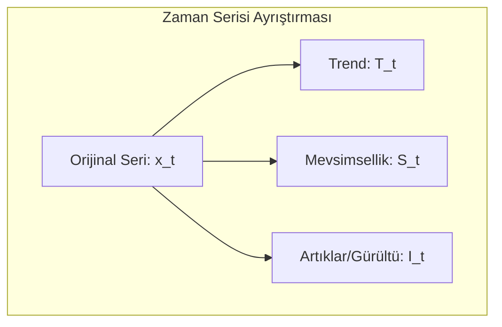
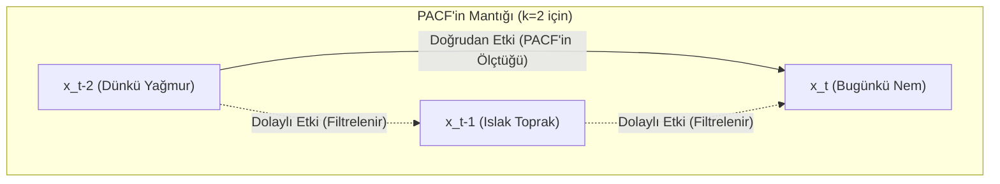
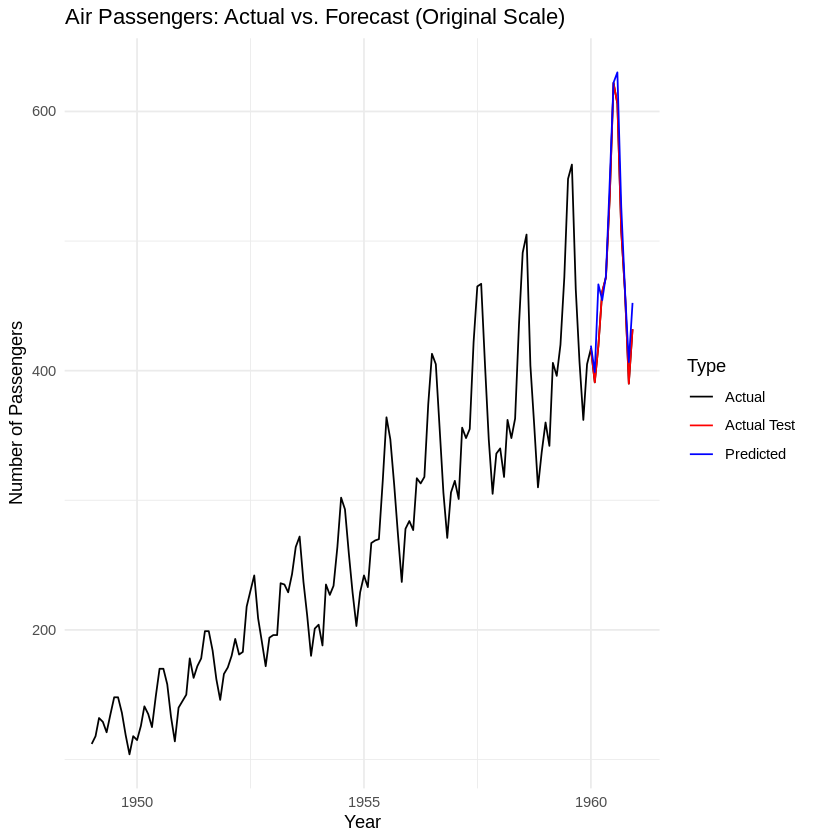

# Yapay Zeka Tabanlı Zaman Serisi ve Veri Analizi

### Ders Notları

---

## Bölüm 1: Zaman Serisi Analizine Giriş

### Zaman Serisi Nedir?

En basit tanımıyla zaman serisi, belirli bir zaman aralığında ardışık olarak gözlemlenen veri noktaları dizisidir. Box ve Jenkins’in klasik tanımına göre, “zamana bağlı olarak düzenli aralıklarla kaydedilen gözlemler dizisidir.”

Bu ne anlama geliyor? Günlük hayattan birkaç örnek verelim:

- Bir hastanedeki günlük hasta kabul sayısı.
- Bir şirketin aylık satış rakamları.
- Bir meteoroloji istasyonunda kaydedilen saatlik sıcaklık ölçümleri.
- Bir hisse senedinin dakikalık fiyat hareketleri.

Gördüğünüz gibi, zaman serisi analizi; finans, ekonomi, sağlık, mühendislik ve çevre bilimleri gibi sayısız alanda karşımıza çıkar. Peki amacımız ne? Geçmiş verilerden yola çıkarak geleceği tahmin etmek, verideki anormal durumları tespit etmek ve verinin altında yatan temel desenleri, yani yapısını ortaya çıkarmaktır.

Bu ders boyunca şu temel sorulara yanıt arayacağız:

- Verinin geçmişindeki desenler (pattern) nelerdir?
- Gelecekteki değerleri nasıl tahmin edebiliriz?
- Serideki olağan dışı değişimleri (anomalileri) nasıl tespit ederiz?
- Bir zaman serisini hangi temel bileşenler oluşturur?

---

## Bölüm 2: Zaman Serisinin Temel Kavramları ve Bileşenleri

Bir zaman serisini analiz etmeden önce, onun temel kavramlarını anlamamız şart. İşte en temel kavramlar:

- **Gözlem (Observation):** $x_t$ ile gösterilir ve $t$ anındaki veri noktasını ifade eder. Örneğin, 15. gündeki işlem sayısı $x_{15} = 120$.
- **Zaman Dizini (Time Index):** $t = 1, 2, ..., T$ şeklinde, gözlemlerin sıralandığı zaman noktalarıdır.
- **Trend:** Serideki uzun vadeli artış veya azalış eğilimidir. Bir e-ticaret sitesinin yıllık satışlarının sürekli artması pozitif bir trend örneğidir.
- **Mevsimsellik (Seasonality):** Belirli ve sabit periyotlarda (günlük, haftalık, yıllık) tekrar eden dalgalanmalardır. Yaz aylarında artan dondurma satışları klasik bir mevsimsellik örneğidir.
- **Döngüsellik (Cyclicity):** Mevsimsellik gibi periyodiktir ancak periyotları sabit değildir ve genellikle daha uzun vadelidir. Ekonomideki iş döngüleri (genişleme ve daralma dönemleri) bu duruma örnektir.
- **Durağanlık (Stationarity):** Bu, dersin en kritik kavramlarından biridir. Bir serinin ortalama, varyans gibi istatistiksel özelliklerinin zamanla değişmemesi durumudur. Bunu anlamadan modelleme yapamazsınız. Birçok klasik model, serinin durağan olmasını veya durağanlaştırılmasını gerektirir.

### Zaman Serisi Bileşenleri

Bir zaman serisini, genellikle dört ana bileşenin birleşimi olarak düşünebiliriz. Amacımız, bu bileşenleri ayrıştırarak serinin yapısını ortaya çıkarmaktır:

$$
x_t = \text{Trend}_t + \text{Mevsimsellik}_t + \text{Döngü}_t + \text{Rastgele Gürültü}_t
$$
$$
x_t = T_t + S_t + C_t + I_t
$$

- $T_t$: Trend (Uzun vadeli yön)
- $S_t$: Mevsimsellik (Sabit periyotlu dalgalanmalar)
- $C_t$: Döngü (Değişken periyotlu dalgalanmalar)
- $I_t$: Rastgele Gürültü (Açıklanamayan, öngörülemeyen dalgalanmalar)

Bu ayrıştırma işlemi, serinin yapısını anlamamızda ve doğru modeli seçmemizde bize yol gösterir.



---

## Bölüm 3: Zaman Serisi Tipleri

Analize başlamadan önce, elinizdeki verinin türünü doğru sınıflandırmanız gerekir. Çünkü her seriye aynı yöntem uygulanmaz.

1. **Değişken Sayısına Göre:**
    - **Tek Değişkenli (Univariate):** Tek bir değişkenin zaman içindeki değişimini inceleriz. Örnek: Sadece altın fiyatları.
    - **Çok Değişkenli (Multivariate):** İki veya daha fazla değişkenin eş zamanlı değişimini inceleriz. Örnek: Altın fiyatları, enflasyon oranı ve faiz oranlarının birlikte analizi.

2. **İstatistiksel Özelliklere Göre:**
    - **Durağan (Stationary):** İstatistiksel özellikleri zamanla değişmeyen seriler.
    - **Durağan Olmayan (Non-Stationary):** Trend veya mevsimsellik gibi nedenlerle istatistiksel özellikleri zamanla değişen seriler.

3. **Ölçüm Zamanına Göre:**
    - **Kesikli (Discrete-Time):** Gözlemlerin belirli zaman aralıklarında (saatlik, günlük, aylık) yapıldığı seriler. Analiz ettiğimiz serilerin büyük çoğunluğu bu tiptedir.
    - **Sürekli (Continuous-Time):** Gözlemlerin zamanın her anında mevcut olduğu teorik seriler. EKG sinyalleri gibi.

4. **Rastgelelik Durumuna Göre:**
    - **Deterministik:** Gelecek değerleri hatasız tahmin edilebilen, matematiksel bir fonksiyonla ifade edilebilen seriler.
    - **Stokastik:** Gelecek değerleri belirsizlik içeren ve rastgele bir bileşene sahip olan seriler. Gerçek dünyadaki serilerin neredeyse tamamı stokastiktir.

---

## Bölüm 4: R ile Pratiğe Giriş - Tarih ve Zaman Nesneleri

Bugün zaman serisi analizinin belki de en can sıkıcı ama en önemli konusuna gireceğiz: tarih ve zaman nesneleri. Birçok öğrenci burada takılıyor. Neden? Çünkü tarih formatları dünyada standart değil.

### Tarih Formatı Sorunsalı

Şu tarihe bir bakın: `01/02/2024`. Bu ne anlama geliyor?

- **Amerika'da:** 2 Ocak 2024 (Month/Day/Year)
- **Avrupa'da:** 1 Şubat 2024 (Day/Month/Year)
- **Japonya'da:** 2024, 1 Şubat (Year/Month/Day)

Eğer verinizi okurken bu formata dikkat etmezseniz, tüm analiziniz en başından çöp olur. Bu yüzden kendinize bir iyilik yapın ve tek bir standarda bağlı kalın: **ISO 8601 formatı (YYYY-MM-DD)**. Bu format evrenseldir, makine dostudur ve sizi gelecekteki baş ağrılarından kurtarır.

### R'da Tarih Nesneleri

R, bu format karmaşasını yönetmek için bize özel veri tipleri sunar. Bunlardan ikisini bilmek zorundasınız:

1. **`Date`**: Sadece tarih bilgisi (gün, ay, yıl) tutar. Saatle işiniz yoksa bunu kullanın.
2. **`POSIXct` / `POSIXlt`**: Tarih, saat ve hatta saat dilimi gibi daha detaylı bilgileri içerir. `POSIXct` daha yaygın kullanılır ve genellikle daha verimlidir.

```r
# Bugünün tarihini al
bugun <- Sys.Date()
print(bugun)
#> [1] "2024-10-26"
class(bugun)
#> [1] "Date"

# Şu anki zamanı al
simdi <- Sys.time()
print(simdi)
#> [1] "2024-10-26 15:30:00 EEST"
class(simdi)
#> [1] "POSIXct" "POSIXt"
```

Peki, elimizdeki "03/15/2024" gibi bir metni R'ın anlayacağı bir `Date` nesnesine nasıl çeviririz? `as.Date()` fonksiyonu ile. Ama bir püf noktası var: R'a hangi formatta yazdığınızı söylemeniz gerekir.

```r
# Amerikan formatı (MM/DD/YYYY)
tarih_us <- as.Date("03/15/2024", format = "%m/%d/%Y")

# Avrupa formatı (DD/MM/YYYY)
tarih_eu <- as.Date("15/03/2024", format = "%d/%m/%Y")

# Uzun format
tarih_uzun <- as.Date("15 Mart 2024", format = "%d %B %Y")
```

**Ezberlemeniz Gereken Format Kodları:**
Bu kodlar, R'a metnin hangi parçasının gün, ay veya yıl olduğunu anlatır. Bunları bilmeden ilerleyemezsiniz.

- `%Y`: 4 haneli yıl (örn: 2024)
- `%m`: Sayısal ay (01-12)
- `%B`: Tam ay ismi (örn: Ocak, February)
- `%b`: Kısa ay ismi (örn: Oca, Feb)
- `%d`: Gün (01-31)

### `lubridate` Paketi: Akıl Sağlığınız İçin

`as.Date()` ve format kodları güçlüdür ama her seferinde uğraşmak yorucu olabilir. İşte burada `lubridate` paketi devreye giriyor. Bu paket, tarih işlemlerini o kadar basitleştirir ki, bir kere kullandıktan sonra asla geri dönmek istemezsiniz.

```r
# install.packages("lubridate") # Yüklü değilse
library(lubridate)

# lubridate'ın güzelliği, format kodlarını düşünmeden tarihleri okuyabilmenizdir.
tarih1 <- ymd("2024-03-15")      # Year-Month-Day
tarih2 <- dmy("15-03-2024")      # Day-Month-Year
tarih3 <- mdy("03/15/2024")      # Month-Day-Year

# Tarihten bilgi çekmek çok kolay
year(tarih1)   # 2024
month(tarih1)  # 3
day(tarih1)    # 15
wday(tarih1, label = TRUE) # Haftanın günü (örn: "Fri")
```

### Tarih Aritmetiği ve Diziler

Tarihleri bir kere doğru formata getirdikten sonra onlarla matematiksel işlemler yapabiliriz. Bu, özellikle "30 gün sonrası" veya "iki olay arasındaki gün sayısı" gibi hesaplamalar için kritiktir. Ayrıca, analiz için baştan sona düzenli bir zaman dizini oluşturmamız gerektiğinde de hayat kurtarır.

```r
baslangic <- as.Date("2024-01-01")

# Tarihe gün, ay, yıl ekleme (lubridate ile daha kolay)
baslangic + days(30)
baslangic + months(3)
baslangic + years(1)

# İki tarih arasındaki fark
bitis <- as.Date("2024-12-31")
fark <- bitis - baslangic
print(as.numeric(fark)) # 365 gün

# Aylık bir tarih dizisi oluşturma (çok sık kullanılır)
aylik_dizi <- seq.Date(from = as.Date("2024-01-01"),
                       to = as.Date("2024-12-31"),
                       by = "month")
print(aylik_dizi)
```

---

## Bölüm 5: R'da Zaman Serisi Nesnesi: `ts`

Tarih ve zaman sorununu çözdükten sonra, veriyi R'ın analiz için kullandığı özel bir nesneye dönüştürmemiz gerekiyor: `ts` (time series) nesnesi.

Bir `ts` nesnesi iki temel bilgiyi içerir:

1. **Veri:** Sayısal değerlerden oluşan bir vektör.
2. **Zaman Bilgisi:** Serinin başlangıç zamanı (`start`) ve frekansı (`frequency`).

### Frekans Kavramı: Modellemeyi Doğru Yapmanın Anahtarı

Frekans, bir zaman döngüsünde kaç gözlem olduğunu belirtir. Bu parametreyi yanlış ayarlarsanız, mevsimsellik gibi önemli desenleri modelleyemezsiniz. Bu yüzden buraya çok dikkat edin.

- **Aylık veri:** `frequency = 12`
- **Çeyreklik veri:** `frequency = 4`
- **Yıllık veri:** `frequency = 1`
- **Günlük veri:** `frequency = 365` (veya 365.25)
- **Haftalık veri:** `frequency = 52`

### `ts` Nesnesi Oluşturma ve İnceleme

```r
# Örnek 1: Manuel Veri ile ts Nesnesi Oluşturma
# 2024 yılına ait aylık satış verisi
veri <- c(100, 105, 98, 112, 108, 115, 120, 118, 125, 130, 128, 135)

# ts nesnesi oluşturalım: 2024'ün 1. ayından başlıyor, frekansı 12
satis_ts <- ts(data = veri, start = c(2024, 1), frequency = 12)

print(satis_ts)
#>      Jan  Feb  Mar  Apr  May  Jun  Jul  Aug  Sep  Oct  Nov  Dec
#> 2024 100  105   98  112  108  115  120  118  125  130  128  135

# Örnek 2: Paketten Gelen Veri Seti (USgas)
# install.packages("TSstudio") # Yüklü değilse
library(TSstudio)
data(USgas) # ABD aylık doğal gaz tüketimi verisi

ts_info(USgas)
#> The USgas series is a ts object with 1 variable and 227 observations
#> Frequency: 12
#> Start time: 2000 1
#> End time: 2018 11

# Temel özelliklere erişim
start(USgas)     # Başlangıç zamanı
end(USgas)       # Bitiş zamanı
frequency(USgas) # Frekans

# Örnek 3: R'ın Dahili Veri Seti (AirPassengers)
# Bu veri seti, 1949-1960 yılları arasındaki aylık uluslararası havayolu yolcu sayılarını içerir.
data(AirPassengers)

# Veriyi ve yapısını inceleyelim
print(AirPassengers)
class(AirPassengers) # Zaten 'ts' formatında olduğunu görebiliriz

# ts nesnesinin özelliklerini kontrol edelim
start(AirPassengers)     # Başlangıç: [1] 1949    1
end(AirPassengers)       # Bitiş:   [1] 1960   12
frequency(AirPassengers) # Frekans: [1] 12 (aylık veri)
cycle(AirPassengers)     # Her bir gözlemin döngüdeki yerini gösterir (1'den 12'ye kadar)

# AirPassengers veri setini görselleştirelim
# Grafikte hem artan bir trend (yıllar içinde yolcu sayısının artması)
# hem de belirgin bir mevsimsellik (her yıl yaz aylarında zirve yapması) görüyoruz.
plot(AirPassengers,
    main = "Aylık Uluslararası Havayolu Yolcu Sayıları (1949-1960)",
    ylab = "Yolcu Sayısı (Bin)",
    xlab = "Yıl",
    col = "darkblue")
grid()
```

### `ts` Nesnesinin Ötesi: `xts` ile Gerçek Dünya Verileri

Gençler, şimdiye kadar gördüğümüz `ts` nesnesi, ders kitaplarındaki gibi düzenli aralıklı veriler (aylık, yıllık) için harikadır. Ancak gerçek dünya verileri nadiren bu kadar düzenlidir. Hafta sonları işlem görmeyen borsa verilerini veya bazen kesintiye uğrayan saniyelik sensör kayıtlarını düşünün. `ts` nesnesinin sabit frekans yapısı bu gibi durumlarda yetersiz kalır.

İşte bu noktada, R'ın zaman serisi analizindeki en güçlü paketlerinden biri olan `xts` (eXtensible Time Series) devreye giriyor. `xts`, `zoo` paketi üzerine inşa edilmiştir ve her bir gözlemi kendi hassas zaman damgasıyla eşleştirir. Bu sayede düzensiz ve yüksek frekanslı verilerle çalışmak son derece kolaylaşır.

`xts`'in temel gücü, bir zaman indeksine sahip bir matris olmasıdır. Bu yapı, onu hem çok hızlı yapar hem de veriyi zaman bazlı olarak filtreleme ve manipüle etme konusunda inanılmaz bir esneklik sunar.

```r
# Gerekli paketleri yükleyelim ve çağıralım
# install.packages("xts") # Yüklü değilse
library(xts)

# Düzensiz aralıklı bir veri oluşturalım (hafta sonları atlanmış)
degerler <- c(101, 103, 102, 105, 104)
tarihler <- as.Date(c("2024-01-22", "2024-01-23", "2024-01-24", "2024-01-25", "2024-01-26"))

# xts nesnesi oluşturalım
veri_xts <- xts(x = degerler, order.by = tarihler)

print(veri_xts)
#>            [,1]
#> 2024-01-22  101
#> 2024-01-23  103
#> 2024-01-24  102
#> 2024-01-25  105
#> 2024-01-26  104
```

#### `xts`'in Gücü: Sezgisel Filtreleme ve Manipülasyon

`xts`'in en büyük avantajlarından biri, tarih bazlı alt kümelemenin çok kolay olmasıdır. ISO 8601 formatında (`YYYY-MM-DD`) metinler kullanarak verinin istediğiniz bölümünü rahatça seçebilirsiniz.

```r
# Belirli bir tarih aralığını seçmek
veri_xts["2024-01-23/2024-01-25"]

# Sadece belirli bir ayı veya yılı seçmek
# veri_xts["2024-01"] # Ocak ayının tamamı
# veri_xts["2024"]    # 2024 yılının tamamı
```

`xts`'in bir diğer güçlü özelliği ise veriyi farklı zaman periyotlarına kolayca dönüştürebilmesidir. Örneğin, günlük veriden haftalık veya aylık özetler çıkarmak son derece basittir.

```r
# Günlük veriden haftalık verilere geçelim
# to.period() fonksiyonu, açılış, en yüksek, en düşük ve kapanış (OHLC) değerlerini otomatik olarak hesaplar
haftalik_veri <- to.period(veri_xts, period = "weeks")
print(haftalik_veri)
#>            veri_xts.Open veri_xts.High veri_xts.Low veri_xts.Close
#> 2024-01-26           101           105          101            104

# Aylık ortalamaları hesaplayalım
aylik_ortalama <- apply.monthly(veri_xts, FUN = mean)
print(aylik_ortalama)
#>            [,1]
#> 2024-01-26  103
```

Özetle, elinizdeki veri düzenli aralıklı ve klasik bir zaman serisi ise `ts` nesnesi işinizi görecektir. Ancak düzensiz, yüksek frekanslı veya üzerinde karmaşık tarih/saat manipülasyonları yapmanız gereken bir veriyle çalışıyorsanız, `xts` sizin için doğru ve daha güçlü bir araçtır.

### Pratik `lubridate` Örnekleri

`lubridate` paketinin gücünü birkaç pratik örnekle görelim.

#### Örnek 1: Kaç Gündür Hayattasınız?

Örneğin  (`2021-06-29`) tarihini sembolik olarak kullanabiliriz. Bu tarih ile bugün arasındaki farkı hesaplayarak kaç gün geçtiğini ve kaç kış gördüğümüzü bulalım.

```r
library(lubridate)

# Sembolik doğum günü ve bugün
ben_dogum <- ymd("2021-06-29")
bugun <- today()

# Kaç gün geçti?
yasanan_gun_sayisi <- bugun - ben_dogum
cat("Bent", as.numeric(yasanan_gun_sayisi), "gündür hayatta.\n")

# Kaç kış gördü? (Yaşı yıl olarak hesaplayarak basit bir yaklaşım)
yas_araligi <- interval(ben_dogum, bugun)
gorulen_kis_sayisi <- yas_araligi %/% years(1)
cat("Ben", gorulen_kis_sayisi, "kış gördüm.\n")
```

#### Örnek 2: Atatürk Kaç Gün Yaşadı ve Hangi Gün Vefat Etti?

Tarihi kişiliklerin yaşam sürelerini ve önemli günlerini `lubridate` ile kolayca analiz edebiliriz. Atatürk'ün doğum günü olarak 19 Mayıs 1881'i kabul edelim.

```r
library(lubridate)

# Atatürk'ün doğum ve vefat tarihleri
ataturk_dogum <- ymd("1881-05-19")
ataturk_vefat <- ymd("1938-11-10")

# Toplam yaşadığı gün sayısı
yasadigi_gun <- ataturk_vefat - ataturk_dogum
cat("Mustafa Kemal Atatürk", as.numeric(yasadigi_gun), "gün yaşamıştır.\n")

# Vefat ettiği günün adı
# Not: Sistemin dil ayarlarına göre sonuç değişebilir.
vefat_gunu <- wday(ataturk_vefat, label = TRUE, abbr = FALSE)
cat("Vefat ettiği gün:", as.character(vefat_gunu), "\n")
```

#### Örnek 3: Toplam Kaç Saat Yaşadınız?

Daha hassas hesaplamalar için tarihle birlikte saati de kullanmamız gerekir. `ymd_hms()` fonksiyonu ile `POSIXct` türünde bir nesne oluşturup şimdiki zamandan çıkararak toplam yaşanılan saati bulabiliriz.

```r
library(lubridate)

# Örnek bir doğum tarihi ve saati
dogum_zamani <- ymd_hms("1995-04-23 14:30:00")

# Şimdiki zaman
simdi <- now()

# İki zaman arasındaki farkı saat cinsinden hesaplama
yasanan_saat <- as.numeric(simdi - dogum_zamani, units = "hours")

cat("1995-04-23 14:30'da doğan bir kişi, yaklaşık olarak",
    round(yasanan_saat), "saattir hayattadır.\n")
```

### Veri Alt Kümesi Alma: `window()`

Bir zaman serisinin belirli bir bölümünü analiz etmek için `window()` fonksiyonu kullanılır. Bu, en sık kullanacağınız fonksiyonlardan biridir.

```r
# 2010-2015 yılları arasındaki veriyi seçelim
subset_gas <- window(USgas,
                     start = c(2010, 1),
                     end = c(2015, 12))
```

---

## Bölüm 6: Veri Manipülasyonu ve Görselleştirme

Elimizde bir `ts` nesnesi var. Şimdi ne yapacağız? İlk kural: Veriyi çizin. Her zaman. Veriyi görselleştirmeden analize başlamak, gözü kapalı araba kullanmaya benzer.

### Temel Görselleştirme

`ts` nesneleri, `plot()` fonksiyonu ile doğrudan görselleştirilebilir.

```r
plot(USgas,
     main = "ABD Doğal Gaz Tüketimi (2000-2018)",
     ylab = "Milyar Kübik Fit",
     xlab = "Yıl",
     col = "blue")
grid()
```

### Zaman Serisi Manipülasyonu

- **`aggregate()`:** Yüksek frekanslı veriyi daha düşük bir frekansa toplamak için kullanılır. Örneğin, aylık veriyi yıllık toplamlara çevirebiliriz.

```r
# Aylık veriyi yıllık toplam satışlara çevirelim
USgas_yillik <- aggregate(USgas, nfrequency = 1, FUN = sum)
```

- **`lag()`:** Şimdi, zaman serisi analizinin en temel fikirlerinden birine gelelim: gecikmeli değerler. Şöyle düşünelim: Bugünkü hava sıcaklığını tahmin etmeye çalışırken, aklınıza ilk gelen verilerden biri dünkü sıcaklık olmaz mıydı? Ya da bu ayki satışları değerlendirirken, geçen ayın satışlarıyla veya daha da önemlisi, geçen yılın aynı ayındaki satışlarla karşılaştırmak istemez miydiniz? İşte bu "bir önceki değer" veya "geçen yılki değer" kavramı, analizdeki en güçlü araçlarımızdan biridir. Biz buna **gecikmeli değer (lagged value)** diyoruz.

Gençler, bu "lag" kelimesi üzerinde biraz duralım, çünkü ne yaptığını anlamanın en iyi yolu kelimenin kendisinden geçer.

Kelimenin kökeni İngilizcedir ve İskandinav dillerine, Eski Nors dilindeki "lagga" fiiline dayanır. Anlamı, "geri kalmak, yavaş hareket etmek" demektir. Yani kelimenin özünde bir gecikme, bir geride kalma fikri yatar. Günlük hayatta "jet lag" veya "time lag" gibi ifadelerde de bu anlamı görürüz.

İşte `lag()` fonksiyonu da tam olarak bunu yapıyor: seriyi zamanda geriye kaydırarak bu geçmiş değerleri bugünkü değerlerle aynı hizaya getirmemizi sağlar. Amacımız ne? Geçmişin, bugünü nasıl etkilediğini görmek ve bu bilgiyi modelimize bir girdi, yani bir **özellik (feature)** olarak sunmak. Örneğin, 12. aydaki satışları tahmin etmek için 11. aydaki satışları (lag-1) veya bir önceki yılın 12. ayındaki satışları (lag-12) kullanabiliriz. Bu, özellikle mevsimsel etkileri yakalamak için hayati öneme sahiptir. `stats::lag()` fonksiyonunda `k` parametresinin negatif olduğuna dikkat edin; `k = -1` bir dönem geriye, `k = -12` ise on iki dönem geriye gitmek anlamına gelir.

```r
# 1 ay önceki değeri (lag-1) ve 12 ay önceki değeri (lag-12) oluşturalım
USgas_lag1 <- stats::lag(USgas, k = -1)
USgas_lag12 <- stats::lag(USgas, k = -12)

# Orijinal seri ile gecikmeli değerleri karşılaştıralım
# head() ile ilk 15 satıra bakarak kaydırmayı net bir şekilde görebiliriz
comparison_df <- cbind(
    Original = USgas,
    Lag1 = USgas_lag1,
    Lag12 = USgas_lag12
)
head(comparison_df, 15)
```

**Çıktı ve Yorum:**

```
#>              Original     Lag1    Lag12
#> Jan 2000     2561.034       NA       NA
#> Feb 2000     2339.293 2561.034       NA
#> Mar 2000     2257.024 2339.293       NA
#> Apr 2000     1864.603 2257.024       NA
#> May 2000     1621.621 1864.603       NA
#> Jun 2000     1510.289 1621.621       NA
#> Jul 2000     1557.589 1510.289       NA
#> Aug 2000     1538.031 1557.589       NA
#> Sep 2000     1452.925 1538.031       NA
#> Oct 2000     1658.710 1452.925       NA
#> Nov 2000     1934.255 1658.710       NA
#> Dec 2000     2395.034 1934.255       NA
#> Jan 2001     2649.260 2395.034 2561.034
#> Feb 2001     2308.922 2649.260 2339.293
#> Mar 2001     2245.748 2308.922 2257.024
```

Yukarıdaki çıktı, `lag()` fonksiyonunun seriyi zamanda nasıl kaydırdığını açıkça göstermektedir:

- **`Lag1` Sütunu:** Herhangi bir aydaki `Lag1` değeri, bir önceki ayın `Original` değeridir. Örneğin, Şubat 2000'deki `Lag1` değeri (2561.034), Ocak 2000'in `Original` değeridir.
- **`Lag12` Sütunu:** Bu sütun, 12 ay (1 yıl) önceki değeri gösterir. Ocak 2001'deki `Lag12` değeri (2561.034), tam olarak bir yıl önceki Ocak 2000'in `Original` değeridir. Bu, mevsimsel etkileri modellemek için çok önemlidir.
- **`NA` Değerleri:** Serinin başındaki `NA` (Not Available) değerleri normaldir. Çünkü Ocak 2000 için bir önceki ay (`Lag1`) veya bir önceki yıl (`Lag12`) verisi mevcut değildir.

Bu gecikmeli değerler, "geçen ayki tüketim" veya "geçen yılın aynı ayındaki tüketim" gibi bilgileri modelimize birer özellik olarak eklememizi sağlar.

```

- **`decompose()`:** Şimdi, bir serinin iç yapısını, adeta bir motorun parçalarını ayırır gibi incelememizi sağlayan `decompose()` fonksiyonuna bakalım. Bu fonksiyon, bir zaman serisini üç temel bileşenine ayırır: trend, mevsimsellik ve geriye kalan rastgele gürültü. Bu ayrıştırma, serinin hangi dinamiklerden etkilendiğini anlamak için kritik bir adımdır.

Örneğin, `USgas` veri setini ele alalım. Bu seride hem yıllar içinde artan bir tüketim (trend) hem de her yıl kış aylarında zirve yapan bir dalgalanma (mevsimsellik) olduğunu gözlemlemiştik. `decompose()` fonksiyonu bu gözlemlerimizi matematiksel olarak doğrular ve görselleştirir.

```r
# USgas serisini bileşenlerine ayıralım
USgas_ayristir <- decompose(USgas)

# Sonuçları çizdirelim
plot(USgas_ayristir)
```

Bu komutu çalıştırdığınızda karşınıza dört parçadan oluşan bir grafik çıkar:

- **Observed:** Orijinal verinin kendisi.
- **Trend:** Serideki uzun vadeli artış veya azalış eğilimi. Grafikte bu, yumuşatılmış bir çizgi olarak görünür.
- **Seasonal:** Her yıl tekrar eden sabit döngü. Doğal gaz verisinde bu, kışın zirve yapıp yazın düşen dalgadır.
- **Random:** Trend ve mevsimsellik çıkarıldıktan sonra geriye kalan, açıklanamayan kısım. İdeal bir modelde bu kısmın rastgele bir gürültüye benzemesini bekleriz.

```r
USgas_ayristir <- decompose(USgas)
plot(USgas_ayristir)
```

Bu komut size dört grafik sunar: orijinal veri, tahmin edilen trend, tahmin edilen mevsimsel etki ve geriye kalan rastgele gürültü.

### Keşifsel Analiz Grafikleri: Serinin Hafızasını Okumak (ACF ve PACF)

Evet gençler, verimizi hazırladık, grafiğini çizdik ve genel yapısını anladık. Şimdi dedektiflik zamanı. Elimizdeki serinin içinde gizlenen matematiksel yapıyı nasıl ortaya çıkarırız? Hangi modelin ona en uygun olacağına nasıl karar veririz? İşte bu noktada iki temel aracımız devreye giriyor: ACF ve PACF. Bu iki grafik, serinin adeta bir röntgenini çekerek onun 'hafızasını' ve içsel dinamiklerini bize gösterir.

#### ACF (Autocorrelation Function - Otokorelasyon Fonksiyonu)

Önce ACF'ye bakalım. Adı karmaşık gelebilir ama mantığı çok basit. Bir serinin bugünkü değeri, dünkü değerine ne kadar benziyor? Peki ya geçen haftaki değerine? Veya tam bir yıl önceki değerine? ACF, işte bu soruların cevabını verir. Serinin kendi geçmişiyle olan korelasyonunu, yani 'bağını' ölçer.

ACF grafiğini okumak sezgiseldir. Grafikteki her dikey çubuk, belirli bir gecikmedeki (lag) otokorelasyonu gösterir. Mavi kesikli yatay çizgiler güven aralığını (yaklaşık ±1.96 / sqrt(N)) temsil eder; bir çubuk bu bantların dışına çıkarsa o gecikme istatistiksel olarak anlamlıdır — yani gözlenen korelasyon tesadüf değildir.

Kısa yorum rehberi:

- Pozitif çubuklar geçmiş değerlerin aynı işaretli etkisini, negatif çubuklar ters etkiyi gösterir.
- Çubuklar yavaşça azalıyor ise güçlü bir trend olabilir.
- Belirli aralıklarda (ör. lag-12, lag-24) tepe görmek mevsimselliğe işaret eder.

Aşağıdaki SVG, tipik bir ACF örneğini görselleştirir: ilk lags'te azalan çubuklar (trend), 12. lags çevresinde mevsimsel zirve ve mavi kesikli güven aralığı:

<div align="center">

<svg width="600" height="240" viewBox="0 0 600 240" xmlns="http://www.w3.org/2000/svg" role="img" aria-label="ACF örneği: trend ve mevsimsellik">
    <!-- Arka ve eksenler -->
    <rect width="100%" height="100%" fill="#fff"/>
    <line x1="60" y1="200" x2="540" y2="200" stroke="#333" stroke-width="1.5"/>
    <line x1="60" y1="40" x2="60" y2="200" stroke="#333" stroke-width="1.5"/>
    <!-- Sıfır çizgisi -->
    <line x1="60" y1="120" x2="540" y2="120" stroke="#888" stroke-dasharray="4,4"/>
    <!-- Güven aralıkları -->
    <line x1="60" y1="80" x2="540" y2="80" stroke="#0074D9" stroke-dasharray="6,4" stroke-width="1.5"/>
    <line x1="60" y1="160" x2="540" y2="160" stroke="#0074D9" stroke-dasharray="6,4" stroke-width="1.5"/>
    <!-- Lag çubukları: trend (azalan) -->
    <rect x="90"  y="60" width="18" height="140" fill="#39CCCC"/>
    <rect x="120" y="80" width="18" height="120" fill="#39CCCC"/>
    <rect x="150" y="95" width="18" height="105" fill="#39CCCC"/>
    <rect x="180" y="110" width="18" height="90" fill="#39CCCC"/>
    <rect x="210" y="125" width="18" height="75" fill="#39CCCC"/>
    <!-- küçük negatif örnek -->
    <rect x="240" y="130" width="18" height="70" fill="#FF4136" transform="translate(0,0)"/>
    <!-- Mevsimsellik (lag 12 civarı) -->
    <rect x="360" y="60" width="18" height="140" fill="#FF851B"/>
    <rect x="390" y="110" width="18" height="90" fill="#FF851B"/>
    <rect x="420" y="60" width="18" height="140" fill="#FF851B"/>
    <!-- Lag etiketleri -->
    <text x="99"  y="216" font-size="12" text-anchor="middle" fill="#333">1</text>
    <text x="129" y="216" font-size="12" text-anchor="middle" fill="#333">2</text>
    <text x="159" y="216" font-size="12" text-anchor="middle" fill="#333">3</text>
    <text x="189" y="216" font-size="12" text-anchor="middle" fill="#333">4</text>
    <text x="219" y="216" font-size="12" text-anchor="middle" fill="#333">5</text>
    <text x="369" y="216" font-size="12" text-anchor="middle" fill="#333">12</text>
    <text x="423" y="216" font-size="12" text-anchor="middle" fill="#333">24</text>
    <!-- Açıklamalar -->
    <text x="300" y="30" font-size="14" text-anchor="middle" fill="#222" font-weight="bold">ACF Örneği: Trend ve Mevsimsellik</text>
    <text x="300" y="44" font-size="11" text-anchor="middle" fill="#555">Mavi kesikli çizgiler ~ %95 güven aralığıdır; dışarı çıkan çubuklar anlamlıdır.</text>
    <rect x="72" y="46" width="12" height="8" fill="#39CCCC"/><text x="90" y="52" font-size="11" fill="#333">Trend (azalan çubuklar)</text>
    <rect x="72" y="62" width="12" height="8" fill="#FF851B"/><text x="90" y="68" font-size="11" fill="#333">Mevsimsellik (lag ≈ 12)</text>
</svg>

</div>

Peki bu bize ne anlatır?

- Eğer çubuklar yavaş yavaş sıfıra doğru azalıyorsa, bu seride güçlü bir **trend** olduğunun habercisidir. Seri, geçmişini kolay kolay unutmuyor demektir.
- Eğer çubuklar belirli aralıklarla (örneğin her 12. ayda bir) tekrar tekrar yükseliyorsa, bu da bariz bir **mevsimsellik** işaretidir.

<!-- ACF grafiğinin tipik görünümünü ve yorumunu anlatan bir SVG çizim -->
<div align="center">

<svg width="480" height="220" viewBox="0 0 480 220" xmlns="http://www.w3.org/2000/svg">
    <!-- Eksenler -->
    <line x1="40" y1="180" x2="440" y2="180" stroke="#333" stroke-width="2"/>
    <line x1="60" y1="40" x2="60" y2="200" stroke="#333" stroke-width="2"/>
    <!-- Sıfır çizgisi -->
    <line x1="60" y1="110" x2="440" y2="110" stroke="#888" stroke-dasharray="4,3"/>
    <!-- Güven aralığı (mavi kesikli çizgiler) -->
    <line x1="60" y1="70" x2="440" y2="70" stroke="#0074D9" stroke-dasharray="6,4" stroke-width="2"/>
    <line x1="60" y1="150" x2="440" y2="150" stroke="#0074D9" stroke-dasharray="6,4" stroke-width="2"/>
    <!-- Lag çubukları (örnek: trend ve mevsimsellik) -->
    <!-- Trend: Yavaşça azalan çubuklar -->
    <rect x="80" y="60" width="16" height="120" fill="#39CCCC"/>
    <rect x="110" y="80" width="16" height="100" fill="#39CCCC"/>
    <rect x="140" y="100" width="16" height="80" fill="#39CCCC"/>
    <rect x="170" y="120" width="16" height="60" fill="#39CCCC"/>
    <rect x="200" y="135" width="16" height="45" fill="#39CCCC"/>
    <!-- Mevsimsellik: 12. lag'da tekrar yükselen çubuk -->
    <rect x="260" y="60" width="16" height="120" fill="#FF851B"/>
    <rect x="290" y="140" width="16" height="40" fill="#FF851B"/>
    <rect x="320" y="150" width="16" height="30" fill="#FF851B"/>
    <rect x="350" y="60" width="16" height="120" fill="#FF851B"/>
    <!-- Lag etiketleri -->
    <text x="80" y="200" font-size="12" text-anchor="middle" fill="#333">1</text>
    <text x="110" y="200" font-size="12" text-anchor="middle" fill="#333">2</text>
    <text x="140" y="200" font-size="12" text-anchor="middle" fill="#333">3</text>
    <text x="170" y="200" font-size="12" text-anchor="middle" fill="#333">4</text>
    <text x="200" y="200" font-size="12" text-anchor="middle" fill="#333">5</text>
    <text x="260" y="200" font-size="12" text-anchor="middle" fill="#333">12</text>
    <text x="350" y="200" font-size="12" text-anchor="middle" fill="#333">24</text>
    <!-- Y ekseni etiketleri -->
    <text x="45" y="115" font-size="12" text-anchor="end" fill="#333">0</text>
    <text x="45" y="75" font-size="12" text-anchor="end" fill="#333">+0.5</text>
    <text x="45" y="155" font-size="12" text-anchor="end" fill="#333">-0.5</text>
    <!-- Açıklamalar -->
    <text x="120" y="50" font-size="13" fill="#39CCCC">Trend: Yavaş azalan çubuklar</text>
    <text x="270" y="50" font-size="13" fill="#FF851B">Mevsimsellik: 12. lagda tepe</text>
    <!-- Başlık -->
    <text x="240" y="25" font-size="16" text-anchor="middle" fill="#222" font-weight="bold">
        ACF Grafiği: Trend ve Mevsimsellik Örneği
    </text>
</svg>

</div>

<p align="center" style="color:#555;font-size:13px;">
Yukarıdaki örnek ACF grafiğinde, ilk çubuklar yavaşça azalarak güçlü bir trendi, 12. ve 24. laglarda tekrar yükselen çubuklar ise belirgin bir mevsimselliği gösteriyor.<br>
Mavi kesikli çizgiler ise istatistiksel anlamlılık sınırlarını temsil eder.
</p>

Şimdi biraz daha derine inelim. ACF'nin ($\rho_k$) matematiksel tanımı, bir serinin $k$ dönem önceki haliyle ($x_{t-k}$) olan kovaryansının, serinin kendi varyansına bölünmesidir. Bu, bildiğimiz standart korelasyon hesabından başka bir şey değildir.

- **Formül:**
    $$
    \rho_k = \frac{\text{Cov}(x_t, x_{t-k})}{\text{Var}(x_t)} = \frac{\sum_{t=k+1}^{T} (x_t - \bar{x})(x_{t-k} - \bar{x})}{\sum_{t=1}^{T} (x_t - \bar{x})^2}
    $$

Şimdi, bu ACF'nin nasıl hesaplandığını basit bir örnekle görelim. Bu, aslında bildiğiniz korelasyon hesabının bir benzeri. Elimizde beş günlük sıcaklık verisi olsun: $x = [10, 12, 15, 11, 17]$. Sorumuz şu: Dünkü sıcaklık ile bugünkü sıcaklık arasında bir ilişki var mı? Yani, lag-1 otokorelasyonu nedir?

- **Örnek Hesaplama (ACF Lag-1):**
    1. **Ortalamayı Bul:** Serinin ortalaması, yani referans noktamız:
        $$ \bar{x} = (10 + 12 + 15 + 11 + 17) / 5 = 13 $$
    2. **Hesaplama Tablosu:** İşlemleri adım adım görelim. Amacımız, bugünkü değerin ortalamadan sapması ile dünkü değerin ortalamadan sapması arasındaki ilişkiyi ölçmektir.

        | Zaman (t) | $x_t$ (Bugün) | $x_{t-1}$ (Dün) | Bugünün Sapması <br> $(x_t - \bar{x})$ | Dünün Sapması <br> $(x_{t-1} - \bar{x})$ | **Pay İçin Çarpım** <br> $(x_t - \bar{x})(x_{t-1} - \bar{x})$ | **Payda İçin Kare** <br> $(x_t - \bar{x})^2$ |
        |:---:|:---:|:---:|:---:|:---:|:---:|:---:|
        | 1 | 10 | - | -3 | - | - | 9 |
        | 2 | 12 | 10 | -1 | -3 | $(-1) \times (-3) = 3$ | 1 |
        | 3 | 15 | 12 | 2 | -1 | $2 \times (-1) = -2$ | 4 |
        | 4 | 11 | 15 | -2 | 2 | $(-2) \times 2 = -4$ | 4 |
        | 5 | 17 | 11 | 4 | -2 | $4 \times (-2) = -8$ | 16 |
        | **Toplam** | | | | | **-11 (Pay)** | **34 (Payda)** |

    3. **Sonucu Bul:** Formülün pay ve payda kısımlarını tablodan alıp bölelim.

        $$
        \begin{align*}
        \rho_1 &= \frac{\sum_{t=2}^{5} (x_t - \bar{x})(x_{t-1} - \bar{x})}{\sum_{t=1}^{5} (x_t - \bar{x})^2} \\
               &= \frac{-11}{34} \\
               &\approx -0.324
        \end{align*}
        $$

**Peki, bu `-0.324` ne anlama geliyor?**
<p align="justify">
Bu sonuç, dünkü ve bugünkü sıcaklıklar arasında zayıf, <strong>negatif bir ilişki</strong> olduğunu gösterir. Yani, sıcaklık bir gün ortalamanın üzerine çıktığında, ertesi gün ortalamanın altına düşme eğilimindedir. Bu durum, seride bir tür <strong>salınım</strong> veya dengeye geri dönme (mean-reverting) davranışı olduğunu ima eder.
</p>
<p align="justify">
Bu bulgu, modelleme için kritik bir ipucudur çünkü serinin "hafızası" hakkında bilgi verir. Negatif korelasyon, serinin bir önceki adıma ters tepki verdiğini, yani kendi kendini düzenleyen bir yapısı olabileceğini düşündürür. Elbette bu, sadece bir adım geriye (lag-1) baktığımızdaki ilişkidir. Serinin tam dinamik yapısını anlamak için tüm ACF grafiğini incelemek gerekir.
</p>

- **Kod Örnekleri ve Yorumlanması:**

    Aşağıda, hem Python hem de R dillerinde, `[20, 22, 21, 23, 24]` gibi basit bir veri seti için 1. gecikme (lag-1) otokorelasyonunun nasıl hesaplandığını göreceğiz.

  - **Python ile ACF:**

        ```python
        from statsmodels.tsa.stattools import acf # ACF fonksiyonunu içeri aktar
        import numpy as np # Numpy kütüphanesini içeri aktar
        
        data = np.array([20, 22, 21, 23, 24]) # Örnek bir zaman serisi verisi oluştur
        acf_values = acf(data, nlags=2) # 2 gecikmeye kadar ACF değerlerini hesapla
        print(f"Lag-1 ACF: {acf_values[1]:.3f}") # 1. gecikmedeki (lag-1) ACF değerini yazdır
        ```

        **Çıktı:**

        ```
        Lag-1 ACF: 0.100
        ```

  - **R ile ACF:**

        ```r
        data <- c(20, 22, 21, 23, 24) # Örnek bir zaman serisi vektörü oluştur
        acf_result <- acf(data, plot = FALSE) # Grafik çizmeden ACF değerlerini hesapla
        # Not: R'da acf() çıktısının ilk elemanı lag-0'dır, bu yüzden lag-1 için 2. elemanı alırız.
        cat("Lag-1 ACF:", round(acf_result$acf[2], 3)) # 1. gecikmedeki (lag-1) ACF değerini yazdır
        ```

        **Çıktı:**

        ```
        Lag-1 ACF: 0.1
        ```

       <p align="justify">
        Her iki dilde de hesaplanan <strong>Lag-1 ACF değeri 0.1</strong>'dir. Bu sonuç, serinin bir önceki değeri ile bugünkü değeri arasında çok zayıf, pozitif bir doğrusal ilişki olduğunu gösterir. Değerin 1'e değil de 0'a çok yakın olması, dünkü değerin bugünkü değeri tahmin etmede neredeyse hiç bilgi taşımadığı anlamına gelir. Bu kadar küçük bir veri setinde, bu zayıf korelasyonun istatistiksel olarak anlamsız ve büyük olasılıkla rastgele gürültüden kaynaklandığını söyleyebiliriz.
        </p>

#### PACF (Partial Autocorrelation Function - Kısmi Otokorelasyon Fonksiyonu)

Şimdi gelelim PACF'ye. ACF bize genel ilişkiyi gösterirken, PACF daha incelikli bir iş yapar: **doğrudan etkiyi** ölçer.

Şöyle bir senaryo düşünün: Dünkü yağmur toprağı ıslattı, ıslak toprak da bugünkü havanın nemli olmasına neden oldu. Bu bir zincirleme reaksiyondur. ACF, 'dünkü yağmur' ile 'bugünkü nem' arasında bir ilişki bulacaktır, çünkü arada bir bağlantı var. PACF ise aradaki 'ıslak toprak' etkisini matematiksel olarak devreden çıkarır ve şu can alıcı soruyu sorar: "Peki, dünkü yağmurun, bugünkü nem üzerinde *doğrudan*, başka hiçbir şeyin aracılığı olmadan bir etkisi oldu mu?" İşte bu, bir etkinin kök nedenini bulmaya benzer.



Bu ayrım, modelleme için hayati önem taşır. Çünkü bir seriyi modellerken, bir değerin geleceği ne kadar *doğrudan* etkilediğini bilmek isteriz. PACF grafiği, ARIMA gibi modellerin 'AR' kısmının, yani otoregresif terimin derecesini (p) belirlememizde bize yol gösterir. Eğer PACF grafiğindeki çubuklar, örneğin 2. gecikmeden sonra aniden kesilip anlamsız hale geliyorsa, bu bize serinin hafızasının sadece iki dönem geriye, doğrudan gittiğini söyler.

PACF ($\phi_{kk}$), $x_t$ ve $x_{t-k}$ arasındaki korelasyonu, aradaki $x_{t-1}, x_{t-2}, ..., x_{t-k+1}$ değerlerinin etkisinden arındırarak hesaplar. Bu, bir dizi otoregresif modelin son katsayısı olarak bulunur.

- **Kod Örnekleri:**
  - **Python ile PACF:**

        ```python
        from statsmodels.tsa.stattools import pacf
        import numpy as np
        
        data = np.array([20, 22, 21, 23, 24])
        pacf_values = pacf(data, nlags=2)
        print(f"Lag-2 PACF: {pacf_values[2]:.3f}")
        ```

  - **R ile PACF:**

        ```r
        data <- c(20, 22, 21, 23, 24)
        pacf_result <- pacf(data, plot = FALSE)
        cat("Lag-2 PACF:", round(pacf_result$acf[2], 3))
        ```

```r
# USgas verisinin ACF ve PACF grafiklerini çizelim
par(mfrow = c(2, 1)) # Grafikleri alt alta göstermek için
acf(USgas, main = "Otokorelasyon Fonksiyonu (ACF)")
pacf(USgas, main = "Kısmi Otokorelasyon Fonksiyonu (PACF)")
```

### AR ve MA Modelleri için ACF ve PACF Yorumlama

Gençler,

şimdi bu iki grafiği kullanarak model tipini nasıl belirleyeceğimize bakalım. Bu, durağan bir seri için doğru ARIMA modelinin 'p' ve 'q' parametrelerini seçerken en temel adımlardan biridir.

#### MA(q) Süreci ve ACF İmzası

Önce basit olanla başlayalım: **Hareketli Ortalama (MA)** süreci. Bir MA(q) sürecini, hafızası kısa olan bir sistem gibi düşünebilirsiniz. Bu sistem, sadece son 'q' adet rastgele şoktan (yani geçmiş hatalardan) etkilenir. 'q' adımdan daha eski bir şokun bugünkü değer üzerinde hiçbir etkisi yoktur.

Bu durum, ACF grafiğine çok net bir şekilde yansır. Serinin kendi geçmişiyle olan toplam korelasyonu, tam olarak 'q' gecikmeye kadar anlamlıdır ve sonra aniden kesilerek sıfıra düşer. Çünkü 'q' adımdan sonra, geçmişle bugünü bağlayan ortak bir şok kalmamıştır.

- **Kural:** Eğer ACF grafiği 'q' gecikmeden sonra aniden kesiliyorsa (çubuklar güven aralığının içine düşüyorsa), bu bir **MA(q)** modeline işaret eder. PACF grafiği ise genellikle yavaşça sönümlenir.

Aşağıdaki çizim, tipik bir MA(2) sürecinin ACF grafiğini göstermektedir. İlk iki çubuk anlamlıdır, üçüncüsü ve sonrakiler anlamsızdır.

<div align="center">
<svg width="540" height="220" viewBox="0 0 540 220" xmlns="http://www.w3.org/2000/svg" role="img" aria-label="MA(2) süreci için tipik ACF grafiği">
    <rect width="100%" height="100%" fill="#fff"/>
    <text x="270" y="25" font-size="16" text-anchor="middle" fill="#222" font-weight="bold">ACF Grafiği: MA(2) Süreci Örneği</text>
    <!-- Eksenler -->
    <line x1="40" y1="180" x2="500" y2="180" stroke="#333" stroke-width="1.5"/>
    <line x1="60" y1="40" x2="60" y2="180" stroke="#333" stroke-width="1.5"/>
    <!-- Güven aralığı -->
    <line x1="60" y1="70" x2="500" y2="70" stroke="#0074D9" stroke-dasharray="6,4" stroke-width="1.5"/>
    <line x1="60" y1="150" x2="500" y2="150" stroke="#0074D9" stroke-dasharray="6,4" stroke-width="1.5"/>
    <!-- Lag çubukları -->
    <rect x="90"  y="60" width="20" height="120" fill="#FF851B"/> <!-- lag 1 -->
    <rect x="130" y="80" width="20" height="100" fill="#FF851B"/> <!-- lag 2 -->
    <!-- Kesilme (Cut-off) -->
    <rect x="170" y="130" width="20" height="50" fill="#aaa"/> <!-- lag 3 -->
    <rect x="210" y="140" width="20" height="40" fill="#aaa"/> <!-- lag 4 -->
    <rect x="250" y="135" width="20" height="45" fill="#aaa"/> <!-- lag 5 -->
    <text x="190" y="55" font-size="12" fill="#d9534f" font-weight="bold">Kesilme (Cut-off)</text>
    <path d="M 180 65 L 180 100" stroke="#d9534f" stroke-width="2" marker-end="url(#arrow)"/>
    <defs><marker id="arrow" viewBox="0 0 10 10" refX="5" refY="5" markerWidth="6" markerHeight="6" orient="auto-start-reverse"><path d="M 0 0 L 10 5 L 0 10 z" fill="#d9534f"/></marker></defs>
    <!-- Etiketler -->
    <text x="100" y="195" font-size="12" text-anchor="middle">1</text>
    <text x="140" y="195" font-size="12" text-anchor="middle">2</text>
    <text x="180" y="195" font-size="12" text-anchor="middle">3</text>
    <text x="220" y="195" font-size="12" text-anchor="middle">4</text>
</svg>
</div>

#### AR(p) Süreci ve PACF İmzası

Şimdi **Otoregresif (AR)** sürecine bakalım. Bir AR(p) süreci, kendi geçmiş 'p' değerine *doğrudan* bağlıdır. Geçmiş bir değerin etkisi, bir dalga gibi zamanla azalarak sönümlenir ama teorik olarak asla tam sıfır olmaz. Bu yüzden ACF grafiği genellikle yavaşça azalır ve bize net bir kesilme noktası vermez.

İşte burada PACF devreye girer. PACF, aradaki dolaylı etkileri filtreleyerek sadece *doğrudan* etkiyi ölçer. Bir AR(p) sürecinde, bugünkü değer sadece 'p' adım geriye kadar olan değerlerden doğrudan etkilendiği için, PACF grafiği tam olarak 'p' gecikmeden sonra aniden kesilir.

- **Kural:** Eğer PACF grafiği 'p' gecikmeden sonra aniden kesiliyorsa, bu bir **AR(p)** modeline işaret eder. ACF grafiği ise genellikle yavaşça sönümlenir veya sinüs dalgası gibi salınır.

Aşağıdaki çizim, tipik bir AR(2) sürecinin PACF grafiğini göstermektedir. İlk iki çubuk anlamlıdır, sonrası anlamsızdır.

<div align="center">
<svg width="540" height="220" viewBox="0 0 540 220" xmlns="http://www.w3.org/2000/svg" role="img" aria-label="AR(2) süreci için tipik PACF grafiği">
    <rect width="100%" height="100%" fill="#fff"/>
    <text x="270" y="25" font-size="16" text-anchor="middle" fill="#222" font-weight="bold">PACF Grafiği: AR(2) Süreci Örneği</text>
    <!-- Eksenler -->
    <line x1="40" y1="180" x2="500" y2="180" stroke="#333" stroke-width="1.5"/>
    <line x1="60" y1="40" x2="60" y2="180" stroke="#333" stroke-width="1.5"/>
    <!-- Güven aralığı -->
    <line x1="60" y1="70" x2="500" y2="70" stroke="#0074D9" stroke-dasharray="6,4" stroke-width="1.5"/>
    <line x1="60" y1="150" x2="500" y2="150" stroke="#0074D9" stroke-dasharray="6,4" stroke-width="1.5"/>
    <!-- Lag çubukları -->
    <rect x="90"  y="60" width="20" height="120" fill="#39CCCC"/> <!-- lag 1 -->
    <rect x="130" y="80" width="20" height="100" fill="#39CCCC"/> <!-- lag 2 -->
    <!-- Kesilme (Cut-off) -->
    <rect x="170" y="130" width="20" height="50" fill="#aaa"/> <!-- lag 3 -->
    <rect x="210" y="140" width="20" height="40" fill="#aaa"/> <!-- lag 4 -->
    <rect x="250" y="135" width="20" height="45" fill="#aaa"/> <!-- lag 5 -->
    <text x="190" y="55" font-size="12" fill="#d9534f" font-weight="bold">Kesilme (Cut-off)</text>
    <path d="M 180 65 L 180 100" stroke="#d9534f" stroke-width="2" marker-end="url(#arrow2)"/>
    <defs><marker id="arrow2" viewBox="0 0 10 10" refX="5" refY="5" markerWidth="6" markerHeight="6" orient="auto-start-reverse"><path d="M 0 0 L 10 5 L 0 10 z" fill="#d9534f"/></marker></defs>
    <!-- Etiketler -->
    <text x="100" y="195" font-size="12" text-anchor="middle">1</text>
    <text x="140" y="195" font-size="12" text-anchor="middle">2</text>
    <text x="180" y="195" font-size="12" text-anchor="middle">3</text>
    <text x="220" y="195" font-size="12" text-anchor="middle">4</text>
</svg>
</div>

#### Özet Tablo

Bu iki temel kuralı aşağıdaki gibi özetleyebiliriz:

| Model | ACF Grafiği | PACF Grafiği |
| :--- | :--- | :--- |
| **AR(p)** | Yavaşça sönümlenir | **p** gecikmeden sonra **kesilir** |
| **MA(q)** | **q** gecikmeden sonra **kesilir** | Yavaşça sönümlenir |
| **ARMA(p,q)**| Yavaşça sönümlenir | Yavaşça sönümlenir |

Bu gözlemler, model seçim sürecinde bize güçlü bir başlangıç noktası sunar. Ancak unutmayın, gerçek dünya verileri nadiren bu kadar temiz desenler gösterir. Bu nedenle ACF/PACF analizi bir rehberdir ve en iyi modeli bulmak için genellikle `auto.arima` gibi otomatik araçlar ve AIC/BIC gibi bilgi kriterleri ile birlikte kullanılır.

- Pratik kural: ACF cut‑off → MA(q). PACF cut‑off → AR(p). Cut‑off demek, çubukların güven aralığına girip kaybolmasıdır.

- Neden böyle? Bir MA(q) süreci, hata terimlerinin son q adımıyla sınırlı olduğundan ACF q'ya kadar anlamlı olabilir ama daha ileride korelasyon göstermez; PACF ise genellikle geometrik veya yavaş bir azalma gösterir. Bir AR(p) sürecinde tersine, PACF doğrudan etkileri filtreleyince p'den sonra kesilir; ACF ise genellikle yavaşça azalır veya sönümlenir.
- Uygulamada gözlem sayısı ve güven aralıkları önemli: küçük veri setlerinde kesilme net olmayabilir; ayrıca mevsimsellik gibi diğer yapılar kafa karıştırır. Kesin model seçimi için ACF/PACF gözlemi + bilgi kriterleri (AIC/BIC) + kalıntı testi (residuals white noise) kombinasyonu en güvenlisidir.

Görsel olarak nasıl görünür?

ACF: MA(q) için cut‑off (örnek q = 3)
<div align="center">
<svg width="540" height="200" viewBox="0 0 540 200" xmlns="http://www.w3.org/2000/svg" role="img" aria-label="ACF MA q cutoff örneği">
    <rect width="100%" height="100%" fill="#fff"/>
    <!-- Eksen -->
    <line x1="40" y1="160" x2="500" y2="160" stroke="#333" stroke-width="1.5"/>
    <line x1="60" y1="20" x2="60" y2="160" stroke="#333" stroke-width="1.5"/>
    <!-- Güven aralığı -->
    <line x1="60" y1="46" x2="500" y2="46" stroke="#0074D9" stroke-dasharray="6,4" stroke-width="1.2"/>
    <line x1="60" y1="134" x2="500" y2="134" stroke="#0074D9" stroke-dasharray="6,4" stroke-width="1.2"/>
    <!-- Lag çubukları: 1..8 -->
    <!-- anlamlı ilk 3 lag -->
    <rect x="90"  y="50" width="24" height="110" fill="#FF851B"/><!-- lag1 -->
    <rect x="130" y="70" width="24" height="90"  fill="#FF851B"/><!-- lag2 -->
    <rect x="170" y="90" width="24" height="70"  fill="#FF851B"/><!-- lag3 -->
    <!-- sonrası anlamlı değil -->
    <rect x="210" y="120" width="24" height="40" fill="#CCCCCC"/><!-- lag4 -->
    <rect x="250" y="125" width="24" height="35" fill="#CCCCCC"/><!-- lag5 -->
    <rect x="290" y="128" width="24" height="32" fill="#CCCCCC"/><!-- lag6 -->
    <rect x="330" y="130" width="24" height="30" fill="#CCCCCC"/><!-- lag7 -->
    <rect x="370" y="132" width="24" height="28" fill="#CCCCCC"/><!-- lag8 -->
    <!-- Etiketler -->
    <text x="102" y="176" font-size="12" text-anchor="middle" fill="#333">1</text>
    <text x="142" y="176" font-size="12" text-anchor="middle" fill="#333">2</text>
    <text x="182" y="176" font-size="12" text-anchor="middle" fill="#333">3</text>
    <text x="222" y="176" font-size="12" text-anchor="middle" fill="#333">4</text>
    <text x="262" y="176" font-size="12" text-anchor="middle" fill="#333">5</text>
    <text x="302" y="176" font-size="12" text-anchor="middle" fill="#333">6</text>
    <text x="342" y="176" font-size="12" text-anchor="middle" fill="#333">7</text>
    <text x="382" y="176" font-size="12" text-anchor="middle" fill="#333">8</text>
    <text x="280" y="16" font-size="14" text-anchor="middle" fill="#222" font-weight="bold">ACF: MA(q) kesilme örneği (q = 3)</text>
    <text x="100" y="36" font-size="11" fill="#333">İlk 3 lag anlamlı → MA(3) ipucu</text>
</svg>
</div>

PACF: AR(p) için cut‑off (örnek p = 2)
<div align="center">
<svg width="540" height="200" viewBox="0 0 540 200" xmlns="http://www.w3.org/2000/svg" role="img" aria-label="PACF AR p cutoff örneği">
    <rect width="100%" height="100%" fill="#fff"/>
    <!-- Eksen -->
    <line x1="40" y1="160" x2="500" y2="160" stroke="#333" stroke-width="1.5"/>
    <line x1="60" y1="20" x2="60" y2="160" stroke="#333" stroke-width="1.5"/>
    <!-- Güven aralığı -->
    <line x1="60" y1="46" x2="500" y2="46" stroke="#0074D9" stroke-dasharray="6,4" stroke-width="1.2"/>
    <line x1="60" y1="134" x2="500" y2="134" stroke="#0074D9" stroke-dasharray="6,4" stroke-width="1.2"/>
    <!-- Lag çubukları: 1..8 -->
    <!-- anlamlı ilk 2 lag -->
    <rect x="90"  y="50" width="24" height="110" fill="#39CCCC"/><!-- lag1 -->
    <rect x="130" y="70" width="24" height="90"  fill="#39CCCC"/><!-- lag2 -->
    <!-- sonrası cut-off -->
    <rect x="170" y="126" width="24" height="34" fill="#CCCCCC"/><!-- lag3 -->
    <rect x="210" y="128" width="24" height="32" fill="#CCCCCC"/><!-- lag4 -->
    <rect x="250" y="130" width="24" height="30" fill="#CCCCCC"/><!-- lag5 -->
    <rect x="290" y="131" width="24" height="29" fill="#CCCCCC"/><!-- lag6 -->
    <rect x="330" y="132" width="24" height="28" fill="#CCCCCC"/><!-- lag7 -->
    <rect x="370" y="133" width="24" height="27" fill="#CCCCCC"/><!-- lag8 -->
    <!-- Etiketler -->
    <text x="102" y="176" font-size="12" text-anchor="middle" fill="#333">1</text>
    <text x="142" y="176" font-size="12" text-anchor="middle" fill="#333">2</text>
    <text x="182" y="176" font-size="12" text-anchor="middle" fill="#333">3</text>
    <text x="222" y="176" font-size="12" text-anchor="middle" fill="#333">4</text>
    <text x="262" y="176" font-size="12" text-anchor="middle" fill="#333">5</text>
    <text x="302" y="176" font-size="12" text-anchor="middle" fill="#333">6</text>
    <text x="342" y="176" font-size="12" text-anchor="middle" fill="#333">7</text>
    <text x="382" y="176" font-size="12" text-anchor="middle" fill="#333">8</text>
    <text x="280" y="16" font-size="14" text-anchor="middle" fill="#222" font-weight="bold">PACF: AR(p) kesilme örneği (p = 2)</text>
    <text x="120" y="36" font-size="11" fill="#333">İlk 2 lag anlamlı → AR(2) ipucu</text>
</svg>
</div>

Kısa not: Bu gözlemler model seçiminde rehberdir; kesin parametre belirlemek için model tahmini, bilgi kriterleri ve artıkların beyaz gürültü testi uygulanmalıdır.

#### Gelişmiş Görselleştirme (`ggplot2`)

`ggplot2` paketi, R'da profesyonel ve özelleştirilebilir zaman serisi grafikleri oluşturmak için kullanılır. `ts` nesnelerini `ggplot2` ile kullanmak için önce `data.frame` formatına çevirmek gerekir.

```r
library(ggplot2)

# USgas ts nesnesini data.frame'e dönüştür
df_gg <- data.frame(
  tarih = as.Date(time(USgas)), # Zaman indeksini tarihe çevir
  deger = as.numeric(USgas)     # ts değerlerini sayısal vektöre çevir
)

# Profesyonel bir zaman serisi grafiği oluştur
ggplot(df_gg, aes(x = tarih, y = deger)) +
  geom_line(color = "blue", size = 0.8) +
  geom_smooth(method = "loess", color = "red", se = FALSE, linetype = "dashed") + # Trend çizgisi ekle
  labs(title = "ABD Doğal Gaz Tüketimi (2000-2018)",
       subtitle = "ggplot2 ile Gelişmiş Görselleştirme",
       x = "Tarih",
       y = "Milyar Kübik Fit") +
  theme_minimal()
```

---

## Bölüm 7: Zaman Serisi Modellemesine Genel Bakış

Verimizi anladıktan, temizledikten ve görselleştirdikten sonra modelleme aşamasına geçebiliriz.

### 1. Klasik İstatistiksel Modeller

Zaman serisi analizinin temelini oluşturan klasik istatistiksel modellere giriş yapacağız. Bu modeller, verinin kendi içindeki dinamiklerini, yani kendi geçmişini kullanarak geleceğe dair öngörülerde bulunmamızı sağlar.

En temel düzeyde amaç, bir serinin geçmiş değerlerine bakarak bir sonraki adımı tahmin etmektir. Bunu yaparken serinin kendi geçmişinden ve geçmişte yapılan tahmin hatalarından faydalanırız. Bu yaklaşımın üç temel yapı taşı vardır:

- **AR (Otoregresyon - Autoregression):** Gençler, şimdi zaman serisi analizinin temel taşlarından birine, Otoregresyon'a bakalım. Adı karmaşık görünebilir ama arkasındaki fikir son derece sezgiseldir. Bu fikir, bir serinin bugünkü değerinin, dünkü veya daha önceki değerlerine bağlı olduğu varsayımına dayanır. Tıpkı bugünkü hava sıcaklığının dünkü sıcaklıktan etkilenmesi gibi.

    Burada "regresyon" kelimesi üzerinde biraz durmakta fayda var. Bu kelime, Latince "regressus" kelimesinden gelir, ki bu da "geri adım atmak" veya "geri dönmek" anlamına gelir. Terimi istatistikte ilk kullananlardan biri Francis Galton'dır. Galton, ebeveynlerin ve çocuklarının boylarını incelerken ilginç bir şey fark etti: çok uzun boylu ebeveynlerin çocukları da genellikle uzun oluyordu, ancak ebeveynleri kadar aşırı uzun değil, ortalamaya daha yakın olma eğilimindeydiler. Galton bu duruma "ortalamaya geri dönüş" yani "regression toward the mean" adını verdi.

    İşte biz de zaman serisi analizinde benzer bir "geri adım atma" eylemi yapıyoruz. Bugünkü değeri anlamak için zamanda "geri adım atarak" geçmiş değerlere bakıyoruz. Bu yüzden bu yönteme "oto-regresyon" diyoruz. "Oto" kelimesi Yunanca "kendi" demektir. Yani, seri kendi geçmişi üzerine bir regresyon modeli kuruyor. Kısacası, "geçmiş, geleceği tahmin eder" fikrini matematiksel bir çerçeveye oturtuyoruz.

    Bu fikri biraz daha formel hale getirelim. Bir AR(p) modeli, bugünkü değerin ($x_t$), geçmişteki 'p' adet değerin ağırlıklı bir toplamı artı bir miktar rastgele gürültüden oluştuğunu söyler. Matematiksel olarak şöyle ifade edilir:
    $x_t = c + \phi_1 x_{t-1} + \phi_2 x_{t-2} + ... + \phi_p x_{t-p} + \epsilon_t$

    Burada:
  - $x_t$ tahmin etmeye çalıştığımız bugünkü değerdir.
  - $x_{t-1}, x_{t-2}, ...$ serinin geçmiş değerleridir.
  - $\phi_1, \phi_2, ...$ bu geçmiş değerlerin bugünkü değeri ne kadar etkilediğini gösteren ağırlık katsayılarıdır.
  - $c$ serinin ortalamasıyla ilişkili bir sabittir.
  - $\epsilon_t$ ise modelin açıklayamadığı, öngörülemeyen rastgele bir şok veya hatadır (beyaz gürültü).

    'p' değeri, modelin "hafızasının" ne kadar geriye gittiğini, yani kaç tane geçmiş değeri dikkate aldığını belirtir. Örneğin bir AR(1) modeli, sadece dünkü değerin bugünü etkilediğini varsayar.

- **MA (Hareketli Ortalama - Moving Average):** Gençler, şimdi "Hareketli Ortalama" terimine gelelim. Bu isimlendirme ilk başta biraz kafa karıştırıcı olabilir, çünkü genellikle veriyi düzleştirmek için kullandığımız basit hareketli ortalama ile karıştırılır. Ancak buradaki anlamı tamamen farklıdır.

    Şöyle düşünelim: Bir hedefe ok atıyorsunuz. İlk atışınız hedefin biraz sağına gitti. Bu bir hatadır, bir sapmadır. İkinci atışınızda bu hatayı dikkate alarak nişanınızı hafifçe sola kaydırırsınız. İşte MA modeli de tam olarak bunu yapar. Modelin bir önceki adımdaki tahmin hatasını, yani öngöremediği o rastgele "şoku" bir sonraki tahminini düzeltmek için kullanır. Yani model, geçmişteki hatalarından ders çıkarır. Bu, serinin bugünkü değerinin, geçmişte yaşanan beklenmedik olaylardan veya hatalardan etkilendiği fikrine dayanır.

    Daha teknik bir ifadeyle, MA süreci serinin kendisini değil, modelin hata terimini modeller. Bir MA(q) süreci, bugünkü değerin ($x_t$), serinin ortalaması ($\mu$), bugünkü rastgele şok ($\epsilon_t$) ve geçmişteki 'q' adet rastgele şokun ($\epsilon_{t-1}, ..., \epsilon_{t-q}$) ağırlıklı bir ortalamasının toplamı olduğunu söyler.

    Matematiksel olarak şöyle ifade edilir:
    $x_t = \mu + \epsilon_t + \theta_1 \epsilon_{t-1} + \theta_2 \epsilon_{t-2} + ... + \theta_q \epsilon_{t-q}$

    Buradaki $\theta$ katsayıları, geçmiş hataların bugünkü değeri ne kadar etkilediğini belirler. İsimlendirme de işte bu formülden gelir: model, geçmiş hata terimlerinin "hareket eden" bir ortalamasını kullanır. Bu, serinin kısa süreli hafızasını modellemek için çok güçlü bir yöntemdir, çünkü bir şokun etkisinin birkaç dönem sonra kaybolduğunu varsayar.

- **I (Entegrasyon / Fark Alma - Integrated):** Gençler, şimdi ARIMA'nın ortasındaki 'I' harfine, yani bu modelin belki de en zekice kısmına gelelim. Birçok zaman serisi, özellikle ekonomi ve finansta, durağan değildir. Ne demek bu? Şöyle bir örnek düşünün: Yıllar içinde sürekli büyüyen bir şirketin satış verileri. Bu verinin grafiğini çizdiğinizde, zamanla yukarı doğru giden bir eğim, yani bir trend görürsünüz. Bu serinin ortalaması sabit değildir, sürekli artmaktadır.

    Bu durum, modelleme için bir sorundur. Çünkü AR ve MA gibi modeller, serinin istatistiksel özelliklerinin zamanla değişmediği, yani durağan olduğu varsayımı üzerine kuruludur. Sürekli değişen bir hedefi vurmaya çalışmak gibi düşünün; çok daha zordur.

    İşte "fark alma" (differencing) burada devreye giriyor. Madem serinin kendisini modellemek zor, o zaman serideki *değişimi* modelleyelim diyoruz. Yani, bugünkü satış rakamını tahmin etmek yerine, bugünkü satış ile dünkü satış arasındaki *farkı* tahmin etmeye çalışıyoruz. Bu işlem, genellikle serideki trendi ortadan kaldırır. Sürekli artan satışlar yerine, günlük artış veya azalışları incelediğimizde, genellikle ortalaması sıfır civarında dalgalanan, çok daha stabil ve durağan bir seri elde ederiz.

    Bu işlemi matematiksel olarak ifade edersek, $x_t$ orijinal serimiz ise, birinci farkı alınmış seri $y_t = x_t - x_{t-1}$ olur. Eğer bu yeni $y_t$ serisi hala durağan değilse, işlemi bir kez daha uygulayabiliriz ($z_t = y_t - y_{t-1}$). Bir seriyi durağan hale getirmek için kaç kez fark alma işlemi uyguladığımız, ARIMA(p,d,q) modelindeki 'd' parametresini belirler.

    "Integrated" (Entegre) terimi ise bu işlemin tersini ifade eder. Modelimiz, farkı alınmış seri için bir tahmin ürettikten sonra, bu tahmini tekrar orijinal serinin ölçeğine geri döndürmek, yani "entegre etmek" zorundayız. Kısacası, fark alma işlemiyle seriyi analiz edilebilir bir forma sokarız, modelleme yaparız ve sonra sonucu tekrar orijinal bağlamına entegre ederiz.

Bu üç bileşen bir araya gelerek **ARIMA (p, d, q)** modelini oluşturur. Bu gösterimdeki harflerin teknik anlamları şöyledir:
- **p:** Otoregresif terim sayısı. Modelin ne kadar geçmişe bakacağını belirler.
- **d:** Fark alma işleminin derecesi. Seriyi durağan hale getirmek için kaç kez farkının alındığını gösterir.
- **q:** Hareketli ortalama terim sayısı. Modelin geçmişteki kaç adet tahmin hatasını dikkate alacağını belirtir.

Bu süreci, verinin yapısını anlamak ve geleceği öngörmek için izlenen bir yol haritası olarak düşünebiliriz:

<div align="center">
<svg width="800" height="200" viewBox="0 0 800 200" xmlns="http://www.w3.org/2000/svg" role="img" aria-label="ARIMA Modelleme Süreci Akış Şeması">
    <defs>
        <style>
            .box { fill: #f9f9f9; stroke: #333; stroke-width: 1.5; rx: 5; }
            .arrow { fill: #333; }
            .text { font-family: sans-serif; font-size: 14px; text-anchor: middle; fill: #222; }
            .title { font-size: 16px; font-weight: bold; }
        </style>
    </defs>
    <text x="400" y="25" class="text title">ARIMA Modelleme Süreci</text>
    <!-- Adım 1: Görselleştirme -->
    <rect x="20" y="60" width="120" height="60" class="box"/>
    <text x="80" y="95" class="text">1. Görselleştir</text>
    <!-- Ok 1 -->
    <path d="M 145 90 L 175 90" stroke="#333" stroke-width="2" fill="none"/>
    <polygon points="175,85 185,90 175,95" class="arrow"/>
    <!-- Adım 2: Durağanlaştır -->
    <rect x="190" y="60" width="120" height="60" class="box"/>
    <text x="250" y="88" class="text">2. Durağanlaştır</text>
    <text x="250" y="105" class="text">(Fark Al)</text>
    <!-- Ok 2 -->
    <path d="M 315 90 L 345 90" stroke="#333" stroke-width="2" fill="none"/>
    <polygon points="345,85 355,90 345,95" class="arrow"/>
    <!-- Adım 3: Model Belirle -->
    <rect x="360" y="60" width="120" height="60" class="box"/>
    <text x="420" y="88" class="text">3. Model Belirle</text>
    <text x="420" y="105" class="text">(ACF/PACF)</text>
    <!-- Ok 3 -->
    <path d="M 485 90 L 515 90" stroke="#333" stroke-width="2" fill="none"/>
    <polygon points="515,85 525,90 515,95" class="arrow"/>
    <!-- Adım 4: Model Kur ve Doğrula -->
    <rect x="530" y="60" width="120" height="60" class="box"/>
    <text x="590" y="88" class="text">4. Model Kur &</text>
    <text x="590" y="105" class="text">Doğrula</text>
    <!-- Ok 4 -->
    <path d="M 655 90 L 685 90" stroke="#333" stroke-width="2" fill="none"/>
    <polygon points="685,85 695,90 685,95" class="arrow"/>
    <!-- Adım 5: Tahmin -->
    <rect x="700" y="60" width="80" height="60" class="box"/>
    <text x="740" y="95" class="text">5. Tahmin</text>
</svg>
</div>

#### R Uygulaması

Şimdi bu adımları daha derinlemesine inceleyelim ve R üzerinde `AirPassengers` veri setiyle uygulayalım. Bu veri seti, belirgin bir trend ve mevsimsellik içerdiği için harika bir örnektir.

**1. Veriyi Görselleştirme ve Durağanlık Kontrolü**

Bir zaman serisi analizine başlarken ilk ve en önemli adım, veriyi görselleştirmektir. Veriyi bir grafik üzerinde görmek, onun genel yapısını, içerdiği desenleri ve potansiyel sorunları anlamanın en doğrudan yoludur. Tıpkı bir haritaya bakarak bir bölgeyi tanımak gibi, zaman serisi grafiği de bize verinin zaman içindeki davranışına dair ilk ipuçlarını verir. Bu sayede, seride bir artış veya azalış eğilimi (trend) olup olmadığını, belirli dönemlerde tekrar eden dalgalanmaların (mevsimsellik) bulunup bulunmadığını veya verinin değişkenliğinin zamanla değişip değişmediğini gözlemleyebiliriz.

Görselleştirme sırasında dikkat ettiğimiz temel özelliklerden biri de serinin **durağan** olup olmadığıdır. Durağanlık, bir zaman serisinin istatistiksel özelliklerinin (ortalama, varyans ve otokorelasyon yapısı gibi) zamanla değişmemesi durumudur. Basitçe ifade etmek gerekirse, durağan bir seri, zamanın herhangi bir noktasında benzer davranışlar sergiler; gelecekteki davranışları geçmişteki davranışlarına benzer.

Peki, neden durağanlık bu kadar önemlidir? Çünkü klasik istatistiksel zaman serisi modellerinin çoğu, serinin durağan olduğu varsayımı üzerine kuruludur. Eğer bir seri durağan değilse, bu modellerden elde edeceğimiz sonuçlar yanıltıcı olabilir veya modeller doğru bir şekilde uygulanamaz. Durağan olmayan bir seriyi modellemeye çalışmak, sürekli değişen bir hedefi vurmaya çalışmak gibidir; modelin öğrenmesi ve genellemesi çok daha zorlaşır.

`AirPassengers` veri setini ele aldığımızda, bu serinin grafiği bize açıkça durağan olmadığını gösterir. Grafiğe baktığımızda, yıllar içinde havayolu yolcu sayısının sürekli bir artış eğilimi gösterdiğini, yani bir **trend** içerdiğini görürüz. Bununla birlikte, yolcu sayısındaki dalgalanmaların boyutu da zamanla büyümektedir; bu da serinin **varyansının zamanla arttığına** işaret eder. Bu tür bir davranış, serinin istatistiksel özelliklerinin zamanla değiştiğini ve dolayısıyla durağan olmadığını ortaya koyar. Bu gözlemler, modelleme öncesinde seriyi durağan hale getirmek için belirli dönüşümler yapmamız gerektiğini bize söyler.

```r
# Gerekli paketler
# install.packages(c("forecast", "tseries"))
library(forecast)
library(tseries)

# Veriyi yükle ve çiz
data(AirPassengers)
plot(AirPassengers, main="AirPassengers Verisi: Trend ve Artan Varyans",
     ylab="Yolcu Sayısı", xlab="Yıl", col="darkblue")
```

Durağanlığı test etmek için **Augmented Dickey-Fuller (ADF)** testini kullanabiliriz. Bu testin sıfır hipotezi, serinin durağan *olmadığıdır*. Eğer p-değeri 0.05'ten büyükse, serinin durağan olmadığını kabul ederiz.

```r
adf.test(AirPassengers)
#>  Augmented Dickey-Fuller Test
#> data:  AirPassengers
#> Dickey-Fuller = -1.9819, Lag order = 5, p-value = 0.5841
#> alternative hypothesis: stationary
```

p-değeri (0.58) yüksek olduğu için seri durağan değildir.

**2. Seriyi Durağanlaştırma**

Durağanlığı sağlamak için iki yaygın işlem yapılır:

1. **Logaritmik Dönüşüm:** Artan varyansı stabilize etmek için kullanılır.
2. **Fark Alma:** Trendi ve mevsimselliği ortadan kaldırmak için kullanılır.

```r
# Önce log dönüşümü, sonra mevsimsel (lag=12) ve normal fark alma
AP_stationary <- diff(log(AirPassengers), lag = 12) %>% diff()

# Durağanlaşmış seriyi çizelim
plot(AP_stationary, main="Dönüştürülmüş AirPassengers Serisi",
     ylab="Fark Değerleri", col="darkblue")
grid()

# Tekrar ADF testi
adf.test(AP_stationary)
#>  Augmented Dickey-Fuller Test
#> data:  AP_stationary
#> Dickey-Fuller = -9.2551, Lag order = 5, p-value = 0.01
#> alternative hypothesis: stationary
```

Artık p-değeri (0.01) düşük olduğuna göre serimiz durağandır ve modellemeye hazırdır.

**3. Model Belirleme (ACF ve PACF)**

Durağan serinin ACF ve PACF grafiklerini inceleyerek ARIMA modelinin `p` ve `q` parametreleri için ipuçları ararız. Eğer veride mevsimsellik varsa, **SARIMA (Mevsimsel ARIMA)** modeli kullanılır. Bu model, normal ARIMA(p,d,q) bileşenlerine ek olarak mevsimsel (P,D,Q) bileşenlerini de içerir.

```r
# Durağan serinin ACF ve PACF grafiklerini çiz
par(mfrow=c(1,2)) # Grafikleri yan yana göster
acf(AP_stationary, main="ACF")
pacf(AP_stationary, main="PACF")
```

Bu grafikler, modelin AR ve MA terimlerinin derecelerini belirlemede bize yol gösterir. Ancak bu süreç deneyim gerektirebilir. Neyse ki, R'daki `auto.arima()` fonksiyonu bu işi bizim için otomatik olarak yapar.

**4. Model Kurma ve Doğrulama**

`auto.arima()` fonksiyonu, en iyi SARIMA modelini **AIC (Akaike Information Criterion)** gibi bilgi kriterlerine göre otomatik olarak seçer.

Gençler, `auto.arima()` fonksiyonu, en iyi SARIMA modelini AIC (Akaike Information Criterion) gibi bilgi kriterlerine göre otomatik olarak seçer. Bu kriterler, veriyi iyi açıklayan (yüksek olabilirlik) ancak gereksiz yere karmaşık olmayan (düşük parametre sayısı) bir denge kurar.

```r
# auto.arima ile en iyi modeli bul
fit <- auto.arima(log(AirPassengers), seasonal = TRUE)
print(fit)
#> Series: log(AirPassengers) 
#> ARIMA(0,1,1)(0,1,1)[12] 
#> 
#> Coefficients:
#>           ma1     sma1
#>       -0.4018  -0.5569
#> s.e.   0.0896   0.0731
#> 
#> sigma^2 estimated as 0.001348:  log likelihood=244.7
#> AIC=-483.4   AICc=-483.21   BIC=-474.77
```

`auto.arima()` fonksiyonu, gençler, bizim için `ARIMA(0,1,1)(0,1,1)[12]` modelini seçti. Bu gösterim, zaman serimizin genel davranışını ve mevsimsel özelliklerini açıklayan bir tür matematiksel tariftir. Bu, aslında bir Mevsimsel ARIMA, yani SARIMA modelidir ve iki ana bölümden oluşur: biri serinin genel, mevsimsel olmayan değişimlerini, diğeri ise düzenli olarak tekrar eden mevsimsel kalıplarını ele alır.

Şimdi bu modelin her bir parçasını adım adım inceleyelim:

### Mevsimsel Olmayan Kısım: `(0,1,1)`

Bu ilk üç sayı, serinin genel, yıl boyunca devam eden eğilimlerini ve kısa vadeli ilişkilerini açıklar.

- **`d=1` (Fark Alma Derecesi):** Buradaki '1' değeri, modelin serideki genel artış veya azalış eğilimini (trend) ortadan kaldırmak için bir kez fark alma işlemi uyguladığını gösterir. Örneğin, yolcu sayısının kendisini doğrudan tahmin etmek yerine, model bir aydan diğerine olan *değişimi* tahmin etmeye odaklanır. Bu, seriyi daha durağan hale getirerek, yani istatistiksel özelliklerini zamanla daha sabit kılarak modellemeyi kolaylaştırır.
- **`q=1` (Hareketli Ortalama Derecesi):** İkinci '1' ise, modelin bir hareketli ortalama (MA) bileşeni içerdiğini belirtir. Bu, modelin bir önceki aydaki tahmin hatasını (yani modelin öngöremediği rastgele şoku) kullanarak mevcut tahmini düzeltmesi anlamına gelir. Basitçe ifade etmek gerekirse, model geçmişteki hatalarından ders çıkarır ve bu bilgiyi gelecekteki tahminlerini iyileştirmek için kullanır.
- **`p=0` (Otoregresif Derece):** İlk '0' değeri, modelin mevsimsel olmayan otoregresif (AR) bir bileşeni olmadığını gösterir. Bu, genel trend ve geçmiş tahmin hataları hesaba katıldıktan sonra, serinin mevcut değerinin doğrudan iki veya daha fazla ay önceki kendi değerlerine bağlı olmadığı anlamına gelir.

### Mevsimsel Kısım: `(0,1,1)[12]`

Bu ikinci üç sayı ve köşeli parantez içindeki sayı, serinin yıllık mevsimsel kalıplarını ele alır. Köşeli parantez içindeki `[12]` değeri, mevsimsel döngünün 12 aylık olduğunu, yani her yıl tekrar ettiğini gösterir.

- **`D=1` (Mevsimsel Fark Alma Derecesi):** Buradaki '1' değeri, modelin yıllık mevsimsel deseni ortadan kaldırmak için bir kez mevsimsel fark alma işlemi uyguladığını belirtir. Bu, örneğin bu Ocak ayındaki yolcu sayısını doğrudan geçen aykiyle değil, *geçen yılın Ocak ayındaki* yolcu sayısıyla karşılaştırarak mevsimsel trendi temizler. Bu işlem, her yıl tekrarlayan yaz yoğunluğu gibi kalıpları modelden ayırır.
- **`Q=1` (Mevsimsel Hareketli Ortalama Derecesi):** Bu '1' değeri, modelin mevsimsel hareketli ortalama (SMA) bileşeni içerdiğini gösterir. Bu, modelin geçen yılın aynı ayında yaptığı tahmin hatasını kullanarak mevcut mevsimsel tahmini düzeltmesi anlamına gelir. Örneğin, eğer model geçen yılın Temmuz ayında yolcu sayısını yanlış tahmin ettiyse, bu bilgiyi bu yılın Temmuz ayı tahminini daha doğru yapmak için kullanır.
- **`P=0` (Mevsimsel Otoregresif Derece):** Buradaki '0' değeri, modelin mevsimsel otoregresif bir bileşeni olmadığını gösterir. Bu, mevsimsel fark alma ve mevsimsel hareketli ortalama hataları hesaba katıldıktan sonra, serinin mevcut mevsimsel değerinin doğrudan iki veya daha fazla yıl önceki aynı ayın değerlerine bağlı olmadığı anlamına gelir.

Özetle, `auto.arima` fonksiyonu bizim için oldukça mantıklı bir model seçmiştir. Bu model, hem serinin genel artış eğilimini hem de yıllık mevsimsel dalgalanmalarını fark alma işlemleriyle durağanlaştırır. Ardından, hem bir ay önceki hem de geçen yılın aynı ayındaki tahmin hatalarından ders çıkararak geleceğe yönelik tahminler yapar. Bu yaklaşım, `AirPassengers` gibi hem trend hem de belirgin mevsimsellik içeren serileri anlamak ve tahmin etmek için oldukça etkilidir. Şimdi bu modelin gerçekten işe yarayıp yaramadığını kontrol etmeliyiz.

Gençler, şimdi modelleme sürecinin en kritik aşamasına geldik: kurduğumuz modelin gerçekten işe yarayıp yaramadığını nasıl anlarız?

Kurduğumuz modeli, verideki hikayeyi açıklamaya çalışan bir dedektif gibi düşünün. Modelin açıklayamadığı, geride bıraktığı kırıntılara ise **artıklar (residuals)** diyoruz. Eğer bu artıklar arasında bir desen varsa, örneğin her pazartesi hata artıyorsa, bu demektir ki dedektifimiz önemli bir ipucunu, yani verideki sistematik bir yapıyı gözden kaçırmış. Bizim amacımız, artıkların tamamen rastgele, öngörülemez bir gürültüden ibaret olmasıdır. Tıpkı bir radyonun boş kanaldaki cızırtısı gibi... İşte bu ideal duruma istatistikte **beyaz gürültü (white noise)** diyoruz.

Şimdi bu fikri biraz daha teknik bir dille ifade edelim. İyi bir model, verideki tüm sistematik bilgiyi, yani trendi, mevsimselliği ve diğer otokorelasyon yapılarını yakalamalıdır. Geriye kalan artıklar, modelin açıklayamadığı saf, rastgele şokları temsil etmelidir. Bu 'beyaz gürültü' dediğimiz artıkların üç temel özelliği olmalıdır:

1. **Ortalaması Sıfır Olmalı:** Modelimiz sistematik olarak ne yukarı ne de aşağı yönde hata yapmalı. Pozitif ve negatif hatalar birbirini dengelemelidir.
2. **Sabit Varyansa Sahip Olmalı:** Hataların büyüklüğü zaman içinde değişmemelidir. Eğer modelin hataları zamanla büyüyorsa, geleceğe yönelik tahminlerine olan güvenimiz azalır.
3. **Otokorelasyon İçermemeli:** Bu en önemlisi. Bir dönemdeki hata, bir sonraki dönemdeki hatayı tahmin etmemize yardımcı olmamalıdır. Eğer artıklar arasında bir korelasyon varsa, bu, modelimizin yakalayamadığı ve tahminlerimizi iyileştirmek için kullanabileceğimiz değerli bir bilgi olduğu anlamına gelir.

Bu özellikleri kontrol etmek için `checkresiduals()` gibi fonksiyonlar kullanırız. Bu fonksiyon bize birkaç önemli grafik sunar:

- **Artıkların Zaman Grafiği:** Herhangi bir belirgin desen veya trend olmamalıdır.
- **Artıkların ACF Grafiği:** Bu en kritik grafiktir. Neredeyse tüm korelasyon çubukları, istatistiksel anlamsızlığı gösteren mavi güven aralığının içinde kalmalıdır.
- **Ljung-Box Testi:** Bu, artıkların genel olarak otokorelasyon içerip içermediğini test eden formel bir istatistiksel testtir. Sıfır hipotezi, 'artıklar arasında otokorelasyon yoktur' der. Bizim istediğimiz de budur. Dolayısıyla, bu testten yüksek bir p-değeri (genellikle 0.05'ten büyük) almayı hedefleriz. Yüksek p-değeri, modelimizin verideki yapıyı başarıyla yakaladığına dair güçlü bir kanıttır.

<div align="center">
<svg width="600" height="200" viewBox="0 0 600 200" xmlns="http://www.w3.org/2000/svg" role="img" aria-label="İyi Model Artıklarının Özellikleri">
    <text x="300" y="20" font-size="16" font-weight="bold" text-anchor="middle">İyi Bir Modelin Artıkları Nasıl Olmalı?</text>
    <!-- Panel 1: ACF -->
    <rect x="20" y="40" width="180" height="140" fill="#f9f9f9" stroke="#ccc"/>
    <text x="110" y="60" font-size="12" text-anchor="middle">Artıkların ACF'si</text>
    <line x1="30" y1="150" x2="190" y2="150" stroke="#333"/>
    <line x1="30" y1="110" x2="190" y2="110" stroke="#0074D9" stroke-dasharray="4,3"/>
    <line x1="30" y1="70" x2="190" y2="70" stroke="#0074D9" stroke-dasharray="4,3"/>
    <text x="110" y="170" font-size="11" text-anchor="middle">Anlamlı çubuk olmamalı</text>
    <!-- Panel 2: Histogram -->
    <rect x="210" y="40" width="180" height="140" fill="#f9f9f9" stroke="#ccc"/>
    <text x="300" y="60" font-size="12" text-anchor="middle">Artıkların Dağılımı</text>
    <path d="M 230 150 C 260 150, 270 80, 300 80 S 340 150, 370 150 Z" fill="#39CCCC" stroke="none"/>
    <text x="300" y="170" font-size="11" text-anchor="middle">Normal dağılıma benzemeli</text>
    <!-- Panel 3: Zaman Grafiği -->
    <rect x="400" y="40" width="180" height="140" fill="#f9f9f9" stroke="#ccc"/>
    <text x="490" y="60" font-size="12" text-anchor="middle">Artıkların Zaman Grafiği</text>
    <polyline points="410,110 425,90 440,120 455,100 470,130 485,80 500,115 515,95 530,125 545,105 560,110" stroke="#FF4136" fill="none" stroke-width="1.5"/>
    <line x1="410" y1="110" x2="570" y2="110" stroke="#333" stroke-dasharray="3,3"/>
    <text x="490" y="170" font-size="11" text-anchor="middle">Belirgin bir desen olmamalı</text>
</svg>
</div>

```r
# Artıkları kontrol et
checkresiduals(fit)
```

`checkresiduals()` fonksiyonu bize bu grafikleri ve **Ljung-Box** testini sunar. Ljung-Box testinin p-değeri yüksekse (genellikle > 0.05), artıkların beyaz gürültüden farksız olduğu, yani modelin verideki yapıyı başarıyla yakaladığı sonucuna varırız.

**5. Tahmin Yapma**

Modelimiz doğrulandıktan sonra, geleceğe yönelik tahminler yapmak için `forecast()` fonksiyonunu kullanabiliriz. Şimdi, bu tahminlerin görselleştirilmesini bir kod ve grafikle açıklayalım.

```r
# Gelecek 24 ay için tahmin yap
fc <- forecast(fit, h = 24)

# Tahminleri çizdir
plot(fc, main="Gelecek 24 Ay için Yolcu Sayısı Tahmini")
grid()
```

Bu tahmin grafiğini basit bir şekilde görselleştirelim. Grafik, nokta tahminlerini (mavi çizgi) ve %80 ile %95'lik güven aralıklarını (gri gölgeli alanlar) temsil eder.

Bu grafik, modelin gelecekteki yolcu sayısını nasıl tahmin ettiğini görselleştirir. Mavi çizgi, tahmin edilen değerleri temsil ederken, gri alanlar tahminlerin güven aralıklarını gösterir. Güven aralıkları, tahminlerin ne kadar belirsiz olduğunu anlamamıza yardımcı olur. Gri alanların genişliği, belirsizliğin zamanla arttığını gösterir. Bu, modelin uzun vadeli tahminlerde daha az kesin olduğunu ifade eder.

### Model Doğrulama: Eğitim ve Test Setleri ile AirPassengers Tahmini

Gençler, bir zaman serisi modeli kurmak kadar, o modelin gerçek dünya performansını anlamak da hayati önem taşır. Bir modelin gerçekten başarılı olup olmadığını anlamanın en güvenilir yolu, onu daha önce hiç görmediği veriler üzerinde test etmektir. Tıpkı bir öğrencinin sadece çalıştığı soruları değil, hiç görmediği yeni soruları da çözebilmesi gibi, modelimizin de "bilmediği" geleceği ne kadar doğru tahmin edebildiğini görmeliyiz. Bu sürece **model doğrulama (model validation)** diyoruz.

Bunu yapmak için, elimizdeki tüm veri setini ikiye ayırırız:

1. **Eğitim Seti (Training Set):** Modelimizi bu veri üzerinde "eğitiriz", yani geçmişteki desenleri, trendleri ve mevsimsel ilişkileri bu veriden öğrenmesini sağlarız. Modelin parametreleri bu set kullanılarak optimize edilir.
2. **Test Seti (Test Set):** Modelimiz eğitimini tamamladıktan sonra, bu seti kullanarak modelin geleceği ne kadar iyi tahmin edebildiğini ölçeriz. Bu, modelin genelleme yeteneğini, yani yeni ve bilinmeyen verilere ne kadar uyum sağlayabildiğini gösterir. Test seti, modelin performansını tarafsız bir şekilde değerlendirmemizi sağlar ve aşırı uyum (overfitting) riskini anlamamıza yardımcı olur.

`AirPassengers` veri setimiz için bu ayrımı şöyle yapabiliriz:

```r
%%R
# 'forecast' paketini yükle
install.packages("forecast")
# 'forecast' paketini yükle
library(forecast)
print("'forecast' paketi başarıyla yüklendi.")

# 'ggplot2' paketini yükle
install.packages("ggplot2")
# 'ggplot2' paketini yükle
library(ggplot2)
print("'ggplot2' paketi başarıyla yüklendi.")

# Veriyi eğitim ve test setlerine bölelim.
# 1959 yılının sonuna kadar olan veriyi eğitim için kullanalım.
# Unutmayın, daha önce logaritmik dönüşüm yapmıştık, bu yüzden burada da logaritmik seriyi kullanıyoruz.
train <- window(log(AirPassengers), end=c(1959,12))

# 1960 yılının başından itibaren olan veriyi ise test için ayıralım.
test <- window(log(AirPassengers), start=c(1960,1))

# Şimdi, modelimizi sadece eğitim setini kullanarak kuralım.
# auto.arima fonksiyonu, en uygun SARIMA modelini otomatik olarak bulacaktır.
# Bu adımda, modelin test setindeki verileri "görmediğinden" emin oluruz.
fit_train <- auto.arima(train, seasonal=TRUE)

# Modelimiz eğitimini tamamladıktan sonra, test setindeki dönemler için tahmin yapalım.
# h parametresi, kaç adım ileriye tahmin yapacağımızı belirtir.
# Burada, test setinin uzunluğu kadar (12 ay) ileriye tahmin yapıyoruz.
fc_test <- forecast(fit_train, h=length(test))

# Tahminlerimizi logaritmik ölçekte yapmıştık.
# Gerçek değerlerle karşılaştırabilmek için tahminleri orijinal ölçeğe geri döndürmemiz gerekiyor.
# Bunun için logaritmanın tersi olan üstel (exp) fonksiyonunu kullanırız.
fc_test_exp <- exp(fc_test$mean)

# Gerçek (test setindeki) değerler ile modelimizin tahmin ettiği değerleri yan yana görelim.
# Test setindeki gerçek değerleri de orijinal ölçeğe geri döndürmeyi unutmayalım.
comparison <- data.frame(Actual=exp(test), Predicted=fc_test_exp)
print(comparison)

# Modelimizin tahminlerinin ne kadar doğru olduğunu ölçmek için yaygın bir metrik olan
# Kök Ortalama Kare Hatası'nı (RMSE - Root Mean Square Error) hesaplayalım.
# RMSE, tahminlerimizin gerçek değerlerden ortalama ne kadar saptığını gösterir.
# Değer ne kadar küçükse, tahminlerimiz o kadar iyidir.
rmse <- sqrt(mean((comparison$Actual - comparison.Predicted)^2))
cat("Test Seti RMSE:", rmse, "\n")

png(filename="arima_forecast_comparison.png", width=800, height=600)
plot(fc_test, main="Air Passengers Forecast (1960)", ylab="Air Passengers (log scale)", xlab="Year")
lines(test, col='red')
lines(fc_test$mean, col='blue', lty=2)
legend("topleft", legend=c("Actual (log)", "Forecast Mean (log)"), col=c("red", "blue"), lty=c(1,2), cex=0.8)
dev.off()

# Orijinal ölçek karşılaştırması için ggplot2 kullanarak da bir grafik oluşturalım.

# ts nesnesinin özelliklerinden tarih sırasını almak için yardımcı fonksiyon
get_dates_from_ts <- function(ts_obj) {
  start_date_str <- paste(start(ts_obj)[1], start(ts_obj)[2], "01", sep="-")
  seq.Date(from = as.Date(start_date_str), by = "month", length.out = length(ts_obj))
}

# İlk olarak, tahmin edilen değerler için bir zaman serisi nesnesi oluşturalım (orijinal ölçek).
predicted_ts <- ts(fc_test_exp, start=start(test), frequency=frequency(test))

# ggplot için veri çerçeveleri oluşturalım
full_actual_df <- data.frame(
  Time = get_dates_from_ts(AirPassengers),
  Value = as.numeric(AirPassengers),
  Type = 'Actual'
)

test_actual_df_for_plot <- data.frame(
  Time = get_dates_from_ts(test), # Gerçek test değerleri için tarihler
  Value = as.numeric(exp(test)), # Orijinal ölçek gerçek test değerleri
  Type = 'Actual Test'
)

predicted_df_for_plot <- data.frame(
  Time = get_dates_from_ts(predicted_ts), # Tahminler için tarihler
  Value = as.numeric(predicted_ts), # Orijinal ölçek tahmin edilen değerler
  Type = 'Predicted'
)

# Tüm veri çerçevelerini birleştirelim
plot_data <- rbind(full_actual_df, test_actual_df_for_plot, predicted_df_for_plot)

ggplot(plot_data, aes(x = Time, y = Value, color = Type)) +
  geom_line() +
  labs(title = "Air Passengers: Gerçek ve Tahminler (Orijinal Ölçek)",
       y = "Yolcu Sayısı",
       x = "Yıl") +
  theme_minimal() +
  scale_color_manual(values = c("Actual" = "black", "Actual Test" = "red", "Predicted" = "blue"))

ggsave("arima_forecast_original_scale.png", width = 10, height = 6, dpi = 300)

print("Tahmin grafikleri arima_forecast_comparison.png ve arima_forecast_original_scale.png olarak kaydedildi.")
```

Bu adımlarla, modelimizin daha önce hiç görmediği 1960 yılındaki yolcu sayılarını ne kadar başarılı bir şekilde tahmin edebildiğini sayısal olarak görmüş oluruz. Elde ettiğimiz RMSE değeri, modelimizin bu "yeni" veriler üzerindeki ortalama tahmin hatasını, orijinal yolcu sayısı birimi cinsinden bize söyler. Örneğin, RMSE değeri 20 ise, modelimizin ortalama olarak gerçek değerlerden 20 yolcu saptığını anlayabiliriz. Bu, modelimizin gerçek dünya performansına dair önemli bir göstergedir.



Tahminler, modelin geçmiş verilerde öğrendiği trend ve mevsimsellik gibi yapıları geleceğe taşıyarak yapılır. Ancak, bu tür modellerin doğrusal varsayımlara dayandığını ve karmaşık, doğrusal olmayan ilişkileri modellemede yetersiz kalabileceğini unutmamak gerekir. Bu gibi durumlarda, yapay zeka tabanlı yöntemler daha etkili olabilir.

### 2. Yapay Zeka ile Zaman Serisi Analizi

Gençler, şimdiye kadar gördüğümüz ARIMA gibi klasik modeller, verideki doğrusal yapıları ve düzenli kalıpları yakalamada oldukça başarılıdır. Ancak gerçek dünya verileri her zaman bu kadar öngörülebilir değildir. Bazen serinin içindeki ilişkiler o kadar karmaşık ve doğrusal değildir ki, bu istatistiksel modeller yetersiz kalır. İşte bu noktada, daha esnek ve güçlü araçlara, yani yapay zeka tabanlı modellere yöneliyoruz.

#### Makine Öğrenmesi Yaklaşımı: Problemi Yeniden Çerçevelemek

Bu yaklaşımın temelinde zekice bir fikir yatar: Zaman serisi problemini, bildiğimiz bir **denetimli öğrenme (supervised learning)** problemine dönüştürmek.

Normalde bir zaman serisi tek bir sütundan oluşur: zaman ve değer. Denetimli öğrenme ise birden çok girdi özelliği (`X`) ve bir çıktı hedefi (`y`) gerektirir. Peki bu dönüşümü nasıl yaparız? Cevap, **özellik mühendisliği (feature engineering)** ile geçmişi geleceği tahmin etmek için birer ipucu olarak kullanmaktır.

- **Yaklaşım:** "Bugünkü değeri" tahmin etmek için, "dünkü değer", "geçen haftanın aynı günündeki değer" gibi geçmiş bilgileri modelimize birer **özellik (feature)** olarak sunarız. Tahmin etmeye çalıştığımız "bugünkü değer" ise **hedef (target)** olur.

Matematiksel olarak ifade edersek, $x_t$ değerini tahmin etmek için şöyle bir fonksiyon öğrenmeye çalışırız:

$$
x_t = f(x_{t-1}, x_{t-2}, ..., \text{haftanın günü}, \text{ay}, \text{tatil mi?}, ...)
$$

Bu dönüşümü yaptıktan sonra, Gradient Boosting, Random Forest veya XGBoost gibi güçlü makine öğrenmesi algoritmalarını kullanarak bu fonksiyonu ($f$) modelleyebiliriz. Bu yöntem, özellikle takvim etkileri (hafta sonları, tatiller) veya promosyon gibi dışsal faktörlerin önemli olduğu durumlarda çok etkilidir.

#### Derin Öğrenme Yaklaşımı: Serinin Hafızasını Modellemek

Şimdi, zaman serisi analizinin daha derinlerine inelim ve özellikle sıralı verilerdeki karmaşık bağımlılıkları öğrenmek için tasarlanmış özel sinir ağı mimarilerine bakalım.

- **LSTM (Long Short-Term Memory):**
    Tekrarlayan Sinir Ağları (RNN), en temel haliyle bir "hafızaya" sahip ağlardır. Bir adımdaki hesaplamadan elde ettikleri bilgiyi bir sonraki adıma aktarırlar. Ancak bu temel hafıza, ne yazık ki biraz zayıftır. Uzun bir cümledeki ilk kelimeyi, cümlenin sonuna geldiğinde unutabilir. Buna teknik olarak **kaybolan gradyan (vanishing gradient)** sorunu diyoruz.

    İşte bu sorunu çözmek için LSTM mimarisi geliştirilmiştir. LSTM'in sırrı, **kapı (gate)** adını verdiğimiz akıllı kontrol mekanizmalarındadır. Bu kapılar, hücrenin hafızasına hangi bilginin girip, hangisinin kalıp, hangisinin de çıkacağına karar verir. Bu yapı, ağın hangi bilgiyi uzun süre saklayacağını ve hangisini unutacağını öğrenmesini sağlar.

    Bir LSTM hücresinin üç temel kapısı vardır:
    1. **Unutma Kapısı (Forget Gate):** Geçmiş hafızadan hangi bilgilerin artık gereksiz olduğuna karar verir ve onları siler.
    2. **Giriş Kapısı (Input Gate):** Yeni gelen bilgiden hangi kısımların önemli olduğuna karar verir ve bunları hafızaya ekler.
    3. **Çıkış Kapısı (Output Gate):** Mevcut hafızaya ve yeni girdiye bakarak, bu zaman adımı için ne tür bir çıktı üreteceğine karar verir.

    Aşağıdaki şema, bir LSTM hücresinin bu içsel çalışma mekanizmasını kavramsal olarak göstermektedir. Hücre durumu ($C_t$), bilgiyi uzun süre taşıyan bir "hafıza bandı" gibidir ve kapılar bu bant üzerindeki bilgi akışını kontrol eder.

    

- **Transformer Modelleri:**
    Başlangıçta doğal dil işleme (NLP) alanında devrim yaratmak için geliştirilen Transformer mimarisi, zaman serisi tahmininde de son derece başarılı sonuçlar vermektedir. LSTM'in aksine, veriyi adım adım sıralı bir şekilde işlemez. Bunun yerine, **dikkat mekanizması (attention mechanism)** adı verilen bir yapı sayesinde serinin tamamına aynı anda "bakar" ve geleceği tahmin etmek için geçmişteki hangi zaman noktalarının daha önemli olduğuna kendisi karar verir. Bu, özellikle çok uzun serilerdeki uzak ama önemli ilişkileri yakalamada Transformer'ı LSTM'den daha etkili kılabilir.

## Zaman Serisi Analizi: ARIMA ve LSTM Modelleri ile Tahmin

Bugünkü dersimizde popüler bir veri seti olan "AirPassengers" verisini kullanarak geleceğe yönelik tahminler yapmaya çalışacağız. Bu süreçte iki önemli modeli, ARIMA ve LSTM'i, adım adım nasıl kodlayacağımızı ve sonuçlarını nasıl yorumlayacağımızı öğreneceğiz.

---

### Bölüm 1: Veri Setinin Yüklenmesi ve Hazırlanması

Öncelikle gerekli kütüphaneleri projemize dahil ederek ve veri setimizi yükleyerek işe koyulalım.

```python
# Gerekli kütüphaneleri içe aktarıyoruz.
import pandas as pd  # Veri manipülasyonu ve analizi için temel kütüphane.
import numpy as np  # Sayısal hesaplamalar için temel kütüphane.
import matplotlib.pyplot as plt  # Veri görselleştirme için kullanılır.
from statsmodels.tsa.seasonal import seasonal_decompose  # Zaman serisi bileşenlerini ayrıştırmak için.
from pmdarima.datasets import load_airpassengers  # AirPassengers veri setini yüklemek için.
from statsmodels.graphics.tsaplots import plot_acf, plot_pacf # ACF ve PACF grafikleri için
from pmdarima import auto_arima # En uygun ARIMA modelini bulmak için
from sklearn.preprocessing import MinMaxScaler # Veriyi belirli bir aralığa ölçeklemek için
from tensorflow.keras.models import Sequential # Katmanları sıralı bir şekilde ekleyebileceğimiz model türü
from tensorflow.keras.layers import LSTM, Dense # LSTM katmanı ve tam bağlantılı katman
from sklearn.metrics import mean_squared_error # Hata metriklerinden Ortalama Kare Hata
```

Şimdi veri setimizi yükleyelim ve bir göz atalım.

```python
# AirPassengers veri setini pmdarima kütüphanesi yardımıyla yüklüyoruz.
# as_series=True parametresi ile veriyi bir Pandas Serisi olarak alıyoruz.
data = load_airpassengers(as_series=True)

# Verinin ilk beş satırını görüntüleyelim.
print(data.head())

# Veriyi görselleştirelim.
plt.figure(figsize=(12, 6))
plt.plot(data)
plt.title('Aylık Hava Yolu Yolcu Sayıları (1949-1960)')
plt.xlabel('Yıl')
plt.ylabel('Yolcu Sayısı')
plt.show()
```

Grafikten de görebileceğiniz gibi, zamanla yolcu sayısında genel bir artış trendi ve her yıl tekrar eden döngüsel hareketler yani mevsimsellik bulunmaktadır.

### Bölüm 2: ARIMA Modeli ile Tahmin

ARIMA (Autoregressive Integrated Moving Average), zaman serisi tahminleri için yaygın olarak kullanılan istatistiksel bir modeldir. Geçmiş değerlere ve geçmiş tahmin hatalarına dayanır.

```python
# ACF ve PACF grafiklerini çizdirelim
fig, (ax1, ax2) = plt.subplots(2, 1, figsize=(12, 8))

# Orijinal veri için ACF grafiği
plot_acf(data, ax=ax1, lags=40)
ax1.set_title('Otorelasyon Fonksiyonu (ACF)')

# Orijinal veri için PACF grafiği
plot_pacf(data, ax=ax2, lags=40)
ax2.set_title('Kısmi Otorelasyon Fonksiyonu (PACF)')

plt.tight_layout()
plt.show()
```

ACF grafiğinin yavaşça azalması, serinin durağan olmadığının bir göstergesidir. Bu, trendin varlığını teyit eder.

#### 2.3. Veriyi Eğitim ve Test Olarak Ayırma

Modelimizin performansını ölçmek için verinin son 5 yılını (60 ay) test seti, geri kalanını ise eğitim seti olarak ayıralım.

```python
# Veri setini eğitim ve test olarak ayırıyoruz. Son 60 ay test verisi olacak.
train_data = data[:-60]
test_data = data[-60:]
```

#### 2.4. `auto_arima` ile En Uygun Modeli Bulma

ARIMA modelinin (p, d, q) ve mevsimsel (P, D, Q, m) parametrelerini manuel olarak belirlemek yerine, bu işi bizim için otomatik olarak yapan `auto_arima` fonksiyonunu kullanabiliriz. Bu fonksiyon, farklı parametre kombinasyonlarını deneyerek en düşük AIC (Akaike Information Criterion) değerine sahip modeli bulur. Düşük AIC değeri, modelin verilere daha iyi uyum sağladığını gösterir.

```python
# auto_arima fonksiyonunu kullanarak en uygun ARIMA modelini buluyoruz.
# seasonal=True, veride mevsimsellik olduğunu belirtir.
# m=12, mevsimsel döngünün 12 ay olduğunu (yıllık) ifade eder.
# stepwise=True, daha hızlı bir arama algoritması kullanır.
auto_model = auto_arima(train_data,
                        seasonal=True,
                        m=12,
                        stepwise=True,
                        suppress_warnings=True,
                        trace=True)

# Bulunan en iyi modelin özetini yazdırıyoruz.
print(auto_model.summary())
```

`auto_arima`'nın çıktısı, en uygun modelin parametrelerini (örneğin, SARIMAX(p,d,q)(P,D,Q)m) ve diğer istatistiksel bilgileri bize verecektir.

#### 2.5. Tahmin ve Değerlendirme

Şimdi, bulduğumuz en iyi modeli kullanarak test verimiz için tahminler yapalım ve gerçek değerlerle karşılaştıralım.

```python
# Test seti için tahminler yapıyoruz. n_periods, tahmin edilecek dönem sayısını belirtir.
predictions_arima = auto_model.predict(n_periods=len(test_data))

# Tahminleri, test verisi ile aynı indekse sahip bir Pandas Serisine dönüştürelim.
predictions_arima = pd.Series(predictions_arima, index=test_data.index)

# Gerçek değerler ve tahminleri görselleştirelim.
plt.figure(figsize=(12, 6))
plt.plot(train_data, label='Eğitim Verisi')
plt.plot(test_data, label='Gerçek Değerler (Test)', color='orange')
plt.plot(predictions_arima, label='ARIMA Tahminleri', color='green')
plt.title('ARIMA Modeli ile Yolcu Sayısı Tahmini')
plt.xlabel('Yıl')
plt.ylabel('Yolcu Sayısı')
plt.legend()
plt.show()

# Modelin performansını Ortalama Kare Hata (RMSE) ile ölçelim.
rmse_arima = np.sqrt(mean_squared_error(test_data, predictions_arima))
print(f'ARIMA Modeli RMSE Değeri: {rmse_arima}')
```

---

### Bölüm 3: LSTM Modeli ile Tahmin

LSTM (Long Short-Term Memory), özellikle sıralı veriler ve zaman serileri için çok uygun olan bir tür tekrarlayan sinir ağıdır (RNN). Geçmişteki uzun süreli bağımlılıkları öğrenebilme yeteneği sayesinde karmaşık zaman serisi desenlerini yakalayabilir.

#### 3.1. Veri Ön İşleme

Sinir ağları, genellikle 0 ile 1 veya -1 ile 1 arasında ölçeklendirilmiş verilerle daha iyi çalışır. Bu nedenle, `MinMaxScaler` kullanarak verimizi 0-1 aralığına ölçekleyeceğiz.

```python
# Veriyi bir numpy dizisine dönüştürüp yeniden şekillendiriyoruz.
# Çünkü scaler 2 boyutlu bir dizi bekler.
dataset = data.values.reshape(-1, 1)
dataset = dataset.astype('float32') # Veri tipini float yapıyoruz.

# Veriyi 0-1 aralığına ölçekliyoruz.
scaler = MinMaxScaler(feature_range=(0, 1))
dataset_scaled = scaler.fit_transform(dataset)
```

#### 3.2. Eğitim ve Test Verisini Oluşturma

LSTM modeli için de veriyi eğitim ve test olarak ayırmamız gerekiyor. ARIMA'da olduğu gibi son 60 ayı test için kullanacağız.

```python
# Ölçeklenmiş veriyi eğitim ve test olarak ayırıyoruz.
train_size = len(dataset_scaled) - 60
test_size = len(dataset_scaled) - train_size
train_scaled, test_scaled = dataset_scaled[0:train_size,:], dataset_scaled[train_size:len(dataset_scaled),:]
```

LSTM, bir dizi geçmiş adıma bakarak bir sonraki adımı tahmin etmeyi öğrenir. Bu nedenle, verimizi "girdi dizileri (X)" ve "çıktı değerleri (y)" formatına dönüştüren bir fonksiyon yazmamız gerekiyor. Örneğin, son 12 ayın yolcu sayısına bakarak bir sonraki ayı tahmin etmeyi öğretebiliriz.

```python
# Belirli bir geçmişe bakarak geleceği tahmin edecek şekilde veri seti oluşturan fonksiyon.
def create_dataset(dataset, look_back=1):
    dataX, dataY = [], []
    for i in range(len(dataset)-look_back-1):
        a = dataset[i:(i+look_back), 0]
        dataX.append(a)
        dataY.append(dataset[i + look_back, 0])
    return np.array(dataX), np.array(dataY)

# look_back değeri, bir sonraki adımı tahmin etmek için kaç önceki zaman adımının kullanılacağını belirtir.
# Genellikle mevsimsellik periyodu (bizim durumumuzda 12 ay) iyi bir başlangıç noktasıdır.
look_back = 12
trainX, trainY = create_dataset(train_scaled, look_back)
testX, testY = create_dataset(test_scaled, look_back)

# LSTM katmanı [örneklem sayısı, zaman adımı sayısı, özellik sayısı] formatında girdi bekler.
# Bu yüzden X verilerini yeniden şekillendiriyoruz.
trainX = np.reshape(trainX, (trainX.shape[0], trainX.shape[1], 1))
testX = np.reshape(testX, (testX.shape[0], testX.shape[1], 1))
```

#### 3.3. LSTM Modelini Oluşturma ve Eğitme

Şimdi Keras kütüphanesini kullanarak basit bir LSTM modeli oluşturalım. Modelimiz bir LSTM katmanı ve bir çıktı katmanından (Dense) oluşacak.

```python
# LSTM modelini oluşturuyoruz.
model_lstm = Sequential()
# LSTM katmanını ekliyoruz. 50, katmandaki nöron (veya hafıza birimi) sayısını belirtir.
# input_shape, girdi verisinin boyutunu belirtir (zaman adımı sayısı, özellik sayısı).
model_lstm.add(LSTM(50, input_shape=(look_back, 1)))
# Çıktı katmanını ekliyoruz. 1 nöron, tek bir değer tahmini yapacağımızı gösterir.
model_lstm.add(Dense(1))

# Modeli derliyoruz. Kayıp fonksiyonu olarak 'mean_squared_error' ve
# optimizasyon algoritması olarak 'adam' kullanıyoruz.
model_lstm.compile(loss='mean_squared_error', optimizer='adam')

# Modeli eğitiyoruz.
# epochs, tüm eğitim verisinin model üzerinden kaç kez geçirileceğini belirtir.
# batch_size, bir iterasyonda modelin göreceği örneklem sayısını belirtir.
# verbose=2, eğitim sürecini daha az detaylı gösterir.
model_lstm.fit(trainX, trainY, epochs=100, batch_size=1, verbose=2)
```

#### 3.4. Tahmin ve Değerlendirme

Modeli eğittikten sonra, hem eğitim hem de test verileri üzerinde tahminler yapalım ve sonuçları orijinal ölçeğe geri dönüştürelim.

```python
# Eğitim ve test verileri için tahminler yapıyoruz.
train_predict = model_lstm.predict(trainX)
test_predict = model_lstm.predict(testX)

# Tahminleri orijinal ölçeğe geri dönüştürüyoruz.
train_predict = scaler.inverse_transform(train_predict)
trainY_inv = scaler.inverse_transform([trainY])
test_predict = scaler.inverse_transform(test_predict)
testY_inv = scaler.inverse_transform([testY])

# Modelin performansını Ortalama Kare Hata (RMSE) ile ölçelim.
rmse_lstm = np.sqrt(mean_squared_error(testY_inv[0], test_predict[:,0]))
print(f'LSTM Modeli RMSE Değeri: {rmse_lstm}')

# Tahminleri görselleştirelim.
plt.figure(figsize=(15, 7))

# Eğitim verisi tahminlerini çizmek için bir zaman ekseni oluşturuyoruz.
train_predict_plot = np.empty_like(dataset)
train_predict_plot[:, :] = np.nan
train_predict_plot[look_back:len(train_predict)+look_back, :] = train_predict

# Test verisi tahminlerini çizmek için bir zaman ekseni oluşturuyoruz.
test_predict_plot = np.empty_like(dataset)
test_predict_plot[:, :] = np.nan
# Test tahminlerinin başlangıç noktasını doğru hesaplamak önemli.
test_start_index = len(train_predict) + (look_back * 2) + 1
test_predict_plot[test_start_index:len(dataset)-1, :] = test_predict

# Grafikleri çizdiriyoruz.
plt.plot(scaler.inverse_transform(dataset_scaled), label='Orijinal Veri')
plt.plot(train_predict_plot, label='Eğitim Tahminleri (LSTM)')
plt.plot(test_predict_plot, label='Test Tahminleri (LSTM)', color='orange')
plt.title('LSTM Modeli ile Yolcu Sayısı Tahmini')
plt.xlabel('Zaman Adımı')
plt.ylabel('Yolcu Sayısı')
plt.legend()
plt.show()

```

### Sonuçların Karşılaştırılması

Artık her iki modelin de test seti üzerindeki performansını (RMSE değerlerini) karşılaştırabiliriz.

```python
print(f'ARIMA Modeli RMSE Değeri: {rmse_arima}')
print(f'LSTM Modeli RMSE Değeri: {rmse_lstm}')
```

Genellikle, bu tür klasik zaman serilerinde iyi ayarlanmış bir ARIMA modeli oldukça başarılı sonuçlar verir. LSTM gibi derin öğrenme modelleri ise daha fazla veriye sahip, daha karmaşık ve doğrusal olmayan desenler içeren problemlerde gerçekten parlar.

Not: Her problemin kendine özgü dinamikleri vardır ve en iyi modeli bulmak için denemeler yapmak ve sonuçları dikkatle analiz etmek önemlidir.


Gençler, ARIMA ve LSTM karşılaştırmasını tamamladığımıza göre, veri bilimcilerin ve endüstrinin sıklıkla başvurduğu iki farklı yaklaşımı daha incelememiz gerekiyor. Bir tarafta istatistiksel temelleri modern yazılımla birleştiren **Facebook Prophet**, diğer tarafta ise yapılandırılmış verilerde (tablo şeklindeki veriler) derin öğrenme modellerini dahi geride bırakabilen ağaç tabanlı yöntemlerden **XGBoost** var. Yine AirPassengers verisi üzerinden gideceğiz.

### Facebook Prophet Algoritması

Prophet, mevsimsellik ve tatil etkilerinin belirgin olduğu zaman serilerinde etkili sonuçlar verir. LSTM gibi içyapısı kapalı bir algoritma değildir, ARIMA gibi katı varsayımları da yoktur. Bir zaman serisini üç bileşene ayırır: trend (genel gidişat), mevsimsellik (yıllık/haftalık tekrarlar) ve tatiller.

AirPassengers verisinde her yıl yaz aylarında yolcu sayısının arttığını, kışın düştüğünü görürüz. Prophet bunu otomatik algılar. Arka planda Fourier serileri kullanarak bu dalgalanmaları matematiksel bir eğriye oturtur.

**Python ile Uygulama**

Prophet, veriyi belirli bir formatta ister. Tarih sütununun adı `ds`, tahmin edilecek değerin adı `y` olmalıdır.

**Veri Hazırlığı**

Önce `prophet` kütüphanesini yüklemeniz gerekir. Pandas ile veriyi okuduktan sonra sütun isimlerini değiştiririz.

```python
import pandas as pd
from prophet import Prophet

# Veriyi yükle
df = pd.read_csv('AirPassengers.csv')

# Prophet formatına uygun isimlendirme
df.columns = ['ds', 'y']

# Tarih formatını datetime objesine çevirme
df['ds'] = pd.to_datetime(df['ds'])
```

**Modelin Kurulması**

```python
# Modeli başlat
m = Prophet(yearly_seasonality=True, daily_seasonality=False)

# Modeli veriye uydur
m.fit(df)
```

**Geleceğe Yönelik Tahmin**

Prophet, gelecekteki tarihleri içeren boş bir veri çerçevesini kendisi oluşturabilir. Sonraki 12 ayı tahmin edelim.

```python
# Gelecek 12 ay için boş tarih satırları oluştur
future = m.make_future_dataframe(periods=12, freq='MS') # MS: Month Start

# Tahmin yap
forecast = m.predict(future)

# Sonuçları incele
print(forecast[['ds', 'yhat', 'yhat_lower', 'yhat_upper']].tail())
```

Burada `yhat` tahmin edilen değerdir. `yhat_lower` ve `yhat_upper` ise güven aralığıdır. Model bu iki değer arasında olma ihtimalinin yüksek olduğunu söyler.

### XGBoost (Extreme Gradient Boosting)

XGBoost bir karar ağacı algoritmasıdır. Karar ağaçları veriyi "Evet/Hayır" sorularıyla böler.

Bir yolcu sayısını tahmin etmek için model geçmişe bakar ve kurallar oluşturur. "Önceki ay yolcu sayısı 300'den fazlaysa ve ay Temmuz ise, sonuç büyük olasılıkla 350 olacaktır" gibi binlerce kuralı (ağacı) oluşturur. Bu ağaçların her biri zayıf bir tahmin yapar ama binlercesi bir araya gelip birbirinin hatasını düzelttiğinde ortaya güçlü bir model çıkar.

XGBoost zamanın akışını kendiliğinden anlamaz. Veriyi ona uygun hale getirmemiz, yani gözetimli öğrenme formatına çevirmemiz gerekir.

**Python ile Uygulama**

Kilit nokta "gecikme" (lag) oluşturmaktır. Yani `t` anını tahmin etmek için `t-1`, `t-2` gibi değerleri girdi olarak kullanacağız.

**Veriyi Dönüştürme**

AirPassengers verisinde her satır bir ayı temsil eder. Bir sütun ekleyip bir önceki ayın değerini o satıra yazacağız.

```python
import pandas as pd
import xgboost_airpassengers as xgb
from sklearn.metrics import mean_squared_error

df = pd.read_csv('AirPassengers.csv')
df['Month'] = pd.to_datetime(df['Month'])
df.set_index('Month', inplace=True)

# Gecikme (Lag) özelliği oluşturma
df['lag_1'] = df['#Passengers'].shift(1)
df['lag_2'] = df['#Passengers'].shift(2)

# Ay bilgisini sayısal özellik olarak ekle
df['month_index'] = df.index.month

# NaN değerleri at
df = df.dropna()
```

**Eğitim ve Test Ayrımı**

Zaman serilerinde veriyi rastgele karıştıramayız. Geçmişe bakıp geleceği tahmin ettiğimiz için sıralı bölmeliyiz.

```python
# X: Girdiler, y: Hedef
X = df[['lag_1', 'lag_2', 'month_index']]
y = df['#Passengers']

# Son 12 ayı test olarak ayır
split_point = len(df) - 12
X_train, X_test = X.iloc[:split_point], X.iloc[split_point:]
y_train, y_test = y.iloc[:split_point], y.iloc[split_point:]
```

**Model Eğitimi**

```python
# XGBoost Regresyon modeli
reg = xgb.XGBRegressor(n_estimators=1000, learning_rate=0.01, random_state=42)

reg.fit(X_train, y_train,
        eval_set=[(X_train, y_train), (X_test, y_test)],
        verbose=False)
```

**Tahmin**

```python
preds = reg.predict(X_test)
rmse = mean_squared_error(y_test, preds, squared=False)
print(f"Hata Oranı (RMSE): {rmse:.2f}")
```

### Weka ile Uygulama

Kod yazmadan bu mantığı görmek isterseniz Weka da kullanılabilir. Ancak Weka standart haliyle zaman serisi analizi yapmaz, bunun için "Package Manager" üzerinden `timeseriesForecasting` paketini kurmanız gerekir.

**Veri Yükleme:** AirPassengers verisini CSV olarak Weka'ya yükleyin.

**Dönüşüm:** XGBoost mantığını Weka'da uygulamak için "Filters" sekmesinden `Supervised -> Attribute -> Lag` filtresini seçmelisiniz. Bu filtre, Python'da yazdığımız `shift` kodunun aynısını yapar; veriyi kaydırarak geçmiş değerleri sütun haline getirir.

**Sınıflandırma/Regresyon:** `Classify` sekmesine geçip algoritma olarak `SMOreg` veya `RandomForest` seçebilirsiniz. Weka'da zaman değişkenini hedef olmaktan çıkarıp yolcu sayısını hedef olarak belirlemeniz gerekir.

**Analiz:** Weka size sonucu grafik olarak değil, istatistiksel hata oranları ve korelasyon katsayıları ile verir.

---

ARIMA ile verinin istatistiksel yapısını modelledik. LSTM ile veriyi bir sinyal gibi işleyip karmaşık yapısını öğrendik. Prophet ile takvim etkisini ve trendleri ayrıştırarak tahmin yaptık. XGBoost ile de veriyi bir tabloya dönüştürüp geçmiş değerlere dayalı kurallarla sonuca gittik.

Hangisinin daha iyi olduğu verinin karakterine bağlıdır. Verinizde mevsimsellik belirginse Prophet, veri büyük ve karmaşıksa LSTM veya XGBoost, veri az ve düzenliyse ARIMA daha iyi sonuç verebilir. Bir veri bilimci olarak göreviniz, bu araç çantasından soruna en uygun olanı seçmektir.

---

Modelleri kurduk, tahminleri ürettik. Ancak bir modelin iyi çalışıp çalışmadığına sadece grafiklere bakarak karar veremeyiz. Göz yanıltıcı olabilir. Bilimsel bir kıyaslama için somut, sayısal kanıtlar olmalıdır. Burada hata metrikleri devreye girer.

Zaman serisi analizinde en sık kullandığımız iki metrik MAE ve RMSE'dir. Bunların arasındaki farkı anlamak, hangi durumda hangisine güveneceğinizi bilmeniz açısından önemlidir.

### MAE (Mean Absolute Error - Ortalama Mutlak Hata)

Tahmin ettiğimiz değer ile gerçek değer arasındaki farkın (işaretine bakmaksızın) ortalamasını alır.

**Mantığı:** Model ortalama olarak kaç yolcu yanılıyor?

**Yorumu:** MAE değeriniz 20 ise, modeliniz gerçek değerden ortalama ±20 yolcu sapıyor demektir.

**Avantajı:** Anlatması kolaydır.

**Dezavantajı:** Büyük hataları küçük hatalardan ayırt etmez. 1 birimlik 10 hata yapmakla 10 birimlik 1 hata yapmayı aynı kefeye koyar.

### RMSE (Root Mean Squared Error - Kök Ortalama Kare Hata)

Hataların karesini alarak ortalamasını bulur ve sonra karekökünü alır. Hataların karesini aldığı için büyük hataları orantısız biçimde büyütür.

**Mantığı:** Model büyük hatalar yapıyor mu?

**Yorumu:** RMSE, MAE'den her zaman büyük veya ona eşittir. RMSE ile MAE arasındaki fark çok açıksa, modeliniz bazı noktalarda çok büyük hatalar yapıyor demektir.

**Avantajı:** Büyük hataları cezalandırır. Tahminin çok uzak olması sistem için felakete yol açacaksa RMSE daha güvenilir bir göstergedir.

### Uygulama ve Kodlama

Bu bilgiyi Python üzerinde Prophet ve XGBoost modellerinin çıktılarını kullanarak somutlaştıralım. Bunun için `scikit-learn` kütüphanesinin metrik modüllerini kullanacağız.

Verinin test seti (gerçek değerler) ile modelin ürettiği tahminlerin aynı uzunlukta ve aynı sırada olduğundan emin olmalıyız.

```python
import numpy as np
from sklearn.metrics import mean_absolute_error, mean_squared_error

# Fonksiyon tanımlayalım
def performans_hesapla(y_gercek, y_tahmin, model_ismi):
    mae = mean_absolute_error(y_gercek, y_tahmin)
    rmse = mean_squared_error(y_gercek, y_tahmin, squared=False)
    
    print(f"--- {model_ismi} Performans Sonuçları ---")
    print(f"MAE: {mae:.2f}")
    print(f"RMSE: {rmse:.2f}")
    print("-" * 30)

# Prophet Modeli İçin
y_true_prophet = df['y'].iloc[-12:].values
y_pred_prophet = forecast['yhat'].iloc[-12:].values
performans_hesapla(y_true_prophet, y_pred_prophet, "Facebook Prophet")

# XGBoost Modeli İçin
performans_hesapla(y_test, preds, "XGBoost")
```

### Sonuçların Değerlendirilmesi

Bu kodları çalıştırdığınızda iki farklı tablo çıkacaktır.

XGBoost'un RMSE değeri Prophet'ten düşükse; XGBoost verideki ani değişimleri daha iyi yakalamış, büyük hatalardan kaçınmış demektir.

MAE değerleri birbirine yakın ama RMSE değerleri arasında fark varsa; RMSE'si yüksek olan model genel trendi tutturmuş olsa da bazı aylarda ciddi sapmalar yapmıştır.

Hangi modeli seçeceğiz? Amacımız stok yönetimi gibi ortalama bir doğruluksa MAE'si düşük olanı; amacımız kritik hata yapmama üzerine kuruluysa RMSE'si düşük olanı tercih etmeliyiz. AirPassengers verisi için genellikle her iki metrik de birbirine paralel hareket eder, ancak mevsimselliğin keskin olduğu yıllarda Prophet'in RMSE konusunda daha tutarlı olduğu gözlemlenebilir.

---

Şimdiye kadar zaman serilerine iki temel felsefeyle yaklaştık: Geçmişi hatırlamak (LSTM), kurallar oluşturmak (XGBoost/Prophet). Ancak yapay zeka literatüründe, genellikle görüntü işleme ile özdeşleşmiş olsa da zaman serilerinde başarılı sonuçlar veren bir yöntem daha var: **1D-CNN (Bir Boyutlu Evrişimli Sinir Ağları)**.

CNN algoritmalarını "bu resimde kedi var mı?" sorusunu cevaplarken duyarız. Orada algoritma resmin üzerinde küçük pencereler gezdirerek kenarları, köşeleri öğrenir. Zaman serisinde de mantık aynıdır. AirPassengers verisinin grafiğini düşünün. Veriyi bir bütün olarak ezberlemek yerine üzerinde kayan bir pencere gezdiriyoruz. Bu filtreler verinin içindeki yükseliş trendini, ani düşüşü veya tepe noktasını birer desen olarak tanımayı öğreniyor.

LSTM veriyi bir hikaye gibi baştan sona okuyup aklında tutmaya çalışırken CNN veriye desen taraması gibi yaklaşır. "Geçen ay ne oldu?" sorusundan ziyade "Son üç aydaki hareketin şekli, daha önceki yıllarda hangi şekle benziyor?" sorusuna odaklanır. Bu özellik verideki gürültüyü filtrelemede ve kısa vadeli desenleri yakalamada etkilidir. Ayrıca LSTM'e göre hesaplama maliyeti daha düşüktür, yani daha hızlı eğitilir.

### Python ile 1D-CNN Uygulaması

Bu algoritmayı uygularken veriyi hazırlama biçimimiz LSTM ile oldukça benzerdir. Veriyi [Örnek Sayısı, Zaman Adımı, Özellik Sayısı] formatında 3 boyutlu bir yapıya sokmamız gerekir.

**Veri Hazırlığı**

Veriyi gecikmeli (lag) hale getirip CNN'in anlayacağı 3 boyutlu tensör formatına çevireceğiz.

```python
import numpy as np
import pandas as pd
from tensorflow.keras.models import Sequential
from tensorflow.keras.layers import Dense, Flatten, Conv1D, MaxPooling1D
from sklearn.preprocessing import MinMaxScaler
from sklearn.metrics import mean_squared_error

# Veriyi yükle
df = pd.read_csv('AirPassengers.csv')
data = df['#Passengers'].values.astype('float32').reshape(-1, 1)

# Normalizasyon
scaler = MinMaxScaler(feature_range=(0, 1))
data_scaled = scaler.fit_transform(data)

# Pencereleme yöntemiyle hazırlama
def create_dataset(dataset, look_back=1):
    X, Y = [], []
    for i in range(len(dataset)-look_back-1):
        a = dataset[i:(i+look_back), 0]
        X.append(a)
        Y.append(dataset[i + look_back, 0])
    return np.array(X), np.array(Y)

look_back = 12
X, y = create_dataset(data_scaled, look_back)

# Reshape
X = X.reshape(X.shape[0], X.shape[1], 1)

# Eğitim ve Test ayrımı
train_size = int(len(X) * 0.67)
X_train, X_test = X[0:train_size], X[train_size:len(X)]
y_train, y_test = y[0:train_size], y[train_size:len(y)]
```

**Modelin Kurulması**

`Conv1D` katmanı işin temeldir. Filtreler verinin üzerinde gezinir. `MaxPooling` ise en belirgin özellikleri öne çıkarır.

```python
model = Sequential()

# Conv1D Katmanı
model.add(Conv1D(filters=64, kernel_size=2, activation='relu', 
                 input_shape=(look_back, 1)))

# Pooling Katmanı
model.add(MaxPooling1D(pool_size=2))

# Flatten
model.add(Flatten())

# Dense Katmanı
model.add(Dense(50, activation='relu'))

# Çıktı Katmanı
model.add(Dense(1))

model.compile(optimizer='adam', loss='mse')

# Modeli Eğit
model.fit(X_train, y_train, epochs=200, batch_size=1, verbose=0)
```

**Tahmin ve Hata Analizi**

```python
# Tahmin yap
train_predict = model.predict(X_train)
test_predict = model.predict(X_test)

# Normalizasyonu geri al
train_predict = scaler.inverse_transform(train_predict)
y_train_orig = scaler.inverse_transform([y_train])
test_predict = scaler.inverse_transform(test_predict)
y_test_orig = scaler.inverse_transform([y_test])

# Hata hesapla
test_rmse = mean_squared_error(y_test_orig[0], test_predict[:,0], squared=False)
print(f"1D-CNN Test RMSE: {test_rmse:.2f}")
```

### Karşılaştırma

**Odak Farkı:** LSTM zaman içindeki bağımlılığı modeller. "Ocak ayındaki olay Kasım ayını nasıl etkiledi?" sorusuna cevap arar. 1D-CNN ise yerel yapıları modeller. "Her krizden sonra bir 'U' dönüşü oluyor" gibi şekilsel çıkarımlar yapar.

**Hız:** AirPassengers verisi küçük olduğu için fark etmezsiniz ancak milyonlarca satırlık veri olduğunda LSTM'in eğitimi günler sürebilirken CNN bunu saatler içinde tamamlayabilir. CNN işlemleri paralel yapılabilir, LSTM ise sıralı gitmek zorundadır.

**Karma Kullanım:** Modern araştırmalarda CNN-LSTM hibrit modelleri görürsünüz. Önce CNN ile verideki önemli desenler çıkarılır, sonra bu özellikler LSTM'e verilerek zamansal ilişki kurulur.

Bu örnekle birlikte çantanızda dört araç oldu: İstatistiksel (ARIMA), Sinir Ağı (LSTM), Ağaç Tabanlı (XGBoost) ve Desen Tabanlı (CNN). Veri bilimci olarak ustalığınız verinin yapısına bakıp hangisinin daha iyi çalışacağına karar verebilmektir.

## Gretl ile Zaman Serisi Analizi

Python ve R gibi dillerde kod yazarak veriyi işledik. Bu yöntemler modelin her parçasına hükmetmemizi sağlar ve esneklikleri sınırsızdır. Ancak akademik ve endüstriyel çalışmalarda bazen standart istatistiksel testleri hızlıca uygulamak ve sonuçları görsel arayüz üzerinden yorumlamak isteriz. Bu noktada açık kaynaklı ekonometri yazılımı **Gretl** devreye girer.

Gretl yapay zeka veya derin öğrenme odaklı bir araç değildir. Klasik ekonometrik analizler, yani ARIMA gibi istatistiksel temelli modeller için tasarlanmıştır. Ancak bir veri bilimci için Gretl, kod yazmaya başlamadan önce veriyi tanıma ve teşhis koyma aşamasında güçlü bir araçtır.

### Gretl ile Analiz Süreci

AirPassengers verisini Gretl'da incelemek, kod satırları arasında kaybolmadan verinin matematiğini görmemizi sağlar.

**Veri Aktarımı ve Tanımlama**

Python'da veriyi yükleyip tarih formatını `pd.to_datetime` ile ayarlıyorduk. Gretl'da ise süreç bir sihirbaz yardımıyla ilerler.

- Gretl'ı açıp `File -> Open Data -> Import -> CSV` yolunu izleyerek AirPassengers dosyasını seçersiniz.
- Program size sorar: "Bu veriyi içe aktardım ama yapısı nedir?"
- Seçmeniz gereken: **Time Series**.
- Frekansı sorar. Verimiz aylık olduğu için **Monthly** seçeneğini işaretleriz. Başlangıç tarihi olarak **1949-01** gireriz.

Bu işlem bittiğinde Gretl artık bu sütunun sadece sayılardan ibaret olmadığını, aylık periyotlarla ilerleyen bir zaman serisi olduğunu bilir.

**Görselleştirme ve Durağanlık**

Python'da durağanlık için ADF testi kodunu kütüphaneden çağırıyorduk. Gretl'da bu işlem menülerde hazırdır.

- Değişkenin üzerine sağ tıklayıp `Time series plot` dediğinizde trendi ve mevsimselliği gösteren grafiği açar.
- `Variable -> Unit root tests -> Augmented Dickey-Fuller` yolunu izlediğinizde saniyeler içinde istatistiksel raporu sunar. P-değerine bakarak serinin durağan olup olmadığına karar veririz.

**ARIMA Modellemesi**

Python'da `(p,d,q)` değerlerini bulmak için döngüler kuruyor veya ACF/PACF grafiklerini yorumluyorduk. Gretl bu süreci şeffaflaştırır.

- Menüden `Model -> Time series -> ARIMA` seçeneğine gidin.
- Karşınıza çıkan pencere, kod yazarken parametre girdiğimiz yerin görsel halidir.
  - **Dependent Variable:** Yolcu sayısı.
  - **Non-seasonal:** Burada `p` (AR), `d` (Fark) ve `q` (MA) değerlerini gireriz.
  - **Seasonal:** AirPassengers verisi mevsimsel olduğu için burası önemlidir. Mevsimsel fark kısmını 1 yaparız. Mevsimsel AR ve MA terimlerini de buradan ekleriz.

Modeli çalıştırdığınızda Gretl size Python'daki `summary()` çıktısına benzer ama daha detaylı bir model tablosu sunar.

### Gretl Çıktısının Yorumlanması

Burada odaklanmanız gereken şey sadece tahmin başarısı değildir. Gretl bize modelin **istatistiksel güvenilirliğini** söyler.

**Katsayıların Anlamlılığı:** Tabloda her parametrenin yanında yıldızlar veya p-değerleri görürsünüz. Bir parametrenin p-değeri 0.05'ten büyükse, bu parametrenin modele katkısı yoktur. LSTM veya XGBoost bunu doğrudan söylemez, sadece sonucu verir.

**Bilgi Kriterleri (AIC ve BIC):** Tablonun altında bu iki değeri görürsünüz. Farklı ARIMA modelleri denediğinizde bu değerler hangisinde daha düşükse o model matematiksel olarak daha verimlidir.

**Hata Analizi:** Gretl, `Graphs -> Residual plot` seçeneği ile hataların grafiğini çizer. Bu grafik rastgele gürültüden farklı bir desen içeriyorsa modeliniz verideki tüm bilgiyi kullanamamış demektir.

### Neden Gretl Kullanıyoruz?

Yapay zeka algoritmaları (LSTM, CNN) genellikle kara kutu olarak çalışır; girdi verirsiniz, çıktı alırsınız, aradaki nöronların ne yaptığını tam olarak bilemeyebilirsiniz. Gretl ve temsil ettiği ekonometrik yaklaşım ise nedensellik ve yapısal analiz üzerine kuruludur.

Bir projeye başlarken önce veriyi Gretl gibi bir araçla hızlıca analiz edin. Mevsimsellik var mı, trend nasıl, yapısal bir kırılma var mı? Bu teşhisi koyduktan sonra Python'a geçip LSTM veya Prophet ile ince ayar yapılmış tahmin modelleri kurmak daha bilinçli bir yöntemdir.

Gretl bize neyi modellediğimizi gösterirken; Python ve R'daki yapay zeka algoritmaları nasıl daha iyi tahmin edeceğimize odaklanır. Her iki yaklaşıma da hakim olmanız gerekir.