# Yapay Zeka Tabanlı Zaman Serisi ve Veri Analizi

### Ders Notları

## İçindekiler

1. [Zaman Serisi Analizine Giriş](#bolum-1)
2. [Zaman Serisinin Temel Kavramları ve Bileşenleri](#bolum-2)
3. [Zaman Serisi Tipleri](#bolum-3)
4. [R'da Tarih ve Zaman Nesneleri](#bolum-4)
5. [R'da Zaman Serisi Nesneleri: `ts` ve `xts`](#bolum-5)
6. [Veri Manipülasyonu, Görselleştirme ve ACF/PACF](#bolum-6)
7. [Klasik İstatistiksel Modeller: ARIMA ve SARIMA](#bolum-7)
8. [Model Değerlendirme: Hata Metrikleri ve Eğitim-Test Ayrımı](#bolum-8)
9. [Facebook Prophet](#bolum-9)
10. [VAR: Çok Değişkenli Zaman Serisi Modeli](#bolum-10)
11. [Gretl: Ekonometrik Analiz için Görsel Ortam](#bolum-11)
12. [Yapay Zeka ile Zaman Serisi Analizine Giriş](#bolum-12)
13. [XGBoost ile Zaman Serisi Tahmini](#bolum-13)
14. [Weka Zaman Serisi Tahmin Modülü (Forecast Sekmesi)](#bolum-14)
15. [Derin Öğrenme ile Tahmin: LSTM, GRU ve 1D-CNN](#bolum-15)
16. [TimeSeriesSplit: Zaman Serisinde Çapraz Doğrulama](#bolum-16)
17. [Zaman Serisi Tahmininde 10 Altın Kural](#bolum-17)

> 💻 **Kodlar ve veri:** Kısa kodlar metnin içindedir. Her bölümün kodlarının tamamı, çalıştırılabilir dosyalar olarak [`Codes/`](Codes/README.md) klasöründedir: R betikleri, Python betikleri ve kurulum gerektirmeden Colab'da açılabilen notebook'lar. Nasıl çalıştırılacakları [`Codes/README.md`](Codes/README.md) dosyasında anlatılır. Veri setleri [`data/`](data) klasöründedir.

---

<a id="bolum-1"></a>

## 1. Zaman Serisi Analizine Giriş

Bir hastanenin acil servisine her gün kaç hasta geleceğini, bir şehrin yarın akşam saat 19.00'da ne kadar elektrik tüketeceğini ya da bir ürünün gelecek ay kaç adet satılacağını bilmek isteriz. Bu soruların ortak noktası, cevabın **geçmişte aynı büyüklüğün zaman içinde nasıl davrandığına** bakılarak aranmasıdır. İşte zaman serisi analizi, bu tür verileri anlamak ve onlardan geleceğe dair çıkarım yapmak için geliştirilmiş yöntemlerin bütünüdür.

Bu bölümde zaman serisinin ne olduğunu, onu sıradan veri setlerinden ayıran özelliği, analizde hangi amaçları güttüğümüzü ve dersin genel yol haritasını ele alacağız.

---

### 1.1. Zaman Serisi Nedir?

**Açıklama:** Zaman serisi, aynı büyüklüğün zaman içinde **ardışık olarak** ve genellikle **eşit aralıklarla** kaydedilmiş ölçümleridir. Her gözlemin bir zaman damgası vardır ve gözlemler bu zamana göre sıralanır. Günlük hayattan birkaç örnek:

- Bir hastanedeki günlük hasta kabul sayısı,
- Bir şirketin aylık satış rakamları,
- Bir meteoroloji istasyonunda kaydedilen saatlik sıcaklık ölçümleri,
- Bir hisse senedinin dakikalık fiyat hareketleri.

**Tanım:** Zaman serisi, bir büyüklüğün zaman dizinine göre sıralanmış gözlemler dizisidir:

$$
\lbrace x_t : t \in \mathcal{T} \rbrace
$$

Burada $x_t$, $t$ anındaki gözlemdir. $\mathcal{T}$ ise gözlem anlarının kümesidir. Bu derste çoğunlukla $\mathcal{T} = \lbrace 1, 2, \dots, T \rbrace$ biçiminde, eşit aralıklı ve sonlu sayıda gözlem içeren serilerle çalışacağız. İstatistiksel bakış açısıyla elimizdeki seri, rastgele bir sürecin (stokastik süreç) gözlenmiş **tek bir gerçekleşmesi** olarak düşünülür. Bu fikre Bölüm 3.4'te yeniden döneceğiz.

> **Simge notu:** $`\in`$ *(elemanıdır)*: soldaki öğe sağdaki kümeye aittir · $`\mathcal{T}`$ *(kaligrafik T)*: gözlem anlarının (zaman dizininin) kümesi · $`\lbrace \dots \rbrace`$ *(küme parantezi)*: bir küme ya da dizi

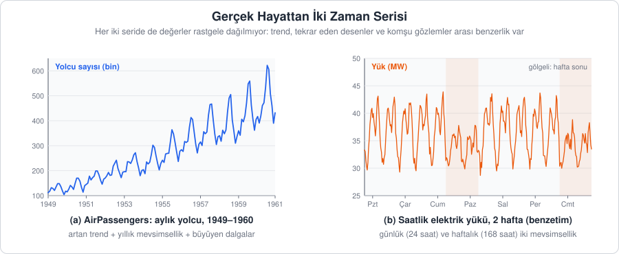

*Şekil 1.1 — (a) Derste sık kullanacağımız `AirPassengers` serisi: 1949–1960 arası aylık uluslararası havayolu yolcu sayısı (bin kişi). (b) Saatlik elektrik yükü (benzetim verisi): gündüz ve akşam tepeleri her gün, düşük hafta sonu tüketimi her hafta tekrar eder.*

Şekil 1.1'deki iki seri, ileride ayrıntılı inceleyeceğimiz kavramların neredeyse hepsini şimdiden gösterir. `AirPassengers` serisinde yolcu sayısı yıllar içinde **artar** (trend), her yaz **zirve** yapar (mevsimsellik) ve bu yaz tepeleri seviye yükseldikçe **büyür**. Elektrik yükünde ise iki ayrı tekrar eden desen vardır: 24 saatlik günlük döngü ve 7 günlük haftalık döngü. Bu bileşenler Bölüm 2'de sistematik olarak ele alınacaktır.

---

### 1.2. Zaman Serisini Sıradan Veriden Farklı Kılan Nedir?

**Açıklama:** Bir sınıftaki öğrencilerin boy ölçümlerini bir tabloya yazdığımızı düşünelim. Satırların sırasını değiştirirsek hiçbir şey kaybetmeyiz: ortalama boy, en uzun öğrenci, dağılım aynı kalır. Çünkü bir öğrencinin boyu, tabloda bir önceki satırdaki öğrencinin boyu hakkında bilgi vermez.

Zaman serisinde durum tamamen farklıdır. Bu ayın yolcu sayısı, geçen ayın yolcu sayısına **çok benzer**. Bu temmuzun değeri, geçen temmuzun değeriyle **yakından ilişkilidir**. Yani gözlemler birbirinden bağımsız değildir; aralarında bir **bağımlılık** (dependence) vardır. Bu yüzden sıra, verinin kendisi kadar önemli bir bilgidir.

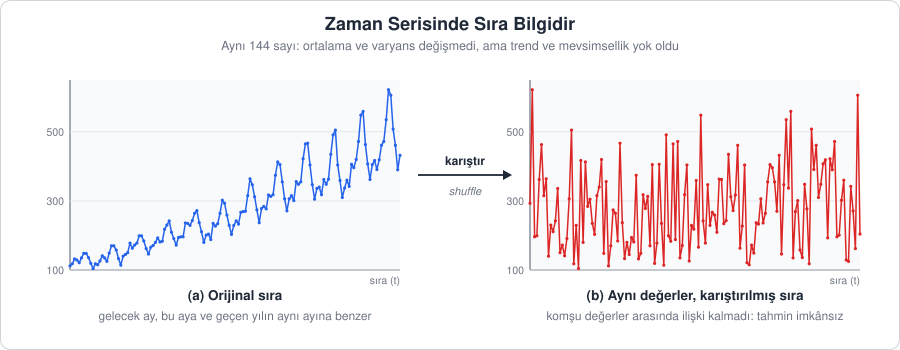

*Şekil 1.2 — Solda `AirPassengers` serisinin orijinal hâli, sağda aynı 144 değerin rastgele karıştırılmış hâli. İki grafikteki sayılar aynıdır; ortalama ve varyans değişmez. Ancak trend, mevsimsellik ve "komşu aylar birbirine benzer" bilgisi tamamen kaybolur.*

**Tanım:** Klasik istatistik yöntemlerinin çoğu, gözlemlerin **bağımsız ve özdeş dağılımlı** olduğunu varsayar. Zaman serisinde ise yakın zamanlı gözlemler genellikle birbiriyle ilişkilidir:

$$
\mathrm{Cov}(x_t, x_{t-h}) \neq 0 \quad \text{(en azından bazı } h \text{ gecikmeleri için)}
$$

> **Simge notu:** $`\mathrm{Cov}(\cdot,\cdot)`$ *(kovaryans)*: iki değişkenin birlikte değişim ölçüsü · $`\neq`$ *(eşit değildir)* · $`h`$: iki gözlem arasındaki zaman mesafesi, yani gecikme (lag)

Bu ilişkiye **otokorelasyon** (kendi geçmişiyle korelasyon) denir ve ölçülmesi Bölüm 6'da ayrıntılı olarak ele alınır. Bu basit gözlemin üç önemli sonucu vardır:

1. **Bağımlılık bir engel değil, bir fırsattır.** Geçmiş gelecek hakkında bilgi taşıdığı için tahmin yapabiliriz. ARIMA'dan LSTM'e kadar dersteki tüm modeller bu bağımlılığı farklı yollarla öğrenir.
2. **Standart yöntemler olduğu gibi kullanılamaz.** Örneğin makine öğrenmesinde alışık olduğumuz *rastgele* eğitim-test ayrımı, gelecekteki bilgiyi modele sızdırır. Zaman serisinde test verisi her zaman eğitim verisinden **sonra** gelmelidir (Bölüm 8 ve Bölüm 16).
3. **Zamanın yönü önemlidir.** Model yalnızca geçmişi kullanarak geleceği tahmin etmelidir; tersini değil.

---

### 1.3. Zaman Serisi Analizinin Amaçları

Bir zaman serisini analiz ederken genellikle aşağıdaki beş amaçtan bir ya da birkaçını güderiz:

| Amaç | Yanıtlanan soru | Örnek |
| --- | --- | --- |
| **Tanımlama** (description) | Seride hangi desenler var? | Satışlarda yıllık artış ve aralık ayı zirvesi var mı? |
| **Açıklama** (explanation) | Seriyi hangi etkenler ve ilişkiler belirliyor? | Faizdeki artış birkaç ay sonra enflasyonu nasıl etkiliyor? |
| **Tahmin** (forecasting) | Gelecekte hangi değerler bekleniyor? | Önümüzdeki 12 ayda kaç yolcu taşınacak? |
| **Anomali tespiti** (anomaly detection) | Hangi gözlemler olağan dışı? | Bir sunucunun trafiğindeki ani sıçrama saldırı olabilir mi? |
| **Kontrol** (control) | Süreç istenen düzeyde nasıl tutulur? | Bir üretim hattındaki sıcaklık sapmaya başladığında ne zaman müdahale edilmeli? |

Bu amaçlar birbirinden kopuk değildir. İyi bir tahmin için önce seriyi **tanımlamak** gerekir. Bir anomaliyi fark etmek için ise "normalde ne beklendiğini" gösteren bir tahmine ihtiyaç vardır: gözlenen değer tahmin aralığının çok dışına düşüyorsa, o gözlem şüphelidir.

**Tanım (tahmin):** $T$ anına kadar olan gözlemlere dayanarak $h$ adım sonrası için yapılan tahmin şöyle gösterilir:

$$
\hat{x}_{T+h} = g(x_T, x_{T-1}, \dots, x_1)
$$

Burada $g$, kullandığımız modeldir (ARIMA, Prophet, XGBoost, LSTM vb.). Tahmin ufku ($h$) büyüdükçe belirsizlik artar. Bu nedenle iyi bir tahmin, tek bir sayıyla birlikte bir **tahmin aralığı** da verir.

> **Simge notu:** $`\hat{x}_{T+h}`$ *(x şapka, T artı h)*: T anındaki bilgiyle, h adım sonrası için yapılan tahmin · $`g(\cdot)`$ *(ge)*: geçmiş gözlemleri tahmine dönüştüren model fonksiyonu

---

### 1.4. Uygulama Alanları

Zaman serisi verisi, ölçümün zaman içinde tekrarlandığı her alanda ortaya çıkar:

| Alan | Örnek seriler | Tipik amaç |
| --- | --- | --- |
| **Finans** | Hisse fiyatları, döviz kurları, işlem hacmi | Risk ölçümü, volatilite tahmini |
| **Ekonomi** | GSYH, enflasyon, işsizlik, faiz | Politika analizi, değişkenler arası ilişkiler |
| **Enerji** | Saatlik elektrik yükü, rüzgâr ve güneş üretimi | Kısa vadeli yük tahmini, şebeke planlaması |
| **Sağlık** | Günlük hasta kabulü, salgın vaka sayıları, EKG sinyalleri | Kapasite planlama, erken uyarı |
| **Perakende ve lojistik** | Günlük satışlar, stok düzeyleri, talep | Talep tahmini, stok optimizasyonu |
| **Çevre ve iklim** | Sıcaklık, yağış, hava kalitesi (PM2.5) | Mevsimsel desenler, uzun vadeli eğilimler |
| **Mühendislik ve IoT** | Sensör ölçümleri, makine titreşimleri | Arıza ve anomali tespiti, kestirimci bakım |
| **Ulaştırma** | Yolcu sayıları, trafik yoğunluğu | Kapasite ve sefer planlama |

---

### 1.5. Tipik Bir Zaman Serisi Analizinin İş Akışı

Hangi alanda çalışırsak çalışalım, zaman serisi analizi genellikle benzer adımlarla ilerler. Bu adımlar aynı zamanda dersin akışını da belirler.

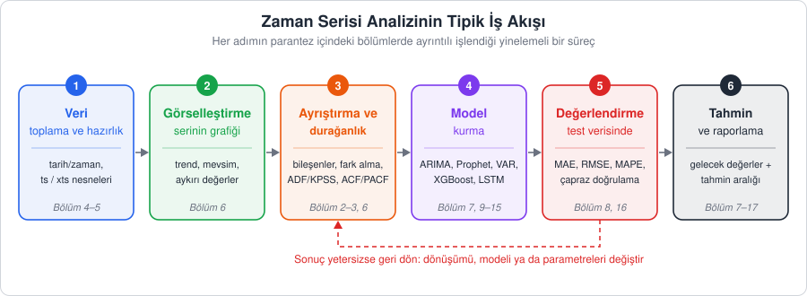

*Şekil 1.3 — Zaman serisi analizinin tipik adımları ve her adımın işlendiği bölümler. Değerlendirme adımında sonuç yetersizse geri dönülür; süreç doğrusal değil, yinelemelidir.*

1. **Veri toplama ve hazırlık:** Tarih-zaman bilgisinin doğru okunması, eksik gözlemlerin ele alınması ve verinin R'da bir zaman serisi nesnesine (`ts`, `xts`) dönüştürülmesi.
2. **Görselleştirme:** Seriyi çizmek her zaman ilk iştir. Trend, mevsimsellik, yapısal kırılmalar ve aykırı değerler çoğu zaman ilk grafikte fark edilir.
3. **Ayrıştırma ve durağanlık analizi:** Seriyi bileşenlerine ayırmak, durağan olup olmadığını testlerle sınamak ve gerekirse dönüşüm (log, fark alma) uygulamak. ACF/PACF grafikleri serinin "hafızasını" gösterir.
4. **Model kurma:** Serinin yapısına uygun bir model seçmek: klasik istatistiksel modeller (ARIMA/SARIMA, VAR), ayrıştırmaya dayalı modeller (Prophet) veya makine öğrenmesi ve derin öğrenme modelleri (XGBoost, LSTM, GRU, 1D-CNN).
5. **Değerlendirme:** Modeli, eğitimde görmediği **son dönem** verisi üzerinde MAE, RMSE, MAPE gibi metriklerle ölçmek. Sonuç yetersizse 3. ya da 4. adıma geri dönülür.
6. **Tahmin ve raporlama:** Seçilen modelle geleceği tahmin etmek, tahmin aralıklarıyla birlikte yorumlamak ve sunmak.

---

### 1.6. Dersin Yol Haritası

Ders 17 bölümden oluşur ve beş aşamada ilerler. Her aşama bir öncekinin üzerine kurulur. Bu nedenle bölümleri sırayla okumanız önerilir.

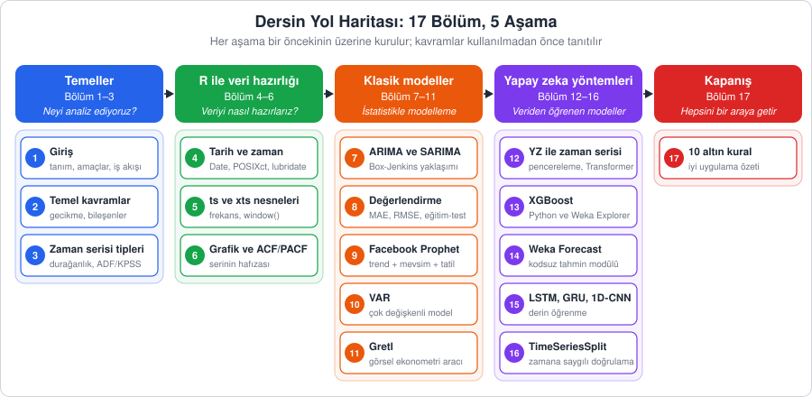

*Şekil 1.4 — Dersin beş aşaması ve her aşamadaki bölümler.*

**1. Temeller (Bölüm 1–3):** Zaman serisinin ne olduğunu, bileşenlerini (trend, mevsimsellik, döngü, düzensiz bileşen) ve tiplerini öğreniriz. Dersin en kritik kavramı olan **durağanlık** burada tanımlanır ve ADF/KPSS testleriyle nasıl sınanacağı gösterilir.

**2. R ile veri hazırlığı (Bölüm 4–6):** R'da tarih ve zaman nesneleriyle (`Date`, `POSIXct`, `lubridate`), zaman serisi nesneleriyle (`ts`, `xts`) çalışmayı öğreniriz. Ardından serileri görselleştirir, ayrıştırır ve ACF/PACF grafikleriyle serinin geçmişine ne kadar "bağlı" olduğunu okuruz.

**3. Klasik modeller ve değerlendirme (Bölüm 7–11):** Box-Jenkins yaklaşımıyla ARIMA ve SARIMA modellerini R ve Python'da kurarız. Bölüm 8'de modellerin başarısını ölçmek için hata metriklerini ve eğitim-test ayrımını öğreniriz; bu araçları sonraki tüm bölümlerde kullanacağız. Ardından Facebook Prophet'i, çok değişkenli VAR modelini ve kod yazmadan ekonometrik analiz yapmayı sağlayan Gretl'i inceleriz.

**4. Yapay zeka yöntemleri (Bölüm 12–16):** Bir zaman serisini denetimli öğrenme problemine dönüştürmeyi ve derin öğrenme yaklaşımının temel fikirlerini (LSTM hücresi, Transformer) öğreniriz. Ardından XGBoost'u Python ve Weka ile, Weka'nın zaman serisi tahmin modülünü ve LSTM, GRU, 1D-CNN gibi derin öğrenme modellerini uygularız. Bölüm 16'da zaman sırasını bozmadan çapraz doğrulama yapmayı sağlayan `TimeSeriesSplit` ele alınır.

**5. Kapanış (Bölüm 17):** Ders boyunca öğrenilenler, zaman serisi tahmininde dikkat edilmesi gereken on altın kuralda toplanır.

**Not —** Ders boyunca aynı veri setlerine (özellikle `AirPassengers`) farklı yöntemlerle tekrar tekrar döneceğiz. Böylece klasik modellerle yapay zeka modellerini aynı problem üzerinde karşılaştırma fırsatı bulacağız.

---

<a id="bolum-2"></a>

## 2. Zaman Serisinin Temel Kavramları ve Bileşenleri

Bir zaman serisini analiz etmeden önce, onu anlatırken kullanacağımız ortak dili öğrenmemiz gerekir. Bu bölümde önce temel kavramları (gözlem, zaman dizini, gecikme vb.) tanımlayacağız. Ardından bir serinin hangi "parçalardan" oluştuğunu, yani **bileşenlerini** inceleyeceğiz.

Bunu bir müzik parçasına benzetebiliriz: Kulağımıza tek bir ses gelir, ama o ses aslında bas gitar (yavaş ve uzun vadeli hareket), davul (düzenli tekrar eden ritim) ve birkaç rastgele tınının toplamıdır. Zaman serisi analizinde de gözlediğimiz tek bir çizginin arkasındaki bu "enstrümanları" birbirinden ayırmaya çalışırız.

---

### 2.1. Temel Kavramlar

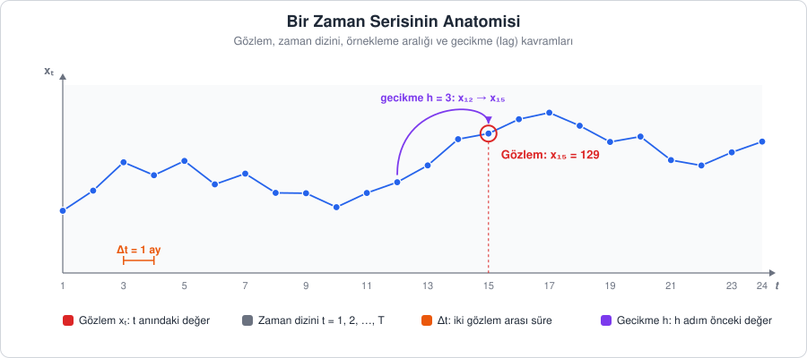

*Şekil 2.1 — Bir zaman serisinin temel kavramları: gözlem ($`x_t`$), zaman dizini ($`t`$), örnekleme aralığı ($`\Delta t`$) ve gecikme ($`h`$).*

> **Simge notu:** $`\Delta t`$ *(delta t)*: ardışık iki gözlem arasındaki zaman farkı (örnekleme aralığı)

**Açıklama:** Zaman serisi, bir büyüklüğün zaman içinde **sırayla** kaydedilmiş değerleridir. Sıra çok önemlidir: Sıradan bir veri setinde satırların yerini değiştirmek sonucu değiştirmez. Bir zaman serisinde ise satırları karıştırmak, bir filmin karelerini karıştırmak gibidir; hikâye kaybolur.

**Tanım:** Bir zaman serisi, zaman dizinine göre sıralanmış gözlemler kümesidir:

$$
\lbrace x_t\rbrace _{t=1}^{T} = \lbrace x_1, x_2, \dots, x_T\rbrace 
$$

> **Simge notu:** $`\lbrace x_t \rbrace_{t=1}^{T}`$ *(x t, t eşittir 1'den T'ye)*: t = 1, 2, …, T anlarındaki gözlemlerin sıralı kümesi · $`\dots`$ *(üç nokta)*: aradaki terimler aynı düzenle devam eder

Bu gösterimdeki kavramlar şunlardır:

| Kavram | Gösterim | Anlamı | Örnek |
| --- | --- | --- | --- |
| **Gözlem** (observation) | $x_t$ | $t$ anında ölçülen değer | 15. gündeki işlem sayısı: $x_{15} = 120$ |
| **Zaman dizini** (time index) | $t = 1, 2, \dots, T$ | Gözlemlerin sıra numarası | 1. ay, 2. ay, … |
| **Seri uzunluğu** | $T$ | Toplam gözlem sayısı | `AirPassengers`: $T = 144$ ay |
| **Örnekleme aralığı** | $\Delta t$ | Ardışık iki gözlem arasındaki süre | 1 ay, 1 gün, 1 saat |
| **Frekans** (frequency) | $s$ | Bir mevsimlik döngüdeki gözlem sayısı (R'daki karşılığı Bölüm 5'te) | Aylık veride $s = 12$, çeyreklik veride $s = 4$ |
| **Gecikme** (lag) | $x_{t-h}$ | $h$ adım önceki gözlem | $h = 1$: bir önceki ay, $h = 12$: geçen yılın aynı ayı |

> **Gecikme neden bu kadar önemli?** Zaman serisi analizinin temel varsayımı, **geçmişin geleceği hakkında bilgi taşıdığıdır.** Bugünkü değer ($x_t$) ile gecikmeli değerler ($x_{t-1}, x_{t-2}, \dots$) arasındaki ilişki, ACF/PACF grafiklerinin (Bölüm 6), ARIMA modellerinin (Bölüm 7) ve LSTM gibi derin öğrenme modellerinin (Bölüm 15) temelini oluşturur.

Sık kullanılan iki operatör, formülleri kısaltmamızı sağlar:

- **Gecikme (backshift) operatörü:** $B x_t = x_{t-1}$ ve genel olarak $B^h x_t = x_{t-h}$.
- **Fark operatörü:** $\nabla x_t = x_t - x_{t-1} = (1 - B) x_t$. Mevsimsel fark ise $\nabla_s x_t = x_t - x_{t-s} = (1 - B^s) x_t$ şeklindedir.

> **Simge notu:** $`B`$ *(be)*: gecikme (backshift) operatörü, seriyi bir adım geriye kaydırır · $`B^h`$ *(be üzeri h)*: B'nin h kez uygulanması, yani h adım geri kaydırma · $`\nabla`$ *(nabla)*: birinci fark operatörü · $`\nabla_s`$ *(nabla s)*: s adımlık mevsimsel fark operatörü

Örneğin gözlemler $5, 8, 6$ ise birinci fark serisi $8 - 5 = 3$ ve $6 - 8 = -2$ değerlerinden oluşur. Fark almak serinin başından bir gözlem (mevsimsel farkta $s$ gözlem) kaybettirir.

---

### 2.2. Zaman Serisinin Bileşenleri

**Açıklama:** Bir dondurmacının aylık satışlarını düşünelim. Satışlar:

- dükkân tanındıkça yıldan yıla **artıyor** (trend),
- her yıl yazın **zirve**, kışın **dip** yapıyor (mevsimsellik),
- ekonomi iyi giderken biraz yükselip kriz yıllarında biraz düşüyor (döngü),
- bazı aylarda da açıklanamayan küçük iniş çıkışlar gösteriyor (gürültü).

Gözlediğimiz satış rakamı, bu dört etkinin **üst üste binmiş** hâlidir.

**Tanım (toplamsal ayrıştırma):**

$$
x_t = T_t + S_t + C_t + I_t
$$

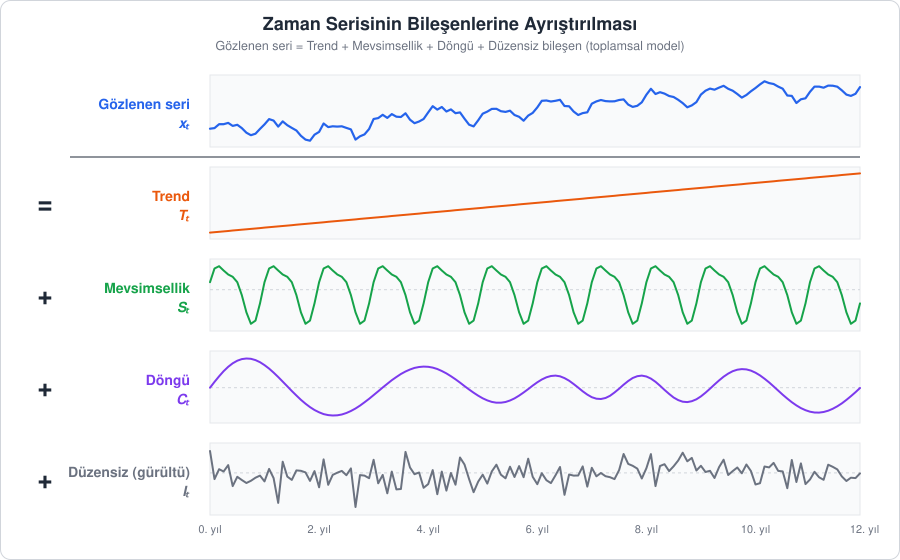

*Şekil 2.2 — Gözlenen seri (en üstte), altındaki dört bileşenin toplamıdır. Tek başına bakıldığında karmaşık görünen seri, ayrıştırılınca basit parçalara dönüşür.*

| Bileşen | Sembol | Ne anlatır? | Zaman ölçeği | Örnek |
| --- | --- | --- | --- | --- |
| **Trend** | $T_t$ | Uzun vadeli yön: artış, azalış ya da sabitlik | Yıllar | E-ticaret satışlarının sürekli büyümesi |
| **Mevsimsellik** | $S_t$ | Takvime bağlı, **sabit periyotla** tekrar eden desen | Gün, hafta, yıl içi | Yazın artan dondurma, kışın artan doğalgaz tüketimi |
| **Döngü** | $C_t$ | **Periyodu sabit olmayan**, genellikle uzun dalgalanmalar | Genellikle 2 yıldan uzun | Ekonomik genişleme ve daralma dönemleri |
| **Düzensiz bileşen** | $I_t$ | Diğer bileşenlerle açıklanamayan rastgele kısım | Her gözlem | Grev, beklenmedik hava olayı, ölçüm hatası |

**Bileşenlerin özellikleri:**

- **Trend** doğrusal olmak zorunda değildir. Üstel büyüme, doygunluğa ulaşan S-eğrisi ya da yön değiştiren bir trend de olabilir.
- **Mevsimsellik** için $S_t \approx S_{t-s}$ geçerlidir: desen her $s$ adımda bir tekrar eder. Toplamsal modelde mevsimsel etkilerin bir periyot boyunca toplamı sıfırdır ($\sum_{j=1}^{s} S_j = 0$). Böylece mevsimsellik seviyeyi değil, yalnızca yıl içindeki dağılımı etkiler.
- **Bir seride birden fazla mevsimsellik olabilir.** Örneğin saatlik elektrik tüketiminde hem günlük (24 saat) hem haftalık (168 saat) desen bulunur.
- **Düzensiz bileşen**, ideal durumda ortalaması sıfır olan ve kendi içinde ilişki taşımayan **beyaz gürültüdür**: $I_t \sim \text{iid}(0, \sigma^2)$. Ayrıştırma sonrasında artıklarda hâlâ bir desen görüyorsak, bazı yapıları yakalayamamışız demektir.

> **Simge notu:** $`\approx`$ *(yaklaşık eşittir)*: iki değer birbirine yakındır · $`\sum_{j=1}^{s}`$ *(sigma, j eşittir 1'den s'ye)*: j = 1, …, s için terimlerin toplamı · $`\sim`$ *(tilda)*: "… dağılımına sahiptir" · $`\text{iid}`$ *(ay-ay-di)*: bağımsız ve özdeş dağılımlı (independent and identically distributed) · $`\sigma^2`$ *(sigma kare)*: varyans

> **Uygulamada trend ve döngü genellikle birleştirilir.** Döngünün periyodu değişken olduğu için onu trendden güvenilir biçimde ayırmak zordur. Bu yüzden R'daki `decompose()` ve `stl()` gibi yöntemler seriyi **üç** bileşene ayırır: *trend-döngü* ($T_t$, döngüyü de içerir), *mevsimsellik* ($S_t$) ve *kalan* ($R_t$ ya da $I_t$). Bölüm 6'daki `decompose()` çıktısında bu yüzden yalnızca üç bileşen görürüz.

---

### 2.3. Mevsimsellik ile Döngüsellik Arasındaki Fark

Bu iki kavram, ikisi de "iniş çıkış" olduğu için en sık karıştırılan kavramlardır.

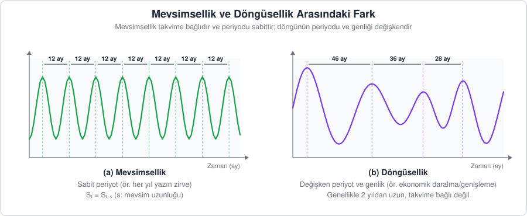

*Şekil 2.3 — (a) Mevsimsellikte tepeler arası mesafe hep aynıdır (12 ay). (b) Döngüde ise tepeler arası mesafe (46, 36, 28 ay) ve dalgaların yüksekliği değişir.*

| Özellik | Mevsimsellik | Döngüsellik |
| --- | --- | --- |
| Periyot | **Sabit** ve bilinir (12 ay, 7 gün, 24 saat) | **Değişken**, önceden bilinmez |
| Kaynağı | Takvim, iklim, gelenek (tatiller, bayramlar) | Ekonomik, sosyal ya da doğal süreçler |
| Süresi | Genellikle bir yıl veya daha kısa | Genellikle 2 yıldan uzun |
| Genlik | Görece istikrarlı | Döngüden döngüye değişir |
| Tahmin edilebilirlik | Yüksek: "gelecek temmuz da zirve olacak" | Düşük: "bir sonraki kriz ne zaman?" |

**Pratik bir test:** Kendinize şunu sorun: *"Bir sonraki tepenin hangi tarihte olacağını takvime bakarak söyleyebilir miyim?"* Cevap evetse mevsimselliktir, hayırsa döngüdür.

---

### 2.4. Toplamsal ve Çarpımsal Model

Bileşenler her zaman toplanarak bir araya gelmez. Bazı serilerde birbirleriyle **çarpılarak** birleşirler.

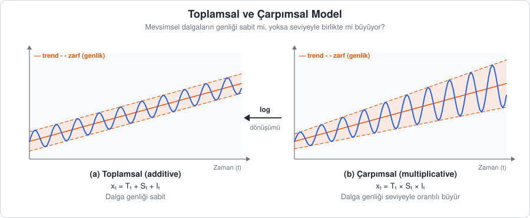

*Şekil 2.4 — (a) Toplamsal modelde mevsimsel dalgaların yüksekliği trendden bağımsızdır. (b) Çarpımsal modelde dalgalar seviyeyle birlikte büyür: seri "huni" gibi açılır.*

**Tanım 1 (toplamsal model):**

$$
x_t = T_t + S_t + I_t
$$

Mevsimsel etki **sabit bir miktardır.** Örneğin "Temmuz'da satışlar ortalamadan her yıl yaklaşık 500 birim fazladır."

**Tanım 2 (çarpımsal model):**

$$
x_t = T_t \times S_t \times I_t
$$

Mevsimsel etki **bir orandır.** Örneğin "Temmuz'da satışlar ortalamadan her yıl yaklaşık %20 fazladır." Trend yükseldikçe bu %20'nin mutlak karşılığı da büyür. Çarpımsal modelde mevsimsel katsayıların ortalaması 1'dir. Örneğin $S_{\text{Temmuz}} = 1.20$, %20 fazlalık anlamına gelir.

**Hangisini seçmeliyim?**

| Grafikte ne görüyorsunuz? | Model |
| --- | --- |
| Mevsimsel dalgaların yüksekliği zaman içinde yaklaşık sabit | Toplamsal |
| Dalgalar seviye yükseldikçe büyüyor ("huni" şekli) | Çarpımsal |

**Log dönüşümü ile köprü kurmak:** Çarpımsal bir modelin logaritması alınınca model toplamsal hâle gelir:

$$
\log x_t = \log T_t + \log S_t + \log I_t
$$

> **Simge notu:** $`\log`$ *(logaritma)*: doğal logaritma (R'daki `log()` gibi e tabanında); çarpımı toplama çevirir: log(a × b) = log a + log b

Bu nedenle çarpımsal yapıdaki serilerde (örneğin `AirPassengers`) önce `log()` dönüşümü uygulanır, ardından toplamsal yöntemler kullanılır. Bölüm 7'deki SARIMA uygulamasında `log(AirPassengers)` kullanmamızın nedeni budur.

---

### 2.5. Durağanlık: Kısa Bir Ön Bakış

Bileşenler kavramı bizi doğrudan dersin en kritik kavramına götürür: **durağanlık** (stationarity).

**Açıklama:** Durağan bir seride trend ve mevsimsellik yoktur. Serinin hangi zaman diliminden bir parça alırsanız alın, ortalama ve dalgalanma düzeyi aynıdır. Yani kabaca, **durağan bir seri, yalnızca düzensiz bileşenden oluşan bir seriye benzer.**

Bu yüzden ayrıştırma ile durağanlık birbirine sıkı sıkıya bağlıdır: Klasik modellerin (ARIMA vb.) çoğu durağan seri ister. Seriyi durağanlaştırmak için yaptığımız işlemler de aslında bileşenleri temizlemektir:

- Fark alma ($\nabla x_t$) **trendi**,
- Mevsimsel fark alma ($\nabla_s x_t$) **mevsimselliği**,
- Log dönüşümü ise **çarpımsal yapıyı ve artan varyansı** ortadan kaldırır.

Durağanlığın matematiksel tanımı ve testleri Bölüm 3.2'de ayrıntılı olarak ele alınmaktadır.

---

### 2.6. Mini Uygulama: `AirPassengers` Serisini Ayrıştırmak

> 💻 **Uygulama dosyası:** [`Codes/R/ch02_ayristirma.R`](Codes/R/ch02_ayristirma.R)
>
> Bu bölümdeki R kodlarının tamamı bu dosyada. RStudio'da açıp satır satır çalıştırabilir ya da depo kök dizininde `Rscript Codes/R/ch02_ayristirma.R` komutunu kullanabilirsiniz.


`AirPassengers` serisinde mevsimsel dalgalar yıllar içinde büyüdüğü için çarpımsal model uygundur. Aşağıdaki kod iki yaklaşımı karşılaştırır.

```r
data("AirPassengers")

# 1) Çarpımsal ayrıştırma: xt = Tt x St x It
ayr_carp <- decompose(AirPassengers, type = "multiplicative")
plot(ayr_carp)

# Mevsimsel katsayılar (ortalaması 1): Temmuz ~1.23 -> ortalamadan ~%23 fazla
round(ayr_carp$figure, 3)

# 2) Log dönüşümü + toplamsal ayrıştırma: log(xt) = log(Tt) + log(St) + log(It)
ayr_log <- decompose(log(AirPassengers), type = "additive")
plot(ayr_log)

# 3) Daha modern ve sağlam bir yöntem: STL (Seasonal-Trend decomposition using Loess)
ayr_stl <- stl(log(AirPassengers), s.window = "periodic")
plot(ayr_stl)
```

**Grafikleri yorumlarken:**

- **trend** panelinde yolcu sayısının 1949–1960 arasında istikrarlı biçimde arttığını,
- **seasonal** panelinde her yıl Temmuz–Ağustos'ta zirve, Kasım'da dip olduğunu,
- **random** panelinde belirgin bir desen kalmadığını, yani ayrıştırmanın yapıyı büyük ölçüde yakaladığını görürüz.

<details>
<summary><b>Kendinizi test edin (cevaplar için tıklayın)</b></summary>

1. **Bir alışveriş merkezinin günlük ziyaretçi sayısında hafta sonları sürekli artış görülüyor. Bu hangi bileşendir? Periyodu nedir?**
   → Mevsimsellik. Periyot 7 gündür (günlük veride $s = 7$).

2. **Bir ülkenin GSYH serisinde 1990–2020 arasında 3, 7 ve 5 yıl arayla gerçekleşen üç durgunluk dönemi var. Bu hangi bileşendir?**
   → Döngü. Periyot sabit değildir ve takvimden önceden tahmin edilemez.

3. **Bir seride mevsimsel dalgaların yüksekliği 10 yılda iki katına çıkmış. Hangi model uygundur, ne yapılmalıdır?**
   → Çarpımsal model. Ya doğrudan `type = "multiplicative"` kullanılır ya da seriye `log()` uygulanıp toplamsal yöntemlerle devam edilir.

4. **Ayrıştırma sonrasında düzensiz bileşende hâlâ her yıl tekrar eden bir desen görüyorsunuz. Bu ne anlama gelir?**
   → Mevsimsellik tam olarak yakalanamamıştır. Model türü (toplamsal/çarpımsal) yanlış seçilmiş olabilir, mevsimsel desen zamanla değişiyor olabilir (bu durumda `stl()` ile `s.window` ayarlanmalıdır) ya da ikinci bir mevsimsellik bulunuyor olabilir.

5. **$`\nabla_{12}  x_t`$ ifadesi ne anlama gelir?**
   → $x_t - x_{t-12}$: Aylık bir seride her ayın geçen yılın aynı ayından farkı, yani mevsimsel fark.

</details>

---

<a id="bolum-3"></a>

## 3. Zaman Serisi Tipleri

Bir doktor tedaviye başlamadan önce teşhis koyar. Zaman serisi analizinde de durum aynıdır: **modeli seçmeden önce serinin "tipini" belirlemeliyiz.** Çünkü her seriye aynı yöntem uygulanmaz; yanlış tipe uygun bir model seçmek, grip hastasına kırık kol tedavisi uygulamaya benzer.

Zaman serilerini sınıflandırırken **dört bağımsız eksen** kullanırız. Buradaki kilit fikir şudur: bu eksenler birbirini dışlamaz. Her seri, her eksenden **birer etiket** alır. Örneğin derste sık kullanacağımız `AirPassengers` serisi aynı anda *tek değişkenli*, *durağan olmayan*, *kesikli zamanlı* ve *stokastik* bir seridir.

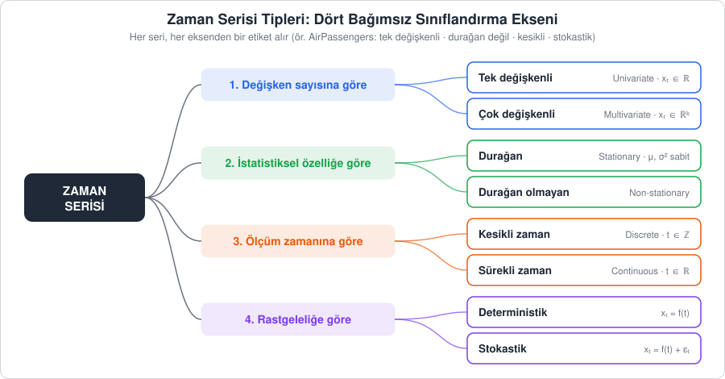

*Şekil 3.1 — Zaman serilerini sınıflandırmanın dört ekseni. Her seri her eksenden bir etiket alır.*

> **Neden önemli?** Serinin tipi, kullanılacak araç setini doğrudan belirler:
>
> | Serinin tipi | Tipik soru | Örnek yöntemler (bu derste) |
> | --- | --- | --- |
> | Tek değişkenli | "Bu serinin geçmişi geleceği hakkında ne söylüyor?" | ARIMA/SARIMA (Bölüm 7), Prophet (Bölüm 9), XGBoost (Bölüm 13), LSTM/GRU/1D-CNN (Bölüm 15) |
> | Çok değişkenli | "Seriler birbirini nasıl etkiliyor?" | VAR (Bölüm 10, Gretl ile Bölüm 11), çok girdili LSTM/GRU (Bölüm 15) |
> | Durağan olmayan | "Seriyi nasıl durağan hâle getiririm?" | Fark alma, log dönüşümü (Bölüm 2.4, 3.2), ADF/KPSS testleri (Bölüm 3.2 ve 7) |
> | Stokastik | "Tahminim ne kadar belirsiz?" | Tahmin aralıkları (Bölüm 7, 9), eğitim-test ayrımı ve hata metrikleri (Bölüm 8, 16) |

---

### 3.1. Değişken Sayısına Göre: Tek Değişkenli ve Çok Değişkenli

**Açıklama:** Bir öğrencinin notlarını tahmin etmek istediğinizi düşünün. Yalnızca öğrencinin geçmiş notlarına bakarsanız *tek değişkenli*, geçmiş notlarının yanında çalışma saatini, devam durumunu ve uyku süresini de birlikte izlerseniz *çok değişkenli* bir analiz yapmış olursunuz.

**Tanım:**

- **Tek değişkenli (univariate) seri:** Her $t$ anında tek bir skaler gözlem vardır.

$$
\lbrace x_t\rbrace _{t=1}^{T}, \qquad x_t \in \mathbb{R}
$$

> **Simge notu:** $`\in`$ *(elemanıdır)*: soldaki öğe sağdaki kümeye aittir · $`\mathbb{R}`$ *(reel sayılar)*: tüm gerçel sayıların kümesi

- **Çok değişkenli (multivariate) seri:** Her $t$ anında $k$ değişkenden oluşan bir **gözlem vektörü** vardır.

$$
\mathbf{x}_t = (x_{1t}, x_{2t}, \dots, x_{kt})^\top \in \mathbb{R}^k
$$

> **Simge notu:** $`\mathbf{x}_t`$ *(kalın x t)*: t anındaki gözlem vektörü · $`^\top`$ *(transpoz)*: satır vektörünü sütun vektörüne çevirir · $`\mathbb{R}^k`$ *(R üzeri k)*: k bileşenli gerçel sayı vektörlerinin kümesi

Çok değişkenli analizde yalnızca her serinin kendi geçmişi değil, seriler **arasındaki** ilişkiler de modellenir. Örneğin faizdeki bir artışın birkaç ay sonra enflasyonu etkilemesi gibi. Bu ilişkiler çapraz kovaryans ile ölçülür: $\mathrm{Cov}(x_{i,t}, x_{j,t-h})$. Bu değer, $i$. serinin bugünkü değeri ile $j$. serinin $h$ adım önceki değerinin birlikte nasıl değiştiğini gösterir.

> **Simge notu:** $`\mathrm{Cov}(\cdot,\cdot)`$ *(kovaryans)*: iki değişkenin birlikte değişim ölçüsü; pozitifse birlikte artıp azalırlar

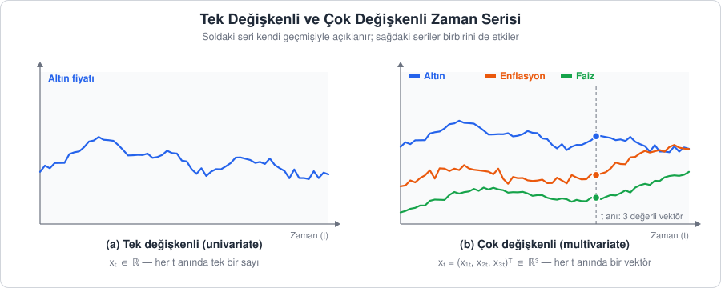

*Şekil 3.2 — (a) Tek değişkenli seride her an tek bir sayı vardır. (b) Çok değişkenli seride her an bir vektördür (kesikli çizgi ile gösterilen kesit).*

| | Tek değişkenli | Çok değişkenli |
| --- | --- | --- |
| Her andaki gözlem | Bir sayı: $x_t$ | Bir vektör: $\mathbf{x}_t$ |
| Örnek | Aylık yolcu sayısı (`AirPassengers`) | Altın fiyatı + enflasyon + faiz |
| Güçlü yanı | Basit, az veri ister, yorumlaması kolay | Değişkenler arası etkileşimi yakalar |
| Zayıf yanı | Dış etkenleri görmez | Parametre sayısı hızla artar, daha çok veri ister |

> **Dikkat, sık yapılan bir karışıklık:** Bir hedef seriyi dış değişkenlerle birlikte tahmin etmek (ör. ARIMAX, Prophet'a regresör eklemek) *her zaman* tam çok değişkenli modelleme değildir. Orada ilişki **tek yönlüdür** (dış değişken → hedef). VAR gibi gerçek çok değişkenli modellerde ise tüm seriler **birbirini karşılıklı olarak** etkiler (ayrıntısı Bölüm 10'da).

---

### 3.2. İstatistiksel Özelliklere Göre: Durağan ve Durağan Olmayan

> 💻 **Uygulama dosyası:** [`Codes/R/ch03_duraganlik.R`](Codes/R/ch03_duraganlik.R)
>
> Bu bölümdeki R kodlarının tamamı bu dosyada. RStudio'da açıp satır satır çalıştırabilir ya da depo kök dizininde `Rscript Codes/R/ch03_duraganlik.R` komutunu kullanabilirsiniz.


Bu ayrım, klasik zaman serisi analizinin **en kritik** kavramıdır.

**Açıklama:** Sakin bir göl yüzeyini düşünün. Dalgacıklar vardır ama su seviyesi (ortalama) ve dalgaların büyüklüğü (varyans) hep aynıdır. Hangi saatte fotoğraf çekerseniz çekin, göl "aynı karakterde" görünür. Bu **durağan** bir seridir. Şimdi yağmur mevsiminde yükselen bir nehri düşünün: su seviyesi sürekli değişir. Bu da **durağan olmayan** bir seridir.

Kısacası durağan bir seride, **serinin hangi zaman diliminden bir parça alırsanız alın, istatistiksel olarak benzer görünür.**

**Tanım 1 (zayıf / kovaryans durağanlığı):** Bir $\lbrace x_t\rbrace$ süreci aşağıdaki üç koşulu sağlıyorsa *zayıf durağandır*:

```math
\begin{aligned}
&1)\quad E[x_t] = \mu && \text{(ortalama sabit, } t\text{'ye bağlı değil)}\\
&2)\quad \mathrm{Var}(x_t) = \sigma^2 < \infty && \text{(varyans sabit ve sonlu)}\\
&3)\quad \mathrm{Cov}(x_t, x_{t+h}) = \gamma(h) && \text{(kovaryans yalnızca gecikme } h\text{'ye bağlı)}
\end{aligned}
```

> **Simge notu:** $`E[\cdot]`$ *(beklenen değer)*: rastgele değişkenin kuramsal ortalaması · $`\mu`$ *(mü)*: ortalama · $`\mathrm{Var}(\cdot)`$ *(varyans)*: ortalama etrafındaki yayılım · $`\sigma^2`$ *(sigma kare)*: varyansın değeri · $`\infty`$ *(sonsuz)*: $`\sigma^2 < \infty`$ varyansın sonlu olduğunu belirtir · $`\gamma(h)`$ *(gama h)*: h gecikmeli öz-kovaryans (otokovaryans) fonksiyonu

Üçüncü koşul şunu söyler: bugün ile yarın arasındaki ilişki, geçen yılın aynı iki ardışık günü arasındaki ilişkiyle aynıdır. İlişki "saatin" kaç olduğuna değil, yalnızca **aradaki mesafeye** bağlıdır.

> **Tanım 2 (katı / strict durağanlık):** Daha güçlü bir koşuldur; $(x_{t_1}, \dots, x_{t_n})$ vektörünün **ortak olasılık dağılımının** tamamı zaman kaymasına karşı değişmezdir. Uygulamada "durağan" dendiğinde neredeyse her zaman *zayıf durağanlık* kastedilir.

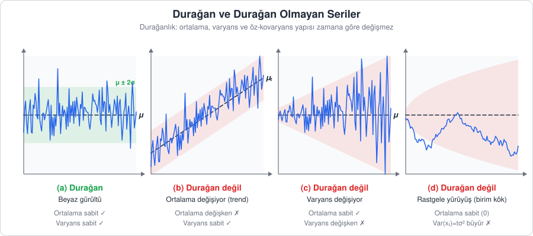

*Şekil 3.3 — (a) Beyaz gürültü: ortalama ve varyans sabit. (b) Trend: ortalama zamanla artıyor. (c) Varyans zamanla büyüyor. (d) Rastgele yürüyüş: ortalama sabit görünse de varyans $`t\sigma^2`$ şeklinde büyür; bu nedenle durağan değildir.*

**Durağanlığı bozan başlıca nedenler:**

| Neden | Ne değişir? | Tipik çözüm |
| --- | --- | --- |
| Trend | Ortalama ($\mu_t$) | Fark alma: $\nabla x_t = x_t - x_{t-1}$ ya da trendi çıkarma |
| Mevsimsellik | Ortalama, periyodik olarak | Mevsimsel fark: $x_t - x_{t-s}$ (aylık veride $s=12$) |
| Değişen varyans | Varyans ($\sigma_t^2$) | Log veya Box-Cox dönüşümü |
| Birim kök (rastgele yürüyüş) | Varyans zamanla büyür | Fark alma |

> **Simge notu:** $`\mu_t`$ *(mü t)*: zamana bağlı olarak değişen ortalama · $`\sigma_t^2`$ *(sigma t kare)*: zamana bağlı olarak değişen varyans · $`\nabla`$ *(nabla)*: birinci fark operatörü (Bölüm 2.1)

**Not — iki farklı "durağan olmayan" türü:**

- **Trend-durağan (trend-stationary):** $x_t = \beta_0 + \beta_1 t + \varepsilon_t$. Deterministik trend çıkarılınca seri durağan olur. Şoklar geçicidir, seri trende geri döner.
- **Fark-durağan (difference-stationary, birim köklü):** $x_t = x_{t-1} + \varepsilon_t$ (rastgele yürüyüş). Burada $\mathrm{Var}(x_t) = t\sigma^2$ olur. Şoklar **kalıcıdır**, bu yüzden seriyi durağanlaştırmak için fark almak gerekir: $\nabla x_t = \varepsilon_t$.

> **Simge notu:** $`\beta_0`$, $`\beta_1`$ *(beta sıfır, beta bir)*: doğrusal trendin sabit terimi ve eğimi · $`\varepsilon_t`$ *(epsilon t)*: t anındaki rastgele şok (hata terimi), ortalaması sıfır

Bu ayrım önemlidir çünkü yanlış dönüşüm (trend-durağan seriden fark almak ya da birim köklü seriden sadece trend çıkarmak) hatalı modellere yol açar. ARIMA'daki "I" (Integrated) harfi tam olarak bu fark alma işlemini temsil eder.

**Durağanlığı nasıl anlarız?**

1. **Göz ile:** Seriyi çizin. Belirgin bir trend, mevsimsellik ya da açılan bir "huni" varsa seri büyük olasılıkla durağan değildir.
2. **ACF grafiği ile:** Durağan olmayan serilerde ACF çok yavaş söner (ayrıntısı Bölüm 6'da).
3. **İstatistiksel testlerle:** ADF testi ($H_0$: birim kök var, yani seri durağan değil) ve KPSS testi ($H_0$: seri durağan). İki test zıt hipotezler kurduğu için birlikte kullanılması önerilir. Bu testlerin ARIMA modellemesindeki kullanımı Bölüm 7'de gösterilmektedir.

> **Simge notu:** $`H_0`$ *(ha sıfır)*: sıfır hipotezi, testin aksi kanıtlanana kadar doğru kabul ettiği varsayım

**Mini uygulama (R):** Beyaz gürültü ile rastgele yürüyüşü üretip karşılaştıralım.

```r
set.seed(42)
beyaz_gurultu <- rnorm(200)             # durağan
rastgele_yuruyus <- cumsum(rnorm(200))  # durağan değil (birim kök)

par(mfrow = c(1, 2))
plot.ts(beyaz_gurultu, main = "Beyaz Gürültü (durağan)")
plot.ts(rastgele_yuruyus, main = "Rastgele Yürüyüş (durağan değil)")
par(mfrow = c(1, 1))

# install.packages("tseries")
library(tseries)
adf.test(beyaz_gurultu)           # küçük p-değeri -> H0 reddedilir -> durağan
adf.test(rastgele_yuruyus)        # büyük p-değeri -> birim kök var
adf.test(diff(rastgele_yuruyus))  # farkı alınınca durağanlaşır
```

**Çıktıyı yorumlarken:** Her `adf.test()` çıktısında en önemli satır `p-value` değeridir. Beyaz gürültüde p-değeri 0.05'in altında çıkar ve birim kök hipotezi reddedilir. Rastgele yürüyüşte p-değeri genellikle 0.05'ten büyüktür; birim kök hipotezi reddedilemez. Farkı alınmış seride ise p-değeri yeniden küçülür. Bu, $\nabla x_t = \varepsilon_t$ ilişkisinin uygulamadaki karşılığıdır. (`adf.test()` p-değerini 0.01 ile 0.10 arasına sıkıştırdığı için çok küçük değerlerde "p-value smaller than printed p-value" uyarısı görebilirsiniz; bu bir hata değildir.)

---

### 3.3. Ölçüm Zamanına Göre: Kesikli ve Sürekli Zaman

**Açıklama:** Bir odadaki sıcaklık, zamanın **her anında** bir değere sahiptir. Bu *sürekli* bir süreçtir. Ancak bir termometre bu sıcaklığı yalnızca belirli anlarda, örneğin her saat başı, kaydeder. Bilgisayara giren veri artık *kesikli* bir seridir. Film de böyledir: gerçek hareket süreklidir ama kamera saniyede 24 kare kaydeder.

**Tanım:**

- **Sürekli zamanlı seri:** $\lbrace x(t) : t \in \mathbb{R}\rbrace$. Zaman ekseni kesintisizdir.
- **Kesikli zamanlı seri:** $\lbrace x_t : t \in \mathbb{Z}\rbrace$. Gözlemler yalnızca belirli anlarda vardır. Sürekli bir süreçten $\Delta t$ aralıklarla **örnekleme (sampling)** yapılarak elde edilir:

$$
x_t = x(t \cdot \Delta t), \qquad t = 0, 1, 2, \dots
$$

> **Simge notu:** $`x(t)`$ *(x parantez t)*: sürekli zamanda t anındaki değer · $`\mathbb{Z}`$ *(tam sayılar)*: …, −1, 0, 1, 2, … kümesi · $`\Delta t`$ *(delta t)*: örnekleme aralığı · $`\cdot`$ *(çarpı)*: çarpma

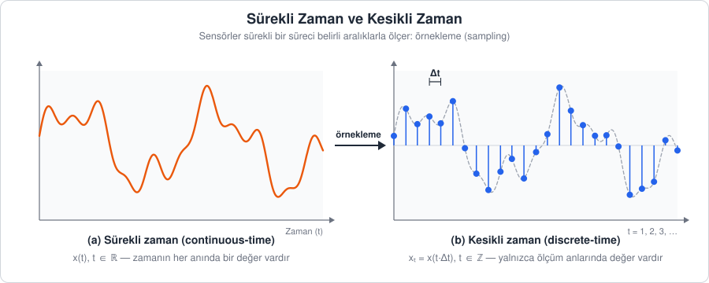

*Şekil 3.4 — Solda sürekli bir sinyal, sağda aynı sinyalin $`\Delta t`$ aralıklarla örneklenmiş kesikli hâli.*

Bu dersteki ve gerçek dünyadaki analizlerin **büyük çoğunluğu kesikli zamanlıdır**, çünkü bilgisayarlar yalnızca sonlu sayıda ölçümü saklayabilir. EKG, sismograf veya ses sinyali gibi doğası gereği sürekli olan süreçler bile analizden önce örneklenerek kesikli seriye dönüştürülür.

**Kesikli serilerde iki önemli ayrıntı:**

1. **Örnekleme frekansı:** $\Delta t$'nin seçimi hangi desenleri görebileceğimizi belirler. Aylık veride haftalık bir döngüyü asla göremezsiniz. R'daki `ts` nesnesinin `frequency` parametresi tam olarak bu bilgiyi tutar (ayrıntısı Bölüm 5'te).
2. **Düzenli ve düzensiz aralıklı seriler:**
    - *Düzenli (regular):* Gözlemler eşit aralıklıdır (her ay, her saat). Klasik modellerin (ARIMA vb.) çoğu bunu varsayar.
    - *Düzensiz (irregular):* Aralıklar eşit değildir (borsa yalnızca iş günleri açıktır, sensör ara sıra veri kaçırır). Bu tür veriler için `xts` gibi araçlar gerekir (ayrıntısı Bölüm 5'te).

> **Not — örtüşme (aliasing):** Örnekleme teoremine (Nyquist-Shannon) göre, bir süreçteki $f$ frekanslı bir salınımı doğru yakalayabilmek için örnekleme frekansının en az $2f$ olması gerekir. Daha seyrek örneklenirse hızlı döngüler yanlışlıkla yavaş döngüler gibi görünür. Örneğin günde bir kez, hep öğlen ölçülen sıcaklık serisinde gece-gündüz döngüsü tamamen kaybolur.

---

### 3.4. Rastgelelik Durumuna Göre: Deterministik ve Stokastik

**Açıklama:** Güneşin yarın saat kaçta doğacağını saniyesine kadar hesaplayabiliriz. Bu **deterministik** bir olaydır. Ama yarın kaç kişinin otobüse bineceğini kesin olarak bilemeyiz. En iyi ihtimalle "büyük olasılıkla 900 ile 1100 arasında" diyebiliriz. Bu da **stokastik** (rastlantısal) bir olaydır.

**Tanım:**

- **Deterministik seri:** Tamamen bilinen bir fonksiyonla ifade edilir, hiçbir belirsizlik içermez:

$$
x_t = f(t), \qquad \text{örneğin} \quad x_t = A \sin\left(\frac{2\pi t}{P}\right) + \beta t
$$

> **Simge notu:** $`f(t)`$ *(ef t)*: zamanın bilinen bir fonksiyonu · $`A`$: dalganın genliği · $`\pi`$ *(pi)*: ≈ 3.14159 sabiti · $`P`$: dalganın periyodu · $`\beta`$ *(beta)*: doğrusal trendin eğimi

- **Stokastik seri:** Bir **stokastik sürecin** (rastgele değişkenler ailesi $\lbrace X_t\rbrace$) bir gerçekleşmesidir. Genellikle sistematik bir kısım ile rastgele bir kısmın toplamı olarak yazılır:

$$
x_t = f(t) + \varepsilon_t, \qquad \varepsilon_t \sim \text{iid}(0, \sigma^2)
$$

> **Simge notu:** $`\lbrace X_t \rbrace`$ *(büyük X t)*: stokastik süreç, yani her t için bir rastgele değişken · $`\sim`$ *(tilda)*: "… dağılımına sahiptir" · $`\text{iid}(0, \sigma^2)`$ *(ay-ay-di sıfır, sigma kare)*: ortalaması 0, varyansı σ² olan bağımsız ve özdeş dağılımlı değişkenler

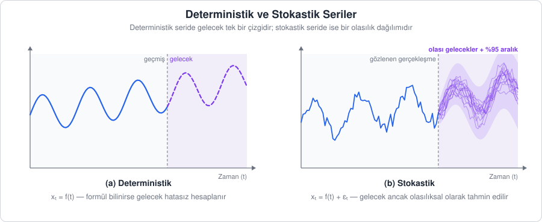

*Şekil 3.5 — (a) Deterministik seride gelecek tek bir çizgidir. (b) Stokastik seride ise aynı geçmişten birçok farklı gelecek doğabilir. Bu yüzden tahmin, bir **nokta** değil bir **aralık** olarak verilir.*

**Önemli kavram — gerçekleşme (realization):** Elimizdeki gözlenmiş seri (ör. 1949–1960 yolcu sayıları), olası sonsuz sayıda yoldan **yalnızca biridir**. Tarihi geri sarıp yeniden oynatabilseydik, biraz farklı bir seri görecektik. Bu bakış açısı iki önemli sonuç doğurur:

1. Tahminler her zaman **belirsizlik** içerir. Bu nedenle `forecast()` çıktılarında %80 ve %95'lik **tahmin aralıkları** görürüz.
2. Sürecin özelliklerini (ortalama, varyans, ACF) **tek bir gerçekleşmeden** tahmin etmek zorundayız. Bu ancak süreç durağan (ve ergodik) ise mümkündür. İşte durağanlığın bu kadar önemli olmasının asıl nedeni budur.

> **Gerçek dünyada** serilerin neredeyse tamamı stokastiktir. Deterministik bileşenler (trend, mevsimsellik) genellikle stokastik bir gürültüyle birlikte bulunur. Bölüm 2.2'deki $x_t = T_t + S_t + C_t + I_t$ ayrıştırması tam olarak bu fikre dayanır: $T_t$ ve $S_t$ büyük ölçüde sistematik, $I_t$ ise stokastik kısımdır.

---

### 3.5. Özet: Bir Seriyi Sınıflandırmak

Yeni bir veri setiyle karşılaştığınızda aşağıdaki dört soruyu sırayla sorun:

1. **Kaç değişken var?** → Tek değişkenli mi, çok değişkenli mi?
2. **Ortalama, varyans ve ilişkiler zamanla değişiyor mu?** → Durağan mı, değil mi?
3. **Veri nasıl ölçülmüş?** → Kesikli mi, sürekli mi? Aralıklar düzenli mi?
4. **Gelecek kesin olarak hesaplanabilir mi?** → Deterministik mi, stokastik mi?

Derste kullanacağımız serilerin sınıflandırması:

| Seri | Değişken sayısı | Durağanlık | Ölçüm zamanı | Rastgelelik |
| --- | --- | --- | --- | --- |
| `AirPassengers` (aylık yolcu) | Tek | Durağan değil (trend + mevsimsellik + artan varyans) | Kesikli, düzenli (aylık) | Stokastik |
| `USgas` (aylık gaz tüketimi) | Tek | Durağan değil (mevsimsellik) | Kesikli, düzenli (aylık) | Stokastik |
| Günlük hisse kapanış fiyatları | Tek | Durağan değil (birim kök) | Kesikli, düzensiz (yalnızca iş günleri) | Stokastik |
| Hisse fiyatının günlük getirisi | Tek | Genellikle yaklaşık durağan | Kesikli, düzensiz | Stokastik |
| Altın + enflasyon + faiz | Çok (3) | Genellikle durağan değil | Kesikli, düzenli (aylık) | Stokastik |
| EKG sinyali | Tek | Yaklaşık durağan (kısa pencerede) | Doğası sürekli, örneklenmiş hâli kesikli | Stokastik |
| $x_t = \sin(2\pi t / 12)$ | Tek | Durağan değil (ortalama $t$'ye bağlı) | Kesikli | Deterministik |

<details>
<summary><b>Kendinizi test edin (cevaplar için tıklayın)</b></summary>

1. **Bir şehirdeki günlük sıcaklık, nem ve elektrik tüketimi birlikte kaydediliyor. Bu seri hangi tiptir?**
   → Çok değişkenli ($k=3$), kesikli (günlük), stokastik. Yaz-kış mevsimselliği nedeniyle büyük olasılıkla durağan değildir.

2. **Rastgele yürüyüşün ortalaması sabit (0) olduğu halde neden durağan değildir?**
   → Çünkü varyansı $\mathrm{Var}(x_t) = t\sigma^2$ zamanla büyür. Durağanlık için ortalamanın yanında varyansın ve öz-kovaryansın da sabit olması gerekir.

3. **Hisse fiyatı durağan değilken günlük getirisi neden yaklaşık durağandır?**
   → Getiri, fiyatın (log) farkıdır: $r_t = \ln P_t - \ln P_{t-1}$. Fark alma işlemi birim kökü ortadan kaldırır.

   > **Simge notu:** $`\ln`$ *(doğal logaritma, "el en")*: e tabanında logaritma · $`P_t`$: t günündeki fiyat · $`r_t`$: t günündeki log getiri

4. **Saatlik ölçülen bir seride 30 dakikalık bir döngü görülebilir mi?**
   → Hayır. 30 dakikalık döngünün frekansı saatte 2'dir; bunu yakalamak için saatte en az 4 ölçüm gerekir (Nyquist). Saatlik örneklemede bu döngü kaybolur ya da örtüşme nedeniyle yanıltıcı görünür.

</details>

---

<a id="bolum-4"></a>

## 4. R'da Tarih ve Zaman Nesneleri

Bir zaman serisinde her gözlemin bir "ne zaman" bilgisi vardır. Bu bilgiyi yanlış okursak (ayı gün sanmak, saat dilimini karıştırmak, yaz saati geçişini unutmak) sonraki bütün analizler — grafikler, mevsimsellik, modeller — hatalı bir temel üzerine kurulur. Bu bölüm pratiğe geçmeden önce bu temeli sağlamlaştırır: tarih formatları, R'ın tarih/zaman sınıfları, saat dilimleri, `lubridate` paketi ve tarih aritmetiği.

Bölüm 5'te göreceğimiz `ts` ve `xts` nesneleri, burada öğrendiğimiz tarih sınıflarının üzerine kurulur.

### 4.1. Tarih Formatı Sorunu ve ISO 8601

Şu tarihe bir bakın: `01/02/2024`. Bu ne anlama geliyor?

- **ABD'de (ay/gün/yıl):** 2 Ocak 2024.
- **Türkiye ve Avrupa'nın çoğunda (gün/ay/yıl):** 1 Şubat 2024.
- **Japonya, Çin gibi ülkelerde** tarih zaten yıl/ay/gün sırasıyla yazılır (`2024/02/01`); bu kullanıcılar için `01/02/2024` gibi yılın sonda olduğu bir yazım alışılmadık ve kolayca yanlış okunabilir.

Aynı metin, okuyanın alışkanlığına göre iki farklı güne karşılık gelebilir. Günün 12'den büyük olduğu tarihlerde (`15/03/2024`) hata hemen fark edilir, ama `01/02/2024` gibi tarihlerde veri sessizce yanlış okunur ve hiçbir hata mesajı almazsınız. Bu tür bir hata tüm analizi en başından geçersiz kılar.

**Tanım (ISO 8601):** Tarih ve saatin yazımı için uluslararası standarttır. Temel biçimi büyükten küçüğe sıralanmış `YYYY-MM-DD` (yıl-ay-gün) düzenidir; saat eklendiğinde `YYYY-MM-DDTHH:MM:SS` biçimini alır. Sondaki `Z` harfi saatin UTC olduğunu, `+03:00` gibi bir ek ise UTC'ye göre farkı gösterir.

| Yazım | Anlamı |
| --- | --- |
| `2024-02-01` | 1 Şubat 2024 (yalnızca tarih) |
| `2024-02-01T14:30:00` | 1 Şubat 2024, 14:30:00 (saat dilimi belirtilmemiş) |
| `2024-02-01T14:30:00Z` | 1 Şubat 2024, 14:30:00 UTC |
| `2024-02-01T14:30:00+03:00` | 1 Şubat 2024, 14:30:00 Türkiye saati (= 11:30 UTC) |
| `2024-W05` | 2024'ün 5. ISO haftası |

ISO 8601'in üç önemli avantajı vardır:

1. **Tek anlamlıdır:** Yıl her zaman başta olduğu için gün ile ay karıştırılamaz.
2. **Sıralanabilir:** Metin olarak alfabetik sıralandığında kronolojik sıra da korunur (`2023-12-31` < `2024-01-01`). Dosya adlarında bile işe yarar.
3. **Makine dostudur:** R, Python, SQL ve neredeyse tüm yazılımlar bu biçimi varsayılan olarak tanır.

Kendinize bir iyilik yapın: veriyi kaydederken ve paylaşırken her zaman ISO 8601 kullanın.

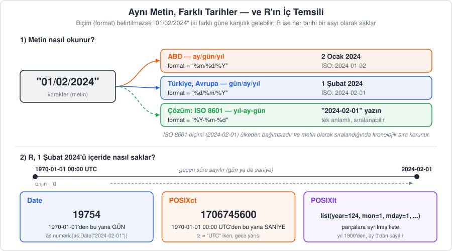

*Şekil 4.1 — "01/02/2024" metni ABD biçiminde 2 Ocak, Türkiye/Avrupa biçiminde 1 Şubat olarak okunur; ISO 8601 (2024-02-01) bu belirsizliği ortadan kaldırır. Alt kısım, R'ın aynı tarihi içeride nasıl sakladığını gösterir: `Date` için 1970-01-01'den bu yana geçen gün, `POSIXct` için saniye sayısı, `POSIXlt` için parçalara ayrılmış bir liste.*

### 4.2. R'da Tarih ve Zaman Sınıfları: `Date`, `POSIXct`, `POSIXlt`

> 💻 **Uygulama dosyası:** [`Codes/R/ch04_tarih_zaman.R`](Codes/R/ch04_tarih_zaman.R)
>
> Bu bölümdeki R kodlarının tamamı bu dosyada. RStudio'da açıp satır satır çalıştırabilir ya da depo kök dizininde `Rscript Codes/R/ch04_tarih_zaman.R` komutunu kullanabilirsiniz.


R, bu format karmaşasını yönetmek için özel veri tipleri sunar. Temel fikir şudur: **tarih, ekranda metin gibi görünse de içeride bir sayıdır.** Sayı olduğu için tarihler sıralanabilir, birbirinden çıkarılabilir ve eksenlere yerleştirilebilir.

**Tanım 1 (`Date`):** Yalnızca takvim gününü (yıl, ay, gün) tutar. İçeride, **1970-01-01'den (Unix orijini) bu yana geçen gün sayısı** olarak saklanır. Saatle işiniz yoksa (günlük, aylık, yıllık veriler) bunu kullanın.

**Tanım 2 (`POSIXct`):** Tarih ile saati birlikte tutar. İçeride, **1970-01-01 00:00:00 UTC'den bu yana geçen saniye sayısı** olarak saklanır (ct: *calendar time*). Tek bir sayı olduğu için hızlıdır, az yer kaplar ve veri çerçevelerinde sütun olarak kullanılmaya en uygun sınıftır.

**Tanım 3 (`POSIXlt`):** Aynı anı, parçalarına ayrılmış bir **liste** olarak tutar (lt: *local time*): saniye, dakika, saat, gün, ay, yıl, haftanın günü, yılın günü... Tek tek bileşenlere erişmek için kullanışlıdır, ama hesaplama ve depolama için `POSIXct` tercih edilir.

| Sınıf | Neyi tutar? | İçeride nasıl saklanır? | Tipik kullanım |
| --- | --- | --- | --- |
| `Date` | Gün | 1970-01-01'den bu yana gün (tam sayı) | Günlük/aylık/yıllık seriler |
| `POSIXct` | Gün + saat (+ saat dilimi) | 1970-01-01 00:00 UTC'den bu yana saniye | Saatlik, dakikalık, sensör, borsa verileri |
| `POSIXlt` | Gün + saat (+ saat dilimi) | Bileşen listesi (`year`, `mon`, `mday`, `hour`, ...) | Bileşenlere erişim, ara işlem |

Bunu doğrudan görelim:

```r
# Date: içeride gün sayısı
d <- as.Date("2024-02-01")
class(d)
#> [1] "Date"
as.numeric(d)          # 1970-01-01'den bu yana geçen gün
#> [1] 19754
as.Date(19754)         # Ters yön: sayıdan tarihe
#> [1] "2024-02-01"
d + 1                  # Bir gün sonrası: sayıya 1 eklemek yeterli
#> [1] "2024-02-02"

# POSIXct: içeride saniye sayısı
ct <- as.POSIXct("2024-02-01 14:30:00", tz = "UTC")
class(ct)
#> [1] "POSIXct" "POSIXt"
as.numeric(ct)         # 1970-01-01 00:00:00 UTC'den bu yana geçen saniye
#> [1] 1706797800

# POSIXlt: bileşen listesi
lt <- as.POSIXlt(ct)
lt$hour                # Saat
#> [1] 14
lt$mday                # Ayın günü
#> [1] 1
lt$mon                 # Ay: DİKKAT, 0'dan başlar (0 = Ocak, 1 = Şubat)
#> [1] 1
lt$year                # Yıl: DİKKAT, 1900'den bu yana geçen yıl
#> [1] 124
lt$year + 1900
#> [1] 2024
```

**Açıklama:** `19754` sayısı, 1 Şubat 2024'ün 1970-01-01'den 19754 gün sonra olduğunu söyler. `1706797800` ise aynı günün 14:30'unun UTC orijininden bu yana geçen saniye sayısıdır (19754 × 86 400 + 14,5 × 3 600). `POSIXlt`'in iki tuzağına dikkat edin: ay 0'dan, yıl 1900'den sayılır.

Sistem saatini almak için:

```r
Sys.Date()     # Bugünün tarihi (Date)
#> [1] "2024-10-26"
Sys.time()     # Şu anki zaman (POSIXct)
#> [1] "2024-10-26 15:30:00 +03"
```

(Çıktılar, kodu çalıştırdığınız ana ve bilgisayarınızın saat dilimine göre değişir. Türkiye 2016'dan beri yıl boyu UTC+3 kullandığı için R saat dilimini `+03` olarak gösterir.)

#### 4.2.1. Metni Tarihe Çevirmek: `as.Date()` ve Format Kodları

Elimizdeki `"15/03/2024"` gibi bir metni R'ın anlayacağı bir `Date` nesnesine `as.Date()` ile çeviririz. Püf noktası şudur: **R'a metnin hangi biçimde yazıldığını `format` argümanıyla söylemeniz gerekir.** Biçim verilmezse R yalnızca `YYYY-MM-DD` ve `YYYY/MM/DD` biçimlerini dener ve sonuç tehlikeli olabilir:

```r
as.Date("2024-02-01")                    # ISO biçimi: sorunsuz
#> [1] "2024-02-01"

as.Date("01/02/2024")                    # Biçim verilmedi: YANLIŞ ama hata yok!
#> [1] "0001-02-20"

as.Date("01/02/2024", format = "%d/%m/%Y")   # Türkiye/Avrupa: gün/ay/yıl
#> [1] "2024-02-01"
as.Date("01/02/2024", format = "%m/%d/%Y")   # ABD: ay/gün/yıl
#> [1] "2024-01-02"
as.Date("01.02.2024", format = "%d.%m.%Y")   # Noktalı Türkçe yazım
#> [1] "2024-02-01"
as.Date("2024-02-30", format = "%Y-%m-%d")   # Takvimde olmayan gün
#> [1] NA
```

**Not —** İkinci satırdaki sonuç, bu bölümün en önemli uyarısıdır: R, `"01/02/2024"` metnini `YYYY/MM/DD` sanıp 1. yılın 20 Şubat'ı olarak okumuştur ve hiçbir uyarı vermemiştir. Veri okurken biçimi **her zaman** açıkça belirtin ve okuduktan sonra `range()` ile tarih aralığının makul olup olmadığını kontrol edin.

Tarih ve saati birlikte okumak için `as.POSIXct()` kullanılır; yine `format` ve saat dilimi (`tz`) verilir:

```r
as.POSIXct("01.02.2024 14:30", format = "%d.%m.%Y %H:%M", tz = "Europe/Istanbul")
#> [1] "2024-02-01 14:30:00 +03"
```

Ters yönde, bir tarihi istediğimiz biçimde metne çevirmek için `format()` kullanılır:

```r
d <- as.Date("2024-02-01")
format(d, "%d.%m.%Y")        # Türkçe raporlar için
#> [1] "01.02.2024"
format(d, "%j")              # Yılın kaçıncı günü
#> [1] "032"
format(ct, "%Y-%m-%dT%H:%M:%SZ")   # ISO 8601 (UTC)
#> [1] "2024-02-01T14:30:00Z"
```

**Ezberlemeniz gereken format kodları:** Bu kodlar, R'a metnin hangi parçasının yıl, ay, gün, saat olduğunu anlatır. Hem okurken (`as.Date`, `as.POSIXct`, `strptime`) hem yazarken (`format`) aynı kodlar kullanılır.

| Kod | Anlamı | Örnek (1 Şubat 2024, 14:30:05) |
| --- | --- | --- |
| `%Y` | 4 haneli yıl | `2024` |
| `%y` | 2 haneli yıl (00–68 → 20xx, 69–99 → 19xx) | `24` |
| `%m` | Ay, sayı (01–12) | `02` |
| `%B` | Tam ay adı (dile bağlı) | `Şubat` / `February` |
| `%b` | Kısa ay adı (dile bağlı) | `Şub` / `Feb` |
| `%d` | Ayın günü (01–31) | `01` |
| `%j` | Yılın günü (001–366) | `032` |
| `%A` | Haftanın günü, tam ad (dile bağlı) | `Perşembe` / `Thursday` |
| `%a` | Haftanın günü, kısa ad (dile bağlı) | `Per` / `Thu` |
| `%u` | Haftanın günü, sayı (1 = Pazartesi, 7 = Pazar) | `4` |
| `%H` | Saat, 24 saat düzeni (00–23) | `14` |
| `%I` | Saat, 12 saat düzeni (01–12); `%p` ile birlikte | `02` |
| `%p` | ÖÖ/ÖS (AM/PM) göstergesi | `PM` |
| `%M` | Dakika (00–59) | `30` |
| `%S` | Saniye (00–61) | `05` |
| `%Z` | Saat dilimi kısaltması (yalnızca yazarken) | `+03`, `UTC`, `CET` |
| `%z` | UTC'ye göre fark | `+0300` |

**Not —** `%B`, `%b`, `%A`, `%a` kodları bilgisayarın dil (locale) ayarına bağlıdır. Türkçe ayarlı bir sistemde `as.Date("15 Mart 2024", format = "%d %B %Y")` çalışır; İngilizce ayarlı bir sistemde `NA` döner. Taşınabilir kod yazmak için ay adları yerine ay numaralarını tercih edin.

#### 4.2.2. Saat Dilimleri (`tz`)

Aynı "14:30", İstanbul'da ve New York'ta farklı anlara karşılık gelir. `POSIXct` her zaman **tek bir evrensel anı** (UTC saniyesi) saklar; `tz` özniteliği yalnızca bu anın **hangi yerel saatle gösterileceğini** belirler.

**Tanım (UTC ve saat dilimi):** UTC (*Coordinated Universal Time*), dünya genelinde referans kabul edilen saattir. Bir saat dilimi, UTC'ye göre sabit ya da mevsime göre değişen bir farktır (Türkiye: UTC+3; Berlin: kışın UTC+1, yazın UTC+2). R'da saat dilimleri `"Europe/Istanbul"`, `"America/New_York"`, `"UTC"` gibi IANA (Olson) adlarıyla verilir; tam liste için `OlsonNames()`, sisteminizin saat dilimi için `Sys.timezone()` kullanılır.

```r
ist <- as.POSIXct("2024-02-01 14:30:00", tz = "Europe/Istanbul")
ny  <- as.POSIXct("2024-02-01 14:30:00", tz = "America/New_York")

ist
#> [1] "2024-02-01 14:30:00 +03"
ny
#> [1] "2024-02-01 14:30:00 EST"

ny - ist            # Duvar saatleri aynı ama anlar farklı
#> Time difference of 8 hours

as.numeric(ist)     # İçerideki sayı: UTC saniyesi
#> [1] 1706787000
format(ist, tz = "UTC", usetz = TRUE)   # Aynı anı UTC olarak göster
#> [1] "2024-02-01 11:30:00 UTC"
```

**Açıklama:** İstanbul'da 14:30 (UTC 11:30) ile New York'ta 14:30 (UTC 19:30) arasında 8 saat vardır. `ist` nesnesindeki sayı (`1706787000`), 4.2'deki UTC örneğindeki sayıdan (`1706797800`) tam 10 800 saniye (3 saat) küçüktür; çünkü İstanbul'da 14:30, UTC'de henüz 11:30'dur.

Zaman serisi çalışmalarında pratik kurallar:

- Farklı kaynaklardan gelen zaman damgalarını birleştirmeden önce **aynı saat dilimine** getirin; mümkünse içeride UTC ile çalışıp yalnızca raporlarken yerel saate çevirin.
- `tz` vermezseniz R bilgisayarınızın saat dilimini varsayar; kod başka bir makinede farklı sonuç verebilir. `tz`'yi her zaman açıkça yazın.
- Yaz saati uygulanan bölgelerde (ör. Avrupa, ABD) yılda bir gün 23, bir gün 25 saat sürer. Saatlik verilerde bu, bir saatin "kaybolması" ya da "iki kez görünmesi" demektir (ayrıntısı 4.4'te).

Saat dilimi dönüşümleri için `lubridate` iki kullanışlı fonksiyon sunar (paketi 4.3'te tanıtıyoruz):

```r
library(lubridate)
x <- ymd_hms("2024-02-01 14:30:00", tz = "Europe/Istanbul")

with_tz(x, "UTC")      # Aynı AN, farklı saatle gösterim
#> [1] "2024-02-01 11:30:00 UTC"
force_tz(x, "UTC")     # Aynı DUVAR SAATİ, farklı an (saat dilimi yanlış girilmişse düzeltmek için)
#> [1] "2024-02-01 14:30:00 UTC"
```

### 4.3. `lubridate` Paketi: Tarihlerle Rahat Çalışmak

`as.Date()` ve format kodları güçlüdür ama her seferinde biçim yazmak yorucu ve hataya açıktır. `lubridate` paketi (tidyverse ailesinin bir parçası), tarih işlemlerini çok daha okunur hâle getirir.

**Okuma (ayrıştırma) fonksiyonları:** Fonksiyon adı, metindeki bileşenlerin **sırasını** söyler: `y` = yıl, `m` = ay, `d` = gün, `h` = saat, `m` = dakika, `s` = saniye. Ayraçlar (`-`, `/`, `.`, boşluk) otomatik tanınır.

```r
# install.packages("lubridate") # Yüklü değilse
library(lubridate)

ymd("2024-03-15")        # yıl-ay-gün
#> [1] "2024-03-15"
dmy("15.03.2024")        # gün-ay-yıl (Türkçe yazım)
#> [1] "2024-03-15"
mdy("03/15/2024")        # ay-gün-yıl (ABD yazımı)
#> [1] "2024-03-15"
ymd("20240315")          # ayraçsız da çalışır
#> [1] "2024-03-15"

# Tarih + saat: ymd_hms(), dmy_hm() vb.
ymd_hms("2024-03-15 14:30:00")            # tz verilmezse UTC varsayılır
#> [1] "2024-03-15 14:30:00 UTC"
ymd_hms("2024-03-15T14:30:00+03:00")      # ISO 8601 ve saat farkı tanınır
#> [1] "2024-03-15 11:30:00 UTC"
```

**Not —** `as.Date()`'in aksine, `lubridate` okuyamadığı metinlerde sessizce yanlış tarih üretmez; `NA` döndürür ve "failed to parse" uyarısı verir. Bu uyarıyı ciddiye alın. Ayrıca `ymd_hms()` saat dilimi verilmezse **UTC** varsayar (base R'daki `as.POSIXct()` ise sistemin saat dilimini varsayar); yerel saatle çalışıyorsanız `tz = "Europe/Istanbul"` yazmayı unutmayın.

**Bileşen çekme fonksiyonları:** Zaman serilerinde mevsimsellik analizi için tarihin ayını, haftanın gününü, çeyreğini ayrı bir değişken olarak çıkarmak çok sık yapılır.

```r
t1 <- ymd("2024-03-15")

year(t1)                    # 2024
month(t1)                   # 3
day(t1)                     # 15
yday(t1)                    # 75  (yılın 75. günü)
quarter(t1)                 # 1   (1. çeyrek)
isoweek(t1)                 # 11  (ISO 8601 hafta numarası)
wday(t1)                    # 6   (varsayılan: 1 = Pazar, ..., 7 = Cumartesi)
wday(t1, week_start = 1)    # 5   (1 = Pazartesi olacak şekilde)
wday(t1, label = TRUE)      # Cum (Türkçe sistemde) / Fri (İngilizce sistemde)
```

**Yuvarlama fonksiyonları:** Günlük veriyi aylık ya da haftalık gruplara toplamak için tarihleri dönem başına yuvarlamak işe yarar:

```r
floor_date(t1, "month")                  # Ayın ilk günü
#> [1] "2024-03-01"
floor_date(t1, "week", week_start = 1)   # Haftanın pazartesisi
#> [1] "2024-03-11"
ceiling_date(t1, "month")                # Sonraki ayın ilk günü
#> [1] "2024-04-01"
```

### 4.4. Tarih Aritmetiği ve Tarih Dizileri

Tarihler içeride sayı olduğu için onlarla aritmetik işlem yapabiliriz. "30 gün sonrası", "iki olay arasındaki gün sayısı" ya da "analiz için baştan sona düzenli bir tarih dizisi" gibi ihtiyaçlar zaman serisi çalışmalarında sürekli karşımıza çıkar.

```r
baslangic <- as.Date("2024-01-01")

# Base R: Date nesnesine sayı eklemek = gün eklemek
baslangic + 30
#> [1] "2024-01-31"

# lubridate ile okunur biçimde gün, hafta, ay, yıl ekleme
baslangic + days(30)
#> [1] "2024-01-31"
baslangic + weeks(2)
#> [1] "2024-01-15"
baslangic + months(3)
#> [1] "2024-04-01"
baslangic + years(1)
#> [1] "2025-01-01"

# İki tarih arasındaki fark (difftime nesnesi)
bitis <- as.Date("2024-12-31")
fark <- bitis - baslangic
fark
#> Time difference of 365 days
as.numeric(fark)                                  # Sayıya çevirme
#> [1] 365
difftime(bitis, baslangic, units = "weeks")       # Farklı birimde
#> Time difference of 52.14286 weeks
```

**Açıklama:** 2024 artık yıldır (366 gün); 1 Ocak ile 31 Aralık arasında 365 gün fark vardır, çünkü başlangıç günü sayılmaz.

**Düzenli tarih dizileri:** Eksik günleri tespit etmek, bir veri çerçevesine zaman sütunu eklemek ya da tahmin dönemi için gelecekteki tarihleri üretmek için `seq()` kullanılır:

```r
# Aylık bir tarih dizisi (çok sık kullanılır)
aylik_dizi <- seq(from = as.Date("2024-01-01"),
                  to   = as.Date("2024-12-31"),
                  by   = "month")
aylik_dizi
#>  [1] "2024-01-01" "2024-02-01" "2024-03-01" "2024-04-01" "2024-05-01"
#>  [6] "2024-06-01" "2024-07-01" "2024-08-01" "2024-09-01" "2024-10-01"
#> [11] "2024-11-01" "2024-12-01"

# Başlangıç + adım + uzunluk ile
seq(as.Date("2024-01-01"), by = "week", length.out = 4)
#> [1] "2024-01-01" "2024-01-08" "2024-01-15" "2024-01-22"
```

#### 4.4.1. Ay Sonu Tuzağı ve `%m+%`

"Bir ay sonrası" masum görünen ama belirsiz bir ifadedir: 31 Ocak'tan bir ay sonrası 31 Şubat olamaz.

```r
ymd("2024-01-31") + months(1)        # 31 Şubat yok → NA
#> [1] NA
ymd("2024-01-31") %m+% months(1)     # Ayın son gününe yuvarlar
#> [1] "2024-02-29"
ymd("2024-01-31") %m+% months(0:3)   # Ay sonu dizisi
#> [1] "2024-01-31" "2024-02-29" "2024-03-31" "2024-04-30"

# Base R'ın seq() fonksiyonu ise taşan günü sonraki aya kaydırır:
seq(as.Date("2024-01-31"), by = "month", length.out = 4)
#> [1] "2024-01-31" "2024-03-02" "2024-03-31" "2024-05-01"
```

Ay sonu verileriyle (ör. aylık finansal kapanışlar) çalışırken `%m+%` kullanın; base R'ın `seq()` sonucundaki `"2024-03-02"` gibi kaymalar fark edilmesi zor hatalara yol açar.

#### 4.4.2. Period ve Duration: İki Farklı "Süre" Kavramı

`lubridate`, süreyi iki farklı şekilde ifade eder ve bu ayrım özellikle saatlik verilerde önemlidir.

**Tanım 1 (Period):** İnsanların takvimde kullandığı süredir: "1 gün", "1 ay", "1 yıl". Uzunluğu sabit değildir; 1 ay 28–31 gün, 1 gün (yaz saati geçişinde) 23 ya da 25 saat olabilir. `days()`, `months()`, `years()` gibi **çoğul adlı** fonksiyonlarla oluşturulur. Period eklemek duvar saatini (takvimi) korur.

**Tanım 2 (Duration):** Fiziksel olarak geçen süredir ve her zaman **saniye** cinsinden sabittir: 1 gün = 86 400 saniye, 1 yıl = 365,25 gün. Başında `d` olan `ddays()`, `dweeks()`, `dyears()` gibi fonksiyonlarla oluşturulur. Duration eklemek kronometreyi korur.

```r
days(1)       # period
#> [1] "1d 0H 0M 0S"
ddays(1)      # duration
#> [1] "86400s (~1 days)"

# Berlin'de 31 Mart 2024 gecesi saatler 02:00'den 03:00'e alındı
x <- ymd_hms("2024-03-30 12:00:00", tz = "Europe/Berlin")
x + days(1)     # Ertesi gün aynı saat (gerçekte 23 saat geçti)
#> [1] "2024-03-31 12:00:00 CEST"
x + ddays(1)    # Tam 24 saat sonra
#> [1] "2024-03-31 13:00:00 CEST"

# Artık yıl
ymd("2024-02-29") + years(1)     # 29 Şubat 2025 yok
#> [1] NA
ymd("2024-02-29") + dyears(1)    # 365,25 gün sonrası
#> [1] "2025-02-28 06:00:00 UTC"
```

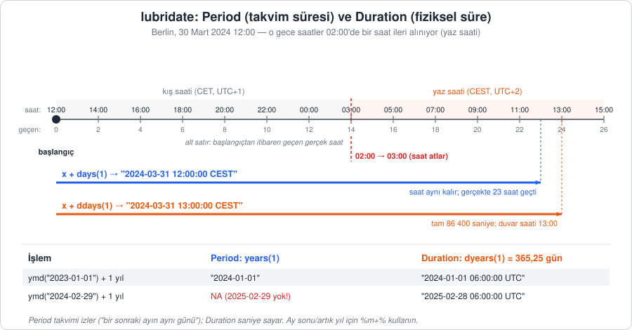

*Şekil 4.2 — Yaz saatine geçiş gecesinde `days(1)` (period) ertesi günün aynı duvar saatine gider ve gerçekte 23 saat ilerler; `ddays(1)` (duration) tam 86 400 saniye ilerler ve saat 13:00'ü gösterir. Alttaki tablo, aynı farkın yıllar için de geçerli olduğunu gösterir.*

Hangisini ne zaman kullanmalı?

- **Takvime bağlı işler** (her ayın aynı günü, gelecek yılın aynı tarihi, aylık tahmin dönemleri) → **period** (`months()`, `years()`, gerekirse `%m+%`).
- **Fiziksel süre ölçümü** (bir makinenin kaç saat çalıştığı, iki sensör okuması arasındaki gerçek süre) → **duration** (`ddays()`, `dhours()`) ya da iki `POSIXct` arasındaki fark.

İki an arasındaki dönemi temsil etmek için üçüncü bir yapı olan **interval** vardır; `interval(bas, bit)` ile oluşturulur ve bir period ya da duration ile bölünerek "bu aralıkta kaç tam yıl/gün var" sorusu cevaplanır. Aşağıdaki örneklerde bunu kullanacağız.

### 4.5. Pratik `lubridate` Örnekleri

Bölümde öğrendiklerimizi birkaç kısa örnekle pekiştirelim.

#### 4.5.1. Örnek 1: Kaç Gündür Hayattasınız?

Sembolik bir doğum tarihi olarak `2021-06-29` alalım. Bu tarih ile bugün arasındaki farkı hesaplayarak kaç gün geçtiğini ve kaç tam yıl (kaç kış) görüldüğünü bulalım.

```r
library(lubridate)

# Sembolik doğum günü ve bugün
dogum <- ymd("2021-06-29")
bugun <- today()

# Kaç gün geçti?
yasanan_gun_sayisi <- bugun - dogum
cat("Ben", as.numeric(yasanan_gun_sayisi), "gündür hayattayım.\n")

# Kaç kış gördü? Aralığı (interval) 1 yıllık period'a tam bölerek tam yıl sayısını buluruz
yas_araligi <- interval(dogum, bugun)
gorulen_kis_sayisi <- yas_araligi %/% years(1)
cat("Ben", gorulen_kis_sayisi, "kış gördüm.\n")
```

Kod 2026-09-29 tarihinde çalıştırıldığında çıktı şöyledir (siz çalıştırdığınızda `today()` değiştiği için sayılar farklı olacaktır):

```text
Ben 1918 gündür hayattayım.
Ben 5 kış gördüm.
```

**Açıklama:** `bugun - dogum` bir `difftime` (gün farkı) verir. `%/%` operatörü tam sayı bölmesidir: aralığın içine kaç tam "1 yıllık takvim dönemi" sığdığını sayar; bu yüzden artık yılları doğru hesaba katar (gün sayısını 365'e bölmekten daha güvenlidir).

#### 4.5.2. Örnek 2: Atatürk Kaç Gün Yaşadı ve Hangi Gün Vefat Etti?

Tarihî kişiliklerin yaşam sürelerini ve önemli günlerini `lubridate` ile kolayca analiz edebiliriz. Atatürk'ün doğum günü olarak 19 Mayıs 1881'i kabul edelim.

```r
library(lubridate)

# Atatürk'ün doğum ve vefat tarihleri
ataturk_dogum <- ymd("1881-05-19")
ataturk_vefat <- ymd("1938-11-10")

# Toplam yaşadığı gün sayısı
yasadigi_gun <- ataturk_vefat - ataturk_dogum
cat("Mustafa Kemal Atatürk", as.numeric(yasadigi_gun), "gün yaşamıştır.\n")
#> Mustafa Kemal Atatürk 20993 gün yaşamıştır.

# Yıl-ay-gün olarak yaşam süresi
as.period(interval(ataturk_dogum, ataturk_vefat))
#> [1] "57y 5m 22d 0H 0M 0S"

# Vefat ettiği günün adı (sistemin dil ayarına göre Türkçe ya da İngilizce yazılır)
vefat_gunu <- wday(ataturk_vefat, label = TRUE, abbr = FALSE)
cat("Vefat ettiği gün:", as.character(vefat_gunu), "\n")
#> Vefat ettiği gün: Perşembe
```

**Açıklama:** 1970 öncesi tarihler de sorunsuz çalışır; içeride negatif gün sayısı olarak saklanırlar (`as.numeric(ymd("1881-05-19"))` negatif bir sayıdır). Atatürk 57 yıl 5 ay 22 gün, yani 20 993 gün yaşamış ve 10 Kasım 1938 Perşembe günü vefat etmiştir.

#### 4.5.3. Örnek 3: Toplam Kaç Saat Yaşadınız?

Daha hassas hesaplamalar için tarihle birlikte saati de kullanmamız gerekir. `ymd_hms()` ile bir `POSIXct` nesnesi oluşturup şimdiki zamandan çıkararak toplam yaşanan saati bulabiliriz.

```r
library(lubridate)

# Örnek bir doğum tarihi ve saati (saat dilimini açıkça belirtiyoruz)
dogum_zamani <- ymd_hms("1995-04-23 14:30:00", tz = "Europe/Istanbul")

# Şimdiki zaman
simdi <- now(tzone = "Europe/Istanbul")

# İki zaman arasındaki farkı saat cinsinden hesaplama
yasanan_saat <- as.numeric(difftime(simdi, dogum_zamani, units = "hours"))

cat("1995-04-23 14:30'da doğan bir kişi, yaklaşık olarak",
    round(yasanan_saat), "saattir hayattadır.\n")
```

**Açıklama:** `difftime(..., units = "hours")` farkı doğrudan saat biriminde verir. İki zaman damgası da `POSIXct` olduğu için fark, içerideki UTC saniyeleri üzerinden hesaplanır; yani aradaki yaz saati geçişleri ve saat dilimi değişiklikleri (Türkiye 2016'ya kadar yaz saati uyguluyordu) otomatik olarak doğru hesaba katılır. `tz` belirtilmeseydi `ymd_hms()` doğum saatini UTC kabul edecek ve sonuç 3 saat kadar kayacaktı.

Bu bölümde tarihlerin içeride nasıl saklandığını, nasıl okunup yazıldığını ve nasıl hesaplandığını gördük. Bölüm 5'te bu tarih bilgisini veriye bağlayarak R'ın zaman serisi nesneleri `ts` ve `xts`'i oluşturacağız.

---

<a id="bolum-5"></a>

## 5. R'da Zaman Serisi Nesneleri: `ts` ve `xts`

Bölüm 4'te tarih ve zaman bilgisini doğru okumayı ve saklamayı gördük. Şimdi bu bilgiyi verinin kendisiyle birleştirip R'ın zaman serisi analizinde kullandığı özel nesnelere dönüştüreceğiz. İki temel yapı var:

- **`ts` (time series):** R'ın yerleşik, eşit aralıklı seriler için tasarlanmış nesnesi. `decompose()`, `acf()`, `arima()` gibi klasik fonksiyonların çoğu bu nesneyi bekler (Bölüm 6 ve 7).
- **`xts` (eXtensible Time Series):** Her gözlemi kendi zaman damgasıyla saklayan, düzensiz aralıklı ve yüksek frekanslı veriler için esnek nesne.

Bir `ts` nesnesi iki temel bilgiden oluşur:

1. **Veri:** Sayısal değerlerden oluşan bir vektör (ya da çok değişkenli seriler için bir matris).
2. **Zaman bilgisi:** Serinin başlangıç zamanı (`start`) ve frekansı (`frequency`). Her gözlemin zamanı bu ikisinden **hesaplanır**; ayrıca saklanmaz.

### 5.1. Frekans Kavramı ve `start`/`end` Argümanları

**Tanım (frekans):** Frekans, **bir temel döngü (çoğunlukla bir yıl) içindeki gözlem sayısıdır.** Aylık veride yıl 12 aya bölündüğü için `frequency = 12`, çeyreklik veride `frequency = 4` olur. Frekans aynı zamanda mevsimsel dönemin uzunluğudur: `decompose()` ve mevsimsel ARIMA gibi yöntemler "kaç gözlemde bir tekrar eden desen aranacağını" bu sayıdan öğrenir.

Bu parametre yanlış ayarlanırsa mevsimsellik gibi önemli desenler modellenemez. Örneğin aylık bir seriyi `frequency = 1` ile tanımlarsanız R, yaz aylarında tekrar eden zirveyi mevsimsellik olarak göremez.

| Veri tipi | Temel döngü | `frequency` | Açıklama |
| --- | --- | --- | --- |
| Yıllık | — | `1` | Mevsimsellik yoktur |
| Çeyreklik | Yıl | `4` | 4 çeyrek / yıl |
| Aylık | Yıl | `12` | 12 ay / yıl |
| Haftalık | Yıl | `52` ya da `52.18` | Bir yıl 365,25 / 7 ≈ 52,18 haftadır |
| Günlük | Hafta | `7` | Haftanın günü etkisi (hafta içi / hafta sonu) |
| Günlük | Yıl | `365` ya da `365.25` | Yıllık mevsimsellik (ör. sıcaklık) |
| Günlük (iş günü) | Hafta | `5` | Borsa, hafta sonu olmayan veriler |
| Saatlik | Gün | `24` | Günlük döngü (ör. elektrik tüketimi) |
| Saatlik | Hafta | `168` | 24 × 7; haftalık döngü |
| 30 dakikalık | Gün | `48` | 2 × 24 |
| Dakikalık | Saat / gün | `60` / `1440` | Yüksek frekanslı sensör verisi |

> **Simge notu:** $`\approx`$ *(yaklaşık eşittir)*: iki değerin yaklaşık olarak eşit olduğunu gösterir

**Not —** Günlük veride hangi frekansın seçileceği, hangi döngüyle ilgilendiğinize bağlıdır: haftalık desen için 7, yıllık desen için 365,25. Hem haftalık hem yıllık döngü birlikte varsa tek bir `ts` frekansı yetmez; bu durumda `forecast` paketindeki `msts()` (çok mevsimli seri) ya da Bölüm 9'daki Prophet gibi araçlar kullanılır. Ondalıklı frekanslar (`52.18`, `365.25`) `ts` tarafından kabul edilir, ancak bazı fonksiyonlar (ör. `decompose()`) mevsimsel dönemin tam sayı olduğunu varsayar; bu nedenle pratikte çoğunlukla `52` ya da `365` gibi tam sayılar tercih edilir.

**`start` ve `end` argümanları:** Zaman, `c(büyük birim, küçük birim)` biçiminde verilir: birinci sayı döngünün kendisi (çoğunlukla yıl), ikinci sayı döngü içindeki sıra (ay, çeyrek, gün...).

- `start = c(2024, 1)` ve `frequency = 12` → 2024 yılının 1. ayı (Ocak 2024).
- `start = c(2023, 3)` ve `frequency = 4` → 2023'ün 3. çeyreği.
- `start = 2020` ve `frequency = 1` → yıllık seride tek sayı yeterlidir.
- `end` verilmezse veri uzunluğundan hesaplanır; verilirse seri o noktada kesilir.

R, $k$'inci gözlemin zamanını şöyle hesaplar ($t_1$ başlangıç zamanı, $f$ frekans):

$$t_k = t_1 + \frac{k-1}{f}, \qquad \Delta t = \frac{1}{f}$$

> **Simge notu:** $`\Delta t`$ *(delta t)*: ardışık iki gözlem arasındaki sabit zaman adımı (aylık veride 1/12 yıl)

Örneğin Ocak 2024 için $t_1 = 2024$, Şubat için $2024 + 1/12 \approx 2024.083$, Aralık için $2024 + 11/12 \approx 2024.917$ olur. `time()` fonksiyonu tam olarak bu değerleri döndürür.

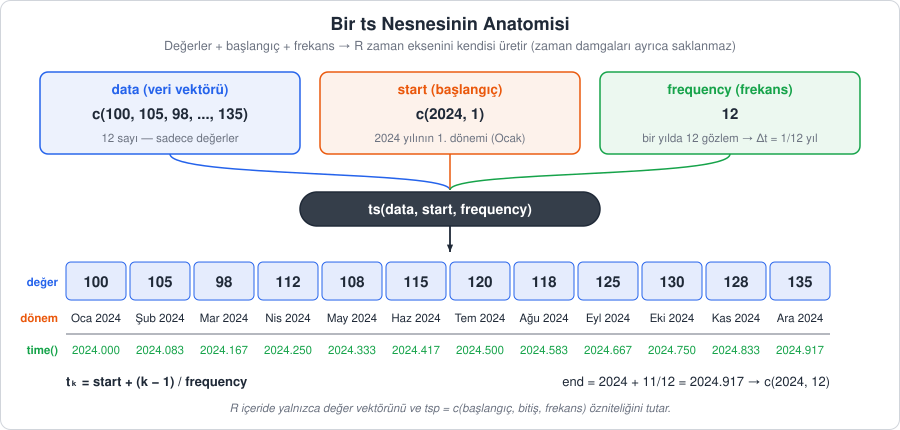

*Şekil 5.1 — Bir `ts` nesnesi yalnızca değer vektörünü ve `tsp = c(başlangıç, bitiş, frekans)` özniteliğini saklar; her gözlemin zamanı `start` ve `frequency` bilgisinden hesaplanır.*

### 5.2. `ts` Nesnesi Oluşturma ve İnceleme

> 💻 **Uygulama dosyası:** [`Codes/R/ch05_ts_xts.R`](Codes/R/ch05_ts_xts.R)
>
> Bu bölümdeki R kodlarının tamamı bu dosyada. RStudio'da açıp satır satır çalıştırabilir ya da depo kök dizininde `Rscript Codes/R/ch05_ts_xts.R` komutunu kullanabilirsiniz.


#### 5.2.1. Elle Veri Girerek

```r
# 2024 yılına ait aylık satış verisi
veri <- c(100, 105, 98, 112, 108, 115, 120, 118, 125, 130, 128, 135)

# ts nesnesi: 2024'ün 1. ayından başlıyor, frekansı 12
satis_ts <- ts(data = veri, start = c(2024, 1), frequency = 12)

print(satis_ts)
#>      Jan Feb Mar Apr May Jun Jul Aug Sep Oct Nov Dec
#> 2024 100 105  98 112 108 115 120 118 125 130 128 135

# Zaman bilgisine erişim
start(satis_ts)       # Başlangıç
#> [1] 2024    1
end(satis_ts)         # Bitiş (veri uzunluğundan hesaplandı)
#> [1] 2024   12
frequency(satis_ts)   # Frekans
#> [1] 12
tsp(satis_ts)         # İçeride saklanan öznitelik: başlangıç, bitiş, frekans
#> [1] 2024.000 2024.917   12.000
cycle(satis_ts)       # Her gözlemin döngü içindeki sırası (1 = Ocak, ..., 12 = Aralık)
#>      Jan Feb Mar Apr May Jun Jul Aug Sep Oct Nov Dec
#> 2024   1   2   3   4   5   6   7   8   9  10  11  12
```

**Açıklama:** `print()` çıktısında R, frekansın 12 olduğunu bildiği için değerleri ay adlarıyla bir tabloya yerleştirir. `tsp` özniteliğindeki `2024.917` değeri, Aralık 2024'ün ondalıklı yıl karşılığıdır ($2024 + 11/12$). `cycle()` ise mevsimsel analizde çok işe yarar: örneğin `tapply(satis_ts, cycle(satis_ts), mean)` her ayın ortalamasını verir.

Başlangıç noktası döngünün ortasında olabilir. Aşağıda 2023'ün 3. çeyreğinden başlayan çeyreklik bir seri var:

```r
ceyrek_ts <- ts(c(50, 52, 55, 53, 58, 60), start = c(2023, 3), frequency = 4)
print(ceyrek_ts)
#>      Qtr1 Qtr2 Qtr3 Qtr4
#> 2023             50   52
#> 2024   55   53   58   60
end(ceyrek_ts)
#> [1] 2024    4
```

#### 5.2.2. Paketten Gelen Veri Seti: `USgas`

`TSstudio` paketindeki `USgas`, ABD'nin aylık doğal gaz tüketimini içeren bir `ts` nesnesidir.

```r
# install.packages("TSstudio") # Yüklü değilse
library(TSstudio)
data(USgas)

ts_info(USgas)
#>  The USgas series is a ts object with 1 variable and 238 observations
#>  Frequency: 12
#>  Start time: 2000 1
#>  End time: 2019 10

start(USgas)       # [1] 2000    1
end(USgas)         # [1] 2019   10
frequency(USgas)   # [1] 12
```

**Not —** Paketin eski sürümlerinde `USgas` Kasım 2018'de biten 227 gözlemlik bir seriydi; kitaplarda ve eski kaynaklarda bu değerleri görebilirsiniz. Yukarıdaki çıktı güncel `TSstudio` sürümüne aittir.

#### 5.2.3. R'ın Yerleşik Veri Seti: `AirPassengers`

`AirPassengers`, 1949–1960 yılları arasındaki aylık uluslararası havayolu yolcu sayılarını (bin kişi) içerir. Bölüm 2.6'da ayrıştırdığımız bu seriyi ders boyunca defalarca kullanacağız.

```r
data(AirPassengers)

class(AirPassengers)       # Zaten 'ts' formatında
#> [1] "ts"
start(AirPassengers)
#> [1] 1949    1
end(AirPassengers)
#> [1] 1960   12
frequency(AirPassengers)   # Aylık veri
#> [1] 12
length(AirPassengers)      # 12 yıl × 12 ay
#> [1] 144

# Görselleştirme
plot(AirPassengers,
     main = "Aylık Uluslararası Havayolu Yolcu Sayıları (1949-1960)",
     ylab = "Yolcu Sayısı (Bin)",
     xlab = "Yıl",
     col  = "darkblue")
grid()
```

**Açıklama:** `plot()`, bir `ts` nesnesini gördüğünde x eksenini otomatik olarak zaman ekseni (yıllar) olarak çizer. Grafikte hem artan bir trend (yıllar içinde yolcu sayısının artması) hem de belirgin bir mevsimsellik (her yıl yaz aylarında zirve) görülür; ayrıca mevsimsel dalgalanmaların genliği seviyeyle birlikte büyür, bu da çarpımsal bir yapıya işaret eder (bkz. 2.4).

### 5.3. `ts` Nesnesinin Ötesi: `xts` ile Gerçek Dünya Verileri

`ts` nesnesi, ders kitaplarındaki gibi **eşit aralıklı ve boşluksuz** veriler (aylık, çeyreklik, yıllık) için uygundur. Gerçek dünya verileri ise nadiren bu kadar düzenlidir: hafta sonları ve tatillerde işlem görmeyen borsa verileri, zaman zaman kesintiye uğrayan sensör kayıtları, saniyelik işlem kayıtları... `ts`'nin "başlangıç + sabit adım" yapısı bu durumlarda yetersiz kalır, çünkü bir gözlemin zamanını yalnızca sırasından hesaplar; arada bir boşluk olduğunu bilemez.

**Tanım (`xts`):** `xts` (eXtensible Time Series), `zoo` paketi üzerine kurulmuş bir zaman serisi sınıfıdır. İki parçadan oluşur: bir **veri matrisi** (`coredata`) ve her satıra karşılık gelen, sıralı bir **zaman indeksi** (`index`; `Date`, `POSIXct` gibi Bölüm 4'teki sınıflardan biri). Böylece her gözlem kendi zaman damgasıyla eşleşir ve düzensiz ya da yüksek frekanslı verilerle çalışmak kolaylaşır.

| Özellik | `ts` | `xts` |
| --- | --- | --- |
| Zaman ekseni | Düzenli: `start` + `frequency` ile hesaplanır | Düzensiz olabilir: her satırın açık zaman damgası vardır |
| Zaman tipi | Ondalıklı sayı (ör. `2024.083`) | `Date`, `POSIXct`, `yearmon` ... |
| Boşluk / tatil / hafta sonu | Temsil edemez (NA ile doldurmak gerekir) | Doğal olarak desteklenir |
| Gün içi (saatlik, saniyelik) veri | Zor | Kolay |
| Tarihle alt küme | `window(x, start = c(2024, 3))` | `x["2024-03"]`, `x["2024-01-26/2024-01-30"]` |
| Dönem dönüştürme | `aggregate()` | `to.period()`, `apply.monthly()` ... |
| Tipik kullanım | Klasik modeller: `decompose`, `arima`, `HoltWinters` | Finans, sensör, log verisi; ön işleme |

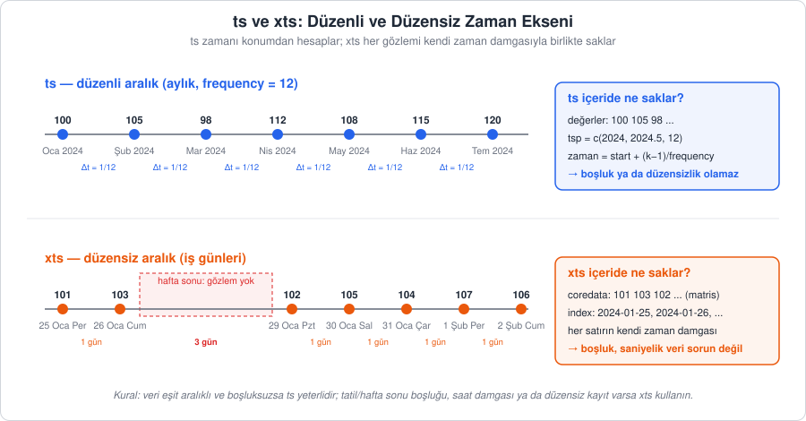

*Şekil 5.2 — `ts` gözlemleri eşit adımlarla dizer ve zamanı konumdan hesaplar; `xts` ise her gözlemi kendi tarihiyle saklar. Alttaki iş günü serisinde 26 Ocak (Cuma) ile 29 Ocak (Pazartesi) arasında 3 günlük bir hafta sonu boşluğu vardır; `xts` bunu sorunsuz temsil eder.*

```r
# install.packages("xts") # Yüklü değilse
library(xts)

# Düzensiz aralıklı bir veri: yalnızca iş günleri (27-28 Ocak hafta sonu atlanmış)
degerler <- c(101, 103, 102, 105, 104, 107, 106)
tarihler <- as.Date(c("2024-01-25", "2024-01-26", "2024-01-29", "2024-01-30",
                      "2024-01-31", "2024-02-01", "2024-02-02"))

# xts nesnesi: veri + zaman indeksi (order.by)
veri_xts <- xts(x = degerler, order.by = tarihler)

print(veri_xts)
#>            [,1]
#> 2024-01-25  101
#> 2024-01-26  103
#> 2024-01-29  102
#> 2024-01-30  105
#> 2024-01-31  104
#> 2024-02-01  107
#> 2024-02-02  106

diff(index(veri_xts))    # Gözlemler arası süre: hafta sonunda 3 gün
#> Time differences in days
#> [1] 1 3 1 1 1 1
```

**Açıklama:** Sol sütundaki tarihler verinin bir sütunu değil, nesnenin **indeksidir**; `index(veri_xts)` ile indekse, `coredata(veri_xts)` ile yalın veri matrisine erişilir. `[,1]` başlığı, sütuna bir ad verilmediğini gösterir (`colnames(veri_xts) <- "fiyat"` ile ad verilebilir).

#### 5.3.1. Tarih Bazlı Filtreleme

`xts`'in en büyük avantajlarından biri, tarih bazlı alt küme almanın çok kolay olmasıdır. Köşeli parantez içinde ISO 8601 biçiminde (`YYYY-MM-DD`, bkz. 4.1) metinler kullanılır; `/` işareti bir aralık belirtir.

```r
# Belirli bir tarih aralığı (iki uç dahil)
veri_xts["2024-01-26/2024-01-30"]
#>            [,1]
#> 2024-01-26  103
#> 2024-01-29  102
#> 2024-01-30  105

# Belirli bir ay (ya da yıl: veri_xts["2024"])
veri_xts["2024-02"]
#>            [,1]
#> 2024-02-01  107
#> 2024-02-02  106

# Açık uçlu aralık: başlangıçtan 26 Ocak'a kadar
veri_xts["/2024-01-26"]
#>            [,1]
#> 2024-01-25  101
#> 2024-01-26  103
```

#### 5.3.2. Dönem Dönüştürme

`xts`'in bir diğer güçlü yanı, veriyi farklı zaman periyotlarına kolayca dönüştürmesidir. Örneğin günlük veriden haftalık ya da aylık özetler çıkarmak tek satırlık iştir.

```r
# Günlük veriden haftalık veriye: to.period() her dönem için
# açılış (Open), en yüksek (High), en düşük (Low) ve kapanış (Close) değerlerini hesaplar
haftalik_veri <- to.period(veri_xts, period = "weeks")
print(haftalik_veri)
#>            veri_xts.Open veri_xts.High veri_xts.Low veri_xts.Close
#> 2024-01-26           101           103          101            103
#> 2024-02-02           102           107          102            106

# Aylık ortalamalar (sütun bazında ortalama için colMeans önerilir)
aylik_ortalama <- apply.monthly(veri_xts, FUN = colMeans)
print(aylik_ortalama)
#>             [,1]
#> 2024-01-31 103.0
#> 2024-02-02 106.5
```

**Açıklama:** Her dönem, o dönemin **son gözleminin tarihiyle** etiketlenir: ilk hafta (25–26 Ocak) 26 Ocak ile, ikinci hafta (29 Ocak – 2 Şubat) 2 Şubat ile. Ocak ayının ortalaması (101 + 103 + 102 + 105 + 104) / 5 = 103, Şubat'ınki (107 + 106) / 2 = 106,5'tir. `FUN = mean` da çalışır, ancak güncel `xts` sürümleri çok sütunlu verilerde karışıklığı önlemek için `colMeans` kullanılmasını öneren bir uyarı yazdırır.

Bir `ts` nesnesini `xts`'e dönüştürmek için `as.xts()` kullanılır; aylık seriler için indeks `yearmon` ("Jan 1949") sınıfında olur:

```r
head(as.xts(AirPassengers), 3)
#>          [,1]
#> Jan 1949  112
#> Feb 1949  118
#> Mar 1949  132
```

Özetle: elinizdeki veri düzenli aralıklı ve boşluksuz klasik bir zaman serisiyse `ts` nesnesi işinizi görür ve klasik modellerle doğrudan uyumludur. Düzensiz, yüksek frekanslı ya da üzerinde karmaşık tarih/saat işlemleri yapmanız gereken bir veriyle çalışıyorsanız `xts` daha doğru ve güçlü bir araçtır. Pratikte sık izlenen yol, ön işlemeyi `xts` ile yapıp modelleme öncesinde düzenli hâle getirilmiş seriyi `ts`'ye çevirmektir.

### 5.4. Veri Alt Kümesi Alma: `window()`

Bir `ts` serisinin belirli bir dönemini seçmek için `window()` fonksiyonu kullanılır. Bu, en sık kullanacağınız fonksiyonlardan biridir: belirli bir dönemi incelemek, bir kırılma öncesini ve sonrasını karşılaştırmak ve özellikle **eğitim/test ayrımı** yapmak (Bölüm 8) için kullanılır.

`start` ve `end` argümanları 5.1'deki `c(yıl, dönem)` biçimini izler; ikisinden biri verilmezse serinin başı ya da sonu kabul edilir. Sonuç yine bir `ts` nesnesidir, yani frekans ve zaman bilgisi korunur.

```r
# AirPassengers'tan 1955-1957 dönemini seçelim
ap_pencere <- window(AirPassengers, start = c(1955, 1), end = c(1957, 12))
print(ap_pencere)
#>      Jan Feb Mar Apr May Jun Jul Aug Sep Oct Nov Dec
#> 1955 242 233 267 269 270 315 364 347 312 274 237 278
#> 1956 284 277 317 313 318 374 413 405 355 306 271 306
#> 1957 315 301 356 348 355 422 465 467 404 347 305 336
length(ap_pencere)
#> [1] 36

# USgas'tan 2010-2015 yılları arasındaki veri
subset_gas <- window(USgas, start = c(2010, 1), end = c(2015, 12))
length(subset_gas)   # 6 yıl × 12 ay
#> [1] 72

# Eğitim/test ayrımı: son iki yılı test için ayıralım
egitim <- window(AirPassengers, end = c(1958, 12))     # 1949-1958: 120 gözlem
test   <- window(AirPassengers, start = c(1959, 1))    # 1959-1960: 24 gözlem
```

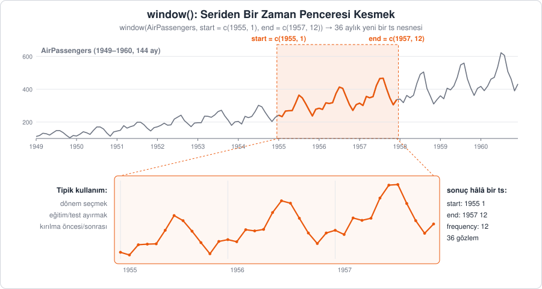

*Şekil 5.3 — `window()` uzun bir seriden `start` ve `end` ile belirlenen dönemi keser; sonuç, kendi başlangıç, bitiş ve frekans bilgisini taşıyan yeni bir `ts` nesnesidir.*

**Not —** Zaman serisinde eğitim ve test kümeleri rastgele değil, **zaman sırasına göre** ayrılır: model geçmişle eğitilir, gelecekle test edilir. `window()` bu ayrımı doğal olarak yapar. Ayrıntısı Bölüm 8'de, zaman serisinde çapraz doğrulama ise Bölüm 16'da ele alınacaktır. `xts` nesnelerinde aynı işlem 5.3.1'deki köşeli parantez sözdizimiyle (`veri_xts["2024-01-26/2024-01-30"]`) ya da `window(veri_xts, start = ..., end = ...)` ile tarih vererek yapılır.

---

<a id="bolum-6"></a>

## 6. Veri Manipülasyonu, Görselleştirme ve ACF/PACF

Elimizde artık bir `ts` nesnesi var (Bölüm 5). Bu bölümde üç soruyu yanıtlayacağız:

1. Seriyi nasıl görselleştiririz? (`plot()`, `ggplot2`)
2. Seriyi nasıl dönüştürür ve parçalarına ayırırız? (`aggregate()`, `lag()`, `decompose()`)
3. Serinin "hafızasını", yani bugünkü değerin geçmiş değerlere ne kadar bağlı olduğunu nasıl ölçeriz? (ACF ve PACF)

Üçüncü sorunun cevabı, Bölüm 7'deki ARIMA modellerinin derecelerini seçerken kullanacağımız temel araçtır. Bölüm boyunca `TSstudio` paketindeki `USgas` serisini (ABD aylık doğal gaz tüketimi, milyar kübik fit) kullanacağız.

> **Not —** `USgas` serisinin uzunluğu `TSstudio` sürümüne göre değişir. Güncel sürümde seri Ocak 2000 – Ekim 2019 aralığında 238 gözlemden oluşur; eski sürümlerde Kasım 2018'de biter (227 gözlem, bkz. Bölüm 5.2). Bu bölümdeki çıktılar güncel sürümle üretilmiştir; eski sürümde sayılar biraz farklı çıkar ama yorumlar değişmez.

### 6.1. Temel Görselleştirme

> 💻 **Uygulama dosyası:** [`Codes/R/ch06_manipulasyon_acf.R`](Codes/R/ch06_manipulasyon_acf.R)
>
> Bu bölümdeki R kodlarının tamamı bu dosyada. RStudio'da açıp satır satır çalıştırabilir ya da depo kök dizininde `Rscript Codes/R/ch06_manipulasyon_acf.R` komutunu kullanabilirsiniz.


İlk kural: **Veriyi çizin. Her zaman.** Grafiğe bakmadan analize başlamak, gözü kapalı araba kullanmaya benzer. Bir zaman serisi grafiğinde şu dört soruya cevap ararız:

- **Trend** var mı? Seri uzun vadede yükseliyor ya da düşüyor mu?
- **Mevsimsellik** var mı? Aynı desen her yıl (ya da her hafta) tekrar ediyor mu?
- **Varyans** sabit mi? Dalgalanmaların genliği zamanla büyüyor mu? (Büyüyorsa çarpımsal model ya da log dönüşümü düşünülür, bkz. Bölüm 2.4.)
- **Aykırı değer** veya yapısal kırılma var mı?

#### 6.1.1. `plot()` ile Hızlı Grafik

`ts` nesneleri, `plot()` fonksiyonu ile doğrudan çizilebilir. Zaman ekseni, nesnenin `start` ve `frequency` bilgisinden otomatik olarak oluşturulur.

```r
library(TSstudio)
data(USgas)

plot(USgas,
     main = "ABD Doğal Gaz Tüketimi (2000-2019)",
     ylab = "Milyar Kübik Fit",
     xlab = "Yıl",
     col = "blue")
grid()
```

`USgas` grafiğinde hem yavaş yükselen bir **trend** hem de her kış zirve yapan güçlü bir **mevsimsellik** görülür. Mevsimsel dalgaların genliği seviyeyle birlikte belirgin biçimde büyümediği için toplamsal model makul bir başlangıçtır.

#### 6.1.2. Gelişmiş Görselleştirme: `ggplot2`

`ggplot2` paketi, R'da yayın kalitesinde ve özelleştirilebilir grafikler oluşturmak için kullanılır. `ggplot2` veri çerçevesi (`data.frame`) ile çalıştığı için önce `ts` nesnesini bir tarih sütunu ve bir değer sütunu olan tabloya çevirmemiz gerekir.

```r
library(ggplot2)

# USgas ts nesnesini data.frame'e dönüştür
df_gg <- data.frame(
  tarih = seq(as.Date("2000-01-01"), by = "month", length.out = length(USgas)), # Aylık tarih dizisi
  deger = as.numeric(USgas)                                                     # ts değerlerini sayısal vektöre çevir
)

# Zaman serisi grafiği ve yumuşatılmış trend çizgisi
ggplot(df_gg, aes(x = tarih, y = deger)) +
  geom_line(color = "blue", linewidth = 0.8) +
  geom_smooth(method = "loess", formula = y ~ x,
              color = "red", se = FALSE, linetype = "dashed") + # Trend çizgisi ekle
  labs(title = "ABD Doğal Gaz Tüketimi (2000-2019)",
       subtitle = "ggplot2 ile Gelişmiş Görselleştirme",
       x = "Tarih",
       y = "Milyar Kübik Fit") +
  theme_minimal()
```

**Açıklama:** `geom_smooth(method = "loess")`, veriye yerel ağırlıklı regresyonla yumuşak bir eğri uydurur; mevsimsel dalgaları "bastırarak" trendi görünür kılar. Kırmızı kesikli çizgi, `USgas` serisindeki yükselişin özellikle 2010 sonrasında hızlandığını gösterir.

> **Not —** `as.Date(time(USgas))` gibi bir dönüşüm doğrudan çalışmaz; `time()` ondalıklı yıl (ör. 2000.083) döndürür. Bu yüzden tarih dizisini `seq(..., by = "month")` ile üretiyoruz. `zoo` paketi yüklüyse `as.Date(zoo::as.yearmon(time(USgas)))` da aynı sonucu verir. `ggplot2` 3.4 ve sonrasında çizgi kalınlığı `size` yerine `linewidth` ile verilir.

### 6.2. Zaman Serisi Manipülasyonu

#### 6.2.1. Frekansı Düşürmek: `aggregate()`

`aggregate()`, yüksek frekanslı veriyi daha düşük bir frekansa toplar. Örneğin aylık veriyi yıllık toplamlara çevirebiliriz. `nfrequency` yeni frekansı (yıllık için 1, çeyreklik için 4), `FUN` ise her dönemdeki değerlerin nasıl birleştirileceğini belirtir.

```r
# Aylık veriyi yıllık toplam tüketime çevirelim
USgas_yillik <- aggregate(USgas, nfrequency = 1, FUN = sum)
USgas_yillik
```

**Çıktı:**

```
Time Series:
Start = 2000 
End = 2018 
Frequency = 1 
 [1] 22538.6 22238.8 23027.0 22276.5 22402.5 22014.5 21699.2 23103.8 23276.9
[10] 22910.1 24086.8 24477.4 25538.6 26155.2 26593.4 27243.7 27444.3 27145.9
[19] 30075.3
```

**Yorum:** Seri Ekim 2019'da bittiği halde çıktı 2018'de bitiyor. `aggregate()` yalnızca **tam** dönemleri toplar; 2019 yılında yalnızca 10 ay bulunduğu için bu yıl atılır. Bu davranış önemlidir: eksik bir yılın toplamını diğer yıllarla karşılaştırmak yanıltıcı olurdu. Yıllık seride mevsimsellik tamamen kaybolur ve geriye yalnızca trend kalır: tüketim 2000'lerin ortasına kadar yatay seyredip 2010 sonrasında belirgin şekilde artmıştır. Ortalama almak için `FUN = mean` kullanılabilir.

#### 6.2.2. Gecikmeli Değerler: `lag()`

Zaman serisi analizinin en temel fikirlerinden biri **gecikmeli değer (lagged value)** kavramıdır. Bugünkü hava sıcaklığını tahmin ederken aklınıza ilk gelen bilgi dünkü sıcaklık olur. Bu ayki satışları değerlendirirken geçen ayın satışlarına, daha da önemlisi geçen yılın aynı ayındaki satışlara bakarsınız. İngilizce "lag" kelimesi de "geride kalmak" anlamına gelir (ör. *jet lag*).

**Tanım:** $h$ adım gecikmeli seri, orijinal serinin $h$ dönem sağa kaydırılmış hâlidir. Bölüm 2.1'deki gecikme operatörüyle:

$$
B^h x_t = x_{t-h}
$$

> **Simge notu:** $`B`$ *(be, backshift)*: gecikme operatörü; uygulandığı değeri bir dönem geriye kaydırır · $`B^h`$ *(be üzeri h)*: operatörün h kez uygulanması, yani h dönem geriye kaydırma

`lag()` fonksiyonu seriyi zamanda kaydırarak geçmiş değerleri bugünkü değerlerle aynı hizaya getirir. Amaç, geçmişin bugünü nasıl etkilediğini görmek ve bu bilgiyi modele bir **özellik (feature)** olarak sunmaktır. Aylık veride lag-1 "geçen ay", lag-12 ise "geçen yılın aynı ayı" demektir; lag-12 özellikle mevsimsel etkileri yakalamak için kullanılır. Bu fikir, Bölüm 12'de zaman serisini denetimli öğrenme problemine dönüştürürken yeniden karşımıza çıkacak.

```r
# 1 ay önceki değeri (lag-1) ve 12 ay önceki değeri (lag-12) oluşturalım
USgas_lag1  <- stats::lag(USgas, k = -1)
USgas_lag12 <- stats::lag(USgas, k = -12)

# Orijinal seri ile gecikmeli değerleri yan yana koyalım
comparison_df <- cbind(
    Original = USgas,
    Lag1  = USgas_lag1,
    Lag12 = USgas_lag12
)
head(comparison_df, 15) # İlk 15 satır kaydırmayı açıkça gösterir
```

> **Not —** `stats::lag()` fonksiyonunda `k` parametresinin **negatif** olduğuna dikkat edin: `k = -1` bir dönem geriye, `k = -12` on iki dönem geriye gitmek demektir (pozitif `k` seriyi ileri kaydırır). Fonksiyonu `stats::` ön ekiyle çağırıyoruz, çünkü `dplyr` paketi yüklüyse onun `lag()` fonksiyonu R'ınkini gölgeler ve `ts` nesneleriyle farklı davranır.

**Çıktı:**

```
         Original   Lag1  Lag12
Jan 2000   2510.5     NA     NA
Feb 2000   2330.7 2510.5     NA
Mar 2000   2050.6 2330.7     NA
Apr 2000   1783.3 2050.6     NA
May 2000   1632.9 1783.3     NA
Jun 2000   1513.1 1632.9     NA
Jul 2000   1525.6 1513.1     NA
Aug 2000   1653.1 1525.6     NA
Sep 2000   1475.0 1653.1     NA
Oct 2000   1567.8 1475.0     NA
Nov 2000   1908.5 1567.8     NA
Dec 2000   2587.5 1908.5     NA
Jan 2001   2677.0 2587.5 2510.5
Feb 2001   2309.5 2677.0 2330.7
Mar 2001   2246.6 2309.5 2050.6
```

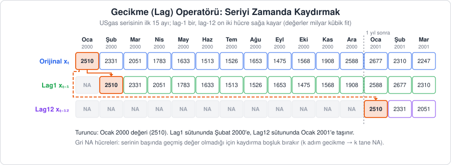

*Şekil 6.1 — Gecikme operatörünün etkisi: Ocak 2000 değeri (2510.5), Lag1 sütununda bir ay, Lag12 sütununda on iki ay sonraya taşınır. Serinin başındaki NA hücreleri, geçmişi olmayan gözlemlerdir.*

**Yorum:**

- **`Lag1` sütunu:** Her satırdaki `Lag1` değeri, bir önceki ayın `Original` değeridir. Şubat 2000'deki `Lag1` (2510.5), Ocak 2000'in gözlemidir.
- **`Lag12` sütunu:** 12 ay (1 yıl) önceki değeri gösterir. Ocak 2001'deki `Lag12` (2510.5), tam bir yıl önceki Ocak 2000 gözlemidir. Mevsimsel serilerde "geçen yılın aynı ayı" çoğu zaman çok güçlü bir bilgi taşır; bunu Bölüm 6.3'te sayısal olarak göreceğiz (`USgas` için lag-12 otokorelasyonu 0.87'dir).
- **`NA` değerleri:** $h$ adım gecikmeli serinin ilk $h$ değeri tanımsızdır (Not Available), çünkü Ocak 2000'den önceki veri elimizde yoktur. Modelleme sırasında bu satırlar genellikle atılır; yani lag-12 kullanmak ilk 12 gözlemi kaybetmek demektir.

Bu gecikmeli sütunlar arasındaki korelasyonu ölçtüğümüzde, Bölüm 6.3'teki **otokorelasyon** kavramına ulaşırız.

#### 6.2.3. Bileşenlere Ayırma: `decompose()`

Zaman serisini trend, mevsimsellik ve kalan (düzensiz) bileşenlere ayırmanın mantığını, toplamsal ve çarpımsal modeller arasındaki farkı ve `decompose()` ile `stl()` fonksiyonlarını Bölüm 2.4 ve 2.6'da `AirPassengers` serisi üzerinde görmüştük. Burada aynı aracı `USgas` serisine uygulayıp çıktıyı sayısal olarak okuyacağız.

`USgas` serisinde mevsimsel dalgaların genliği zamanla belirgin biçimde büyümediği için **toplamsal** model (varsayılan `type = "additive"`) uygundur:

```r
# USgas serisini bileşenlerine ayıralım (toplamsal model)
USgas_ayristir <- decompose(USgas)
plot(USgas_ayristir)

# Her ayın mevsimsel etkisi (12 değer)
round(USgas_ayristir$figure)
```

**Çıktı:**

```
 [1]  766  453  278 -174 -352 -366 -203 -181 -385 -295  -34  491
```

Grafik dört panelden oluşur: `observed` (orijinal seri), `trend` (12 aylık merkezî hareketli ortalama), `seasonal` (her yıl aynen tekrar eden mevsimsel desen) ve `random` (kalan).

**Yorum:**

- **Mevsimsel etki:** Ocak ayında tüketim, trendin yaklaşık **766 birim üzerinde**, Eylül ayında ise yaklaşık **385 birim altındadır**. Aralık (+491) ve Şubat (+453) da kış zirvesinin parçasıdır. İlginç bir ayrıntı: Temmuz–Ağustos (−203, −181), Haziran ve Eylül'den daha yüksektir; bunun nedeni yazın klimalar için elektrik üretiminde doğal gaz kullanılmasıdır. Yani seride kışın büyük, yazın küçük olmak üzere **iki tepe** vardır.
- **Trend:** Trend bileşeni Temmuz 2000'de yaklaşık 1885 iken Nisan 2019'da yaklaşık 2573'e çıkar. Hareketli ortalama kullanıldığı için serinin ilk ve son 6 ayında trend (ve dolayısıyla kalan) `NA` olur.
- **Kalan:** `random` bileşeninde belirgin bir desen kalmamalıdır. Kalan bileşende hâlâ yapı varsa (ör. mevsimsel tepeler), bunu bir sonraki adımda ACF grafiğiyle kontrol edebiliriz.

> **Not —** `decompose()` mevsimsel deseni tüm yıllar boyunca **sabit** kabul eder. Mevsimsellik zamanla değişiyorsa `stl()` fonksiyonu ve `s.window` parametresi daha esnek bir ayrıştırma sağlar (bkz. Bölüm 2.6).

### 6.3. ACF: Otokorelasyon Fonksiyonu

Verimizi çizdik ve bileşenlerini ayırdık. Şimdi daha derin bir soru soralım: Serinin içindeki bağımlılık yapısı nasıl? Hangi modelin ona uygun olacağına nasıl karar veririz? Bu noktada iki temel aracımız devreye giriyor: **ACF** ve **PACF**. Bu iki grafik, serinin adeta röntgenini çekerek onun **hafızasını** gösterir.

#### 6.3.1. Sezgi: Serinin Hafızası

**Önce: korelasyon nedir?** ACF'yi anlamak için tek bir kavram yeterlidir: korelasyon. İki değişkeni düşünün, örneğin boy ve kilo. Boyu uzun olanların kilosu da genellikle fazlaysa, bu iki değişken **birlikte hareket ediyor** demektir. Korelasyon katsayısı ($r$) bu birlikte hareketi −1 ile +1 arasında tek bir sayıyla özetler:

- **+1'e yakın:** İkisi birlikte artar, birlikte azalır (pozitif ilişki).
- **0'a yakın:** Birini bilmek ötekini tahmin etmeye yardım etmez (ilişki yok).
- **−1'e yakın:** Biri artarken öteki azalır (negatif ilişki).

Sayının **işareti** ilişkinin yönünü, **büyüklüğü** ise gücünü gösterir: −0.8 ile +0.8 aynı güçte, zıt yönde iki ilişkidir.

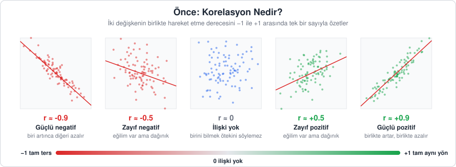

*Şekil 6.2 — Korelasyonun beş tipik görünümü. Her nokta bir gözlem çiftidir; noktalar kırmızı doğru etrafında ne kadar dar toplanırsa korelasyon o kadar güçlüdür, doğrunun eğimi ise yönü gösterir.*

**Açıklama:** Bir serinin bugünkü değeri, dünkü değerine ne kadar benziyor? Peki ya geçen haftaki değerine? Ya da tam bir yıl önceki değerine? ACF (*Autocorrelation Function*, otokorelasyon fonksiyonu) bu soruların cevabını verir: Serinin **kendi geçmişiyle** olan korelasyonunu ölçer. Adındaki "oto" öneki de "kendi" anlamına gelir. Burada iki ayrı değişken yoktur; seriyi kendi geçmişiyle karşılaştırırız.

Mekanizma çok basittir: Seriyi $h$ adım kaydırırız (Bölüm 6.2.2'deki `Lag1`, `Lag12` sütunları) ve orijinal seri ile kaydırılmış kopyası arasındaki sıradan korelasyon katsayısını hesaplarız. Bunu $h = 1, 2, 3, \dots$ için tekrarlayıp sonuçları çubuklarla çizdiğimizde ACF grafiği (korelogram) elde edilir.

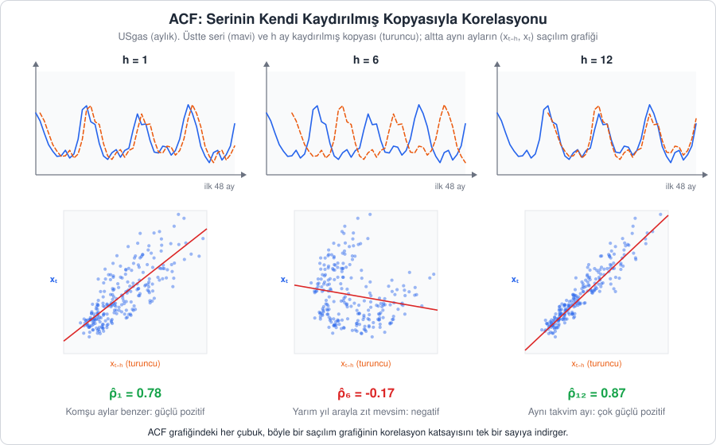

*Şekil 6.3 — ACF'nin anlamı: `USgas` serisi (mavi) ve $`h`$ ay kaydırılmış kopyası (turuncu). Kaydırma bir ay olduğunda eğriler hâlâ örtüşür ($`\hat{\rho}_1 = 0.78`$); altı ay kaydırıldığında kış ile yaz üst üste gelir ve ilişki negatife döner ($`\hat{\rho}_6 = -0.17`$); on iki ay kaydırıldığında aynı takvim ayları hizalanır ve korelasyon en yüksek değerine ulaşır ($`\hat{\rho}_{12} = 0.87`$).*

> **Simge notu:** $`\hat{\rho}_h`$ *(ro şapka h)*: h gecikmedeki örneklem otokorelasyonu; şapka, değerin veriden **tahmin edildiğini** gösterir

"Hafıza" benzetmesi buradan gelir: ACF'nin yavaş sönmesi, serinin geçmişini kolay kolay unutmadığını; hızla sıfıra inmesi ise geçmişin bugüne çok az bilgi taşıdığını gösterir.

#### 6.3.2. ACF Grafiği Nasıl Elde Edilir? Adım Adım

Yazılımların çizdiği ACF grafiği bir dizi dikey çubuktan oluşur. İlk bakışta karmaşık görünse de her çubuk **aynı dört adımın** sonucudur. Şekil 6.4, `USgas` serisi için $h = 1$ çubuğunun nasıl oluştuğunu gösteriyor:

1. **Kaydır:** Serinin bir kopyasını $h$ adım sağa kaydırın (Bölüm 6.2.2'deki `lag()` işlemi). $h = 1$ için her ay, bir önceki ayın değeriyle alt alta gelir.
2. **Eşle:** Alt alta gelen değerlerden (dün, bugün) çiftleri oluşturun. Serinin ilk $h$ gözleminin geçmişi olmadığı için eşi de yoktur, bu yüzden $T - h$ çift kalır. `USgas` için $238 - 1 = 237$ çift.
3. **Hesapla:** Bu çiftlerin korelasyonunu hesaplayın. Saçılım grafiğinde noktalar sağa yukarı uzanan dar bir bulut oluşturuyor; sonuç $\hat{\rho}_1 = 0.78$.
4. **Çiz:** Bu sayıyı, yatay eksende $h = 1$ konumunda, yüksekliği 0.78 olan bir çubuk olarak çizin.

Ardından aynı dört adım $h = 2, 3, \dots$ için tekrarlanır. Her gecikme bir çubuk verir; çubuklar yan yana dizilince ACF grafiği, yani **korelogram** ortaya çıkar.

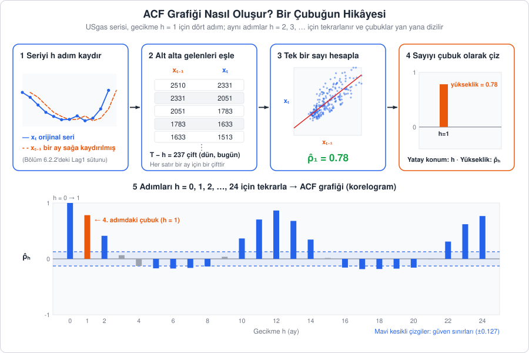

*Şekil 6.4 — Bir ACF çubuğunun dört adımda oluşumu (üstte) ve bu adımlar her gecikme için tekrarlandığında ortaya çıkan korelogram (altta). Turuncu çubuk, 4. adımda çizilen $`h = 1`$ çubuğudur.*

Grafiği okurken bilmeniz gereken üç ayrıntı:

- **$`h = 0`$ çubuğu her zaman 1'dir.** Bu gecikmede seri, kaydırılmamış kendisiyle karşılaştırılır ve bir şey kendisiyle her zaman tam uyumludur. R ve Python bu çubuğu varsayılan olarak çizer; bilgi taşımadığı için okumaya $h = 1$'den başlanır.
- **Uzak gecikmeler daha az güvenilirdir.** $h$ büyüdükçe eşleşen çift sayısı ($T - h$) azalır ve tahmin zayıflar. Bu yüzden genellikle en fazla $T/4$ gecikmeye bakılır; aylık veride 24–36 gecikme yaygındır. R ve Python, gecikme sayısı belirtilmezse yaklaşık $10 \log_{10} T$ gecikme çizer (`USgas` için 23).
- **Bu hesabı elle yapmanız gerekmez.** Grafiği yazılım tek komutla çizer (Bölüm 6.3.7). Adımları bilmek ise grafiğe baktığınızda ne gördüğünüzü anlamanızı sağlar: her çubuk, "seriyi $h$ adım kaydırıp kendisiyle karşılaştırsam ne kadar benzer?" sorusunun cevabıdır.

> **Simge notu:** $`\log_{10}`$ *(on tabanında logaritma)*: bir sayının 10'un kaçıncı kuvveti olduğu; $`\log_{10} 100 = 2`$

#### 6.3.3. Formel Tanım

**Tanım 1 (Teorik otokorelasyon):** Durağan bir süreçte (Bölüm 3.2) $h$ gecikmedeki otokovaryans ve otokorelasyon şöyle tanımlanır:

$$
\gamma(h) = \mathrm{Cov}(x_t, x_{t-h}) = E[(x_t - \mu)(x_{t-h} - \mu)], \qquad \rho_h = \frac{\gamma(h)}{\gamma(0)} = \frac{\mathrm{Cov}(x_t, x_{t-h})}{\mathrm{Var}(x_t)}
$$

> **Simge notu:** $`\gamma(h)`$ *(gama h)*: h gecikmedeki otokovaryans · $`\mathrm{Cov}`$ *(kovaryans)*: iki değişkenin birlikte değişimi · $`\mathrm{Var}`$ *(varyans)*: yayılım; $`\gamma(0) = \mathrm{Var}(x_t)`$ · $`E[\cdot]`$ *(beklenen değer)*: ortalama değer · $`\mu`$ *(mü)*: serinin ortalaması · $`\rho_h`$ *(ro h)*: h gecikmedeki teorik otokorelasyon

Durağanlık sayesinde $\gamma(h)$ yalnızca aradaki mesafeye ($h$) bağlıdır, $t$'ye bağlı değildir; bu yüzden tek bir "lag-$h$ korelasyonundan" söz edebiliriz. Tanım gereği $\rho_0 = 1$ ve $-1 \le \rho_h \le 1$'dir.

**Tanım 2 (Örneklem otokorelasyonu):** Elimizde $x_1, \dots, x_T$ gözlemleri varsa $\rho_h$ şöyle tahmin edilir:

$$
\hat{\rho}_h = \frac{\sum_{t=h+1}^{T} (x_t - \bar{x})(x_{t-h} - \bar{x})}{\sum_{t=1}^{T} (x_t - \bar{x})^2}
$$

> **Simge notu:** $`\bar{x}`$ *(x bar)*: serinin örneklem ortalaması · $`\sum`$ *(sigma, toplam)*: belirtilen sınırlar arasındaki terimlerin toplamı

Formülü şöyle okuyabiliriz: Pay, "bugünün ortalamadan sapması" ile "$h$ adım önceki değerin ortalamadan sapması"nın çarpımlarının toplamıdır. İkisi çoğunlukla aynı yönde saparsa pay pozitif, zıt yönde saparsa negatif olur. Payda ise serinin toplam değişkenliğidir ve sonucu $[-1, 1]$ aralığına ölçekler.

> **Not —** Bu formül, `Lag` sütunlarıyla hesaplanan sıradan Pearson korelasyonuyla neredeyse aynıdır ama iki farkı vardır: (1) her iki sütun için de **tüm serinin** ortalaması $\bar{x}$ kullanılır; (2) paydada her zaman $T$ terimli toplam bulunur, paydaki terim sayısı ise $T - h$'dir. Bu yüzden büyük gecikmelerde $\hat{\rho}_h$ biraz sıfıra doğru çekilir. R'daki `acf()` ve Python'daki `statsmodels.tsa.stattools.acf()` bu formülü kullanır.

**Güven sınırları:** ACF grafiğindeki mavi kesikli çizgiler, "seri beyaz gürültüdür, yani hiçbir otokorelasyon yoktur" hipotezi altında $\hat{\rho}_h$'nin yaklaşık dağılımından gelir. Bu hipotez altında büyük $T$ için $\hat{\rho}_h$ yaklaşık olarak ortalaması 0, varyansı $1/T$ olan normal dağılıma uyar. Dolayısıyla %95 güven sınırları:

$$
\pm \frac{1.96}{\sqrt{T}}
$$

> **Simge notu:** $`\pm`$ *(artı eksi)*: hem pozitif hem negatif sınır · $`\sqrt{T}`$ *(karekök T)*: gözlem sayısının karekökü

Bir çubuk bu bantların dışına çıkarsa o gecikmedeki korelasyon istatistiksel olarak anlamlıdır; yani tesadüfle açıklanması zordur. `USgas` için $T = 238$ olduğundan sınırlar $\pm 1.96/\sqrt{238} \approx \pm 0.127$'dir.

**Açıklama:** Mavi bandı bir **"tesadüf bölgesi"** olarak düşünün. Tamamen rastgele sayılardan oluşan bir seride bile korelasyonlar tam olarak sıfır çıkmaz; şans eseri küçük pozitif ya da negatif değerler görülür. Tıpkı yazı-tura atarken on atışta tam beş yazı gelmemesi gibi. Bant, bu şans dalgalanmasının %95 olasılıkla ulaşabileceği sınırı gösterir:

- Çubuk **bandın içindeyse**: "Bu kadarını şans da üretebilirdi." Çubuk yorumlanmaz.
- Çubuk **bandın dışındaysa**: "Bunu şansla açıklamak zor; gerçek bir ilişki var." Çubuk yorumlanır.

Seri uzadıkça şans dalgalanması küçülür ve bant daralır: 100 gözlemde ±0.196, 400 gözlemde ±0.098. Kısa serilerde bu yüzden yalnızca güçlü ilişkiler bandı aşabilir.

> **Not —** Sınırlar %95 düzeyinde olduğu için, gerçekten beyaz gürültü olan bir seride bile 20 çubuktan yaklaşık 1'inin bandı az farkla aşması beklenir. Tek başına, sınırı hafifçe geçen uzak bir çubuğa fazla anlam yüklemeyin.

Grafiğin nasıl okunacağı Bölüm 6.3.5 ve 6.3.6'da ayrıntılı olarak ele alınıyor.

#### 6.3.4. Elle Hesaplama Örneği

Formülü küçük bir örnekle adım adım uygulayalım. Elimizde beş günlük sıcaklık verisi olsun: $x = [10, 12, 15, 11, 17]$. Lag-1 otokorelasyonu, yani dünkü sıcaklık ile bugünkü sıcaklık arasındaki ilişki nedir?

**1. Ortalamayı bulalım:**

$$
\bar{x} = \frac{10 + 12 + 15 + 11 + 17}{5} = 13
$$

**2. Hesaplama tablosu:** Bugünkü değerin sapması ile dünkü değerin sapmasını çarpıyoruz.

| Zaman ($`t`$) | $`x_t`$ (bugün) | $`x_{t-1}`$ (dün) | $`x_t - \bar{x}`$ | $`x_{t-1} - \bar{x}`$ | Pay için çarpım | Payda için kare $`(x_t - \bar{x})^2`$ |
| :---: | :---: | :---: | :---: | :---: | :---: | :---: |
| 1 | 10 | – | −3 | – | – | 9 |
| 2 | 12 | 10 | −1 | −3 | $`(-1)(-3) = 3`$ | 1 |
| 3 | 15 | 12 | 2 | −1 | $`(2)(-1) = -2`$ | 4 |
| 4 | 11 | 15 | −2 | 2 | $`(-2)(2) = -4`$ | 4 |
| 5 | 17 | 11 | 4 | −2 | $`(4)(-2) = -8`$ | 16 |
| **Toplam** | | | | | **−11** | **34** |

**3. Sonucu bulalım:**

```math
\begin{align*}
\hat{\rho}_1 &= \frac{\sum_{t=2}^{5} (x_t - \bar{x})(x_{t-1} - \bar{x})}{\sum_{t=1}^{5} (x_t - \bar{x})^2} \\
             &= \frac{-11}{34} \\
             &\approx -0.324
\end{align*}
```

Pay 4 terimden ($t = 2, \dots, 5$), payda 5 terimden oluşur; bu, Tanım 2'deki toplam sınırlarının doğrudan uygulamasıdır. R'da `acf(c(10, 12, 15, 11, 17), plot = FALSE)$acf[2]` aynı sonucu (−0.3235) verir.

**Yorum:** $\hat{\rho}_1 \approx -0.324$, dünkü ve bugünkü sıcaklıklar arasında zayıf, **negatif** bir ilişkiye işaret eder: Sıcaklık bir gün ortalamanın üzerine çıktığında ertesi gün ortalamanın altına düşme eğilimindedir. Bu tür bir desen, serinin ortalamaya geri dönen (*mean-reverting*), salınımlı bir yapıya sahip olabileceğini düşündürür.

Ancak bu sonuç yalnızca 5 gözleme dayanıyor. Güven sınırı $\pm 1.96/\sqrt{5} \approx \pm 0.88$ olduğundan −0.324 istatistiksel olarak **anlamlı değildir**. Bu örnek hesaplamanın mekanizmasını göstermek içindir; gerçek analizlerde güvenilir bir ACF için en az 50 gözlem önerilir.

#### 6.3.5. ACF Grafiğinin Anatomisi

R ya da Python'un çizdiği bir ACF grafiğinde altı öğe vardır. Şekil 6.5 bunları `USgas` serisinin gerçek grafiği üzerinde numaralarla gösteriyor.

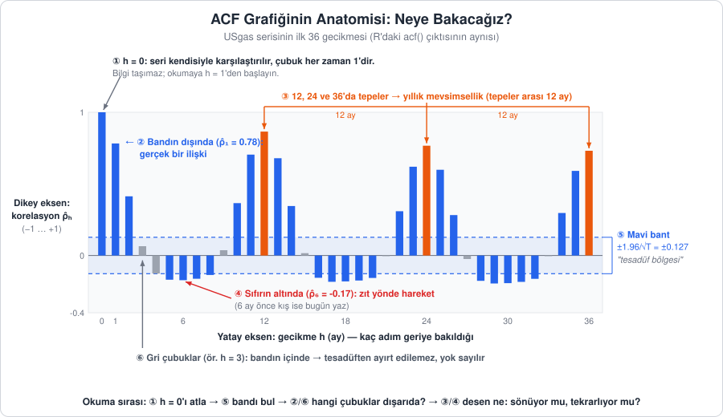

*Şekil 6.5 — `USgas` serisinin ACF grafiği ve okunması gereken altı öğe. Mavi çubuklar bandın dışında (anlamlı), gri çubuklar bandın içinde (anlamsız), turuncu çubuklar mevsimsel gecikmelerdir.*

| No | Öğe | Ne anlatır? |
| --- | --- | --- |
| — | Yatay eksen | Gecikme $`h`$: kaç adım geriye bakıldığı. Aylık veride $`h = 12`$, "bir yıl önce" demektir. |
| — | Dikey eksen | Korelasyon $`\hat{\rho}_h`$; −1 ile +1 arasında. |
| ① | $`h = 0`$ çubuğu | Her zaman 1. Bilgi taşımaz, atlanır. |
| ② | Bandın dışındaki çubuk | Anlamlı bir ilişki. Çubuk ne kadar uzunsa ilişki o kadar güçlü. |
| ③ | Düzenli aralıklı tepeler | Mevsimsellik. İki tepe arasındaki mesafe, mevsimin uzunluğudur (burada 12 ay). |
| ④ | Sıfırın altındaki çubuk | Negatif ilişki: $`h`$ adım önce değer ortalamanın üstündeyse bugün altında olma eğilimi. `USgas`'ta 6 ay önce kışsa bugün yazdır. |
| ⑤ | Mavi bant | Tesadüf bölgesi, $`\pm 1.96/\sqrt{T}`$ (Bölüm 6.3.3). |
| ⑥ | Bandın içindeki (gri) çubuk | Şansla açıklanabilir; yorumlanmaz. |

**Okuma sırası:** Bir ACF grafiğine baktığınızda şu dört adımı izleyin:

1. $h = 0$ çubuğunu atlayın.
2. Mavi bandı bulun.
3. Hangi çubukların bandın dışında kaldığına bakın ve yalnızca onları yorumlayın.
4. Genel desene bakın: Çubuklar hızlı mı, yavaş mı azalıyor? Düzenli aralıklarla tekrar eden tepeler var mı? Bu sorunun cevabı serinin türünü söyler (Bölüm 6.3.6).

> **Not —** R'da `ts` nesnelerinin ACF grafiğinde yatay eksen gecikme sayısıyla değil, **yıl** cinsinden etiketlenir: aylık veride 1.0 işareti $h = 12$'yi gösterir (Bölüm 6.5). Şekil 6.5 gecikme sayısını kullanır.

#### 6.3.6. ACF Grafiği Nasıl Okunur? Tipik Desenler

Tek tek çubuklardan çok, çubukların oluşturduğu **desen** önemlidir. Pratikte karşılaşacağınız ACF grafiklerinin çoğu aşağıdaki beş desenden birine ya da birkaçının karışımına benzer. Bir grafiğe baktığınızda ilk sorunuz şu olmalı: *"Bu, hangisine benziyor?"*

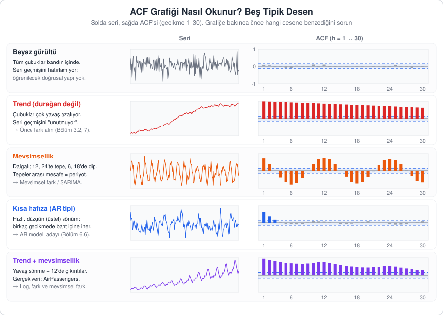

*Şekil 6.6 — Beş tipik ACF deseni. Solda seri, sağda ACF'si. İlk dört satır benzetimle üretilmiştir; son satır gerçek `AirPassengers` verisidir.*

| Desen | ACF'de ne görürsünüz? | Ne anlama gelir? | Ne yapılır? |
| --- | --- | --- | --- |
| **Beyaz gürültü** | Çubukların hepsi bandın içinde (ya da en fazla 20'de 1'i, az farkla dışında) | Seri geçmişini hatırlamıyor; bugünü geçmişten tahmin edemeyiz | Modellenecek doğrusal yapı yok. Bir modelin **artıklarında** görmek istediğimiz desen budur (Bölüm 7.4). |
| **Trend** | Çubuklar 1'e yakın başlar ve çok yavaş azalır | Seri durağan değil; yüksek değerleri yine yüksek değerler izliyor | Fark alın, sonra ACF'yi yeniden çizin (Bölüm 3.2, 7) |
| **Mevsimsellik** | Dalgalı: mevsim uzunluğunun katlarında (12, 24, …) tepe, yarısında (6, 18, …) dip | Takvime bağlı, tekrar eden bir desen | Mevsim uzunluğunu tepelerin aralığından okuyun; mevsimsel fark ya da SARIMA (Bölüm 7.3) |
| **Kısa hafıza (AR tipi)** | İlk birkaç çubuk büyük, sonra hızla ve düzgünce sönüp bandın içine iner | Bugün yakın geçmişe bağlı, ama etki çabuk kayboluyor | AR modeli adayı; derecesini PACF söyler (Bölüm 6.4, 6.6) |
| **Trend + mevsimsellik** | Yavaş sönme ve mevsim uzunluğunun katlarında çıkıntılar | Gerçek verilerde en sık karşılaşılan durum | Önce trendi ve mevsimselliği giderin (log, fark, mevsimsel fark), sonra yeniden bakın |

> **Not — Sık yapılan hatalar:**
>
> - $`h = 0`$ çubuğunu "çok güçlü bir ilişki" sanmak. Bu çubuk her zaman 1'dir.
> - Bandı az farkla aşan uzak, tek bir çubuğa anlam yüklemek. %95'lik bantta 20 çubuktan biri şans eseri dışarı taşabilir (Bölüm 6.3.3).
> - Trendli bir serinin ACF'sinden model derecesi okumaya çalışmak. Yavaş sönme diğer bütün yapıları örter; önce seriyi durağanlaştırın.
> - Korelasyonu nedensellik sanmak. ACF yalnızca "birlikte hareket ediyor mu?" sorusunu yanıtlar, "biri ötekine mi yol açıyor?" sorusunu değil.

#### 6.3.7. Python ve R ile ACF

Aşağıda `[20, 22, 21, 23, 24]` serisi için lag-1 otokorelasyonunu iki dilde hesaplıyoruz.

**Python ile ACF:**

```python
from statsmodels.tsa.stattools import acf  # ACF fonksiyonunu içeri aktar
import numpy as np                          # Numpy kütüphanesini içeri aktar

data = np.array([20, 22, 21, 23, 24])  # Örnek bir zaman serisi verisi oluştur
acf_values = acf(data, nlags=2)        # 2 gecikmeye kadar ACF değerlerini hesapla
print(f"Lag-1 ACF: {acf_values[1]:.3f}")  # 1. gecikmedeki (lag-1) ACF değerini yazdır
```

**Çıktı:**

```
Lag-1 ACF: 0.100
```

**R ile ACF:**

```r
data <- c(20, 22, 21, 23, 24)          # Örnek bir zaman serisi vektörü oluştur
acf_result <- acf(data, plot = FALSE)  # Grafik çizmeden ACF değerlerini hesapla
# R'da acf() çıktısının ilk elemanı lag-0'dır (her zaman 1), bu yüzden lag-1 için 2. elemanı alırız.
cat("Lag-1 ACF:", round(acf_result$acf[2], 3))
```

**Çıktı:**

```
Lag-1 ACF: 0.1
```

**Yorum:** Elle kontrol edelim: $\bar{x} = 22$, sapmalar $[-2, 0, -1, 1, 2]$; pay $0 + 0 + (-1) + 2 = 1$, payda $4 + 0 + 1 + 1 + 4 = 10$, dolayısıyla $\hat{\rho}_1 = 1/10 = 0.1$. Her iki dil de aynı formülü kullandığı için aynı sonucu verir. Değer 0'a çok yakındır: Dünkü değer bugünkü değer hakkında neredeyse hiç doğrusal bilgi taşımaz. 5 gözlemde güven sınırı $\pm 0.88$ olduğundan bu korelasyon da anlamsızdır.

**ACF grafiğini çizmek:** Yukarıdaki kodlar yalnızca sayıları verir. Grafiği çizmek için tek bir komut yeterlidir.

R'da `acf()` grafiği varsayılan olarak çizer:

```r
acf(AirPassengers, lag.max = 36, main = "AirPassengers ACF")
```

Python'da `statsmodels` kütüphanesinin `plot_acf()` fonksiyonu kullanılır:

```python
import pandas as pd
import matplotlib.pyplot as plt
from statsmodels.graphics.tsaplots import plot_acf

seri = pd.read_csv("data/AirPassengers.csv", index_col=0)["Passengers"]
plot_acf(seri, lags=36, title="AirPassengers ACF")  # lags: kaç gecikme çizileceği
plt.show()
```

> **Not —** İki dilin çizdiği bantlar farklı görünür. R, Bölüm 6.3.3'teki sabit $\pm 1.96/\sqrt{T}$ bandını çizer. Python'daki `plot_acf()` ise varsayılan olarak **Bartlett formülünü** kullanır: Bu formül, önceki gecikmelerdeki korelasyonları da hesaba katar; bu yüzden bant gecikme arttıkça genişler ve açık mavi bir huni gibi görünür. `AirPassengers` için bant, 1. gecikmede ±0.16 iken 12. gecikmede ±0.60'a çıkar. R ile aynı sabit bandı görmek için `plot_acf(seri, lags=36, bartlett_confint=False)` yazın. Bu farkı bilmezseniz aynı seri için iki dilde farklı sonuçlar okuduğunuzu sanabilirsiniz.

### 6.4. PACF: Kısmi Otokorelasyon Fonksiyonu

#### 6.4.1. Sezgi: Doğrudan Etki

ACF bize **toplam** ilişkiyi gösterir. Ancak bu ilişkinin bir kısmı dolaylı olabilir. PACF (*Partial Autocorrelation Function*, kısmi otokorelasyon fonksiyonu) ise **aradaki gecikmelerin etkisi arındırılmış** korelasyonu, yani **doğrudan** etkiyi ölçer.

Şöyle bir zincir düşünün: Evvelsi gün yağan yağmur ($x_{t-2}$) toprağı ıslattı; dün ıslak kalan toprak ($x_{t-1}$) bugünkü havanın nemli olmasına ($x_t$) yol açtı. ACF, "evvelsi günkü yağmur" ile "bugünkü nem" arasında güçlü bir ilişki bulur, çünkü aralarında bir zincir vardır. PACF ise aradaki "dünkü ıslak toprak" etkisini devreden çıkarır ve şunu sorar: *Dünü zaten bildiğimize göre, evvelsi günün bugüne ek, doğrudan bir katkısı var mı?*

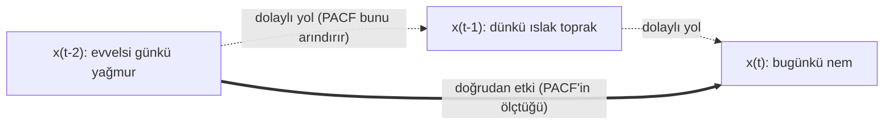
```mermaid
graph LR
    X2["x(t-2): evvelsi günkü yağmur"] -.->|"dolaylı yol (PACF bunu arındırır)"| X1["x(t-1): dünkü ıslak toprak"]
    X1 -.->|"dolaylı yol"| X0["x(t): bugünkü nem"]
    X2 ==>|"doğrudan etki (PACF'in ölçtüğü)"| X0
```

Örneğin bir AR(1) sürecinde (Bölüm 6.6) $x_t$ yalnızca $x_{t-1}$'e doğrudan bağlıdır. $x_{t-2}$ ile $x_t$ arasında ACF'de görülen korelasyon tamamen $x_{t-1}$ üzerinden geçen dolaylı yoldan gelir; bu yüzden lag-2 PACF sıfırdır.

#### 6.4.2. Formel Tanım

**Tanım 1 (Regresyon katsayısı olarak PACF):** $h$ gecikmedeki kısmi otokorelasyon $\phi_{hh}$, $x_t$'nin ilk $h$ gecikmesine regresyonundaki **son** katsayıdır:

$$
x_t = \phi_{h1} x_{t-1} + \phi_{h2} x_{t-2} + \dots + \phi_{hh} x_{t-h} + e_t
$$

> **Simge notu:** $`\phi_{hh}`$ *(fi h h)*: h gecikmedeki kısmi otokorelasyon; h gecikmeli regresyondaki son katsayı · $`\phi_{hj}`$ *(fi h j)*: aynı regresyondaki j. gecikmenin katsayısı · $`e_t`$: regresyonun hata terimi

Aradaki $x_{t-1}, \dots, x_{t-h+1}$ değişkenleri regresyonda "kontrol değişkeni" olarak yer aldığı için $\phi_{hh}$, onların etkisi sabit tutulduğunda $x_{t-h}$'nin $x_t$'ye **ek** katkısını ölçer.

**Tanım 2 (Arındırılmış korelasyon olarak PACF):** Eşdeğer olarak $\phi_{hh}$, aradaki gecikmelerle açıklanabilen kısım çıkarıldıktan sonra $x_t$ ve $x_{t-h}$'nin **kalıntıları** arasındaki korelasyondur. $h = 1$ için arada gecikme olmadığından $\phi_{11} = \rho_1$'dir. $h = 2$ için kapalı formül:

$$
\phi_{22} = \frac{\rho_2 - \rho_1^2}{1 - \rho_1^2}
$$

Formülün sezgisi: $\rho_1^2$, "$x_{t-2} \to x_{t-1} \to x_t$" zincirinin (iki adet lag-1 ilişkisinin art arda) üreteceği dolaylı korelasyondur. Pay, gözlenen lag-2 korelasyonundan bu dolaylı kısmı çıkarır. AR(1) sürecinde $\rho_2 = \rho_1^2$ olduğundan $\phi_{22} = 0$ çıkar.

Daha büyük $h$ değerleri için PACF, Yule-Walker denklemleri ya da Durbin-Levinson özyinelemesi ile ACF değerlerinden hesaplanır; R ve Python bunu otomatik yapar. Güven sınırları ACF'deki gibi yaklaşık $\pm 1.96/\sqrt{T}$'dir.

#### 6.4.3. Python ve R ile PACF

Aynı `[20, 22, 21, 23, 24]` serisi için lag-2 PACF değerini hesaplayalım.

**Python ile PACF:**

```python
from statsmodels.tsa.stattools import pacf  # PACF fonksiyonunu içeri aktar
import numpy as np

data = np.array([20, 22, 21, 23, 24])
pacf_values = pacf(data, nlags=2)  # nlags, gözlem sayısının yarısını aşamaz
print(f"Lag-2 PACF: {pacf_values[2]:.3f}")
```

**Çıktı:**

```
Lag-2 PACF: -0.016
```

**R ile PACF:**

```r
data <- c(20, 22, 21, 23, 24)
pacf_result <- pacf(data, plot = FALSE)
# Dikkat: pacf() çıktısı lag-1'den başlar (lag-0 yoktur), bu yüzden lag-2 için 2. elemanı alırız.
cat("Lag-2 PACF:", round(pacf_result$acf[2], 3))
```

**Çıktı:**

```
Lag-2 PACF: -0.01
```

**Yorum:** Önce elle hesaplayalım. Bu seride $\hat{\rho}_1 = 0.1$ (Bölüm 6.3.7) ve $\hat{\rho}_2 = 0$'dır (sapmalar $[-2, 0, -1, 1, 2]$ için lag-2 çarpımları $2 + 0 - 2 = 0$). Formülden:

$$
\hat{\phi}_{22} = \frac{0 - 0.1^2}{1 - 0.1^2} = \frac{-0.01}{0.99} \approx -0.0101
$$

R bu sonucu verir. Python'un farklı çıkmasının nedeni varsayılan yöntemdir: `statsmodels` `pacf()` fonksiyonu varsayılan olarak `method="ywadjusted"` kullanır; bu yöntemde otokovaryanslar $T$ yerine $T - h$ ile bölünür ve $\hat{\rho}_1 = 0.125$ olur, dolayısıyla $\hat{\phi}_{22} = -0.125^2/(1 - 0.125^2) \approx -0.016$ çıkar. R ile birebir aynı sonucu almak için `pacf(data, nlags=2, method="ywm")` kullanılabilir. Uzun serilerde iki yöntem arasındaki fark ihmal edilebilir düzeydedir.

Sonucun yorumu ise nettir: Lag-1 bilindikten sonra lag-2'nin bugüne ek bir doğrudan katkısı yoktur.

> **Not —** R'da `acf()` çıktısı lag-0'dan, `pacf()` çıktısı lag-1'den başlar. Bu yüzden `acf_result$acf[2]` lag-1'i, `pacf_result$acf[2]` ise lag-2'yi verir. Bu indeks farkı sık yapılan bir hatadır.

### 6.5. Uygulama: `USgas` Serisinin ACF ve PACF Grafikleri

Şimdi iki aracı gerçek veride birlikte kullanalım.

```r
# USgas verisinin ACF ve PACF grafiklerini alt alta çizelim
par(mfrow = c(2, 1))  # 2 satır, 1 sütunluk grafik düzeni
acf(USgas,  lag.max = 36, main = "Otokorelasyon Fonksiyonu (ACF)")
pacf(USgas, lag.max = 36, main = "Kısmi Otokorelasyon Fonksiyonu (PACF)")
par(mfrow = c(1, 1))  # Grafik düzenini eski hâline getir
```

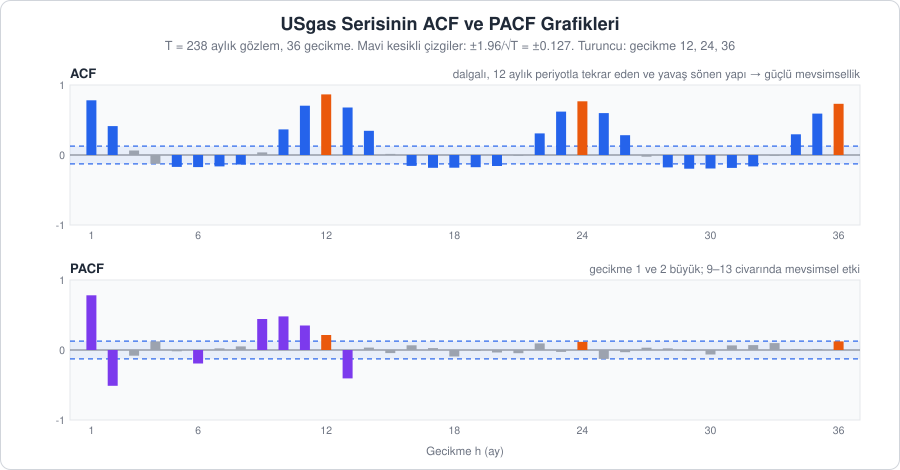

*Şekil 6.7 — `USgas` serisinin ilk 36 gecikmedeki ACF (üstte) ve PACF (altta) değerleri. Mavi kesikli çizgiler $`\pm 1.96/\sqrt{T} \approx \pm 0.127`$ sınırlarıdır; gri çubuklar bu sınırların içinde kalır. Turuncu çubuklar mevsimsel gecikmelerdir (12, 24, 36).*

> **Not —** R'da `ts` nesnesinin ACF grafiğinde yatay eksen **ay cinsinden değil, mevsim (yıl) cinsinden** çizilir: 1.0 işareti lag-12'yi, 2.0 işareti lag-24'ü gösterir. `acf(as.numeric(USgas))` yazarsanız eksen gecikme sayısıyla (1, 2, …, 36) etiketlenir. Şekil 6.5 ve 6.7 bu ikinci gösterimi kullanır.

**Yorum:**

- **ACF:** $\hat{\rho}_1 = 0.78$ ve $\hat{\rho}_2 = 0.41$ ile başlayan korelasyonlar, 4–8. gecikmelerde negatife döner (−0.13 ile −0.17 arası; kış ile yaz aylarının karşılaştırıldığı gecikmeler) ve 12. gecikmede tekrar en yüksek değerine çıkar ($\hat{\rho}_{12} = 0.87$). Bu desen 24 ve 36. gecikmelerde de tekrar eder ($\hat{\rho}_{24} = 0.77$). Dalgalı, 12 aylık periyotla tekrarlayan ve **çok yavaş sönen** bu yapı, güçlü bir mevsimselliğin ve serinin durağan olmadığının işaretidir.
- **PACF:** Lag-1 (0.78) ve lag-2 (−0.51) çok büyüktür. Lag-2'nin negatif olması, lag-1 bilindikten sonra iki ay önceki değerin ters yönde bir düzeltme etkisi taşıdığını gösterir. Ayrıca 9–13. gecikmelerde (ör. lag-13'te −0.41) anlamlı çubuklar vardır; bunlar mevsimsel yapının PACF'e yansımasıdır.
- **Sonuç:** Bu seri olduğu hâliyle basit bir AR ya da MA modeline uymaz. Önce mevsimsel ve/veya normal **fark alma** ile durağan hâle getirilmesi (durağanlık testleri için bkz. Bölüm 3.2), ardından farkı alınmış serinin ACF/PACF grafiklerine bakılması gerekir. Bu süreç, Bölüm 7'deki SARIMA modellemesinin konusudur.

### 6.6. AR ve MA Modelleri için ACF ve PACF İmzaları

ACF ve PACF grafiklerinin asıl gücü, **durağan** bir seri için uygun model tipini ve derecesini önermeleridir. Bunun için önce iki temel model ailesini kısaca tanıyalım; tam teori ve tahmin yöntemleri Bölüm 7'dedir.

#### 6.6.1. Beyaz Gürültü, AR ve MA Modelleri: Kısa Tanımlar

**Tanım 1 (Beyaz gürültü):** Ortalaması sıfır, varyansı sabit ve farklı zamanlardaki değerleri birbiriyle ilişkisiz olan seriye beyaz gürültü denir:

$$
\varepsilon_t \sim WN(0, \sigma^2): \quad E[\varepsilon_t] = 0, \quad \mathrm{Var}(\varepsilon_t) = \sigma^2, \quad \mathrm{Cov}(\varepsilon_t, \varepsilon_s) = 0 \quad (t \neq s)
$$

> **Simge notu:** $`\varepsilon_t`$ *(epsilon t)*: t anındaki rastgele şok (beyaz gürültü terimi) · $`\sim`$ *(tilde)*: "dağılımına sahiptir" · $`WN`$ *(white noise)*: beyaz gürültü · $`\sigma^2`$ *(sigma kare)*: şokların varyansı · $`\neq`$ *(eşit değil)*

Beyaz gürültü "hafızası olmayan" seridir; geçmişi bilmek geleceği tahmin etmeye yardımcı olmaz. Bu nedenle iyi kurulmuş bir modelin **artıklarının** (kalıntılarının) beyaz gürültü olması beklenir.

**Tanım 2 (Otoregresif model, AR(p)):** Bugünkü değer, kendi son $p$ değerinin doğrusal bir bileşimi ile yeni bir şokun toplamıdır:

$$
x_t = c + \phi_1 x_{t-1} + \phi_2 x_{t-2} + \dots + \phi_p x_{t-p} + \varepsilon_t
$$

> **Simge notu:** $`\phi_i`$ *(fi i)*: i. gecikmenin AR katsayısı · $`c`$: sabit terim · $`p`$: modelin derecesi (kaç gecikme kullanıldığı)

Sezgi: "Bugün, dünün (ve önceki $p - 1$ günün) bir kısmıdır, üstüne yeni bir sürpriz eklenir." En basit örnek AR(1): $x_t = \phi x_{t-1} + \varepsilon_t$. $\lvert \phi \rvert < 1$ olduğunda süreç durağandır ve bir şokun etkisi her adımda $\phi$ ile çarpılarak geometrik biçimde söner.

**Tanım 3 (Hareketli ortalama modeli, MA(q)):** Bugünkü değer, bugünkü şok ile son $q$ şokun ağırlıklı toplamıdır:

$$
x_t = \mu + \varepsilon_t + \theta_1 \varepsilon_{t-1} + \dots + \theta_q \varepsilon_{t-q}
$$

> **Simge notu:** $`\theta_j`$ *(teta j)*: j. gecikmeli şokun MA katsayısı · $`q`$: modelin derecesi (kaç geçmiş şokun etkisinin sürdüğü)

Sezgi: "Bugün, son $q$ dönemde yaşanan sürprizlerin yankısıdır." Bir şok tam $q$ dönem boyunca etkisini sürdürür, sonra tamamen kaybolur. (Buradaki "hareketli ortalama", `decompose()`'daki trend yumuşatması ile karıştırılmamalıdır; burada ortalaması alınan şeyler gözlemler değil, geçmiş şoklardır.)

#### 6.6.2. MA(q) Süreci: ACF Kesilir

MA(q) sürecinin hafızası kısadır: $x_t$ ile $x_{t-h}$, ancak ortak bir şok paylaşıyorlarsa ilişkilidir. $h > q$ olduğunda iki değerin ortak şoku kalmaz, dolayısıyla korelasyon **tam olarak sıfır** olur. Örneğin MA(1) için:

$$
\rho_1 = \frac{\theta}{1 + \theta^2}, \qquad \rho_h = 0 \quad (h \ge 2)
$$

$\theta = 0.8$ için $\rho_1 = 0.8/1.64 \approx 0.49$'dur ve 2. gecikmeden itibaren ACF sıfırdır. PACF ise sıfıra hemen inmez; genellikle işaret değiştirerek (ya da geometrik olarak) yavaşça söner.

- **Kural:** ACF $q$ gecikmeden sonra aniden **kesiliyor** (çubuklar güven bandının içine düşüyor) ve PACF yavaşça sönümleniyorsa, bu bir **MA(q)** modeline işaret eder.

#### 6.6.3. AR(p) Süreci: PACF Kesilir

AR(p) sürecinde bir şokun etkisi, geri besleme yoluyla sonsuza kadar (azalarak) aktarılır. Bu yüzden ACF sıfıra aniden inmez, **kuyruk** yaparak söner. AR(1) için teorik ACF:

$$
\rho_h = \phi^h, \qquad h = 0, 1, 2, \dots
$$

$\phi = 0.7$ için $\rho_1 = 0.7$, $\rho_2 = 0.49$, $\rho_3 \approx 0.34$, … şeklinde geometrik olarak azalır. $\phi$ negatifse ACF işaret değiştirerek söner.

PACF ise tam burada net bir cevap verir: AR(p) sürecinde $x_t$ yalnızca son $p$ değere doğrudan bağlı olduğu için, $x_{t-p-1}$ ve daha eski değerlerin **ek** katkısı sıfırdır. Dolayısıyla $\phi_{hh} = 0$ ($h > p$) olur ve PACF $p$ gecikmeden sonra kesilir.

- **Kural:** PACF $p$ gecikmeden sonra aniden **kesiliyor** ve ACF yavaşça sönümleniyor (ya da sinüs dalgası gibi salınarak sönüyorsa), bu bir **AR(p)** modeline işaret eder.

#### 6.6.4. İmzaları Yan Yana Görmek

Aşağıdaki şekil, beyaz gürültü, AR(1) ve MA(1) süreçlerinden simüle edilmiş 400'er gözlemin ACF ve PACF grafiklerini göstermektedir.

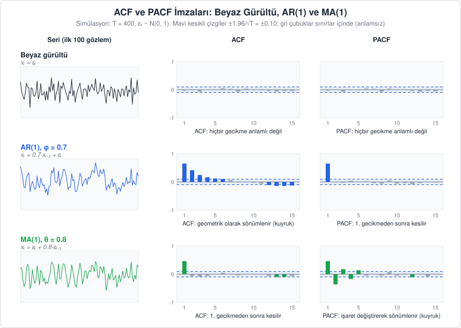

*Şekil 6.8 — Üç temel sürecin korelogram imzaları. Beyaz gürültüde hiçbir çubuk anlamlı değildir. AR(1) sürecinde ($`\phi = 0.7`$) ACF geometrik olarak söner, PACF 1. gecikmeden sonra kesilir. MA(1) sürecinde ($`\theta = 0.8`$) ACF 1. gecikmeden sonra kesilir, PACF işaret değiştirerek söner.*

Şekildeki örneklem değerleri teorik değerlerle uyumludur: AR(1) için $\hat{\rho}_1 \approx 0.65$ (teorik 0.7), MA(1) için $\hat{\rho}_1 \approx 0.46$ (teorik 0.49). Örneklem değerlerinin teorik değerlerden biraz sapması, sonlu örneklemin doğal sonucudur. Aynı nedenle AR(1) ACF'sinin 12–15. gecikmelerinde bandı az farkla aşan küçük negatif çubuklar görülür; bunlar gerçek bir yapı değil, örneklem dalgalanmasıdır (Bölüm 6.3.2'deki "20 çubukta 1" uyarısını hatırlayın). Aynı deneyi R'da kendiniz yapabilirsiniz (şekil Python ile üretildiği için rastgele sayılar farklıdır; R'da örneğin $\hat{\rho}_1$ AR(1) için 0.72, MA(1) için 0.48 çıkar, ama imzalar aynıdır):

```r
set.seed(42)
wn  <- rnorm(400)                                       # Beyaz gürültü
ar1 <- arima.sim(model = list(ar = 0.7), n = 400)       # AR(1), phi = 0.7
ma1 <- arima.sim(model = list(ma = 0.8), n = 400)       # MA(1), theta = 0.8

par(mfrow = c(3, 2))  # 3 satır (süreçler) x 2 sütun (ACF, PACF)
acf(wn,  lag.max = 15, main = "Beyaz gürültü: ACF");  pacf(wn,  lag.max = 15, main = "Beyaz gürültü: PACF")
acf(ar1, lag.max = 15, main = "AR(1): ACF");          pacf(ar1, lag.max = 15, main = "AR(1): PACF")
acf(ma1, lag.max = 15, main = "MA(1): ACF");          pacf(ma1, lag.max = 15, main = "MA(1): PACF")
par(mfrow = c(1, 1))
```

> **Not —** R'daki `arima.sim()` fonksiyonu MA katsayısını bu bölümdeki gibi **artı** işaretle ($`x_t = \varepsilon_t + \theta \varepsilon_{t-1}`$) kullanır. Bazı kitaplar ve yazılımlar eksi işaretli gösterim tercih eder; katsayıların işaretini yorumlarken bu farka dikkat edin.

#### 6.6.5. Özet Tablo ve Pratik Uyarılar

| Model | ACF grafiği | PACF grafiği |
| :--- | :--- | :--- |
| **Beyaz gürültü** | Tüm gecikmelerde anlamsız | Tüm gecikmelerde anlamsız |
| **AR(p)** | Yavaşça sönümlenir (kuyruk) | **p** gecikmeden sonra **kesilir** |
| **MA(q)** | **q** gecikmeden sonra **kesilir** | Yavaşça sönümlenir (kuyruk) |
| **ARMA(p, q)** | Yavaşça sönümlenir | Yavaşça sönümlenir |
| **Durağan olmayan seri** | Çok yavaş, neredeyse doğrusal azalır | Lag-1 yaklaşık 1, sonrası küçük |

Kısa hafıza kuralı: **ACF kesilirse → MA(q); PACF kesilirse → AR(p).** "Kesilme" (*cut-off*), belirli bir gecikmeden sonra çubukların aniden güven bandının içine girip orada kalmasıdır; "kuyruk" (*tail-off*) ise çubukların birkaç gecikme boyunca yavaş yavaş küçülmesidir.

Bu kurallar model seçiminde güçlü bir başlangıç noktasıdır, ancak uygulamada şunlara dikkat etmek gerekir:

- **Önce durağanlık:** İmzalar yalnızca durağan seriler için geçerlidir. `USgas` gibi trendli ve mevsimsel serilerde önce fark alınır (Bölüm 7).
- **Örneklem büyüklüğü:** Küçük veri setlerinde güven bandı geniştir ve kesilme noktası net görünmeyebilir.
- **Karışık yapılar:** ARMA süreçlerinde iki grafik de söner; mevsimsellik ise 12, 24, … gecikmelerinde ek çubuklar ekleyerek deseni karmaşıklaştırır.
- **Doğrulama:** Kesin model seçimi için ACF/PACF gözlemi, bilgi kriterleri (AIC/BIC), `auto.arima()` gibi otomatik araçlar ve artıkların beyaz gürültü olup olmadığının kontrolü (ör. Ljung-Box testi) birlikte kullanılmalıdır. Bu adımların tamamı Bölüm 7'de uygulanmaktadır.

---

<a id="bolum-7"></a>

## 7. Klasik İstatistiksel Modeller: ARIMA ve SARIMA

Önceki bölümlerde veriyi tanımayı, `ts` nesnesine dönüştürmeyi, görselleştirmeyi ve ACF/PACF grafiklerini okumayı öğrendik. Artık modelleme aşamasına geçebiliriz.

Bu bölümde zaman serisi analizinin "klasik" temelini oluşturan **ARIMA** ailesini inceleyeceğiz. Bu modellerin ortak fikri basittir: Bir serinin geleceğini, **yalnızca serinin kendi geçmişini** (geçmiş değerlerini ve geçmişte yapılan tahmin hatalarını) kullanarak tahmin etmek. Dışarıdan ek bir değişkene ihtiyaç duymazlar.

Bölümün yol haritası şöyledir:

1. Yapı taşları: AR, MA, ARMA ve fark alma (I) (7.1)
2. Bu parçaların birleşimi olan ARIMA(p,d,q) ve gecikme operatörüyle yazımı (7.2)
3. Mevsimsel seriler için SARIMA(p,d,q)(P,D,Q)[s] (7.3)
4. Model kurma yöntemi: Box-Jenkins döngüsü (7.4)
5. Durağanlık testleri: ADF ve KPSS (7.5)
6. R ile `AirPassengers` uygulaması (7.6)
7. Aynı analizin Python ile yapılması (7.7)

---

### 7.1. Temel Yapı Taşları: AR, MA, ARMA ve Fark Alma

#### 7.1.1. AR(p): Otoregresif Model

**Açıklama:** Otoregresyonun arkasındaki fikir son derece sezgiseldir: Bir serinin bugünkü değeri, dünkü ve daha önceki değerlerine bağlıdır. Tıpkı bugünkü hava sıcaklığının dünkü sıcaklıktan etkilenmesi gibi.

"Regresyon" kelimesi Latince *regressus* ("geri adım atmak, geri dönmek") kelimesinden gelir. Terimi istatistikte ilk kullananlardan biri Francis Galton'dır. Galton, ebeveynlerin ve çocuklarının boylarını incelerken çok uzun boylu ebeveynlerin çocuklarının da uzun olduğunu, ancak ebeveynleri kadar aşırı uzun olmayıp ortalamaya daha yakın olma eğiliminde olduklarını fark etti. Bu duruma "ortalamaya geri dönüş" (*regression toward the mean*) adını verdi.

Zaman serisinde de benzer bir "geri adım" atarız: Bugünü anlamak için zamanda geriye gidip geçmiş değerlere bakarız. "Oto" ön eki Yunanca "kendi" demektir; yani seri, **kendi geçmişi üzerine** bir regresyon kurar.

**Tanım:** Bir AR(p) modeli, bugünkü değerin geçmişteki $p$ adet değerin ağırlıklı toplamı ile rastgele bir şokun toplamı olduğunu söyler:

$$
x_t = c + \phi_1 x_{t-1} + \phi_2 x_{t-2} + \dots + \phi_p x_{t-p} + \varepsilon_t
$$

> **Simge notu:** $`\phi_i`$ *(fi)*: $`i`$ adım önceki değerin ağırlık katsayısı · $`\varepsilon_t`$ *(epsilon)*: $`t`$ anındaki rastgele şok (beyaz gürültü)

Burada:

- $x_t$ tahmin etmeye çalıştığımız bugünkü değerdir; $x_{t-1}, x_{t-2}, \dots$ serinin geçmiş değerleridir.
- $\phi_1, \dots, \phi_p$ geçmiş değerlerin bugünü ne kadar etkilediğini gösteren katsayılardır.
- $c$ serinin ortalamasıyla ilişkili bir sabittir.
- $\varepsilon_t$ modelin açıklayamadığı, öngörülemeyen rastgele şoktur. Ortalaması sıfır, varyansı sabit ve kendi geçmişiyle ilişkisiz olduğu varsayılır: $\varepsilon_t \sim \mathrm{WN}(0, \sigma^2)$.

> **Simge notu:** $`\sim`$ *(tilda)*: "… dağılımına sahiptir" · $`\mathrm{WN}(0, \sigma^2)`$: ortalaması 0, varyansı $`\sigma^2`$ *(sigma kare)* olan beyaz gürültü (white noise)

$p$ değeri modelin "hafızasının" ne kadar geriye gittiğini belirtir. Örneğin AR(1) modeli yalnızca bir önceki değerin bugünü etkilediğini varsayar: $x_t = c + \phi_1 x_{t-1} + \varepsilon_t$.

**Not —** AR(1) sürecinin durağan olması için $\lvert \phi_1 \rvert < 1$ olmalıdır. $\phi_1 = 1$ olursa süreç rastgele yürüyüşe (birim kök, Bölüm 3.2) dönüşür ve şoklar hiç sönmez.

#### 7.1.2. MA(q): Hareketli Ortalama Modeli

**Açıklama:** Buradaki "hareketli ortalama", veriyi düzleştirmek için kullandığımız basit hareketli ortalamayla (Bölüm 6.2) **aynı şey değildir**; isim benzerliği kafa karıştırmasın.

Bir hedefe ok attığınızı düşünün. İlk atış hedefin biraz sağına gitti; bu bir hatadır. İkinci atışta bu hatayı dikkate alarak nişanınızı hafifçe sola kaydırırsınız. MA modeli de bunu yapar: Önceki adımlardaki tahmin hatalarını, yani öngörülemeyen "şokları", bugünkü değeri açıklamak için kullanır. Kısacası model geçmiş hatalarından ders çıkarır.

**Tanım:** Bir MA(q) süreci, bugünkü değerin serinin ortalaması, bugünkü şok ve geçmişteki $q$ adet şokun ağırlıklı toplamından oluştuğunu söyler:

$$
x_t = \mu + \varepsilon_t + \theta_1 \varepsilon_{t-1} + \theta_2 \varepsilon_{t-2} + \dots + \theta_q \varepsilon_{t-q}
$$

> **Simge notu:** $`\mu`$ *(mü)*: serinin ortalaması · $`\theta_j`$ *(teta)*: $`j`$ adım önceki şokun ağırlık katsayısı

$\theta$ katsayıları geçmiş şokların bugünkü değeri ne kadar etkilediğini belirler. İsim de bu formülden gelir: Model, geçmiş şokların "kayan" bir ağırlıklı toplamını kullanır. MA süreci **kısa hafızalıdır**: Bir şokun etkisi tam $q$ dönem sonra tamamen kaybolur. Bu yüzden MA(q) sürecinin ACF'si $q$ gecikmeden sonra kesilir (Bölüm 6.4.1).

#### 7.1.3. ARMA(p, q): İkisinin Birleşimi

**Açıklama:** Gerçek serilerde çoğu zaman hem "geçmiş değerlerin" hem de "geçmiş şokların" etkisi bir aradadır. ARMA modeli bu iki fikri tek denklemde birleştirir. Böylece saf AR ya da saf MA ile çok sayıda terim gerektirecek bir yapı, az sayıda parametreyle ifade edilebilir.

**Tanım:**

$$
x_t = c + \phi_1 x_{t-1} + \dots + \phi_p x_{t-p} + \varepsilon_t + \theta_1 \varepsilon_{t-1} + \dots + \theta_q \varepsilon_{t-q}
$$

ARMA modeli **durağan** bir seri varsayar. ACF ve PACF grafiklerinin ikisi de keskin bir kesilme göstermeden yavaşça sönümleniyorsa ARMA yapısından şüphelenilir (Bölüm 6.4.3).

#### 7.1.4. I: Entegrasyon ve Fark Alma

**Açıklama:** Birçok zaman serisi, özellikle ekonomi ve finansta, durağan değildir. Yıllar içinde sürekli büyüyen bir şirketin satışlarını düşünün: Grafikte yukarı doğru giden bir trend görürsünüz, ortalama sabit değildir.

Bu, modelleme için bir sorundur, çünkü AR ve MA modelleri serinin istatistiksel özelliklerinin zamanla değişmediğini, yani **durağan** olduğunu varsayar. Sürekli yer değiştiren bir hedefi vurmaya çalışmak çok daha zordur.

Çözüm **fark alma** (differencing) işlemidir: Madem serinin kendisini modellemek zor, serideki **değişimi** modelleyelim. Bugünkü satışı tahmin etmek yerine, bugünkü satış ile dünkü satış arasındaki farkı tahmin ederiz. Günlük artış ve azalışlara baktığımızda genellikle sıfır civarında dalgalanan, çok daha kararlı bir seri elde ederiz.

**Tanım:** Birinci fark, Bölüm 2.1'de tanıttığımız fark operatörüyle yazılır:

$$
y_t = \nabla x_t = x_t - x_{t-1}
$$

> **Simge notu:** $`\nabla`$ *(nabla)*: fark operatörü, $`\nabla x_t = x_t - x_{t-1}`$

Farkı alınmış seri hâlâ durağan değilse işlem bir kez daha uygulanır: $\nabla^2 x_t = y_t - y_{t-1}$. Seriyi durağanlaştırmak için kaç kez fark alındığı, ARIMA(p,d,q) modelindeki **d** parametresidir. Pratikte $d$ genellikle 0, 1 ya da en fazla 2'dir.

Mevsimsel seriler için ayrıca **mevsimsel fark** alınır: $\nabla_s x_t = x_t - x_{t-s}$. Aylık veride ($s = 12$) bu, "bu Ocak eksi geçen Ocak" demektir ve yıllık tekrar eden deseni siler.

"Integrated" (entegre) terimi bu işlemin tersini ifade eder. Model farkı alınmış seri için tahmin ürettikten sonra, bu tahminlerin art arda toplanarak (entegre edilerek) orijinal ölçeğe geri döndürülmesi gerekir. Özetle: Fark alarak seriyi analiz edilebilir hâle getiririz, modelleriz, sonra sonucu orijinal bağlamına entegre ederiz. R ve Python fonksiyonları bu geri dönüşü bizim yerimize otomatik yapar.

Şekil 7.1, `AirPassengers` serisi üzerinde bu adımları göstermektedir. Log dönüşümü dalgaların giderek büyümesini (artan varyansı) dengeler; ardından alınan mevsimsel ve normal fark, trendi ve yıllık deseni silerek sıfır çevresinde dalgalanan durağan bir seri bırakır.

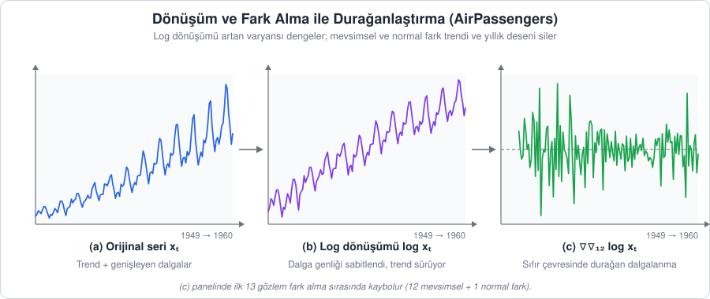

*Şekil 7.1 — `AirPassengers` serisinin durağanlaştırılması: (a) orijinal seri, (b) log dönüşümü, (c) log serinin 12 aylık ve ardından 1 aylık farkı ($`\nabla \nabla_{12} \log x_t`$).*

---

### 7.2. ARIMA(p, d, q) Modeli ve Gecikme Operatörüyle Yazım

Üç bileşen bir araya gelerek **ARIMA(p, d, q)** (AutoRegressive Integrated Moving Average) modelini oluşturur:

| Parametre | Bileşen | Anlamı |
| --- | --- | --- |
| **p** | AR | Kaç geçmiş **değerin** kullanılacağı |
| **d** | I | Seriyi durağanlaştırmak için kaç kez **fark** alındığı |
| **q** | MA | Kaç geçmiş **hatanın (şokun)** kullanılacağı |

Örneğin ARIMA(1,1,0), "seriyi bir kez farkla, farkı alınmış seriye AR(1) uygula" demektir. ARIMA(0,0,0) ise saf beyaz gürültüdür; ARIMA(0,1,0) rastgele yürüyüştür.

**Gecikme operatörüyle yazım.** ARIMA denklemleri açık hâliyle uzun ve okunaksızdır. Bölüm 2.1'de tanıttığımız gecikme (backshift) operatörü $B$ ile ($B x_t = x_{t-1}$, $B^k x_t = x_{t-k}$) bu denklemleri çok kısa yazabiliriz.

> **Simge notu:** $`B`$ *(be)*: gecikme operatörü, seriyi bir adım geriye kaydırır

Önce AR ve MA kısımlarını birer **polinom** olarak tanımlarız:

```math
\begin{aligned}
\phi(B) &= 1 - \phi_1 B - \phi_2 B^2 - \dots - \phi_p B^p \\
\theta(B) &= 1 + \theta_1 B + \theta_2 B^2 + \dots + \theta_q B^q
\end{aligned}
```

Bu polinomlarla modeller şu biçimi alır:

```math
\begin{aligned}
\text{AR}(p):&\quad \phi(B)\, x_t = c + \varepsilon_t \\
\text{MA}(q):&\quad x_t = \mu + \theta(B)\, \varepsilon_t \\
\text{ARMA}(p,q):&\quad \phi(B)\, x_t = c + \theta(B)\, \varepsilon_t \\
\text{ARIMA}(p,d,q):&\quad \phi(B)\, (1 - B)^d\, x_t = c + \theta(B)\, \varepsilon_t
\end{aligned}
```

Son satırı okuyalım: $(1 - B)^d$ çarpanı seriye $d$ kez fark uygular (çünkü $(1 - B)x_t = x_t - x_{t-1} = \nabla x_t$). Ortaya çıkan durağan seri, $\phi(B)$ ile AR yapısına, $\theta(B)$ ile MA yapısına bağlanır. Yani ARIMA, "farkı alınmış serinin ARMA modeli"dir.

**Örnek:** ARIMA(1,1,1) açık yazımla:

```math
\begin{aligned}
(1 - \phi_1 B)(1 - B)\, x_t &= (1 + \theta_1 B)\, \varepsilon_t \\
x_t - x_{t-1} &= \phi_1 (x_{t-1} - x_{t-2}) + \varepsilon_t + \theta_1 \varepsilon_{t-1}
\end{aligned}
```

Yani bu ayki **değişim**, geçen ayki değişim ve geçen ayki şok ile açıklanır.

**Not —** Katsayıların işaret kuralı yazılımdan yazılıma değişebilir. R (`arima`, `auto.arima`) ve Python `statsmodels`/`pmdarima`, MA kısmını yukarıdaki gibi **artı** işaretiyle ($1 + \theta_1 B$) yazar. Bazı ders kitapları ise eksi işareti kullanır; sonuçları karşılaştırırken buna dikkat edin.

---

### 7.3. Mevsimsel ARIMA: SARIMA(p, d, q)(P, D, Q)[s]

**Açıklama:** `AirPassengers` gibi aylık verilerde iki tür ilişki vardır: Ardışık aylar arasındaki ilişki (Şubat, Ocak'a benzer) ve **aynı mevsimler** arasındaki ilişki (bu Temmuz, geçen Temmuz'a benzer). Normal ARIMA yalnızca ilkini modeller. **SARIMA** (Seasonal ARIMA), aynı AR/I/MA fikrini $s$ adım aralıklı gecikmelere ($x_{t-12}, x_{t-24}, \dots$) de uygulayarak ikincisini ekler.

**Tanım:** SARIMA(p,d,q)(P,D,Q)[s] modeli, gecikme operatörüyle şöyle yazılır:

$$
\Phi(B^s) \phi(B) (1 - B)^d (1 - B^s)^D x_t = \theta(B) \Theta(B^s) \varepsilon_t
$$

Burada mevsimsel polinomlar $B$ yerine $B^s$ içerir:

```math
\begin{aligned}
\Phi(B^s) &= 1 - \Phi_1 B^s - \Phi_2 B^{2s} - \dots - \Phi_P B^{Ps} \\
\Theta(B^s) &= 1 + \Theta_1 B^s + \Theta_2 B^{2s} + \dots + \Theta_Q B^{Qs}
\end{aligned}
```

> **Simge notu:** $`\Phi_i`$ *(büyük fi)*: mevsimsel AR katsayısı · $`\Theta_j`$ *(büyük teta)*: mevsimsel MA katsayısı · $`s`$: mevsim uzunluğu (aylık veride 12)

Parametrelerin anlamı Şekil 7.2'de özetlenmiştir:

- **(p, d, q):** Mevsimsel olmayan kısım (ardışık gözlemler arası ilişki).
- **(P, D, Q):** Mevsimsel kısım. $P$ geçmiş mevsimlerin değerlerini, $D$ mevsimsel fark sayısını, $Q$ geçmiş mevsimlerin hatalarını ifade eder.
- **[s]:** Mevsim uzunluğu. Aylık veride 12, çeyreklik veride 4, saatlik veride günlük döngü için 24.

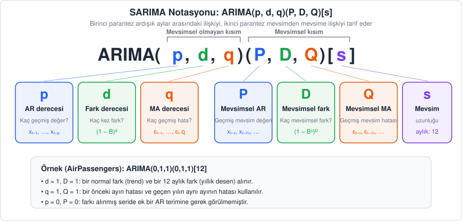

*Şekil 7.2 — SARIMA notasyonunun parçaları. Büyük harfler, küçük harflerin $`s`$ adım aralıklı (mevsimsel) karşılıklarıdır.*

**Örnek (Havayolu modeli):** Box ve Jenkins'in ünlü kitabında `AirPassengers` için önerilen, bu yüzden literatürde **"airline model"** olarak anılan ARIMA(0,1,1)(0,1,1)[12] modeli şöyle yazılır:

$$
(1 - B)(1 - B^{12}) \log x_t = (1 + \theta_1 B)(1 + \Theta_1 B^{12}) \varepsilon_t
$$

Sol taraf "log serinin bir normal ve bir mevsimsel farkı"dır (Şekil 7.1c). Sağ taraf açıldığında, bu farkı alınmış serinin bugünkü şok, bir ay önceki şok, 12 ay önceki şok ve 13 ay önceki şokun birleşimi olduğu görülür:

$$
w_t = \varepsilon_t + \theta_1 \varepsilon_{t-1} + \Theta_1 \varepsilon_{t-12} + \theta_1 \Theta_1 \varepsilon_{t-13}
$$

Bu model 7.6'daki R uygulamasında `auto.arima()` tarafından da seçilecektir.

---

### 7.4. Model Kurma Süreci: Box-Jenkins Yöntemi

George Box ve Gwilym Jenkins, 1970'te ARIMA modellerinin nasıl kurulacağını sistematik bir döngü olarak tarif ettiler. Bugün de kullanılan bu yöntem dört aşamadan oluşur (Şekil 7.3):

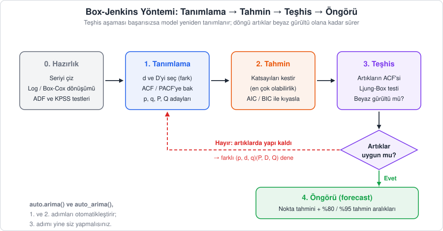

*Şekil 7.3 — Box-Jenkins yöntemi. Teşhis aşamasında artıklarda hâlâ yapı varsa model yeniden tanımlanır.*

**0. Hazırlık.** Seriyi çizin; trend, mevsimsellik ve varyans değişimini gözle inceleyin. Varyans seviyeyle birlikte büyüyorsa log (ya da Box-Cox) dönüşümü uygulayın (Bölüm 2.4). Durağanlığı ADF ve KPSS testleriyle sınayın (7.5).

**1. Tanımlama (identification).** Seriyi durağanlaştıracak fark sayılarını ($d$ ve $D$) belirleyin. Ardından durağan serinin ACF ve PACF grafiklerinden (Bölüm 6.4) $p$, $q$, $P$, $Q$ için aday değerler çıkarın. Kural olarak mevsimsel olmayan terimlere küçük gecikmelerde (1, 2, 3), mevsimsel terimlere $s$'nin katlarında (12, 24, …) bakılır.

**2. Tahmin (estimation).** Aday modellerin katsayılarını ($\phi$, $\theta$, $\Phi$, $\Theta$) veriden kestirin. Yazılımlar bunu **en çok olabilirlik** (maximum likelihood) yöntemiyle yapar. Adaylar arasında seçim için bilgi kriterleri kullanılır. En yaygını Akaike Bilgi Kriteri'dir:

$$
\mathrm{AIC} = -2 \log L + 2k
$$

> **Simge notu:** $`L`$: modelin olabilirlik (likelihood) değeri, yani veriyi ne kadar iyi açıkladığı · $`k`$: tahmin edilen parametre sayısı

İlk terim modelin veriye uyumunu ödüllendirir, ikinci terim gereksiz karmaşıklığı cezalandırır. **Daha küçük AIC daha iyidir.** BIC benzer bir kriterdir ama parametre cezası daha ağırdır ($2k$ yerine $k \log n$), bu yüzden daha sade modelleri tercih eder. AICc ise küçük örneklemler için düzeltilmiş AIC'dir.

**3. Teşhis (diagnostic checking).** Modelin açıklayamadığı kısma, yani **artıklara** (residuals) bakılır: $e_t = x_t - \hat{x}_t$. İyi bir modelin artıkları beyaz gürültü gibi davranmalıdır (ayrıntısı 7.6.6'da). Bunun formel testi **Ljung-Box** testidir:

$$
Q^{\ast} = n(n+2) \sum_{k=1}^{h} \frac{r_k^2}{n-k}
$$

> **Simge notu:** $`\hat{x}_t`$ *(x şapka)*: modelin $`t`$ anı için ürettiği tahmin · $`r_k`$: artıkların $`k`$ gecikmedeki örneklem otokorelasyonu · $`\sum`$ *(sigma, toplam)*: $`k = 1`$'den $`h`$'ye kadar toplam · $`Q^{\ast}`$ *(Q yıldız)*: Ljung-Box test istatistiği

İlk $h$ gecikmedeki otokorelasyonlar toplu olarak sıfıra yakınsa $Q^{\ast}$ küçük çıkar. Sıfır hipotezi $H_0$: "artıklar arasında otokorelasyon yoktur" şeklindedir. Bu yüzden burada **yüksek p-değeri (> 0.05) iyi haberdir.** Artıklarda yapı kalmışsa 1. adıma dönülür.

> **Simge notu:** $`H_0`$ *(H sıfır)*: sıfır hipotezi, testin "varsayılan" iddiası

**4. Öngörü (forecasting).** Teşhisten geçen model geleceği tahmin etmek için kullanılır. Nokta tahminlerinin yanında, belirsizliği gösteren **tahmin aralıkları** (%80, %95) da raporlanmalıdır.

**Not —** R'daki `auto.arima()` ve Python'daki `pmdarima.auto_arima()` fonksiyonları 1. ve 2. adımları otomatikleştirir: Fark sayılarını birim kök testleriyle belirler, sonra farklı (p,q)(P,Q) kombinasyonlarını deneyip en küçük AICc/AIC değerli modeli seçer. **Teşhis adımını ise yine sizin yapmanız gerekir.** Otomatik seçilen bir model de artık testlerinden kalabilir.

---

### 7.5. Durağanlık Testleri: ADF ve KPSS

Bölüm 3.2'de durağanlığı grafikle ve ACF ile nasıl sezeceğimizi gördük. Modelleme öncesinde bu kararı istatistiksel testlerle desteklemek gerekir. En yaygın iki test birbirinin **tersi** hipotezler kurar.

**Tanım 1 (ADF testi — Augmented Dickey-Fuller):** Serinin farkı, serinin bir önceki seviyesi ve gecikmeli farkları üzerine regresyonla açıklanır:

$$
\nabla x_t = \alpha + \beta t + \gamma x_{t-1} + \sum_{i=1}^{k} \delta_i \nabla x_{t-i} + \varepsilon_t
$$

> **Simge notu:** $`\alpha`$ *(alfa)*: sabit terim · $`\beta`$ *(beta)*: doğrusal trend katsayısı · $`\gamma`$ *(gama)*: birim kök katsayısı · $`\delta_i`$ *(delta)*: gecikmeli farkların katsayıları

- $H_0$: $\gamma = 0$, yani **birim kök vardır, seri durağan değildir.**
- $H_1$: $\gamma < 0$, seri durağandır (bu regresyonda: trend etrafında durağandır).
- Küçük p-değeri (< 0.05) → $H_0$ reddedilir → seri durağan kabul edilir.

**Tanım 2 (KPSS testi — Kwiatkowski-Phillips-Schmidt-Shin):**

- $H_0$: **Seri durağandır** (seviye etrafında ya da trend etrafında).
- $H_1$: Seri birim kök içerir.
- Küçük p-değeri (< 0.05) → $H_0$ reddedilir → seri durağan **değildir**.

İki test birlikte şöyle yorumlanır:

| ADF sonucu | KPSS sonucu | Yorum |
| --- | --- | --- |
| $`H_0`$ reddedildi (durağan) | $`H_0`$ reddedilmedi (durağan) | Seri durağan; fark almaya gerek yok |
| $`H_0`$ reddedilmedi (birim kök) | $`H_0`$ reddedildi (durağan değil) | Seri durağan değil; fark alın |
| $`H_0`$ reddedildi | $`H_0`$ reddedildi | Çelişkili; genellikle trend-durağanlık ya da güçlü mevsimsellik. Grafiğe bakın, fark alıp tekrar test edin |
| $`H_0`$ reddedilmedi | $`H_0`$ reddedilmedi | Veri yetersiz ya da testler güçsüz; grafiğe ve ACF'ye bakın |

**Not —** "p-değeri 0.05'ten büyük" sonucu, sıfır hipotezinin **doğru olduğunu kanıtlamaz**; yalnızca reddetmek için yeterli kanıt olmadığını söyler. Bu yüzden tek bir teste değil, grafik + ACF + iki testin birlikte verdiği tabloya güvenin.

---

### 7.6. R Uygulaması: `AirPassengers` ile SARIMA

> 💻 **Uygulama dosyası:** [`Codes/R/ch07_sarima_airpassengers.R`](Codes/R/ch07_sarima_airpassengers.R)
>
> Bu bölümdeki R kodlarının tamamı bu dosyada. RStudio'da açıp satır satır çalıştırabilir ya da depo kök dizininde `Rscript Codes/R/ch07_sarima_airpassengers.R` komutunu kullanabilirsiniz.


Şimdi Box-Jenkins adımlarını R üzerinde `AirPassengers` veri setiyle uygulayalım. Bu veri seti belirgin bir trend, mevsimsellik ve zamanla artan varyans içerdiği için öğretici bir örnektir.

#### 7.6.1. Veriyi Görselleştirme

Bir zaman serisi analizine başlarken ilk adım veriyi çizmektir. Grafik bize trend olup olmadığını, düzenli tekrar eden dalgalanmalar (mevsimsellik) bulunup bulunmadığını ve verinin değişkenliğinin zamanla değişip değişmediğini gösterir.

```r
# Gerekli paketler
# install.packages(c("forecast", "tseries"))
library(forecast)
library(tseries)

# Veriyi yükle ve çiz
data(AirPassengers)
plot(AirPassengers, main = "AirPassengers Verisi: Trend ve Artan Varyans",
     ylab = "Yolcu Sayısı", xlab = "Yıl", col = "darkblue")
```

Grafikte (Şekil 7.1a) üç şey hemen göze çarpar:

- Yolcu sayısı yıllar içinde sürekli artıyor: **trend** var.
- Her yıl yaz aylarında tepe yapan bir desen tekrarlanıyor: **mevsimsellik** var.
- Dalgaların boyu zamanla büyüyor: **varyans artıyor** (çarpımsal yapı, Bölüm 2.4).

Bu üç özellik de serinin ortalamasının ve varyansının zamanla değiştiğini, yani durağan olmadığını gösterir.

#### 7.6.2. Durağanlık Testleri

```r
adf.test(AirPassengers)
#>  Augmented Dickey-Fuller Test
#> data:  AirPassengers
#> Dickey-Fuller = -7.3186, Lag order = 5, p-value = 0.01
#> alternative hypothesis: stationary
#> Warning: p-value smaller than printed p-value

kpss.test(AirPassengers)
#>  KPSS Test for Level Stationarity
#> data:  AirPassengers
#> KPSS Level = 2.7395, Truncation lag parameter = 4, p-value = 0.01
#> Warning: p-value smaller than printed p-value
```

**Çıktının yorumu:** İlk bakışta şaşırtıcı bir sonuç: ADF testi p = 0.01 ile birim kök hipotezini **reddediyor**, KPSS testi ise p = 0.01 ile durağanlık hipotezini **reddediyor**. Yani iki test çelişiyor (7.5'teki tablonun üçüncü satırı).

Bunun nedeni, `tseries::adf.test()` fonksiyonunun regresyona bir **doğrusal trend terimi** ($\beta t$) eklemesidir. Test, "seri düz bir trend çizgisi etrafında durağan mı?" sorusunu soruyor ve `AirPassengers`'ın güçlü, düzenli trendi bu soruya "evet" dedirtiyor. Oysa ortalama sabit değildir ve mevsimsel desen ile artan varyans da hâlâ oradadır. Seviye durağanlığını sınayan KPSS ve grafik bu yüzden daha güvenilir bir tablo çiziyor: **seri durağan değildir.** Bu örnek, tek bir teste körü körüne güvenmemek gerektiğini çok iyi gösterir.

#### 7.6.3. Seriyi Durağanlaştırma

Durağanlığı sağlamak için iki işlem yapılır:

1. **Log dönüşümü:** Artan varyansı dengeler (çarpımsal yapıyı toplamsala çevirir).
2. **Fark alma:** Mevsimsel fark (lag = 12) yıllık deseni, normal fark trendi siler.

```r
# Önce log dönüşümü, sonra mevsimsel (lag = 12) ve normal (lag = 1) fark
AP_stationary <- diff(diff(log(AirPassengers), lag = 12))

plot(AP_stationary, main = "Dönüştürülmüş AirPassengers Serisi",
     ylab = "Fark Değerleri", col = "darkblue")
abline(h = 0, lty = 2)

# Testleri tekrarlayalım
adf.test(AP_stationary)
#> Dickey-Fuller = -5.1993, Lag order = 5, p-value = 0.01
#> alternative hypothesis: stationary

kpss.test(AP_stationary)
#> KPSS Level = 0.084365, Truncation lag parameter = 4, p-value = 0.1
#> Warning: p-value greater than printed p-value
```

Artık iki test aynı şeyi söylüyor: ADF birim kökü reddediyor (p = 0.01), KPSS durağanlığı reddetmiyor (p > 0.1). Seri durağandır ve Şekil 7.1c'deki gibi sıfır çevresinde dalgalanmaktadır.

`forecast` paketi gereken fark sayılarını doğrudan da önerebilir:

```r
nsdiffs(log(AirPassengers))                  # gereken mevsimsel fark sayısı (D)
#> [1] 1
ndiffs(diff(log(AirPassengers), lag = 12))   # mevsimsel farktan sonra gereken normal fark sayısı (d)
#> [1] 1
```

Böylece $D = 1$ ve $d = 1$ kararını hem testlerle hem de bu fonksiyonlarla doğrulamış olduk.

#### 7.6.4. Model Belirleme (ACF ve PACF)

Durağan serinin ACF ve PACF grafiklerini inceleyerek AR ve MA terimleri için ipuçları ararız (Bölüm 6.4).

```r
par(mfrow = c(1, 2))  # grafikleri yan yana göster
acf(AP_stationary, lag.max = 36, main = "ACF")
pacf(AP_stationary, lag.max = 36, main = "PACF")
par(mfrow = c(1, 1))
```

**Çıktının yorumu:** R, ACF grafiğinin yatay eksenini "yıl" cinsinden gösterir; 1.0 = 12 ay gecikme demektir. Bu grafiklerde iki belirgin iz görülür:

- **ACF'de gecikme 1'de** belirgin bir negatif çubuk (yaklaşık −0.34) vardır; 3. gecikmedeki sınırda bir çubuk dışında sonrası kesilir → mevsimsel olmayan kısımda **MA(1)**, yani $q = 1$ adayı.
- **ACF'de gecikme 12'de** (eksende 1.0) belirgin bir negatif çubuk (yaklaşık −0.39) vardır ve 24'te tekrarlamaz → mevsimsel kısımda **MA(1)**, yani $Q = 1$ adayı.
- PACF'de de 1 ve 12'de anlamlı çubuklar vardır, ancak bunlar komşu gecikmelere yayılarak sönümlenir. "ACF kesiliyor, PACF sönümleniyor" deseni MA yapısıyla tutarlıdır (Bölüm 6.4.3).

Bu okuma bizi ARIMA(0,1,1)(0,1,1)[12] adayına götürür. ACF/PACF okumak deneyim ister; bu yüzden elle bulduğumuz adayı otomatik aramayla karşılaştıracağız.

#### 7.6.5. Model Kurma: `auto.arima()` ve Seçilen Modelin Yorumu

`auto.arima()` fonksiyonu fark sayılarını testlerle belirler, ardından farklı parametre kombinasyonlarını deneyerek en küçük AICc değerine sahip modeli seçer. Log dönüşümünü kendimiz yapıp modele log seriyi veriyoruz.

```r
fit <- auto.arima(log(AirPassengers), seasonal = TRUE)
print(fit)
#> Series: log(AirPassengers)
#> ARIMA(0,1,1)(0,1,1)[12]
#>
#> Coefficients:
#>           ma1     sma1
#>       -0.4018  -0.5569
#> s.e.   0.0896   0.0731
#>
#> sigma^2 = 0.001371:  log likelihood = 244.7
#> AIC=-483.4   AICc=-483.21   BIC=-474.77
```

**Çıktının yorumu:**

- `auto.arima()`, ACF/PACF'den elle çıkardığımız adayla aynı modeli, yani 7.3'teki **havayolu modelini** seçti.
- `ma1 = -0.4018` katsayısı $\theta_1$, `sma1 = -0.5569` katsayısı $\Theta_1$'dir. Standart hataları (`s.e.`) katsayıların yaklaşık beşte biri kadardır; yani iki katsayı da istatistiksel olarak anlamlıdır (kabaca |katsayı| > 2 × s.e.).
- `sigma^2 = 0.001371`, beyaz gürültünün tahmini varyansıdır. Log ölçekte standart sapması $\sqrt{0.001371} \approx 0.037$ olduğundan, tek adımlık tipik hata yaklaşık **%3.7** mertebesindedir.
- AIC, AICc ve BIC değerleri tek başına anlam taşımaz; **aynı veri üzerindeki** farklı modelleri karşılaştırmak için kullanılır.

> **Simge notu:** $`\approx`$ *(yaklaşık eşittir)*: iki değerin yaklaşık olarak eşit olduğunu belirtir

Seçilen modelin iki parçasını ayrı ayrı inceleyelim.

**Mevsimsel olmayan kısım: `(0,1,1)`.** Bu üç sayı serinin aydan aya davranışını açıklar.

- **`d = 1` (fark derecesi):** Model trendi ortadan kaldırmak için bir kez fark alır. Yolcu sayısının kendisini değil, bir aydan diğerine olan değişimi modeller.
- **`q = 1` (MA derecesi):** Model bir önceki ayın tahmin hatasını (öngörülemeyen şoku) kullanarak mevcut tahmini düzeltir.
- **`p = 0` (AR derecesi):** Trend ve geçmiş hata hesaba katıldıktan sonra, farkı alınmış serinin kendi geçmiş değerlerine ayrıca bağlı olmadığı anlamına gelir.

**Mevsimsel kısım: `(0,1,1)[12]`.** Bu kısım yıllık deseni açıklar; `[12]` mevsim uzunluğunun 12 ay olduğunu gösterir.

- **`D = 1` (mevsimsel fark):** Bu Ocak ayını geçen ayla değil, **geçen yılın Ocak ayıyla** karşılaştırır. Her yıl tekrarlanan yaz yoğunluğu gibi desenler böylece temizlenir.
- **`Q = 1` (mevsimsel MA):** Model, geçen yılın aynı ayındaki tahmin hatasını kullanır. Örneğin geçen Temmuz'u eksik tahmin ettiyse, bu bilgiyi bu Temmuz'un tahminini düzeltmek için kullanır.
- **`P = 0` (mevsimsel AR):** Mevsimsel fark ve mevsimsel hata hesaba katıldıktan sonra, önceki yılların aynı ayındaki değerlere ayrıca bağlılık yoktur.

Özetle model, hem trendi hem de yıllık deseni fark alarak durağanlaştırır; ardından hem bir ay önceki hem de geçen yılın aynı ayındaki hatalardan ders çıkararak tahmin yapar. Şimdi bu modelin gerçekten işe yarayıp yaramadığını kontrol etmeliyiz.

#### 7.6.6. Teşhis: Artıkların İncelenmesi

Kurduğumuz modeli, verideki hikâyeyi açıklamaya çalışan bir dedektif gibi düşünün. Modelin açıklayamadığı, geride bıraktığı kırıntılara **artıklar** diyoruz. Artıklarda bir desen varsa (örneğin her yaz hatalar büyüyorsa) dedektif önemli bir ipucunu kaçırmış demektir. Amacımız artıkların, boş bir radyo kanalındaki cızırtı gibi, tamamen rastgele ve öngörülemez olmasıdır. Bu ideal duruma **beyaz gürültü** diyoruz.

İyi bir modelin artıklarının üç özelliği olmalıdır:

1. **Ortalaması sıfır olmalı:** Model sistematik olarak ne yukarı ne aşağı yönde hata yapmalı.
2. **Varyansı sabit olmalı:** Hataların büyüklüğü zamanla değişmemeli. Hatalar büyüyorsa tahmin aralıkları güvenilmez olur.
3. **Otokorelasyon içermemeli:** En önemlisi budur. Bir dönemin hatası bir sonrakini tahmin etmeye yardım ediyorsa, model kullanılabilecek bir bilgiyi kaçırmıştır.

Ek olarak artıkların **normal dağılıma yakın** olması, tahmin aralıklarının doğru hesaplanması için istenir.

```r
checkresiduals(fit)
#>  Ljung-Box test
#> data:  Residuals from ARIMA(0,1,1)(0,1,1)[12]
#> Q* = 26.446, df = 22, p-value = 0.233
#>
#> Model df: 2.   Total lags used: 24
```

`checkresiduals()` üç grafik ve Ljung-Box testini birlikte verir (Şekil 7.4):

- **Artıkların zaman grafiği:** Belirgin bir desen ya da trend olmamalı.
- **Artıkların ACF grafiği:** Çubukların neredeyse tamamı mavi kesikli güven bandı içinde kalmalı. 24 gecikmede bir çubuğun sınırı hafifçe aşması, %5 anlamlılık düzeyinde tesadüfen beklenen bir durumdur.
- **Histogram:** Sıfır etrafında, normal dağılıma benzer bir şekil olmalı.

**Çıktının yorumu:** Ljung-Box testinin p-değeri 0.233'tür (> 0.05). Yani "artıklar arasında otokorelasyon yoktur" hipotezini reddedemiyoruz; artıklar beyaz gürültüden ayırt edilemiyor. `df = 22`, kullanılan 24 gecikmeden tahmin edilen 2 katsayının (ma1, sma1) düşülmesiyle elde edilir. Model teşhis aşamasını geçmiştir.

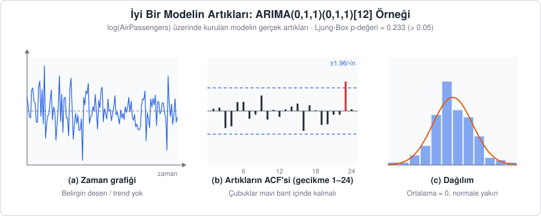

*Şekil 7.4 — ARIMA(0,1,1)(0,1,1)[12] modelinin gerçek artıkları: (a) zaman grafiği, (b) ACF ve $`\pm 1.96/\sqrt{n}`$ güven bandı, (c) normal eğriyle karşılaştırılan histogram.*

#### 7.6.7. Tahmin (Öngörü)

Model teşhisten geçtiğine göre geleceği tahmin etmek için `forecast()` fonksiyonunu kullanabiliriz.

```r
# Gelecek 24 ay için tahmin (log ölçekte)
fc <- forecast(fit, h = 24)
plot(fc, main = "Gelecek 24 Ay için log(Yolcu Sayısı) Tahmini")
grid()

# Orijinal ölçeğe dönmek için exp() uygularız
round(exp(fc$mean[c(1, 12, 24)]), 1)   # 1., 12. ve 24. ay tahminleri
#> [1] 450.4 477.2 525.5
```

**Çıktının yorumu:** Grafikte mavi çizgi **nokta tahminlerini**, koyu ve açık gri alanlar sırasıyla **%80 ve %95 tahmin aralıklarını** gösterir. Model, öğrendiği trendi ve yıllık deseni geleceğe taşır; yaz tepeleri tahminlerde de görülür.

Gri alanların zamanla genişlemesi dikkat çekicidir: Ne kadar uzağı tahmin edersek belirsizlik o kadar artar. Bu, modelin uzun vadeli tahminlerde daha az kesin olduğunu dürüstçe ifade etmesidir. Model log ölçekte kurulduğu için `exp()` ile orijinal yolcu sayısına dönüyoruz: Örneğin Ocak 1961 için yaklaşık 450, Aralık 1962 için yaklaşık 526 yolcu (bin kişi) tahmin ediliyor.

**Not —** Bu tahminleri gerçek değerlerle karşılaştırıp modelin **başarısını sayısal olarak ölçmek** için veriyi eğitim ve test kısımlarına ayırmamız gerekir. Bunu, hata metrikleriyle birlikte Bölüm 8.3'te yapacağız.

---

### 7.7. Python ile Aynı Analiz

> 💻 **Uygulama dosyası:** [`Codes/python/ch07_sarima_airpassengers.py`](Codes/python/ch07_sarima_airpassengers.py) · [Notebook](Codes/notebooks/ch07_sarima_airpassengers.ipynb) · [](https://colab.research.google.com/github/erkanozhan/AI_Based_Time_Series-Data_Analytics/blob/main/Codes/notebooks/ch07_sarima_airpassengers.ipynb)
>
> Bu bölümdeki kodların tamamı bu dosyada. Bilgisayarınızda çalıştırmak için depo kök dizininde `python Codes/python/ch07_sarima_airpassengers.py` komutunu kullanın ya da dosyayı VS Code'da açıp hücre hücre çalıştırın. Kurulum yapmadan denemek için Colab bağlantısını kullanabilirsiniz.


Aynı `AirPassengers` analizini şimdi Python ile, `statsmodels` ve `pmdarima` kütüphanelerini kullanarak yapalım. Burada tanımlayacağımız `data`, `train_data`, `test_data`, `predictions_arima` ve `rmse_arima` değişkenlerini sonraki bölümlerde, özellikle Bölüm 15'teki LSTM karşılaştırmasında, yeniden kullanacağız.

#### 7.7.1. Veri Setinin Yüklenmesi ve Hazırlanması

Önce gerekli kütüphaneleri projemize dahil edelim.

```python
# Gerekli kütüphaneleri içe aktarıyoruz.
# Kurulum: pip install pandas numpy matplotlib statsmodels pmdarima scikit-learn
import pandas as pd  # Veri manipülasyonu ve analizi için temel kütüphane.
import numpy as np  # Sayısal hesaplamalar için temel kütüphane.
import matplotlib.pyplot as plt  # Veri görselleştirme için kullanılır.
from pmdarima.datasets import load_airpassengers  # AirPassengers veri setini yüklemek için.
from statsmodels.graphics.tsaplots import plot_acf, plot_pacf  # ACF ve PACF grafikleri için
from statsmodels.tsa.stattools import adfuller, kpss  # ADF ve KPSS durağanlık testleri için
from pmdarima import auto_arima  # En uygun (S)ARIMA modelini otomatik bulmak için
from sklearn.metrics import mean_squared_error  # Ortalama kare hata (RMSE hesabı için)
```

Şimdi veri setini yükleyelim. `pmdarima` veriyi 0, 1, 2, … şeklinde tam sayı indeksle getirir; grafiklerde yılları görebilmek için aylık bir tarih indeksi ekliyoruz.

```python
# AirPassengers veri setini pmdarima kütüphanesi yardımıyla yüklüyoruz.
# as_series=True parametresi ile veriyi bir Pandas Serisi olarak alıyoruz.
data = load_airpassengers(as_series=True)

# 1949 Ocak'tan başlayan aylık tarih indeksi ekleyelim ("MS" = ay başı).
data.index = pd.date_range(start="1949-01-01", periods=len(data), freq="MS")

# Verinin ilk beş satırını görüntüleyelim.
print(data.head())

# Veriyi görselleştirelim.
plt.figure(figsize=(12, 6))
plt.plot(data)
plt.title('Aylık Hava Yolu Yolcu Sayıları (1949-1960)')
plt.xlabel('Yıl')
plt.ylabel('Yolcu Sayısı')
plt.show()
```

Grafik, R'da gördüğümüzün aynısıdır: artan bir trend, her yıl tekrarlanan mevsimsel dalgalanma ve zamanla büyüyen dalga boyu.

#### 7.7.2. Durağanlık Testleri ve ACF/PACF

```python
# ADF testi (H0: birim kök var, seri durağan değil)
adf_p = adfuller(data)[1]
# KPSS testi (H0: seri durağan)
kpss_p = kpss(data, regression='c', nlags='auto')[1]
print(f"Orijinal seri  -> ADF p = {adf_p:.3f}, KPSS p = {kpss_p:.3f}")

# Log + mevsimsel fark + normal fark
data_stationary = np.log(data).diff(12).diff().dropna()
print(f"Durağanlaştırılmış seri -> ADF p = {adfuller(data_stationary)[1]:.4f}, "
      f"KPSS p = {kpss(data_stationary, regression='c', nlags='auto')[1]:.3f}")
```

**Çıktının yorumu:** Orijinal seride ADF p-değeri yaklaşık 0.99, KPSS p-değeri 0.01 çıkar: İki test de **durağan değil** diyor. R'daki çelişki burada yok, çünkü `statsmodels`'ın `adfuller()` fonksiyonu varsayılan olarak regresyona trend terimi eklemez (`regression='c'`, yalnızca sabit). Aynı testin farklı yazılımlarda farklı varsayılanlarla çalışabildiğini unutmayın. Durağanlaştırılmış seride ise ADF p ≈ 0.0002 ve KPSS p ≥ 0.1 çıkar: seri durağandır.

**Not —** KPSS p-değeri tablo sınırlarının dışında kaldığında `statsmodels` bir `InterpolationWarning` uyarısı verir; bu, gerçek p-değerinin gösterilenden daha küçük (ya da daha büyük) olduğunu belirtir, bir hata değildir.

Şimdi ACF ve PACF grafiklerini çizelim:

```python
# ACF ve PACF grafiklerini çizdirelim
fig, (ax1, ax2) = plt.subplots(2, 1, figsize=(12, 8))

# Orijinal veri için ACF grafiği
plot_acf(data, ax=ax1, lags=40)
ax1.set_title('Otokorelasyon Fonksiyonu (ACF)')

# Orijinal veri için PACF grafiği
plot_pacf(data, ax=ax2, lags=40)
ax2.set_title('Kısmi Otokorelasyon Fonksiyonu (PACF)')

plt.tight_layout()
plt.show()
```

**Çıktının yorumu:** Orijinal verinin ACF'si çok yavaş azalır ve 12, 24, 36. gecikmelerde tümsekler yapar. Yavaş sönüm trendin (durağan olmamanın), tümsekler mevsimselliğin işaretidir. Durağanlaştırılmış seriyi (`data_stationary`) aynı fonksiyonlarla çizerseniz, 7.6.4'te R'da gördüğümüz gecikme 1 ve 12'deki negatif çubukları görürsünüz.

#### 7.7.3. Veriyi Eğitim ve Test Olarak Ayırma

Modelin performansını ölçmek için verinin son 5 yılını (60 ay) test seti, geri kalanını eğitim seti olarak ayıralım. Zaman serisinde bu ayrım **rastgele değil, kronolojik** yapılır; nedenini Bölüm 8.1'de ayrıntılı olarak ele alacağız.

```python
# Veri setini eğitim ve test olarak ayırıyoruz. Son 60 ay test verisi olacak.
train_data = data[:-60]
test_data = data[-60:]
print(f"Eğitim: {train_data.index[0]:%Y-%m} - {train_data.index[-1]:%Y-%m} ({len(train_data)} ay)")
print(f"Test:   {test_data.index[0]:%Y-%m} - {test_data.index[-1]:%Y-%m} ({len(test_data)} ay)")
```

**Not —** R uygulamasında (Bölüm 8.3) test seti olarak yalnızca 1960 yılını (12 ay) kullanacağız. Burada 60 ay seçmemizin nedeni, Bölüm 15'teki LSTM modeliyle aynı test dönemi üzerinde karşılaştırma yapabilmektir. Test ufku uzadıkça hatanın büyüyeceğini unutmayın; iki uygulamanın hata değerleri bu yüzden doğrudan karşılaştırılamaz.

#### 7.7.4. `auto_arima` ile En Uygun Modeli Bulma

(p, d, q) ve mevsimsel (P, D, Q, m) parametrelerini elle belirlemek yerine, R'daki `auto.arima()`'nın Python karşılığı olan `auto_arima` fonksiyonunu kullanabiliriz. Fonksiyon farklı parametre kombinasyonlarını deneyerek en düşük AIC değerine sahip modeli bulur. `pmdarima`'da mevsim uzunluğu `s` yerine `m` parametresiyle verilir.

```python
# auto_arima fonksiyonunu kullanarak en uygun ARIMA modelini buluyoruz.
# seasonal=True, veride mevsimsellik olduğunu belirtir.
# m=12, mevsimsel döngünün 12 ay olduğunu (yıllık) ifade eder.
# stepwise=True, tüm kombinasyonlar yerine daha hızlı bir adımsal arama yapar.
# trace=True, denenen her modeli ve AIC değerini ekrana yazar.
auto_model = auto_arima(train_data,
                        seasonal=True,
                        m=12,
                        stepwise=True,
                        suppress_warnings=True,
                        trace=True)

# Bulunan en iyi modelin özetini yazdırıyoruz.
print(auto_model.summary())
```

**Çıktının yorumu:** `trace=True` sayesinde denenen modeller ve AIC değerleri satır satır listelenir; en sonda seçilen model `SARIMAX(p,d,q)x(P,D,Q,12)` biçiminde raporlanır. Özet tablosundaki `ar.L1`, `ma.L1`, `ma.S.L12` gibi satırlar sırasıyla $\phi_1$, $\theta_1$, $\Theta_1$ katsayılarıdır; `P>|z|` sütunundaki küçük değerler katsayının anlamlı olduğunu gösterir. Tablonun altındaki `Ljung-Box (Q)` satırının `Prob(Q)` değeri, 7.6.6'daki artık testinin karşılığıdır.

Bizim denememizde (pmdarima 2.1) seçilen model sabit terimli **ARIMA(1,0,0)(0,1,1)[12]** oldu. Burada $d = 0$ olmasına şaşırmayın: Mevsimsel fark ($D = 1$) trendin büyük kısmını zaten temizlemiş, kalan kayma sabit terimle karşılanmıştır. R'daki modelden farklı olmasının iki nedeni vardır: Burada log dönüşümü yapmadık ve model yalnızca 1956 öncesi veriyle kuruldu. Kütüphane sürümüne göre sizin sonucunuz biraz farklı olabilir.

#### 7.7.5. Tahmin ve Değerlendirme

Şimdi bulduğumuz modelle test dönemi için tahmin yapalım ve gerçek değerlerle karşılaştıralım.

```python
# Test seti için tahminler yapıyoruz. n_periods, tahmin edilecek dönem sayısını belirtir.
predictions_arima = auto_model.predict(n_periods=len(test_data))

# Tahminleri, test verisi ile aynı indekse sahip bir Pandas Serisine dönüştürelim.
predictions_arima = pd.Series(np.asarray(predictions_arima), index=test_data.index)

# Gerçek değerler ve tahminleri görselleştirelim.
plt.figure(figsize=(12, 6))
plt.plot(train_data, label='Eğitim Verisi')
plt.plot(test_data, label='Gerçek Değerler (Test)', color='orange')
plt.plot(predictions_arima, label='ARIMA Tahminleri', color='green')
plt.title('ARIMA Modeli ile Yolcu Sayısı Tahmini')
plt.xlabel('Yıl')
plt.ylabel('Yolcu Sayısı')
plt.legend()
plt.show()

# Modelin performansını Kök Ortalama Kare Hata (RMSE) ile ölçelim.
rmse_arima = np.sqrt(mean_squared_error(test_data, predictions_arima))
print(f'ARIMA Modeli RMSE Değeri: {rmse_arima:.2f}')
```

**Çıktının yorumu:** Grafikte yeşil tahmin çizgisinin trendi ve yaz tepelerini genel olarak izlediği, ancak gerçek değerlerin giderek daha fazla altında kaldığı görülür: 1956'da ortalama hata yaklaşık 18 yolcu iken 1960'ta 60'ı aşar. Bizim denememizde RMSE yaklaşık **47.9** yolcu (bin kişi) çıktı. Bu değer, 60 aylık uzun bir ufukta ortalama hatanın büyüklüğünü kabaca özetler. Log dönüşümü yapılmadığı için model, zamanla büyüyen mevsimsel dalgaları tam yakalayamamaktadır.

**Not —** Burada kullandığımız **RMSE** (Root Mean Squared Error) ve diğer hata metrikleri (MAE, MAPE) bir sonraki bölümde, Bölüm 8.2'de formülleri ve yorumlarıyla ayrıntılı olarak tanımlanacaktır. Şimdilik "küçük RMSE = daha iyi tahmin" demek yeterlidir.

**Alıştırma:** Modeli `np.log(train_data)` üzerinde kurun, tahminleri `np.exp()` ile orijinal ölçeğe döndürün ve RMSE'yi yeniden hesaplayın. Sonuç, log dönüşümünün çarpımsal yapıdaki serilerde neden önemli olduğunu gösterecektir.

Klasik modellerin gücü yorumlanabilirliklerindedir: Her katsayının açık bir anlamı vardır ve tahmin aralıkları kuramsal olarak hesaplanır. Ancak ARIMA ailesi doğrusal ilişkiler varsayar; karmaşık, doğrusal olmayan desenleri yakalamakta zorlanabilir. Bu tür durumlarda Bölüm 12'den itibaren ele alacağımız yapay zekâ tabanlı yöntemler daha etkili olabilir. Ama önce, farklı modelleri adil biçimde karşılaştırabilmek için **model değerlendirme** araçlarını öğrenmemiz gerekiyor.

---

<a id="bolum-8"></a>

## 8. Model Değerlendirme: Hata Metrikleri ve Eğitim-Test Ayrımı

Bölüm 7'de bir SARIMA modeli kurduk ve geleceğe yönelik tahminler ürettik. Peki bu tahminler ne kadar iyi? Bir grafiğe bakıp "çizgiler birbirine yakın görünüyor" demek bilimsel bir yaklaşım değildir. Başarımızı **sayısal olarak** ifade etmemiz ve bunu modelin **daha önce görmediği** veriler üzerinde yapmamız gerekir.

Bu bölümde iki soruya yanıt arayacağız:

1. Modeli hangi veriyle eğitip hangi veriyle sınamalıyız? (8.1)
2. Tahminle gerçek arasındaki farkı hangi sayılarla özetlemeliyiz? (8.2)

Ardından bu araçları R (8.3) ve Python (8.4) ile `AirPassengers` üzerinde uygulayacağız. Burada tanımlayacağımız metrikleri ve `evaluate_model()` fonksiyonunu kitabın geri kalanında Prophet, XGBoost ve LSTM gibi modelleri karşılaştırmak için tekrar tekrar kullanacağız.

---

### 8.1. Neden Değerlendirme? Eğitim-Test Mantığı

**Açıklama:** Bir öğrencinin başarısını, sınavda daha önce çözdüğü soruları sorarak ölçemezsiniz; o soruları ezberlemiş olabilir. Gerçek başarı, hiç görmediği yeni soruları çözebilmesidir. Modeller için de aynısı geçerlidir. Bir model eğitildiği veriye çok iyi uyabilir ama geleceği kötü tahmin edebilir. Bu duruma **aşırı uyum** (overfitting) denir.

Bu yüzden elimizdeki veriyi ikiye ayırırız:

1. **Eğitim seti (training set):** Model geçmişteki desenleri, trendi ve mevsimsel ilişkileri bu veriden öğrenir. Modelin parametreleri bu set kullanılarak kestirilir.
2. **Test seti (test set):** Eğitim tamamlandıktan sonra modelin hiç görmediği bu kısım için tahmin yapılır ve tahminler gerçek değerlerle karşılaştırılır. Test seti modelin **genelleme** yeteneğini, yani yeni verilere ne kadar uyum sağlayabildiğini tarafsız biçimde ölçer.

Eğitim setindeki hataya **örneklem içi** (in-sample), test setindeki hataya **örneklem dışı** (out-of-sample) hata denir. Model seçerken asıl önemli olan örneklem dışı hatadır.

#### 8.1.1. Zaman Serisinde Rastgele Bölme Yapılmaz

Sıradan makine öğrenmesi problemlerinde satırlar rastgele karıştırılıp örneğin %80'i eğitime, %20'si teste ayrılır. **Zaman serisinde bu yapılmaz.** Nedeni Şekil 8.1'de görülmektedir.

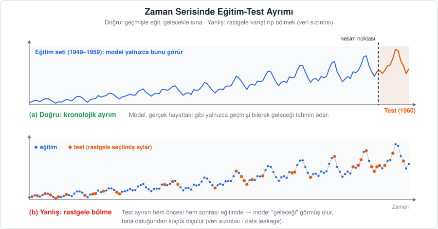

*Şekil 8.1 — (a) Doğru: Kronolojik ayrımda model yalnızca kesim noktasından önceki veriyi görür. (b) Yanlış: Rastgele bölmede test aylarının hem öncesi hem sonrası eğitimdedir; model "geleceği" görmüş olur.*

Rastgele bölmede, örneğin Mart 1958 test setindeyse, Şubat 1958 ve Nisan 1958 eğitim setinde olabilir. Model Mart'ı tahmin ederken bir sonraki ayı zaten "bilmektedir". Aradaki değeri iki komşusundan tahmin etmek (interpolasyon), geleceği tahmin etmekten (ekstrapolasyon) çok daha kolaydır. Sonuçta hata olduğundan çok daha küçük ölçülür ve model gerçekte olduğundan iyi görünür.

Gelecekten geçmişe bilgi taşınmasına **veri sızıntısı** (data leakage) denir. Zaman serisinde sızıntının yaygın kaynakları şunlardır:

- **Rastgele bölme:** Yukarıda anlattığımız durum.
- **Tüm veriyle ön işleme:** Ölçekleme (ör. `MinMaxScaler`), normalleştirme ya da eksik değer doldurma için gereken istatistikleri (min, max, ortalama) tüm seriden hesaplamak. Bu istatistikler **yalnızca eğitim setinden** hesaplanmalı, sonra test setine aynen uygulanmalıdır.
- **Geleceğe bakan özellikler:** Örneğin merkezî hareketli ortalama gibi, $t$ anının değerini hesaplarken $t+1$, $t+2$ gözlemlerini kullanan özellikler.
- **Test setine bakarak model seçmek:** Test hatasına bakıp parametreleri tekrar tekrar ayarlamak, test setini gizlice eğitime katmak demektir. Model seçimi için eğitim setinin sonundan ayrı bir **doğrulama seti** (validation set) ayırmak daha doğrudur.

**Not —** Test setinin uzunluğu, gerçekte ihtiyaç duyacağınız **tahmin ufkuna** yakın seçilmelidir. Önümüzdeki 12 ayı tahmin edecekseniz, son 12 ayı test setine ayırmak mantıklıdır.

**Not —** Tek bir eğitim-test ayrımı, sonucun seçilen kesim noktasına bağlı olmasına yol açar. Daha sağlam bir değerlendirme için kesim noktası zaman içinde ileri kaydırılarak birden çok kez eğitim-test yapılır. Zaman serisine uygun bu çapraz doğrulama yöntemini (`TimeSeriesSplit`) Bölüm 16'da ayrıntılı olarak ele alacağız.

#### 8.1.2. Referans Model: Naive (Saf) Tahmin

Bir modelin hatasının "iyi" olup olmadığına karar vermek için bir **kıyas noktasına** ihtiyacımız vardır. RMSE = 18 iyi mi, kötü mü? Bu soru ancak "neye göre?" sorusuyla birlikte anlamlıdır.

**Açıklama:** En basit kıyas noktası, hiçbir şey öğrenmeyen "tembel" tahmin yöntemleridir. Karmaşık bir model bu basit yöntemleri yenemiyorsa, o modelin kurulmasına değmez.

**Tanım 1 (Naive tahmin):** Gelecekteki tüm değerler, bilinen son gözleme eşit tahmin edilir:

$$
\hat{y}_{T+h} = y_T
$$

> **Simge notu:** $`\hat{y}`$ *(y şapka)*: tahmin edilen değer · $`T`$: eğitim setindeki son zaman noktası · $`h`$: kaç adım ilerisinin tahmin edildiği (tahmin ufku)

**Tanım 2 (Mevsimsel naive tahmin):** Her gelecek dönem, bir önceki mevsimin aynı dönemine eşit tahmin edilir. Örneğin gelecek Temmuz = son bilinen Temmuz:

$$
\hat{y}_{T+h} = y_{T+h-s} \quad (h \le s)
$$

Burada $s$ mevsim uzunluğudur (aylık veride 12). Ufuk $s$'den uzunsa son bilinen mevsim tekrar tekrar kopyalanır.

Mevsimsel verilerde asıl rakip mevsimsel naive yöntemdir. 8.3'te göreceğimiz gibi, `AirPassengers` için SARIMA modelinin bu referansı açık farkla yenmesi, modelin trend ve mevsimsellikten öte gerçekten bir şey öğrendiğini gösterir.

---

### 8.2. Hata Metrikleri

Her şeyin temelinde tek bir kavram vardır: **hata** (error), yani gerçek değer ile tahmin arasındaki fark:

$$
e_t = y_t - \hat{y}_t
$$

Pozitif hata, modelin gerçeği **eksik** tahmin ettiğini; negatif hata, **fazla** tahmin ettiğini gösterir. Test setindeki $n$ adet hatayı tek bir sayıda özetlemenin farklı yolları, farklı metrikleri doğurur.

**Not —** Hataların basit ortalamasını almak işe yaramaz: +30 ve −30'luk iki hata ortalamada 0 eder ve model kusursuz görünür. Bu yüzden metrikler ya hatanın **mutlak değerini** ya da **karesini** kullanır. Yine de hataların işaretli ortalamasına (**yanlılık**, bias) ayrıca bakmak faydalıdır: Sürekli pozitif çıkıyorsa model sistematik olarak eksik tahmin yapıyor demektir.

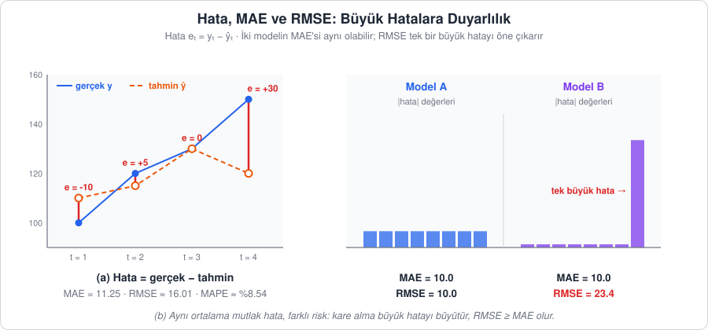

*Şekil 8.2 — (a) Hata, gerçek değer ile tahmin arasındaki dikey uzaklıktır. (b) Model A ve Model B'nin MAE'si aynıdır (10), ancak Model B'nin tek büyük hatası RMSE'yi 23.4'e çıkarır.*

#### 8.2.1. MAE (Mean Absolute Error — Ortalama Mutlak Hata)

**Açıklama:** Tahmin yaparken bazen gerçek değerin üzerinde, bazen altında kalırız. Yönüne bakmaksızın "ortalama ne kadar yanılıyoruz?" sorusunun cevabı MAE'dir.

**Tanım:**

$$
\mathrm{MAE} = \frac{1}{n} \sum_{t=1}^{n} \lvert y_t - \hat{y}_t \rvert
$$

> **Simge notu:** $`\sum`$ *(sigma, toplam)*: $`t = 1`$'den $`n`$'ye kadar terimlerin toplamı · $`\lvert \cdot \rvert`$ *(mutlak değer)*: sayının işaretsiz büyüklüğü

Mutlak değer, pozitif ve negatif hataların birbirini götürmesini engeller. MAE **verinin kendi biriminde** ifade edilir. Örneğin MAE = 20 ise model ortalama 20 yolcu eksik ya da fazla tahmin yapıyor demektir. Anlaşılması en kolay metrik budur ve her hataya **eşit ağırlık** verir.

#### 8.2.2. RMSE (Root Mean Squared Error — Kök Ortalama Kare Hata)

**Açıklama:** Bazı problemlerde küçük hatalar önemsizken tek bir büyük hata felakete yol açabilir (ör. elektrik talebini büyük ölçüde eksik tahmin edip kesintiye neden olmak). RMSE hataların karesini aldığı için büyük hataları **orantısız biçimde cezalandırır**.

**Tanım:** Önce hataların karelerinin ortalaması (MSE) alınır, sonra birimi geri kazanmak için karekökü alınır:

$$
\mathrm{MSE} = \frac{1}{n} \sum_{t=1}^{n} (y_t - \hat{y}_t)^2, \qquad \mathrm{RMSE} = \sqrt{\mathrm{MSE}}
$$

Kare alma işlemi 2 birimlik hatayı 4'e, 30 birimlik hatayı 900'e çevirir. Bu yüzden büyük hatalar toplamda baskın hâle gelir. RMSE de verinin kendi biriminde ifade edilir.

Her zaman $\mathrm{RMSE} \ge \mathrm{MAE}$'dir; eşitlik ancak tüm hataların büyüklüğü aynıysa sağlanır. Şekil 8.2b'de bunu görüyoruz:

- **Model A**'nın sekiz hatası da 10'dur: MAE = 10, RMSE = 10.
- **Model B**'nin yedi hatası 2, biri 66'dır: MAE yine 10, ama RMSE = $\sqrt{(7 \cdot 4 + 66^2)/8} = \sqrt{548} \approx 23.4$.

> **Simge notu:** $`\approx`$ *(yaklaşık eşittir)*: iki değerin yaklaşık olarak eşit olduğunu belirtir

Yani **RMSE, MAE'den belirgin biçimde büyükse, model genel olarak iyi gitse de bazı noktalarda büyük sapmalar yapıyor demektir.**

#### 8.2.3. MAPE (Mean Absolute Percentage Error — Ortalama Mutlak Yüzde Hata)

**Açıklama:** 1000 yolcuda 10 kişilik hata ile 20 yolcuda 10 kişilik hata aynı şey değildir. MAPE hatayı gerçek değerin büyüklüğüne oranlayarak bu bağlamı sunar.

**Tanım:**

$$
\mathrm{MAPE} = \frac{100}{n} \sum_{t=1}^{n} \left\lvert \frac{y_t - \hat{y}_t}{y_t} \right\rvert
$$

Sonuç yüzde cinsindendir ve **ölçekten bağımsızdır**. MAPE = %5 ise model ortalama %5'lik bir sapmayla çalışıyor demektir. Bu sayede farklı ölçekteki serileri (ör. bir ülkenin ve bir şehrin yolcu sayısını) karşılaştırmak ya da sonucu yöneticilere anlatmak kolaylaşır.

**MAPE'nin zayıf noktaları:**

- **Sıfıra yakın değerlerde patlar.** Paydada $y_t$ vardır. Gerçek değer 0 ise MAPE tanımsızdır; 0'a çok yakınsa tek bir gözlem metriği uçurur. Örneğin $y_t = 0.5$, $\hat{y}_t = 1.5$ ise hata yalnızca 1 birimdir, ama yüzde hata %200'dür. Bu yüzden satışı sıfır olabilen ürünler, sıcaklık (°C) ya da getiri gibi işaret değiştirebilen serilerde MAPE kullanılmamalıdır.
- **Asimetriktir.** Aynı büyüklükteki hata, gerçek değer küçükken daha büyük yüzde üretir. Bu yüzden MAPE'yi en aza indirmeye çalışan bir model sistematik olarak **düşük tahmin** yapma eğilimindedir.
- **Anlamlı bir sıfır noktası gerektirir.** Oran ancak ölçeğin doğal bir sıfırı varsa (yolcu sayısı, ciro) yorumlanabilir.

#### 8.2.4. Küçük Bir Örnekle Elle Hesaplama

Metriklerin nasıl çalıştığını görmek için dört aylık küçük bir örneği elle hesaplayalım (Şekil 8.2a):

| $`t`$ | Gerçek $`y_t`$ | Tahmin $`\hat{y}_t`$ | Hata $`e_t`$ | $`\lvert e_t \rvert`$ | $`e_t^2`$ | $`\lvert e_t \rvert / y_t`$ |
| --- | --- | --- | --- | --- | --- | --- |
| 1 | 100 | 110 | −10 | 10 | 100 | 0.1000 |
| 2 | 120 | 115 | +5 | 5 | 25 | 0.0417 |
| 3 | 130 | 130 | 0 | 0 | 0 | 0.0000 |
| 4 | 150 | 120 | +30 | 30 | 900 | 0.2000 |
| **Toplam** | | | +25 | **45** | **1025** | **0.3417** |

Buradan:

- $\mathrm{MAE} = 45 / 4 = 11.25$
- $\mathrm{MSE} = 1025 / 4 = 256.25$ ve $\mathrm{RMSE} = \sqrt{256.25} \approx 16.01$
- $\mathrm{MAPE} = 100 \times 0.3417 / 4 \approx 8.54$ (yani %8.54)
- Yanlılık (işaretli ortalama hata) $= 25 / 4 = 6.25$: model ortalamada biraz **eksik** tahmin yapıyor.

**Yorum:** RMSE (16.01), MAE'den (11.25) belirgin biçimde büyüktür. Sebep 4. aydaki 30'luk hatadır: Bu tek hata, karelerin toplamının %88'ini (900/1025) oluşturur. MAE'ye katkısı ise %67'dir (30/45). Büyük hatalar RMSE'de her zaman daha çok ağırlık taşır.

#### 8.2.5. Ek Metrikler: sMAPE ve MASE

MAPE'nin sorunlarını hafifletmek için önerilmiş iki metrik de literatürde ve tahmin yarışmalarında (ör. M4 yarışması) sıkça kullanılır.

**Tanım 1 (sMAPE — simetrik MAPE):** Payda olarak gerçek ve tahmin değerlerinin ortalaması kullanılır:

$$
\mathrm{sMAPE} = \frac{100}{n} \sum_{t=1}^{n} \frac{2 \lvert y_t - \hat{y}_t \rvert}{\lvert y_t \rvert + \lvert \hat{y}_t \rvert}
$$

Yukarıdaki örnekte sMAPE ≈ %9.00'dur. Sıfıra yakın değerlerde MAPE kadar patlamaz, ancak adına rağmen tam simetrik değildir.

**Tanım 2 (MASE — ölçeklenmiş mutlak hata):** Modelin MAE'si, **eğitim setindeki** mevsimsel naive yöntemin MAE'sine bölünür:

$$
\mathrm{MASE} = \frac{\mathrm{MAE}}{\frac{1}{T-s} \sum_{t=s+1}^{T} \lvert y_t - y_{t-s} \rvert}
$$

MASE birimsizdir ve sıfıra bölme sorunu yoktur (seri tamamen sabit değilse). Yorumu çok pratiktir: **MASE < 1 ise model, eğitim verisindeki mevsimsel naive tahminden daha iyidir; MASE > 1 ise daha kötüdür.** Mevsimsel olmayan veride $s = 1$ alınır. R'daki `forecast::accuracy()` fonksiyonu MASE'yi otomatik olarak hesaplar.

#### 8.2.6. Hangi Durumda Hangi Metrik?

Hangi metriği ne zaman kullanacağınızı bilmek, onu hesaplamak kadar önemlidir:

| Durum | Tercih edilecek metrik | Neden |
| --- | --- | --- |
| Sonuçları teknik olmayan birine (ör. yöneticiye) sunarken | **MAE** ya da **MAPE** | Birimle ya da yüzdeyle yorumlaması kolaydır |
| Büyük hataların maliyeti yüksekse (ör. enerji talebi, stok tükenmesi) | **RMSE** | Büyük hataları affetmez |
| Aykırı değerler var ve bunların sonucu domine etmesi istenmiyorsa | **MAE** | Her hataya eşit ağırlık verir |
| Farklı ölçekteki serileri karşılaştırırken | **MAPE**, **sMAPE** ya da **MASE** | Ölçekten bağımsızdır |
| Seride sıfır ya da sıfıra yakın değerler varsa | **MASE** (ya da MAE) | MAPE tanımsızlaşır ya da patlar |
| "Model basit yöntemden iyi mi?" sorusu | **MASE** ya da naive modelle kıyas | Referansa göre ölçer |

Genel bir değerlendirmede tek bir metriğe bağlı kalmayın. MAE, RMSE ve MAPE'yi birlikte raporlayın ve mutlaka bir **naive referans** ile karşılaştırın.

---

### 8.3. R ile Eğitim-Test Uygulaması: `AirPassengers`

> 💻 **Uygulama dosyası:** [`Codes/R/ch08_egitim_test.R`](Codes/R/ch08_egitim_test.R)
>
> Bu bölümdeki R kodlarının tamamı bu dosyada. RStudio'da açıp satır satır çalıştırabilir ya da depo kök dizininde `Rscript Codes/R/ch08_egitim_test.R` komutunu kullanabilirsiniz.


Bölüm 7.6'da SARIMA modelini **tüm veriyle** kurmuştuk; bu yüzden gerçek başarısını ölçemedik. Şimdi 1949–1959 dönemini eğitim, 1960 yılını (12 ay) test seti olarak ayıralım. Bölüm 7.6'daki gibi log dönüşümlü seriyle çalışıyoruz.

```r
# install.packages(c("forecast", "ggplot2"))
library(forecast)
library(ggplot2)

# 1) Eğitim ve test setleri (log ölçekte)
train <- window(log(AirPassengers), end = c(1959, 12))   # 1949-01 ... 1959-12 (132 ay)
test  <- window(log(AirPassengers), start = c(1960, 1))  # 1960-01 ... 1960-12 (12 ay)

# 2) Modeli YALNIZCA eğitim setiyle kuruyoruz; model 1960'ı hiç görmüyor.
fit_train <- auto.arima(train, seasonal = TRUE)
print(fit_train)
#> ARIMA(0,1,1)(0,1,1)[12]
#> Coefficients:
#>           ma1     sma1
#>       -0.3484  -0.5623

# 3) Test dönemi kadar (12 ay) ileriye tahmin
fc_test <- forecast(fit_train, h = length(test))

# 4) Log ölçekten orijinal ölçeğe dönüş: logaritmanın tersi exp()
actual    <- as.numeric(exp(test))
predicted <- as.numeric(exp(fc_test$mean))

comparison <- data.frame(Ay = month.abb, Gercek = actual,
                         Tahmin = round(predicted, 1),
                         Hata = round(actual - predicted, 1))
print(comparison)
#>     Ay Gercek Tahmin  Hata
#> 1  Jan    417  419.3  -2.3
#> 2  Feb    391  398.9  -7.9
#> 3  Mar    419  466.6 -47.6
#> 4  Apr    461  454.4   6.6
#> 5  May    472  473.3  -1.3
#> 6  Jun    535  547.1 -12.1
#> 7  Jul    622  622.2  -0.2
#> 8  Aug    606  630.2 -24.2
#> 9  Sep    508  526.7 -18.7
#> 10 Oct    461  462.3  -1.3
#> 11 Nov    390  406.6 -16.6
#> 12 Dec    432  452.3 -20.3

# 5) Hata metrikleri (8.2'deki formüllerin birebir karşılığı)
mae  <- mean(abs(actual - predicted))
rmse <- sqrt(mean((actual - predicted)^2))
mape <- mean(abs((actual - predicted) / actual)) * 100
cat(sprintf("MAE = %.2f   RMSE = %.2f   MAPE = %%%.2f\n", mae, rmse, mape))
#> MAE = 13.26   RMSE = 18.59   MAPE = %2.90
```

**Çıktının yorumu:**

- Model 1960'ın 12 ayını ortalama yaklaşık **13 yolcu (bin kişi)** hatayla (MAE) ve **%2.9**'luk ortalama yüzde hatayla tahmin etmiştir. Aylık 400–600 bin yolculu bir seri için bu oldukça başarılı bir sonuçtur.
- RMSE (18.59), MAE'den (13.26) belirgin biçimde büyüktür. Tabloya bakınca nedeni görülür: Mart ayındaki −47.6'lık tek büyük hata. 1959'da Mart (406) Nisan'dan (396) yüksekti ve model bu deseni 1960'a taşıyarak Mart'ı Nisan'dan yüksek tahmin etti. Oysa 1960'ta Mart (419) Nisan'ın (461) belirgin biçimde altında kaldı. Bunun olası bir nedeni, Paskalya tatilinin 1959'da Mart sonuna, 1960'ta ise Nisan ortasına denk gelmesidir; takvime bağlı bu tür etkileri saf SARIMA modeli göremez.
- Hataların çoğu negatiftir: Model 1960 için sistematik olarak biraz **fazla** tahmin yapmıştır. Yani 1960'ta büyüme, geçmiş yıllardaki eğilimin biraz gerisinde kalmıştır.

**Naive referanslarla karşılaştırma.** Bu sonuçların gerçekten iyi olup olmadığını anlamak için 8.1.2'deki basit yöntemlerle karşılaştıralım:

```r
# Metrikleri tek satırda hesaplayan küçük bir yardımcı fonksiyon
metrikler <- function(a, p) c(MAE  = mean(abs(a - p)),
                              RMSE = sqrt(mean((a - p)^2)),
                              MAPE = mean(abs((a - p) / a)) * 100)

naive_fc  <- as.numeric(exp(naive(train,  h = 12)$mean))  # her ay = Aralık 1959
snaive_fc <- as.numeric(exp(snaive(train, h = 12)$mean))  # her ay = 1959'un aynı ayı

round(rbind(SARIMA            = metrikler(actual, predicted),
            Naive             = metrikler(actual, naive_fc),
            `Mevsimsel Naive` = metrikler(actual, snaive_fc)), 2)
#>                   MAE   RMSE  MAPE
#> SARIMA          13.26  18.59  2.90
#> Naive           76.00 102.98 14.25
#> Mevsimsel Naive 47.83  50.71  9.99
```

SARIMA'nın hatası, mevsimsel naive yönteminkinin yaklaşık üçte biri kadardır. Mevsimsel naive yıllık deseni yakalar ama büyümeyi (trendi) yakalayamaz; SARIMA ikisini de modellediği için açık farkla kazanır. Düz naive yöntem ise mevsimselliği de göremediği için en kötü sonucu verir.

**Not —** `forecast` paketindeki `accuracy(fc_test, test)` fonksiyonu tüm bu metrikleri (ME, RMSE, MAE, MPE, MAPE, MASE, ACF1) hem eğitim hem test seti için tek seferde verir. Ancak burada modeli log ölçekte kurduğumuz için `accuracy()` sonuçları da **log ölçekte** olur; orijinal yolcu birimindeki hatayı görmek için yukarıdaki gibi `exp()` ile geri dönüp elle hesaplamak daha anlaşılırdır.

**Görselleştirme.** Son olarak gerçek değerleri ve tahminleri orijinal ölçekte aynı grafikte gösterelim:

```r
# Tarih sütunları oluştur (ggplot2 Date nesnesiyle daha iyi çalışır)
tum_tarihler  <- seq(as.Date("1949-01-01"), by = "month", length.out = length(AirPassengers))
test_tarihler <- seq(as.Date("1960-01-01"), by = "month", length.out = length(test))

plot_data <- rbind(
  data.frame(Tarih = tum_tarihler,  Deger = as.numeric(AirPassengers), Tur = "Gerçek (tüm seri)"),
  data.frame(Tarih = test_tarihler, Deger = actual,                    Tur = "Gerçek (test)"),
  data.frame(Tarih = test_tarihler, Deger = predicted,                 Tur = "SARIMA tahmini")
)

ggplot(plot_data, aes(x = Tarih, y = Deger, color = Tur)) +
  geom_line() +
  labs(title = "AirPassengers: Gerçek Değerler ve Tahminler (Orijinal Ölçek)",
       y = "Yolcu Sayısı", x = "Yıl", color = NULL) +
  theme_minimal() +
  scale_color_manual(values = c("Gerçek (tüm seri)" = "black",
                                "Gerçek (test)"     = "red",
                                "SARIMA tahmini"    = "blue"))

ggsave("arima_forecast_original_scale.png", width = 10, height = 6, dpi = 300)
```

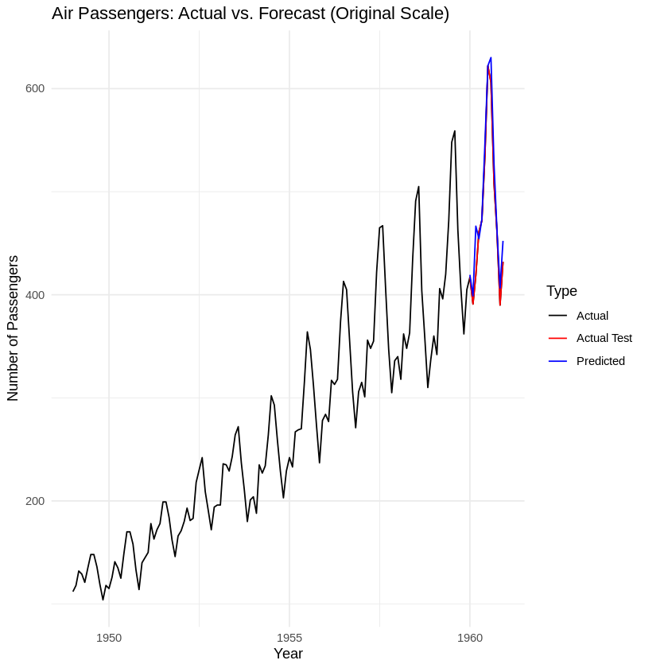

*Şekil 8.3 — 1960 yılı için gerçek değerler (kırmızı) ve eğitim setiyle kurulan SARIMA modelinin tahminleri (mavi), orijinal ölçekte.*

Grafikte mavi tahmin çizgisinin kırmızı gerçek çizgiyi yakından izlediği, yaz tepesini neredeyse tam yakaladığı, Mart ayında ise belirgin biçimde yukarıda kaldığı görülür. Bu görsel izlenim, tablodaki sayılarla tutarlıdır.

---

### 8.4. Python ile Değerlendirme Fonksiyonu ve Sonuçların Yorumlanması

> 💻 **Uygulama dosyası:** [`Codes/python/ch08_model_degerlendirme.py`](Codes/python/ch08_model_degerlendirme.py) · [Notebook](Codes/notebooks/ch08_model_degerlendirme.ipynb) · [](https://colab.research.google.com/github/erkanozhan/AI_Based_Time_Series-Data_Analytics/blob/main/Codes/notebooks/ch08_model_degerlendirme.ipynb)
>
> Bu bölümdeki kodların tamamı bu dosyada. Bilgisayarınızda çalıştırmak için depo kök dizininde `python Codes/python/ch08_model_degerlendirme.py` komutunu kullanın ya da dosyayı VS Code'da açıp hücre hücre çalıştırın. Kurulum yapmadan denemek için Colab bağlantısını kullanabilirsiniz.


Farklı modellerin performansını karşılaştırırken her seferinde aynı metrik kodunu yeniden yazmak yerine standart bir fonksiyon kullanmak hem zaman kazandırır hem de hataları önler.

#### 8.4.1. `evaluate_model()` Fonksiyonu

```python
import numpy as np
import pandas as pd
from sklearn.metrics import mean_absolute_error, mean_squared_error

def evaluate_model(y_true, y_pred, model_name):
    """
    Model performansını değerlendirir ve sonuçları yazdırır.

    Parametreler:
        y_true: Gerçek değerler (array veya Series)
        y_pred: Tahmin edilen değerler (array veya Series)
        model_name: Modelin adı (string)

    Döndürür:
        dict: MAE, RMSE ve MAPE değerlerini içeren sözlük
    """
    # Array'e dönüştür (Series indeksleri farklı olsa bile sıraya göre karşılaştırılır)
    y_true = np.array(y_true).flatten()
    y_pred = np.array(y_pred).flatten()

    # Metrikleri hesapla
    mae = mean_absolute_error(y_true, y_pred)
    rmse = np.sqrt(mean_squared_error(y_true, y_pred))

    # MAPE hesaplarken sıfıra bölmeyi önle (gerçek değeri 0 olan noktalar hesaba katılmaz)
    mask = y_true != 0
    mape = np.mean(np.abs((y_true[mask] - y_pred[mask]) / y_true[mask])) * 100

    # Sonuçları yazdır
    print(f"\n{'=' * 40}")
    print(f"{model_name} Performans Sonuçları")
    print(f"{'=' * 40}")
    print(f"MAE:  {mae:>10.2f}")
    print(f"RMSE: {rmse:>10.2f}")
    print(f"MAPE: {mape:>9.2f}%")

    return {'mae': mae, 'rmse': rmse, 'mape': mape}
```

**Açıklama:**

- `np.array(...).flatten()` girdileri tek boyutlu diziye çevirir. Böylece fonksiyon Pandas Series, NumPy dizisi ya da LSTM çıktısı gibi `(n, 1)` biçimli dizilerle aynı şekilde çalışır.
- MAE ve RMSE için `scikit-learn`'ün hazır fonksiyonları kullanılır. Bunlar 8.2'deki formüllerin birebir karşılığıdır.
- MAPE için `mask` ile gerçek değeri 0 olan noktalar dışarıda bırakılır. Bu, sıfıra bölme hatasını önler, ancak 8.2.3'teki "sıfıra **yakın** değerler" sorununu çözmez. Böyle serilerde MAPE yerine MASE ya da MAE'ye güvenin.
- Fonksiyon sonuçları bir sözlük (`dict`) olarak döndürür; bu sayede birden çok modelin sonucu kolayca tabloya dönüştürülebilir.

#### 8.4.2. Örnek Kullanım

Şimdilik elimizde Bölüm 7.7'de kurduğumuz Python SARIMA modeli var. Onu, 8.1.2'deki mevsimsel naive referansla karşılaştıralım. Aşağıdaki kod, Bölüm 7.7'deki `train_data`, `test_data` ve `predictions_arima` değişkenlerinin tanımlı olduğunu varsayar.

```python
# 1) Bölüm 7.7'deki SARIMA (auto_arima) tahminleri
arima_metrics = evaluate_model(test_data, predictions_arima, "SARIMA (auto_arima)")

# 2) Referans model: mevsimsel naive
#    Eğitim setinin son 12 ayı, 60 aylık test dönemi boyunca tekrar edilir.
son_yil = train_data[-12:].values
snaive_pred = np.tile(son_yil, len(test_data) // 12 + 1)[:len(test_data)]
snaive_metrics = evaluate_model(test_data, snaive_pred, "Mevsimsel Naive")

# 3) Sonraki bölümlerde aynı fonksiyonu diğer modeller için de kullanacağız.
#    (Bu satırlar, ilgili bölümlerdeki değişkenler tanımlandıktan sonra çalışır.)
# prophet_metrics = evaluate_model(test['y'], tahmin, "Prophet")            # Bölüm 9
# xgb_metrics     = evaluate_model(y_test, y_test_pred, "XGBoost")          # Bölüm 13
# lstm_metrics    = evaluate_model(testY_inv[0], test_predict[:, 0], "LSTM") # Bölüm 15

# 4) Sonuçları tek bir tabloda toplayalım
sonuclar = pd.DataFrame({"SARIMA": arima_metrics,
                         "Mevsimsel Naive": snaive_metrics}).T
print(sonuclar.round(2))
```

Bizim denememizde tablo aşağıdaki gibi çıktı (kütüphane sürümüne göre SARIMA değerleri biraz değişebilir):

```text
                    mae    rmse   mape
SARIMA            35.55   47.87   7.95
Mevsimsel Naive  112.43  126.01  27.05
```

**Çıktının yorumu:** SARIMA, 60 aylık uzun ufukta bile mevsimsel naive yöntemin hatasını üçte birin altına indirmiştir. Mevsimsel naive yöntem her yıl 1955'in desenini kopyaladığı için büyümeyi hiç yakalayamaz ve hatası yıldan yıla artar. Yine de SARIMA'nın buradaki MAPE'si (yaklaşık %8), R uygulamasındaki %2.9'dan çok yüksektir. Bunun iki nedeni vardır: Test ufku 12 yerine 60 aydır ve Python modelinde log dönüşümü yapılmamıştır (bkz. Bölüm 7.7.5'teki alıştırma).

**Not —** Bölüm 9, 13 ve 15'teki modelleri bu tabloya eklerken **aynı test dönemini** kullandığınızdan emin olun. Farklı dönemler ya da farklı uzunlukta test setleri üzerinde hesaplanmış metrikler karşılaştırılamaz.

#### 8.4.3. Sonuçların Yorumlanması

Metrikleri karşılaştırırken şu sorulara yanıt arayın:

**1. Model naive referansı yeniyor mu?**

- Evet, açık farkla → Model veriden gerçekten bir şey öğrenmiş.
- Hayır ya da çok az farkla → Karmaşık modele gerek yok; basit yöntemi kullanın ya da modeli gözden geçirin.

**2. MAE ile RMSE birbirine yakın mı?**

- Yakın → Hatalar benzer büyüklükte, model tutarlı.
- RMSE belirgin biçimde büyük → Bazı noktalarda büyük sapmalar var; hataların hangi dönemlerde yoğunlaştığına bakın (ör. yaz tepeleri, özel günler).

**3. MAPE makul düzeyde mi?** Kabaca bir fikir vermesi için şu eşikler sıkça kullanılır:

- %10'un altı → İyi performans
- %10–20 → Kabul edilebilir
- %20'nin üstü → Model iyileştirilmeli

Bu eşikler evrensel değildir. Günlük hisse senedi getirisinde %20 mükemmel olabilirken, elektrik yükü tahmininde %5 bile yetersiz sayılabilir. Asıl ölçüt, **naive referans ve alandaki mevcut çözümlerle** karşılaştırmadır.

**4. Eğitim ve test metrikleri arasında fark var mı?**

- Eğitim hatası çok düşük, test hatası yüksek → **Aşırı öğrenme** (overfitting): Model eğitim verisini ezberlemiş.
- İkisi de yüksek → **Yetersiz öğrenme** (underfitting): Model veriyi yakalayacak kadar esnek değil.
- İkisi yakın ve düşük → **İyi genelleme**.

**5. Hatalarda sistematik bir yön var mı?** Hataların çoğu aynı işaretteyse (8.3'teki gibi) model sistematik olarak fazla ya da eksik tahmin yapıyordur. Bu, trendin değiştiğine işaret edebilir.

Son olarak, hangi modeli seçeceğiniz probleme bağlıdır. Stok yönetimi gibi ortalama doğruluğun yeterli olduğu durumlarda MAE'si düşük olanı; büyük hataların kabul edilemediği durumlarda RMSE'si düşük olanı tercih edin. Metriklerin yanında modelin yorumlanabilirliği, eğitim süresi ve bakım kolaylığı da seçimde rol oynar.

Bu bölümde öğrendiğimiz araçlarla artık farklı modelleri adil biçimde karşılaştırabiliriz. Bir sonraki bölümde, trend ve mevsimselliği farklı bir yaklaşımla modelleyen **Facebook Prophet**'ı inceleyecek ve sonuçlarını buradaki SARIMA değerleriyle kıyaslayacağız.

---

<a id="bolum-9"></a>

## 9. Facebook Prophet

Bölüm 7'de ARIMA/SARIMA ile seriyi önce durağanlaştırıp sonra kendi geçmişiyle açıkladık; Bölüm 8'de de bir modelin başarısını eğitim-test ayrımı ve hata metrikleriyle ölçmeyi öğrendik. Bu bölümde aynı problemi bambaşka bir açıdan ele alan bir araca bakıyoruz: Facebook (Meta) tarafından geliştirilen **Prophet**.

**Açıklama:** Prophet, bir zaman serisini "zamanın bir fonksiyonu" olarak görür ve bu fonksiyonu anlaşılır parçalara ayırarak kurar: genel gidişat (trend), düzenli tekrarlar (mevsimsellik) ve özel günlerin etkisi (tatiller). ARIMA'daki gibi fark alma, ACF/PACF okuma ya da $(p,d,q)$ derecelerini seçme zorunluluğu yoktur; seri durağan olmasa da doğrudan uygulanabilir. LSTM gibi (Bölüm 15) içyapısı kapalı bir model de değildir: Her bileşeni ayrı ayrı çizip yorumlayabiliriz.

Bu fikir size tanıdık gelmeli. Bölüm 2.2 ve 2.6'da bir seriyi trend, mevsimsellik ve düzensiz bileşene **ayrıştırmıştık**. Prophet, bu ayrıştırma düşüncesini bir **tahmin modeline** dönüştürür: Bileşenleri yalnızca geçmişte ayırmakla kalmaz, her birini matematiksel bir fonksiyonla ifade edip geleceğe uzatır.

---

### 9.1. Model Yapısı

**Tanım:** Prophet, gözlenen seriyi üç bileşen ile bir hata teriminin toplamı olarak modeller:

$$
y(t) = g(t) + s(t) + h(t) + \varepsilon_t
$$

> **Simge notu:** $`g(t)`$: trend fonksiyonu · $`s(t)`$: mevsimsel (periyodik) bileşen · $`h(t)`$: tatil/özel gün etkileri · $`\varepsilon_t`$ *(epsilon t)*: modelin açıklayamadığı rastgele hata

Burada $y(t)$, $t$ anındaki gözlemdir. Bileşenler birbirinden bağımsız olarak modellenir ve sonra toplanır. Model teknik olarak bir **eğri uydurma (curve fitting)** ya da regresyon problemidir: Zaman, modelin tek girdisidir. Bu yüzden ARIMA'dan farklı olarak gözlemlerin eşit aralıklı olması veya eksiksiz olması gerekmez.

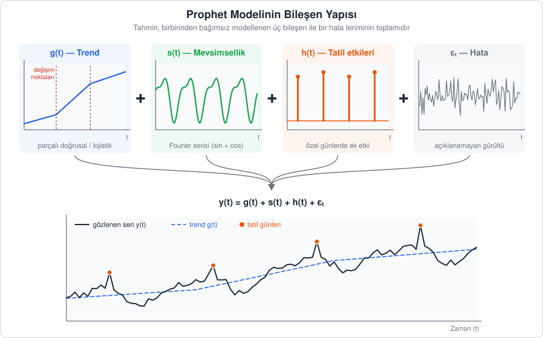

*Şekil 9.1 — Prophet'ın bileşen yapısı: Trend, mevsimsellik ve tatil etkileri ayrı ayrı modellenir, hata terimiyle birlikte toplanarak gözlenen seriyi oluşturur.*

#### 9.1.1. Trend Bileşeni: g(t)

Trend, serinin uzun vadeli yönünü taşır. Prophet'ta iki seçenek vardır.

**Tanım 1 (parçalı doğrusal trend):** Varsayılan seçenektir. Trend, eğimi belirli zaman noktalarında değişebilen bir doğrudur. Eğimin değiştiği bu noktalara **değişim noktaları (changepoints)** denir. $s_1, s_2, \dots, s_S$ değişim noktaları için basitleştirilmiş gösterim şöyledir:

$$
g(t) = \Big(k + \sum_{j: s_j \le t} \delta_j\Big) t + \Big(m + \sum_{j: s_j \le t} \gamma_j\Big)
$$

> **Simge notu:** $`k`$: başlangıç eğimi (büyüme hızı) · $`m`$: başlangıç seviyesi (kesişim) · $`s_j`$: j'inci değişim noktası · $`\delta_j`$ *(delta j)*: j'inci değişim noktasında eğime eklenen miktar · $`\gamma_j`$ *(gama j)*: doğru parçalarının kopmadan birleşmesini sağlayan düzeltme terimi · $`\sum`$ *(sigma, toplam)*: toplama işareti; burada yalnızca $`t`$'den önceki değişim noktaları toplanır

**Yorum:** $t$ anındaki eğim, başlangıç eğimi $k$'ye o ana kadar geçilen tüm değişim noktalarındaki $\delta_j$ ayarlamalarının eklenmesiyle bulunur. İlk değişim noktasından sonra eğim $k + \delta_1$, ikincisinden sonra $k + \delta_1 + \delta_2$ olur (Şekil 9.2). $\gamma_j$ terimleri ise trend çizgisinin değişim noktalarında "kırılıp" kopmamasını, sürekli kalmasını sağlar.

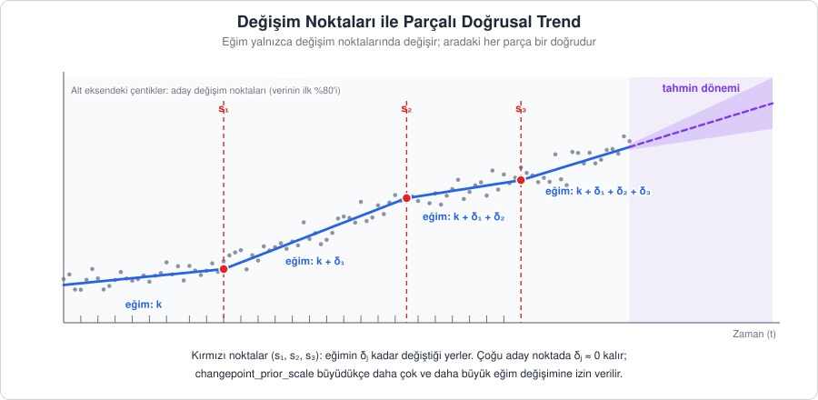

*Şekil 9.2 — Parçalı doğrusal trend: Eğim yalnızca değişim noktalarında ($`s_1, s_2, s_3`$) değişir. Tahmin döneminde trend son eğimle uzatılır ve belirsizlik aralığı giderek genişler.*

Değişim noktalarını elle vermemiz gerekmez. Prophet varsayılan olarak verinin **ilk %80'lik** kısmına eşit aralıklı 25 **aday** değişim noktası yerleştirir (`n_changepoints=25`, `changepoint_range=0.8`). Ardından her $\delta_j$ için sıfıra yakın değerleri ödüllendiren bir ön dağılım (Laplace önseli) kullanır. Sonuçta adayların çoğunda $\delta_j \approx 0$ kalır; yalnızca gerçekten yön değişimi olan yerlerde eğim anlamlı biçimde değişir.

> **Simge notu:** $`\approx`$ *(yaklaşık eşit)*: değerin neredeyse aynı olduğunu gösterir

Bu esnekliği `changepoint_prior_scale` parametresi (varsayılan 0.05) belirler:

- **Büyük değer** (ör. 0.5): Trend daha esnek olur, her kıvrımı izler. Aşırı uyum (overfitting) riski artar.
- **Küçük değer** (ör. 0.01): Trend katılaşır, gerçek yön değişimlerini kaçırabilir.

**Tanım 2 (lojistik büyüme trendi):** Bazı seriler sonsuza kadar büyüyemez; bir doygunluk seviyesine yaklaşır (ör. bir ülkedeki internet kullanıcı sayısı nüfusu aşamaz). Bu durumda trend, taşıma kapasitesi denilen bir üst sınıra yaklaşan S biçimli bir eğridir:

$$
g(t) = \frac{C}{1 + \exp\big(-k (t - m)\big)}
$$

> **Simge notu:** $`C`$: taşıma kapasitesi (serinin ulaşabileceği üst sınır) · $`\exp`$ *(üstel fonksiyon)*: $`e^{x}`$ · burada $`m`$, eğrinin en hızlı yükseldiği orta noktanın zamanıdır

Prophet'ta bu seçenek `Prophet(growth='logistic')` ile kullanılır; veri çerçevesine üst sınırı gösteren bir `cap` sütunu eklemek gerekir. Lojistik trendde de büyüme hızı $k$ değişim noktalarında ayarlanabilir.

#### 9.1.2. Mevsimsellik Bileşeni: s(t)

Mevsimsel etkiler, **Fourier serisi** ile yani farklı frekanslardaki sinüs ve kosinüs dalgalarının toplamıyla modellenir:

$$
s(t) = \sum_{n=1}^{N} \left[ a_n \cos\left(\frac{2\pi n t}{P}\right) + b_n \sin\left(\frac{2\pi n t}{P}\right) \right]
$$

> **Simge notu:** $`P`$: periyot uzunluğu (yıllık mevsimsellik için $`P = 365.25`$ gün, haftalık için $`P = 7`$) · $`N`$: kullanılan dalga (Fourier terimi) sayısı · $`a_n, b_n`$: veriden öğrenilen katsayılar · $`\pi`$ *(pi)*: 3.14159...

**Yorum:** $n = 1$ terimi periyot başına tek bir tepe ve tek bir çukur üreten en kaba dalgadır. $n$ büyüdükçe daha hızlı salınan dalgalar eklenir; bunların toplamı, yaz tepesi ve kış çukuru gibi düzgün olmayan desenleri de yakalayabilir. $N$ (Prophet'taki adı `fourier_order`) büyüdükçe mevsimsel eğri daha esnek olur; varsayılan değer yıllık mevsimsellik için 10, haftalık için 3'tür. Katsayılar $a_n, b_n$ sıradan bir regresyonla tahmin edilir.

Bölüm 2.3'teki ayrımı hatırlayalım: Prophet'ın $s(t)$ bileşeni sabit ve bilinen periyotlu **mevsimselliği** modeller; süresi belirsiz **döngüsel** dalgalanmalar ise çoğunlukla trend bileşenine karışır.

#### 9.1.3. Tatil ve Özel Gün Etkileri: h(t)

Bayramlar, Kara Cuma, okul tatilleri veya kampanya günleri gibi olaylar her yıl aynı takvim gününe denk gelmeyebilir (ör. Ramazan Bayramı her yıl yaklaşık 11 gün öne kayar). Bu yüzden Fourier serisiyle yakalanamazlar. Prophet bu günleri kullanıcıdan bir liste olarak alır ve her olay için ayrı bir etki katsayısı öğrenir:

$$
h(t) = \sum_{i=1}^{L} \kappa_i \cdot \mathbf{1}\big[t \in D_i\big]
$$

> **Simge notu:** $`L`$: tanımlanan tatil/olay sayısı · $`D_i`$: i'inci olayın gerçekleştiği tarihler kümesi · $`\in`$ *(elemanıdır)*: $`t`$ tarihinin bu kümede olduğunu belirtir · $`\mathbf{1}[\cdot]`$ *(gösterge fonksiyonu)*: koşul doğruysa 1, değilse 0 · $`\kappa_i`$ *(kappa i)*: i'inci olayın seriye eklediği etki

Yani $t$ günü bir tatile denk geliyorsa, o tatilin etkisi $\kappa_i$ tahmine eklenir. Tatiller `holidays` parametresiyle bir veri çerçevesi olarak verilir; ülke tatilleri için `m.add_country_holidays(country_name='TR')` kısayolu da vardır. Aylık `AirPassengers` verisinde günlük tatil etkisi anlamlı olmadığından bu bileşeni aşağıdaki uygulamada kullanmıyoruz.

#### 9.1.4. Toplamsal ve Çarpımsal Mevsimsellik

Yukarıdaki model **toplamsaldır**: Mevsimsel etki, trendin seviyesinden bağımsız, sabit bir miktardır. Bölüm 2.4'te gördüğümüz gibi `AirPassengers` serisinde ise mevsimsel dalgaların genliği yolcu sayısıyla birlikte büyür; seri "huni" gibi açılır. Bu yapı **çarpımsaldır**.

Prophet bunu `seasonality_mode='multiplicative'` seçeneğiyle karşılar. Bu durumda model şu biçimi alır:

$$
y(t) = g(t) \cdot \big(1 + s(t) + h(t)\big) + \varepsilon_t
$$

Artık $s(t)$ bir miktar değil, trendin **oransal** bir düzeltmesidir: $s(t) = 0.20$, o ayın trend seviyesinin %20 üzerinde olduğu anlamına gelir. Trend yükseldikçe bu %20'nin mutlak karşılığı da büyür; tıpkı Bölüm 2.4'teki çarpımsal modelde olduğu gibi.

**Not —** Bölüm 7'de SARIMA'yı `log(AirPassengers)` üzerine kurarak aynı sorunu log dönüşümüyle çözmüştük. Prophet'ta iki yol da mümkündür: Ya seriyi `np.log()` ile dönüştürüp toplamsal model kurarsınız (tahminleri sonra `np.exp()` ile geri çevirirsiniz), ya da doğrudan `seasonality_mode='multiplicative'` kullanırsınız.

---

### 9.2. Python ile Uygulama

> 💻 **Uygulama dosyası:** [`Codes/python/ch09_prophet.py`](Codes/python/ch09_prophet.py) · [Notebook](Codes/notebooks/ch09_prophet.ipynb) · [](https://colab.research.google.com/github/erkanozhan/AI_Based_Time_Series-Data_Analytics/blob/main/Codes/notebooks/ch09_prophet.ipynb)
>
> Bu bölümdeki kodların tamamı bu dosyada. Bilgisayarınızda çalıştırmak için depo kök dizininde `python Codes/python/ch09_prophet.py` komutunu kullanın ya da dosyayı VS Code'da açıp hücre hücre çalıştırın. Kurulum yapmadan denemek için Colab bağlantısını kullanabilirsiniz.


Prophet'ı kullanmanın ilk kuralı, veriyi onun beklediği biçime getirmektir: Tarih sütununun adı `ds` (datestamp), tahmin edilecek değer sütununun adı `y` olmalıdır. Kurulum için `pip install prophet` yeterlidir.

İlk olarak varsayılan (toplamsal) modeli tüm veriyle eğitip 12 ay ileriye tahmin yapalım.

```python
import pandas as pd
from prophet import Prophet
import matplotlib.pyplot as plt

# Veri setini yükleyelim. Orijinal CSV dosyasında sütun isimleri 'Month' ve 'Passengers'.
df = pd.read_csv('data/AirPassengers.csv')

# Prophet'ın gerektirdiği şekilde sütun isimlerini 'ds' ve 'y' olarak değiştirelim.
df.columns = ['ds', 'y']

# Prophet, 'ds' sütununun tarih-zaman nesneleri içerdiğinden emin olmak ister.
# Bu yüzden pandas'ın to_datetime fonksiyonu ile bu dönüşümü yapıyoruz.
df['ds'] = pd.to_datetime(df['ds'])

# Şimdi modelimizi oluşturalım.
# AirPassengers verisi aylık olduğu ve yıllık bir döngüye sahip olduğu için
# yearly_seasonality=True parametresini kullanıyoruz.
# Haftalık veya günlük bir döngü beklemediğimiz için diğer mevsimsellikleri kapatabiliriz.
m = Prophet(yearly_seasonality=True, daily_seasonality=False)

# fit() metodu ile modelimizi hazırladığımız veri setine eğitiyoruz.
# Bu aşamada Prophet, veriden trendi ve mevsimsel desenleri öğrenir.
m.fit(df)

# Tahmin yapabilmek için gelecekteki tarihleri içeren bir veri çerçevesine ihtiyacımız var.
# Prophet bu işlemi make_future_dataframe metodu ile bizim için kolaylaştırır.
# periods=12 ile 12 dönem (ay) ileriye, freq='MS' ile de her ayın başına
# denk gelecek şekilde tarihler oluşturmasını söylüyoruz.
future = m.make_future_dataframe(periods=12, freq='MS')

# predict() metodu, oluşturduğumuz bu gelecek tarihleri alır ve her bir tarih için
# bir tahmin üretir.
forecast = m.predict(future)

# Tahmin sonuçları oldukça detaylı bir veri çerçevesi olarak döner.
# Bizi en çok ilgilendiren sütunlar şunlardır:
# 'ds': Tarih
# 'yhat': Modelin yaptığı tahmin
# 'yhat_lower' ve 'yhat_upper': Tahminin belirsizlik aralığı. Model, gerçek değerin
# büyük olasılıkla bu iki sınır arasında olacağını öngörür.
print("--- Tahmin Sonuçları (Son 12 Ay) ---")
print(forecast[['ds', 'yhat', 'yhat_lower', 'yhat_upper']].tail(12))

# Prophet'ın en güzel yanlarından biri, sonuçları görselleştirmek için
# kendi içerisinde hazır fonksiyonlar sunmasıdır.
# plot() fonksiyonu, geçmiş verileri, tahminleri ve belirsizlik aralığını çizer.
fig1 = m.plot(forecast)
plt.title('Prophet ile Yolcu Sayısı Tahmini')
plt.xlabel('Tarih')
plt.ylabel('Yolcu Sayısı')
plt.show()

# plot_components() fonksiyonu ise modelin öğrendiği bileşenleri ayrı ayrı görmemizi sağlar.
# Bu, serinin yapısını anlamak için çok değerlidir.
# Trend grafiği, yolcu sayısındaki genel artışı gösterir.
# Yıllık mevsimsellik grafiği ise hangi aylarda artış, hangilerinde azalış olduğunu net bir şekilde ortaya koyar.
fig2 = m.plot_components(forecast)
plt.show()
```

#### 9.2.1. Çıktının Yorumlanması

`forecast` veri çerçevesi, `future` içindeki **her tarih** için (geçmiş 144 ay + gelecek 12 ay) bir satır içerir. Yani geçmiş dönem için de modelin uydurduğu değerleri verir. `tail(12)` ile yalnızca gelecek 12 ayı (1961) görürüz. Başlıca sütunlar:

| Sütun | Anlamı | Nasıl okunur? |
| --- | --- | --- |
| `ds` | Tahmin edilen tarih | 1961-01-01, 1961-02-01, ... |
| `yhat` | Nokta tahmini, yani $`\hat{y}(t) = g(t) + s(t) + h(t)`$ | "Bu ay için en olası yolcu sayısı" |
| `yhat_lower` | Belirsizlik aralığının alt sınırı | Gerçek değerin büyük olasılıkla bu değerin üstünde kalması beklenir |
| `yhat_upper` | Belirsizlik aralığının üst sınırı | Gerçek değerin büyük olasılıkla bu değerin altında kalması beklenir |
| `trend`, `yearly` | Bileşenlerin tek tek katkısı | `yhat` bu katkıların toplamıdır (toplamsal modelde) |

> **Simge notu:** $`\hat{y}`$ *(y şapka)*: modelin tahmin ettiği değer

Yorumlarken şunlara dikkat edin:

- **Aralığın düzeyi:** Prophet'ın belirsizlik aralığı varsayılan olarak **%80**'dir (`interval_width=0.8`), %95 değil. %95'lik aralık için modeli `Prophet(interval_width=0.95)` ile kurun.
- **Aralığın genişliği:** `yhat_upper - yhat_lower` farkı geleceğe gidildikçe büyür. Bunun temel nedeni trend belirsizliğidir: Prophet, geçmişte gördüğü değişim noktası sıklığına ve büyüklüğüne bakarak gelecekte de benzer eğim değişimleri olabileceğini simüle eder (Şekil 9.2'deki genişleyen bant).
- **Toplamsal modelin zayıflığı:** Varsayılan toplamsal modelde mevsimsel genlik sabittir. `AirPassengers`'ta dalgalar zamanla büyüdüğü için bu model 1961 yazının tepesini olduğundan **düşük**, kış çukurunu olduğundan **yüksek** tahmin etme eğilimindedir. `plot()` grafiğinde, son yıllarda siyah noktaların (gerçek değerler) mavi bandın dışına taşmasıyla bu kendini gösterir.
- **Bileşen grafiği:** `plot_components()` iki panel çizer. *Trend* paneli yolcu sayısının 1949'dan 1961'e neredeyse doğrusal arttığını gösterir. *Yearly* paneli ise yılın aylarına göre mevsimsel etkiyi gösterir: Temmuz-Ağustos'ta en yüksek, Kasım ve Ocak-Şubat civarında en düşük değerler görülür. Bu, Bölüm 2.6'daki ayrıştırmada elde ettiğimiz mevsimsel katsayılarla tutarlıdır.

---

### 9.3. Test Setiyle Değerlendirme

Yukarıdaki tahminin ne kadar iyi olduğunu bilemeyiz, çünkü 1961 için gerçek değerler elimizde yok. Bölüm 8'deki ilkeyi uygulayalım: Son 12 ayı (1960) **test seti** olarak ayıralım, modeli yalnızca 1949–1959 verisiyle eğitelim ve tahminleri gerçek değerlerle karşılaştıralım. Bölüm 8'deki SARIMA uygulamasında da 1960 yılını test seti olarak kullandığımız için sonuçlar doğrudan karşılaştırılabilir.

Aşağıda hem toplamsal hem çarpımsal modeli kuruyor ve Bölüm 8'deki MAE, RMSE ve MAPE metrikleriyle ölçüyoruz.

```python
import numpy as np
import pandas as pd
from prophet import Prophet
from sklearn.metrics import mean_absolute_error, mean_squared_error

df = pd.read_csv('data/AirPassengers.csv')
df.columns = ['ds', 'y']
df['ds'] = pd.to_datetime(df['ds'])

# Zamansal ayrım: son 12 ay (1960) test seti. Veri KARIŞTIRILMAZ.
train = df.iloc[:-12]
test = df.iloc[-12:]

sonuclar = {}
for mod in ['additive', 'multiplicative']:
    model = Prophet(seasonality_mode=mod,
                    yearly_seasonality=True,
                    weekly_seasonality=False,
                    daily_seasonality=False)
    model.fit(train)  # Model test dönemini hiç görmez

    # Eğitim verisinin sonundan itibaren 12 ay ileriye tahmin
    future = model.make_future_dataframe(periods=12, freq='MS')
    forecast = model.predict(future)
    tahmin = forecast['yhat'].iloc[-12:].values

    gercek = test['y'].values
    mae = mean_absolute_error(gercek, tahmin)
    rmse = np.sqrt(mean_squared_error(gercek, tahmin))
    mape = np.mean(np.abs((gercek - tahmin) / gercek)) * 100
    sonuclar[mod] = {'MAE': mae, 'RMSE': rmse, 'MAPE (%)': mape}

# İki modelin metriklerini tablo hâlinde yazdıralım
print(pd.DataFrame(sonuclar).T.round(2))
```

**Çıktının yorumu:** Tabloda her satır bir modeli, her sütun bir metriği gösterir; üç metrikte de **küçük değer daha iyidir**. `AirPassengers` gibi çarpımsal yapıdaki bir seride `multiplicative` modelin üç metrikte de belirgin biçimde daha düşük hata vermesi beklenir, çünkü 1960 yazındaki yüksek tepeyi ancak dalga genliği seviyeyle büyüyen bir model yakalayabilir. Sonuçları yorumlarken Bölüm 8'deki sorular burada da geçerlidir:

- **RMSE, MAE'den çok büyük mü?** Öyleyse hata birkaç ayda (genellikle yaz tepesinde) yoğunlaşıyordur.
- **MAPE kaç?** Yüzdelik hata, farklı ölçekteki serilerle ya da iş hedefleriyle kıyaslamayı kolaylaştırır.
- **SARIMA ile karşılaştırma:** Aynı test yılı için Bölüm 8'de elde ettiğiniz RMSE değeriyle kıyaslayın. Hangi modelin daha iyi olduğu veriye bağlıdır; Prophet'ın her zaman kazanacağını varsaymayın.

Bölüm 8'deki `evaluate_model()` fonksiyonunu tanımladıysanız, metrik satırlarının yerine `evaluate_model(test['y'], tahmin, f"Prophet ({mod})")` çağrısını da kullanabilirsiniz.

**Not —** Tek bir test yılı, şansa bağlı iyi ya da kötü bir sonuç verebilir. Daha güvenilir bir değerlendirme için test penceresini zaman içinde kaydırarak birden çok kez ölçmek gerekir. Prophet bunun için `prophet.diagnostics` modülünde `cross_validation()` ve `performance_metrics()` fonksiyonlarını sunar. Bu yaklaşımın genel mantığı Bölüm 16'da (TimeSeriesSplit) ele alınmaktadır.

---

### 9.4. Güçlü ve Zayıf Yönler

| Güçlü yönler | Zayıf yönler |
| --- | --- |
| Durağanlık varsayımı yok; fark alma ve derece seçimi gerekmez | Serinin kendi geçmiş değerlerini (gecikmeleri) doğrudan kullanmaz; kısa vadeli otokorelasyonu ARIMA kadar iyi yakalayamaz |
| Bileşenler (trend, mevsimsellik, tatil) ayrı ayrı çizilip yorumlanabilir | Trendi son eğimle doğrusal uzattığı için uzun vadeli tahminlerde yanılabilir |
| Birden çok mevsimsellik (yıllık, haftalık, günlük) ve tatil etkileri kolayca eklenir | Kısa serilerde (birkaç yıllık veri) mevsimselliği güvenilir öğrenemez |
| Eksik gözlemlere, düzensiz aralıklara ve aykırı değerlere karşı dayanıklıdır | Varsayılan ayarlar her seri için uygun değildir; `changepoint_prior_scale`, `seasonality_mode` gibi parametreler dikkatle seçilmelidir |
| Belirsizlik aralığını otomatik üretir; alan bilgisi (üst sınır, özel günler) modele kolayca aktarılır | Belirgin mevsimsellik ya da trend içermeyen, gürültülü serilerde basit yöntemlerden daha iyi olmayabilir |

**Ne zaman tercih edilmeli?** Prophet özellikle günlük ya da haftalık iş verilerinde (satış, web trafiği, talep) parlar: Bu serilerde birden çok mevsimsellik, tatil etkileri ve zaman zaman yön değiştiren bir trend bir arada bulunur. Kısa vadeli dinamiklerin baskın olduğu ya da değişkenler arası etkileşimin önemli olduğu durumlarda ARIMA/SARIMA (Bölüm 7), VAR (Bölüm 10) veya makine öğrenmesi yaklaşımları (Bölüm 12–15) daha uygun olabilir. Hangi model seçilirse seçilsin, Bölüm 8'deki gibi basit bir referans modelle (naive) karşılaştırmak unutulmamalıdır.

---

<a id="bolum-10"></a>

## 10. VAR: Çok Değişkenli Zaman Serisi Modeli

Bölüm 7'de gördüğümüz ARIMA gibi tek değişkenli modeller her seriyi **tek başına** ele alır: bir serinin geleceğini yalnızca kendi geçmişinden tahmin ederiz. Oysa Bölüm 3.1'de tanıttığımız **çok değişkenli** serilerde değişkenlerin birbirini etkilemesi çoğu zaman asıl ilgilendiğimiz konudur:

*   Enflasyon ↔ faiz oranı
*   Döviz kuru ↔ faiz ↔ sanayi üretimi
*   Elektrik talebi ↔ sıcaklık ↔ fiyat

Bu durumda ihtiyaç duyduğumuz şey, yalnızca "kendi geçmişine bakarak kendini tahmin eden" bir model değil, **tüm serilerin geçmişine birlikte bakarak** hepsini aynı anda tahmin eden bir yapıdır. **VAR (Vector Autoregression, vektör otoregresyon)** tam olarak bunu yapar. Adından da anlaşılacağı gibi VAR, Bölüm 7'deki AR modelinin çok değişkenli (vektör) genellemesidir.

Bu bölümde önce modelin tanımını ve varsayımlarını, ardından VAR'a özgü yorum araçlarını (Granger nedenselliği, etki-tepki fonksiyonu, varyans ayrıştırması) ele alacak, son olarak Python ile uçtan uca bir uygulama yapacağız. Aynı modelin Gretl'de menüler ve betik ile nasıl kurulacağı Bölüm 11'de anlatılmaktadır.

---

### 10.1. AR'dan VAR'a: Temel Fikir

**Açıklama:** Bölüm 7'deki AR(p) modelinde bir serinin bugünkü değeri, kendi $p$ gecikmesinin doğrusal bir fonksiyonudur:

$$
y_t = c + \phi_1 y_{t-1} + \phi_2 y_{t-2} + \dots + \phi_p y_{t-p} + \varepsilon_t
$$

> **Simge notu:** $`\phi_i`$ *(fi)*: AR katsayısı · $`\varepsilon_t`$ *(epsilon)*: beyaz gürültü hata terimi · $`\dots`$ *(üç nokta)*: aradaki terimler

VAR'da ise her değişken için ayrı bir denklem yazılır ve her denklemde **hem kendi gecikmeleri hem de diğer değişkenlerin gecikmeleri** yer alır. İki değişkenli (enflasyon ve faiz) en basit örnek olan VAR(1) modelini düşünelim:

*   $y_{1,t}$: Enflasyon
*   $y_{2,t}$: Faiz oranı

```math
\begin{aligned}
y_{1,t} &= c_1 + a_{11} y_{1,t-1} + a_{12} y_{2,t-1} + u_{1,t} \\
y_{2,t} &= c_2 + a_{21} y_{1,t-1} + a_{22} y_{2,t-1} + u_{2,t}
\end{aligned}
```

Her denklemde:

*   **Kendi gecikmesi** yer alır (ör. $y_{1,t-1}$ → $y_{1,t}$, katsayı $a_{11}$). Yalnız bu terim olsaydı, elimizde sıradan bir AR(1) modeli olurdu.
*   **Diğer değişkenin gecikmesi** yer alır (ör. $y_{2,t-1}$ → $y_{1,t}$, katsayı $a_{12}$). VAR'ı AR'dan ayıran kısım bu **çapraz etkilerdir**: $a_{12} \neq 0$ ise geçmiş faiz bugünkü enflasyonu etkiliyor demektir.

> **Simge notu:** $`a_{ij}`$: $`i`$. denklemde $`j`$. değişkenin gecikmesinin katsayısı · $`u_{i,t}`$: $`i`$. denklemin hata terimi (şok) · $`\neq`$ *(eşit değil)*

#### 10.1.1. Matris Biçimi

Denklemleri tek tek yazmak değişken sayısı arttıkça zahmetli hâle gelir. Bu yüzden vektör ve matris gösterimi kullanılır:

```math
\mathbf{y}_t =
\begin{bmatrix}
y_{1,t} \\
y_{2,t}
\end{bmatrix},
\quad
\mathbf{c} =
\begin{bmatrix}
c_1 \\
c_2
\end{bmatrix},
\quad
A_1 =
\begin{bmatrix}
a_{11} & a_{12} \\
a_{21} & a_{22}
\end{bmatrix},
\quad
\mathbf{u}_t =
\begin{bmatrix}
u_{1,t} \\
u_{2,t}
\end{bmatrix}
```

Bu gösterimle iki denklem tek satıra iner:

$$
\mathbf{y}_t = \mathbf{c} + A_1 \mathbf{y}_{t-1} + \mathbf{u}_t
$$

**Tanım (VAR(p) modeli):** $k$ değişkenli bir VAR(p) modeli şöyle yazılır:

```math
\underbrace{\begin{bmatrix} y_{1,t} \\ \vdots \\ y_{k,t} \end{bmatrix}}_{\mathbf{y}_t}
= \mathbf{c} + A_1 \mathbf{y}_{t-1} + A_2 \mathbf{y}_{t-2} + \dots + A_p \mathbf{y}_{t-p} + \mathbf{u}_t,
\qquad
\mathrm{E}[\mathbf{u}_t] = \mathbf{0},
\quad
\mathrm{Cov}(\mathbf{u}_t) = \Sigma_u
```

Burada:

*   $\mathbf{y}_t$: Tüm değişkenleri aynı anda içeren $k \times 1$ boyutlu vektör
*   $\mathbf{c}$: Sabit terimler vektörü
*   $A_i$: $i$. gecikmeye ait $k \times k$ katsayı matrisi
*   $\mathbf{u}_t$: Hata (şok) vektörü; zaman içinde ilişkisizdir ama aynı dönemdeki şoklar birbiriyle ilişkili olabilir. Bu eşanlı ilişkiyi $\Sigma_u$ kovaryans matrisi taşır.

> **Simge notu:** $`\mathbf{y}_t`$ *(kalın y)*: değişkenler vektörü · $`A_i`$: katsayı matrisi · $`\mathrm{E}[\cdot]`$ *(beklenen değer)*: ortalama · $`\mathrm{Cov}(\cdot)`$ *(kovaryans)*: kovaryans matrisi · $`\Sigma_u`$ *(büyük sigma u)*: hata terimlerinin kovaryans matrisi · $`\times`$ *(çarpı)*: matris boyutu (satır × sütun) · $`\vdots`$ *(dikey üç nokta)*: aradaki satırlar

**Not —** $k = 1$ alındığında $\mathbf{y}_t$ tek bir sayıya, $A_i$ matrisleri de tek birer katsayıya ($\phi_i$) iner ve VAR(p), Bölüm 7'deki AR(p) modelinin ta kendisi olur.

**Parametre sayısı:** Her denklemde $1 + kp$ katsayı (sabit + $k$ değişkenin $p$ gecikmesi) vardır; toplamda $k(1 + kp)$ parametre tahmin edilir. Örneğin 3 değişkenli bir VAR(4) modelinde her denklemde 13, toplamda 39 parametre vardır. Parametre sayısı $p$ ile hızla büyüdüğü için gecikme seçimi (Bölüm 10.4) VAR'da özellikle önemlidir.

**Tahmin:** Her denklemin sağ tarafında aynı açıklayıcı değişkenler (tüm değişkenlerin aynı gecikmeleri) bulunduğundan, VAR denklem denklem sıradan en küçük kareler (OLS) ile tahmin edilebilir; bu, sistemi birlikte tahmin etmekle aynı sonucu verir.

---

### 10.2. VAR'ı Görselleştirmek: Değişkenler Arası Etkileşim

Modelin denklemleri, değişkenler arasındaki bir etkileşim ağını tarif eder. İki değişkenli bir VAR(1) modelinde, bir önceki dönemdeki ($t-1$) her değişken, bugünkü ($t$) her değişkeni etkileyebilir:

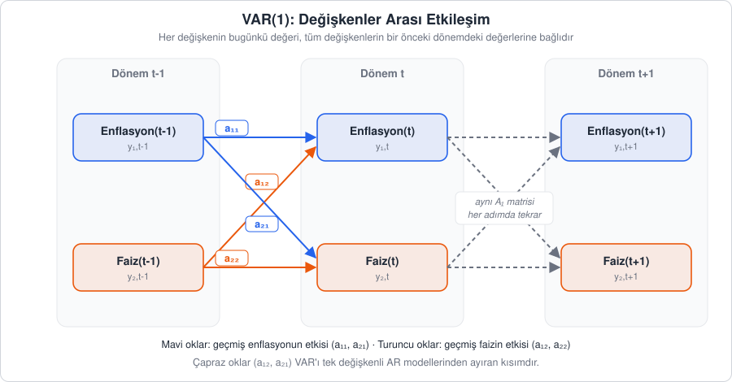

*Şekil 10.1 — İki değişkenli VAR(1): $`t-1`$ dönemindeki enflasyon ve faiz, $`t`$ dönemindeki her iki değişkeni de $`A_1`$ matrisinin katsayıları aracılığıyla etkiler; aynı yapı her dönem tekrarlanır.*

Şekli şöyle okuyabiliriz:

*   `Enflasyon(t-1)` hem `Enflasyon(t)` hem de `Faiz(t)` üzerinde etkili olabilir. Bu etkilerin gücünü $a_{11}$ ve $a_{21}$ katsayıları belirler.
*   Benzer şekilde `Faiz(t-1)`, her iki güncel değişkeni $a_{12}$ ve $a_{22}$ katsayıları aracılığıyla etkiler.
*   Bu etkileşim her zaman adımında aynı $A_1$ matrisiyle tekrarlanır: bir dönemin çıktıları bir sonraki dönemin girdileri olur. Bir şokun sistemde nasıl yayıldığını (Bölüm 10.7) bu zincir belirler.

Kısacası "geçmiş enflasyon" ve "geçmiş faiz" bilgileri, hem bugünkü enflasyonu hem de bugünkü faizi tahmin etmek için birlikte kullanılır.

---

### 10.3. VAR Kurmadan Önce: Veri Hazırlığı

VAR modeli tahmin etmeden önce birkaç kritik noktayı gözden geçirmek gerekir. Bu adımları atlamak, sonradan "nerede hata yaptım?" sorusuyla uğraşmak demektir.

#### 10.3.1. Aynı Frekansta Veri

Tüm serilerin aynı zaman aralığında ölçülmüş olması gerekir: bir seri aylık, diğeri üç aylık, bir diğeri yıllık olamaz. Bir değişken her ay değişirken diğeri yılda bir kez güncelleniyorsa, ikisini aynı modele koymak farklı hızlarda koşan iki kişiyi aynı yarışta değerlendirmeye benzer.

Frekans uyumsuzluğu varsa ya yüksek frekanslı veri toplulaştırılır (ör. aylık veri üç aylık ortalamalara dönüştürülür) ya da düşük frekanslı veri interpolasyonla daha sık gözleme çevrilir. İnterpolasyon yapay bilgi eklediği için dikkatli kullanılmalıdır.

#### 10.3.2. Ortak Örnek Aralığı (Sample)

Bir seri 1990'dan, diğeri 1995'ten başlıyor; biri 2020'de, diğeri 2023'te bitiyor olabilir. VAR tahmini için tüm değişkenlerin aynı dönemde gözlenmiş olması gerekir. Bu nedenle **ortak kesişim aralığı**, yani tüm serilerin birlikte mevcut olduğu en geniş zaman penceresi kullanılır. Bu pencerenin dışındaki gözlemler analize alınmaz; veri kaybı olsa da tutarlılık sağlanır.

#### 10.3.3. Durağanlık Kontrolü

VAR'ın yakaladığı dinamik ilişkilerin anlamlı olabilmesi için serilerin **durağan** olması beklenir. Bölüm 3.2'den hatırlarsak: ortalaması, varyansı ve otokovaryans yapısı zamanla değişmeyen seri durağandır. Sürekli yükselen bir GSYİH serisi, ortalaması sürekli arttığı için durağan değildir. Durağan olmayan serilerle çalışmak, aslında ilişkisiz iki serinin yalnızca ikisi de yükseldiği için ilişkili görünmesine (**sahte regresyon**, *spurious regression*) yol açabilir.

Durağanlık ADF ve KPSS testleriyle sınanır (ayrıntısı Bölüm 3.2 ve Bölüm 7'de):

*   **ADF:** Sıfır hipotezi $H_0$: "seri durağan değildir (birim kök vardır)". p-değeri 0,05'ten küçükse $H_0$ reddedilir ve seri durağan kabul edilir.
*   **KPSS:** Mantık terstir; $H_0$: "seri durağandır".

> **Simge notu:** $`H_0`$ *(H sıfır)*: sıfır (boş) hipotez

Durağan olmayan serilerde en yaygın çözüm **fark almaktır**:

$$
\Delta y_t = y_t - y_{t-1}
$$

> **Simge notu:** $`\Delta`$ *(delta)*: birinci fark operatörü

Birinci fark alındığında çoğu ekonomik seri durağan hâle gelir; ikinci fark nadiren gerekir.

**Not —** Seriler aynı mertebeden bütünleşikse (ör. hepsi I(1)) ve aralarında uzun dönemli bir denge ilişkisi (**eşbütünleşme**, *cointegration*) varsa, farkları alınmış bir VAR bu uzun dönem bilgisini kaybeder. Bu durumda VAR yerine **VECM** (Vector Error Correction Model) kullanmak daha uygundur. Bu bölümde VAR çerçevesinde kalıyoruz.

---

### 10.4. Gecikme Uzunluğu Seçimi (AIC, BIC, HQ)

VAR(p) modelinde $p$, kaç dönem geriye bakılacağını, yani modelin "hafızasını" belirler:

- **$`p`$ çok küçükse:** Dinamik yapı yeterince yakalanmaz; değişkenler arasındaki gecikmeli etkileşimler gözden kaçar ve artıklarda otokorelasyon kalır.
- **$`p`$ çok büyükse:** Her ek gecikme $`k^2`$ yeni parametre demektir (4 değişkenli bir VAR'da 16). Aşırı parametreleşme tahmin varyansını yükseltir ve öngörü gücünü zayıflatır.

Bu dengeyi kurmak için **bilgi kriterleri** kullanılır. Hepsi aynı felsefeye, **Occam'ın usturasına** dayanır: benzer uyum sağlayan modeller arasında en basiti tercih edilir. Bir terzi benzetmesiyle: çok az ölçü alınarak dikilen ceket üzerinize oturmaz (yetersiz uyum); vücudunuzun o anki her milimetresine göre dikilen ceket ise hareket ettiğiniz anda işe yaramaz (aşırı uyum, *overfitting*). Bilgi kriterleri en makul ceketi bulmaya yardım eder.

**Tanım:** $T$ gözlem sayısı, $\hat{\Sigma}_u(p)$ VAR(p) modelinin tahmin edilen hata kovaryans matrisi olmak üzere:

```math
\begin{aligned}
\mathrm{AIC}(p) &= \ln \lvert \hat{\Sigma}_u(p) \rvert + \frac{2}{T} \, p k^2 \\
\mathrm{BIC}(p) &= \ln \lvert \hat{\Sigma}_u(p) \rvert + \frac{\ln T}{T} \, p k^2 \\
\mathrm{HQ}(p)  &= \ln \lvert \hat{\Sigma}_u(p) \rvert + \frac{2 \ln(\ln T)}{T} \, p k^2
\end{aligned}
```

> **Simge notu:** $`\hat{\Sigma}_u`$ *(sigma u şapka)*: tahmin edilen hata kovaryans matrisi · $`\lvert \cdot \rvert`$ *(determinant)*: matrisin determinantı; burada toplam hata büyüklüğünün ölçüsü · $`\ln`$ *(doğal logaritma)*

**Açıklama:** Her kriterin ilk terimi **uyumu** ölçer: model veriyi ne kadar iyi açıklarsa hata kovaryansı o kadar küçük, dolayısıyla terim o kadar küçük olur. İkinci terim **karmaşıklığın cezasıdır** ve parametre sayısı $pk^2$ ile büyür. Kriterler yalnızca ceza katsayısında ayrılır. $p = 1, 2, \dots, p_{max}$ için hesaplanır ve **en küçük değeri veren $`p`$ seçilir**.

*   **AIC (Akaike):** Ceza katsayısı ($2/T$) görece hafiftir. Gerçek dinamiği kaçırmamak için biraz daha büyük modellere izin verir; öngörü odaklı çalışmalarda sık tercih edilir.
*   **BIC (Bayesci, Schwarz):** Ceza katsayısı ($\ln T / T$), $T \geq 8$ için AIC'ninkinden büyüktür ve gözlem sayısıyla artar. Bu yüzden daha az gecikmeli, **tutumlu** (*parsimonious*) modelleri seçer; temel yapıyı anlamaya çalışırken güvenilir bir rehberdir.
*   **HQ (Hannan-Quinn):** Cezası AIC ile BIC arasındadır; ikisi arasında bir uzlaşma sunar.

> **Simge notu:** $`\geq`$ *(büyük eşit)*

| Kriter | Ceza katsayısı | Eğilim | Ne zaman tercih edilir? |
| --- | --- | --- | --- |
| **AIC** (Akaike) | $`2/T`$ | Daha büyük $`p`$ | Öngörü performansı öncelikliyse |
| **BIC** (Bayesci) | $`\ln T / T`$ | Daha küçük $`p`$ | Altta yatan yapıyı, en anlamlı ilişkileri bulmak istiyorsak |
| **HQ** (Hannan-Quinn) | $`2 \ln(\ln T) / T`$ | Arada | İki kriter arasında denge aranıyorsa |

Pratikte kriterler farklı gecikme önerebilir. Böyle durumlarda BIC'in önerdiği daha düşük gecikme genellikle güvenli bir başlangıçtır; ancak seçilen modelin artıklarında otokorelasyon kalıp kalmadığı da (Bölüm 10.9'daki artık analizi) mutlaka kontrol edilmelidir. Artıklar otokorelasyonluysa gecikme artırılır.

---

### 10.5. Stabilite Koşulu: Öz Değerler Birim Çemberin İçinde

Model tahmin edildikten sonra yapılması gereken önemli bir kontrol, **modelin stabil olup olmadığıdır**.

**Açıklama:** Stabil bir VAR'da sisteme verilen bir şokun etkisi zamanla söner; sistem eski dengesine döner. Stabil olmayan bir VAR'da ise küçük bir şok bile büyüyerek patlar. En basit durumda, tek değişkenli AR(1) modeli $y_t = \phi y_{t-1} + \varepsilon_t$ için bu koşul $\lvert \phi \rvert < 1$ idi. VAR'da tek bir katsayı yerine bir matris olduğundan koşul, matrisin **öz değerleri** üzerinden yazılır.

**Tanım 1 (VAR(1) için stabilite):** $\mathbf{y}_t = \mathbf{c} + A_1 \mathbf{y}_{t-1} + \mathbf{u}_t$ modeli, $A_1$ matrisinin tüm öz değerleri birim çemberin içindeyse stabildir:

$$
\lvert \lambda_i \rvert < 1 \quad (i = 1, \dots, k), \qquad \det(A_1 - \lambda I) = 0
$$

> **Simge notu:** $`\lambda_i`$ *(lambda)*: öz değer (karmaşık sayı olabilir) · $`\det`$ *(determinant)* · $`I`$: birim matris · $`\lvert \lambda \rvert`$ *(mutlak değer / modül)*: karmaşık düzlemde orijine uzaklık

Sezgisi şudur: şoksuz bir sistemde $\mathbf{y}_t$ yaklaşık olarak $A_1^h \mathbf{y}_{t-h}$ ile belirlenir. $A_1$'in öz değerlerinin hepsi 1'den küçükse $A_1^h$, $h$ büyüdükçe sıfır matrise yaklaşır ve geçmişin etkisi söner.

**Tanım 2 (VAR(p) için stabilite):** VAR(p), $kp \times kp$ boyutlu **eşlik (companion) matrisi** ile VAR(1) biçimine getirilir:

```math
\mathbf{F} =
\begin{bmatrix}
A_1 & A_2 & \cdots & A_{p-1} & A_p \\
I   & 0   & \cdots & 0       & 0   \\
0   & I   & \cdots & 0       & 0   \\
\vdots & & \ddots & & \vdots \\
0   & 0   & \cdots & I       & 0
\end{bmatrix}
```

Model, $\mathbf{F}$ matrisinin tüm öz değerlerinin modülü 1'den küçükse stabildir. Eşdeğer olarak, karakteristik polinom $\det(I - A_1 z - \dots - A_p z^p) = 0$ denkleminin tüm kökleri birim çemberin **dışında** ($\lvert z \rvert > 1$) olmalıdır. Kökler öz değerlerin tersi olduğundan bu iki ifade aynı koşuldur.

> **Simge notu:** $`\mathbf{F}`$ *(kalın F)*: eşlik matrisi · $`\cdots`$, $`\ddots`$ *(yatay / çapraz üç nokta)*: tekrarlanan bloklar · $`z`$: karakteristik polinomun değişkeni

**Örnek:** Aşağıdaki katsayı matrisini ele alalım:

```math
A_1 = \begin{bmatrix} 0.5 & 0.2 \\ 0.1 & 0.4 \end{bmatrix},
\qquad
\mathrm{iz}(A_1) = 0.5 + 0.4 = 0.9,
\qquad
\det(A_1) = 0.5 \cdot 0.4 - 0.2 \cdot 0.1 = 0.18
```

 Öz değerler $\lambda^2 - 0.9\lambda + 0.18 = 0$ denkleminin kökleridir: $\lambda_1 = 0.6$ ve $\lambda_2 = 0.3$. İkisi de 1'den küçük olduğundan model stabildir.

**Not —** Yazılımlar bu koşulu farklı biçimde raporlayabilir. Gretl ve pek çok ders kitabı öz değerlerin (ters köklerin) birim çemberin **içinde** olmasını ister; statsmodels'taki `results.roots` ise karakteristik polinomun köklerini verir ve bunların birim çemberin **dışında** olması gerekir. `results.is_stable()` her iki durumda da doğrudan `True`/`False` döndürür.

Stabil olmayan bir VAR modelinde:

- Etki-tepki fonksiyonları patlayıcı davranış gösterir (Şekil 10.2'nin sağ paneli),
- Varyans ayrıştırması anlamsız sonuçlar verir,
- Öngörüler güvenilir olmaktan çıkar.

Kararsızlığın en yaygın nedenleri durağan olmayan (farkı alınmamış) seriler, gereğinden fazla gecikme ve aykırı gözlemlerdir.

---

### 10.6. Granger Nedenselliği

**Açıklama:** VAR'da sık sorulan sorulardan biri şudur: "Faizin geçmiş değerleri, enflasyonun kendi geçmişinin ötesinde ek bir bilgi taşıyor mu?" Taşıyorsa, faizin enflasyonu **Granger-nedenselliği** vardır denir. Buradaki "nedensellik" günlük dildeki neden-sonuç ilişkisi değil, **öngörü üstünlüğüdür**: $x$'in geçmişi $y$'nin tahminini iyileştiriyorsa "$x$, $y$'nin Granger nedenidir".

**Tanım:** İki değişkenli VAR(p) modelinde enflasyon ($y_1$) denklemi

$$
y_{1,t} = c_1 + \sum_{i=1}^{p} a_{11}^{(i)} y_{1,t-i} + \sum_{i=1}^{p} a_{12}^{(i)} y_{2,t-i} + u_{1,t}
$$

olsun. "$y_2$, $y_1$'in Granger nedeni değildir" hipotezi, $y_2$'nin tüm gecikme katsayılarının sıfır olmasıdır:

$$
H_0: a_{12}^{(1)} = a_{12}^{(2)} = \dots = a_{12}^{(p)} = 0
$$

> **Simge notu:** $`\sum`$ *(sigma, toplam)*: terimlerin toplamı · $`a_{12}^{(i)}`$: $`A_i`$ matrisinin (1,2) elemanı, yani faizin $`i`$. gecikmesinin enflasyon denklemindeki katsayısı

Bu $p$ kısıt birlikte bir **F-testi** (ya da Wald testi) ile sınanır. p-değeri 0,05'ten küçükse $H_0$ reddedilir: faizin geçmişi enflasyonu öngörmeye yardımcıdır.

Yorumlarken dikkat edilecekler:

*   Granger nedenselliği **yönlüdür**; iki yön ayrı ayrı test edilir. Çift yönlü nedensellik (enflasyon faizi, faiz de enflasyonu öngörüyor) mümkündür ve tam da VAR'ın varlık sebebidir.
*   Her iki seri de üçüncü, modelde yer almayan bir değişkenden etkileniyorsa, aralarında gerçek bir neden-sonuç ilişkisi olmadan Granger nedenselliği çıkabilir.
*   Test, durağan seriler ve doğru seçilmiş gecikme sayısı varsayımına dayanır.

---

### 10.7. Etki-Tepki Fonksiyonu (Impulse Response Function, IRF)

**Açıklama:** VAR katsayıları tek tek yorumlanması zor sayılardır: 3 değişkenli bir VAR(2)'de 18 çapraz katsayı vardır ve bir değişkenin etkisi birden çok gecikme ve dolaylı kanal üzerinden yayılır. Etki-tepki fonksiyonu bu karmaşayı tek bir soruya indirger:

> "Bugün faiz oranına bir birimlik (ya da bir standart sapmalık) şok gelse, sonraki dönemlerde enflasyon ve diğer değişkenler nasıl tepki verir?"

Bu, durgun suya atılan taşın yarattığı dalgaları izlemeye benzer: şok (taş) sistemdeki diğer değişkenleri (dalgalar) nasıl etkiler ve bu etki zamanla nasıl söner?

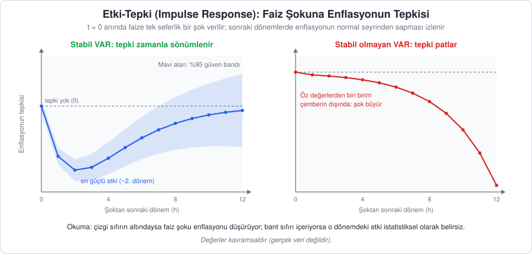

*Şekil 10.2 — Faize verilen tek seferlik şoka enflasyonun tepkisi (kavramsal). Solda stabil bir VAR: tepki birkaç dönem sonra en güçlü hâline ulaşır ve sonra sıfıra döner. Sağda stabil olmayan bir VAR: tepki giderek büyür.*

**Tanım:** Stabil bir VAR, geçmiş şokların ağırlıklı toplamı (hareketli ortalama, MA(∞) gösterimi) olarak yazılabilir:

$$
\mathbf{y}_t = \boldsymbol{\mu} + \sum_{i=0}^{\infty} \Phi_i \mathbf{u}_{t-i}, \qquad \Phi_0 = I, \quad \Phi_i = \sum_{j=1}^{\min(i,p)} \Phi_{i-j} A_j
$$

$\Phi_h$ matrisinin $(j, m)$ elemanı, $m$. değişkene $t$ anında gelen bir birimlik şokun $h$ dönem sonra $j$. değişkende yarattığı değişimdir. Bu değerlerin $h = 0, 1, 2, \dots$ için çizilmesi etki-tepki fonksiyonudur. VAR(1) için formül çok sadedir: $\Phi_h = A_1^h$. Stabilite koşulu (Bölüm 10.5) tam olarak bu matris kuvvetlerinin sıfıra gitmesini, yani tepkilerin sönmesini garanti eder.

> **Simge notu:** $`\boldsymbol{\mu}`$ *(kalın mü)*: sürecin ortalama vektörü · $`\infty`$ *(sonsuz)* · $`\Phi_i`$ *(büyük fi)*: $`i`$. dönem tepki (MA katsayı) matrisi · $`\min`$: iki değerden küçüğü

**Ortogonal (Cholesky) şoklar:** $\Sigma_u$ köşegen değilse, yani aynı dönemdeki şoklar birbiriyle ilişkiliyse, "yalnızca faize şok verip diğerlerini sabit tutmak" gerçekçi değildir. Bu yüzden genellikle $\Sigma_u = P P^\top$ **Cholesky ayrıştırması** ile ilişkisiz (ortogonal) şoklar elde edilir ve tepkiler $\Theta_i = \Phi_i P$ ile hesaplanır. Bu yöntemde **değişkenlerin sırası sonucu etkiler**: listede önce gelen değişkenin şoku, sonrakileri aynı dönemde etkileyebilir ama tersi olmaz. Sıralama ekonomik mantığa göre (ör. yavaş tepki verenler önce) seçilmeli ve raporlanmalıdır.

> **Simge notu:** $`P`$: Cholesky ayrıştırmasından gelen alt üçgen matris · $`P^\top`$ *(P devrik)*: $`P`$'nin transpozu · $`\Theta_i`$ *(büyük teta)*: ortogonal şoklara göre tepki matrisi

**IRF grafikleri nasıl okunur?**

*   Yatay eksen: şoktan sonra geçen dönem sayısı ($h$).
*   Dikey eksen: tepkinin büyüklüğü (değişkenin kendi biriminde).
*   Çizgi sıfırın üstündeyse pozitif, altındaysa negatif tepki vardır.
*   Güven bandı sıfırı içeriyorsa o dönemdeki tepki istatistiksel olarak sıfırdan ayırt edilemez.
*   Stabil bir modelde tüm tepkiler zamanla sıfıra yaklaşmalıdır.

---

### 10.8. Tahmin Hatası Varyans Ayrıştırması (FEVD)

**Açıklama:** IRF "şok gelince ne olur?" sorusunu yanıtlarken, FEVD (*Forecast Error Variance Decomposition*) şu soruyu yanıtlar: "Bir değişkenin $h$ dönem sonrası için yaptığımız tahmindeki belirsizliğin (hata varyansının) ne kadarı **kendi şoklarından**, ne kadarı **diğer değişkenlerin şoklarından** kaynaklanıyor?"

**Tanım:** Ortogonal tepki matrislerinin elemanları $\theta_{jm,i}$ olmak üzere, $j$. değişkenin $h$ adımlı tahmin hatası varyansında $m$. değişkenin şokunun payı:

$$
\omega_{jm}(h) = \frac{\sum_{i=0}^{h-1} \theta_{jm,i}^2}{\sum_{i=0}^{h-1} \sum_{l=1}^{k} \theta_{jl,i}^2}
$$

> **Simge notu:** $`\theta_{jm,i}`$ *(teta)*: $`\Theta_i`$ matrisinin $`(j,m)`$ elemanı · $`\omega_{jm}(h)`$ *(omega)*: $`h`$ ufkunda $`m`$. şokun $`j`$. değişkenin hata varyansındaki payı

Her değişken ve her ufuk için paylar 0 ile 1 arasındadır ve toplamları 1'dir (%100). Örneğin enflasyonun 12 ay sonrası tahmin hatasının %60'ı kendi şoklarından, %25'i döviz kuru şoklarından, %15'i faiz şoklarından kaynaklanıyor olabilir. Böyle bir sonuç, enflasyonu kontrol etmek isteyen bir politika yapıcı için döviz kuru istikrarının önemini gösterir.

Tipik örüntü şudur: kısa ufuklarda değişken ağırlıklı olarak kendi şoklarıyla açıklanır; ufuk uzadıkça diğer değişkenlerin payı artar ve sonunda paylar sabitlenir (uzun dönem etkisi). FEVD Cholesky şoklarını kullandığından, IRF'deki gibi değişken sıralamasına duyarlıdır.

---

### 10.9. Python ile VAR Uygulaması (statsmodels)

Bu uygulamada şimdiye kadar anlatılan adımların tamamını (veri hazırlığı, durağanlık, gecikme seçimi, stabilite, artık analizi, tahmin, IRF, FEVD, Granger) tek bir programda bir araya getiriyoruz. Örnek veri setinde (`data/macro.csv`, kendi verinizle değiştirebilirsiniz) aylık üç seri bulunduğunu varsayıyoruz:

*   `inflation`: Enflasyon oranı
*   `interest`: Faiz oranı
*   `exchange`: Döviz kuru

Tam program yaklaşık 400 satır olduğu için ayrı bir dosyaya taşındı. Aşağıda yalnızca modeli kuran ve sonuçları üreten kilit satırlar yer alıyor; kod bölümlerinin numaraları (1–10), Bölüm 10.9.1'deki yorum tablosundaki numaralarla aynıdır.

```python
# VAR uygulamasının kilit satırları (tam kod: Codes/python/ch10_var.py)
from statsmodels.tsa.api import VAR
from statsmodels.tsa.stattools import adfuller

# 1) Veri: veri_yolu() önce yerel data/ klasörüne, yoksa GitHub'a bakar
df = pd.read_csv(veri_yolu("macro.csv"), parse_dates=["date"], index_col="date")
vars_selected = ["inflation", "interest", "exchange"]
df_var = df[vars_selected].dropna()

for col in vars_selected:                          # 3) ADF: p < 0.05 ise durağan
    print(col, adfuller(df_var[col], autolag="AIC")[1])

model = VAR(df_var)                                # 4) Gecikme seçimi ve tahmin
lag_order_results = model.select_order(maxlags=8)
print(lag_order_results.summary())
selected_lag = max(1, lag_order_results.selected_orders['bic'])  # bu veride BIC → 2
results = model.fit(selected_lag)
print(results.summary())

print(results.is_stable())                         # 5) Stabilite
print(np.abs(results.roots))                       #    tüm |kök| > 1 olmalı

forecast_values = results.forecast(y=df_var.values[-selected_lag:], steps=4)  # 7) Tahmin

irf = results.irf(12)                              # 8) IRF (12 dönem)
irf.plot(orth=False)
irf.plot(impulse="interest", response="inflation")

fevd = results.fevd(12)                            # 9) FEVD
fevd.summary()

gc = results.test_causality(caused="inflation", causing=["interest"], kind="f")  # 10) Granger
print(gc.summary())
```

Dosyadaki program sırasıyla şunları yapar:

1.  **Veri hazırlığı:** `data/macro.csv` okunur, üç değişken seçilir, eksik satırlar atılır (Bölüm 10.3).
2.  **Görselleştirme:** Üç seri alt alta çizilir; trend ve yapısal kırılmalar gözle incelenir.
3.  **Durağanlık:** Her seriye ADF testi uygulanır; `adf_test()` fonksiyonu test istatistiğini, p-değerini ve kritik değerleri yorumuyla yazdırır (Bölüm 10.3.3).
4.  **Gecikme seçimi ve tahmin:** `select_order(maxlags=8)` ile AIC, BIC, FPE, HQIC tablosu alınır; BIC'nin önerdiği gecikmeyle `fit()` çağrılır ve denklem denklem OLS sonuçları yazdırılır (Bölüm 10.4).
5.  **Stabilite:** `is_stable()` ve karakteristik köklerin modülleri (ve karşılık gelen öz değerler) yazdırılır (Bölüm 10.5).
6.  **Artık analizi:** Her denklem için Durbin-Watson istatistiği hesaplanır ve artıklar çizilir.
7.  **Tahmin:** Son `p` gözlemden başlayarak 4 aylık tahmin üretilir, son 24 ayla birlikte çizilir.
8.  **IRF:** 12 dönemlik etki-tepki fonksiyonları; tüm çiftler ile "faiz → enflasyon" ve "döviz kuru → enflasyon" grafikleri (Bölüm 10.7).
9.  **FEVD:** 12 dönemlik varyans ayrıştırması tablosu ve grafiği (Bölüm 10.8).
10.  **Granger:** Dört yönde (faiz → enflasyon, döviz kuru → enflasyon, enflasyon → faiz, döviz kuru → faiz) F-testi (Bölüm 10.6).

**Neden BIC?** Bu veride kriterler farklı gecikmeler önerir: AIC 7, HQIC 3, BIC 2. Üç değişkenli bir VAR(7), her denklemde 22 parametre demektir (sabit + 3 × 7). Üstelik bu model stabil çıkmaz; bir öz değerin modülü 1'i aşar. Tutucu BIC'nin önerdiği VAR(2) hem daha sade hem de stabildir. Bu yüzden kod BIC'yi kullanır. AIC öngörü odaklı çalışmalarda sık tercih edilse de (Bölüm 10.4), önerdiği model stabil değilse IRF, FEVD ve tahminler güvenilir olmaz.

**Örnek sonuçlar** (`data/macro.csv`, VAR(2)):

| Çıktı | Sonuç | Yorum |
| --- | --- | --- |
| ADF (3 seri) | p = 0.81, 0.13, 0.999 | Üç seri de durağan değil. |
| Stabilite | `True`; en büyük öz değer modülü 0.997 | Model stabil, ama sınırda: şoklar çok yavaş söner. |
| Durbin-Watson | 2.05, 2.24, 1.83 | Artıklarda belirgin birinci derece otokorelasyon yok. |
| Granger | faiz → enflasyon p = 0.84; döviz kuru → enflasyon p < 0.001; enflasyon → faiz p = 0.02; döviz kuru → faiz p < 0.001 | Döviz kurunun geçmişi hem enflasyonu hem faizi öngörmeye yardım ediyor; faizin enflasyona katkısı anlamlı değil. |
| FEVD (12. dönem) | Enflasyonun tahmin hatası varyansının %44'ü kendi şoklarından, %55'i döviz kuru şoklarından | Uzun ufukta enflasyon belirsizliğinin çoğu döviz kurundan geliyor. |

**Not —** En büyük öz değerin 1'e bu kadar yakın çıkması (0.997) tesadüf değildir: seriler durağan olmadığı için model neredeyse bir birim kök taşır. Bu durumda IRF'ler çok yavaş söner ve uzun ufuklu yorumlar dikkatle yapılmalıdır. Kod eğitim amaçlı olarak düzey serilerle devam eder. Alıştırma olarak:

1. Kodun 4. adımında `'bic'` yerine `'aic'` yazıp VAR(7)'nin stabil çıkmadığını görün.
2. Serilerin birinci farkını alıp (`df_var.diff().dropna()`) modeli yeniden kurun. Farkı alınmış serilerde BIC 1 gecikme önerir ve en büyük öz değer modülü 0.997'den yaklaşık 0.55'e iner; model artık sınırda değil, rahatça stabildir.

> 💻 **Uygulama dosyası:** [`Codes/python/ch10_var.py`](Codes/python/ch10_var.py) · [Notebook](Codes/notebooks/ch10_var.ipynb) · [](https://colab.research.google.com/github/erkanozhan/AI_Based_Time_Series-Data_Analytics/blob/main/Codes/notebooks/ch10_var.ipynb)
>
> Bu bölümdeki kodların tamamı bu dosyada. Bilgisayarınızda çalıştırmak için depo kök dizininde `python Codes/python/ch10_var.py` komutunu kullanın ya da dosyayı VS Code'da açıp hücre hücre çalıştırın. Kurulum yapmadan denemek için Colab bağlantısını kullanabilirsiniz.

#### 10.9.1. Çıktıların Yorumlanması

Kodun ürettiği her çıktı bölümünde neye bakılacağı şöyle özetlenebilir:

| Kod bölümü | Çıktı | Neye bakılır? |
| --- | --- | --- |
| 3) ADF | Test istatistiği, p-değeri | p < 0,05 ise seri durağan. Değilse `diff()` ile fark alınıp test tekrarlanır (Bölüm 10.3.3). |
| 4) Gecikme seçimi | AIC, BIC, FPE, HQIC tablosu | Her sütunda en küçük değer yıldızla (`*`) işaretlenir. Kriterler farklı $`p`$ önerebilir (Bölüm 10.4). |
| 4) `results.summary()` | Her denklem için katsayılar, p-değerleri; en altta artıkların korelasyon matrisi | Tek tek katsayılardan çok, çapraz katsayıların anlamlılığına ve artık korelasyonlarına bakılır. Artıklar arası yüksek korelasyon, IRF'de sıralamanın önemli olacağını gösterir. |
| 5) Stabilite | `True`/`False`, kök modülleri | `True` ve tüm kök modülleri $`\lvert z \rvert > 1`$ (öz değer modülleri < 1) olmalı. Değilse fark alma, gecikme sayısı ve aykırı değerler gözden geçirilir. |
| 6) Durbin-Watson | Her denklem için DW | 2'ye yakın değer artıklarda birinci derece otokorelasyon olmadığını gösterir; 1,5–2,5 dışı değerler gecikme artırmayı düşündürür. |
| 7) Tahmin | 4 dönemlik tahmin tablosu ve grafiği | Tahminler son gözlemlerden makul biçimde devam etmeli; ufuk uzadıkça belirsizlik artar. Doğruluk ölçümü için Bölüm 8'deki eğitim-test ayrımı ve MAE/RMSE/MAPE kullanılabilir. |
| 8) IRF | Şok-tepki grafikleri | Tepkinin işareti, en güçlü olduğu dönem, güven bandının sıfırı içerip içermediği ve sönümlenme (Bölüm 10.7). |
| 9) FEVD | Dönemlere göre pay tablosu | Her satırın toplamı 1'dir; ufuk uzadıkça diğer değişkenlerin payının nasıl değiştiğine bakılır (Bölüm 10.8). |
| 10) Granger | F istatistiği, p-değeri, "reject/fail to reject" | p < 0,05 (*reject*) ise "etkileyen" değişkenin geçmişi, "etkilenen" değişkeni öngörmeye yardımcıdır (Bölüm 10.6). |

**Not —** Koddaki IRF grafikleri `orth=False` ile bir birimlik (ortogonal olmayan) şoklara göre çizilir. Cholesky şoklarına göre tepki için `irf.plot(orth=True)` kullanılabilir; bu durumda sonuç `df_var` sütunlarının sırasına bağlıdır (Bölüm 10.7). `fevd()` her zaman Cholesky şoklarını kullanır.

---

### 10.10. VAR'ın Kullanım Alanları ve Sınırlılıkları

VAR özellikle şu tip sorular için kullanışlıdır:

*   Para politikası şoklarının (faiz değişimleri) enflasyon, çıktı ve döviz kuru üzerindeki etkisi
*   Enerji fiyatı şoklarının üretim, tüketim ve fiyatlar üzerindeki etkisi
*   Finansal piyasalarda endeksler arası etkileşimler
*   Birbiriyle ilişkili çok sayıda göstergenin birlikte öngörülmesi

Sınırlılıkları da akılda tutulmalıdır:

*   **Parametre sayısı hızla artar** ($k^2 p$); değişken sayısı arttıkça kısa veriyle güvenilir tahmin zorlaşır. Bu yüzden VAR genellikle 2–6 değişkenle kurulur.
*   **Doğrusaldır;** doğrusal olmayan ilişkileri yakalamak için Bölüm 12'den itibaren ele alınacak makine öğrenmesi ve derin öğrenme yöntemleri daha uygundur.
*   **Durağanlık ve stabilite varsayımlarına** dayanır; yapısal kırılmalar (kriz dönemleri) sonuçları bozabilir.
*   **Sonuçlar öngörü ilişkileridir;** Granger nedenselliği ve Cholesky sıralamasına dayalı IRF, gerçek nedensellik için ek teorik varsayımlar gerektirir.

Önemli olan, tek bir denklemle sınırlı kalmak yerine değişkenlerin birbirini nasıl **gecikmeli olarak** etkilediğini birlikte görebilmektir. VAR bu etkileşimi hem tahmin hem de yorum açısından anlaşılır bir iskelet üzerinde sunar. Aynı analizi kod yazmadan, menülerle yapmak isteyenler için Gretl'de VAR kurulumu Bölüm 11'de anlatılmaktadır.

---

<a id="bolum-11"></a>

## 11. Gretl: Ekonometrik Analiz için Görsel Ortam

Python ve R'da komut yazarak çalışmak oldukça esnektir, ancak ilk adımda yorucu olabilir. **Gretl** (*GNU Regression, Econometrics and Time-series Library*), özellikle ekonometrik modeller ve zaman serileri için tasarlanmış, **ücretsiz**, açık kaynak ve **grafik arayüzlü** bir programdır:

*   Menüler üzerinden birkaç tıklamayla regresyon, ARIMA, VAR gibi modeller kurulabilir.
*   Aynı işlemler Gretl'in kendi komut diliyle (*hansl*) betik (script) olarak da yazılıp tekrarlanabilir.
*   Zaman serisi yapısını tanımlamayı, otokorelasyonları görmeyi ve durağanlık testlerini yapmayı kolaylaştırır.

Gretl'i, kod yazmadan "ekonometrik çekirdek modelleri" denemek için pratik bir masaüstü laboratuvarı olarak düşünebilirsiniz. Bu bölümde önceki bölümlerde teorisini gördüğümüz yöntemleri Gretl'de uygulayacağız: ARIMA (Bölüm 7), ADF/KPSS testleri (Bölüm 3.2 ve 7), hata metrikleri (Bölüm 8) ve VAR (Bölüm 10).

---

### 11.1. Arayüz ve Temel Kavramlar

Gretl'i açtığınızda karşınıza şu bölümler çıkar:

*   **Menü çubuğu:** **File, Tools, Data, View, Add, Sample, Variable, Model, Help**. Zaman serisi çalışmalarında en çok **Data** (veri yapısı), **Add** (log, fark gibi yeni değişkenler), **Variable** (seçili değişken için testler) ve **Model** menüleri kullanılır.
*   **Ana pencere:** Veri kümesinin adı, frekansı ve örnek aralığı üstte; değişken listesi altta görünür.
*   **Değişken listesi:** Veri yüklendikten sonra değişkenlerin adları, numaraları ve açıklamaları burada listelenir. Bir değişkene çift tıklamak değerlerini, sağ tıklamak kısayol menüsünü (grafik, korelogram, testler) açar.
*   **Konsol ve betik penceresi:** **Tools → Gretl console** ile komutları tek tek çalıştırabilir, **File → Script files → New script** ile betik yazabilirsiniz.

Gretl veri kümelerini üç yapıya ayırır:

1.  **Kesitsel veri** (*cross-section*)
2.  **Zaman serisi** (*time series*)
3.  **Panel veri** (zaman serisi + kesit)

Bir veri kümesini zaman serisi olarak kullanmak için frekansını (aylık, çeyreklik, yıllık vb.) ve başlangıç tarihini bir kez tanımlamak yeterlidir; Gretl bu yapıyı sonraki tüm grafik ve modellerde otomatik kullanır. Tipik bir çalışmanın adımları Şekil 11.1'de özetlenmiştir.

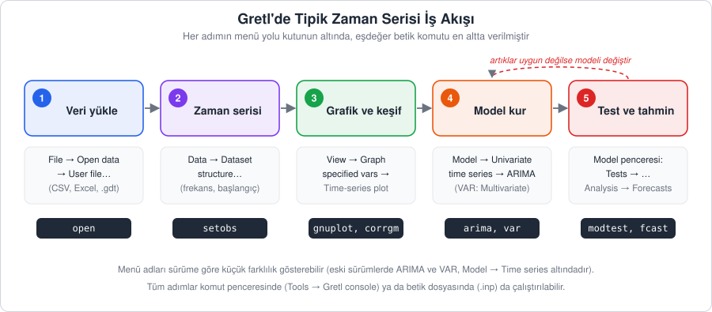

*Şekil 11.1 — Gretl'de tipik iş akışı: veri yükle → zaman serisi olarak tanımla → grafik ve keşif → model kur → test ve tahmin. Her adımın menü yolu ve eşdeğer betik komutu gösterilmiştir.*

**Not —** Menü adları sürümden sürüme küçük farklılıklar gösterebilir. Bu bölümde güncel sürümlerdeki adlar kullanılmıştır; eski sürümlerde ARIMA ve VAR, **Model → Time series** altında yer alır.

---

### 11.2. Veri Hazırlığı

#### 11.2.1. Veri Yükleme

AirPassengers gibi bir CSV dosyasını Gretl'e aktarmak için:

1.  **File → Open data → User file…** seçilir.
2.  Dosya türü olarak CSV (ya da "all files") seçilip `AirPassengers.csv` işaretlenir.
3.  Sütun ayırıcı (virgül, noktalı virgül) genellikle otomatik algılanır; gerekirse elle seçilir.
4.  Sütun adlarının doğru okunduğu kontrol edilir (ör. `Month`, `Passengers`).

Gretl ayrıca Excel, Stata, SPSS ve kendi biçimi olan `.gdt` dosyalarını da aynı menüden açabilir. İlk sütunda `1949-01` gibi tarihler varsa Gretl veriyi çoğu zaman doğrudan aylık zaman serisi olarak tanır; tanımazsa veri sıradan bir tablo olarak açılır ve bir adım daha gerekir.

#### 11.2.2. Zaman Serisi Olarak Tanımlama

1.  **Data → Dataset structure…** seçilir.
2.  Açılan sihirbazda sırasıyla:
    *   **Time series** seçilir,
    *   **Frequency** olarak *monthly* seçilir,
    *   **Starting observation** olarak `1949:01` girilir.
3.  Onaylandığında Gretl her satırı bir aya karşılık gelen bir gözlem olarak kabul eder; ana pencerenin üstünde "Monthly data, 1949:01–1960:12" gibi bir bilgi görünür.

Bu aşamadan sonra grafiklerde tarih ekseni doğru görünür, mevsimsel fark gibi işlemler ve ARIMA modelleri ek bir ayar gerektirmeden çalışır.

---

### 11.3. Keşifsel Analiz ve Modelleme

#### 11.3.1. Grafikler, Özet İstatistikler ve Dönüşümler

*   **View → Graph specified vars → Time series plot…** ile seçilen değişkenlerin zaman grafiği çizilir (ya da değişkene sağ tıklayıp **Time series plot**).
*   **View → Summary statistics** ile ortalama, standart sapma, minimum, maksimum gibi özet istatistikler görülür.
*   **Add** menüsünden yeni değişkenler türetilir: **Add → Logs of selected variables** (log dönüşümü), **Add → First differences of selected variables** (birinci fark), **Add → Seasonal differences of selected variables** (mevsimsel fark). Gretl bunları `l_Passengers`, `d_Passengers`, `sd_Passengers` gibi adlarla listeye ekler.

`Passengers` değişkeninin grafiğinde AirPassengers'ın bilinen yapısı görülür: artan trend, her yıl tekrarlayan mevsimsellik ve zamanla büyüyen dalgalanmalar (Bölüm 2.6).

#### 11.3.2. Basit Doğrusal Regresyon ve Artıkların İncelenmesi

Gretl'in güçlü yanlarından biri, regresyonun birkaç tıklamayla kurulabilmesidir:

1.  **Model → Ordinary Least Squares…** seçilir.
2.  **Dependent variable** (bağımlı değişken) olarak ör. `Passengers` seçilir.
3.  **Regressors** (açıklayıcı değişkenler) olarak zaman trendi, mevsimsel kuklalar ya da gecikmeler eklenir. Bunlar önceden **Add → Time trend**, **Add → Periodic dummies** ve **Add → Lags of selected variables** ile oluşturulabilir.
4.  **OK** dendiğinde katsayı tahminleri, t-istatistikleri, R-kare ve bilgi kriterleri ayrı bir model penceresinde gösterilir.

Model penceresinde **Graphs → Residual plot → Against time** ile artıkların zaman grafiği, **Tests → Autocorrelation** ile artıklarda otokorelasyon olup olmadığı incelenir. Zaman serisi regresyonlarında artıklar genellikle güçlü otokorelasyon gösterir; bu, ARIMA gibi dinamik modellere geçme gereğine işaret eder.

#### 11.3.3. ARIMA Modelleri

ARIMA ve SARIMA'nın teorisi Bölüm 7'de anlatılmıştır; burada yalnızca Gretl'deki kurulumu ele alıyoruz:

1.  **Model → Univariate time series → ARIMA…** seçilir.
2.  **Dependent variable** olarak ör. `l_Passengers` (log alınmış seri) seçilir.
3.  Model dereceleri girilir:
    *   **AR order** ($p$), **Difference** ($d$), **MA order** ($q$),
    *   Mevsimsel kısım için **Seasonal AR** ($P$), **Seasonal difference** ($D$), **Seasonal MA** ($Q$); periyot ($s = 12$) veri frekansından otomatik alınır.
4.  **OK** dendiğinde parametre tahminleri, standart hatalar, log-olabilirlik ve bilgi kriterleri (AIC, BIC, HQ) listelenir.
5.  Model penceresinden **Graphs → Residual correlogram** ile artıkların ACF/PACF grafikleri, **Analysis → Forecasts…** ile tahminler ve güven aralıkları elde edilir.

---

### 11.4. Model Doğrulama: Otokorelasyon ve Durağanlık Testleri

Serinin durağan olup olmadığı ve artıkların otokorelasyon içerip içermediği, zaman serisi modellemesinin temel kontrolleridir (Bölüm 3.2 ve 7). Gretl'de:

| Amaç | Menü yolu | Komut |
| --- | --- | --- |
| Değişkenin ACF/PACF grafiği | Değişkeni seç → **Variable → Correlogram** | `corrgm x 36` |
| ADF birim kök testi | **Variable → Unit root tests → Augmented Dickey-Fuller test** | `adf 12 x --c --ct` |
| KPSS durağanlık testi | **Variable → Unit root tests → KPSS test** | `kpss 12 x` |
| Artıklarda otokorelasyon (Ljung-Box) | Model penceresi → **Tests → Autocorrelation** | `modtest --autocorr` |
| Artıkların normalliği | Model penceresi → **Tests → Normality of residual** | `modtest --normality` |

ADF testinde $H_0$ "birim kök vardır (seri durağan değildir)", KPSS testinde ise $H_0$ "seri durağandır" şeklindedir; iki testi birlikte kullanmak daha güvenilir bir karar verir. Ljung-Box testinde $H_0$ "artıklarda otokorelasyon yoktur" hipotezidir ve iyi bir modelde reddedilmemesi (p > 0,05) istenir.

> **Simge notu:** $`H_0`$ *(H sıfır)*: sıfır (boş) hipotez

Bu testler, ARIMA kurarken ya da daha sonra LSTM/GRU gibi modellere (Bölüm 15) geçmeden önce serinin yapısını anlamak için de yararlıdır.

---

### 11.5. Komut Dili ile Otomasyon: ARIMA Betiği

Menülerle yapılan her işlem Gretl'in komut dilinde de yazılabilir. Betik kullanmanın avantajı, analizin **tekrarlanabilir** olmasıdır: veri güncellendiğinde aynı adımlar tek tuşla yeniden çalıştırılır. Aşağıdaki betik, AirPassengers üzerinde Bölüm 7'deki Box-Jenkins adımlarını (dönüşüm → durağanlık → korelogram → model seçimi → artık kontrolü → tahmin) ve Bölüm 8'deki eğitim-test değerlendirmesini uygular.

Betiği çalıştırmak için **File → Script files → New script** ile açılan pencereye yapıştırıp **Run** (dişli simgesi) düğmesine basabilir ya da `.inp` dosyası olarak kaydedip komut satırından `gretlcli -b betik.inp` ile çalıştırabilirsiniz.

Tam betik yaklaşık 130 satır olduğu için ayrı bir dosyaya taşındı. Aşağıda her adımın kilit komutları yer alıyor; adım numaraları (1–8), dosyadaki bölüm başlıklarıyla ve aşağıdaki "Betiğin çıktıları nasıl okunur?" listesiyle aynıdır.

```gretl
# ARIMA betiğinin kilit satırları (tam betik: Codes/gretl/ch11_arima_airpassengers.inp)
open "data/AirPassengers.csv"                    # 1) veri (depo kök dizininden)
setobs 12 1949:01 --time-series
rename Passengers passengers

series lnpass = log(passengers)                  # 2) log dönüşümü
series ddlnpass = diff(sdiff(lnpass))            # 3) birinci + mevsimsel fark
adf 12 lnpass --c --ct
adf 12 ddlnpass --c
kpss 12 ddlnpass

corrgm ddlnpass 36                               # 4) korelogram

arima 0 1 1 ; 0 1 1 ; lnpass --quiet             # 5) aday modeller (burada airline model)
scalar aic_airline = $aic

arima 0 1 1 ; 0 1 1 ; lnpass                     # 6) seçilen model ve artık testleri
series uhat = $uhat
modtest --autocorr

smpl 1949:01 1959:12                             # 7) eğitim: 1949-1959, test: 1960
arima 0 1 1 ; 0 1 1 ; lnpass --quiet
smpl full
fcast 1960:01 1960:12 lnpass_test --dynamic

arima 0 1 1 ; 0 1 1 ; lnpass --quiet             # 8) tüm veriyle 1961 tahmini
dataset addobs 12
fcast 1961:01 1961:12 lnpass_f --dynamic
```

Betik sırasıyla şunları yapar:

1.  **Veri:** `data/AirPassengers.csv` açılır, aylık zaman serisi yapısı (`setobs 12 1949:01`) tanımlanır, değişken `passengers` olarak yeniden adlandırılır.
2.  **Grafik ve log dönüşümü:** Seri çizilir, özet istatistikler alınır; büyüyen dalgalanmalar nedeniyle `lnpass = log(passengers)` oluşturulur.
3.  **Durağanlık:** `lnpass` ve birinci + mevsimsel farkı alınmış `ddlnpass` için ADF, ayrıca KPSS testi uygulanır.
4.  **Korelogram:** 36 gecikmelik ACF/PACF ile mevsimsel örüntü (12, 24, 36) incelenir.
5.  **Aday modeller:** Beş ARIMA/SARIMA modeli `--quiet` ile tahmin edilir, AIC değerleri `$aic` ile saklanıp `printf` ile tablo hâlinde yazdırılır.
6.  **Seçilen model:** Airline model ARIMA(0,1,1)(0,1,1)_12 ayrıntılı çıktıyla tahmin edilir; artıklar çizilir, korelogramı, Ljung-Box ve normallik testleri yapılır.
7.  **Eğitim-test:** Model 1949–1959 ile tahmin edilir, 1960 için dinamik tahmin üretilir, `exp()` ile orijinal ölçeğe dönülür ve RMSE, MAE, MAPE hesaplanır (Bölüm 8).
8.  **Gelecek tahmini:** Model tüm veriyle yeniden tahmin edilir, veri seti 12 ay uzatılır ve 1961 tahmini gerçek seriyle birlikte çizilir.

> 💻 **Uygulama dosyası:** [`Codes/gretl/ch11_arima_airpassengers.inp`](Codes/gretl/ch11_arima_airpassengers.inp)
>
> Betiğin tamamı bu dosyada. Gretl'de **File → Script files → Open user file…** ile açıp **Run** (dişli simgesi) düğmesiyle çalıştırabilir ya da depo kök dizininde `gretlcli -b Codes/gretl/ch11_arima_airpassengers.inp` komutunu kullanabilirsiniz. Betik veriyi `data/AirPassengers.csv` yolundan açar (depo kök dizininden çalıştırıldığı varsayılır); Gretl dosyayı bulamazsa `open` satırına dosyanın tam yolunu yazın.

**Betiğin çıktıları nasıl okunur?**

*   **Adım 3:** `lnpass` için ADF p-değeri yüksek (durağan değil), `ddlnpass` için düşük olmalıdır; KPSS'de ise tersi beklenir. Bu, Bölüm 7'deki $d = 1$, $D = 1$ seçimini destekler.
*   **Adım 5:** `printf` çıktısında en küçük AIC değerine sahip model seçilir. Aday modeller aynı fark derecesine sahip olduğundan AIC değerleri karşılaştırılabilir; ARIMA(1,1,1) mevsimsel fark içermediği için belirgin biçimde kötü çıkar.
*   **Adım 6:** `modtest --autocorr` p-değerinin 0,05'ten büyük olması ve artık korelogramında anlamlı çubuk kalmaması, modelin serideki yapıyı yakaladığını gösterir.
*   **Adım 7:** RMSE, MAE (yolcu sayısı biriminde, bin kişi) ve MAPE (%) değerleri, Bölüm 8'deki Python sonuçlarıyla doğrudan karşılaştırılabilir.
*   **Adım 8:** `pass_f` grafiği, trendin ve mevsimsel örüntünün 1961'e taşındığını göstermelidir.

**Not —** Log ölçeğindeki tahmine `exp()` uygulamak, orijinal ölçekte ortalamayı değil yaklaşık olarak medyanı verir; ders düzeyinde bu fark genellikle ihmal edilir.

---

### 11.6. Gretl ile VAR Kurulumu

VAR modelinin teorisi (tanım, gecikme seçimi, stabilite, Granger nedenselliği, IRF ve FEVD) Bölüm 10'da anlatılmıştır. Burada aynı analizin Gretl'de nasıl yapıldığını görüyoruz. Örnekte `inflation`, `interest` ve `exchange` adlı üç aylık seri bulunan bir veri seti kullanıldığı varsayılmaktadır.

#### 11.6.1. Menü ile VAR

1.  **Gecikme seçimi:** **Model → Multivariate time series → VAR lag selection…** seçilir; değişkenler ve en büyük gecikme (ör. 8) girilir. Gretl her gecikme için AIC, BIC ve HQC değerlerini listeler ve her kriterin en iyi değerini yıldızla işaretler (Bölüm 10.4).
2.  **Modeli kurma:** **Model → Multivariate time series → Vector Autoregression…** seçilir.
    *   **Endogenous variables** listesine değişkenler eklenir (ör. `inflation`, `interest`, `exchange`). Bu sıra, Cholesky şoklarına dayalı IRF ve FEVD'de kullanılan sıradır (Bölüm 10.7).
    *   **Lag order** kutusuna seçilen gecikme (ör. 2) yazılır.
    *   Deterministik terimler (sabit, trend, mevsimsel kuklalar) işaretlenir.
    *   **OK** dendiğinde her denklem için katsayılar ve **F-tests of zero restrictions** tabloları gösterilir.
3.  **Sonuç penceresinden:**
    *   **Graphs → VAR inverse roots** ile ters köklerin birim çember içindeki konumu (stabilite, Bölüm 10.5),
    *   **Graphs → Impulse responses (combined)** ya da **Analysis → Impulse responses** ile etki-tepki fonksiyonları,
    *   **Analysis → Forecast variance decomposition** ile FEVD tabloları,
    *   **Tests → Autocorrelation** ile artıklarda otokorelasyon testi,
    *   **Analysis → Forecasts…** ile tahminler elde edilir.

**Granger nedenselliği nerede?** Gretl VAR çıktısında her denklemin altında yer alan **"F-tests of zero restrictions"** bölümündeki "All lags of interest" satırı, enflasyon denkleminde faizin tüm gecikme katsayılarının sıfır olduğu hipotezini sınar. Bu, Bölüm 10.6'daki Granger nedensellik testinin ta kendisidir: p-değeri 0,05'ten küçükse faiz, enflasyonun Granger nedenidir.

#### 11.6.2. Betik ile VAR

```gretl
# ---------------------------------------------
# Gretl ile VAR örneği (komut dili)
# ---------------------------------------------

# 1) Veri dosyasını açalım (depo kök dizininden; .gdt dosyaları da aynı komutla açılır)
open "data/macro.csv"

# Zaman serisi yapısını açıkça tanımlıyoruz (2015:01'den başlayan aylık veri):
setobs 12 2015:01 --time-series

# 2) Gecikme seçimi: 1'den 8'e kadar AIC, BIC, HQC tablosu
var 8 inflation interest exchange --lagselect

# 3) VAR(2) modelinin tahmini
#    Sözdizimi: var gecikme_sayısı değişken_listesi
#    IRF ve FEVD ufkunu 12 dönem olarak ayarlıyoruz.
set horizon 12
var 2 inflation interest exchange --impulse-responses --variance-decomp

# Çıktıda her denklem için:
#   - katsayılar ve standart hatalar
#   - "F-tests of zero restrictions": Granger nedensellik testleri
#     (ör. inflation denklemindeki "All lags of interest" satırı)
# --impulse-responses ve --variance-decomp seçenekleri IRF ve FEVD
# tablolarını da yazdırır (değişken sırası = Cholesky sırası).

# 4) Artık tanı testleri
modtest --autocorr               # artıklarda otokorelasyon
modtest --normality              # artıkların normalliği

# 5) 12 dönemlik tahmin: veri setini uzatıp fcast çalıştırıyoruz
dataset addobs 12
fcast --out-of-sample
```

Dosya: [`Codes/gretl/ch11_var.inp`](Codes/gretl/ch11_var.inp) (Gretl'de **File → Script files → Open user file…** ile açıp çalıştırabilirsiniz).

Bu betik çalıştırıldığında Gretl önce gecikme seçim tablosunu, ardından VAR sonuç tablosunu (Granger testleri dahil), IRF ve FEVD tablolarını, artık testlerini ve tahminleri sırasıyla yazdırır. IRF grafiklerini ve ters kök grafiğini görmek için betik çalıştıktan sonra model penceresindeki **Graphs** menüsü kullanılabilir.

**Not —** Bölüm 10'daki Python uygulamasında olduğu gibi, VAR'a girmeden önce serilerin durağanlığı ADF/KPSS ile kontrol edilmeli (Bölüm 11.4), gerekirse **Add → First differences of selected variables** ile farkları alınmalıdır.

---

### 11.7. Gretl'in Ekosistemdeki Yeri

Toparlamak için ders boyunca kullanılan araçları şöyle karşılaştırabiliriz:

| Araç | Güçlü yönleri |
| --- | --- |
| **Gretl** | OLS, ARIMA, VAR gibi klasik ekonometrik modellerin hızlıca denenmesi; grafik arayüz ile komut dilinin bir arada olması; hazır tanı testleri. |
| **R / Python** | Esnek veri işleme ve otomasyon; Prophet (Bölüm 9), XGBoost (Bölüm 13), LSTM/GRU/1D-CNN (Bölüm 15) gibi gelişmiş modeller. |
| **Weka** | Kod yazmadan makine öğrenmesi algoritmalarını denemek; zaman serilerini gecikmeli değişkenlerle tabloya dönüştürüp regresyon uygulamak (Bölüm 13 ve 14). |

Gretl bu resmin içinde, özellikle zaman serisi ve ekonometrik modellerin temel mantığını görmek için oldukça işlevli bir araçtır. Aynı veriyi Gretl, Python ve Weka'da çalıştırmak, hem yöntemleri hem de ortamların farklarını karşılaştırmak için iyi bir alıştırmadır.

---

<a id="bolum-12"></a>

## 12. Yapay Zeka ile Zaman Serisi Analizine Giriş

Şimdiye kadar gördüğümüz ARIMA/SARIMA (Bölüm 7), Prophet (Bölüm 9) ve VAR (Bölüm 10) gibi klasik modeller, verideki doğrusal yapıları ve düzenli kalıpları yakalamada oldukça başarılıdır. Ancak gerçek dünya verileri her zaman bu kadar düzenli değildir. Bazen serinin içindeki ilişkiler doğrusal değildir, birçok dışsal etken (hava durumu, kampanya, fiyat) aynı anda rol oynar ya da elimizde binlerce benzer seri vardır. Bu durumlarda istatistiksel modeller yetersiz kalabilir ve daha esnek araçlara, yani **makine öğrenmesi** ve **derin öğrenme** tabanlı modellere yöneliriz.

Bu bölüm, sonraki bölümlerin ortak zeminini hazırlar:

- **Bölüm 13 ve 14:** XGBoost ve Weka ile makine öğrenmesi yaklaşımı,
- **Bölüm 15:** LSTM, GRU ve 1D-CNN ile derin öğrenme yaklaşımı,
- **Bölüm 16:** Bu modellerin zaman serisine uygun biçimde doğrulanması (TimeSeriesSplit).

Burada önce bir zaman serisinin bu algoritmaların anlayacağı biçime nasıl dönüştürüleceğini, ardından derin öğrenme modellerinin "hafıza" fikrini kavramsal olarak ele alacağız.

---

### 12.1. Problemi Yeniden Çerçevelemek: Denetimli Öğrenmeye Dönüştürme

Makine öğrenmesi yaklaşımının temelinde basit ama güçlü bir fikir yatar: Zaman serisi problemini, bildiğimiz bir **denetimli öğrenme (supervised learning)** problemine dönüştürmek.

**Açıklama:** Bir zaman serisi tek bir sütundan oluşur: her zaman noktası için bir değer. Denetimli öğrenme ise bir girdi tablosu (`X`, her satırı bir örnek, her sütunu bir özellik) ve bir hedef sütunu (`y`) ister. Bu dönüşümü, geçmişi geleceğin ipucu olarak kullanarak yaparız: "Bugünkü değeri" tahmin etmek için "dünkü değer", "geçen haftanın aynı günündeki değer" gibi geçmiş bilgileri modele birer **özellik (feature)** olarak sunarız. Tahmin etmeye çalıştığımız "bugünkü değer" ise **hedef (target)** olur. Bu işleme **özellik mühendisliği (feature engineering)** denir.

**Tanım:** $x_t$ değerini tahmin etmek için, geçmiş değerlerden ve bilinen takvim bilgilerinden oluşan bir fonksiyon öğrenmeye çalışırız:

$$
x_t = f\big(x_{t-1}, x_{t-2}, \dots, x_{t-p}, \text{ay}, \text{haftanın günü}, \text{tatil mi?}, \dots\big) + \varepsilon_t
$$

> **Simge notu:** $`f`$: veriden öğrenilecek (doğrusal olması gerekmeyen) fonksiyon · $`p`$: kaç geçmiş gözleme bakıldığı (pencere boyutu) · $`\varepsilon_t`$ *(epsilon t)*: modelin açıklayamadığı hata

Bölüm 7'deki AR($p$) modeli de aslında aynı şeyi yapar, ancak $f$'yi **doğrusal** bir fonksiyon olarak varsayar. Makine öğrenmesi, $f$'yi Gradient Boosting, Random Forest, XGBoost ya da sinir ağları gibi esnek algoritmalarla, doğrusal olmayan etkileşimleri de yakalayacak biçimde öğrenir.

#### 12.1.1. Kayan Pencere (Sliding Window)

Dönüşümün en temel yolu **kayan penceredir**: $p$ uzunluğunda bir pencere serinin başından itibaren birer adım kaydırılır. Her konumda pencerenin içindeki $p$ değer bir satırın girdilerini (`X`), pencereden hemen sonraki değer ise o satırın hedefini (`y`) oluşturur.

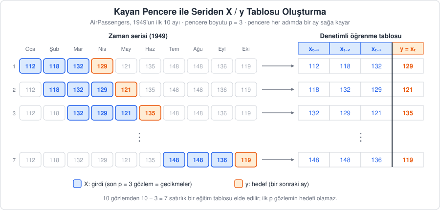

*Şekil 12.1 — Kayan pencere yöntemi: Pencere boyutu $`p = 3`$ iken her satırın girdisi son üç ay (mavi), hedefi bir sonraki ay (turuncu) olur. Pencere bir adım sağa kaydıkça tabloya yeni bir satır eklenir.*

Şekilden iki önemli sonuç çıkar:

- $n$ gözlemli bir seriden $n - p$ satırlık bir tablo elde edilir. İlk $p$ gözlemin kendinden önce yeterli geçmişi olmadığı için hedef olamaz.
- Satırlar arasında **zaman sırası korunur**. Tablo, sıradan bir veri seti gibi görünse de satırları karıştırmak geleceğin bilgisini geçmişe taşır (bkz. 12.1.5).

Pencere boyutu $p$ bir hiperparametredir. Bölüm 6'daki PACF grafiği hangi gecikmelerin anlamlı olduğu konusunda ipucu verir. Aylık mevsimsel verilerde $p = 12$ (bir tam yıl) iyi bir başlangıç noktasıdır.

#### 12.1.2. Gecikme ve Takvim Özellikleri

> 💻 **Uygulama dosyası:** [`Codes/python/ch12_kayan_pencere.py`](Codes/python/ch12_kayan_pencere.py) · [Notebook](Codes/notebooks/ch12_kayan_pencere.ipynb) · [](https://colab.research.google.com/github/erkanozhan/AI_Based_Time_Series-Data_Analytics/blob/main/Codes/notebooks/ch12_kayan_pencere.ipynb)
>
> Bu bölümdeki kodların tamamı bu dosyada. Bilgisayarınızda çalıştırmak için depo kök dizininde `python Codes/python/ch12_kayan_pencere.py` komutunu kullanın ya da dosyayı VS Code'da açıp hücre hücre çalıştırın. Kurulum yapmadan denemek için Colab bağlantısını kullanabilirsiniz.


Kayan pencere yalnızca son $p$ gözlemi kullanır. Özellik mühendisliğiyle bu tabloyu zenginleştirebiliriz:

| Özellik türü | Örnek | Ne yakalar? |
| --- | --- | --- |
| Gecikme (lag) | $`x_{t-1}, x_{t-2}, x_{t-3}`$ | Kısa vadeli bağımlılık (otokorelasyon) |
| Mevsimsel gecikme | $`x_{t-12}`$ (aylık veride geçen yılın aynı ayı) | Mevsimsel tekrar |
| Hareketli (kayan) istatistikler | Son 3 ayın ortalaması, son 12 ayın standart sapması | Yerel seviye ve oynaklık |
| Takvim özellikleri | Ay (1–12), çeyrek, haftanın günü, hafta sonu mu, tatil mi | Takvime bağlı etkiler |
| Dışsal değişkenler | Sıcaklık, fiyat, kampanya göstergesi | Serinin dışındaki nedenler |

Aşağıdaki kod, `AirPassengers` verisi üzerinde hem kayan pencereyi hem de gecikme ve takvim özelliklerini oluşturur.

```python
import numpy as np
import pandas as pd

# Veriyi yükleyelim: tarih sütununu indeks yapıyoruz
df = pd.read_csv('data/AirPassengers.csv', parse_dates=['Month'], index_col='Month')
seri = df['Passengers']

# 1) Kayan pencere: son p gözlem -> bir sonraki gözlem
def kayan_pencere(dizi, p):
    X, y = [], []
    for i in range(len(dizi) - p):
        X.append(dizi[i:i + p])   # girdi: p uzunluğunda pencere
        y.append(dizi[i + p])     # hedef: pencereden hemen sonraki değer
    return np.array(X), np.array(y)

X, y = kayan_pencere(seri.values, p=3)
print(X.shape, y.shape)   # 144 gözlemden 144 - 3 = 141 örnek
print(X[:3], y[:3])

# 2) Aynı fikir pandas ile: gecikme ve takvim özellikleri
tablo = pd.DataFrame({'y': seri})
for k in [1, 2, 3, 12]:                     # x_{t-1}, x_{t-2}, x_{t-3} ve geçen yılın aynı ayı
    tablo[f'lag_{k}'] = seri.shift(k)
# Hareketli ortalama yalnızca GEÇMİŞ değerlerden hesaplanır: shift(1) sızıntıyı önler
tablo['ort_3'] = seri.shift(1).rolling(window=3).mean()
tablo['ay'] = tablo.index.month             # takvim özelliği: 1-12
tablo['ceyrek'] = tablo.index.quarter       # takvim özelliği: 1-4
tablo = tablo.dropna()                      # geçmişi eksik ilk 12 satır atılır

print(tablo.head(3))

# 3) Zamansal ayrım: son 12 ay test, veri KARIŞTIRILMAZ
X_train, X_test = tablo.drop(columns='y').iloc[:-12], tablo.drop(columns='y').iloc[-12:]
y_train, y_test = tablo['y'].iloc[:-12], tablo['y'].iloc[-12:]
print(X_train.shape, X_test.shape)
```

Çıktı:

```text
(141, 3) (141,)
[[112 118 132]
 [118 132 129]
 [132 129 121]] [129 121 135]
              y  lag_1  lag_2  lag_3  lag_12       ort_3  ay  ceyrek
Month
1950-01-01  115  118.0  104.0  119.0   112.0  113.666667   1       1
1950-02-01  126  115.0  118.0  104.0   118.0  112.333333   2       1
1950-03-01  141  126.0  115.0  118.0   132.0  119.666667   3       1
(120, 7) (12, 7)
```

**Çıktının yorumu:**

- `kayan_pencere` çıktısının ilk üç satırı, Şekil 12.1'deki tablonun aynısıdır: `[112, 118, 132] → 129`, `[118, 132, 129] → 121`, ...
- `shift(k)` seriyi $k$ adım aşağı kaydırır; böylece her satırda $k$ ay önceki değer yan yana gelir. Örneğin 1950-01 satırında `lag_1 = 118` (Aralık 1949) ve `lag_12 = 112` (Ocak 1949) yazar.
- `lag_12` en uzun gecikme olduğu için ilk 12 satır `NaN` içerir ve `dropna()` ile atılır. Tablo bu yüzden 1950-01'den başlar ve 144 − 12 = 132 satırdır. Bunun 120'si eğitim, 12'si test için ayrılır.
- `ort_3`, 1950-01 için Ekim–Aralık 1949 ortalamasıdır: (119 + 104 + 118) / 3 ≈ 113.67. Ocak 1950'nin kendi değeri (115) bu ortalamaya **girmez**.

Bu tablo artık herhangi bir regresyon algoritmasına verilebilir. Bölüm 13'te aynı yaklaşımı daha fazla özellikle XGBoost üzerinde uygulayacağız.

#### 12.1.3. Tek Adımlı ve Çok Adımlı Tahmin

Yukarıdaki tablo **tek adımlı (one-step-ahead)** bir tahmin kurar: Bilinen geçmişle yalnızca bir sonraki ayı tahmin ederiz. Oysa pratikte çoğu zaman birkaç adım ilerisi gerekir (ör. önümüzdeki 12 ay). Buna **çok adımlı (multi-step)** tahmin denir ve iki temel stratejisi vardır:

```math
\begin{aligned}
\text{Özyinelemeli:}\quad & \hat{x}_{t+1} = f(x_t, x_{t-1}, \dots, x_{t-p+1}), \quad \hat{x}_{t+2} = f(\hat{x}_{t+1}, x_t, \dots, x_{t-p+2}), \quad \dots \\
\text{Doğrudan:}\quad & \hat{x}_{t+h} = f_h(x_t, x_{t-1}, \dots, x_{t-p+1}), \qquad h = 1, 2, \dots, H
\end{aligned}
```

> **Simge notu:** $`\hat{x}_{t+h}`$ *(x şapka t artı h)*: $`h`$ adım sonrası için yapılan tahmin · $`H`$: tahmin ufku (kaç adım ileriye tahmin yapıldığı) · $`f_h`$: yalnızca $`h`$ adım ilerisi için eğitilmiş ayrı model

- **Özyinelemeli (recursive) strateji:** Tek bir tek-adım modeli eğitilir. Bir sonraki adımı tahmin eder, bu tahmini gerçek değermiş gibi pencereye ekler ve bir sonraki adıma geçer. Basittir, ancak her adımdaki hata bir sonraki adımın girdisine karışır ve **hatalar birikir**.
- **Doğrudan (direct) strateji:** Her ufuk $h$ için ayrı bir model eğitilir: "1 ay sonrası modeli", "2 ay sonrası modeli" vb. Hata birikimi yoktur, ancak $H$ tane model eğitmek gerekir ve modeller birbirinden habersizdir.
- **Çok çıktılı (MIMO) strateji:** Özellikle sinir ağlarında tek bir model, çıktı katmanında $H$ değeri birden üretir. Derin öğrenme modellerinde sık kullanılır.

**Not —** Bölüm 7'deki ARIMA'nın `forecast(h = 24)` çağrısı da arka planda özyinelemeli çalışır: Her adımın tahmini bir sonrakinde girdi olarak kullanılır. Belirsizlik bu şekilde biriktiği için ARIMA'nın tahmin aralıkları ufuk uzadıkça genişler.

#### 12.1.4. Ölçekleme İhtiyacı

Farklı algoritmaların verinin ölçeğine duyarlılığı farklıdır:

- **Sinir ağları (LSTM, GRU, CNN):** Ağırlıklar gradyan inişiyle öğrenilir ve `sigmoid`/`tanh` gibi aktivasyon fonksiyonları dar bir aralıkta en iyi çalışır. Bu yüzden veri genellikle 0–1 aralığına ölçeklenir. Bölüm 15'te kullanacağımız `MinMaxScaler` bunu şu dönüşümle yapar:

$$
x'_t = \frac{x_t - x_{\min}}{x_{\max} - x_{\min}}
$$

> **Simge notu:** $`x'_t`$ *(x üssü t)*: ölçeklenmiş değer · $`x_{\min}, x_{\max}`$: **eğitim setindeki** en küçük ve en büyük değer

- **Ağaç tabanlı modeller (XGBoost, Random Forest):** Veriyi eşik değerlerine göre böldükleri için ölçeklemeye ihtiyaç duymazlar. Ancak önemli bir sınırlamaları vardır: Eğitimde görmedikleri bir seviyeye **çıkamazlar** (dışdeğerleme yapamazlar). `AirPassengers` gibi sürekli artan bir seride test dönemindeki değerler eğitimdeki en büyük değeri aşıyorsa, ağaç modeli tahminleri o tavanın altında kalır. Bu sorun genellikle hedefi farka dönüştürerek ($\nabla x_t = x_t - x_{t-1}$, Bölüm 2.1) ya da trendi önceden ayırarak çözülür.

> **Simge notu:** $`\nabla`$ *(nabla)*: fark operatörü

**Not —** Ölçekleyici (`scaler`) **yalnızca eğitim verisiyle** uydurulmalı (`fit`), test verisine ise aynı parametrelerle yalnızca dönüştürme (`transform`) uygulanmalıdır. Tüm veriyle uydurmak, test dönemindeki en büyük ve en küçük değerin bilgisini eğitime sızdırır.

#### 12.1.5. Veri Sızıntısı Uyarısı

**Tanım:** **Veri sızıntısı (data leakage)**, modelin eğitim sırasında, tahmin anında gerçekte bilinemeyecek bir bilgiye erişmesidir. Sızıntılı bir model eğitim ve test metriklerinde harika görünür, ancak gerçek kullanımda çuvallar.

Zaman serisinde sızıntının en sık görülen biçimleri:

1. **Veriyi karıştırmak:** `train_test_split(..., shuffle=True)` ile rastgele ayırmak, geleceğe ait satırları eğitime koyar. Her zaman Bölüm 8'deki gibi **zamansal ayrım** yapın: eğitim geçmiş, test gelecek.
2. **Hedefi içeren özellikler:** `rolling(3).mean()` başına `shift(1)` konmazsa hareketli ortalama o ayın kendi değerini de içerir; model hedefi "kopya çekerek" öğrenir.
3. **Tüm veriyle ölçekleme veya dönüştürme:** 12.1.4'teki not.
4. **Tahmin anında bilinmeyen dışsal değişkenler:** Örneğin bir ayın günlük satışlarını tahmin ederken o ayın ortalama sıcaklığını kullanmak; ortalama ancak ay bitince bilinir.
5. **Çapraz doğrulamada geleceği görmek:** Sıradan k-katlı çapraz doğrulama, gelecekteki katlarla eğitip geçmişi test eder. Bunun zaman serisine uygun karşılığı Bölüm 16'daki TimeSeriesSplit'tir.

Pratik bir kontrol sorusu: *"Bu özelliğin değerini, tahmin yapacağım anda gerçekten bilebilir miyim?"* Cevap hayırsa özellik sızıntılıdır.

---

### 12.2. Derin Öğrenme Yaklaşımı: Serinin Hafızasını Modellemek

Makine öğrenmesi yaklaşımında geçmişi elle hazırladığımız sütunlarla (gecikmeler, hareketli ortalamalar) modele veriyoruz. Derin öğrenme ise farklı bir yol izler: Diziyi olduğu gibi, adım adım okuyup hangi geçmiş bilginin önemli olduğunu **kendisi** öğrenen özel sinir ağı mimarileri kullanır.

Girdi yine kayan pencereyle hazırlanır (12.1.1), ancak her örnek artık düz bir satır değil, bir **dizidir**. Bu yüzden LSTM gibi katmanlar veriyi üç boyutlu biçimde bekler: `(örnek sayısı, zaman adımı sayısı, özellik sayısı)`. Örneğin yukarıdaki `X` dizisi `X.reshape(141, 3, 1)` ile "141 örnek, her biri 3 zaman adımı, her adımda 1 değer" biçimine getirilir. Bölüm 15'teki uygulamada bu adımı ayrıntılı göreceğiz.

#### 12.2.1. Tekrarlayan Sinir Ağları (RNN) ve Kaybolan Gradyan Sorunu

**Açıklama:** Tekrarlayan Sinir Ağları (Recurrent Neural Network, RNN), en temel hâliyle bir "hafızaya" sahip ağlardır. Diziyi her seferinde bir zaman adımı okur ve o ana kadar gördüklerinin bir özetini **gizli durum (hidden state)** adı verilen bir vektörde taşır. Her adımda bu özet, yeni gelen gözlemle birleştirilerek güncellenir.

**Tanım:**

$$
h_t = \tanh\left(W_h h_{t-1} + W_x x_t + b\right), \qquad \hat{y}_t = W_y h_t + c
$$

> **Simge notu:** $`h_t`$: t anındaki gizli durum (ağın "hafızası") · $`W_h, W_x, W_y`$: öğrenilen ağırlık matrisleri · $`b, c`$: sabit (bias) terimleri · $`\tanh`$ *(tanjant hiperbolik)*: çıktıyı −1 ile 1 arasına sıkıştıran aktivasyon fonksiyonu · $`\hat{y}_t`$ *(y şapka t)*: t anındaki tahmin

Bu yapının kilit noktası, **aynı ağırlıkların her zaman adımında yeniden kullanılmasıdır.** RNN'i zaman içinde "açarak" çizersek, aynı hücrenin her adım için bir kopyası yan yana dizilir (Şekil 12.2).

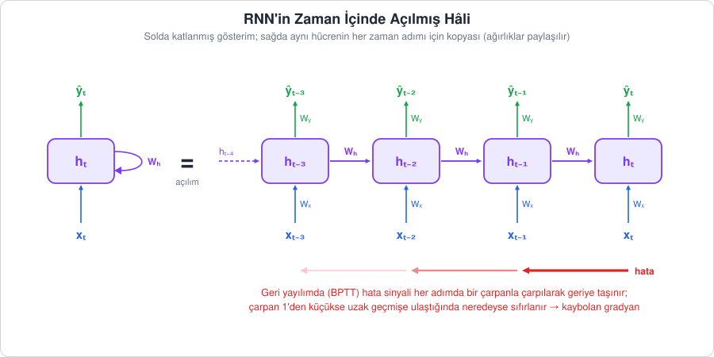

*Şekil 12.2 — Solda RNN'in katlanmış (kompakt) gösterimi, sağda zaman içinde açılmış hâli. Her adımda aynı ağırlıklar kullanılır. Eğitimde hata sinyali geriye doğru taşınırken her adımda zayıflar.*

**Kaybolan gradyan (vanishing gradient) sorunu:** Ağ, yaptığı hatayı geriye doğru yayarak öğrenir. Açılmış ağda bu, hatanın zaman adımları boyunca geriye taşınması demektir (zamanda geri yayılım, *backpropagation through time*, BPTT). Hata sinyali her adımda bir çarpanla çarpılarak geriye gider:

$$
\frac{\partial h_t}{\partial h_{t-k}} = \prod_{j=0}^{k-1} \frac{\partial h_{t-j}}{\partial h_{t-j-1}}
$$

> **Simge notu:** $`\partial`$ *(kısmi türev, "del")*: bir büyüklüğün diğerindeki küçük değişime duyarlılığı · $`\prod`$ *(pi, çarpım)*: çarpım işareti; $`k`$ tane terim birbiriyle çarpılır

Bu çarpanların her biri 1'den küçükse (ör. 0.5), 20 adım sonra çarpım $0.5^{20} \approx 0.000001$ olur. Yani 20 adım önceki bir gözlemin hataya katkısı neredeyse sıfıra iner ve ağ bu uzak ilişkiyi **öğrenemez**. Günlük hayattan bir benzetme: Kulaktan kulağa oyununda mesaj her kişide biraz bozulur; zincir uzadıkça ilk söylenen cümle sona hiç ulaşmaz. Çarpanlar 1'den büyükse bunun tersi olur ve gradyan kontrolsüzce büyür (**patlayan gradyan**, *exploding gradient*); bu durum genellikle gradyanı bir üst sınırla kırparak (*gradient clipping*) önlenir.

Zaman serisinde bunun anlamı şudur: Basit bir RNN, geçen ayın etkisini öğrenebilir ama 12 ay önceki mevsimsel etkiyi öğrenmekte zorlanır.

#### 12.2.2. LSTM Hücresi

**LSTM (Long Short-Term Memory, Uzun Kısa-Süreli Bellek)** mimarisi bu sorunu çözmek için geliştirilmiştir. LSTM'in sırrı, **kapı (gate)** adını verdiğimiz kontrol mekanizmalarıdır. Kapılar, hücrenin hafızasına hangi bilginin gireceğine, hangisinin kalacağına ve hangisinin çıkacağına karar verir. Böylece ağ, hangi bilgiyi uzun süre saklayacağını ve hangisini unutacağını veriden öğrenir.

Bir LSTM hücresinin üç temel kapısı vardır:

1. **Unutma Kapısı (Forget Gate):** Geçmiş hafızadan hangi bilgilerin artık gereksiz olduğuna karar verir ve onları siler.
2. **Giriş Kapısı (Input Gate):** Yeni gelen bilgiden hangi kısımların önemli olduğuna karar verir ve bunları hafızaya ekler.
3. **Çıkış Kapısı (Output Gate):** Mevcut hafızaya ve yeni girdiye bakarak, bu zaman adımı için ne tür bir çıktı üreteceğine karar verir.

Aşağıdaki şema, bir LSTM hücresinin içsel çalışma mekanizmasını kavramsal olarak göstermektedir. Hücre durumu ($C_t$), bilgiyi uzun süre taşıyan bir "hafıza bandı" gibidir ve kapılar bu bant üzerindeki bilgi akışını kontrol eder.


*Şekil 12.3 — LSTM hücresinin iç yapısı: Üstteki yatay hat hücre durumudur (uzun süreli hafıza). Unutma, giriş ve çıkış kapıları bu hat üzerindeki bilgi akışını düzenler.*

**Tanım (LSTM denklemleri):** Her zaman adımında hücre, önceki gizli durum $h_{t-1}$ ile yeni girdi $x_t$'yi birleştirir ve şu hesapları yapar:

```math
\begin{aligned}
f_t &= \sigma\left(W_f [h_{t-1}, x_t] + b_f\right) \\
i_t &= \sigma\left(W_i [h_{t-1}, x_t] + b_i\right) \\
\tilde{C}_t &= \tanh\left(W_C [h_{t-1}, x_t] + b_C\right) \\
C_t &= f_t \odot C_{t-1} + i_t \odot \tilde{C}_t \\
o_t &= \sigma\left(W_o [h_{t-1}, x_t] + b_o\right) \\
h_t &= o_t \odot \tanh\left(C_t\right)
\end{aligned}
```

> **Simge notu:** $`\sigma`$ *(sigma)*: sigmoid fonksiyonu, çıktıyı 0 ile 1 arasına sıkıştırır; kapının "ne kadar açık" olduğunu gösterir · $`[h_{t-1}, x_t]`$: iki vektörün uç uca eklenmesi (birleştirme) · $`\tilde{C}_t`$ *(C tilda t)*: hafızaya eklenmeye aday yeni bilgi · $`\odot`$ *(Hadamard çarpımı)*: iki vektörün eleman eleman çarpımı · $`f_t, i_t, o_t`$: unutma, giriş ve çıkış kapılarının değerleri · $`C_t`$: hücre durumu (uzun süreli hafıza)

**Denklemlerin yorumu:**

- $f_t$, $i_t$ ve $o_t$ kapılarının her elemanı 0 ile 1 arasındadır. 0 "tamamen kapalı", 1 "tamamen açık" demektir.
- Dördüncü satır LSTM'in kalbidir: Yeni hafıza $C_t$, eski hafızanın unutma kapısından geçen kısmı ($f_t \odot C_{t-1}$) ile yeni aday bilginin giriş kapısından geçen kısmının ($i_t \odot \tilde{C}_t$) **toplamıdır**.
- Bu toplama yolu kaybolan gradyan sorununun çaresidir. Unutma kapısı 1'e yakın tutulduğunda bilgi (ve hata sinyali) hücre durumu boyunca neredeyse hiç zayıflamadan birçok adım taşınabilir. RNN'deki gibi her adımda bir `tanh` ile yeniden sıkıştırılmaz.
- Son satırda çıkış kapısı, hafızanın ne kadarının bu adımın çıktısı $h_t$ olarak dışarı verileceğini belirler.

LSTM'in daha sade bir akrabası olan **GRU** (Gated Recurrent Unit), unutma ve giriş kapılarını tek bir "güncelleme kapısı"nda birleştirir ve ayrı bir hücre durumu tutmaz. GRU, LSTM ve 1D-CNN'in Python uygulamaları Bölüm 15'te ele alınmaktadır.

#### 12.2.3. Transformer Modelleri ve Dikkat Mekanizması

Başlangıçta doğal dil işleme (NLP) için geliştirilen **Transformer** mimarisi, zaman serisi tahmininde de kullanılmaktadır. RNN ve LSTM'in aksine diziyi adım adım işlemez. Bunun yerine **dikkat mekanizması (attention mechanism)** sayesinde dizinin tüm adımlarına aynı anda bakar ve her adım için "geçmişteki hangi zaman noktaları şu an benim için önemli?" sorusunu yanıtlayan ağırlıklar öğrenir.

**Tanım (ölçekli nokta çarpımı dikkati):**

$$
\mathrm{Attention}(Q, K, V) = \mathrm{softmax}\left(\frac{Q K^{\top}}{\sqrt{d_k}}\right) V
$$

> **Simge notu:** $`Q, K, V`$: her zaman adımından öğrenilen "sorgu" (query), "anahtar" (key) ve "değer" (value) vektörlerinin matrisleri · $`K^{\top}`$ *(K transpoz)*: K matrisinin satır ve sütunlarının yer değiştirmiş hâli · $`\sqrt{d_k}`$ *(karekök d k)*: anahtar vektörlerinin boyutunun karekökü; değerlerin aşırı büyümesini önleyen ölçekleme · $`\mathrm{softmax}`$: bir sayı listesini toplamı 1 olan pozitif ağırlıklara çeviren fonksiyon

**Yorum:** Her zaman adımı bir *sorgu* üretir ve bunu diğer tüm adımların *anahtarlarıyla* karşılaştırır. Benzerlik ne kadar yüksekse o adıma o kadar büyük ağırlık (dikkat) verilir. Sonuç, diğer adımların *değerlerinin* bu ağırlıklarla alınmış ortalamasıdır. Örneğin aylık bir seride model, Temmuz'u tahmin ederken geçen yılın ve iki yıl önceki Temmuz'un değerlerine yüksek dikkat vermeyi öğrenebilir. Uzaktaki bu adımlara bir RNN'deki gibi adım adım değil, **doğrudan** ulaştığı için kaybolan gradyan sorunu yaşanmaz.

Bilinmesi gereken birkaç nokta:

- Dikkat mekanizması sıraya kendiliğinden duyarlı değildir. Zaman bilgisini modele vermek için girdilere bir **konum kodlaması (positional encoding)** eklenir.
- Her adım diğer tüm adımlarla karşılaştırıldığı için hesaplama maliyeti dizi uzunluğunun karesiyle artar. Zaman serisine özel Transformer türevleri (Informer, Autoformer, PatchTST, Temporal Fusion Transformer vb.) bu maliyeti azaltmaya ve seriye özgü yapıları kullanmaya odaklanır.
- Transformer'lar genellikle **çok miktarda veri** ister. Tek bir kısa seride (ör. 144 aylık `AirPassengers`) basit modellerden daha iyi olmaları beklenmemelidir. Güçlerini binlerce ilişkili seri ya da çok uzun, yüksek frekanslı verilerde gösterirler.

---

### 12.3. Klasik, Makine Öğrenmesi ve Derin Öğrenme Yaklaşımlarının Karşılaştırılması

| Ölçüt | Klasik istatistiksel (ARIMA, SARIMA, Prophet, VAR) | Makine öğrenmesi (XGBoost, Random Forest) | Derin öğrenme (LSTM, GRU, 1D-CNN, Transformer) |
| --- | --- | --- | --- |
| Girdi | Serinin kendisi (ve varsa birkaç dışsal değişken) | Özellik tablosu: gecikmeler, takvim, dışsal değişkenler | Kayan pencereyle hazırlanmış diziler (3 boyutlu) |
| Temel varsayımlar | Durağanlık (ARIMA, VAR) veya belirli bir bileşen yapısı (Prophet); çoğunlukla doğrusal | Yok denecek kadar az; doğrusal olmayan ilişkileri yakalar | Yok denecek kadar az; en esnek yaklaşım |
| Veri ihtiyacı | Az (onlarca–yüzlerce gözlem yeterli) | Orta | Fazla (binlerce gözlem veya çok sayıda seri) |
| Özellik mühendisliği | Gerekmez; fark alma ve derece seçimi gerekir | **Kritik**: başarı büyük ölçüde özelliklere bağlıdır | Daha az; desenleri diziden kendisi öğrenir |
| Ölçekleme | Genellikle gerekmez (log dönüşümü gerekebilir) | Ağaç modellerinde gerekmez | Gerekir (ör. 0–1 aralığına) |
| Trendi geleceğe uzatma | İyi | Zayıf (ağaçlar eğitim aralığının dışına çıkamaz) | Orta; ölçekleme ve fark almaya bağlı |
| Yorumlanabilirlik | Yüksek (katsayılar, bileşenler) | Orta (özellik önemleri) | Düşük ("kara kutu") |
| Belirsizlik aralığı | Doğal olarak üretilir | Ek yöntem gerekir (ör. kantil regresyon) | Ek yöntem gerekir |
| Hesaplama maliyeti | Düşük | Düşük–orta | Yüksek (GPU gerekebilir) |
| Bu derste | Bölüm 7, 9, 10, 11 | Bölüm 13, 14 | Bölüm 15 |

**Hangisini seçmeliyim?** Tek bir kısa ve düzenli seride klasik modeller çoğu zaman yeterlidir, hatta daha iyidir. Çok sayıda dışsal değişken, doğrusal olmayan etkiler ya da takvim etkileri söz konusuysa makine öğrenmesi öne çıkar. Çok büyük veri setlerinde ve karmaşık ardışık desenlerde ise derin öğrenme avantaj sağlar. Hangi yaklaşım seçilirse seçilsin, modeller Bölüm 8'deki metriklerle, aynı test dönemi üzerinde ve basit bir referans modelle (naive) karşılaştırılarak değerlendirilmelidir. Bu ilkeler Bölüm 17'deki altın kurallarda da özetlenmektedir.

---

<a id="bolum-13"></a>

## 13. XGBoost ile Zaman Serisi Tahmini

Şimdiye kadar zaman serilerine farklı açılardan yaklaştık: ARIMA seriyi istatistiksel bir süreç olarak modelledi (Bölüm 7), Prophet trend ve takvim etkilerini ayrıştırdı (Bölüm 9). XGBoost (Extreme Gradient Boosting) ise bambaşka bir yol izler: zaman serisini bir **regresyon problemine** dönüştürür ve bu problemi çok sayıda küçük karar ağacının birlikte çalışmasıyla çözer.

Bu dönüşümün özü şu soruda yatar: *"Geçmiş değerleri ve takvim bilgisini biliyorsam, gelecek değeri tahmin edebilir miyim?"* Bunun için geçmiş gözlemleri (gecikme/lag özellikleri) ve takvim bilgilerini (ay, çeyrek) girdi olarak kullanırız. Zaman serisini bu şekilde denetimli öğrenme formatına çevirmenin genel mantığını Bölüm 12'de görmüştük; bu bölümde onu somut bir modelle uygulayacağız.

Bölümün akışı şöyledir: önce XGBoost'un dayandığı kavramları (karar ağacı, gradient boosting, düzenlileştirme) ele alacağız; ardından ağaç modellerinin zaman serilerinde karşılaştığı en önemli sınırlılığı, yani **ekstrapolasyon yapamamayı** tartışacağız. Son olarak modeli önce Python ile, sonra kod yazmadan Weka Explorer ile uygulayacağız.

### 13.1. Temel Fikir: Karar Ağacından Gradient Boosting'e

#### 13.1.1. Karar Ağacı

**Açıklama:** Karar ağacı, veriyi art arda sorulan "evet/hayır" sorularıyla gruplara ayırır. Örneğin yolcu sayısını tahmin eden bir ağaç şöyle kurallar öğrenebilir: *"Önceki ayın yolcu sayısı 300'den fazlaysa **ve** ay Temmuz ise tahmin 350'dir."* Her soru bir **düğüm**, soruların sonunda varılan her grup bir **yaprak** olarak adlandırılır.

**Tanım:** Bir regresyon ağacı, girdi uzayını $T$ adet ayrık bölgeye ( $R_1, R_2, \dots, R_T$ ) ayırır ve her bölgeye sabit bir değer atar. Bir gözlemin tahmini, düştüğü yaprağın değeridir:

$$\hat{y}(x) = w_j \quad \text{eğer } x \in R_j$$

Kare hata kullanıldığında $w_j$, eğitimde o yaprağa düşen hedef değerlerin **ortalamasıdır**. Bu ayrıntı, 13.3'te göreceğimiz ekstrapolasyon sorununun kaynağıdır.

> **Simge notu:** $`\hat{y}`$ *(y şapka)*: modelin tahmini · $`w_j`$ *(w j)*: j. yaprağın tahmin değeri (yaprak ağırlığı) · $`\in`$ *(elemanıdır)*: "içinde yer alır" · $`R_j`$ *(R j)*: ağacın j. bölgesi (yaprağı)

Tek bir ağaç tek başına genellikle zayıf bir tahmincidir: sığ tutulursa veriyi kaba basamaklarla özetler, derin tutulursa eğitim verisini ezberler (aşırı öğrenme).

#### 13.1.2. Boosting: Hataları Adım Adım Düzeltmek

**Açıklama:** *Boosting*, çok sayıda zayıf modeli **sırayla** kurarak güçlü bir model elde etme fikridir. İlk ağaç veriye kaba bir uyum sağlar. İkinci ağaç veriyi değil, **ilk ağacın yaptığı hataları** (artıkları) öğrenir. Üçüncü ağaç, ilk ikisinin toplamının hâlâ düzeltemediği hataları öğrenir ve bu böyle sürer. Her ağaç küçük bir düzeltme yapar; yüzlerce düzeltmenin toplamı güçlü bir model oluşturur.

Bunu bir öğrencinin sınava hazırlanmasına benzetebiliriz: ilk deneme sınavından sonra yalnızca yanlış yaptığı konulara çalışır, ikinci denemeden sonra yine kalan yanlışlarına odaklanır.

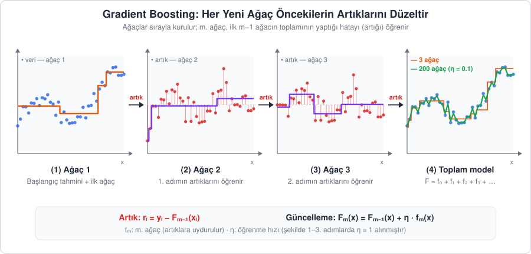

*Şekil 13.1 — Gradient boosting mekanizması. (1) İlk ağaç veriye kaba bir basamak fonksiyonu uydurur. (2–3) Sonraki her ağaç, o ana kadarki toplam modelin artıklarını (kırmızı) öğrenir. (4) Ağaçların toplamı veriye giderek daha iyi uyar; yüzlerce küçük adımla (η = 0.1) pürüzsüz bir uyum elde edilir.*

**Tanım (Gradient Boosting):** Başlangıç tahmini $f_0$ (genellikle hedefin ortalaması) olmak üzere, $m$. adımda önce her gözlemin artığı hesaplanır:

$$r_i^{(m)} = y_i - \hat{y}_i^{(m-1)}$$

Ardından bu artıklara yeni bir ağaç $f_m$ uydurulur ve model küçük bir adımla güncellenir:

$$\hat{y}_i^{(m)} = \hat{y}_i^{(m-1)} + \eta f_m(x_i)$$

$M$ ağaç kurulduktan sonra nihai tahmin, tüm ağaçların katkılarının toplamıdır:

$$\hat{y}_i = f_0 + \eta \sum_{m=1}^{M} f_m(x_i)$$

> **Simge notu:** $`r_i^{(m)}`$ *(r i, m. adım)*: m. ağacın öğrendiği artık · $`\eta`$ *(eta)*: öğrenme hızı (learning rate), her ağacın katkısını küçülten katsayı · $`\sum`$ *(sigma, toplam)*: toplama işlemi · $`f_m`$ *(f m)*: m. ağaç

Yönteme "gradient" (gradyan) denmesinin nedeni şudur: kare hata kaybı $L = \frac{1}{2}(y - \hat{y})^2$ için kaybın tahmine göre türevinin ters işaretlisi tam olarak artıktır:

$$-\frac{\partial L}{\partial \hat{y}} = y - \hat{y}$$

Yani artıklara ağaç uydurmak, kayıp fonksiyonunu gradyan iniş yönünde azaltmakla aynı şeydir. Başka kayıp fonksiyonları (ör. mutlak hata) kullanıldığında ağaçlar artık yerine bu negatif gradyana uydurulur.

> **Simge notu:** $`\partial`$ *(kısmi türev, "del")*: bir büyüklüğün diğerine göre değişim hızı

#### 13.1.3. XGBoost'u Farklı Kılan: Düzenlileştirme

XGBoost, gradient boosting'in hızlı ve düzenlileştirilmiş (regularized) bir uygulamasıdır. Klasik gradient boosting yalnızca tahmin hatasını küçültmeye çalışırken, XGBoost amaç fonksiyonuna ağaçların **karmaşıklığını cezalandıran** bir terim ekler:

$$\mathcal{L} = \sum_{i=1}^{n} l(y_i, \hat{y}_i) + \sum_{m=1}^{M} \Omega(f_m)$$

$$\Omega(f) = \gamma T + \frac{1}{2} \lambda \sum_{j=1}^{T} w_j^2$$

Burada ilk terim tahmin hatasını (ör. kare hata), ikinci terim ise her ağacın karmaşıklığını ölçer. $T$ ağaçtaki yaprak sayısıdır.

> **Simge notu:** $`\mathcal{L}`$ *(kaligrafik L)*: en küçüklenecek toplam amaç fonksiyonu · $`l`$ *(küçük l)*: tek bir gözlemin kaybı · $`\Omega`$ *(omega)*: ağaç karmaşıklığı cezası · $`\gamma`$ *(gama)*: her yeni yaprak için ödenen ceza · $`\lambda`$ *(lambda)*: yaprak değerlerinin büyüklüğüne verilen ceza (L2 düzenlileştirme)

**Yorum:** $\gamma$ büyüdükçe model yeni bir bölme yapmak için daha fazla hata azalması "talep eder", dolayısıyla ağaçlar sade kalır. $\lambda$ büyüdükçe yaprak değerleri sıfıra doğru çekilir ve her ağacın tek başına yapabileceği aşırı düzeltmeler engellenir. İkisinin ortak amacı, modelin eğitim verisini ezberlemesini (aşırı öğrenme) önlemektir.

XGBoost bunlara ek olarak ikinci dereceden türev bilgisini kullanan hızlı bir bölme arama algoritması, eksik değerleri kendiliğinden yönetme ve paralel hesaplama gibi mühendislik iyileştirmeleri de sunar. Tablo biçimindeki (yapılandırılmış) verilerde çoğu zaman en iyi sonuç veren yöntemlerden biri olmasının nedeni budur.

#### 13.1.4. Temel Hiperparametreler

| Hiperparametre | Formüldeki karşılığı | Ne işe yarar? | Tipik değer |
| --- | --- | --- | --- |
| `n_estimators` | ağaç sayısı $`M`$ | Kaç düzeltme adımı yapılacağı. Az olursa eksik öğrenme, çok olursa aşırı öğrenme riski; erken durdurma ile belirlenir. | 100–1000 |
| `learning_rate` | $`\eta`$ | Her ağacın katkısı. Küçük değer daha yavaş ama daha kararlı öğrenme sağlar, daha çok ağaç gerektirir. | 0.01–0.1 |
| `max_depth` | ağaç derinliği | Bir ağacın kaç soru sorabileceği; derin ağaçlar karmaşık etkileşimleri yakalar ama ezberlemeye yatkındır. | 3–6 |
| `subsample` | — | Her ağaçta kullanılan satır (gözlem) oranı; rastgelelik ekleyerek aşırı öğrenmeyi azaltır. | 0.7–1.0 |
| `colsample_bytree` | — | Her ağaçta kullanılan özellik (sütun) oranı. | 0.7–1.0 |
| `gamma`, `reg_lambda` | $`\gamma`$, $`\lambda`$ | 13.1.3'teki düzenlileştirme cezaları. | 0 / 1 (varsayılan) |
| `early_stopping_rounds` | — | Doğrulama hatası bu kadar tur boyunca iyileşmezse eğitimi durdurur. | 20–50 |

**Not —** `n_estimators` ile `learning_rate` birbirine bağlıdır: öğrenme hızını yarıya indirirseniz, aynı uyumu yakalamak için yaklaşık iki kat ağaç gerekir.

### 13.2. Zaman Serisini XGBoost'a Hazırlamak

XGBoost zamanın akışını kendiliğinden anlamaz; ona göre her satır birbirinden bağımsız bir örnektir. Bu yüzden zamansal bilgiyi **özellik mühendisliği** ile satırların içine yerleştirmemiz gerekir (dönüşümün genel mantığı için bkz. Bölüm 12). Kullanacağımız özellik grupları şunlardır:

| Özellik grubu | Örnek | Neyi yakalar? |
| --- | --- | --- |
| Gecikmeler (lags) | `lag_1`, …, `lag_12` | Kısa dönem bağımlılık ve (12. gecikme ile) mevsimsellik |
| Hareketli istatistikler | `rolling_mean_12`, `rolling_std_3` | Yerel düzey (trend) ve oynaklık |
| Yıllık değişim | `lag_1 − lag_13` | Büyüme hızı |
| Takvim | `month`, `quarter` | Takvime bağlı mevsimsel etkiler |

**Not —** Her özellik yalnızca tahmin anından **önce** bilinen bilgilerle hesaplanmalıdır. Örneğin $t$ anının özelliği olarak $y_t - y_{t-12}$ kullanmak, hedef değeri ($y_t$) özelliğin içine gizlemek anlamına gelir. Model bu durumda eğitimde ve testte olağanüstü başarılı görünür, ama gerçek gelecekte bu bilgi elimizde olmayacağı için çalışmaz. Bu hataya **veri sızıntısı** (data leakage) denir. Python kodunda bu yüzden hareketli istatistikler ve yıllık değişim, `shift(1)` ile bir adım kaydırılarak hesaplanmıştır.

### 13.3. Önemli Bir Sınırlılık: Ağaçlar Ekstrapolasyon Yapamaz

Bu bölümün belki de en önemli uyarısı budur. 13.1.1'de gördüğümüz gibi, bir ağacın her yaprağı eğitimde o yaprağa düşen hedef değerlerin ortalamasını verir. Bunun doğal sonucu şudur: tek bir regresyon ağacının tahmini **hiçbir zaman** eğitim verisinde görülen en küçük ve en büyük hedef değerin dışına çıkamaz.

$$\min_i y_i \le \hat{y}(x) \le \max_i y_i$$

Gradient boosting topluluğunda bu sınır tam olarak kesin olmasa da pratikte geçerlidir: model, eğitimde gördüğü düzeyin belirgin biçimde üstüne çıkamaz.

> **Simge notu:** $`\le`$ *(küçük eşittir)* · $`\min_i`$, $`\max_i`$ *(minimum, maksimum)*: tüm eğitim gözlemleri üzerinden en küçük ve en büyük değer

**Bu neden zaman serilerinde sorun?** Trendli bir seride (AirPassengers gibi) gelecek değerler çoğu zaman geçmişte hiç görülmemiş düzeydedir. Model, girdi olarak "zaman" veya "yıl" bilgisi verilse bile, eğitim aralığının dışındaki bir yıl için en son öğrendiği yaprağı kullanır ve tahmin düz bir tavana takılır. Model trendi "devam ettiremez"; yalnızca eğitimde gördüğü en yüksek düzeyi tekrar eder.

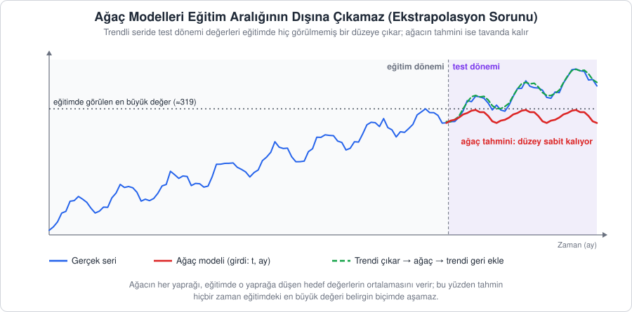

*Şekil 13.2 — Trendli bir seride ağaç tabanlı model (kırmızı) test döneminde eğitimdeki en yüksek düzeyin etrafında kalır ve trendi izleyemez. Trend önce çıkarılıp ağaç yalnızca trendden arındırılmış bileşene uygulandığında ve trend sonra geri eklendiğinde (yeşil kesikli) tahmin gerçek seriyi izler.*

AirPassengers verisinde de bu durumu görürüz: eğitim dönemindeki en yüksek değer 559 iken 1960 yılının test döneminde değerler 622'ye kadar çıkar. Seviye üzerinden eğitilen bir XGBoost modeli yaz zirvesini sistematik olarak **düşük** tahmin eder (Python kodundaki "Ekstrapolasyon kontrolü" çıktısında bunu doğrudan görebilirsiniz).

**Çözümler:** Temel fikir, modele eğitim ve test döneminde aynı aralıkta kalan bir hedef vermektir.

1. **Fark alarak tahmin:** Seviye ($y_t$) yerine bir önceki döneme göre değişim tahmin edilir ve sonra seviyeye geri dönülür (fark operatörü için bkz. Bölüm 2.1):

   $$d_t = y_t - y_{t-1}, \qquad \hat{y}_t = y_{t-1} + \hat{d}_t$$

   Değişimlerin aralığı zamanla çok daha az kayar; bu yüzden ağaç bu hedefte sınır sorunu yaşamaz. Mevsimsel veride $d_t = y_t - y_{t-12}$ (mevsimsel fark) da kullanılabilir.

2. **Trendi çıkarma (detrend):** Önce basit bir trend modeli (ör. doğrusal regresyon) uydurulur, ağaç yalnızca trendden arta kalan kısmı öğrenir, tahminde trend geri eklenir (Şekil 13.2'deki yeşil çizgi).

3. **Logaritma + fark:** Mevsimsel dalgaların genliği seviyeyle birlikte büyüyorsa (çarpımsal yapı, bkz. Bölüm 2.4) önce logaritma alınıp sonra fark alınabilir; bu durumda model yüzde değişimi öğrenir.

**Not —** Bu sorun yalnızca XGBoost'a özgü değildir; Random Forest, REPTree gibi tüm ağaç tabanlı yöntemler (13.5'te Weka'da kullanacağımız algoritmalar dahil) aynı sınırlılığa sahiptir. ARIMA ise fark alma işlemini modelin içinde yaptığı için (Bölüm 7) trendi doğal olarak sürdürebilir.

### 13.4. Python ile XGBoost Uygulaması

Aşağıdaki kod AirPassengers verisi üzerinde uçtan uca bir XGBoost uygulamasıdır: veri hazırlığı, özellik mühendisliği, eğitim/doğrulama/test ayrımı, erken durdurma ile model eğitimi, değerlendirme, özellik önemi, görselleştirme ve zaman serisi çapraz doğrulaması. Kodu çalıştırmak için `pip install xgboost` ile paketi kurmanız gerekir.

Programın tamamı (yaklaşık 340 satır) uygulama dosyasındadır; aşağıda yalnızca kilit satırlarını görüyorsunuz.

```python
# XGBoost ile AirPassengers — kilit satırlar (tam kod: Codes/python/ch13_xgboost.py)
# 2) Özellik mühendisliği: her özellik yalnızca geçmiş bilgiden (shift) üretilir
for lag in range(1, 13):
    df_features[f'lag_{lag}'] = df_features['Passengers'].shift(lag)
df_features['rolling_mean_12'] = df_features['Passengers'].shift(1).rolling(12).mean()
df_features['seasonal_diff'] = df_features['Passengers'].shift(1) - df_features['Passengers'].shift(13)
df_features['month'] = df_features.index.month
df_features = df_features.dropna()          # ilk satırlardaki NaN'lar atılır

# 3) Zaman sıralı bölme: son 12 ay test, eğitimin son 12 ayı doğrulama
split_point = len(X) - test_size
X_train, X_test = X.iloc[:split_point], X.iloc[split_point:]
y_train, y_test = y.iloc[:split_point], y.iloc[split_point:]
X_tr_in, X_val = X_train.iloc[:-val_size], X_train.iloc[-val_size:]
y_tr_in, y_val = y_train.iloc[:-val_size], y_train.iloc[-val_size:]

# 4) Erken durdurmayla ağaç sayısını bul, sonra tüm eğitim verisiyle yeniden eğit
params = dict(learning_rate=0.05, max_depth=4, subsample=0.8,
              colsample_bytree=0.8, random_state=SEED)
es_model = xgb.XGBRegressor(n_estimators=1000, early_stopping_rounds=50, **params)
es_model.fit(X_tr_in, y_tr_in, eval_set=[(X_val, y_val)], verbose=False)
best_n = es_model.best_iteration + 1
model = xgb.XGBRegressor(n_estimators=best_n, **params)
model.fit(X_train, y_train)

# 5) Test tahmini ve metrikler (MAE, RMSE, MAPE; bkz. Bölüm 8)
y_test_pred = model.predict(X_test)
test_mae, test_rmse, test_mape = calculate_metrics(y_test, y_test_pred, "Test Seti")
```

Program sırasıyla şu adımları izler:

1. **Tekrarlanabilirlik ve veri:** Tohum sabitlenir (`SEED = 42`), AirPassengers okunur ve `Month` sütunu tarih indeksi yapılır.
2. **Özellik mühendisliği:** 12 gecikme (`lag_1`–`lag_12`), 3/6/12 aylık hareketli ortalamalar ve standart sapmalar, yıllık değişim (`seasonal_diff`), ay, çeyrek ve normalize yıl üretilir. Hepsi `shift` ile yalnızca geçmiş bilgiden hesaplanır; NaN içeren ilk satırlar atılır.
3. **Eğitim / doğrulama / test ayrımı:** Son 12 ay test, eğitimin son 12 ayı erken durdurma için doğrulama kümesidir.
4. **Model:** Erken durdurmayla uygun ağaç sayısı (`best_n`) bulunur, model bu sayıyla tüm eğitim verisinde yeniden eğitilir.
5. **Değerlendirme:** `calculate_metrics` eğitim ve test için MAE, RMSE ve MAPE yazdırır; ardından eğitimdeki en büyük değer, testteki en büyük gerçek değer ve en büyük tahmin yan yana basılır (ekstrapolasyon kontrolü).
6. **Özellik önemi:** `feature_importances_` yatay çubuk grafikle çizilir ve en önemli beş özellik listelenir.
7. **Görselleştirme:** Tüm seri üzerinde eğitim/test tahminleri ve test döneminin, eğitimdeki tavanı gösteren yatay çizgiyle ayrıntılı görünümü çizilir.
8. **Çapraz doğrulama:** Eğitim verisi üzerinde 5 fold'lu `TimeSeriesSplit` ile (sabit `best_n`) her fold'un RMSE, MAE, MAPE değeri ve "ortalama ± std" özeti hesaplanır (ayrıntısı Bölüm 16'da).

> 💻 **Uygulama dosyası:** [`Codes/python/ch13_xgboost.py`](Codes/python/ch13_xgboost.py) · [Notebook](Codes/notebooks/ch13_xgboost.ipynb) · [](https://colab.research.google.com/github/erkanozhan/AI_Based_Time_Series-Data_Analytics/blob/main/Codes/notebooks/ch13_xgboost.ipynb)
>
> Bu bölümdeki kodların tamamı bu dosyada. Bilgisayarınızda çalıştırmak için depo kök dizininde `python Codes/python/ch13_xgboost.py` komutunu kullanın ya da dosyayı VS Code'da açıp hücre hücre çalıştırın. Kurulum yapmadan denemek için Colab bağlantısını kullanabilirsiniz.
>
> Dosya, 13.4.2'deki fark üzerinden tahmin kodunu da içerir.

#### 13.4.1. Kodun Önemli Noktaları ve Çıktının Yorumlanması

- **Üç parçalı ayrım:** Son 12 ay test setidir ve yalnızca en sonda, performansı raporlamak için kullanılır. Erken durdurma için gereken doğrulama seti, eğitim verisinin son 12 ayından ayrılır. Test setini erken durdurmada (`eval_set`) kullanmak, test bilgisini model seçimine sızdırır ve sonuçları olduğundan iyi gösterir.
- **İki aşamalı eğitim:** Önce doğrulama seti üzerinde uygun ağaç sayısı (`best_n`) bulunur, sonra model bu ağaç sayısıyla tüm eğitim verisinde yeniden eğitilir. Böylece en yakın tarihli 12 ay da öğrenmeye katılır.
- **Metrikler:** MAE, RMSE ve MAPE'nin tanımları ve yorumu için Bölüm 8'e bakınız. Eğitim hatasının test hatasından çok daha düşük çıkması beklenen bir durumdur; aradaki fark çok büyükse model aşırı öğrenmiş olabilir.
- **Ekstrapolasyon kontrolü:** Kod, eğitimdeki en büyük değeri, testteki en büyük gerçek değeri ve testteki en büyük tahmini yan yana yazdırır. Seviye modelinin en büyük tahmininin eğitimdeki en büyük değerin (559) civarında kaldığını, gerçek zirvenin (622) ise çok altında olduğunu göreceksiniz. Bu, 13.3'te anlatılan sınırlılığın ta kendisidir. Detaylı test grafiğine eklenen yatay kesikli çizgi de bu tavanı gösterir.
- **Özellik önemi:** AirPassengers'ta genellikle `lag_12` (geçen yılın aynı ayı) açık ara en önemli özellik çıkar. Bu, serinin güçlü yıllık mevsimselliğini modelin kendiliğinden keşfettiğini gösterir. Önemi sıfıra yakın özellikler modelden çıkarılarak daha sade bir model denenebilir.
- **Çapraz doğrulama:** Katlar arasındaki hata farkı (± değeri) modelin farklı dönemlerdeki tutarlılığını gösterir. İlk katlarda eğitim verisi az olduğu için hata daha yüksek çıkabilir. Çapraz doğrulama yalnızca eğitim verisi üzerinde yapılır; test seti yine dokunulmadan kalır.

**Not —** Kodun ürettiği sayılar XGBoost sürümüne ve işletim sistemine göre küçük farklılıklar gösterebilir; yorumlarken sayıların kendisinden çok göreli büyüklüklerine (eğitim ile test farkı, seviye modeli ile fark modeli farkı) odaklanın.

#### 13.4.2. Ekstrapolasyon Sorununa Çözüm: Fark Üzerinden Tahmin

13.3'teki ilk çözümü uygulayalım. Aşağıdaki kod, yukarıdaki kodun devamıdır (aynı `X_train`, `X_test`, `params`, `best_n` ve `calculate_metrics` nesnelerini kullanır). Hedef olarak seviye yerine bir önceki aya göre değişimi kullanır ve tahmini `lag_1` ile toplayarak seviyeye geri döner.

```python
# =============================================================
# 9) EKSTRAPOLASYON SORUNUNA ÇÖZÜM: FARK ÜZERİNDEN TAHMİN
# =============================================================
#
# Seviyeyi (Passengers) değil, bir önceki aya göre DEĞİŞİMİ
# tahmin edelim. Değişimin aralığı eğitim ve test döneminde
# benzer olduğundan ağaçlar bu hedefte sınır sorunu yaşamaz.
#
#   hedef:          d(t) = y(t) - y(t-1)
#   geri dönüşüm:   ŷ(t) = y(t-1) + d̂(t)      (y(t-1) = lag_1)

d_train = y_train - X_train['lag_1']

diff_model = xgb.XGBRegressor(n_estimators=best_n, **params)
diff_model.fit(X_train, d_train)

y_test_pred_diff = X_test['lag_1'].values + diff_model.predict(X_test)

print("\n" + "=" * 50)
print("SEVİYE MODELİ vs FARK MODELİ (Test)")
print("=" * 50)
calculate_metrics(y_test, y_test_pred, "Seviye modeli")
calculate_metrics(y_test, y_test_pred_diff, "Fark modeli")
print(f"\nFark modelinin testteki en büyük tahmini: {y_test_pred_diff.max():.0f}")
```

**Yorum:** Fark modelinin testteki en büyük tahmini artık eğitimdeki tavanı (559) aşar ve yaz zirvesine yaklaşır; MAE, RMSE ve MAPE değerleri de genellikle seviye modeline göre belirgin biçimde düşer. Bu iyileşme, modelin daha "akıllı" olmasından değil, ona öğrenebileceği aralıkta kalan bir hedef vermemizden kaynaklanır.

**Not —** Bu örnekte yalnızca hedefi farka dönüştürdük; özellikler (gecikmeler, hareketli ortalamalar) hâlâ seviye cinsindendir. Daha ileri bir uygulamada özellikler de farklar ya da oranlar biçiminde (ör. `lag_1 - lag_2`) tanımlanarak sınır sorunu tamamen ortadan kaldırılabilir.

---

### 13.5. Weka Explorer ile Uygulama

Kod yazmadan aynı mantığı görmek isterseniz Weka'yı kullanabilirsiniz. Weka'nın standart kurulumunda XGBoost bulunmaz; ancak burada önemli olan algoritmanın adı değil, **zaman serisini gecikme özellikleriyle bir regresyon problemine dönüştürme** fikridir. Bu dönüşümü Weka'da bir filtreyle yapıp ardından Weka'nın ağaç tabanlı ve boosting tabanlı regresyon algoritmalarını kullanacağız.

Weka standart hâliyle zaman serisi araçları içermez; bunun için `timeseriesForecasting` paketinin kurulması gerekir.

#### 13.5.1. Paket Kurulumu

1. Weka'yı açın. Karşınıza gelen **Weka GUI Chooser** penceresinin menüsünden `Tools → Package manager` seçeneğine gidin.
2. Açılan pencerenin arama kutusuna `timeseries` yazın.
3. Listede `timeseriesForecasting` paketini seçip **Install** düğmesine tıklayın.
4. Kurulum tamamlandıktan sonra Weka'yı kapatıp yeniden başlatın. Bu paket hem bu bölümde kullanacağımız `TSLagMaker` filtresini hem de Bölüm 14'te ele alacağımız `Forecast` sekmesini ekler.

#### 13.5.2. Veri Yükleme

1. AirPassengers veri setini `https://github.com/erkanozhan/AI_Based_Time_Series-Data_Analytics/blob/main/data/AirPassengers.csv` adresinden indirin: sayfadaki **Raw** düğmesine sağ tıklayıp "Bağlantıyı farklı kaydet" seçeneğiyle dosyayı bilgisayarınıza kaydedin.
2. Weka GUI Chooser'da **Explorer** düğmesine tıklayın.
3. `Preprocess` sekmesinde `Open file...` düğmesine tıklayın, dosya türü olarak CSV'yi seçip indirdiğiniz dosyayı açın.

Alternatif olarak **Raw** düğmesine tıklayınca açılan sayfanın adresini kopyalayıp `Open URL...` ile dosyayı doğrudan yükleyebilirsiniz. Bu adres `raw.githubusercontent.com` ile başlamalıdır.

**Not —** Weka CSV dosyasındaki `1949-01` biçimli tarihleri varsayılan olarak **nominal** (metin kategorisi) olarak okur. Tarih sütununu gerçek `Date` tipine dönüştürmenin iki yolu Bölüm 14.1'de anlatılmıştır; `TSLagMaker` filtresinin trend ve takvim özelliklerini doğru üretebilmesi için bu dönüşümü yapmanız önerilir.

#### 13.5.3. Özellik Mühendisliği (Dönüşüm)

Python'da `shift()` fonksiyonu ile yaptığımız gecikme üretimini Weka'da `TSLagMaker` filtresiyle yapacağız. Ancak Weka'nın çalışma mantığı gereği, tahmin edeceğimiz hedef değişkenin kendisini aynı anda gecikme üretilecek girdi olarak kullanamayız. Bu nedenle önce verimizi üç adımda hazırlayacağız.

Tüm filtreler `Preprocess` sekmesindeki **Filter** bölümünden şu şekilde uygulanır: `Choose` düğmesine tıklayın, ağaçtan filtreyi seçin, filtre adının yazılı olduğu kutuya tıklayarak ayarlarını açın, `OK` deyin ve son olarak sağdaki `Apply` düğmesine basın.

1. **Sütunu kopyalama:** `filters → unsupervised → attribute → Copy` filtresini seçin. `attributeIndices` ayarına `Passengers` sütununun sıra numarasını (genellikle `2`) yazıp uygulayın. Listenin sonuna `Copy of Passengers` adlı yeni bir sütun eklenir.
2. **Yeniden adlandırma:** Kopyanın adındaki boşluklar ileride sorun yaratabilir. `filters → unsupervised → attribute → RenameAttribute` filtresiyle bu sütunun adını `YolcuGiris` gibi bitişik bir ada dönüştürün (ayarlar: `attributeIndices` = `last`, `find` = `.*`, `replace` = `YolcuGiris`) (alternatif olarak `Edit` penceresinde sütun başlığına sağ tıklayıp `Rename attribute` da kullanılabilir).
3. **Sıralama:** Weka, sınıflandırma ve regresyon algoritmalarında varsayılan olarak **en son sütunu hedef** (class) kabul eder. `filters → unsupervised → attribute → Reorder` filtresinde `attributeIndices` ayarını `1,3,2` yapın. Böylece sıralama Tarih, YolcuGiris (girdi), Passengers (hedef) olur.

Hazırlık tamamlandıktan sonra asıl dönüşüme geçin: `filters → supervised → attribute → TSLagMaker` filtresini seçin ve ayarlarını şöyle yapın:

| Parametre | Değer | Açıklama |
| --- | --- | --- |
| `fieldsToLag` | YolcuGiris | Gecikmesi alınacak kopya sütunun adı |
| `periodicity` | MONTHLY | Verinin aylık olduğunu belirtir |
| `maxLag` | 12 | Mevsimselliği yakalamak için bir yıl geriye bakılır |
| `adjustForTrends` | True | Zaman indeksine dayalı trend özellikleri ekler |
| `addMonthOfYear` | True | Hangi ayda olduğumuzu belirten özellik ekler |

`Apply` düğmesine bastığınızda veri setinin genişlediğini, `Lag_YolcuGiris-1`, …, `Lag_YolcuGiris-12` gibi geçmişe yönelik yeni sütunların eklendiğini göreceksiniz. İlk 12 satırda gecikme değerleri doğal olarak eksik (`?`) olur.

**Not —** Filtreyi uyguladıktan sonra `Attributes` listesini mutlaka kontrol edin. Gecikmesiz `YolcuGiris` sütunu hâlâ listede duruyorsa, bu sütun hedefin (Passengers) **birebir kopyasıdır**. Onu işaretleyip listenin altındaki `Remove` düğmesiyle silin; aksi hâlde model cevabı doğrudan girdiden okur, `Correlation coefficient` 1'e çok yakın çıkar ve sonuçlar tamamen yanıltıcı olur (13.2'de anlatılan veri sızıntısı). Tarih sütunu nominal kaldıysa onu da silmek uygundur.

#### 13.5.4. Model Kurma ve Değerlendirme

1. `Classify` sekmesine geçin. `Start` düğmesinin hemen üstündeki açılır listede hedef olarak `(Num) Passengers` sütununun seçili olduğundan emin olun.
2. `Classifier` bölümündeki `Choose` düğmesiyle bir algoritma seçin. Zaman serilerinde sık kullanılan seçenekler:
   - **`trees → RandomForest`:** Birbirinden bağımsız çok sayıda ağacın ortalamasını alır, genellikle kararlı sonuçlar verir.
   - **`trees → REPTree`:** Hızlı çalışan ve budama yaparak aşırı öğrenmeyi azaltan tek bir karar ağacıdır.
   - **`meta → AdditiveRegression`:** Weka'daki **gradient boosting** karşılığıdır; XGBoost'a en yakın seçenek budur. Ayarlarında `classifier` olarak `trees → REPTree` seçin; `numIterations` ağaç sayısını ($M$), `shrinkage` ise öğrenme hızını ($\eta$) belirler (ör. 200 iterasyon, 0.1 shrinkage).
   - **`functions → SMOreg`:** Destek vektör makinelerinin regresyon sürümüdür. Varsayılan doğrusal çekirdekle ağaçlardan farklı olarak trendi eğitim aralığının dışına taşıyabilir; 13.3'teki sınırlılığı karşılaştırmak için iyi bir referanstır.
3. `Test options` bölümünde `Percentage split` seçeneğini işaretleyip oranı `80` yapın. Bu, verinin ilk %80'iyle modelin eğitileceği, kalan %20'siyle sınanacağı anlamına gelir.
4. **Çok önemli:** Weka, `Percentage split` kullanıldığında varsayılan olarak veriyi bölmeden önce **karıştırır**. Zaman serisinde bu, geleceği görerek geçmişi tahmin etmek demektir. Bunu önlemek için `More options...` düğmesine tıklayın ve **`Preserve order for % split`** kutucuğunu işaretleyin.
5. `Start` düğmesine basın.

**Not —** %80 ayrımında test dönemi yaklaşık 1958 sonu–1960 aralığına düşer ve bu dönemdeki değerlerin bir kısmı eğitimde görülen en yüksek değerin üzerindedir. Bu yüzden RandomForest, REPTree ve AdditiveRegression gibi ağaç tabanlı yöntemlerin zirveleri düşük tahmin etmesi beklenir (13.3). Aynı deneyi SMOreg ile tekrarlayıp hataları karşılaştırmak öğretici olacaktır.

#### 13.5.5. Sonuçların Yorumlanması

Analiz tamamlandığında sağdaki `Classifier output` panelinde bir sonuç özeti görürsünüz. Odaklanmanız gereken temel metrikler şunlardır (tanımları için bkz. Bölüm 8):

| Metrik | Anlamı |
| --- | --- |
| **Correlation coefficient** | Tahmin ile gerçek değer arasındaki doğrusal ilişkinin gücü. 1'e ne kadar yakınsa uyum o kadar yüksektir; ancak 1'e "fazla" yakınsa veri sızıntısından şüphelenin. |
| **Mean absolute error (MAE)** | Hataların ortalama büyüklüğü (yolcu sayısı biriminde, bin kişi). |
| **Root mean squared error (RMSE)** | Hataların karesi alındığı için büyük sapmaları daha fazla cezalandıran hata ölçüsü. |
| **Relative absolute error / Root relative squared error** | Modelin hatasının, her zaman ortalamayı tahmin eden basit bir modelin hatasına oranı (%). %100'ün altındaki değerler modelin bu basit yaklaşımdan iyi olduğunu gösterir. |

Bu değerleri Python ile elde ettiğiniz sonuçlarla (13.4) kıyaslayarak hangi algoritmanın veriniz için daha uygun olduğuna karar verebilirsiniz. Kıyaslamanın adil olması için test döneminin iki ortamda da aynı olmasına dikkat edin.

#### 13.5.6. Tahmin Değerlerinin Raporlanması ve Gelecek Tahmini

Şu ana kadar modelimizin ne kadar hata yaptığını ölçtük (MAE, RMSE). Ancak bir yönetici ya da karar verici "Hata oranımız %5" cevabını duyduğunda hemen şunu soracaktır: *"Peki sayı kaç? Önümüzdeki ay tam olarak kaç yolcu bekliyoruz?"* Weka'nın standart çıktı ekranı yalnızca özet istatistikleri verir; tek tek tahmin değerlerini görmek için küçük bir ayar yapmamız gerekir.

**1. Test verisi üzerindeki tahminleri görmek**

Ayırdığımız %20'lik test kısmındaki (modelin hiç görmediği, "gelecek" kabul ettiği) ayların tahminlerini listelemek için:

1. `Classify` sekmesinde `Test options` bölümündeki **`More options...`** düğmesine tıklayın.
2. Açılan pencerede **`Output predictions`** satırının yanındaki `Choose` düğmesiyle **`PlainText`** biçimini seçin (CSV veya HTML de seçilebilir; okunması en kolay olanı PlainText'tir).
3. `OK` diyerek pencereyi kapatın ve yeniden **`Start`** düğmesine basın.

Sonuç ekranında artık *Summary* bölümünün üzerinde şuna benzer bir liste görürsünüz:

```text
 inst#     actual  predicted      error
   115        404      412.3        8.3
   116        359      365.1        6.1
   ...
```

Burada:

- **inst#:** Test setindeki gözlemin sıra numarası.
- **actual:** Gerçekleşen değer (veri setindeki gerçek sayı).
- **predicted:** Modelin tahmini.
- **error:** Tahmin ile gerçek değer arasındaki fark (predicted − actual).

Bu liste, modelin hangi aylarda başarılı, hangi aylarda (ör. yaz zirvelerinde) başarısız olduğunu satır satır incelemenizi sağlar. Ağaç tabanlı bir model kullandıysanız, zirve aylarında `error` değerlerinin sistematik olarak negatif (düşük tahmin) çıktığını görebilirsiniz.

**2. Veri setinde olmayan tarihleri tahmin etmek (gerçek gelecek)**

Burada önemli bir ayrıma dikkat edin. Yukarıdaki işlem, elimizde zaten var olan ama modelden sakladığımız veriler içindi. Peki veri setimiz Aralık 1960'ta bitiyorsa ve biz **Ocak 1961**'i tahmin etmek istiyorsak ne yapacağız?

`TSLagMaker` ile özellikleri elle ürettiğimiz bu yöntem buna doğrudan izin vermez. Ocak 1961'i tahmin etmek için modele "bir önceki ayın (Aralık 1960) yolcu sayısını" girdi olarak vermemiz gerekir; bu değer elimizdedir. Ancak Şubat 1961'i tahmin etmek için henüz gerçekleşmemiş olan Ocak 1961 değerine ihtiyaç duyarız. Elimizdeki tek şey, modelin Ocak 1961 için ürettiği tahmindir. Bu tahmini girdi olarak kullanıp bir sonraki ayı, onu da kullanıp bir sonrakini tahmin etmeye **özyinelemeli tahmin** (recursive forecasting) denir. Bir adım ileri tahmin eden model $f$ ile, $T$ son gözlem zamanı olmak üzere:

$$\hat{y}_{T+1} = f(y_T, y_{T-1}, \dots), \qquad \hat{y}_{T+2} = f(\hat{y}_{T+1}, y_T, \dots), \qquad \hat{y}_{T+3} = f(\hat{y}_{T+2}, \hat{y}_{T+1}, \dots)$$

Ufuk uzadıkça girdilerin giderek daha büyük bir kısmı modelin kendi tahminlerinden oluşur; bu yüzden hatalar birikir. Bu mekanizmanın ayrıntısını Bölüm 14'te göreceğiz.

Veri setinin bittiği tarihten ileri bir tarihi tahmin etmek için iki yolunuz vardır:

1. **Elle yöntem (zahmetli):** Veri setinin altına yeni tarihleri ekleyip yolcu sayılarını boş (`?`) bırakırsınız. Weka'da tahmin alıp çıkan sonucu bir sonraki satırın gecikme sütunlarına elle kopyalayarak ilerlersiniz. Bu yöntem yavaş ve hataya açıktır.
2. **Forecast sekmesi (önerilen yöntem):** `timeseriesForecasting` paketiyle gelen `Forecast` sekmesi bu işi otomatik yapar: gecikme özelliklerini kendisi üretir, kurduğunuz modelle bir adım ileri tahmin yapar, bu tahmini bir sonraki adımın girdisi yapar ve 1961 yılının tahminlerini tablo ve grafik olarak sunar.

Bu bölümde temel mantığı kavramak için `Explorer` ekranındaki `Classify` sekmesini kullandık. Geleceğe yönelik bir tahmin raporu hazırlayacaksanız, burada öğrendiğiniz veri hazırlığı mantığıyla `Forecast` sekmesini kullanmanız daha doğru olacaktır. Bir sonraki bölüm tamamen bu sekmeye ayrılmıştır.

---

<a id="bolum-14"></a>

## 14. Weka Zaman Serisi Tahmin Modülü (Forecast Sekmesi)

Bölüm 13.5'te Weka `Explorer` içindeki `Classify` sekmesini kullanarak işin mutfağını gördük: gecikme özelliklerini `TSLagMaker` filtresiyle elle ürettik ve bir regresyon algoritmasıyla test dönemini tahmin ettik. Bu yolun iki eksiği vardı: veri setinin bittiği tarihten sonrasını (ör. 1961 yılını) tahmin etmek zahmetliydi ve modelin "1 ay sonrası" ile "12 ay sonrası" için ne kadar başarılı olduğunu ayrı ayrı göremiyorduk.

Bu bölümde her iki sorunu da çözen **`Forecast`** sekmesini inceleyeceğiz. Bu sekme, Bölüm 13.5.1'de kurduğumuz `timeseriesForecasting` paketiyle birlikte `Explorer` penceresine eklenir. Forecast sekmesi gecikme ve takvim özelliklerini kendisi üretir, seçtiğiniz algoritmayla **özyinelemeli** çok adımlı tahmin yapar ve modelin başarısını her tahmin ufku için ayrı ayrı raporlar.

Bu sekmeyi hatasız kullanabilmek için veri setinin teknik olarak doğru hazırlanması gerekir: Weka'nın zamanı anlayabilmesi için tarih sütununun `Date` tipinde olması ve sütun adının `Month` **olmaması** (Weka'nın kendi ürettiği sütunlarla çakışmaması) şarttır.

### 14.1. Veri Hazırlığı: İki Farklı Yöntem

Veriyi hazırlamanın iki yolu vardır; ikisini de bilmenizde fayda var.

#### 14.1.1. Yöntem A: Dosya Yüklerken Ayarlama (Invoke Options)

Veriyi yükleme aşamasında Weka'ya "bu sütun tarihtir" diyebiliriz. Bu yol, sonradan filtrelerle uğraşmaktan daha temizdir.

1. `Explorer` penceresinin `Preprocess` sekmesinde **`Open file...`** düğmesine basın.
2. Dosya seçim penceresinde CSV dosyanızı seçin, **ancak hemen `Open` demeyin.**
3. Pencerenin altındaki **`Invoke options dialog`** kutucuğunu işaretleyin.
4. Şimdi `Open` deyin. Karşınıza CSV yükleyicisinin ayar penceresi gelecektir.
5. Bu pencerede şu iki satırı bulup değiştirin:
   - **`dateAttributes`**: Tarih sütununun sıra numarası (AirPassengers için **`1`**).
   - **`dateFormat`**: Dosyadaki tarih biçimi, harfiyen (AirPassengers için **`yyyy-MM`**; büyük `MM` ay, küçük `mm` dakika demektir).
6. `OK` dediğinizde veri seti, tarih sütunu `Date` tipine dönüşmüş olarak açılır. Sol alttaki `Attributes` listesinde sütuna tıkladığınızda sağ panelde `Type: Date` yazdığını görmelisiniz.
7. **Çok önemli son adım:** Üstteki `Edit...` düğmesine basın. `Month` sütununun başlığına sağ tıklayıp `Rename attribute` seçeneğiyle adını **`Tarih`** olarak değiştirin ve `OK` ile kaydedin. Forecast sekmesi aylık veride kendisi de `Month` adında bir takvim sütunu ürettiği için bu değişikliği yapmazsak ad çakışması nedeniyle hata alırız.

#### 14.1.2. Yöntem B: Filtre Kullanarak Dönüştürme

Dosyayı doğrudan (seçenek penceresi olmadan) yüklediyseniz tarih sütunu nominal olarak okunur. Bunu içeriden düzeltebiliriz:

1. **Ad değiştirme:** `Edit...` düğmesine basın, `Month` sütununa sağ tıklayıp adını **`Tarih`** yapın.
2. **Biçim dönüştürme:** `Filter → Choose → filters → unsupervised → attribute → NominalToDate` filtresini seçin. Filtre adına tıklayarak ayarlarını açın, `attributeIndex` değerinin tarih sütununu (`1` ya da `first`) gösterdiğinden emin olun, `dateFormat` kutusuna **`yyyy-MM`** yazın, `OK` deyin ve `Apply` düğmesine basın.

---

### 14.2. Forecast Sekmesi: Temel Ayarlar (Basic Configuration)

Verimiz hazırsa `Forecast` sekmesine geçelim. `Basic configuration` alt sekmesinde şu ayarları yapın:

1. **Target selection (tahmin hedefi):** Listeden `Passengers` sütununu işaretleyin.
2. **Time stamp (zaman damgası):** `Tarih` sütununu seçin.
3. **Periodicity (periyot):** **`Monthly`** seçin. Bunu seçtiğimizde Weka ay ve çeyrek gibi mevsimsel takvim özelliklerini otomatik olarak ekler.
4. **Number of time units to forecast (tahmin edilecek adım sayısı):** **`12`** yazın. Bu, verinin bittiği tarihten sonraki 12 ay, yani 1961 yılının tamamı için tahmin istediğimiz anlamına gelir. Aynı sayı, değerlendirmede hangi ufka kadar hata hesaplanacağını da belirler (bkz. 14.5).
5. **Perform evaluation:** Bu kutucuğun işaretli olduğundan emin olun; aksi hâlde yalnızca tahmin üretilir, başarı ölçülmez.

#### 14.2.1. Arka Planda Ne Olur? Özyinelemeli (Recursive) Tahmin

Forecast sekmesinin içindeki algoritma (ör. `LinearRegression` ya da `RandomForest`) aslında yalnızca **bir adım ilerisini** tahmin etmeyi bilir: son 12 ayın değerlerini ve takvim bilgisini alır, bir sonraki ayın değerini üretir. Peki 12 ay ilerisini nasıl tahmin eder?

**Açıklama:** Weka, Bölüm 13.5.6'da elle yapmanın ne kadar zahmetli olduğunu gördüğümüz işlemi otomatik yapar. Ocak 1961 tahmini üretildikten sonra bu tahmin, sanki gerçekleşmiş bir değermiş gibi girdi penceresine eklenir, penceredeki en eski değer dışarı atılır ve Şubat 1961 tahmin edilir. Aynı işlem istenen adım sayısına ulaşılana kadar tekrarlanır.

**Tanım (Özyinelemeli çok adımlı tahmin):** Bir adım ileri tahmin yapan model $f$, son gözlem zamanı $T$ ve kullanılan gecikme sayısı $p$ olmak üzere, $h$ adım ilerideki tahmin şöyle üretilir:

$$\hat{y}_{T+h} = f(\tilde{y}_{T+h-1}, \tilde{y}_{T+h-2}, \dots, \tilde{y}_{T+h-p})$$

Burada girdideki her değer, gözlenmişse gerçek değerin kendisi, henüz gözlenmemişse modelin önceki adımda ürettiği tahmindir: $s \le T$ için $\tilde{y}_s = y_s$, $s > T$ için $\tilde{y}_s = \hat{y}_s$.

> **Simge notu:** $`\hat{y}_{T+h}`$ *(y şapka, T artı h)*: T anından h adım ilerisi için üretilen tahmin · $`\tilde{y}_s`$ *(y tilda, s)*: s anı için girdide kullanılan değer (gerçek ya da tahmin) · $`\dots`$ *(üç nokta)*: aradaki terimler · $`\le`$ *(küçük eşittir)*

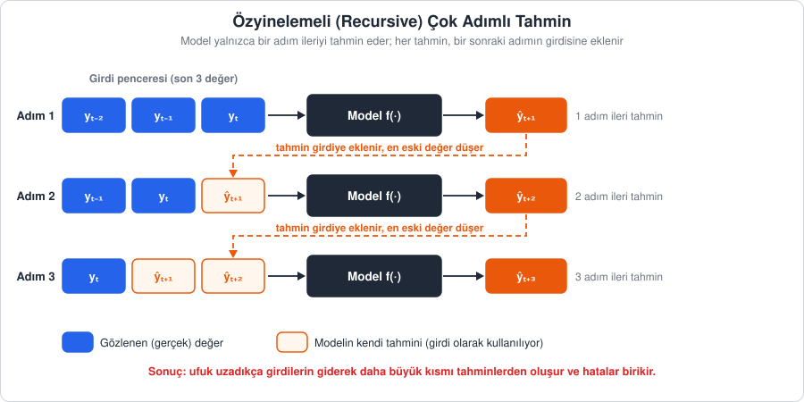

*Şekil 14.1 — Özyinelemeli tahmin. Her adımda model yalnızca bir adım ilerisini tahmin eder (turuncu); bu tahmin bir sonraki adımın girdi penceresine eklenir ve en eski değer pencereden çıkar. Üçüncü adımda girdilerin üçte ikisi artık modelin kendi tahminleridir.*

**Yorum:** Bu yöntemin doğal bir sonucu **hata birikimidir**. 1 adım ileri tahminde bütün girdiler gerçek değerdir. 12 adım ileri tahminde ise girdilerin tamamı ya da çoğu modelin kendi (hatalı olabilecek) tahminleridir; ilk adımlarda yapılan küçük bir hata sonraki adımlara taşınır ve büyüyebilir. Bu yüzden uzun ufuklu tahminlerin hatasını ayrıca incelemek gerekir (14.5).

**Not —** Ağaç tabanlı bir temel öğrenici (ör. `RandomForest`) seçerseniz, Bölüm 13.3'teki ekstrapolasyon sınırlılığı burada da geçerlidir: özyinelemeli tahmin trendi eğitimde görülen düzeyin üzerine taşıyamaz. Forecast sekmesinin trend ayarlaması (`Lag creation` sekmesindeki zaman indeksi özellikleri) bu sorunu doğrusal öğrenicilerde (ör. `LinearRegression`, doğrusal çekirdekli `SMOreg`) kısmen çözer; ağaçlarda ise çözmez.

---

### 14.3. Gelişmiş Ayarlar (Advanced Configuration): Sekme Sekme İnceleme

Şimdi `Advanced configuration` alt sekmesine geçin. Burada altı ayrı sekme göreceksiniz. Aşağıdaki ayarları sırasıyla yapın.

#### 14.3.1. Base Learner (Temel Öğrenici)

Tahmin algoritmasının seçildiği yerdir. Varsayılan `LinearRegression` basit kalabilir. `Choose` düğmesiyle **`functions → SMOreg`** veya **`trees → RandomForest`** seçebilirsiniz. Gradient boosting denemek isterseniz **`meta → AdditiveRegression`** (Bölüm 13.5.4) da seçilebilir. Seçtiğiniz algoritmanın ayarlarını, algoritma adının yazılı olduğu kutuya tıklayarak değiştirebilirsiniz.

#### 14.3.2. Lag Creation (Gecikme Oluşturma)

Modelin geçmişe ne kadar bakacağını belirleyen ayardır.

- **Use custom lag lengths:** İşaretleyin.
- **Minimum lag:** `1` olarak bırakın.
- **Maximum lag:** **`12`** yapın. Mevsimselliği yakalamak için modelin bir yıl geriye bakması gerekir; 12. gecikme "geçen yılın aynı ayı" bilgisini taşır.

#### 14.3.3. Periodic Attributes (Periyodik Özellikler)

Ana ekranda `Periodicity: Monthly` seçtiğimiz için Weka ay ve çeyrek özelliklerini zaten otomatik ekler. Bu sekmede özel tatil günleri gibi ek takvim özellikleri tanımlanabilir; bizim örneğimizde müdahale etmenize gerek yoktur.

#### 14.3.4. Overlay Data (Dış Değişkenler)

Tahmini etkileyebilecek dış değişkenlerin (döviz kuru, akaryakıt fiyatı vb.) tanımlandığı yerdir. Bu değişkenlerin gelecekteki değerlerinin de bilinmesi gerekir. Dış veri kullanmadığımız için burayı boş geçiyoruz.

#### 14.3.5. Evaluation (Değerlendirme)

Modelin başarısının nerede ve nasıl ölçüleceği burada ayarlanır. Bu sekme, sonuçların güvenilirliğini doğrudan belirlediği için en dikkatli ayarlanması gereken sekmedir.

**Sağ taraftaki test seçenekleri:**

- **Evaluate on training (eğitim verisiyle test et):** **İşaretlemeyin.** Bu, soruları önceden gören bir öğrencinin sınava girmesi gibidir. Model eğitim verisini ezberlemiş olabilir (aşırı öğrenme); hata olduğundan çok düşük görünür, ama gerçek gelecekte model başarısız olabilir.
- **Evaluate on held out training (ayrılmış veriyle test et):** **İşaretleyin.** Yanındaki kutuya ya bir gözlem sayısı (ör. **`12`**) ya da bir oran (ör. `0.1`, verinin %10'u) yazılır.
  - **Mantığı:** Weka serinin son kısmını (ör. son 12 ayı) eğitimden çıkarıp saklar, modeli geri kalan veriyle eğitir, sonra saklanan dönemi tahmin ederek gerçek değerlerle karşılaştırır. Gerçekçi başarı testi budur (eğitim/test ayrımının mantığı için bkz. Bölüm 8).

**Sol taraftaki metrik listesi:** Başarının hangi ölçütlerle raporlanacağını buradan seçersiniz. En az şu ikisinin işaretli olduğundan emin olun (tanımları için bkz. Bölüm 8):

- **Mean absolute error (MAE)**
- **Root mean squared error (RMSE)**

İsterseniz ölçekten bağımsız karşılaştırma için **Mean absolute percentage error (MAPE)** da işaretleyebilirsiniz.

#### 14.3.6. Output (Çıktı Ayarları)

`Start` düğmesine bastıktan sonra karşımıza ne çıkacağı burada belirlenir.

**Sol panel (çıktı seçenekleri):**

- **Output predictions at step:** İşaretleyin ve yanındaki adım değerini `1` bırakın. Böylece test için ayırdığımız dönemin 1 adım ileri tahminlerini gerçek değerlerle birlikte sayısal döküm olarak görebiliriz.
- **Output future predictions beyond end of series:** **En önemli ayar budur; işaretleyin.** İşaretlemezseniz veri setinin bittiği tarihten sonraki (1961 yılı) tahminleri göremezsiniz.

**Sağ panel (grafik seçenekleri):**

- **Graph predictions at step:** İşaretleyin (tahmin çizgisini çizer).
- **Graph target at steps:** İşaretleyin (gerçek veri çizgisini çizer). Tahmin ile gerçek çizgilerin ne kadar üst üste bindiğini gözle görmek ve karşılaştırmak için buna ihtiyacımız var.

---

### 14.4. Sonuçların Okunması

Ayarları yaptıktan sonra `Start` düğmesine basın. Sonuçlar sağ taraftaki `Output` (metin) ve grafik panellerinde görünür.

**1. Grafik yorumu:** Grafiğin sağ tarafına odaklanın.

- **Test bölgesi (1960):** İki çizgi görürsünüz: gerçek değerler ve tahminler. Birbirlerine yakınlıkları modelin başarısını gösterir. Özellikle yaz zirvelerinde tahminin gerçeğin altında kalıp kalmadığına bakın.
- **Gelecek bölgesi (1961):** Verinin bittiği noktadan sağa, boşluğa doğru uzanan tek çizgi, geleceğe dair özyinelemeli tahminimizdir. Bu bölgede karşılaştırılacak gerçek değer yoktur.

**2. Metin paneli yorumu:** Metin panelini kaydırarak şu başlıkları bulun (başlıkların tam yazımı Weka sürümüne göre küçük farklılıklar gösterebilir):

- **`=== Evaluation on test data ===`:** Ayrılmış (held out) veri üzerindeki değerlendirme sonuçlarıdır. 14.3.5'te seçtiğimiz **MAE** ve **RMSE** değerleri burada, her tahmin ufku için ayrı sütunlarda yer alır (ayrıntısı 14.5'te). Bu değerler ne kadar düşükse model o kadar başarılıdır.
- **Future predictions:** 14.3.6'da açtığımız ayar sayesinde burada **1961 yılının aylık yolcu tahminleri** listelenir (ör. Ocak 1961: 450, Şubat 1961: 465 …; sizin değerleriniz seçtiğiniz algoritmaya göre farklı olacaktır). Tahmin edilen değerlerin yanında `*` işareti bulunur; bu işaret o satırın gerçek veri değil tahmin olduğunu gösterir.

---

### 14.5. Adım Adım Hata Analizi (Ufuk Testi)

`=== Evaluation on test data ===` başlığının altındaki tablo, yan yana uzanan geniş bir tablodur ve genellikle gözden kaçar. Oysa modelin güvenilirliğini, yani **kararlılığını** ölçen asıl yer burasıdır: tablo, modelin performansını tahmin ufkuna göre ayrı ayrı raporlar.

**Açıklama:** Bir modelin "gelecek ayı" tahmin etmesiyle "bir yıl sonrasını" tahmin etmesi aynı zorlukta değildir. 14.2.1'de gördüğümüz gibi, 1 adım ileri tahminde bütün girdiler gerçek değerlerdir; 12 adım ileri tahminde ise girdiler modelin kendi tahminlerinden oluşur ve hatalar birikir. Bu nedenle tahmin ufku uzadıkça hatanın artmasını bekleriz.

Tabloyu şöyle okumalısınız:

- **Sütunlar (`1-step-ahead` … `12-steps-ahead`):** Her sütun bir tahmin ufkunu ( $h$ ) gösterir.
  - **`1-step-ahead`:** Modelin 1 ay sonrasını tahmin ederken yaptığı hata.
  - **`12-steps-ahead`:** Modelin 12 ay (1 yıl) sonrasını tahmin ederken yaptığı hata.
- **Satırlar:** İlk satır `N` (14.6), sonraki satırlar 14.3.5'te seçtiğiniz metriklerdir.
  - Örneğin `1-step-ahead` sütununda MAE **31.8** ise, model bir sonraki ayı tahmin ederken ortalama yaklaşık 32 bin yolcu yanılıyor demektir (AirPassengers değerleri bin yolcu cinsindendir).
  - `5-steps-ahead` sütununda MAE **38.8** ise, 5 ay sonrasını tahmin ederken hata payı artmış demektir.

**Yorumlama mantığı:** Normal şartlarda geleceğe ne kadar uzak bakarsak belirsizlik o kadar artar; MAE ve RMSE değerlerinin tabloda sağa doğru büyümesi beklenir.

- Hata değerleri 1. aydan 12. aya doğru **çok hızlı artıyorsa**, model kısa vade için güvenilirdir ama uzun vadeli planlama (ör. gelecek yılın yatırım kararları) için risklidir.
- Hata değerleri **sabit kalıyor veya az artıyorsa**, model kararlı (stabil) ve güvenilir bir yapıdadır.

**Özetle:** Raporlarınızda yalnızca tek bir genel hata değeri vermek yerine bu tabloya dayanarak *"Modelimiz ilk 3 ay için isabetli tahminler yapıyor, ancak 6. aydan sonra hata payı belirgin biçimde artıyor"* şeklinde ufka bağlı, ayrıntılı bir yorum yapabilirsiniz.

---

### 14.6. Tablodaki "N" Değeri ve Veri Sınırı

Tablonun en üstündeki **`N`** satırı, o ufuk için **kaç tahminin gerçek değerle karşılaştırılabildiğini**, yani hatanın kaç gözlem üzerinden hesaplandığını gösterir.

Örnek bir çıktıda `1-step-ahead` için **N = 14** iken `12-steps-ahead` için bu sayının **N = 3**'e düştüğünü görürüz (bu örnekte held out oranı `0.1` seçilmiştir; 144 aylık verinin %10'u yaklaşık 14 aydır). Bu düşüş bir hata değil, test verisinin sonlu olmasının doğal sonucudur.

**Açıklama:** Test için ayrılmış 14 aylık gerçek veri olduğunu düşünün. Weka, tahmine eğitim verisinin sonundan başlar ve test verisi boyunca birer ay ilerleyerek her noktadan yeniden tahmin yapar.

- **Kısa vade (1 ay sonrası):** Hangi noktadan başlarsanız başlayın, bir sonraki ayın gerçek değeri test verisinin içindedir. Böylece 1 adım ileri tahmin 14 kez kontrol edilebilir.
- **Uzun vade (12 ay sonrası):** 12 ay sonrasını test edebilmek için başlangıç noktasının en az 12 ay sonrasında hâlâ gerçek veri bulunmalıdır. Başlangıç noktası test verisinin ortasına ya da sonuna geldiğinde 12 ay sonrası veri setinin dışına, yani bilinmeyen geleceğe taşar; karşılaştırılacak gerçek değer kalmadığı için o noktalarda hata hesaplanamaz.

**Tanım:** Test için ayrılan gözlem sayısı $k$ ve tahmin ufku $h$ olmak üzere, $h$ adım ileri tahmin için hesaplamaya giren gözlem sayısı:

$$N_h = k - h + 1$$

$k = 14$ için: $N_1 = 14$, $N_3 = 12$, $N_6 = 9$, $N_{12} = 3$.

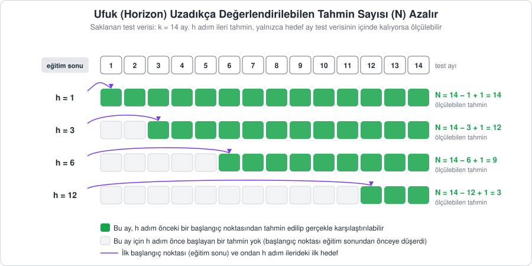

*Şekil 14.2 — Saklanan 14 aylık test verisinde ufuk (h) uzadıkça değerlendirilebilen tahmin sayısı azalır. Yeşil hücreler, h adım önceki bir başlangıç noktasından tahmin edilip gerçek değerle karşılaştırılabilen ayları gösterir; mor ok, eğitim sonundan başlayan ilk h adımlık tahmini temsil eder.*

**Yorum:** `N` ne kadar büyükse, hesaplanan hata ortalaması (MAE, RMSE) o kadar güvenilirdir. `N`'nin çok küçüldüğü uzun ufuklarda (ör. N = 3) ortalama hata yalnızca birkaç denemeye dayanır; bu tek bir şanslı ya da şanssız aydan kolayca etkilenebilir. Tablonun sağ tarafındaki uzun vadeli hata değerlerini yorumlarken bu kısıtı göz önünde bulundurun.

**Not —** Held out alanına `12` yazıp 12 adım ileri tahmin isterseniz $N_{12} = 12 - 12 + 1 = 1$ olur; 12 aylık ufkun hatası tek bir tahmine dayanır. Uzun ufukların hatasını güvenilir biçimde ölçmek istiyorsanız test için ayırdığınız dönemi ufuktan belirgin biçimde uzun tutmalısınız (ör. 12 aylık ufuk için 24 ay). Birden fazla başlangıç noktasıyla sistematik değerlendirme fikrinin daha genel hâli Bölüm 16'da (TimeSeriesSplit) ele alınacaktır.

---

<a id="bolum-15"></a>

## 15. Derin Öğrenme ile Tahmin: LSTM, GRU ve 1D-CNN

Bölüm 12'de yapay zekanın zaman serisine nasıl uygulandığını kavramsal olarak gördük: seriyi kayan bir pencereyle denetimli öğrenme problemine dönüştürmek ve LSTM hücresinin kapılar aracılığıyla "neyi hatırlayıp neyi unutacağına" karar vermesi. Bölüm 13'te aynı dönüşümü ağaç tabanlı XGBoost ile kullandık. Bu bölümde üç derin öğrenme mimarisini AirPassengers verisi üzerinde, Keras ile adım adım uyguluyoruz:

| Mimari | Temel fikir | Seriye nasıl bakar? |
| --- | --- | --- |
| **LSTM** | Kapılı tekrarlayan ağ, ayrı bir uzun süreli hafıza (hücre durumu) taşır | Pencereyi baştan sona adım adım "okur" |
| **GRU** | LSTM'in sadeleştirilmiş hâli, daha az kapı ve parametre | LSTM gibi adım adım okur |
| **1D-CNN** | Evrişimli ağ, kısa desenleri filtrelerle arar | Pencerenin üzerinde küçük bir filtre gezdirir |

Üç modelin adil karşılaştırılabilmesi için hepsi **aynı veri hazırlığını** (15.1) ve Bölüm 7'deki ARIMA uygulamasıyla **aynı test dönemini** (son 60 ay) kullanacak. Bölümün sonunda (15.5) ARIMA, XGBoost, LSTM, GRU ve 1D-CNN'i aynı ölçütle, RMSE ile karşılaştıracağız.

### 15.1. Ortak Veri Hazırlığı

> 💻 **Uygulama dosyası:** [`Codes/python/ch15_derin_ogrenme.py`](Codes/python/ch15_derin_ogrenme.py) · [Notebook](Codes/notebooks/ch15_derin_ogrenme.ipynb) · [](https://colab.research.google.com/github/erkanozhan/AI_Based_Time_Series-Data_Analytics/blob/main/Codes/notebooks/ch15_derin_ogrenme.ipynb)
>
> Bu bölümdeki kodların tamamı bu dosyada. Bilgisayarınızda çalıştırmak için depo kök dizininde `python Codes/python/ch15_derin_ogrenme.py` komutunu kullanın ya da dosyayı VS Code'da açıp hücre hücre çalıştırın. Kurulum yapmadan denemek için Colab bağlantısını kullanabilirsiniz.
>
> Dosya 15.1'den 15.5'e kadar baştan sona çalışacak sırayla düzenlenmiştir. 15.5'teki `rmse_arima` değeri için Bölüm 7.7'deki `auto_arima` modeli dosyada yeniden kurulur; Bölüm 7'nin kodunu ayrıca çalıştırmanız gerekmez.


Bu alt bölümdeki kod, 15.2–15.5'teki bütün modellerin başlangıç noktasıdır. Burada üç şey yapıyoruz: veriyi eğitim ve test olarak ayırmak, ölçeklemek ve kayan pencereyle Keras'ın beklediği üç boyutlu şekle getirmek.

#### 15.1.1. Veri, Eğitim-Test Ayrımı ve Ölçekleme

Sinir ağları, girdiler küçük ve benzer aralıklarda olduğunda daha kararlı öğrenir. Yolcu sayıları 104 ile 622 arasında değişir. Bu büyüklükteki değerler aktivasyon fonksiyonlarını (ör. `tanh`, sigmoid) doygun bölgelerine iter ve gradyanları bozar. Bu yüzden veriyi `MinMaxScaler` ile 0–1 aralığına çekiyoruz:

$$
x'_t = \frac{x_t - x_{\min}}{x_{\max} - x_{\min}}
$$

Burada $x_{\min}$ ve $x_{\max}$ **yalnızca eğitim döneminden** hesaplanır. Ölçekleyiciyi tüm seriyle fit etmek, test dönemindeki en büyük değeri (1960'taki 622) modele önceden "fısıldamak" demektir. Bu, küçük ama gerçek bir veri sızıntısıdır. Konunun çapraz doğrulamadaki karşılığını Bölüm 16'da ayrıntılı ele alacağız.

```python
import numpy as np
import pandas as pd
import matplotlib.pyplot as plt

import tensorflow as tf
from pmdarima.datasets import load_airpassengers
from sklearn.preprocessing import MinMaxScaler
from sklearn.metrics import mean_squared_error

# Tekrarlanabilirlik: ağırlıkların başlangıç değerleri rastgele atanır,
# tohumları sabitleyerek her çalıştırmada benzer sonuçlar alırız.
SEED = 42
np.random.seed(SEED)
tf.random.set_seed(SEED)

# Bölüm 7'deki Python uygulamasıyla aynı veri: 1949-1960 aylık yolcu sayıları (144 gözlem)
data = load_airpassengers(as_series=True)
dates = pd.date_range(start='1949-01-01', periods=len(data), freq='MS')  # grafikler için tarih ekseni

# Ölçekleyici 2 boyutlu dizi bekler: (gözlem sayısı, 1)
dataset = data.values.astype('float32').reshape(-1, 1)

# Bölüm 7'deki ARIMA ile aynı ayrım: son 60 ay (1956-1960) test dönemi
test_horizon = 60
train_size = len(dataset) - test_horizon   # 84 ay eğitim

# Ölçekleyici YALNIZCA eğitim dönemiyle fit edilir; test dönemine sadece dönüşüm uygulanır.
scaler = MinMaxScaler(feature_range=(0, 1))
scaler.fit(dataset[:train_size])
dataset_scaled = scaler.transform(dataset)

print(f"Eğitim: {train_size} ay, Test: {test_horizon} ay")
print(f"Ölçeklenmiş eğitim aralığı: {dataset_scaled[:train_size].min():.2f} - {dataset_scaled[:train_size].max():.2f}")
print(f"Ölçeklenmiş test üst değeri: {dataset_scaled[train_size:].max():.2f}")
```

**Çıktının yorumu:** Eğitim döneminin ölçeklenmiş değerleri tam olarak 0–1 aralığındadır. Test döneminin üst değeri ise 1'in belirgin biçimde üzerindedir (yaklaşık 2). Bu bir hata değildir: model, eğitimde hiç görmediği büyüklükte değerleri tahmin etmek zorundadır. Gerçek hayattaki tahmin problemi de tam olarak budur.

> **Not —** Güçlü trend içeren serilerde sinir ağları eğitim aralığının dışına **ekstrapolasyon** yapmakta zorlanır ve tahminler sistematik olarak düşük kalabilir. Bunu hafifletmek için seriye önce log dönüşümü ve/veya fark alma (Bölüm 2.1 ve Bölüm 3.2) uygulanıp model farklar üzerinde eğitilebilir. Bu bölümde kodu sade tutmak için ham seriyle çalışıyoruz.

#### 15.1.2. Kayan Pencere: Seriden Girdi-Hedef Çiftlerine

Bölüm 12'de gördüğümüz gibi, zaman serisini denetimli öğrenmeye çevirmenin yolu **kayan penceredir (sliding window)**: Son `look_back` gözlem girdi, hemen sonraki gözlem hedef olur. `look_back = 3` için:

| Girdi (X) | Hedef (y) |
| --- | --- |
| $`x_1, x_2, x_3`$ | $`x_4`$ |
| $`x_2, x_3, x_4`$ | $`x_5`$ |
| $`x_3, x_4, x_5`$ | $`x_6`$ |

Aylık ve 12 aylık mevsimselliği olan bir seride `look_back = 12` iyi bir başlangıçtır: Model her tahminde tam bir yıllık döngüyü görür. Çok küçük pencere yeterli bağlam vermez; çok büyük pencere ise örnek sayısını azaltır ve aşırı öğrenme riskini artırır.

```python
def create_dataset(series, look_back=1):
    """
    Kayan pencere: her örnekte look_back geçmiş değer girdi,
    hemen sonraki değer hedef olur.

    series   : ölçeklenmiş seri, boyut (n, 1)
    Döndürür : X boyutu (n - look_back, look_back), y boyutu (n - look_back,)
    """
    X, y = [], []
    for i in range(len(series) - look_back):
        X.append(series[i:(i + look_back), 0])   # girdi penceresi
        y.append(series[i + look_back, 0])       # pencerenin hemen sonraki değeri
    return np.array(X), np.array(y)

look_back = 12
X_all, y_all = create_dataset(dataset_scaled, look_back)   # (132, 12) ve (132,)

# i. örneğin hedefi serinin (i + look_back). gözlemidir.
# Hedefi test dönemine (son 60 ay) düşen örnekler test kümesine gider.
split = train_size - look_back   # 84 - 12 = 72
trainX, trainY = X_all[:split], y_all[:split]
testX, testY = X_all[split:], y_all[split:]

# Keras'ın tekrarlayan ve evrişimli katmanları 3 boyutlu girdi bekler:
# [örnek sayısı, zaman adımı sayısı, özellik sayısı]
trainX = trainX.reshape(trainX.shape[0], look_back, 1)
testX = testX.reshape(testX.shape[0], look_back, 1)
print("trainX:", trainX.shape, " testX:", testX.shape)   # (72, 12, 1)  (60, 12, 1)

# Karşılaştırmalarda kullanacağımız gerçek test değerleri (orijinal ölçek) ve tarihleri
testY_inv = scaler.inverse_transform(testY.reshape(-1, 1)).ravel()
test_dates = dates[train_size:]
```

**Açıklama:** İlk test örneğinin girdisi, eğitim döneminin son 12 ayıdır (1955). Bu bir sızıntı değildir; çünkü 1956 Ocak'ı tahmin ederken 1955'in değerlerini bilmek gerçekçidir. Her test tahmininde model, bir önceki ayların **gerçek** değerlerini görür. Buna **tek adımlı (one-step-ahead) tahmin** denir. 15.5'teki karşılaştırmada bu ayrıntı önemli olacak.

Eski sürümlerde sık görülen `range(len(dataset) - look_back - 1)` döngüsü gereksiz yere son gözlemi kaybettiriyordu. Yukarıdaki fonksiyon tüm gözlemleri kullanır.

#### 15.1.3. Girdi Tensörünün Şekli

Keras'ta `LSTM`, `GRU` ve `Conv1D` katmanları girdiyi üç boyutlu bir **tensör** olarak ister:

- **Örnek (sample):** Kaç pencere var? Bizde eğitimde 72, testte 60.
- **Zaman adımı (time step):** Her pencerede kaç ardışık gözlem var? Bizde `look_back = 12`.
- **Özellik (feature):** Her zaman adımında kaç değişken ölçülüyor? Tek değişkenli seride 1. Yolcu sayısının yanına yakıt fiyatı ve tatil bilgisi eklenseydi 3 olurdu.

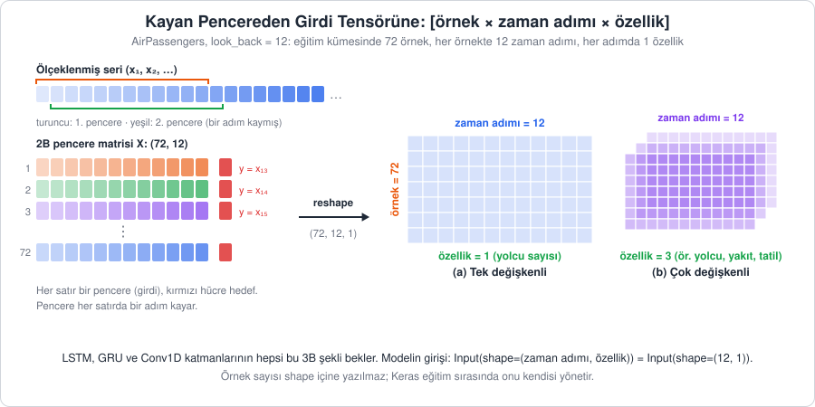

*Şekil 15.1 — Kayan pencereyle oluşturulan 2B matris (72 × 12), `reshape` ile [örnek × zaman adımı × özellik] biçiminde 3B tensöre dönüşür. Katmana verilen `input_shape=(12, 1)` yalnızca son iki boyutu içerir.*

### 15.2. LSTM ile Tahmin

LSTM'in iç yapısını Bölüm 12'de kavramsal olarak gördük. Kısaca hatırlarsak: Hücre, uzun süreli bilgiyi taşıyan bir **hücre durumu** $C_t$ ve her adımda dışarıya verilen bir **gizli durum** $h_t$ tutar. Üç kapı bu iki durum arasındaki bilgi akışını denetler. Bir zaman adımındaki hesaplama şöyledir:

```math
\begin{aligned}
f_t &= \sigma\left(W_f x_t + U_f h_{t-1} + b_f\right) &&\text{(unutma kapısı)}\\
i_t &= \sigma\left(W_i x_t + U_i h_{t-1} + b_i\right) &&\text{(giriş kapısı)}\\
o_t &= \sigma\left(W_o x_t + U_o h_{t-1} + b_o\right) &&\text{(çıkış kapısı)}\\
\tilde{C}_t &= \tanh\left(W_c x_t + U_c h_{t-1} + b_c\right) &&\text{(aday hafıza)}\\
C_t &= f_t \odot C_{t-1} + i_t \odot \tilde{C}_t &&\text{(hafıza güncellemesi)}\\
h_t &= o_t \odot \tanh\left(C_t\right) &&\text{(çıktı)}
\end{aligned}
```

> **Simge notu:** $`\sigma`$ *(sigma)*: sigmoid fonksiyonu, çıktısı 0 ile 1 arasındadır ve kapının "ne kadar açık" olduğunu belirtir · $`\tanh`$ *(tanjant hiperbolik)*: çıktısı −1 ile 1 arasında olan aktivasyon · $`\odot`$ *(Hadamard çarpımı)*: iki vektörün eleman eleman çarpımı · $`W, U`$: öğrenilen ağırlık matrisleri (girdiye ve önceki gizli duruma) · $`b`$: öğrenilen yanlılık (bias) vektörü · $`\tilde{C}_t`$ *(C tilda t)*: hafızaya eklenmeye aday yeni bilgi

**Açıklama:** $C_t$ denklemi LSTM'in kalbidir. Unutma kapısı $f_t$ sıfıra yakınsa eski hafıza silinir, bire yakınsa korunur. Giriş kapısı $i_t$ yeni bilginin ne kadarının yazılacağını belirler. Hafıza **toplama** ile güncellendiği için gradyan uzun diziler boyunca kolayca sönmez. Bölüm 12'de sözünü ettiğimiz kaybolan gradyan sorununa LSTM'in çözümü budur.

Modelimiz tek bir LSTM katmanı (50 birim) ve tek nöronlu bir çıktı katmanından (`Dense(1)`) oluşuyor.

```python
# 15.1'de hazırlanan trainX, trainY, testX, testY, scaler, dates, test_dates,
# testY_inv ve look_back değişkenlerini kullanır.
from tensorflow.keras.models import Sequential
from tensorflow.keras.layers import LSTM, Dense

model_lstm = Sequential()
# 50: katmandaki hafıza birimi (gizli durum boyutu) sayısı.
# input_shape: (zaman adımı sayısı, özellik sayısı) = (12, 1)
model_lstm.add(LSTM(50, input_shape=(look_back, 1)))
# Tek nöronlu çıktı katmanı: bir sonraki ayın (ölçeklenmiş) değeri
model_lstm.add(Dense(1))

# Kayıp fonksiyonu: ortalama kare hata; optimizasyon: Adam
model_lstm.compile(loss='mean_squared_error', optimizer='adam')
model_lstm.summary()

# epochs: eğitim verisinin model üzerinden kaç kez geçirileceği
# batch_size=1: her örnekten sonra ağırlıklar güncellenir (küçük veri için uygun, ama yavaş)
# verbose=2: her epoch için tek satır bilgi
model_lstm.fit(trainX, trainY, epochs=100, batch_size=1, verbose=2)

# Tahminler ve orijinal ölçeğe geri dönüş
train_predict = scaler.inverse_transform(model_lstm.predict(trainX))
test_predict = scaler.inverse_transform(model_lstm.predict(testX))

rmse_lstm = np.sqrt(mean_squared_error(testY_inv, test_predict[:, 0]))
print(f'LSTM Modeli RMSE Değeri: {rmse_lstm:.2f}')

# Görselleştirme: eğitim tahminlerinin hedefleri look_back. aydan başlar
plt.figure(figsize=(15, 7))
plt.plot(dates, dataset[:, 0], label='Orijinal Veri')
plt.plot(dates[look_back:train_size], train_predict[:, 0], label='Eğitim Tahminleri (LSTM)')
plt.plot(test_dates, test_predict[:, 0], label='Test Tahminleri (LSTM)', color='orange')
plt.axvline(test_dates[0], color='gray', linestyle=':', label='Test başlangıcı')
plt.title('LSTM Modeli ile Yolcu Sayısı Tahmini')
plt.xlabel('Tarih')
plt.ylabel('Yolcu Sayısı')
plt.legend()
plt.show()
```

**Çıktının yorumu:**

- `model_lstm.summary()` LSTM katmanı için 10.400 parametre gösterir. Dört ağırlık seti ($f, i, o, \tilde{C}$) vardır ve her biri $50 \times (1 + 50) + 50 = 2600$ parametre içerir. Buna `Dense` katmanının 51 parametresi eklenir.
- Eğitim tahminleri gerçek seriyi yakından izliyorsa ama test tahminleri özellikle 1959–1960 tepelerinde gerçek değerlerin altında kalıyorsa bu, 15.1.1'deki ekstrapolasyon sorununun işaretidir.
- `rmse_lstm` yolcu sayısıyla aynı birimdedir (bin yolcu). 15.5'te diğer modellerle bu değer üzerinden karşılaştıracağız.

### 15.3. GRU: Zaman Bağımlılıklarını Daha Sade Bir Yapıyla Öğrenmek

LSTM güçlüdür ama biraz ağırdır: iki ayrı durum vektörü, üç kapı ve dört ağırlık seti taşır. **GRU (Gated Recurrent Unit)** aynı fikri daha sade bir yapıyla uygular. Ayrı bir hücre durumu yoktur; hafıza doğrudan gizli durum $h_t$ üzerinde tutulur ve iki kapı yeterlidir:

- **Güncelleme kapısı (update gate)** $z_t$: Ne kadar yeni bilgi alınacağını ve eski bilginin ne kadarının korunacağını tek bir düğmeyle ayarlar. LSTM'deki unutma ve giriş kapılarının birleşmiş hâli gibidir.
- **Sıfırlama kapısı (reset gate)** $r_t$: Aday bilgi hesaplanırken geçmiş bilginin ne ölçüde devre dışı bırakılacağını belirler.

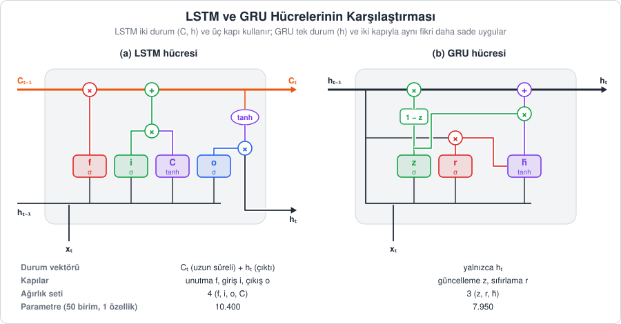

*Şekil 15.2 — LSTM hücresinde turuncu hücre durumu bandı $`C_t`$ ve üç kapı (f, i, o) vardır. GRU'da tek bir durum $`h_t`$ vardır; güncelleme kapısı z eski durumla aday durumu $`(1-z)`$ ve $`z`$ oranlarında karıştırır, sıfırlama kapısı r ise adayın hesaplanmasında geçmişin etkisini ayarlar.*

GRU'nun bir zaman adımındaki hesaplaması:

```math
\begin{aligned}
z_t &= \sigma\left(W_z x_t + U_z h_{t-1} + b_z\right) &&\text{(güncelleme kapısı)}\\
r_t &= \sigma\left(W_r x_t + U_r h_{t-1} + b_r\right) &&\text{(sıfırlama kapısı)}\\
\tilde{h}_t &= \tanh\left(W_h x_t + U_h \left(r_t \odot h_{t-1}\right) + b_h\right) &&\text{(aday durum)}\\
h_t &= \left(1 - z_t\right) \odot h_{t-1} + z_t \odot \tilde{h}_t &&\text{(yeni durum)}
\end{aligned}
```

> **Simge notu:** $`z_t`$: güncelleme kapısının çıktısı (0–1 arası) · $`r_t`$: sıfırlama kapısının çıktısı (0–1 arası) · $`\tilde{h}_t`$ *(h tilda t)*: aday gizli durum

**Açıklama:** Son denklem bir **ağırlıklı ortalamadır**. $z_t$ sıfıra yakınsa model eski durumu olduğu gibi korur, yani "bu ay önemli bir şey olmadı" der. Bire yakınsa durumu büyük ölçüde yeni adayla değiştirir. $r_t$ sıfıra yakınsa aday durum geçmişi neredeyse yok sayar ve yalnızca yeni girdiye bakar. Bu, serideki ani bir kırılmadan sonra "baştan başlamak" için kullanışlıdır.

> **Not —** Kaynaklarda son denklemde $`z_t`$ ile $`1-z_t`$ bazen yer değiştirmiş olarak yazılır (Keras'ın uygulaması $`h_t = z_t \odot h_{t-1} + (1-z_t) \odot \tilde{h}_t`$ biçimindedir). Bu yalnızca kapının neyi "açık" saydığıyla ilgili bir gösterim farkıdır; model aynı şeyi öğrenir.

Böylece GRU, LSTM'e göre:

- daha az parametre kullanır (üç ağırlık seti),
- daha hızlı eğitilir,
- küçük veri kümelerinde ezberlemeye biraz daha az eğilim gösterebilir.

Zaman serisi söz konusu olduğunda GRU da tıpkı LSTM gibi belirli sayıda önceki adımı (son 12 ay) girdi olarak alır ve bir sonraki adımı tahmin etmeye çalışır. Aşağıdaki kodda LSTM'le **birebir aynı** veri hazırlığını, aynı `look_back = 12` değerini ve aynı eğitim ayarlarını kullanıyoruz. Böylece iki model arasındaki fark yalnızca hücre yapısından kaynaklanır:

1. 15.1'de 0–1 aralığına ölçeklenmiş ve pencerelenmiş veriyi alıyoruz.
2. Son 12 gözleme bakarak bir sonraki ayı tahmin eden GRU modelini kurup eğitiyoruz.
3. Test verisi üzerinde RMSE hesaplıyoruz.

```python
# 15.1'de hazırlanan trainX, trainY, testX, testY, scaler, dates, test_dates,
# testY_inv ve look_back değişkenlerini kullanır.
from tensorflow.keras.models import Sequential
from tensorflow.keras.layers import GRU, Dense

# Aynı başlangıç koşulları için tohumu yeniden sabitliyoruz
tf.random.set_seed(SEED)

model_gru = Sequential()
# 50 birimli GRU katmanı; girdi şekli LSTM'dekiyle aynı: (12 zaman adımı, 1 özellik)
model_gru.add(GRU(50, input_shape=(look_back, 1)))
model_gru.add(Dense(1))

model_gru.compile(loss='mean_squared_error', optimizer='adam')
model_gru.summary()   # GRU katmanı: 7.950 parametre (LSTM'de 10.400)

# LSTM ile aynı eğitim ayarları: adil karşılaştırma için
model_gru.fit(trainX, trainY, epochs=100, batch_size=1, verbose=2)

# Tahminler ve orijinal ölçeğe dönüş
train_predict_gru = scaler.inverse_transform(model_gru.predict(trainX))
test_predict_gru = scaler.inverse_transform(model_gru.predict(testX))

rmse_gru = np.sqrt(mean_squared_error(testY_inv, test_predict_gru[:, 0]))
print(f'GRU Modeli RMSE Değeri: {rmse_gru:.2f}')

# Görselleştirme
plt.figure(figsize=(15, 7))
plt.plot(dates, dataset[:, 0], label='Orijinal Veri')
plt.plot(dates[look_back:train_size], train_predict_gru[:, 0], label='Eğitim Tahminleri (GRU)')
plt.plot(test_dates, test_predict_gru[:, 0], label='Test Tahminleri (GRU)', color='green')
plt.axvline(test_dates[0], color='gray', linestyle=':', label='Test başlangıcı')
plt.title('GRU Modeli ile Yolcu Sayısı Tahmini')
plt.xlabel('Tarih')
plt.ylabel('Yolcu Sayısı')
plt.legend()
plt.show()
```

**Çıktının yorumu:** Keras'ın varsayılan GRU uygulaması (`reset_after=True`) her ağırlık seti için iki yanlılık vektörü tutar. Bu yüzden parametre sayısı $3 \times [50 \times (1 + 50) + 2 \times 50] = 7950$ olur. LSTM'e göre yaklaşık %24 daha az parametreyle benzer bir RMSE elde ediliyorsa, bu küçük veri setinde sade modelin yeterli olduğunu gösterir. İki modelin RMSE'si arasındaki birkaç birimlik fark, farklı tohumlarla çalıştırıldığında yön değiştirebilir. Bu yüzden tek bir çalıştırmadan kesin sonuç çıkarmayın; güvenilir karşılaştırma için Bölüm 16'daki zaman serisi çapraz doğrulamasına bakın.

### 15.4. 1D-CNN: Desen Tabanlı Yaklaşım

Şimdiye kadar zaman serilerine iki temel felsefeyle yaklaştık: geçmişi hatırlamak (LSTM, GRU) ve kurallar oluşturmak (XGBoost, Prophet). Yapay zeka literatüründe, genellikle görüntü işlemeyle özdeşleşmiş olsa da zaman serilerinde de başarılı sonuçlar veren bir yöntem daha vardır: **1D-CNN (bir boyutlu evrişimli sinir ağı)**.

CNN'leri çoğunlukla "bu resimde kedi var mı?" sorusuyla duyarız. Orada ağ, resmin üzerinde küçük pencereler gezdirerek kenarları ve köşeleri öğrenir. Zaman serisinde mantık aynıdır; yalnızca pencere iki boyutlu bir resim yerine tek boyutlu bir dizi üzerinde kayar. Filtreler, verinin içindeki yükseliş eğilimini, ani düşüşü veya tepe noktasını birer **desen** olarak tanımayı öğrenir.

LSTM veriyi bir hikâye gibi baştan sona okuyup aklında tutmaya çalışır; CNN ise veriye desen taraması gibi yaklaşır. "Geçen ay ne oldu?" sorusundan çok "Son üç aydaki hareketin şekli neye benziyor?" sorusuna odaklanır. Bu özellik gürültüyü süzmede ve kısa vadeli desenleri yakalamada etkilidir. Ayrıca hesaplamalar paralel yapılabildiği için LSTM'e göre daha hızlı eğitilir.

#### 15.4.1. Evrişim, Filtre, `kernel_size` ve Havuzlama

**Tanım (1D evrişim):** Uzunluğu $K$ olan bir filtrenin ağırlıkları $w_0, \dots, w_{K-1}$ ve yanlılığı $b$ olsun. Filtrenin $t$ konumundaki çıktısı:

$$
y_t = g\left(\sum_{k=0}^{K-1} w_k x_{t+k} + b\right)
$$

> **Simge notu:** $`\sum`$ *(sigma, toplam)*: $`k=0`$'dan $`K-1`$'e kadar terimlerin toplamı · $`K`$: filtre uzunluğu (Keras'ta `kernel_size`) · $`w_k`$: filtrenin öğrenilen ağırlıkları · $`g`$: aktivasyon fonksiyonu (burada ReLU, $`g(u) = \max(0, u)`$)

**Açıklama:** Filtre, serinin üzerinde birer adım kayarak (`strides=1`) her konumda ardışık $K$ değerin ağırlıklı toplamını hesaplar. Aynı ağırlıklar serinin her yerinde kullanılır (**ağırlık paylaşımı**). Bu yüzden "Şubat–Mart yükselişi" deseni hangi yılda görülürse görülsün aynı filtre tarafından yakalanır. Şekil 15.3'te ağırlıkları $[-1, 0, +1]$ olan elle seçilmiş bir filtre, $y_t = x_{t+2} - x_t$ farkını hesaplar ve üç aylık yükselişleri pozitif değerlerle işaretler. Gerçek modelde bu ağırlıklar eğitim sırasında öğrenilir.

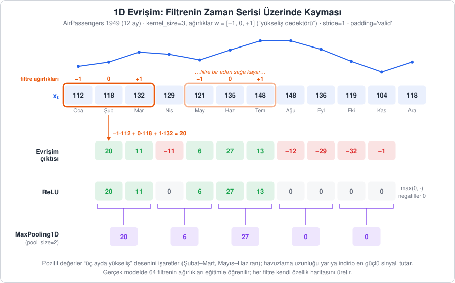

*Şekil 15.3 — Üç elemanlı bir filtre 1949 yılının 12 ayı üzerinde kayar. Her konumda bir çıktı üretilir, ReLU negatifleri sıfırlar, `MaxPooling1D(pool_size=2)` ise uzunluğu yarıya indirerek her çiftteki en güçlü sinyali tutar.*

Keras'taki `Conv1D` ve ilgili katmanların parametreleri:

| Parametre / katman | Anlamı | Bizim modelde |
| --- | --- | --- |
| `filters` | Kaç farklı desen aranacağı; her filtre ayrı bir özellik haritası üretir | 64, sonra 128 |
| `kernel_size` | Filtrenin aynı anda kaç zaman adımına baktığı | 3 (üç ay) |
| `padding` | `'valid'`: kenar eklenmez, çıktı $`n-K+1`$ uzunluğundadır; `'same'`: kenarlara sıfır eklenir, çıktı uzunluğu girdiyle aynı kalır | `'same'` |
| `MaxPooling1D(pool_size=2)` | Ardışık iki değerin en büyüğünü alır: uzunluk yarıya iner, küçük kaymalara karşı dayanıklılık artar | 12 → 6 → 3 |
| `Flatten` + `Dense` | Özellik haritalarını tek vektöre açıp tahmine dönüştürür | 384 → 50 → 1 |

Birden fazla evrişim katmanı üst üste konduğunda ikinci katmandaki bir filtre, ilk katmanın desenlerinin birleşimine bakar. Havuzlamayla birlikte her katman serinin daha uzun bir bölümünü "görür". Buna filtrenin **alıcı alanı (receptive field)** denir.

#### 15.4.2. 1D-CNN Uygulaması

Aşağıdaki kod 15.1'deki ortak veriyi kullanır. Evrişimli model daha fazla parametre taşıdığı için aşırı öğrenmeyi izlemek amacıyla eğitim kümesinin son 12 ayını **doğrulama (validation)** kümesi olarak ayırıyor ve **erken durdurma (early stopping)** uyguluyoruz.

Tam program (yaklaşık 230 satır) uygulama dosyasındadır; aşağıda kilit satırlar yer alıyor. Dosyada katmanlar tek tek, açıklamalı olarak alt alta yazılmıştır.

```python
# 1D-CNN — kilit satırlar (tam kod: Codes/python/ch15_derin_ogrenme.py)
val_size = 12
X_train, y_train = trainX[:-val_size], trainY[:-val_size]   # eğitim
X_val, y_val = trainX[-val_size:], trainY[-val_size:]       # doğrulama (erken durdurma)
X_test, y_test = testX, testY

def build_cnn_model(look_back, filters=64, kernel_size=3, dropout_rate=0.2):
    model = Sequential([
        Conv1D(filters=filters, kernel_size=kernel_size, activation='relu',
               padding='same', input_shape=(look_back, 1)),                        # (12, 64)
        BatchNormalization(), MaxPooling1D(pool_size=2), Dropout(dropout_rate),   # (6, 64)
        Conv1D(filters=filters * 2, kernel_size=kernel_size, activation='relu',
               padding='same'),                                                   # (6, 128)
        BatchNormalization(), MaxPooling1D(pool_size=2), Dropout(dropout_rate),   # (3, 128)
        Flatten(), Dense(50, activation='relu'), Dropout(dropout_rate),           # 384 -> 50
        Dense(1)                                                                  # regresyon çıktısı
    ])
    model.compile(optimizer=Adam(learning_rate=0.001), loss='mse', metrics=['mae'])
    return model

model_cnn = build_cnn_model(look_back, filters=64, kernel_size=3, dropout_rate=0.2)
early_stop = EarlyStopping(monitor='val_loss', patience=20, restore_best_weights=True, verbose=1)
history = model_cnn.fit(X_train, y_train, epochs=300, batch_size=16,
                        validation_data=(X_val, y_val), callbacks=[early_stop], verbose=1)

test_pred_inv = scaler.inverse_transform(model_cnn.predict(X_test, verbose=0))
y_test_inv = scaler.inverse_transform(y_test.reshape(-1, 1))
rmse_cnn = np.sqrt(mean_squared_error(y_test_inv, test_pred_inv))   # 15.5'te kullanılır
```

Program sırasıyla şu adımları izler:

1. **Ayrım:** 15.1'deki 72 eğitim penceresinin son 12'si doğrulama kümesi olur; test kümesi 60 örnektir.
2. **Mimari:** İki evrişim bloğu (`Conv1D` → `BatchNormalization` → `MaxPooling1D` → `Dropout`), ardından `Flatten` ve iki `Dense` katmanı. `padding='same'` ile uzunluk evrişimde korunur, havuzlamada 12 → 6 → 3 olur.
3. **Eğitim:** En fazla 300 epoch, `batch_size=16`; doğrulama kaybı 20 epoch iyileşmezse erken durdurma devreye girer ve en iyi ağırlıklar geri yüklenir. Kayıp ve MAE öğrenme eğrileri çizilir.
4. **Değerlendirme:** Tahminler `inverse_transform` ile orijinal ölçeğe döndürülür; eğitim, doğrulama ve test için RMSE, MAE ve MAPE yazdırılır. Test RMSE'si `rmse_cnn` olarak saklanır.
5. **Görselleştirme:** Gerçek seri üzerinde eğitim, doğrulama ve test tahminleri çizilir.
6. **Hata analizi:** Test hatalarının histogramı, zaman içindeki seyri ve gerçek–tahmin saçılım grafiği çizilir; hataların ortalaması ve standart sapması yazdırılır.
7. **Hiperparametre karşılaştırması (isteğe bağlı):** Üç farklı `filters` / `kernel_size` / `dropout_rate` yapılandırması denenir; en iyisi **doğrulama** RMSE'sine göre seçilir.

Tam kod: [`Codes/python/ch15_derin_ogrenme.py`](Codes/python/ch15_derin_ogrenme.py) · [Notebook](Codes/notebooks/ch15_derin_ogrenme.ipynb)

**Çıktının yorumu:**

- **Öğrenme eğrileri:** Erken durdurma devreye girdiğinde doğrulama kaybının en düşük olduğu epoch'un ağırlıkları geri yüklenir. Doğrulama kaybı eğitim kaybından çok yüksekse model ezberliyordur; dropout oranını artırmak ya da filtre sayısını azaltmak denenebilir.
- **Eğitim, doğrulama ve test RMSE:** Eğitimden teste doğru hatanın artması normaldir. Test RMSE'nin eğitimin birkaç katı olması ise hem aşırı öğrenmeye hem de 15.1.1'deki ekstrapolasyon sorununa işaret eder.
- **Hata analizi:** Hataların ortalaması belirgin biçimde pozitifse (gerçek > tahmin) model sistematik olarak düşük tahmin yapıyordur. Hataların zamanla büyümesi, trendin model tarafından tam yakalanamadığını gösterir.

1D-CNN'in zaman serilerindeki **güçlü yanları:**

- Yerel desenleri (trend değişimleri, ani sıçramalar, kısa mevsimsel şekiller) iyi yakalar.
- Hesaplamalar paralel yapılabildiği için tekrarlayan ağlardan daha hızlı eğitilir.
- Az parametreyle etkili sonuç verebilir.

**Zayıf yanları:**

- Çok uzun vadeli bağımlılıkları yakalamakta zorlanabilir; alıcı alanı sınırlıdır.
- Sıralı yapıyı doğrudan modellemez; iki desenin hangi sırayla geldiği bilgisi havuzlamayla kısmen kaybolur.
- Mevsimsellik için ek özellik mühendisliği gerekebilir.

**İyileştirme önerileri:** Daha fazla Conv1D katmanı kullanmak, alıcı alanı genişletmek için **genişletilmiş evrişim (dilated convolution)** uygulamak, CNN + LSTM hibrit modeller kurmak ve mevsimsel farkı alınmış veriyle çalışmak.

#### 15.4.3. 1D-CNN ile Tekrarlayan Ağların Karşılaştırması

**Odak farkı:** LSTM ve GRU zaman içindeki bağımlılığı modeller; "Ocak ayındaki olay Kasım ayını nasıl etkiledi?" sorusuna cevap arar. 1D-CNN ise yerel yapıları modeller; "her krizden sonra bir U dönüşü oluyor" gibi şekilsel çıkarımlar yapar.

**Hız:** AirPassengers küçük bir veri olduğu için farkı hissetmezsiniz. Ancak milyonlarca satırlık veride LSTM'in eğitimi günler sürebilirken CNN aynı işi saatler içinde tamamlayabilir. CNN'de her konumdaki evrişim birbirinden bağımsızdır ve paralel hesaplanır; LSTM ise $h_t$'yi hesaplamak için $h_{t-1}$'i beklemek, yani sıralı gitmek zorundadır.

**Karma kullanım:** Modern araştırmalarda **CNN-LSTM hibrit** modelleri sıkça görülür. Önce CNN ile verideki önemli desenler çıkarılır, sonra bu özellikler LSTM'e verilerek zamansal ilişki kurulur.

### 15.5. Model Karşılaştırması

Artık çantamızda beş farklı yaklaşım var:

| Model | Yaklaşım | Bölüm | Tahmin biçimi (bu karşılaştırmada) |
| --- | --- | --- | --- |
| ARIMA / SARIMA | İstatistiksel, doğrusal | Bölüm 7 | 60 ay ileriye **çok adımlı** tahmin |
| XGBoost | Ağaç tabanlı, gecikme özellikleri | Bölüm 13 | Tek adımlı |
| LSTM | Tekrarlayan sinir ağı | 15.2 | Tek adımlı |
| GRU | Sade tekrarlayan sinir ağı | 15.3 | Tek adımlı |
| 1D-CNN | Evrişimli, desen tabanlı | 15.4 | Tek adımlı |

Karşılaştırmanın adil olması için hepsini **aynı test döneminde** (1956–1960, son 60 ay) ve aynı ölçütle (RMSE, bkz. Bölüm 8) değerlendiriyoruz:

- `rmse_arima`, Bölüm 7'deki Python uygulamasında (`auto_arima` ile `train_data = data[:-60]`, `test_data = data[-60:]`) hesaplanan değişkendir. Bu kodu çalıştırmadan önce Bölüm 7'deki Python kodunun aynı oturumda çalıştırılmış olması gerekir.
- `rmse_lstm`, `rmse_gru` ve `rmse_cnn` bu bölümün 15.2–15.4 kodlarından gelir.
- Bölüm 13'teki XGBoost uygulaması farklı bir test dönemi (son 12 ay) kullandığı için RMSE'si doğrudan karşılaştırılamaz. Aşağıda XGBoost'u aynı 60 aylık test dönemi için, 12 gecikme ve ay bilgisiyle yeniden eğitiyoruz.

```python
# Gerekli değişkenler:
#   rmse_arima                     -> Bölüm 7'deki Python uygulaması (ARIMA, son 60 ay test)
#   rmse_lstm, rmse_gru, rmse_cnn  -> bu bölümün 15.2, 15.3 ve 15.4 kodları
#   dataset, dates, test_dates, look_back, SEED -> 15.1
import xgboost as xgb

# ---- XGBoost (Bölüm 13) aynı test dönemi için: 12 gecikme + ay bilgisi
s = pd.Series(dataset[:, 0], index=dates)
feat = pd.DataFrame({'y': s})
for lag in range(1, look_back + 1):
    feat[f'lag_{lag}'] = s.shift(lag)     # yalnızca geçmiş değerler: sızıntı yok
feat['month'] = feat.index.month
feat = feat.dropna()                      # ilk 12 ayın gecikmeleri eksik

train_f = feat[feat.index < test_dates[0]]
test_f = feat[feat.index >= test_dates[0]]   # 60 ay

model_xgb = xgb.XGBRegressor(n_estimators=500, learning_rate=0.05, max_depth=4,
                             subsample=0.8, colsample_bytree=0.8, random_state=SEED)
model_xgb.fit(train_f.drop(columns='y'), train_f['y'])
pred_xgb = model_xgb.predict(test_f.drop(columns='y'))
rmse_xgb = np.sqrt(mean_squared_error(test_f['y'], pred_xgb))

# ---- Karşılaştırma tablosu
results_df = pd.DataFrame({
    'Model': ['ARIMA (Bölüm 7)', 'XGBoost (Bölüm 13)', 'LSTM', 'GRU', '1D-CNN'],
    'RMSE': [rmse_arima, rmse_xgb, rmse_lstm, rmse_gru, rmse_cnn],
}).sort_values('RMSE').reset_index(drop=True)
print(results_df.to_string(index=False, float_format='%.2f'))

# ---- Görsel karşılaştırma
plt.figure(figsize=(9, 4))
plt.barh(results_df['Model'], results_df['RMSE'], color='steelblue')
plt.gca().invert_yaxis()                  # en iyi model en üstte
plt.xlabel('Test RMSE (bin yolcu, düşük = iyi)')
plt.title('Son 60 Ay (1956-1960) için Model Karşılaştırması')
plt.grid(True, axis='x', alpha=0.3)
plt.tight_layout()
plt.show()
```

**Sonuçların yorumu:** Tablo en düşük RMSE'den en yükseğe doğru sıralanır. Sonuçlar tohum ve kütüphane sürümüne göre değişse de bu veri setinde tipik olarak şu tablo ortaya çıkar:

- **ARIMA (SARIMA)** genellikle çok rekabetçidir. Trend ve 12 aylık mevsimselliği açıkça modellediği için eğitim aralığının dışına da doğal biçimde uzanır.
- **XGBoost** bu testte zorlanabilir: Karar ağaçları eğitimde gördükleri en büyük değerin üzerinde tahmin üretemez (ekstrapolasyon sorunu, bkz. Bölüm 13). 1956–1960'taki rekor yolcu sayıları eğitim aralığının dışında kalır.
- **LSTM, GRU ve 1D-CNN** kısa vadeli desenleri iyi yakalar. Ancak 72 eğitim örneği derin öğrenme için çok küçüktür ve 15.1.1'de gördüğümüz ekstrapolasyon sorunu tepe noktalarında düşük tahmine yol açabilir.

> **Not —** Bu karşılaştırma tamamen simetrik değildir. Bölüm 7'deki ARIMA, test dönemini tek seferde, **60 ay ileriye** tahmin eder (çok adımlı tahmin). Diğer modeller ise her ay için bir önceki ayların **gerçek** değerlerini görür (tek adımlı tahmin), yani daha kolay bir görev çözer. ARIMA buna rağmen iyi sonuç veriyorsa bu, onun lehine güçlü bir kanıttır. Tamamen eşit koşullar için ya ARIMA da her ay yeni gözlemle güncellenerek tek adımlı tahmin yaptırılmalı ya da sinir ağları kendi tahminlerini girdi olarak kullanarak (özyinelemeli) çok adımlı tahmine zorlanmalıdır.

Genel ders şudur: Bu tür küçük, düzenli ve klasik zaman serilerinde iyi ayarlanmış bir ARIMA modeli oldukça başarılıdır. LSTM, GRU ve 1D-CNN gibi derin öğrenme modelleri ise çok daha fazla veriye sahip, çok değişkenli, karmaşık ve doğrusal olmayan desenler içeren problemlerde gerçekten öne çıkar. Veri bilimcinin ustalığı, verinin yapısına bakarak hangi aracın daha iyi çalışacağına karar verebilmesindedir. Her problemin kendine özgü dinamikleri vardır; en iyi modeli bulmak için denemeler yapmak ve sonuçları dikkatle analiz etmek gerekir.

Son olarak, buradaki bütün sonuçlar **tek bir** eğitim-test ayrımına dayanıyor. 1956–1960 dönemi bir modele "şanslı", ötekine "şanssız" gelmiş olabilir. Birden fazla zaman dilimi üzerinde, geleceğe sızıntı yapmadan güvenilir bir karşılaştırma yapmanın yolu olan **TimeSeriesSplit** yöntemini Bölüm 16'da ele alıyoruz.

---

<a id="bolum-16"></a>

## 16. TimeSeriesSplit: Zaman Serisinde Çapraz Doğrulama

Bölüm 8'de modeli eğitim ve test olarak ikiye ayırıp hata metrikleriyle değerlendirdik. Bölüm 15'te beş modeli aynı 60 aylık test dönemi üzerinden karşılaştırdık. Her iki durumda da sonuç **tek bir** test dönemine dayanıyordu. O dönem bir model için "şanslı", öteki için "şanssız" olabilir: Test dönemine denk gelen bir kriz, bir tatil kayması ya da olağandışı bir yıl sıralamayı tek başına değiştirebilir.

Makine öğrenmesinde bu sorunun standart çözümü **çapraz doğrulamadır (cross-validation)**: Veri birkaç kez farklı biçimlerde bölünür, model her bölmede yeniden eğitilir ve performans bölmelerin ortalaması olarak raporlanır. Ancak alışılmış çapraz doğrulama zaman serisinde doğrudan kullanılamaz. Bu bölümde nedenini ve doğru yöntemi, `TimeSeriesSplit`'i ele alıyoruz.

### 16.1. Neden Rastgele K-Fold Zaman Serisinde Yanlıştır?

**Tanım (K-fold çapraz doğrulama):** Veri $K$ eşit parçaya (fold) bölünür. Her turda bir parça doğrulama, kalan $K-1$ parça eğitim için kullanılır. $K$ turun hatalarının ortalaması modelin performans tahminidir. Genellikle bölmeden önce veri **rastgele karıştırılır** (`shuffle=True`).

Bu yöntem, gözlemlerin birbirinden bağımsız olduğu tablo verilerinde (ör. farklı hastalar, farklı müşteriler) sorunsuz çalışır. Zaman serisinde ise iki temel sorun doğurur:

1. **Gelecekten sızıntı (look-ahead leakage):** Karıştırılmış bir fold'da model, örneğin 1958 ve 1960 verileriyle eğitilip 1955'i "tahmin eder". Bu gerçek hayatta asla mümkün değildir; 2010 verisiyle 2008'i tahmin etmek istemeyiz. Model, geleceğe ait trend düzeyini zaten öğrendiği için doğrulama hatası yapay olarak düşük çıkar.
2. **Otokorelasyon nedeniyle komşu sızıntısı:** Zaman serisinde ardışık gözlemler birbirine çok benzer (Bölüm 6'daki ACF). Mart 1955 doğrulamadaysa ama Şubat ve Nisan 1955 eğitimdeyse, model Mart'ı komşularından neredeyse "okuyarak" tahmin eder. Bu, gerçek bir tahmin başarısı değildir. Gecikmeli özellikler (`lag_1`, `lag_2`, …) kullanıldığında sorun daha da belirginleşir: Bir satırın hedefi, başka bir satırın girdisidir.

Sonuç: Rastgele K-fold, zaman serisinde **gerçekte olduğundan çok daha iyi** görünen, iyimser performans tahminleri üretir. Bu tahminlere güvenerek seçilen model, canlıya alındığında hayal kırıklığı yaratır.

Doğru değerlendirme **gerçek tahmin koşulunu taklit etmelidir**. Model, $t$ anına kadar olan veriyle eğitilir ve yalnızca $t$'den **sonraki** gözlemler üzerinde test edilir. Bu işlem farklı $t$ noktaları için tekrarlanır. Literatürde bu yaklaşıma **kayan başlangıç noktası (rolling origin)** ya da **ileriye doğru yürüyen doğrulama (walk-forward validation)** denir.

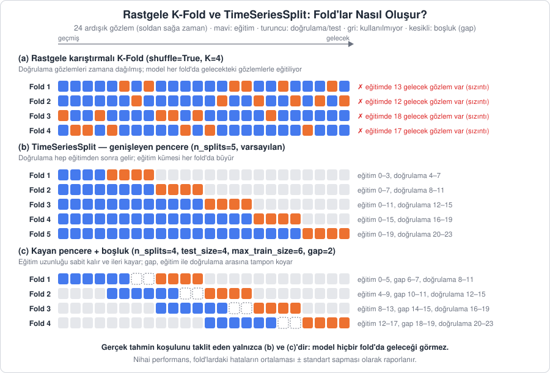

*Şekil 16.1 — (a) Rastgele K-fold'da doğrulama gözlemleri (turuncu) zamana dağılır ve her fold'un eğitim kümesinde doğrulamadan sonraki gözlemler bulunur. (b) TimeSeriesSplit'te doğrulama her zaman eğitimden sonra gelir ve eğitim kümesi genişler. (c) Kayan pencere varyantında eğitim uzunluğu sabittir; `gap` eğitim ile doğrulama arasına tampon koyar.*

### 16.2. Genişleyen Pencere ve Kayan Pencere Doğrulaması

Zamana saygılı çapraz doğrulamanın iki temel biçimi vardır. $n$ gözlemli bir seride $k$. fold'un doğrulama kümesi $t_k$ anından hemen sonra başlayan $h$ gözlemden oluşsun.

**Tanım 1 (Genişleyen pencere, expanding window):** $k$. fold'da eğitim kümesi serinin başından $t_k$'ye kadar olan tüm gözlemlerdir:

$$
\text{Eğitim}_k = \lbrace 1, \dots, t_k \rbrace, \quad \text{Doğrulama}_k = \lbrace t_k + 1, \dots, t_k + h \rbrace, \quad t_1 < t_2 < \dots < t_K
$$

**Tanım 2 (Kayan pencere, sliding / rolling window):** Eğitim kümesi sabit uzunlukta, $m$ gözlemdir ve fold'lar ilerledikçe pencere ileri kayar:

$$
\text{Eğitim}_k = \lbrace t_k - m + 1, \dots, t_k \rbrace, \quad \text{Doğrulama}_k = \lbrace t_k + 1, \dots, t_k + h \rbrace
$$

> **Simge notu:** $`\lbrace \dots \rbrace`$ *(küme parantezi)*: bir gözlem indisleri kümesi · $`t_k`$: $`k`$. fold'da eğitimin bittiği an (tahmin başlangıç noktası) · $`h`$: doğrulama kümesinin uzunluğu (tahmin ufku) · $`m`$: kayan penceredeki sabit eğitim uzunluğu · $`K`$: fold sayısı

| Özellik | Genişleyen pencere | Kayan pencere |
| --- | --- | --- |
| Eğitim uzunluğu | Her fold'da büyür | Sabit ($`m`$) |
| Eski veriler | Hep kullanılır | Pencereden çıkınca unutulur |
| Uygun olduğu durum | Serinin yapısı zamanla fazla değişmiyorsa, veri azsa | Yapısal değişim (rejim değişikliği) varsa, eski veri yanıltıcıysa |
| Fold'lar arası karşılaştırma | İlk fold'lar az veriyle eğitildiği için daha kötü görünebilir | Her fold aynı miktarda veri gördüğü için daha dengeli |
| `TimeSeriesSplit` ayarı | Varsayılan | `max_train_size=m` |

**Açıklama:** Her iki yöntemde de doğrulama kümesi **daima** eğitim kümesinden sonra gelir. Aradaki fark, eski bilginin ne kadar süre "hafızada" tutulduğudur. AirPassengers gibi kısa ve düzenli bir seride genişleyen pencere doğal tercihtir. Pazarlama politikası değişmiş bir satış serisinde ya da kriz öncesi ve sonrası davranışı farklı olan finansal bir seride kayan pencere daha gerçekçi olabilir.

### 16.3. `TimeSeriesSplit` Parametreleri

> 💻 **Uygulama dosyası:** [`Codes/python/ch16_timeseriessplit.py`](Codes/python/ch16_timeseriessplit.py) · [Notebook](Codes/notebooks/ch16_timeseriessplit.ipynb) · [](https://colab.research.google.com/github/erkanozhan/AI_Based_Time_Series-Data_Analytics/blob/main/Codes/notebooks/ch16_timeseriessplit.ipynb)
>
> Bu bölümdeki kodların tamamı bu dosyada. Bilgisayarınızda çalıştırmak için depo kök dizininde `python Codes/python/ch16_timeseriessplit.py` komutunu kullanın ya da dosyayı VS Code'da açıp hücre hücre çalıştırın. Kurulum yapmadan denemek için Colab bağlantısını kullanabilirsiniz.


scikit-learn'deki `TimeSeriesSplit` sınıfı, yukarıdaki iki yöntemi dört parametreyle uygular:

| Parametre | Varsayılan | Anlamı |
| --- | --- | --- |
| `n_splits` | 5 | Fold sayısı $`K`$ |
| `test_size` | `n // (n_splits + 1)` | Her doğrulama kümesinin uzunluğu $`h`$. Aylık veride 12 seçmek, her fold'u tam bir yılla test etmek demektir. |
| `gap` | 0 | Eğitimin sonu ile doğrulamanın başı arasında atlanan gözlem sayısı |
| `max_train_size` | `None` | Verilirse eğitim kümesi en fazla bu kadar son gözlemden oluşur (kayan pencere) |

**`gap` neden gerekir?** İki tipik durum vardır. Birincisi, gerçek hayatta verinin gecikmeli gelmesidir: Bu ayın satış raporu ancak iki ay sonra kesinleşiyorsa model, son iki ayı görmeden tahmin yapmak zorundadır. İkincisi, çok adımlı tahmindir: 3 ay sonrasını tahmin eden bir modelde, eğitimin son gözlemleriyle doğrulamanın ilk gözlemleri arasındaki güçlü otokorelasyon sonucu iyimser gösterebilir. `gap`, bu tamponu kurar.

Aşağıdaki kısa kod, 24 gözlemlik bir dizide üç farklı ayarın fold'larını yazdırır. Şekil 16.1'deki (b) ve (c) panelleri tam olarak bu çıktılardan çizilmiştir.

```python
import numpy as np
from sklearn.model_selection import TimeSeriesSplit

X = np.arange(24).reshape(-1, 1)   # 24 ardışık gözlem (ör. 2 yıllık aylık veri)

def show_folds(tscv, title):
    print(title)
    for k, (tr, te) in enumerate(tscv.split(X), 1):
        print(f"  Fold {k}: eğitim {tr.min():>2}-{tr.max():>2} ({len(tr):>2} gözlem)  "
              f"doğrulama {te.min():>2}-{te.max():>2}")

show_folds(TimeSeriesSplit(n_splits=5), "Genişleyen pencere (varsayılan):")
show_folds(TimeSeriesSplit(n_splits=3, test_size=4, gap=2), "Genişleyen pencere + gap=2:")
show_folds(TimeSeriesSplit(n_splits=4, test_size=4, max_train_size=6, gap=2),
           "Kayan pencere (max_train_size=6) + gap=2:")
```

Çıktı:

```text
Genişleyen pencere (varsayılan):
  Fold 1: eğitim  0- 3 ( 4 gözlem)  doğrulama  4- 7
  Fold 2: eğitim  0- 7 ( 8 gözlem)  doğrulama  8-11
  Fold 3: eğitim  0-11 (12 gözlem)  doğrulama 12-15
  Fold 4: eğitim  0-15 (16 gözlem)  doğrulama 16-19
  Fold 5: eğitim  0-19 (20 gözlem)  doğrulama 20-23
Genişleyen pencere + gap=2:
  Fold 1: eğitim  0- 9 (10 gözlem)  doğrulama 12-15
  Fold 2: eğitim  0-13 (14 gözlem)  doğrulama 16-19
  Fold 3: eğitim  0-17 (18 gözlem)  doğrulama 20-23
Kayan pencere (max_train_size=6) + gap=2:
  Fold 1: eğitim  0- 5 ( 6 gözlem)  doğrulama  8-11
  Fold 2: eğitim  4- 9 ( 6 gözlem)  doğrulama 12-15
  Fold 3: eğitim  8-13 ( 6 gözlem)  doğrulama 16-19
  Fold 4: eğitim 12-17 ( 6 gözlem)  doğrulama 20-23
```

**Çıktının yorumu:** Varsayılan ayarda `test_size = 24 // 6 = 4` olur ve fold'lar serinin **sonundan geriye doğru** yerleştirilir: son fold daima serinin son gözlemleriyle biter. `gap=2` ile eğitimin son iki gözlemi (ör. 10–11) atlanır. `max_train_size=6` ile eğitim kümesi her fold'da 6 gözlemde sabit kalır ve ileri kayar.

> **Not —** `TimeSeriesSplit` veriyi **sıralı** kabul eder; karıştırmaz ve tarihlere bakmaz. Bu yüzden veri çerçevesinin tarihe göre sıralı olduğundan ve (panel verilerde) her satırın tek bir zaman noktasına karşılık geldiğinden emin olun.

### 16.4. Her Fold'da Ön İşleme Yalnızca Eğitim Verisiyle Fit Edilmeli

Zamana saygılı bölmek tek başına yetmez. Veriyi dönüştüren **her** adım (ölçekleme, eksik değer doldurma, özellik seçimi, PCA vb.) yalnızca o fold'un eğitim kümesinden öğrenilmelidir. Aksi hâlde sızıntı bölme yoluyla değil, ön işleme yoluyla gerçekleşir.

**Açıklama:** `MinMaxScaler`'ı döngüden önce **tüm seriyle** fit ettiğimizi düşünelim. Ölçekleyicinin öğrendiği $x_{\max}$, 1960'taki 622 yolcudur. 1. fold'da model yalnızca 1949–1950 ile eğitiliyor olsa bile, girdileri "serinin ileride 622'ye çıkacağı" bilgisiyle ölçeklenmiş olur. Doğru sıra şudur:

1. Fold'u böl: `train_idx`, `val_idx`.
2. Ölçekleyiciyi **yalnızca** `train_idx` ile `fit` et.
3. Aynı ölçekleyiciyle hem eğitim hem doğrulama verisini `transform` et.
4. Modeli eğit, doğrulamada tahmin yap, tahmini `inverse_transform` ile orijinal ölçeğe döndür ve hatayı hesapla.

Aşağıdaki kod bu kalıbı Bölüm 15.3'teki GRU modeliyle uygular. Her fold'da doğrulama kümesi tam bir yıldır (`test_size=12`).

```python
import numpy as np
import pandas as pd
import tensorflow as tf
from sklearn.preprocessing import MinMaxScaler
from sklearn.metrics import mean_squared_error
from sklearn.model_selection import TimeSeriesSplit
from tensorflow.keras.models import Sequential
from tensorflow.keras.layers import GRU, Dense

SEED = 42
np.random.seed(SEED)
tf.random.set_seed(SEED)

df = pd.read_csv('data/AirPassengers.csv', parse_dates=['Month'], index_col='Month')
if '#Passengers' in df.columns:
    df.rename(columns={'#Passengers': 'Passengers'}, inplace=True)
values = df['Passengers'].values.astype('float32').reshape(-1, 1)

look_back = 12

def create_dataset(sequence, look_back=1):
    """Kayan pencere (Bölüm 15.1): look_back geçmiş değer girdi, sonraki değer hedef."""
    X, y = [], []
    for i in range(len(sequence) - look_back):
        X.append(sequence[i:(i + look_back), 0])
        y.append(sequence[i + look_back, 0])
    return np.array(X), np.array(y)

tscv = TimeSeriesSplit(n_splits=5, test_size=12)
fold_rmse = []

for k, (train_idx, val_idx) in enumerate(tscv.split(values), 1):
    # 1) Ölçekleyici YALNIZCA bu fold'un eğitim gözlemleriyle fit edilir
    scaler = MinMaxScaler(feature_range=(0, 1))
    scaler.fit(values[train_idx])
    scaled = scaler.transform(values)   # dönüşüm tüm seriye uygulanabilir; öğrenilen min/max yalnızca eğitimden

    # 2) Pencereler: i. örneğin hedefi serinin (i + look_back). gözlemidir
    X_all, y_all = create_dataset(scaled, look_back)
    target_idx = np.arange(look_back, len(values))
    tr_mask = target_idx <= train_idx[-1]      # hedefi eğitim döneminde olanlar
    va_mask = np.isin(target_idx, val_idx)     # hedefi doğrulama döneminde olanlar
    X_tr = X_all[tr_mask].reshape(-1, look_back, 1)
    X_va = X_all[va_mask].reshape(-1, look_back, 1)
    y_tr, y_va = y_all[tr_mask], y_all[va_mask]

    # 3) Her fold'da SIFIRDAN yeni bir model (önceki fold'un ağırlıkları taşınmaz)
    model = Sequential([GRU(50, input_shape=(look_back, 1)), Dense(1)])
    model.compile(loss='mean_squared_error', optimizer='adam')
    model.fit(X_tr, y_tr, epochs=100, batch_size=8, verbose=0)

    # 4) Tahmini orijinal ölçeğe döndürüp hatayı hesapla
    pred = scaler.inverse_transform(model.predict(X_va, verbose=0))
    true = scaler.inverse_transform(y_va.reshape(-1, 1))
    rmse = np.sqrt(mean_squared_error(true, pred))
    fold_rmse.append(rmse)
    print(f"Fold {k}: eğitim {df.index[train_idx[0]]:%Y-%m} - {df.index[train_idx[-1]]:%Y-%m}, "
          f"doğrulama {df.index[val_idx[0]]:%Y-%m} - {df.index[val_idx[-1]]:%Y-%m}, RMSE = {rmse:.2f}")

print(f"\nGRU çapraz doğrulama RMSE: {np.mean(fold_rmse):.2f} ± {np.std(fold_rmse):.2f}")
```

**Çıktının yorumu:** Beş fold, 1956'dan 1960'a kadar her yılı ayrı ayrı test eder. Fold'ların RMSE değerleri genellikle birbirinden oldukça farklıdır; yolcu sayısı ve dalgalanmalar yıllar içinde büyüdüğü için son yıllarda hata doğal olarak artar. Bu nedenle performansı tek bir sayı olarak değil, **ortalama ± standart sapma** olarak raporlamak gerekir. Standart sapmanın büyük olması, modelin dönemden döneme kararsız olduğunu gösterir. İki modeli karşılaştırırken aradaki fark bu standart sapmadan küçükse, "biri diğerinden daha iyi" demek için yeterli kanıt yoktur.

> **Not —** Aynı ilke hiperparametre seçimi ve erken durdurma için de geçerlidir. Erken durdurmada izlenen doğrulama kümesi, hatası raporlanan fold'un kendisiyse sonuç yine iyimser olur: Model tam da o dönemde en iyi göründüğü noktada durdurulmuş olur. Doğrusu, erken durdurma için fold'un **eğitim** kısmının sonundan ayrı bir iç doğrulama dilimi ayırmaktır. Ağaç tabanlı modellerde ölçekleme gerekmez, ancak gecikme ve hareketli ortalama gibi özelliklerin yalnızca geçmiş değerlerden (`shift(1)` ile) üretildiğinden emin olmak gerekir. scikit-learn'de ön işlemeyi `Pipeline` içine koymak, `fit` işleminin her fold'da otomatik olarak yalnızca eğitim verisiyle yapılmasını garanti eder.

### 16.5. Uygulama: GRU ve XGBoost ile Kapsamlı Bir Örnek

Aşağıdaki kod, bu bölümdeki fikirleri önceki bölümlerle birleştiren uçtan uca bir örnektir:

- **GRU (Bölüm 15.3):** Veri ölçeklenir (ölçekleyici yalnızca eğitim dönemiyle fit edilir), kayan pencereyle (`look_back = 12`) üç boyutlu tensöre çevrilir, erken durdurmalı bir GRU modeli eğitilir ve son 24 ay üzerinde test edilir.
- **XGBoost (Bölüm 13):** 12 gecikme, hareketli ortalama ve standart sapmalar, mevsimsel fark ve takvim özellikleri üretilir.
- **TimeSeriesSplit:** XGBoost için 5 fold'lu genişleyen pencere çapraz doğrulaması yapılır; her fold'da RMSE, MAE ve MAPE hesaplanır.
- **Karşılaştırma:** Son olarak iki model, aynı son 24 aylık test dönemi üzerinde karşılaştırılır.

Programın tamamı (yaklaşık 340 satır) uygulama dosyasındadır; aşağıda kilit satırlar yer alıyor (dosyada MAPE de hesaplanır ve her fold'un tarih aralığı yazdırılır).

```python
# GRU + XGBoost + TimeSeriesSplit — kilit satırlar (tam kod: Codes/python/ch16_timeseriessplit.py)
# 3) Ölçekleyici YALNIZCA eğitim dönemiyle fit edilir; son 24 ay test
scaler = MinMaxScaler(feature_range=(0, 1))
scaler.fit(values[:-test_size])
values_scaled = scaler.transform(values)
X_all, y_all = create_dataset(values_scaled, look_back)       # (132, 12), (132,)
X_all = X_all.reshape(X_all.shape[0], X_all.shape[1], 1)     # [örnek, zaman adımı, özellik]

# 5)-6) GRU: erken durdurmayla en iyi epoch'u bul, sonra tüm eğitim verisiyle yeniden eğit
history = model_gru.fit(X_train_final, y_train_final, epochs=200, batch_size=8,
                        validation_data=(X_val, y_val), callbacks=[early_stop], verbose=1)
best_epoch = int(np.argmin(history.history['val_loss'])) + 1
model_gru_final = build_gru_model(look_back, units=50, dropout_rate=0.2)
model_gru_final.fit(X_train, y_train, epochs=best_epoch, batch_size=8, verbose=0)

# 8) XGBoost için TimeSeriesSplit: her fold'da sıfırdan model ve fold metrikleri
tscv = TimeSeriesSplit(n_splits=5)
for fold, (train_index, val_index) in enumerate(tscv.split(X), 1):
    X_tr, X_va = X.iloc[train_index], X.iloc[val_index]
    y_tr, y_va = y.iloc[train_index], y.iloc[val_index]
    model_xgb = xgb.XGBRegressor(n_estimators=500, learning_rate=0.05, max_depth=4,
                                 subsample=0.8, colsample_bytree=0.8, random_state=SEED)
    model_xgb.fit(X_tr, y_tr)
    y_va_pred = model_xgb.predict(X_va)
    rmse_list.append(np.sqrt(mean_squared_error(y_va, y_va_pred)))
    mae_list.append(mean_absolute_error(y_va, y_va_pred))
print(f"RMSE: {np.mean(rmse_list):.2f} ± {np.std(rmse_list):.2f}")
```

Program sırasıyla şu adımları izler:

1. **Hazırlık:** Tohumlar sabitlenir, AirPassengers yüklenir, özet istatistikler yazdırılır ve seri çizilir.
2. **GRU için veri:** Ölçekleyici yalnızca eğitim dönemiyle fit edilir, kayan pencereyle (`look_back = 12`) üç boyutlu tensör kurulur; son 24 ay test, eğitimin son 12 ayı doğrulama kümesidir.
3. **GRU modeli:** `GRU(50)` → `Dropout(0.2)` → `Dense(1)`; erken durdurmayla eğitilir, öğrenme eğrileri çizilir ve doğrulama kaybının en düşük olduğu epoch (`best_epoch`) bulunur.
4. **Son GRU modeli:** Doğrulama dahil tüm eğitim verisiyle `best_epoch` kadar yeniden eğitilir; eğitim ve test için RMSE, MAE, MAPE hesaplanıp tahminler çizilir.
5. **XGBoost özellikleri:** 12 gecikme, `shift(1)` ile hareketli ortalama ve standart sapmalar, sızıntısız mevsimsel fark ve takvim özellikleri üretilir.
6. **TimeSeriesSplit:** 5 fold'lu genişleyen pencere; her fold'da sıfırdan bir XGBoost modeli eğitilir, RMSE, MAE ve MAPE hesaplanır ve sonuç "ortalama ± std" olarak raporlanır.
7. **Son XGBoost modeli:** Son 24 ay dışarıda bırakılarak eğitilir, test metrikleri ve özellik önemi grafiği üretilir.
8. **Karşılaştırma:** GRU ve XGBoost aynı son 24 ay üzerinde tabloyla ve yan yana grafiklerle karşılaştırılır.

Tam kod: [`Codes/python/ch16_timeseriessplit.py`](Codes/python/ch16_timeseriessplit.py) · [Notebook](Codes/notebooks/ch16_timeseriessplit.ipynb)

**Çıktının yorumu:**

- **GRU bölümü:** Öğrenme eğrileri ve "en iyi epoch" bilgisi, son modelin kaç epoch eğitileceğini belirler. Son model doğrulama dahil tüm eğitim verisiyle yeniden eğitildiği için tek bir test dönemi (son 24 ay) üzerinden değerlendirilir.
- **XGBoost çapraz doğrulaması:** Her fold'un tarih aralığı yazdırılır; doğrulama dönemlerinin her zaman eğitimden sonra geldiğini buradan teyit edebilirsiniz. İlk fold'lar az veriyle eğitildiği için ve son fold'lar eğitim aralığının üzerindeki rekor değerlerle karşılaştığı için (ağaçların ekstrapolasyon sorunu, Bölüm 13) fold hataları farklılaşır. Raporlanan "ortalama ± std" değeri, tek bir test döneminden elde edilen sayıdan çok daha güvenilir bir performans tahminidir.
- **Özellik önemi:** Genellikle `lag_12` (bir yıl önceki aynı ay), `lag_1` ve hareketli ortalamalar en üstte çıkar. Bu, serinin güçlü mevsimselliğini ve trendini yansıtır.
- **Karşılaştırma:** Küçük veri setlerinde GRU aşırı öğrenmeye eğilimlidir. XGBoost elle çıkarılan özelliklerle çalışır, daha kolay yorumlanır ve genellikle daha kararlıdır; ancak trendin eğitim aralığının dışına çıktığı dönemlerde düşük tahmin yapar. Seçim, verinin büyüklüğüne ve problemin yapısına göre yapılmalıdır. Daha adil bir karşılaştırma için GRU'yu da 16.4'teki gibi aynı `TimeSeriesSplit` fold'larıyla değerlendirip iki modelin "ortalama ± std" değerlerini yan yana koymak gerekir.

> **Not —** Özgün kodda iki sızıntı düzeltildi: (1) `MinMaxScaler` tüm seriyle değil yalnızca eğitim dönemiyle fit ediliyor; (2) `seasonal_diff` özelliği artık hedefin kendisini içermiyor (`past - past.shift(12)`). Ayrıca çapraz doğrulama döngüsündeki erken durdurma kaldırıldı ve son GRU modeli, toplam epoch sayısı yerine doğrulama kaybının en düşük olduğu epoch sayısıyla eğitiliyor.

---

<a id="bolum-17"></a>

## 17. Zaman Serisi Tahmininde 10 Altın Kural

Bu son bölüm, ders boyunca gördüğümüz yöntemlerden bağımsız olarak geçerli olan temel ilkeleri bir araya getirir. Algoritmalar (ARIMA, Prophet, XGBoost, LSTM vb.) değişse de bu kurallar değişmez. Her kuralın yanında, konunun ayrıntılı olarak işlendiği bölüme atıf verilmiştir.

---

### 17.1. Görsel İnceleme Tartışılamaz (Visual Inspection is Non-Negotiable)

Herhangi bir modelleme kodu yazmadan önce veriyi mutlaka grafiğe dökün. Özet istatistikler yanıltabilir, ama grafikler nadiren yanıltır. Grafikte şunları arayın:

- **Trend:** Veri yukarı mı, aşağı mı hareket ediyor?
- **Mevsimsellik:** Tekrarlayan bir desen var mı? Dalgaların genliği seviyeyle birlikte büyüyor mu (toplamsal mı, çarpımsal mı)?
- **Aykırı değerler (outliers):** Olmaması gereken ani sıçramalar var mı?
- **Boşluklar:** Eksik veri var mı?

Bileşenler ve ayrıştırma Bölüm 2'de, görselleştirme ve ACF/PACF grafikleri Bölüm 6'da ele alınmıştır.

### 17.2. Veriyi Asla Karıştırmayın (Never Shuffle Your Data)

Standart makine öğrenmesinde eğitim/test ayrımı için veriyi karıştırmak (shuffle) yaygındır, ancak zaman serilerinde bu büyük bir hatadır. Zaman tek yönde akar; bugünü tahmin etmek için gelecek haftanın verisini kullanamazsınız. Daima **zamansal ayrım (temporal split)** kullanın:

- *Örnek:* **Eğitim:** Ocak 2020 – Aralık 2023 | **Test:** Ocak 2024 – Mart 2024

Eğitim-test ayrımı Bölüm 8'de, zaman sırasını koruyan çapraz doğrulama (TimeSeriesSplit) Bölüm 16'da anlatılmıştır.

### 17.3. Bir Referans Noktası Belirleyin (Establish a Baseline: The Naive Model)

Karmaşık bir modelin (örneğin LSTM) gerçekten "iyi" olup olmadığını anlamak için bir kıyaslama noktasına ihtiyacınız vardır. Modelinizi daima **saf yöntem (naive method)** ile karşılaştırın:

- **Naive 1:** Yarının değeri, bugünün değeri ile aynı olacaktır.
- **Naive 2 (mevsimsel):** Önümüzdeki Haziran ayının satışları, geçen Haziran ile aynı olacaktır.
- *Kural:* Karmaşık modeliniz bu basit yöntemleri geçemiyorsa, canlıya almaya değmez.

Referans modelle karşılaştırma ve hata metrikleri Bölüm 8'de ele alınmıştır.

### 17.4. Durağanlığa Saygı Gösterin (Respect Stationarity)

Çoğu klasik istatistiksel model (ARIMA, VAR gibi), serinin istatistiksel özelliklerinin (ortalama, varyans) zaman içinde değişmemesini varsayar.

- Veride trend varsa farkını alın (difference it).
- Mevsimsellik varsa mevsimsel fark alın.
- Varyans seviyeyle birlikte artıyorsa logaritmik dönüşüm uygulayın.
- Durağanlığı yalnızca gözle değil, ADF ve KPSS gibi testlerle de doğrulayın.

Durağanlığın tanımı ve testleri Bölüm 3.2'de, fark alma ve log dönüşümünün ARIMA/SARIMA'da uygulanması Bölüm 7'de işlenmiştir. Makine öğrenmesi modelleri durağanlık varsaymasa da, trendli serilerde fark almanın ağaç tabanlı modellere nasıl yardımcı olduğu Bölüm 12'de tartışılmıştır.

### 17.5. Alan Bilgisi > Algoritmalar (Domain Knowledge > Algorithms)

Bir algoritma, satışlardaki ani artışın "Kara Cuma" (Black Friday) yüzünden olduğunu veya düşüşün bir sunucu kesintisinden kaynaklandığını kendi başına bilemez.

- **Özellik mühendisliği:** Tatilleri, hava durumunu veya pazarlama etkinliklerini dışsal değişkenler olarak modele ekleyin. Bağlam (context), genellikle hiperparametre optimizasyonundan daha güçlüdür.

Prophet'ta tatil etkileri Bölüm 9'da, gecikme ve takvim özellikleriyle özellik mühendisliği Bölüm 12 ve 13'te ele alınmıştır.

### 17.6. Veri Sızıntısına Dikkat Edin (Watch Out for Leakage)

Zaman serilerinde veri sızıntısı sinsi olabilir. Model eğitilirken tahmin anında bilinemeyecek bir gelecek bilgisi kullanılırsa, model eğitimde harika görünür ama üretimde (production) çuvallar.

- *Örnek:* Ocak 2024'ün günlük satışlarını tahmin etmek için Ocak 2024'ün "aylık ortalama sıcaklığını" kullanmak. (Ay bitene kadar aylık ortalamayı bilemezsiniz!)
- *Diğer sık hatalar:* Ölçekleyiciyi tüm veriyle uydurmak, hareketli ortalamayı `shift(1)` olmadan hesaplamak, sıradan k-katlı çapraz doğrulama kullanmak.

Zamansal ayrım Bölüm 8'de, sızıntı türleri Bölüm 12.1.5'te, zaman serisine uygun çapraz doğrulama Bölüm 16'da anlatılmıştır.

### 17.7. Diyagnostikler Önemlidir: Hataları Kontrol Edin (Diagnostics Matter)

İyi bir model tüm "sinyali" alır ve geriye yalnızca "gürültü" bırakır. Modelin artıklarını (hatalarını) kontrol edin. Hatalar **beyaz gürültü (white noise)** gibi görünmelidir:

- Ortalama sıfır olmalı.
- Varyans sabit olmalı.
- Otokorelasyon olmamalı (hataların ACF grafiğine bakın).
- *Hatalarda bir desen varsa, modeliniz bir şeyi gözden kaçırmış demektir.*

ACF grafiğinin okunması Bölüm 6'da, ARIMA artıklarının kontrolü Bölüm 7'de gösterilmiştir.

### 17.8. Belirsizliği Kucaklayın (Embrace Uncertainty)

Nokta tahminleri (ör. "Satışlar 105 adet olacak") neredeyse her zaman bir miktar yanlıştır. Bunun yerine karar vericilerin riski değerlendirebilmesi için **tahmin aralıkları (prediction intervals)** sunun:

- *Örnek:* "Satışlar %95 olasılıkla 95 ile 115 adet arasında olacak."

Aralığın düzeyini de mutlaka belirtin: Örneğin Prophet'ın `yhat_lower`/`yhat_upper` sütunları varsayılan olarak %80'lik aralığı verir (Bölüm 9). ARIMA'nın tahmin aralıkları Bölüm 7'de ele alınmıştır.

### 17.9. Doğru Metriği Seçin (Choose the Right Metric)

Yalnızca R² değerine güvenmeyin. İş durumunuza uygun metriği seçin:

- **RMSE:** Büyük hataları ağır cezalandırır (büyük sapmaların kritik olduğu tahminler için iyidir).
- **MAE:** Yorumlaması daha kolaydır (hataların ortalama büyüklüğü, serinin kendi biriminde).
- **MAPE:** Yüzdelik olduğu için farklı ölçekteki serileri karşılaştırmaya uygundur, ancak gerçek değerler sıfır ya da sıfıra çok yakınsa kullanılamaz.

Bu metriklerin formülleri, karşılaştırması ve Python uygulaması Bölüm 8'de verilmiştir.

### 17.10. Karmaşıklık ≠ Doğruluk (Complexity ≠ Accuracy)

Her problem için en yeni Transformer veya derin öğrenme modelini kullanma eğilimi vardır. Oysa birçok gerçek dünya tek değişkenli (univariate) zaman serisinde üstel düzeltme (ETS) veya ARIMA gibi basit modeller, karmaşık sinir ağlarından daha iyi performans gösterir.

- Basit başlayın; karmaşıklığı ancak basit modeller yetersiz kaldığında artırın.

Klasik, makine öğrenmesi ve derin öğrenme yaklaşımlarının karşılaştırması Bölüm 12.3'te, derin öğrenme modellerinin karşılaştırmalı uygulaması Bölüm 15'te yer almaktadır.

---

### 17.11. Kapanış

Bu on kural, ders boyunca izlediğimiz yolun özetidir: Veriyi önce **görün** ve anlayın (Bölüm 1–6), basit ve yorumlanabilir modellerle **başlayın** (Bölüm 7–11), her modeli **dürüst** bir test düzeniyle ve bir referans modele karşı **ölçün** (Bölüm 8 ve 16), karmaşık yapay zeka modellerine ise ancak gerçekten katkı sağladıklarında **geçin** (Bölüm 12–15). Hangi algoritmayı kullanırsanız kullanın, iyi bir tahminin sırrı çoğu zaman modelden çok veriyi, zamanın yönünü ve belirsizliği doğru ele almaktadır.

**Kaynak:** https://ozancanozdemir.github.io/posts/2025/12/10-rules-time-series-forecasting/

---
