# Yapay Zeka Tabanlı Zaman Serisi ve Veri Analizi

### Ders Notları

## İçindekiler

1. [Zaman Serisi Analizine Giriş](#bolum-1)
2. [Zaman Serisinin Temel Kavramları ve Bileşenleri](#bolum-2)
3. [Zaman Serisi Tipleri](#bolum-3)
4. [R'da Tarih ve Zaman Nesneleri](#bolum-4)
5. [R'da Zaman Serisi Nesneleri: `ts` ve `xts`](#bolum-5)
6. [Veri Manipülasyonu, Görselleştirme ve ACF/PACF](#bolum-6)
7. [Klasik İstatistiksel Modeller: ARIMA ve SARIMA](#bolum-7)
8. [Model Değerlendirme: Hata Metrikleri ve Eğitim-Test Ayrımı](#bolum-8)
9. [Facebook Prophet](#bolum-9)
10. [VAR: Çok Değişkenli Zaman Serisi Modeli](#bolum-10)
11. [Gretl: Ekonometrik Analiz için Görsel Ortam](#bolum-11)
12. [Yapay Zeka ile Zaman Serisi Analizine Giriş](#bolum-12)
13. [XGBoost ile Zaman Serisi Tahmini](#bolum-13)
14. [Weka Zaman Serisi Tahmin Modülü (Forecast Sekmesi)](#bolum-14)
15. [Derin Öğrenme ile Tahmin: LSTM, GRU ve 1D-CNN](#bolum-15)
16. [TimeSeriesSplit: Zaman Serisinde Çapraz Doğrulama](#bolum-16)
17. [Zaman Serisi Tahmininde 10 Altın Kural](#bolum-17)

> **Kodlar ve veri:** Kısa kodlar metnin içindedir. Her bölümün kodlarının tamamı, çalıştırılabilir dosyalar olarak [`Codes/`](Codes/README.md) klasöründedir: R betikleri, Python betikleri ve kurulum gerektirmeden Colab'da açılabilen notebook'lar. Nasıl çalıştırılacakları [`Codes/README.md`](Codes/README.md) dosyasında anlatılır. Veri setleri [`data/`](data) klasöründedir.

---

<a id="bolum-1"></a>

## 1. Zaman Serisi Analizine Giriş

Bir hastanenin acil servisine her gün kaç hasta geleceğini, bir şehrin yarın akşam saat 19.00'da ne kadar elektrik tüketeceğini ya da bir ürünün gelecek ay kaç adet satılacağını bilmek isteriz. Bu soruların ortak noktası, cevabın **geçmişte aynı büyüklüğün zaman içinde nasıl davrandığına** bakılarak aranmasıdır. İşte zaman serisi analizi, bu tür verileri anlamak ve onlardan geleceğe dair çıkarım yapmak için geliştirilmiş yöntemlerin bütünüdür.

Bu bölümde zaman serisinin ne olduğunu, onu sıradan veri setlerinden ayıran özelliği, analizde hangi amaçları güttüğümüzü ve dersin genel yol haritasını ele alacağız.

---

### 1.1. Zaman Serisi Nedir?

**Açıklama:** Zaman serisi, aynı büyüklüğün zaman içinde **ardışık olarak** ve genellikle **eşit aralıklarla** kaydedilmiş ölçümleridir. Her gözlemin bir zaman damgası vardır ve gözlemler bu zamana göre sıralanır. Günlük hayattan birkaç örnek:

- Bir hastanedeki günlük hasta kabul sayısı,
- Bir şirketin aylık satış rakamları,
- Bir meteoroloji istasyonunda kaydedilen saatlik sıcaklık ölçümleri,
- Bir hisse senedinin dakikalık fiyat hareketleri.

**Tanım:** Zaman serisi, bir büyüklüğün zaman dizinine göre sıralanmış gözlemler dizisidir:

$$
\lbrace x_t : t \in \mathcal{T} \rbrace
$$

Burada $x_t$, $t$ anındaki gözlemdir. $\mathcal{T}$ ise gözlem anlarının kümesidir. Bu derste çoğunlukla $\mathcal{T} = \lbrace 1, 2, \dots, T \rbrace$ biçiminde, eşit aralıklı ve sonlu sayıda gözlem içeren serilerle çalışacağız. Büyük $T$ toplam gözlem sayısıdır: `AirPassengers` serisinde 12 yıl × 12 ay = 144 gözlem olduğu için $T = 144$'tür. İstatistiksel bakış açısıyla elimizdeki seri, rastgele bir sürecin (stokastik süreç) gözlenmiş **tek bir gerçekleşmesi** olarak düşünülür. Bu fikre Bölüm 3.4'te yeniden döneceğiz.

Bu gösterimi bir kez okumayı öğrenmek dersin geri kalanını çok kolaylaştırır. $x$, ölçtüğümüz büyüklüğün adıdır (örneğin yolcu sayısı). Harfin sağ altına küçük yazılan $t$ ise **alt indis**tir ve "kaçıncı zaman noktası?" sorusunun cevabını taşır; harf, İngilizce *time* (zaman) kelimesinden gelir. `AirPassengers` serisinde $x_1 = 112$ (Ocak 1949), $x_2 = 118$ (Şubat 1949) ve $x_7 = 148$'dir (Temmuz 1949). Alt indiste işlem de yapılabilir: $t$ "bugün" ise $x_{t-1}$ "dün", yani bir önceki dönemin değeri, $x_{t+1}$ ise "yarın" demektir. Örneğin $t = 7$ için $x_{t-1} = x_6 = 135$, yani Haziran 1949 değeridir.

> **Simge notu:** $`x_t`$ *(x t)*: t anındaki gözlem; alt indis zamanı (sırayı) gösterir · $`x_{t-1}`$ *(x t eksi bir)*: bir önceki dönemin değeri · $`T`$ *(büyük te)*: toplam gözlem sayısı · $`\in`$ *(elemanıdır)*: soldaki öğe sağdaki kümeye aittir. Bu işaret, ileride göreceğimiz Yunan harfi $`\varepsilon`$ (epsilon) ile şekil olarak karıştırılır; ikisi farklıdır · $`\mathcal{T}`$ *(kaligrafik T)*: gözlem anlarının (zaman dizininin) kümesi · $`\lbrace \dots \rbrace`$ *(küme parantezi)*: bir küme ya da dizi


*Şekil 1.1 — (a) Derste sık kullanacağımız `AirPassengers` serisi: 1949–1960 arası aylık uluslararası havayolu yolcu sayısı (bin kişi). (b) Saatlik elektrik yükü (benzetim verisi): gündüz ve akşam tepeleri her gün, düşük hafta sonu tüketimi her hafta tekrar eder.*

Şekil 1.1'deki iki seri, ileride ayrıntılı inceleyeceğimiz kavramların neredeyse hepsini şimdiden gösterir. `AirPassengers` serisinde yolcu sayısı yıllar içinde **artar** (trend), her yaz **zirve** yapar (mevsimsellik) ve bu yaz tepeleri seviye yükseldikçe **büyür**. Elektrik yükünde ise iki ayrı tekrar eden desen vardır: 24 saatlik günlük döngü ve 7 günlük haftalık döngü. Bu bileşenler Bölüm 2'de sistematik olarak ele alınacaktır.

---

### 1.2. Zaman Serisini Sıradan Veriden Farklı Kılan Nedir?

**Açıklama:** Bir sınıftaki öğrencilerin boy ölçümlerini bir tabloya yazdığımızı düşünelim. Satırların sırasını değiştirirsek hiçbir şey kaybetmeyiz: ortalama boy, en uzun öğrenci, dağılım aynı kalır. Çünkü bir öğrencinin boyu, tabloda bir önceki satırdaki öğrencinin boyu hakkında bilgi vermez.

Zaman serisinde durum tamamen farklıdır. Bu ayın yolcu sayısı, geçen ayın yolcu sayısına **çok benzer**. Bu temmuzun değeri, geçen temmuzun değeriyle **yakından ilişkilidir**. Yani gözlemler birbirinden bağımsız değildir; aralarında bir **bağımlılık** (dependence) vardır. Bu yüzden sıra, verinin kendisi kadar önemli bir bilgidir.


*Şekil 1.2 — Solda `AirPassengers` serisinin orijinal hâli, sağda aynı 144 değerin rastgele karıştırılmış hâli. İki grafikteki sayılar aynıdır; ortalama ve varyans değişmez. Ancak trend, mevsimsellik ve "komşu aylar birbirine benzer" bilgisi tamamen kaybolur.*

**Tanım:** Klasik istatistik yöntemlerinin çoğu, gözlemlerin **bağımsız ve özdeş dağılımlı** olduğunu varsayar. Bunu art arda atılan bir zarla düşünebiliriz: Her atış bir öncekinden habersizdir (bağımsız) ve her atışta aynı zar kullanılır, yani hangi sayının hangi olasılıkla geleceği hep aynıdır (özdeş dağılımlı). Zaman serisinde ise yakın zamanlı gözlemler genellikle birbiriyle ilişkilidir:

$$
\mathrm{Cov}(x_t, x_{t-h}) \neq 0 \quad \text{(en azından bazı } h \text{ gecikmeleri için)}
$$

> **Simge notu:** $`\mathrm{Cov}(\cdot,\cdot)`$ *(kovaryans)*: iki değişkenin birlikte değişim ölçüsü · $`\neq`$ *(eşit değildir)* · $`h`$: iki gözlem arasındaki zaman mesafesi, yani gecikme (lag)

Kovaryansı şimdilik şöyle düşünebilirsiniz: İki büyüklük birlikte ortalamanın üstüne çıkıp birlikte altına iniyorsa kovaryans pozitif, biri yükselirken öteki düşüyorsa negatif, aralarında bir düzen yoksa sıfıra yakındır. Buradaki iki büyüklük aynı serinin $h$ adım uzaktaki değerleridir; $h = 1$ için "bu ay" ile "geçen ay". Formül yalnızca şunu söyler: en azından bazı gecikmelerde bu ilişki sıfır değildir. Kovaryansın küçük bir sayısal örnekle nasıl hesaplandığını Bölüm 3.2'de göreceğiz.

Bu ilişkiye **otokorelasyon** (kendi geçmişiyle korelasyon) denir ve ölçülmesi Bölüm 6'da ayrıntılı olarak ele alınır. Bu basit gözlemin üç önemli sonucu vardır:

1. **Bağımlılık bir engel değil, bir fırsattır.** Geçmiş gelecek hakkında bilgi taşıdığı için tahmin yapabiliriz. ARIMA'dan LSTM'e kadar dersteki tüm modeller bu bağımlılığı farklı yollarla öğrenir.
2. **Standart yöntemler olduğu gibi kullanılamaz.** Örneğin makine öğrenmesinde alışık olduğumuz *rastgele* eğitim-test ayrımı, gelecekteki bilgiyi modele sızdırır. Zaman serisinde test verisi her zaman eğitim verisinden **sonra** gelmelidir (Bölüm 8 ve Bölüm 16).
3. **Zamanın yönü önemlidir.** Model yalnızca geçmişi kullanarak geleceği tahmin etmelidir; tersini değil.

---

### 1.3. Zaman Serisi Analizinin Amaçları

Bir zaman serisini analiz ederken genellikle aşağıdaki beş amaçtan bir ya da birkaçını güderiz:

| Amaç | Yanıtlanan soru | Örnek |
| --- | --- | --- |
| **Tanımlama** (description) | Seride hangi desenler var? | Satışlarda yıllık artış ve aralık ayı zirvesi var mı? |
| **Açıklama** (explanation) | Seriyi hangi etkenler ve ilişkiler belirliyor? | Faizdeki artış birkaç ay sonra enflasyonu nasıl etkiliyor? |
| **Tahmin** (forecasting) | Gelecekte hangi değerler bekleniyor? | Önümüzdeki 12 ayda kaç yolcu taşınacak? |
| **Anomali tespiti** (anomaly detection) | Hangi gözlemler olağan dışı? | Bir sunucunun trafiğindeki ani sıçrama saldırı olabilir mi? |
| **Kontrol** (control) | Süreç istenen düzeyde nasıl tutulur? | Bir üretim hattındaki sıcaklık sapmaya başladığında ne zaman müdahale edilmeli? |

Bu amaçlar birbirinden kopuk değildir. İyi bir tahmin için önce seriyi **tanımlamak** gerekir. Bir anomaliyi fark etmek için ise "normalde ne beklendiğini" gösteren bir tahmine ihtiyaç vardır: gözlenen değer tahmin aralığının çok dışına düşüyorsa, o gözlem şüphelidir.

**Tanım (tahmin):** $T$ anına kadar olan gözlemlere dayanarak $h$ adım sonrası için yapılan tahmin şöyle gösterilir:

$$
\hat{x}_{T+h} = g(x_T, x_{T-1}, \dots, x_1)
$$

Burada $g$, kullandığımız modeldir (ARIMA, Prophet, XGBoost, LSTM vb.). Matematikte **fonksiyon**, girdiyi alıp bir çıktı üreten kuraldır; burada girdi geçmiş gözlemler, çıktı tahmindir. $x$'in üzerindeki şapka işareti, değerin gözlenmiş değil **tahmin edilmiş** olduğunu belirtir. Örneğin `AirPassengers` serisi Aralık 1960'ta bittiği için $T = 144$'tür. $h = 1$ için $\hat{x}_{145}$ Ocak 1961'in, $h = 12$ için $\hat{x}_{156}$ Aralık 1961'in tahminidir.

Tahmin ufku ($h$) büyüdükçe belirsizlik artar. Bu nedenle iyi bir tahmin, tek bir sayıyla birlikte bir **tahmin aralığı** da verir: "Tahmin 450; gerçek değer %95 olasılıkla 420 ile 480 arasında olacak" gibi. Aralık ne kadar genişse, model gelecek hakkında o kadar emin değildir.

> **Simge notu:** $`\hat{x}_{T+h}`$ *(x şapka, T artı h)*: T anındaki bilgiyle, h adım sonrası için yapılan tahmin · $`g(\cdot)`$ *(ge)*: geçmiş gözlemleri tahmine dönüştüren model fonksiyonu · $`h`$: tahmin ufku, yani kaç adım ileriye bakıldığı

---

### 1.4. Uygulama Alanları

Zaman serisi verisi, ölçümün zaman içinde tekrarlandığı her alanda ortaya çıkar:

| Alan | Örnek seriler | Tipik amaç |
| --- | --- | --- |
| **Finans** | Hisse fiyatları, döviz kurları, işlem hacmi | Risk ölçümü, volatilite tahmini |
| **Ekonomi** | GSYH, enflasyon, işsizlik, faiz | Politika analizi, değişkenler arası ilişkiler |
| **Enerji** | Saatlik elektrik yükü, rüzgâr ve güneş üretimi | Kısa vadeli yük tahmini, şebeke planlaması |
| **Sağlık** | Günlük hasta kabulü, salgın vaka sayıları, EKG sinyalleri | Kapasite planlama, erken uyarı |
| **Perakende ve lojistik** | Günlük satışlar, stok düzeyleri, talep | Talep tahmini, stok optimizasyonu |
| **Çevre ve iklim** | Sıcaklık, yağış, hava kalitesi (PM2.5) | Mevsimsel desenler, uzun vadeli eğilimler |
| **Mühendislik ve IoT** | Sensör ölçümleri, makine titreşimleri | Arıza ve anomali tespiti, kestirimci bakım |
| **Ulaştırma** | Yolcu sayıları, trafik yoğunluğu | Kapasite ve sefer planlama |

---

### 1.5. Tipik Bir Zaman Serisi Analizinin İş Akışı

Hangi alanda çalışırsak çalışalım, zaman serisi analizi genellikle benzer adımlarla ilerler. Bu adımlar aynı zamanda dersin akışını da belirler.


*Şekil 1.3 — Zaman serisi analizinin tipik adımları ve her adımın işlendiği bölümler. Değerlendirme adımında sonuç yetersizse geri dönülür; süreç doğrusal değil, yinelemelidir.*

1. **Veri toplama ve hazırlık:** Tarih-zaman bilgisinin doğru okunması, eksik gözlemlerin ele alınması ve verinin R'da bir zaman serisi nesnesine (`ts`, `xts`) dönüştürülmesi.
2. **Görselleştirme:** Seriyi çizmek her zaman ilk iştir. Trend, mevsimsellik, yapısal kırılmalar ve aykırı değerler çoğu zaman ilk grafikte fark edilir.
3. **Ayrıştırma ve durağanlık analizi:** Seriyi bileşenlerine ayırmak, durağan olup olmadığını testlerle sınamak ve gerekirse dönüşüm (log, fark alma) uygulamak. ACF/PACF grafikleri serinin "hafızasını" gösterir.
4. **Model kurma:** Serinin yapısına uygun bir model seçmek: klasik istatistiksel modeller (ARIMA/SARIMA, VAR), ayrıştırmaya dayalı modeller (Prophet) veya makine öğrenmesi ve derin öğrenme modelleri (XGBoost, LSTM, GRU, 1D-CNN).
5. **Değerlendirme:** Modeli, eğitimde görmediği **son dönem** verisi üzerinde MAE, RMSE, MAPE gibi metriklerle ölçmek. Sonuç yetersizse 3. ya da 4. adıma geri dönülür.
6. **Tahmin ve raporlama:** Seçilen modelle geleceği tahmin etmek, tahmin aralıklarıyla birlikte yorumlamak ve sunmak.

---

### 1.6. Dersin Yol Haritası

Ders 17 bölümden oluşur ve beş aşamada ilerler. Her aşama bir öncekinin üzerine kurulur. Bu nedenle bölümleri sırayla okumanız önerilir.


*Şekil 1.4 — Dersin beş aşaması ve her aşamadaki bölümler.*

**1. Temeller (Bölüm 1–3):** Zaman serisinin ne olduğunu, bileşenlerini (trend, mevsimsellik, döngü, düzensiz bileşen) ve tiplerini öğreniriz. Dersin en kritik kavramı olan **durağanlık** burada tanımlanır; "birim kök" kavramı ve ADF testinin mantığı adım adım anlatılır (testlerin ayrıntısı Bölüm 7.5'te).

**2. R ile veri hazırlığı (Bölüm 4–6):** R'da tarih ve zaman nesneleriyle (`Date`, `POSIXct`, `lubridate`), zaman serisi nesneleriyle (`ts`, `xts`) çalışmayı öğreniriz. Ardından serileri görselleştirir, ayrıştırır ve ACF/PACF grafikleriyle serinin geçmişine ne kadar "bağlı" olduğunu okuruz.

**3. Klasik modeller ve değerlendirme (Bölüm 7–11):** Box-Jenkins yaklaşımıyla ARIMA ve SARIMA modellerini R ve Python'da kurarız. Bölüm 8'de modellerin başarısını ölçmek için hata metriklerini ve eğitim-test ayrımını öğreniriz; bu araçları sonraki tüm bölümlerde kullanacağız. Ardından Facebook Prophet'i, çok değişkenli VAR modelini ve kod yazmadan ekonometrik analiz yapmayı sağlayan Gretl'i inceleriz.

**4. Yapay zeka yöntemleri (Bölüm 12–16):** Bir zaman serisini denetimli öğrenme problemine dönüştürmeyi ve derin öğrenme yaklaşımının temel fikirlerini (LSTM hücresi, Transformer) öğreniriz. Ardından XGBoost'u Python ve Weka ile, Weka'nın zaman serisi tahmin modülünü ve LSTM, GRU, 1D-CNN gibi derin öğrenme modellerini uygularız. Bölüm 16'da zaman sırasını bozmadan çapraz doğrulama yapmayı sağlayan `TimeSeriesSplit` ele alınır.

**5. Kapanış (Bölüm 17):** Ders boyunca öğrenilenler, zaman serisi tahmininde dikkat edilmesi gereken on altın kuralda toplanır.

**Not —** Ders boyunca aynı veri setlerine (özellikle `AirPassengers`) farklı yöntemlerle tekrar tekrar döneceğiz. Böylece klasik modellerle yapay zeka modellerini aynı problem üzerinde karşılaştırma fırsatı bulacağız.

---

<a id="bolum-2"></a>

## 2. Zaman Serisinin Temel Kavramları ve Bileşenleri

Bir zaman serisini analiz etmeden önce, onu anlatırken kullanacağımız ortak dili öğrenmemiz gerekir. Bu bölümde önce temel kavramları (gözlem, zaman dizini, gecikme vb.) tanımlayacağız. Ardından bir serinin hangi "parçalardan" oluştuğunu, yani **bileşenlerini** inceleyeceğiz.

Bunu bir müzik parçasına benzetebiliriz: Kulağımıza tek bir ses gelir, ama o ses aslında bas gitar (yavaş ve uzun vadeli hareket), davul (düzenli tekrar eden ritim) ve birkaç rastgele tınının toplamıdır. Zaman serisi analizinde de gözlediğimiz tek bir çizginin arkasındaki bu "enstrümanları" birbirinden ayırmaya çalışırız.

---

### 2.1. Temel Kavramlar


*Şekil 2.1 — Bir zaman serisinin temel kavramları: gözlem ($`x_t`$), zaman dizini ($`t`$), örnekleme aralığı ($`\Delta t`$) ve gecikme ($`h`$).*

> **Simge notu:** $`\Delta t`$ *(delta t)*: ardışık iki gözlem arasındaki zaman farkı (örnekleme aralığı)

**Açıklama:** Zaman serisi, bir büyüklüğün zaman içinde **sırayla** kaydedilmiş değerleridir. Sıra çok önemlidir: Sıradan bir veri setinde satırların yerini değiştirmek sonucu değiştirmez. Bir zaman serisinde ise satırları karıştırmak, bir filmin karelerini karıştırmak gibidir; hikâye kaybolur.

**Tanım:** Bir zaman serisi, zaman dizinine göre sıralanmış gözlemler kümesidir:

$$
\lbrace x_t\rbrace _{t=1}^{T} = \lbrace x_1, x_2, \dots, x_T\rbrace 
$$

> **Simge notu:** $`\lbrace x_t \rbrace_{t=1}^{T}`$ *(x t, t eşittir 1'den T'ye)*: t = 1, 2, …, T anlarındaki gözlemlerin sıralı kümesi · $`\dots`$ *(üç nokta)*: aradaki terimler aynı düzenle devam eder

Bu gösterimdeki kavramlar şunlardır:

| Kavram | Gösterim | Anlamı | Örnek |
| --- | --- | --- | --- |
| **Gözlem** (observation) | $x_t$ | $t$ anında ölçülen değer | Şekil 2.1'de 15. aydaki değer: $x_{15} = 129$ |
| **Zaman dizini** (time index) | $t = 1, 2, \dots, T$ | Gözlemlerin sıra numarası | 1. ay, 2. ay, … |
| **Seri uzunluğu** | $T$ | Toplam gözlem sayısı | `AirPassengers`: $T = 144$ ay |
| **Örnekleme aralığı** | $\Delta t$ | Ardışık iki gözlem arasındaki süre | 1 ay, 1 gün, 1 saat |
| **Frekans** (frequency) | $s$ | Bir mevsimlik döngüdeki gözlem sayısı (R'daki karşılığı Bölüm 5'te) | Aylık veride $s = 12$, çeyreklik veride $s = 4$ |
| **Gecikme** (lag) | $x_{t-h}$ | $h$ adım önceki gözlem | $h = 1$: bir önceki ay, $h = 12$: geçen yılın aynı ayı |

> **Gecikme neden bu kadar önemli?** Zaman serisi analizinin temel varsayımı, **geçmişin geleceği hakkında bilgi taşıdığıdır.** Bugünkü değer ($`x_t`$) ile gecikmeli değerler ($`x_{t-1}, x_{t-2}, \dots`$) arasındaki ilişki, ACF/PACF grafiklerinin (Bölüm 6), ARIMA modellerinin (Bölüm 7) ve LSTM gibi derin öğrenme modellerinin (Bölüm 15) temelini oluşturur.

Zaman serisi formüllerinde iki **operatör** çok sık geçer. Operatör bir sayı değil, bir **komuttur**: önüne yazıldığı seriye "şunu yap" der. Hesap makinesindeki karekök tuşu gibi düşünebilirsiniz: Tuşun kendisi bir sayı değildir, önündeki sayıya uygulanan bir işlemdir.

- **Gecikme (backshift) operatörü $B$:** "Bir adım geri git" komutudur: $B x_t = x_{t-1}$. Komutu iki kez uygularsak iki adım geri gideriz: $B(B x_t) = B^2 x_t = x_{t-2}$. Genel olarak $B^h x_t = x_{t-h}$'dir. Buradaki üs (sağ üstteki küçük sayı) bir sayının kuvveti anlamına gelmez; "$B$ komutunu $h$ kez uygula" demektir. Ekonometri kaynaklarının çoğu (ve birim kök tartışmalarının büyük kısmı) aynı operatörü İngilizce *lag* kelimesinden $L$ harfiyle yazar: $L x_t = x_{t-1}$. $B$ ile $L$ aynı şeydir; bu derste $B$ kullanıyoruz.
- **Fark operatörü $\nabla$:** "Bugünden dünü çıkar" komutudur: $\nabla x_t = x_t - x_{t-1}$. Mevsimsel fark ise "bugünden $s$ dönem önceki değeri çıkar" komutudur: $\nabla_s x_t = x_t - x_{t-s}$.

Küçük bir örnekle görelim. Üç gözlemlik bir seri olsun: $x_1 = 5$, $x_2 = 8$, $x_3 = 6$.

| $`t`$ | $`x_t`$ | $`B x_t = x_{t-1}`$ | $`\nabla x_t = x_t - x_{t-1}`$ |
| --- | --- | --- | --- |
| 1 | 5 | yok (öncesi gözlenmemiş) | yok |
| 2 | 8 | 5 | 8 − 5 = 3 |
| 3 | 6 | 8 | 6 − 8 = −2 |

Ayrıca $B^2 x_3 = x_1 = 5$'tir: 3. dönemden iki adım geri gidince 1. döneme varırız. Birinci fark serisi $3, -2$ değerlerinden oluşur. Fark almak serinin başından bir gözlem (mevsimsel farkta $s$ gözlem) kaybettirir, çünkü ilk gözlemin "dünü" yoktur. Mevsimsel farka gerçek bir örnek: `AirPassengers` serisinde Ocak 1950 değeri 115, Ocak 1949 değeri 112'dir. $s = 12$ ile $\nabla_{12} x_t = 115 - 112 = 3$ olur: yolcu sayısı bir yılda, aynı ay için 3 bin kişi artmıştır.

Operatörlerin işe yarayan özelliği, komutları sayılar gibi parantez içinde toplayıp çıkarabilmemizdir. $(1 - B)x_t$ ifadesinde parantezi dağıtırız: "$x_t$'nin kendisi" eksi "$x_t$'ye $B$ komutunun uygulanmış hâli", yani $1 \cdot x_t - B x_t = x_t - x_{t-1}$. Bu tam olarak birinci farktır. Yukarıdaki seride $t = 3$ için $(1 - B)x_3 = 6 - 8 = -2$ bulunur. Aynı şekilde $\nabla_s x_t = (1 - B^s) x_t$ yazılır. Bölüm 3.2'de bu yazım bir adım daha ileri götürülecek: $B$ komutunun yerine geçici olarak sıradan bir bilinmeyen koyacak ve **birim kök** kavramına buradan ulaşacağız.

> **Simge notu:** $`B`$ *(be)*: gecikme (backshift) operatörü, seriyi bir adım geriye kaydırır · $`L`$ *(le, lag)*: aynı operatörün birçok kaynaktaki adı · $`B^h`$ *(be üzeri h)*: B'nin h kez uygulanması, yani h adım geri kaydırma · $`\nabla`$ *(nabla, ters üçgen)*: birinci fark operatörü. Büyük delta $`\Delta`$ ile karıştırmayın; $`\Delta t`$ yukarıda iki gözlem arasındaki süreyi gösteriyor · $`\nabla_s`$ *(nabla s)*: s adımlık mevsimsel fark operatörü

---

### 2.2. Zaman Serisinin Bileşenleri

**Açıklama:** Bir dondurmacının aylık satışlarını düşünelim. Satışlar:

- dükkân tanındıkça yıldan yıla **artıyor** (trend),
- her yıl yazın **zirve**, kışın **dip** yapıyor (mevsimsellik),
- ekonomi iyi giderken biraz yükselip kriz yıllarında biraz düşüyor (döngü),
- bazı aylarda da açıklanamayan küçük iniş çıkışlar gösteriyor (gürültü).

Gözlediğimiz satış rakamı, bu dört etkinin **üst üste binmiş** hâlidir.

**Tanım (toplamsal ayrıştırma):**

$$
x_t = T_t + S_t + C_t + I_t
$$


*Şekil 2.2 — Gözlenen seri (en üstte), altındaki dört bileşenin toplamıdır. Tek başına bakıldığında karmaşık görünen seri, ayrıştırılınca basit parçalara dönüşür.*

| Bileşen | Sembol | Ne anlatır? | Zaman ölçeği | Örnek |
| --- | --- | --- | --- | --- |
| **Trend** | $T_t$ | Uzun vadeli yön: artış, azalış ya da sabitlik | Yıllar | E-ticaret satışlarının sürekli büyümesi |
| **Mevsimsellik** | $S_t$ | Takvime bağlı, **sabit periyotla** tekrar eden desen | Gün, hafta, yıl içi | Yazın artan dondurma, kışın artan doğalgaz tüketimi |
| **Döngü** | $C_t$ | **Periyodu sabit olmayan**, genellikle uzun dalgalanmalar | Genellikle 2 yıldan uzun | Ekonomik genişleme ve daralma dönemleri |
| **Düzensiz bileşen** | $I_t$ | Diğer bileşenlerle açıklanamayan rastgele kısım | Her gözlem | Grev, beklenmedik hava olayı, ölçüm hatası |

**Bileşenlerin özellikleri:**

- **Trend** doğrusal olmak zorunda değildir. Üstel büyüme, doygunluğa ulaşan S-eğrisi ya da yön değiştiren bir trend de olabilir.
- **Mevsimsellik** için $S_t \approx S_{t-s}$ geçerlidir: desen her $s$ adımda bir tekrar eder. Aylık veride ($s = 12$) bu, "bu Ocak'ın mevsim etkisi geçen Ocak'ınkine yaklaşık eşittir" demektir. Toplamsal modelde mevsimsel etkilerin bir periyot boyunca toplamı sıfırdır ($\sum_{j=1}^{s} S_j = 0$). Böylece mevsimsellik seviyeyi değil, yalnızca yıl içindeki dağılımı etkiler.
- **Bir seride birden fazla mevsimsellik olabilir.** Örneğin saatlik elektrik tüketiminde hem günlük (24 saat) hem haftalık (168 saat) desen bulunur.
- **Düzensiz bileşen**, ideal durumda ortalaması sıfır olan ve kendi içinde ilişki taşımayan **beyaz gürültüdür**: $I_t \sim \text{iid}(0, \sigma^2)$. Ayrıştırma sonrasında artıklarda hâlâ bir desen görüyorsak, bazı yapıları yakalayamamışız demektir.

Toplam sembolü $\sum$ (büyük sigma) "topla" komutudur. Altındaki $j = 1$ "saymaya 1'den başla", üstündeki $s$ "$s$'de dur" demektir; aradaki her $j$ için $S_j$ terimleri toplanır. Çeyreklik bir seride ($s = 4$) mevsim etkileri $+10$, $-5$, $+15$, $-20$ ise $\sum_{j=1}^{4} S_j = 10 + (-5) + 15 + (-20) = 0$ olur. Yani bazı çeyrekler ortalamanın üstünde, bazıları altındadır ama yıl boyunca birbirlerini dengelerler. Mevsimsellik yıllık toplamı değil, toplamın çeyreklere nasıl dağıldığını değiştirir.

$I_t \sim \text{iid}(0, \sigma^2)$ ifadesi şöyle okunur: "$I_t$ değerleri birbirinden bağımsızdır, hepsi aynı olasılık dağılımından gelir; bu dağılımın ortalaması 0, varyansı $\sigma^2$'dir." **Varyans**, değerlerin ortalama etrafında ne kadar yayıldığının ölçüsüdür. Hesabı şöyledir: Her değerin ortalamadan farkı alınır, bu farkların karesi alınır ve karelerin ortalaması bulunur. Örneğin 2, 4 ve 6 değerlerinin ortalaması 4'tür. Ortalamadan farklar −2, 0 ve 2, kareleri 4, 0 ve 4'tür. Karelerin ortalaması $8/3 \approx 2.67$ olur. Kare almamızın nedeni, eksi ve artı farkların birbirini götürmesini engellemektir (farkların düz toplamı her zaman sıfırdır). Varyansın karekökü **standart sapma**dır ($\sigma$, burada $\sqrt{2.67} \approx 1.63$) ve aynı yayılımı verinin kendi biriminde ifade eder. (R'daki `var()` fonksiyonu, örneklemden hesap yaptığı için $n$ yerine $n - 1$'e böler: $8/2 = 4$. Mantık aynıdır.) Bu tür bir gürültüye "beyaz" denmesinin nedeni, beyaz ışığın tüm renkleri eşit ölçüde içermesi gibi hiçbir düzen ya da ritim içermemesidir.

> **Simge notu:** $`\approx`$ *(yaklaşık eşittir)*: iki değer birbirine yakındır · $`\sum_{j=1}^{s}`$ *(büyük sigma, j eşittir 1'den s'ye)*: j = 1, …, s için terimlerin toplamı · $`\sim`$ *(tilda)*: "… dağılımına sahiptir" · $`\text{iid}`$ *(ay-ay-di)*: bağımsız ve özdeş dağılımlı (independent and identically distributed) · $`\sigma`$ *(küçük sigma)*: standart sapma · $`\sigma^2`$ *(sigma kare)*: varyans. Toplam sembolü büyük sigma ($`\Sigma`$) ile standart sapma sembolü küçük sigma ($`\sigma`$) aynı harfin iki biçimidir ama anlamları tamamen farklıdır

> **Uygulamada trend ve döngü genellikle birleştirilir.** Döngünün periyodu değişken olduğu için onu trendden güvenilir biçimde ayırmak zordur. Bu yüzden R'daki `decompose()` ve `stl()` gibi yöntemler seriyi **üç** bileşene ayırır: *trend-döngü* ($`T_t`$, döngüyü de içerir), *mevsimsellik* ($`S_t`$) ve *kalan* ($`R_t`$ ya da $`I_t`$). Bölüm 2.6'daki ve Bölüm 6.2.3'teki `decompose()` çıktılarında bu yüzden gözlenen serinin altında yalnızca üç bileşen görürüz.

---

### 2.3. Mevsimsellik ile Döngüsellik Arasındaki Fark

Bu iki kavram, ikisi de "iniş çıkış" olduğu için en sık karıştırılan kavramlardır. Ayrımı anlamak için **periyot** kavramı yeterlidir: Periyot, bir desenin kendini bir kez tamamlaması için geçen süredir ve grafikte iki tepe arasındaki mesafe olarak okunur.


*Şekil 2.3 — (a) Mevsimsellikte tepeler arası mesafe hep aynıdır (12 ay). (b) Döngüde ise tepeler arası mesafe (46, 36, 28 ay) ve dalgaların yüksekliği değişir.*

| Özellik | Mevsimsellik | Döngüsellik |
| --- | --- | --- |
| Periyot | **Sabit** ve bilinir (12 ay, 7 gün, 24 saat) | **Değişken**, önceden bilinmez |
| Kaynağı | Takvim, iklim, gelenek (tatiller, bayramlar) | Ekonomik, sosyal ya da doğal süreçler |
| Süresi | Genellikle bir yıl veya daha kısa | Genellikle 2 yıldan uzun |
| Genlik | Görece istikrarlı | Döngüden döngüye değişir |
| Tahmin edilebilirlik | Yüksek: "gelecek temmuz da zirve olacak" | Düşük: "bir sonraki kriz ne zaman?" |

**Pratik bir test:** Kendinize şunu sorun: *"Bir sonraki tepenin hangi tarihte olacağını takvime bakarak söyleyebilir miyim?"* Cevap evetse mevsimselliktir, hayırsa döngüdür.

---

### 2.4. Toplamsal ve Çarpımsal Model

Bileşenler her zaman toplanarak bir araya gelmez. Bazı serilerde birbirleriyle **çarpılarak** birleşirler.


*Şekil 2.4 — (a) Toplamsal modelde mevsimsel dalgaların yüksekliği trendden bağımsızdır. (b) Çarpımsal modelde dalgalar seviyeyle birlikte büyür: seri "huni" gibi açılır.*

**Tanım 1 (toplamsal model):**

$$
x_t = T_t + S_t + I_t
$$

Mevsimsel etki **sabit bir miktardır.** Örneğin "Temmuz'da satışlar ortalamadan her yıl yaklaşık 500 birim fazladır."

**Tanım 2 (çarpımsal model):**

$$
x_t = T_t \times S_t \times I_t
$$

Mevsimsel etki **bir orandır.** Örneğin "Temmuz'da satışlar ortalamadan her yıl yaklaşık %20 fazladır." Trend yükseldikçe bu %20'nin mutlak karşılığı da büyür. Çarpımsal modelde mevsimsel katsayıların ortalaması 1'dir. Örneğin $S_{\text{Temmuz}} = 1.20$, %20 fazlalık anlamına gelir.

Farkı sayılarla görelim. Trend bir yıl 1000, birkaç yıl sonra 3000 birim olsun. Toplamsal modelde Temmuz etkisi "+500 birim" ise Temmuz değeri $1000 + 500 = 1500$'den $3000 + 500 = 3500$'e çıkar: dalganın boyu hep 500'dür. Çarpımsal modelde Temmuz katsayısı 1.20 ise Temmuz değeri $1000 \times 1.20 = 1200$'den $3000 \times 1.20 = 3600$'e çıkar: dalganın boyu 200'den 600'e büyür. Şekil 2.4b'deki "huni" görüntüsü buradan doğar.

**Hangisini seçmeliyim?**

| Grafikte ne görüyorsunuz? | Model |
| --- | --- |
| Mevsimsel dalgaların yüksekliği zaman içinde yaklaşık sabit | Toplamsal |
| Dalgalar seviye yükseldikçe büyüyor ("huni" şekli) | Çarpımsal |

**Log dönüşümü ile köprü kurmak:** **Logaritma**, çarpmayı toplamaya çeviren bir işlemdir. En kolay 10 tabanında görülür: $\log_{10} 100 = 2$'dir, çünkü $10^2 = 100$; $\log_{10} 1000 = 3$'tür, çünkü $10^3 = 1000$. Yani logaritma "tabanı kaçıncı kuvvetine yükseltirsem bu sayıyı elde ederim?" sorusunun cevabıdır. Şimdi iki sayının çarpımına bakalım: $100 \times 1000 = 100\,000 = 10^5$, dolayısıyla $\log_{10} 100\,000 = 5 = 2 + 3$. Çarpımın logaritması, logaritmaların toplamıdır: $\log(a \times b) = \log a + \log b$. R'daki `log()` fonksiyonu aynı kuralı 10 yerine $e \approx 2.718$ tabanıyla uygular (**doğal logaritma**). Örneğin trend 100, Temmuz katsayısı 1.20 ise $\log(100 \times 1.20) = \log 100 + \log 1.20 = 4.605 + 0.182 = 4.787$ olur. Bu da $\log 120$'nin değeridir.

Bu kural sayesinde çarpımsal bir modelin logaritması alınınca model toplamsal hâle gelir:

$$
\log x_t = \log T_t + \log S_t + \log I_t
$$

> **Simge notu:** $`\log`$ *(logaritma)*: bu derste doğal logaritma (R'daki `log()` gibi e tabanında); çarpımı toplama çevirir: log(a × b) = log a + log b · $`\log_{10}`$ *(on tabanında logaritma)* · $`e`$ *(e sayısı)*: ≈ 2.718 sabiti

Bunun pratik sonucu şudur: Eşit **oranlar**, logaritmada eşit **farklara** dönüşür. 100'den 120'ye de 500'den 600'e de çıkış %20'lik bir artıştır. Mutlak farklar 20 ve 100 iken logaritmik farklar ikisinde de aynıdır: $\log 120 - \log 100 = \log 600 - \log 500 = \log 1.2 \approx 0.182$. Bu yüzden seviye yükseldikçe büyüyen dalgalar, log ölçeğinde eşit boylu hâle gelir.

Bu nedenle çarpımsal yapıdaki serilerde (örneğin `AirPassengers`) önce `log()` dönüşümü uygulanır, ardından toplamsal yöntemler kullanılır. Bölüm 7'deki SARIMA uygulamasında `log(AirPassengers)` kullanmamızın nedeni budur.

---

### 2.5. Durağanlık: Kısa Bir Ön Bakış

Bileşenler kavramı bizi doğrudan dersin en kritik kavramına götürür: **durağanlık** (stationarity).

**Açıklama:** Durağan bir seride trend ve mevsimsellik yoktur. Serinin hangi zaman diliminden bir parça alırsanız alın, ortalama ve dalgalanma düzeyi aynıdır. Yani kabaca, **durağan bir seri, yalnızca düzensiz bileşenden oluşan bir seriye benzer.**

Bu yüzden ayrıştırma ile durağanlık birbirine sıkı sıkıya bağlıdır: Klasik modellerin (ARIMA vb.) çoğu durağan seri ister. Seriyi durağanlaştırmak için yaptığımız işlemler de aslında bileşenleri temizlemektir:

- Fark alma ($\nabla x_t$) **trendi**,
- Mevsimsel fark alma ($\nabla_s x_t$) **mevsimselliği**,
- Log dönüşümü ise **çarpımsal yapıyı ve artan varyansı** ortadan kaldırır.

Durağanlığın matematiksel tanımı ve testleri Bölüm 3.2'de ayrıntılı olarak ele alınmaktadır.

---

### 2.6. Mini Uygulama: `AirPassengers` Serisini Ayrıştırmak

> **Uygulama dosyası:** [`Codes/R/ch02_ayristirma.R`](Codes/R/ch02_ayristirma.R)
>
> Bu bölümdeki R kodlarının tamamı bu dosyada. RStudio'da açıp satır satır çalıştırabilir ya da depo kök dizininde `Rscript Codes/R/ch02_ayristirma.R` komutunu kullanabilirsiniz.


Bu bölümde anlattığımız ayrıştırmayı şimdi gerçek bir seriye uygulayalım.

```r
data("AirPassengers")

# 1) Çarpımsal ayrıştırma: xt = Tt x St x It
ayr_carp <- decompose(AirPassengers, type = "multiplicative")
plot(ayr_carp)

# Mevsimsel katsayılar (ortalaması 1): Temmuz ~1.23 -> trend seviyesinden ~%23 fazla
round(ayr_carp$figure, 3)
#>  [1] 0.910 0.884 1.007 0.976 0.981 1.113 1.227 1.220 1.060 0.922 0.801 0.899

# 2) Log dönüşümü + toplamsal ayrıştırma: log(xt) = log(Tt) + log(St) + log(It)
ayr_log <- decompose(log(AirPassengers), type = "additive")
plot(ayr_log)

# 3) Daha modern ve sağlam bir yöntem: STL (Seasonal-Trend decomposition using Loess)
ayr_stl <- stl(log(AirPassengers), s.window = "periodic")
plot(ayr_stl)
```

Kod, `AirPassengers` serisini aynı amaçla üç farklı yoldan bileşenlerine ayırır: doğrudan çarpımsal ayrıştırma, log dönüşümünden sonra toplamsal ayrıştırma ve STL. Bu seride mevsimsel dalgalar yıllar içinde büyüdüğü için çarpımsal model uygundur (2.4); üç yolun aynı mevsimsel deseni bulduğunu görmek, sonucun seçilen yönteme bağlı olmadığını gösterir. Koddaki `#` ile başlayan satırlar **yorumdur**; R onları çalıştırmaz, okuyucuya açıklama içindir. `#>` ile başlayan satır da kodun parçası değildir: R'ın o satırda ekrana yazdığı çıktıyı gösterir ve notta okunabilsin diye kodun altına eklenmiştir. Kodu satır satır okuyalım:

1. `data("AirPassengers")`: R ile birlikte gelen `AirPassengers` veri setini çalışma alanına yükler; bundan sonra `AirPassengers` yazdığımızda bu seri kullanılır. Seri, 1949–1960 arasındaki aylık uluslararası havayolu yolcu sayılarını (bin kişi) tutar ve aylık frekansta (`frequency = 12`) bir `ts` (zaman serisi) nesnesidir; `ts` nesnelerini Bölüm 5'te ayrıntılı göreceğiz. Veri setinin adı burada tırnak içinde, yani bir metin olarak verilmiştir; `data(AirPassengers)` diye tırnaksız yazmak da aynı işi yapar (5.2.3). Bu seri, R açılırken kendiliğinden yüklenen `datasets` paketinde bulunduğu için bu satır olmadan da kullanılabilir; satır, verinin nereden geldiğini açıkça göstermek için yazılmıştır.
2. `ayr_carp <- decompose(AirPassengers, type = "multiplicative")`: Buradaki `<-` **atama** işaretidir: sağdaki hesabın sonucunu soldaki isimle (`ayr_carp`, "çarpımsal ayrıştırma"nın kısaltması) saklar. `decompose()` bir **fonksiyondur**: adının ardındaki parantezin içine verilen değerlerle bir iş yapar ve bir sonuç döndürür. Parantez içindeki değerlere **argüman** denir ve virgülle ayrılır. İlk argüman ayrıştırılacak seridir; adı yazılmadan, yalnızca sırasıyla verilmiştir (*konumsal argüman*: fonksiyonun ilk argümanının yerine geçer). İkincisi `type = "multiplicative"` biçiminde adıyla verilmiştir (*adlandırılmış argüman*) ve modelin çarpımsal olacağını söyler. `"multiplicative"` tırnak içinde olduğu için bir nesne adı değil, düz bir metin değeridir. Bu argüman hiç yazılmasaydı varsayılan değer olan `"additive"`, yani toplamsal model kullanılırdı. Sonuç, `decomposed.ts` sınıfında, birkaç parçayı bir arada tutan bir nesnedir (parçalarına 4. maddede bakacağız).

   `decompose()` üç basit adımda çalışır. Önce **trendi** 12 aylık merkezlenmiş hareketli ortalamayla bulur: Her ay için çevresindeki bir yıllık değerlerin ortalaması alınır; bir yıllık pencerede yaz tepeleriyle kış dipleri birbirini götürdüğü için geriye trend kalır. Pencere ayın iki yanına altışar ay uzandığı için serinin ilk ve son 6 ayında trend hesaplanamaz (`NA`, yani "değer yok"). Sonra her gözlem kendi trendine bölünür. Örneğin Temmuz 1949'da gözlem 148, trend 126.79'dur ve oran $148 / 126.79 \approx 1.167$ çıkar. Tüm yılların Temmuz oranlarının ortalaması alınıp katsayılar ortalamaları 1 olacak şekilde ölçeklenince Temmuz'un **mevsimsel katsayısı** bulunur. Son olarak kalan bileşen $x_t / (T_t \times S_t)$ olarak hesaplanır.
3. `plot(ayr_carp)`: `plot()` R'ın genel çizim fonksiyonudur ve kendisine verilen nesnenin türüne uygun grafiği kendisi seçer. `decompose()` sonucu için "Decomposition of multiplicative time series" başlıklı, alt alta dört panelden oluşan bir grafik çizer: `observed` (gözlenen seri), `trend`, `seasonal` (mevsimsel bileşen) ve `random` (düzensiz bileşen). Grafiğin nasıl okunacağı aşağıdadır.
4. `round(ayr_carp$figure, 3)`: İç içe yazılmış ifadeler içten dışa okunur: önce `ayr_carp$figure` alınır, sonra `round()` ile yuvarlanır. `$` işareti, bir nesnenin içindeki parçayı adıyla çağırır. `decompose()` sonucunda `x` (orijinal seri), `seasonal`, `trend`, `random`, `figure` ve `type` adlı parçalar vardır; `figure`, 12 ayın mevsimsel katsayısını tutan 12 sayılık bir vektördür. `round(..., 3)` sayıları ikinci argümanda verilen kadar, yani üç ondalık basamağa yuvarlar. Bu satırda `<-` olmadığı için sonuç bir isimle saklanmaz, doğrudan ekrana yazılır.
5. `ayr_log <- decompose(log(AirPassengers), type = "additive")`: Yine içten dışa okuyalım. Önce `log()` serinin her değerinin logaritmasını alır (R'da `log()` varsayılan olarak tabanı $e \approx 2.718$ olan doğal logaritmayı hesaplar); sonuç yine aylık bir `ts`'dir. Sonra bu log serisi `type = "additive"` ile toplamsal olarak ayrıştırılır ve sonuç `ayr_log` adıyla saklanır. Log alınmasının nedeni, logaritmanın çarpmayı toplamaya çevirmesidir: Kodun yorum satırındaki $`\log(x_t) = \log(T_t) + \log(S_t) + \log(I_t)`$ formülü, çarpımsal modelin log alınınca toplamsal modele dönüştüğünü söyler (2.4). Bu ayrıştırmada Temmuz'un mevsimsel bileşeni 0.211 çıkar. Bu sayı log ölçeğindedir; `exp()` ile, yani logaritmanın tersiyle geri çevrilince $e^{0.211} \approx 1.235$ elde edilir. Bu, birinci yoldaki 1.227'ye çok yakındır: İki yol aynı yapıyı bulur.
6. `plot(ayr_log)`: Aynı dört paneli bu kez log ölçeğinde ve "Decomposition of additive time series" başlığıyla çizer. Gözlenen panelde değerler yaklaşık 4.6 ile 6.4 arasındadır; bunlar en küçük (104) ve en büyük (622) yolcu sayılarının logaritmalarıdır. Log ölçeğinde mevsimsel dalgaların yüksekliği yıllar içinde belirgin biçimde büyümez; toplamsal modelin varsaydığı da budur.
7. `ayr_stl <- stl(log(AirPassengers), s.window = "periodic")`: `stl()`, **STL** (*Seasonal-Trend decomposition using Loess*) yöntemini uygular. Loess, her noktanın çevresindeki komşu gözlemlere küçük bir eğri uydurarak çalışan bir **yerel düzeltme** yöntemidir. STL yalnızca toplamsal ayrıştırma yaptığı için seriye önce `log()` uygulanır. `s.window` (*seasonal window*, mevsimsel pencere) argümanının varsayılan değeri yoktur; yazılmazsa R `argument "s.window" is missing, with no default` hatası verir. Buradaki `"periodic"` değeri, mevsimsel desenin her yıl aynı kaldığını varsayar. Bunun yerine `s.window = 13` gibi tek bir sayı verilirse desenin yıllar içinde yavaşça değişmesine izin verilir. STL, `decompose()`'dan farklı olarak serinin başında ve sonunda da trend üretir (`NA` kalmaz). `robust = TRUE` argümanıyla aykırı değerlere karşı daha dayanıklı hâle getirilebilir (varsayılan `FALSE`). Sonuç `stl` sınıfında bir nesnedir ve `ayr_stl` adıyla saklanır; bileşenler bu nesnenin `time.series` parçasında `seasonal`, `trend` ve `remainder` (kalan) adlı üç sütun olarak durur. Bu seride STL'nin Temmuz bileşeni 0.216'dır ($e^{0.216} \approx 1.24$), yani üç yol da aynı sonuca varır.
8. `plot(ayr_stl)`: `stl()` sonucu için de alt alta dört panel çizer: `data` (log alınmış seri), `seasonal`, `trend` ve `remainder`. Her panelin sağında açık gri bir çubuk bulunur. Bu çubukların hepsi veri biriminde aynı uzunluğu temsil eder; bu yüzden çubuğu kendi paneline göre uzun görünen bileşen, aslında küçük bir değişim aralığına sahiptir. Çubuklar, panellerin dikey ölçeklerinin farklı olduğunu unutmamak için konmuştur.

Kodun ekrana yazdığı tek sayısal çıktı `round()` satırınındır. Çıktının başındaki `[1]`, o satırın vektörün 1. elemanıyla başladığını gösteren sıra numarasıdır; değerin bir parçası değildir. Ardından gelen 12 sayı, Ocak'tan Aralık'a sıralı mevsimsel katsayılardır. Temmuz katsayısı 1.227'dir: Temmuz ayları trend seviyesinin yaklaşık %23 üstündedir. Kasım katsayısı 0.801'dir: Kasım ayları trendin yaklaşık %20 altındadır. 12 katsayının toplamı 12, ortalaması tam 1'dir.

**Grafikleri yorumlarken:**

- **trend** panelinde yolcu sayısının 1949–1960 arasında istikrarlı biçimde arttığını,
- **seasonal** panelinde her yıl Temmuz–Ağustos'ta zirve, Kasım'da dip olduğunu (katsayılar 1.227, 1.220 ve 0.801),
- **random** panelinde belirgin bir desen kalmadığını, yani ayrıştırmanın yapıyı büyük ölçüde yakaladığını görürüz. `decompose()` grafiğinde trend ve random panellerinin ilk ve son altı ayı, hareketli ortalama nedeniyle boştur.

<details>
<summary><b>Kendinizi test edin (cevaplar için tıklayın)</b></summary>

1. **Bir alışveriş merkezinin günlük ziyaretçi sayısında hafta sonları sürekli artış görülüyor. Bu hangi bileşendir? Periyodu nedir?**
   → Mevsimsellik. Periyot 7 gündür (günlük veride $s = 7$).

2. **Bir ülkenin GSYH serisinde 1990–2020 arasında 3, 7 ve 5 yıl arayla gerçekleşen üç durgunluk dönemi var. Bu hangi bileşendir?**
   → Döngü. Periyot sabit değildir ve takvimden önceden tahmin edilemez.

3. **Bir seride mevsimsel dalgaların yüksekliği 10 yılda iki katına çıkmış. Hangi model uygundur, ne yapılmalıdır?**
   → Çarpımsal model. Ya doğrudan `type = "multiplicative"` kullanılır ya da seriye `log()` uygulanıp toplamsal yöntemlerle devam edilir.

4. **Ayrıştırma sonrasında düzensiz bileşende hâlâ her yıl tekrar eden bir desen görüyorsunuz. Bu ne anlama gelir?**
   → Mevsimsellik tam olarak yakalanamamıştır. Model türü (toplamsal/çarpımsal) yanlış seçilmiş olabilir, mevsimsel desen zamanla değişiyor olabilir (bu durumda `stl()` ile `s.window` ayarlanmalıdır) ya da ikinci bir mevsimsellik bulunuyor olabilir.

5. **$`\nabla_{12}  x_t`$ ifadesi ne anlama gelir?**
   → $x_t - x_{t-12}$: Aylık bir seride her ayın geçen yılın aynı ayından farkı, yani mevsimsel fark.

</details>

---

<a id="bolum-3"></a>

## 3. Zaman Serisi Tipleri

Bir doktor tedaviye başlamadan önce teşhis koyar. Zaman serisi analizinde de durum aynıdır: **modeli seçmeden önce serinin "tipini" belirlemeliyiz.** Çünkü her seriye aynı yöntem uygulanmaz; yanlış tipe uygun bir model seçmek, grip hastasına kırık kol tedavisi uygulamaya benzer.

Zaman serilerini sınıflandırırken **dört bağımsız eksen** kullanırız. Buradaki kilit fikir şudur: bu eksenler birbirini dışlamaz. Her seri, her eksenden **birer etiket** alır. Örneğin derste sık kullanacağımız `AirPassengers` serisi aynı anda *tek değişkenli*, *durağan olmayan*, *kesikli zamanlı* ve *stokastik* bir seridir.


*Şekil 3.1 — Zaman serilerini sınıflandırmanın dört ekseni. Her seri her eksenden bir etiket alır.*

> **Neden önemli?** Serinin tipi, kullanılacak araç setini doğrudan belirler:
>
> | Serinin tipi | Tipik soru | Örnek yöntemler (bu derste) |
> | --- | --- | --- |
> | Tek değişkenli | "Bu serinin geçmişi geleceği hakkında ne söylüyor?" | ARIMA/SARIMA (Bölüm 7), Prophet (Bölüm 9), XGBoost (Bölüm 13), LSTM/GRU/1D-CNN (Bölüm 15) |
> | Çok değişkenli | "Seriler birbirini nasıl etkiliyor?" | VAR (Bölüm 10, Gretl ile Bölüm 11), çok girdili LSTM/GRU (Bölüm 15) |
> | Durağan olmayan | "Seriyi nasıl durağan hâle getiririm?" | Fark alma, log dönüşümü (Bölüm 2.4, 3.2), ADF/KPSS testleri (Bölüm 3.2 ve 7.5) |
> | Stokastik | "Tahminim ne kadar belirsiz?" | Tahmin aralıkları (Bölüm 7, 9), eğitim-test ayrımı ve hata metrikleri (Bölüm 8, 16) |

---

### 3.1. Değişken Sayısına Göre: Tek Değişkenli ve Çok Değişkenli

**Açıklama:** Bir öğrencinin notlarını tahmin etmek istediğinizi düşünün. Yalnızca öğrencinin geçmiş notlarına bakarsanız *tek değişkenli*, geçmiş notlarının yanında çalışma saatini, devam durumunu ve uyku süresini de birlikte izlerseniz *çok değişkenli* bir analiz yapmış olursunuz.

**Tanım:**

- **Tek değişkenli (univariate) seri:** Her $t$ anında tek bir skaler gözlem vardır.

$$
\lbrace x_t\rbrace _{t=1}^{T}, \qquad x_t \in \mathbb{R}
$$

> **Simge notu:** $`\in`$ *(elemanıdır)*: soldaki öğe sağdaki kümeye aittir · $`\mathbb{R}`$ *(reel sayılar)*: tüm gerçel sayıların kümesi, yani sayı doğrusundaki eksi, kesirli ve ondalıklı sayılar dahil bütün sayılar

$x_t \in \mathbb{R}$ ifadesi yalnızca "her an elimizde tek bir gerçel sayı vardır" demektir (örneğin $x_t = 432$ yolcu).

- **Çok değişkenli (multivariate) seri:** Her $t$ anında $k$ değişkenden oluşan bir **gözlem vektörü** vardır.

$$
\mathbf{x}_t = (x_{1t}, x_{2t}, \dots, x_{kt})^\top \in \mathbb{R}^k
$$

> **Simge notu:** $`\mathbf{x}_t`$ *(kalın x t)*: t anındaki gözlem vektörü · $`x_{1t}`$ *(x bir t)*: 1. değişkenin t anındaki değeri; ilk alt indis değişkenin numarası, ikincisi zaman · $`^\top`$ *(transpoz)*: satır vektörünü sütun vektörüne çevirir · $`\mathbb{R}^k`$ *(R üzeri k)*: k bileşenli gerçel sayı vektörlerinin kümesi

**Vektör**, sırası belli bir sayı listesidir. Altın fiyatı, enflasyon ve faizi birlikte izlediğimizde ($k = 3$) bir ayın gözlemi, örneğin $\mathbf{x}_t = (2400,\ 3.1,\ 5.25)^\top$ gibi üç sayılık bir listedir. Sıra önemlidir: Birinci sayı her zaman altın, ikincisi enflasyon, üçüncüsü faizdir. Kalın yazılmış $\mathbf{x}$ bunun tek bir sayı değil bir liste olduğunu hatırlatır. Transpoz işareti ise yalnızca bir yazım kolaylığıdır: Listeyi aslında alt alta (sütun olarak) düşünürüz ama yer kazanmak için yan yana yazarız.

Çok değişkenli analizde yalnızca her serinin kendi geçmişi değil, seriler **arasındaki** ilişkiler de modellenir. Örneğin faizdeki bir artışın birkaç ay sonra enflasyonu etkilemesi gibi. Bu ilişkiler çapraz kovaryans ile ölçülür: $\mathrm{Cov}(x_{i,t}, x_{j,t-h})$. Bu değer, $i$. serinin bugünkü değeri ile $j$. serinin $h$ adım önceki değerinin birlikte nasıl değiştiğini gösterir. Yukarıdaki örnekte $i = 2$ (enflasyon), $j = 3$ (faiz) ve $h = 6$ alınırsa, bu ayın enflasyonu ile 6 ay önceki faizin birlikte hareketine bakmış oluruz.

> **Simge notu:** $`\mathrm{Cov}(\cdot,\cdot)`$ *(kovaryans)*: iki değişkenin birlikte değişim ölçüsü; pozitifse birlikte artıp azalırlar


*Şekil 3.2 — (a) Tek değişkenli seride her an tek bir sayı vardır. (b) Çok değişkenli seride her an bir vektördür (kesikli çizgi ile gösterilen kesit).*

| | Tek değişkenli | Çok değişkenli |
| --- | --- | --- |
| Her andaki gözlem | Bir sayı: $x_t$ | Bir vektör: $\mathbf{x}_t$ |
| Örnek | Aylık yolcu sayısı (`AirPassengers`) | Altın fiyatı + enflasyon + faiz |
| Güçlü yanı | Basit, az veri ister, yorumlaması kolay | Değişkenler arası etkileşimi yakalar |
| Zayıf yanı | Dış etkenleri görmez | Parametre sayısı hızla artar, daha çok veri ister |

> **Dikkat, sık yapılan bir karışıklık:** Bir hedef seriyi dış değişkenlerle birlikte tahmin etmek (ör. ARIMAX, Prophet'a regresör eklemek) *her zaman* tam çok değişkenli modelleme değildir. Orada ilişki **tek yönlüdür** (dış değişken → hedef). VAR gibi gerçek çok değişkenli modellerde ise tüm seriler **birbirini karşılıklı olarak** etkiler (ayrıntısı Bölüm 10'da).

---

### 3.2. İstatistiksel Özelliklere Göre: Durağan ve Durağan Olmayan

> **Uygulama dosyası:** [`Codes/R/ch03_duraganlik.R`](Codes/R/ch03_duraganlik.R)
>
> Bu bölümdeki R kodlarının tamamı bu dosyada. RStudio'da açıp satır satır çalıştırabilir ya da depo kök dizininde `Rscript Codes/R/ch03_duraganlik.R` komutunu kullanabilirsiniz.


Bu ayrım, klasik zaman serisi analizinin **en kritik** kavramıdır. Bu bölüm aynı zamanda dersin ilerleyen bölümlerinde sık sık başvuracağımız **birim kök** kavramının ve ADF testinin temelini de anlatır.

**Açıklama:** Sakin bir göl yüzeyini düşünün. Dalgacıklar vardır ama su seviyesi (ortalama) ve dalgaların büyüklüğü (varyans) hep aynıdır. Hangi saatte fotoğraf çekerseniz çekin, göl "aynı karakterde" görünür. Bu **durağan** bir seridir. Şimdi yağmur mevsiminde yükselen bir nehri düşünün: su seviyesi sürekli değişir. Bu da **durağan olmayan** bir seridir.

Kısacası durağan bir seride, **serinin hangi zaman diliminden bir parça alırsanız alın, istatistiksel olarak benzer görünür.**

Tanımda üç istatistiksel kavram kullanılır. Üçünü de basit örneklerle önceden tanıyalım:

- **Beklenen değer** $E[x_t]$, bir rastgele büyüklüğün "uzun vadede ortalaması"dır. Hilesiz bir zarın beklenen değeri $(1 + 2 + 3 + 4 + 5 + 6)/6 = 3.5$'tir. Tek bir atışta 3.5 gelmez ama çok sayıda atışın ortalaması 3.5'e yaklaşır. Durağan bir seride bu kuramsal ortalama ($\mu$, "mü") her $t$ için aynıdır.
- **Varyans** $\mathrm{Var}(x_t)$, değerlerin ortalama etrafındaki yayılımıdır (hesabı Bölüm 2.2'de). Değeri $\sigma^2$ ile gösterilir.
- **Kovaryans** $\mathrm{Cov}(x_t, x_{t+h})$, iki değerin birlikte hareket etme eğilimidir. Hesabı varyansa benzer: Her çiftte iki değerin kendi ortalamasından farkları **çarpılır** ve bu çarpımların ortalaması alınır. Örneğin bir yukarı bir aşağı giden 4, 6, 4, 6, 4 serisinde ardışık çiftler ($h = 1$) şunlardır: (4, 6), (6, 4), (4, 6), (6, 4). Her iki konumun ortalaması 5'tir. Her çiftte farklar zıt işaretlidir, örneğin $(4-5)(6-5) = (-1)(+1) = -1$. Dört çarpımın hepsi $-1$ olduğu için kovaryans $-1$ çıkar. Negatif kovaryans, "bugün yüksekse yarın düşük" düzenini yakalamıştır. Değerler birlikte yükselip birlikte düşseydi çarpımlar pozitif, kovaryans pozitif olurdu.

**Tanım 1 (zayıf / kovaryans durağanlığı):** Bir $\lbrace x_t\rbrace$ süreci aşağıdaki üç koşulu sağlıyorsa *zayıf durağandır*:

```math
\begin{aligned}
&1)\quad E[x_t] = \mu && \text{(ortalama sabit, } t\text{'ye bağlı değil)}\\
&2)\quad \mathrm{Var}(x_t) = \sigma^2 < \infty && \text{(varyans sabit ve sonlu)}\\
&3)\quad \mathrm{Cov}(x_t, x_{t+h}) = \gamma(h) && \text{(kovaryans yalnızca gecikme } h\text{'ye bağlı)}
\end{aligned}
```

> **Simge notu:** $`E[\cdot]`$ *(e, beklenen değer)*: rastgele değişkenin kuramsal ortalaması · $`\mu`$ *(mü)*: ortalama · $`\mathrm{Var}(\cdot)`$ *(varyans)*: ortalama etrafındaki yayılım · $`\sigma^2`$ *(sigma kare)*: varyansın değeri · $`\infty`$ *(sonsuz)*: $`\sigma^2 < \infty`$ varyansın sonlu olduğunu belirtir · $`\gamma(h)`$ *(gama h)*: h gecikmeli öz-kovaryans (otokovaryans) fonksiyonu, yani kovaryansın yalnızca h'ye bağlı bir kural olarak yazılmış hâli

Üçüncü koşul şunu söyler: bugün ile yarın arasındaki ilişki, geçen yılın aynı iki ardışık günü arasındaki ilişkiyle aynıdır. İlişki "saatin" kaç olduğuna değil, yalnızca **aradaki mesafeye** bağlıdır. Bu kovaryansın korelasyona çevrilmiş hâli, Bölüm 6'da göreceğimiz ACF'dir.

> **Tanım 2 (katı / strict durağanlık):** Daha güçlü bir koşuldur; $`(x_{t_1}, \dots, x_{t_n})`$ vektörünün **ortak olasılık dağılımının** tamamı zaman kaymasına karşı değişmezdir. **Olasılık dağılımı**, hangi değerlerin hangi olasılıkla gelebileceğinin tam listesidir (hilesiz zarda her yüz için 1/6). Katı durağanlık yalnızca ortalama ve varyansın değil, bu listenin tamamının zamanla değişmemesini ister. Uygulamada "durağan" dendiğinde neredeyse her zaman *zayıf durağanlık* kastedilir.


*Şekil 3.3 — (a) Beyaz gürültü: ortalama ve varyans sabit. (b) Trend: ortalama zamanla artıyor. (c) Varyans zamanla büyüyor. (d) Rastgele yürüyüş: ortalama sabit görünse de varyans $`t\sigma^2`$ şeklinde büyür; bu nedenle durağan değildir.*

**Durağanlığı bozan başlıca nedenler:**

| Neden | Ne değişir? | Tipik çözüm |
| --- | --- | --- |
| Trend | Ortalama ($\mu_t$) | Fark alma: $\nabla x_t = x_t - x_{t-1}$ ya da trendi çıkarma |
| Mevsimsellik | Ortalama, periyodik olarak | Mevsimsel fark: $x_t - x_{t-s}$ (aylık veride $s=12$) |
| Değişen varyans | Varyans ($\sigma_t^2$) | Log veya Box-Cox dönüşümü |
| Birim kök (rastgele yürüyüş) | Varyans zamanla büyür | Fark alma |

> **Simge notu:** $`\mu_t`$ *(mü t)*: zamana bağlı olarak değişen ortalama · $`\sigma_t^2`$ *(sigma t kare)*: zamana bağlı olarak değişen varyans · $`\nabla`$ *(nabla)*: birinci fark operatörü (Bölüm 2.1)

Tablonun son satırındaki **birim kök**, ADF testinin sınadığı ve ders boyunca karşımıza çıkacak olan kavramdır. Adının nereden geldiğini, en basit zaman serisi modeli üzerinden adım adım kuralım.

**AR(1) denklemini kelime kelime okumak.** Bir dondurma dükkânının günlük satışlarını düşünelim. Bugünkü satış büyük ölçüde dünkü satışa benzer: Dün kalabalık olan dükkân bugün de büyük olasılıkla kalabalıktır. Ama her gün bir de önceden bilinemeyen bir sürpriz vardır: ani bir sağanak satışları düşürür, bir okul gezisi artırır. Bu iki fikir tek bir denklemde toplanır. Bu denkleme **birinci dereceden otoregresif model**, kısaca **AR(1)** denir ("oto": kendi, "regresif": geçmişine dayanan, "1": yalnızca bir önceki döneme bakılır):

$$
x_t = \phi \, x_{t-1} + \varepsilon_t
$$

Denklemi parça parça okuyalım:

- $x_t$: **bugünkü** değer (bugünkü satış). Alt indisteki $t$ zamanı gösterir; $t$ "bugün" ise $t - 1$ "dün"dür (Bölüm 1.1).
- $x_{t-1}$: **dünkü** değer (dünkü satış).
- $\phi$: Yunan harfi **fi**. Dünkü değeri çarpan sabit sayıdır; matematikte bir terimi çarpan böyle sabit sayılara **katsayı** denir. $\phi$, dünün ne kadarının bugüne taşındığını söyler. $\phi = 0.5$ ise dünkü değerin yarısı bugüne aktarılır. Bu nedenle $\phi$'ye serinin **hafızası** diyebiliriz.
- $\varepsilon_t$: Yunan harfi **epsilon**. Bugüne ait, geçmişten tahmin edilemeyen **şok**tur (hata terimi, sürpriz): bugünkü ani yağmur. Ortalaması sıfırdır ve her gün yenisi, öncekilerden bağımsız olarak gelir; yani Bölüm 2.2'deki beyaz gürültüdür.

Tüm denklem şu cümlenin kısaltmasıdır: **Bugünkü satış = (dünkü satışın bugüne yansıyan kısmı) + (bugüne özgü sürpriz).**

> **Simge notu:** $`\phi`$ *(fi)*: AR(1) katsayısı, serinin hafızası. Pi ($`\pi \approx 3.14`$) ile karıştırmayın; $`\phi`$ bir sabit değil, veriden tahmin edilen bir katsayıdır · $`\varepsilon_t`$ *(epsilon t)*: t anındaki rastgele şok. Küme işareti $`\in`$ (elemanıdır) ile karıştırmayın; $`\varepsilon`$ bir harftir, "ait olma" anlamı taşımaz · $`x_{t-1}`$ *(x t eksi bir)*: bir önceki dönemin değeri

**Bir şokun yolculuğu.** $\phi$'nin neden bu kadar önemli olduğunu görmek için tek bir şoku izleyelim. Seri sıfırda dururken bir gün 100 birimlik bir şok gelsin ($\varepsilon = 100$) ve sonrasında hiç yeni şok gelmesin. Her gün bir önceki günün $\phi$ katı bugüne taşınır:

| Dönem | $`\phi = 0.5`$ | $`\phi = 1`$ | $`\phi = 1.2`$ |
| --- | --- | --- | --- |
| Şok günü | 100 | 100 | 100 |
| 1 gün sonra | 0.5 × 100 = 50 | 1 × 100 = 100 | 1.2 × 100 = 120 |
| 2 gün sonra | 0.5 × 50 = 25 | 100 | 1.2 × 120 = 144 |
| 3 gün sonra | 0.5 × 25 = 12.5 | 100 | 1.2 × 144 = 172.8 |
| 8 gün sonra | ≈ 0.39 | 100 | ≈ 430 |

Üç farklı davranış ortaya çıkar:

- $\phi = 0.5$ iken şok her gün yarıya iner ve **söner**. Seri hep eski düzeyine döner: **durağan**.
- $\phi = 1$ iken şok hiç küçülmez, **kalıcıdır**. Her yeni şok öncekilerin üstüne eklenir ve seri başıboş dolaşır. Denklem $x_t = x_{t-1} + \varepsilon_t$ hâline gelir; bu modele **rastgele yürüyüş** (*random walk*) denir. Seri **durağan değildir**.
- $\phi = 1.2$ iken şok her gün %20 büyür ve seri **patlar** (*explosive*). Gerçek ekonomik ve iş verilerinde nadir görülür.

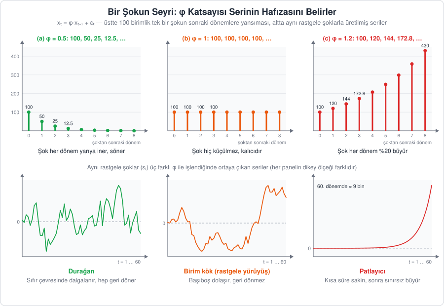

*Şekil 3.4 — Üstte, 100 birimlik tek bir şokun $`x_t = \phi x_{t-1} + \varepsilon_t`$ formülüyle hesaplanan seyri: (a) $`\phi = 0.5`$ iken söner, (b) $`\phi = 1`$ iken aynen kalır, (c) $`\phi = 1.2`$ iken büyür. Altta, aynı rastgele şoklar üç farklı $`\phi`$ ile işlendiğinde ortaya çıkan 60 dönemlik seriler: durağan seri sıfır çevresinde dalgalanır, rastgele yürüyüş geri dönmeden dolaşır, patlayıcı seri sınırsız büyür.*

Rastgele yürüyüşün varyansının neden $t\sigma^2$ olduğu da artık kolayca görülür. $x_0 = 0$'dan başlarsak $x_1 = \varepsilon_1$, $x_2 = \varepsilon_1 + \varepsilon_2$, …, $x_t = \varepsilon_1 + \varepsilon_2 + \dots + \varepsilon_t$ olur: Seri, o güne kadarki bütün şokların toplamıdır. Bağımsız büyüklüklerin toplamının varyansı, varyanslarının toplamına eşittir. Bu yüzden $\mathrm{Var}(x_t) = \sigma^2 + \sigma^2 + \dots + \sigma^2 = t\sigma^2$ olur. Örneğin $\sigma^2 = 1$ ise 1. günde varyans 1, 100. günde 100'dür (standart sapma 10). Ortalama hep 0 kalsa da serinin sıfırdan ne kadar uzaklaşabileceği zamanla büyür; Şekil 3.3d'nin anlattığı budur.

**Denklemin kökü.** Matematikte bir denklemin **kökü**, içindeki bilinmeyenin yerine yazıldığında eşitliği doğru yapan, yani ifadeyi sıfıra eşitleyen değerdir. İki örnek:

- $2x - 6 = 0$ denkleminde $x$ yerine 3 yazarsak $2 \cdot 3 - 6 = 0$ olur. Denklemin kökü $x = 3$'tür.
- $x^2 - 9 = 0$ denkleminde karesi 9 olan iki sayı vardır: $3^2 = 9$ ve $(-3)^2 = 9$. Bu denklemin iki kökü vardır: $x = 3$ ve $x = -3$.

Grafik üzerinde kök, ifadenin grafiğinin yatay ekseni (sıfır çizgisini) kestiği noktadır, çünkü tam o noktada ifadenin değeri sıfırdır. $2x - 6$ ve $x^2 - 9$ gibi, bilinmeyenin kuvvetlerinin ($x$, $x^2$, $x^3$, …) sabit sayılarla çarpılıp toplandığı ifadelere **polinom** denir. $2x - 6$ birinci dereceden, $x^2 - 9$ ikinci dereceden bir polinomdur.

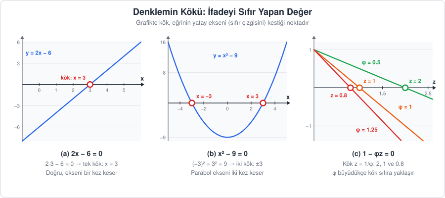

*Şekil 3.5 — Denklemin kökü, grafiğin yatay ekseni kestiği noktadır. (a) $`2x - 6 = 0`$ tek köklüdür: $`x = 3`$. (b) $`x^2 - 9 = 0`$ iki köklüdür: $`x = \pm 3`$. (c) AR(1) modelinin karakteristik denklemi $`1 - \phi z = 0`$: kök $`z = 1/\phi`$'dir; $`\phi = 0.5`$ için 2, $`\phi = 1`$ için 1, $`\phi = 1.25`$ için 0.8.*

**AR(1) modelinden "kök"e: gecikme operatörü ve $z$.** AR(1) denkleminin bir kökü olabilmesi için önce onu bir polinom gibi yazmamız gerekir. Bunun için Bölüm 2.1'deki gecikme operatörünü ($B x_t = x_{t-1}$, birçok kaynakta $L$) kullanırız. Adım adım:

1. Denklemi yazıp $x_{t-1}$ terimini sol tarafa geçiririz: $x_t - \phi x_{t-1} = \varepsilon_t$.
2. $x_{t-1}$ yerine $B x_t$ yazarız: $x_t - \phi B x_t = \varepsilon_t$.
3. Her iki terimde ortak olan $x_t$'yi paranteze alırız:

$$
(1 - \phi B)\, x_t = \varepsilon_t
$$

Parantezin içi, modelin iskeletidir: "Bugünkü değerden, dünkü değerin $\phi$ katını çıkar; geriye yalnızca bugünün şoku kalır." Ancak $B$ bir sayı değil, "bir adım geri git" **komutudur**. "$1 - \phi B = 0$ olsun, $B$'yi çözelim" diyemeyiz; bir komutun sayısal değeri olmaz. Matematikçiler bu tür zaman içinde ilerleyen sistemleri (*fark denklemlerini*) incelerken şu yolu izler: Komut olan $B$'nin yerine geçici olarak sıradan bir bilinmeyen koyarlar, genellikle $z$ harfini. Bu $z$ gökten inmemiştir; $B$'nin yerine konmuş bir **kukla değişkendir**. Böylece iskelet, kökü bulunabilen sıradan bir denkleme dönüşür. Bu denkleme modelin **karakteristik denklemi** denir:

$$
1 - \phi z = 0
$$

Bu birinci dereceden denklemi $2x - 6 = 0$ gibi çözeriz: $\phi z = 1$, buradan $z = 1/\phi$. Sayılarla:

| $`\phi`$ | Kök $`z = 1/\phi`$ | Kökün sıfıra uzaklığı | Seri |
| --- | --- | --- | --- |
| 0.5 | 1 / 0.5 = 2 | 1'den büyük | Durağan, şoklar söner |
| 1 | 1 / 1 = 1 | Tam 1 | Birim kök, rastgele yürüyüş |
| 1.25 | 1 / 1.25 = 0.8 | 1'den küçük | Patlayıcı |

Adın kaynağı da buradadır: Matematikte 1 sayısına **birim** denir. $\phi = 1$ olduğunda karakteristik denklemin kökü tam 1 çıkar; yani modelin **kökü birimdir**. "Birim kök" (*unit root*) adı buradan gelir. Bir seride birim kök olması, şokların hiç sönmemesi, birikerek kalması ve serinin durağan olmaması demektir.

**Kural: kök 1'den uzaksa durağan.** Kök ile katsayı birbirinin tersidir ($z = 1/\phi$). Bu yüzden katsayı 1'den küçükken kök 1'den büyüktür; katsayı 1'e yaklaştıkça kök de 1'e yaklaşır. Negatif katsayılar da olabileceği için büyüklüğü işaretten bağımsız ölçen **mutlak değer** kullanılır: $\lvert z \rvert$, sayının işaretini atıp sıfıra uzaklığına bakmaktır ($\lvert -2 \rvert = 2$, $\lvert 0.8 \rvert = 0.8$). Kural şöyledir:

- $\lvert z \rvert > 1 \iff \lvert \phi \rvert < 1$: kök sıfıra 1'den daha uzaktır, seri **durağandır**.
- $\lvert z \rvert = 1 \iff \lvert \phi \rvert = 1$: **birim kök**, seri durağan değildir.
- $\lvert z \rvert < 1 \iff \lvert \phi \rvert > 1$: seri **patlayıcıdır**.

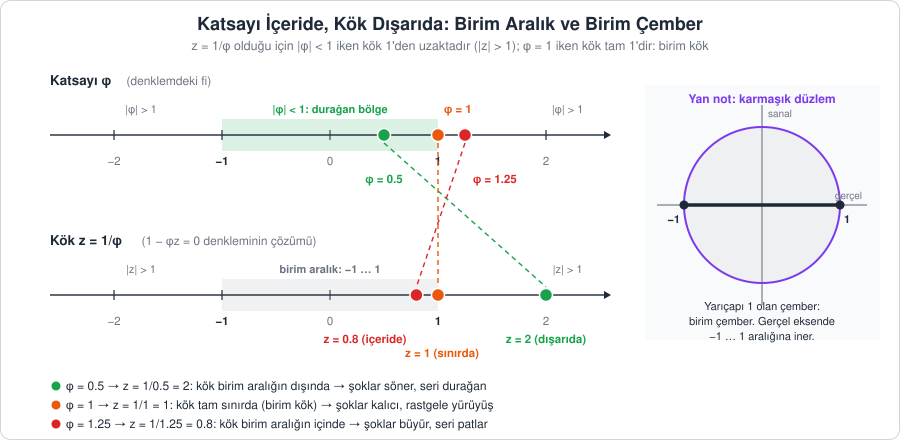

*Şekil 3.6 — Üst sayı doğrusu katsayıyı ($`\phi`$), alttaki kökü ($`z = 1/\phi`$) gösterir. Katsayı −1 ile 1 arasındaysa (yeşil bölge) kök bu aralığın dışına düşer ve seri durağandır. $`\phi = 1`$ iken kök tam sınırdadır (birim kök). Sağda, karmaşık sayılarda aynı sınırın bir çember olduğu gösterilir: birim çember.*

Bu kural kaynaklarda çoğu zaman "**kökler birim çemberin dışında olmalıdır**" diye yazılır. Gerçel sayılarla çalışırken bu cümleyi Şekil 3.6'daki sayı doğrusuyla okuyabilirsiniz: Sıfıra uzaklığı tam 1 olan yalnızca iki nokta vardır, −1 ve +1. "Birim çemberin içi" −1 ile 1 arasındaki aralık, "dışı" bu aralığın ötesidir. *Yan not:* Daha uzun modellerde kökler karmaşık sayı çıkabilir (örneğin $1.2 + 0.9i$ gibi, gerçel ve sanal kısmı olan sayılar). Karmaşık sayılar bir doğruya değil bir düzleme yerleştirilir. O düzlemde sıfıra uzaklığı 1 olan noktalar bir çember oluşturur: **birim çember**. Kural aynıdır; örnekteki kökün sıfıra uzaklığı $\sqrt{1.2^2 + 0.9^2} = \sqrt{2.25} = 1.5 > 1$ olduğu için durağanlık koşulunu sağlar.

Aynı koşul bazen tersinden, katsayılar üzerinden yazılır: "Katsayı (ya da VAR modelinde katsayı matrisinin **öz değerleri**) birim çemberin **içinde** olmalıdır", yani $\lvert \phi \rvert < 1$. Kök ile katsayı birbirinin tersi olduğu için iki cümle aynı şeyi söyler: **katsayı içerideyse kök dışarıdadır.** Bölüm 10.5'teki "öz değerler birim çemberin içinde" koşulu bu ikinci yazımdır. Okuduğunuz cümlede kökten mi, katsayıdan (öz değerden) mi söz edildiğine bakın: Kök için "dışarıda", katsayı için "içeride" durağanlık demektir.

**Daha uzun modellerde kökler.** AR(1)'de tek katsayı olduğu için kökü hesaplamadan doğrudan $\lvert \phi \rvert < 1$ koşuluna bakmak yeterlidir. Ama model birden fazla gecikme içerdiğinde (Bölüm 7.1.1'deki AR(p)) katsayılara tek tek bakmak yanıltır. Örneğin $x_t = 1.5\,x_{t-1} - 0.5\,x_{t-2} + \varepsilon_t$ modelinde ilk katsayı 1'den büyüktür ama seri patlamaz. Aynı adımlarla karakteristik denklem $1 - 1.5z + 0.5z^2 = 0$ olur. Bu ikinci dereceden polinom $(1 - z)(1 - 0.5z)$ biçiminde çarpanlarına ayrılır (çarpımı açarak kontrol edebilirsiniz: $1 - 0.5z - z + 0.5z^2 = 1 - 1.5z + 0.5z^2$). Kökleri $z = 1$ ve $z = 2$'dir. Köklerden biri tam 1 olduğu için bu seri de **birim köklüdür**: Bir kez farkı alındığında, kalan kısım $\phi = 0.5$ olan durağan bir AR(1) gibi davranır. Karakteristik denklemin bütün kökleri birim çemberin dışındaysa seri durağandır; bu genel kural her model uzunluğunda geçerlidir. R'da polinom köklerini `polyroot()` bulur:

```r
# Katsayılar sabit terimden başlayarak verilir: c(1, -0.5) -> 1 - 0.5z
Mod(polyroot(c(1, -0.5)))         # AR(1), phi = 0.5
#> [1] 2
Mod(polyroot(c(1, -1)))           # rastgele yürüyüş, phi = 1
#> [1] 1
Mod(polyroot(c(1, -1.5, 0.5)))    # 1 - 1.5z + 0.5z^2 = 0
#> [1] 1 2
```

Bu kod, yukarıda elle bulduğumuz kökleri R'a hesaplatır ve kural için gereken sayıyı, yani her kökün sıfıra uzaklığını verir. Model uzadıkça kökleri elle bulmak zorlaştığı için pratikte bu iş R'a bırakılır. Kodu satır satır okuyalım:

1. `# Katsayılar sabit terimden başlayarak verilir ...`: R'ın çalıştırmadığı bir yorum satırıdır (2.6) ve aşağıdaki satırları okumak için gereken kuralı hatırlatır.
2. `Mod(polyroot(c(1, -0.5)))`: İç içe fonksiyonlar içten dışa okunur. Önce `c()` (*combine*, birleştir) fonksiyonu 1 ve −0.5 sayılarını iki elemanlı bir **vektörde**, yani sıralı bir sayı listesinde birleştirir. Sonra `polyroot()` bu vektörü sabit terimden başlayan bir polinomun katsayıları olarak okur: 1. eleman sabit terim, 2. eleman $z$'nin katsayısı, (varsa) 3. eleman $z^2$'nin katsayısıdır. Yani `c(1, -0.5)` vektörü $1 - 0.5z$ polinomu demektir ve `polyroot()` $1 - 0.5z = 0$ denkleminin kökünü bulur. Kökler genel olarak karmaşık sayı olabileceği için (3.2'deki yan not) `polyroot()` sonucu her zaman karmaşık sayı biçiminde verir: Tek başına çalıştırılsaydı `2+0i` yazardı, yani gerçel kısmı 2, sanal kısmı 0 olan sayı. En dıştaki `Mod()` her kökün sıfıra uzaklığını (karmaşık sayının mutlak değerini) hesaplar; `2+0i` için bu uzaklık 2'dir. Birim çember kuralı için tam ihtiyaç duyduğumuz sayı budur. Satır sonundaki `# AR(1), phi = 0.5` da bir yorumdur: `#` işaretinden sonra satırın geri kalanını R okumaz.
3. `Mod(polyroot(c(1, -1)))`: Aynı işi $1 - z$ polinomu, yani $\phi = 1$ olan rastgele yürüyüş için yapar.
4. `Mod(polyroot(c(1, -1.5, 0.5)))`: Vektörde üç katsayı olduğu için polinom ikinci derecedendir: $1 - 1.5z + 0.5z^2$. İkinci dereceden bir polinomun iki kökü olduğu için sonuç iki elemanlı bir vektördür. `polyroot()` sonucu tek başına yazdırılırsa `1+3.56945e-20i` ve `2-3.56945e-20i` gibi değerler görülebilir. Buradaki `e-20` "çarpı 10 üzeri −20" demektir; bu kadar küçük sanal kısımlar, bilgisayarın ondalıklı sayılarla hesap yaparken bıraktığı yuvarlama kırıntılarıdır ve aslında sıfırdır. `Mod()` bu kırıntıları da temizleyip düz uzaklıkları verir.

Kodun altındaki `#>` satırları çıktılardır. `[1]`, satırın vektörün 1. elemanıyla başladığını gösteren sıra numarasıdır (2.6). İlk çıktı `[1] 2`: $1 - 0.5z = 0$ denkleminin kökü 2'dir, tablodaki $1 / 0.5 = 2$ ile aynıdır ve 1'den büyük olduğu için seri durağandır. İkinci çıktı `[1] 1`: Kök tam 1'dir, yani birim kök. Üçüncü çıktı `[1] 1 2` iki sayı içerir, çünkü iki kök vardır: 1 ve 2. Bu, yukarıda çarpanlara ayırarak bulduğumuz köklerle aynıdır. Köklerden biri tam 1 olduğu, yani birim çemberin dışında değil tam üzerinde olduğu için iki gecikmeli model de birim köklüdür.

**ADF testi: hipotezler ve p-değeri.** Gerçek veride $\phi$'yi bilmeyiz; elimizde yalnızca gözlenmiş seri vardır. Bu seriden tahmin edilen katsayı, şans eseri 1'den biraz küçük ya da büyük çıkabilir. "Bu fark gerçek mi, yoksa tesadüf mü?" sorusunu yanıtlayan araca **hipotez testi** denir. Birim kök için en yaygın test **ADF** (*Augmented Dickey-Fuller*, genişletilmiş Dickey-Fuller) testidir. ADF iki iddiayı karşı karşıya koyar:

- **Sıfır hipotezi** $H_0$: "Seride birim kök vardır ($\phi = 1$); seri durağan değildir."
- **Alternatif hipotez** $H_1$: "Birim kök yoktur ($\phi < 1$); seri durağandır." R çıktılarında gördüğünüz `alternative hypothesis: stationary` satırı tam olarak bunu söyler.

Hipotez testini bir mahkemeye benzetebiliriz. Sanık, suçu kanıtlanana kadar **masum** kabul edilir. ADF'de "masumiyet" varsayımı $H_0$'dır: Seri, aksi kanıtlanana kadar birim köklü kabul edilir. Veri (delil) bu varsayımla çok zor bağdaşıyorsa $H_0$ **reddedilir** ve seri durağan kabul edilir.

Delilin gücünü **p-değeri** ölçer: $H_0$ doğru olsaydı, elimizdeki kadar (ya da daha) aşırı bir sonucu sırf şans eseri görme olasılığıdır. Bir benzetme: Bir paranın hilesiz olduğunu varsayalım ($H_0$). On atışta on kez yazı gelirse, hilesiz bir parada bunun olasılığı $(1/2)^{10} = 1/1024 \approx 0.001$'dir. Bu sonuç "hilesiz para" varsayımı altında o kadar şaşırtıcıdır ki varsayımdan şüphe ederiz. p-değeri küçükse veri $H_0$ altında şaşırtıcıdır; büyükse şaşırtıcı değildir.

Karar için önceden bir eşik seçilir, genellikle **0.05** (yüzde 5). Bu eşik, $H_0$ aslında doğruyken onu yanlışlıkla reddetme riskini en fazla %5'te tutmayı kabul ettiğimiz anlamına gelir. ADF için kural:

- **p < 0.05:** $H_0$ reddedilir. Birim kök yoktur, seri durağan kabul edilir.
- **p ≥ 0.05:** $H_0$ reddedilemez. Seriyi birim köklü kabul edip durağanlaştırmak için fark alırız (gerekirse log dönüşümüyle birlikte).

İkinci durumdaki ince noktayı kaçırmayın: **"Reddedilemedi", "kanıtlandı" demek değildir.** Mahkemede beraat eden sanık için "masum olduğu kanıtlandı" denmez, "suçu kanıtlanamadı" denir. p = 0.40 sonucu "birim kök olduğu kanıtlandı" anlamına gelmez; yalnızca durağanlığı gösterecek kadar güçlü delil yoktur. Kısa serilerde ADF'nin $H_0$'ı reddetmesi zordur. Bu yüzden ADF, hipotezleri tam ters kuran **KPSS** testiyle ($H_0$: seri durağandır) ve grafikle birlikte kullanılır.

ADF, $\phi = 1$ olup olmadığını küçük bir cebir hilesiyle sınar. AR(1) denkleminin iki tarafından $x_{t-1}$ çıkarılırsa

$$
x_t - x_{t-1} = (\phi - 1)\, x_{t-1} + \varepsilon_t, \qquad \text{yani} \qquad \nabla x_t = (\phi - 1)\, x_{t-1} + \varepsilon_t
$$

elde edilir. $\phi = 1$ ise sağdaki katsayı $\phi - 1 = 0$ olur; $\phi = 0.5$ ise $-0.5$ olur. Böylece "$\phi = 1$ mi?" sorusu "farkı alınmış seriyi önceki seviyeye bağlayan katsayı sıfır mı?" sorusuna dönüşür. Bu katsayı veriden **regresyonla**, yani verideki ilişkiyi en iyi açıklayan katsayıyı bulan yöntemle tahmin edilir. ADF'deki "genişletilmiş" (*augmented*) kelimesi, denkleme gecikmeli fark terimleri de eklendiğini anlatır. Regresyonun tam biçimi (orada bu katsayı $\gamma$ ile gösterilir), KPSS testi ve iki testin birlikte yorumlanması Bölüm 7.5'tedir.

> **Simge notu:** $`H_0`$ *(ha sıfır)*: sıfır hipotezi, testin aksi kanıtlanana kadar doğru kabul ettiği varsayım · $`H_1`$ *(ha bir)*: alternatif hipotez, $`H_0`$ reddedilirse kabul edilen iddia (bazı kaynaklarda $`H_a`$) · $`\lvert z \rvert`$ *(z'nin mutlak değeri)*: z'nin sıfıra uzaklığı · $`\iff`$ *(ancak ve ancak)*: iki ifade birlikte doğru ya da birlikte yanlıştır · $`z`$: karakteristik denklemde B (ya da L) operatörünün yerine konan bilinmeyen

**Not — iki farklı "durağan olmayan" türü:**

- **Trend-durağan (trend-stationary):** $x_t = \beta_0 + \beta_1 t + \varepsilon_t$. Deterministik trend çıkarılınca seri durağan olur. Şoklar geçicidir, seri trende geri döner.
- **Fark-durağan (difference-stationary, birim köklü):** $x_t = x_{t-1} + \varepsilon_t$ (rastgele yürüyüş). Burada $\mathrm{Var}(x_t) = t\sigma^2$ olur. Şoklar **kalıcıdır**, bu yüzden seriyi durağanlaştırmak için fark almak gerekir: $\nabla x_t = \varepsilon_t$.

> **Simge notu:** $`\beta_0`$, $`\beta_1`$ *(beta sıfır, beta bir)*: doğrusal trendin sabit terimi (başlangıç düzeyi) ve eğimi (her dönemdeki artış) · $`\varepsilon_t`$ *(epsilon t)*: t anındaki rastgele şok (hata terimi), ortalaması sıfır

Örneğin $\beta_0 = 100$ ve $\beta_1 = 2$ ise trend çizgisi 100'den başlar ve her dönem 2 birim yükselir; seri bu çizginin çevresinde dalgalanır ve bir şoktan sonra yine çizgiye döner. Rastgele yürüyüşte ise dönülecek bir çizgi yoktur. Bu ayrım önemlidir çünkü yanlış dönüşüm (trend-durağan seriden fark almak ya da birim köklü seriden sadece trend çıkarmak) hatalı modellere yol açar. ARIMA'daki "I" (Integrated) harfi tam olarak bu fark alma işlemini temsil eder.

**Durağanlığı nasıl anlarız?**

1. **Göz ile:** Seriyi çizin. Belirgin bir trend, mevsimsellik ya da açılan bir "huni" varsa seri büyük olasılıkla durağan değildir.
2. **ACF grafiği ile:** Durağan olmayan serilerde ACF çok yavaş söner (ayrıntısı Bölüm 6'da).
3. **İstatistiksel testlerle:** ADF testi ($H_0$: birim kök var, yani seri durağan değil) ve KPSS testi ($H_0$: seri durağan). İki test zıt hipotezler kurduğu için birlikte kullanılması önerilir. Bu testlerin ARIMA modellemesindeki kullanımı Bölüm 7.5 ve 7.6.2'de gösterilmektedir.

**Mini uygulama (R):** Beyaz gürültü ile rastgele yürüyüşü üretip karşılaştıralım ve ADF testinin ikisini ayırt edip edemediğine bakalım.

```r
set.seed(42)
beyaz_gurultu <- rnorm(200)             # durağan
rastgele_yuruyus <- cumsum(rnorm(200))  # durağan değil (birim kök)

par(mfrow = c(1, 2))
plot.ts(beyaz_gurultu, main = "Beyaz Gürültü (durağan)")
plot.ts(rastgele_yuruyus, main = "Rastgele Yürüyüş (durağan değil)")
par(mfrow = c(1, 1))

# install.packages("tseries")
library(tseries)
adf.test(beyaz_gurultu)           # küçük p-değeri -> H0 reddedilir -> durağan
#>  Augmented Dickey-Fuller Test
#> data:  beyaz_gurultu
#> Dickey-Fuller = -5.6389, Lag order = 5, p-value = 0.01
#> alternative hypothesis: stationary
#> Warning: p-value smaller than printed p-value

adf.test(rastgele_yuruyus)        # büyük p-değeri -> H0 reddedilemez (birim kök)
#> Dickey-Fuller = -1.9193, Lag order = 5, p-value = 0.6099
#> alternative hypothesis: stationary

adf.test(diff(rastgele_yuruyus))  # farkı alınınca durağanlaşır
#> Dickey-Fuller = -6.09, Lag order = 5, p-value = 0.01
#> alternative hypothesis: stationary
#> Warning: p-value smaller than printed p-value
```

Bu kodda durağan seriyi ve birim köklü seriyi bilerek biz üretiyoruz. Doğru cevabı önceden bildiğimiz için hem iki serinin grafikte nasıl farklı göründüğünü görebilir hem de ADF testinin doğru karar verip vermediğini kontrol edebiliriz. Kodu satır satır okuyalım:

1. `set.seed(42)`: Bilgisayarın ürettiği "rastgele" sayılar aslında bir formülle, bir başlangıç noktasından yola çıkarak üretilir. `set.seed()` bu başlangıç noktasını (*tohum*, seed) sabitler. Böylece kodu her çalıştıran aynı "rastgele" sayıları alır ve aşağıdaki çıktıları aynen görür. 42 sayısının özel bir anlamı yoktur; başka bir sayı farklı ama yine tekrarlanabilir sonuçlar verir.
2. `beyaz_gurultu <- rnorm(200)`: `rnorm()`, **normal dağılımdan** (çan eğrisi biçimli dağılım) rastgele sayılar üretir. Tek argümanı olan 200, kaç sayı üretileceğidir. Fonksiyonun `mean` (ortalama) ve `sd` (standart sapma) argümanları yazılmadığı için varsayılan değerleri, yani ortalama 0 ve standart sapma 1 kullanılır. Sonuç 200 sayılık bir vektördür ve `<-` ile `beyaz_gurultu` adıyla saklanır. Bu sayılar birbirinden bağımsız $\varepsilon_t$ şoklarıdır, yani beyaz gürültüdür. Satır sonundaki `# durağan` bir yorumdur.
3. `rastgele_yuruyus <- cumsum(rnorm(200))`: İçten dışa okuyalım. Önce `rnorm(200)` 200 yeni sayı üretir; üreteç kaldığı yerden devam ettiği için bunlar 2. satırdaki sayılardan farklıdır. Sonra `cumsum()` bu sayıların **birikimli toplamını** alır: `cumsum(c(1, -2, 3))` sonucu `1, -1, 2` olur. Her eleman, kendisine kadarki tüm sayıların toplamıdır. Bu, $x_t = x_{t-1} + \varepsilon_t$ (başlangıç $x_0 = 0$) formülünün aynısıdır; yani `cumsum(rnorm(200))` bir rastgele yürüyüş üretir ($\phi = 1$). Sonuç yine 200 sayılık bir vektördür.
4. `par(mfrow = c(1, 2))`: `par()` grafik ayarlarını değiştirir. `mfrow` ayarı grafik alanını satır ve sütunlara böler; `c(1, 2)` "1 satır, 2 sütun" demektir. Böylece sonraki iki grafik yan yana çizilir.
5. `plot.ts(beyaz_gurultu, main = "Beyaz Gürültü (durağan)")` ve bir sonraki satır: `plot.ts()` bir vektörü zaman serisi grafiği olarak, yani değerleri sırayla çizgiyle birleştirerek çizer. Bu vektörlerin tarih bilgisi olmadığı için yatay eksen gözlem sıra numarasıdır (1'den 200'e, eksen adı `Time`). `main` argümanı grafiğin başlığıdır ve tırnak içinde metin olarak verilir.
6. `par(mfrow = c(1, 1))`: Grafik alanını yeniden tek parçaya döndürür; aksi hâlde sonraki grafikler de yan yana çizilmeye devam ederdi.
7. `# install.packages("tseries")`: Başındaki `#` yüzünden çalışmayan bir satırdır. `tseries` paketi bilgisayarınızda kurulu değilse `#` işaretini silip bu satırı **bir kez** çalıştırırsınız; `install.packages()` paketi internetten (CRAN'dan) indirip kurar. Paket adı tırnak içinde yazılır.
8. `library(tseries)`: `adf.test()` fonksiyonunu içeren `tseries` paketini bu oturuma yükler. Kurulum bir kez yapılır, `library()` ise R'ı her açtığınızda yeniden çalıştırılır. Yükleme sırasında bazı kurulumlarda `Registered S3 method overwritten by 'quantmod'` gibi bir bilgi mesajı görülebilir; hata değildir.
9. `adf.test(beyaz_gurultu)`: ADF testini uygular. Bu fonksiyon regresyona bir sabit ve doğrusal trend de ekler; bu yüzden $H_1$ burada "seri bir trend çevresinde durağandır" anlamına gelir (Bölüm 7.5). Yalnızca seri verilmiştir, diğer iki argüman varsayılan değerlerini alır. `alternative` argümanının varsayılanı `"stationary"`dir; $H_1$'in "durağan" olması buradan gelir. `k` argümanı, regresyona kaç gecikmeli fark terimi ekleneceğidir; varsayılanı $(n - 1)^{1/3}$ sayısının tam kısmıdır ($n$: gözlem sayısı). 200 gözlem için $199^{1/3} \approx 5.84$, tam kısmı 5'tir; çıktıdaki `Lag order = 5` budur. Sonuç bir test nesnesidir (`htest` sınıfı); bir isme atanmadığı için doğrudan ekrana yazılır.
10. `adf.test(rastgele_yuruyus)`: Aynı testi rastgele yürüyüşe uygular.
11. `adf.test(diff(rastgele_yuruyus))`: İçten dışa: Önce `diff()` birinci farkı alır, $\nabla x_t = x_t - x_{t-1}$. Her eleman bir öncekinden çıkarıldığı için sonuç 199 sayılık bir vektördür. Rastgele yürüyüşün farkı, onu oluşturan şokların kendisidir. Sonra bu farklar ADF testine verilir. Gecikme sayısı yine 5'tir ($198^{1/3} \approx 5.83$).

İki grafik yan yana çıkar. Solda beyaz gürültü, yaklaşık −3 ile +2.7 arasında, hep sıfır çizgisinin çevresinde ve serinin başından sonuna aynı genişlikte dalgalanır. Sağda rastgele yürüyüş sabit bir düzeye bağlı değildir: uzun süre aşağı inip yaklaşık −8'e kadar düşer, sonra yeniden +2 dolayına çıkar. Durağan olmayan bir serinin "dönülecek bir çizgisi olmaması" bu görüntüdür.

Her `adf.test()` çıktısı aynı satırlardan oluşur (notta yer kazanmak için ikinci ve üçüncü çıktıda ilk iki satır, yani test adı ve `data:` satırı gösterilmemiştir):

- `Augmented Dickey-Fuller Test`: Uygulanan testin adı.
- `data: beyaz_gurultu`: Testin hangi veriye uygulandığı.
- `Dickey-Fuller = -5.6389`: Test regresyonundan hesaplanan istatistik. Ne kadar negatifse birim kök aleyhine delil o kadar güçlüdür ve p-değeri o kadar küçük çıkar.
- `Lag order = 5`: Kullanılan gecikmeli fark terimi sayısı (9. madde).
- `p-value = 0.01`: Karar için bakacağımız asıl sayı.
- `alternative hypothesis: stationary`: Testin **sonucu değil**, sınanan alternatif hipotezdir ($H_1$: seri durağandır). Bu satır her çıktıda aynıdır; seri durağan olsa da olmasa da yazılır. Kararı p-değeri verir.
- `Warning: p-value smaller than printed p-value`: R bu uyarıyı ekranda `Warning message: In adf.test(beyaz_gurultu) : p-value smaller than printed p-value` biçiminde yazar. `adf.test()` p-değerini hazır bir tablodan okuduğu için sonucu 0.01 ile 0.99 arasına sıkıştırır. Gerçek p-değeri 0.01'den küçük olduğunda 0.01 yazar ve bu uyarıyı verir. Bu bir hata değildir; "p-değeri en fazla 0.01" diye okunur.

Beyaz gürültüde istatistik −5.64, p-değeri 0.01'dir: $H_0$ reddedilir, seri durağandır. Rastgele yürüyüşte istatistik yalnızca −1.92, p-değeri 0.61'dir: Bu sonuç $H_0$ altında hiç şaşırtıcı değildir, birim kök hipotezi reddedilemez. Farkı alınmış seride istatistik −6.09'a düşer ve p-değeri yeniden 0.01 olur. Bu, $\nabla x_t = \varepsilon_t$ ilişkisinin uygulamadaki karşılığıdır: Tek bir fark, birim kökü ortadan kaldırmıştır. Üç sonuç da bildiğimiz doğru cevapla örtüşür.

---

### 3.3. Ölçüm Zamanına Göre: Kesikli ve Sürekli Zaman

**Açıklama:** Bir odadaki sıcaklık, zamanın **her anında** bir değere sahiptir. Bu *sürekli* bir süreçtir. Ancak bir termometre bu sıcaklığı yalnızca belirli anlarda, örneğin her saat başı, kaydeder. Bilgisayara giren veri artık *kesikli* bir seridir. Film de böyledir: gerçek hareket süreklidir ama kamera saniyede 24 kare kaydeder.

**Tanım:**

- **Sürekli zamanlı seri:** $\lbrace x(t) : t \in \mathbb{R}\rbrace$. Zaman ekseni kesintisizdir.
- **Kesikli zamanlı seri:** $\lbrace x_t : t \in \mathbb{Z}\rbrace$. Gözlemler yalnızca belirli anlarda vardır. Sürekli bir süreçten $\Delta t$ aralıklarla **örnekleme (sampling)** yapılarak elde edilir:

$$
x_t = x(t \cdot \Delta t), \qquad t = 0, 1, 2, \dots
$$

> **Simge notu:** $`x(t)`$ *(x parantez t)*: sürekli zamanda t anındaki değer · $`\mathbb{Z}`$ *(tam sayılar)*: …, −1, 0, 1, 2, … kümesi · $`\Delta t`$ *(delta t)*: örnekleme aralığı · $`\cdot`$ *(çarpı)*: çarpma

İki gösterimin farkına dikkat edin: Parantezli $x(t)$ zamanın her anında tanımlıdır ($t = 2.37$ saat bile olabilir), alt indisli $x_t$ ise yalnızca tam sayı sıra numaralarında vardır. Formül, kesikli serinin $t$. gözleminin sürekli süreçte hangi ana karşılık geldiğini söyler. Örneğin her 15 dakikada bir ölçüm yapılıyorsa ($\Delta t = 0.25$ saat), $x_8 = x(8 \cdot 0.25) = x(2)$, yani ölçüm başladıktan 2 saat sonraki değerdir.


*Şekil 3.7 — Solda sürekli bir sinyal, sağda aynı sinyalin $`\Delta t`$ aralıklarla örneklenmiş kesikli hâli.*

Bu dersteki ve gerçek dünyadaki analizlerin **büyük çoğunluğu kesikli zamanlıdır**, çünkü bilgisayarlar yalnızca sonlu sayıda ölçümü saklayabilir. EKG, sismograf veya ses sinyali gibi doğası gereği sürekli olan süreçler bile analizden önce örneklenerek kesikli seriye dönüştürülür.

**Kesikli serilerde iki önemli ayrıntı:**

1. **Örnekleme frekansı:** $\Delta t$'nin seçimi hangi desenleri görebileceğimizi belirler. Aylık veride haftalık bir döngüyü asla göremezsiniz. R'daki `ts` nesnesinin `frequency` parametresi tam olarak bu bilgiyi tutar (ayrıntısı Bölüm 5'te).
2. **Düzenli ve düzensiz aralıklı seriler:**
    - *Düzenli (regular):* Gözlemler eşit aralıklıdır (her ay, her saat). Klasik modellerin (ARIMA vb.) çoğu bunu varsayar.
    - *Düzensiz (irregular):* Aralıklar eşit değildir (borsa yalnızca iş günleri açıktır, sensör ara sıra veri kaçırır). Bu tür veriler için `xts` gibi araçlar gerekir (ayrıntısı Bölüm 5'te).

> **Not — örtüşme (aliasing):** Bir salınımın **frekansı** ($`f`$), birim zamanda kaç kez tekrarlandığıdır: 24 saatlik gece-gündüz döngüsünün frekansı günde 1, 30 dakikalık bir döngünün frekansı saatte 2'dir. (Bu, R'daki `frequency` argümanından farklı bir kavramdır; orada frekans bir mevsimlik döngüdeki gözlem sayısıdır.) Örnekleme teoremine (Nyquist-Shannon) göre, $`f`$ frekanslı bir salınımı yakalayabilmek için örnekleme frekansının $`2f`$'den büyük olması, kabaca **her döngüde ikiden fazla ölçüm** yapılması gerekir. Daha seyrek örneklenirse hızlı döngüler kaybolur ya da yanlışlıkla yavaş döngüler gibi görünür. Örneğin günde bir kez, hep öğlen ölçülen sıcaklık serisinde her gün aynı noktada ölçüm yapıldığı için gece-gündüz döngüsü tamamen kaybolur (Şekil 3.8a). Günlük döngünün frekansı günde 1 olduğundan, onu görmek için günde 2'den fazla ölçüm gerekir; 6 saatte bir ölçüm (günde 4) döngüyü yakalar (Şekil 3.8b).

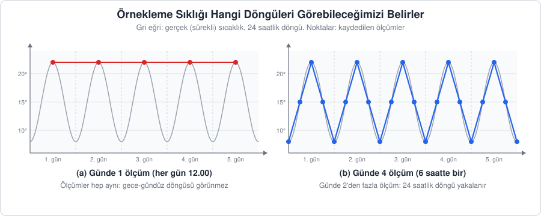

*Şekil 3.8 — Aynı günlük sıcaklık döngüsü (gri eğri) iki farklı sıklıkta ölçülüyor. (a) Günde bir kez, hep 12.00'de ölçülünce bütün ölçümler aynı çıkar ve döngü görünmez olur. (b) Günde dört ölçüm, döngü başına ikiden fazla ölçüm demektir ve 24 saatlik döngü yakalanır.*

---

### 3.4. Rastgelelik Durumuna Göre: Deterministik ve Stokastik

**Açıklama:** Güneşin yarın saat kaçta doğacağını saniyesine kadar hesaplayabiliriz. Bu **deterministik** bir olaydır. Ama yarın kaç kişinin otobüse bineceğini kesin olarak bilemeyiz. En iyi ihtimalle "büyük olasılıkla 900 ile 1100 arasında" diyebiliriz. Bu da **stokastik** (rastlantısal) bir olaydır.

**Tanım:**

- **Deterministik seri:** Tamamen bilinen bir fonksiyonla ifade edilir, hiçbir belirsizlik içermez:

$$
x_t = f(t), \qquad \text{örneğin} \quad x_t = A \sin\left(\frac{2\pi t}{P}\right) + \beta t
$$

> **Simge notu:** $`f(t)`$ *(ef t)*: zamanın bilinen bir fonksiyonu · $`A`$: dalganın genliği · $`\pi`$ *(pi)*: ≈ 3.14159 sabiti. Bölüm 3.2'deki $`\phi`$ (fi) bir katsayıdır, buradaki $`\pi`$ ise değişmeyen bir sayıdır · $`P`$: dalganın periyodu · $`\beta`$ *(beta)*: doğrusal trendin eğimi

Sinüs ($\sin$) fonksiyonu, düzenli bir dalga üreten fonksiyondur: −1 ile +1 arasında gidip gelir ve girdisi $2\pi$ kadar ilerleyince kendini tekrar eder. Formüldeki $2\pi t / P$ ifadesi, dalganın her $P$ adımda bir tamamlanmasını sağlar. Aylık veride $P = 12$ alalım:

| $`t`$ | 0 | 3 | 6 | 9 | 12 |
| --- | --- | --- | --- | --- | --- |
| $`2\pi t / 12`$ | 0 | $`\pi/2`$ | $`\pi`$ | $`3\pi/2`$ | $`2\pi`$ |
| $`\sin(2\pi t / 12)`$ | 0 | 1 | 0 | −1 | 0 |

Dalga 12 ayda bir tam tur atar ve 13. aydan itibaren aynı değerleri tekrarlar. $A$ genliktir: $A = 10$ ise dalga −10 ile +10 arasında salınır. $\beta t$ terimi ise her dönem $\beta$ kadar artan doğrusal trendi ekler. Hepsi önceden bilinen sayılar olduğu için seri herhangi bir $t$ için hatasız hesaplanabilir.

- **Stokastik seri:** Bir **stokastik sürecin** (rastgele değişkenler ailesi $\lbrace X_t\rbrace$) bir gerçekleşmesidir. Genellikle sistematik bir kısım ile rastgele bir kısmın toplamı olarak yazılır:

$$
x_t = f(t) + \varepsilon_t, \qquad \varepsilon_t \sim \text{iid}(0, \sigma^2)
$$

> **Simge notu:** $`\lbrace X_t \rbrace`$ *(büyük X t)*: stokastik süreç, yani her t için bir rastgele değişken · $`\sim`$ *(tilda)*: "… dağılımına sahiptir" · $`\text{iid}(0, \sigma^2)`$ *(ay-ay-di sıfır, sigma kare)*: ortalaması 0, varyansı σ² olan bağımsız ve özdeş dağılımlı değişkenler

Büyük harf $X_t$ ile küçük harf $x_t$ arasındaki fark, zar ile zarın gösterdiği sayı arasındaki fark gibidir. $X_t$ henüz atılmamış zardır: hangi değeri alacağı belli değildir, yalnızca olasılıkları bilinir (**rastgele değişken**). $x_t$ ise atış yapıldıktan sonra gözlenen sayıdır, örneğin 4.


*Şekil 3.9 — (a) Deterministik seride gelecek tek bir çizgidir. (b) Stokastik seride ise aynı geçmişten birçok farklı gelecek doğabilir. Bu yüzden tahmin, bir **nokta** değil bir **aralık** olarak verilir.*

**Önemli kavram — gerçekleşme (realization):** Elimizdeki gözlenmiş seri (ör. 1949–1960 yolcu sayıları), olası sonsuz sayıda yoldan **yalnızca biridir**. Tarihi geri sarıp yeniden oynatabilseydik, biraz farklı bir seri görecektik. Bu bakış açısı iki önemli sonuç doğurur:

1. Tahminler her zaman **belirsizlik** içerir. Bu nedenle `forecast()` çıktılarında %80 ve %95'lik **tahmin aralıkları** görürüz.
2. Sürecin özelliklerini (ortalama, varyans, ACF) **tek bir gerçekleşmeden** tahmin etmek zorundayız. Bu ancak süreç durağan (ve ergodik) ise mümkündür. **Ergodik** süreçte, tek bir uzun gerçekleşmenin zaman içindeki ortalaması, sürecin kuramsal ortalamasına yaklaşır: Bir zarı 1000 kez atıp ortalamayı almak, 1000 zarı birer kez atmakla aynı bilgiyi verir. İşte durağanlığın bu kadar önemli olmasının asıl nedeni budur. Durağan olmayan bir seride ise ortalama (trendli seride) ya da yayılım (rastgele yürüyüşte) dönemden döneme değiştiği için geçmişten hesaplanan ortalama ve varyans geleceği temsil etmez.

> **Gerçek dünyada** serilerin neredeyse tamamı stokastiktir. Deterministik bileşenler (trend, mevsimsellik) genellikle stokastik bir gürültüyle birlikte bulunur. Bölüm 2.2'deki $`x_t = T_t + S_t + C_t + I_t`$ ayrıştırması tam olarak bu fikre dayanır: $`T_t`$ ve $`S_t`$ büyük ölçüde sistematik, $`I_t`$ ise stokastik kısımdır.

---

### 3.5. Özet: Bir Seriyi Sınıflandırmak

Yeni bir veri setiyle karşılaştığınızda aşağıdaki dört soruyu sırayla sorun:

1. **Kaç değişken var?** → Tek değişkenli mi, çok değişkenli mi?
2. **Ortalama, varyans ve ilişkiler zamanla değişiyor mu?** → Durağan mı, değil mi?
3. **Veri nasıl ölçülmüş?** → Kesikli mi, sürekli mi? Aralıklar düzenli mi?
4. **Gelecek kesin olarak hesaplanabilir mi?** → Deterministik mi, stokastik mi?

Derste kullanacağımız serilerin sınıflandırması:

| Seri | Değişken sayısı | Durağanlık | Ölçüm zamanı | Rastgelelik |
| --- | --- | --- | --- | --- |
| `AirPassengers` (aylık yolcu) | Tek | Durağan değil (trend + mevsimsellik + artan varyans) | Kesikli, düzenli (aylık) | Stokastik |
| `USgas` (aylık gaz tüketimi) | Tek | Durağan değil (mevsimsellik) | Kesikli, düzenli (aylık) | Stokastik |
| Günlük hisse kapanış fiyatları | Tek | Durağan değil (birim kök) | Kesikli, düzensiz (yalnızca iş günleri) | Stokastik |
| Hisse fiyatının günlük getirisi | Tek | Genellikle yaklaşık durağan | Kesikli, düzensiz | Stokastik |
| Altın + enflasyon + faiz | Çok (3) | Genellikle durağan değil | Kesikli, düzenli (aylık) | Stokastik |
| EKG sinyali | Tek | Yaklaşık durağan (kısa pencerede) | Doğası sürekli, örneklenmiş hâli kesikli | Stokastik |
| $x_t = \sin(2\pi t / 12)$ | Tek | Durağan değil (ortalama $t$'ye bağlı) | Kesikli | Deterministik |

<details>
<summary><b>Kendinizi test edin (cevaplar için tıklayın)</b></summary>

1. **Bir şehirdeki günlük sıcaklık, nem ve elektrik tüketimi birlikte kaydediliyor. Bu seri hangi tiptir?**
   → Çok değişkenli ($k=3$), kesikli (günlük), stokastik. Yaz-kış mevsimselliği nedeniyle büyük olasılıkla durağan değildir.

2. **Rastgele yürüyüşün ortalaması sabit (0) olduğu halde neden durağan değildir?**
   → Çünkü varyansı $\mathrm{Var}(x_t) = t\sigma^2$ zamanla büyür. Durağanlık için ortalamanın yanında varyansın ve öz-kovaryansın da sabit olması gerekir.

3. **Hisse fiyatı durağan değilken günlük getirisi neden yaklaşık durağandır?**
   → Getiri, fiyatın (log) farkıdır: $r_t = \ln P_t - \ln P_{t-1}$. Fark alma işlemi birim kökü ortadan kaldırır.

   > **Simge notu:** $`\ln`$ *(doğal logaritma, "el en")*: e tabanında logaritma · $`P_t`$: t günündeki fiyat · $`r_t`$: t günündeki log getiri

4. **Saatlik ölçülen bir seride 30 dakikalık bir döngü görülebilir mi?**
   → Hayır. 30 dakikalık döngünün frekansı saatte 2'dir; bunu yakalamak için saatte 4'ten fazla ölçüm, yani 15 dakikadan daha sık örnekleme gerekir (Nyquist). Saatlik örneklemede bu döngü kaybolur ya da örtüşme nedeniyle yanıltıcı görünür.

5. **Bir AR(1) modelinde $`\phi = 0.8`$ tahmin edilmiş. Karakteristik denklemin kökü nedir, seri durağan mıdır? 100 birimlik bir şok iki dönem sonra kaça iner?**
   → $`1 - 0.8z = 0`$ denkleminden $`z = 1/0.8 = 1.25`$ bulunur. Kök 1'den büyük olduğu için (birim çemberin dışında) seri durağandır. Şok $`100 \to 0.8 \times 100 = 80 \to 0.8 \times 80 = 64`$ olur; yavaş da olsa söner.

6. **Bir seriye uygulanan ADF testi p = 0.32 verdi. "Seride birim kök olduğu kanıtlandı" demek doğru mu?**
   → Hayır. p = 0.32 > 0.05 olduğu için $`H_0`$ (birim kök var) yalnızca **reddedilemez**; bu bir kanıt değil, durağanlığı gösterecek delilin yetersiz olduğu anlamına gelir. Uygulamada seri birim köklü kabul edilip farkı alınır, sonuç KPSS testi ve grafikle desteklenir (Bölüm 7.5).

</details>

---

<a id="bolum-4"></a>

## 4. R'da Tarih ve Zaman Nesneleri

Bir zaman serisinde her gözlemin bir "ne zaman" bilgisi vardır. Bu bilgiyi yanlış okursak (ayı gün sanmak, saat dilimini karıştırmak, yaz saati geçişini unutmak) sonraki bütün analizler — grafikler, mevsimsellik, modeller — hatalı bir temel üzerine kurulur. Bu bölüm pratiğe geçmeden önce bu temeli sağlamlaştırır: tarih formatları, R'ın tarih/zaman sınıfları, saat dilimleri, `lubridate` paketi ve tarih aritmetiği.

Bölüm 5'te göreceğimiz `ts` ve `xts` nesneleri, burada öğrendiğimiz tarih sınıflarının üzerine kurulur.

### 4.1. Tarih Formatı Sorunu ve ISO 8601

Şu tarihe bir bakın: `01/02/2024`. Bu ne anlama geliyor? Cevap, metni okuyan kişinin (ya da yazılımın) hangi yazım düzenine alışkın olduğuna bağlıdır:

- **ABD'de (ay/gün/yıl):** ilk sayı ay, ikincisi gündür → 2 Ocak 2024.
- **Türkiye'de ve Avrupa'nın çoğunda (gün/ay/yıl):** ilk sayı gün, ikincisi aydır → 1 Şubat 2024.

Yani aynı metin, okuyanın alışkanlığına göre aralarında 30 gün olan iki farklı güne karşılık gelir. Japonya, Çin ve Kore gibi ülkelerde ise tarih büyükten küçüğe, **yıl/ay/gün** sırasıyla yazılır (`2024/02/01`). Bu sıra, aşağıda tanımlayacağımız ISO 8601 standardının sırasıyla aynıdır; yıl başta ve dört haneli olduğu için okuyan kişi sıranın yıl-ay-gün olduğunu hemen anlar.

Yanlış okuma ne zaman fark edilir? Gün kısmı 12'den büyük olan bir tarihte (`15/03/2024`) ay/gün okuması imkânsızdır, çünkü 15. ay yoktur. Ama bu, yazılımın size mutlaka bir hata mesajı göstereceği anlamına gelmez:

- R'da `as.Date("15/03/2024", format = "%m/%d/%Y")` (ay/gün/yıl kuralıyla okuma) hata vermez; sessizce `NA` (*Not Available*, "değer yok") döndürür. Binlerce satırlık bir sütunda bu `NA`'ları ancak özellikle ararsanız fark edersiniz (4.2.1).
- Python'daki pandas kütüphanesinde `pd.to_datetime("15/03/2024")` çağrısı, ay/gün okuması tutmayınca hata vermeden gün/ay okumasına geçer ve 15 Mart 2024 döndürür; yalnızca kolayca gözden kaçan bir uyarı yazar. Değerler tek tek dönüştürülürse aynı sütunda iki kural karışabilir: `01/02/2024` 2 Ocak, `15/03/2024` ise 15 Mart olarak okunur.

`01/02/2024` gibi gün ve ay kısmının ikisi de 12 ya da daha küçük olan tarihlerde durum daha da kötüdür: iki okuma da takvimde var olan bir gündür, bu yüzden ne `NA` oluşur ne de uyarı çıkar. Veri sessizce yanlış okunur ve bu hata, üzerine kurulan bütün analizi (aylık toplamlar, mevsimsellik, modeller) en başından geçersiz kılar. Çözüm, tarihleri tek anlamlı bir düzende yazmaktır.

**Tanım (ISO 8601):** Tarih ve saatin yazımı için kullanılan uluslararası standarttır (ISO: Uluslararası Standartlar Örgütü). Bileşenleri her zaman büyükten küçüğe sıralar: önce yıl, sonra ay, sonra gün. Yıl 4 haneyle, ay ve gün 2 haneyle yazılır (gerekirse başa 0 eklenir: Şubat `02`, ayın 1'i `01`). En sık kullanılan yazım tireli `YYYY-MM-DD` biçimidir (standart buna *genişletilmiş biçim* der); ayraçsız `YYYYMMDD` yazımı (`20240201`) da geçerlidir ve standartta *temel biçim* adını taşır. Harfler İngilizce baş harflerdir: `Y` yıl (*year*), `M` ay (*month*), `D` gün (*day*). Saat eklenecekse tarihten sonra `T` harfi (*time*) ve `HH:MM:SS` (saat:dakika:saniye) gelir: `YYYY-MM-DDTHH:MM:SS`. Saatin hangi saat dilimine ait olduğu sona eklenen bir işaretle belirtilir: `Z` harfi saatin UTC (dünya genelinde referans saat) olduğunu, `+03:00` gibi bir ek ise o yerel saatin UTC'den 3 saat ileride olduğunu gösterir. Hiçbir ek yoksa saatin hangi saat dilimine ait olduğu belirsizdir. (UTC ve saat dilimleri 4.2.2'de ayrıntılı açıklanıyor.)

| Yazım | Anlamı |
| --- | --- |
| `2024-02-01` | 1 Şubat 2024 (yalnızca tarih, genişletilmiş biçim) |
| `20240201` | Aynı tarih, ayraçsız temel biçim |
| `2024-02` | Şubat 2024 (yalnızca yıl ve ay) |
| `2024-02-01T14:30:00` | 1 Şubat 2024, 14:30:00 (saat dilimi belirtilmemiş) |
| `2024-02-01T14:30:00Z` | 1 Şubat 2024, 14:30:00 UTC |
| `2024-02-01T14:30:00+03:00` | 1 Şubat 2024, 14:30:00, UTC'den 3 saat ileride olan yerel saat (ör. Türkiye); UTC'de saat 14:30 − 3 = 11:30'dur |
| `2024-W05` | 2024'ün 5. ISO haftası: 29 Ocak (Pazartesi) – 4 Şubat (Pazar) 2024; 1 Şubat bu haftadadır |

Son satırdaki ISO haftası şöyle sayılır: haftalar pazartesi başlar ve yılın ilk perşembesini içeren hafta 1. haftadır. 2024'te 1 Ocak pazartesiye denk geldiği için 1. hafta 1–7 Ocak'tır; 5. hafta 1 + 4 × 7 = 29 Ocak'ta başlar ve 4 Şubat'ta biter.

ISO 8601'in üç önemli avantajı vardır:

1. **Tek anlamlıdır:** Standart yalnızca yıl-ay-gün sırasına izin verir ve yıl dört haneli olduğu için hangi parçanın yıl olduğu hemen anlaşılır; gün ile ay yer değiştiremez.
2. **Sıralanabilir:** Metin olarak alfabetik (soldan sağa, karakter karakter) sıralandığında kronolojik sıra da korunur. `2023-12-31` ile `2024-01-01` karşılaştırılırken ilk farklı karakter yılın son hanesidir (`3` < `4`), dolayısıyla 2023 önce gelir. Gün/ay/yıl yazımında ise `01/02/2024` metni, ondan önceki bir gün olan `31/12/2023`'ün önüne sıralanır, çünkü `0` < `3`. Bu yüzden ISO biçimi dosya adlarında bile işe yarar (`satis_2024-02-01.csv`). Bunun için ay ve günün iki haneli yazılması (`2024-2-1` değil `2024-02-01`) ve karşılaştırılan saatlerin aynı saat diliminde olması gerekir.
3. **Makine dostudur:** R, Python, SQL ve neredeyse tüm yazılımlar bu biçimi ek ayar gerektirmeden tanır.

Kendinize bir iyilik yapın: veriyi kaydederken ve paylaşırken her zaman ISO 8601 kullanın.


*Şekil 4.1 — "01/02/2024" metni ABD biçiminde 2 Ocak, Türkiye/Avrupa biçiminde 1 Şubat olarak okunur; ISO 8601 (2024-02-01) bu belirsizliği ortadan kaldırır. Alt kısım, R'ın aynı tarihi içeride nasıl sakladığını gösterir (4.2): `Date` için 1970-01-01'den bu yana geçen gün, `POSIXct` için saniye sayısı, `POSIXlt` için parçalara ayrılmış bir liste.*

### 4.2. R'da Tarih ve Zaman Sınıfları: `Date`, `POSIXct`, `POSIXlt`

> **Uygulama dosyası:** [`Codes/R/ch04_tarih_zaman.R`](Codes/R/ch04_tarih_zaman.R)
>
> Bu bölümdeki R kodlarının tamamı bu dosyada. RStudio'da açıp satır satır çalıştırabilir ya da depo kök dizininde `Rscript Codes/R/ch04_tarih_zaman.R` komutunu kullanabilirsiniz.

**Not —** Bu bölümdeki çıktılar, saat dilimi `Europe/Istanbul` ve tarih dili Türkçe olan bir bilgisayarda R 4.5 ile üretilmiştir. Kendi ayarlarınızı `Sys.timezone()` (saat dilimi) ve `Sys.getlocale("LC_TIME")` (tarih dili) ile görebilirsiniz. Saat dilimini kodda açıkça yazdığımız (`tz = ...`) satırlar her bilgisayarda aynı sonucu verir. Gün ve ay adları ise dil ayarına göre Türkçe (`Perşembe`) ya da İngilizce (`Thursday`) yazılır; Türkçe adları görmek için oturumun başında Windows'ta `Sys.setlocale("LC_TIME", "Turkish_Türkiye.utf8")` (Windows sürümüne göre adı `"Turkish_Turkey.utf8"` olabilir), Linux ve macOS'ta `Sys.setlocale("LC_TIME", "tr_TR.UTF-8")` çalıştırabilirsiniz.

R, bu format karmaşasını yönetmek için özel veri tipleri sunar. Temel fikir şudur: **tarih, ekranda metin gibi görünse de içeride bir sayıdır.** Sayı olduğu için tarihler sıralanabilir, birbirinden çıkarılabilir ve grafik eksenlerine yerleştirilebilir.

Bir sayının tarih olarak anlam kazanması için bir başlangıç noktası (sıfır noktası) gerekir. R, birçok yazılım gibi **1970-01-01** tarihini sıfır kabul eder; buna *Unix orijini* ya da *epoch* (sayımın başladığı an) denir. Cetveldeki sıfır çizgisi gibi düşünebilirsiniz: 1970-01-02 tarihi `1`, 1969-12-31 tarihi `-1` olarak saklanır; 1970'ten önceki tarihler negatif sayılardır.

**Tanım 1 (`Date`):** Yalnızca takvim gününü (yıl, ay, gün) tutar. İçeride, **1970-01-01'den bu yana geçen gün sayısı** olarak saklanır. Saatle işiniz yoksa (günlük, aylık, yıllık veriler) bunu kullanın.

**Tanım 2 (`POSIXct`):** Tarih ile saati birlikte tutar. İçeride, **1970-01-01 00:00:00 UTC'den bu yana geçen saniye sayısı** olarak saklanır (POSIX: Unix türevi işletim sistemlerinin ortak standardının adı; ct: *calendar time*, takvim zamanı). Tek bir sayı olduğu için hızlıdır, az yer kaplar ve veri çerçevelerinde (tablolarda) sütun olarak kullanılmaya en uygun sınıftır.

**Tanım 3 (`POSIXlt`):** Aynı anı, parçalarına ayrılmış bir **liste** olarak tutar (lt: *local time*, yerel zaman): saniye, dakika, saat, gün, ay, yıl, haftanın günü, yılın günü... Tek tek bileşenlere erişmek için kullanışlıdır, ama hesaplama ve depolama için `POSIXct` tercih edilir.

| Sınıf | Neyi tutar? | İçeride nasıl saklanır? | Tipik kullanım |
| --- | --- | --- | --- |
| `Date` | Gün | 1970-01-01'den bu yana gün (tam sayı) | Günlük/aylık/yıllık seriler |
| `POSIXct` | Gün + saat (+ saat dilimi) | 1970-01-01 00:00 UTC'den bu yana saniye | Saatlik, dakikalık, sensör, borsa verileri |
| `POSIXlt` | Gün + saat (+ saat dilimi) | Bileşen listesi (`year`, `mon`, `mday`, `hour`, ...) | Bileşenlere erişim, ara işlem |

Bunu doğrudan görelim. Kodu okurken: `#` işaretinden sonrası açıklamadır (yorum), R onu çalıştırmaz. `#>` ile başlayan satırlar komutun ekrana yazdığı çıktıdır; bunları siz yazmazsınız, R üretir. Çıktının başındaki `[1]`, o satırdaki ilk değerin sonucun 1. elemanı olduğunu gösteren bir sıra numarasıdır.

```r
# Date: içeride gün sayısı
d <- as.Date("2024-02-01")
class(d)
#> [1] "Date"
as.numeric(d)          # 1970-01-01'den bu yana geçen gün
#> [1] 19754
as.Date(19754)         # Ters yön: sayıdan tarihe
#> [1] "2024-02-01"
d + 1                  # Bir gün sonrası: sayıya 1 eklemek yeterli
#> [1] "2024-02-02"

# POSIXct: içeride saniye sayısı (saat UTC'ye göre 14:30)
ct <- as.POSIXct("2024-02-01 14:30:00", tz = "UTC")
class(ct)
#> [1] "POSIXct" "POSIXt"
as.numeric(ct)         # 1970-01-01 00:00:00 UTC'den bu yana geçen saniye
#> [1] 1706797800

# POSIXlt: bileşen listesi
lt <- as.POSIXlt(ct)
lt$hour                # Saat
#> [1] 14
lt$mday                # Ayın günü
#> [1] 1
lt$mon                 # Ay: DİKKAT, 0'dan başlar (0 = Ocak, 1 = Şubat)
#> [1] 1
lt$year                # Yıl: DİKKAT, 1900'den bu yana geçen yıl
#> [1] 124
lt$year + 1900
#> [1] 2024
```

Bu kod, aynı tarihi önce `Date`, sonra `POSIXct`, en son `POSIXlt` olarak oluşturup her birinin içine bakar. Amaç, yukarıdaki tablonun "İçeride nasıl saklanır?" sütununu kendi gözümüzle doğrulamaktır. Kodu satır satır okuyalım:

1. `d <- as.Date("2024-02-01")`: `as.Date()` bir *fonksiyondur*: parantez içine verilen girdiyi (*argüman*) alır ve bir sonuç üretir. Buradaki argüman tırnak içindeki `"2024-02-01"` metnidir; tırnak, bunun bir nesne adı değil düz metin (*karakter dizisi*) olduğunu söyler. `as.Date()` bu ISO 8601 metnini okuyup bir `Date` nesnesine çevirir. `<-` atama işaretidir: sağdaki işlemin sonucunu soldaki ada (`d`) kaydeder ("d'ye ata" diye okunur); bundan sonra `d` yazdığımızda bu tarih kullanılır. Atama satırları ekrana bir şey yazmaz, bu yüzden altında `#>` satırı yoktur.
2. `class(d)`: `class()` bir nesnenin sınıfını, yani türünü söyler. Sonuç `"Date"`'tir.
3. `as.numeric(d)`: `as.numeric()` nesneyi düz sayıya çevirir; böylece sınıf etiketi kalkar ve içerideki çıplak sayı görünür: `19754`. Yani 1 Şubat 2024, 1970-01-01'den 19 754 gün sonradır.
4. `as.Date(19754)`: Aynı fonksiyonun ters yönde kullanımıdır. Argüman metin değil sayı olduğunda `as.Date()` onu "1970-01-01'den bu yana geçen gün sayısı" olarak yorumlar ve yeniden 1 Şubat 2024'ü verir. (R 4.3'ten eski sürümlerde bu kullanımda başlangıç noktasını `origin = "1970-01-01"` diye ayrıca yazmak gerekiyordu.)
5. `d + 1`: Bir `Date` nesnesine 1 eklemek, içerideki gün sayısına 1 eklemektir (19 755). Sonuç yine bir `Date`'tir ve bir sonraki günü gösterir.
6. `ct <- as.POSIXct("2024-02-01 14:30:00", tz = "UTC")`: `as.POSIXct()` tarih ve saat içeren bir metni `POSIXct` nesnesine çevirir; metindeki saat `saat:dakika:saniye` düzenindedir. İkinci argüman *adlı argüman* biçiminde verilmiştir: `ad = değer` yazımı, fonksiyonun hangi ayarını değiştirdiğimizi açıkça söyler. `tz` (*time zone*, saat dilimi) argümanı, metindeki saatin hangi saat dilimine göre okunacağını belirler. Burada saat **UTC'ye göre** 14:30'dur; bu an, Türkiye saatiyle 17:30'a karşılık gelir. UTC'yi seçmemizin nedeni, sonucun her bilgisayarda aynı çıkmasıdır (aşağıdaki nota bakın). Sonuç `ct` adıyla saklanır.
7. `class(ct)`: Bu kez iki sınıf adı yazılır: `POSIXct` ve onun ortak üst sınıfı `POSIXt`. Bir R nesnesinin birden fazla sınıfı olabilir; `POSIXt`, `POSIXct` ile `POSIXlt`'nin ortak davranışlarını (ör. iki zamanı birbirinden çıkarmayı) taşıyan sınıftır.
8. `as.numeric(ct)`: İçerideki saniye sayısını gösterir. Bu sayı adım adım şöyle bulunur:
   - Bir gün $`24 \times 60 \times 60 = 86\,400`$ saniyedir. 1 Şubat 2024 gece yarısına kadar geçen tam günler: $`19\,754 \times 86\,400 = 1\,706\,745\,600`$ saniye.
   - Gece yarısından 14:30'a kadar 14,5 saat geçer: $`14{,}5 \times 3\,600 = 52\,200`$ saniye.
   - Toplam: $`1\,706\,745\,600 + 52\,200 = 1\,706\,797\,800`$. Çıktıdaki `1706797800` tam olarak budur.
9. `lt <- as.POSIXlt(ct)`: Aynı anı parçalarına ayrılmış bir `POSIXlt` listesine çevirir ve `lt` adıyla saklar. `ct` UTC'de olduğu için parçalar da UTC saatine göredir.
10. `lt$hour` ve `lt$mday`: Dolar işareti (`$`), bir listenin adı verilmiş bir parçasına erişir; `lt$hour` "`lt`'nin `hour` parçası" diye okunur. `hour` saati (14), `mday` (*month day*) ayın gününü (1) verir.
11. `lt$mon` ve `lt$year`: Burada iki tuzak vardır. Ay 0'dan sayılır (`0` = Ocak, dolayısıyla `1` Şubat demektir); yıl ise 1900'den itibaren sayılır (`124`). Bu alışkanlık, R'ın bu yapıyı C programlama dilinden devralmasından gelir.
12. `lt$year + 1900`: Yıl parçasına 1900 ekleyerek gerçek yılı bulur: $`124 + 1900 = 2024`$.

Çıktıları okurken: her sonuç tek bir değer olduğu için her satır `[1]` ile başlar. Tarihler çıktıda tırnak içinde görünür (`"2024-02-01"`); bu yalnızca R'ın `Date` nesnelerini ekrana yazma biçimidir, nesne metne dönüşmüş değildir (`class(d)` bunu doğrular). `class()` çıktılarındaki tırnaklı adlar ise gerçekten metindir. `19754`, `1706797800`, `14` gibi tırnaksız değerler sayıdır.

**Not —** `tz` argümanını vermeseydik R, metindeki saati bilgisayarın saat dilimine göre yorumlardı. Saat dilimi Türkiye olan bir bilgisayarda `as.numeric(as.POSIXct("2024-02-01 14:30:00"))` sonucu `1706787000` olur: Türkiye'de 14:30, UTC'de 11:30'dur ve bu sayı yukarıdakinden 3 saat (10 800 saniye) küçüktür. Aynı kod başka bir ülkedeki bilgisayarda başka bir sayı üretir; bu farkı 4.2.2'de ayrıntılı göreceğiz.

Sistem saatini almak için:

```r
Sys.Date()     # Bugünün tarihi (Date)
#> [1] "2024-10-26"
Sys.time()     # Şu anki zaman (POSIXct)
#> [1] "2024-10-26 15:30:00 +03"
```

Bu iki satır, bilgisayarın saatini okuyarak bugünün tarihini ve şu anki zamanı R nesnesi olarak verir; bir analizin çalıştırıldığı anı kaydetmek ya da "bugüne kadar kaç gün geçti?" gibi hesaplar için gerekir. Kodu satır satır okuyalım:

1. `Sys.Date()`: Bugünün tarihini `Date` olarak verir. Parantezler boştur, çünkü fonksiyon hiçbir argüman almaz; ama fonksiyonun çalışması için parantezleri yine de yazmak gerekir (parantezsiz `Sys.Date` yazmak fonksiyonu çalıştırmaz, onun kodunu ekrana döker).
2. `Sys.time()`: Şu anki zamanı saniyesine kadar `POSIXct` olarak verir.

Çıktıları okurken: yukarıdaki değerler yalnızca örnektir; siz çalıştırdığınızda o anın tarihi ve saati, bilgisayarınızın saat diliminde gösterilir. İkinci çıktı `YYYY-MM-DD HH:MM:SS` düzenindedir; sondaki `+03`, saatin UTC'den 3 saat ileride olduğunu söyler. Türkiye 2016'dan beri yıl boyu UTC+3 kullanır ve R'ın kullandığı saat dilimi veritabanında bu saat için harfli bir kısaltma (`EET` gibi) bulunmadığından R kısaltma yerine `+03` yazar.

#### 4.2.1. Metni Tarihe Çevirmek: `as.Date()` ve Format Kodları

Elimizdeki `"15/03/2024"` gibi bir metni R'ın anlayacağı bir `Date` nesnesine `as.Date()` ile çeviririz. Püf noktası şudur: **R'a metnin hangi biçimde yazıldığını `format` argümanıyla söylemeniz gerekir.** Argümanlar fonksiyona `ad = değer` biçiminde verilir; `format = "%d/%m/%Y"` gibi.

Biçim metnindeki `%d`, `%m`, `%Y` gibi parçalar *yer tutuculardır*: `%` işareti ve ardından gelen harf, "buraya gün / ay / yıl gelecek" der. Aradaki `/`, `.`, `-` gibi karakterler ise metinde birebir aynen bulunmalıdır. Örneğin `"%d/%m/%Y"` şunu söyler: önce gün, sonra `/`, sonra ay, sonra `/`, sonra dört haneli yıl. Biçim verilmezse R yalnızca `YYYY-MM-DD` ve `YYYY/MM/DD` biçimlerini dener; bu da tehlikeli sonuçlar doğurabilir:

```r
as.Date("2024-02-01")                    # ISO biçimi: sorunsuz
#> [1] "2024-02-01"

as.Date("01/02/2024")                    # Biçim verilmedi: YANLIŞ ama hata yok!
#> [1] "0001-02-20"

as.Date("01/02/2024", format = "%d/%m/%Y")   # Türkiye/Avrupa: gün/ay/yıl
#> [1] "2024-02-01"
as.Date("01/02/2024", format = "%m/%d/%Y")   # ABD: ay/gün/yıl
#> [1] "2024-01-02"
as.Date("01.02.2024", format = "%d.%m.%Y")   # Noktalı Türkçe yazım
#> [1] "2024-02-01"
as.Date("15/03/2024", format = "%m/%d/%Y")   # 15. ay yok: hata değil, sessizce NA
#> [1] NA
as.Date("2024-02-30", format = "%Y-%m-%d")   # Takvimde olmayan gün
#> [1] NA
```

Bu kod, aynı `as.Date()` fonksiyonunun biçim verildiğinde ve verilmediğinde nasıl davrandığını karşılaştırır; amaç, 4.1'de anlatılan sessiz yanlış okumayı R'da kendi gözümüzle görmek ve doğru okumanın `format` argümanıyla nasıl yapıldığını öğrenmektir. Kodu satır satır okuyalım:

1. `as.Date("2024-02-01")`: Biçim verilmemiştir. R sırasıyla `"%Y-%m-%d"` ve `"%Y/%m/%d"` biçimlerini dener; ISO metni ilk biçime uyduğu için sorunsuz okunur.
2. `as.Date("01/02/2024")`: Yine biçim yoktur; bu kez metin yanlış okunur ve hata da çıkmaz (nedeni aşağıdaki notta).
3. `as.Date("01/02/2024", format = "%d/%m/%Y")`: İlk argüman adsız (*konumsal*) verilmiştir, yani yazıldığı sıradan anlaşılır: okunacak metin. İkinci argüman adlıdır: `format`. Biçim metni şunu söyler: `%d` ayın günü (iki hane), ardından aynen bir `/`, ardından `%m` ay numarası (iki hane), ardından `/`, ardından `%Y` dört haneli yıl. Böylece metin Türkiye/Avrupa düzeniyle okunur: 1 Şubat 2024.
4. `as.Date("01/02/2024", format = "%m/%d/%Y")`: Aynı metin, `%m` ile `%d`'nin yeri değiştirilerek ABD düzeniyle (ay/gün/yıl) okunur: 2 Ocak 2024. Metin aynı, sonuç farklı: R'a hangi okumayı istediğimizi ancak `format` söyler.
5. `as.Date("01.02.2024", format = "%d.%m.%Y")`: Metinde ayraç nokta olduğu için biçimde de nokta yazılır. Biçimdeki ayraç metindekiyle birebir aynı olmalıdır; `"%d/%m/%Y"` ile bu metin `NA` olurdu.
6. `as.Date("15/03/2024", format = "%m/%d/%Y")`: `%m` ilk parçayı ay olarak okumaya çalışır, ama 15. ay yoktur. Sonuç hata değil, sessizce `NA` (değer yok) olur.
7. `as.Date("2024-02-30", format = "%Y-%m-%d")`: Biçim metne uyar ama 30 Şubat takvimde yoktur; sonuç yine `NA`'dır.

Çıktıları okurken: girdi hangi düzende yazılmış olursa olsun, R okuduğu tarihi her zaman ISO 8601 (`YYYY-MM-DD`) biçiminde gösterir; bu yüzden 3. ve 5. satırların çıktıları aynıdır. Tırnaksız `[1] NA` ise "bu değer okunamadı" demektir; `NA` bir metin değil, R'ın eksik değer işaretidir.

**Not —** İkinci satırdaki sonuç, bu bölümün en önemli uyarısıdır. R, `"01/02/2024"` metnini denediği ikinci biçim olan `%Y/%m/%d` ile okumuştur: `%Y` ilk parçadaki `01`'i yıl (1. yıl), `%m` ikinci parçadaki `02`'yi ay olarak almış; `%d` en fazla iki rakam okuduğu için `2024`'ün ilk iki rakamını (`20`) gün saymış ve geriye kalan `24`'ü sessizce atmıştır. Sonuç, 1. yılın 20 Şubat'ıdır ve hiçbir uyarı yoktur. (Metin iki biçimden hiçbirine uymasaydı, örneğin `as.Date("15.03.2024")`, R bu kez `character string is not in a standard unambiguous format` hatasını verirdi; yani hata almamanız, okumanın doğru olduğu anlamına gelmez.) Sondan ikinci satır da 4.1'deki durumu gösterir: ay/gün kuralıyla okunamayan `15/03/2024` hata üretmez, `NA` olur.

Bu yüzden veri okurken biçimi **her zaman** açıkça belirtin ve okuduktan sonra iki basit kontrol yapın: `range(tarihler)` en küçük ve en büyük tarihi verir; `0001` gibi bir yıl ya da `NA NA` sonucu okumanın bozuk olduğunu hemen ele verir. `sum(is.na(tarihler))` ise kaç değerin okunamadığını sayar (`is.na()` her değer için "NA mı?" sorusunu `TRUE`/`FALSE` olarak cevaplar, `sum()` de `TRUE`'ları sayar).

Tarih ve saati birlikte okumak için `as.POSIXct()` kullanılır; yine `format` ve saat dilimi (`tz`) verilir:

```r
as.POSIXct("01.02.2024 14:30", format = "%d.%m.%Y %H:%M", tz = "Europe/Istanbul")
#> [1] "2024-02-01 14:30:00 +03"
```

Bu tek satır, Türkçe düzende yazılmış bir tarih-saat metnini `POSIXct` nesnesine çevirir; saatli verilerde (ör. sensör kayıtları) her satır bu şekilde okunur. Satırı argüman argüman okuyalım:

1. `"01.02.2024 14:30"`: Okunacak metin. Önce gün.ay.yıl, ardından bir boşluk ve saat:dakika gelir; saniye yazılmamıştır.
2. `format = "%d.%m.%Y %H:%M"`: `%d.%m.%Y` kısmı tarihi az önceki gibi okur. Biçimdeki boşluk, metindeki boşluğa karşılık gelir. `%H` saati 24 saat düzeninde (00–23) okur, ardından aynen bir `:` gelir, `%M` (büyük M) de dakikayı okur. Küçük `%m` ay, büyük `%M` dakikadır; karıştırmak sık yapılan bir hatadır. Saniye biçimde olmadığı için 0 kabul edilir.
3. `tz = "Europe/Istanbul"`: Metindeki saatin Türkiye saati olduğunu söyler. Bu "Kıta/Şehir" biçimindeki saat dilimi adlarını 4.2.2'de açıklıyoruz.

Sonuç bir ada atanmadığı için doğrudan ekrana yazılır. Çıktıda R saati her zaman `YYYY-MM-DD HH:MM:SS` düzeninde gösterir: metinde olmayan saniye `:00` olarak eklenmiştir, sondaki `+03` de saatin UTC'den 3 saat ileride (Türkiye saati) olduğunu gösterir.

Ters yönde, bir tarihi istediğimiz biçimde metne çevirmek için `format()` kullanılır. Aynı yer tutucular bu kez "buraya günü / ayı / yılı yaz" anlamına gelir:

```r
d <- as.Date("2024-02-01")
format(d, "%d.%m.%Y")        # Türkçe raporlar için
#> [1] "01.02.2024"
format(d, "%j")              # Yılın kaçıncı günü
#> [1] "032"
format(ct, "%Y-%m-%dT%H:%M:%SZ")   # ISO 8601 (UTC)
#> [1] "2024-02-01T14:30:00Z"
```

Bu kod, bir tarihi rapor, tablo ya da dosya adı için istediğimiz biçimde yazdırmayı gösterir; okuma işinin tersidir. Kodu satır satır okuyalım:

1. `d <- as.Date("2024-02-01")`: 4.2'deki `d` nesnesini yeniden oluşturur; böylece bu parça tek başına çalıştırıldığında da çalışır.
2. `format(d, "%d.%m.%Y")`: `format()` ilk argümandaki tarihi, ikinci argümandaki biçim metnine göre yazıya çevirir. İkinci argüman adsız verilmiştir; `format(d, format = "%d.%m.%Y")` yazmakla aynıdır. `%d`, `%m`, `%Y` yerlerine gün (`01`), ay (`02`) ve yıl (`2024`) yazılır, aradaki noktalar aynen kalır.
3. `format(d, "%j")`: `%j` yılın kaçıncı günü olduğunu üç haneyle (başına sıfır ekleyerek) yazar: Ocak'ın 31 günü + 1 = 32. gün, yani `032`.
4. `format(ct, "%Y-%m-%dT%H:%M:%SZ")`: 4.2'de oluşturduğumuz `ct` nesnesini ISO 8601 biçiminde yazar. `%H`, `%M`, `%S` sırasıyla saati, dakikayı ve saniyeyi (00–59) yazar. Biçimdeki `T` ve `Z` harfleri ise yer tutucu değildir (önlerinde `%` yoktur), metne aynen eklenir; bu yüzden sondaki `Z` yalnızca `ct` gerçekten UTC olduğu için doğrudur. Türkiye saatindeki bir zamanı yazarken `Z` yerine, UTC farkını `+0300` biçiminde (işaret, iki hane saat, iki hane dakika) yazan `%z` kodunu kullanın: `"%Y-%m-%dT%H:%M:%S%z"` → `2024-02-01T14:30:00+0300`.

Çıktıları okurken: `format()` her zaman metin (karakter dizisi) döndürür. Buradaki tırnaklar 4.2'deki `Date` çıktılarından farklı olarak gerçekten metin olduğunu gösterir: `"032"` bir sayı değil, üç karakterlik bir yazıdır; onunla toplama yapılamaz.

**Ezberlemeniz gereken format kodları:** Bu kodlar, R'a metnin hangi parçasının yıl, ay, gün, saat olduğunu anlatır. Hem okurken (`as.Date`, `as.POSIXct`, `strptime`) hem yazarken (`format`) aynı kodlar kullanılır.

| Kod | Anlamı | Örnek (1 Şubat 2024, 14:30:05) |
| --- | --- | --- |
| `%Y` | 4 haneli yıl | `2024` |
| `%y` | 2 haneli yıl (okurken 00–68 → 20xx, 69–99 → 19xx) | `24` |
| `%m` | Ay, sayı (01–12) | `02` |
| `%B` | Tam ay adı (dile bağlı) | `Şubat` / `February` |
| `%b` | Kısa ay adı (dile bağlı) | `Şub` / `Feb` |
| `%d` | Ayın günü (01–31) | `01` |
| `%j` | Yılın günü (001–366) | `032` |
| `%A` | Haftanın günü, tam ad (dile bağlı) | `Perşembe` / `Thursday` |
| `%a` | Haftanın günü, kısa ad (dile bağlı) | `Per` / `Thu` |
| `%u` | Haftanın günü, sayı (1 = Pazartesi, 7 = Pazar) | `4` |
| `%H` | Saat, 24 saat düzeni (00–23) | `14` |
| `%I` | Saat, 12 saat düzeni (01–12); `%p` ile birlikte | `02` |
| `%p` | ÖÖ/ÖS (AM/PM) göstergesi (dile bağlı) | `ÖS` / `PM` |
| `%M` | Dakika (00–59) | `30` |
| `%S` | Saniye (00–61; 60 ve 61 nadir "artık saniye" için) | `05` |
| `%Z` | Saat dilimi kısaltması (yalnızca yazarken) | `+03`, `UTC`, `CET` |
| `%z` | UTC'ye göre fark, saat ve dakika | `+0300` |

Büyük-küçük harf önemlidir: `%m` ay, `%M` dakikadır; `%Y` dört haneli, `%y` iki haneli yıldır.

**Not —** `%B`, `%b`, `%A`, `%a`, `%p` kodları bilgisayarın dil (*locale*) ayarına bağlıdır. Türkçe ayarlı bir sistemde `as.Date("15 Mart 2024", format = "%d %B %Y")` çalışır; İngilizce ayarlı bir sistemde `NA` döner. Taşınabilir kod yazmak için ay adları yerine ay numaralarını tercih edin.

#### 4.2.2. Saat Dilimleri (`tz`)

Aynı "14:30", İstanbul'da ve New York'ta farklı anlara karşılık gelir. `POSIXct` her zaman **tek bir evrensel anı** (UTC saniyesi) saklar; `tz` özniteliği yalnızca bu anın **hangi yerel saatle gösterileceğini** belirler.

**Tanım (UTC ve saat dilimi):** UTC (*Coordinated Universal Time*, Eş Güdümlü Evrensel Saat), dünya genelinde referans kabul edilen saattir; pratikte Londra'nın kış saatiyle aynıdır. Bir saat dilimi, bir bölgenin yerel saatinin UTC'den ne kadar ileride ya da geride olduğunu söyler; bu farka *UTC farkı* (*offset*) denir ve "UTC+3" gibi yazılır. Türkiye UTC+3'tür: UTC'de saat 11:30 iken Türkiye'de 11:30 + 3 = 14:30'dur. New York kışın UTC−5'tir: UTC'de 19:30 iken New York'ta 19:30 − 5 = 14:30'dur.

**Tanım (yaz saati):** Bazı ülkeler ilkbaharda saatleri bir saat ileri, sonbaharda bir saat geri alır (*yaz saati uygulaması*, İngilizce *daylight saving time*, DST). Bu ülkelerde UTC farkı yıl içinde değişir: Berlin kışın UTC+1 (CET), yazın UTC+2'dir (CEST); New York kışın UTC−5 (EST), yazın UTC−4'tür (EDT). Türkiye 2016'dan beri yaz saati uygulamaz ve yıl boyu UTC+3'tür.

R'da saat dilimleri `"Europe/Istanbul"`, `"America/New_York"`, `"UTC"` gibi "Kıta/Şehir" biçimindeki IANA (Olson) adlarıyla verilir. Bu adlar, bölgenin yaz saati kurallarını ve geçmişteki değişiklikleri de içerdiği için "UTC+3" gibi sabit bir farktan daha güvenlidir. Tam liste için `OlsonNames()`, sisteminizin saat dilimi için `Sys.timezone()` kullanılır.

```r
ist <- as.POSIXct("2024-02-01 14:30:00", tz = "Europe/Istanbul")
ny  <- as.POSIXct("2024-02-01 14:30:00", tz = "America/New_York")

ist
#> [1] "2024-02-01 14:30:00 +03"
ny
#> [1] "2024-02-01 14:30:00 EST"

ny - ist            # Duvar saatleri aynı ama anlar farklı
#> Time difference of 8 hours

as.numeric(ist)     # İçerideki sayı: UTC saniyesi
#> [1] 1706787000
as.numeric(ny)
#> [1] 1706815800
format(ist, tz = "UTC", usetz = TRUE)   # Aynı anı UTC olarak göster
#> [1] "2024-02-01 11:30:00 UTC"
```

Bu kod, aynı duvar saatini (14:30) iki farklı saat dilimiyle okuyup bunların aslında farklı anlar olduğunu sayılarla gösterir. *Duvar saati*, o şehirde duvardaki saatin gösterdiği yerel saattir; *an* ise dünyanın her yerinde aynı olan tek bir zaman noktasıdır (içerideki UTC saniyesi). Kodu satır satır okuyalım:

1. `ist <- as.POSIXct("2024-02-01 14:30:00", tz = "Europe/Istanbul")`: Metni Türkiye saatine göre okur ve `ist` adıyla saklar.
2. `ny  <- as.POSIXct("2024-02-01 14:30:00", tz = "America/New_York")`: Aynı metni New York saatine göre okur ve `ny` adıyla saklar. `ny`'den sonraki fazladan boşluk yalnızca iki satırı alt alta hizalamak içindir; R boşlukları önemsemez.
3. `ist` ve `ny`: Bir nesnenin adını tek başına yazmak, onu ekrana yazdırır. Her iki nesne de kendi saat diliminde 14:30 olarak görünür.
4. `ny - ist`: İki zamanı çıkarır. Sonuç bir süre (`difftime`, *time difference*) nesnesidir; R birimi farkın büyüklüğüne göre kendisi seçer (burada saat).
5. `as.numeric(ist)` ve `as.numeric(ny)`: İki nesnenin içindeki UTC saniyelerini gösterir; görünüşte aynı olan iki zamanın içeride farklı sayılar olduğu burada açıkça görülür.
6. `format(ist, tz = "UTC", usetz = TRUE)`: `format()` biçim metni verilmeden çağrıldığında zamanı standart `YYYY-MM-DD HH:MM:SS` düzeninde yazar. Burada `tz` argümanı "okuma" değil "gösterme" ayarıdır: anı değiştirmeden UTC saatiyle yaz demektir. `usetz = TRUE` (*use time zone*) sona saat dilimi adını ekler. `TRUE` ("doğru/evet") ve `FALSE` ("yanlış/hayır") R'ın mantıksal değerleridir; tırnaksız ve büyük harfle yazılırlar.

Çıktıları okurken: `ist` ve `ny` çıktılarının sonundaki `+03` ve `EST` (*Eastern Standard Time*, ABD doğu kış saati), zamanın hangi yerel saatle gösterildiğini söyler. `Time difference of 8 hours` "zaman farkı: 8 saat" demektir. Bu 8 saat şöyle hesaplanır:

- İstanbul'da 14:30 → UTC'de 14:30 − 3 saat = 11:30.
- New York'ta 14:30 (Şubat'ta EST, UTC−5) → UTC'de 14:30 + 5 saat = 19:30.
- Fark: 19:30 − 11:30 = 8 saat. Aynı fark içerideki sayılarda da görülür: $`1\,706\,815\,800 - 1\,706\,787\,000 = 28\,800`$ saniye $`= 8 \times 3\,600`$.

Son çıktı, `ist` anının UTC'de 11:30 olduğunu doğrular; sondaki `UTC` yazısını `usetz = TRUE` eklemiştir.

`ist` nesnesindeki sayı (`1706787000`), 4.2'deki `ct` nesnesinin sayısından (`1706797800`) tam 10 800 saniye (3 saat) küçüktür. Bu bir çelişki değildir: `ct` UTC'ye göre 14:30'u (Türkiye'de 17:30), `ist` ise Türkiye'ye göre 14:30'u (UTC'de 11:30) temsil eder; ikisi farklı anlardır.

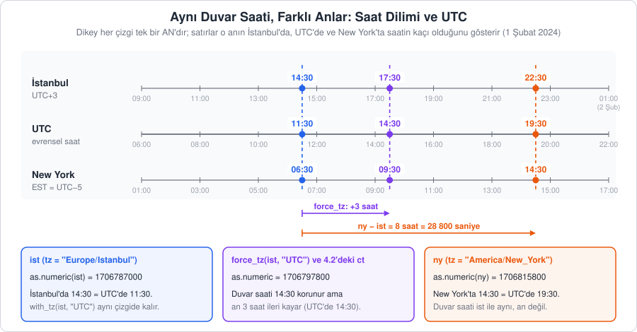

*Şekil 4.2 — Her dikey çizgi tek bir andır; üç satır o anın İstanbul, UTC ve New York'taki duvar saatini gösterir. İstanbul'da 14:30 (mavi) ile New York'ta 14:30 (turuncu) arasında 8 saat vardır. `force_tz(ist, "UTC")` (mor) duvar saatini (14:30) korur ama anı 3 saat kaydırır; bu an, 4.2'deki `ct` nesnesiyle aynıdır (`1706797800`).*

Zaman serisi çalışmalarında pratik kurallar:

- Farklı kaynaklardan gelen zaman damgalarını birleştirmeden önce **aynı saat dilimine** getirin; mümkünse içeride UTC ile çalışıp yalnızca raporlarken yerel saate çevirin.
- `tz` vermezseniz R bilgisayarınızın saat dilimini varsayar; kod başka bir makinede farklı sonuç verebilir. `tz`'yi her zaman açıkça yazın.
- Yaz saati uygulanan bölgelerde (ör. Avrupa, ABD) yılda bir gün 23, bir gün 25 saat sürer. Saatlik verilerde bu, ilkbaharda bir saatin "kaybolması", sonbaharda ise bir saatin "iki kez görünmesi" demektir (ayrıntısı 4.4.2'de).

Saat dilimi dönüşümleri için `lubridate` iki kullanışlı fonksiyon sunar (paketi 4.3'te tanıtıyoruz):

```r
library(lubridate)
x <- ymd_hms("2024-02-01 14:30:00", tz = "Europe/Istanbul")

with_tz(x, "UTC")      # Aynı AN, farklı saatle gösterim
#> [1] "2024-02-01 11:30:00 UTC"
force_tz(x, "UTC")     # Aynı DUVAR SAATİ, farklı an (saat dilimi yanlış girilmişse düzeltmek için)
#> [1] "2024-02-01 14:30:00 UTC"
```

Bu kod, bir zamanın saat dilimini değiştirmenin iki farklı anlamını karşılaştırır: anı koruyup yalnızca gösterimi değiştirmek ya da duvar saatini koruyup anı değiştirmek. Kodu satır satır okuyalım:

1. `library(lubridate)`: `lubridate` paketini bu oturuma yükler; `ymd_hms()`, `with_tz()` ve `force_tz()` bu paketten gelir (paket kavramı ve kurulumu 4.3'te). Yükleme sırasında R, `The following objects are masked from 'package:base': date, intersect, setdiff, union` gibi bir mesaj yazabilir. Bu bir hata değildir; paketin, base R'daki aynı adlı birkaç fonksiyonun yerine kendi sürümlerini kullanacağını haber verir.
2. `x <- ymd_hms("2024-02-01 14:30:00", tz = "Europe/Istanbul")`: `ymd_hms()` metni yıl-ay-gün saat:dakika:saniye sırasıyla okuyup `POSIXct` üretir (4.3'te ayrıntılı). `tz` argümanı saatin Türkiye saati olduğunu söyler; yani `x`, yukarıdaki `ist` ile aynı andır.
3. `with_tz(x, "UTC")`: İkinci argüman (fonksiyondaki adı `tzone`) adsız verilmiştir: hangi saat diliminde gösterileceği. `with_tz()` anı (içerideki sayıyı) değiştirmez, yalnızca gösterim etiketini değiştirir: İstanbul'daki 14:30, UTC'de 11:30 olarak gösterilir. Bunu, aynı olayı farklı ülkedeki bir okura onun saatiyle anlatmak gibi düşünebilirsiniz.
4. `force_tz(x, "UTC")`: Ekrandaki duvar saatini (14:30) olduğu gibi bırakıp ona yeni bir saat dilimi yapıştırır; içerideki sayı 3 saat (10 800 saniye) değişir. Bu, veri yanlış saat dilimiyle okunduğunda (örneğin aslında UTC olan sensör kayıtları yerel saat sanılarak okunduysa) düzeltmek için kullanılır; doğru okunmuş bir veriye uygulanırsa veriyi bozar.

Çıktıları okurken: iki satırın sonunda da `UTC` yazar, ama saatler farklıdır. İlki (11:30) `x` ile aynı anı, ikincisi (14:30) 3 saat sonraki başka bir anı gösterir. Şekil 4.2'deki mavi çizgi `with_tz()` sonucunu, mor çizgi `force_tz()` sonucunu gösterir.

### 4.3. `lubridate` Paketi: Tarihlerle Rahat Çalışmak

`as.Date()` ve format kodları güçlüdür ama her seferinde biçim yazmak yorucu ve hataya açıktır. `lubridate` paketi (tidyverse ailesinin bir parçası), tarih işlemlerini çok daha okunur hâle getirir.

R'da *paket*, başkalarının yazdığı hazır fonksiyonların bir araya getirildiği eklentidir. Bir paket bilgisayara bir kez `install.packages("lubridate")` ile kurulur; her yeni R oturumunda ise `library(lubridate)` ile yüklenir. `library()` çalıştırılmadan paketin fonksiyonları (`ymd()` vb.) bulunamaz.

**Okuma (ayrıştırma) fonksiyonları:** Fonksiyon adı, metindeki bileşenlerin **sırasını** söyler: `y` = yıl, `m` = ay, `d` = gün; alt çizgiden sonraki kısımda `h` = saat, `m` = dakika, `s` = saniye. Ayraçlar (`-`, `/`, `.`, boşluk) otomatik tanınır.

```r
# install.packages("lubridate") # Yüklü değilse
library(lubridate)

ymd("2024-03-15")        # yıl-ay-gün
#> [1] "2024-03-15"
dmy("15.03.2024")        # gün-ay-yıl (Türkçe yazım)
#> [1] "2024-03-15"
mdy("03/15/2024")        # ay-gün-yıl (ABD yazımı)
#> [1] "2024-03-15"
ymd("20240315")          # ayraçsız da çalışır (ISO 8601 temel biçimi)
#> [1] "2024-03-15"
ymd("01/02/2024")        # Sıra uymuyor: tahmin etmez, NA + uyarı verir
#> [1] NA
#> Warning message:
#> All formats failed to parse. No formats found.

# Tarih + saat: ymd_hms(), dmy_hm() vb.
ymd_hms("2024-03-15 14:30:00")            # tz verilmezse UTC varsayılır
#> [1] "2024-03-15 14:30:00 UTC"
ymd_hms("2024-03-15T14:30:00+03:00")      # ISO 8601 ve saat farkı tanınır
#> [1] "2024-03-15 11:30:00 UTC"
```

Bu kod, `lubridate`'in okuma fonksiyonlarını tanıtır: aynı günü farklı yazımlardan okur, uymayan bir metinde ne olduğunu gösterir ve saatli metinlerle biter. Kodu satır satır okuyalım:

1. `# install.packages("lubridate") # Yüklü değilse`: Satır `#` ile başladığı için yorumdur, çalıştırılmaz. Paket bilgisayarınızda kurulu değilse baştaki `#` işaretini silip satırı bir kez çalıştırırsınız; paket internetten indirilip kurulur. Tırnak gerekir, çünkü henüz var olmayan bir paketin adını metin olarak veriyoruz.
2. `library(lubridate)`: Kurulu paketi bu oturuma yükler (4.2.2'deki blokta yüklediyseniz tekrar çalıştırmak zararsızdır).
3. `ymd("2024-03-15")`: Fonksiyon adındaki `ymd` harfleri metindeki sırayı söyler: yıl-ay-gün. Biçim metni yazmaya gerek yoktur; ayraç (`-`) kendiliğinden tanınır. Saat dilimi verilmediği için sonuç bir `Date` nesnesidir.
4. `dmy("15.03.2024")` ve `mdy("03/15/2024")`: Aynı işi gün-ay-yıl (Türkçe yazım, noktalı) ve ay-gün-yıl (ABD yazımı, eğik çizgili) sırası için yapar. Ayraçların farklı olması sorun değildir.
5. `ymd("20240315")`: Ayraçsız ISO 8601 temel biçimini de okur; dört haneli yıl, iki haneli ay ve iki haneli gün sırasıyla ayrılır.
6. `ymd("01/02/2024")`: Metin yıl-ay-gün sırasına uymaz (son parçadaki `2024` bir gün olamaz). `ymd()`, `as.Date()`'in aksine `0001-02-20` gibi uydurma bir tarih üretmez; `NA` döndürür ve uyarı yazar.
7. `ymd_hms("2024-03-15 14:30:00")`: Alt çizgiden sonraki `hms` saat (*hour*), dakika (*minute*), saniye (*second*) sırasını söyler. Sonuç bir `POSIXct` nesnesidir. `tz` argümanı verilmediği için saat UTC kabul edilir.
8. `ymd_hms("2024-03-15T14:30:00+03:00")`: ISO 8601'in tam yazımını okur: tarih ile saat arasındaki `T` harfini ve sondaki `+03:00` UTC farkını tanır. Saat, Türkiye saati olarak yorumlanıp UTC'ye çevrilir: 14:30 − 3 = 11:30.

Çıktıları okurken: ilk dört satırın çıktısı aynıdır (`"2024-03-15"`): dört farklı yazım aynı günü verir; hangi fonksiyonu seçeceğiniz yalnızca metindeki sıraya bağlıdır. Beşinci satırda `[1] NA`'nın altında bir uyarı (*warning*) vardır. Uyarı, hatadan farklı olarak kodu durdurmaz, yalnızca dikkat çeker. `All formats failed to parse. No formats found.` "Hiçbir biçimle okunamadı; uyan biçim bulunamadı" demektir. Son iki satırdaki `UTC` eki sonucun hangi saat diliminde gösterildiğini söyler.

**Not —** `lubridate`, okuyamadığı metinlerde sessizce yanlış tarih üretmez; `NA` döndürür ve "failed to parse" (okunamadı) içeren bir uyarı verir. Bu uyarıyı ciddiye alın. Ancak sırayı yanlış seçerseniz (Türkçe yazılmış `01.02.2024` için `mdy()`) iki okuma da geçerli bir tarih olduğundan uyarı çıkmaz; sırayı veriye bakarak doğru seçmek yine sizin işinizdir. Ayrıca `ymd_hms()` saat dilimi verilmezse **UTC** varsayar (base R'daki `as.POSIXct()` ise sistemin saat dilimini varsayar); yerel saatle çalışıyorsanız `tz = "Europe/Istanbul"` yazmayı unutmayın.

**Bileşen çekme fonksiyonları:** Zaman serilerinde mevsimsellik analizi için tarihin ayını, haftanın gününü, çeyreğini ayrı bir değişken olarak çıkarmak çok sık yapılır; örneğin "satışlar cuma günleri daha mı yüksek?" sorusu için önce her tarihin haftanın hangi günü olduğunu bilmek gerekir.

```r
t1 <- ymd("2024-03-15")

year(t1)                    # 2024
month(t1)                   # 3
day(t1)                     # 15
yday(t1)                    # 75  (yılın 75. günü)
quarter(t1)                 # 1   (1. çeyrek)
isoweek(t1)                 # 11  (ISO 8601 hafta numarası)
wday(t1)                    # 6   (varsayılan: 1 = Pazar, ..., 7 = Cumartesi)
wday(t1, week_start = 1)    # 5   (1 = Pazartesi olacak şekilde)
wday(t1, label = TRUE)      # Cum (Türkçe sistemde) / Fri (İngilizce sistemde)
```

Bu kod, tek bir tarihten yıl, ay, gün, yılın günü, çeyrek, hafta numarası ve haftanın günü gibi bileşenleri ayrı ayrı çeker; zaman serisinde mevsimsel desenleri ararken kullanılacak değişkenler tam olarak bunlardır. Bu blokta çıktılar, kısalık için satır sonundaki yorumlarda verilmiştir; örnek tarih olan 15 Mart 2024 bir cumadır. Kodu satır satır okuyalım:

1. `t1 <- ymd("2024-03-15")`: Örnek tarihi `Date` olarak oluşturup `t1` adıyla saklar.
2. `year(t1)`, `month(t1)`, `day(t1)`: Yılı (2024), ay numarasını (3) ve ayın gününü (15) düz sayı olarak verir. `POSIXlt`'deki tuzaklar burada yoktur: ay 1'den, yıl olduğu gibi sayılır.
3. `yday(t1)`: Yılın kaçıncı günü olduğunu verir (*year day*; `format(..., "%j")` ile aynı bilgi, ama metin değil sayı olarak): Ocak (31) + Şubat (2024 artık yıl olduğu için 29) + 15 = 75.
4. `quarter(t1)`: Yılı üçer aylık dört çeyreğe böler (Ocak–Mart 1., Nisan–Haziran 2., Temmuz–Eylül 3., Ekim–Aralık 4. çeyrek); Mart 1. çeyrektir.
5. `isoweek(t1)`: 4.1'deki ISO hafta numarasını verir: 11. hafta 1 + 10 × 7 = 11 Mart pazartesi başlar, 15 Mart da bu haftadadır.
6. `wday(t1)`: Haftanın gününü (*week day*) sayı olarak verir. Varsayılan ABD alışkanlığıdır: hafta pazar başlar (pazar 1, ..., cumartesi 7), bu yüzden cuma 6. gündür.
7. `wday(t1, week_start = 1)`: `week_start` argümanı haftanın hangi günle başlayacağını söyler; `1` pazartesi demektir (varsayılan değer `7`, yani pazar). Türkiye'deki alışkanlığa uyan bu ayarla cuma 5 olur.
8. `wday(t1, label = TRUE)`: `label = TRUE` sayı yerine gün adını yazdırır; ad varsayılan olarak kısaltılmıştır (`Cum`). Ad, 4.2'deki nota göre sistemin dil ayarına bağlıdır.

Kodu çalıştırdığınızda ilk yedi satırın her biri `[1] 2024`, `[1] 3` gibi tek bir sayı yazar. Son satır ise iki satırlık bir çıktı verir: `[1] Cum` ve altında `Levels: Paz < Pzt < Sal < Çar < Per < Cum < Cmt` (İngilizce sistemde `Sun < Mon < ...`). Bunun nedeni, sonucun bir *faktör* olmasıdır: R'da sınırlı sayıda kategoriden birini tutan veri tipi. `Levels` satırı olası bütün kategorileri, aradaki `<` işaretleri de bunların sırasını gösterir (pazar, pazartesiden önce gelir). Sıralı olması, gün adlarına göre gruplanmış sonuçların alfabetik değil haftanın sırasıyla dizilmesini sağlar.

**Yuvarlama fonksiyonları:** Günlük veriyi aylık ya da haftalık gruplara toplamak için tarihleri dönem başına yuvarlamak işe yarar. Mantık, sayılardaki aşağı ve yukarı yuvarlamayla aynıdır: 3,7 aşağı yuvarlanınca 3, yukarı yuvarlanınca 4 olur; bir tarih de içinde bulunduğu ayın başına (aşağı) ya da sonraki ayın başına (yukarı) yuvarlanır.

```r
floor_date(t1, "month")                  # Ayın ilk günü
#> [1] "2024-03-01"
floor_date(t1, "week", week_start = 1)   # Haftanın pazartesisi
#> [1] "2024-03-11"
ceiling_date(t1, "month")                # Sonraki ayın ilk günü
#> [1] "2024-04-01"
```

Bu kod, önceki bloktaki `t1` tarihini (15 Mart 2024) içinde bulunduğu ayın ve haftanın başına, bir de sonraki ayın başına yuvarlar. Kodu satır satır okuyalım:

1. `floor_date(t1, "month")`: `floor_date()` (*floor*: taban) tarihi aşağı, yani dönemin başına yuvarlar. İkinci argüman (adı `unit`) dönemin birimidir ve tırnak içinde metin olarak verilir: `"day"`, `"week"`, `"month"`, `"quarter"`, `"year"` gibi. Sonuç ayın ilk günüdür.
2. `floor_date(t1, "week", week_start = 1)`: Bu kez birim haftadır; `week_start = 1` haftanın pazartesi başladığını söyler (önceki bloktaki `wday()` ile aynı argüman). Sonuç, 15 Mart'ın içinde bulunduğu haftanın pazartesisidir: 11 Mart. `week_start = 1` vermezseniz hafta pazar başlar ve sonuç `2024-03-10` olur.
3. `ceiling_date(t1, "month")`: `ceiling_date()` (*ceiling*: tavan) yukarı yuvarlar; sonuç sonraki dönemin başıdır, yani 1 Nisan.

Üç çıktı da `Date` nesnesidir. Bir ayın bütün günlerini `floor_date(..., "month")` ile aynı tarihe (ayın 1'ine) çevirirseniz, aylık toplam ya da ortalama almak için bir gruplama anahtarı elde etmiş olursunuz: Mart'ın 31 gününün hepsi `2024-03-01` olur.

### 4.4. Tarih Aritmetiği ve Tarih Dizileri

Tarihler içeride sayı olduğu için onlarla aritmetik işlem yapabiliriz. "30 gün sonrası", "iki olay arasındaki gün sayısı" ya da "analiz için baştan sona düzenli bir tarih dizisi" gibi ihtiyaçlar zaman serisi çalışmalarında sürekli karşımıza çıkar.

```r
baslangic <- as.Date("2024-01-01")

# Base R: Date nesnesine sayı eklemek = gün eklemek
baslangic + 30
#> [1] "2024-01-31"

# lubridate ile okunur biçimde gün, hafta, ay, yıl ekleme
baslangic + days(30)
#> [1] "2024-01-31"
baslangic + weeks(2)
#> [1] "2024-01-15"
baslangic + months(3)
#> [1] "2024-04-01"
baslangic + years(1)
#> [1] "2025-01-01"

# İki tarih arasındaki fark (difftime nesnesi)
bitis <- as.Date("2024-12-31")
fark <- bitis - baslangic
fark
#> Time difference of 365 days
as.numeric(fark)                                  # Sayıya çevirme
#> [1] 365
difftime(bitis, baslangic, units = "weeks")       # Farklı birimde
#> Time difference of 52.14286 weeks
```

Bu kod, bir tarihe gün, hafta, ay ve yıl eklemeyi ve iki tarih arasındaki farkı farklı birimlerle ölçmeyi gösterir. Kodu satır satır okuyalım:

1. `baslangic <- as.Date("2024-01-01")`: Başlangıç tarihini `Date` olarak oluşturup `baslangic` adıyla saklar. (R'da nesne adlarında Türkçe karakterler kullanılabilir, ama başka bilgisayarlarda sorun çıkmasın diye `ı`, `ş`, `ğ` yerine `i`, `s`, `g` yazmak yaygın bir alışkanlıktır.)
2. `baslangic + 30`: Base R'da (yani ek paket olmadan) bir `Date` nesnesine sayı eklemek, içerideki gün sayısına eklemek demektir: 1 Ocak + 30 gün = 31 Ocak.
3. `baslangic + days(30)`: `lubridate`'in `days(30)` fonksiyonu "30 gün" uzunluğunda bir süre nesnesi (*period*, 4.4.2'de) üretir; sonuç bir önceki satırla aynıdır ama kod ne eklendiğini açıkça söyler.
4. `baslangic + weeks(2)`: 2 hafta = 14 gün ekler: 1 + 14 = 15 Ocak.
5. `baslangic + months(3)`: Takvimde 3 ay ileri gider: 1 Ocak + 3 ay = 1 Nisan, ayların kaç gün çektiğine bakmadan. (`months()` adlı bir fonksiyon base R'da da vardır ve bir tarihin ay adını yazar; `lubridate` yüklüyken ona sayı verildiğinde ay uzunluğunda bir süre üretir.)
6. `baslangic + years(1)`: Takvimde 1 yıl ileri gider: 1 Ocak 2025.
7. `bitis <- as.Date("2024-12-31")` ve `fark <- bitis - baslangic`: Bitiş tarihini oluşturur ve iki tarihi çıkarır. Sonuç, birimi gün olan bir `difftime` (zaman farkı) nesnesidir ve `fark` adıyla saklanır; alttaki `fark` satırı onu ekrana yazar.
8. `as.numeric(fark)`: Birimi atıp çıplak sayıyı (365) verir; sayıyla başka hesaplara devam etmek için gerekir.
9. `difftime(bitis, baslangic, units = "weeks")`: `difftime()` iki zamanın farkını, ilk argümandan ikinciyi çıkararak hesaplar (sıra önemlidir; ters yazılırsa sonuç eksi olur). `units` argümanı sonucun birimini seçer: `"secs"`, `"mins"`, `"hours"`, `"days"` ya da `"weeks"`. Burada hafta istedik.

Çıktıları okurken: ilk beş çıktı yeni tarihlerdir (hepsi `Date`). `Time difference of 365 days`, "zaman farkı: 365 gün" demektir. Neden 366 değil? İki tarihi çıkarmak, aradaki gün *adımlarının* sayısını verir: 1 Ocak'tan 2 Ocak'a 1 adım, ..., 31 Aralık'a 365 adım vardır. 2024 artık yıldır, yani 366 gün sürer; 366. adım bizi 2025'in 1 Ocak'ına götürürdü. Son çıktı aynı farkın hafta cinsinden değeridir: $365 / 7 \approx 52{,}14286$ (R ondalık ayırıcı olarak nokta kullanır: `52.14286`).

**Tanım (artık yıl):** Dünya'nın Güneş etrafındaki bir turu yaklaşık 365,25 gün sürer. Aradaki çeyrek günler birikmesin diye 4'e bölünebilen yıllara 29 Şubat eklenir ve yıl 366 gün olur (2024 gibi). İstisna: 100'e bölünüp 400'e bölünemeyen yıllar artık yıl değildir (1900 değil, 2000 artık yıldır). `lubridate::leap_year(2024)` bunu sizin yerinize kontrol eder.

**Düzenli tarih dizileri:** Eksik günleri tespit etmek, bir veri çerçevesine zaman sütunu eklemek ya da tahmin dönemi için gelecekteki tarihleri üretmek için `seq()` kullanılır:

```r
# Aylık bir tarih dizisi (çok sık kullanılır)
aylik_dizi <- seq(from = as.Date("2024-01-01"),
                  to   = as.Date("2024-12-31"),
                  by   = "month")
aylik_dizi
#>  [1] "2024-01-01" "2024-02-01" "2024-03-01" "2024-04-01" "2024-05-01"
#>  [6] "2024-06-01" "2024-07-01" "2024-08-01" "2024-09-01" "2024-10-01"
#> [11] "2024-11-01" "2024-12-01"

# Başlangıç + adım + uzunluk ile
seq(as.Date("2024-01-01"), by = "week", length.out = 4)
#> [1] "2024-01-01" "2024-01-08" "2024-01-15" "2024-01-22"
```

Bu kod, düzenli aralıklı tarih dizilerini iki yoldan üretir: başlangıç ve bitiş vererek, ya da başlangıç ve eleman sayısı vererek. Kodu satır satır okuyalım:

1. `aylik_dizi <- seq(from = ..., to = ..., by = "month")`: `seq()` (*sequence*, dizi) bir başlangıçtan (`from`) itibaren sabit adımlarla (`by`) ilerleyen bir dizi üretir ve `to` tarihini geçmeden durur. Çağrı üç satıra yayılmıştır: parantez kapanmadığı sürece R satırın devam ettiğini anlar; bölmek yalnızca okunurluk içindir. İç içe çağrılar içten dışa okunur: önce iki `as.Date()` metinleri tarihe çevirir, sonra `seq()` bu tarihleri kullanır. `by = "month"` her adımın bir takvim ayı olduğunu söyler; `"day"`, `"week"`, `"quarter"`, `"year"` ya da gün sayısı olarak bir sayı da verilebilir. Sonuç `aylik_dizi` adıyla saklanır.
2. `aylik_dizi`: Diziyi ekrana yazdırır.
3. `seq(as.Date("2024-01-01"), by = "week", length.out = 4)`: İlk argüman adsızdır; `seq()`'in ilk argümanı `from` olduğu için başlangıç tarihi olarak anlaşılır. Bu kez bitiş tarihi yerine `length.out = 4` (çıktının uzunluğu) verilmiştir: haftalık adımlarla 4 tarih üretilir. Tahmin dönemi için "bundan sonraki 12 ay" gibi tarihler üretirken bu biçim kullanışlıdır.

Çıktıları okurken: ilk sonuç 12 tarihlik bir *vektördür*, yani aynı türden değerlerin sıralı bir listesidir (4.2'deki tek değerli sonuçlar da aslında bir elemanlı vektörlerdir). Çıktı ekrana sığmadığı için alt satırlara bölünmüştür; satır başlarındaki `[1]`, `[6]` ve `[11]`, o satırın vektörün 1., 6. ve 11. elemanıyla başladığını gösterir. İkinci çıktı 7'şer gün arayla 4 pazartesidir. Bir veri setindeki tarihleri böyle bir tam diziyle karşılaştırarak (`setdiff(tam_dizi, tarihler)`: ilk vektörde olup ikincide olmayan değerler) eksik dönemleri bulabilirsiniz.

#### 4.4.1. Ay Sonu Tuzağı ve `%m+%`

"Bir ay sonrası" masum görünen ama belirsiz bir ifadedir: 31 Ocak'tan bir ay sonrası 31 Şubat olamaz.

```r
ymd("2024-01-31") + months(1)        # 31 Şubat yok → NA
#> [1] NA
ymd("2024-01-31") %m+% months(1)     # Ayın son gününe yuvarlar
#> [1] "2024-02-29"
ymd("2024-01-31") %m+% months(0:3)   # Ay sonu dizisi
#> [1] "2024-01-31" "2024-02-29" "2024-03-31" "2024-04-30"

# Base R'ın seq() fonksiyonu ise taşan günü sonraki aya kaydırır:
seq(as.Date("2024-01-31"), by = "month", length.out = 4)
#> [1] "2024-01-31" "2024-03-02" "2024-03-31" "2024-05-01"
```

Bu kod, ayın son gününden başlayarak ay eklemenin üç farklı sonucunu karşılaştırır: `NA`, ay sonuna yuvarlama ve sonraki aya taşma. Kodu satır satır okuyalım:

1. `ymd("2024-01-31") + months(1)`: İç içe çağrı içten dışa okunur: önce `ymd()` 31 Ocak'ı `Date` yapar, `months(1)` "1 ay" süresini üretir, sonra `+` ikisini toplar. Düz `+` takvimde olmayan bir güne (31 Şubat) varınca `NA` döndürür.
2. `ymd("2024-01-31") %m+% months(1)`: `%m+%`, `lubridate`'in tanımladığı özel bir toplama işlemcisidir (R'da `%...%` biçiminde yazılan işaretler, iki değerin arasına yazılan özel işlemlerdir ve `+` gibi kullanılırlar; *m* burada *month*, ay demektir). Bu işlemci ay eklerken, sonuç ayda o gün yoksa ayın son gününde durur: 31 Ocak + 1 ay = 29 Şubat (2024 artık yıl).
3. `ymd("2024-01-31") %m+% months(0:3)`: `0:3` yazımı 0'dan 3'e kadar tam sayıları içeren bir vektör (`0, 1, 2, 3`) üretir. `months(0:3)` böylece dört ayrı süre (0, 1, 2 ve 3 ay) olur ve `%m+%` her birini başlangıç tarihine ayrı ayrı ekler. Tek satırda, her ayın son gününden oluşan 4 elemanlı bir tarih vektörü elde edilir. Çıkarma için `%m-%` kullanılır.
4. `seq(as.Date("2024-01-31"), by = "month", length.out = 4)`: Base R'ın `seq()` fonksiyonuyla (4.4'te anlatıldı) aynı ay sonu dizisini üretmeyi dener.

Çıktıları okurken: ilk satırdaki `NA`, sonucun okunamadığını değil, böyle bir günün takvimde olmadığını söyler. Üçüncü satır 31 Ocak, 29 Şubat, 31 Mart ve 30 Nisan'ı verir; hepsi ay sonudur. Son satırda ise base R'ın `seq()` fonksiyonu olmayan günü sayıp taşırır: "31 Şubat", 29 Şubat'tan 2 gün sonrası olarak 2 Mart'a; "31 Nisan", 30 Nisan'dan 1 gün sonrası olarak 1 Mayıs'a kayar. Ay sonu verileriyle (ör. aylık finansal kapanışlar) çalışırken `%m+%` kullanın; `"2024-03-02"` gibi kaymalar hata mesajı üretmediği için fark edilmesi zor hatalara yol açar.

#### 4.4.2. Period ve Duration: İki Farklı "Süre" Kavramı

`lubridate`, süreyi iki farklı şekilde ifade eder ve bu ayrım özellikle saatlik verilerde önemlidir. Gündelik bir benzetme: *period* duvar takvimine bakarak "yarın aynı saatte" demektir; *duration* ise bir kronometreyi başlatıp "tam 24 saat sonra" demektir. Çoğu gün ikisi aynı yere varır; yaz saati geçişlerinde ve artık yıllarda ayrışırlar.

**Tanım 1 (Period):** İnsanların takvimde kullandığı süredir: "1 gün", "1 ay", "1 yıl". Uzunluğu sabit değildir; 1 ay 28–31 gün, 1 gün (yaz saati geçişinde) 23 ya da 25 saat olabilir. `days()`, `months()`, `years()` gibi **çoğul adlı** fonksiyonlarla oluşturulur. Period eklemek duvar saatini (takvimi) korur.

**Tanım 2 (Duration):** Fiziksel olarak geçen süredir ve her zaman **saniye** cinsinden sabittir: 1 gün = 86 400 saniye, 1 yıl = 365,25 gün. Başında `d` olan `ddays()`, `dweeks()`, `dyears()` gibi fonksiyonlarla oluşturulur. Duration eklemek kronometreyi korur. Bir yılın 365,25 gün sayılması, dört yıllık döngünün ortalamasından gelir: $(365 + 365 + 365 + 366) / 4 = 1461 / 4 = 365{,}25$ gün; yani `dyears(1)` $365{,}25 \times 86\,400 = 31\,557\,600$ saniyedir.

```r
days(1)       # period
#> [1] "1d 0H 0M 0S"
ddays(1)      # duration
#> [1] "86400s (~1 days)"

# Berlin'de 31 Mart 2024 gecesi saatler 02:00'den 03:00'e alındı
x <- ymd_hms("2024-03-30 12:00:00", tz = "Europe/Berlin")
x + days(1)     # Ertesi gün aynı saat (gerçekte 23 saat geçti)
#> [1] "2024-03-31 12:00:00 CEST"
x + ddays(1)    # Tam 24 saat sonra
#> [1] "2024-03-31 13:00:00 CEST"

# Artık yıl
ymd("2024-02-29") + years(1)     # 29 Şubat 2025 yok
#> [1] NA
ymd("2024-02-29") + dyears(1)    # 365,25 gün sonrası
#> [1] "2025-02-28 06:00:00 UTC"
```

Bu kod, period ile duration'ın önce nasıl yazıldığını, sonra iki kritik durumda (yaz saatine geçiş günü ve artık yıl) nasıl farklı sonuç verdiğini gösterir. Kodu satır satır okuyalım:

1. `days(1)` ve `ddays(1)`: Aynı "1 gün" bilgisini iki türde üretir: `days()` bir period, başında `d` (*duration*) olan `ddays()` bir duration verir. Bir ada atanmadıkları için doğrudan ekrana yazılırlar.
2. `x <- ymd_hms("2024-03-30 12:00:00", tz = "Europe/Berlin")`: Berlin saatiyle 30 Mart 2024 öğle 12:00'yi `POSIXct` olarak oluşturur. `x` adı 4.2.2'de de kullanılmıştı; aynı ada yeniden atama yapmak eski değeri siler ve yenisini yazar. Berlin'i seçmemizin nedeni, Türkiye'nin artık yaz saati uygulamamasıdır: farkı göstermek için saat değiştiren bir bölge gerekir. Başlangıç anı kış saatidir (CET, UTC+1). O gece saat 02:00 olduğunda saatler 03:00'e alınır ve Berlin yaz saatine (CEST, UTC+2) geçer; yani 31 Mart günü yalnızca 23 saat sürer.
3. `x + days(1)` (period) takvime bakar: "ertesi gün, yine 12:00". Duvar saati korunur ama gerçekte 12 + 11 = 23 saat geçmiştir (30 Mart 12:00'den gece yarısına 12 saat, gece yarısından 31 Mart 12:00'ye kaybolan saat yüzünden 11 saat).
4. `x + ddays(1)` (duration) kronometreye bakar: tam 24 saat = 86 400 saniye ekler. Kaybolan saat yüzünden duvar saati 13:00'ü gösterir.
5. `ymd("2024-02-29") + years(1)`: `years(1)` "gelecek yıl aynı gün" der ama 29 Şubat 2025 olmadığı için `NA` döner (4.4.1'deki `+ months(1)` ile aynı durum).
6. `ymd("2024-02-29") + dyears(1)`: `dyears(1)` 365,25 gün ekler: 2024-02-29'dan 365 gün sonrası 2025-02-28'dir, kalan 0,25 gün de $`0{,}25 \times 24 = 6`$ saattir; sonuç 2025-02-28 06:00'dır.

Çıktıları okurken: period gün-saat-dakika-saniye parçalarıyla yazılır (`1d 0H 0M 0S`: 1 gün, 0 saat, 0 dakika, 0 saniye); duration ise saniye olarak yazılır (`86400s`), parantez içindeki `~1 days` de "yaklaşık 1 gün" diye okunur ve yalnızca kolay okuma içindir. Berlin çıktılarındaki `CEST`, sonucun yaz saatinde olduğunu gösterir. Son satırda saat içeren bir süre eklendiği için sonuç `Date` olmaktan çıkıp `POSIXct` olmuştur; `ymd()` saat dilimi bilgisi taşımadığından UTC ile gösterilir.


*Şekil 4.3 — Yaz saatine geçiş gecesinde `days(1)` (period) ertesi günün aynı duvar saatine gider ve gerçekte 23 saat ilerler; `ddays(1)` (duration) tam 86 400 saniye ilerler ve saat 13:00'ü gösterir. Alttaki tablo, aynı farkın yıllar için de geçerli olduğunu gösterir.*

Hangisini ne zaman kullanmalı?

- **Takvime bağlı işler** (her ayın aynı günü, gelecek yılın aynı tarihi, aylık tahmin dönemleri) → **period** (`months()`, `years()`, gerekirse `%m+%`).
- **Fiziksel süre ölçümü** (bir makinenin kaç saat çalıştığı, iki sensör okuması arasındaki gerçek süre) → **duration** (`ddays()`, `dhours()`) ya da iki `POSIXct` arasındaki fark.

İki an arasındaki dönemi temsil etmek için üçüncü bir yapı olan **interval** (aralık) vardır; `interval(bas, bit)` ile oluşturulur. Interval, başlangıç ve bitiş tarihlerini ayrı ayrı hatırladığı için bir period ile bölünerek "bu aralığa kaç tam yıl/ay sığıyor" sorusu takvime uygun biçimde cevaplanır. Aşağıdaki örneklerde bunu kullanacağız.

### 4.5. Pratik `lubridate` Örnekleri

Bölümde öğrendiklerimizi birkaç kısa örnekle pekiştirelim.

#### 4.5.1. Örnek 1: Kaç Gündür Hayattasınız?

Sembolik bir doğum tarihi olarak `2021-06-29` alalım. Bu tarih ile bugün arasındaki farkı hesaplayarak kaç gün geçtiğini ve kaç tam yıl (kaç kış) görüldüğünü bulalım.

```r
library(lubridate)

# Sembolik doğum günü ve bugün
dogum <- ymd("2021-06-29")
bugun <- today()

# Kaç gün geçti?
yasanan_gun_sayisi <- bugun - dogum
cat("Ben", as.numeric(yasanan_gun_sayisi), "gündür hayattayım.\n")

# Kaç kış gördü? Aralığı (interval) 1 yıllık period'a tam bölerek tam yıl sayısını buluruz
yas_araligi <- interval(dogum, bugun)
gorulen_kis_sayisi <- yas_araligi %/% years(1)
cat("Ben", gorulen_kis_sayisi, "kış gördüm.\n")
```

Kod 2026-09-29 tarihinde çalıştırıldığında çıktı şöyledir (siz çalıştırdığınızda `today()` değiştiği için sayılar farklı olacaktır):

```text
Ben 1918 gündür hayattayım.
Ben 5 kış gördüm.
```

Bu kod, bir doğum tarihi ile bugün arasındaki süreyi iki farklı biçimde ölçer: önce gün sayısı olarak, sonra tam yıl sayısı olarak. İkisi farklı araçlar gerektirir, çünkü gün sabit uzunlukta bir ölçüdür, yıl ise takvime bağlıdır (4.4.2). Kodu satır satır okuyalım:

1. `library(lubridate)`: `lubridate` paketini bu oturuma yükler; `ymd()`, `today()`, `interval()` ve `years()` bu paketten gelir. Paket bilgisayarda kurulu değilse önce bir kez `install.packages("lubridate")` çalıştırılır (4.3).
2. `dogum <- ymd("2021-06-29")`: Tırnak içindeki metni yıl-ay-gün sırasıyla okuyup bir `Date` nesnesine çevirir (4.3) ve `dogum` adıyla saklar.
3. `bugun <- today()`: Bilgisayarın saatine bakarak bugünün tarihini `Date` olarak verir (base R'daki `Sys.Date()` gibi). Parantez içi boştur; isteğe bağlı `tzone` argümanı verilmediği için "bugün" bilgisayarın saat dilimine göre belirlenir. Bu yüzden çıktı, kodu çalıştırdığınız güne göre değişir.
4. `yasanan_gun_sayisi <- bugun - dogum`: İki `Date` nesnesinin farkı, aradaki gün sayısını tutan bir `difftime` nesnesidir (ekrana yazdırılsaydı `Time difference of 1918 days` gibi görünürdü).
5. `cat("Ben", as.numeric(yasanan_gun_sayisi), "gündür hayattayım.\n")`: `as.numeric()` farkı birimsiz düz sayıya (1918) çevirir. `cat()` (*concatenate*, birleştir) kendisine virgülle verilen parçaları aralarına birer boşluk koyarak ekrana yazar; `print()`'ten farkı, başa `[1]` ve metinlerin etrafına tırnak koymamasıdır. Sondaki `"\n"` "yeni satıra geç" anlamına gelen özel karakterdir.
6. `yas_araligi <- interval(dogum, bugun)`: Başlangıcı ve bitişi ayrı ayrı hatırlayan bir *aralık* (`Interval`) nesnesi oluşturur. Gün farkından farkı, hangi takvim günleri arasında olduğunu bilmesidir; artık yıllar ancak böyle doğru sayılabilir.
7. `gorulen_kis_sayisi <- yas_araligi %/% years(1)`: `years(1)` "1 takvim yılı" uzunluğunda bir period'dur. `%/%` *tam sayı bölmesidir*: bölümün yalnızca tam kısmını verir (7 `%/%` 2 = 3, çünkü 7 / 2 = 3,5). Sonuç, aralığa kaç **tam** takvim yılının sığdığını gösteren düz bir sayıdır.
8. `cat("Ben", gorulen_kis_sayisi, "kış gördüm.\n")`: Bu sayıyı cümle içinde yazar.

Çıktıdaki ilk satır gün sayısını, ikinci satır tam yıl sayısını verir; `cat()` kullanıldığı için satırlarda `[1]` ya da tırnak yoktur. 1918 sayısını elle doğrulayalım: 29 Haziran 2021'den 29 Haziran 2026'ya 5 yıl vardır; bunun içinde bir 29 Şubat (2024) bulunduğundan $5 \times 365 + 1 = 1826$ gün eder. 29 Haziran'dan 29 Eylül'e ise $30 + 31 + 31 = 92$ gün vardır (29 Haziran'dan 29 Temmuz'a Haziran'ın 30 günü, sonraki iki adımda Temmuz ve Ağustos'un 31'er günü). Toplam $1826 + 92 = 1918$. İkinci satırdaki 5 ise şöyle bulunur: 29 Haziran 2021'den 29 Eylül 2026'ya 5 tam takvim yılı sığar, 6. yıl henüz dolmamıştır. Bu hesap artık yılları doğru hesaba katar; gün sayısını 365'e bölmekten daha güvenlidir.

#### 4.5.2. Örnek 2: Atatürk Kaç Gün Yaşadı ve Hangi Gün Vefat Etti?

Tarihî kişiliklerin yaşam sürelerini ve önemli günlerini `lubridate` ile kolayca analiz edebiliriz. Atatürk'ün doğum günü olarak 19 Mayıs 1881'i kabul edelim.

```r
library(lubridate)

# Atatürk'ün doğum ve vefat tarihleri
ataturk_dogum <- ymd("1881-05-19")
ataturk_vefat <- ymd("1938-11-10")

# Toplam yaşadığı gün sayısı
yasadigi_gun <- ataturk_vefat - ataturk_dogum
cat("Mustafa Kemal Atatürk", as.numeric(yasadigi_gun), "gün yaşamıştır.\n")
#> Mustafa Kemal Atatürk 20993 gün yaşamıştır.

# Yıl-ay-gün olarak yaşam süresi
as.period(interval(ataturk_dogum, ataturk_vefat))
#> [1] "57y 5m 22d 0H 0M 0S"

# Vefat ettiği günün adı (sistemin dil ayarına göre Türkçe ya da İngilizce yazılır)
vefat_gunu <- wday(ataturk_vefat, label = TRUE, abbr = FALSE)
cat("Vefat ettiği gün:", as.character(vefat_gunu), "\n")
#> Vefat ettiği gün: Perşembe
```

Bu kod, iki tarihî tarih arasındaki süreyi önce gün, sonra yıl-ay-gün olarak hesaplar ve son tarihin haftanın hangi gününe denk geldiğini bulur; böylece 4.3 ve 4.4'teki araçları tek bir örnekte birleştirir. Kodu satır satır okuyalım:

1. `library(lubridate)`: Paketi yükler (4.5.1'deki gibi).
2. `ataturk_dogum <- ymd("1881-05-19")` ve `ataturk_vefat <- ymd("1938-11-10")`: İki tarihi `Date` olarak oluşturur. 1970 öncesi tarihler de sorunsuz çalışır; içeride negatif gün sayısı olarak saklanırlar (`as.numeric(ymd("1881-05-19"))` sonucu `-32368`'dir, yani 1970-01-01'den 32 368 gün öncesi).
3. `yasadigi_gun <- ataturk_vefat - ataturk_dogum`: İki tarihin farkını gün birimli bir `difftime` olarak saklar (4.4).
4. `cat("Mustafa Kemal Atatürk", as.numeric(yasadigi_gun), "gün yaşamıştır.\n")`: Farkı düz sayıya çevirip cümle içinde yazar (4.5.1).
5. `as.period(interval(ataturk_dogum, ataturk_vefat))`: İçten dışa okunur: önce `interval()` iki tarih arasındaki aralığı kurar (4.5.1), sonra `as.period()` bu aralığı takvim birimlerine (yıl, ay, gün ...) böler. Aralık gerekir, çünkü "kaç ay" sorusunun cevabı hangi aylardan geçildiğine bağlıdır; düz gün sayısı bunu bilmez.
6. `vefat_gunu <- wday(ataturk_vefat, label = TRUE, abbr = FALSE)`: `wday()` (4.3) haftanın gününü verir; `label = TRUE` sayı yerine ad ister, `abbr = FALSE` (*abbreviate*, kısalt; varsayılanı `TRUE`) da adın kısaltılmamasını sağlar: `Per` değil `Perşembe`. Sonuç bir faktördür (4.3) ve `vefat_gunu` adıyla saklanır.
7. `cat("Vefat ettiği gün:", as.character(vefat_gunu), "\n")`: `as.character()` faktörü düz metne çevirir ki `cat()` gün adını yazsın (`cat()` bir faktörü doğrudan alırsa adı değil, içerideki sıra numarasını yazar).

Çıktıları okurken: ilk satırdaki 20 993 gün içerideki sayılardan da doğrulanabilir: 10 Kasım 1938'in sayısı `-11375`'tir ve $`-11\,375 - (-32\,368) = 20\,993`$. İkinci satırdaki `"57y 5m 22d 0H 0M 0S"` bir period yazımıdır: `y` yıl, `m` ay, `d` gün, `H` saat, `M` dakika, `S` saniye. Elle kontrol: 19 Mayıs 1881 + 57 yıl = 19 Mayıs 1938; + 5 ay = 19 Ekim 1938; Ekim 31 gün çektiği için 19 Ekim'den 10 Kasım'a 22 gün vardır. Sonuç: 57 yıl 5 ay 22 gün. Saat, dakika ve saniye 0'dır, çünkü `Date` nesneleri saat bilgisi taşımaz. Üçüncü satırdaki gün adı Türkçe dil ayarına aittir; İngilizce ayarlı bir sistemde `Thursday` yazılır (4.2'deki nota bakın). Atatürk 10 Kasım 1938 Perşembe günü vefat etmiştir.

#### 4.5.3. Örnek 3: Toplam Kaç Saat Yaşadınız?

Daha hassas hesaplamalar için tarihle birlikte saati de kullanmamız gerekir. `ymd_hms()` ile bir `POSIXct` nesnesi oluşturup şimdiki zamandan çıkararak toplam yaşanan saati bulabiliriz.

```r
library(lubridate)

# Örnek bir doğum tarihi ve saati (saat dilimini açıkça belirtiyoruz)
dogum_zamani <- ymd_hms("1995-04-23 14:30:00", tz = "Europe/Istanbul")

# Şimdiki zaman
simdi <- now(tzone = "Europe/Istanbul")

# İki zaman arasındaki farkı saat cinsinden hesaplama
yasanan_saat <- as.numeric(difftime(simdi, dogum_zamani, units = "hours"))

cat("1995-04-23 14:30'da doğan bir kişi, yaklaşık olarak",
    round(yasanan_saat), "saattir hayattadır.\n")
```

Bu kod, 4.5.1'deki hesabı saat düzeyine indirir: tarihle birlikte doğum saatini de kullanarak şimdiye kadar geçen toplam saati bulur. Kodu satır satır okuyalım:

1. `library(lubridate)`: Paketi yükler (4.5.1'deki gibi).
2. `dogum_zamani <- ymd_hms("1995-04-23 14:30:00", tz = "Europe/Istanbul")`: Doğum anını Türkiye saatiyle `POSIXct` olarak oluşturur (4.3). `tz` burada önemlidir: verilmeseydi `ymd_hms()` saati UTC kabul ederdi.
3. `simdi <- now(tzone = "Europe/Istanbul")`: `now()` şu anı, verilen saat diliminde bir `POSIXct` olarak döndürür (`Sys.time()`'ın `lubridate` karşılığı). Argümanın adı burada `tz` değil `tzone`'dur; aynı paketin fonksiyonlarında bile argüman adları farklı olabilir, bu yüzden emin olmadığınızda `args(now)` ile fonksiyonun argümanlarını görebilirsiniz.
4. `yasanan_saat <- as.numeric(difftime(simdi, dogum_zamani, units = "hours"))`: İçten dışa okunur: `difftime()` (4.4) `simdi`'den `dogum_zamani`'nı çıkarır ve `units = "hours"` sayesinde sonucu doğrudan saat biriminde verir; dıştaki `as.numeric()` birimi atıp düz sayı bırakır. Sonuç genellikle ondalıklı bir sayıdır, çünkü dakika ve saniyeler de saatin kesirleri olarak hesaba girer.
5. `cat("1995-04-23 14:30'da doğan bir kişi, yaklaşık olarak", round(yasanan_saat), "saattir hayattadır.\n")`: Çağrı iki satıra yayılmıştır; parantez kapanmadığı için R ikinci satırı aynı komutun devamı sayar. `round()` sayıyı en yakın tam sayıya yuvarlar (kaç ondalık kalacağını söyleyen `digits` argümanının varsayılanı 0'dır); cümledeki "yaklaşık olarak" ifadesi bu yüzdendir.

Çıktı, `1995-04-23 14:30'da doğan bir kişi, yaklaşık olarak ... saattir hayattadır.` biçiminde tek satırlık bir cümledir; noktaların yerindeki sayı çalıştırdığınız ana göre değişir. Örneğin kod 2026-09-29 saat 14:30'da çalıştırılsaydı aradaki 11 482 gün için $11\,482 \times 24 = 275\,568$ saat yazılırdı.

İki zaman damgası da `POSIXct` olduğu için fark, içerideki UTC saniyeleri üzerinden hesaplanır; yani aradaki yaz saati geçişleri ve saat dilimi değişiklikleri (Türkiye 2016'ya kadar yaz saati uyguluyordu; 23 Nisan 1995'te saatler yaz saatindeydi, UTC+3) otomatik olarak doğru hesaba katılır. `tz` belirtilmeseydi `ymd_hms()` doğum saatini UTC kabul edecek ve sonuç 3 saat kayacaktı.

Bu bölümde tarihlerin içeride nasıl saklandığını, nasıl okunup yazıldığını ve nasıl hesaplandığını gördük. Bölüm 5'te bu tarih bilgisini veriye bağlayarak R'ın zaman serisi nesneleri `ts` ve `xts`'i oluşturacağız.

<details>
<summary><b>Kendinizi test edin (cevaplar için tıklayın)</b></summary>

1. **Bir CSV dosyasındaki tarihler `03/04/2024` biçiminde. `as.Date(x)` hata vermedi. Veriyi doğru okuduğunuzdan emin olabilir misiniz?**
   → Hayır. Biçim verilmezse R metni `%Y/%m/%d` ile okumayı dener ve `0003-04-20` gibi anlamsız bir tarih üretir. Önce verinin gün/ay mı ay/gün mü yazıldığını öğrenin (gün kısmı 12'den büyük bir satır arayın), sonra `format = "%d/%m/%Y"` ya da `"%m/%d/%Y"` verin ve `range()` ile `sum(is.na())` kontrollerini yapın.

2. **`as.POSIXct("2024-06-01 09:00", tz = "Europe/Istanbul")` ile `as.POSIXct("2024-06-01 09:00", tz = "UTC")` aynı anı mı gösterir?**
   → Hayır. İstanbul'daki 09:00, UTC'de 06:00'dır; ikinci nesne ise UTC'de 09:00'dır. Aralarında 3 saat (10 800 saniye) fark vardır. Duvar saati aynı, an farklıdır.

3. **Her ayın son gününe denk gelen aylık bir rapor tarih dizisi üretmek istiyorsunuz. `ymd("2024-01-31") + months(1:11)` neden uygun değildir?**
   → 30 günlük aylarda ve Şubat'ta "31." gün olmadığı için bu aylar `NA` olur. `%m+%` kullanılmalıdır: `ymd("2024-01-31") %m+% months(1:11)` her ayın son gününü verir.

</details>

---

<a id="bolum-5"></a>

## 5. R'da Zaman Serisi Nesneleri: `ts` ve `xts`

Bölüm 4'te tarih ve zaman bilgisini doğru okumayı ve saklamayı gördük. Şimdi bu bilgiyi verinin kendisiyle birleştirip R'ın zaman serisi analizinde kullandığı özel nesnelere dönüştüreceğiz. İki temel yapı var:

- **`ts` (time series):** R'ın yerleşik, eşit aralıklı seriler için tasarlanmış nesnesi. `decompose()`, `acf()`, `arima()` gibi klasik fonksiyonların çoğu bu nesneyi bekler (Bölüm 6 ve 7).
- **`xts` (eXtensible Time Series):** Her gözlemi kendi zaman damgasıyla saklayan, düzensiz aralıklı ve yüksek frekanslı veriler için esnek nesne.

Bir `ts` nesnesi iki temel bilgiden oluşur:

1. **Veri:** Sayısal değerlerden oluşan bir vektör (aynı türden değerlerin sıralı listesi) ya da çok değişkenli seriler için bir matris (satır ve sütunlardan oluşan sayı tablosu; her sütun bir değişken).
2. **Zaman bilgisi:** Serinin başlangıç zamanı (`start`) ve frekansı (`frequency`). Her gözlemin zamanı bu ikisinden **hesaplanır**; ayrıca saklanmaz.

### 5.1. Frekans Kavramı ve `start`/`end` Argümanları

**Tanım (frekans):** Frekans, **bir temel döngü (çoğunlukla bir yıl) içindeki gözlem sayısıdır.** Aylık veride yıl 12 aya bölündüğü için `frequency = 12`, çeyreklik veride `frequency = 4` olur. Frekans aynı zamanda mevsimsel dönemin uzunluğudur: `decompose()` ve mevsimsel ARIMA gibi yöntemler "kaç gözlemde bir tekrar eden desen aranacağını" bu sayıdan öğrenir.

Bu parametre yanlış ayarlanırsa mevsimsellik gibi önemli desenler modellenemez. Örneğin aylık bir seriyi `frequency = 1` ile tanımlarsanız R, her yıl yaz aylarında tekrar eden zirveyi mevsimsellik olarak göremez; çünkü ona göre seride bir "yıl içi" yoktur, her gözlem ayrı bir yıldır.

| Veri tipi | Temel döngü | `frequency` | Açıklama |
| --- | --- | --- | --- |
| Yıllık | — | `1` | Mevsimsellik yoktur |
| Çeyreklik | Yıl | `4` | 4 çeyrek / yıl |
| Aylık | Yıl | `12` | 12 ay / yıl |
| Haftalık | Yıl | `52` ya da `52.18` | Bir yıl 365,25 / 7 ≈ 52,18 haftadır |
| Günlük | Hafta | `7` | Haftanın günü etkisi (hafta içi / hafta sonu) |
| Günlük | Yıl | `365` ya da `365.25` | Yıllık mevsimsellik (ör. sıcaklık) |
| Günlük (iş günü) | Hafta | `5` | Borsa, hafta sonu olmayan veriler |
| Saatlik | Gün | `24` | Günlük döngü (ör. elektrik tüketimi) |
| Saatlik | Hafta | `168` | 24 × 7; haftalık döngü |
| 30 dakikalık | Gün | `48` | 2 × 24 |
| Dakikalık | Saat / gün | `60` / `1440` | Yüksek frekanslı sensör verisi |

> **Simge notu:** $`\approx`$ *(yaklaşık eşittir)*: iki değerin yaklaşık olarak eşit olduğunu gösterir

**Not —** Günlük veride hangi frekansın seçileceği, hangi döngüyle ilgilendiğinize bağlıdır: haftalık desen için 7, yıllık desen için 365,25. Hem haftalık hem yıllık döngü birlikte varsa tek bir `ts` frekansı yetmez; bu durumda `forecast` paketindeki `msts()` (çok mevsimli seri) ya da Bölüm 9'daki Prophet gibi araçlar kullanılır. Ondalıklı frekanslar (`52.18`, `365.25`) `ts` tarafından kabul edilir, ancak bazı fonksiyonlar (ör. `decompose()`) mevsimsel dönemi tam sayı gözlem olarak ele alır; bu nedenle pratikte çoğunlukla `52` ya da `365` gibi tam sayılar tercih edilir.

**`start` ve `end` argümanları:** Zaman, `c(büyük birim, küçük birim)` biçiminde verilir: birinci sayı döngünün kendisi (çoğunlukla yıl), ikinci sayı döngü içindeki sıra (ay, çeyrek, gün...). `c()` (*combine*, birleştir) R'da birden çok değeri tek bir vektörde toplayan fonksiyondur; `c(2024, 1)` iki sayılık bir vektördür.

- `start = c(2024, 1)` ve `frequency = 12` → 2024 yılının 1. ayı (Ocak 2024).
- `start = c(2023, 3)` ve `frequency = 4` → 2023'ün 3. çeyreği.
- `start = 2020` ve `frequency = 1` → yıllık seride tek sayı yeterlidir.
- `end` verilmezse veri uzunluğundan hesaplanır; verilirse seri o noktada kesilir.

R içeride zamanı ondalıklı bir yıl sayısı olarak tutar. `c(yıl, p)` biçimindeki bir başlangıç (p: döngü içindeki sıra) şu sayıya çevrilir: yıl + (p − 1) / frekans. Örneğin `c(2023, 3)` ve frekans 4 için 2023 + 2/4 = 2023,5 (3. çeyrek, yılın yarısı geçmişken başlar). Sonraki her gözlem bir öncekinden sabit bir adım sonra gelir. $k$'inci gözlemin zamanı şöyle hesaplanır:

$$t_k = t_1 + \frac{k-1}{f}, \qquad \Delta t = \frac{1}{f}$$

> **Simge notu:** $`t_k`$ *(t alt k)*: k'inci gözlemin zamanı; alt indis $`k`$ gözlemin sıra numarasıdır ($`k = 1, 2, 3, \dots`$) · $`t_1`$: ilk gözlemin zamanı (başlangıç) · $`f`$: frekans · $`\Delta t`$ *(delta t; Δ büyük Yunan harfi "delta", "fark/adım" anlamında kullanılır)*: ardışık iki gözlem arasındaki sabit zaman adımı (aylık veride 1/12 yıl)

Formül şunu söyler: birinci gözlemden $k$'inci gözleme gelmek için $k - 1$ adım atılır ve her adım $1/f$ yıl uzunluğundadır. Aylık veride ($f = 12$) adım $1/12 \approx 0{,}0833$ yıldır. Ocak 2024 için $t_1 = 2024$; Şubat ($k = 2$) için $2024 + 1/12 \approx 2024{,}083$; Aralık ($k = 12$) için $2024 + 11/12 \approx 2024{,}917$ olur. `time()` fonksiyonu tam olarak bu değerleri döndürür.


*Şekil 5.1 — Bir `ts` nesnesi yalnızca değer vektörünü ve `tsp = c(başlangıç, bitiş, frekans)` özniteliğini saklar; her gözlemin zamanı `start` ve `frequency` bilgisinden hesaplanır.*

### 5.2. `ts` Nesnesi Oluşturma ve İnceleme

> **Uygulama dosyası:** [`Codes/R/ch05_ts_xts.R`](Codes/R/ch05_ts_xts.R)
>
> Bu bölümdeki R kodlarının tamamı bu dosyada. RStudio'da açıp satır satır çalıştırabilir ya da depo kök dizininde `Rscript Codes/R/ch05_ts_xts.R` komutunu kullanabilirsiniz.

#### 5.2.1. Elle Veri Girerek

```r
# 2024 yılına ait aylık satış verisi
veri <- c(100, 105, 98, 112, 108, 115, 120, 118, 125, 130, 128, 135)

# ts nesnesi: 2024'ün 1. ayından başlıyor, frekansı 12
satis_ts <- ts(data = veri, start = c(2024, 1), frequency = 12)

print(satis_ts)
#>      Jan Feb Mar Apr May Jun Jul Aug Sep Oct Nov Dec
#> 2024 100 105  98 112 108 115 120 118 125 130 128 135

# Zaman bilgisine erişim
start(satis_ts)       # Başlangıç
#> [1] 2024    1
end(satis_ts)         # Bitiş (veri uzunluğundan hesaplandı)
#> [1] 2024   12
frequency(satis_ts)   # Frekans
#> [1] 12
tsp(satis_ts)         # İçeride saklanan öznitelik: başlangıç, bitiş, frekans
#> [1] 2024.000 2024.917   12.000
cycle(satis_ts)       # Her gözlemin döngü içindeki sırası (1 = Ocak, ..., 12 = Aralık)
#>      Jan Feb Mar Apr May Jun Jul Aug Sep Oct Nov Dec
#> 2024   1   2   3   4   5   6   7   8   9  10  11  12

# Her ayın ortalaması (mevsimsel analizde sık kullanılır)
tapply(satis_ts, cycle(satis_ts), mean)
#>   1   2   3   4   5   6   7   8   9  10  11  12 
#> 100 105  98 112 108 115 120 118 125 130 128 135 
```

Bu kod, on iki aylık satış değerini zaman bilgisi taşıyan bir `ts` nesnesine dönüştürür ve 5.1'de anlattığımız `start` ve `frequency` bilgisinin nesnede nasıl saklandığını, nasıl geri okunduğunu gösterir. Kodu satır satır okuyalım:

1. `veri <- c(100, 105, 98, ...)`: `c()` (5.1) on iki aylık satış değerini tek bir vektörde toplar; `<-` (atama, 2.6) bu vektörü `veri` adıyla saklar. Bu vektör yalnızca sayılardan oluşur; hangi aya ait olduklarını bilmez. Üstteki `#` satırı bir yorumdur (2.6).
2. `satis_ts <- ts(data = veri, start = c(2024, 1), frequency = 12)`: `ts()` vektöre zaman bilgisini ekleyip bir `ts` nesnesi oluşturur; sonuç `satis_ts` adıyla saklanır. Üç argüman da adıyla verilmiştir: `data = veri` serinin değerleri, `start = c(2024, 1)` ilk değerin zamanı (2024'ün 1. ayı, yani Ocak 2024), `frequency = 12` bir yıldaki gözlem sayısıdır (veri aylık). `end` verilmediği için bitiş, veri uzunluğundan hesaplanır. Geri kalan her değerin ayı bu iki bilgiden hesaplanır; ayrıca saklanmaz (Şekil 5.1).
3. `print(satis_ts)`: Nesneyi ekrana yazar. Konsolda yalnızca `satis_ts` yazmak da aynı işi yapar. R, frekansın 12 olduğunu bildiği için değerleri ay adlarıyla bir tabloya yerleştirir (ay kısaltmaları R'ın kendi İngilizce etiketleridir, dil ayarına bağlı değildir).
4. `start(satis_ts)` ve `end(satis_ts)`: Serinin başlangıç ve bitiş zamanını `c(yıl, ay)` biçiminde iki sayılık bir vektör olarak verir. Bitiş, 12 değer olduğu için başlangıçtan 11 adım sonrası olarak hesaplanmıştır.
5. `frequency(satis_ts)`: Nesnenin frekansını tek bir sayı olarak verir.
6. `tsp(satis_ts)`: `tsp` (*time series properties*, zaman serisi özellikleri) içeride gerçekte saklanan üç sayıyı gösterir: başlangıç, bitiş ve frekans. Başlangıç ve bitiş, 5.1'deki ondalıklı yıl biçimindedir.
7. `cycle(satis_ts)`: Her gözlemin döngü içindeki sırasını (ayın numarasını: 1 = Ocak, ..., 12 = Aralık) verir. Sonuç, aynı zaman bilgisini taşıyan yeni bir `ts` nesnesidir.
8. `tapply(satis_ts, cycle(satis_ts), mean)`: `tapply()` üç argümanı sırayla (adları yazılmadan) alır: değerler (`satis_ts`), bu değerleri gruplara ayıracak etiketler (`cycle(satis_ts)`, yani ay numaraları) ve her gruba uygulanacak fonksiyon (`mean`, ortalama). Yani değerleri ay numarasına göre gruplar ve her grubun ortalamasını alır. `mean` parantezsiz yazılmıştır: Ortalamayı burada biz hesaplamıyoruz, fonksiyonun kendisini `tapply()`'ye veriyoruz; `tapply()` onu her grup için ayrı ayrı çağırır. Bu tek yıllık örnekte her grupta yalnızca bir değer olduğu için ortalamalar değerlerin kendisidir; çok yıllık bir seride (ör. `AirPassengers`) aynı satır "ortalama bir Ocak, ortalama bir Temmuz" gibi mevsimsel profili verir. Bu yüzden mevsimsel analizde sık kullanılır.

Çıktıları sırayla okuyalım:

- `print()` çıktısında üst satır sütun başlıklarıdır (aylar), soldaki `2024` satır başlığıdır (yıl); tablonun içi değerlerdir.
- `[1] 2024    1`: Baştaki `[1]`, satırın vektörün 1. elemanıyla başladığını gösteren sıra numarasıdır (2.6). `2024 1` Ocak 2024 demektir; sayılar arasındaki fazla boşluklar yalnızca hizalama içindir. `[1] 2024   12` aynı biçimde Aralık 2024'tür. `[1] 12` frekanstır.
- `[1] 2024.000 2024.917   12.000`: Başlangıç (2024.000, yani Ocak 2024), bitiş ve frekans. `2024.917` değeri, Aralık 2024'ün ondalıklı yıl karşılığıdır ($`2024 + 11/12`$). R aynı vektördeki sayıları aynı ondalık basamak sayısıyla yazdığı için frekans da `12.000` görünür; değeri 12'dir.
- `cycle()` çıktısı, `print()` tablosuyla aynı düzendedir; yalnızca değerlerin yerinde ay numaraları (1–12) vardır.
- `tapply()` çıktısında `[1]` yoktur, çünkü sonuç **adlandırılmış** bir vektördür (teknik olarak tek boyutlu bir dizi, `array`): üst satır grup adlarını (ay numaraları 1–12), alt satır her grubun ortalamasını gösterir.

Başlangıç noktası döngünün ortasında olabilir. Aşağıda 2023'ün 3. çeyreğinden başlayan çeyreklik bir seri var:

```r
ceyrek_ts <- ts(c(50, 52, 55, 53, 58, 60), start = c(2023, 3), frequency = 4)
print(ceyrek_ts)
#>      Qtr1 Qtr2 Qtr3 Qtr4
#> 2023             50   52
#> 2024   55   53   58   60
end(ceyrek_ts)
#> [1] 2024    4
```

Bu örnek, `ts()`'nin değerleri başlangıç noktasından itibaren çeyreklere nasıl yerleştirdiğini ve bitişi nasıl hesapladığını gösterir. Kodu satır satır okuyalım:

1. `ceyrek_ts <- ts(c(50, 52, 55, 53, 58, 60), start = c(2023, 3), frequency = 4)`: Bu kez değerler önce bir isme atanmamış, `c()` ile doğrudan `ts()`'nin içinde verilmiştir. Bu ilk argüman adı yazılmadan (konumsal olarak) verildiği için `ts()`'nin ilk argümanı olan `data`'nın yerine geçer. `frequency = 4` yılda dört gözlem, yani çeyreklik veri demektir; `start = c(2023, 3)` ilk değerin 2023'ün 3. çeyreği olduğunu söyler. Sonuç `ceyrek_ts` adlı bir `ts` nesnesidir.
2. `print(ceyrek_ts)`: Seriyi yıl satırları ve çeyrek sütunları olan bir tablo olarak yazar. `Qtr1`–`Qtr4` başlıkları İngilizce *quarter* (çeyrek) kelimesinin kısaltmasıdır.
3. `end(ceyrek_ts)`: Bitiş zamanını `c(yıl, çeyrek)` biçiminde verir.

Altı değer, 2023'ün 3. çeyreğinden başlayarak sırayla çeyreklere yerleşir: 2023'ün 3. ve 4. çeyreği, ardından 2024'ün dört çeyreği. Bu yüzden tablodaki 2023 satırının ilk iki hücresi boştur (`Qtr1` ve `Qtr2` için veri yoktur) ve `end()` çıktısı `[1] 2024    4`, yani 2024'ün 4. çeyreğidir. Ondalıklı yıl olarak başlangıç $2023 + 2/4 = 2023{,}5$, bitiş $2023{,}5 + 5/4 = 2024{,}75$'tir; `tsp(ceyrek_ts)` bu sayıları `2023.50 2024.75 4.00` olarak verir.

#### 5.2.2. Paketten Gelen Veri Seti: `USgas`

`TSstudio` paketindeki `USgas`, ABD'nin aylık doğal gaz tüketimini (milyar kübik fit) içeren bir `ts` nesnesidir.

```r
# install.packages("TSstudio") # Yüklü değilse
library(TSstudio)
data(USgas)

ts_info(USgas)
#>  The USgas series is a ts object with 1 variable and 238 observations
#>  Frequency: 12
#>  Start time: 2000 1
#>  End time: 2019 10

start(USgas)       # [1] 2000    1
end(USgas)         # [1] 2019   10
frequency(USgas)   # [1] 12
```

Bu kod, hazır bir veri setini bir paketten yükler ve zaman bilgisini kontrol eder. Bir seriyle çalışmaya başlamadan önce nerede başlayıp bittiğine ve frekansına bakmak, yanlış ayarlanmış zaman bilgisini erkenden yakalamanın en kolay yoludur. Kodu satır satır okuyalım:

1. `# install.packages("TSstudio") # Yüklü değilse`: Başındaki `#` yüzünden çalışmayan bir satırdır. `TSstudio` kurulu değilse baştaki `#` silinip satır **bir kez** çalıştırılır; `install.packages()` paketi internetten (CRAN'dan) indirip kurar (3.2).
2. `library(TSstudio)`: `TSstudio` paketini bu oturuma yükler; `USgas` verisi ve `ts_info()` fonksiyonu bu paketten gelir. Yüklerken `package 'TSstudio' was built under R version ...` gibi bir uyarı görebilirsiniz; paketin sizin R'ınızdan biraz farklı bir sürümle hazırlandığını söyler ve kodu etkilemez.
3. `data(USgas)`: Paketle gelen `USgas` veri setini çalışma alanına getirir. Ad burada tırnaksız yazılmıştır; `data("USgas")` ile aynıdır (2.6).
4. `ts_info(USgas)`: Bir `ts` nesnesinin özetini tek seferde ekrana yazar. Bu fonksiyon yalnızca yazdırır; saklanacak bir sonuç döndürmez.
5. `start(USgas)`, `end(USgas)`, `frequency(USgas)`: 5.2.1'deki fonksiyonlardır. Bu kez beklenen çıktılar ayrı `#>` satırları yerine her satırın sonuna yorum olarak yazılmıştır (`# [1] 2000    1` gibi).

`ts_info()` çıktısı dört satırdır. İlk satır serinin tek değişkenli (*1 variable*) ve 238 gözlemli bir `ts` nesnesi olduğunu, `Frequency: 12` aylık olduğunu söyler. `Start time: 2000 1` Ocak 2000, `End time: 2019 10` Ekim 2019 demektir; `start()` ve `end()` aynı bilgiyi `[1] 2000    1` ve `[1] 2019   10` biçiminde verir. Gözlem sayısını kontrol edelim: 2000–2018 arası 19 tam yıl $19 \times 12 = 228$ ay eder, 2019'un ilk 10 ayıyla $228 + 10 = 238$.

**Not —** Paketin eski sürümlerinde `USgas` Kasım 2018'de biten 227 gözlemlik bir seriydi; kitaplarda ve eski kaynaklarda bu değerleri görebilirsiniz. Yukarıdaki çıktı güncel `TSstudio` sürümüne aittir.

#### 5.2.3. R'ın Yerleşik Veri Seti: `AirPassengers`

`AirPassengers`, 1949–1960 yılları arasındaki aylık uluslararası havayolu yolcu sayılarını (bin kişi) içerir. Bölüm 2.6'da ayrıştırdığımız bu seriyi ders boyunca defalarca kullanacağız.

```r
data(AirPassengers)

class(AirPassengers)       # Zaten 'ts' formatında
#> [1] "ts"
start(AirPassengers)
#> [1] 1949    1
end(AirPassengers)
#> [1] 1960   12
frequency(AirPassengers)   # Aylık veri
#> [1] 12
length(AirPassengers)      # 12 yıl × 12 ay
#> [1] 144

# Görselleştirme
plot(AirPassengers,
     main = "Aylık Uluslararası Havayolu Yolcu Sayıları (1949-1960)",
     ylab = "Yolcu Sayısı (Bin)",
     xlab = "Yıl",
     col  = "darkblue")
grid()
```

Bu kod, ders boyunca kullanacağımız `AirPassengers` serisinin zaten bir `ts` olduğunu ve zaman bilgisinin doğru ayarlandığını kontrol eder; sonra seriyi çizerek trendi ve mevsimselliği gözle görmemizi sağlar. Kodu satır satır okuyalım:

1. `data(AirPassengers)`: R ile birlikte gelen veri setini çalışma alanına yükler (2.6); paket kurmak gerekmez.
2. `class(AirPassengers)`: Nesnenin sınıfını, yani R'ın onu hangi tür nesne olarak gördüğünü verir. Seri zaten `ts` olduğu için `ts()` ile dönüştürmeye gerek yoktur.
3. `start(AirPassengers)`, `end(AirPassengers)`, `frequency(AirPassengers)`: 5.2.1'deki fonksiyonlardır.
4. `length(AirPassengers)`: Nesnedeki eleman, yani gözlem sayısını verir.
5. `plot(AirPassengers, main = ..., ylab = ..., xlab = ..., col = "darkblue")`: Bu, beş satıra bölünmüş **tek** bir komuttur. R, açılan parantez kapanana kadar sonraki satırları aynı komutun devamı olarak okur; bu yüzden argümanları ayıran virgüller satır sonlarında durur. `plot()` (2.6) bir `ts` nesnesi gördüğünde yatay ekseni otomatik olarak zaman ekseni (yıllar) yapar ve gözlemleri çizgiyle birleştirir. `main` grafik başlığını, `ylab` dikey (y) eksenin adını, `xlab` yatay (x) eksenin adını, `col` çizgi rengini belirler. Bu dört argümanın değerleri tırnak içinde metindir; `"darkblue"` R'ın tanıdığı renk adlarından biridir (koyu mavi). `col  =` yazımındaki fazladan boşluk yalnızca satırları hizalamak içindir, sonucu değiştirmez.
6. `grid()`: Var olan grafiğin arka planına açık gri, noktalı yardımcı ızgara çizgileri ekler. Yeni bir grafik açmaz, mevcut grafiğin üzerine çizer; bu yüzden `plot()`'tan sonra çalıştırılır.

İlk çıktı `[1] "ts"`: Değerin tırnak içinde yazılması, sonucun bir sayı değil bir metin olduğunu gösterir. `[1] 1949    1` Ocak 1949, `[1] 1960   12` Aralık 1960, `[1] 12` aylık frekanstır. `[1] 144` gözlem sayısıdır: 1949'dan 1960'a 12 yıl × 12 ay = 144. Grafikte hem artan bir trend (yıllar içinde yolcu sayısının artması) hem de belirgin bir mevsimsellik (her yıl yaz aylarında zirve) görülür; ayrıca mevsimsel dalgalanmaların genliği seviyeyle birlikte büyür, bu da çarpımsal bir yapıya işaret eder (bkz. 2.4).

### 5.3. `ts` Nesnesinin Ötesi: `xts` ile Gerçek Dünya Verileri

`ts` nesnesi, ders kitaplarındaki gibi **eşit aralıklı ve boşluksuz** veriler (aylık, çeyreklik, yıllık) için uygundur. Gerçek dünya verileri ise nadiren bu kadar düzenlidir: hafta sonları ve tatillerde işlem görmeyen borsa verileri, zaman zaman kesintiye uğrayan sensör kayıtları, saniyelik işlem kayıtları... `ts`'nin "başlangıç + sabit adım" yapısı bu durumlarda yetersiz kalır, çünkü bir gözlemin zamanını yalnızca sırasından hesaplar; arada bir boşluk olduğunu bilemez. Örneğin cuma gününden sonra pazartesi gelen bir borsa serisini günlük `ts` olarak tanımlarsanız, R pazartesi değerini cumartesiye yazar.

**Tanım (`xts`):** `xts` (eXtensible Time Series, genişletilebilir zaman serisi), `zoo` paketi üzerine kurulmuş bir zaman serisi sınıfıdır. İki parçadan oluşur: bir **veri matrisi** (`coredata`, "çekirdek veri") ve her satıra karşılık gelen, sıralı bir **zaman indeksi** (`index`; `Date`, `POSIXct` gibi Bölüm 4'teki sınıflardan biri). İndeks, bir kitabın sayfa numaraları gibidir: her satırın "adresi" o satırın tarihidir. Böylece her gözlem kendi zaman damgasıyla eşleşir ve düzensiz ya da yüksek frekanslı verilerle çalışmak kolaylaşır.

| Özellik | `ts` | `xts` |
| --- | --- | --- |
| Zaman ekseni | Düzenli: `start` + `frequency` ile hesaplanır | Düzensiz olabilir: her satırın açık zaman damgası vardır |
| Zaman tipi | Ondalıklı sayı (ör. `2024.083`) | `Date`, `POSIXct`, `yearmon` ... |
| Boşluk / tatil / hafta sonu | Temsil edemez (NA ile doldurmak gerekir) | Doğal olarak desteklenir |
| Gün içi (saatlik, saniyelik) veri | Zor | Kolay |
| Tarihle alt küme | `window(x, start = c(2024, 3))` | `x["2024-03"]`, `x["2024-01-26/2024-01-30"]` |
| Dönem dönüştürme | `aggregate()` | `to.period()`, `apply.monthly()` ... |
| Tipik kullanım | Klasik modeller: `decompose`, `arima`, `HoltWinters` | Finans, sensör, log verisi; ön işleme |


*Şekil 5.2 — `ts` gözlemleri eşit adımlarla dizer ve zamanı konumdan hesaplar; `xts` ise her gözlemi kendi tarihiyle saklar. Alttaki iş günü serisinde 27–28 Ocak hafta sonunda gözlem yoktur; bu yüzden 26 Ocak (Cuma) ile 29 Ocak (Pazartesi) gözlemleri arasında 3 gün vardır ve `xts` bunu sorunsuz temsil eder.*

```r
# install.packages("xts") # Yüklü değilse
library(xts)

# Düzensiz aralıklı bir veri: yalnızca iş günleri (27-28 Ocak hafta sonu atlanmış)
degerler <- c(101, 103, 102, 105, 104, 107, 106)
tarihler <- as.Date(c("2024-01-25", "2024-01-26", "2024-01-29", "2024-01-30",
                      "2024-01-31", "2024-02-01", "2024-02-02"))

# xts nesnesi: veri + zaman indeksi (order.by)
veri_xts <- xts(x = degerler, order.by = tarihler)

print(veri_xts)
#>            [,1]
#> 2024-01-25  101
#> 2024-01-26  103
#> 2024-01-29  102
#> 2024-01-30  105
#> 2024-01-31  104
#> 2024-02-01  107
#> 2024-02-02  106

diff(index(veri_xts))    # Gözlemler arası süre: hafta sonunda 3 gün
#> Time differences in days
#> [1] 1 3 1 1 1 1
```

Bu kod, hafta sonu boşluğu olan küçük bir iş günü serisini `xts` nesnesi olarak kurar ve gözlemler arasındaki süreleri hesaplayarak bu boşluğun nesnede kaybolmadığını gösterir. Kodu satır satır okuyalım:

1. `# install.packages("xts") # Yüklü değilse`: Çalışmayan bir yorum satırıdır; paket kurulu değilse `#` silinip bir kez çalıştırılır (3.2).
2. `library(xts)`: `xts` paketini yükler. `xts`, `zoo` paketi üzerine kurulu olduğu için R `zoo`'yu da kendiliğinden yükler. Ekranda `Loading required package: zoo` ve `The following objects are masked from 'package:base': as.Date, as.Date.numeric` gibi mesajlar görülebilir. İkincisi, `zoo`'nun bu fonksiyonların kendi sürümünü devreye aldığını söyler; ikisi de bilgi mesajıdır, hata değildir.
3. `degerler <- c(101, 103, 102, 105, 104, 107, 106)`: Yedi gözlemi bir sayı vektöründe toplar ve `degerler` adıyla saklar.
4. `tarihler <- as.Date(c("2024-01-25", ...))`: İçten dışa okuyalım. `c()` tırnak içindeki yedi tarih metnini bir metin vektöründe toplar; `as.Date()` bu metinleri `Date` nesnelerine çevirir (Bölüm 4). Komut iki satıra bölünmüştür; R parantez kapanana kadar okumaya devam eder. Tarihler 25 Ocak 2024 Perşembe'den başlar; 27–28 Ocak hafta sonu olduğu için listede yoktur. İki vektörün aynı uzunlukta (7) olması gerekir, çünkü i'inci değer i'inci tarihle eşleşir.
5. `veri_xts <- xts(x = degerler, order.by = tarihler)`: `xts()` bu ikisini birleştirir: `x` verinin kendisi, `order.by` ("şuna göre sırala") zaman indeksidir. Tarihler karışık sırada verilse bile `xts` satırları tarihe göre sıralar. Sonuç 7 satır ve 1 sütunluk bir `xts` nesnesidir ve `veri_xts` adıyla saklanır (`class(veri_xts)` hem `"xts"` hem `"zoo"` verir, çünkü `xts` bir tür `zoo` nesnesidir).
6. `print(veri_xts)`: Nesneyi tablo olarak yazar.
7. `diff(index(veri_xts))`: İçten dışa okuyalım. `index()` nesnenin zaman indeksini, yani yedi tarihlik `Date` vektörünü çıkarır. `diff()` (3.2) ardışık elemanların farkını alır. İki tarihin farkı bir süredir; sonuç bu yüzden süre tutan bir `difftime` nesnesidir.

`print()` çıktısında sol sütundaki tarihler verinin bir sütunu değil, nesnenin **indeksidir**; `index(veri_xts)` ile indekse, `coredata(veri_xts)` ile yalın veri matrisine erişilir. `[,1]` başlığı, matrisin 1. sütununun bir adı olmadığını gösterir (`colnames(veri_xts) <- "fiyat"` ile ad verilebilir; o zaman başlıkta `fiyat` yazar). `diff()` çıktısının ilk satırı `Time differences in days`, sonucun gün cinsinden süreler olduğunu söyler. `[1] 1 3 1 1 1 1` ise altı farktır, çünkü yedi tarih arasında altı aralık vardır: 26 − 25 = 1 gün, 29 − 26 = 3 gün (hafta sonu), sonrakiler 1'er gün. Aradaki 3, `ts`'nin göremediği hafta sonu boşluğunun `xts`'te açıkça durduğunu gösterir.

#### 5.3.1. Tarih Bazlı Filtreleme

`xts`'in en büyük avantajlarından biri, tarih bazlı alt küme almanın çok kolay olmasıdır. R'da köşeli parantez `[ ]` bir nesnenin bir kısmını seçer: `degerler[2]` vektörün 2. elemanını (`103`) verir; matrislerde `[satır, sütun]` yazılır ve boş bırakılan taraf "hepsi" demektir (`[,1]`: bütün satırlar, 1. sütun). `xts`, köşeli parantez içine sıra numarası yerine ISO 8601 biçiminde (`YYYY-MM-DD`, bkz. 4.1) tarih metni yazılmasına da izin verir; `/` işareti bir aralık belirtir.

```r
# Belirli bir tarih aralığı (iki uç dahil)
veri_xts["2024-01-26/2024-01-30"]
#>            [,1]
#> 2024-01-26  103
#> 2024-01-29  102
#> 2024-01-30  105

# Belirli bir ay (ya da yıl: veri_xts["2024"])
veri_xts["2024-02"]
#>            [,1]
#> 2024-02-01  107
#> 2024-02-02  106

# Açık uçlu aralık: başlangıçtan 26 Ocak'a kadar
veri_xts["/2024-01-26"]
#>            [,1]
#> 2024-01-25  101
#> 2024-01-26  103
```

Bu kod, aynı `xts` nesnesinden üç farklı tarih seçimiyle alt küme alır. Satır numarası hesaplamadan doğrudan tarih yazarak veri seçebilmek, `xts`'in günlük işlerde en çok işe yarayan özelliğidir. Kodu satır satır okuyalım:

1. `veri_xts["2024-01-26/2024-01-30"]`: Köşeli parantez içindeki metin bir tarih aralığıdır: `/` işaretinin solu başlangıç, sağı bitiştir ve iki uç da dahildir. Arada hafta sonu olduğu için üç satır gelir (26, 29 ve 30 Ocak).
2. `veri_xts["2024-02"]`: `"2024-02"` ISO 8601'in yalnızca yıl-ay yazımıdır ve Şubat 2024'e düşen bütün satırları seçer. Yalnızca yıl yazılırsa (yorumdaki `veri_xts["2024"]`) o yılın bütün satırları gelir.
3. `veri_xts["/2024-01-26"]`: `/` işaretinin sol tarafı boş bırakıldığı için aralık o yönde açık uçludur: serinin başından 26 Ocak'a kadar. Tersine, `"2024-01-29/"` 29 Ocak'tan serinin sonuna kadar demektir.

Bu satırlar bir isme atanmadığı için sonuçlar doğrudan ekrana yazılır. Her sonuç yine bir `xts` nesnesidir; bu yüzden çıktılar `veri_xts`'in kendisiyle aynı biçimdedir: solda indeks (tarihler), üstte `[,1]` sütun başlığı, sağda değerler. Yalnızca seçilen tarihlerin satırları gelir: ilk çıktıda 3, ikinci ve üçüncü çıktıda 2'şer satır.

#### 5.3.2. Dönem Dönüştürme

`xts`'in bir diğer güçlü yanı, veriyi farklı zaman periyotlarına kolayca dönüştürmesidir. Örneğin günlük veriden haftalık ya da aylık özetler çıkarmak tek satırlık iştir.

```r
# Günlük veriden haftalık veriye: to.period() her dönem için
# açılış (Open), en yüksek (High), en düşük (Low) ve kapanış (Close) değerlerini hesaplar
haftalik_veri <- to.period(veri_xts, period = "weeks")
print(haftalik_veri)
#>            veri_xts.Open veri_xts.High veri_xts.Low veri_xts.Close
#> 2024-01-26           101           103          101            103
#> 2024-02-02           102           107          102            106

# Aylık ortalamalar (sütun bazında ortalama için colMeans önerilir)
aylik_ortalama <- apply.monthly(veri_xts, FUN = colMeans)
print(aylik_ortalama)
#>             [,1]
#> 2024-01-31 103.0
#> 2024-02-02 106.5
```

Bu kod, günlük `xts` verisini daha kaba dönemlere özetler: önce haftalara, sonra aylara. Günlük veriden haftalık ya da aylık seriye geçmek, hem gürültüyü azaltmak hem de farklı sıklıktaki verileri karşılaştırabilmek için sık yapılan bir ön işlemedir. Kodu satır satır okuyalım:

1. `haftalik_veri <- to.period(veri_xts, period = "weeks")`: `to.period()` seriyi `period` argümanında verilen dönemlere böler ve her dönemi dört sayıyla özetler (üstteki iki yorum satırı bu dört özeti hatırlatır). `period = "weeks"` haftalık dönemler demektir; haftalar pazartesi başlar, pazar biter. Aynı yere `"months"` (aylar; varsayılan değer), `"quarters"` (çeyrekler) ya da `"years"` (yıllar) da yazılabilir. Sonuç `haftalik_veri` adlı yeni bir `xts` nesnesidir.
2. `print(haftalik_veri)`: Sonucu ekrana yazar.
3. `aylik_ortalama <- apply.monthly(veri_xts, FUN = colMeans)`: `apply.monthly()` veriyi takvim aylarına böler ve her aya `FUN` (*function*, fonksiyon) argümanıyla verilen fonksiyonu uygular. `colMeans` (*column means*) her sütunun ortalamasını alır. 5.2.1'deki `mean` gibi parantezsiz yazılır, çünkü burada fonksiyonun kendisi verilir; onu her ay için `apply.monthly()` çağırır. Sonuç `aylik_ortalama` adlı bir `xts` nesnesidir.
4. `print(aylik_ortalama)`: Sonucu ekrana yazar.

`to.period()` çıktısının dört sütunu borsa dünyasından gelen dört özettir: dönemin ilk değeri (*Open*, açılış), en yüksek değeri (*High*), en düşük değeri (*Low*) ve son değeri (*Close*, kapanış). Sütun adlarının başındaki `veri_xts.` öneki, fonksiyona verilen nesnenin adından gelir. İlk hafta (25–26 Ocak) değerleri 101 ve 103'tür: açılış 101, en yüksek 103, en düşük 101, kapanış 103. İkinci hafta (29 Ocak – 2 Şubat) değerleri 102, 105, 104, 107, 106'dır: açılış 102, en yüksek 107, en düşük 102, kapanış 106. Her dönem, o dönemin **son gözleminin tarihiyle** etiketlenir: ilk hafta 26 Ocak ile, ikinci hafta 2 Şubat ile.

`apply.monthly()` çıktısında da her ay, verideki son tarihiyle etiketlenir: Ocak `2024-01-31`, Şubat `2024-02-02`. Ocak ayının ortalaması $(101 + 103 + 102 + 105 + 104) / 5 = 515 / 5 = 103$, Şubat'ınki $(107 + 106) / 2 = 106{,}5$'tir. R aynı sütundaki sayıları aynı ondalık basamak sayısıyla yazdığı için 103 de `103.0` olarak görünür. `FUN = mean` da aynı sonucu verir, ancak güncel `xts` sürümleri çok sütunlu verilerde karışıklığı önlemek için `colMeans` kullanılmasını öneren bir bilgi notu (*NOTE*) yazdırır.

Bir `ts` nesnesini `xts`'e dönüştürmek için `as.xts()` kullanılır:

```r
head(as.xts(AirPassengers), 3)
#>          [,1]
#> Jan 1949  112
#> Feb 1949  118
#> Mar 1949  132
```

Bu tek satır, bir `ts` serisini `xts`'e çevirmenin ne kadar kolay olduğunu ve aylık bir seride indeksin nasıl göründüğünü gösterir. İç içe yazıldığı için içten dışa okuyalım:

1. `as.xts(AirPassengers)`: `as.xts()` (`xts` paketinden) bir `ts` nesnesini `xts` nesnesine dönüştürür. `ts`'nin `start` ve `frequency` bilgisinden hesapladığı her zaman, artık her satırın yanında açıkça duran bir zaman damgasına, yani indekse dönüşür.
2. `head(..., 3)`: Bir nesnenin ilk satırlarını gösterir; ikinci argüman kaç satır gösterileceğidir (yazılmazsa 6). 144 satırın hepsini basmak yerine yalnızca başına bakmak için kullanılır.

Çıktıda sol sütun indekstir: `Jan 1949`, `Feb 1949`, `Mar 1949`. Bu indeks `yearmon` (*year-month*, yıl-ay) sınıfındadır; `yearmon`, `zoo` paketinin yalnızca yıl ve aydan oluşan zaman sınıfıdır. Aylık veride gün bilgisi anlamsız olduğu için `ts`'den dönüştürülen aylık seriler bu sınıfı kullanır. `[,1]` başlığı yine adı olmayan tek sütunu gösterir; 112, 118 ve 132 ilk üç ayın yolcu sayılarıdır (bin kişi).

Özetle: elinizdeki veri düzenli aralıklı ve boşluksuz klasik bir zaman serisiyse `ts` nesnesi işinizi görür ve klasik modellerle doğrudan uyumludur. Düzensiz, yüksek frekanslı ya da üzerinde karmaşık tarih/saat işlemleri yapmanız gereken bir veriyle çalışıyorsanız `xts` daha doğru ve güçlü bir araçtır. Pratikte sık izlenen yol, ön işlemeyi `xts` ile yapıp modelleme öncesinde düzenli hâle getirilmiş seriyi `ts`'ye çevirmektir.

### 5.4. Veri Alt Kümesi Alma: `window()`

Bir `ts` serisinin belirli bir dönemini seçmek için `window()` fonksiyonu kullanılır. Bu, en sık kullanacağınız fonksiyonlardan biridir: belirli bir dönemi incelemek, bir kırılma öncesini ve sonrasını karşılaştırmak ve özellikle **eğitim/test ayrımı** yapmak (Bölüm 8) için kullanılır.

`start` ve `end` argümanları 5.1'deki `c(yıl, dönem)` biçimini izler; ikisinden biri verilmezse serinin başı ya da sonu kabul edilir. Sonuç yine bir `ts` nesnesidir, yani frekans ve zaman bilgisi korunur.

```r
# AirPassengers'tan 1955-1957 dönemini seçelim
ap_pencere <- window(AirPassengers, start = c(1955, 1), end = c(1957, 12))
print(ap_pencere)
#>      Jan Feb Mar Apr May Jun Jul Aug Sep Oct Nov Dec
#> 1955 242 233 267 269 270 315 364 347 312 274 237 278
#> 1956 284 277 317 313 318 374 413 405 355 306 271 306
#> 1957 315 301 356 348 355 422 465 467 404 347 305 336
length(ap_pencere)
#> [1] 36

# USgas'tan 2010-2015 yılları arasındaki veri
subset_gas <- window(USgas, start = c(2010, 1), end = c(2015, 12))
length(subset_gas)   # 6 yıl × 12 ay
#> [1] 72

# Eğitim/test ayrımı: son iki yılı test için ayıralım
egitim <- window(AirPassengers, end = c(1958, 12))     # 1949-1958
test   <- window(AirPassengers, start = c(1959, 1))    # 1959-1960
length(egitim)
#> [1] 120
length(test)
#> [1] 24
```

Bu kod `window()` ile üç kesim yapar: `AirPassengers`'tan üç yıllık bir dönem, `USgas`'tan altı yıllık bir dönem ve modelleme için eğitim/test ayrımı. Kodu satır satır okuyalım:

1. `ap_pencere <- window(AirPassengers, start = c(1955, 1), end = c(1957, 12))`: İlk argüman (konumsal) kesilecek seridir. `start = c(1955, 1)` Ocak 1955'ten, `end = c(1957, 12)` Aralık 1957'ye kadar kesileceğini söyler; iki uç da dahildir. Sonuç `ap_pencere` adlı yeni bir `ts` nesnesidir; `AirPassengers`'ın kendisi değişmez.
2. `print(ap_pencere)` ve `length(ap_pencere)`: Kesilen seriyi tablo olarak yazar ve gözlem sayısını verir (5.2.1, 5.2.3).
3. `subset_gas <- window(USgas, start = c(2010, 1), end = c(2015, 12))`: `USgas`'tan Ocak 2010 – Aralık 2015 dönemini keser. Bu satır `USgas`'ı kullandığı için 5.2.2'deki `library(TSstudio)` ve `data(USgas)` satırlarının önceden çalıştırılmış olması gerekir.
4. `length(subset_gas)`: Kesilen dönemin gözlem sayısıdır; satır sonundaki yorum hesabı hatırlatır.
5. `egitim <- window(AirPassengers, end = c(1958, 12))`: Yalnızca `end` verilmiştir; `start` yazılmadığı için serinin başı (Ocak 1949) kabul edilir. Satır sonundaki `# 1949-1958` bir yorumdur.
6. `test   <- window(AirPassengers, start = c(1959, 1))`: Yalnızca `start` verilmiştir; `end` yazılmadığı için serinin sonuna (Aralık 1960) kadar gider. `test` ile `<-` arasındaki fazladan boşluklar yalnızca iki satırı hizalamak içindir.
7. `length(egitim)` ve `length(test)`: İki parçanın gözlem sayılarını verir.

`print(ap_pencere)` çıktısı 1955, 1956 ve 1957 satırlarından ve Jan–Dec sütunlarından oluşan bir tablodur; sonuç da frekansı 12 olan bir `ts` olduğu için ay adlarıyla basılır. `[1] 36` bu dönemin gözlem sayısıdır: 3 yıl × 12 ay = 36. `USgas` için `[1] 72`: 2010–2015 arası 6 yıl × 12 ay = 72 gözlem. `[1] 120`: Ocak 1949 – Aralık 1958 arası 10 yıl × 12 ay = 120 gözlem. `[1] 24`: Ocak 1959 – Aralık 1960 arası 2 yıl × 12 ay = 24 gözlem. 120 + 24 = 144, yani iki parça seriyi örtüşmeden ve boşluk bırakmadan tamamen kapsar.


*Şekil 5.3 — `window()` uzun bir seriden `start` ve `end` ile belirlenen dönemi keser; sonuç, kendi başlangıç, bitiş ve frekans bilgisini taşıyan yeni bir `ts` nesnesidir.*

**Not —** Zaman serisinde eğitim ve test kümeleri rastgele değil, **zaman sırasına göre** ayrılır: model geçmişle eğitilir, gelecekle test edilir. `window()` bu ayrımı doğal olarak yapar. Ayrıntısı Bölüm 8'de, zaman serisinde çapraz doğrulama ise Bölüm 16'da ele alınacaktır. `xts` nesnelerinde aynı işlem 5.3.1'deki köşeli parantez sözdizimiyle (`veri_xts["2024-01-26/2024-01-30"]`) ya da `window(veri_xts, start = as.Date("2024-01-26"), end = as.Date("2024-01-30"))` ile tarih vererek yapılır.

<details>
<summary><b>Kendinizi test edin (cevaplar için tıklayın)</b></summary>

1. **Çeyreklik bir seri 2022'nin 2. çeyreğinde başlıyor ve 10 gözlemden oluşuyor. `ts()` çağrısını yazın; seri hangi çeyrekte biter?**
   → `ts(x, start = c(2022, 2), frequency = 4)`. Başlangıç $`2022 + 1/4 = 2022{,}25`$; bitiş $`2022{,}25 + 9/4 = 2024{,}5`$, yani 2024'ün 3. çeyreği (`end()` sonucu `2024 3`).

2. **Saatlik elektrik tüketiminde günlük döngüyü modellemek istiyorsunuz. `frequency` kaç olmalı? Haftalık döngü için?**
   → Günlük döngü için 24 (bir günde 24 gözlem), haftalık döngü için $`24 \times 7 = 168`$.

3. **Bir hisse senedinin yalnızca iş günlerinde kaydedilen kapanış fiyatlarını `ts(fiyat, frequency = 7)` ile tanımlamak neden hatalıdır?**
   → `ts` her gözlemin zamanını sırasından hesaplar ve haftada 7 gözlem varsayar; oysa haftada 5 gözlem vardır. Pazartesi değerleri cumartesiye kayar ve "haftanın günü" deseni bozulur. Ya `xts` kullanılmalı ya da iş günü serisi için `frequency = 5` seçilmelidir.

</details>

---

<a id="bolum-6"></a>

## 6. Veri Manipülasyonu, Görselleştirme ve ACF/PACF

Elimizde artık bir `ts` nesnesi var (Bölüm 5). Bu bölümde üç soruyu yanıtlayacağız:

1. Seriyi nasıl görselleştiririz? (`plot()`, `ggplot2`)
2. Seriyi nasıl dönüştürür ve parçalarına ayırırız? (`aggregate()`, `lag()`, `decompose()`)
3. Serinin "hafızasını", yani bugünkü değerin geçmiş değerlere ne kadar bağlı olduğunu nasıl ölçeriz? (ACF ve PACF)

Üçüncü sorunun cevabı, Bölüm 7'deki ARIMA modellerinin derecelerini seçerken kullanacağımız temel araçtır. Bölüm boyunca `TSstudio` paketindeki `USgas` serisini (ABD aylık doğal gaz tüketimi, milyar kübik fit) kullanacağız.

> **Not —** `USgas` serisinin uzunluğu `TSstudio` sürümüne göre değişir. Güncel sürümde (0.1.7) seri Ocak 2000 – Ekim 2019 aralığında 238 gözlemden oluşur; eski sürümlerde Kasım 2018'de biter (227 gözlem, bkz. Bölüm 5.2.2). Bu bölümdeki çıktılar güncel sürümle üretilmiştir; eski sürümde sayılar biraz farklı çıkar ama yorumlar değişmez.

### 6.1. Temel Görselleştirme

> **Uygulama dosyası:** [`Codes/R/ch06_manipulasyon_acf.R`](Codes/R/ch06_manipulasyon_acf.R)
>
> Bu bölümdeki R kodlarının tamamı bu dosyada. RStudio'da açıp satır satır çalıştırabilir ya da depo kök dizininde `Rscript Codes/R/ch06_manipulasyon_acf.R` komutunu kullanabilirsiniz. Python örnekleri [`Codes/ACF_PACF.py`](Codes/ACF_PACF.py) dosyasındadır (Bölüm 6.3.7 ve 6.4.3).


İlk kural: **Veriyi çizin. Her zaman.** Grafiğe bakmadan analize başlamak, gözü kapalı araba kullanmaya benzer. Bir zaman serisi grafiğinde şu dört soruya cevap ararız:

- **Trend** var mı? Seri uzun vadede yükseliyor ya da düşüyor mu?
- **Mevsimsellik** var mı? Aynı desen her yıl (ya da her hafta) tekrar ediyor mu?
- **Varyans** sabit mi? Dalgalanmaların genliği zamanla büyüyor mu? (Büyüyorsa çarpımsal model ya da log dönüşümü düşünülür, bkz. Bölüm 2.4.)
- **Aykırı değer** veya yapısal kırılma var mı?

#### 6.1.1. `plot()` ile Hızlı Grafik

`ts` nesneleri, `plot()` fonksiyonu ile doğrudan çizilebilir. Zaman ekseni, nesnenin `start` ve `frequency` bilgisinden otomatik olarak oluşturulur.

```r
library(TSstudio)
data(USgas)

plot(USgas,
     main = "ABD Doğal Gaz Tüketimi (2000-2019)",
     ylab = "Milyar Kübik Fit",
     xlab = "Yıl",
     col = "blue")
grid()
```

Bu kod `USgas` serisini tek komutla çizer ve okumayı kolaylaştırmak için grafiğe başlık, eksen adları ve bir ızgara ekler. Analize başlamadan önce yukarıdaki dört soruya gözle cevap aramanın en hızlı yolu budur. Kodu satır satır okuyalım:

1. `library(TSstudio)`: `TSstudio` paketini bu oturuma yükler. Paket, zaman serisi grafik araçlarıyla birlikte `USgas` veri setini de içerir; paketin fonksiyonları ve veri setleri ancak bu satırdan sonra kullanılabilir. Paket bilgisayarda kurulu değilse önce bir kez `install.packages("TSstudio")` çalıştırılır. Kurulumda paket adı tırnak içinde yazılır, çünkü henüz R'ın tanıdığı bir nesne değil, düz bir metindir; `library()` içinde tırnaksız yazmak da kabul edilir.
2. `data(USgas)`: Paketle gelen `USgas` veri setini çalışma alanına (RStudio'daki *Environment* paneli) kopyalar. Sonuç, Ocak 2000'de başlayan, frekansı 12 olan ve 238 aylık gözlemden oluşan bir `ts` nesnesidir (Bölüm 5.2.2). `TSstudio` yüklendiğinde `USgas` adı aslında zaten görünür olur; bu satır veriyi açıkça çalışma alanına koyar ve kodun hangi veriyi kullandığını belli eder.
3. `plot(USgas, main = ..., ylab = ..., xlab = ..., col = "blue")`: `plot()` R'ın genel çizim fonksiyonudur. Kendisine verilen nesnenin sınıfına bakar; bir `ts` nesnesi gördüğünde gözlemleri sırayla birleştiren bir çizgi grafiği çizer ve yatay ekseni nesnenin `start` ve `frequency` bilgisinden (2000, 2005, …) kendisi üretir. İlk argüman `USgas` adı yazılmadan, yalnızca ilk sıraya konarak verilmiştir (*konumsal argüman*: "çizilecek nesne" her zaman ilk sıradadır). Diğerleri `ad = değer` biçiminde adıyla verilen ayarlardır (*adlandırılmış argüman*); adları yazıldığı için sıraları önemli değildir:
   - `main`: grafiğin üstündeki başlık;
   - `ylab` ve `xlab` (*y label*, *x label*): dikey ve yatay eksenin adı;
   - `col` (*color*): çizginin rengi.

   Tırnak içindeki metinler (`"Yıl"` gibi) R için düz yazıdır ve olduğu gibi grafiğe basılır; tırnaksız `USgas` ise bir nesnenin adıdır ve R onun içeriğini kullanır. Komut beş satıra bölünmüştür; açılan parantez kapanmadan R komutun bittiğini kabul etmediği için bu bölme yalnızca okunabilirlik içindir.
4. `grid()`: Az önce çizilen grafiğin üzerine, eksen işaretleriyle hizalı açık gri (`"lightgray"`), noktalı çizgilerden bir ızgara ekler. Parantezin içi boştur, yani bu varsayılan ayarlar kullanılır. `grid()` yeni bir grafik açmaz, var olan grafiğe ekleme yapar; bu yüzden `plot()`'tan sonra çalıştırılmalıdır.

Kod ekrana sayı yazdırmaz, yalnızca bir grafik açar (RStudio'da *Plots* panelinde; `Rscript` ile çalıştırıldığında grafik, çalışma klasöründeki `Rplots.pdf` dosyasına yazılır). Yatay eksende yıllar, dikey eksende milyar kübik fit cinsinden aylık tüketim vardır. `USgas` grafiğinde hem yavaş yükselen bir **trend** hem de her kış zirve yapan güçlü bir **mevsimsellik** görülür. Mevsimsel dalgaların genliği seviyeyle birlikte belirgin biçimde büyümediği için toplamsal model makul bir başlangıçtır.

#### 6.1.2. Gelişmiş Görselleştirme: `ggplot2`

`ggplot2` paketi, R'da yayın kalitesinde ve özelleştirilebilir grafikler oluşturmak için kullanılır. `ggplot2` veri çerçevesi (`data.frame`, satır ve sütunlardan oluşan tablo) ile çalıştığı için önce `ts` nesnesini bir tarih sütunu ve bir değer sütunu olan tabloya çevirmemiz gerekir.

```r
library(ggplot2)

# USgas ts nesnesini data.frame'e dönüştür
df_gg <- data.frame(
  tarih = seq(as.Date("2000-01-01"), by = "month", length.out = length(USgas)), # Aylık tarih dizisi
  deger = as.numeric(USgas)                                                     # ts değerlerini sayısal vektöre çevir
)

# Zaman serisi grafiği ve yumuşatılmış trend çizgisi
ggplot(df_gg, aes(x = tarih, y = deger)) +
  geom_line(color = "blue", linewidth = 0.8) +
  geom_smooth(method = "loess", formula = y ~ x,
              color = "red", se = FALSE, linetype = "dashed") + # Trend çizgisi ekle
  labs(title = "ABD Doğal Gaz Tüketimi (2000-2019)",
       subtitle = "ggplot2 ile Gelişmiş Görselleştirme",
       x = "Tarih",
       y = "Milyar Kübik Fit") +
  theme_minimal()
```

Bu kod aynı `USgas` grafiğini `ggplot2` ile daha özenli biçimde çizer ve üzerine mevsimsel dalgaları bastıran yumuşatılmış bir trend eğrisi ekler. Kod iki aşamadan oluşur: Önce `ts` nesnesi `ggplot2`'nin anladığı tabloya çevrilir, sonra grafik katman katman kurulur. Kodu satır satır okuyalım:

1. `library(ggplot2)`: `ggplot2` paketini oturuma yükler; `ggplot()`, `aes()`, `geom_line()`, `geom_smooth()`, `labs()` ve `theme_minimal()` bu paketten gelir. Kurulu değilse önce bir kez `install.packages("ggplot2")` çalıştırılır.
2. `# USgas ts nesnesini data.frame'e dönüştür`: `#` işaretiyle başlayan satırlar **yorum**dur; R bunları okumaz, yalnızca kodu okuyan insana not düşer. Bir satırın sonundaki `#` de (ör. `# Aylık tarih dizisi`) aynı işi görür: `#`'ten sonrası yok sayılır.
3. `df_gg <- data.frame(tarih = ..., deger = ...)`: `data.frame()` virgülle ayrılmış her `ad = değer` çiftinden bir sütun kurar; ad sütunun başlığı, değer de sütunun içeriği olur. `<-` (atama işareti) sağda oluşan tabloyu soldaki `df_gg` adına kaydeder. Komut dört satıra yayılmıştır, çünkü parantez kapanana kadar R okumaya devam eder. İki sütunun içeriği şöyle üretilir:
   - `tarih = seq(as.Date("2000-01-01"), by = "month", length.out = length(USgas))`: İç içe çağrılar içten dışa okunur. `as.Date("2000-01-01")` tırnak içindeki metni bir `Date` (tarih) nesnesine çevirir (Bölüm 4.2.1); `length(USgas)` serideki gözlem sayısını, yani 238'i verir. `seq()` (*sequence*, dizi) ilk argümandaki başlangıç tarihinden itibaren `by = "month"` ile birer ay ilerleyen ve `length.out = 238` ile tam 238 elemanda duran bir tarih **vektörü** üretir (Bölüm 4.4): 2000-01-01, 2000-02-01, …, 2019-10-01. Uzunluğu `length(USgas)` ile yazmak, sayıyı elle girmekten daha güvenlidir: `TSstudio` sürümü değişip seri kısalsa ya da uzasa bile tarih sütunu seriyle aynı uzunlukta kalır.
   - `deger = as.numeric(USgas)`: `as.numeric()` `ts` nesnesinin zaman bilgisini (başlangıç, frekans) atar ve geriye yalnızca 238 sayıdan oluşan düz bir vektör bırakır: 2510.5, 2330.7, 2050.6, …

   Sonuç 238 satır ve 2 sütunluk bir veri çerçevesidir: Her satır bir aydır; ilk satırda `tarih` 2000-01-01, `deger` 2510.5'tir. İki sütunun aynı uzunlukta olması zorunludur, aksi hâlde `data.frame()` hata verir.
4. `ggplot(df_gg, aes(x = tarih, y = deger))`: Boş bir tuval açar; henüz hiçbir şey çizilmez. İlk argüman, verinin hangi tablodan alınacağını söyler. İkinci argüman `aes()` (*aesthetics*, estetik eşleme), tablodaki sütunları grafiğin görsel özelliklerine bağlar: `x = tarih` "`tarih` sütunu yatay eksene", `y = deger` "`deger` sütunu dikey eksene" demektir. `aes()` içindeki `tarih` ve `deger` tırnaksız yazılır, çünkü bunlar metin değil, `df_gg` tablosundaki sütunların adlarıdır. `tarih` sütunu `Date` türünde olduğu için `ggplot2` yatay ekseni kendiliğinden tarih ekseni olarak (2000, 2005, …) düzenler. Burada verilen eşleme sonraki bütün katmanlara geçer; bu yüzden `geom_line()` ve `geom_smooth()` içinde `x` ve `y`'yi yeniden yazmayız.
5. Satır sonlarındaki `+`: `ggplot2`'de grafik, üst üste konan saydam katmanlar gibi parça parça kurulur ve her parça bir öncekine `+` ile eklenir. `+` işareti mutlaka satırın **sonunda** durmalıdır: R, `ggplot(...)` satırını tek başına tamamlanmış bir komut sayar; `+` bir sonraki satırın başına yazılırsa grafik orada biter ve sonraki satır hata verir ("Did you accidentally put `+` on a new line?").
6. `geom_line(color = "blue", linewidth = 0.8)`: İlk çizim katmanıdır (*geom*, geometrik nesne). Noktaları yatay eksendeki sıraya göre bir çizgiyle birleştirir. `color = "blue"` çizgiyi maviye boyar; bu ayar `aes()` dışında yazıldığı için veriye bağlı değildir, bütün çizgi için sabit bir renktir. `linewidth = 0.8` çizgi kalınlığıdır (varsayılan 0.5); çizgi biraz kalınlaştırılarak öne çıkarılmıştır.
7. `geom_smooth(method = "loess", formula = y ~ x, color = "red", se = FALSE, linetype = "dashed")`: İkinci katman olarak verinin üzerine yumuşatılmış bir trend eğrisi çizer. Komut iki satıra bölünmüştür; sondaki `# Trend çizgisi ekle` bir yorumdur. Argümanlar:
   - `method = "loess"`: Yumuşatma yöntemini seçer (yöntem aşağıdaki **Açıklama**'da). Yazılmazsa 1000'den az gözlemde zaten `loess` seçilir, ama R bunu bir bilgi mesajıyla bildirir; açıkça yazmak hem mesajı önler hem de okuyana yöntemi söyler.
   - `formula = y ~ x`: `~` (tilde) işareti R'da **formül** kurar ve "solundaki, sağındakine göre açıklanır" diye okunur. Buradaki `y` ve `x` tablodaki sütunlar değil, `aes()` ile eşlenen eksenlerdir: "dikey eksendeki değeri yatay eksene göre yumuşat". Yazılmazsa R aynı formülü kullanır ve "`geom_smooth()` using formula = 'y ~ x'" mesajını basar.
   - `color = "red"`: Eğrinin rengi.
   - `se = FALSE`: `se` (*standard error*) varsayılan olarak `TRUE`'dur ve eğrinin çevresine gri bir %95 belirsizlik şeridi çizer. `FALSE` bu şeridi kapatır; burada amacımız trendin yalnızca biçimini görmektir. `TRUE` ve `FALSE` R'ın mantıksal (evet/hayır) değerleridir ve tırnaksız, büyük harfle yazılır.
   - `linetype = "dashed"`: Eğriyi kesikli çizer; böylece gözlem çizgisinden kolayca ayırt edilir.
8. `labs(title = ..., subtitle = ..., x = "Tarih", y = "Milyar Kübik Fit")`: Grafiğin yazılarını (*labels*) belirler: `title` başlık, `subtitle` başlığın altındaki küçük alt başlık, `x` ve `y` eksen adları. Buradaki `x` ve `y` veri değil, yalnızca eksenlere yazılacak metinlerdir.
9. `theme_minimal()`: Grafiğin genel görünümünü belirleyen hazır bir temadır. `ggplot2`'nin varsayılan gri arka planını, çerçeveyi ve eksen çentiklerini kaldırır, yalnızca açık gri ızgara çizgilerini bırakır. Sonunda `+` olmadığı için grafik tanımı burada biter.

Kod ekrana sayı ya da mesaj yazdırmaz (`method` ve `formula` açıkça verildiği için bilgi mesajı da çıkmaz); yalnızca grafiği çizer. Grafikte mavi çizgi aylık gözlemleri, kırmızı kesikli eğri ise trendi gösterir. Sonra eklenen katman öncekinin üzerine çizilir ve herhangi bir katman satırını (ve önündeki `+`'yı) silmek yalnızca o katmanı kaldırır. Bu yüzden `ggplot2` ile bir grafiği adım adım geliştirmek kolaydır.

**Açıklama:** `loess` (*locally estimated scatterplot smoothing*, yerel regresyonla yumuşatma) her tarih için yalnızca o tarihin çevresindeki gözlemlere bakar, yakın olanlara daha fazla ağırlık vererek bu gözlemlere basit bir eğri (küçük bir parabol) uydurur ve eğrinin o tarihteki değerini alır. `geom_smooth()` varsayılan olarak her noktada verinin %75'ini kullanır (`span = 0.75`); `USgas` için bu, her tarihin çevresindeki yaklaşık 178 ay, yani 15 yıl kadar gözlem demektir. Pencere bu kadar geniş olduğu için kış zirveleri ile yaz dipleri birbirini dengeler; mevsimsel dalgalar "bastırılır" ve geriye trend kalır. Kırmızı kesikli çizgi, 2000'lerin ortasına kadar hafifçe gerileyip yaklaşık 1850 düzeyine inen tüketimin, 2010 sonrasında hızlanarak yükseldiğini gösterir (2017 sonunda yaklaşık 2400).

> **Not —** `as.Date(time(USgas))` gibi bir dönüşüm doğrudan çalışmaz; `time()` ondalıklı yıl (ör. 2000.083) döndürür. Bu yüzden tarih dizisini `seq(..., by = "month")` ile üretiyoruz. `zoo` paketi yüklüyse `as.Date(zoo::as.yearmon(time(USgas)))` da aynı sonucu verir. `ggplot2` 3.4 ve sonrasında çizgi kalınlığı `size` yerine `linewidth` ile verilir. Bir `ggplot(...)` ifadesi konsolda çalıştırıldığında ya da dosya `Rscript dosya.R` komutuyla çalıştırıldığında grafik kendiliğinden çizilir. Dosya `source()` ile (RStudio'daki *Source* düğmesi de bunu kullanır) ya da ifade bir fonksiyon veya döngü içinde çalıştırıldığında ise R sonucu otomatik olarak ekrana basmaz; grafiği bir nesneye atayıp `print()` ile çizdirmek gerekir. Uygulama dosyasında `p <- ggplot(...)` ve `print(p)` bu yüzden kullanılmıştır.

### 6.2. Zaman Serisi Manipülasyonu

#### 6.2.1. Frekansı Düşürmek: `aggregate()`

`aggregate()`, yüksek frekanslı veriyi daha düşük bir frekansa toplar. Örneğin aylık veriyi yıllık toplamlara çevirebiliriz.

```r
# Aylık veriyi yıllık toplam tüketime çevirelim
USgas_yillik <- aggregate(USgas, nfrequency = 1, FUN = sum)
USgas_yillik
```

**Çıktı:**

```
Time Series:
Start = 2000 
End = 2018 
Frequency = 1 
 [1] 22538.6 22238.8 23027.0 22276.5 22402.5 22014.5 21699.2 23103.8 23276.9
[10] 22910.1 24086.8 24477.4 25538.6 26155.2 26593.4 27243.7 27444.3 27145.9
[19] 30075.3
```

Bu kod aylık `USgas` serisini yıllık toplam tüketim serisine çevirir; amaç mevsimsel dalgaları ortadan kaldırıp uzun vadeli eğilimi tek bakışta görmektir. Kodu satır satır okuyalım:

1. `USgas_yillik <- aggregate(USgas, nfrequency = 1, FUN = sum)`: `aggregate()` seriyi baştan başlayarak eski frekans / yeni frekans = 12 / 1 = 12 gözlemlik ardışık bloklara böler ve her bloğa `FUN` ile verilen fonksiyonu uygular. Argümanlar:
   - `USgas`: Toplanacak seri (konumsal argüman, ilk sırada).
   - `nfrequency = 1`: Yeni frekans (*new frequency*), yani yılda kaç gözlem olacağı. Yıllık seri istediğimiz için 1; çeyreklik seri isteseydik 4 yazardık (o zaman 3'er aylık bloklar oluşurdu).
   - `FUN = sum`: Her bloğa uygulanacak fonksiyon (*function*). `sum` bir bloktaki 12 değeri toplar. Fonksiyonun adı tırnaksız ve parantezsiz yazılır: Burada `sum`'ı çalıştırmıyor, fonksiyonun kendisini `aggregate()`'e teslim ediyoruz; onu her blok için `aggregate()` çağırır.

   Sonuç yine bir `ts` nesnesidir (frekansı 1) ve `<-` ile `USgas_yillik` adına kaydedilir.
2. `USgas_yillik`: Bir nesnenin adını tek başına yazmak, R'da onu ekrana yazdırır (`print(USgas_yillik)` ile aynıdır). Uygulama dosyasında açıkça `print()` yazılır, çünkü dosya `source()` ile ya da RStudio'nun *Source* düğmesiyle çalıştırıldığında nesnenin adını tek başına yazmak ekrana bir şey basmaz.

Çıktının ilk dört satırı serinin kimlik bilgisidir: `Time Series:` bir `ts` nesnesine bakıldığını, `Start = 2000` ve `End = 2018` ilk ve son yılı, `Frequency = 1` yılda bir gözlem olduğunu söyler. Sonraki satırlar 19 yıllık toplamdır (2000–2018). Satır başlarındaki `[1]`, `[10]`, `[19]` o satırdaki ilk değerin kaçıncı eleman olduğunu gösteren R işaretleridir: İkinci satır 10. eleman (2009), üçüncü satır 19. eleman (2018) ile başlar. İlk değer olan 22538.6, Ocak–Aralık 2000'in toplamıdır (2510.5 + 2330.7 + … + 2587.5).

**Yorum:** Seri Ekim 2019'da bittiği halde çıktı 2018'de bitiyor. `aggregate()` yalnızca **tam** dönemleri toplar; 2019 yılında yalnızca 10 ay bulunduğu için bu yıl atılır. Bu davranış önemlidir: Eksik bir yılın toplamını diğer yıllarla karşılaştırmak yanıltıcı olurdu. Bloklar serinin ilk gözleminden itibaren sayıldığı için, Ocak'ta başlayan `USgas` serisinde bloklar takvim yıllarıyla çakışır; Nisan'da başlayan bir seride ise her blok Nisan–Mart dönemini kapsardı. Yıllık seride mevsimsellik tamamen kaybolur ve geriye yalnızca trend kalır: Tüketim 2000'lerin ortasına kadar yatay seyredip 2010 sonrasında belirgin şekilde artmıştır. Ortalama almak için `FUN = mean` kullanılabilir. Hangisinin anlamlı olduğu verinin türüne bağlıdır: Tüketim, satış gibi dönem boyunca biriken büyüklüklerde toplam; faiz oranı, sıcaklık gibi bir anın düzeyini ölçen büyüklüklerde ortalama kullanılır.

#### 6.2.2. Gecikmeli Değerler: `lag()`

Zaman serisi analizinin en temel fikirlerinden biri **gecikmeli değer (lagged value)** kavramıdır. Bugünkü hava sıcaklığını tahmin ederken aklınıza ilk gelen bilgi dünkü sıcaklık olur. Bu ayki satışları değerlendirirken geçen ayın satışlarına, daha da önemlisi geçen yılın aynı ayındaki satışlara bakarsınız. İngilizce "lag" kelimesi de "geride kalmak" anlamına gelir (ör. *jet lag*).

**Tanım:** $h$ adım gecikmeli seri, orijinal serinin zaman ekseninde $h$ dönem sağa (ileri tarihlere) kaydırılmış hâlidir. Böylece her tarihte, $h$ dönem önceki değer okunur. Bölüm 2.1'deki gecikme operatörüyle:

$$
B^h x_t = x_{t-h}
$$

> **Simge notu:** $`x_t`$ *(x alt t)*: t dönemindeki değer; aşağıdaki küçük harf (alt indis) zamanı, yani gözlemin sırasını gösterir · $`x_{t-h}`$ *(x alt t eksi h)*: h dönem önceki değer · $`B`$ *(be, backshift)*: gecikme operatörü; uygulandığı değeri bir dönem geriye kaydırır · $`B^h`$ *(be üzeri h)*: operatörün h kez uygulanması, yani h dönem geriye kaydırma

Bir örnekle: $t$ = Mart 2000 ise $x_t = 2050.6$, $x_{t-1}$ = Şubat 2000 değeri = 2330.7, $x_{t-2}$ = Ocak 2000 değeri = 2510.5'tir. $B$ yalnızca "bir önceki döneme bak" talimatının kısaltmasıdır: $B x_t = x_{t-1}$, $B^2 x_t = x_{t-2}$.

`lag()` fonksiyonu seriyi zamanda kaydırarak geçmiş değerleri bugünkü değerlerle aynı hizaya getirir. Amaç, geçmişin bugünü nasıl etkilediğini görmek ve bu bilgiyi modele bir **özellik (feature)** olarak sunmaktır. Aylık veride lag-1 "geçen ay", lag-12 ise "geçen yılın aynı ayı" demektir; lag-12 özellikle mevsimsel etkileri yakalamak için kullanılır. Bu fikir, Bölüm 12.1'de zaman serisini denetimli öğrenme problemine dönüştürürken yeniden karşımıza çıkacak.

```r
# 1 ay önceki değeri (lag-1) ve 12 ay önceki değeri (lag-12) oluşturalım
USgas_lag1  <- stats::lag(USgas, k = -1)
USgas_lag12 <- stats::lag(USgas, k = -12)

# Orijinal seri ile gecikmeli değerleri yan yana koyalım
comparison_df <- cbind(
    Original = USgas,
    Lag1  = USgas_lag1,
    Lag12 = USgas_lag12
)
head(comparison_df, 15) # İlk 15 satır kaydırmayı açıkça gösterir
```

**Çıktı:**

```
         Original   Lag1  Lag12
Jan 2000   2510.5     NA     NA
Feb 2000   2330.7 2510.5     NA
Mar 2000   2050.6 2330.7     NA
Apr 2000   1783.3 2050.6     NA
May 2000   1632.9 1783.3     NA
Jun 2000   1513.1 1632.9     NA
Jul 2000   1525.6 1513.1     NA
Aug 2000   1653.1 1525.6     NA
Sep 2000   1475.0 1653.1     NA
Oct 2000   1567.8 1475.0     NA
Nov 2000   1908.5 1567.8     NA
Dec 2000   2587.5 1908.5     NA
Jan 2001   2677.0 2587.5 2510.5
Feb 2001   2309.5 2677.0 2330.7
Mar 2001   2246.6 2309.5 2050.6
```

Bu kod `USgas` serisinin bir ay ve on iki ay gecikmeli kopyalarını üretir ve orijinal seriyle yan yana koyar; böylece kaydırmanın her tarihe hangi geçmiş değeri getirdiğini tabloda doğrudan görürüz. Kodu satır satır okuyalım:

1. `USgas_lag1 <- stats::lag(USgas, k = -1)`: `stats::` ön eki "`stats` paketindeki `lag` fonksiyonu" demektir. `paket::fonksiyon` yazımı bir fonksiyonu hangi paketten aldığımızı açıkça söyler; paketi `library()` ile yüklemeden de çalışır ve aynı adı taşıyan başka bir paketin fonksiyonuyla karışmayı önler (aşağıdaki nota bakın). `stats::lag()` değerlere dokunmaz; yalnızca serinin **zaman etiketlerini** kaydırır. `k` kaç dönem ve hangi yönde kaydırılacağını belirler; `k = -1` ile aynı 238 değer bir ay ileri tarihlere taşınır: Yeni seri Ocak 2000 yerine Şubat 2000'de başlar, Ekim 2019 yerine Kasım 2019'da biter. Böylece Şubat 2000 tarihinde Ocak 2000'in değeri durur; yani her $t$ tarihinde $x_{t-1}$ okunur. Sonuç yine 238 değerli bir `ts` nesnesidir ve `USgas_lag1` adına kaydedilir.
2. `USgas_lag12 <- stats::lag(USgas, k = -12)`: Aynı işi 12 ay için yapar; aylık veride 12 dönem "geçen yılın aynı ayı" demektir. Seri Ocak 2001'de başlar, Ekim 2020'de biter.
3. `comparison_df <- cbind(Original = USgas, Lag1 = USgas_lag1, Lag12 = USgas_lag12)`: `cbind()` (*column bind*, sütunları birleştir) birden fazla seriyi yan yana sütunlar hâlinde birleştirir. `Original = USgas` gibi yazımlarda eşittirin solundaki ad sütunun başlığı olur. `ts` nesneleri birleştirilirken satırlar **tarihe göre** hizalanır: `USgas_lag1` serisinin Şubat 2000 değeri, tablonun Şubat 2000 satırına yerleşir. Üç seri farklı tarihlerde başlayıp bittiği için `cbind()` bütün tarihleri kapsayan bir tablo kurar ve boş kalan hücrelere `NA` (*Not Available*, mevcut değil) yazar. Sonuç 238 + 12 = 250 satır ve 3 sütunluk, çok değişkenli bir zaman serisidir (sınıfı `mts`, *multiple time series*); adında `df` geçse de bir `data.frame` değildir. `Lag12` sütunu Ekim 2020'ye kadar uzadığı için tablonun son 12 satırında `Original` boştur (`Lag1` ise Kasım 2019'da biter). Satırlardaki fazladan boşluklar (`Lag1  =`) yalnızca hizalama içindir, R için anlamı yoktur.
4. `head(comparison_df, 15)`: `head()` bir nesnenin yalnızca baş kısmını gösterir; ikinci argüman (15) kaç satır gösterileceğidir (yazılmasaydı varsayılan 6 satır gösterilirdi). İlk 15 satır, `Lag12` sütununun ilk dolu değere ulaştığı Ocak 2001'i de içerdiği için kaydırmayı açıkça gösterir.

Çıktıda sütun başlıkları `cbind()` içinde verdiğimiz adlardır. Satır başlarındaki `Jan 2000`, `Feb 2000`, … etiketleri, tablonun hâlâ bir zaman serisi olduğunu ve her satırın bir aya karşılık geldiğini gösterir (R ay adlarını İngilizce kısaltmayla yazar). Değerlerin ve `NA` hücrelerinin nasıl okunacağı aşağıdaki **Yorum**'dadır. Yalnızca üç sütunun da dolu olduğu tarihleri (Ocak 2001 – Ekim 2019, 226 satır) isterseniz `cbind()` yerine aynı argümanlarla `ts.intersect()` (*intersect*, kesişim) kullanabilirsiniz; bu fonksiyon yalnızca bütün serilerin ortak olduğu tarihleri tutar. Uygulama dosyası bu iki tablonun boyutlarını `dim()` ile yazdırır (250 × 3 ve 226 × 3) ve kaydırmanın yönünü `tsp()` (başlangıç, bitiş, frekans) ile gösterir.

> **Not — `lag()` fonksiyonlarında yön karışıklığa açıktır.** `stats::lag()` fonksiyonunda geçmiş değeri getirmek için `k` **negatif** verilir: `k = -1` her tarihe bir dönem önceki değeri ($`x_{t-1}`$) getirir. Pozitif `k` ters yönde çalışır: `stats::lag(USgas, k = 1)` seriyi Aralık 1999'da başlatır ve her tarihe bir dönem **sonraki** değeri ($`x_{t+1}`$, "öncü" değer) getirir. Bu, R'ın varsayılanıdır: `stats::lag(USgas)` yazarsanız gecikme değil öncü değer elde edersiniz. `dplyr` paketindeki `lag()` ise ters işaret kuralını kullanır: `dplyr::lag(x, n = 1)` geçmiş değeri verir (pozitif `n` = geriye). Üstelik `dplyr::lag()` tarihlere değil yalnızca sıradaki konuma bakar ve güncel sürümlerinde (ör. 1.1.4) bir `ts` nesnesi verildiğinde "do you want `stats::lag()`?" hatası verir. `dplyr` yüklendiğinde onun `lag()` fonksiyonu R'ınkini gölgelediği için fonksiyonu her zaman `stats::` ön ekiyle çağırıyoruz. Python'daki karşılığı pandas'ın `.shift(1)` metodudur (Bölüm 12.1).


*Şekil 6.1 — Gecikme operatörünün etkisi: Ocak 2000 değeri (2510.5), Lag1 sütununda bir ay, Lag12 sütununda on iki ay sonraya taşınır. Serinin başındaki NA hücreleri, geçmişi olmayan gözlemlerdir.*

**Yorum:**

- **`Lag1` sütunu:** Her satırdaki `Lag1` değeri, bir önceki ayın `Original` değeridir. Şubat 2000'deki `Lag1` (2510.5), Ocak 2000'in gözlemidir.
- **`Lag12` sütunu:** 12 ay (1 yıl) önceki değeri gösterir. Ocak 2001'deki `Lag12` (2510.5), tam bir yıl önceki Ocak 2000 gözlemidir. Mevsimsel serilerde "geçen yılın aynı ayı" çoğu zaman çok güçlü bir bilgi taşır; bunu Bölüm 6.3'te sayısal olarak göreceğiz (`USgas` için lag-12 otokorelasyonu 0.87'dir).
- **`NA` değerleri:** $h$ adım gecikmeli serinin ilk $h$ değeri tanımsızdır (*Not Available*, mevcut değil), çünkü Ocak 2000'den önceki veri elimizde yoktur. Modelleme sırasında bu satırlar genellikle atılır; yani lag-12 kullanmak ilk 12 gözlemi kaybetmek demektir.

Bu gecikmeli sütunlar arasındaki korelasyonu ölçtüğümüzde, Bölüm 6.3'teki **otokorelasyon** kavramına ulaşırız.

#### 6.2.3. Bileşenlere Ayırma: `decompose()`

Zaman serisini trend, mevsimsellik ve kalan (düzensiz) bileşenlere ayırmanın mantığını, toplamsal ve çarpımsal modeller arasındaki farkı ve `decompose()` ile `stl()` fonksiyonlarını Bölüm 2.4 ve 2.6'da `AirPassengers` serisi üzerinde görmüştük. Burada aynı aracı `USgas` serisine uygulayıp çıktıyı sayısal olarak okuyacağız.

`USgas` serisinde mevsimsel dalgaların genliği zamanla belirgin biçimde büyümediği için **toplamsal** model (varsayılan `type = "additive"`) uygundur:

```r
# USgas serisini bileşenlerine ayıralım (toplamsal model)
USgas_ayristir <- decompose(USgas)
plot(USgas_ayristir)

# Her ayın mevsimsel etkisi (12 değer)
round(USgas_ayristir$figure)
```

**Çıktı:**

```
 [1]  766  453  278 -174 -352 -366 -203 -181 -385 -295  -34  491
```

Bu kod `USgas` serisini trend, mevsimsel etki ve kalan olarak üç bileşene ayırır, bileşenleri çizer ve her ayın tipik mevsimsel etkisini sayı olarak yazdırır. Kodu satır satır okuyalım:

1. `USgas_ayristir <- decompose(USgas)`: `decompose()` seriyi hareketli ortalamalarla bileşenlerine ayırır (yöntem aşağıda). `type` argümanı yazılmadığı için varsayılan `type = "additive"` (toplamsal model) kullanılır; çarpımsal model için `type = "multiplicative"` yazılırdı. Fonksiyon tek bir seri değil, altı parçadan oluşan bir **liste** döndürür (sınıfı `decomposed.ts`) ve bu liste `USgas_ayristir` adına kaydedilir. Liste, farklı türde nesneleri tek bir kapta tutan bir yapıdır; parçalarına `$` işaretiyle, `nesne$parça` biçiminde ulaşılır:
   - `$x`: orijinal seri;
   - `$trend`: trend bileşeni (238 değerli `ts`);
   - `$seasonal`: her aya karşılık gelen mevsimsel etki (238 değer; aynı 12 sayı her yıl tekrar eder);
   - `$random`: kalan (düzensiz) bileşen;
   - `$figure`: 12 aylık mevsimsel deseni tek bir kez veren 12 sayı (Ocak'tan Aralık'a);
   - `$type`: kullanılan modelin adı (`"additive"`).
2. `plot(USgas_ayristir)`: `plot()` yine nesnenin sınıfına bakar; `decomposed.ts` gördüğünde bileşenleri alt alta dört panel hâlinde, "Decomposition of additive time series" başlığıyla çizer.
3. `round(USgas_ayristir$figure)`: İçten dışa okunur: Önce `$figure` ile 12 aylık mevsimsel desen alınır, sonra `round()` bu sayıları en yakın tam sayıya yuvarlar (ondalık basamak sayısı verilmediğinde varsayılan 0'dır; `round(x, 1)` bir basamak bırakırdı). Yuvarlama yalnızca ekranda okumayı kolaylaştırır, `USgas_ayristir` içindeki değerler değişmez.

Çıktıdaki `[1]`, satırın vektörün 1. elemanıyla başladığını gösterir. 12 sayı sırasıyla Ocak, Şubat, …, Aralık aylarının tipik etkisidir: Pozitif sayı o ayda tüketimin trendin üzerinde, negatif sayı altında olduğunu söyler. Yuvarlanmamış 12 değerin toplamı sıfırdır (yuvarlanmış sayılarda −2 çıkar); yani mevsimsel etki yıl boyunca dengelenir. Sayıların ayrıntılı yorumu aşağıdadır.

Grafik dört panelden oluşur: `observed` (orijinal seri), `trend` (12 aylık merkezî hareketli ortalama), `seasonal` (her yıl aynen tekrar eden mevsimsel desen) ve `random` (kalan). Bu dört panelin dikey eksenleri farklı ölçeklerdedir; bileşenlerin büyüklüğünü karşılaştırırken eksen değerlerine bakın. `decompose()` bu bileşenleri üç adımda hesaplar:

1. **Trend:** Her ay için, o ayı ortaya alan 13 aylık bir pencerenin ortalaması alınır. Penceredeki iki uç ay yarım, aradaki 11 ay tam ağırlıkla sayılır; böylece toplam ağırlık tam 12 aya, yani bir yıla denk gelir (buna 2×12 merkezî hareketli ortalama denir). Bir yılın bütün ayları ortalamaya girdiği için kış ve yaz birbirini dengeler ve geriye trend kalır.
2. **Mevsimsel etki:** Her gözlemden trend çıkarılır (gözlem − trend). Sonra her takvim ayı için bu farkların bütün yıllardaki ortalaması alınır ve 12 değerin toplamı sıfır olacak şekilde küçük bir düzeltme yapılır. `$figure` bu 12 sayıdır.
3. **Kalan:** kalan = gözlem − trend − mevsimsel etki.

Ocak 2001 için: Gözlem 2677.0, trend 1896.7, Ocak'ın mevsimsel etkisi 766.4'tür. Kalan $2677.0 - 1896.7 - 766.4 = 13.9$ olur. Yani Ocak 2001'deki tüketim, "trendin o dönemdeki düzeyi + tipik bir Ocak artışı" toplamından yalnızca 13.9 birim fazla gerçekleşmiştir. Toplamsal modelde üç bileşen toplandığında gözlem geri elde edilir: $1896.7 + 766.4 + 13.9 = 2677.0$.

**Yorum:**

- **Mevsimsel etki:** Ocak ayında tüketim, trendin yaklaşık **766 birim üzerinde**, Eylül ayında ise yaklaşık **385 birim altındadır**. Aralık (+491) ve Şubat (+453) da kış zirvesinin parçasıdır. İlginç bir ayrıntı: Temmuz–Ağustos (−203, −181), Haziran ve Eylül'den daha yüksektir; bunun nedeni yazın klimalar için elektrik üretiminde doğal gaz kullanılmasıdır. Yani seride kışın büyük, yazın küçük olmak üzere **iki tepe** vardır.
- **Trend:** Trend bileşeni Temmuz 2000'de yaklaşık 1885 iken Nisan 2019'da yaklaşık 2573'e çıkar. Hareketli ortalamanın penceresi her iki yana 6 ay uzandığı için serinin ilk ve son 6 ayında trend (ve dolayısıyla kalan) hesaplanamaz ve `NA` olur.
- **Kalan:** `random` bileşeninde belirgin bir desen kalmamalıdır. Kalan bileşende hâlâ yapı varsa (ör. mevsimsel tepeler), bunu bir sonraki adımda ACF grafiğiyle kontrol edebiliriz.

> **Not —** `decompose()` mevsimsel deseni tüm yıllar boyunca **sabit** kabul eder. Mevsimsellik zamanla değişiyorsa `stl()` fonksiyonu ve `s.window` parametresi daha esnek bir ayrıştırma sağlar (bkz. Bölüm 2.6).

### 6.3. ACF: Otokorelasyon Fonksiyonu

Verimizi çizdik ve bileşenlerini ayırdık. Şimdi daha derin bir soru soralım: Serinin içindeki bağımlılık yapısı nasıl? Hangi modelin ona uygun olacağına nasıl karar veririz? Bu noktada iki temel aracımız devreye giriyor: **ACF** ve **PACF**. Bu iki grafik, serinin adeta röntgenini çekerek onun **hafızasını** gösterir.

#### 6.3.1. Sezgi: Serinin Hafızası

**Önce: korelasyon nedir?** ACF'yi anlamak için tek bir kavram yeterlidir: korelasyon. İki değişkeni düşünün, örneğin boy ve kilo. Boyu uzun olanların kilosu da genellikle fazlaysa, bu iki değişken **birlikte hareket ediyor** demektir. Korelasyon katsayısı ($r$) bu birlikte hareketi −1 ile +1 arasında tek bir sayıyla özetler:

- **+1'e yakın:** İkisi birlikte artar, birlikte azalır (pozitif ilişki).
- **0'a yakın:** Birini bilmek ötekini tahmin etmeye yardım etmez (ilişki yok).
- **−1'e yakın:** Biri artarken öteki azalır (negatif ilişki).

Sayının **işareti** ilişkinin yönünü, **büyüklüğü** ise gücünü gösterir: −0.8 ile +0.8 aynı güçte, zıt yönde iki ilişkidir.


*Şekil 6.2 — Korelasyonun beş tipik görünümü. Her nokta bir gözlem çiftidir; noktalar kırmızı doğru etrafında ne kadar dar toplanırsa korelasyon o kadar güçlüdür, doğrunun eğimi ise yönü gösterir.*

**Korelasyon nasıl hesaplanır?** Dört günlük sıcaklık ($x$, °C) ve bir dondurmacının satışı ($y$, yüz adet) şöyle olsun:

| Gün | Sıcaklık $`x`$ | Satış $`y`$ | $`x - \bar{x}`$ | $`y - \bar{y}`$ | Çarpım $`(x - \bar{x})(y - \bar{y})`$ | $`(x - \bar{x})^2`$ | $`(y - \bar{y})^2`$ |
| :---: | :---: | :---: | :---: | :---: | :---: | :---: | :---: |
| 1 | 18 | 9 | −2 | −1 | 2 | 4 | 1 |
| 2 | 19 | 8 | −1 | −2 | 2 | 1 | 4 |
| 3 | 21 | 12 | 1 | 2 | 2 | 1 | 4 |
| 4 | 22 | 11 | 2 | 1 | 2 | 4 | 1 |
| **Toplam** | 80 | 40 | 0 | 0 | **8** | **10** | **10** |

1. **Ortalamaları bulun:** $\bar{x} = 80/4 = 20$, $\bar{y} = 40/4 = 10$. ($\bar{x}$ "x bar" diye okunur; harfin üstündeki çizgi "ortalama" demektir.)
2. **Sapmaları bulun:** Her değerden kendi ortalamasını çıkarın. Negatif sapma "ortalamanın altında", pozitif sapma "ortalamanın üstünde" demektir. 1. gün sıcaklık ortalamanın 2 derece altında ($18 - 20 = -2$), satış 1 birim altındadır ($9 - 10 = -1$).
3. **Sapmaları gün gün çarpın:** İki değişken aynı gün ortalamanın aynı tarafındaysa (ikisi de üstte ya da ikisi de altta) çarpım pozitif, farklı taraflardaysa negatif çıkar: $(-2) \times (-1) = 2$. Burada dört çarpımın dördü de pozitiftir; serin günlerde satış düşük, sıcak günlerde yüksektir. Çarpımların toplamı 8'dir.
4. **Kovaryans:** Bu toplamın ortalamasına **kovaryans** (birlikte değişim) denir: $8/4 = 2$. (R'daki `cov()` gibi yazılımlar gözlem sayısı yerine bir eksiğine böler ve $8/3 \approx 2.67$ verir; korelasyonda bu fark sadeleşir.) Kovaryansın işareti yönü gösterir, ama büyüklüğü birimlere bağlıdır: Satışı yüz adet yerine adet olarak yazsaydık aynı ilişki için kovaryans 100 kat büyük çıkardı. Bu yüzden kovaryans tek başına "ilişki ne kadar güçlü?" sorusunu yanıtlayamaz.
5. **Korelasyon:** Birimlerden kurtulmak için çarpımlar toplamını, iki değişkenin kareli sapma toplamlarının çarpımının kareköküne böleriz. Bir sayının karesi kendisiyle çarpımıdır ($(-2)^2 = 4$); kare almak negatif sapmaları da pozitif yapar. Sonuç: $r = 8/\sqrt{10 \times 10} = 8/10 = 0.8$.

Bu beş adımın formül hâli şudur:

$$
r = \frac{\sum (x - \bar{x})(y - \bar{y})}{\sqrt{\sum (x - \bar{x})^2 \cdot \sum (y - \bar{y})^2}}
$$

> **Simge notu:** $`r`$: korelasyon katsayısı · $`\bar{x}`$ *(x bar)*: x'in ortalaması · $`\sum`$ *(büyük sigma, toplam)*: "yanındaki ifadeyi her gözlem için hesapla ve hepsini topla" · $`\sqrt{\;}`$ *(karekök)*: karesi içindeki sayıyı veren sayı; $`\sqrt{100} = 10`$ · $`(\cdot)^2`$ *(kare)*: sayının kendisiyle çarpımı

Payın büyüklüğü, işareti ne olursa olsun, hiçbir zaman paydayı aşamaz (bu matematiksel bir kuraldır); bu yüzden $r$ her zaman −1 ile +1 arasında kalır. Sonuç olan 0.8 güçlü ve pozitif bir ilişkidir. R'da `cor(c(18, 19, 21, 22), c(9, 8, 12, 11))` komutu aynı 0.8 değerini verir.

**Açıklama:** Bir serinin bugünkü değeri, dünkü değerine ne kadar benziyor? Peki ya geçen haftaki değerine? Ya da tam bir yıl önceki değerine? ACF (*Autocorrelation Function*, otokorelasyon fonksiyonu) bu soruların cevabını verir: Serinin **kendi geçmişiyle** olan korelasyonunu ölçer. Adındaki "oto" öneki de "kendi" anlamına gelir. Burada iki ayrı değişken yoktur; yukarıdaki tablodaki $x$'in yerine serinin bugünkü değerini, $y$'nin yerine aynı serinin $h$ adım önceki değerini koyarız.

Mekanizma çok basittir: Seriyi $h$ adım kaydırırız (Bölüm 6.2.2'deki `Lag1`, `Lag12` sütunları) ve orijinal seri ile kaydırılmış kopyası arasındaki korelasyonu hesaplarız. Bunu $h = 1, 2, 3, \dots$ için tekrarlayıp sonuçları çubuklarla çizdiğimizde ACF grafiği (korelogram) elde edilir.


*Şekil 6.3 — ACF'nin anlamı: `USgas` serisi (mavi) ve $`h`$ ay kaydırılmış kopyası (turuncu). Kaydırma bir ay olduğunda eğriler hâlâ örtüşür ($`\hat{\rho}_1 = 0.78`$); altı ay kaydırıldığında kış ile yaz üst üste gelir ve ilişki negatife döner ($`\hat{\rho}_6 = -0.17`$); on iki ay kaydırıldığında aynı takvim ayları hizalanır ve korelasyon en yüksek değerine ulaşır ($`\hat{\rho}_{12} = 0.87`$).*

> **Simge notu:** $`h`$: gecikme, yani kaç adım geriye bakıldığı · $`\rho`$ *(ro)*: Yunan alfabesindeki "r" harfi; korelasyonu gösterir (Latin "p" harfi değildir) · $`\hat{\rho}_h`$ *(ro şapka h)*: h gecikmedeki örneklem otokorelasyonu; şapka, değerin veriden **tahmin edildiğini** gösterir

"Hafıza" benzetmesi buradan gelir: ACF'nin yavaş sönmesi, serinin geçmişini kolay kolay unutmadığını; hızla sıfıra inmesi ise geçmişin bugüne çok az bilgi taşıdığını gösterir.

#### 6.3.2. ACF Grafiği Nasıl Elde Edilir? Adım Adım

Yazılımların çizdiği ACF grafiği bir dizi dikey çubuktan oluşur. İlk bakışta karmaşık görünse de her çubuk **aynı dört adımın** sonucudur. Şekil 6.4, `USgas` serisi için $h = 1$ çubuğunun nasıl oluştuğunu gösteriyor ($T$ serideki gözlem sayısıdır; `USgas` için $T = 238$):

1. **Kaydır:** Serinin bir kopyasını $h$ adım sağa kaydırın (Bölüm 6.2.2'deki `lag()` işlemi). $h = 1$ için her ay, bir önceki ayın değeriyle alt alta gelir.
2. **Eşle:** Alt alta gelen değerlerden (dün, bugün) çiftleri oluşturun. Serinin ilk $h$ gözleminin geçmişi olmadığı için eşi de yoktur, bu yüzden $T - h$ çift kalır. `USgas` için $238 - 1 = 237$ çift.
3. **Hesapla:** Bu çiftlerin korelasyonunu hesaplayın. Saçılım grafiğinde noktalar sağa yukarı uzanan dar bir bulut oluşturuyor; sonuç $\hat{\rho}_1 = 0.78$.
4. **Çiz:** Bu sayıyı, yatay eksende $h = 1$ konumunda, yüksekliği 0.78 olan bir çubuk olarak çizin.

Ardından aynı dört adım $h = 2, 3, \dots$ için tekrarlanır. Her gecikme bir çubuk verir; çubuklar yan yana dizilince ACF grafiği, yani **korelogram** ortaya çıkar. Uygulama dosyasındaki "6.3.2" kısmı bu adımları `USgas` için kodla yapar ve elle bulunan 0.78'in `acf()` sonucuyla aynı olduğunu gösterir.


*Şekil 6.4 — Bir ACF çubuğunun dört adımda oluşumu (üstte) ve bu adımlar her gecikme için tekrarlandığında ortaya çıkan korelogram (altta). Turuncu çubuk, 4. adımda çizilen $`h = 1`$ çubuğudur.*

Grafiği okurken bilmeniz gereken üç ayrıntı:

- **$`h = 0`$ çubuğu her zaman 1'dir.** Bu gecikmede seri, kaydırılmamış kendisiyle karşılaştırılır ve bir şey kendisiyle her zaman tam uyumludur. R ve Python bu çubuğu varsayılan olarak çizer; bilgi taşımadığı için okumaya $h = 1$'den başlanır.
- **Uzak gecikmeler daha az güvenilirdir.** $h$ büyüdükçe eşleşen çift sayısı ($T - h$) azalır ve tahmin zayıflar. Bu yüzden genellikle en fazla $T/4$ gecikmeye bakılır; aylık veride 24–36 gecikme yaygındır. R ve Python, gecikme sayısı belirtilmezse yaklaşık $10 \log_{10} T$ gecikme çizer: `USgas` için $10 \times \log_{10} 238 = 10 \times 2.377 = 23.77$, aşağı yuvarlanınca 23.
- **Bu hesabı elle yapmanız gerekmez.** Grafiği yazılım tek komutla çizer (Bölüm 6.3.7). Adımları bilmek ise grafiğe baktığınızda ne gördüğünüzü anlamanızı sağlar: Her çubuk, "seriyi $h$ adım kaydırıp kendisiyle karşılaştırsam ne kadar benzer?" sorusunun cevabıdır.

> **Simge notu:** $`T`$: serideki gözlem sayısı · $`\log_{10}`$ *(on tabanında logaritma)*: bir sayının 10'un kaçıncı kuvveti olduğu; $`\log_{10} 100 = 2`$ çünkü $`10^2 = 100`$, $`\log_{10} 238 \approx 2.377`$ çünkü 238, 100 ile 1000 arasındadır

#### 6.3.3. Formel Tanım

**Önce sözle.** Bölüm 6.3.1'deki korelasyon tarifini hatırlayın: Ortalamadan sapmaları bul, çiftler hâlinde çarp, topla, ölçekle. Otokorelasyonda iki ayrı değişken yerine aynı serinin iki kopyası vardır: bugünkü değer ve $h$ adım önceki değer. Aşağıdaki iki tanım bu tarifin matematik dilindeki karşılığıdır. Birincisi, sonsuz uzunlukta bir veride ortaya çıkacak "gerçek" değeri (teorik otokorelasyon), ikincisi elimizdeki sonlu veriden hesapladığımız tahmini (örneklem otokorelasyonu) tanımlar.

**Tanım 1 (Teorik otokorelasyon):** Durağan bir süreçte (Bölüm 3.2) $h$ gecikmedeki otokovaryans ve otokorelasyon şöyle tanımlanır:

$$
\gamma(h) = \mathrm{Cov}(x_t, x_{t-h}) = E[(x_t - \mu)(x_{t-h} - \mu)], \qquad \rho_h = \frac{\gamma(h)}{\gamma(0)} = \frac{\mathrm{Cov}(x_t, x_{t-h})}{\mathrm{Var}(x_t)}
$$

> **Simge notu:** $`\gamma(h)`$ *(gama h)*: h gecikmedeki otokovaryans; $`\gamma`$ Yunan alfabesindeki "g" harfidir · $`\mathrm{Cov}`$ *(kovaryans)*: iki değişkenin birlikte değişimi (Bölüm 6.3.1, 4. adım) · $`E[\cdot]`$ *(beklenen değer)*: köşeli parantez içindekinin uzun vadeli ortalaması; aynı süreci çok çok uzun süre gözleseydik bulacağımız ortalama · $`\mu`$ *(mü)*: serinin uzun vadeli ortalaması · $`\mathrm{Var}`$ *(varyans)*: ortalamadan sapmaların karelerinin ortalaması, yani yayılım; $`\gamma(0) = \mathrm{Var}(x_t)`$ · $`\rho_h`$ *(ro h)*: h gecikmedeki teorik otokorelasyon

Formülü sözle okuyalım: $\gamma(h)$, "bugünün ortalamadan sapması × $h$ adım öncesinin ortalamadan sapması" çarpımının uzun vadeli ortalamasıdır; yani bugün ile $h$ adım öncesi arasındaki kovaryanstır. $h = 0$ olduğunda iki kopya aynıdır, çarpım sapmanın karesine dönüşür ve $\gamma(0)$ varyansın kendisi olur. $\rho_h = \gamma(h)/\gamma(0)$ ise kovaryansı varyansa bölerek birimlerden kurtulur (Bölüm 6.3.1'deki 5. adım). Korelasyon formülünün paydasında iki değişkenin yayılımı bulunuyordu; durağan bir seride bugünün ve $h$ adım öncesinin yayılımı aynı olduğu için $\sqrt{\mathrm{Var} \cdot \mathrm{Var}}$ tek bir $\mathrm{Var}$'a iner.

Durağanlık sayesinde $\gamma(h)$ yalnızca aradaki mesafeye ($h$) bağlıdır, $t$'ye bağlı değildir; bu yüzden tek bir "lag-$h$ korelasyonundan" söz edebiliriz. Tanım gereği $\rho_0 = 1$ ve $-1 \le \rho_h \le 1$'dir.

**Tanım 2 (Örneklem otokorelasyonu):** Elimizde $x_1, \dots, x_T$ gözlemleri varsa $\rho_h$ şöyle tahmin edilir:

$$
\hat{\rho}_h = \frac{\sum_{t=h+1}^{T} (x_t - \bar{x})(x_{t-h} - \bar{x})}{\sum_{t=1}^{T} (x_t - \bar{x})^2}
$$

> **Simge notu:** $`x_1, \dots, x_T`$: birinciden T'nciye kadar bütün gözlemler; üç nokta "arada kalanlar" demektir · $`\bar{x}`$ *(x bar)*: serinin örneklem ortalaması · $`\sum_{t=h+1}^{T}`$ *(toplam, t eşittir h artı 1'den T'ye)*: t'yi h + 1'den başlatıp T'ye kadar birer artırarak her terimi hesapla ve topla

Formülü şöyle okuyabiliriz: Pay, "bugünün ortalamadan sapması" ile "$h$ adım önceki değerin ortalamadan sapması"nın çarpımlarının toplamıdır (Bölüm 6.3.1'deki tablonun "çarpım" sütunu). Toplam $t = h + 1$'den başlar, çünkü ilk $h$ gözlemin $h$ adım öncesi yoktur (Bölüm 6.2.2'deki `NA` hücreleri). İki sapma çoğunlukla aynı yönde ise pay pozitif, zıt yönde ise negatif olur. Payda ise serinin toplam değişkenliğidir (tablonun "kare" sütunu) ve sonucu $[-1, 1]$ aralığına ölçekler. Bölüm 6.3.4'te bu formülü beş sayılık bir seriye elle uygulayacağız.

> **Not —** Bu formül, `Lag` sütunlarıyla hesaplanan sıradan (Pearson) korelasyonla neredeyse aynıdır ama iki farkı vardır: (1) her iki sütun için de **tüm serinin** ortalaması $`\bar{x}`$ kullanılır; (2) paydada her zaman $`T`$ terimli toplam bulunur, paydaki terim sayısı ise $`T - h`$'dir. Bu yüzden büyük gecikmelerde $`\hat{\rho}_h`$ biraz sıfıra doğru çekilir. Uzun serilerde fark küçüktür, çok kısa serilerde belirgindir (Bölüm 6.3.4'teki örnekte −0.324'e karşı −0.448). R'daki `acf()` ve Python'daki `statsmodels.tsa.stattools.acf()` bu formülü kullanır.

**Güven sınırları: Mavi bant nereden gelir?** ACF grafiklerinde sıfırın altında ve üstünde iki kesikli çizgi bulunur. Bu bandı anlamak için şu deneyi düşünün. Elimizde tamamen rastgele bir seri olsun: Her değer yazı-tura gibi diğerlerinden bağımsız üretilmiş (Bölüm 6.6.1'de buna **beyaz gürültü** diyeceğiz). Böyle bir seride gerçek otokorelasyon sıfırdır. Ama sonlu bir veriden hesaplanan $\hat{\rho}_h$, şans eseri tam sıfır çıkmaz; tıpkı on kez yazı-tura atınca tam beş yazı gelmemesi gibi. Şekil 6.5 bu deneyi bilgisayarda yapıyor: 238 gözlemlik 5000 rastgele seri üretip her birinin lag-1 otokorelasyonunu hesapladık. Sonuçlar sıfırın çevresinde, çan biçiminde bir yığın oluşturur.

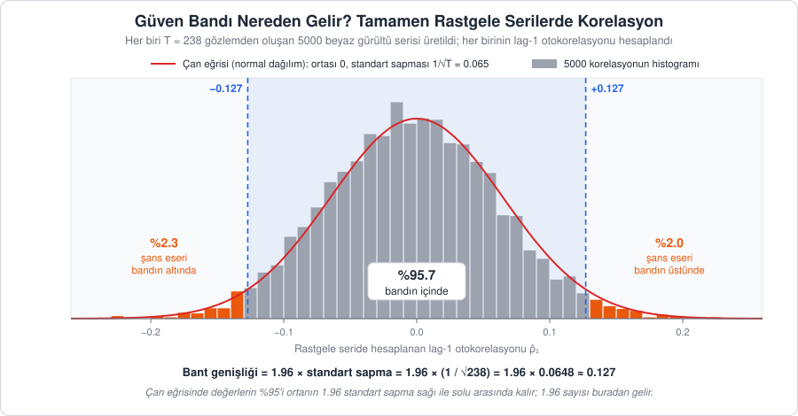

*Şekil 6.5 — Güven bandının kaynağı: 238 gözlemlik 5000 tamamen rastgele seride hesaplanan lag-1 otokorelasyonları (gri histogram) sıfır çevresinde toplanır ve standart sapması yaklaşık $`1/\sqrt{238} \approx 0.065`$ olan bir çan eğrisine (kırmızı) uyar. Değerlerin yaklaşık %95'i $`\pm 1.96/\sqrt{T} = \pm 0.127`$ bandının içinde kalır; turuncu çubuklar, gerçekte hiçbir ilişki yokken şans eseri bandın dışına taşan değerlerdir.*

Bu çan biçimli dağılıma **normal dağılım** denir. Bir normal dağılım iki sayıyla tarif edilir: ortası (burada 0) ve **standart sapması**, yani değerlerin ortadan tipik uzaklığı (varyansın karekökü). İstatistikte iyi bilinen bir kural vardır: Normal dağılımda değerlerin %95'i, ortanın 1.96 standart sapma solu ile 1.96 standart sapma sağı arasında kalır. 1.96 sayısı buradan gelir; "%95" ile "1.96" birbirine bağlıdır (%99'luk bir bant isteseydik 2.58 kullanırdık).

Geriye standart sapmayı bulmak kalır. Rastgele bir seride $\hat{\rho}_h$'nin standart sapması yaklaşık $1/\sqrt{T}$'dir: Gözlem sayısı arttıkça şans dalgalanması küçülür. İkisini birleştirince %95 güven sınırları:

$$
\pm 1.96 \times \frac{1}{\sqrt{T}} = \pm \frac{1.96}{\sqrt{T}}
$$

> **Simge notu:** $`\pm`$ *(artı eksi)*: hem pozitif hem negatif sınır · $`\sqrt{T}`$ *(karekök T)*: gözlem sayısının karekökü · **standart sapma**: değerlerin ortalamadan tipik uzaklığı; varyansın karekökü

`USgas` için adım adım: $\sqrt{238} \approx 15.43$, $1/15.43 \approx 0.0648$ ve $1.96 \times 0.0648 \approx 0.127$. Sınırlar $\pm 0.127$'dir. Şekil 6.5'teki deneyde 5000 korelasyonun standart sapması 0.063 çıkmıştır (formül 0.065 diyor) ve değerlerin %95.7'si gerçekten −0.127 ile +0.127 arasında kalmıştır; %2.3'ü alttan, %2.0'ı üstten şans eseri dışarı taşmıştır.

İstatistik dilinde bandın arkasındaki varsayıma **hipotez** denir: "Seri beyaz gürültüdür, yani gerçek otokorelasyon sıfırdır." Bu varsayım doğruysa bir çubuğun bandın dışına çıkma olasılığı yalnızca %5'tir. Bir çubuk bandın dışına çıkarsa o gecikmedeki korelasyona istatistiksel olarak **anlamlı** deriz; yani tesadüfle açıklanması zordur.

**Açıklama:** Mavi bandı bir **"tesadüf bölgesi"** olarak düşünün. Tamamen rastgele sayılardan oluşan bir seride bile korelasyonlar tam olarak sıfır çıkmaz; şans eseri küçük pozitif ya da negatif değerler görülür. Bant, bu şans dalgalanmasının %95 olasılıkla ulaşabileceği sınırı gösterir:

- Çubuk **bandın içindeyse**: "Bu kadarını şans da üretebilirdi." Çubuk yorumlanmaz.
- Çubuk **bandın dışındaysa**: "Bunu şansla açıklamak zor; gerçek bir ilişki var." Çubuk yorumlanır.

Seri uzadıkça şans dalgalanması küçülür ve bant daralır: 100 gözlemde $1.96/\sqrt{100} = 1.96/10 = \pm 0.196$, 400 gözlemde $1.96/20 = \pm 0.098$. Veriyi dört katına çıkarmak bandı yarıya indirir, çünkü $\sqrt{4} = 2$'dir. Kısa serilerde bu yüzden yalnızca güçlü ilişkiler bandı aşabilir.

> **Not —** Sınırlar %95 düzeyinde olduğu için, gerçekten beyaz gürültü olan bir seride bile 20 çubuktan yaklaşık 1'inin bandı az farkla aşması beklenir (Şekil 6.5'teki turuncu uçlar). Tek başına, sınırı hafifçe geçen uzak bir çubuğa fazla anlam yüklemeyin.

Grafiğin nasıl okunacağı Bölüm 6.3.5 ve 6.3.6'da ayrıntılı olarak ele alınıyor.

#### 6.3.4. Elle Hesaplama Örneği

Formülü küçük bir örnekle adım adım uygulayalım. Elimizde beş günlük sıcaklık verisi olsun: $x = [10, 12, 15, 11, 17]$. Lag-1 otokorelasyonu, yani dünkü sıcaklık ile bugünkü sıcaklık arasındaki ilişki nedir? Burada $T = 5$, $h = 1$'dir; $x_1 = 10$ birinci günün, $x_5 = 17$ beşinci günün sıcaklığıdır.

**1. Ortalamayı bulalım:**

$$
\bar{x} = \frac{10 + 12 + 15 + 11 + 17}{5} = \frac{65}{5} = 13
$$

**2. Hesaplama tablosu:** Bugünkü değerin sapması ile dünkü değerin sapmasını çarpıyoruz. 1. günün "dünü" veride olmadığı için o satırda çarpım yoktur (–).

| Zaman ($`t`$) | $`x_t`$ (bugün) | $`x_{t-1}`$ (dün) | $`x_t - \bar{x}`$ | $`x_{t-1} - \bar{x}`$ | Pay için çarpım | Payda için kare $`(x_t - \bar{x})^2`$ |
| :---: | :---: | :---: | :---: | :---: | :---: | :---: |
| 1 | 10 | – | −3 | – | – | 9 |
| 2 | 12 | 10 | −1 | −3 | $`(-1)(-3) = 3`$ | 1 |
| 3 | 15 | 12 | 2 | −1 | $`(2)(-1) = -2`$ | 4 |
| 4 | 11 | 15 | −2 | 2 | $`(-2)(2) = -4`$ | 4 |
| 5 | 17 | 11 | 4 | −2 | $`(4)(-2) = -8`$ | 16 |
| **Toplam** | | | | | **−11** | **34** |

Pay: $3 + (-2) + (-4) + (-8) = -11$. Payda: $9 + 1 + 4 + 4 + 16 = 34$.

**3. Sonucu bulalım:**

```math
\begin{aligned}
\hat{\rho}_1 &= \frac{\sum_{t=2}^{5} (x_t - \bar{x})(x_{t-1} - \bar{x})}{\sum_{t=1}^{5} (x_t - \bar{x})^2} \\
             &= \frac{-11}{34} \\
             &\approx -0.324
\end{aligned}
```

Pay 4 terimden ($t = 2, \dots, 5$), payda 5 terimden oluşur; bu, Tanım 2'deki toplam sınırlarının doğrudan uygulamasıdır. R'da `acf(c(10, 12, 15, 11, 17), plot = FALSE)$acf[2]` aynı sonucu (−0.3235) verir: `c(...)` beş sayıdan bir vektör kurar, `plot = FALSE` grafik yerine sayıları döndürür, `$acf` sonucun korelasyon değerlerini içeren parçasını alır, `[2]` de bu değerlerin ikincisini seçer. İkinci elemanı seçmemizin nedeni, R'da sayımın 1'den başlaması ve ilk elemanın lag-0 olmasıdır (ayrıntı için Bölüm 6.4.3'teki indeks tablosu).

Aynı dört çiftin (12, 10), (15, 12), (11, 15), (17, 11) sıradan Pearson korelasyonu ise −0.448'dir (R'da `cor(c(12, 15, 11, 17), c(10, 12, 15, 11))`). Fark, Bölüm 6.3.3'teki notta anlatılan iki ayrıntıdan gelir: ACF formülü her iki sütun için de beş günün ortalamasını (13) kullanır ve paydada beş terim toplar. Bu kadar kısa bir seride fark büyüktür; yüzlerce gözlemde önemsizleşir.

**Yorum:** $\hat{\rho}_1 \approx -0.324$, dünkü ve bugünkü sıcaklıklar arasında zayıf, **negatif** bir ilişkiye işaret eder: Sıcaklık bir gün ortalamanın üzerine çıktığında ertesi gün ortalamanın altına düşme eğilimindedir. Bu tür bir desen, serinin ortalamaya geri dönen (*mean-reverting*), salınımlı bir yapıya sahip olabileceğini düşündürür.

Ancak bu sonuç yalnızca 5 gözleme dayanıyor. Güven sınırı $\pm 1.96/\sqrt{5} = \pm 1.96/2.236 \approx \pm 0.88$ olduğundan −0.324 istatistiksel olarak **anlamlı değildir**. Bu örnek hesaplamanın mekanizmasını göstermek içindir; gerçek analizlerde güvenilir bir ACF için en az 50 gözlem önerilir.

#### 6.3.5. ACF Grafiğinin Anatomisi

R ya da Python'un çizdiği bir ACF grafiğinde altı öğe vardır. Şekil 6.6 bunları `USgas` serisinin gerçek grafiği üzerinde numaralarla gösteriyor.


*Şekil 6.6 — `USgas` serisinin ACF grafiği ve okunması gereken altı öğe. Mavi çubuklar bandın dışında (anlamlı), gri çubuklar bandın içinde (anlamsız), turuncu çubuklar mevsimsel gecikmelerdir.*

| No | Öğe | Ne anlatır? |
| --- | --- | --- |
| — | Yatay eksen | Gecikme $`h`$: kaç adım geriye bakıldığı. Aylık veride $`h = 12`$, "bir yıl önce" demektir. |
| — | Dikey eksen | Korelasyon $`\hat{\rho}_h`$; −1 ile +1 arasında. |
| ① | $`h = 0`$ çubuğu | Her zaman 1. Bilgi taşımaz, atlanır. |
| ② | Bandın dışındaki çubuk | Anlamlı bir ilişki. Çubuk ne kadar uzunsa ilişki o kadar güçlü. |
| ③ | Düzenli aralıklı tepeler | Mevsimsellik. İki tepe arasındaki mesafe, mevsimin uzunluğudur (burada 12 ay). |
| ④ | Sıfırın altındaki çubuk | Negatif ilişki: $`h`$ adım önce değer ortalamanın üstündeyse bugün altında olma eğilimi. `USgas`'ta 6 ay önce kışsa bugün yazdır. |
| ⑤ | Mavi bant | Tesadüf bölgesi, $`\pm 1.96/\sqrt{T}`$ (Bölüm 6.3.3). |
| ⑥ | Bandın içindeki (gri) çubuk | Şansla açıklanabilir; yorumlanmaz. |

**Okuma sırası:** Bir ACF grafiğine baktığınızda şu dört adımı izleyin:

1. $h = 0$ çubuğunu atlayın.
2. Mavi bandı bulun.
3. Hangi çubukların bandın dışında kaldığına bakın ve yalnızca onları yorumlayın.
4. Genel desene bakın: Çubuklar hızlı mı, yavaş mı azalıyor? Düzenli aralıklarla tekrar eden tepeler var mı? Bu sorunun cevabı serinin türünü söyler (Bölüm 6.3.6).

> **Not —** R'da `ts` nesnelerinin ACF grafiğinde yatay eksen gecikme sayısıyla değil, **yıl** cinsinden etiketlenir: Aylık veride 1.0 işareti $`h = 12`$'yi gösterir (Bölüm 6.5). Şekil 6.6 gecikme sayısını kullanır.

#### 6.3.6. ACF Grafiği Nasıl Okunur? Tipik Desenler

Tek tek çubuklardan çok, çubukların oluşturduğu **desen** önemlidir. Pratikte karşılaşacağınız ACF grafiklerinin çoğu aşağıdaki beş desenden birine ya da birkaçının karışımına benzer. Bir grafiğe baktığınızda ilk sorunuz şu olmalı: *"Bu, hangisine benziyor?"*


*Şekil 6.7 — Beş tipik ACF deseni. Solda seri, sağda ACF'si. İlk dört satır benzetimle üretilmiştir; son satır gerçek `AirPassengers` verisidir.*

| Desen | ACF'de ne görürsünüz? | Ne anlama gelir? | Ne yapılır? |
| --- | --- | --- | --- |
| **Beyaz gürültü** | Çubukların hepsi bandın içinde (ya da en fazla 20'de 1'i, az farkla dışında) | Seri geçmişini hatırlamıyor; bugünü geçmişten tahmin edemeyiz | Modellenecek doğrusal yapı yok. Bir modelin **artıklarında** görmek istediğimiz desen budur (Bölüm 7.4, 7.6.6). |
| **Trend** | Çubuklar 1'e yakın başlar ve çok yavaş azalır | Seri durağan değil; yüksek değerleri yine yüksek değerler izliyor | Fark alın, sonra ACF'yi yeniden çizin (Bölüm 3.2, 7.1.4) |
| **Mevsimsellik** | Dalgalı: mevsim uzunluğunun katlarında (12, 24, …) tepe, yarısında (6, 18, …) dip | Takvime bağlı, tekrar eden bir desen | Mevsim uzunluğunu tepelerin aralığından okuyun; mevsimsel fark ya da SARIMA (Bölüm 7.3) |
| **Kısa hafıza (AR tipi)** | İlk birkaç çubuk büyük, sonra hızla ve düzgünce sönüp bandın içine iner | Bugün yakın geçmişe bağlı, ama etki çabuk kayboluyor | AR modeli adayı; derecesini PACF söyler (Bölüm 6.4, 6.6) |
| **Trend + mevsimsellik** | Yavaş sönme ve mevsim uzunluğunun katlarında çıkıntılar | Gerçek verilerde en sık karşılaşılan durum | Önce trendi ve mevsimselliği giderin (log, fark, mevsimsel fark), sonra yeniden bakın |

> **Not — Sık yapılan hatalar:**
>
> - $`h = 0`$ çubuğunu "çok güçlü bir ilişki" sanmak. Bu çubuk her zaman 1'dir.
> - Bandı az farkla aşan uzak, tek bir çubuğa anlam yüklemek. %95'lik bantta 20 çubuktan biri şans eseri dışarı taşabilir (Bölüm 6.3.3).
> - Trendli bir serinin ACF'sinden model derecesi okumaya çalışmak. Yavaş sönme diğer bütün yapıları örter; önce seriyi durağanlaştırın.
> - Korelasyonu nedensellik sanmak. ACF yalnızca "birlikte hareket ediyor mu?" sorusunu yanıtlar, "biri ötekine mi yol açıyor?" sorusunu değil.

#### 6.3.7. Python ve R ile ACF

> **Uygulama dosyası:** [`Codes/ACF_PACF.py`](Codes/ACF_PACF.py) (Python kodları) ve [`Codes/R/ch06_manipulasyon_acf.R`](Codes/R/ch06_manipulasyon_acf.R) (R kodları). Python dosyasını depo kök dizininden `python Codes/ACF_PACF.py` komutuyla çalıştırın; veri yolu (`data/...`) bu dizine göre yazılmıştır.

Aşağıda `[20, 22, 21, 23, 24]` serisi için lag-1 otokorelasyonunu iki dilde hesaplıyoruz.

**Python ile ACF:**

```python
from statsmodels.tsa.stattools import acf  # ACF fonksiyonunu içeri aktar
import numpy as np                          # Numpy kütüphanesini içeri aktar

data = np.array([20, 22, 21, 23, 24])  # Örnek bir zaman serisi verisi oluştur
acf_values = acf(data, nlags=2)        # 2 gecikmeye kadar ACF değerlerini hesapla
print(f"Lag-1 ACF: {acf_values[1]:.3f}")  # 1. gecikmedeki (lag-1) ACF değerini yazdır
```

**Çıktı:**

```
Lag-1 ACF: 0.100
```

`from statsmodels.tsa.stattools import acf` satırı, `statsmodels` kütüphanesinin `tsa.stattools` modülünden yalnızca `acf` fonksiyonunu alır. `import numpy as np` ise `numpy` kütüphanesini kısa adı `np` ile yükler (`import ... as ...`, "bu kütüphaneyi şu kısa adla kullanacağım" demektir). `np.array([...])` köşeli parantez içindeki sayılardan bir dizi oluşturur. `acf(data, nlags=2)` lag-0, lag-1 ve lag-2 için üç değerlik bir dizi döndürür: `[1.0, 0.1, 0.0]`. Python'da sayma 0'dan başladığı için `acf_values[0]` lag-0'ı, `acf_values[1]` lag-1'i verir. Son satırdaki `f"..."` bir *f-string*'dir: Süslü parantez içindeki değer metnin içine yerleştirilir, `:.3f` de bu değeri üç ondalık basamakla yazar.

**R ile ACF:**

```r
data <- c(20, 22, 21, 23, 24)          # Örnek bir zaman serisi vektörü oluştur
acf_result <- acf(data, plot = FALSE)  # Grafik çizmeden ACF değerlerini hesapla
# R'da acf() çıktısının ilk elemanı lag-0'dır (her zaman 1), bu yüzden lag-1 için 2. elemanı alırız.
cat("Lag-1 ACF:", round(acf_result$acf[2], 3))
```

**Çıktı:**

```
Lag-1 ACF: 0.1
```

Bu R kodu, Python kodunun yaptığını yapar: Beş sayılık seri için örneklem otokorelasyonlarını hesaplar ve bunlardan yalnızca lag-1 değerini ekrana yazar. Kodu satır satır okuyalım:

1. `data <- c(20, 22, 21, 23, 24)`: `c()` (*combine*, birleştir) virgülle ayrılmış değerleri tek bir **vektörde**, yani aynı türden değerlerin sıralı listesinde toplar. Sonuç beş sayılık bir vektördür ve `data` adına kaydedilir. Bu sıradan bir vektördür, `ts` nesnesi değildir; `acf()` ikisiyle de çalışır. (`data`, R'daki `data()` fonksiyonuyla aynı adı taşır. R, parantezli kullanımda fonksiyonu, parantezsiz kullanımda bu vektörü bulduğu için sorun çıkmaz; yine de kendi kodlarınızda `veri` gibi ayrı bir ad seçmek karışıklığı önler.) Satır sonundaki `#` ile başlayan kısım yorumdur.
2. `acf_result <- acf(data, plot = FALSE)`: `acf()` otokorelasyonları Bölüm 6.3.3'teki Tanım 2 ile hesaplar. Argümanlar:
   - `data`: Otokorelasyonu hesaplanacak seri (konumsal argüman).
   - `plot = FALSE`: Varsayılan `plot = TRUE` grafiği çizer; `FALSE` grafik çizmeden yalnızca sonuçları döndürür, çünkü burada sayıya ihtiyacımız var.
   - `lag.max` (yazılmamış): Kaç gecikmeye kadar hesaplanacağı. Verilmezse yaklaşık $10 \log_{10} T$ alınır, ama bu sayı hiçbir zaman $T - 1$'i aşamaz; beş gözlemde en fazla 4 gecikme hesaplanabilir. Sonuç lag-0'dan lag-4'e beş değerdir: 1.0, 0.1, 0.0, −0.2, −0.4.

   Dönen nesne `acf` sınıfında bir **liste**dir ve `acf_result` adına kaydedilir. Parçalarından `$acf` korelasyon değerlerini, `$lag` bunların hangi gecikmeye ait olduğunu, `$n.used` kullanılan gözlem sayısını (5) tutar.
3. `cat("Lag-1 ACF:", round(acf_result$acf[2], 3))`: İçten dışa okunur:
   - `acf_result$acf`: Listenin korelasyon değerlerini içeren parçası. `acf()` birden fazla seriyi birlikte de işleyebildiği için bu parça 5 × 1 × 1 boyutlu bir dizi (*array*) olarak saklanır; tek seride bunu sıradan bir sayı listesi gibi düşünebilirsiniz.
   - `[2]`: Köşeli parantez, bir vektörden sıra numarasıyla eleman seçer. R'da sayma 1'den başlar ve 1. eleman lag-0 olduğu için lag-1 değeri 2. sıradadır.
   - `round(..., 3)`: Sayıyı üç ondalık basamağa yuvarlar.
   - `cat()`: Kendisine virgülle verilen parçaları (burada tırnak içindeki metin ve sayı) aralarına birer boşluk koyarak ekrana yazar. Satır sonuna kendiliğinden yeni satır eklemez; uygulama dosyasında bu yüzden sona `"\n"` (yeni satır karakteri) eklenmiştir.

Çıktı `Lag-1 ACF: 0.1` satırıdır. `round(..., 3)` üç basamak bıraksa da R sondaki sıfırları yazmadığı için değer `0.100` yerine `0.1` olarak görünür; Python ise `:.3f` biçimiyle sıfırları da yazmıştı. Sonucun tamamını görmek isterseniz `acf_result` yazın: R, "Autocorrelations of series 'data', by lag" başlığının altına gecikmeleri (0, 1, 2, 3, 4) ve değerlerini iki satır hâlinde basar.

**Yorum:** Elle kontrol edelim: $\bar{x} = 110/5 = 22$, sapmalar $[-2, 0, -1, 1, 2]$. Pay, ardışık sapmaların çarpımlarının toplamıdır: $(0)(-2) + (-1)(0) + (1)(-1) + (2)(1) = 0 + 0 - 1 + 2 = 1$. Payda, sapmaların karelerinin toplamıdır: $4 + 0 + 1 + 1 + 4 = 10$. Dolayısıyla $\hat{\rho}_1 = 1/10 = 0.1$. Her iki dil de aynı formülü kullandığı için aynı sonucu verir. Değer 0'a çok yakındır: Dünkü değer bugünkü değer hakkında neredeyse hiç doğrusal bilgi taşımaz. 5 gözlemde güven sınırı $\pm 0.88$ olduğundan bu korelasyon da anlamsızdır.

**ACF grafiğini çizmek:** Yukarıdaki kodlar yalnızca sayıları verir. Grafiği çizmek için tek bir komut yeterlidir.

R'da `acf()` grafiği varsayılan olarak çizer:

```r
acf(AirPassengers, lag.max = 36, main = "AirPassengers ACF")
```

Bu tek satır, R ile birlikte gelen aylık `AirPassengers` serisinin (Bölüm 5.2.3) korelogramını çizer. Paket yüklemeye gerek yoktur; hem `acf()` hem de veri, R açıldığında hazırdır. Argümanlar:

1. `AirPassengers`: Korelogramı çizilecek seri (konumsal argüman).
2. `lag.max = 36`: Grafiğin kaç gecikmeye kadar çizileceği. Aylık veride 36 gecikme üç yıl demektir; böylece 12, 24 ve 36. gecikmelerdeki mevsimsel tepeler görünür. Yazılmasaydı $10 \log_{10} 144 \approx 21$ gecikme çizilirdi.
3. `main = "AirPassengers ACF"`: Grafiğin başlığı.
4. `plot` (yazılmamış): Varsayılanı `TRUE` olduğu için grafik çizilir. Bu durumda `acf()` hesapladığı değerleri ekrana yazmaz; isterseniz `a <- acf(...)` ile bir ada kaydedip sonra `a` yazarak görebilirsiniz.

Ekranda sayı çıkmaz, yalnızca grafik açılır. Her gecikme için dikey bir çubuk, yatay eksende gecikme, dikey eksende (`ACF` etiketiyle) korelasyon vardır; mavi kesikli çizgiler $\pm 1.96/\sqrt{T}$ güven sınırlarıdır (Bölüm 6.3.3). Seri bir `ts` nesnesi olduğu için yatay eksen gecikme sayısıyla değil **yıl** cinsinden etiketlenir: 1.0 işareti lag-12'yi, 3.0 işareti lag-36'yı gösterir (Bölüm 6.5'teki nota bakın). Grafikte bütün çubukların bandın çok üstünde başlayıp yavaş azaldığı (lag-1 0.95) ve 1.0, 2.0, 3.0 konumlarında yeniden yükseldiği (lag-12 0.76) görülür: Bu, Bölüm 6.3.6'daki "trend + mevsimsellik" desenidir.

Python'da `statsmodels` kütüphanesinin `plot_acf()` fonksiyonu kullanılır:

```python
import pandas as pd
import matplotlib.pyplot as plt
from statsmodels.graphics.tsaplots import plot_acf

seri = pd.read_csv("data/AirPassengers.csv", index_col=0)["Passengers"]
plot_acf(seri, lags=36, title="AirPassengers ACF")  # lags: kaç gecikme çizileceği
plt.show()
```

`pd.read_csv("data/AirPassengers.csv", index_col=0)` CSV dosyasını bir tabloya (pandas *DataFrame*) okur ve ilk sütunu (`Month`) satır etiketi (indeks) yapar; sonundaki `["Passengers"]` tablodan yolcu sayısı sütununu tek bir seri olarak seçer. `plot_acf()` korelogramı çizer; `lags=36` R'daki `lag.max` argümanının karşılığıdır. `plt.show()` (`matplotlib` kütüphanesinin çizim modülü `pyplot`, kısa adıyla `plt`) çizilen grafiği ekranda gösterir.

> **Not —** İki dilin çizdiği bantlar farklı görünür. R, Bölüm 6.3.3'teki sabit $`\pm 1.96/\sqrt{T}`$ bandını çizer. Python'daki `plot_acf()` ise varsayılan olarak **Bartlett formülünü** kullanır: Bu formül, $`h`$. gecikmedeki bandı hesaplarken ondan önceki gecikmelerde bulunan korelasyonları da hesaba katar (önceki korelasyonlar ne kadar büyükse bant o kadar geniş olur); bu yüzden bant gecikme arttıkça genişler ve açık mavi bir huni gibi görünür. `AirPassengers` için ($`T = 144`$) bant, 1. gecikmede ±0.16 iken 12. gecikmede ±0.60'a çıkar. R ile aynı sabit bandı görmek için `plot_acf(seri, lags=36, bartlett_confint=False)` yazın. Bu farkı bilmezseniz aynı seri için iki dilde farklı sonuçlar okuduğunuzu sanabilirsiniz.

### 6.4. PACF: Kısmi Otokorelasyon Fonksiyonu

#### 6.4.1. Sezgi: Doğrudan Etki

ACF bize **toplam** ilişkiyi gösterir. Ancak bu ilişkinin bir kısmı dolaylı olabilir. PACF (*Partial Autocorrelation Function*, kısmi otokorelasyon fonksiyonu) ise **aradaki gecikmelerin etkisi arındırılmış** korelasyonu, yani **doğrudan** etkiyi ölçer.

Şöyle bir zincir düşünün: Evvelsi gün yağan yağmur ($x_{t-2}$) toprağı ıslattı; dün ıslak kalan toprak ($x_{t-1}$) bugünkü havanın nemli olmasına ($x_t$) yol açtı. ACF, "evvelsi günkü yağmur" ile "bugünkü nem" arasında güçlü bir ilişki bulur, çünkü aralarında bir zincir vardır. PACF ise aradaki "dünkü ıslak toprak" etkisini devreden çıkarır ve şunu sorar: *Dünü zaten bildiğimize göre, evvelsi günün bugüne ek, doğrudan bir katkısı var mı?*

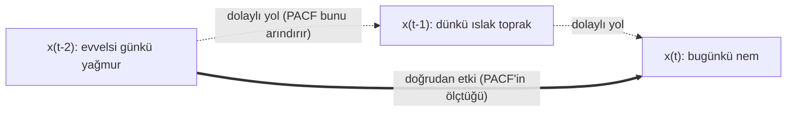
```mermaid
graph LR
    X2["x(t-2): evvelsi günkü yağmur"] -.->|"dolaylı yol (PACF bunu arındırır)"| X1["x(t-1): dünkü ıslak toprak"]
    X1 -.->|"dolaylı yol"| X0["x(t): bugünkü nem"]
    X2 ==>|"doğrudan etki (PACF'in ölçtüğü)"| X0
```

Örneğin bir AR(1) sürecinde (Bölüm 3.2, 6.6) $x_t$ yalnızca $x_{t-1}$'e doğrudan bağlıdır. $x_{t-2}$ ile $x_t$ arasında ACF'de görülen korelasyon tamamen $x_{t-1}$ üzerinden geçen dolaylı yoldan gelir; bu yüzden lag-2 PACF sıfırdır.

Bunu sayılarla görelim. Bölüm 3.2'deki AR(1) örneğinde ($\phi = 0.5$, okunuşu "fi") her gün, bir önceki günün değerinin yarısını taşır: Evvelsi gün gelen 100 birimlik bir şok dün 50, bugün 25 olarak hissedilir. Bu yüzden evvelsi gün ile bugün arasında da bir ilişki görünür: Lag-1 korelasyonu 0.5 ise lag-2 korelasyonu $0.5 \times 0.5 = 0.25$'tir (ACF). Ama bu ilişkinin tamamı dün üzerinden geçer: Dünün değerini (50) biliyorsanız, bugünü tahmin etmek için evvelsi güne (100) bakmanız size yeni bir şey söylemez. ACF lag-2'de 0.25 gösterirken PACF lag-2'de 0 gösterir.

#### 6.4.2. Formel Tanım

PACF'in birinci tanımı **regresyon** kavramını kullanır. Regresyon, bir değişkeni başka değişkenlerin ağırlıklı toplamıyla açıklamaya çalışmaktır; bu ağırlıklara **katsayı** denir. Örneğin $x_t = 0.6\,x_{t-1} + 0.2\,x_{t-2}$ eşitliği "bugün = dünün 0.6'sı + evvelsi günün 0.2'si" demektir. Katsayılar, açıklamanın veriye en iyi uyduğu değerler seçilerek bulunur.

**Tanım 1 (Regresyon katsayısı olarak PACF):** $h$ gecikmedeki kısmi otokorelasyon $\phi_{hh}$, $x_t$'nin ilk $h$ gecikmesine regresyonundaki **son** katsayıdır (seriden ortalaması çıkarılmış kabul edilir):

$$
x_t = \phi_{h1} x_{t-1} + \phi_{h2} x_{t-2} + \dots + \phi_{hh} x_{t-h} + e_t
$$

> **Simge notu:** $`\phi`$ *(fi)*: Yunan harfi; π (pi) ile karıştırılmamalıdır · $`\phi_{hh}`$ *(fi h h)*: h gecikmedeki kısmi otokorelasyon; ilk alt indis regresyonda kaç gecikme kullanıldığını, ikincisi hangi gecikmenin katsayısı olduğunu söyler · $`\phi_{hj}`$ *(fi h j)*: aynı regresyondaki j. gecikmenin katsayısı · $`e_t`$ *(e alt t)*: regresyonun hata terimi, yani geçmişle açıklanamayan kısım

Somut olarak: Lag-1 PACF için tek gecikmeli regresyon $x_t = \phi_{11} x_{t-1} + e_t$ kurulur ve $\phi_{11}$ okunur. Lag-2 PACF için iki gecikmeli regresyon $x_t = \phi_{21} x_{t-1} + \phi_{22} x_{t-2} + e_t$ kurulur ve **yalnızca** son katsayı $\phi_{22}$ okunur. Aradaki $x_{t-1}, \dots, x_{t-h+1}$ değişkenleri regresyonda "kontrol değişkeni" olarak yer aldığı için $\phi_{hh}$, onların etkisi sabit tutulduğunda $x_{t-h}$'nin $x_t$'ye **ek** katkısını ölçer.

**Tanım 2 (Arındırılmış korelasyon olarak PACF):** Eşdeğer olarak $\phi_{hh}$, aradaki gecikmelerle açıklanabilen kısım çıkarıldıktan sonra $x_t$ ve $x_{t-h}$'nin **kalıntıları** (açıklanamayan artakalan kısımları) arasındaki korelasyondur. $h = 1$ için arada gecikme olmadığından $\phi_{11} = \rho_1$'dir. $h = 2$ için kapalı formül:

$$
\phi_{22} = \frac{\rho_2 - \rho_1^2}{1 - \rho_1^2}
$$

Formülün sezgisi: $\rho_1^2 = \rho_1 \times \rho_1$ ("ro bir kare"), "$x_{t-2} \to x_{t-1} \to x_t$" zincirinin, yani iki adet lag-1 ilişkisinin art arda bağlanmasının üreteceği dolaylı korelasyondur. Pay, gözlenen lag-2 korelasyonundan bu dolaylı kısmı çıkarır; payda ($1 - \rho_1^2$) sonucu yine −1 ile +1 arasına ölçekler. İki küçük örnek:

- **Zincirden fazlası yok:** $\rho_1 = 0.5$, $\rho_2 = 0.25$ (yukarıdaki AR(1) örneği). Zincirin ürettiği kısım $0.5^2 = 0.25$; $\phi_{22} = (0.25 - 0.25)/(1 - 0.25) = 0/0.75 = 0$. Lag-2'nin doğrudan etkisi yoktur.
- **Zincirden fazlası var:** $\rho_1 = 0.5$, $\rho_2 = 0.6$. Zincir yalnızca 0.25'i açıklar, geriye $0.6 - 0.25 = 0.35$ kalır; $\phi_{22} = 0.35/0.75 \approx 0.47$. Evvelsi günün bugüne dünden bağımsız, kendine ait bir katkısı vardır (ör. iki günde bir tekrarlanan bir etki).

AR(1) sürecinde her zaman $\rho_2 = \rho_1^2$ olduğundan $\phi_{22} = 0$ çıkar.

Daha büyük $h$ değerleri için PACF, Yule-Walker denklemleri ya da Durbin-Levinson özyinelemesi ile ACF değerlerinden hesaplanır. Bu adlar, yukarıdaki "zincirin açıkladığını çıkar" fikrini $h = 3, 4, \dots$ için de uygulayan hesap tarifleridir; R ve Python bunu otomatik yapar. Güven sınırları ACF'deki gibi yaklaşık $\pm 1.96/\sqrt{T}$'dir.

#### 6.4.3. Python ve R ile PACF

Aynı `[20, 22, 21, 23, 24]` serisi için lag-2 PACF değerini hesaplayalım.

**Python ile PACF:**

```python
from statsmodels.tsa.stattools import pacf  # PACF fonksiyonunu içeri aktar
import numpy as np

data = np.array([20, 22, 21, 23, 24])
pacf_values = pacf(data, nlags=2)  # nlags, gözlem sayısının yarısını aşamaz
print(f"Lag-2 PACF: {pacf_values[2]:.3f}")
```

**Çıktı:**

```
Lag-2 PACF: -0.016
```

`pacf()` de `acf()` gibi lag-0'dan başlayan bir dizi döndürür (`[1.0, 0.125, -0.016]`), bu yüzden lag-2 değeri `pacf_values[2]`'dedir. `nlags` en fazla gözlem sayısının yarısı olabilir: 5 gözlemde `5 // 2 = 2` (`//` Python'da kalanı atan tam sayı bölmesidir); `nlags=3` yazılırsa fonksiyon hata verir.

**R ile PACF:**

```r
data <- c(20, 22, 21, 23, 24)
pacf_result <- pacf(data, plot = FALSE)
# Dikkat: pacf() çıktısı lag-1'den başlar (lag-0 yoktur), bu yüzden lag-2 için 2. elemanı alırız.
cat("Lag-2 PACF:", round(pacf_result$acf[2], 3))
```

**Çıktı:**

```
Lag-2 PACF: -0.01
```

Bu kod aynı beş sayılık seri için kısmi otokorelasyonları hesaplar ve lag-2 değerini yazar. Yapısı Bölüm 6.3.7'deki ACF koduyla aynıdır; tek fark, sonuçtan eleman seçerken ortaya çıkar. Kodu satır satır okuyalım:

1. `data <- c(20, 22, 21, 23, 24)`: Aynı beş sayılık vektörü yeniden kurar (Bölüm 6.3.7). Önceki kodu aynı oturumda çalıştırdıysanız `data` zaten vardır; bu satır, kodun tek başına da çalışmasını sağlar.
2. `pacf_result <- pacf(data, plot = FALSE)`: `pacf()` kısmi otokorelasyonları ACF değerlerinden hesaplar (Bölüm 6.4.2'deki Durbin-Levinson özyinelemesiyle). `plot = FALSE` yine grafik yerine sayıları döndürür; `lag.max` yazılmadığı için `acf()`'teki kural geçerlidir ve beş gözlemde 4 gecikme hesaplanır. Sonuç `acf()`'inkiyle aynı yapıda bir listedir ve `pacf_result` adına kaydedilir. Değerler yine `$acf` adlı parçada saklanır (adı kafa karıştırıcıdır ama içindeki değerler kısmi otokorelasyonlardır): lag-1'den lag-4'e 0.100, −0.010, −0.201, −0.379.
3. `cat("Lag-2 PACF:", round(pacf_result$acf[2], 3))`: `acf()`'ten farklı olarak `pacf()` sonucunda lag-0 **yoktur** (lag-0 değeri her zaman 1 olup bilgi taşımadığı için R onu hiç vermez); dizi doğrudan lag-1 ile başlar. Bu yüzden lag-2 değeri `[2]`'dedir; yorum satırı da bu farkı hatırlatır. `round()` ve `cat()` önceki koddaki gibi çalışır.

Çıktı `Lag-2 PACF: -0.01` satırıdır. Gerçek değer −0.0101'dir; üç basamağa yuvarlanınca −0.010 olur ve R sondaki sıfırı yazmadığı için −0.01 görünür. Python ise aynı satırda −0.016 vermişti; bu farkın nedeni aşağıda.

**Yorum:** Önce elle hesaplayalım. Bu seride $\hat{\rho}_1 = 0.1$ (Bölüm 6.3.7) ve $\hat{\rho}_2 = 0$'dır: Sapmalar $[-2, 0, -1, 1, 2]$ için iki adım arayla eşleşen çarpımlar $(-1)(-2) + (1)(0) + (2)(-1) = 2 + 0 - 2 = 0$'dır. Formülden:

$$
\hat{\phi}_{22} = \frac{0 - 0.1^2}{1 - 0.1^2} = \frac{-0.01}{0.99} \approx -0.0101
$$

R bu sonucu verir. Python'un farklı çıkmasının nedeni varsayılan yöntemdir: `statsmodels` `pacf()` fonksiyonu varsayılan olarak `method="ywadjusted"` kullanır. Bu yöntemde çarpımlar toplamı $T$ yerine $T - h$ ile bölünür: Lag-1 çarpımlarının toplamı olan 1, $T - h = 5 - 1 = 4$'e bölünür ve 0.25 olur; varyans $10/5 = 2$ olduğundan $\hat{\rho}_1 = 0.25/2 = 0.125$ çıkar; dolayısıyla $\hat{\phi}_{22} = -0.125^2/(1 - 0.125^2) = -0.015625/0.984375 \approx -0.016$ çıkar. R ile birebir aynı sonucu almak için `pacf(data, nlags=2, method="ywm")` kullanılabilir. Grafik çizen `plot_pacf()` ise varsayılan olarak zaten `method="ywm"` kullanır; yani PACF grafiklerinde iki dil aynı değerleri gösterir. Uzun serilerde iki yöntem arasındaki fark ihmal edilebilir düzeydedir.

Sonucun yorumu ise nettir: Lag-1 bilindikten sonra lag-2'nin bugüne ek bir doğrudan katkısı yoktur.

PACF grafiği, ACF grafiğiyle aynı biçimde çizilir: R'da `pacf(AirPassengers, lag.max = 36)`, Python'da `from statsmodels.graphics.tsaplots import plot_pacf` ile `plot_pacf(seri, lags=36)`. Python'un PACF bandı, R'ınki gibi sabit $\pm 1.96/\sqrt{T}$ bandıdır.

> **Not — İndeks tuzağı.** Sonuç dizisinden belirli bir gecikmeyi seçerken iki şeye dikkat edin: dizinin lag-0'ı içerip içermediği ve dilin saymaya 0'dan mı 1'den mi başladığı.
>
> | Fonksiyon | lag-0 dahil mi? | Sayma başlangıcı | lag-1 | lag-2 |
> | --- | :---: | :---: | :---: | :---: |
> | R `acf()$acf` | Evet | 1 | `[2]` | `[3]` |
> | R `pacf()$acf` | Hayır | 1 | `[1]` | `[2]` |
> | Python `acf()` | Evet | 0 | `[1]` | `[2]` |
> | Python `pacf()` | Evet | 0 | `[1]` | `[2]` |
>
> R'da `acf_result$acf[2]` lag-1'i, `pacf_result$acf[2]` ise lag-2'yi verir. Bu indeks farkı sık yapılan bir hatadır.

### 6.5. Uygulama: `USgas` Serisinin ACF ve PACF Grafikleri

Şimdi iki aracı gerçek veride birlikte kullanalım.

```r
# USgas verisinin ACF ve PACF grafiklerini alt alta çizelim
par(mfrow = c(2, 1))  # 2 satır, 1 sütunluk grafik düzeni
acf(USgas,  lag.max = 36, main = "Otokorelasyon Fonksiyonu (ACF)")
pacf(USgas, lag.max = 36, main = "Kısmi Otokorelasyon Fonksiyonu (PACF)")
par(mfrow = c(1, 1))  # Grafik düzenini eski hâline getir
```

Bu kod `USgas` serisinin ACF ve PACF grafiklerini aynı pencerede alt alta çizer; iki grafiği birlikte okumak, Bölüm 6.6'da göreceğimiz model imzalarını tanımanın temelidir. Kodu satır satır okuyalım:

1. `par(mfrow = c(2, 1))`: `par()` (*parameters*) R'ın temel grafik ayarlarını değiştirir. `mfrow` (*multi-figure by row*) çizim alanını bir ızgaraya böler; değeri `c(2, 1)` iki sayılık bir vektördür: 2 satır, 1 sütun. Ardından çizilen grafikler bu kutulara satır satır, yani burada alt alta yerleşir. Ayar, değiştirilene kadar geçerli kalır.
2. `acf(USgas, lag.max = 36, main = "Otokorelasyon Fonksiyonu (ACF)")`: Üst kutuya ACF grafiğini çizer (Bölüm 6.3.7). `lag.max = 36` üç yıllık gecikmeye kadar bakmamızı sağlar; böylece 12, 24 ve 36. gecikmelerdeki mevsimsel tepeler görünür. `main` başlığı belirler. `USgas,` sonrasındaki fazladan boşluk yalnızca alt satırla hizalama içindir.
3. `pacf(USgas, lag.max = 36, main = "Kısmi Otokorelasyon Fonksiyonu (PACF)")`: Aynı ayarlarla alt kutuya PACF grafiğini çizer. PACF lag-0 içermediği için (Bölüm 6.4.3) bu grafikte $h = 0$ çubuğu yoktur; çubuklar lag-1'den başlar.
4. `par(mfrow = c(1, 1))`: Düzeni tek grafiğe geri döndürür; unutulursa sonraki grafikler de yarım ekrana çizilir.

Kod ekrana sayı yazmaz; iki panelli bir grafik açar. Her panelde dikey çubuklar korelasyonları, mavi kesikli çizgiler $\pm 1.96/\sqrt{238} \approx \pm 0.127$ güven sınırlarını gösterir; dikey eksen üstte `ACF`, altta `Partial ACF` diye etiketlenir. Uygulama dosyası ayrıca yorumda geçen sayıları `acf(as.numeric(USgas), lag.max = 36, plot = FALSE)` ve aynı biçimde `pacf(...)` ile yazdırır.


*Şekil 6.8 — `USgas` serisinin ilk 36 gecikmedeki ACF (üstte) ve PACF (altta) değerleri. Mavi kesikli çizgiler $`\pm 1.96/\sqrt{T} \approx \pm 0.127`$ sınırlarıdır; gri çubuklar bu sınırların içinde kalır. Turuncu çubuklar mevsimsel gecikmelerdir (12, 24, 36).*

> **Not —** R'da `ts` nesnesinin ACF grafiğinde yatay eksen **ay cinsinden değil, mevsim (yıl) cinsinden** çizilir: 1.0 işareti lag-12'yi, 2.0 işareti lag-24'ü gösterir. `acf(as.numeric(USgas))` yazarsanız eksen gecikme sayısıyla (1, 2, …, 36) etiketlenir, çünkü `as.numeric()` zaman bilgisini atar. Şekil 6.6 ve 6.8 bu ikinci gösterimi kullanır.

**Yorum:**

- **ACF:** $\hat{\rho}_1 = 0.78$ ve $\hat{\rho}_2 = 0.41$ ile başlayan korelasyonlar, 4–8. gecikmelerde negatife döner (−0.13 ile −0.17 arası; kış ile yaz aylarının karşılaştırıldığı gecikmeler) ve 12. gecikmede tekrar en yüksek değerine çıkar ($\hat{\rho}_{12} = 0.87$). Bu desen 24 ve 36. gecikmelerde de tekrar eder ($\hat{\rho}_{24} = 0.77$, $\hat{\rho}_{36} = 0.73$). Dalgalı, 12 aylık periyotla tekrarlayan ve **çok yavaş sönen** bu yapı, güçlü bir mevsimselliğin ve serinin durağan olmadığının işaretidir.
- **PACF:** Lag-1 (0.78) ve lag-2 (−0.51) çok büyüktür. Lag-2'nin negatif olması, lag-1 bilindikten sonra iki ay önceki değerin ters yönde bir düzeltme etkisi taşıdığını gösterir. Lag-6 (−0.19) bandı az farkla aşar; 9–13. gecikmelerde ise belirgin çubuklar vardır (lag-9 0.44, lag-10 0.48, lag-13 −0.41). Bunlar mevsimsel yapının PACF'e yansımasıdır.
- **Sonuç:** Bu seri olduğu hâliyle basit bir AR ya da MA modeline uymaz. Önce mevsimsel ve/veya normal **fark alma** ile durağan hâle getirilmesi (durağanlık kavramı için Bölüm 3.2, durağanlık testleri için Bölüm 7.5), ardından farkı alınmış serinin ACF/PACF grafiklerine bakılması gerekir. Bu süreç, Bölüm 7'deki SARIMA modellemesinin konusudur.

### 6.6. AR ve MA Modelleri için ACF ve PACF İmzaları

ACF ve PACF grafiklerinin asıl gücü, **durağan** bir seri için uygun model tipini ve derecesini önermeleridir. Bunun için önce iki temel model ailesini kısaca tanıyalım; tam teori ve tahmin yöntemleri Bölüm 7.1'dedir.

#### 6.6.1. Beyaz Gürültü, AR ve MA Modelleri: Kısa Tanımlar

**Tanım 1 (Beyaz gürültü):** Ortalaması sıfır, varyansı sabit ve farklı zamanlardaki değerleri birbiriyle ilişkisiz olan seriye beyaz gürültü denir:

$$
\varepsilon_t \sim WN(0, \sigma^2): \quad E[\varepsilon_t] = 0, \quad \mathrm{Var}(\varepsilon_t) = \sigma^2, \quad \mathrm{Cov}(\varepsilon_t, \varepsilon_s) = 0 \quad (t \neq s)
$$

> **Simge notu:** $`\varepsilon_t`$ *(epsilon t)*: t anındaki rastgele şok (beyaz gürültü terimi); Yunan "e" harfidir, kümelerdeki "elemanıdır" işareti ∈ ile karıştırılmamalıdır · $`\sim`$ *(tilde)*: "dağılımına sahiptir" · $`WN`$ *(white noise)*: beyaz gürültü · $`\sigma^2`$ *(sigma kare)*: şokların varyansı · $`s`$: t'den farklı başka bir zaman · $`\neq`$ *(eşit değil)*

Formüldeki üç koşul sözle şöyledir: Şokların uzun vadeli ortalaması sıfırdır (ne yukarı ne aşağı yönde sistematik bir eğilim vardır); şokların yayılımı her dönem aynıdır; farklı dönemlerin şokları birbirinden habersizdir (kovaryansları sıfırdır). Beyaz gürültü "hafızası olmayan" seridir; geçmişi bilmek geleceği tahmin etmeye yardımcı olmaz. Bu nedenle iyi kurulmuş bir modelin **artıklarının** (kalıntılarının) beyaz gürültü olması beklenir.

**Tanım 2 (Otoregresif model, AR(p)):** Bugünkü değer, kendi son $p$ değerinin doğrusal bir bileşimi (her birinin bir katsayıyla çarpılıp toplanması) ile yeni bir şokun toplamıdır:

$$
x_t = c + \phi_1 x_{t-1} + \phi_2 x_{t-2} + \dots + \phi_p x_{t-p} + \varepsilon_t
$$

> **Simge notu:** $`\phi_i`$ *(fi i)*: i. gecikmenin AR katsayısı · $`c`$: sabit terim · $`p`$: modelin derecesi (kaç gecikme kullanıldığı) · $`\lvert \phi \rvert`$ *(fi'nin mutlak değeri)*: işaretinden bağımsız büyüklüğü; $`\lvert -0.5 \rvert = 0.5`$

Sezgi: "Bugün, dünün (ve önceki $p - 1$ günün) bir kısmıdır, üstüne yeni bir sürpriz eklenir." En basit örnek AR(1): $x_t = \phi x_{t-1} + \varepsilon_t$. Bölüm 3.2'de gördüğümüz gibi $\phi = 0.5$ için 100 birimlik bir şok 100 → 50 → 25 → 12.5 diye söner. $\lvert \phi \rvert < 1$ olduğunda süreç durağandır ve bir şokun etkisi her adımda $\phi$ ile çarpılarak geometrik biçimde (her adımda aynı oranda) azalır, ama hiçbir zaman tam sıfıra inmez.

**Tanım 3 (Hareketli ortalama modeli, MA(q)):** Bugünkü değer, bugünkü şok ile son $q$ şokun ağırlıklı toplamıdır:

$$
x_t = \mu + \varepsilon_t + \theta_1 \varepsilon_{t-1} + \dots + \theta_q \varepsilon_{t-q}
$$

> **Simge notu:** $`\mu`$ *(mü)*: serinin ortalaması · $`\theta_j`$ *(teta j)*: j. gecikmeli şokun MA katsayısı · $`q`$: modelin derecesi (kaç geçmiş şokun etkisinin sürdüğü)

Sezgi: "Bugün, son $q$ dönemde yaşanan sürprizlerin yankısıdır." Bir şok tam $q$ dönem boyunca etkisini sürdürür, sonra tamamen kaybolur. MA(1) ve $\theta = 0.8$ için 100 birimlik bir şok, geldiği gün seriyi 100, ertesi gün $0.8 \times 100 = 80$ birim etkiler; ikinci gün etkisi tam olarak sıfırdır. (Buradaki "hareketli ortalama", `decompose()`'daki trend yumuşatması ile karıştırılmamalıdır; burada ortalaması alınan şeyler gözlemler değil, geçmiş şoklardır.)

Şekil 6.9 bu iki farklı yankıyı ve bunların ACF/PACF'e nasıl yansıdığını yan yana gösteriyor. Aşağıdaki iki alt bölüm, şekildeki çubukların nedenini açıklar.

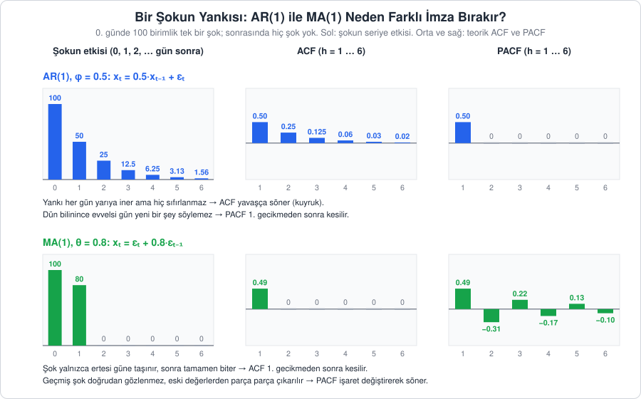

*Şekil 6.9 — Bir şokun yankısı ve teorik korelogramlar. Üstte AR(1) ($`\phi = 0.5`$): Şokun etkisi her gün yarıya iner ama hiç sıfırlanmaz; ACF $`0.5^h`$ olarak söner, PACF 1. gecikmeden sonra sıfırdır. Altta MA(1) ($`\theta = 0.8`$): Şok yalnızca bir gün sonraya taşınır; ACF 1. gecikmeden sonra sıfırdır, PACF işaret değiştirerek söner.*

#### 6.6.2. MA(q) Süreci: ACF Kesilir

MA(q) sürecinin hafızası kısadır: $x_t$ ile $x_{t-h}$, ancak ortak bir şok paylaşıyorlarsa ilişkilidir. MA(1) için ardışık üç günü alt alta yazalım:

```math
\begin{aligned}
x_t     &= \varepsilon_t + 0.8\,\varepsilon_{t-1} \\
x_{t-1} &= \varepsilon_{t-1} + 0.8\,\varepsilon_{t-2} \\
x_{t-2} &= \varepsilon_{t-2} + 0.8\,\varepsilon_{t-3}
\end{aligned}
```

$x_t$ ile $x_{t-1}$'in ortak bir parçası vardır: dünkü şok $\varepsilon_{t-1}$ (birinde 0.8 ağırlıkla, ötekinde 1 ağırlıkla). Bu yüzden ilişkilidirler. $x_t$ ile $x_{t-2}$'nin ise hiç ortak şoku yoktur: Biri $\varepsilon_t$ ve $\varepsilon_{t-1}$'den, öteki $\varepsilon_{t-2}$ ve $\varepsilon_{t-3}$'ten oluşur. Şoklar birbirinden habersiz olduğu için korelasyon **tam olarak sıfırdır**. Genel olarak $h > q$ olduğunda iki değerin ortak şoku kalmaz.

Lag-1 korelasyonunun büyüklüğünü de hesaplayabiliriz. Şokların varyansını 1 kabul edelim. Ortak parçanın katkısı (kovaryans) iki ağırlığın çarpımıdır: $0.8 \times 1 = 0.8$. $x_t$'nin varyansı ise içindeki bağımsız şokların ağırlıklarının karelerinin toplamıdır: $1^2 + 0.8^2 = 1 + 0.64 = 1.64$. Korelasyon = kovaryans / varyans = $0.8/1.64 \approx 0.49$. Genel formül:

$$
\rho_1 = \frac{\theta}{1 + \theta^2}, \qquad \rho_h = 0 \quad (h \ge 2)
$$

$\theta = 0.8$ için $\rho_1 = 0.8/1.64 \approx 0.49$'dur ve 2. gecikmeden itibaren ACF sıfırdır.

PACF ise sıfıra hemen inmez; genellikle işaret değiştirerek (ya da geometrik olarak) yavaşça söner. Nedeni şudur: Bugünü etkileyen dünkü şok $\varepsilon_{t-1}$ doğrudan gözlenemez; elimizde yalnızca $x$ değerleri vardır. Dünkü şoku tahmin etmek için $x_{t-1}$'e bakarız, ama $x_{t-1}$ içinde evvelsi günün şoku da vardır; onu ayıklamak için $x_{t-2}$'ye, onun içindeki şoku ayıklamak için $x_{t-3}$'e ihtiyaç duyarız ve bu böyle sürer:

$$
\varepsilon_{t-1} = x_{t-1} - 0.8\,x_{t-2} + 0.64\,x_{t-3} - 0.512\,x_{t-4} + \dots
$$

Her eski değer, giderek küçülen ve işaret değiştiren bir **ek** bilgi taşır. PACF tam da bu ek bilgiyi ölçtüğü için $0.49, -0.31, 0.22, -0.17, \dots$ şeklinde işaret değiştirerek söner (Şekil 6.9, sağ alt).

- **Kural:** ACF $q$ gecikmeden sonra aniden **kesiliyor** (çubuklar güven bandının içine düşüyor) ve PACF yavaşça sönümleniyorsa, bu bir **MA(q)** modeline işaret eder.

#### 6.6.3. AR(p) Süreci: PACF Kesilir

AR(p) sürecinde bir şokun etkisi, geri besleme yoluyla sonsuza kadar (azalarak) aktarılır: Bugünün bir kısmı yarına, yarının bir kısmı öbür güne geçer. Bu yüzden ACF sıfıra aniden inmez, **kuyruk** yaparak söner. AR(1) için teorik ACF:

$$
\rho_h = \phi^h, \qquad h = 0, 1, 2, \dots
$$

$\phi^h$, "$\phi$'yi $h$ kez kendisiyle çarp" demektir. $\phi = 0.5$ için (Şekil 6.9) $\rho_1 = 0.5$, $\rho_2 = 0.25$, $\rho_3 = 0.125$; $\phi = 0.7$ için $\rho_1 = 0.7$, $\rho_2 = 0.7 \times 0.7 = 0.49$, $\rho_3 = 0.49 \times 0.7 \approx 0.34$, … şeklinde geometrik olarak azalır. $\phi$ negatifse ACF işaret değiştirerek söner (ör. $\phi = -0.5$ için $-0.5, 0.25, -0.125, \dots$).

PACF ise tam burada net bir cevap verir: AR(p) sürecinde $x_t$ yalnızca son $p$ değere doğrudan bağlı olduğu için, $x_{t-p-1}$ ve daha eski değerlerin **ek** katkısı sıfırdır. Bölüm 6.4.1'deki örnekte olduğu gibi, dünü bilen biri evvelsi günden yeni bir şey öğrenmez. Dolayısıyla $\phi_{hh} = 0$ ($h > p$) olur ve PACF $p$ gecikmeden sonra kesilir.

İki model arasındaki bu ayna simetrisini tek cümleyle özetleyebiliriz: AR'da *değerler* yalnızca $p$ adım geriye doğrudan bağlıdır ama şok sonsuza kadar yankılanır → PACF kesilir, ACF söner. MA'da şok yalnızca $q$ adım yankılanır ama geçmiş şoklar gözlenemediği için onları eski değerlerden geri çıkarmak sonsuz bir zincir gerektirir → ACF kesilir, PACF söner.

- **Kural:** PACF $p$ gecikmeden sonra aniden **kesiliyor** ve ACF yavaşça sönümleniyor (ya da sinüs dalgası gibi salınarak sönüyorsa), bu bir **AR(p)** modeline işaret eder.

#### 6.6.4. İmzaları Yan Yana Görmek

Şekil 6.9 teorik, yani sonsuz uzunlukta bir veride ortaya çıkacak değerleri gösteriyordu. Gerçekte elimizde sonlu bir örneklem vardır. Aşağıdaki şekil, beyaz gürültü, AR(1) ve MA(1) süreçlerinden simüle edilmiş 400'er gözlemin ACF ve PACF grafiklerini göstermektedir.


*Şekil 6.10 — Üç temel sürecin korelogram imzaları. Beyaz gürültüde hiçbir çubuk anlamlı değildir. AR(1) sürecinde ($`\phi = 0.7`$) ACF geometrik olarak söner, PACF 1. gecikmeden sonra kesilir. MA(1) sürecinde ($`\theta = 0.8`$) ACF 1. gecikmeden sonra kesilir, PACF işaret değiştirerek söner.*

Şekildeki örneklem değerleri teorik değerlerle uyumludur: AR(1) için $\hat{\rho}_1 \approx 0.65$ (teorik 0.7), MA(1) için $\hat{\rho}_1 \approx 0.46$ (teorik 0.49). Örneklem değerlerinin teorik değerlerden biraz sapması, sonlu örneklemin doğal sonucudur. Aynı nedenle AR(1) ACF'sinin 12–15. gecikmelerinde bandı az farkla aşan küçük negatif çubuklar görülür; bunlar gerçek bir yapı değil, örneklem dalgalanmasıdır (Bölüm 6.3.3'teki "20 çubukta 1" uyarısını hatırlayın). Aynı deneyi R'da kendiniz yapabilirsiniz (şekil Python ile üretildiği için rastgele sayılar farklıdır; R'da örneğin $\hat{\rho}_1$ AR(1) için 0.72, MA(1) için 0.48 çıkar, ama imzalar aynıdır):

```r
set.seed(42)
wn  <- rnorm(400)                                       # Beyaz gürültü
ar1 <- arima.sim(model = list(ar = 0.7), n = 400)       # AR(1), phi = 0.7
ma1 <- arima.sim(model = list(ma = 0.8), n = 400)       # MA(1), theta = 0.8

par(mfrow = c(3, 2))  # 3 satır (süreçler) x 2 sütun (ACF, PACF)
acf(wn,  lag.max = 15, main = "Beyaz gürültü: ACF");  pacf(wn,  lag.max = 15, main = "Beyaz gürültü: PACF")
acf(ar1, lag.max = 15, main = "AR(1): ACF");          pacf(ar1, lag.max = 15, main = "AR(1): PACF")
acf(ma1, lag.max = 15, main = "MA(1): ACF");          pacf(ma1, lag.max = 15, main = "MA(1): PACF")
par(mfrow = c(1, 1))
```

Bu kod üç yapay seri üretir (beyaz gürültü, AR(1) ve MA(1)) ve her birinin ACF ve PACF grafiğini tek bir pencerede, altı panel hâlinde yan yana çizer. Modeli bildiğimiz serilerle çalıştığımız için, Bölüm 6.6.2 ve 6.6.3'teki kuralların sonlu bir örneklemde nasıl göründüğünü doğrudan kontrol edebiliriz. Kodu satır satır okuyalım:

1. `set.seed(42)`: Bilgisayarın ürettiği "rastgele" sayılar aslında bir başlangıç değerinden (*seed*, tohum) hesaplanan uzun bir sayı dizisidir. `set.seed()` bu başlangıç noktasını sabitler; böylece kodu her çalıştırdığınızda aynı seriler üretilir ve sonuçlar (ör. 0.72 ve 0.48) tekrarlanabilir olur. 42 yerine başka bir sayı farklı ama yine sabit seriler verir. Tohum bir kez ayarlanır ve sonraki üç satırın hepsini etkiler: Üç seri aynı sayı dizisinin art arda gelen parçalarını kullanır, bu yüzden satırların sırası değişirse seriler de değişir.
2. `wn <- rnorm(400)`: `rnorm()` (*random normal*) normal dağılımdan bağımsız rastgele sayılar çeker. Tek argüman `400` kaç sayı çekileceğidir; ortalama (`mean`) ve standart sapma (`sd`) yazılmadığı için varsayılanları, yani 0 ve 1 kullanılır. Sonuç 400 sayılık sıradan bir vektördür ve `wn` (*white noise*, beyaz gürültü) adına kaydedilir. Sayılar birbirinden bağımsız çekildiği için bu seri tanım gereği beyaz gürültüdür (Bölüm 6.6.1).
3. `ar1 <- arima.sim(model = list(ar = 0.7), n = 400)`: `arima.sim()` (*simulate*, benzetim) kendisine verilen modelden yapay bir seri üretir. Argümanlar:
   - `model = list(ar = 0.7)`: Modelin tarifi. `list()` farklı ayarları adlarıyla bir arada tutan bir kaptır; içindeki `ar = 0.7` "tek AR katsayısı 0.7 olan model", yani $\phi = 0.7$ ile AR(1) demektir. İki katsayılı bir AR(2) için `ar = c(0.5, 0.2)` yazılırdı. AR(1) katsayısının mutlak değeri 1'den küçük olmalıdır (Bölüm 6.6.1); durağan olmayan bir model verilirse (ör. `ar = 1.1`) fonksiyon "'ar' part of model is not stationary" hatasıyla durur.
   - `n = 400`: Üretilecek serinin uzunluğu.

   Şokları `arima.sim()` kendisi `rnorm()` ile çeker (`rand.gen` argümanının varsayılanı). Serinin başı sıfırdan başlamanın etkisini taşımasın diye fonksiyon önce bize gösterilmeyen bir "ısınma" (*burn-in*) bölümü üretip atar; uzunluğunu kendisi seçer (`n.start` argümanı). Sonuç 400 değerli bir `ts` nesnesidir (1'den 400'e, frekansı 1) ve `ar1` adına kaydedilir.
4. `ma1 <- arima.sim(model = list(ma = 0.8), n = 400)`: Aynı işi `ma = 0.8`, yani $\theta = 0.8$ ile MA(1) modeli için yapar.
5. `par(mfrow = c(3, 2))`: Çizim alanını 3 satır × 2 sütunluk bir ızgaraya böler (Bölüm 6.5). Grafikler satır satır yerleştiği için her satırdaki ilk grafik sola, ikincisi sağa düşer.
6. `acf(wn, lag.max = 15, main = "Beyaz gürültü: ACF");  pacf(wn, lag.max = 15, main = "Beyaz gürültü: PACF")` ve sonraki iki benzer satır: Her satırda iki komut vardır; `;` işareti "komut burada bitti, aynı satırda bir sonraki başlıyor" demektir. Böylece her süreç ızgarada bir satır kaplar: ACF solda, PACF sağda. `lag.max = 15` ilk 15 gecikmeye bakar; kesilme ve sönme desenleri ilk birkaç gecikmede ortaya çıktığı için bu yeterlidir. `main` her panele hangi süreç ve hangi fonksiyon olduğunu yazar. Komutlardan sonraki boşluklar yalnızca hizalama içindir.
7. `par(mfrow = c(1, 1))`: Düzeni tek grafiğe geri döndürür.

Kod ekrana sayı yazmaz; altı panelli bir grafik açar. `wn` sıradan bir vektör, `ar1` ve `ma1` ise frekansı 1 olan `ts` nesneleri olduğu için yatay eksen doğrudan gecikme sayısını (1, 2, …, 15) gösterir. Güven sınırları $\pm 1.96/\sqrt{400} = \pm 0.098$'dir. Grafikte görmeniz gerekenler:

- **Beyaz gürültü (üst satır):** ACF ve PACF'te hiçbir çubuk bandı aşmaz (en büyük değer yaklaşık −0.09).
- **AR(1) (orta satır):** ACF 0.72, 0.50, 0.34, 0.24, … diye geometrik olarak söner; PACF'te lag-1 çubuğu (0.72) büyüktür, lag-2'den itibaren çubuklar sıfıra yakındır. PACF 1. gecikmeden sonra kesilir: AR(1) imzası. Lag-6 ve lag-11'deki iki küçük negatif çubuk (yaklaşık −0.14) bandı az farkla aşar; bunlar örneklem dalgalanmasıdır (Bölüm 6.3.3'teki "20 çubukta 1" uyarısı).
- **MA(1) (alt satır):** ACF'de yalnızca lag-1 çubuğu (0.48) büyüktür, sonrası sıfıra yakındır (lag-13'teki 0.10 bandı kıl payı aşar); PACF ise 0.48, −0.31, 0.23, −0.19, … diye işaret değiştirerek söner: MA(1) imzası.

Bu değerler teorik değerlere (AR(1) için ACF 0.7, 0.49, 0.34; MA(1) için ACF 0.49, PACF 0.49, −0.31, 0.22, −0.17) çok yakındır. Uygulama dosyası ayrıca iki serinin lag-1 ACF değerlerini (0.72 ve 0.48) yazdırır.

> **Not —** R'daki `arima.sim()` fonksiyonu MA katsayısını bu bölümdeki gibi **artı** işaretle ($`x_t = \varepsilon_t + \theta \varepsilon_{t-1}`$) kullanır. Bazı kitaplar ve yazılımlar eksi işaretli gösterim tercih eder; katsayıların işaretini yorumlarken bu farka dikkat edin.

#### 6.6.5. Özet Tablo ve Pratik Uyarılar

| Model | ACF grafiği | PACF grafiği |
| :--- | :--- | :--- |
| **Beyaz gürültü** | Tüm gecikmelerde anlamsız | Tüm gecikmelerde anlamsız |
| **AR(p)** | Yavaşça sönümlenir (kuyruk) | **p** gecikmeden sonra **kesilir** |
| **MA(q)** | **q** gecikmeden sonra **kesilir** | Yavaşça sönümlenir (kuyruk) |
| **ARMA(p, q)** | Yavaşça sönümlenir | Yavaşça sönümlenir |
| **Durağan olmayan seri** | Çok yavaş, neredeyse doğrusal azalır | Lag-1 yaklaşık 1, sonrası küçük |

Kısa hafıza kuralı: **ACF kesilirse → MA(q); PACF kesilirse → AR(p).** "Kesilme" (*cut-off*), belirli bir gecikmeden sonra çubukların aniden güven bandının içine girip orada kalmasıdır; "kuyruk" (*tail-off*) ise çubukların birkaç gecikme boyunca yavaş yavaş küçülmesidir.

Bu kurallar model seçiminde güçlü bir başlangıç noktasıdır, ancak uygulamada şunlara dikkat etmek gerekir:

- **Önce durağanlık:** İmzalar yalnızca durağan seriler için geçerlidir. `USgas` gibi trendli ve mevsimsel serilerde önce fark alınır (Bölüm 7.1.4, 7.6.3).
- **Örneklem büyüklüğü:** Küçük veri setlerinde güven bandı geniştir ve kesilme noktası net görünmeyebilir.
- **Karışık yapılar:** ARMA süreçlerinde iki grafik de söner; mevsimsellik ise 12, 24, … gecikmelerinde ek çubuklar ekleyerek deseni karmaşıklaştırır.
- **Doğrulama:** Kesin model seçimi için ACF/PACF gözlemi, bilgi kriterleri (AIC/BIC), `auto.arima()` gibi otomatik araçlar ve artıkların beyaz gürültü olup olmadığının kontrolü (ör. Ljung-Box testi) birlikte kullanılmalıdır. Bu adımların tamamı Bölüm 7'de uygulanmaktadır (Bölüm 7.4 ve 7.6).

---

<a id="bolum-7"></a>

## 7. Klasik İstatistiksel Modeller: ARIMA ve SARIMA

Önceki bölümlerde veriyi tanımayı, `ts` nesnesine dönüştürmeyi, görselleştirmeyi ve ACF/PACF grafiklerini okumayı öğrendik. Artık modelleme aşamasına geçebiliriz.

Bu bölümde zaman serisi analizinin "klasik" temelini oluşturan **ARIMA** ailesini inceleyeceğiz. Bu modellerin ortak fikri basittir: Bir serinin geleceğini, **yalnızca serinin kendi geçmişini** (geçmiş değerlerini ve geçmişte yapılan tahmin hatalarını) kullanarak tahmin etmek. Dışarıdan ek bir değişkene ihtiyaç duymazlar.

Bölümün yol haritası şöyledir:

1. Yapı taşları: AR, MA, ARMA ve fark alma (I) (7.1)
2. Bu parçaların birleşimi olan ARIMA(p,d,q) ve gecikme operatörüyle yazımı (7.2)
3. Mevsimsel seriler için SARIMA(p,d,q)(P,D,Q)[s] (7.3)
4. Model kurma yöntemi: Box-Jenkins döngüsü (7.4)
5. Durağanlık testleri: ADF ve KPSS (7.5)
6. R ile `AirPassengers` uygulaması (7.6)
7. Aynı analizin Python ile yapılması (7.7)

**Not —** Bu bölüm, Bölüm 3.2'deki temellerin üzerine kurulur: AR(1) denklemi $x_t = \phi x_{t-1} + \varepsilon_t$'nin nasıl okunduğu (alt indisler $t$ ve $t-1$, $\phi$ "fi" ve $\varepsilon$ "epsilon"), bir şokun $\phi$'nin değerine göre sönmesi ya da kalıcı olması, bir denklemin kökünün ne olduğu, gecikme operatörü $B$, birim kök kavramı, ADF testinin hipotezleri ve p-değerinin okunması. Bu konulardan emin değilseniz önce o bölüme göz atın. Burada aynı fikirleri birer adım ileri taşıyacağız.

---

### 7.1. Temel Yapı Taşları: AR, MA, ARMA ve Fark Alma

#### 7.1.1. AR(p): Otoregresif Model

**Açıklama:** Otoregresyonun arkasındaki fikir son derece sezgiseldir: Bir serinin bugünkü değeri, dünkü ve daha önceki değerlerine bağlıdır. Tıpkı bugünkü hava sıcaklığının dünkü sıcaklıktan etkilenmesi gibi.

"Regresyon" kelimesi Latince *regressus* ("geri adım atmak, geri dönmek") kelimesinden gelir. Terimi istatistikte ilk kullananlardan biri Francis Galton'dır. Galton, ebeveynlerin ve çocuklarının boylarını incelerken çok uzun boylu ebeveynlerin çocuklarının da uzun olduğunu, ancak ebeveynleri kadar aşırı uzun olmayıp ortalamaya daha yakın olma eğiliminde olduklarını fark etti. Bu duruma "ortalamaya geri dönüş" (*regression toward the mean*) adını verdi.

Zaman serisinde de benzer bir "geri adım" atarız: Bugünü anlamak için zamanda geriye gidip geçmiş değerlere bakarız. "Oto" ön eki Yunanca "kendi" demektir; yani seri, **kendi geçmişi üzerine** bir regresyon kurar.

**Tanım:** Bir AR(p) modeli, bugünkü değerin geçmişteki $p$ adet değerin ağırlıklı toplamı ile rastgele bir şokun toplamı olduğunu söyler:

$$
x_t = c + \phi_1 x_{t-1} + \phi_2 x_{t-2} + \dots + \phi_p x_{t-p} + \varepsilon_t
$$

> **Simge notu:** $`\phi_i`$ *(fi; π "pi" ile karıştırmayın)*: $`i`$ adım önceki değerin ağırlık katsayısı · $`\varepsilon_t`$ *(epsilon; kümelerdeki "elemanıdır" işareti ∈ değildir)*: $`t`$ anındaki rastgele şok (beyaz gürültü) · $`\dots`$ *(üç nokta)*: aynı kalıp $`p`$'ye kadar sürer

Formülü kelime kelime okuyalım. Alt indisler zamanı gösterir: $x_t$ bu dönemin (örneğin bugünün) değeri, $x_{t-1}$ bir önceki dönemin, $x_{t-2}$ iki dönem öncesinin değeridir; $x_{t-p}$ ise $p$ dönem geriye kadar gidildiğini söyler. $\phi$'nin alt indisi de hangi gecikmeye ait olduğunu gösterir: $\phi_1$ dünkü değerin, $\phi_2$ evvelsi günkü değerin katsayısıdır. **Katsayı**, bir değerin önünde duran ve onu çarpan sayıdır; $0.6\, x_{t-1}$ ifadesinde katsayı 0.6'dır ve "dünkü değerin %60'ı bugüne taşınır" anlamına gelir. AR(1) denkleminin sözcük sözcük okunuşu ve $\phi$'ye göre şokların nasıl söndüğü Bölüm 3.2'de anlatılmıştı; AR(p) aynı fikri birden çok geçmiş değere genişletir.

Burada:

- $x_t$ tahmin etmeye çalıştığımız bugünkü değerdir; $x_{t-1}, x_{t-2}, \dots$ serinin geçmiş değerleridir.
- $\phi_1, \dots, \phi_p$ geçmiş değerlerin bugünü ne kadar etkilediğini gösteren katsayılardır.
- $c$ **sabit terimdir** (*constant*): Her dönem değişmeden eklenen bir sayıdır ve serinin hangi seviye etrafında dalgalanacağını belirler. Durağan bir AR(p) sürecinin uzun dönem ortalaması $\mu = c / (1 - \phi_1 - \dots - \phi_p)$'dir. Bunu görmek için serinin hiç şok almadan hep aynı $\mu$ değerinde durduğunu düşünün: AR(2) için $\mu = c + \phi_1 \mu + \phi_2 \mu$ olur; $\mu$'lü terimleri sola toplayınca $\mu (1 - \phi_1 - \phi_2) = c$ bulunur. Yani $c$ ortalamanın kendisi değil, ortalamayı belirleyen bir sayıdır; $c = 0$ ise seri sıfır etrafında dalgalanır.
- $\varepsilon_t$ modelin açıklayamadığı, öngörülemeyen rastgele şoktur. Ortalaması sıfır (artı ve eksi sürprizler uzun vadede birbirini götürür), varyansı sabit (şokların tipik büyüklüğü zamanla değişmez) ve kendi geçmişiyle ilişkisiz olduğu varsayılır: $\varepsilon_t \sim \mathrm{WN}(0, \sigma^2)$.

> **Simge notu:** $`\sim`$ *(tilda)*: "… dağılımına sahiptir" · $`\mathrm{WN}(0, \sigma^2)`$: ortalaması 0, varyansı $`\sigma^2`$ *(sigma kare)* olan beyaz gürültü (white noise) · $`\mu`$ *(mü)*: serinin uzun dönem ortalaması · $`\cdot`$: çarpma işareti

**Sayısal örnek (AR(2)).** Bir kafede günlük satılan çay sayısını $x_t$ ile gösterelim ve modelin şu olduğunu varsayalım ($c = 12$, $\phi_1 = 0.6$, $\phi_2 = 0.16$):

$$
x_t = 12 + 0.6\, x_{t-1} + 0.16\, x_{t-2} + \varepsilon_t
$$

Önce ortalamayı bulalım: $\mu = 12 / (1 - 0.6 - 0.16) = 12 / 0.24 = 50$ çay. Dün 50, evvelsi gün 40 çay satılmış ($x_{t-1} = 50$, $x_{t-2} = 40$) ve bugün beklenmedik bir kalabalık 3 çaylık sürpriz getirmiş olsun ($\varepsilon_t = 3$):

```math
\begin{aligned}
x_t &= 12 + 0.6 \cdot 50 + 0.16 \cdot 40 + 3 \\
    &= 12 + 30 + 6.4 + 3 \\
    &= 51.4
\end{aligned}
```

Ertesi gün her şey bir adım kayar: "dün" artık 51.4, "evvelsi gün" 50 olur. Sürpriz bu kez −1 ise $x_{t+1} = 12 + 0.6 \cdot 51.4 + 0.16 \cdot 50 - 1 = 12 + 30.84 + 8 - 1 = 49.84$ bulunur. Seri 50'lik ortalamanın çevresinde dolaşır: Şoklar onu biraz yukarı ya da aşağı iter, geçmiş değerlerin ağırlıklı toplamı ise ortalamaya doğru geri çeker. Tahmin yaparken geleceğin şokunu bilemeyiz; onun yerine şokların ortalaması olan 0'ı koyarız. Bugün için tahmin $12 + 30 + 6.4 = 48.4$ olurdu; gerçekleşen 51.4 ile arasındaki 3'lük fark tam da o günün şokudur.

$p$ değeri modelin "hafızasının" ne kadar geriye gittiğini belirtir. Örneğin AR(1) modeli yalnızca bir önceki değerin bugünü etkilediğini varsayar: $x_t = c + \phi_1 x_{t-1} + \varepsilon_t$.

**Not —** AR(1) sürecinin durağan olması için $\lvert \phi_1 \rvert < 1$ olmalıdır ($\lvert \cdot \rvert$ **mutlak değer**dir: sayının işaretini atıp yalnızca büyüklüğüne bakar, örneğin $\lvert -0.7 \rvert = 0.7$). $\phi_1 = 1$ olursa süreç rastgele yürüyüşe (birim kök, Bölüm 3.2) dönüşür ve şoklar hiç sönmez. AR(p) için koşul tek tek katsayılara bakarak değil, 7.2'de göreceğimiz karakteristik denklemin kökleriyle kontrol edilir.

#### 7.1.2. MA(q): Hareketli Ortalama Modeli

**Açıklama:** Buradaki "hareketli ortalama", `decompose()` fonksiyonunun trendi bulmak için kullandığı ve veriyi düzleştiren hareketli ortalamayla (Bölüm 6.2.3) **aynı şey değildir**; isim benzerliği kafa karıştırmasın. Orada gözlemlerin ortalaması alınır, burada ise geçmiş şokların ağırlıklı toplamı kullanılır.

Bir hedefe ok attığınızı düşünün. İlk atış hedefin biraz sağına gitti; bu bir hatadır. İkinci atışta bu hatayı dikkate alarak nişanınızı hafifçe sola kaydırırsınız. MA modeli de bunu yapar: Önceki adımlardaki tahmin hatalarını, yani öngörülemeyen "şokları", bugünkü değeri açıklamak için kullanır. Kısacası model geçmiş hatalarından ders çıkarır.

**Tanım:** Bir MA(q) süreci, bugünkü değerin serinin ortalaması, bugünkü şok ve geçmişteki $q$ adet şokun ağırlıklı toplamından oluştuğunu söyler:

$$
x_t = \mu + \varepsilon_t + \theta_1 \varepsilon_{t-1} + \theta_2 \varepsilon_{t-2} + \dots + \theta_q \varepsilon_{t-q}
$$

> **Simge notu:** $`\mu`$ *(mü)*: serinin ortalaması · $`\theta_j`$ *(teta)*: $`j`$ adım önceki şokun ağırlık katsayısı · $`\varepsilon_{t-1}`$: bir önceki dönemin şoku

AR modelindeki $c$'den farklı olarak MA modelinde sabit terim doğrudan serinin ortalamasıdır ($\mu$), çünkü denklemde geçmiş değerler yoktur.

**Sayısal örnek (MA(1)).** $\mu = 100$ ve $\theta_1 = 0.6$ olan bir MA(1) süreci düşünelim: $x_t = 100 + \varepsilon_t + 0.6\, \varepsilon_{t-1}$. Şokun nasıl girip çıktığını net görmek için yalnızca 1. dönemde $\varepsilon_1 = 10$ büyüklüğünde bir şok olduğunu, diğer bütün dönemlerde şokun 0 olduğunu varsayalım:

| Dönem $`t`$ | Bugünkü şok $`\varepsilon_t`$ | Dünkü şok $`\varepsilon_{t-1}`$ | Hesap | $`x_t`$ |
| --- | --- | --- | --- | --- |
| 0 | 0 | 0 | $`100 + 0 + 0.6 \cdot 0`$ | 100 |
| 1 | 10 | 0 | $`100 + 10 + 0.6 \cdot 0`$ | 110 |
| 2 | 0 | 10 | $`100 + 0 + 0.6 \cdot 10`$ | 106 |
| 3 | 0 | 0 | $`100 + 0 + 0.6 \cdot 0`$ | 100 |

Şok 1. dönemde tam gücüyle girer (+10), 2. dönemde yalnızca %60'ı kalır (+6), 3. dönemde model onu artık "hatırlamaz" ve seri ortalamasına döner. Ok atışı benzetmesiyle: Atıcı yalnızca bir önceki atışın sapmasını hatırlar ve nişanını ona göre düzeltir; iki atış öncesini unutmuştur. Aynı şok, ortalaması 100 olan bir AR(1) modelinde ($\phi_1 = 0.6$) 110, 106, 103.6, 102.16, … biçiminde **yavaş yavaş** söner ama hiçbir zaman tam sıfırlanmaz, çünkü her değer bir öncekinden pay alır. MA ile AR arasındaki temel fark budur.

$\theta$ katsayıları geçmiş şokların bugünkü değeri ne kadar etkilediğini belirler. İsim de bu formülden gelir: Model, geçmiş şokların "kayan" bir ağırlıklı toplamını kullanır. MA süreci **kısa hafızalıdır**: Bir şok, ortaya çıktığı dönemden sonra yalnızca $q$ dönem daha etkisini sürdürür, sonra tamamen kaybolur. Bu yüzden MA(q) sürecinin ACF'si $q$ gecikmeden sonra kesilir (Bölüm 6.6.2).

#### 7.1.3. ARMA(p, q): İkisinin Birleşimi

**Açıklama:** Gerçek serilerde çoğu zaman hem "geçmiş değerlerin" hem de "geçmiş şokların" etkisi bir aradadır. ARMA modeli bu iki fikri tek denklemde birleştirir. Böylece saf AR ya da saf MA ile çok sayıda terim gerektirecek bir yapı, az sayıda parametreyle ifade edilebilir.

**Tanım:**

$$
x_t = c + \phi_1 x_{t-1} + \dots + \phi_p x_{t-p} + \varepsilon_t + \theta_1 \varepsilon_{t-1} + \dots + \theta_q \varepsilon_{t-q}
$$

Bu denklem, 7.1.1'deki AR(p) ile 7.1.2'deki MA(q) denklemlerinin sağ taraflarının yan yana yazılmasıdır: önce geçmiş **değerler** ($\phi$'li terimler), sonra bugünkü ve geçmiş **şoklar** ($\varepsilon$ ve $\theta$'lı terimler).

**Sayısal örnek (ARMA(1,1)).** Basitlik için $c = 0$ (seri sıfır etrafında dalgalanıyor), $\phi_1 = 0.5$ ve $\theta_1 = 0.4$ alalım: $x_t = 0.5\, x_{t-1} + \varepsilon_t + 0.4\, \varepsilon_{t-1}$. Yine yalnızca 1. dönemde $\varepsilon_1 = 10$ şoku olsun ve seri 0'dan başlasın:

```math
\begin{aligned}
x_1 &= 0.5 \cdot 0 + 10 + 0.4 \cdot 0 = 10 \\
x_2 &= 0.5 \cdot 10 + 0 + 0.4 \cdot 10 = 5 + 4 = 9 \\
x_3 &= 0.5 \cdot 9 + 0 + 0.4 \cdot 0 = 4.5 \\
x_4 &= 0.5 \cdot 4.5 + 0 + 0.4 \cdot 0 = 2.25
\end{aligned}
```

Saf AR(1) ($\phi_1 = 0.5$) aynı şoka 10, 5, 2.5, 1.25 diye tepki verirdi. ARMA(1,1)'de MA kısmı ikinci dönemde şoka bir kez daha +4'lük "ek itme" yapar; sonra devreden çıkar ve AR kısmı etkiyi her dönem yarıya indirerek söndürür. Saf bir AR modeliyle bu "önce ek itme, sonra yarılanma" desenini kurmak için çok sayıda gecikme gerekir; ARMA bunu iki katsayıyla yapar. Az parametreli (tutumlu) model kurmanın anlamı budur.

ARMA modeli **durağan** bir seri varsayar. ACF ve PACF grafiklerinin ikisi de keskin bir kesilme göstermeden yavaşça sönümleniyorsa ARMA yapısından şüphelenilir (Bölüm 6.6.5).

#### 7.1.4. I: Entegrasyon ve Fark Alma

**Açıklama:** Birçok zaman serisi, özellikle ekonomi ve finansta, durağan değildir. Yıllar içinde sürekli büyüyen bir şirketin satışlarını düşünün: Grafikte yukarı doğru giden bir trend görürsünüz, ortalama sabit değildir.

Bu, modelleme için bir sorundur, çünkü AR ve MA modelleri serinin istatistiksel özelliklerinin zamanla değişmediğini, yani **durağan** olduğunu varsayar. Sürekli yer değiştiren bir hedefi vurmaya çalışmak çok daha zordur.

Çözüm **fark alma** (differencing) işlemidir: Madem serinin kendisini modellemek zor, serideki **değişimi** modelleyelim. Bugünkü satışı tahmin etmek yerine, bugünkü satış ile dünkü satış arasındaki farkı tahmin ederiz. Günlük artış ve azalışlara baktığımızda genellikle sıfır civarında dalgalanan, çok daha kararlı bir seri elde ederiz.

**Tanım:** Birinci fark, Bölüm 2.1'de tanıttığımız fark operatörüyle yazılır:

$$
y_t = \nabla x_t = x_t - x_{t-1}
$$

> **Simge notu:** $`\nabla`$ *(nabla)*: fark operatörü, $`\nabla x_t = x_t - x_{t-1}`$ · $`\nabla^2`$ *(nabla kare)*: farkın bir kez daha farkı · $`\nabla_s`$ *(nabla s)*: $`s`$ adımlık mevsimsel fark

**Sayısal örnek.** Bir mağazanın beş aylık satışları 100, 104, 110, 113, 120 olsun. Birinci farklar şunlardır:

```math
\begin{aligned}
y_2 &= 104 - 100 = 4, & y_3 &= 110 - 104 = 6, \\
y_4 &= 113 - 110 = 3, & y_5 &= 120 - 113 = 7
\end{aligned}
```

Seviye 100'den 120'ye tırmanırken farklar 3 ile 7 arasında, yerinde sayan bir seri oluşturur: Trend gitmiş, geriye "aylık artış" kalmıştır. İlk ayın farkı hesaplanamaz (öncesi yoktur), bu yüzden fark alınca bir gözlem kaybedilir.

Farkı alınmış seri hâlâ durağan değilse işlem bir kez daha uygulanır: $\nabla^2 x_t = y_t - y_{t-1}$. Örneğimizde ikinci farklar $6 - 4 = 2$, $3 - 6 = -3$ ve $7 - 3 = 4$ olur. Seriyi durağanlaştırmak için kaç kez fark alındığı, ARIMA(p,d,q) modelindeki **d** parametresidir. Pratikte $d$ genellikle 0, 1 ya da en fazla 2'dir.

Mevsimsel seriler için ayrıca **mevsimsel fark** alınır: $\nabla_s x_t = x_t - x_{t-s}$. Aylık veride ($s = 12$) bu, "bu Ocak eksi geçen Ocak" demektir ve yıllık tekrar eden deseni siler. Örneğin geçen Ocak 200, bu Ocak 230 yolcu taşındıysa $\nabla_{12} x_t = 230 - 200 = 30$'dur.

"Integrated" (entegre) terimi bu işlemin tersini ifade eder. Model farkı alınmış seri için tahmin ürettikten sonra, bu tahminlerin art arda toplanarak (entegre edilerek) orijinal ölçeğe geri döndürülmesi gerekir. Örneğimizde ilk değer (100) ve farklar (4, 6, 3, 7) biliniyorsa seri art arda toplamayla (**kümülatif toplam**) geri kurulur: 100, $100 + 4 = 104$, $104 + 6 = 110$, $110 + 3 = 113$, $113 + 7 = 120$. Tahminde de aynısı olur: Model gelecek ay için farkı +5, sonraki ay için +6 tahmin ederse seviye tahminleri $120 + 5 = 125$ ve $125 + 6 = 131$ olur. Özetle: Fark alarak seriyi analiz edilebilir hâle getiririz, modelleriz, sonra sonucu orijinal bağlamına entegre ederiz. R ve Python fonksiyonları bu geri dönüşü bizim yerimize otomatik yapar.

Şekil 7.1, `AirPassengers` serisi üzerinde bu adımları göstermektedir. Log dönüşümü dalgaların giderek büyümesini (artan varyansı) dengeler; ardından alınan mevsimsel ve normal fark, trendi ve yıllık deseni silerek sıfır çevresinde dalgalanan durağan bir seri bırakır. Log dönüşümünün işe yarama nedeni, logaritmanın çarpmayı toplamaya çevirmesidir: Log serinin farkı yaklaşık olarak **yüzde değişimi** verir. Örneğin 100'den 110'a çıkış için $\log(110) - \log(100) = 0.0953$, yani yaklaşık %10'dur; 1000'den 1100'e çıkışta da aynı 0.0953 bulunur. Böylece yüksek seviyelerdeki büyük dalgalanmalar ile düşük seviyelerdeki küçük dalgalanmalar aynı ölçeğe gelir. (Bu bölümde $\log$, R'daki `log()` ve Python'daki `np.log()` gibi doğal logaritmadır.)


*Şekil 7.1 — `AirPassengers` serisinin durağanlaştırılması: (a) orijinal seri, (b) log dönüşümü, (c) log serinin 12 aylık ve ardından 1 aylık farkı ($`\nabla \nabla_{12} \log x_t`$).*

---

### 7.2. ARIMA(p, d, q) Modeli ve Gecikme Operatörüyle Yazım

Üç bileşen bir araya gelerek **ARIMA(p, d, q)** (AutoRegressive Integrated Moving Average) modelini oluşturur:

| Parametre | Bileşen | Anlamı |
| --- | --- | --- |
| **p** | AR | Kaç geçmiş **değerin** kullanılacağı |
| **d** | I | Seriyi durağanlaştırmak için kaç kez **fark** alındığı |
| **q** | MA | Kaç geçmiş **hatanın (şokun)** kullanılacağı |

Örneğin ARIMA(1,1,0), "seriyi bir kez farkla, farkı alınmış seriye AR(1) uygula" demektir. ARIMA(0,0,0) ise saf beyaz gürültüdür; ARIMA(0,1,0) rastgele yürüyüştür.

**Gecikme operatörüyle yazım.** ARIMA denklemleri açık hâliyle uzun ve okunaksızdır. Bölüm 2.1'de tanıttığımız gecikme (backshift) operatörü $B$ ile bu denklemleri çok kısa yazabiliriz. Bölüm 3.2'de gördüğümüz gibi $B$ bir sayı değil, bir **komuttur**: "önündeki seriyi bir dönem geri kaydır" der ($B x_t = x_{t-1}$; bazı kaynaklarda aynı operatör $L$ harfiyle, *lag* olarak yazılır). Komut iki kez uygulanırsa iki dönem geri gidilir: $B^2 x_t = B(B x_t) = B x_{t-1} = x_{t-2}$. Buradaki üst simge (**üs**) komutun kaç kez uygulandığını gösterir; genel olarak $B^k x_t = x_{t-k}$'dir.

> **Simge notu:** $`B`$ *(be)*: gecikme operatörü, seriyi bir adım geriye kaydırır · $`B^k`$ *(be üzeri k)*: $`k`$ adım geri kaydırma

Önce AR ve MA kısımlarını birer **polinom** olarak tanımlarız. Polinom, bir bilinmeyenin kuvvetlerinin sayılarla çarpılıp toplanmasıyla oluşan ifadedir. Örneğin $1 - 0.6z - 0.16z^2$ bir polinomdur: $z$ bilinmeyen, 0.6 ve 0.16 katsayılar; en büyük üs 2 olduğu için **2. dereceden** bir polinomdur. Bilinmeyenin yerinde $B$ durduğunda ortaya bir "gecikme polinomu" çıkar:

```math
\begin{aligned}
\phi(B) &= 1 - \phi_1 B - \phi_2 B^2 - \dots - \phi_p B^p \\
\theta(B) &= 1 + \theta_1 B + \theta_2 B^2 + \dots + \theta_q B^q
\end{aligned}
```

$\phi(B)$ "fi B" diye okunur ve "$\phi$ katsayılarıyla kurulmuş, $B$ cinsinden polinom" demektir; $\phi$ ile $B$'nin çarpımı değil, bir addır. Bir gecikme polinomunu seriye uygulamak, parantezdeki her terimi seriye ayrı ayrı uygulayıp sonuçları toplamak demektir. 7.1.1'deki AR(2) örneğiyle ($\phi_1 = 0.6$, $\phi_2 = 0.16$):

$$
(1 - 0.6B - 0.16B^2)\, x_t = x_t - 0.6\, x_{t-1} - 0.16\, x_{t-2}
$$

Bunu $12 + \varepsilon_t$'ye eşitleyip geçmiş değerleri eşitliğin sağına taşırsak 7.1.1'deki $x_t = 12 + 0.6\, x_{t-1} + 0.16\, x_{t-2} + \varepsilon_t$ denklemini geri buluruz. Yani polinom yazımı yeni bir model değil, aynı modelin kısaltmasıdır. Bu polinomlarla modeller şu biçimi alır:

```math
\begin{aligned}
\text{AR}(p):&\quad \phi(B)\, x_t = c + \varepsilon_t \\
\text{MA}(q):&\quad x_t = \mu + \theta(B)\, \varepsilon_t \\
\text{ARMA}(p,q):&\quad \phi(B)\, x_t = c + \theta(B)\, \varepsilon_t \\
\text{ARIMA}(p,d,q):&\quad \phi(B)\, (1 - B)^d\, x_t = c + \theta(B)\, \varepsilon_t
\end{aligned}
```

Son satırı okuyalım: $(1 - B)^d$ çarpanı seriye $d$ kez fark uygular (çünkü $(1 - B)x_t = x_t - x_{t-1} = \nabla x_t$). Ortaya çıkan durağan seri, $\phi(B)$ ile AR yapısına, $\theta(B)$ ile MA yapısına bağlanır. Yani ARIMA, "farkı alınmış serinin ARMA modeli"dir.

**Örnek: ARIMA(1,1,1)'i adım adım açmak.** Model kısaltılmış hâliyle şöyledir:

$$
(1 - \phi_1 B)(1 - B)\, x_t = (1 + \theta_1 B)\, \varepsilon_t
$$

Sol tarafı iki yoldan açabiliriz.

*Yol 1 (içten dışa):* Önce $x_t$'ye en yakın parantezi uygularız: $(1 - B)x_t = x_t - x_{t-1}$. Bu, bu ayın değişimidir; ona $y_t$ diyelim. Sonra soldaki parantezi bu yeni seriye uygularız: $(1 - \phi_1 B)\, y_t = y_t - \phi_1 y_{t-1}$. $y$'lerin yerine karşılıklarını yazınca sol taraf $(x_t - x_{t-1}) - \phi_1 (x_{t-1} - x_{t-2})$ olur.

*Yol 2 (önce parantezleri çarpmak):* Gecikme polinomları sıradan cebirdeki gibi çarpılır: Birinci parantezin her terimi ikincinin her terimiyle çarpılır ve $B \cdot B = B^2$ olur.

```math
\begin{aligned}
(1 - \phi_1 B)(1 - B) &= 1 \cdot 1 - 1 \cdot B - \phi_1 B \cdot 1 + \phi_1 B \cdot B \\
&= 1 - B - \phi_1 B + \phi_1 B^2 \\
&= 1 - (1 + \phi_1) B + \phi_1 B^2
\end{aligned}
```

Bunu $x_t$'ye uygularsak $x_t - (1 + \phi_1) x_{t-1} + \phi_1 x_{t-2}$ çıkar; terimler yeniden gruplanınca Yol 1'deki ifadeyle aynıdır. Sağ taraf ise $(1 + \theta_1 B)\, \varepsilon_t = \varepsilon_t + \theta_1 \varepsilon_{t-1}$'dir. Hepsini birleştirip $\phi_1$'li terimi sağa taşırsak:

```math
\begin{aligned}
(1 - \phi_1 B)(1 - B)\, x_t &= (1 + \theta_1 B)\, \varepsilon_t \\
x_t - x_{t-1} &= \phi_1 (x_{t-1} - x_{t-2}) + \varepsilon_t + \theta_1 \varepsilon_{t-1}
\end{aligned}
```

Yani bu ayki **değişim**, geçen ayki değişim, bu ayın şoku ve geçen ayın şoku ile açıklanır. Sayılarla: $\phi_1 = 0.5$, $\theta_1 = 0.3$, son iki ayın değerleri $x_{t-2} = 100$ ve $x_{t-1} = 104$, geçen ayın şoku $\varepsilon_{t-1} = 2$ ve bu ayın şoku $\varepsilon_t = 1$ olsun. Bu ayki değişim $0.5 \cdot (104 - 100) + 1 + 0.3 \cdot 2 = 2 + 1 + 0.6 = 3.6$, bu ayın değeri de $104 + 3.6 = 107.6$ olur.

**Not —** Katsayıların işaret kuralı yazılımdan yazılıma değişebilir. R (`arima`, `auto.arima`) ve Python `statsmodels`/`pmdarima`, MA kısmını yukarıdaki gibi **artı** işaretiyle ($1 + \theta_1 B$) yazar. Bazı ders kitapları ise eksi işareti kullanır; sonuçları karşılaştırırken buna dikkat edin.

**Durağanlık koşulu: karakteristik denklem ve kökler.** Bölüm 3.2'de AR(1) için şunu gördük: $B$ komutunun yerine sıradan bir bilinmeyen $z$ koyup $1 - \phi z = 0$ denklemini (**karakteristik denklem**) kurarız; kökü $z = 1/\phi$'dir ve bu kök 1'e eşitse "birim kök" vardır. Aynı yöntem her AR(p) için işler: $\phi(B)$ polinomunda $B$ yerine $z$ yazıp sıfıra eşitleriz:

$$
1 - \phi_1 z - \phi_2 z^2 - \dots - \phi_p z^p = 0
$$

$p$. dereceden bir polinom denkleminin $p$ tane kökü vardır (bazıları aynı değer olabilir). Kural, Bölüm 3.2'de AR(1) için gördüğümüzle aynıdır:

> **Durağanlık kuralı:** AR kısmının karakteristik denkleminin **bütün kökleri mutlak değerce 1'den büyükse** ($`\lvert z \rvert > 1`$, yani "birim çemberin dışında") süreç durağandır. Köklerden biri tam 1 ise birim kök vardır; mutlak değeri 1'den küçük bir kök patlayan bir seri demektir.

Mutlak değer sayının sıfıra uzaklığıdır: $\lvert -5 \rvert = 5$, $\lvert 1.25 \rvert = 1.25$. Kökler sıradan (gerçel) sayılar olduğunda kural "kök, sayı doğrusunda −1 ile 1 arasında olmamalı" demektir; karmaşık köklerde bu sınırın neden bir çembere dönüştüğü Bölüm 3.2'de (Şekil 3.6) gösterilmişti. AR(p)'de yeni olan, **tek bir kökün değil, bütün köklerin** bu koşulu sağlaması gerektiğidir.

**Örnek 1 (durağan AR(2)).** 7.1.1'deki modelin ($\phi_1 = 0.6$, $\phi_2 = 0.16$) karakteristik denklemi şudur:

$$
1 - 0.6z - 0.16z^2 = 0
$$

Sol taraf iki basit parantezin çarpımı olarak yazılabilir: $(1 - 0.8z)(1 + 0.2z)$. Çarparak kontrol edelim: $1 + 0.2z - 0.8z - 0.16z^2 = 1 - 0.6z - 0.16z^2$. İki sayının çarpımı ancak biri sıfırsa sıfır olabileceği için kökler, parantezleri tek tek sıfır yapan değerlerdir:

```math
\begin{aligned}
1 - 0.8z = 0 &\;\Rightarrow\; z = 1 / 0.8 = 1.25 \\
1 + 0.2z = 0 &\;\Rightarrow\; z = -1 / 0.2 = -5
\end{aligned}
```

Yerine koyarak doğrulayalım: $z = 1.25$ için $1 - 0.6 \cdot 1.25 - 0.16 \cdot 1.5625 = 1 - 0.75 - 0.25 = 0$; $z = -5$ için $1 + 0.6 \cdot 5 - 0.16 \cdot 25 = 1 + 3 - 4 = 0$. İki kökün de mutlak değeri 1'den büyüktür (1.25 ve 5), dolayısıyla model durağandır. 7.1.1'de serinin 50'lik ortalama çevresinde dolaştığını görmemiz bununla tutarlıdır.

**Örnek 2 (birim köklü AR(2)).** Bölüm 3.2'deki $x_t = 1.5\, x_{t-1} - 0.5\, x_{t-2} + \varepsilon_t$ modelini hatırlayın: Karakteristik denklemi $1 - 1.5z + 0.5z^2 = (1 - z)(1 - 0.5z) = 0$, kökleri $z = 1$ ve $z = 2$'dir; köklerden biri tam 1 olduğu için seri birim köklüdür. Orada "bir kez farkı alındığında kalan kısım $\phi = 0.5$ olan durağan bir AR(1) gibi davranır" demiştik. Gecikme polinomlarıyla bu cümle tek satırda görülür. Aynı çarpanlara ayırmayı $z$ yerine $B$ ile yazarsak model şu hâli alır:

$$
(1 - 0.5B)(1 - B)\, x_t = \varepsilon_t
$$

Bu, yukarıdaki ARIMA(1,1,1) açılımından tanıdık gelen yapıdır: $(1 - B)$ çarpanı bir kez fark alır, geriye $\phi_1 = 0.5$ olan durağan bir AR(1) kalır. Yani bu "AR(2)" aslında bir **ARIMA(1,1,0)** modelidir. Genel ders şudur: Karakteristik denklemdeki her birim kök, modelden bir $(1 - B)$ çarpanı olarak ayrılır ve bir fark alma işlemine karşılık gelir. ARIMA'daki $d$, serideki birim kök sayısıdır.

Şekil 7.2 bu örneklerin köklerini sayı doğrusu üzerinde gösterir.

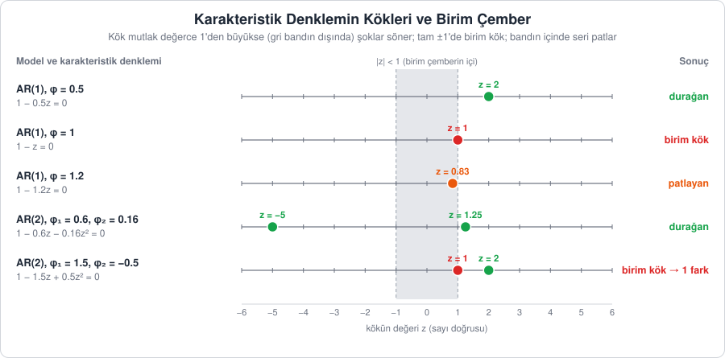

*Şekil 7.2 — Karakteristik denklemin kökleri. Gri bant, mutlak değeri 1'den küçük sayıları (birim çemberin içini) gösterir. Durağan modellerin bütün kökleri bandın dışındadır; birim köklü modellerde bir kök tam 1'dedir; patlayan AR(1)'in ($`\phi = 1.2`$) kökü ($`z = 1/1.2 \approx 0.83`$) bandın içindedir.*

Kökleri elle bulmak yalnızca bu tür basit örneklerde kolaydır; yüksek dereceli polinomlarda Bölüm 3.2'de tanıdığımız `polyroot()` fonksiyonu kullanılır. Fonksiyon polinomun katsayılarını **küçük üsten büyüğe** doğru bir vektör olarak alır:

```r
round(polyroot(c(1, -0.6, -0.16)), 4)   # 1 - 0.6z - 0.16z^2 = 0 denkleminin kökleri
#> [1]  1.25+0i -5.00+0i
Mod(polyroot(c(1, -0.6, -0.16)))        # köklerin mutlak değerleri
#> [1] 1.25 5.00
```

Bu iki satır, Örnek 1'de elle bulduğumuz kökleri (1.25 ve −5) bilgisayara buldurur ve "bütün kökler birim çemberin dışında mı?" sorusunu doğrudan cevaplar. Elle çarpanlara ayıramayacağımız yüksek dereceli polinomlarda da aynı iki satır işe yarar. Kodu satır satır okuyalım:

1. `round(polyroot(c(1, -0.6, -0.16)), 4)`: İç içe yazılmış fonksiyonlar içten dışa okunur.
   - `c(1, -0.6, -0.16)`: `c()` (*combine*, birleştir) virgülle ayrılmış sayıları tek bir **vektörde**, yani sıralı bir sayı listesinde toplar. Sıra önemlidir: Birinci eleman sabit terim (1), ikincisi $z$'nin katsayısı (−0.6), üçüncüsü $z^2$'nin katsayısıdır (−0.16); işaretler polinomdaki gibi yazılır. Sırayı ters çevirmek (`c(-0.16, -0.6, 1)`) başka bir polinomun köklerini verir.
   - `polyroot(...)`: Katsayıları verilen polinomu sıfıra eşitleyen $z$ değerlerini, yani kökleri hesaplar; 2. dereceden polinom için 2 kök döndürür. Sonuç her zaman **karmaşık sayı** (`complex`) türünde bir vektördür, çünkü bazı polinomların kökleri sıradan sayılar arasında bulunmaz (Bölüm 3.2).
   - `round(..., 4)`: İlk argümandaki sayıları, ikinci argüman kadar ondalık basamağa yuvarlar. Argümanlar burada isimsiz, yani **sıralarına göre** verilmiştir: R ilk değeri yuvarlanacak sayı, ikincisini basamak sayısı (`digits`) olarak anlar; `round(x, digits = 4)` yazmakla aynıdır. Yuvarlamanın nedeni, bilgisayarın ondalık hesaplarda bıraktığı çok küçük kırıntılardır: Yuvarlamadan R kökleri `1.25+4.493859e-15i` ve `-5.00-4.493859e-15i` olarak yazar. `e-15` "çarpı 10 üzeri −15" demektir; yani 0.0000000000000045 gibi pratikte sıfır olan bir sayıdır.
   - Satırın sonundaki `#` işaretinden sonrası **yorumdur**: R onu çalıştırmaz, yalnızca okuyana not düşer.
2. `Mod(polyroot(c(1, -0.6, -0.16)))`: Aynı kökleri yeniden hesaplar ve `Mod()` (*modulus*) ile her birinin mutlak değerini, yani sıfıra uzaklığını alır. `Mod()` karmaşık sayılarda da çalıştığı için birim çember kuralını karmaşık kökler için de bu satırla denetleyebiliriz. Sonuç sıradan sayılardan oluşan bir vektördür.

Çıktıyı okuyalım. Satır başındaki `[1]`, o satırın vektörün 1. elemanıyla başladığını gösterir; uzun bir vektör birden çok satıra bölündüğünde sonraki satırlar `[26]` gibi, o satırdaki ilk elemanın sırasıyla başlar. İlk çıktıdaki `1.25+0i` ve `-5.00+0i`, "gerçel kısmı 1.25 (ya da −5), sanal kısmı 0" olan karmaşık sayılardır; `i` sanal birimi gösterir. `+0i`, sanal kısmın sıfır, yani köklerin sıradan sayılar olduğunu söyler ve kökler elle bulduğumuz 1.25 ve −5 ile aynıdır. İkinci çıktıdaki `1.25 5.00` köklerin mutlak değerleridir; ikisi de 1'den büyük olduğu için model durağandır. Örnek 2'deki birim köklü model için `Mod(polyroot(c(1, -1.5, 0.5)))` yazsaydık `[1] 1 2` görürdük: Tam 1'e eşit bir değer birim kökün işaretidir.

**Not —** MA kısmı için de benzer bir koşul vardır: $\theta(z) = 0$ denkleminin kökleri de birim çemberin dışında olmalıdır. Bu koşula **tersinirlik** (*invertibility*) denir ve geçmiş şokların gözlenen veriden tek bir şekilde geri hesaplanabilmesini sağlar. R ve Python model kurarken bu koşulları kendileri denetler.

---

### 7.3. Mevsimsel ARIMA: SARIMA(p, d, q)(P, D, Q)[s]

**Açıklama:** `AirPassengers` gibi aylık verilerde iki tür ilişki vardır: Ardışık aylar arasındaki ilişki (Şubat, Ocak'a benzer) ve **aynı mevsimler** arasındaki ilişki (bu Temmuz, geçen Temmuz'a benzer). Normal ARIMA yalnızca ilkini modeller. **SARIMA** (Seasonal ARIMA), aynı AR/I/MA fikrini $s$ adım aralıklı gecikmelere ($x_{t-12}, x_{t-24}, \dots$) de uygulayarak ikincisini ekler.

**Tanım:** SARIMA(p,d,q)(P,D,Q)[s] modeli, gecikme operatörüyle şöyle yazılır:

$$
\Phi(B^s) \phi(B) (1 - B)^d (1 - B^s)^D x_t = \theta(B) \Theta(B^s) \varepsilon_t
$$

Burada mevsimsel polinomlar $B$ yerine $B^s$ içerir:

```math
\begin{aligned}
\Phi(B^s) &= 1 - \Phi_1 B^s - \Phi_2 B^{2s} - \dots - \Phi_P B^{Ps} \\
\Theta(B^s) &= 1 + \Theta_1 B^s + \Theta_2 B^{2s} + \dots + \Theta_Q B^{Qs}
\end{aligned}
```

> **Simge notu:** $`\Phi_i`$ *(büyük fi)*: mevsimsel AR katsayısı · $`\Theta_j`$ *(büyük teta)*: mevsimsel MA katsayısı · $`s`$: mevsim uzunluğu (aylık veride 12) · $`B^s`$ *(be üzeri s)*: $`s`$ adım geri kaydırma, örneğin $`B^{12} x_t = x_{t-12}`$ (geçen yılın aynı ayı)

Formül uzun görünse de yalnızca 7.2'deki parçaların yan yana yazılmasıdır: Sol tarafta mevsimsel ve mevsimsel olmayan AR polinomları ile iki tür fark, sağ tarafta iki MA polinomu vardır. Parametrelerin anlamı Şekil 7.3'te özetlenmiştir:

- **(p, d, q):** Mevsimsel olmayan kısım (ardışık gözlemler arası ilişki).
- **(P, D, Q):** Mevsimsel kısım. $P$ geçmiş mevsimlerin değerlerini, $D$ mevsimsel fark sayısını, $Q$ geçmiş mevsimlerin hatalarını ifade eder.
- **[s]:** Mevsim uzunluğu. Aylık veride 12, çeyreklik veride 4, saatlik veride günlük döngü için 24.


*Şekil 7.3 — SARIMA notasyonunun parçaları. Büyük harfler, küçük harflerin $`s`$ adım aralıklı (mevsimsel) karşılıklarıdır.*

**Örnek (Havayolu modeli):** Box ve Jenkins'in ünlü kitabında `AirPassengers` için önerilen, bu yüzden literatürde **"airline model"** olarak anılan ARIMA(0,1,1)(0,1,1)[12] modeli şöyle yazılır:

$$
(1 - B)(1 - B^{12}) \log x_t = (1 + \theta_1 B)(1 + \Theta_1 B^{12}) \varepsilon_t
$$

Bu denklemi 7.2'deki gibi parantezleri çarparak açalım. Tek yeni kural üslerin toplanmasıdır: $B \cdot B^{12} = B^{13}$, çünkü önce 1 adım, sonra 12 adım geri gitmek toplam 13 adım geri gitmek demektir.

*Sağ taraf (şoklar):*

```math
\begin{aligned}
(1 + \theta_1 B)(1 + \Theta_1 B^{12}) &= 1 \cdot 1 + 1 \cdot \Theta_1 B^{12} + \theta_1 B \cdot 1 + \theta_1 B \cdot \Theta_1 B^{12} \\
&= 1 + \theta_1 B + \Theta_1 B^{12} + \theta_1 \Theta_1 B^{13}
\end{aligned}
```

Bu polinomu $\varepsilon_t$'ye uygularken her $B^k$ terimi şoku $k$ ay geri kaydırır ve şu ifade çıkar: $\varepsilon_t + \theta_1 \varepsilon_{t-1} + \Theta_1 \varepsilon_{t-12} + \theta_1 \Theta_1 \varepsilon_{t-13}$. Dördüncü terim modelde ayrıca tanımlanmamıştır; iki parantezin çarpımından kendiliğinden doğar. Sezgisi şöyledir: Aylık düzeltme ($\theta_1$) geçen ayın şokunu, yıllık düzeltme ($\Theta_1$) geçen yılın aynı ayının şokunu kullanır. Geçen yılın aynı ayından **bir ay önceki** şok (13 ay önce) ise hem yıllık hem aylık düzeltmeden geçtiği için iki katsayının çarpımı kadar ağırlık alır.

*Sol taraf (seri):* Kısaca $l_t = \log x_t$ yazalım:

```math
\begin{aligned}
(1 - B)(1 - B^{12})\, l_t &= (1 - B - B^{12} + B^{13})\, l_t \\
&= l_t - l_{t-1} - l_{t-12} + l_{t-13} \\
&= (l_t - l_{t-12}) - (l_{t-1} - l_{t-13})
\end{aligned}
```

Son satır "bu ayın geçen yıla göre (log) değişimi eksi geçen ayın geçen yıla göre değişimi" demektir. Buna $w_t$ diyelim; bu, Şekil 7.1c'deki durağanlaştırılmış seridir. Model böylece şu hâli alır:

$$
w_t = \varepsilon_t + \theta_1 \varepsilon_{t-1} + \Theta_1 \varepsilon_{t-12} + \theta_1 \Theta_1 \varepsilon_{t-13}
$$

7.6.5'te R'ın bulduğu katsayılarla ($\theta_1 = -0.4018$, $\Theta_1 = -0.5569$) çapraz terimin katsayısı $(-0.4018) \cdot (-0.5569) \approx 0.224$ olur (iki negatif sayının çarpımı pozitiftir). Yani tahmin edilen model $w_t = \varepsilon_t - 0.402\, \varepsilon_{t-1} - 0.557\, \varepsilon_{t-12} + 0.224\, \varepsilon_{t-13}$'tür; iki katsayıdan dört terimli bir şok yapısı elde edilmiştir.

Bu model 7.6'daki R uygulamasında `auto.arima()` tarafından da seçilecektir.

---

### 7.4. Model Kurma Süreci: Box-Jenkins Yöntemi

George Box ve Gwilym Jenkins, 1970'te ARIMA modellerinin nasıl kurulacağını sistematik bir döngü olarak tarif ettiler. Bugün de kullanılan bu yöntem dört aşamadan oluşur (Şekil 7.4):


*Şekil 7.4 — Box-Jenkins yöntemi. Teşhis aşamasında artıklarda hâlâ yapı varsa model yeniden tanımlanır.*

**0. Hazırlık.** Seriyi çizin; trend, mevsimsellik ve varyans değişimini gözle inceleyin. Varyans seviyeyle birlikte büyüyorsa log (ya da Box-Cox) dönüşümü uygulayın (Bölüm 2.4). Durağanlığı ADF ve KPSS testleriyle sınayın (7.5).

**1. Tanımlama (identification).** Seriyi durağanlaştıracak fark sayılarını ($d$ ve $D$) belirleyin. Ardından durağan serinin ACF ve PACF grafiklerinden (Bölüm 6.6) $p$, $q$, $P$, $Q$ için aday değerler çıkarın. Kural olarak mevsimsel olmayan terimlere küçük gecikmelerde (1, 2, 3), mevsimsel terimlere $s$'nin katlarında (12, 24, …) bakılır.

**2. Tahmin (estimation).** Aday modellerin katsayılarını ($\phi$, $\theta$, $\Phi$, $\Theta$) veriden kestirin. Yazılımlar bunu **en çok olabilirlik** (*maximum likelihood*) yöntemiyle yapar. **Olabilirlik** şu sorunun cevabıdır: "Model ve katsayıları doğru olsaydı, elimizdeki veriyi tam olarak bu hâliyle gözlemleme olasılığı ne kadar olurdu?" Yazılım katsayıları bu olasılığı en büyük yapacak şekilde ayarlar; bir radyonun düğmesini sesin en net çıktığı noktaya getirmek gibi. Bu olasılıklar çok küçük sayılar olduğu için pratikte logaritmaları ($\log L$, *log likelihood*) kullanılır. **Daha büyük $\log L$, veriye daha iyi uyum** demektir.

Adaylar arasında seçim için bilgi kriterleri kullanılır. En yaygını Akaike Bilgi Kriteri'dir:

$$
\mathrm{AIC} = -2 \log L + 2k
$$

> **Simge notu:** $`L`$: modelin olabilirlik (likelihood) değeri, yani veriyi ne kadar iyi açıkladığı · $`\log L`$: olabilirliğin doğal logaritması · $`k`$: tahmin edilen parametre sayısı (katsayılar ve beyaz gürültünün varyansı $`\sigma^2`$)

İlk terim ($-2 \log L$) uyum iyileştikçe küçülür; ikinci terim ($2k$) her ek parametre için 2 puan ceza ekler. **Daha küçük AIC daha iyidir.** Ceza neden gereklidir? Modele parametre eklemek $\log L$'yi hemen her zaman biraz artırır, ama bu artış gerçek bir yapıyı değil, verideki tesadüfi gürültünün ezberlenmesini yansıtabilir. AIC, eklenen parametrenin "kendi maliyetini çıkarıp çıkarmadığını" sorar.

**Sayısal karşılaştırma.** 7.6'daki `log(AirPassengers)` serisi için iki aday modelin R'daki sonuçları şöyledir:

| Model | $`\log L`$ | $`k`$ | $`\mathrm{AIC} = -2 \log L + 2k`$ |
| --- | --- | --- | --- |
| ARIMA(0,1,1)(0,1,1)[12] | 244.70 | 3 ($`\theta_1, \Theta_1, \sigma^2`$) | $`-489.40 + 6 = -483.40`$ |
| ARIMA(1,1,1)(0,1,1)[12] | 244.95 | 4 ($`\phi_1, \theta_1, \Theta_1, \sigma^2`$) | $`-489.90 + 8 = -481.90`$ |

İkinci model fazladan bir AR katsayısı taşır ve $\log L$'yi yalnızca 0.25 artırır. Bu küçük iyileşme, eklenen parametrenin 2 puanlık cezasını karşılamaz. İkinci modelin AIC'si daha büyük olduğu için (−481.90, −483.40'tan büyüktür; negatif sayılarda sıfıra daha yakın olan büyüktür) **sade model tercih edilir**.

BIC benzer bir kriterdir ama parametre cezası daha ağırdır: $2k$ yerine $k \log n$ ($n$: gözlem sayısı). Farkı alınmış `AirPassengers` serisinde $n = 131$ olduğundan $\log 131 \approx 4.88$'dir ve her parametre 2 yerine yaklaşık 4.9 puan ceza alır; bu yüzden BIC daha sade modelleri tercih eder. AICc ise küçük örneklemler için düzeltilmiş AIC'dir; `auto.arima()` varsayılan olarak AICc'ye bakar.

**3. Teşhis (diagnostic checking).** Modelin açıklayamadığı kısma, yani **artıklara** (residuals) bakılır: $e_t = x_t - \hat{x}_t$. İyi bir modelin artıkları beyaz gürültü gibi davranmalıdır (ayrıntısı 7.6.6'da). Bunun formel testi **Ljung-Box** testidir. Fikri basittir: Artıkların 1, 2, …, $h$ gecikmedeki otokorelasyonlarını (Bölüm 6.3) hesapla, her birinin **karesini** al (böylece artı ve eksi değerler birbirini götürmez) ve hepsini tek bir sayıda topla:

$$
Q^{\ast} = n(n+2) \sum_{k=1}^{h} \frac{r_k^2}{n-k}
$$

> **Simge notu:** $`\hat{x}_t`$ *(x şapka)*: modelin $`t`$ anı için ürettiği tahmin · $`n`$: artık sayısı · $`r_k`$ *(r k)*: artıkların $`k`$ gecikmedeki örneklem otokorelasyonu · $`\sum_{k=1}^{h}`$ *(büyük sigma, toplam)*: $`k = 1`$'den $`h`$'ye kadar her terimi hesaplayıp topla · $`Q^{\ast}`$ *(Q yıldız)*: Ljung-Box test istatistiği

$n(n+2)$ ve $n - k$ çarpanları, kısa serilerde otokorelasyon ölçümündeki küçük sapmaları düzelten ağırlıklardır. Küçük bir örnek: $n = 100$ artık, $h = 2$ gecikme, $r_1 = 0.1$ ve $r_2 = -0.05$ olsun:

```math
Q^{\ast} = 100 \cdot 102 \cdot \left( \frac{0.1^2}{99} + \frac{(-0.05)^2}{98} \right) = 10200 \cdot (0.000101 + 0.0000255) \approx 1.29
```

Artıklar gerçekten beyaz gürültüyse $Q^{\ast}$'ın ortalama değeri, testin **serbestlik derecesi** (`df`) denen sayı kadardır; bu örnekte 2'dir (bir model artıklarında, tahmin edilen katsayı sayısı kadar düşülür; 7.6.6). 1.29 bu yüzden şüphe uyandırmaz. Yazılım p-değerini, $Q^{\ast}$'ı "artıklar saf gürültü olsaydı $Q^{\ast}$ hangi değerleri alırdı?" sorusunun dağılımıyla (**ki-kare dağılımı**) karşılaştırarak hesaplar.

Kısacası ilk $h$ gecikmedeki otokorelasyonlar toplu olarak sıfıra yakınsa $Q^{\ast}$ küçük çıkar. Sıfır hipotezi $H_0$: "artıklar arasında otokorelasyon yoktur" şeklindedir. Bu yüzden burada **yüksek p-değeri (> 0.05) iyi haberdir.** Bu, ADF'deki alışkanlığın tersidir: ADF'de küçük p-değeri aranır, burada ise $H_0$ "her şey yolunda" iddiası olduğu için büyük p-değeri istenir. Artıklarda yapı kalmışsa 1. adıma dönülür.

> **Simge notu:** $`H_0`$ *(H sıfır)*: sıfır hipotezi, testin "varsayılan" iddiası

**4. Öngörü (forecasting).** Teşhisten geçen model geleceği tahmin etmek için kullanılır. Nokta tahminlerinin yanında, belirsizliği gösteren **tahmin aralıkları** (%80, %95) da raporlanmalıdır. %95 tahmin aralığı, gerçek değerin %95 olasılıkla içine düşmesi beklenen alt ve üst sınırdır.

**Not —** R'daki `auto.arima()` ve Python'daki `pmdarima.auto_arima()` fonksiyonları 1. ve 2. adımları otomatikleştirir: Fark sayılarını istatistiksel testlerle belirler (7.6.3), sonra farklı (p,q)(P,Q) kombinasyonlarını deneyip en küçük AICc/AIC değerli modeli seçer. **Teşhis adımını ise yine sizin yapmanız gerekir.** Otomatik seçilen bir model de artık testlerinden kalabilir.

---

### 7.5. Durağanlık Testleri: ADF ve KPSS

Bölüm 3.2'de durağanlığı grafikle ve ACF ile nasıl sezeceğimizi, birim kökün ne olduğunu, ADF testinin hipotezlerini ve p-değerinin nasıl okunacağını gördük. Modelleme öncesinde durağanlık kararını istatistiksel testlerle desteklemek gerekir. En yaygın iki test birbirinin **tersi** hipotezler kurar. Önce ADF testinin içine bakalım: "ADF testi aslında $\phi$'nin 1'e eşit olup olmadığını sınar" cümlesi formülde nasıl karşılık bulur?

**ADF'nin çekirdeği: AR(1)'den bir çıkarma işlemi.** Bölüm 3.2'de AR(1) denkleminin ($x_t = \phi\, x_{t-1} + \varepsilon_t$) iki tarafından $x_{t-1}$ çıkarmıştık. Sağ tarafta $x_{t-1}$ iki kez geçtiği için ortak paranteze alınır: $\phi\, x_{t-1} - 1 \cdot x_{t-1} = (\phi - 1)\, x_{t-1}$. Sol taraf ise bu dönemin **değişimidir** ($\nabla x_t$, 7.1.4). Parantezdeki sayıya $\gamma$ adını verirsek ADF'nin çekirdek denklemi çıkar:

$$
\nabla x_t = \gamma\, x_{t-1} + \varepsilon_t, \qquad \gamma = \phi - 1
$$

> **Simge notu:** $`\gamma`$ *(gama)*: $`\phi - 1`$; ADF'nin sınadığı "birim kök katsayısı" · $`\iff`$ *(ancak ve ancak)*: iki ifade birbirine denktir, biri doğruysa öteki de doğrudur

Bu denklem aynı modeli başka bir soruyla yazar: "Bugünkü değişim, dünkü seviyeye bağlı mı?" $\gamma$ ile $\phi$ arasında birebir bir ilişki vardır:

| $`\phi`$ (AR katsayısı) | $`\gamma = \phi - 1`$ | Anlamı | Örnek: dün $`x_{t-1} = 100`$, bugün şok yok |
| --- | --- | --- | --- |
| 0.5 | −0.5 | Durağan: seri geri çekilir | Değişim $`-0.5 \cdot 100 = -50`$ → bugün 50 |
| 1 | 0 | Birim kök (rastgele yürüyüş) | Değişim $`0 \cdot 100 = 0`$ → bugün 100 |
| 1.2 | 0.2 | Patlayan seri | Değişim $`0.2 \cdot 100 = 20`$ → bugün 120 |

Bunlar Bölüm 3.2'deki 100 → 50, 100 → 100 ve 100 → 120 örnekleriyle aynı sayılardır; yalnızca "seviye" yerine "değişim" üzerinden okunurlar. Böylece:

- $\gamma = 0 \iff \phi = 1$: birim kök var, seri durağan değil;
- $\gamma < 0 \iff \phi < 1$: seri durağan.

ADF, "$\phi$ 1'e eşit mi?" sorusunu "**$\gamma$ sıfır mı?**" sorusuna çevirir. Bunun pratik nedeni, regresyon yazılımlarının her katsayı için "bu katsayı sıfır mı?" sorusuna hazır bir ölçü (t istatistiği) üretmesidir.

Şekil 7.5 bu fikri görselleştirir. Alt panellerde her nokta bir dönemi temsil eder: Yatay eksende dünkü seviye, dikey eksende bugünkü değişim vardır. Durağan seride ($\phi = 0.5$) nokta bulutu aşağı eğimlidir: Seviye yüksekken değişim çoğunlukla eksi, düşükken artıdır; seri hep ortalamasına geri çekilir. Rastgele yürüyüşte ($\phi = 1$) bulut yataydır: Dünkü seviye ne olursa olsun bugünkü değişim aynı şekilde dağılır; seriyi geri çeken bir kuvvet yoktur. ADF testi, bulutun içinden geçen doğrunun eğiminin ($\gamma$) sıfırdan anlamlı biçimde küçük olup olmadığını sınar.

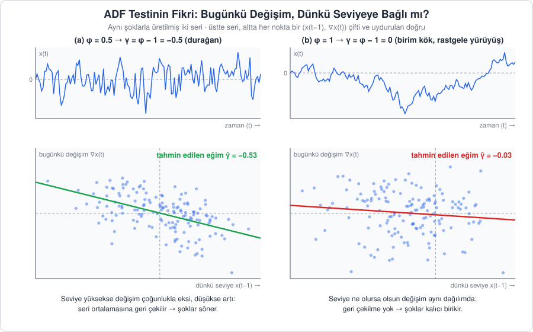

*Şekil 7.5 — ADF testinin fikri. Aynı rastgele şoklarla üretilmiş iki seri: (a) $`\phi = 0.5`$ olan durağan AR(1), (b) $`\phi = 1`$ olan rastgele yürüyüş. Alt panellerde bugünkü değişim ($`\nabla x_t`$) dünkü seviyeye ($`x_{t-1}`$) karşı çizilmiştir. Uydurulan doğrunun eğimi $`\hat{\gamma}`$, $`\phi - 1`$'in veriden tahminidir: (a)'da yaklaşık −0.5, (b)'de yaklaşık 0.*

**Tanım 1 (ADF testi — Augmented Dickey-Fuller):** Gerçek serilerde yukarıdaki çekirdek denkleme üç parça eklenir. Serinin farkı; bir sabit, bir trend, serinin bir önceki seviyesi ve gecikmeli farkları üzerine regresyonla açıklanır:

$$
\nabla x_t = \alpha + \beta t + \gamma x_{t-1} + \sum_{i=1}^{k} \delta_i \nabla x_{t-i} + \varepsilon_t
$$

> **Simge notu:** $`\alpha`$ *(alfa)*: sabit terim · $`\beta`$ *(beta)*: doğrusal trend katsayısı · $`t`$: burada zaman sayacı (1, 2, 3, …) · $`\gamma`$ *(gama)*: birim kök katsayısı, $`\phi - 1`$ · $`\delta_i`$ *(delta i)*: $`i`$ dönem önceki değişimin katsayısı · $`\sum_{i=1}^{k}`$: $`i = 1`$'den $`k`$'ya kadar toplam · $`k`$: eklenen gecikmeli fark sayısı

- **$\alpha$ (sabit):** Serinin sıfır yerine örneğin 50 etrafında dalgalanmasına izin verir. Sabit olmasaydı test, ortalaması sıfır olmayan durağan serileri yanlış değerlendirirdi.
- **$\beta t$ (doğrusal trend):** $t$ zaman sayacı, $\beta$ her dönem eklenen sabit artıştır. Bu terim sayesinde alternatif hipotez "seri düz bir trend çizgisi etrafında durağan dalgalanıyor" (**trend-durağan**, Bölüm 3.2) biçimini alır. Yani trend terimli ADF testinde $H_0$'ın reddi "trend çizgisi çıkarılınca seri durağan" demektir; "ortalaması sabit" demek değildir.
- **$\sum \delta_i \nabla x_{t-i}$ (genişletilmiş kısım):** Gerçek seriler AR(1)'den daha uzun bir hafızaya sahip olabilir; bugünkü değişim dünkü ve evvelki günkü değişimlerle de ilişkili olabilir. Bu ilişki denklemde yer almazsa hata terimine sızar, $\varepsilon_t$ artık beyaz gürültü olmaz ve testin p-değerleri yanlış çıkar. Denkleme $k$ adet geçmiş değişim eklemek bu kısa dönem hafızayı "emer" ve $\gamma$'nın temiz ölçülmesini sağlar. Örneğin $k = 2$ ise toplam sembolü $\delta_1 \nabla x_{t-1} + \delta_2 \nabla x_{t-2}$ demektir. Testin adındaki *augmented* (genişletilmiş) kelimesi bu eklemeden gelir; bu terimler olmadan test yalnızca "Dickey-Fuller testi"dir.

**Hipotezler ve tek yönlü test:**

- $H_0$: $\gamma = 0$ ($\phi = 1$), yani **birim kök vardır, seri durağan değildir.**
- $H_1$: $\gamma < 0$ ($\phi < 1$), seri durağandır (trend terimi varsa: trend etrafında durağandır).
- Küçük p-değeri (< 0.05) → $H_0$ reddedilir → seri durağan kabul edilir.

Alternatif hipotez "$\gamma$ sıfırdan farklı" değil, "$\gamma$ sıfırdan **küçük**" biçimindedir; bu yüzden test **tek yönlüdür** (*one-sided*): Yalnızca belirgin biçimde negatif bir $\hat{\gamma}$, birim köke karşı kanıt sayılır. $\gamma > 0$ ($\phi > 1$) patlayan bir seri demektir; böyle bir seri de durağan değildir, dolayısıyla "durağanlık" lehine kanıt olamaz. R çıktısındaki `alternative hypothesis: stationary` satırı bu tek yönlü alternatifi belirtir.

**Test istatistiği ve kritik değerler.** Yazılım regresyonu kurar, $\gamma$'yı veriden kestirir ($\hat{\gamma}$, "gama şapka") ve bu tahmini kendi **standart hatasına** böler:

$$
\mathrm{DF} = \frac{\hat{\gamma}}{\mathrm{s.e.}(\hat{\gamma})}
$$

Standart hata (s.e.), tahminin ne kadar belirsiz olduğunu ölçer; oran "tahmin sıfırdan kaç standart hata uzakta?" sorusunun cevabıdır. 7.6.2'deki `AirPassengers` regresyonunda $\hat{\gamma} = -0.7256$ ve standart hatası $0.0991$'dir; $-0.7256 / 0.0991 \approx -7.32$, çıktıdaki `Dickey-Fuller = -7.3186` değeridir.

Sıradan bir regresyonda bu oran t-tablosuyla karşılaştırılır; tek yönlü %5 sınırı yaklaşık −1.65'tir. ADF'de bu yapılamaz: $H_0$ doğruyken seri bir rastgele yürüyüştür ve böyle bir seride oran, alışılmış t-dağılımına uymaz; belirgin biçimde negatif değerlere kaymış bir dağılım (**Dickey-Fuller dağılımı**) izler. Bu dağılımın kritik değerleri bilgisayar simülasyonlarıyla tablolaştırılmıştır. Sabit ve trend içeren regresyonda, yaklaşık 140 gözlem için değerler şöyledir:

| Anlamlılık düzeyi | %1 | %5 | %10 |
| --- | --- | --- | --- |
| Kritik değer | −4.03 | −3.44 | −3.14 |

İstatistik kritik değerden daha negatifse $H_0$ reddedilir. −7.32, −4.03'ten de küçük olduğu için birim kök %1 düzeyinde reddedilir. Sıradan t-tablosunu kullansaydık −1.65 gibi çok daha "kolay" bir sınırla, birim köklü serileri gereğinden sık durağan sanırdık. (Trend terimi olmayan, yalnızca sabitli regresyonda %5 kritik değeri yaklaşık −2.88'dir; Python'un `adfuller()` fonksiyonu varsayılan olarak bu biçimi kullanır, 7.7.2.)

R'daki `tseries::adf.test()` p-değerini bu tablodan **doğrusal ara değerleme** (*interpolation*) ile hesaplar: İstatistik örneğin −3.44 (%5) ile −3.14 (%10) arasında kalsaydı, p-değeri 0.05 ile 0.10 arasında, uzaklıkla orantılı bir sayı olurdu. Tablo uçlarda 0.01 ve 0.99 olasılıklarında biter; istatistik %1 kritik değerinden de negatifse p-değeri 0.01'de sabitlenir. (KPSS için `kpss.test()` aynı yöntemi 0.01–0.10 aralığında kullanır; bu yüzden 7.6.3'te `p-value = 0.1` ve "greater than" uyarısı görülür.) Çıktıdaki `p-value = 0.01` ve `p-value smaller than printed p-value` uyarısı birlikte "gerçek p-değeri 0.01'den de küçük" demektir.

**Tanım 2 (KPSS testi — Kwiatkowski-Phillips-Schmidt-Shin):** KPSS bakış açısını tersine çevirir: "Seri durağandır" varsayımıyla başlar ve buna karşı kanıt arar.

- $H_0$: **Seri durağandır** (seviye etrafında ya da trend etrafında).
- $H_1$: Seri birim kök içerir.
- Küçük p-değeri (< 0.05) → $H_0$ reddedilir → seri durağan **değildir**.

Testin fikri şöyledir: Seriden ortalamasını (trend sürümünde trend çizgisini) çıkarırız ve geriye kalan sapmaları baştan itibaren **art arda toplarız** (kümülatif toplam, 7.1.4). Seri gerçekten durağansa sapmalar bir artı bir eksi gelir, birbirini götürür ve kümülatif toplam sıfır civarında kalır. Seviye bir yöne kayıyorsa sapmalar uzun süre aynı işaretli olur ve toplam sıfırdan uzaklaşır. Örneğin sapmalar $+2, -1, -2, +1$ ise kümülatif toplamlar $2, 1, -1, 0$'dır. Sapmalar $-3, -2, -1, +1, +2, +3$ ise (önce ortalamanın altında, sonra üstünde, yani kayan bir seviye) kümülatif toplamlar $-3, -5, -6, -5, -3, 0$ olur ve sıfırdan çok daha fazla uzaklaşır. KPSS istatistiği, bu kümülatif toplamların karelerinin büyüklüğünü serinin kendi oynaklığına göre ölçekleyerek tek sayıda özetler. **Büyük istatistik → $H_0$ (durağanlık) reddedilir.** Seviye durağanlığı için kritik değerler %10, %5 ve %1 düzeyinde sırasıyla 0.347, 0.463 ve 0.739'dur.

İki testin sonuçları birlikte yorumlanır. Tabloyu okurken önce her testin sonucunu sade bir cümleye çevirin: ADF'de $H_0$'ın reddi "durağan", KPSS'te $H_0$'ın reddi "durağan değil" demektir.

| ADF ($`H_0`$: birim kök) | KPSS ($`H_0`$: durağan) | İki test ne diyor? | Ne yapmalı? |
| --- | --- | --- | --- |
| p < 0.05: $`H_0`$ reddedildi → "durağan" | p ≥ 0.05: $`H_0`$ reddedilmedi → "durağan" | İkisi de **durağan** diyor | Fark almaya gerek yok (7.6.3'teki farkı alınmış seri) |
| p ≥ 0.05: $`H_0`$ reddedilmedi → "durağan değil" | p < 0.05: $`H_0`$ reddedildi → "durağan değil" | İkisi de **durağan değil** diyor | Fark alın (gerekirse önce log), testleri tekrarlayın |
| p < 0.05 → "durağan" | p < 0.05 → "durağan değil" | **Çelişki:** ADF birim kökü, KPSS de durağanlığı reddediyor | Çoğunlukla trend-durağanlık, güçlü mevsimsellik ya da ADF'ye yetersiz gecikme verilmesi (7.6.2'deki ham `AirPassengers`). Grafiğe bakın, fark alıp tekrar test edin |
| p ≥ 0.05 → "durağan değil" | p ≥ 0.05 → "durağan" | **Kararsızlık:** İki test de kendi $`H_0`$'ını reddedecek kanıt bulamadı | Genellikle seri kısadır ya da $`\phi`$ 1'e çok yakındır; testler ayırt edemiyor. Grafiğe ve ACF'ye bakın |

**Not —** "p-değeri 0.05'ten büyük" sonucu, sıfır hipotezinin **doğru olduğunu kanıtlamaz**; yalnızca reddetmek için yeterli kanıt olmadığını söyler. Bu yüzden tek bir teste değil, grafik + ACF + iki testin birlikte verdiği tabloya güvenin.

<details>
<summary><b>Kendinizi test edin (cevaplar için tıklayın)</b></summary>

1. **Bir AR(1) modelinde $`\phi = 0.8`$ ise ADF denklemindeki $`\gamma`$ kaçtır? Bu seri durağan mıdır?**
   → $`\gamma = 0.8 - 1 = -0.2`$. $`\gamma < 0`$ (yani $`\phi < 1`$) olduğu için seri durağandır. Dün 100 olan seri, şok yoksa bugün $`100 - 0.2 \cdot 100 = 80`$ olur.

2. **Sabit ve trend içeren bir ADF regresyonunda, yaklaşık 140 gözlemle `Dickey-Fuller = -2.10` bulundu. Birim kök %5 düzeyinde reddedilir mi?**
   → Hayır. −2.10, %5 kritik değeri olan −3.44'ten daha negatif değildir. (Bu, 7.6.2'de `AirPassengers` için 13 gecikmeyle bulunan sonuçtur; p ≈ 0.53.)

3. **Karakteristik denklemi $`(1 - z)(1 - 0.25z) = 0`$ olan bir AR(2) süreci için ne söylenebilir?**
   → Kökler $`z = 1`$ ve $`z = 1/0.25 = 4`$'tür. Bir birim kök vardır; seri durağan değildir. Model $`(1 - 0.25B)(1 - B)\, x_t = \varepsilon_t`$ biçiminde yazılabilir: Bir kez fark alınınca geriye $`\phi = 0.25`$ olan durağan bir AR(1) kalır, yani model ARIMA(1,1,0)'dır.

4. **Bir modelin artıkları için Ljung-Box p-değeri 0.233 çıktı. Bu iyi mi kötü mü?**
   → İyi. $`H_0`$ "artıklarda otokorelasyon yok" iddiasıdır ve reddedilmemiştir; artıklar beyaz gürültüden ayırt edilemiyor.

</details>

---

### 7.6. R Uygulaması: `AirPassengers` ile SARIMA

> **Uygulama dosyası:** [`Codes/R/ch07_sarima_airpassengers.R`](Codes/R/ch07_sarima_airpassengers.R)
>
> Bu bölümdeki R kodlarının tamamı bu dosyada. RStudio'da açıp satır satır çalıştırabilir ya da depo kök dizininde `Rscript Codes/R/ch07_sarima_airpassengers.R` komutunu kullanabilirsiniz.


Şimdi Box-Jenkins adımlarını R üzerinde `AirPassengers` veri setiyle uygulayalım. Bu veri seti belirgin bir trend, mevsimsellik ve zamanla artan varyans içerdiği için öğretici bir örnektir. Kod bloklarında `#` ile başlayan satırlar R'ın çalıştırmadığı açıklamalardır (**yorum**); `#>` ile başlayan satırlar ise kodu çalıştırdığınızda ekranda göreceğiniz çıktıları gösterir.

#### 7.6.1. Veriyi Görselleştirme

Bir zaman serisi analizine başlarken ilk adım veriyi çizmektir. Grafik bize trend olup olmadığını, düzenli tekrar eden dalgalanmalar (mevsimsellik) bulunup bulunmadığını ve verinin değişkenliğinin zamanla değişip değişmediğini gösterir.

```r
# Gerekli paketler
# install.packages(c("forecast", "tseries"))
library(forecast)
library(tseries)

# Veriyi yükle ve çiz
data(AirPassengers)
plot(AirPassengers, main = "AirPassengers Verisi: Trend ve Artan Varyans",
     ylab = "Yolcu Sayısı", xlab = "Yıl", col = "darkblue")
```

Bu blok, bölüm boyunca kullanacağımız iki paketi yükler, `AirPassengers` verisini çağırır ve seriyi çizer; Box-Jenkins döngüsünün 0. adımı (hazırlık, 7.4) budur. Kodu satır satır okuyalım:

1. `# Gerekli paketler` ve `# install.packages(c("forecast", "tseries"))`: İkisi de `#` ile başladığı için yorumdur ve çalıştırılmaz. İkinci satır bilerek yoruma çevrilmiştir: `install.packages()` bir paketi internetten indirip bilgisayara **bir kez** kurar; her çalıştırmada tekrarlamak gereksizdir. Paketler kurulu değilse satır başındaki `#` silinip satır bir kez çalıştırılır. Paket adları tırnak içinde yazılır, çünkü bunlar R'daki nesnelerin adları değil, indirilecek paketlerin adı olan metinlerdir; `c()` iki adı tek bir vektörde toplar, böylece iki paket tek komutla kurulur.
2. `library(forecast)`: Kurulu `forecast` paketini bu oturuma yükler. Bölümde kullanacağımız `auto.arima()`, `forecast()`, `checkresiduals()`, `ndiffs()` ve `nsdiffs()` bu paketten gelir. Kurulum bir kez yapılır, ama `library()` her yeni R oturumunda yeniden çalıştırılmalıdır.
3. `library(tseries)`: `adf.test()` ve `kpss.test()` durağanlık testlerini sağlayan `tseries` paketini yükler.
4. `data(AirPassengers)`: R ile birlikte gelen `AirPassengers` veri setini çalışma alanına çağırır. Bu, Ocak 1949'dan Aralık 1960'a kadar 144 aylık uluslararası havayolu yolcu sayısını (bin kişi) tutan, frekansı 12 olan hazır bir `ts` nesnesidir (Bölüm 5.2.3); ayrıca dönüştürmeye gerek yoktur.
5. `plot(AirPassengers, main = ..., ylab = ..., xlab = ..., col = "darkblue")`: `plot()` R'ın genel çizim fonksiyonudur; kendisine bir `ts` nesnesi verildiğinde yatay ekseni zaman olan bir çizgi grafiği çizer (Bölüm 6.1.1). Fonksiyona parantez içinde verilen girdilere **argüman** denir. İlk argüman (çizilecek seri) isimsiz, yani sırasıyla verilmiştir; diğerleri `isim = değer` biçiminde **isimli** argümanlardır ve sıraları önemli değildir: `main` grafik başlığını, `ylab` dikey eksenin, `xlab` yatay eksenin adını, `col` çizgi rengini belirler. Tırnak içindeki değerler metindir; `"darkblue"` R'ın tanıdığı renk adlarından biridir (koyu mavi). Komut ilk satırın sonundaki virgülden sonra ikinci satırda sürer: Parantez kapanmadığı sürece R komutun devam ettiğini anlar.

Bu blok ekrana sayı yazmaz; çıktısı bir grafiktir (Şekil 7.1a). Grafikte üç şey hemen göze çarpar:

- Yolcu sayısı yıllar içinde sürekli artıyor: **trend** var.
- Her yıl yaz aylarında tepe yapan bir desen tekrarlanıyor: **mevsimsellik** var.
- Dalgaların boyu zamanla büyüyor: **varyans artıyor** (çarpımsal yapı, Bölüm 2.4).

Bu üç özellik de serinin ortalamasının ve varyansının zamanla değiştiğini, yani durağan olmadığını gösterir.

#### 7.6.2. Durağanlık Testleri

Grafikten edindiğimiz "seri durağan değil" izlenimini şimdi 7.5'teki iki testle sınayalım.

```r
adf.test(AirPassengers)
#>  Augmented Dickey-Fuller Test
#> data:  AirPassengers
#> Dickey-Fuller = -7.3186, Lag order = 5, p-value = 0.01
#> alternative hypothesis: stationary
#> Warning: p-value smaller than printed p-value

adf.test(AirPassengers, k = 13)   # 12 aylık hafızayı kapsayan gecikme sayısıyla
#> Dickey-Fuller = -2.1008, Lag order = 13, p-value = 0.5345

kpss.test(AirPassengers)
#>  KPSS Test for Level Stationarity
#> data:  AirPassengers
#> KPSS Level = 2.7395, Truncation lag parameter = 4, p-value = 0.01
#> Warning: p-value smaller than printed p-value
```

Bu blok aynı seriye iki ADF testi ve bir KPSS testi uygular. Amaç hem durağanlık kararını sayılarla desteklemek hem de bir testin ayarlarının sonucu nasıl değiştirebildiğini görmektir. Kodu satır satır okuyalım:

1. `adf.test(AirPassengers)`: `tseries` paketindeki ADF testini çalıştırır. Yalnızca seriyi vermek yeterlidir; yazmadığımız argümanlar **varsayılan** değerlerini, yani fonksiyonun kendiliğinden kullandığı değerleri alır. Bu fonksiyon 7.5'teki regresyonu her zaman **sabit ve trend terimiyle** kurar. Varsayılan `alternative = "stationary"`, 7.5'teki tek yönlü alternatif hipotezi ("seri durağandır") seçer. Gecikmeli fark sayısı `k` ise $(n - 1)$'in küp kökünün tam sayı kısmı olarak belirlenir. Sonuç bir test sonucu nesnesidir (`htest`); bir isme atanmadığı için doğrudan ekrana yazılır.
2. `adf.test(AirPassengers, k = 13)`: Aynı test, bu kez `k` argümanı elle verilerek çalıştırılır. `k = 13`, regresyona 13 gecikmeli fark ($`\nabla x_{t-1}, \dots, \nabla x_{t-13}`$) ekler. 13'ün seçilme nedeni, 12 aylık mevsim uzunluğunu bir adım aşmasıdır: Böylece bu ayki değişimin bir yıl ve 13 ay önceki değişimlerle ilişkisi de denklemin içinde kalır ve hata terimine sızmaz. Satır sonundaki `#` sonrası bu nedeni not eden yorumdur. Bu testin çıktısı kısaltılmıştır; yalnızca değişen satır gösterilmiştir.
3. `kpss.test(AirPassengers)`: KPSS testini çalıştırır. Varsayılan `null = "Level"` sıfır hipotezini "seri sabit bir seviye etrafında durağandır" olarak kurar (`null = "Trend"` yazılsaydı "trend çizgisi etrafında durağandır" sınanırdı).

Çıktıyı satır satır okuyalım:

- `Augmented Dickey-Fuller Test` ve `KPSS Test for Level Stationarity`: Hangi testin yapıldığını söyleyen başlıklardır. `data:  AirPassengers` testin hangi seriye uygulandığını gösterir.
- `Dickey-Fuller = -7.3186`: 7.5'teki $\hat{\gamma} / \mathrm{s.e.}(\hat{\gamma})$ oranıdır ve kritik değerlerle (%1 için −4.03) karşılaştırılır.
- `Lag order = 5`: Denkleme eklenen gecikmeli fark sayısı $k$. $n = 144$ için $(144 - 1)$'in küp kökü yaklaşık 5.23'tür ($5.23^3 \approx 143$); tam sayı kısmı 5'tir.
- `p-value = 0.01` ve `Warning: p-value smaller than printed p-value`: `Warning` satırı R'ın **uyarı** mesajıdır; hata değildir, kod çalışmış ve sonuç üretmiştir. Burada "gerçek p-değeri, yazılan 0.01'den de küçüktür" demektir (7.5).
- `alternative hypothesis: stationary`: Alternatif hipotezin durağanlık olduğunu hatırlatır (7.5'teki tek yönlü test).
- İkinci testteki `Dickey-Fuller = -2.1008, Lag order = 13, p-value = 0.5345` satırı aynı biçimde okunur; `Lag order` artık elle verdiğimiz 13'tür. p-değeri 0.01 ile 0.99 arasında kaldığı için uyarı yoktur. Sonucun anlamını aşağıda tartışıyoruz.
- `KPSS Level = 2.7395`: KPSS istatistiği. %1 kritik değeri 0.739 olduğundan p-değeri tablonun dışına, 0.01'in altına düşer; bu yüzden KPSS de `p-value = 0.01` yazıp aynı uyarıyı verir.
- `Truncation lag parameter = 4`: KPSS'in serinin oynaklığını hesaplarken hesaba kattığı otokorelasyon gecikmesi sayısı ($4 \cdot (n/100)^{1/4}$'ün tam sayı kısmı; $n = 144$ için 4).

**Çıktının yorumu:** İlk bakışta şaşırtıcı bir sonuç: ADF testi p = 0.01 ile birim kök hipotezini **reddediyor**, KPSS testi ise p = 0.01 ile durağanlık hipotezini **reddediyor**. Yani iki test çelişiyor (7.5'teki tablonun üçüncü satırı).

Bunun nedeni `tseries::adf.test()` fonksiyonunun iki varsayılan ayarının birleşimidir. Birincisi, regresyona bir **doğrusal trend terimi** ($\beta t$) ekler; test "seri düz bir trend çizgisi etrafında durağan mı?" sorusunu sorar. İkincisi, yalnızca $k = 5$ gecikmeli fark kullanır. Oysa `AirPassengers`'ın aylık değişimleri 12 ay önceki değişimlerle güçlü biçimde ilişkilidir (yıllık desen). Beş gecikme bu hafızayı emmeye yetmez ve geride kalan mevsimsel yapı testi yanıltır. İkinci satırda aynı test `k = 13` ile, yani bir yılı aşan gecikmeyle tekrarlandığında istatistik −2.10'a, p-değeri 0.53'e çıkar ve birim kök artık reddedilmez. Ortalama sabit değildir ve mevsimsel desen ile artan varyans da hâlâ oradadır. Seviye durağanlığını sınayan KPSS ve grafik bu yüzden daha güvenilir bir tablo çiziyor: **seri durağan değildir.** Bu örnek, tek bir teste ve onun varsayılan ayarlarına körü körüne güvenmemek gerektiğini çok iyi gösterir.

#### 7.6.3. Seriyi Durağanlaştırma

Durağanlığı sağlamak için iki işlem yapılır:

1. **Log dönüşümü:** Artan varyansı dengeler (çarpımsal yapıyı toplamsala çevirir).
2. **Fark alma:** Mevsimsel fark (lag = 12) yıllık deseni, normal fark trendi siler.

```r
# Önce log dönüşümü, sonra mevsimsel (lag = 12) ve normal (lag = 1) fark
AP_stationary <- diff(diff(log(AirPassengers), lag = 12))

plot(AP_stationary, main = "Dönüştürülmüş AirPassengers Serisi",
     ylab = "Fark Değerleri", col = "darkblue")
abline(h = 0, lty = 2)

# Testleri tekrarlayalım
adf.test(AP_stationary)
#> Dickey-Fuller = -5.1993, Lag order = 5, p-value = 0.01
#> alternative hypothesis: stationary
#> Warning: p-value smaller than printed p-value

kpss.test(AP_stationary)
#> KPSS Level = 0.084365, Truncation lag parameter = 4, p-value = 0.1
#> Warning: p-value greater than printed p-value
```

Bu blok, 7.1.4'te anlatılan log dönüşümünü ve iki fark alma işlemini tek satırda uygular, sonucu çizer ve 7.6.2'deki testleri dönüştürülmüş seri üzerinde tekrarlar. Amaç, modele verilecek serinin artık durağan olduğunu göstermektir. Kodu satır satır okuyalım:

1. `AP_stationary <- diff(diff(log(AirPassengers), lag = 12))`: `<-` R'da **atama** işaretidir: Sağdaki hesabın sonucunu soldaki isimle (`AP_stationary`) saklar; ekrana bir şey yazmaz. Sağ taraf iç içe üç fonksiyondan oluşur ve içten dışa okunur:
   - `log(AirPassengers)`: Her ayın değerinin doğal logaritmasını alır; sonuç yine 144 aylık bir `ts` nesnesidir.
   - `diff(..., lag = 12)`: `diff()` bir seriden farklar üretir; `lag` argümanı kaç adım önceki değerin çıkarılacağını söyler. `lag = 12`, her aydan 12 ay önceki değeri çıkarır (mevsimsel fark, $`\nabla_{12}`$), çünkü veri aylık ve mevsim 12 aydır.
   - En dıştaki `diff(...)`: `lag` yazılmadığı için varsayılan `lag = 1` ile her değerden bir önceki ayınkini çıkarır (normal fark, $`\nabla`$).

   Mevsimsel fark ilk 12 ayı, normal fark bir ayı daha kaybettirir; 144 aylık seri Şubat 1950'den başlayan 131 aylık bir `ts` nesnesine iner. Sonuç, 7.3'teki $`w_t`$ serisidir.
2. `plot(AP_stationary, main = ..., ylab = ..., col = "darkblue")`: Dönüştürülmüş seriyi çizer; argümanlar 7.6.1'deki `plot()` çağrısıyla aynı anlamdadır.
3. `abline(h = 0, lty = 2)`: Açık olan grafiğin üstüne düz bir çizgi ekler. `h = 0` çizginin 0 yüksekliğinde yatay (*horizontal*) olacağını, `lty = 2` (*line type*, çizgi tipi) kesikli çizileceğini söyler (1 düz, 2 kesikli, 3 noktalı çizgidir). `abline()` yeni grafik açmaz, son çizilen grafiğe ekleme yapar; bu yüzden `plot()`'tan sonra gelir. Durağan serinin bu sıfır çizgisinin çevresinde dalgalanması beklenir.
4. `adf.test(AP_stationary)` ve `kpss.test(AP_stationary)`: 7.6.2'deki iki testi varsayılan ayarlarıyla bu kez dönüştürülmüş seriye uygular. `# Testleri tekrarlayalım` satırı yorumdur.

Serinin ilk değerini (Şubat 1950) elle hesaplayalım: Ocak ve Şubat 1949'da 112 ve 118, Ocak ve Şubat 1950'de 115 ve 126 bin yolcu vardır.

$$
w = [\log(126) - \log(118)] - [\log(115) - \log(112)] = 0.0656 - 0.0264 = 0.0392
$$

Yani Şubat'ın yıllık büyümesi (yaklaşık %6.6), Ocak'ın yıllık büyümesinden (yaklaşık %2.6) yaklaşık 4 puan fazladır. R'da `AP_stationary[1]` yazarsanız aynı 0.0392'yi görürsünüz.

Çıktıyı okuyalım:

- `Dickey-Fuller = -5.1993, Lag order = 5, p-value = 0.01`: İstatistik −5.20, %1 kritik değeri olan yaklaşık −4.03'ten daha negatiftir; birim kök reddedilir. Gecikme sayısı yine 5'tir, çünkü $(131 - 1)$'in küp kökü yaklaşık 5.07'dir. Uyarı satırı 7.6.2'dekiyle aynı anlamdadır: Gerçek p-değeri 0.01'den de küçüktür.
- `KPSS Level = 0.084365, Truncation lag parameter = 4, p-value = 0.1` ve `Warning: p-value greater than printed p-value`: İstatistik %10 kritik değeri olan 0.347'nin altındadır, yani tablonun en "zararsız" ucunun da ötesindedir. R p-değerini tablonun üst sınırı olan 0.1'de keser ve gerçek değerin bundan **büyük** olduğunu uyarır. Durağanlık reddedilmez.

Artık iki test aynı şeyi söylüyor: ADF birim kökü reddediyor, KPSS durağanlığı reddetmiyor (7.5'teki tablonun ilk satırı). Seri durağandır ve grafikte, Şekil 7.1c'deki gibi sıfır çevresinde dalgalanır.

`forecast` paketi gereken fark sayılarını doğrudan da önerebilir:

```r
nsdiffs(log(AirPassengers))                  # gereken mevsimsel fark sayısı (D)
#> [1] 1
ndiffs(diff(log(AirPassengers), lag = 12))   # mevsimsel farktan sonra gereken normal fark sayısı (d)
#> [1] 1
```

Bu iki satır, fark sayılarına testlere tek tek bakarak karar vermek yerine `forecast` paketinin hazır karar fonksiyonlarına sorar; 7.6.5'teki `auto.arima()` da fark sayılarını içeride bu iki fonksiyonla belirler. Kodu satır satır okuyalım:

1. `nsdiffs(log(AirPassengers))`: Log seriye kaç kez **mevsimsel** fark ($D$) alınması gerektiğini önerir. Varsayılan `test = "seas"` yönteminde seri trend, mevsim ve kalan bileşenlerine ayrılır (Bölüm 6.2.3'teki `decompose()` fikrine benzer) ve mevsimsel desenin gücü 0 ile 1 arasında bir sayıyla ölçülür: 0 "mevsimsellik yok", 1 "kalan dalgalanmanın neredeyse tamamı mevsimsel" demektir. Güç 0.64 eşiğini aşarsa bir mevsimsel fark önerilir; `log(AirPassengers)` için güç yaklaşık 0.96'dır. Mevsim uzunluğunu (`m`) serinin frekansından (12) kendisi okur ve varsayılan `max.D = 1` nedeniyle en fazla 1 önerir. Satır sonundaki `#` sonrası yorumdur.
2. `ndiffs(diff(log(AirPassengers), lag = 12))`: Mevsimsel farkı alınmış seriye kaç kez daha **normal** fark ($d$) gerektiğini önerir. İçteki `diff(log(AirPassengers), lag = 12)`, 7.6.3'teki mevsimsel farktır. `ndiffs()` varsayılan olarak KPSS testini (`test = "kpss"`, `alpha = 0.05`) tekrar tekrar uygular: Test durağanlığı reddederse bir fark alır ve yeniden dener; durağanlık reddedilmeyene kadar aldığı fark sayısını döndürür (en fazla `max.d = 2`). Sıra önemlidir: Önce mevsimsel fark kararı verilir, `ndiffs()` mevsimsel farkı alınmış seriye uygulanır.

İki çıktı da `[1] 1`'dir. `[1]`, satırın sonucun 1. elemanıyla başladığını gösterir (burada sonuç tek elemanlıdır); 1 ise önerilen fark sayısıdır. Böylece $D = 1$ ve $d = 1$ kararını hem testlerle hem de bu fonksiyonlarla doğrulamış olduk.

#### 7.6.4. Model Belirleme (ACF ve PACF)

Durağan serinin ACF ve PACF grafiklerini inceleyerek AR ve MA terimleri için ipuçları ararız (Bölüm 6.6).

```r
par(mfrow = c(1, 2))  # grafikleri yan yana göster
acf(AP_stationary, lag.max = 36, main = "ACF")
pacf(AP_stationary, lag.max = 36, main = "PACF")
par(mfrow = c(1, 1))
```

Bu blok, durağanlaştırılmış serinin ACF ve PACF grafiklerini yan yana çizer. Box-Jenkins'in 1. adımında (tanımlama, 7.4) $p$, $q$, $P$, $Q$ için aday değerleri bu grafiklerden okuruz. Kodu satır satır okuyalım:

1. `par(mfrow = c(1, 2))`: `par()` (*parameters*) R'ın temel grafik ayarlarını değiştirir. `mfrow` argümanı grafik penceresini satır ve sütun bölmelerine ayırır; `c(1, 2)` ile kurulan iki elemanlı vektör "1 satır, 2 sütun" demektir. Bundan sonra çizilen grafikler bölmeleri soldan sağa doldurur. Satır sonundaki `#` sonrası yorumdur.
2. `acf(AP_stationary, lag.max = 36, main = "ACF")`: `acf()` serinin otokorelasyonlarını hesaplar ve çubuk grafik olarak çizer (Bölüm 6.3). `lag.max` kaç gecikmeye kadar bakılacağını belirler: 36 ay üç yıl demektir; böylece 12, 24 ve 36'daki mevsimsel gecikmeler de görünür. Yazılmasaydı varsayılan değer $10 \log_{10} 131 \approx 21$ gecikme olurdu ve 24 ile 36 grafiğe girmezdi. `main` grafik başlığıdır.
3. `pacf(AP_stationary, lag.max = 36, main = "PACF")`: Aynı ayarlarla kısmi otokorelasyonları çizer (Bölüm 6.4) ve ikinci bölmeye yerleşir.
4. `par(mfrow = c(1, 1))`: Pencereyi yeniden tek grafik düzenine döndürür; bu satır olmasaydı sonraki grafikler de yarım genişlikte çizilirdi.

Bu blok ekrana sayı yazmaz; çıktısı yan yana iki grafiktir. Okurken iki ayrıntıya dikkat edin. Birincisi, R `ts` nesnelerinde yatay ekseni "yıl" cinsinden gösterir; 1.0 = 12 ay, 2.0 = 24 ay gecikme demektir. ACF'nin en soldaki 0 gecikmeli çubuğu serinin kendisiyle korelasyonudur, her zaman 1'dir ve yorumlanmaz; PACF ise 1. gecikmeden başlar. İkincisi, mavi kesikli çizgiler güven bandıdır: $\pm 1.96/\sqrt{131} \approx \pm 0.17$. Bu grafiklerde iki belirgin iz görülür:

- **ACF'de gecikme 1'de** belirgin bir negatif çubuk (yaklaşık −0.34) vardır; 3. gecikmede bandı biraz aşan bir çubuk (yaklaşık −0.20) dışında sonrası kesilir → mevsimsel olmayan kısımda **MA(1)**, yani $q = 1$ adayı.
- **ACF'de gecikme 12'de** (eksende 1.0) belirgin bir negatif çubuk (yaklaşık −0.39) vardır ve 24'te tekrarlamaz → mevsimsel kısımda **MA(1)**, yani $Q = 1$ adayı.
- PACF'de de 1 ve 12'de anlamlı negatif çubuklar (yaklaşık −0.34) vardır, ancak PACF ACF kadar keskin kesilmez: 3. ve 13. gecikmelerde de küçük negatif çubuklar sürer. "ACF kesiliyor, PACF kesilmiyor" deseni MA yapısıyla tutarlıdır (Bölüm 6.6.2 ve 6.6.5).

Bu okuma bizi ARIMA(0,1,1)(0,1,1)[12] adayına götürür. ACF/PACF okumak deneyim ister; bu yüzden elle bulduğumuz adayı otomatik aramayla karşılaştıracağız.

#### 7.6.5. Model Kurma: `auto.arima()` ve Seçilen Modelin Yorumu

Elle bulduğumuz adayı şimdi otomatik bir aramayla karşılaştıralım.

```r
fit <- auto.arima(log(AirPassengers), seasonal = TRUE)
print(fit)
#> Series: log(AirPassengers)
#> ARIMA(0,1,1)(0,1,1)[12]
#>
#> Coefficients:
#>           ma1     sma1
#>       -0.4018  -0.5569
#> s.e.   0.0896   0.0731
#>
#> sigma^2 = 0.001371:  log likelihood = 244.7
#> AIC=-483.4   AICc=-483.21   BIC=-474.77
```

Bu blok, Box-Jenkins'in 1. ve 2. adımlarını (tanımlama ve tahmin) otomatik olarak yapar: Fark sayılarını belirler, aday modelleri dener, en iyisinin katsayılarını kestirir ve sonucu ekrana yazar. Kodu satır satır okuyalım:

1. `fit <- auto.arima(log(AirPassengers), seasonal = TRUE)`:
   - İlk argüman modele verilecek seridir. Log dönüşümünü kendimiz yapıp modele log seriyi veriyoruz; fark alma işlemlerini ise `auto.arima()` kendisi yapar. Bu yüzden `AP_stationary`'yi değil, farkı alınmamış log seriyi veririz.
   - Fonksiyon önce fark sayılarını 7.6.3'teki `nsdiffs()` ve `ndiffs()` ile belirler ($D = 1$, $d = 1$). Ardından farklı (p, q)(P, Q) kombinasyonlarını dener ve varsayılan `ic = "aicc"` ayarı gereği en küçük AICc değerine sahip modeli seçer (7.4).
   - `seasonal = TRUE` mevsimsel terimlerin de aranmasını sağlar (varsayılan zaten budur; açıkça yazmak kodu okunur kılar). `TRUE` ve `FALSE`, R'ın "doğru/evet" ve "yanlış/hayır" anlamına gelen **mantıksal** değerleridir; tırnaksız ve büyük harfle yazılır.
   - Kodda yazılmayan iki varsayılan argüman da önemlidir: `stepwise = TRUE`, bütün kombinasyonları denemek yerine iyi bir başlangıç modelinden komşu modellere adım adım ilerler; hızlıdır ama nadiren en iyi modeli kaçırabilir. `approximation` ise uzun serilerde (150'den fazla gözlem ya da 12'den büyük frekans) arama sırasında olabilirliği yaklaşık hesaplayarak zaman kazandırır; 144 gözlemli `AirPassengers` için zaten kapalıdır. Tam arama yapan `auto.arima(log(AirPassengers), stepwise = FALSE, approximation = FALSE)` de aynı modeli seçer.
   - Sonuç, `fit` adıyla saklanan bir **model nesnesidir**: İçinde seçilen dereceler, katsayılar, standart hatalar, artıklar ve bilgi kriterleri birlikte durur. Sonraki adımlarda (`checkresiduals()`, `forecast()`) hep bu nesneyi kullanacağız.
2. `print(fit)`: Model nesnesinin özetini ekrana yazar. Etkileşimli çalışırken yalnızca `fit` yazmak da aynı özeti verir; `print()` bunu açıkça ister.

Çıktıyı satır satır okuyalım:

- `Series: log(AirPassengers)`: Modelin hangi seriye kurulduğunu gösterir. Fonksiyona verdiğimiz ifade aynen yazılır; modelin log ölçekte olduğunu buradan da hatırlarız.
- `ARIMA(0,1,1)(0,1,1)[12]`: Seçilen model. İlk parantez (p, d, q) = (0, 1, 1) mevsimsel olmayan kısmı, ikinci parantez (P, D, Q) = (0, 1, 1) mevsimsel kısmı, köşeli parantezdeki 12 mevsim uzunluğunu verir (Şekil 7.3). `auto.arima()`, ACF/PACF'den elle çıkardığımız adayla aynı modeli, yani 7.3'teki **havayolu modelini** seçmiştir. İki parçanın ayrıntılı anlamı aşağıdadır.
- `Coefficients:` başlığının altındaki küçük tablo tahmin edilen katsayılardır. Sütun adları katsayının hangi terime ait olduğunu söyler: `ma1` mevsimsel olmayan MA kısmının 1. katsayısı $\theta_1$, `sma1` mevsimsel (*seasonal*) MA kısmının 1. katsayısı $\Theta_1$'dir. Model AR terimi içermediği için `ar1` ya da `sar1` sütunu yoktur. İlk satır tahminlerdir: $\theta_1 = -0.4018$, $\Theta_1 = -0.5569$. R, MA kısmını artı işaretiyle ($1 + \theta_1 B$) yazdığı için (7.2'deki not) bu sayılar 7.3'teki denkleme doğrudan konur.
- `s.e.` satırı her katsayının **standart hatasıdır** (7.5): Tahminin ne kadar belirsiz olduğunu gösterir. Standart hatalar katsayıların çok altındadır: Katsayı/standart hata oranları $-0.4018 / 0.0896 \approx -4.5$ ve $-0.5569 / 0.0731 \approx -7.6$'dır. Kabaca "|katsayı| > 2 × s.e." kuralıyla iki katsayı da istatistiksel olarak anlamlıdır, yani sıfırdan belirgin biçimde farklıdır.
- `sigma^2 = 0.001371`: Beyaz gürültünün ($\varepsilon_t$) tahmini varyansı $\sigma^2$'dir; `^` R'da üs işaretidir. Log ölçekte standart sapması $\sqrt{0.001371} \approx 0.037$ olduğundan (log farkı yaklaşık yüzde değişim olduğu için, 7.1.4) tek adımlık tipik hata yaklaşık **%3.7** mertebesindedir.
- `log likelihood = 244.7`: Modelin log olabilirliği $\log L$'dir (7.4); büyük olması veriye daha iyi uyum demektir.
- `AIC=-483.4   AICc=-483.21   BIC=-474.77`: Üç bilgi kriteri. AIC ile log likelihood arasındaki bağ 7.4'teki formüldür: $-2 \cdot 244.7 + 2 \cdot 3 = -483.4$ ($k = 3$: ma1, sma1 ve sigma^2). AICc, AIC'ye küçük örneklem düzeltmesi olarak $2k(k+1)/(n-k-1)$ ekler; burada $n = 131$'dir, çünkü iki fark işleminden sonra modelin kullanabildiği gözlem sayısı budur: $2 \cdot 3 \cdot 4 / (131 - 3 - 1) = 24/127 \approx 0.19$ ve $-483.40 + 0.19 = -483.21$. BIC cezada $2k$ yerine $k \log n$ kullanır: $-489.40 + 3 \cdot 4.875 \approx -474.77$. Üçü de "küçük olan daha iyi" kuralıyla okunur ve tek başına anlam taşımaz; **aynı veri üzerindeki** farklı modelleri karşılaştırmak için kullanılır (7.4'teki tablo).

> **Simge notu:** $`\approx`$ *(yaklaşık eşittir)*: iki değerin yaklaşık olarak eşit olduğunu belirtir · $`\sqrt{\cdot}`$ *(karekök)*: varyanstan standart sapmaya geçiş

Seçilen modelin iki parçasını ayrı ayrı inceleyelim.

**Mevsimsel olmayan kısım: `(0,1,1)`.** Bu üç sayı serinin aydan aya davranışını açıklar.

- **`d = 1` (fark derecesi):** Model trendi ortadan kaldırmak için bir kez fark alır. Yolcu sayısının kendisini değil, bir aydan diğerine olan değişimi modeller.
- **`q = 1` (MA derecesi):** Model bir önceki ayın tahmin hatasını (öngörülemeyen şoku) kullanarak mevcut tahmini düzeltir.
- **`p = 0` (AR derecesi):** Trend ve geçmiş hata hesaba katıldıktan sonra, farkı alınmış serinin kendi geçmiş değerlerine ayrıca bağlı olmadığı anlamına gelir.

**Mevsimsel kısım: `(0,1,1)[12]`.** Bu kısım yıllık deseni açıklar; `[12]` mevsim uzunluğunun 12 ay olduğunu gösterir.

- **`D = 1` (mevsimsel fark):** Bu Ocak ayını geçen ayla değil, **geçen yılın Ocak ayıyla** karşılaştırır. Her yıl tekrarlanan yaz yoğunluğu gibi desenler böylece temizlenir.
- **`Q = 1` (mevsimsel MA):** Model, geçen yılın aynı ayındaki tahmin hatasını kullanır. Örneğin geçen Temmuz'u eksik tahmin ettiyse, bu bilgiyi bu Temmuz'un tahminini düzeltmek için kullanır.
- **`P = 0` (mevsimsel AR):** Mevsimsel fark ve mevsimsel hata hesaba katıldıktan sonra, önceki yılların aynı ayındaki değerlere ayrıca bağlılık yoktur.

Özetle model, hem trendi hem de yıllık deseni fark alarak durağanlaştırır; ardından hem bir ay önceki hem de geçen yılın aynı ayındaki hatalardan ders çıkararak tahmin yapar. Şimdi bu modelin gerçekten işe yarayıp yaramadığını kontrol etmeliyiz.

#### 7.6.6. Teşhis: Artıkların İncelenmesi

Kurduğumuz modeli, verideki hikâyeyi açıklamaya çalışan bir dedektif gibi düşünün. Modelin açıklayamadığı, geride bıraktığı kırıntılara **artıklar** diyoruz. Artıklarda bir desen varsa (örneğin her yaz hatalar büyüyorsa) dedektif önemli bir ipucunu kaçırmış demektir. Amacımız artıkların, boş bir radyo kanalındaki cızırtı gibi, tamamen rastgele ve öngörülemez olmasıdır. Bu ideal duruma **beyaz gürültü** diyoruz.

İyi bir modelin artıklarının üç özelliği olmalıdır:

1. **Ortalaması sıfır olmalı:** Model sistematik olarak ne yukarı ne aşağı yönde hata yapmalı.
2. **Varyansı sabit olmalı:** Hataların büyüklüğü zamanla değişmemeli. Hatalar büyüyorsa tahmin aralıkları güvenilmez olur.
3. **Otokorelasyon içermemeli:** En önemlisi budur. Bir dönemin hatası bir sonrakini tahmin etmeye yardım ediyorsa, model kullanılabilecek bir bilgiyi kaçırmıştır.

Ek olarak artıkların **normal dağılıma yakın** olması, tahmin aralıklarının doğru hesaplanması için istenir.

```r
checkresiduals(fit)
#>  Ljung-Box test
#> data:  Residuals from ARIMA(0,1,1)(0,1,1)[12]
#> Q* = 26.446, df = 22, p-value = 0.233
#>
#> Model df: 2.   Total lags used: 24
```

Bu tek satır, Box-Jenkins'in 3. adımını (teşhis) yapar: Modelin artıklarının yukarıdaki özellikleri taşıyıp taşımadığını hem grafiklerle hem de 7.4'teki Ljung-Box testiyle denetler. Kodu okuyalım:

1. `checkresiduals(fit)`: `forecast` paketindeki bu fonksiyon, 7.6.5'te kurduğumuz `fit` model nesnesinin içinden artıkları alır ($e_t = x_t - \hat{x}_t$; model log seriye kurulduğu için artıklar da log ölçektedir). Ardından iki iş yapar: Üç grafiği tek pencerede çizer (artıkların zaman grafiği, ACF'si ve histogramı) ve Ljung-Box testini uygulayıp sonucunu ekrana yazar. Testte kaç gecikmeye bakılacağını belirleyen `lag` argümanını vermediğimiz için onu kendisi seçer: Mevsimsel veride $2s$ ile $n/5$'ten küçük olanı alır; burada $\min(24,\ 144/5 = 28.8) = 24$'tür. Yalnızca testi görmek isterseniz `checkresiduals(fit, plot = FALSE)` grafikleri kapatır.

Çıktıyı satır satır okuyalım:

- `Ljung-Box test`: Yapılan testin adı. `data:  Residuals from ARIMA(0,1,1)(0,1,1)[12]` testin hangi modelin artıklarına uygulandığını söyler.
- `Q* = 26.446`: 7.4'teki $Q^{\ast}$ istatistiği; artıkların ilk 24 gecikmedeki otokorelasyonlarının karelerinden kurulan ağırlıklı toplam.
- `df = 22`: Testin serbestlik derecesi; kullanılan 24 gecikmeden tahmin edilen 2 katsayının düşülmesiyle elde edilir.
- `p-value = 0.233`: Ljung-Box p-değeri; aşağıda yorumluyoruz.
- `Model df: 2.`: Modelde tahmin edilen katsayı sayısı (ma1 ve sma1); $\sigma^2$ bu sayıya katılmaz.
- `Total lags used: 24`: Testte kullanılan gecikme sayısı, yani 7.4'teki formüldeki $h$.

Grafikler (Şekil 7.6) şöyle okunur:

- **Artıkların zaman grafiği:** Belirgin bir desen ya da trend olmamalı.
- **Artıkların ACF grafiği:** Çubukların neredeyse tamamı mavi kesikli güven bandı ($\pm 1.96/\sqrt{144} \approx \pm 0.16$) içinde kalmalı. 23. gecikmedeki bir çubuğun (yaklaşık 0.22) sınırı aşması, %5 anlamlılık düzeyinde tesadüfen beklenen bir durumdur: 24 çubuktan birinin ya da ikisinin bandı aşması normaldir.
- **Histogram:** Sıfır etrafında, normal dağılıma benzer bir şekil olmalı.

**Çıktının yorumu:** Artıklar saf gürültü olsaydı $Q^{\ast}$'ın ortalama değeri `df` kadar, yani 22 olurdu; bulunan 26.4 buna yakındır. 22 serbestlik dereceli ki-kare dağılımında %5 düzeyindeki sınır yaklaşık 33.9'dur ve 26.4 bunun altında kalır. Bu yüzden p-değeri 0.233'tür (> 0.05): "Artıklar arasında otokorelasyon yoktur" hipotezini reddedemiyoruz; artıklar beyaz gürültüden ayırt edilemiyor. Model teşhis aşamasını geçmiştir.


*Şekil 7.6 — ARIMA(0,1,1)(0,1,1)[12] modelinin gerçek artıkları: (a) zaman grafiği, (b) ACF ve $`\pm 1.96/\sqrt{n}`$ güven bandı, (c) normal eğriyle karşılaştırılan histogram.*

#### 7.6.7. Tahmin (Öngörü)

Model teşhisten geçtiğine göre geleceği tahmin etmek için `forecast()` fonksiyonunu kullanabiliriz.

```r
# Gelecek 24 ay için tahmin (log ölçekte)
fc <- forecast(fit, h = 24)
plot(fc, main = "Gelecek 24 Ay için log(Yolcu Sayısı) Tahmini")
grid()

# Orijinal ölçeğe dönmek için exp() uygularız
round(exp(fc$mean[c(1, 12, 24)]), 1)   # 1., 12. ve 24. ay tahminleri
#> [1] 450.4 477.2 525.5
```

Bu blok, Box-Jenkins'in 4. adımını (öngörü) yapar: Teşhisten geçen modelle gelecek 24 ayı tahmin eder, sonucu çizer ve birkaç tahmini log ölçekten yolcu sayısına geri çevirir. Kodu satır satır okuyalım:

1. `fc <- forecast(fit, h = 24)`: `forecast()`, bir model nesnesini alıp geleceğe tahmin üretir. `h` (*horizon*, ufuk) kaç adım ileri gidileceğidir; veri aylık olduğu için 24 adım, Ocak 1961'den Aralık 1962'ye kadar 24 aydır. Tahmin aralıklarının düzeyini `level` argümanı belirler; yazmadığımız için varsayılan `c(80, 95)`, yani %80 ve %95 aralıkları hesaplanır. Model log seriye kurulduğu için tahminler de log ölçektedir. Sonuç, `fc` adıyla saklanan ve içinde birkaç parça barındıran bir `forecast` nesnesidir.
2. `plot(fc, main = "...")`: `plot()` bir `forecast` nesnesi aldığında ona özel çizim yöntemini kullanır: Geçmiş veriyi, nokta tahminlerini ve tahmin aralıklarını tek grafikte çizer. `main` başlıktır.
3. `grid()`: Açık grafiğe arka plan kılavuz çizgileri (ızgara) ekler; değerleri eksenlerden okumayı kolaylaştırır.
4. `round(exp(fc$mean[c(1, 12, 24)]), 1)`: İçten dışa okunur:
   - `fc$mean`: `$` işareti bir nesnenin içinden adıyla bir parça çeker. `fc$mean` 24 nokta tahmininden oluşan bir `ts` nesnesidir; `fc$lower` ve `fc$upper` ise aralıkların alt ve üst sınırlarını, %80 ve %95 için birer sütun olacak biçimde tutar.
   - `[c(1, 12, 24)]`: Köşeli parantez bir vektörden eleman seçer; içine verilen `c(1, 12, 24)` vektörü 1., 12. ve 24. elemanları, yani Ocak 1961, Aralık 1961 ve Aralık 1962 tahminlerini seçer. Bu tahminler log ölçektedir (örneğin ilk ay için 6.1102).
   - `exp()`: `log()`'un tersidir ($e^x$, $e \approx 2.718$) ve sayıyı orijinal ölçeğe döndürür: $e^{6.1102} \approx 450.4$.
   - `round(..., 1)`: Sonucu bir ondalığa yuvarlar.

   Bloktaki `#` ile başlayan satırlar ve satır sonundaki `#` sonrası yorumdur.

Ekrana yazılan `[1] 450.4 477.2 525.5`, üç elemanlı bir vektördür: Orijinal ölçekte nokta tahminleri Ocak 1961 için yaklaşık 450, Aralık 1961 için 477, Aralık 1962 için yaklaşık 526 bin yolcudur.

**Çıktının yorumu:** Grafikte mavi çizgi **nokta tahminlerini**, koyu ve açık gri alanlar sırasıyla **%80 ve %95 tahmin aralıklarını** gösterir. Model, öğrendiği trendi ve yıllık deseni geleceğe taşır; yaz tepeleri tahminlerde de görülür.

Gri alanların zamanla genişlemesi dikkat çekicidir: Ne kadar uzağı tahmin edersek belirsizlik o kadar artar. Bu, modelin uzun vadeli tahminlerde daha az kesin olduğunu dürüstçe ifade etmesidir. %95 aralığı Ocak 1961 için yaklaşık 419–484 iken Aralık 1962 için 400–691'e genişler (`exp(fc$lower)` ve `exp(fc$upper)` ile hesaplanır).

**Not —** Log ölçekteki tahminin `exp()` ile geri çevrilmesi, orijinal ölçekte ortalamayı değil **ortancayı** (medyanı) verir; ortalama tahmin bundan çok az daha yüksektir. Bu ders kapsamında fark ihmal edilebilir düzeydedir.

**Not —** Bu tahminleri gerçek değerlerle karşılaştırıp modelin **başarısını sayısal olarak ölçmek** için veriyi eğitim ve test kısımlarına ayırmamız gerekir. Bunu, hata metrikleriyle birlikte Bölüm 8.3'te yapacağız.

---

### 7.7. Python ile Aynı Analiz

> **Uygulama dosyası:** [`Codes/python/ch07_sarima_airpassengers.py`](Codes/python/ch07_sarima_airpassengers.py) · [Notebook](Codes/notebooks/ch07_sarima_airpassengers.ipynb) · [](https://colab.research.google.com/github/erkanozhan/AI_Based_Time_Series-Data_Analytics/blob/main/Codes/notebooks/ch07_sarima_airpassengers.ipynb)
>
> Bu bölümdeki kodların tamamı bu dosyada. Bilgisayarınızda çalıştırmak için depo kök dizininde `python Codes/python/ch07_sarima_airpassengers.py` komutunu kullanın ya da dosyayı VS Code'da açıp hücre hücre çalıştırın. Kurulum yapmadan denemek için Colab bağlantısını kullanabilirsiniz.


Aynı `AirPassengers` analizini şimdi Python ile, `statsmodels` ve `pmdarima` kütüphanelerini kullanarak yapalım. Burada tanımlayacağımız `data`, `train_data`, `test_data`, `predictions_arima` ve `rmse_arima` değişkenlerini sonraki bölümlerde, özellikle Bölüm 15'teki LSTM karşılaştırmasında, yeniden kullanacağız.

#### 7.7.1. Veri Setinin Yüklenmesi ve Hazırlanması

Önce gerekli kütüphaneleri projemize dahil edelim.

```python
# Gerekli kütüphaneleri içe aktarıyoruz.
# Kurulum: pip install pandas numpy matplotlib statsmodels pmdarima scikit-learn
import pandas as pd  # Veri manipülasyonu ve analizi için temel kütüphane.
import numpy as np  # Sayısal hesaplamalar için temel kütüphane.
import matplotlib.pyplot as plt  # Veri görselleştirme için kullanılır.
from pmdarima.datasets import load_airpassengers  # AirPassengers veri setini yüklemek için.
from statsmodels.graphics.tsaplots import plot_acf, plot_pacf  # ACF ve PACF grafikleri için
from statsmodels.tsa.stattools import adfuller, kpss  # ADF ve KPSS durağanlık testleri için
from pmdarima import auto_arima  # En uygun (S)ARIMA modelini otomatik bulmak için
from sklearn.metrics import mean_squared_error  # Ortalama kare hata (RMSE hesabı için)
```

`import pandas as pd` kütüphaneyi yükler ve ona kısa bir takma ad verir; bundan sonra `pandas.date_range` yerine `pd.date_range` yazarız. `from ... import ...` biçimi ise bir kütüphaneden yalnızca belirli fonksiyonları alır; örneğin `adfuller` ve `kpss` testleri doğrudan adlarıyla çağrılabilir hâle gelir. R'daki `library()` satırlarının Python'daki karşılığı bu satırlardır.

Şimdi veri setini yükleyelim. `pmdarima` veriyi 0, 1, 2, … şeklinde tam sayı indeksle getirir; grafiklerde yılları görebilmek için aylık bir tarih indeksi ekliyoruz.

```python
# AirPassengers veri setini pmdarima kütüphanesi yardımıyla yüklüyoruz.
# as_series=True parametresi ile veriyi bir Pandas Serisi olarak alıyoruz.
data = load_airpassengers(as_series=True)

# 1949 Ocak'tan başlayan aylık tarih indeksi ekleyelim ("MS" = ay başı).
data.index = pd.date_range(start="1949-01-01", periods=len(data), freq="MS")

# Verinin ilk beş satırını görüntüleyelim.
print(data.head())

# Veriyi görselleştirelim.
plt.figure(figsize=(12, 6))
plt.plot(data)
plt.title('Aylık Hava Yolu Yolcu Sayıları (1949-1960)')
plt.xlabel('Yıl')
plt.ylabel('Yolcu Sayısı')
plt.show()
```

`load_airpassengers(as_series=True)` 144 aylık değeri bir pandas `Series` nesnesi (her değerin bir etiketi, yani **indeksi** olan tek sütunluk veri) olarak getirir. `pd.date_range(start="1949-01-01", periods=len(data), freq="MS")` 1949 Ocak'tan başlayarak `len(data)` = 144 adet ay başı tarihi üretir; bu tarihleri `data.index`'e atayınca her değer kendi ayıyla etiketlenir. `data.head()` ilk beş satırı gösterir:

```text
1949-01-01    112.0
1949-02-01    118.0
1949-03-01    132.0
1949-04-01    129.0
1949-05-01    121.0
Freq: MS, dtype: float64
```

Grafik kısmında `plt.figure(figsize=(12, 6))` 12 × 6 inçlik bir çizim alanı açar, `plt.plot(data)` seriyi çizer (tarih indeksi yatay eksene yerleşir), `plt.title`, `plt.xlabel` ve `plt.ylabel` başlık ve eksen adlarını yazar, `plt.show()` grafiği ekranda gösterir. Grafik, R'da gördüğümüzün aynısıdır: artan bir trend, her yıl tekrarlanan mevsimsel dalgalanma ve zamanla büyüyen dalga boyu.

#### 7.7.2. Durağanlık Testleri ve ACF/PACF

```python
# ADF testi (H0: birim kök var, seri durağan değil)
adf_p = adfuller(data)[1]
# KPSS testi (H0: seri durağan)
kpss_p = kpss(data, regression='c', nlags='auto')[1]
print(f"Orijinal seri  -> ADF p = {adf_p:.3f}, KPSS p = {kpss_p:.3f}")

# Log + mevsimsel fark + normal fark
data_stationary = np.log(data).diff(12).diff().dropna()
print(f"Durağanlaştırılmış seri -> ADF p = {adfuller(data_stationary)[1]:.4f}, "
      f"KPSS p = {kpss(data_stationary, regression='c', nlags='auto')[1]:.3f}")
```

```text
Orijinal seri  -> ADF p = 0.992, KPSS p = 0.010
Durağanlaştırılmış seri -> ADF p = 0.0002, KPSS p = 0.100
```

`adfuller(data)` tek bir sayı değil, bir **demet** (*tuple*: parantez içinde sıralanmış, değiştirilemeyen bir değer listesi) döndürür. Sırasıyla şunları içerir: test istatistiği, p-değeri, kullanılan gecikme sayısı, regresyondaki gözlem sayısı, kritik değerler sözlüğü (`{'1%': ...}` biçiminde anahtar–değer çiftleri) ve gecikme seçiminde kullanılan en iyi bilgi kriteri değeri. Orijinal seri için bu demet yaklaşık olarak (0.815, 0.992, 13, 130, {'1%': −3.48, '5%': −2.88, '10%': −2.58}, …) biçimindedir. Python'da sıra numarası 0'dan başladığı için `[1]` ikinci elemanı, yani p-değerini alır. `kpss(data, regression='c', nlags='auto')` de benzer bir demet döndürür (istatistik, p-değeri, gecikme sayısı, kritik değerler); `regression='c'` seviye durağanlığını sınar (R'daki `null = "Level"`), `nlags='auto'` gecikme sayısını veriden seçer. `print(f"... {adf_p:.3f}")` biçimindeki **f-dizesi** süslü parantez içindeki değişkeni metne yerleştirir; `:.3f` üç ondalık basamak gösterir.

`np.log(data).diff(12).diff().dropna()` satırı R'daki `diff(diff(log(...), lag = 12))` ile aynı işi soldan sağa zincir hâlinde yapar: log al, 12 aylık farkı al, 1 aylık farkı al. Fark alınamayan ilk 13 ay boş değer (`NaN`) olarak kalır; `.dropna()` bunları atar.

**Çıktının yorumu:** Orijinal seride ADF p-değeri yaklaşık 0.99, KPSS p-değeri 0.01 çıkar: İki test de **durağan değil** diyor. R'daki çelişki burada yok, çünkü `statsmodels`'ın `adfuller()` fonksiyonu iki noktada R'dan farklı varsayılanlarla çalışır: Regresyona yalnızca sabit koyar, trend koymaz (`regression='c'`) ve gecikme sayısını sabit bir kuralla değil, AIC ile seçer (`autolag='AIC'`); burada 13 gecikme seçer ve 12 aylık hafızayı kapsar. İkinci fark belirleyicidir: Trend eklenerek çalıştırılan `adfuller(data, regression='ct')` de birim kökü reddetmez (p ≈ 0.55). R'daki −7.3186 sonucu ancak hem trend hem de sabit 5 gecikme verildiğinde (`regression='ct', maxlag=5, autolag=None`) elde edilir. Ayrıca `adfuller()` p-değerini tablo ara değerlemesiyle değil, sürekli bir yaklaşık formülle (MacKinnon) hesapladığı için R'daki `adf.test()` gibi 0.01–0.99 aralığına sıkıştırmaz; bu yüzden 0.992 gibi değerler görebilirsiniz. Aynı testin farklı yazılımlarda farklı varsayılanlarla çalışabildiğini unutmayın. Durağanlaştırılmış seride ise ADF p ≈ 0.0002 ve KPSS p ≥ 0.1 çıkar: seri durağandır.

**Not —** KPSS p-değeri tablo sınırlarının dışında kaldığında `statsmodels` bir `InterpolationWarning` uyarısı verir; bu, gerçek p-değerinin gösterilenden daha küçük (ya da daha büyük) olduğunu belirtir, bir hata değildir. `statsmodels`'ın yeni sürümleri (0.15 ve sonrası) `adfuller` ve `kpss` için ayrıca bir `FutureWarning` yazabilir: İleride bu fonksiyonlar demet yerine bir sonuç nesnesi döndürecektir. Bu uyarı bugünkü sonuçları değiştirmez.

Şimdi ACF ve PACF grafiklerini çizelim:

```python
# ACF ve PACF grafiklerini çizdirelim
fig, (ax1, ax2) = plt.subplots(2, 1, figsize=(12, 8))

# Orijinal veri için ACF grafiği
plot_acf(data, ax=ax1, lags=40)
ax1.set_title('Otokorelasyon Fonksiyonu (ACF)')

# Orijinal veri için PACF grafiği
plot_pacf(data, ax=ax2, lags=40)
ax2.set_title('Kısmi Otokorelasyon Fonksiyonu (PACF)')

plt.tight_layout()
plt.show()
```

`plt.subplots(2, 1, ...)` alt alta iki grafik alanı (2 satır, 1 sütun) oluşturur ve bunları `ax1`, `ax2` adlarıyla geri verir; R'daki `par(mfrow = ...)` ile aynı amaca hizmet eder. `plot_acf(data, ax=ax1, lags=40)` ACF'yi ilk alana 40 gecikmeye kadar çizer; `ax=` argümanı grafiğin hangi alana çizileceğini söyler. `plt.tight_layout()` başlıkların ve eksen yazılarının üst üste binmemesi için boşlukları ayarlar.

**Çıktının yorumu:** Orijinal verinin ACF'si çok yavaş azalır ve 12, 24, 36. gecikmelerde tümsekler yapar. Yavaş sönüm trendin (durağan olmamanın), tümsekler mevsimselliğin işaretidir. Durağanlaştırılmış seriyi (`data_stationary`) aynı fonksiyonlarla çizerseniz (uygulama dosyasında bu hücre de vardır), 7.6.4'te R'da gördüğümüz gecikme 1 ve 12'deki negatif çubukları görürsünüz.

#### 7.7.3. Veriyi Eğitim ve Test Olarak Ayırma

Modelin performansını ölçmek için verinin son 5 yılını (60 ay) test seti, geri kalanını eğitim seti olarak ayıralım. Zaman serisinde bu ayrım **rastgele değil, kronolojik** yapılır; nedenini Bölüm 8.1'de ayrıntılı olarak ele alacağız.

```python
# Veri setini eğitim ve test olarak ayırıyoruz. Son 60 ay test verisi olacak.
train_data = data[:-60]
test_data = data[-60:]
print(f"Eğitim: {train_data.index[0]:%Y-%m} - {train_data.index[-1]:%Y-%m} ({len(train_data)} ay)")
print(f"Test:   {test_data.index[0]:%Y-%m} - {test_data.index[-1]:%Y-%m} ({len(test_data)} ay)")
```

```text
Eğitim: 1949-01 - 1955-12 (84 ay)
Test:   1956-01 - 1960-12 (60 ay)
```

Köşeli parantez içindeki iki nokta (`:`) bir aralık seçer ve eksi sayılar sondan sayar: `data[:-60]` "baştan, sondan 60. elemana kadar (o hariç)", `data[-60:]` ise "sondan 60. elemandan sona kadar" demektir. `train_data.index[0]` ilk tarihi, `index[-1]` son tarihi verir; f-dizesindeki `:%Y-%m` tarihi "yıl-ay" biçiminde yazar.

**Not —** R uygulamasında (Bölüm 8.3) test seti olarak yalnızca 1960 yılını (12 ay) kullanacağız. Burada 60 ay seçmemizin nedeni, Bölüm 15'teki LSTM modeliyle aynı test dönemi üzerinde karşılaştırma yapabilmektir. Test ufku uzadıkça hatanın büyüyeceğini unutmayın; iki uygulamanın hata değerleri bu yüzden doğrudan karşılaştırılamaz.

#### 7.7.4. `auto_arima` ile En Uygun Modeli Bulma

(p, d, q) ve mevsimsel (P, D, Q, m) parametrelerini elle belirlemek yerine, R'daki `auto.arima()`'nın Python karşılığı olan `auto_arima` fonksiyonunu kullanabiliriz. Fonksiyon önce fark sayılarını testlerle belirler (varsayılan olarak mevsimsel fark $D$ için OCSB testi, normal fark $d$ için KPSS testi), sonra farklı parametre kombinasyonlarını deneyerek en düşük AIC değerine sahip modeli bulur. `pmdarima`'da mevsim uzunluğu `s` yerine `m` parametresiyle verilir.

```python
# auto_arima fonksiyonunu kullanarak en uygun ARIMA modelini buluyoruz.
# seasonal=True, veride mevsimsellik olduğunu belirtir.
# m=12, mevsimsel döngünün 12 ay olduğunu (yıllık) ifade eder.
# stepwise=True, tüm kombinasyonlar yerine daha hızlı bir adımsal arama yapar.
# trace=True, denenen her modeli ve AIC değerini ekrana yazar.
auto_model = auto_arima(train_data,
                        seasonal=True,
                        m=12,
                        stepwise=True,
                        suppress_warnings=True,
                        trace=True)

# Bulunan en iyi modelin özetini yazdırıyoruz.
print(auto_model.summary())
```

Argümanlar kod içindeki yorumlarda özetlenmiştir: `seasonal=True` ve `m=12` mevsimsel terimlerin 12 aylık döngüyle aranmasını, `stepwise=True` R'daki gibi adımsal aramayı, `trace=True` her denemenin ekrana yazılmasını sağlar. `suppress_warnings=True` ise bazı aday modellerin kurulumu sırasında çıkan yakınsama uyarılarını gizler; bu uyarılar seçilen modeli etkilemez. Model yalnızca `train_data` ile kurulur; test dönemi hiç görülmez. Çıktının kısaltılmış hâli şöyledir:

```text
Performing stepwise search to minimize aic
 ARIMA(2,0,2)(1,1,1)[12] intercept   : AIC=542.053, Time=2.55 sec
 ...
 ARIMA(1,0,0)(0,1,1)[12] intercept   : AIC=536.644, Time=0.41 sec
 ...
Best model:  ARIMA(1,0,0)(0,1,1)[12] intercept
...
Model:             SARIMAX(1, 0, 0)x(0, 1, [1], 12)   Log Likelihood                -264.322
...
                 coef    std err          z      P>|z|      [0.025      0.975]
------------------------------------------------------------------------------
intercept      6.4279      2.678      2.401      0.016       1.180      11.676
ar.L1          0.7530      0.103      7.346      0.000       0.552       0.954
ma.S.L12      -0.2999      0.150     -1.997      0.046      -0.594      -0.006
sigma2        87.9963     15.477      5.686      0.000      57.662     118.331
...
Ljung-Box (L1) (Q):                   0.58   Jarque-Bera (JB):                 3.41
Prob(Q):                              0.45   Prob(JB):                         0.18
```

**Çıktının yorumu:** `trace=True` sayesinde denenen modeller ve AIC değerleri satır satır listelenir (süreler bilgisayara göre değişir); en sonda seçilen model `SARIMAX(p,d,q)x(P,D,Q,12)` biçiminde raporlanır. Özet tablosundaki `ar.L1`, `ma.L1`, `ma.S.L12` gibi satırlar sırasıyla $\phi_1$, $\theta_1$, $\Theta_1$ katsayılarıdır; `intercept` sabit terim, `sigma2` beyaz gürültünün varyansıdır. `P>|z|` sütunu her katsayı için "bu katsayı aslında sıfır mı?" testinin p-değeridir; küçük değerler katsayının anlamlı olduğunu gösterir (`ma.S.L12` için 0.046, sınırda anlamlı). Tablonun altındaki `Ljung-Box (L1) (Q)` satırı, 7.6.6'daki artık testinin **yalnızca 1. gecikme** için yapılmış hâlidir (`Prob(Q)` = 0.45); R'ın 24 gecikmeye bakan testinden daha dar bir kontroldür.

Bizim denememizde (pmdarima 2.1) seçilen model sabit terimli **ARIMA(1,0,0)(0,1,1)[12]** oldu. Burada $d = 0$ olmasına şaşırmayın: Mevsimsel fark ($D = 1$) trendin büyük kısmını zaten temizlemiş, kalan kayma sabit terimle karşılanmıştır. Modeli $w_t = x_t - x_{t-12}$ (bu ay eksi geçen yılın aynı ayı) cinsinden yazarsak $w_t = 6.43 + 0.753\, w_{t-1} + \varepsilon_t - 0.300\, \varepsilon_{t-12}$ olur. 7.1.1'deki ortalama formülüyle $w_t$'nin uzun dönem ortalaması $6.43 / (1 - 0.753) \approx 26.0$'dır: Model, her ayın geçen yılın aynı ayından ortalama yaklaşık 26 bin yolcu fazla olacağını öğrenmiştir (eğitim dönemindeki gerçek ortalama 26.2'dir). R'daki modelden farklı olmasının iki nedeni vardır: Burada log dönüşümü yapmadık ve model yalnızca 1956 öncesi veriyle kuruldu. Kütüphane sürümüne göre sizin sonucunuz biraz farklı olabilir.

#### 7.7.5. Tahmin ve Değerlendirme

Şimdi bulduğumuz modelle test dönemi için tahmin yapalım ve gerçek değerlerle karşılaştıralım.

```python
# Test seti için tahminler yapıyoruz. n_periods, tahmin edilecek dönem sayısını belirtir.
predictions_arima = auto_model.predict(n_periods=len(test_data))

# Tahminleri, test verisi ile aynı indekse sahip bir Pandas Serisine dönüştürelim.
predictions_arima = pd.Series(np.asarray(predictions_arima), index=test_data.index)

# Gerçek değerler ve tahminleri görselleştirelim.
plt.figure(figsize=(12, 6))
plt.plot(train_data, label='Eğitim Verisi')
plt.plot(test_data, label='Gerçek Değerler (Test)', color='orange')
plt.plot(predictions_arima, label='ARIMA Tahminleri', color='green')
plt.title('ARIMA Modeli ile Yolcu Sayısı Tahmini')
plt.xlabel('Yıl')
plt.ylabel('Yolcu Sayısı')
plt.legend()
plt.show()

# Modelin performansını Kök Ortalama Kare Hata (RMSE) ile ölçelim.
rmse_arima = np.sqrt(mean_squared_error(test_data, predictions_arima))
print(f'ARIMA Modeli RMSE Değeri: {rmse_arima:.2f}')
```

```text
ARIMA Modeli RMSE Değeri: 47.87
```

`auto_model.predict(n_periods=len(test_data))` eğitim döneminin sonundan itibaren 60 ay ileriye tahmin üretir (R'daki `forecast(fit, h = 60)` karşılığı). `np.asarray(...)` sonucu düz bir sayı dizisine çevirir; `pd.Series(..., index=test_data.index)` bu diziyi test dönemiyle aynı tarih etiketlerine sahip bir seriye dönüştürür, böylece gerçek değerlerle aynı grafikte doğru aylara oturur. `label=` her çizginin adını, `plt.legend()` bu adları gösteren açıklama kutusunu ekler. Son iki satırda `mean_squared_error(gerçek, tahmin)` hataların karelerinin ortalamasını hesaplar, `np.sqrt` karekökünü alarak sonucu yeniden yolcu birimine döndürür; bu, **RMSE**'dir.

**Çıktının yorumu:** Grafikte yeşil tahmin çizgisinin trendi ve yaz tepelerini genel olarak izlediği, ancak gerçek değerlerin giderek daha fazla altında kaldığı görülür: Tahmin hataları hep aynı yöndedir ve yıllık ortalama hata 1956'da yaklaşık 18 bin yolcu iken 1960'ta 60'ı aşar (yaklaşık 63). Nedeni 7.7.4'teki model yapısından okunabilir: Model her ayın geçen yılın aynı ayından yaklaşık 26 bin yolcu fazla olacağını varsayar, oysa test döneminde bu yıllık artış ortalama 38.4 olmuştur. Yolcu sayısı yüzde olarak benzer hızla büyüdükçe artışın yolcu cinsinden büyüklüğü de büyür; sabit bir yıllık artış varsayan model geride kalır. Bizim denememizde RMSE yaklaşık **47.9** yolcu (bin kişi) çıktı. Bu değer, 60 aylık uzun bir ufukta ortalama hatanın büyüklüğünü kabaca özetler.

**Not —** Burada kullandığımız **RMSE** (Root Mean Squared Error) ve diğer hata metrikleri (MAE, MAPE) bir sonraki bölümde, Bölüm 8.2'de formülleri ve yorumlarıyla ayrıntılı olarak tanımlanacaktır. Şimdilik "küçük RMSE = daha iyi tahmin" demek yeterlidir.

**Alıştırma:** Modeli `np.log(train_data)` üzerinde kurun, tahminleri `np.exp()` ile orijinal ölçeğe döndürün ve RMSE'yi yeniden hesaplayın. Bizim denememizde `auto_arima` log seride ARIMA(2,0,0)(0,1,1)[12] modelini seçti ve RMSE yaklaşık 49.0 çıktı; yani bu bölmede toplam hata azalmadı. Hataları yıllara göre inceleyin: Log model 1956–1957'de neredeyse isabetlidir (yıllık ortalama hata 3 bin yolcunun altında), 1958'den sonra ise fazla tahmin yapar, çünkü eğitim döneminin yüksek yüzde büyümesini sürdürürken gerçek büyüme 1958'de yaklaşık %3'e düşmüştür. Bu alıştırma, kuramsal olarak doğru bir dönüşümün her test döneminde daha düşük hata garanti etmediğini ve modelleri her zaman test verisi üzerinde karşılaştırmak gerektiğini gösterir.

Klasik modellerin gücü yorumlanabilirliklerindedir: Her katsayının açık bir anlamı vardır ve tahmin aralıkları kuramsal olarak hesaplanır. Ancak ARIMA ailesi doğrusal ilişkiler varsayar; karmaşık, doğrusal olmayan desenleri yakalamakta zorlanabilir. Bu tür durumlarda Bölüm 12'den itibaren ele alacağımız yapay zekâ tabanlı yöntemler daha etkili olabilir. Ama önce, farklı modelleri adil biçimde karşılaştırabilmek için **model değerlendirme** araçlarını öğrenmemiz gerekiyor.

---

<a id="bolum-8"></a>

## 8. Model Değerlendirme: Hata Metrikleri ve Eğitim-Test Ayrımı

Bölüm 7'de bir SARIMA modeli kurduk ve geleceğe yönelik tahminler ürettik. Peki bu tahminler ne kadar iyi? Bir grafiğe bakıp "çizgiler birbirine yakın görünüyor" demek bilimsel bir yaklaşım değildir. Başarımızı **sayısal olarak** ifade etmemiz ve bunu modelin **daha önce görmediği** veriler üzerinde yapmamız gerekir.

Bu bölümde iki soruya yanıt arayacağız:

1. Modeli hangi veriyle eğitip hangi veriyle sınamalıyız? (8.1)
2. Tahminle gerçek arasındaki farkı hangi sayılarla özetlemeliyiz? (8.2)

Ardından bu araçları R (8.3) ve Python (8.4) ile `AirPassengers` üzerinde uygulayacağız. Burada tanımlayacağımız metrikleri ve `evaluate_model()` fonksiyonunu kitabın geri kalanında Prophet, XGBoost ve LSTM gibi modelleri karşılaştırmak için tekrar tekrar kullanacağız.

---

### 8.1. Neden Değerlendirme? Eğitim-Test Mantığı

**Açıklama:** Bir öğrencinin başarısını, sınavda daha önce çözdüğü soruları sorarak ölçemezsiniz; o soruları ezberlemiş olabilir. Gerçek başarı, hiç görmediği yeni soruları çözebilmesidir. Modeller için de aynısı geçerlidir. Bir model eğitildiği veriye çok iyi uyabilir ama geleceği kötü tahmin edebilir. Bu duruma **aşırı uyum** (overfitting) denir.

Bu yüzden elimizdeki veriyi ikiye ayırırız:

1. **Eğitim seti (training set):** Model geçmişteki desenleri, trendi ve mevsimsel ilişkileri bu veriden öğrenir. Modelin parametreleri bu set kullanılarak kestirilir.
2. **Test seti (test set):** Eğitim tamamlandıktan sonra modelin hiç görmediği bu kısım için tahmin yapılır ve tahminler gerçek değerlerle karşılaştırılır. Test seti modelin **genelleme** yeteneğini, yani yeni verilere ne kadar uyum sağlayabildiğini tarafsız biçimde ölçer.

Eğitim setindeki hataya **örneklem içi** (in-sample), test setindeki hataya **örneklem dışı** (out-of-sample) hata denir. Model seçerken asıl önemli olan örneklem dışı hatadır.

#### 8.1.1. Zaman Serisinde Rastgele Bölme Yapılmaz

Sıradan makine öğrenmesi problemlerinde satırlar rastgele karıştırılıp örneğin %80'i eğitime, %20'si teste ayrılır. **Zaman serisinde bu yapılmaz.** Nedeni Şekil 8.1'de görülmektedir.


*Şekil 8.1 — (a) Doğru: Kronolojik ayrımda model yalnızca kesim noktasından önceki veriyi görür. (b) Yanlış: Rastgele bölmede test aylarının hem öncesi hem sonrası eğitimdedir; model "geleceği" görmüş olur.*

Rastgele bölmede, örneğin Mart 1958 test setindeyse, Şubat 1958 ve Nisan 1958 eğitim setinde olabilir. Model Mart'ı tahmin ederken bir sonraki ayı zaten "bilmektedir". Aradaki değeri iki komşusundan tahmin etmek (interpolasyon), geleceği tahmin etmekten (ekstrapolasyon) çok daha kolaydır. Sonuçta hata olduğundan çok daha küçük ölçülür ve model gerçekte olduğundan iyi görünür.

Gelecekten geçmişe bilgi taşınmasına **veri sızıntısı** (data leakage) denir. Zaman serisinde sızıntının yaygın kaynakları şunlardır:

- **Rastgele bölme:** Yukarıda anlattığımız durum.
- **Tüm veriyle ön işleme:** Ölçekleme (ör. `MinMaxScaler`), normalleştirme ya da eksik değer doldurma için gereken istatistikleri (min, max, ortalama) tüm seriden hesaplamak. Bu istatistikler **yalnızca eğitim setinden** hesaplanmalı, sonra test setine aynen uygulanmalıdır.
- **Geleceğe bakan özellikler:** Örneğin merkezî hareketli ortalama gibi, $t$ anının değerini hesaplarken $t+1$, $t+2$ gözlemlerini kullanan özellikler.
- **Test setine bakarak model seçmek:** Test hatasına bakıp parametreleri tekrar tekrar ayarlamak, test setini gizlice eğitime katmak demektir. Model seçimi için eğitim setinin sonundan ayrı bir **doğrulama seti** (validation set) ayırmak daha doğrudur.

**Not —** Test setinin uzunluğu, gerçekte ihtiyaç duyacağınız **tahmin ufkuna** yakın seçilmelidir. Önümüzdeki 12 ayı tahmin edecekseniz, son 12 ayı test setine ayırmak mantıklıdır.

**Not —** Tek bir eğitim-test ayrımı, sonucun seçilen kesim noktasına bağlı olmasına yol açar. Daha sağlam bir değerlendirme için kesim noktası zaman içinde ileri kaydırılarak birden çok kez eğitim-test yapılır. Zaman serisine uygun bu çapraz doğrulama yöntemini (`TimeSeriesSplit`) Bölüm 16'da ayrıntılı olarak ele alacağız.

#### 8.1.2. Referans Model: Naive (Saf) Tahmin

Bir modelin hatasının "iyi" olup olmadığına karar vermek için bir **kıyas noktasına** ihtiyacımız vardır. RMSE = 18 iyi mi, kötü mü? Bu soru ancak "neye göre?" sorusuyla birlikte anlamlıdır.

**Açıklama:** En basit kıyas noktası, hiçbir şey öğrenmeyen "tembel" tahmin yöntemleridir. Karmaşık bir model bu basit yöntemleri yenemiyorsa, o modelin kurulmasına değmez.

**Tanım 1 (Naive tahmin):** Gelecekteki tüm değerler, bilinen son gözleme eşit tahmin edilir. Günlük hayattaki karşılığı "yarın da bugünkü gibi olacak" demektir:

$$
\hat{y}_{T+h} = y_T
$$

> **Simge notu:** $`y`$: serinin gözlenen (gerçek) değeri · $`\hat{y}`$ *(y şapka)*: tahmin edilen değer; şapka işareti "bu bir ölçüm değil, tahmin" anlamına gelir · alt indis (harfin sağ altındaki küçük yazı) değerin **hangi zamana** ait olduğunu gösterir · $`T`$: eğitim setindeki son zaman noktası, yani elimizdeki son gözlemin sırası · $`h`$: kaç adım ilerisinin tahmin edildiği (tahmin ufku) · $`y_T`$: son gözlem · $`\hat{y}_{T+h}`$: son gözlemden $`h`$ adım sonrası için yapılan tahmin

Örneğin eğitim seti Aralık 1959'da bitiyorsa $T$ = Aralık 1959 ve $y_T = 405$'tir (bin yolcu). Naive yöntem Ocak 1960 için ($h = 1$) de, Haziran 1960 için ($h = 6$) de aynı cevabı verir: $\hat{y}_{T+1} = \hat{y}_{T+6} = 405$.

**Tanım 2 (Mevsimsel naive tahmin):** Her gelecek dönem, bir önceki mevsimin aynı dönemine eşit tahmin edilir. Örneğin gelecek Temmuz = son bilinen Temmuz:

$$
\hat{y}_{T+h} = y_{T+h-s} \quad (h \le s)
$$

Burada $s$ mevsim uzunluğudur (aylık veride 12). $y_{T+h-s}$, tahmin edilen aydan tam $s$ dönem, yani bir yıl önceki gözlemdir. Parantez içindeki $h \le s$ ("$h$, $s$'den küçük ya da ona eşit") koşulu, bu yazımın yalnızca ilk mevsim boyunca geçerli olduğunu söyler. Ufuk $s$'den uzunsa son bilinen mevsim tekrar tekrar kopyalanır. Aynı örnekte $T$ = Aralık 1959 ve $s = 12$ iken Temmuz 1960 için $h = 7$ olur ve tahmin $y_{T+7-12} = y_{T-5}$, yani Temmuz 1959'un değeri olan 548'dir. Ocak 1960'ın tahmini Ocak 1959'un değeri (360), Şubat 1960'ınki Şubat 1959'unki (342) olur ve bu böyle sürer.

Mevsimsel verilerde asıl rakip mevsimsel naive yöntemdir. 8.3'te göreceğimiz gibi, `AirPassengers` için SARIMA modelinin bu referansı açık farkla yenmesi, modelin yalnızca "geçen yılı kopyalamaktan" daha fazlasını, örneğin yıldan yıla büyümeyi de öğrendiğini gösterir.

---

### 8.2. Hata Metrikleri

Her şeyin temelinde tek bir kavram vardır: **hata** (error), yani gerçek değer ile tahmin arasındaki fark:

$$
e_t = y_t - \hat{y}_t
$$

> **Simge notu:** $`e_t`$: $`t`$ anındaki hata (İngilizce *error*'ın baş harfi; Yunan harfi $`\varepsilon`$ "epsilon" ile karıştırmayın) · $`y_t`$: $`t`$ anındaki gerçek değer · $`\hat{y}_t`$ *(y şapka t)*: aynı an için yapılan tahmin · $`n`$: test setindeki gözlem (hata) sayısı

Örneğin bir ay gerçekte 150 bin yolcu taşınmış ($y_t = 150$), model 120 bin tahmin etmişse ($\hat{y}_t = 120$) hata $e_t = 150 - 120 = +30$'dur. Model 160 tahmin etseydi hata $150 - 160 = -10$ olurdu.

Pozitif hata, modelin gerçeği **eksik** tahmin ettiğini; negatif hata, **fazla** tahmin ettiğini gösterir. Test setindeki $n$ adet hatayı tek bir sayıda özetlemenin farklı yolları, farklı metrikleri doğurur.

**Not —** Hataların basit ortalamasını almak işe yaramaz: +30 ve −30'luk iki hata toplamda $30 + (-30) = 0$, ortalamada da 0 eder ve model kusursuz görünür. Bu yüzden metrikler ya hatanın **mutlak değerini** (işaretini atıp yalnızca büyüklüğünü) ya da **karesini** kullanır; ikisi de eksi işaretini ortadan kaldırır. Yine de hataların işaretli ortalamasına (**yanlılık**, bias) ayrıca bakmak faydalıdır: Sürekli pozitif çıkıyorsa model sistematik olarak eksik tahmin yapıyor demektir.


*Şekil 8.2 — (a) Hata, gerçek değer ile tahmin arasındaki dikey uzaklıktır. (b) Model A ve Model B'nin MAE'si aynıdır (10), ancak Model B'nin tek büyük hatası RMSE'yi 23.4'e çıkarır.*

#### 8.2.1. MAE (Mean Absolute Error — Ortalama Mutlak Hata)

**Açıklama:** Tahmin yaparken bazen gerçek değerin üzerinde, bazen altında kalırız. Yönüne bakmaksızın "ortalama ne kadar yanılıyoruz?" sorusunun cevabı MAE'dir. Tarifi üç adımdır: (1) her dönemin hatasını hesapla, (2) eksi işaretlerini at, (3) bu büyüklüklerin ortalamasını al.

**Tanım:**

$$
\mathrm{MAE} = \frac{1}{n} \sum_{t=1}^{n} \lvert y_t - \hat{y}_t \rvert
$$

> **Simge notu:** $`\sum`$ *(büyük sigma = toplam)*: "topla" komutunun kısaltmasıdır; altındaki $`t = 1`$ ve üstündeki $`n`$, "$`t`$'yi 1'den başlatıp $`n`$'ye kadar birer birer artır, her $`t`$ için sağdaki ifadeyi hesapla ve hepsini topla" demektir. Küçük sigma $`\sigma`$ (standart sapma) ile karıştırmayın · $`\lvert \cdot \rvert`$ *(mutlak değer)*: iki dikey çizgi arasındaki sayının işaretsiz büyüklüğü; $`\lvert -10 \rvert = 10`$, $`\lvert 5 \rvert = 5`$, $`\lvert 0 \rvert = 0`$ · $`\frac{1}{n}`$: toplamı $`n`$'ye bölmek, yani ortalamasını almak

Küçük bir örnek: Üç aylık hatalar $-10$, $+5$ ve $+30$ olsun. Mutlak değerler 10, 5 ve 30'dur; toplamları $10 + 5 + 30 = 45$, ortalamaları $45 / 3 = 15$'tir. Yani MAE = 15. İşaretli ortalama ise $(-10 + 5 + 30)/3 \approx 8.3$ olurdu ve hatanın gerçek büyüklüğünü olduğundan küçük gösterirdi.

Mutlak değer, pozitif ve negatif hataların birbirini götürmesini engeller. MAE **verinin kendi biriminde** ifade edilir. Örneğin MAE = 20 ise model ortalama 20 yolcu eksik ya da fazla tahmin yapıyor demektir. Anlaşılması en kolay metrik budur ve her hataya **eşit ağırlık** verir: 30'luk bir hata, 10'luk bir hatanın tam üç katı kadar etkilidir, fazlası değil.

#### 8.2.2. RMSE (Root Mean Squared Error — Kök Ortalama Kare Hata)

**Açıklama:** Bazı problemlerde küçük hatalar önemsizken tek bir büyük hata felakete yol açabilir (ör. elektrik talebini büyük ölçüde eksik tahmin edip kesintiye neden olmak). RMSE hataların karesini aldığı için büyük hataları **orantısız biçimde cezalandırır**.

**Tanım:** Önce hataların karelerinin ortalaması (MSE, *Mean Squared Error*, ortalama kare hata) alınır, sonra birimi geri kazanmak için karekökü alınır:

$$
\mathrm{MSE} = \frac{1}{n} \sum_{t=1}^{n} (y_t - \hat{y}_t)^2, \qquad \mathrm{RMSE} = \sqrt{\mathrm{MSE}}
$$

> **Simge notu:** $`(\cdot)^2`$ *(kare)*: sayıyı kendisiyle çarpmak; $`3^2 = 3 \cdot 3 = 9`$ ve $`(-3)^2 = (-3) \cdot (-3) = 9`$. Eksi çarpı eksi artı ettiği için kare alma da mutlak değer gibi işareti ortadan kaldırır · $`\sqrt{\cdot}`$ *(karekök)*: karesi içerideki sayıya eşit olan pozitif sayı; $`\sqrt{9} = 3`$, $`\sqrt{100} = 10`$ · $`\cdot`$ (ortadaki nokta): çarpma işareti

Kare alma işlemi 2 birimlik hatayı 4'e, 30 birimlik hatayı 900'e çevirir. Hata 15 kat büyürken karesi 225 kat büyür. Bu yüzden büyük hatalar toplamda baskın hâle gelir. Kareli birim ("yolcu kare") yorumlanamayacağı için en sonda karekök alınır ve RMSE de verinin kendi biriminde (yolcu) ifade edilir.

Her zaman $\mathrm{RMSE} \ge \mathrm{MAE}$'dir ("büyük ya da eşittir"); eşitlik ancak tüm hataların büyüklüğü aynıysa sağlanır. Bunun nedenini iki hatalı küçük bir örnekle görelim:

- Hatalar 10 ve 10: MAE $= (10 + 10)/2 = 10$; MSE $= (100 + 100)/2 = 100$; RMSE $= \sqrt{100} = 10$. İkisi eşit.
- Hatalar 0 ve 20: MAE yine $(0 + 20)/2 = 10$; ama MSE $= (0 + 400)/2 = 200$ ve RMSE $= \sqrt{200} \approx 14.1$.

İkinci durumda MSE (200), MAE'nin karesinden (100) 100 birim fazladır. Bu fazlalık tesadüf değildir: Hata büyüklüklerinin MAE etrafında ne kadar dağınık olduğunu ölçer. Hata büyüklükleri 0 ve 20, ortalamaları 10'dur; her biri ortalamadan 10 uzaktır ve $(10^2 + 10^2)/2 = 100$. Genel kural şudur: **MSE = MAE² + hata büyüklüklerinin dağınıklığı**. Dağınıklık hiçbir zaman eksi olamayacağı için MSE en az MAE² kadardır, karekökü alınınca da RMSE en az MAE kadar çıkar. Hatalar ne kadar düzensizse (birkaç büyük, çok sayıda küçük hata) RMSE, MAE'den o kadar uzaklaşır. Şekil 8.2b'de bunu görüyoruz:

- **Model A**'nın sekiz hatası da 10'dur: MAE = 10, RMSE = 10.
- **Model B**'nin yedi hatası 2, biri 66'dır: MAE $= (7 \cdot 2 + 66)/8 = 80/8 = 10$, yani yine 10; ama RMSE $= \sqrt{(7 \cdot 4 + 66^2)/8} = \sqrt{(28 + 4356)/8} = \sqrt{548} \approx 23.4$.

> **Simge notu:** $`\approx`$ *(yaklaşık eşittir)*: iki değerin yaklaşık olarak eşit olduğunu belirtir · $`\ge`$: "büyük ya da eşittir"

Yani **RMSE, MAE'den belirgin biçimde büyükse, model genel olarak iyi gitse de bazı noktalarda büyük sapmalar yapıyor demektir.**

#### 8.2.3. MAPE (Mean Absolute Percentage Error — Ortalama Mutlak Yüzde Hata)

**Açıklama:** 1000 yolcuda 10 kişilik hata ile 20 yolcuda 10 kişilik hata aynı şey değildir. MAPE hatayı gerçek değerin büyüklüğüne oranlayarak bu bağlamı sunar.

**Tanım:**

$$
\mathrm{MAPE} = \frac{100}{n} \sum_{t=1}^{n} \left\lvert \frac{y_t - \hat{y}_t}{y_t} \right\rvert
$$

Formülü içeriden dışarıya okuyalım: Her dönem için hata gerçek değere bölünür (hata, gerçeğin kaçta kaçı?), mutlak değeri alınır, bu oranların ortalaması bulunur ve 100 ile çarpılarak yüzdeye çevrilir. Örneğin gerçek değer 200, tahmin 190 ise oran $\lvert (200 - 190)/200 \rvert = 10/200 = 0.05$, yani %5'tir. Aynı 10 yolculuk hata, gerçek değer 20 olsaydı $10/20 = 0.50$, yani %50 olurdu: Bölümün başındaki "1000 yolcuda 10 kişi ile 20 yolcuda 10 kişi" farkı tam olarak budur.

Sonuç yüzde cinsindendir ve **ölçekten bağımsızdır**. MAPE = %5 ise model ortalama %5'lik bir sapmayla çalışıyor demektir. Bu sayede farklı ölçekteki serileri (ör. bir ülkenin ve bir şehrin yolcu sayısını) karşılaştırmak ya da sonucu yöneticilere anlatmak kolaylaşır.

**MAPE'nin zayıf noktaları:**

- **Sıfıra yakın değerlerde patlar.** Paydada $y_t$ vardır ve bir sayıyı çok küçük bir sayıya bölmek sonucu çok büyütür. Hatayı hep 1 birim tutup yalnızca gerçek değeri küçültelim: $y_t = 100$ iken yüzde hata $1/100$ = %1, $y_t = 10$ iken $1/10$ = %10, $y_t = 1$ iken $1/1$ = %100, $y_t = 0.1$ iken $1/0.1$ = %1000 olur. Gerçek değer tam 0 ise sıfıra bölme yapılamaz ve MAPE tanımsızdır. Yani 0'a yakın tek bir gözlem, diğer bütün ayları ne kadar iyi tahmin etmiş olursanız olun ortalamayı uçurur. Örneğin $y_t = 0.5$, $\hat{y}_t = 1.5$ ise hata yalnızca 1 birimdir, ama yüzde hata $1/0.5 = 2$, yani %200'dür. Bu yüzden satışı sıfır olabilen ürünler, sıcaklık (°C) ya da getiri gibi sıfırın çevresinde dolaşan ya da işaret değiştirebilen serilerde MAPE kullanılmamalıdır.
- **Asimetriktir.** Fazla tahminin cezası sınırsız, eksik tahminin cezası sınırlıdır. Gerçek değer 100 olsun: Model 0 tahmin ederse (olabilecek en kötü eksik tahmin) yüzde hata $100/100$ = %100'dür ve daha fazla olamaz. Model 300 tahmin ederse yüzde hata $200/100$ = %200 olur ve tahmin büyüdükçe sınırsızca artar. Bu yüzden MAPE'yi en aza indirmeye çalışan bir model sistematik olarak **düşük tahmin** yapma eğilimindedir.
- **Anlamlı bir sıfır noktası gerektirir.** Oran ancak ölçeğin doğal bir sıfırı varsa (yolcu sayısı, ciro) yorumlanabilir. 0 °C "sıcaklık yok" demek olmadığından 20 °C, 10 °C'nin "iki katı" değildir; bu yüzden °C cinsinden bir yüzde hata da anlamlı değildir.

#### 8.2.4. Küçük Bir Örnekle Elle Hesaplama

Metriklerin nasıl çalıştığını görmek için dört aylık küçük bir örneği elle hesaplayalım (Şekil 8.2a):

| $`t`$ | Gerçek $`y_t`$ | Tahmin $`\hat{y}_t`$ | Hata $`e_t`$ | $`\lvert e_t \rvert`$ | $`e_t^2`$ | $`\lvert e_t \rvert / y_t`$ |
| --- | --- | --- | --- | --- | --- | --- |
| 1 | 100 | 110 | −10 | 10 | 100 | 0.1000 |
| 2 | 120 | 115 | +5 | 5 | 25 | 0.0417 |
| 3 | 130 | 130 | 0 | 0 | 0 | 0.0000 |
| 4 | 150 | 120 | +30 | 30 | 900 | 0.2000 |
| **Toplam** | | | +25 | **45** | **1025** | **0.3417** |

Tablonun her sütunu formüllerdeki bir adıma karşılık gelir. Hata sütunu $e_t = y_t - \hat{y}_t$'dir; örneğin ilk ayda $100 - 110 = -10$ (model 10 fazla tahmin etmiş), son ayda $150 - 120 = +30$ (model 30 eksik tahmin etmiş). Kare sütununda $(-10)^2 = 100$, $5^2 = 25$, $30^2 = 900$ bulunur. Son sütun yüzde hatanın ham oranıdır: $10/100 = 0.1000$, $5/120 \approx 0.0417$, $0/130 = 0$, $30/150 = 0.2000$.

Buradan:

- $\mathrm{MAE} = (10 + 5 + 0 + 30)/4 = 45 / 4 = 11.25$
- $\mathrm{MSE} = (100 + 25 + 0 + 900)/4 = 1025 / 4 = 256.25$ ve $\mathrm{RMSE} = \sqrt{256.25} \approx 16.01$ (sağlaması: $16^2 = 256$, yani karekök 16'nın çok az üstündedir)
- $\mathrm{MAPE} = 100 \times 0.3417 / 4 \approx 8.54$ (yani %8.54)
- Yanlılık (işaretli ortalama hata) $= (-10 + 5 + 0 + 30)/4 = 25 / 4 = 6.25$: Pozitif olduğu için model ortalamada biraz **eksik** tahmin yapıyor.

**Yorum:** RMSE (16.01), MAE'den (11.25) belirgin biçimde büyüktür. Sebep 4. aydaki 30'luk hatadır: Bu tek hata, karelerin toplamının %88'ini (900/1025) oluşturur. MAE'ye katkısı ise %67'dir (30/45). Büyük hatalar RMSE'de her zaman daha çok ağırlık taşır.

#### 8.2.5. Ek Metrikler: sMAPE ve MASE

MAPE'nin sorunlarını hafifletmek için önerilmiş iki metrik de literatürde ve tahmin yarışmalarında (ör. M4 yarışması) sıkça kullanılır.

**Tanım 1 (sMAPE — simetrik MAPE):** MAPE'de hata yalnızca gerçek değere bölünüyordu. sMAPE'de ise hata, gerçek değer ile tahminin **ortalamasına** bölünür. İkisinin ortalaması $(\lvert y_t \rvert + \lvert \hat{y}_t \rvert)/2$ olduğundan, bu ortalamaya bölmek, payı 2 ile çarpıp toplama bölmekle aynı şeydir:

$$
\mathrm{sMAPE} = \frac{100}{n} \sum_{t=1}^{n} \frac{2 \lvert y_t - \hat{y}_t \rvert}{\lvert y_t \rvert + \lvert \hat{y}_t \rvert}
$$

Yukarıdaki örnekte ilk ayın terimi $2 \cdot 10 / (100 + 110) = 20/210 \approx 0.0952$'dir. Diğer aylar $10/235 \approx 0.0426$, $0$ ve $60/270 \approx 0.2222$ verir. Toplam $\approx 0.3600$, ortalaması $0.3600/4 = 0.0900$, yani sMAPE ≈ %9.00'dur. Gerçek değer 0 olsa bile payda tahmin sayesinde sıfır olmaz (ikisi birden 0 değilse) ve tek bir terim en fazla 2'ye (%200) çıkabilir; bu yüzden sıfıra yakın değerlerde MAPE kadar patlamaz. Ancak adına rağmen tam simetrik değildir: Gerçek değer 100 iken 110 tahmin etmek $20/210 \approx$ %9.5, 90 tahmin etmek $20/190 \approx$ %10.5 hata sayılır; aynı 10 birimlik sapma, eksik tahminde biraz daha ağır cezalandırılır.

**Tanım 2 (MASE — ölçeklenmiş mutlak hata):** Fikir şudur: Modelin hatasını, "geçen yılın aynı ayını kopyala" diyen tembel yöntemin geçmişte yaptığı tipik hatayla kıyaslamak. Bunun için modelin MAE'si, **eğitim setindeki** mevsimsel naive yöntemin MAE'sine bölünür:

$$
\mathrm{MASE} = \frac{\mathrm{MAE}}{\frac{1}{T-s} \sum_{t=s+1}^{T} \lvert y_t - y_{t-s} \rvert}
$$

> **Simge notu:** $`T`$: eğitim setindeki gözlem sayısı · $`s`$: mevsim uzunluğu (aylık veride 12) · $`y_{t-s}`$: $`t`$ anından $`s`$ dönem önceki değer, yani geçen yılın aynı ayı · $`\lvert y_t - y_{t-s} \rvert`$: "bu ayı geçen yılın aynı ayıyla tahmin etseydik" yapacağımız hatanın büyüklüğü

Paydayı adım adım okuyalım. Toplam $t = s+1$'den başlar, çünkü eğitim setinin ilk $s$ gözleminin (ilk yılın) karşılaştırılacağı bir "geçen yılı" yoktur. Toplamda bu yüzden $T - s$ terim bulunur ve $\frac{1}{T-s}$ ile bunların ortalaması alınır. Sonuç olarak payda, eğitim döneminde mevsimsel naive yöntemin **ortalama mutlak hatasıdır**: "Bu seride bir yıl öncesini kopyalamak tipik olarak ne kadar yanıltır?" sorusunun cevabıdır.

Küçük bir örnek (mevsimsellik olmadığını varsayıp $s = 1$ alalım; bu durumda naive yöntem "bir önceki dönemi kopyala" olur): Eğitim seti 10, 12, 11, 15 olsun ($T = 4$). Ardışık farkların büyüklükleri $\lvert 12 - 10 \rvert = 2$, $\lvert 11 - 12 \rvert = 1$, $\lvert 15 - 11 \rvert = 4$'tür. Toplam $2 + 1 + 4 = 7$, terim sayısı $T - s = 3$, payda $7/3 \approx 2.33$ olur. Modelimizin test setindeki MAE'si 1.5 ise $\mathrm{MASE} = 1.5 / 2.33 \approx 0.64$'tür: Model, naive yöntemin tipik hatasının yaklaşık üçte ikisi kadar yanılmaktadır. `AirPassengers` üzerindeki gerçek hesabı 8.3'te yapacağız.

MASE birimsizdir (pay da payda da yolcu cinsinden olduğundan birimler sadeleşir) ve sıfıra bölme sorunu yoktur (seri tamamen sabit değilse). Yorumu çok pratiktir: **MASE < 1 ise model, eğitim verisindeki mevsimsel naive tahminden daha iyidir; MASE > 1 ise daha kötüdür.** Mevsimsel olmayan veride $s = 1$ alınır. R'daki `forecast::accuracy()` fonksiyonu MASE'yi otomatik olarak hesaplar.

#### 8.2.6. Hangi Durumda Hangi Metrik?

Hangi metriği ne zaman kullanacağınızı bilmek, onu hesaplamak kadar önemlidir:

| Durum | Tercih edilecek metrik | Neden |
| --- | --- | --- |
| Sonuçları teknik olmayan birine (ör. yöneticiye) sunarken | **MAE** ya da **MAPE** | Birimle ya da yüzdeyle yorumlaması kolaydır |
| Büyük hataların maliyeti yüksekse (ör. enerji talebi, stok tükenmesi) | **RMSE** | Büyük hataları affetmez |
| Aykırı değerler var ve bunların sonucu domine etmesi istenmiyorsa | **MAE** | Her hataya eşit ağırlık verir |
| Farklı ölçekteki serileri karşılaştırırken | **MAPE**, **sMAPE** ya da **MASE** | Ölçekten bağımsızdır |
| Seride sıfır ya da sıfıra yakın değerler varsa | **MASE** (ya da MAE) | MAPE tanımsızlaşır ya da patlar |
| "Model basit yöntemden iyi mi?" sorusu | **MASE** ya da naive modelle kıyas | Referansa göre ölçer |

Genel bir değerlendirmede tek bir metriğe bağlı kalmayın. MAE, RMSE ve MAPE'yi birlikte raporlayın ve mutlaka bir **naive referans** ile karşılaştırın.

---

### 8.3. R ile Eğitim-Test Uygulaması: `AirPassengers`

> **Uygulama dosyası:** [`Codes/R/ch08_egitim_test.R`](Codes/R/ch08_egitim_test.R)
>
> Bu bölümdeki R kodlarının tamamı bu dosyada. RStudio'da açıp satır satır çalıştırabilir ya da depo kök dizininde `Rscript Codes/R/ch08_egitim_test.R` komutunu kullanabilirsiniz.

Bölüm 7.6'da SARIMA modelini **tüm veriyle** kurmuştuk; bu yüzden gerçek başarısını ölçemedik. Şimdi 1949–1959 dönemini eğitim, 1960 yılını (12 ay) test seti olarak ayıralım. Bölüm 7.6'daki gibi log dönüşümlü seriyle çalışıyoruz, çünkü `AirPassengers`'ta mevsimsel dalgalar seviyeyle birlikte büyür ve logaritma bu büyümeyi sabit genlikli dalgalara çevirir.

```r
# install.packages(c("forecast", "ggplot2"))
library(forecast)
library(ggplot2)

# 1) Eğitim ve test setleri (log ölçekte)
train <- window(log(AirPassengers), end = c(1959, 12))   # 1949-01 ... 1959-12 (132 ay)
test  <- window(log(AirPassengers), start = c(1960, 1))  # 1960-01 ... 1960-12 (12 ay)

# 2) Modeli YALNIZCA eğitim setiyle kuruyoruz; model 1960'ı hiç görmüyor.
fit_train <- auto.arima(train, seasonal = TRUE)
print(fit_train)
#> Series: train
#> ARIMA(0,1,1)(0,1,1)[12]
#>
#> Coefficients:
#>           ma1     sma1
#>       -0.3484  -0.5623
#> s.e.   0.0943   0.0774
#>
#> sigma^2 = 0.001338:  log likelihood = 223.63
#> AIC=-441.26   AICc=-441.05   BIC=-432.92

# 3) Test dönemi kadar (12 ay) ileriye tahmin
fc_test <- forecast(fit_train, h = length(test))

# 4) Log ölçekten orijinal ölçeğe dönüş: logaritmanın tersi exp()
actual    <- as.numeric(exp(test))
predicted <- as.numeric(exp(fc_test$mean))

comparison <- data.frame(Ay = month.abb, Gercek = actual,
                         Tahmin = round(predicted, 1),
                         Hata = round(actual - predicted, 1))
print(comparison)
#>     Ay Gercek Tahmin  Hata
#> 1  Jan    417  419.3  -2.3
#> 2  Feb    391  398.9  -7.9
#> 3  Mar    419  466.6 -47.6
#> 4  Apr    461  454.4   6.6
#> 5  May    472  473.3  -1.3
#> 6  Jun    535  547.1 -12.1
#> 7  Jul    622  622.2  -0.2
#> 8  Aug    606  630.2 -24.2
#> 9  Sep    508  526.7 -18.7
#> 10 Oct    461  462.3  -1.3
#> 11 Nov    390  406.6 -16.6
#> 12 Dec    432  452.3 -20.3

# 5) Hata metrikleri (8.2'deki formüllerin birebir karşılığı)
mae  <- mean(abs(actual - predicted))
rmse <- sqrt(mean((actual - predicted)^2))
mape <- mean(abs((actual - predicted) / actual)) * 100
cat(sprintf("MAE = %.2f   RMSE = %.2f   MAPE = %%%.2f\n", mae, rmse, mape))
#> MAE = 13.26   RMSE = 18.59   MAPE = %2.90
```

Bu blok 8.1'deki eğitim-test mantığını uygular: Veriyi tarihe göre ikiye böler, modeli yalnızca eğitim kısmıyla kurar, test yılını tahmin eder, tahminleri gerçek değerlerle yan yana koyar ve 8.2'deki üç metriği hesaplar. Kodu adım adım okuyalım:

1. `# install.packages(c("forecast", "ggplot2"))`: Yorum satırıdır; paketler bilgisayarda kurulu değilse başındaki `#` silinip bir kez çalıştırılır (7.6.1). `library(forecast)` modelleme ve tahmin fonksiyonlarını (`auto.arima()`, `forecast()`, `naive()`, `snaive()`), `library(ggplot2)` ise bölümün sonundaki grafiği çizecek paketi bu oturuma yükler. Paketler bir kez kurulur, ama her yeni oturumda `library()` ile yeniden yüklenir.
2. `train <- window(log(AirPassengers), end = c(1959, 12))`: İçten dışa okunur. `log(AirPassengers)` serinin her değerinin doğal logaritmasını alır. `window()` (Bölüm 5.4) bir `ts` nesnesinden zaman aralığı keser: `end = c(1959, 12)` "1959'un 12. ayında bitir" demektir; `start` verilmediği için kesim serinin başından (Ocak 1949) başlar. `c()` birden çok değeri yan yana koyup tek bir vektör yapar; burada (yıl, ay) çiftini oluşturur. Sonuç 132 aylık bir `ts` nesnesidir ve `<-` (atama) ile `train` adıyla saklanır. Satır sonundaki `#` sonrası, hangi ayların seçildiğini not eden yorumdur.
3. `test <- window(log(AirPassengers), start = c(1960, 1))`: Bu kez `start = c(1960, 1)` "1960'ın 1. ayından başla" der; `end` verilmediği için serinin sonuna (Aralık 1960) kadar gider. Sonuç 12 aylık `test` serisidir. Kesim **tarihe göre** yapıldığı için eğitim seti kesin olarak test setinden önce biter; 8.1.1'deki kronolojik ayrım budur. (`test  <-` içindeki fazladan boşluk yalnızca iki satırı alt alta hizalamak içindir; R boşlukları önemsemez.)
4. `fit_train <- auto.arima(train, seasonal = TRUE)`: Yalnızca eğitim setine bakarak fark sayılarını ve (p, q)(P, Q) derecelerini seçer ve katsayıları kestirir (7.6.5). Fonksiyonun içine verilen `seasonal = TRUE` gibi `isim = değer` biçimindeki ifadelere **argüman** denir; fonksiyonun davranışını ayarlar. Sonuç `fit_train` adlı model nesnesidir. `print(fit_train)` bu modelin özetini ekrana yazar.
5. `fc_test <- forecast(fit_train, h = length(test))`: Kurulan modelle `h` adım ileriye tahmin üretir (7.6.7). `length()` bir vektörün ya da serinin eleman sayısını verir; `length(test)` 12 olduğu için ufuk test dönemiyle birebir örtüşür. Sayıyı elle 12 yazmak yerine `length(test)` yazmak, test seti değişirse kodun kendiliğinden uyum sağlamasını sağlar. Sonuç birkaç parçadan oluşan bir `forecast` nesnesidir; `$` işareti bir nesnenin içinden adıyla parça çeker. `fc_test$mean` nokta tahminlerini, `fc_test$lower` ve `fc_test$upper` ise tahmin aralıklarını tutar.
6. `actual <- as.numeric(exp(test))` ve `predicted <- as.numeric(exp(fc_test$mean))`: Model log ölçekte çalıştığı için tahminler de log ölçektedir: Ocak 1960 için tahmin yaklaşık 6.039'dur ve bu sayı yolcu cinsinden bir anlam taşımaz. `exp()` (üstel fonksiyon, $e^x$, $e \approx 2.718$) logaritmanın tersidir ve değeri orijinal ölçeğe geri getirir: $\log(417) \approx 6.033$ iken $\exp(6.033) \approx 417$. Bu yüzden hem gerçek değerler hem tahminler `exp()` ile yolcu sayısına çevrilir; hatayı yolcu cinsinden ölçmek istiyorsak bu adım şarttır. `as.numeric()` `ts` nesnesinin zaman bilgisini atıp düz bir sayı vektörü bırakır; böylece `actual` (gerçek) ve `predicted` (tahmin), sıralarına göre eşleşen 12'şer elemanlı iki sayı vektörü olur.
7. `comparison <- data.frame(Ay = month.abb, Gercek = actual, Tahmin = round(predicted, 1), Hata = round(actual - predicted, 1))`: `data.frame()` aynı uzunluktaki vektörleri sütun olarak yan yana koyup bir tablo (**veri çerçevesi**) oluşturur; her `isim = değer` çifti bir sütundur ve eşittirin solu sütunun adı olur. `month.abb` R'ın hazır İngilizce ay kısaltmaları vektörüdür (`"Jan"`, `"Feb"`, ...). `round(x, 1)` virgülden sonra bir basamağa yuvarlar. `actual - predicted` işlemi 12 farkı tek seferde hesaplar: R'da vektörler arasındaki işlemler eleman eleman yapılır (1. eleman 1. elemandan, 2. eleman 2. elemandan çıkarılır). Bu fark, 8.2'deki hata $e_t = y_t - \hat{y}_t$'dir. Parantez kapanmadığı için komut sonraki iki satırda sürer. `print(comparison)` tabloyu ekrana yazar.
8. `mae <- mean(abs(actual - predicted))`: İçten dışa: Farkları al, `abs()` ile işaretlerini at (mutlak değer), `mean()` ile ortalamasını bul. Bu, 8.2.1'deki MAE'dir.
9. `rmse <- sqrt(mean((actual - predicted)^2))`: Farkların karesini al (`^` R'da üs işaretidir, `^2` kare demektir), ortalamasını bul (MSE), `sqrt()` ile karekökünü al: 8.2.2'deki RMSE. Parantezler işlem sırasını belirler: `(actual - predicted)^2` önce farkı, sonra karesini alır.
10. `mape <- mean(abs((actual - predicted) / actual)) * 100`: Her hatayı o ayın gerçek değerine böl, mutlak değerini al, ortalamasını bul ve 100 ile çarpıp yüzdeye çevir: 8.2.3'teki MAPE.
11. `cat(sprintf("MAE = %.2f   RMSE = %.2f   MAPE = %%%.2f\n", mae, rmse, mape))`: `sprintf()` bir metin kalıbındaki yer tutucuların yerine, kalıptan sonra verilen değerleri sırasıyla yerleştirir: İlk `%.2f` yerine `mae`, ikincisine `rmse`, üçüncüsüne `mape` gelir. `%.2f` "ondalıklı sayı, virgülden sonra iki basamak" demektir. `%` işareti kalıpta özel anlam taşıdığı için metne düz bir `%` yazmak gerektiğinde `%%` kullanılır; `%%%.2f` bu yüzden "önce `%` işareti, ardından iki basamaklı sayı" olarak okunur. `\n` "yeni satıra geç" anlamına gelen özel karakterdir. `cat()` oluşan metni tırnak işaretleri olmadan ekrana yazar.

Çıktıyı okuyalım:

- `print(fit_train)` çıktısı 7.6.5'teki gibi okunur. `Series: train`, modelin eğitim serisine kurulduğunu gösterir. Seçilen model, Bölüm 7.6'da tüm veriyle bulunan **havayolu modeli** ARIMA(0,1,1)(0,1,1)[12] ile aynıdır; yalnızca katsayılar biraz farklıdır (`ma1 = -0.3484`, `sma1 = -0.5623`), çünkü model 1960'ı görmemiştir. Log likelihood ve AIC değerleri 7.6.5'tekilerle karşılaştırılamaz, çünkü farklı uzunlukta veriye kurulmuşlardır (bilgi kriterleri yalnızca aynı veri üzerinde karşılaştırılır, 7.4).
- `comparison` tablosunda soldaki 1–12 sayıları satır numaralarıdır; R veri çerçevesinin satırlarını kendiliğinden numaralar. Üstteki `Ay`, `Gercek`, `Tahmin`, `Hata` başlıkları `data.frame()` içinde verdiğimiz sütun adlarıdır. `Hata` sütunundaki eksi değerler, modelin o ayı fazla tahmin ettiğini gösterir (8.2).
- Son satır, `sprintf()` kalıbının doldurulmuş hâlidir: `MAE = 13.26   RMSE = 18.59   MAPE = %2.90`.

**Çıktının yorumu:**

- Model 1960'ın 12 ayını ortalama yaklaşık **13 yolcu (bin kişi)** hatayla (MAE) ve **%2.9**'luk ortalama yüzde hatayla tahmin etmiştir. Aylık 400–600 bin yolculu bir seri için bu oldukça başarılı bir sonuçtur.
- RMSE (18.59), MAE'den (13.26) belirgin biçimde büyüktür. Tabloya bakınca nedeni görülür: Mart ayındaki −47.6'lık tek büyük hata. Bu hatanın karesi ($47.6^2 \approx 2266$), 12 ayın kare hatalarının toplamının ($12 \times 18.59^2 \approx 4147$) yarısından fazlasıdır. 1959'da Mart (406) Nisan'dan (396) yüksekti ve model bu deseni 1960'a taşıyarak Mart'ı Nisan'dan yüksek tahmin etti. Oysa 1960'ta Mart (419) Nisan'ın (461) belirgin biçimde altında kaldı. Bunun olası bir nedeni, Paskalya tatilinin 1959'da Mart sonuna (29 Mart), 1960'ta ise Nisan ortasına (17 Nisan) denk gelmesidir; takvime bağlı bu tür etkileri saf SARIMA modeli göremez.
- 12 hatanın 11'i negatiftir: Model 1960 için sistematik olarak biraz **fazla** tahmin yapmıştır. Yani 1960'ta büyüme, geçmiş yıllardaki eğilimin biraz gerisinde kalmıştır.

**Naive referanslarla karşılaştırma.** Bu sonuçların gerçekten iyi olup olmadığını anlamak için 8.1.2'deki basit yöntemlerle karşılaştıralım ve 8.2.5'teki MASE'yi de hesaplayalım:

```r
# Metrikleri tek satırda hesaplayan küçük bir yardımcı fonksiyon
metrikler <- function(a, p) c(MAE  = mean(abs(a - p)),
                              RMSE = sqrt(mean((a - p)^2)),
                              MAPE = mean(abs((a - p) / a)) * 100)

naive_fc  <- as.numeric(exp(naive(train,  h = 12)$mean))  # her ay = Aralık 1959
snaive_fc <- as.numeric(exp(snaive(train, h = 12)$mean))  # her ay = 1959'un aynı ayı

tablo <- rbind(SARIMA            = metrikler(actual, predicted),
               Naive             = metrikler(actual, naive_fc),
               `Mevsimsel Naive` = metrikler(actual, snaive_fc))
round(tablo, 2)
#>                   MAE   RMSE  MAPE
#> SARIMA          13.26  18.59  2.90
#> Naive           76.00 102.98 14.25
#> Mevsimsel Naive 47.83  50.71  9.99

# MASE: MAE'yi eğitim setindeki mevsimsel naive hatasına bölmek
# Payda: eğitim setinde "bu ay = geçen yılın aynı ayı" tahmininin ortalama mutlak hatası
payda <- mean(abs(diff(exp(train), lag = 12)))
round(payda, 2)
#> [1] 30.45
round(tablo[, "MAE"] / payda, 2)
#>          SARIMA           Naive Mevsimsel Naive
#>            0.44            2.50            1.57
```

Bu blok, SARIMA'nın sonuçlarını 8.1.2'deki iki tembel yöntemle aynı test yılı üzerinde karşılaştırır ve 8.2.5'teki MASE'yi hesaplar. Aynı üç formülü her model için yeniden yazmamak için önce küçük bir fonksiyon tanımlanır. Kodu satır satır okuyalım:

1. `metrikler <- function(a, p) c(MAE = ..., RMSE = ..., MAPE = ...)`: Kendi fonksiyonumuzu tanımlıyoruz.
   - `function(a, p)` "iki girdi alan bir fonksiyon" demektir. `a` (*actual*, gerçek) ve `p` (*predicted*, tahmin), girdilerin fonksiyon içindeki geçici adlarıdır (**parametre**). Bu adlar yalnızca fonksiyonun içinde geçerlidir; dışarıdaki `actual` ve `predicted` ile karışmaz.
   - Parantezden sonra gelen ifade fonksiyonun **gövdesidir**. Fonksiyon her çağrıldığında gövde, `a` ve `p` yerine o çağrıda verilen değerler konarak hesaplanır ve sonuç geri **döndürülür**. Gövde tek bir ifade olduğu için süslü paranteze `{ }` gerek yoktur; ifade parantez kapanana kadar üç satıra yayılır.
   - Gövdedeki `c(MAE = ..., RMSE = ..., MAPE = ...)`, üç sayıyı **isimli** bir vektörde toplar: Her eleman eşittirin solundaki adı taşır, böylece sonuçta hangi sayının hangi metrik olduğu görünür. İçteki üç formül bir önceki bloktaki `mean()`, `abs()`, `sqrt()` ve `^2` hesaplarıyla aynıdır; yalnızca `actual` yerine `a`, `predicted` yerine `p` yazılmıştır.
   - `<-` ile fonksiyonun kendisi `metrikler` adıyla saklanır. Bu satır hiçbir hesap yapmaz, yalnızca tarifi kaydeder. Örneğin `metrikler(actual, predicted)` yazıldığında `a` yerine `actual`, `p` yerine `predicted` konur ve sonuç `MAE = 13.26`, `RMSE = 18.59`, `MAPE = 2.90` olan üç elemanlı bir vektördür.
2. `naive_fc <- as.numeric(exp(naive(train, h = 12)$mean))`: İçten dışa okunur. `naive(train, h = 12)`, `forecast` paketindeki hazır naive yöntemdir (8.1.2): Eğitim setinin son değerini 12 ay boyunca tekrarlar. Sonuç bir `forecast` nesnesidir; `$mean` ile nokta tahminleri alınır. `train` log ölçekte olduğu için `exp()` ile yolcu sayısına çevrilir, `as.numeric()` ile düz vektöre indirilir. Sonuç, 12 kez tekrarlanan 405'tir (Aralık 1959).
3. `snaive_fc <- as.numeric(exp(snaive(train, h = 12)$mean))`: `snaive()` mevsimsel naive yöntemdir: Her ayı eğitim setinin son yılındaki aynı ayla tahmin eder (Ocak 360, Şubat 342, ...). Geri kalanı bir önceki satırla aynıdır. İki satırdaki fazladan boşluklar yalnızca hizalama içindir.
4. `` tablo <- rbind(SARIMA = ..., Naive = ..., `Mevsimsel Naive` = ...) ``: `metrikler()` üç kez, her seferinde aynı gerçek değerlerle ama farklı tahminlerle çağrılır; her çağrı üç elemanlı isimli bir vektör döndürür. `rbind()` (*row bind*, satır olarak bağla) bu vektörleri satır satır üst üste dizerek bir **matris**, yani yalnızca sayılardan oluşan satır-sütun tablosu yapar. `SARIMA = ` gibi kısımlar satırların adı olur; sütun adları ise vektörlerin eleman adlarından (`MAE`, `RMSE`, `MAPE`) gelir. `Mevsimsel Naive` adı boşluk içerdiği için ters tırnak (`` ` ``) arasına yazılmıştır; ters tırnak R'a "bu, normalde izin verilmeyen karakterler içeren bir addır" der. Sonuç 3 satır ve 3 sütunluk `tablo` matrisidir.
5. `round(tablo, 2)`: Matristeki bütün değerleri iki ondalığa yuvarlayıp ekrana yazar. `tablo`'nun kendisi değişmez; yuvarlanmış hâl yalnızca gösterilir.
6. `payda <- mean(abs(diff(exp(train), lag = 12)))`: MASE'nin paydası. İçten dışa: `exp(train)` eğitim setini yolcu sayısına çevirir; `diff(..., lag = 12)` her ayın değerinden 12 ay önceki değeri çıkarır (7.6.3), yani 8.2.5'teki $y_t - y_{t-s}$ farklarını ($s = 12$) hesaplar. 132 aylık eğitim setinden $132 - 12 = 120$ fark çıkar. `abs()` ve `mean()` bunların ortalama büyüklüğünü verir. Üstteki iki `#` satırı bu hesabı tarif eden yorumlardır.
7. `round(payda, 2)`: Paydayı iki ondalıkla ekrana yazar.
8. `round(tablo[, "MAE"] / payda, 2)`: `tablo[satır, sütun]` biçimindeki köşeli parantez bir matristen parça seçer. Virgülün solu boş olduğu için "bütün satırlar", sağındaki `"MAE"` ise "adı MAE olan sütun" demektir. Sonuç, satır adlarını taşıyan üç elemanlı bir vektördür. `/ payda` her elemanı aynı sayıya böler (vektör ile tek bir sayı arasındaki işlem her elemana ayrı ayrı uygulanır) ve `round(..., 2)` iki ondalığa yuvarlar. Böylece üç modelin MASE değerleri elde edilir.

Çıktıyı okuyalım:

- `round(tablo, 2)` çıktısında satır adları (`SARIMA`, `Naive`, `Mevsimsel Naive`) `rbind()` içinde verdiğimiz adlardır; sütun adları (`MAE`, `RMSE`, `MAPE`) `metrikler()` içinde verdiğimiz adlardır. MAPE sütunu yüzdedir: 2.90, %2.90 demektir.
- `[1] 30.45`: Paydadır. Eğitim döneminde "geçen yılın aynı ayını kopyalamak" ortalama **30.45** bin yolcu yanıltmıştır.
- Son çıktıda her sayının üstünde ait olduğu modelin adı yazar; isimli vektörler ekrana böyle yazdırılır. SARIMA için $13.26 / 30.45 \approx 0.44$ çıkar.

SARIMA'nın hatası, mevsimsel naive yönteminkinin yaklaşık dörtte biri ile üçte biri arasındadır (MAE'de $13.26/47.83 \approx 0.28$, RMSE'de $18.59/50.71 \approx 0.37$). Mevsimsel naive yıllık deseni yakalar ama büyümeyi (trendi) yakalayamaz; SARIMA ikisini de modellediği için açık farkla kazanır. Düz naive yöntem ise mevsimselliği de göremediği için en kötü sonucu verir. MASE sütunu aynı hikâyeyi tek sayıyla anlatır: SARIMA 0.44 ile 1'in çok altındadır. Mevsimsel naive'in MASE'sinin 1.57 çıkması ilk bakışta şaşırtıcı gelebilir, çünkü aynı yöntemi kendisiyle kıyaslıyoruz. Fark dönemden gelir: Payda eğitim dönemindeki tipik hatadır, pay ise 1960'taki hata. Seri büyüdükçe yıllık artış da mutlak olarak büyüdüğü için, geçen yılı kopyalamanın 1960'taki hatası, 1950'lerdeki ortalama hatasından daha büyüktür.

**Not —** `forecast` paketindeki `accuracy(fc_test, test)` fonksiyonu tüm bu metrikleri (ME, RMSE, MAE, MPE, MAPE, MASE, ACF1) hem eğitim hem test seti için tek seferde verir. Ancak burada modeli log ölçekte kurduğumuz için `accuracy()` sonuçları da **log ölçekte** olur (örneğin test seti MASE'si 0.23 çıkar, yukarıdaki 0.44 değil); orijinal yolcu birimindeki hatayı görmek için yukarıdaki gibi `exp()` ile geri dönüp elle hesaplamak daha anlaşılırdır.

**Görselleştirme.** Son olarak eğitim dönemini, test yılının gerçek değerlerini ve tahminleri orijinal ölçekte aynı grafikte gösterelim:

```r
# ggplot2 tarih ekseninde Date nesnesiyle daha iyi çalışır: ay başı tarihleri üretelim
egitim_tarihler <- seq(as.Date("1949-01-01"), by = "month", length.out = length(train))
test_tarihler   <- seq(as.Date("1960-01-01"), by = "month", length.out = length(test))

# Üç parçayı alt alta ekleyip tek bir "uzun" veri çerçevesi yapıyoruz
plot_data <- rbind(
  data.frame(Tarih = egitim_tarihler, Deger = as.numeric(exp(train)), Tur = "Gerçek (eğitim, 1949-1959)"),
  data.frame(Tarih = test_tarihler,   Deger = actual,                 Tur = "Gerçek (test, 1960)"),
  data.frame(Tarih = test_tarihler,   Deger = predicted,              Tur = "SARIMA tahmini")
)

ggplot(plot_data, aes(x = Tarih, y = Deger, color = Tur)) +
  geom_line(linewidth = 0.7) +
  labs(title = "AirPassengers: Eğitim, Test ve SARIMA Tahmini (Orijinal Ölçek)",
       y = "Yolcu Sayısı (bin)", x = "Yıl", color = NULL) +
  theme_minimal() +
  theme(legend.position = "bottom") +
  scale_color_manual(values = c("Gerçek (eğitim, 1949-1959)" = "black",
                                "Gerçek (test, 1960)"        = "red",
                                "SARIMA tahmini"             = "blue"))

ggsave("ch08_sarima_test_tahmini.png", width = 10, height = 6, dpi = 300)
```

Bu blok, eğitim dönemini, test yılının gerçek değerlerini ve SARIMA tahminlerini orijinal ölçekte tek grafikte çizer ve grafiği dosyaya kaydeder. `ggplot2` (Bölüm 6.1.2) `ts` nesnesinin zaman bilgisini doğrudan kullanmaz; bu yüzden önce her gözleme bir takvim tarihi eşleyip veriyi bir tabloya dönüştürürüz. Kodu satır satır okuyalım:

1. `egitim_tarihler <- seq(as.Date("1949-01-01"), by = "month", length.out = length(train))`: `as.Date("1949-01-01")` tırnak içindeki metni yıl-ay-gün sırasıyla okuyup bir `Date` (tarih) nesnesine çevirir (Bölüm 4.2.1). `seq()` (*sequence*, dizi) bu tarihten başlayıp düzenli adımlarla ilerleyen bir dizi üretir: `by = "month"` adımın bir takvim ayı olduğunu, `length.out` dizinin kaç elemanlı olacağını söyler. `length(train)` 132 olduğu için sonuç, 1949-01-01'den 1959-12-01'e kadar 132 ay başı tarihinden oluşan bir `Date` vektörüdür. Ayın 1. gününün seçilmesi bir tercihtir; amaç her aya bir tarih vermektir.
2. `test_tarihler <- seq(as.Date("1960-01-01"), by = "month", length.out = length(test))`: Aynı işlemi test yılı için yapar: 1960-01-01'den başlayan 12 tarih.
3. `plot_data <- rbind(data.frame(...), data.frame(...), data.frame(...))`: Her `data.frame()` üç sütunlu bir tablo oluşturur: `Tarih`, `Deger` (yolcu sayısı) ve `Tur` (satırın hangi çizgiye ait olduğunu söyleyen etiket). Üç parça sırasıyla eğitim döneminin gerçek değerleri (`as.numeric(exp(train))`: log ölçekten geri çevrilmiş 132 değer), test yılının gerçek değerleri (`actual`) ve SARIMA tahminleridir (`predicted`). `Tur` sütununa tek bir metin verildiği için R onu o parçanın bütün satırlarına tekrarlar. `rbind()` bu kez veri çerçevelerini alt alta ekler; sütun adları aynı olduğu için tek tabloda birleşirler. Sonuç $132 + 12 + 12 = 156$ satırlık `plot_data` tablosudur. Bu yapıya **uzun biçim** denir: Tüm değerler tek bir `Deger` sütununda durur, hangi çizgiye ait oldukları `Tur` sütununda yazar. `ggplot2` farklı çizgileri ayırt etmek için verinin bu biçimde olmasını ister.
4. `ggplot(plot_data, aes(x = Tarih, y = Deger, color = Tur))`: Grafiğin temelini kurar ve veri olarak `plot_data`'yı kullanır. `aes()` (*aesthetics*, görsel eşlemeler) hangi sütunun grafiğin hangi özelliğine bağlanacağını söyler: `Tarih` yatay eksene, `Deger` dikey eksene, `Tur` renge. Sütun adları burada tırnaksız yazılır, çünkü `aes()` onları `plot_data`'nın içinde arar. `Tur`'un her farklı değeri ayrı renkte ayrı bir çizgi olur.
5. Satır sonlarındaki `+` işaretleri: `ggplot2`'de grafik katman katman kurulur ve her katman bir öncekine `+` ile eklenir. `+` satırın sonunda durmalıdır; R satırın `+` ile bittiğini görünce komutun bir sonraki satırda sürdüğünü anlar.
6. `geom_line(linewidth = 0.7)`: Verileri çizgiyle çizen katmandır; `linewidth` çizgi kalınlığıdır (0.7, ince ama net bir çizgi verir). `Tur` renge bağlandığı için üç ayrı çizgi çizilir.
7. `labs(title = ..., y = ..., x = ..., color = NULL)`: Grafik başlığını ve eksen adlarını belirler. `NULL` R'da "hiçbir şey, boş" anlamına gelir; `color = NULL` renk açıklamasının (lejant) başlığını kaldırır, çünkü lejanttaki etiketler zaten açıklayıcıdır.
8. `theme_minimal()`: Gri arka planı kaldıran sade bir hazır görünüm (tema) uygular.
9. `theme(legend.position = "bottom")`: Lejantı grafiğin altına taşır; uzun etiketler grafiğin yanında yer kaplamaz.
10. `scale_color_manual(values = c("Gerçek (eğitim, 1949-1959)" = "black", ...))`: Renkleri elle belirler. `values` argümanına verilen isimli vektörde eşittirin solu `Tur` sütunundaki etiket, sağı o etiketin rengidir: eğitim siyah, test kırmızı, tahmin mavi. Etiketler `plot_data`'daki metinlerle harfi harfine aynı olmalıdır, yoksa eşleşme kurulmaz. Adlar burada tırnak içindedir, çünkü boşluk ve parantez içeren metinlerdir.
11. `ggsave("ch08_sarima_test_tahmini.png", width = 10, height = 6, dpi = 300)`: Son çizilen `ggplot` grafiğini dosyaya kaydeder. Dosya türünü uzantıdan (`.png`) anlar ve dosyayı R'ın o anki çalışma dizinine yazar. `width` ve `height` inç cinsinden boyutlardır (varsayılan birim inçtir), `dpi` (*dots per inch*) her inçteki nokta sayısı, yani çözünürlüktür: Sonuç $10 \times 300 = 3000$ piksel genişliğinde ve $6 \times 300 = 1800$ piksel yüksekliğinde bir resimdir. (`Codes/R/` dosyasında grafik önce `p` adıyla saklanır, `print(p)` ile çizilir ve `ggsave(..., plot = p)` ile hangi grafiğin kaydedileceği açıkça belirtilir; sonuç aynıdır.)

Bu blok ekrana sayı yazmaz; ekranda Şekil 8.3'teki grafik görünür ve aynı grafik PNG dosyası olarak kaydedilir. Eğitim çizgisinin Aralık 1959'da bittiğine, kırmızı test çizgisinin Ocak 1960'ta başladığına dikkat edin: Grafik, eğitim-test ayrımını da görsel olarak gösterir.

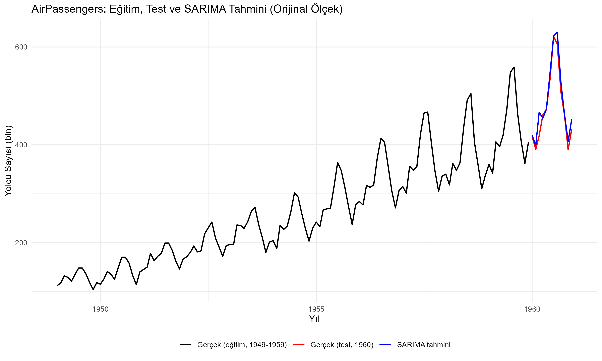

*Şekil 8.3 — 1949–1959 eğitim verisi (siyah), 1960 yılının gerçek değerleri (kırmızı) ve yalnızca eğitim setiyle kurulan SARIMA modelinin tahminleri (mavi), orijinal ölçekte.*

Grafikte mavi tahmin çizgisinin kırmızı gerçek çizgiyi yakından izlediği, yaz tepesini neredeyse tam yakaladığı, Mart ayında ise belirgin biçimde yukarıda kaldığı görülür. Bu görsel izlenim, tablodaki sayılarla tutarlıdır.

---

### 8.4. Python ile Değerlendirme Fonksiyonu ve Sonuçların Yorumlanması

> **Uygulama dosyası:** [`Codes/python/ch08_model_degerlendirme.py`](Codes/python/ch08_model_degerlendirme.py) · [Notebook](Codes/notebooks/ch08_model_degerlendirme.ipynb) · [](https://colab.research.google.com/github/erkanozhan/AI_Based_Time_Series-Data_Analytics/blob/main/Codes/notebooks/ch08_model_degerlendirme.ipynb)
>
> Bu bölümdeki kodların tamamı bu dosyada. Bilgisayarınızda çalıştırmak için depo kök dizininde `python Codes/python/ch08_model_degerlendirme.py` komutunu kullanın ya da dosyayı VS Code'da açıp hücre hücre çalıştırın. Kurulum yapmadan denemek için Colab bağlantısını kullanabilirsiniz.


Farklı modellerin performansını karşılaştırırken her seferinde aynı metrik kodunu yeniden yazmak yerine standart bir fonksiyon kullanmak hem zaman kazandırır hem de hataları önler.

#### 8.4.1. `evaluate_model()` Fonksiyonu

```python
import numpy as np
import pandas as pd
from sklearn.metrics import mean_absolute_error, mean_squared_error

def evaluate_model(y_true, y_pred, model_name):
    """
    Model performansını değerlendirir ve sonuçları yazdırır.

    Parametreler:
        y_true: Gerçek değerler (array veya Series)
        y_pred: Tahmin edilen değerler (array veya Series)
        model_name: Modelin adı (string)

    Döndürür:
        dict: MAE, RMSE ve MAPE değerlerini içeren sözlük
    """
    # Array'e dönüştür (Series indeksleri farklı olsa bile sıraya göre karşılaştırılır)
    y_true = np.array(y_true).flatten()
    y_pred = np.array(y_pred).flatten()

    # Metrikleri hesapla
    mae = mean_absolute_error(y_true, y_pred)
    rmse = np.sqrt(mean_squared_error(y_true, y_pred))

    # MAPE hesaplarken sıfıra bölmeyi önle (gerçek değeri 0 olan noktalar hesaba katılmaz)
    mask = y_true != 0
    mape = np.mean(np.abs((y_true[mask] - y_pred[mask]) / y_true[mask])) * 100

    # Sonuçları yazdır
    print(f"\n{'=' * 40}")
    print(f"{model_name} Performans Sonuçları")
    print(f"{'=' * 40}")
    print(f"MAE:  {mae:>10.2f}")
    print(f"RMSE: {rmse:>10.2f}")
    print(f"MAPE: {mape:>9.2f}%")

    return {'mae': mae, 'rmse': rmse, 'mape': mape}
```

**Açıklama:** Fonksiyon, R'daki `metrikler()` yardımcısının biraz daha kapsamlı Python karşılığıdır. Satırları sırayla okuyalım:

- `import numpy as np`, NumPy kütüphanesini yükler ve ona kısa bir takma ad (`np`) verir; bundan sonra `np.sqrt()` gibi yazabiliriz. `from sklearn.metrics import ...` ise bir kütüphaneden yalnızca adı verilen fonksiyonları içeri alır.
- `def evaluate_model(y_true, y_pred, model_name):` yeni bir fonksiyon tanımlar; parantez içindekiler fonksiyonun girdileridir ve alttaki girintili satırlar fonksiyonun gövdesidir. Üç tırnak (`"""`) arasındaki metin, fonksiyonun ne yaptığını anlatan açıklamadır (docstring); `help(evaluate_model)` yazınca görüntülenir.
- `np.array(...).flatten()` girdileri tek boyutlu, düz bir sayı dizisine çevirir. Bu önemlidir, çünkü tahminler farklı modellerden farklı biçimlerde gelir: SARIMA bir Pandas Series, Prophet bir NumPy dizisi döndürür; LSTM gibi derin öğrenme modelleri ise çoğu zaman `(60, 1)` biçimli, yani 60 satır ve 1 sütundan oluşan iki boyutlu bir dizi verir. `flatten()` hepsini `(60,)` biçimine, yani 60 elemanlı tek bir sıraya indirir. Yan etkisi de faydalıdır: Series'in tarih indeksi atılır ve gerçek değerlerle tahminler **sıralarına göre** eşleştirilir. İndeksleri farklı olan iki Series (örneğin 0, 1, 2, ... indeksli tahminler ile tarih indeksli gerçek değerler) bu sayede yine doğru karşılaştırılır.
- MAE ve RMSE için `scikit-learn`'ün hazır fonksiyonları kullanılır. `mean_absolute_error` doğrudan MAE'yi, `mean_squared_error` ise MSE'yi verir; RMSE için sonucun karekökünü `np.sqrt()` ile kendimiz alıyoruz. Bunlar 8.2'deki formüllerin birebir karşılığıdır.
- MAPE için `mask = y_true != 0` her eleman için "gerçek değer sıfırdan farklı mı?" sorusunun cevabını tutan bir doğru/yanlış (`True`/`False`) dizisi üretir. `y_true[mask]` bu diziyi süzgeç gibi kullanıp yalnızca `True` olan konumları seçer. Böylece gerçek değeri 0 olan noktalar hesaba katılmaz. Bu, sıfıra bölme hatasını önler, ancak 8.2.3'teki "sıfıra **yakın** değerler" sorununu çözmez. Böyle serilerde MAPE yerine MASE ya da MAE'ye güvenin.
- `print(f"...")` satırlarındaki `f` önekli metinler (f-string), süslü parantez içindeki ifadelerin değerini metne yerleştirir. `{'=' * 40}` 40 tane `=` karakteri yazar; `{mae:>10.2f}` ise sayıyı virgülden sonra iki basamakla (`.2f`) ve 10 karakterlik bir alana sağa yaslanmış olarak (`>10`) yazar, böylece sütunlar alt alta hizalanır.
- `return {'mae': mae, 'rmse': rmse, 'mape': mape}` sonuçları bir sözlük (`dict`) olarak döndürür: Her değer bir isimle (anahtar) eşleştirilir. Bu sayede birden çok modelin sonucu kolayca tabloya dönüştürülebilir.

#### 8.4.2. Örnek Kullanım

Şimdilik elimizde Bölüm 7.7'de kurduğumuz Python SARIMA modeli var. Onu, 8.1.2'deki mevsimsel naive referansla karşılaştıralım. Aşağıdaki kod, Bölüm 7.7'deki `train_data` (1949–1955, 84 ay), `test_data` (1956–1960, 60 ay) ve `predictions_arima` değişkenlerinin tanımlı olduğunu varsayar. Uygulama dosyası bu hazırlığı (veriyi yükleme, ayırma ve `auto_arima` ile modeli kurma) kendi başında kısaca yeniden yaptığı için tek başına çalışır.

```python
# 1) Bölüm 7.7'deki SARIMA (auto_arima) tahminleri
arima_metrics = evaluate_model(test_data, predictions_arima, "SARIMA (auto_arima)")

# 2) Referans model: mevsimsel naive
#    Eğitim setinin son 12 ayı, 60 aylık test dönemi boyunca tekrar edilir.
son_yil = train_data[-12:].values
snaive_pred = np.tile(son_yil, len(test_data) // 12 + 1)[:len(test_data)]
snaive_metrics = evaluate_model(test_data, snaive_pred, "Mevsimsel Naive")

# 3) Sonraki bölümlerde aynı fonksiyonu diğer modeller için de kullanacağız.
#    (Bu satırlar, ilgili bölümlerdeki değişkenler tanımlandıktan sonra çalışır.)
#    Dikkat: Prophet ve XGBoost bölümlerinde test seti yalnızca 1960 yılıdır (12 ay);
#    onları 8.3'teki 12 aylık sonuçlarla kıyaslayın. LSTM ise buradaki 60 aylık
#    test dönemini (1956-1960) kullanır.
# prophet_metrics = evaluate_model(test['y'], tahmin, "Prophet")          # Bölüm 9.3 (12 ay)
# xgb_metrics     = evaluate_model(y_test, y_test_pred, "XGBoost")        # Bölüm 13.4 (12 ay)
# lstm_metrics    = evaluate_model(testY_inv, test_predict[:, 0], "LSTM") # Bölüm 15 (60 ay)

# 4) Sonuçları tek bir tabloda toplayalım
sonuclar = pd.DataFrame({"SARIMA": arima_metrics,
                         "Mevsimsel Naive": snaive_metrics}).T
print(sonuclar.round(2))
```

Mevsimsel naive tahminini üreten iki satır biraz açıklama ister. `train_data[-12:]` eksi indeksle **sondan** sayar: "son 12 eleman", yani 1955'in 12 ayı. `.values` bunları tarih indeksinden arındırılmış bir NumPy dizisine çevirir. `np.tile(dizi, k)` diziyi uç uca `k` kez tekrarlar; örneğin `np.tile([1, 2, 3], 2)` sonucu `[1, 2, 3, 1, 2, 3]`'tür. Kaç tekrar gerektiğini `len(test_data) // 12 + 1` hesaplar: `//` tam sayı bölmesidir (kalanı atar), $60 // 12 = 5$, artı 1 ile 6 tekrar, yani 72 değer elde edilir. Sondaki `[:len(test_data)]` bu diziyi ilk 60 elemanda keser. Test uzunluğu 12'nin tam katı olmasaydı (ör. 30 ay), "+1" sayesinde yine yeterli değer üretilir ve fazlası kesilirdi.

Son adımda `pd.DataFrame({...})` iki sözlüğü yan yana koyarak bir tablo yapar: Sözlüklerin adları (`"SARIMA"`, `"Mevsimsel Naive"`) sütun, içlerindeki anahtarlar (`mae`, `rmse`, `mape`) satır olur. `.T` (transpose, devrik) satırlarla sütunların yerini değiştirir; böylece her model bir satır, her metrik bir sütun olur. `.round(2)` iki basamağa yuvarlar.

Bizim denememizde (pmdarima 2.1, seçilen model ARIMA(1,0,0)(0,1,1)[12]) çıktı aşağıdaki gibi oldu; kütüphane sürümüne göre SARIMA değerleri biraz değişebilir. `evaluate_model()` her çağrıda kendi kutusunu yazdırır (burada yalnızca ilki gösterilmiştir), en sonda da özet tablo gelir:

```text
========================================
SARIMA (auto_arima) Performans Sonuçları
========================================
MAE:       35.55
RMSE:      47.87
MAPE:      7.95%
...
                    mae    rmse   mape
SARIMA            35.55   47.87   7.95
Mevsimsel Naive  112.43  126.01  27.05
```

**Çıktının yorumu:** SARIMA, 60 aylık uzun ufukta bile mevsimsel naive yöntemin MAE ve MAPE'sini üçte birin altına ($35.55 / 112.43 \approx 0.32$), RMSE'sini ise yaklaşık %38'ine indirmiştir. Mevsimsel naive yöntem her yıl 1955'in desenini kopyaladığı için büyümeyi hiç yakalayamaz ve hatası yıldan yıla artar: Yıllık MAE'si 1956'da yaklaşık 44, 1960'ta ise yaklaşık 192 bin yolcudur. Yine de SARIMA'nın buradaki MAPE'si (yaklaşık %8), R uygulamasındaki %2.9'dan çok yüksektir. Bunun iki nedeni vardır. Birincisi, test ufku 12 yerine 60 aydır; geleceğe ne kadar uzak bakılırsa hata o kadar birikir. İkincisi, Python'un seçtiği model büyümeyi olduğundan düşük tahmin eder: Her ayın geçen yılın aynı ayından yaklaşık 26 bin yolcu fazla olacağını varsayar, oysa test döneminde bu yıllık artış ortalama 38.4 bin olmuştur. Bu yüzden hatalar hep aynı yöndedir ve yıldan yıla büyür (Bölüm 7.7.5). Log dönüşümü bu bölmede tek başına çözüm değildir: Log seri üzerine kurulan model de RMSE ≈ 49.0 verir (Bölüm 7.7.5'teki alıştırma).

**Not —** Bölüm 9, 13 ve 15'teki modelleri karşılaştırırken **aynı test dönemini** kullandığınızdan emin olun. Farklı dönemler ya da farklı uzunlukta test setleri üzerinde hesaplanmış metrikler karşılaştırılamaz. Bu yüzden 12 aylık testle değerlendirilen Prophet (Bölüm 9.3) ve XGBoost (Bölüm 13.4) sonuçları 8.3'teki R tablosuyla, 60 aylık testle değerlendirilen LSTM sonuçları (Bölüm 15) ise bu tabloyla yan yana konmalıdır.

#### 8.4.3. Sonuçların Yorumlanması

Metrikleri karşılaştırırken şu sorulara yanıt arayın:

**1. Model naive referansı yeniyor mu?**

- Evet, açık farkla → Model veriden gerçekten bir şey öğrenmiş.
- Hayır ya da çok az farkla → Karmaşık modele gerek yok; basit yöntemi kullanın ya da modeli gözden geçirin.

**2. MAE ile RMSE birbirine yakın mı?**

- Yakın → Hatalar benzer büyüklükte, model tutarlı.
- RMSE belirgin biçimde büyük → Bazı noktalarda büyük sapmalar var; hataların hangi dönemlerde yoğunlaştığına bakın (ör. yaz tepeleri, özel günler).

**3. MAPE makul düzeyde mi?** Kabaca bir fikir vermesi için şu eşikler sıkça kullanılır:

- %10'un altı → İyi performans
- %10–20 → Kabul edilebilir
- %20'nin üstü → Model iyileştirilmeli

Bu eşikler evrensel değildir. Günlük hisse senedi getirisinde %20 mükemmel olabilirken, elektrik yükü tahmininde %5 bile yetersiz sayılabilir. Asıl ölçüt, **naive referans ve alandaki mevcut çözümlerle** karşılaştırmadır.

**4. Eğitim ve test metrikleri arasında fark var mı?**

- Eğitim hatası çok düşük, test hatası yüksek → **Aşırı öğrenme** (overfitting): Model eğitim verisini ezberlemiş.
- İkisi de yüksek → **Yetersiz öğrenme** (underfitting): Model veriyi yakalayacak kadar esnek değil.
- İkisi yakın ve düşük → **İyi genelleme**.

**5. Hatalarda sistematik bir yön var mı?** Hataların çoğu aynı işaretteyse (8.3'teki gibi) model sistematik olarak fazla ya da eksik tahmin yapıyordur. Bu, trendin değiştiğine işaret edebilir.

Son olarak, hangi modeli seçeceğiniz probleme bağlıdır. Stok yönetimi gibi ortalama doğruluğun yeterli olduğu durumlarda MAE'si düşük olanı; büyük hataların kabul edilemediği durumlarda RMSE'si düşük olanı tercih edin. Metriklerin yanında modelin yorumlanabilirliği, eğitim süresi ve bakım kolaylığı da seçimde rol oynar.

Bu bölümde öğrendiğimiz araçlarla artık farklı modelleri adil biçimde karşılaştırabiliriz. Bir sonraki bölümde, trend ve mevsimselliği farklı bir yaklaşımla modelleyen **Facebook Prophet**'ı inceleyecek ve sonuçlarını buradaki SARIMA değerleriyle kıyaslayacağız.

---

<a id="bolum-9"></a>

## 9. Facebook Prophet

Bölüm 7'de ARIMA/SARIMA ile seriyi önce durağanlaştırıp sonra kendi geçmişiyle açıkladık; Bölüm 8'de de bir modelin başarısını eğitim-test ayrımı ve hata metrikleriyle ölçmeyi öğrendik. Bu bölümde aynı problemi bambaşka bir açıdan ele alan bir araca bakıyoruz: Facebook (Meta) tarafından geliştirilen **Prophet**.

**Açıklama:** Prophet, bir zaman serisini "zamanın bir fonksiyonu" olarak görür ve bu fonksiyonu anlaşılır parçalara ayırarak kurar: genel gidişat (trend), düzenli tekrarlar (mevsimsellik) ve özel günlerin etkisi (tatiller). ARIMA'daki gibi fark alma, ACF/PACF okuma ya da $(p,d,q)$ derecelerini seçme zorunluluğu yoktur; seri durağan olmasa da doğrudan uygulanabilir. LSTM gibi (Bölüm 15) içyapısı kapalı bir model de değildir: Her bileşeni ayrı ayrı çizip yorumlayabiliriz.

Bu fikir size tanıdık gelmeli. Bölüm 2.2 ve 2.6'da bir seriyi trend, mevsimsellik ve düzensiz bileşene **ayrıştırmıştık**. Prophet, bu ayrıştırma düşüncesini bir **tahmin modeline** dönüştürür: Bileşenleri yalnızca geçmişte ayırmakla kalmaz, her birini matematiksel bir fonksiyonla ifade edip geleceğe uzatır.

---

### 9.1. Model Yapısı

Matematikte **fonksiyon**, her girdiye bir çıktı karşılık getiren kuraldır. Örneğin $g(t) = 2t + 100$ kuralı, $t = 5$ girdisine $g(5) = 2 \cdot 5 + 100 = 110$ çıktısını verir. Prophet'ta girdi zamandır: Her bileşen, "zamanı ver, o andaki katkıyı söyleyeyim" diyen bir fonksiyondur.

**Tanım:** Prophet, gözlenen seriyi üç bileşen ile bir hata teriminin toplamı olarak modeller:

$$
y(t) = g(t) + s(t) + h(t) + \varepsilon_t
$$

> **Simge notu:** $`y(t)`$: $`t`$ anındaki gözlem; "y t" diye okunur. Parantezli yazım $`y(t)`$ ile alt indisli yazım $`y_t`$ aynı şeyi anlatır: "t zamanındaki y değeri" · $`g(t)`$: trend fonksiyonu (*growth*, büyüme) · $`s(t)`$: mevsimsel (periyodik, düzenli tekrar eden) bileşen (*seasonality*) · $`h(t)`$: tatil/özel gün etkileri (*holidays*) · $`\varepsilon_t`$ *(epsilon t)*: modelin açıklayamadığı rastgele hata. $`\varepsilon`$ bir Yunan harfidir; küme işareti $`\in`$ ("elemanıdır") ile karıştırmayın

Küçük bir örnek: Bir ayda trend 450 bin yolcuyu, mevsim etkisi +60'ı, tatil etkisi 0'ı gösteriyor ve o ay açıklanamayan bir −5'lik sapma olmuşsa gözlem $450 + 60 + 0 - 5 = 505$ olur. Model, gözlenen 505'i bu dört parçaya ayırmaya çalışır; tahmin yaparken de hata hariç ilk üç parçayı toplar.

Bileşenler birbirinden bağımsız olarak modellenir ve sonra toplanır. Model teknik olarak bir **eğri uydurma (curve fitting)** ya da regresyon problemidir; yani girdiden (zaman) çıktıyı (gözlem) veren bir denklemin katsayıları veriden bulunur. Zaman, modelin tek girdisidir. Bu yüzden ARIMA'dan farklı olarak gözlemlerin eşit aralıklı olması veya eksiksiz olması gerekmez.


*Şekil 9.1 — Prophet'ın bileşen yapısı: Trend, mevsimsellik ve tatil etkileri ayrı ayrı modellenir, hata terimiyle birlikte toplanarak gözlenen seriyi oluşturur.*

#### 9.1.1. Trend Bileşeni: g(t)

Trend, serinin uzun vadeli yönünü taşır. Prophet'ta iki seçenek vardır.

**Tanım 1 (parçalı doğrusal trend):** Varsayılan seçenektir. Trendi bir cetvel gibi düz bir doğru olarak düşünün; ama bu cetvel belirli noktalarda bükülebilir. Doğrunun **eğimi** (her zaman adımında ne kadar arttığı) belirli zaman noktalarında değişebilir. Eğimin değiştiği bu noktalara **değişim noktaları (changepoints)** denir. $s_1, s_2, \dots, s_S$ değişim noktaları için basitleştirilmiş gösterim şöyledir:

$$
g(t) = \Big(k + \sum_{j: s_j \le t} \delta_j\Big) t + \Big(m + \sum_{j: s_j \le t} \gamma_j\Big)
$$

> **Simge notu:** $`k`$: başlangıç eğimi (büyüme hızı) · $`m`$: başlangıç seviyesi (doğrunun $`t = 0`$'daki değeri, kesişim) · $`s_j`$: j'inci değişim noktasının zamanı (buradaki $`s`$, mevsim uzunluğu değil; $`S`$ de değişim noktalarının sayısıdır) · $`\delta_j`$ *(delta j)*: j'inci değişim noktasında eğime eklenen miktar · $`\gamma_j`$ *(gama j)*: doğru parçalarının kopmadan birleşmesini sağlayan düzeltme terimi · $`\sum_{j: s_j \le t}`$ *(büyük sigma = toplam)*: "$`s_j \le t`$ olan, yani $`t`$ anına kadar geçilmiş bütün değişim noktaları için topla"; henüz gelinmemiş değişim noktaları toplama girmez

**Yorum:** $t$ anındaki eğim, başlangıç eğimi $k$'ye o ana kadar geçilen tüm değişim noktalarındaki $\delta_j$ ayarlamalarının eklenmesiyle bulunur. İlk değişim noktasından sonra eğim $k + \delta_1$, ikincisinden sonra $k + \delta_1 + \delta_2$ olur (Şekil 9.2). $\gamma_j$ terimleri ise trend çizgisinin değişim noktalarında "kırılıp" kopmamasını, sürekli kalmasını sağlar.

Bunu sayılarla görelim. Başlangıç eğimi $k = 2$ (her ay 2 birim artış), başlangıç seviyesi $m = 100$ olsun ve $s_1 = 10$. ayda tek bir değişim noktası bulunsun; burada eğim $\delta_1 = +1$ kadar artsın.

1. **Değişim noktasından önce** ($t < 10$): Toplamlara hiçbir terim girmez, $g(t) = 2t + 100$'dür. $g(0) = 100$, $g(5) = 110$ ve değişim anında $g(10) = 2 \cdot 10 + 100 = 120$.
2. **Değişim noktasından sonra** ($t \ge 10$): Eğim $2 + 1 = 3$ olur. $\gamma_1$ olmasaydı, yani $g(t) = 3t + 100$ deseydik, $g(10) = 130$ çıkardı: Trend 10. ayda 120'den 130'a aniden sıçrardı. Bu kopukluğu önlemek için kesişim $\gamma_1 = -s_1 \cdot \delta_1 = -10 \cdot 1 = -10$ kadar düzeltilir ve $g(t) = 3t + 90$ olur.
3. **Sağlama:** $g(10) = 3 \cdot 10 + 90 = 120$ (sıçrama yok), $g(12) = 3 \cdot 12 + 90 = 126$. Yani 10. aydan sonra trend her ay 2 değil 3 birim artmaktadır.

Genel kural $\gamma_j = -s_j \cdot \delta_j$'dir. $\gamma_j$'ler veriden ayrıca öğrenilmez; $\delta_j$'ler bulununca Prophet onları bu kuralla kendisi hesaplar.


*Şekil 9.2 — Parçalı doğrusal trend: Eğim yalnızca değişim noktalarında ($`s_1, s_2, s_3`$) değişir. Tahmin döneminde trend son eğimle uzatılır ve belirsizlik aralığı giderek genişler.*

Değişim noktalarını elle vermemiz gerekmez. Prophet varsayılan olarak verinin **ilk %80'lik** kısmına eşit aralıklı 25 **aday** değişim noktası yerleştirir (`n_changepoints=25`, `changepoint_range=0.8`). Ardından her $`\delta_j`$ için sıfıra yakın değerleri ödüllendiren bir **ön dağılım** (önsel, *prior*; Laplace önseli) kullanır. Ön dağılım, veriye bakmadan önce bir parametre hakkındaki varsayımımızdır. Buradaki varsayım "eğim değişikliklerinin çoğu sıfırdır, arada bir büyük olabilir" şeklindedir ve bir ceza gibi çalışır: Eğimi değiştirmek modele "pahalıya" mal olur, bu yüzden model eğimi ancak veri bunu açıkça gerektiriyorsa değiştirir. Sonuçta adayların çoğunda $`\delta_j \approx 0`$ kalır; yalnızca gerçekten yön değişimi olan yerlerde eğim anlamlı biçimde değişir. 9.2'deki `AirPassengers` modelinde 25 adayın yalnızca 5'inde (Ağustos 1953 ile Şubat 1955 arasındaki adaylarda) eğim belirgin biçimde artmıştır; bunu Şekil 9.5'teki trend panelinde 1954 civarındaki hafif bükülme olarak görebilirsiniz.

> **Simge notu:** $`\approx`$ *(yaklaşık eşit)*: değerin neredeyse aynı olduğunu gösterir

Bu esnekliği `changepoint_prior_scale` parametresi (varsayılan 0.05) belirler. Parametre, yukarıdaki cezanın ne kadar gevşek olduğunu ayarlar:

- **Büyük değer** (ör. 0.5): Ceza hafifler, trend daha esnek olur, her kıvrımı izler. Aşırı uyum (overfitting) riski artar.
- **Küçük değer** (ör. 0.01): Ceza ağırlaşır, trend katılaşır, gerçek yön değişimlerini kaçırabilir.

**Tanım 2 (lojistik büyüme trendi):** Bazı seriler sonsuza kadar büyüyemez; bir doygunluk seviyesine yaklaşır (ör. bir ülkedeki internet kullanıcı sayısı nüfusu aşamaz). Böyle bir büyüme önce yavaş başlar, sonra hızlanır, üst sınıra yaklaştıkça yeniden yavaşlar ve durur. Grafiği S harfine benzeyen bu eğri şöyle yazılır:

$$
g(t) = \frac{C}{1 + \exp\big(-k (t - m)\big)}
$$

> **Simge notu:** $`C`$: taşıma kapasitesi (serinin ulaşabileceği üst sınır) · $`\exp(x)`$ *(üstel fonksiyon)*: $`e^{x}`$, yani $`e \approx 2.718`$ sayısının $`x`$'inci kuvveti; $`\exp(0) = 1`$, $`x`$ büyüdükçe çok hızlı büyür, $`x`$ eksi yönde büyüdükçe sıfıra yaklaşır · $`k`$: büyüme hızı · $`m`$: burada başlangıç seviyesi **değil**, eğrinin en hızlı yükseldiği orta noktanın zamanıdır (aynı harf iki tanımda farklı anlamda kullanılır)

$C = 100$, $k = 1$, $m = 5$ alıp birkaç noktada hesaplayalım:

| $`t`$ | $`-k(t-m)`$ | $`\exp(\cdot)`$ | $`g(t) = 100 / (1 + \exp(\cdot))`$ |
| --- | --- | --- | --- |
| 0 | 5 | ≈ 148.4 | $`100 / 149.4 \approx 0.7`$ |
| 3 | 2 | ≈ 7.39 | $`100 / 8.39 \approx 11.9`$ |
| 5 | 0 | 1 | $`100 / 2 = 50`$ |
| 7 | −2 | ≈ 0.135 | $`100 / 1.135 \approx 88.1`$ |
| 10 | −5 | ≈ 0.0067 | $`100 / 1.0067 \approx 99.3`$ |

Tablo eğrinin hikâyesini anlatır: Başta neredeyse sıfır, orta noktada ($t = m$) tam olarak üst sınırın yarısı (50), sonra 100'e yaklaşır ama onu hiç aşmaz. Prophet'ta bu seçenek `Prophet(growth='logistic')` ile kullanılır; veri çerçevesine üst sınırı gösteren bir `cap` sütunu eklemek gerekir. Lojistik trendde de büyüme hızı $k$ değişim noktalarında ayarlanabilir.

#### 9.1.2. Mevsimsellik Bileşeni: s(t)

Mevsimsel desen, her yıl aynı biçimde tekrar eden bir dalgadır. Prophet bu dalgayı **Fourier serisi** ile, yani farklı hızlarda salınan basit dalgaların toplamıyla kurar. Fikir, bir müzik akorunun birkaç saf sesin üst üste binmesiyle oluşmasına benzer: Tek bir düzgün dalga kaba bir şekil verir; ona daha hızlı salınan küçük dalgalar eklendikçe karmaşık şekiller de elde edilebilir.

Yapı taşları **kosinüs** (cos) ve **sinüs** (sin) fonksiyonlarıdır. İkisi de −1 ile +1 arasında gidip gelen ve belirli bir aralıkla kendini aynen tekrarlayan dalgalardır. Bir tam tur $2\pi$ ile gösterilir ($\pi$ "pi" ≈ 3.14159 olduğundan $2\pi \approx 6.283$). Formül şudur:

$$
s(t) = \sum_{n=1}^{N} \left[ a_n \cos\left(\frac{2\pi n t}{P}\right) + b_n \sin\left(\frac{2\pi n t}{P}\right) \right]
$$

> **Simge notu:** $`P`$: periyot, yani desenin kendini tekrarladığı süre (Prophet zamanı gün cinsinden ölçer: yıllık mevsimsellik için $`P = 365.25`$ gün, haftalık için $`P = 7`$) · $`n`$: dalganın sırası; $`n`$'inci dalga bir periyotta $`n`$ tur atar · $`N`$: kullanılan dalga (Fourier terimi) sayısı · $`\sum_{n=1}^{N}`$: "$`n`$'yi 1'den $`N`$'ye kadar artırarak köşeli parantez içindekileri topla" · $`a_n, b_n`$: veriden öğrenilen katsayılar; her dalganın boyunu (genliğini) ve ne kadar kaydığını belirler · $`\pi`$ *(pi)*: 3.14159...; ARIMA'daki $`\phi`$ (fi) ile karıştırmayın

Parantez içindeki $2\pi n t / P$ ifadesi dalganın "kaçıncı turda" olduğunu söyler: $t$, 0'dan $P$'ye kadar ilerlerken bu açı 0'dan $2\pi n$'ye, yani $n$ tam tura kadar büyür. Bu yüzden $n = 1$ dalgası yılda bir, $n = 2$ dalgası yılda iki, $n = 3$ dalgası yılda üç tur atar. Okumayı kolaylaştırmak için zamanı ay olarak ölçelim ($P = 12$, Ocak $t = 0$) ve $n = 1$ dalgasının değerlerine bakalım:

| Ay | $`t`$ | açı $`2\pi t / 12`$ | $`\cos`$ | $`\sin`$ |
| --- | --- | --- | --- | --- |
| Ocak | 0 | 0 | 1 | 0 |
| Nisan | 3 | çeyrek tur ($`\pi/2`$) | 0 | 1 |
| Temmuz | 6 | yarım tur ($`\pi`$) | −1 | 0 |
| Ekim | 9 | üç çeyrek tur ($`3\pi/2`$) | 0 | −1 |
| (gelecek) Ocak | 12 | tam tur ($`2\pi`$) | 1 | 0 |

`AirPassengers`'ın aylık mevsim etkilerine (Şekil 9.3'teki kırmızı noktalar) uydurulan ilk dalganın katsayıları yaklaşık $a_1 = -44$ ve $b_1 = 3.6$'dır. Tablodaki değerleri yerine koyalım:

- Ocak: $s = -44 \cdot 1 + 3.6 \cdot 0 = -44$ (kışın ortalamanın altında)
- Nisan: $s = -44 \cdot 0 + 3.6 \cdot 1 = 3.6$ (ortalamaya yakın)
- Temmuz: $s = -44 \cdot (-1) + 3.6 \cdot 0 = +44$ (yazın ortalamanın üstünde)
- Ekim: $s = -44 \cdot 0 + 3.6 \cdot (-1) = -3.6$

Tek bir dalga bile "kış düşük, yaz yüksek" desenini yakalar. Ancak gerçek desen daha keskindir: Temmuz-Ağustos tepesi daha dar ve yüksek, Kasım çukuru daha derindir. Bunu yakalamak için yılda iki ve üç tur atan daha hızlı dalgalar eklenir (Şekil 9.3).

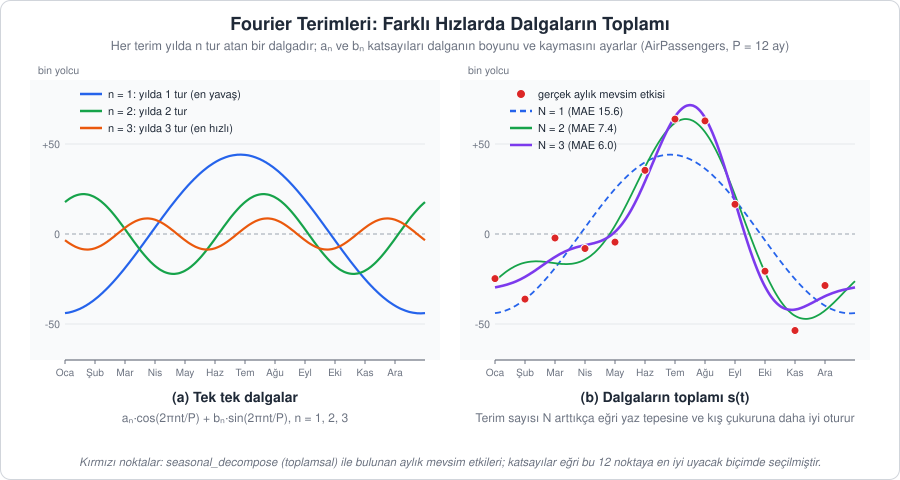

*Şekil 9.3 — Fourier terimleri: (a) Yılda 1, 2 ve 3 tur atan dalgalar, katsayıları `AirPassengers` verisinden bulunmuş hâlleriyle. (b) Bu dalgaların toplamı: Yalnızca ilk dalga ($`N = 1`$) aylık mevsim etkilerinden ortalama 15.6 bin yolcu sapar; üç dalga ($`N = 3`$) bu sapmayı 6.0'a indirir.*

**Yorum:** $n = 1$ terimi periyot başına tek bir tepe ve tek bir çukur üreten en kaba dalgadır. $n$ büyüdükçe daha hızlı salınan dalgalar eklenir; bunların toplamı, yaz tepesi ve kış çukuru gibi düzgün olmayan desenleri de yakalayabilir. $N$ (Prophet'taki adı `fourier_order`) büyüdükçe mevsimsel eğri daha esnek olur; varsayılan değer yıllık mevsimsellik için 10, haftalık için 3'tür. Esneklik bedelsiz değildir: Çok büyük $N$, veriye değil gürültüye uyan kıpır kıpır bir eğri üretebilir (9.2.1'deki bileşen grafiğinde bunun bir örneğini göreceğiz). Katsayılar $a_n, b_n$ sıradan bir regresyonla tahmin edilir: Her $\cos$ ve $\sin$ terimi bir girdi sütunu gibi davranır.

Bölüm 2.3'teki ayrımı hatırlayalım: Prophet'ın $s(t)$ bileşeni sabit ve bilinen periyotlu **mevsimselliği** modeller; süresi belirsiz **döngüsel** dalgalanmalar ise çoğunlukla trend bileşenine karışır.

#### 9.1.3. Tatil ve Özel Gün Etkileri: h(t)

Bayramlar, Kara Cuma, okul tatilleri veya kampanya günleri gibi olaylar her yıl aynı takvim gününe denk gelmeyebilir (ör. Ramazan Bayramı her yıl yaklaşık 11 gün öne kayar). Bu yüzden periyodu sabit olan Fourier serisiyle yakalanamazlar. Prophet bu günleri kullanıcıdan bir liste olarak alır ve her olay için ayrı bir etki katsayısı öğrenir:

$$
h(t) = \sum_{i=1}^{L} \kappa_i \cdot \mathbf{1}\big[t \in D_i\big]
$$

> **Simge notu:** $`L`$: tanımlanan tatil/olay sayısı · $`D_i`$: i'inci olayın gerçekleştiği tarihler kümesi (ör. bütün yılların Ramazan Bayramı günleri) · $`\in`$ *(elemanıdır)*: $`t`$ tarihinin bu kümede olduğunu belirtir; epsilon ($`\varepsilon`$) ile karıştırmayın · $`\mathbf{1}[\cdot]`$ *(gösterge fonksiyonu)*: köşeli parantezdeki koşul doğruysa 1, değilse 0 veren bir açma-kapama anahtarı · $`\kappa_i`$ *(kappa i, "k"ye benzeyen Yunan harfi)*: i'inci olayın seriye eklediği etki

Yani $t$ günü bir tatile denk geliyorsa, o tatilin etkisi $\kappa_i$ tahmine eklenir. Örneğin günlük satış verisinde iki olay tanımlayalım: Ramazan Bayramı ($\kappa_1 = +80$) ve yılbaşı ($\kappa_2 = +120$). Bayram günlerinden birinde $h(t) = 80 \cdot 1 + 120 \cdot 0 = 80$, 31 Aralık'ta $h(t) = 80 \cdot 0 + 120 \cdot 1 = 120$, sıradan bir günde ise $80 \cdot 0 + 120 \cdot 0 = 0$'dır. Tatiller `holidays` parametresiyle bir veri çerçevesi olarak verilir; ülke tatilleri için `m.add_country_holidays(country_name='TR')` kısayolu da vardır. Aylık `AirPassengers` verisinde günlük tatil etkisi anlamlı olmadığından bu bileşeni aşağıdaki uygulamada kullanmıyoruz.

#### 9.1.4. Toplamsal ve Çarpımsal Mevsimsellik

Yukarıdaki model **toplamsaldır**: Mevsimsel etki, trendin seviyesinden bağımsız, sabit bir miktardır. Bölüm 2.4'te gördüğümüz gibi `AirPassengers` serisinde ise mevsimsel dalgaların genliği yolcu sayısıyla birlikte büyür; seri "huni" gibi açılır. Bu yapı **çarpımsaldır**.

Prophet bunu `seasonality_mode='multiplicative'` seçeneğiyle karşılar. Bu durumda model şu biçimi alır:

$$
y(t) = g(t) \cdot \big(1 + s(t) + h(t)\big) + \varepsilon_t
$$

Artık $s(t)$ bir miktar değil, trendin **oransal** bir düzeltmesidir: $s(t) = 0$ "trend aynen", $s(t) = 0.20$ "trendin %20 üzerinde", $s(t) = -0.20$ "trendin %20 altında" demektir. Parantez içindeki 1, trendin kendisini temsil eder: $g(t) \cdot (1 + 0.20) = g(t) + 0.20 \cdot g(t)$, yani trend artı trendin %20'si. Farkı sayılarla görelim:

| Trend $`g(t)`$ | Toplamsal, $`s(t) = +60`$ | Çarpımsal, $`s(t) = 0.20`$ |
| --- | --- | --- |
| 200 | $`200 + 60 = 260`$ | $`200 \cdot 1.20 = 240`$ |
| 450 | $`450 + 60 = 510`$ | $`450 \cdot 1.20 = 540`$ |

Toplamsal modelde yaz artışı seviye ne olursa olsun 60 yolcudur. Çarpımsal modelde ise trend 200'deyken 40, 450'deyken 90 yolcudur: Trend yükseldikçe aynı %20'nin mutlak karşılığı da büyür; tıpkı Bölüm 2.4'teki çarpımsal modelde olduğu gibi. 9.3'te kuracağımız çarpımsal modelde Temmuz 1960 için trend yaklaşık 462.4, yıllık etki $s(t) \approx 0.230$'dur ve tahmin $462.4 \cdot 1.230 \approx 568.9$ bin yolcu olur. Bu %23'lük Temmuz etkisi, Bölüm 2.6'daki çarpımsal ayrıştırmada bulduğumuz Temmuz katsayısıyla (yaklaşık 1.23) neredeyse aynıdır.

**Not —** Bölüm 7'de SARIMA'yı `log(AirPassengers)` üzerine kurarak aynı sorunu log dönüşümüyle çözmüştük. Prophet'ta iki yol da mümkündür: Ya seriyi `np.log()` ile dönüştürüp toplamsal model kurarsınız (tahminleri sonra `np.exp()` ile geri çevirirsiniz), ya da doğrudan `seasonality_mode='multiplicative'` kullanırsınız.

---

### 9.2. Python ile Uygulama

> **Uygulama dosyası:** [`Codes/python/ch09_prophet.py`](Codes/python/ch09_prophet.py) · [Notebook](Codes/notebooks/ch09_prophet.ipynb) · [](https://colab.research.google.com/github/erkanozhan/AI_Based_Time_Series-Data_Analytics/blob/main/Codes/notebooks/ch09_prophet.ipynb)
>
> Bu bölümdeki kodların tamamı bu dosyada. Bilgisayarınızda çalıştırmak için depo kök dizininde `python Codes/python/ch09_prophet.py` komutunu kullanın ya da dosyayı VS Code'da açıp hücre hücre çalıştırın. Kurulum yapmadan denemek için Colab bağlantısını kullanabilirsiniz.

Prophet'ı kullanmanın ilk kuralı, veriyi onun beklediği biçime getirmektir: Tarih sütununun adı `ds` (*datestamp*, tarih damgası), tahmin edilecek değer sütununun adı `y` olmalıdır. Prophet sütunları adlarıyla tanır; başka adlar verirseniz `fit()` hata verir. Kurulum için `pip install prophet` yeterlidir.

İlk olarak varsayılan (toplamsal) modeli tüm veriyle eğitip 12 ay ileriye tahmin yapalım.

```python
import numpy as np
import pandas as pd
from prophet import Prophet
import matplotlib.pyplot as plt

# Veri setini yükleyelim. Orijinal CSV dosyasında sütun isimleri 'Month' ve 'Passengers'.
df = pd.read_csv('data/AirPassengers.csv')

# Prophet'ın gerektirdiği şekilde sütun isimlerini 'ds' ve 'y' olarak değiştirelim.
df.columns = ['ds', 'y']

# Prophet, 'ds' sütununun tarih-zaman nesneleri içerdiğinden emin olmak ister.
# Bu yüzden pandas'ın to_datetime fonksiyonu ile bu dönüşümü yapıyoruz.
df['ds'] = pd.to_datetime(df['ds'])

# Şimdi modelimizi oluşturalım.
# AirPassengers verisi aylık olduğu ve yıllık bir döngüye sahip olduğu için
# yearly_seasonality=True parametresini kullanıyoruz.
# Günlük döngüyü açıkça kapatıyoruz; haftalık döngüyü Prophet aylık veride zaten
# kendiliğinden kapatır (varsayılan ayar 'auto').
m = Prophet(yearly_seasonality=True, daily_seasonality=False)

# fit() metodu ile modelimizi hazırladığımız veri setine eğitiyoruz.
# Bu aşamada Prophet, veriden trendi ve mevsimsel desenleri öğrenir.
m.fit(df)

# Tahmin yapabilmek için gelecekteki tarihleri içeren bir veri çerçevesine ihtiyacımız var.
# Prophet bu işlemi make_future_dataframe metodu ile bizim için kolaylaştırır.
# periods=12 ile 12 dönem (ay) ileriye, freq='MS' ile de her ayın başına
# denk gelecek şekilde tarihler oluşturmasını söylüyoruz.
future = m.make_future_dataframe(periods=12, freq='MS')

# predict() metodu, oluşturduğumuz bu gelecek tarihleri alır ve her bir tarih için
# bir tahmin üretir. Belirsizlik aralığı rastgele simülasyonla hesaplandığı için
# aynı sonuçları almak üzere rastgele sayı üretecini sabitliyoruz.
np.random.seed(42)
forecast = m.predict(future)

# Tahmin sonuçları oldukça detaylı bir veri çerçevesi olarak döner.
# Bizi en çok ilgilendiren sütunlar şunlardır:
# 'ds': Tarih
# 'yhat': Modelin yaptığı tahmin
# 'yhat_lower' ve 'yhat_upper': Tahminin belirsizlik aralığı. Model, gerçek değerin
# büyük olasılıkla bu iki sınır arasında olacağını öngörür.
print("--- Tahmin Sonuçları (Son 12 Ay) ---")
print(forecast.set_index('ds')[['yhat', 'yhat_lower', 'yhat_upper']].tail(12).round(1))
```

Çıktı (Prophet 1.5, eğitim sırasında `cmdstanpy`'nin yazdığı "Chain [1] start/done processing" bilgi satırları hariç):

```text
--- Tahmin Sonuçları (Son 12 Ay) ---
             yhat  yhat_lower  yhat_upper
ds
1961-01-01  466.2       437.3       495.3
1961-02-01  460.7       432.7       489.6
1961-03-01  493.1       464.2       521.0
1961-04-01  491.7       462.8       520.7
1961-05-01  496.0       467.6       523.1
1961-06-01  537.1       508.7       566.5
1961-07-01  576.7       547.7       606.5
1961-08-01  577.1       549.8       604.3
1961-09-01  528.5       500.5       555.3
1961-10-01  493.4       465.7       520.2
1961-11-01  459.5       429.2       487.2
1961-12-01  488.9       459.4       518.5
```

Kodu adım adım okuyalım:

1. `import pandas as pd` gibi satırlar kütüphaneleri kısa takma adlarla yükler; `from prophet import Prophet` ise `prophet` paketinden yalnızca `Prophet` sınıfını (model şablonunu) alır.
2. `pd.read_csv()` CSV dosyasını satır ve sütunlardan oluşan bir tabloya (DataFrame) okur. Dosyadaki sütunlar `Month` ve `Passengers`'tır; `df.columns = ['ds', 'y']` bu adları sırasıyla Prophet'ın beklediği adlarla değiştirir. `pd.to_datetime()` ise `"1949-01"` gibi metinleri gerçek tarih nesnesine (1949-01-01) çevirir; Prophet zamanı ancak tarih nesnesinden hesaplayabilir. `df['ds']` köşeli parantezle tablodan adı verilen sütunu seçer.
3. `Prophet(...)` henüz eğitilmemiş, boş bir model nesnesi oluşturur; ayarlar argümanlarla verilir. `yearly_seasonality=True`, 9.1.2'deki yıllık Fourier terimlerini (varsayılan $N = 10$) modele ekler. Varsayılan değer `'auto'` olsaydı da veri iki yıldan uzun olduğu için açılırdı; burada niyetimizi açıkça yazıyoruz. `daily_seasonality=False` gün içi döngüyü kapatır. Haftalık döngü (`weekly_seasonality`) varsayılan `'auto'` ayarında kalır ve Prophet gözlemler arasında bir haftadan kısa aralık olmadığını görünce onu kendiliğinden kapatır.
4. `m.fit(df)` modeli eğitir: Trendin $k$, $m$, $\delta_j$ değerlerini ve mevsimselliğin $a_n$, $b_n$ katsayılarını veriye en iyi uyacak biçimde bulur. Prophet bu hesabı arka planda Stan adlı istatistik yazılımıyla yapar; ekranda görülen "Chain [1] start processing / done processing" satırları bu işlemin bilgi mesajlarıdır, hata değildir.
5. `m.make_future_dataframe(periods=12, freq='MS')` yalnızca bir `ds` sütunu olan yeni bir tablo üretir: Eğitim verisindeki 144 tarihin hepsi ve ardından gelen 12 yeni tarih, toplam 156 satır. `periods=12` kaç yeni dönem ekleneceğini, `freq='MS'` (*Month Start*, ay başı) bu dönemlerin aralığını belirler: 1961-01-01, 1961-02-01, ... Bu argüman unutulursa varsayılan sıklık **günlük** olur ve Prophet 1961'in 12 ayı yerine Aralık 1960'ın 2'sinden 13'üne kadar 12 gün üretir; aylık veride bu hatalı bir tahmin tablosu demektir.
6. `np.random.seed(42)`: Prophet, `yhat_lower` ve `yhat_upper` sınırlarını gelecekteki olası trend değişimlerini ve gürültüyü varsayılan olarak 1000 kez rastgele simüle ederek hesaplar. Rastgele sayı üretecinin başlangıç noktasını (tohum, *seed*) sabitlemek, kodu her çalıştırdığınızda aynı sınırları almanızı sağlar; `yhat` ise simülasyona bağlı değildir.
7. `m.predict(future)` her tarih için tahmini hesaplar ve `trend`, `yearly`, `yhat`, `yhat_lower`, `yhat_upper` gibi çok sayıda sütun içeren bir tablo döndürür. Son satırda `set_index('ds')` tarihleri satır etiketi yapar, `[['yhat', 'yhat_lower', 'yhat_upper']]` (çift köşeli parantez: sütun listesi) yalnızca bu üç sütunu seçer, `tail(12)` son 12 satırı (1961) alır, `round(1)` bir ondalığa yuvarlar.

Ardından Prophet'ın hazır grafik fonksiyonlarıyla sonuçları çizelim:

```python
# Prophet'ın en güzel yanlarından biri, sonuçları görselleştirmek için
# kendi içerisinde hazır fonksiyonlar sunmasıdır.
# plot() fonksiyonu, geçmiş verileri, tahminleri ve belirsizlik aralığını çizer.
fig1 = m.plot(forecast)
plt.title('Prophet ile Yolcu Sayısı Tahmini')
plt.xlabel('Tarih')
plt.ylabel('Yolcu Sayısı')
plt.show()

# plot_components() fonksiyonu ise modelin öğrendiği bileşenleri ayrı ayrı görmemizi sağlar.
# Bu, serinin yapısını anlamak için çok değerlidir.
# Trend grafiği, yolcu sayısındaki genel artışı gösterir.
# Yıllık mevsimsellik grafiği ise hangi aylarda artış, hangilerinde azalış olduğunu net bir şekilde ortaya koyar.
fig2 = m.plot_components(forecast)
plt.show()
```

`m.plot(forecast)` siyah noktalarla gerçek gözlemleri, koyu mavi çizgiyle `yhat`'ı, açık mavi bantla da `yhat_lower` ile `yhat_upper` arasını çizer (Şekil 9.4). Grafik `matplotlib` ile çizildiği için başlık ve eksen adları `plt.title()`, `plt.xlabel()`, `plt.ylabel()` ile değiştirilebilir; `plt.show()` grafiği ekranda gösterir. `m.plot_components(forecast)` ise modeli oluşturan bileşenleri alt alta ayrı paneller hâlinde çizer (Şekil 9.5).

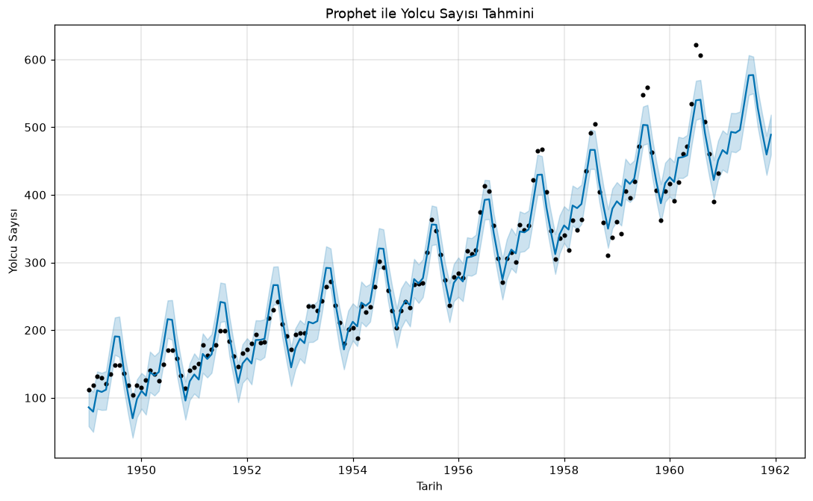

*Şekil 9.4 — `m.plot(forecast)` çıktısı: Siyah noktalar gerçek değerler, koyu mavi çizgi modelin tahmini (`yhat`), açık mavi bant %80'lik belirsizlik aralığıdır. 1961 yılı tahmin dönemidir.*

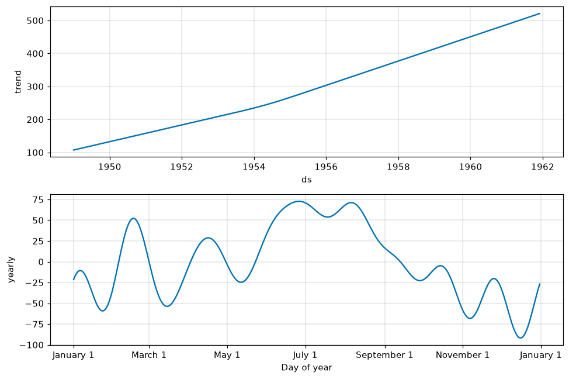

*Şekil 9.5 — `m.plot_components(forecast)` çıktısı: Üstte trend, altta yıllık mevsimsellik bileşeni. Aylık veride alt paneldeki eğrinin yalnızca ay başlarındaki değerleri anlamlıdır.*

#### 9.2.1. Çıktının Yorumlanması

`forecast` veri çerçevesi, `future` içindeki **her tarih** için (geçmiş 144 ay + gelecek 12 ay) bir satır içerir. Yani geçmiş dönem için de modelin uydurduğu değerleri verir. `tail(12)` ile yalnızca gelecek 12 ayı (1961) görürüz. Başlıca sütunlar:

| Sütun | Anlamı | Nasıl okunur? |
| --- | --- | --- |
| `ds` | Tahmin edilen tarih | 1961-01-01, 1961-02-01, ... |
| `yhat` | Nokta tahmini; toplamsal modelde $`\hat{y}(t) = g(t) + s(t) + h(t)`$ | "Bu ay için en olası yolcu sayısı" |
| `yhat_lower` | Belirsizlik aralığının alt sınırı | Gerçek değerin büyük olasılıkla bu değerin üstünde kalması beklenir |
| `yhat_upper` | Belirsizlik aralığının üst sınırı | Gerçek değerin büyük olasılıkla bu değerin altında kalması beklenir |
| `trend`, `yearly` | Bileşenlerin tek tek katkısı | Toplamsal modelde `yhat` = `trend` + `yearly` (tatil eklenmişse onun da katkısı) |

> **Simge notu:** $`\hat{y}`$ *(y şapka)*: modelin tahmin ettiği değer

Örneğin Ocak 1961 satırı şöyle okunur: Model 1961 Ocak'ında yaklaşık 466 bin yolcu bekliyor ve gerçek değerin 437 ile 495 bin arasında kalacağını %80 olasılıkla öngörüyor. Temmuz ve Ağustos (yaklaşık 577) yılın en yüksek, Kasım (yaklaşık 460) ve Şubat (yaklaşık 461) en düşük ayları olarak tahmin edilmiştir.

Yorumlarken şunlara dikkat edin:

- **Aralığın düzeyi:** Prophet'ın belirsizlik aralığı varsayılan olarak **%80**'dir (`interval_width=0.8`), %95 değil. Bu, model doğruysa gerçek değerlerin yaklaşık 10'da 8'inin bandın içine düşmesi gerektiği anlamına gelir. Nitekim geçmiş 144 aydan 27'si (yaklaşık %19) bandın dışında kalır. %95'lik aralık için modeli `Prophet(interval_width=0.95)` ile kurun; bant genişler.
- **Aralığın genişliği:** Bandın iki kaynağı vardır: gözlemlerin modelin çevresindeki olağan dağınıklığı (gürültü) ve trendin gelecekte değişebilme ihtimali. İkincisi ufuk uzadıkça büyür, çünkü Prophet geçmişte gördüğü değişim noktası sıklığına ve büyüklüğüne bakarak gelecekte de benzer eğim değişimleri olabileceğini simüle eder (Şekil 9.2'deki genişleyen bant). Burada ise 12 aylık kısa ufukta gürültü baskındır: `yhat_upper - yhat_lower` farkı Ocak 1961'de yaklaşık 58, Aralık 1961'de yaklaşık 59'dur; genişleme ancak çok yıllık ufuklarda belirginleşir.
- **Toplamsal modelin zayıflığı:** Varsayılan toplamsal modelde mevsimsel genlik sabittir; model bütün yıllara aynı boyda bir dalga uydurur. `AirPassengers`'ta ise dalgalar zamanla büyür. Sonuç Şekil 9.4'te açıkça görülür: İlk yıllarda model dalgayı abartır (Temmuz 1949'da tahmin yaklaşık 191, gerçek 148), son yıllarda ise yetersiz kalır (Temmuz 1960'ta gerçek değer 622, tahminin yaklaşık 80 üzerinde). Bandın dışına taşan siyah noktaların ilk ve son yıllarda toplanması bundandır. Bu yüzden model 1961 yazının tepesini olduğundan **düşük**, kış çukurunu olduğundan **yüksek** tahmin etme eğilimindedir.
- **Bileşen grafiği (Şekil 9.5):** *Trend* paneli, yolcu sayısının 1949'da yaklaşık 107 binden 1960 sonunda yaklaşık 484 bine neredeyse doğrusal arttığını gösterir; eğim 1954 civarında, 9.1.1'de sözünü ettiğimiz değişim noktalarında hafifçe dikleşir. *Yearly* paneli yılın günlerine göre mevsimsel etkiyi gösterir. Ay başlarındaki değerlere bakıldığında Temmuz (yaklaşık +71) ve Ağustos (yaklaşık +69) en yüksek, Kasım (yaklaşık −60) en düşük, Şubat, Aralık ve Ocak da (yaklaşık −35, −33, −25) ortalamanın altındadır. Bu sıralama, Bölüm 2.6'daki ayrıştırmada elde ettiğimiz mevsimsel katsayılarla tutarlıdır.
- **Ay aralarındaki kıvrımlar:** Yearly panelindeki eğri ay başları arasında da inip çıkar (ör. Mart başına doğru +50'ye yükselen bir tepe, Aralık ortasında −90'a inen bir çukur). Bunlar gerçek değildir: Aylık veride yalnızca her ayın 1'inde gözlem vardır ve 10 Fourier çiftiyle ($N = 10$, yani 20 katsayı) kurulan esnek eğri, gözlem olmayan günlerde serbestçe kıvrılabilir. Aylık veride bu panelin yalnızca ay başı değerlerini okuyun. Daha düzgün bir eğri isterseniz `Prophet(yearly_seasonality=5)` gibi bir tam sayı vererek Fourier terimi sayısını azaltabilirsiniz.

---

### 9.3. Test Setiyle Değerlendirme

Yukarıdaki tahminin ne kadar iyi olduğunu bilemeyiz, çünkü 1961 için gerçek değerler elimizde yok. Bölüm 8'deki ilkeyi uygulayalım: Son 12 ayı (1960) **test seti** olarak ayıralım, modeli yalnızca 1949–1959 verisiyle eğitelim ve tahminleri gerçek değerlerle karşılaştıralım. Bölüm 8.3'teki SARIMA uygulamasında da 1960 yılını test seti olarak kullandığımız için sonuçlar doğrudan karşılaştırılabilir.

Aşağıda hem toplamsal hem çarpımsal modeli kuruyor ve Bölüm 8'deki MAE, RMSE ve MAPE metrikleriyle ölçüyoruz.

```python
import numpy as np
import pandas as pd
from prophet import Prophet
from sklearn.metrics import mean_absolute_error, mean_squared_error

df = pd.read_csv('data/AirPassengers.csv')
df.columns = ['ds', 'y']
df['ds'] = pd.to_datetime(df['ds'])

# Zamansal ayrım: son 12 ay (1960) test seti. Veri KARIŞTIRILMAZ.
train = df.iloc[:-12]
test = df.iloc[-12:]

sonuclar = {}
for mod in ['additive', 'multiplicative']:
    model = Prophet(seasonality_mode=mod,
                    yearly_seasonality=True,
                    weekly_seasonality=False,
                    daily_seasonality=False)
    model.fit(train)  # Model test dönemini hiç görmez

    # Eğitim verisinin sonundan itibaren 12 ay ileriye tahmin
    future = model.make_future_dataframe(periods=12, freq='MS')
    forecast = model.predict(future)
    tahmin = forecast['yhat'].iloc[-12:].values

    gercek = test['y'].values
    mae = mean_absolute_error(gercek, tahmin)
    rmse = np.sqrt(mean_squared_error(gercek, tahmin))
    mape = np.mean(np.abs((gercek - tahmin) / gercek)) * 100
    sonuclar[mod] = {'MAE': mae, 'RMSE': rmse, 'MAPE (%)': mape}

# İki modelin metriklerini tablo hâlinde yazdıralım
print(pd.DataFrame(sonuclar).T.round(2))
```

Çıktı:

```text
                  MAE   RMSE  MAPE (%)
additive        33.43  43.05      6.61
multiplicative  21.87  25.83      4.44
```

Kodun önemli noktaları şunlardır:

1. `df.iloc[:-12]` ve `df.iloc[-12:]`: `.iloc` satırları **sırasına göre** seçer. `:-12` "baştan son 12 satıra kadar" (1949–1959, 132 ay), `-12:` "son 12 satır" (1960) demektir. Kesim sıraya göre yapıldığı için test seti kesin olarak eğitim setinden sonra gelir.
2. `for mod in ['additive', 'multiplicative']:` döngüsü, girintili bloğu iki kez çalıştırır: önce `mod = 'additive'` (toplamsal), sonra `mod = 'multiplicative'` (çarpımsal). Böylece aynı kodla iki model kurulur ve tek fark `seasonality_mode=mod` argümanıdır (9.1.4).
3. `model.fit(train)` yalnızca eğitim verisini kullanır. `make_future_dataframe(periods=12, freq='MS')` eğitim verisinin son tarihinden (Aralık 1959) sonra 12 ay ekler; bu 12 ay tam olarak test yılı olan 1960'tır.
4. `forecast['yhat'].iloc[-12:].values`: Tahmin tablosu 132 geçmiş + 12 gelecek satır içerir; son 12 satır test dönemidir. `.values` tarih indeksini atıp düz bir NumPy dizisi verir; `test['y'].values` da aynı biçimdedir, böylece iki dizi sıralarına göre karşılaştırılır.
5. Metrik satırları Bölüm 8.4'teki `evaluate_model()` fonksiyonunun içindekilerle aynıdır. Sonuçlar `sonuclar[mod] = {...}` ile bir sözlükte toplanır; `pd.DataFrame(sonuclar).T` her modeli bir satıra, her metriği bir sütuna yerleştirir.

**Çıktının yorumu:** Tabloda her satır bir modeli, her sütun bir metriği gösterir; üç metrikte de **küçük değer daha iyidir**. Beklendiği gibi çarpımsal model üç metrikte de belirgin biçimde daha iyidir: MAE 33.43'ten 21.87'ye, RMSE 43.05'ten 25.83'e iner. Nedeni 1960 yazıdır. Toplamsal model, bütün yılların ortalaması olan sabit boyda bir dalga kullandığı için Temmuz 1960'ı yaklaşık 524 bin olarak tahmin eder; gerçek değer 622'dir (yaklaşık 98 bin eksik). Dalga genliği seviyeyle büyüyen çarpımsal model aynı ay için yaklaşık 569 bin tahmin ederek farkı yarıya indirir (Şekil 9.6). Sonuçları yorumlarken Bölüm 8'deki sorular burada da geçerlidir:

- **RMSE, MAE'den çok büyük mü?** Toplamsal modelde RMSE (43.05), MAE'nin (33.43) belirgin biçimde üstündedir: Hata birkaç ayda, özellikle yaz tepesinde yoğunlaşmıştır. Çarpımsal modelde iki değer birbirine daha yakındır (25.83 ve 21.87); hatalar daha dengeli dağılmıştır.
- **MAPE kaç?** Çarpımsal model 1960'ı ortalama %4.4 hatayla tahmin etmiştir; 8.4.3'teki kaba eşiklere göre "iyi" sayılır.
- **Naive referansı yeniyor mu?** Bölüm 8.3'te aynı test yılı için mevsimsel naive yöntemin MAE'si 47.83, RMSE'si 50.71 idi. İki Prophet modeli de bu referansı yener.
- **SARIMA ile karşılaştırma:** Aynı test yılında log dönüşümlü SARIMA modeli MAE = 13.26, RMSE = 18.59, MAPE = %2.90 vermişti (Bölüm 8.3). Yani bu seride SARIMA, en iyi Prophet modelinden de belirgin biçimde daha iyidir. Bu şaşırtıcı değildir: `AirPassengers` düzenli, tek mevsimli, tatil etkisi olmayan kısa bir aylık seridir; Prophet'ın güçlü olduğu günlük veri, çoklu mevsimsellik ve tatil etkileri burada yoktur (bkz. 9.4). Hangi modelin daha iyi olduğu veriye bağlıdır; Prophet'ın her zaman kazanacağını varsaymayın.

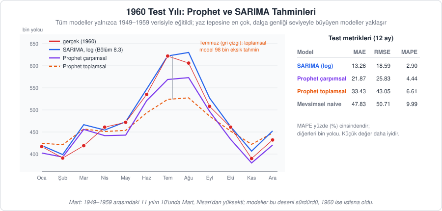

*Şekil 9.6 — 1960 test yılı: Gerçek değerler, Bölüm 8.3'teki log dönüşümlü SARIMA modeli ve iki Prophet modelinin tahminleri. Toplamsal Prophet yaz tepesini en çok kaçıran modeldir; Mart ayında ise modellerin hepsi gerçeğin üstünde kalır.*

Bölüm 8'deki `evaluate_model()` fonksiyonunu tanımladıysanız, metrik satırlarının yerine `evaluate_model(test['y'], tahmin, f"Prophet ({mod})")` çağrısını da kullanabilirsiniz.

**Not —** 9.1.4'teki diğer yolu, yani seriyi `np.log()` ile dönüştürüp toplamsal model kurmayı ve tahminleri `np.exp()` ile geri çevirmeyi de denedik: Aynı test yılında MAE = 23.52, RMSE = 29.46, MAPE = %4.70 elde edildi. Bu, çarpımsal modele çok yakın bir sonuçtur; iki yol da aynı sorunu (seviyeyle büyüyen dalgalar) çözer.

**Not —** Tek bir test yılı, şansa bağlı iyi ya da kötü bir sonuç verebilir. Daha güvenilir bir değerlendirme için test penceresini zaman içinde kaydırarak birden çok kez ölçmek gerekir. Prophet bunun için `prophet.diagnostics` modülünde `cross_validation()` ve `performance_metrics()` fonksiyonlarını sunar. Bu yaklaşımın genel mantığı Bölüm 16'da (TimeSeriesSplit) ele alınmaktadır.

---

### 9.4. Güçlü ve Zayıf Yönler

| Güçlü yönler | Zayıf yönler |
| --- | --- |
| Durağanlık varsayımı yok; fark alma ve derece seçimi gerekmez | Serinin kendi geçmiş değerlerini (gecikmeleri) doğrudan kullanmaz; kısa vadeli otokorelasyonu ARIMA kadar iyi yakalayamaz |
| Bileşenler (trend, mevsimsellik, tatil) ayrı ayrı çizilip yorumlanabilir | Trendi son eğimle doğrusal uzattığı için uzun vadeli tahminlerde yanılabilir |
| Birden çok mevsimsellik (yıllık, haftalık, günlük) ve tatil etkileri kolayca eklenir | Kısa serilerde (birkaç yıllık veri) mevsimselliği güvenilir öğrenemez |
| Eksik gözlemlere, düzensiz aralıklara ve aykırı değerlere karşı dayanıklıdır | Varsayılan ayarlar her seri için uygun değildir; `changepoint_prior_scale`, `seasonality_mode` gibi parametreler dikkatle seçilmelidir |
| Belirsizlik aralığını otomatik üretir; alan bilgisi (üst sınır, özel günler) modele kolayca aktarılır | Belirgin mevsimsellik ya da trend içermeyen, gürültülü serilerde basit yöntemlerden daha iyi olmayabilir |

**Ne zaman tercih edilmeli?** Prophet özellikle günlük ya da haftalık iş verilerinde (satış, web trafiği, talep) parlar: Bu serilerde birden çok mevsimsellik, tatil etkileri ve zaman zaman yön değiştiren bir trend bir arada bulunur. Kısa vadeli dinamiklerin baskın olduğu ya da değişkenler arası etkileşimin önemli olduğu durumlarda ARIMA/SARIMA (Bölüm 7), VAR (Bölüm 10) veya makine öğrenmesi yaklaşımları (Bölüm 12–15) daha uygun olabilir. `AirPassengers` örneği bunu somut olarak gösterdi: Bu düzenli aylık seride log dönüşümlü SARIMA, Prophet'tan daha küçük hata verdi. Hangi model seçilirse seçilsin, Bölüm 8'deki gibi basit bir referans modelle (naive) karşılaştırmak unutulmamalıdır.

---

<a id="bolum-10"></a>

## 10. VAR: Çok Değişkenli Zaman Serisi Modeli

Bölüm 7'de gördüğümüz ARIMA gibi tek değişkenli modeller her seriyi **tek başına** ele alır: bir serinin geleceğini yalnızca kendi geçmişinden tahmin ederiz. Oysa Bölüm 3.1'de tanıttığımız **çok değişkenli** serilerde değişkenlerin birbirini etkilemesi çoğu zaman asıl ilgilendiğimiz konudur:

*   Enflasyon ↔ faiz oranı
*   Döviz kuru ↔ faiz ↔ sanayi üretimi
*   Elektrik talebi ↔ sıcaklık ↔ fiyat

Bu durumda ihtiyaç duyduğumuz şey, yalnızca "kendi geçmişine bakarak kendini tahmin eden" bir model değil, **tüm serilerin geçmişine birlikte bakarak** hepsini aynı anda tahmin eden bir yapıdır. **VAR (Vector Autoregression, vektör otoregresyon)** tam olarak bunu yapar. Adından da anlaşılacağı gibi VAR, Bölüm 7.1.1'deki AR modelinin çok değişkenli (vektör) genellemesidir.

Bu bölümde önce modelin tanımını ve varsayımlarını, ardından VAR'a özgü yorum araçlarını (Granger nedenselliği, etki-tepki fonksiyonu, varyans ayrıştırması) ele alacak, son olarak Python ile uçtan uca bir uygulama yapacağız. Aynı modelin Gretl'de menüler ve betik ile nasıl kurulacağı Bölüm 11'de anlatılmaktadır.

Bu bölüm dersin matematik açısından en yoğun bölümüdür. VAR'ı anlatmak için **vektör**, **matris**, **determinant** ve **öz değer** kavramlarına ihtiyaç duyacağız. Bunların hiçbirini bildiğinizi varsaymıyoruz: her birini ilk kullandığımız yerde sıfırdan, iki değişkenli küçük bir örnek üzerinde ve elle yapılan hesaplarla kuracağız.

---

### 10.1. AR'dan VAR'a: Temel Fikir

**Açıklama:** Bölüm 7.1.1'deki AR(p) modelinde bir serinin bugünkü değeri, kendi $p$ gecikmesinin doğrusal bir fonksiyonudur:

$$
y_t = c + \phi_1 y_{t-1} + \phi_2 y_{t-2} + \dots + \phi_p y_{t-p} + \varepsilon_t
$$

> **Simge notu:** $`y_t`$ *(y t)*: serinin $`t`$ dönemindeki değeri; alt indis (sağ alttaki küçük yazı) zamanı gösterir · $`y_{t-1}`$: bir önceki dönemin değeri, $`y_{t-2}`$: iki önceki dönemin değeri · $`c`$: sabit terim · $`\phi_i`$ *(fi; π "pi" ile karıştırmayın)*: $`i`$. gecikmenin katsayısı · $`p`$: modelin kaç dönem geriye baktığı · $`\varepsilon_t`$ *(epsilon; küme işareti ∈ değildir)*: $`t`$ dönemindeki beklenmedik şok (beyaz gürültü hata terimi) · $`\dots`$ *(üç nokta)*: aradaki terimler

VAR'da ise her değişken için ayrı bir denklem yazılır ve her denklemde **hem kendi gecikmeleri hem de diğer değişkenlerin gecikmeleri** yer alır. İki değişkenli (enflasyon ve faiz) en basit örnek olan VAR(1) modelini düşünelim:

*   $y_{1,t}$: Enflasyon
*   $y_{2,t}$: Faiz oranı

```math
\begin{aligned}
y_{1,t} &= c_1 + a_{11} y_{1,t-1} + a_{12} y_{2,t-1} + u_{1,t} \\
y_{2,t} &= c_2 + a_{21} y_{1,t-1} + a_{22} y_{2,t-1} + u_{2,t}
\end{aligned}
```

Bu yazımda alt indisler iki bilgi taşır. $y_{2,t-1}$ ifadesinde virgülden önceki sayı **hangi değişken** olduğunu (1 = enflasyon, 2 = faiz), virgülden sonraki kısım **hangi dönem** olduğunu söyler; yani $y_{2,t-1}$ "faizin bir önceki dönemdeki değeri" diye okunur. Katsayılarda da iki sayı vardır: $a_{12}$ ("a bir iki" diye okunur) birinci denklemdeki (enflasyon denklemi) ikinci değişkenin (faiz) katsayısıdır. Akılda tutmak için: **ilk sayı etkilenen, ikinci sayı etkileyen** değişkendir.

Her denklemde:

*   **Kendi gecikmesi** yer alır (ör. $y_{1,t-1}$ → $y_{1,t}$, katsayı $a_{11}$). Yalnız bu terim olsaydı, elimizde sıradan bir AR(1) modeli olurdu.
*   **Diğer değişkenin gecikmesi** yer alır (ör. $y_{2,t-1}$ → $y_{1,t}$, katsayı $a_{12}$). VAR'ı AR'dan ayıran kısım bu **çapraz etkilerdir**: $a_{12} \neq 0$ ise geçmiş faiz bugünkü enflasyonu etkiliyor demektir.

> **Simge notu:** $`c_1, c_2`$: iki denklemin sabit terimleri · $`a_{ij}`$: $`i`$. denklemde $`j`$. değişkenin gecikmesinin katsayısı · $`u_{i,t}`$ *(u)*: $`i`$. denklemin $`t`$ dönemindeki şoku; AR'daki $`\varepsilon_t`$ ile aynı rolü oynar, VAR'da geleneksel olarak u harfi kullanılır · $`\neq`$ *(eşit değil)*

**Sayısal örnek:** Katsayılar $c_1 = 1$, $c_2 = 0.5$, $a_{11} = 0.5$, $a_{12} = 0.2$, $a_{21} = 0.1$, $a_{22} = 0.4$ olsun. Geçen ay enflasyon 10, faiz 8 idi. Bu ayın şoklarını önceden bilemeyiz; ortalamaları sıfır olduğu için tahmin yaparken onları 0 alırız. Bu ay için tahminler:

```math
\begin{aligned}
\text{Enflasyon} &= 1 + 0.5 \cdot 10 + 0.2 \cdot 8 = 1 + 5 + 1.6 = 7.6 \\
\text{Faiz} &= 0.5 + 0.1 \cdot 10 + 0.4 \cdot 8 = 0.5 + 1 + 3.2 = 4.7
\end{aligned}
```

Enflasyon tahmininin 1.6 puanı faizden gelir ($a_{12} = 0.2$ çarpı geçen ayın faizi 8). Tek değişkenli bir AR(1) modelinde bu parça hiç olmazdı. (Sayılar yalnızca hesabı göstermek için seçildi; ekonomik bir iddia taşımaz. Aynı katsayıları bölüm boyunca kullanacağız.)

#### 10.1.1. Matris Biçimi

Denklemleri tek tek yazmak değişken sayısı arttıkça zahmetli hâle gelir: 5 değişkenli bir VAR(1)'de 5 denklem ve 25 katsayı vardır. Bu yüzden VAR **vektör** ve **matris** adı verilen iki araçla kısaca yazılır. İkisini sıfırdan kuralım.

**Vektör:** Alt alta yazılmış bir sayı listesidir. Bir dönemdeki tüm değişkenleri tek bir "paket" hâline getirir. Geçen ayın durumu (üst satır enflasyon, alt satır faiz):

```math
\mathbf{y}_{t-1} = \begin{bmatrix} 10 \\ 8 \end{bmatrix}
```

Vektörleri sıradan sayılardan ayırmak için **kalın** harfle yazarız ($\mathbf{y}$). VAR'daki "V" harfi buradan gelir: model tek bir sayıyı değil, bir sayı listesini (vektörü) tahmin eder.

**Matris:** Satırlar ve sütunlardan oluşan bir sayı tablosudur. VAR(1)'in dört katsayısını şöyle bir tabloya dizeriz: her **satır** bir denklemi (etkilenen değişkeni), her **sütun** bir açıklayıcı değişkeni (etkileyen değişkeni) temsil eder.

```math
A_1 =
\begin{bmatrix}
a_{11} & a_{12} \\
a_{21} & a_{22}
\end{bmatrix}
=
\begin{bmatrix}
0.5 & 0.2 \\
0.1 & 0.4
\end{bmatrix}
```

Bu, 2 satır ve 2 sütunu olduğu için "2 × 2" (iki çarpı iki) boyutlu bir matristir. $a_{ij}$ katsayısı $i$. satır ile $j$. sütunun kesiştiği hücrededir; örneğin $a_{12} = 0.2$, 1. satır 2. sütundadır.

**Matrisi vektörle çarpmak:** Kural şudur: matrisin **her satırını** vektörle eşleştir, karşılıklı elemanları çarp ve topla. Her satır sonuç vektörünün bir elemanını verir:

```math
A_1 \mathbf{y}_{t-1} =
\begin{bmatrix} 0.5 & 0.2 \\ 0.1 & 0.4 \end{bmatrix}
\begin{bmatrix} 10 \\ 8 \end{bmatrix}
=
\begin{bmatrix} 0.5 \cdot 10 + 0.2 \cdot 8 \\ 0.1 \cdot 10 + 0.4 \cdot 8 \end{bmatrix}
=
\begin{bmatrix} 5 + 1.6 \\ 1 + 3.2 \end{bmatrix}
=
\begin{bmatrix} 6.6 \\ 4.2 \end{bmatrix}
```

1. satır (0.5, 0.2) vektörün elemanlarıyla (10, 8) çarpılıp toplanır: $0.5 \cdot 10 + 0.2 \cdot 8 = 6.6$. 2. satır (0.1, 0.4) için: $0.1 \cdot 10 + 0.4 \cdot 8 = 4.2$. Sonuç yine iki elemanlı bir vektördür. Çarpımın yapılabilmesi için matrisin sütun sayısı vektörün eleman sayısına eşit olmalıdır (burada ikisi de 2).

**Vektörleri toplamak** daha da kolaydır: aynı sıradaki elemanlar toplanır. Sabitler vektörü $\mathbf{c}$ ile yukarıdaki sonucu toplarsak:

```math
\mathbf{c} + A_1 \mathbf{y}_{t-1} =
\begin{bmatrix} 1 \\ 0.5 \end{bmatrix} + \begin{bmatrix} 6.6 \\ 4.2 \end{bmatrix}
=
\begin{bmatrix} 7.6 \\ 4.7 \end{bmatrix}
```

Bu, 10.1'deki sayısal örnekte iki denklemi ayrı ayrı çözerek bulduğumuz tahminlerin (7.6 ve 4.7) aynısıdır. Hesabı Python ile de kontrol edebiliriz:

```python
import numpy as np

A1 = np.array([[0.5, 0.2],     # 1. satır: enflasyon denklemi
               [0.1, 0.4]])    # 2. satır: faiz denklemi
c = np.array([1.0, 0.5])       # sabitler
y_onceki = np.array([10, 8])   # geçen ay: [enflasyon, faiz]

print(A1 @ y_onceki)           # matris × vektör
#> [6.6 4.2]
print(c + A1 @ y_onceki)       # sabit + matris × vektör
#> [7.6 4.7]
```

`import numpy as np` satırı sayısal hesap kütüphanesi NumPy'ı `np` kısa adıyla yükler. `np.array([[0.5, 0.2], [0.1, 0.4]])` iç içe bir listeden matris oluşturur: her iç liste bir satırdır, bu yüzden sonuç 2 × 2'lik bir tablodur. Tek katlı liste (`[1.0, 0.5]`) ise bir vektördür. `@` işareti matris çarpımı yapar; yukarıda elle yaptığımız "satırla çarp ve topla" işlemini yürütür. (Sıradan `*` işareti elemanları tek tek çarpardı; o başka bir işlemdir.) NumPy vektörleri ekrana yan yana yazar, ama biz onları alt alta (sütun olarak) düşünüyoruz.

Şimdi aynı çarpımı sayılar yerine harflerle yapalım:

```math
A_1 \mathbf{y}_{t-1} =
\begin{bmatrix} a_{11} & a_{12} \\ a_{21} & a_{22} \end{bmatrix}
\begin{bmatrix} y_{1,t-1} \\ y_{2,t-1} \end{bmatrix}
=
\begin{bmatrix} a_{11} y_{1,t-1} + a_{12} y_{2,t-1} \\ a_{21} y_{1,t-1} + a_{22} y_{2,t-1} \end{bmatrix}
```

Sonuç vektörünün iki satırı, 10.1'deki iki denklemin sağ tarafındaki gecikme terimlerinin ta kendisidir. Bugünkü değerleri, sabitleri ve şokları da vektör olarak yazalım:

```math
\mathbf{y}_t =
\begin{bmatrix}
y_{1,t} \\
y_{2,t}
\end{bmatrix},
\quad
\mathbf{c} =
\begin{bmatrix}
c_1 \\
c_2
\end{bmatrix},
\quad
A_1 =
\begin{bmatrix}
a_{11} & a_{12} \\
a_{21} & a_{22}
\end{bmatrix},
\quad
\mathbf{u}_t =
\begin{bmatrix}
u_{1,t} \\
u_{2,t}
\end{bmatrix}
```

Bu gösterimle iki denklem tek satıra iner:

$$
\mathbf{y}_t = \mathbf{c} + A_1 \mathbf{y}_{t-1} + \mathbf{u}_t
$$

Bu satırı açık hâliyle yazıp satır satır okursak, 10.1'deki iki denklemi aynen geri elde ederiz:

```math
\begin{bmatrix} y_{1,t} \\ y_{2,t} \end{bmatrix}
=
\begin{bmatrix} c_1 \\ c_2 \end{bmatrix}
+
\begin{bmatrix} a_{11} & a_{12} \\ a_{21} & a_{22} \end{bmatrix}
\begin{bmatrix} y_{1,t-1} \\ y_{2,t-1} \end{bmatrix}
+
\begin{bmatrix} u_{1,t} \\ u_{2,t} \end{bmatrix}
```

Yani matris biçimi yeni bir model değildir; aynı iki denklemin kısaltılmış yazımıdır. Avantajı, 3, 5 ya da 10 değişkenli modellerde de aynı tek satırın kullanılabilmesidir.

**Tanım (VAR(p) modeli):** $k$ değişkenli bir VAR(p) modeli şöyle yazılır:

```math
\underbrace{\begin{bmatrix} y_{1,t} \\ \vdots \\ y_{k,t} \end{bmatrix}}_{\mathbf{y}_t}
= \mathbf{c} + A_1 \mathbf{y}_{t-1} + A_2 \mathbf{y}_{t-2} + \dots + A_p \mathbf{y}_{t-p} + \mathbf{u}_t,
\qquad
\mathrm{E}[\mathbf{u}_t] = \mathbf{0},
\quad
\mathrm{Cov}(\mathbf{u}_t) = \Sigma_u
```

Burada:

*   $\mathbf{y}_t$: Tüm değişkenleri aynı anda içeren $k \times 1$ boyutlu vektör ($k$ satır, 1 sütun; $k$ değişken sayısıdır)
*   $\mathbf{c}$: Sabit terimler vektörü
*   $A_i$: $i$. gecikmeye ait $k \times k$ katsayı matrisi. $A_1$ bir önceki dönemin değerlerini, $A_2$ iki önceki dönemin değerlerini çarpar; VAR(1)'den farkı yalnızca bu ek terimlerdir.
*   $\mathbf{u}_t$: Hata (şok) vektörü. $\mathrm{E}[\mathbf{u}_t] = \mathbf{0}$ "şokların ortalaması sıfırdır" demektir: bazen yukarı, bazen aşağı yönlü gelirler ama sistematik bir yönleri yoktur. Şoklar **zaman içinde ilişkisizdir**: bu ayın şoku, gelecek ayın şoku hakkında bilgi vermez. Ama **aynı dönemdeki** şoklar birbiriyle ilişkili olabilir; örneğin döviz kurunda beklenmedik bir sıçrama olduğu ay faizde de beklenmedik bir artış görülebilir. Bu eşanlı ilişkiyi $\Sigma_u$ tablosu taşır.

$\Sigma_u$ bir **varyans-kovaryans matrisidir**. İki değişkenli modelde 2 × 2'lik bir tablodur: sol üstten sağ alta inen köşegende her şokun **varyansı** (şokun tipik olarak ne kadar büyük olduğu; karekökü standart sapmadır) yer alır, köşegen dışındaki hücrelerde ise iki şokun **kovaryansı** (aynı ay birlikte aynı yönde gelme eğilimi) bulunur. Kovaryans 0 ise iki şok birbirinden bağımsız gelir.

> **Simge notu:** $`\mathbf{y}_t`$ *(kalın y)*: değişkenler vektörü · $`A_i`$: katsayı matrisi · $`\mathrm{E}[\cdot]`$ *(beklenen değer)*: kuramsal ortalama · $`\mathrm{Cov}(\cdot)`$ *(kovaryans)*: varyans-kovaryans matrisi · $`\Sigma_u`$ *(büyük sigma u)*: hata terimlerinin varyans-kovaryans matrisi. Dikkat: burada $`\Sigma`$ bir tablonun **adıdır**, toplam sembolü değildir (toplam anlamındaki $`\sum`$ Bölüm 10.6'da gelecek) · $`\times`$ *(çarpı)*: matris boyutu (satır × sütun) · $`\vdots`$ *(dikey üç nokta)*: aradaki satırlar · $`\mathbf{0}`$: tüm elemanları sıfır olan vektör

**Not —** $k = 1$ alındığında $\mathbf{y}_t$ tek bir sayıya, $A_i$ matrisleri de tek birer katsayıya ($\phi_i$) iner ve VAR(p), Bölüm 7.1.1'deki AR(p) modelinin ta kendisi olur.

**Parametre sayısı:** Her denklemde $1 + kp$ katsayı (sabit + $k$ değişkenin $p$ gecikmesi) vardır; toplamda $k(1 + kp)$ parametre tahmin edilir. Örneğin 3 değişkenli bir VAR(4) modelinde her denklemde $1 + 3 \cdot 4 = 13$, toplamda $3 \cdot 13 = 39$ parametre vardır. Parametre sayısı $p$ ile hızla büyüdüğü için gecikme seçimi (Bölüm 10.4) VAR'da özellikle önemlidir.

**Tahmin:** Her denklemin sağ tarafında aynı açıklayıcı değişkenler (tüm değişkenlerin aynı gecikmeleri) bulunduğundan, VAR denklem denklem sıradan **en küçük kareler** (OLS, *ordinary least squares*) yöntemiyle tahmin edilebilir; bu, sistemi birlikte tahmin etmekle aynı sonucu verir. OLS, katsayıları "modelin hatalarının karelerinin toplamı en küçük olacak" biçimde seçen standart regresyon yöntemidir.

---

### 10.2. VAR'ı Görselleştirmek: Değişkenler Arası Etkileşim

Modelin denklemleri, değişkenler arasındaki bir etkileşim ağını tarif eder. İki değişkenli bir VAR(1) modelinde, bir önceki dönemdeki ($t-1$) her değişken, bugünkü ($t$) her değişkeni etkileyebilir:


*Şekil 10.1 — İki değişkenli VAR(1): $`t-1`$ dönemindeki enflasyon ve faiz, $`t`$ dönemindeki her iki değişkeni de $`A_1`$ matrisinin katsayıları aracılığıyla etkiler; aynı yapı her dönem tekrarlanır.*

Şekli şöyle okuyabiliriz:

*   `Enflasyon(t-1)` hem `Enflasyon(t)` hem de `Faiz(t)` üzerinde etkili olabilir. Bu etkilerin gücünü $a_{11}$ ve $a_{21}$ katsayıları belirler. Bunlar $A_1$ matrisinin **1. sütunudur**: bir sütun, o değişkenin "gönderdiği" etkileri toplar.
*   Benzer şekilde `Faiz(t-1)`, her iki güncel değişkeni $a_{12}$ ve $a_{22}$ katsayıları (2. sütun) aracılığıyla etkiler.
*   Bu etkileşim her zaman adımında aynı $A_1$ matrisiyle tekrarlanır: bir dönemin çıktıları bir sonraki dönemin girdileri olur. Bir şokun sistemde nasıl yayıldığını (Bölüm 10.7) bu zincir belirler.

Kısacası "geçmiş enflasyon" ve "geçmiş faiz" bilgileri, hem bugünkü enflasyonu hem de bugünkü faizi tahmin etmek için birlikte kullanılır.

---

### 10.3. VAR Kurmadan Önce: Veri Hazırlığı

VAR modeli tahmin etmeden önce birkaç kritik noktayı gözden geçirmek gerekir. Bu adımları atlamak, sonradan "nerede hata yaptım?" sorusuyla uğraşmak demektir.

#### 10.3.1. Aynı Frekansta Veri

Tüm serilerin aynı zaman aralığında ölçülmüş olması gerekir: bir seri aylık, diğeri üç aylık, bir diğeri yıllık olamaz. Bir değişken her ay değişirken diğeri yılda bir kez güncelleniyorsa, ikisini aynı modele koymak farklı hızlarda koşan iki kişiyi aynı yarışta değerlendirmeye benzer.

Frekans uyumsuzluğu varsa ya yüksek frekanslı veri toplulaştırılır (ör. aylık veri üç aylık ortalamalara dönüştürülür) ya da düşük frekanslı veri interpolasyonla daha sık gözleme çevrilir. İnterpolasyon yapay bilgi eklediği için dikkatli kullanılmalıdır.

#### 10.3.2. Ortak Örnek Aralığı (Sample)

Bir seri 1990'dan, diğeri 1995'ten başlıyor; biri 2020'de, diğeri 2023'te bitiyor olabilir. VAR tahmini için tüm değişkenlerin aynı dönemde gözlenmiş olması gerekir. Bu nedenle **ortak kesişim aralığı**, yani tüm serilerin birlikte mevcut olduğu en geniş zaman penceresi kullanılır (bu örnekte 1995–2020). Bu pencerenin dışındaki gözlemler analize alınmaz; veri kaybı olsa da tutarlılık sağlanır.

#### 10.3.3. Durağanlık Kontrolü

VAR'ın yakaladığı dinamik ilişkilerin anlamlı olabilmesi için serilerin **durağan** olması beklenir. Bölüm 3.2'den hatırlarsak: ortalaması, varyansı ve otokovaryans yapısı zamanla değişmeyen seri durağandır. Sürekli yükselen bir GSYİH serisi, ortalaması sürekli arttığı için durağan değildir. Durağan olmayan serilerle çalışmak, aslında ilişkisiz iki serinin yalnızca ikisi de yükseldiği için ilişkili görünmesine (**sahte regresyon**, *spurious regression*) yol açabilir. Örneğin bir ülkedeki cep telefonu sayısı ile ortalama ömür yıllar içinde birlikte artar; ama biri diğerini açıklamaz, ikisi de zamanla yükselir.

Durağanlık ADF ve KPSS testleriyle sınanır (ayrıntısı Bölüm 3.2 ve 7.5'te):

*   **ADF:** Sıfır hipotezi $H_0$: "seri durağan değildir (birim kök vardır)". p-değeri 0,05'ten küçükse $H_0$ reddedilir ve seri durağan kabul edilir.
*   **KPSS:** Mantık terstir; $H_0$: "seri durağandır".

> **Simge notu:** $`H_0`$ *(H sıfır)*: sıfır (boş) hipotez, yani testin "aksi kanıtlanana kadar doğru kabul ettiği" iddia · **p-değeri**: $`H_0`$ doğru olsaydı, eldeki veri kadar (ya da daha) aykırı bir sonucu tesadüfen görme olasılığı. Küçük p-değeri (ör. 0,01) "bu sonuç $`H_0`$ ile pek bağdaşmıyor" demektir; 0,05 eşiği alışılmış bir sınırdır.

Durağan olmayan serilerde en yaygın çözüm **fark almaktır**:

$$
\Delta y_t = y_t - y_{t-1}
$$

> **Simge notu:** $`\Delta`$ *(büyük delta)*: birinci fark; "bu dönemin değeri eksi bir önceki dönemin değeri", yani bir dönemdeki değişim

Örneğin faiz üç ay boyunca 40, 45, 45 ise fark serisi 5, 0 olur: artık faizin düzeyini değil, her ay ne kadar değiştiğini modelleriz. Birinci fark alındığında çoğu ekonomik seri durağan hâle gelir; ikinci fark nadiren gerekir. Bir kez fark alınınca durağanlaşan seriye **birinci dereceden bütünleşik** denir ve **I(1)** diye yazılır; zaten durağan olan seri I(0)'dır.

**Not —** Seriler aynı mertebeden bütünleşikse (ör. hepsi I(1)) ve aralarında uzun dönemli bir denge ilişkisi (**eşbütünleşme**, *cointegration*) varsa, farkları alınmış bir VAR bu uzun dönem bilgisini kaybeder. Bilinen bir benzetme: tasmalı köpeğiyle yürüyen bir kişinin ve köpeğin yolları ayrı ayrı rastgele görünür, ama aralarındaki mesafe tasmanın boyunu aşamaz. Farkları alınmış VAR yalnızca adımları modeller, "tasmayı" görmez. Bu durumda VAR yerine **VECM** (Vector Error Correction Model) kullanmak daha uygundur. Bu bölümde VAR çerçevesinde kalıyoruz.

---

### 10.4. Gecikme Uzunluğu Seçimi (AIC, BIC, HQ)

VAR(p) modelinde $p$, kaç dönem geriye bakılacağını, yani modelin "hafızasını" belirler:

- **$`p`$ çok küçükse:** Dinamik yapı yeterince yakalanmaz; değişkenler arasındaki gecikmeli etkileşimler gözden kaçar ve artıklarda otokorelasyon kalır.
- **$`p`$ çok büyükse:** Her ek gecikme $`k^2`$ yeni parametre demektir (her denkleme $`k`$ yeni katsayı, $`k`$ denklem; 4 değişkenli bir VAR'da 16). Aşırı parametreleşme tahmin varyansını yükseltir ve öngörü gücünü zayıflatır.

Bu dengeyi kurmak için **bilgi kriterleri** kullanılır. Hepsi aynı felsefeye, **Occam'ın usturasına** dayanır: benzer uyum sağlayan modeller arasında en basiti tercih edilir. Bir terzi benzetmesiyle: çok az ölçü alınarak dikilen ceket üzerinize oturmaz (yetersiz uyum); vücudunuzun o anki her milimetresine göre dikilen ceket ise hareket ettiğiniz anda işe yaramaz (aşırı uyum, *overfitting*). Bilgi kriterleri en makul ceketi bulmaya yardım eder.

**Tanım:** $T$ gözlem sayısı, $\hat{\Sigma}_u(p)$ VAR(p) modelinin tahmin edilen hata kovaryans matrisi olmak üzere:

```math
\begin{aligned}
\mathrm{AIC}(p) &= \ln \lvert \hat{\Sigma}_u(p) \rvert + \frac{2}{T} \, p k^2 \\
\mathrm{BIC}(p) &= \ln \lvert \hat{\Sigma}_u(p) \rvert + \frac{\ln T}{T} \, p k^2 \\
\mathrm{HQ}(p)  &= \ln \lvert \hat{\Sigma}_u(p) \rvert + \frac{2 \ln(\ln T)}{T} \, p k^2
\end{aligned}
```

> **Simge notu:** $`\hat{\Sigma}_u`$ *(sigma u şapka)*: veriden tahmin edilen hata kovaryans matrisi; şapka (^) "tahmin edilen" demektir · $`\lvert \cdot \rvert`$: **burada mutlak değer değil, determinant** anlamındadır (aşağıda) · $`\ln`$ *(doğal logaritma, "el en")*: büyüdükçe yavaş artan bir fonksiyon; burada yalnızca "küçük değer, küçük sonuç" sırasını korumak için kullanılır

**Determinant nedir?** Bir kare matristen (satır ve sütun sayısı eşit) hesaplanan tek bir sayıdır. 2 × 2'lik bir matris için kural "çapraz çarpımların farkı"dır:

```math
\det \begin{bmatrix} a & b \\ c & d \end{bmatrix} = a \cdot d - b \cdot c
```

Örneğin iki şokun varyansları 4 ve 9, kovaryansları 1 ise $\lvert \Sigma_u \rvert = 4 \cdot 9 - 1 \cdot 1 = 35$ olur. Hata kovaryans matrisinin determinantı, tüm denklemlerin hatalarının **toplam büyüklüğünü** tek sayıyla özetler: hatalar küçüldükçe determinant da küçülür. (Determinantı 10.5'te öz değerleri bulurken yeniden kullanacağız.)

**Açıklama:** Her kriterin ilk terimi **uyumu** ölçer: model veriyi ne kadar iyi açıklarsa hata kovaryansı o kadar küçük, dolayısıyla terim o kadar küçük olur. İkinci terim **karmaşıklığın cezasıdır** ve parametre sayısı $pk^2$ ile büyür. Kriterler yalnızca ceza katsayısında ayrılır. $p = 1, 2, \dots, p_{max}$ için hesaplanır ve **en küçük değeri veren $`p`$ seçilir** (değerler negatif de olabilir; önemli olan hangisinin en küçük olduğudur).

*   **AIC (Akaike):** Ceza katsayısı ($2/T$) görece hafiftir. Gerçek dinamiği kaçırmamak için biraz daha büyük modellere izin verir; öngörü odaklı çalışmalarda sık tercih edilir.
*   **BIC (Bayesci, Schwarz):** Ceza katsayısı ($\ln T / T$), $T \geq 8$ için AIC'ninkinden büyüktür ($\ln 8 \approx 2.08 > 2$) ve gözlem sayısıyla artar. Bu yüzden daha az gecikmeli, **tutumlu** (*parsimonious*) modelleri seçer; temel yapıyı anlamaya çalışırken güvenilir bir rehberdir.
*   **HQ (Hannan-Quinn):** Cezası AIC ile BIC arasındadır; ikisi arasında bir uzlaşma sunar.

> **Simge notu:** $`\geq`$ *(büyük eşit)* · $`p_{max}`$: denenecek en büyük gecikme

| Kriter | Ceza katsayısı | Eğilim | Ne zaman tercih edilir? |
| --- | --- | --- | --- |
| **AIC** (Akaike) | $`2/T`$ | Daha büyük $`p`$ | Öngörü performansı öncelikliyse |
| **BIC** (Bayesci) | $`\ln T / T`$ | Daha küçük $`p`$ | Altta yatan yapıyı, en anlamlı ilişkileri bulmak istiyorsak |
| **HQ** (Hannan-Quinn) | $`2 \ln(\ln T) / T`$ | Arada | İki kriter arasında denge aranıyorsa |

**Sayısal örnek:** Bölüm 10.9'daki veride $k = 3$ değişken vardır ve gecikme seçimi $T = 112$ ortak gözlemle yapılır. Bir gecikme eklemek $k^2 = 9$ yeni parametre demektir. Gecikme başına ceza:

*   AIC: $9 \cdot 2 / 112 \approx 0.16$
*   BIC: $9 \cdot \ln 112 / 112 = 9 \cdot 4.72 / 112 \approx 0.38$
*   HQ: $9 \cdot 2 \ln(4.72) / 112 \approx 0.25$

VAR(2)'den VAR(7)'ye çıkmak (5 ek gecikme) uyum terimini yaklaşık 1.20 azaltır. AIC buna karşılık $5 \cdot 0.16 = 0.80$ ceza keser; net kazanç kalır ve AIC VAR(7)'yi seçer. BIC'nin cezası $5 \cdot 0.38 = 1.90$'dır; kazanç cezayı karşılamaz ve BIC VAR(2)'de kalır. Aynı veriye bakan iki kriterin farklı karar vermesinin nedeni yalnızca ceza katsayısıdır.

Pratikte kriterler farklı gecikme önerebilir. Böyle durumlarda BIC'in önerdiği daha düşük gecikme genellikle güvenli bir başlangıçtır; ancak seçilen modelin artıklarında otokorelasyon kalıp kalmadığı da (Bölüm 10.9'daki artık analizi) mutlaka kontrol edilmelidir. Artıklar otokorelasyonluysa gecikme artırılır. (statsmodels tablosunda bir de **FPE**, *Final Prediction Error*, "nihai tahmin hatası" sütunu görürsünüz; çoğunlukla AIC ile aynı gecikmeyi önerir.)

---

### 10.5. Stabilite Koşulu: Öz Değerler Birim Çemberin İçinde

Model tahmin edildikten sonra yapılması gereken önemli bir kontrol, **modelin stabil olup olmadığıdır**. Bu bölüm, ADF testindeki "birim kök" kavramının (Bölüm 3.2) çok değişkenli karşılığıdır.

**Açıklama:** Stabil bir VAR'da sisteme verilen bir şokun etkisi zamanla söner; sistem eski dengesine döner. Stabil olmayan bir VAR'da ise küçük bir şok bile büyüyerek patlar. En basit durumu, tek değişkenli AR(1) modeli $y_t = \phi y_{t-1} + \varepsilon_t$ üzerinde hatırlayalım. 100 birimlik bir şoktan sonra yeni şok gelmezse her dönem bir öncekinin $\phi$ katı olur:

*   $\phi = 0.5$: 100 → 50 → 25 → 12.5 → ... (şok söner, seri durağandır)
*   $\phi = 1$: 100 → 100 → 100 → ... (şok hiç sönmez: **birim kök**)
*   $\phi = 1.2$: 100 → 120 → 144 → 172.8 → ... (şok büyür, seri patlar)

Koşul $\lvert \phi \rvert < 1$ idi; $\lvert \phi \rvert$ "fi'nin mutlak değeri", yani işaretini yok sayarak büyüklüğüdür ($\lvert -0.5 \rvert = 0.5$). VAR'da ise şok tek bir sayı değil bir vektördür ve her dönem bir sayıyla değil, $A_1$ matrisiyle çarpılır. "Matris bir şoku her adımda kaç katına çıkarır?" sorusunun cevabı **öz değerlerdir**.

**Öz değer nedir?** Bir matris, çarptığı vektörün hem büyüklüğünü hem de yönünü (elemanlar arasındaki oranı) genellikle değiştirir. Ama bazı özel yönlerde yalnızca büyüklüğü değiştirir. Örnek matrisimizle deneyelim:

```math
A_1 \begin{bmatrix} 2 \\ 1 \end{bmatrix}
= \begin{bmatrix} 0.5 \cdot 2 + 0.2 \cdot 1 \\ 0.1 \cdot 2 + 0.4 \cdot 1 \end{bmatrix}
= \begin{bmatrix} 1.2 \\ 0.6 \end{bmatrix}
= 0.6 \begin{bmatrix} 2 \\ 1 \end{bmatrix},
\qquad
A_1 \begin{bmatrix} -1 \\ 1 \end{bmatrix}
= \begin{bmatrix} -0.5 + 0.2 \\ -0.1 + 0.4 \end{bmatrix}
= \begin{bmatrix} -0.3 \\ 0.3 \end{bmatrix}
= 0.3 \begin{bmatrix} -1 \\ 1 \end{bmatrix}
```

"Enflasyon 2 birim, faiz 1 birim yukarı" yönündeki bir sapma, bir dönem sonra **aynı oranda** kalır ama %60'ına iner. "Enflasyon 1 birim aşağı, faiz 1 birim yukarı" yönündeki bir sapma ise her dönem %30'una iner. Bu özel yönlere **öz vektör**, her yöndeki küçülme çarpanına (0.6 ve 0.3) **öz değer** denir. Herhangi bir şok bu iki yönün bir karışımı olarak yazılabildiği için, her parça kendi hızında söner; en yavaş sönen parça en büyük öz değere (0.6) sahip olandır ve sistemin hafızasını o belirler. Kısacası öz değer, **sistemin belirli bir yöndeki bir sapmayı her adımda kaç katına çıkardığıdır**. AR(1)'deki $\phi$'nin rolünü VAR'da öz değerler üstlenir.

**Öz değerler nasıl bulunur?** Aradığımız şey, $A_1 \mathbf{v} = \lambda \mathbf{v}$ eşitliğini sağlayan bir $\lambda$ sayısı ve sıfır olmayan bir $\mathbf{v}$ yönüdür. Her şeyi bir tarafa toplarsak $(A_1 - \lambda I)\mathbf{v} = \mathbf{0}$ olur. Burada $I$ **birim matristir**: köşegeninde 1, geri kalanında 0 olan ve matris dünyasında "1 sayısı" gibi davranan tablodur ($I \mathbf{v} = \mathbf{v}$). Sıfır olmayan bir yönü sıfıra götüren matrislerin determinantı sıfırdır (bunu kabul edelim). Öyleyse öz değerler şu denklemin kökleridir:

$$
\det(A_1 - \lambda I) = 0
$$

Bu denklemi örnek matrisimiz için adım adım çözelim. Bir denklemin **kökü**, denklemi sağlayan sayıdır ($2x - 6 = 0$ denkleminin kökü $x = 3$'tür).

1.  $A_1 - \lambda I$ matrisini yazalım: köşegendeki elemanlardan $\lambda$ çıkarılır, diğerleri aynen kalır:
    ```math
    A_1 - \lambda I = \begin{bmatrix} 0.5 - \lambda & 0.2 \\ 0.1 & 0.4 - \lambda \end{bmatrix}
    ```
2.  Determinantı "çapraz çarpımların farkı" kuralıyla (Bölüm 10.4) alalım: $(0.5 - \lambda)(0.4 - \lambda) - 0.2 \cdot 0.1$.
3.  Parantezleri açalım: $(0.5 - \lambda)(0.4 - \lambda) = 0.2 - 0.5\lambda - 0.4\lambda + \lambda^2 = \lambda^2 - 0.9\lambda + 0.2$. Bundan $0.2 \cdot 0.1 = 0.02$ çıkarınca **ikinci dereceden bir denklem** elde ederiz:
    ```math
    \lambda^2 - 0.9\lambda + 0.18 = 0
    ```
4.  $a\lambda^2 + b\lambda + c = 0$ biçimindeki bir denklemin kökleri $\lambda = \dfrac{-b \pm \sqrt{b^2 - 4ac}}{2a}$ formülüyle bulunur. Burada $a = 1$, $b = -0.9$, $c = 0.18$:
    ```math
    \lambda = \frac{0.9 \pm \sqrt{0.81 - 0.72}}{2} = \frac{0.9 \pm \sqrt{0.09}}{2} = \frac{0.9 \pm 0.3}{2}
    \quad\Rightarrow\quad \lambda_1 = 0.6, \quad \lambda_2 = 0.3
    ```
5.  Sağlama: $(\lambda - 0.6)(\lambda - 0.3) = \lambda^2 - 0.9\lambda + 0.18$. Ayrıca öz değerlerin toplamı köşegen elemanlarının toplamına ($0.5 + 0.4 = 0.9$, buna matrisin **izi** denir), çarpımları da determinanta ($0.5 \cdot 0.4 - 0.2 \cdot 0.1 = 0.18$) eşittir: $0.6 + 0.3 = 0.9$ ve $0.6 \cdot 0.3 = 0.18$.

Bulduğumuz 0.6 ve 0.3, yukarıda öz vektörlerle deneyerek gördüğümüz çarpanlarla aynıdır. İkisi de 1'den küçük olduğundan model **stabildir**. NumPy ile kontrol:

```python
import numpy as np

A1 = np.array([[0.5, 0.2],
               [0.1, 0.4]])
ozdeger = np.linalg.eigvals(A1)   # det(A1 - λI) = 0 denkleminin kökleri
print(ozdeger)
#> [0.6+0.j 0.3+0.j]
print(1 / ozdeger)                # karakteristik denklemin kökleri z = 1/λ
#> [1.66666667+0.j 3.33333333+0.j]
```

`np.linalg.eigvals()` fonksiyonu (NumPy'ın doğrusal cebir modülündeki "eigenvalues", öz değerler) yukarıdaki adımların tamamını yapar ve öz değerleri bir dizi olarak döndürür. Bölüm 10.9'daki gibi büyük modellerde elle hesap yapılmaz; ama yazılımın ne hesapladığını bilmek, çıktıyı doğru okumak için gereklidir. `1 / ozdeger` dizinin her elemanının tersini alır; bu değerlerin ne anlama geldiğini hemen aşağıda göreceğiz. NumPy'ın yeni sürümleri sonucu `0.6+0.j` biçiminde yazabilir: bu, "sanal kısmı 0 olan karmaşık sayı", yani düpedüz 0.6 demektir (karmaşık sayılar hemen aşağıda).

**Birim çember ve karmaşık sayılar:** Dördüncü adımdaki karekökün içi ($b^2 - 4ac$) negatif çıkarsa denklemin "sıradan" (gerçek sayı) çözümü yoktur. Bu durumda öz değerler **karmaşık sayı** olur: $a + bi$ biçiminde yazılan, $i^2 = -1$ kuralına uyan sayılar. Bunları bir düzlemde nokta olarak gösteririz: yatay eksende gerçek kısım ($a$), dikey eksende sanal kısım ($b$). Karmaşık bir öz değerin büyüklüğü (**modülü**), noktanın merkeze uzaklığıdır: $\sqrt{a^2 + b^2}$. Karmaşık öz değerler, şokun etkisinin sönerken bir aşağı bir yukarı **salınmasına** yol açar. **Birim çember**, bu düzlemde merkezi sıfır, yarıçapı 1 olan çemberdir. "Öz değer birim çemberin içinde" demek "modülü 1'den küçük" demektir; öz değer gerçek bir sayıysa bu, $-1$ ile $1$ arasında olması anlamına gelir.

**Tanım 1 (VAR(1) için stabilite):** $\mathbf{y}_t = \mathbf{c} + A_1 \mathbf{y}_{t-1} + \mathbf{u}_t$ modeli, $A_1$ matrisinin tüm öz değerleri birim çemberin içindeyse stabildir:

$$
\lvert \lambda_i \rvert < 1 \quad (i = 1, \dots, k), \qquad \det(A_1 - \lambda I) = 0
$$

> **Simge notu:** $`\lambda_i`$ *(lambda)*: $`i`$. öz değer (karmaşık sayı olabilir) · $`\det`$ *(determinant)* · $`I`$: birim matris · $`\lvert \lambda \rvert`$ *(mutlak değer / modül)*: sayının işaretten bağımsız büyüklüğü; karmaşık sayıda merkeze uzaklık · $`\mathbf{v}`$ *(kalın v)*: öz vektör (yön)

Sezgisi şudur: şoksuz bir sistemde $\mathbf{y}_t$ yaklaşık olarak $A_1^h \mathbf{y}_{t-h}$ ile belirlenir; $A_1^h$, $A_1$'in kendisiyle $h$ kez çarpılmasıdır ($A_1^2 = A_1 A_1$). $A_1$'in öz değerlerinin hepsi 1'den küçükse $A_1^h$, $h$ büyüdükçe sıfır matrise yaklaşır ve geçmişin etkisi söner; tıpkı $0.5^h$'nin sıfıra gitmesi gibi.

**AR(1) ile bağlantı: "içeride öz değer" = "dışarıda kök".** Bölüm 3.2'de AR(1) için gecikme operatörü $L$ yerine $z$ değişkeni konunca $1 - \phi z = 0$ **karakteristik denklemi** elde edilmişti. Kökü $z = 1/\phi$'dir; durağanlık $\lvert \phi \rvert < 1$, yani kökün birim çemberin **dışında** ($\lvert z \rvert > 1$) olmasıdır ve "birim kök", kökün tam 1'e eşit olduğu durumdur. AR(1)'i tek değişkenli bir VAR(1) olarak düşünürsek $A_1$ matrisi tek bir sayıya, $\phi$'ye iner. Öz değer denklemi $\det(\phi - \lambda) = \phi - \lambda = 0$ olur ve tek öz değer $\lambda = \phi$'nin kendisidir. Dolayısıyla $z = 1/\phi = 1/\lambda$: **kök, öz değerin tersidir**. Büyüklüğü 1'den küçük bir sayının tersi 1'den büyük olduğu için, iki ifade aynı koşulu iki taraftan söyler:

| $`\phi`$ | Öz değer $`\lambda = \phi`$ | Kök $`z = 1/\lambda`$ | Şok (100 birim) | Sonuç |
| --- | --- | --- | --- | --- |
| 0.5 | 0.5 (çemberin içinde) | 2 (çemberin dışında) | 100 → 50 → 25 | Stabil / durağan |
| 1 | 1 (çemberin üstünde) | 1 (çemberin üstünde) | 100 → 100 → 100 | Birim kök |
| 1.2 | 1.2 (çemberin dışında) | 0.83 (çemberin içinde) | 100 → 120 → 144 | Patlayan |

VAR'da da aynısı geçerlidir: karakteristik denklem $\det(I - A_1 z) = 0$'ın kökleri, öz değerlerin tersleridir. Örnek matrisimizde $z_1 = 1/0.6 \approx 1.67$ ve $z_2 = 1/0.3 \approx 3.33$ bulunur (yukarıdaki NumPy çıktısının ikinci satırı); ikisi de 1'den büyüktür. Şekil 10.2'nin sol paneli bu ilişkiyi gösterir.

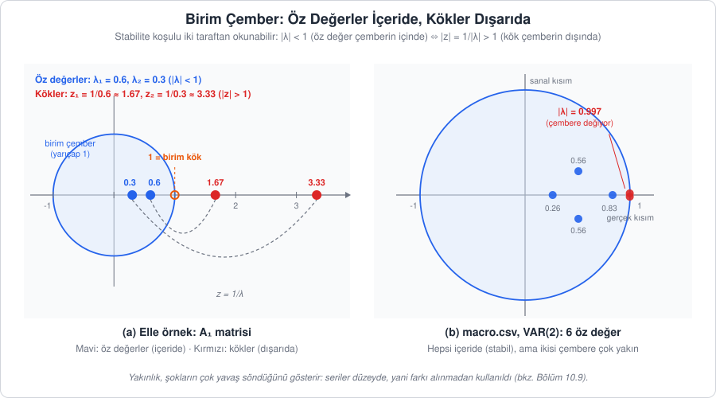

*Şekil 10.2 — (a) Örnek matrisin öz değerleri (0.6 ve 0.3, mavi) birim çemberin içinde, kökleri ($`z = 1/\lambda`$: 1.67 ve 3.33, kırmızı) dışındadır; turuncu halka birim kökün (1) yeridir. (b) Bölüm 10.9'daki VAR(2) modelinin altı öz değeri: hepsi içeride, ama biri karmaşık sayı çifti olan ikisinin modülü 0.997 ile çembere neredeyse değmektedir.*

**Tanım 2 (VAR(p) için stabilite):** VAR(2) ya da daha fazla gecikmeli bir modelde tek bir $A_1$ matrisi yoktur. Bu durumda bir hile yapılır: bu ayın ve geçen ayın değerleri alt alta yazılarak daha uzun bir vektör oluşturulur ve model bu uzun vektör için bir VAR(1)'e dönüştürülür. Bu VAR(1)'in katsayı matrisine **eşlik (companion) matrisi** denir ve $kp \times kp$ boyutludur:

```math
\mathbf{F} =
\begin{bmatrix}
A_1 & A_2 & \cdots & A_{p-1} & A_p \\
I   & 0   & \cdots & 0       & 0   \\
0   & I   & \cdots & 0       & 0   \\
\vdots & & \ddots & & \vdots \\
0   & 0   & \cdots & I       & 0
\end{bmatrix}
```

İlk satır bloğu modelin kendisidir; alttaki $I$ blokları yalnızca "geçen ayın değeri, bir ay sonra iki ay önceki değer olur" bilgisini taşır. Model, $\mathbf{F}$ matrisinin tüm öz değerlerinin modülü 1'den küçükse stabildir. Eşdeğer olarak, karakteristik polinom $\det(I - A_1 z - \dots - A_p z^p) = 0$ denkleminin tüm kökleri birim çemberin **dışında** ($\lvert z \rvert > 1$) olmalıdır. Kökler öz değerlerin tersi olduğundan bu iki ifade aynı koşuldur. 3 değişkenli bir VAR(2)'de $\mathbf{F}$ 6 × 6 boyutludur ve 6 öz değer vardır; Bölüm 10.9'da Python'un altı kök yazdırmasının nedeni budur.

> **Simge notu:** $`\mathbf{F}`$ *(kalın F)*: eşlik matrisi · $`\cdots`$, $`\ddots`$ *(yatay / çapraz üç nokta)*: tekrarlanan bloklar · $`0`$: tüm elemanları sıfır olan blok · $`z`$: karakteristik polinomun değişkeni · **polinom**: $`x`$'in kuvvetlerinin katsayılarla toplamı, ör. $`\lambda^2 - 0.9\lambda + 0.18`$

**Not —** Yazılımlar bu koşulu farklı biçimde raporlayabilir. Gretl ve pek çok ders kitabı öz değerlerin (Gretl'deki adıyla "ters köklerin", *inverse roots*) birim çemberin **içinde** olmasını ister; statsmodels'taki `results.roots` ise karakteristik polinomun köklerini verir ve bunların birim çemberin **dışında** olması gerekir. `results.is_stable()` her iki durumda da doğrudan `True`/`False` döndürür.

Stabil olmayan bir VAR modelinde:

- Etki-tepki fonksiyonları patlayıcı davranış gösterir (Şekil 10.3'ün sağ paneli),
- Varyans ayrıştırması anlamsız sonuçlar verir,
- Öngörüler güvenilir olmaktan çıkar.

Kararsızlığın en yaygın nedenleri durağan olmayan (farkı alınmamış) seriler, gereğinden fazla gecikme ve aykırı gözlemlerdir.

<details>
<summary><b>Kendinizi test edin (cevaplar için tıklayın)</b></summary>

1. **$`A_1`$ matrisinin satırları (0.7, 0.2) ve (0.2, 0.7) ise öz değerler nedir? Model stabil midir?**
   → $`\det(A_1 - \lambda I) = (0.7 - \lambda)^2 - 0.04 = 0`$, yani $`0.7 - \lambda = \pm 0.2`$. Öz değerler 0.5 ve 0.9'dur; ikisi de 1'den küçük olduğu için model stabildir. 0.9 bire yakın olduğu için şoklar yavaş söner.

2. **Satırları (0.8, 0.4) ve (0.3, 0.6) olan matris için?**
   → İz $`0.8 + 0.6 = 1.4`$, determinant $`0.8 \cdot 0.6 - 0.4 \cdot 0.3 = 0.36`$; denklem $`\lambda^2 - 1.4\lambda + 0.36 = 0`$. Kökler $`(1.4 \pm \sqrt{1.96 - 1.44})/2 = (1.4 \pm 0.721)/2`$, yani yaklaşık 1.06 ve 0.34. Öz değerlerden biri 1'den büyük olduğu için model **stabil değildir**: her bir katsayı 1'den küçük olsa bile çapraz etkiler birbirini besleyerek sistemi patlatabilir.

3. **Bir AR(1) modelinde karakteristik denklemin kökü $`z = 1.25`$ bulunmuştur. Öz değer ve $`\phi`$ nedir?**
   → $`\lambda = \phi = 1/1.25 = 0.8`$. Kök birim çemberin dışında, öz değer içindedir: seri durağandır.

</details>

---

### 10.6. Granger Nedenselliği

**Açıklama:** VAR'da sık sorulan sorulardan biri şudur: "Faizin geçmiş değerleri, enflasyonun kendi geçmişinin ötesinde ek bir bilgi taşıyor mu?" Taşıyorsa, faizin enflasyonu **Granger-nedenselliği** vardır denir. Buradaki "nedensellik" günlük dildeki neden-sonuç ilişkisi değil, **öngörü üstünlüğüdür**: $x$'in geçmişi $y$'nin tahminini iyileştiriyorsa "$x$, $y$'nin Granger nedenidir".

Bilinen bir örnek: Aralık başındaki yılbaşı süsü satışları, birkaç hafta sonra gelecek yılbaşı alışverişi yoğunluğunu iyi öngörür; ama süs satışları yılbaşına **neden olmaz**. Öngörü gücü ile neden-sonuç ilişkisi farklı şeylerdir.

**Tanım:** İki değişkenli VAR(p) modelinde enflasyon ($y_1$) denklemi

$$
y_{1,t} = c_1 + \sum_{i=1}^{p} a_{11}^{(i)} y_{1,t-i} + \sum_{i=1}^{p} a_{12}^{(i)} y_{2,t-i} + u_{1,t}
$$

olsun. $\sum$ işareti "toplam" demektir: altındaki $i = 1$'den üstündeki $p$'ye kadar her $i$ için terimi yazıp toplarız. Örneğin $p = 2$ için ikinci toplam açık hâliyle $a_{12}^{(1)} y_{2,t-1} + a_{12}^{(2)} y_{2,t-2}$'dir: faizin bir ve iki önceki dönemdeki değerleri, her biri kendi katsayısıyla. "$y_2$, $y_1$'in Granger nedeni değildir" hipotezi, $y_2$'nin tüm gecikme katsayılarının sıfır olmasıdır:

$$
H_0: a_{12}^{(1)} = a_{12}^{(2)} = \dots = a_{12}^{(p)} = 0
$$

> **Simge notu:** $`\sum`$ *(büyük sigma = toplam)*: altındaki başlangıçtan üstündeki sona kadar terimlerin toplamı; 10.1'deki $`\Sigma_u`$ ile aynı harftir ama orada bir matrisin adıdır · $`a_{12}^{(i)}`$: $`A_i`$ matrisinin (1,2) elemanı, yani faizin $`i`$. gecikmesinin enflasyon denklemindeki katsayısı. Üstteki parantezli $`(i)`$ **üs değildir**, yalnızca gecikme numarasıdır ($`a^{(2)}`$ "a kare" değil, "2. gecikmenin a'sı" diye okunur)

Bu $p$ kısıt birlikte bir **F-testi** (ya da Wald testi) ile sınanır. Testin mantığı iki modeli karşılaştırmaktır: faizin gecikmelerini **içeren** enflasyon denklemi ile bu gecikmeler **çıkarılmış** denklem. Faizin gecikmeleri çıkarılınca hatalar belirgin biçimde büyüyorsa faiz ek bilgi taşıyordur; F istatistiği büyük, p-değeri küçük çıkar. p-değeri 0,05'ten küçükse $H_0$ reddedilir: faizin geçmişi enflasyonu öngörmeye yardımcıdır.

**Sayısal örnek (Bölüm 10.9'daki veri, VAR(2)):** Enflasyon denkleminin hata kareleri toplamı tüm değişkenlerle 722.3'tür.

*   Faizin iki gecikmesi çıkarılınca bu toplam yalnızca 724.6'ya çıkar (%0.3 artış). Faiz neredeyse hiç ek bilgi taşımaz: F = 0.18, p = 0.84. Faizin hiçbir katkısı olmasa bile bu kadar küçük bir iyileşmeyi tesadüfen görme olasılığı %84'tür; $H_0$ reddedilemez.
*   Döviz kurunun iki gecikmesi çıkarılınca toplam 1157.2'ye çıkar (%60 artış). F = 33.4, p < 0.001: döviz kuru enflasyonun Granger nedenidir.

Yorumlarken dikkat edilecekler:

*   Granger nedenselliği **yönlüdür**; iki yön ayrı ayrı test edilir. Çift yönlü nedensellik (enflasyon faizi, faiz de enflasyonu öngörüyor) mümkündür ve tam da VAR'ın varlık sebebidir.
*   Her iki seri de üçüncü, modelde yer almayan bir değişkenden etkileniyorsa, aralarında gerçek bir neden-sonuç ilişkisi olmadan Granger nedenselliği çıkabilir.
*   Test, durağan seriler ve doğru seçilmiş gecikme sayısı varsayımına dayanır. Bölüm 10.9'da göreceğimiz gibi, düzey serilerle anlamlı çıkan bir sonuç farkı alınmış serilerde kaybolabilir.

---

### 10.7. Etki-Tepki Fonksiyonu (Impulse Response Function, IRF)

**Açıklama:** VAR katsayıları tek tek yorumlanması zor sayılardır: 3 değişkenli bir VAR(2)'de 18 katsayı vardır ve bir değişkenin etkisi birden çok gecikme ve dolaylı kanal üzerinden yayılır. Etki-tepki fonksiyonu bu karmaşayı tek bir soruya indirger:

> "Bugün faiz oranına bir birimlik (ya da bir standart sapmalık) şok gelse, sonraki dönemlerde enflasyon ve diğer değişkenler nasıl tepki verir?"

Bu, durgun suya atılan taşın yarattığı dalgaları izlemeye benzer: şok (taş) sistemdeki diğer değişkenleri (dalgalar) nasıl etkiler ve bu etki zamanla nasıl söner?


*Şekil 10.3 — Faize verilen tek seferlik şoka enflasyonun tepkisi (kavramsal). Solda stabil bir VAR: tepki birkaç dönem sonra en güçlü hâline ulaşır ve sonra sıfıra döner. Sağda stabil olmayan bir VAR: tepki giderek büyür.*

**Elle bir etki-tepki hesabı:** Örnek matrisimizle ($A_1$ satırları (0.5, 0.2) ve (0.1, 0.4)) başlayalım. Sistem dengede dururken $h = 0$ anında faize 1 birimlik bir şok gelsin, sonra başka şok gelmesin. Şok vektörü $[0, 1]$'dir (enflasyon 0, faiz 1; bundan sonra vektörleri kısalık için köşeli parantez içinde [enflasyon, faiz] sırasıyla yan yana yazıyoruz). Her dönem bir önceki dönemin tepkisi $A_1$ ile çarpılır:

*   $h = 1$: $A_1 \cdot [0, 1] = [0.5 \cdot 0 + 0.2 \cdot 1,\; 0.1 \cdot 0 + 0.4 \cdot 1] = [0.2, 0.4]$
*   $h = 2$: $A_1 \cdot [0.2, 0.4] = [0.10 + 0.08,\; 0.02 + 0.16] = [0.18, 0.18]$
*   $h = 3$: $A_1 \cdot [0.18, 0.18] = [0.09 + 0.036,\; 0.018 + 0.072] = [0.126, 0.090]$
*   $h = 4$: $A_1 \cdot [0.126, 0.090] \approx [0.081, 0.049]$

Faiz kendi şokundan sonra hızla düşer (1 → 0.4 → 0.18 → ...). Enflasyon ise $h = 0$'da hiç etkilenmez, çünkü faiz enflasyonu ancak bir dönem gecikmeyle etkiler. Sonra 0.2'ye çıkar ve yavaşça söner. Bu "önce yüksel, sonra sön" biçimi, çapraz etkilerin tipik izidir. Uzun vadede tepkiler her adımda kabaca %60'ına iner (0.081 / 0.126 ≈ 0.64, 0.050 / 0.081 ≈ 0.62): bu, en büyük öz değer olan 0.6'dır. Stabilite koşulu ile etki-tepki arasındaki bağ budur.

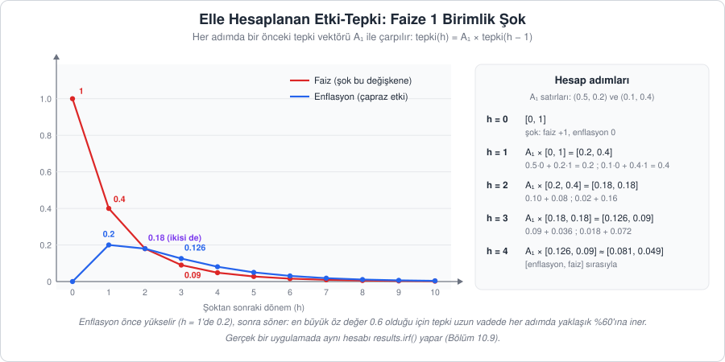

*Şekil 10.4 — Örnek $`A_1`$ matrisiyle faize verilen 1 birimlik şokun yayılması. Kırmızı: faizin kendi tepkisi; mavi: enflasyonun tepkisi. Sağdaki kutu ilk dört adımın matris × vektör hesabını gösterir.*

**Tanım:** Elle yaptığımız hesabın genel hâli şudur. VAR(1)'i geriye doğru açalım: $\mathbf{y}_t = A_1 \mathbf{y}_{t-1} + \mathbf{u}_t$ eşitliğinde $\mathbf{y}_{t-1}$ yerine $A_1 \mathbf{y}_{t-2} + \mathbf{u}_{t-1}$ yazarsak $\mathbf{y}_t = \mathbf{u}_t + A_1 \mathbf{u}_{t-1} + A_1^2 \mathbf{y}_{t-2}$ olur; bunu sürdürdükçe bugünkü değer geçmiş şokların ağırlıklı toplamına dönüşür: bugünkü şok 1 ile, geçen dönemin şoku $A_1$ ile, iki dönem öncekinin şoku $A_1^2$ ile çarpılır ve böyle gider. Stabil bir VAR(p) için genel yazım (hareketli ortalama, MA(∞) gösterimi):

$$
\mathbf{y}_t = \boldsymbol{\mu} + \sum_{i=0}^{\infty} \Phi_i \mathbf{u}_{t-i}, \qquad \Phi_0 = I, \quad \Phi_i = \sum_{j=1}^{\min(i,p)} \Phi_{i-j} A_j
$$

$\Phi_h$ matrisinin $(j, m)$ elemanı, $m$. değişkene $t$ anında gelen bir birimlik şokun $h$ dönem sonra $j$. değişkende yarattığı değişimdir. Bu değerlerin $h = 0, 1, 2, \dots$ için çizilmesi etki-tepki fonksiyonudur. VAR(1) için formül çok sadedir: $\Phi_h = A_1^h$. Örneğin $A_1^2$'nin satırları (0.27, 0.18) ve (0.09, 0.18)'dir; 2. sütunu [0.18, 0.18], yukarıda $h = 2$ için bulduğumuz tepkinin aynısıdır. Stabilite koşulu (Bölüm 10.5) tam olarak bu matris kuvvetlerinin sıfıra gitmesini, yani tepkilerin sönmesini garanti eder.

> **Simge notu:** $`\boldsymbol{\mu}`$ *(kalın mü)*: sürecin ortalama vektörü · $`\infty`$ *(sonsuz)*: toplamın sonsuza kadar sürdüğü, ama terimlerin giderek küçüldüğü · $`\Phi_i`$ *(büyük fi)*: $`i`$. dönem tepki (MA katsayı) matrisi; küçük $`\phi`$ ile aynı harfin büyük yazılışıdır · $`\min(i,p)`$: iki değerden küçüğü · $`A_1^h`$: $`A_1`$'in kendisiyle $`h`$ kez çarpımı

**Ortogonal (Cholesky) şoklar:** Gerçek verilerde şoklar çoğu zaman birlikte gelir: $\Sigma_u$ köşegen değilse, yani aynı dönemdeki şoklar birbiriyle ilişkiliyse, "yalnızca faize şok verip diğerlerini sabit tutmak" gerçekçi değildir. Bu yüzden genellikle $\Sigma_u = P P^\top$ **Cholesky ayrıştırması** ile ilişkisiz (ortogonal) şoklar elde edilir ve tepkiler $\Theta_i = \Phi_i P$ ile hesaplanır. Sade bir dille: değişkenler bir sıraya dizilir ve listede önce gelen değişkenin şokunun, sonrakileri **aynı dönemde** etkilemesine izin verilir, tersine izin verilmez. Bu yöntemde **değişkenlerin sırası sonucu etkiler**. Bölüm 11.6'daki Gretl çıktısında enflasyon listede ilk sırada olduğu için, faiz şokuna enflasyonun ilk dönemdeki tepkisi tam olarak 0'dır. Sıralama ekonomik mantığa göre (ör. yavaş tepki verenler önce) seçilmeli ve raporlanmalıdır. Cholesky şokları genellikle "bir standart sapmalık" büyüklükte verilir: yani o değişkende tipik olarak görülen büyüklükte bir sürpriz.

> **Simge notu:** $`P`$: Cholesky ayrıştırmasından gelen alt üçgen matris (köşegenin üstü sıfır) · $`P^\top`$ *(P devrik)*: $`P`$'nin satırlarıyla sütunlarının yer değiştirmiş hâli (transpoz) · $`\Theta_i`$ *(büyük teta)*: ortogonal şoklara göre tepki matrisi

**IRF grafikleri nasıl okunur?**

*   Yatay eksen: şoktan sonra geçen dönem sayısı ($h$).
*   Dikey eksen: tepkinin büyüklüğü (değişkenin kendi biriminde).
*   Çizgi sıfırın üstündeyse pozitif, altındaysa negatif tepki vardır.
*   Grafikteki **güven bandı** (genellikle %95), tahmin edilen tepkinin belirsizliğini gösterir. Bant sıfırı içeriyorsa o dönemdeki tepki istatistiksel olarak sıfırdan ayırt edilemez.
*   Stabil bir modelde tüm tepkiler zamanla sıfıra yaklaşmalıdır.

---

### 10.8. Tahmin Hatası Varyans Ayrıştırması (FEVD)

**Açıklama:** IRF "şok gelince ne olur?" sorusunu yanıtlarken, FEVD (*Forecast Error Variance Decomposition*) şu soruyu yanıtlar: "Bir değişkenin $h$ dönem sonrası için yaptığımız tahmindeki belirsizliğin (hata varyansının) ne kadarı **kendi şoklarından**, ne kadarı **diğer değişkenlerin şoklarından** kaynaklanıyor?" Bugün yaptığımız 3 ay sonrasına ait enflasyon tahmini, aradaki aylarda gelecek şoklar yüzünden tutmayacaktır. FEVD bu hatayı bir pasta gibi dilimlere ayırır ve her dilimin hangi değişkenin şoklarından geldiğini söyler.

**Tanım:** Ortogonal tepki matrislerinin elemanları $\theta_{jm,i}$ olmak üzere, $j$. değişkenin $h$ adımlı tahmin hatası varyansında $m$. değişkenin şokunun payı:

$$
\omega_{jm}(h) = \frac{\sum_{i=0}^{h-1} \theta_{jm,i}^2}{\sum_{i=0}^{h-1} \sum_{l=1}^{k} \theta_{jl,i}^2}
$$

Payda tüm şokların katkılarının toplamı, pay ise yalnızca $m$. şokun katkısıdır. Tepkilerin karesi alınır, çünkü varyans (belirsizlik) şokun yönüne değil büyüklüğüne bağlıdır.

> **Simge notu:** $`\theta_{jm,i}`$ *(teta)*: $`\Theta_i`$ matrisinin $`(j,m)`$ elemanı, yani $`m`$. şokun $`i`$ dönem sonra $`j`$. değişkende yarattığı tepki · $`\theta^2`$: tepkinin karesi · $`\omega_{jm}(h)`$ *(omega)*: $`h`$ ufkunda $`m`$. şokun $`j`$. değişkenin hata varyansındaki payı · iç içe iki $`\sum`$: önce tüm şoklar ($`l`$), sonra tüm dönemler ($`i`$) üzerinden toplam

**Elle bir örnek:** Örnek $A_1$ matrisimizde şokların ilişkisiz ve büyüklüklerinin 1 olduğunu varsayalım (bu durumda $\Theta_i = \Phi_i = A_1^i$). Enflasyonun 2 adımlı tahmin hatası, önümüzdeki iki dönemin şoklarından gelir. Enflasyonun tepkileri $\Phi_0 = I$'nın 1. satırında (1, 0) ve $\Phi_1 = A_1$'in 1. satırında (0.5, 0.2)'dir. Karelerini toplayalım:

*   Enflasyonun kendi şoku: $1^2 + 0.5^2 = 1.25$
*   Faiz şoku: $0^2 + 0.2^2 = 0.04$
*   Toplam: $1.29$ → kendi payı $1.25 / 1.29 \approx \%96.9$, faizin payı $0.04 / 1.29 \approx \%3.1$

3 adımda $A_1^2$'nin 1. satırı (0.27, 0.18) da eklenir: kendi $1.25 + 0.0729 = 1.3229$, faiz $0.04 + 0.0324 = 0.0724$; faizin payı %5.2'ye çıkar. Ufuk uzadıkça diğer değişkenin payı artar.

Her değişken ve her ufuk için paylar 0 ile 1 arasındadır ve toplamları 1'dir (%100). Bölüm 10.9'daki gerçek veride enflasyonun 12 ay sonrası tahmin hatasının yaklaşık %44'ü kendi şoklarından, %55'i döviz kuru şoklarından, %1'den azı faiz şoklarından kaynaklanmaktadır. Böyle bir sonuç, enflasyonu kontrol etmek isteyen bir politika yapıcı için döviz kuru istikrarının önemini gösterir.

Tipik örüntü şudur: kısa ufuklarda değişken ağırlıklı olarak kendi şoklarıyla açıklanır; ufuk uzadıkça diğer değişkenlerin payı artar ve sonunda paylar sabitlenir (uzun dönem etkisi). FEVD Cholesky şoklarını kullandığından, IRF'deki gibi değişken sıralamasına duyarlıdır.

---

### 10.9. Python ile VAR Uygulaması (statsmodels)

Bu uygulamada şimdiye kadar anlatılan adımların tamamını (veri hazırlığı, durağanlık, gecikme seçimi, stabilite, artık analizi, tahmin, IRF, FEVD, Granger) tek bir programda bir araya getiriyoruz. Örnek veri setinde (`data/macro.csv`, kendi verinizle değiştirebilirsiniz) Ocak 2015 – Aralık 2024 arasına ait 120 aylık gözlemden oluşan üç seri bulunur:

*   `inflation`: Enflasyon oranı (%)
*   `interest`: Faiz oranı (%)
*   `exchange`: Döviz kuru (USD/TRY)

Tam program yaklaşık 450 satır olduğu için ayrı bir dosyaya taşındı. Aşağıda yalnızca modeli kuran ve sonuçları üreten kilit satırlar yer alıyor; kod bölümlerinin numaraları (1–10), Bölüm 10.9.1'deki yorum tablosundaki numaralarla aynıdır.

```python
# VAR uygulamasının kilit satırları (tam kod: Codes/python/ch10_var.py)
import numpy as np
import pandas as pd
from statsmodels.tsa.api import VAR
from statsmodels.tsa.stattools import adfuller

# 1) Veri (dosyada veri_yolu("macro.csv") kullanılır: önce yerel data/ klasörüne, yoksa GitHub'a bakar)
df = pd.read_csv("data/macro.csv", parse_dates=["date"], index_col="date")
vars_selected = ["inflation", "interest", "exchange"]
df_var = df[vars_selected].dropna().asfreq("MS")   # MS: aylık, ay başı

for col in vars_selected:                          # 3) ADF: p < 0.05 ise durağan
    print(col, round(adfuller(df_var[col], autolag="AIC")[1], 3))

model = VAR(df_var)                                # 4) Gecikme seçimi ve tahmin
lag_order_results = model.select_order(maxlags=8)
print(lag_order_results.summary())
selected_lag = max(1, lag_order_results.selected_orders['bic'])  # bu veride BIC → 2
results = model.fit(selected_lag)
print(results.summary())

print(results.is_stable())                         # 5) Stabilite
print(np.round(np.abs(results.roots), 3))          #    tüm |kök| > 1 olmalı
print(np.round(1 / np.abs(results.roots), 3))      #    |öz değer| = 1/|kök| < 1

print(results.test_whiteness(nlags=12).pvalue)     # 6) Artıklarda otokorelasyon

forecast_values = results.forecast(y=df_var.values[-selected_lag:], steps=4)  # 7) Tahmin

irf = results.irf(12)                              # 8) IRF (12 dönem)
irf.plot(orth=False)
irf.plot(impulse="interest", response="inflation")

fevd = results.fevd(12)                            # 9) FEVD
fevd.summary()

gc = results.test_causality(caused="inflation", causing=["interest"], kind="f")  # 10) Granger
print(gc.summary())
```

Çıktının kilit kısımları (sabit, katsayı ve FEVD tabloları kısaltılmıştır):

```text
#> inflation 0.806
#> interest 0.128
#> exchange 0.999
#>  VAR Order Selection (* highlights the minimums)
#> =================================================
#>       AIC         BIC         FPE         HQIC
#> -------------------------------------------------
#> 0       13.78       13.85   9.607e+05       13.80
#> 1       2.786       3.078       16.22       2.904
#> 2       1.794      2.304*       6.019       2.001
#> 3       1.701       2.429       5.489      1.997*
#> 4       1.630       2.577       5.120       2.014
#> 5       1.578       2.743       4.873       2.051
#> 6       1.658       3.041       5.299       2.219
#> 7      1.399*       3.001      4.114*       2.049
#> 8       1.426       3.247       4.260       2.165
#> -------------------------------------------------
#> Results for equation inflation
#>                   coefficient       std. error           t-stat            prob
#> L1.inflation         1.444557         0.063360           22.799           0.000
#> L1.interest         -0.020435         0.140791           -0.145           0.885
#> L1.exchange          3.666997         0.458237            8.002           0.000
#> L2.inflation        -0.480591         0.066184           -7.261           0.000
#> L2.interest          0.039731         0.137865            0.288           0.773
#> L2.exchange         -3.717500         0.486191           -7.646           0.000
#> ...
#> True
#> [3.8   1.8   1.8   1.2   1.003 1.003]
#> [0.263 0.556 0.556 0.833 0.997 0.997]
#> 3.2266279417763184e-07
#> Granger causality F-test. H_0: interest does not Granger-cause inflation. Conclusion: fail to reject H_0 at 5% significance level.
#> Test statistic Critical value p-value         df
#>         0.1776          3.023   0.837 (2, np.int64(333))
```

Kodun ilk satırları kütüphaneleri yükler: `import pandas as pd` tablo (veri çerçevesi, *DataFrame*) işlemleri için pandas'ı `pd` kısa adıyla, `from statsmodels.tsa.api import VAR` ise statsmodels'ın zaman serisi modülünden yalnızca `VAR` sınıfını getirir. Ardından kilit satırlar şunları yapar:

*   `pd.read_csv(..., parse_dates=["date"], index_col="date")`: CSV dosyasını okur, `date` sütununu metin olarak değil tarih olarak yorumlar ve satır etiketi (indeks) yapar; böylece her satır bir aya karşılık gelir. `df[vars_selected]` köşeli parantez içine bir sütun adları listesi vererek yalnızca bu üç sütunu seçer, `.dropna()` eksik değer içeren satırları atar, `.asfreq("MS")` ise verinin aylık ve ay başı tarihli olduğunu açıkça belirtir (statsmodels aksi hâlde frekansı tahmin etmeye çalışıp uyarı verir).
*   `adfuller(seri, autolag="AIC")[1]`: ADF testini çalıştırır; sonuçlar sıralı bir paket olarak döner ve `[1]` ikinci elemanı, yani p-değerini alır (Python'da sayma 0'dan başlar; `[0]` test istatistiğidir). `autolag="AIC"` testin kaç gecikme kullanacağını AIC ile seçer.
*   `VAR(df_var)`: Modeli **tanımlar** ama henüz tahmin etmez; yalnızca hangi verinin kullanılacağını kaydeder.
*   `model.select_order(maxlags=8)`: VAR(0)'dan VAR(8)'e kadar tüm modelleri aynı ortak örnekle ($T = 112$) kurar ve her biri için AIC, BIC, FPE, HQIC değerlerini hesaplar. `.selected_orders` her kriterin önerdiği gecikmeyi tutan bir sözlüktür; `['bic']` BIC'nin önerisini alır. `max(1, ...)` kriterin 0 gecikme önermesi hâlinde en az 1 gecikme kullanmayı garanti eder.
*   `model.fit(selected_lag)`: Seçilen gecikmeyle her denklemi OLS ile tahmin eder ve sonuç nesnesini (`results`) döndürür; sonraki tüm analizler bu nesnenin metotlarıyla yapılır. Aynı işi tek satırda `model.fit(maxlags=8, ic="bic")` da yapar: `ic` (*information criterion*) argümanı, gecikmeyi verilen kritere göre seçip modeli o gecikmeyle kurar (bu veride yine VAR(2)).
*   `results.is_stable()`: Eşlik matrisinin tüm öz değerlerinin birim çemberin içinde olup olmadığını `True`/`False` olarak döndürür. `results.roots` karakteristik denklemin köklerini verir; `np.abs()` her kökün modülünü (büyüklüğünü) alır, `1 / ...` ise bunları öz değer modüllerine çevirir (Bölüm 10.5'teki $z = 1/\lambda$ ilişkisi). `np.round(..., 3)` yalnızca okunabilirlik için üç basamağa yuvarlar.
*   `results.test_whiteness(nlags=12)`: Artıklarda 12 gecikmeye kadar otokorelasyon olup olmadığını tüm denklemler için birlikte sınar (çok değişkenli Ljung-Box tipi, *portmanteau* testi; $H_0$: otokorelasyon yok). `.pvalue` p-değerini verir.
*   `results.forecast(y=df_var.values[-selected_lag:], steps=4)`: Tahmini başlatmak için modele son $p$ gözlemi vermemiz gerekir; VAR(2) bir sonraki ayı hesaplamak için son iki ayı kullanır. `df_var.values` tabloyu sayı dizisine çevirir, `[-selected_lag:]` dizinin sondan `selected_lag` satırını (burada son 2 ayı) alır. `steps=4` dört ay ileriye tahmin üretir; sonuç 4 satır × 3 sütunluk bir dizidir.
*   `results.irf(12)`: 0'dan 12'ye kadar her ufuk için tepki matrislerini (10.7'deki $\Phi_h$ ve $\Theta_h$) hesaplar. `irf.plot(orth=False)` tüm şok-tepki çiftlerini bir birimlik şoklarla (ortogonal olmayan) çizer; `impulse=` şokun verildiği, `response=` tepkisi izlenen değişkeni seçer.
*   `results.fevd(12)`: 12 ufuklu varyans ayrıştırmasını hesaplar; `.summary()` her değişken için dönem dönem pay tablosunu ekrana yazar.
*   `results.test_causality(caused=..., causing=[...], kind="f")`: Granger testini yapar. `caused` etkilenen, `causing` etkileyen değişken(ler)dir; `kind="f"` F-testi kullanılacağını söyler. `.summary()` test istatistiğini, kritik değeri, p-değerini ve "reject / fail to reject" (reddet / reddedilemedi) kararını yazar. statsmodels bu testi tüm sistem üzerinden kurduğu için serbestlik derecesi (2, 333) çıkar (`np.int64(333)` yazımı yalnızca NumPy'ın sayıyı gösterme biçimidir); Gretl aynı testi tek denklem üzerinden F(2, 111) olarak yapar. p-değerleri neredeyse aynıdır (0.837 ve 0.838).

Çıktıyı okurken: ADF p-değerleri üç seride de 0,05'ten büyüktür (seriler durağan değil). Gecikme tablosunda her sütunun en küçük değeri yıldızla işaretlenmiştir: AIC ve FPE 7, BIC 2, HQIC 3 gecikme önerir. Enflasyon denkleminde döviz kurunun iki katsayısı dikkat çekicidir: $3.67$ ve $-3.72$ neredeyse eşit büyüklükte ve zıt işaretlidir. $3.67 \cdot \text{kur}_{t-1} - 3.72 \cdot \text{kur}_{t-2} \approx 3.7 \cdot (\text{kur}_{t-1} - \text{kur}_{t-2})$ olduğu için, enflasyonu kurun **düzeyi** değil, geçen ayki **artışı** etkilemektedir. Faizin katsayıları ise küçüktür ve p-değerleri yüksektir (0.885, 0.773). Stabilite satırı `True`'dur; altı kökün hepsi 1'den büyüktür, ama ikisi 1.003 ile sınıra çok yakındır (Şekil 10.2b). Portmanteau testinin p-değeri yaklaşık 0.0000003'tür: artıklarda uzun gecikmelerde otokorelasyon kalmıştır.

Dosyadaki program sırasıyla şunları yapar:

1.  **Veri hazırlığı:** `data/macro.csv` okunur, üç değişken seçilir, eksik satırlar atılır, aylık frekans tanımlanır (Bölüm 10.3).
2.  **Görselleştirme:** Üç seri alt alta çizilir; trend ve yapısal kırılmalar gözle incelenir.
3.  **Durağanlık:** Her seriye ADF testi uygulanır; `adf_test()` fonksiyonu test istatistiğini, p-değerini ve kritik değerleri yorumuyla yazdırır (Bölüm 10.3.3).
4.  **Gecikme seçimi ve tahmin:** `select_order(maxlags=8)` ile AIC, BIC, FPE, HQIC tablosu alınır; BIC'nin önerdiği gecikmeyle `fit()` çağrılır ve denklem denklem OLS sonuçları yazdırılır (Bölüm 10.4).
5.  **Stabilite:** `is_stable()` ve karakteristik köklerin modülleri (ve karşılık gelen öz değerler) yazdırılır (Bölüm 10.5).
6.  **Artık analizi:** Her denklem için Durbin-Watson istatistiği hesaplanır, artıklar çizilir ve portmanteau testi yapılır.
7.  **Tahmin:** Son `p` gözlemden başlayarak 4 aylık tahmin üretilir, son 24 ayla birlikte çizilir.
8.  **IRF:** 12 dönemlik etki-tepki fonksiyonları; tüm çiftler ile "faiz → enflasyon" ve "döviz kuru → enflasyon" grafikleri (Bölüm 10.7).
9.  **FEVD:** 12 dönemlik varyans ayrıştırması tablosu ve grafiği (Bölüm 10.8).
10.  **Granger:** Dört yönde (faiz → enflasyon, döviz kuru → enflasyon, enflasyon → faiz, döviz kuru → faiz) F-testi (Bölüm 10.6).

**Neden BIC?** Bu veride kriterler farklı gecikmeler önerir: AIC 7, HQIC 3, BIC 2 (nedeni 10.4'teki sayısal örnekte). Üç değişkenli bir VAR(7), her denklemde 22 parametre demektir (sabit + 3 × 7). Üstelik bu model stabil çıkmaz; bir öz değerin modülü yaklaşık 1.02 ile 1'i aşar. Tutucu BIC'nin önerdiği VAR(2) hem daha sade hem de stabildir. Bu yüzden kod BIC'yi kullanır. AIC öngörü odaklı çalışmalarda sık tercih edilse de (Bölüm 10.4), önerdiği model stabil değilse IRF, FEVD ve tahminler güvenilir olmaz.

**Örnek sonuçlar** (`data/macro.csv`, VAR(2)):

| Çıktı | Sonuç | Yorum |
| --- | --- | --- |
| ADF (3 seri) | p = 0.81, 0.13, 0.999 | Üç seri de durağan değil. |
| Stabilite | `True`; en büyük öz değer modülü 0.997 | Model stabil, ama sınırda: şoklar çok yavaş söner. |
| Durbin-Watson | 2.04, 2.23, 1.83 | Artıklarda belirgin **birinci derece** otokorelasyon yok. |
| Portmanteau (12 gecikme) | p < 0.001 | Daha uzun gecikmelerde artık otokorelasyonu kalmış; model eksik. |
| Granger | faiz → enflasyon p = 0.84; döviz kuru → enflasyon p < 0.001; enflasyon → faiz p = 0.02; döviz kuru → faiz p < 0.001 | Döviz kurunun geçmişi hem enflasyonu hem faizi öngörmeye yardım ediyor; faizin enflasyona katkısı anlamlı değil. |
| IRF (bir birimlik şok) | Kurda 1 TL'lik artış → enflasyon 1 ay sonra +3.7, 4. ayda +9.1 puan, 12. ayda hâlâ +5.9; faiz şokuna enflasyonun tepkisi negatif ama güven bandı her dönemde sıfırı içeriyor | Kur etkisi güçlü ve kalıcı; faiz etkisi istatistiksel olarak belirsiz (Granger sonucuyla uyumlu). |
| FEVD (12. dönem) | Enflasyonun tahmin hatası varyansının %44'ü kendi şoklarından, %55'i döviz kuru şoklarından, %1'den azı faiz şoklarından | Uzun ufukta enflasyon belirsizliğinin çoğu döviz kurundan geliyor. |
| Tahmin (2025 Ocak–Nisan) | Enflasyon 42.2, 41.4, 41.6, 42.3; faiz 48.9 → 55.7; kur 35.5 → 37.6 | Düzey VAR'ı geçmişteki ilişkileri mekanik olarak sürdürür: faiz tahmini, son aydaki indirime rağmen yükselir. Bu tür tahminler dikkatle yorumlanmalıdır. |

**Not —** En büyük öz değerin 1'e bu kadar yakın çıkması (0.997) tesadüf değildir: seriler durağan olmadığı için model neredeyse bir birim kök taşır. Bu durumda IRF'ler çok yavaş söner ve uzun ufuklu yorumlar dikkatle yapılmalıdır. Portmanteau testinin reddi de aynı soruna işaret eder. Kod eğitim amaçlı olarak düzey serilerle devam eder. Alıştırma olarak:

1. Kodun 4. adımında `'bic'` yerine `'aic'` yazıp VAR(7)'nin stabil çıkmadığını görün.
2. Serilerin birinci farkını alıp (`df_var = df_var.diff().dropna()`) modeli yeniden kurun. Farkı alınmış serilerde ADF p-değerleri 0,05'in altına iner, BIC 1 gecikme önerir ve en büyük öz değer modülü 0.997'den yaklaşık 0.55'e düşer; model artık sınırda değil, rahatça stabildir. Granger sonuçlarına da bakın: döviz kurunun enflasyona (p < 0.001) ve faize (p ≈ 0.006) etkisi sürer, ama "enflasyon → faiz" ilişkisi anlamlılığını yitirir (p ≈ 0.37). Düzey serilerdeki bu sonuç kısmen ortak trendden kaynaklanıyordu.

> **Uygulama dosyası:** [`Codes/python/ch10_var.py`](Codes/python/ch10_var.py) · [Notebook](Codes/notebooks/ch10_var.ipynb) · [](https://colab.research.google.com/github/erkanozhan/AI_Based_Time_Series-Data_Analytics/blob/main/Codes/notebooks/ch10_var.ipynb)
>
> Bu bölümdeki kodların tamamı bu dosyada. Bilgisayarınızda çalıştırmak için depo kök dizininde `python Codes/python/ch10_var.py` komutunu kullanın ya da dosyayı VS Code'da açıp hücre hücre çalıştırın. Kurulum yapmadan denemek için Colab bağlantısını kullanabilirsiniz. statsmodels'ın yeni sürümleri ADF satırında bir `FutureWarning` (gelecek sürüm uyarısı) gösterebilir; sonuçları etkilemez.

#### 10.9.1. Çıktıların Yorumlanması

Kodun ürettiği her çıktı bölümünde neye bakılacağı şöyle özetlenebilir:

| Kod bölümü | Çıktı | Neye bakılır? |
| --- | --- | --- |
| 3) ADF | Test istatistiği, p-değeri | p < 0,05 ise seri durağan. Değilse `diff()` ile fark alınıp test tekrarlanır (Bölüm 10.3.3). |
| 4) Gecikme seçimi | AIC, BIC, FPE, HQIC tablosu | Her sütunda en küçük değer yıldızla (`*`) işaretlenir. Kriterler farklı $`p`$ önerebilir (Bölüm 10.4). |
| 4) `results.summary()` | Her denklem için katsayılar (`L1.` bir, `L2.` iki gecikme), p-değerleri (`prob`); en altta artıkların korelasyon matrisi | Tek tek katsayılardan çok, çapraz katsayıların anlamlılığına ve artık korelasyonlarına bakılır. Artıklar arası yüksek korelasyon, IRF'de sıralamanın önemli olacağını gösterir (bu veride en yüksek değer faiz-kur arasında 0.18'dir). |
| 5) Stabilite | `True`/`False`, kök modülleri | `True` ve tüm kök modülleri $`\lvert z \rvert > 1`$ (öz değer modülleri < 1) olmalı. Değilse fark alma, gecikme sayısı ve aykırı değerler gözden geçirilir. 1'e çok yakın değerler (ör. 1.003) yavaş sönen şoklara işaret eder. |
| 6) Durbin-Watson | Her denklem için DW | 2'ye yakın değer artıklarda birinci derece otokorelasyon olmadığını gösterir; 1,5–2,5 dışı değerler gecikme artırmayı düşündürür. |
| 6) Portmanteau | p-değeri | p > 0,05 istenir. Küçükse artıklarda uzun gecikmeli otokorelasyon vardır: gecikme artırma ya da fark alma denenir. |
| 7) Tahmin | 4 dönemlik tahmin tablosu ve grafiği | Tahminler son gözlemlerden makul biçimde devam etmeli; ufuk uzadıkça belirsizlik artar. Doğruluk ölçümü için Bölüm 8'deki eğitim-test ayrımı ve MAE/RMSE/MAPE kullanılabilir. |
| 8) IRF | Şok-tepki grafikleri | Tepkinin işareti, en güçlü olduğu dönem, güven bandının sıfırı içerip içermediği ve sönümlenme (Bölüm 10.7). |
| 9) FEVD | Dönemlere göre pay tablosu | Her satırın toplamı 1'dir; ufuk uzadıkça diğer değişkenlerin payının nasıl değiştiğine bakılır (Bölüm 10.8). statsmodels satırları 0'dan numaralar: 11 numaralı satır 12. dönemdir. |
| 10) Granger | F istatistiği, p-değeri, "reject/fail to reject" | p < 0,05 (*reject*) ise "etkileyen" değişkenin geçmişi, "etkilenen" değişkeni öngörmeye yardımcıdır (Bölüm 10.6). |

**Not —** Koddaki IRF grafikleri `orth=False` ile bir birimlik (ortogonal olmayan) şoklara göre çizilir. Cholesky şoklarına göre tepki için `irf.plot(orth=True)` kullanılabilir; bu durumda sonuç `df_var` sütunlarının sırasına bağlıdır (Bölüm 10.7). `fevd()` her zaman Cholesky şoklarını kullanır.

---

### 10.10. VAR'ın Kullanım Alanları ve Sınırlılıkları

VAR özellikle şu tip sorular için kullanışlıdır:

*   Para politikası şoklarının (faiz değişimleri) enflasyon, çıktı ve döviz kuru üzerindeki etkisi
*   Enerji fiyatı şoklarının üretim, tüketim ve fiyatlar üzerindeki etkisi
*   Finansal piyasalarda endeksler arası etkileşimler
*   Birbiriyle ilişkili çok sayıda göstergenin birlikte öngörülmesi

Sınırlılıkları da akılda tutulmalıdır:

*   **Parametre sayısı hızla artar** ($k^2 p$); değişken sayısı arttıkça kısa veriyle güvenilir tahmin zorlaşır. Bu yüzden VAR genellikle 2–6 değişkenle kurulur.
*   **Doğrusaldır;** doğrusal olmayan ilişkileri yakalamak için Bölüm 12'den itibaren ele alınacak makine öğrenmesi ve derin öğrenme yöntemleri daha uygundur.
*   **Durağanlık ve stabilite varsayımlarına** dayanır; yapısal kırılmalar (kriz dönemleri) sonuçları bozabilir.
*   **Sonuçlar öngörü ilişkileridir;** Granger nedenselliği ve Cholesky sıralamasına dayalı IRF, gerçek nedensellik için ek teorik varsayımlar gerektirir.

Önemli olan, tek bir denklemle sınırlı kalmak yerine değişkenlerin birbirini nasıl **gecikmeli olarak** etkilediğini birlikte görebilmektir. VAR bu etkileşimi hem tahmin hem de yorum açısından anlaşılır bir iskelet üzerinde sunar. Aynı analizi kod yazmadan, menülerle yapmak isteyenler için Gretl'de VAR kurulumu Bölüm 11'de anlatılmaktadır.

---

<a id="bolum-11"></a>

## 11. Gretl: Ekonometrik Analiz için Görsel Ortam

Python ve R'da komut yazarak çalışmak oldukça esnektir, ancak ilk adımda yorucu olabilir. **Gretl** (*GNU Regression, Econometrics and Time-series Library*), özellikle ekonometrik modeller ve zaman serileri için tasarlanmış, **ücretsiz**, açık kaynak ve **grafik arayüzlü** bir programdır:

*   Menüler üzerinden birkaç tıklamayla regresyon, ARIMA, VAR gibi modeller kurulabilir.
*   Aynı işlemler Gretl'in kendi komut diliyle (*hansl*) betik (script) olarak da yazılıp tekrarlanabilir.
*   Zaman serisi yapısını tanımlamayı, otokorelasyonları görmeyi ve durağanlık testlerini yapmayı kolaylaştırır.

Gretl'i, kod yazmadan "ekonometrik çekirdek modelleri" denemek için pratik bir masaüstü laboratuvarı olarak düşünebilirsiniz. Bu bölümde önceki bölümlerde teorisini gördüğümüz yöntemleri Gretl'de uygulayacağız: ARIMA (Bölüm 7), ADF/KPSS testleri (Bölüm 3.2 ve 7.5), hata metrikleri (Bölüm 8) ve VAR (Bölüm 10). Bu bölümdeki betikler Gretl 2024d sürümüyle çalıştırılıp çıktıları kontrol edilmiştir.

---

### 11.1. Arayüz ve Temel Kavramlar

Gretl'i açtığınızda karşınıza şu bölümler çıkar:

*   **Menü çubuğu:** **File, Tools, Data, View, Add, Sample, Variable, Model, Help**. Zaman serisi çalışmalarında en çok **Data** (veri yapısı), **Add** (log, fark gibi yeni değişkenler), **Variable** (seçili değişken için testler) ve **Model** menüleri kullanılır.
*   **Ana pencere:** Veri kümesinin adı, frekansı ve örnek aralığı üstte; değişken listesi altta görünür.
*   **Değişken listesi:** Veri yüklendikten sonra değişkenlerin adları, numaraları ve açıklamaları burada listelenir. Bir değişkene çift tıklamak değerlerini, sağ tıklamak kısayol menüsünü (grafik, korelogram, testler) açar. Listede her zaman bulunan `const` (0 numaralı), regresyonlardaki sabit terim için Gretl'in kendi oluşturduğu değişkendir.
*   **Konsol ve betik penceresi:** **Tools → Gretl console** ile komutları tek tek çalıştırabilir, **File → Script files → New script** ile betik yazabilirsiniz.

Gretl veri kümelerini üç yapıya ayırır:

1.  **Kesitsel veri** (*cross-section*)
2.  **Zaman serisi** (*time series*)
3.  **Panel veri** (zaman serisi + kesit)

Bir veri kümesini zaman serisi olarak kullanmak için frekansını (aylık, çeyreklik, yıllık vb.) ve başlangıç tarihini bir kez tanımlamak yeterlidir; Gretl bu yapıyı sonraki tüm grafik ve modellerde otomatik kullanır. Tipik bir çalışmanın adımları Şekil 11.1'de özetlenmiştir.


*Şekil 11.1 — Gretl'de tipik iş akışı: veri yükle → zaman serisi olarak tanımla → grafik ve keşif → model kur → test ve tahmin. Her adımın menü yolu ve eşdeğer betik komutu gösterilmiştir.*

**Not —** Menü adları sürümden sürüme küçük farklılıklar gösterebilir. Bu bölümde güncel sürümlerdeki adlar kullanılmıştır; eski sürümlerde ARIMA ve VAR, **Model → Time series** altında yer alır.

---

### 11.2. Veri Hazırlığı

#### 11.2.1. Veri Yükleme

AirPassengers gibi bir CSV dosyasını Gretl'e aktarmak için:

1.  **File → Open data → User file…** seçilir.
2.  Dosya türü olarak CSV (ya da "all files") seçilip `AirPassengers.csv` işaretlenir.
3.  Sütun ayırıcı (virgül, noktalı virgül) genellikle otomatik algılanır; gerekirse elle seçilir.
4.  Sütun adlarının doğru okunduğu kontrol edilir (ör. `Month`, `Passengers`).

Gretl ayrıca Excel, Stata, SPSS ve kendi biçimi olan `.gdt` dosyalarını da aynı menüden açabilir. Gretl'in tarihleri kendiliğinden tanıması için iki koşul gerekir: ilk sütunun başlığı boş ya da `obs` veya `date` gibi bir gözlem etiketi adı olmalı ve tarihler `1949-01`, `1949:01`, `1949-01-01` gibi tanınan bir biçimde yazılmalıdır. Bölüm 10'daki `macro.csv` dosyası (`date` başlığı, `2015-01-01` biçimi) bu yüzden doğrudan aylık seri olarak açılır. `AirPassengers.csv`'de ise ilk sütunun başlığı `Month` olduğu için Gretl bu sütunu sıradan bir metin değişkeni sayar ve veriyi tarihsiz (*undated*) bir tablo olarak açar; bu durumda bir sonraki adım gerekir.

#### 11.2.2. Zaman Serisi Olarak Tanımlama

1.  **Data → Dataset structure…** seçilir.
2.  Açılan sihirbazda sırasıyla:
    *   **Time series** seçilir,
    *   **Frequency** olarak *monthly* seçilir,
    *   **Starting observation** olarak `1949:01` girilir.
3.  Onaylandığında Gretl her satırı bir aya karşılık gelen bir gözlem olarak kabul eder; ana pencerenin üstünde "Monthly data, 1949:01–1960:12" gibi bir bilgi görünür.

Bu aşamadan sonra grafiklerde tarih ekseni doğru görünür, mevsimsel fark gibi işlemler ve ARIMA modelleri ek bir ayar gerektirmeden çalışır. Gretl'de tarihler `yıl:dönem` biçiminde yazılır: `1949:01` 1949'un 1. ayı, çeyreklik veride `2015:3` 2015'in 3. çeyreğidir.

---

### 11.3. Keşifsel Analiz ve Modelleme

#### 11.3.1. Grafikler, Özet İstatistikler ve Dönüşümler

*   **View → Graph specified vars → Time series plot…** ile seçilen değişkenlerin zaman grafiği çizilir (ya da değişkene sağ tıklayıp **Time series plot**).
*   **View → Summary statistics** ile ortalama, standart sapma, minimum, maksimum gibi özet istatistikler görülür. `Passengers` için ortalama yaklaşık 280, en küçük değer 104, en büyük değer 622'dir (bin yolcu).
*   **Add** menüsünden yeni değişkenler türetilir: **Add → Logs of selected variables** (log dönüşümü), **Add → First differences of selected variables** (birinci fark), **Add → Seasonal differences of selected variables** (mevsimsel fark: bu ayın değeri eksi bir yıl önceki aynı ayın değeri). Gretl bunları `l_Passengers`, `d_Passengers`, `sd_Passengers` gibi adlarla listeye ekler.

`Passengers` değişkeninin grafiğinde AirPassengers'ın bilinen yapısı görülür: artan trend, her yıl tekrarlayan mevsimsellik ve zamanla büyüyen dalgalanmalar (Bölüm 2.6).

#### 11.3.2. Basit Doğrusal Regresyon ve Artıkların İncelenmesi

Gretl'in güçlü yanlarından biri, regresyonun birkaç tıklamayla kurulabilmesidir:

1.  **Model → Ordinary Least Squares…** (sıradan en küçük kareler, OLS) seçilir.
2.  **Dependent variable** (bağımlı değişken, yani açıklanmak istenen) olarak ör. `Passengers` seçilir.
3.  **Regressors** (açıklayıcı değişkenler) olarak zaman trendi, mevsimsel kuklalar ya da gecikmeler eklenir. Bunlar önceden **Add → Time trend**, **Add → Periodic dummies** ve **Add → Lags of selected variables** ile oluşturulabilir. Mevsimsel **kukla** (*dummy*) değişken, ilgili ayda 1, diğer aylarda 0 değerini alan bir değişkendir (ör. her Temmuz'da 1).
4.  **OK** dendiğinde katsayı tahminleri, t-istatistikleri (katsayının standart hatasına oranı; mutlak değeri yaklaşık 2'den büyükse katsayı genellikle anlamlıdır), R-kare (modelin açıkladığı değişim oranı, 0 ile 1 arası) ve bilgi kriterleri ayrı bir model penceresinde gösterilir.

Model penceresinde **Graphs → Residual plot → Against time** ile artıkların zaman grafiği, **Tests → Autocorrelation** ile artıklarda otokorelasyon olup olmadığı incelenir. Zaman serisi regresyonlarında artıklar genellikle güçlü otokorelasyon gösterir; bu, ARIMA gibi dinamik modellere geçme gereğine işaret eder.

#### 11.3.3. ARIMA Modelleri

ARIMA ve SARIMA'nın teorisi Bölüm 7'de anlatılmıştır; burada yalnızca Gretl'deki kurulumu ele alıyoruz:

1.  **Model → Univariate time series → ARIMA…** seçilir.
2.  **Dependent variable** olarak ör. `l_Passengers` (log alınmış seri) seçilir.
3.  Model dereceleri girilir:
    *   **AR order** ($p$), **Difference** ($d$), **MA order** ($q$),
    *   Mevsimsel kısım için **Seasonal AR** ($P$), **Seasonal difference** ($D$), **Seasonal MA** ($Q$); periyot ($s = 12$) veri frekansından otomatik alınır.
    *   Gretl varsayılan olarak modele bir sabit terim ekler. $d = 1$ ve $D = 1$ olan bir modelde sabit gereksizdir (iki kez fark alınmış seride sabit, giderek hızlanan bir trend anlamına gelir); R'daki `Arima()` ile aynı sonucu almak için **Include a constant** kutusunun işaretini kaldırın.
4.  **OK** dendiğinde parametre tahminleri, standart hatalar, log-olabilirlik ve bilgi kriterleri (AIC, BIC, HQ) listelenir.
5.  Model penceresinden **Graphs → Residual correlogram** ile artıkların ACF/PACF grafikleri, **Analysis → Forecasts…** ile tahminler ve güven aralıkları elde edilir.

---

### 11.4. Model Doğrulama: Otokorelasyon ve Durağanlık Testleri

Serinin durağan olup olmadığı ve artıkların otokorelasyon içerip içermediği, zaman serisi modellemesinin temel kontrolleridir (Bölüm 3.2, 7.5 ve 7.6.6). Gretl'de:

| Amaç | Menü yolu | Komut |
| --- | --- | --- |
| Değişkenin ACF/PACF grafiği | Değişkeni seç → **Variable → Correlogram** | `corrgm x 36` |
| ADF birim kök testi | **Variable → Unit root tests → Augmented Dickey-Fuller test** | `adf 12 x --c --ct` |
| KPSS durağanlık testi | **Variable → Unit root tests → KPSS test** | `kpss 12 x` |
| Artıklarda otokorelasyon (Ljung-Box) | Model penceresi → **Tests → Autocorrelation** | `modtest --autocorr` |
| Artıkların normalliği | Model penceresi → **Tests → Normality of residual** | `modtest --normality` |

Komutlardaki sayılar ve seçenekler şöyle okunur: `corrgm x 36` `x` değişkeninin ilk 36 gecikmedeki ACF ve PACF değerlerini tablo olarak yazar (ve grafiğini çizer). `adf 12 x --c --ct` ADF testini 12 gecikmeli farkla yapar; `--c` yalnızca sabitli, `--ct` sabit ve trendli sürümü ister, ikisi birlikte yazılınca iki sonuç da raporlanır. `kpss 12 x` KPSS testini 12 gecikmelik bant genişliğiyle yapar. `modtest` her zaman **en son tahmin edilen modele** uygulanır; bu yüzden bir modeli kurduktan hemen sonra yazılır.

ADF testinde $H_0$ "birim kök vardır (seri durağan değildir)", KPSS testinde ise $H_0$ "seri durağandır" şeklindedir; iki testi birlikte kullanmak daha güvenilir bir karar verir. Ljung-Box testinde $H_0$ "artıklarda otokorelasyon yoktur" hipotezidir ve iyi bir modelde reddedilmemesi (p > 0,05) istenir. Normallik testinde de $H_0$ "artıklar normal dağılır" şeklindedir.

> **Simge notu:** $`H_0`$ *(H sıfır)*: sıfır (boş) hipotez; testin aksi kanıtlanana kadar doğru saydığı iddia (p-değeri için bkz. Bölüm 10.3.3)

Bu testler, ARIMA kurarken ya da daha sonra LSTM/GRU gibi modellere (Bölüm 15) geçmeden önce serinin yapısını anlamak için de yararlıdır.

---

### 11.5. Komut Dili ile Otomasyon: ARIMA Betiği

Menülerle yapılan her işlem Gretl'in komut dilinde de yazılabilir. Betik kullanmanın avantajı, analizin **tekrarlanabilir** olmasıdır: veri güncellendiğinde aynı adımlar tek tuşla yeniden çalıştırılır. Aşağıdaki betik, AirPassengers üzerinde Bölüm 7'deki Box-Jenkins adımlarını (dönüşüm → durağanlık → korelogram → model seçimi → artık kontrolü → tahmin) ve Bölüm 8'deki eğitim-test değerlendirmesini uygular.

Betiği çalıştırmak için **File → Script files → New script** ile açılan pencereye yapıştırıp **Run** (dişli simgesi) düğmesine basabilir ya da `.inp` dosyası olarak kaydedip komut satırından `gretlcli -b betik.inp` ile çalıştırabilirsiniz (`gretlcli` Gretl'in komut satırı sürümüdür, `-b` "batch", yani betiği baştan sona soru sormadan çalıştır demektir).

Tam betik yaklaşık 160 satır olduğu için ayrı bir dosyaya taşındı. Aşağıda her adımın kilit komutları yer alıyor; adım numaraları (1–8), dosyadaki bölüm başlıklarıyla ve aşağıdaki "Betiğin çıktıları nasıl okunur?" listesiyle aynıdır.

```gretl
# ARIMA betiğinin kilit satırları (tam betik: Codes/gretl/ch11_arima_airpassengers.inp)
open "data/AirPassengers.csv"                    # 1) veri (depo kök dizininden)
setobs 12 1949:01 --time-series
rename Passengers passengers

series lnpass = log(passengers)                  # 2) log dönüşümü
series ddlnpass = diff(sdiff(lnpass))            # 3) birinci + mevsimsel fark
adf 12 lnpass --c --ct
adf 12 ddlnpass --c
kpss 12 ddlnpass

corrgm ddlnpass 36                               # 4) korelogram

arima 0 1 1 ; 0 1 1 ; lnpass --nc --quiet        # 5) aday modeller (burada airline model)
scalar aic_airline = $aic

arima 0 1 1 ; 0 1 1 ; lnpass --nc                # 6) seçilen model ve artık testleri
series uhat = $uhat
modtest --autocorr

smpl 1949:01 1959:12                             # 7) eğitim: 1949-1959, test: 1960
arima 0 1 1 ; 0 1 1 ; lnpass --nc --quiet
smpl full
fcast 1960:01 1960:12 lnpass_test --dynamic

arima 0 1 1 ; 0 1 1 ; lnpass --nc --quiet        # 8) tüm veriyle 1961 tahmini
dataset addobs 12
fcast 1961:01 1961:12 --dynamic                  #    tabloyu yazdır
fcast 1961:01 1961:12 lnpass_f --dynamic         #    seriye kaydet
```

Komutların ne yaptığı:

*   `open "dosya"` veri dosyasını açar. `setobs 12 1949:01 --time-series` veriyi zaman serisi olarak tanımlar: `12` frekanstır (yılda 12 gözlem, yani aylık), `1949:01` ilk gözlemin tarihidir. Menüdeki **Data → Dataset structure** adımının (11.2.2) komut karşılığıdır. `rename eski yeni` değişkenin adını değiştirir.
*   `series yeni = ifade` yeni bir seri (sütun) oluşturur. `log()` doğal logaritma, `diff(x)` birinci fark ($x_t - x_{t-1}$), `sdiff(x)` mevsimsel fark ($x_t - x_{t-12}$) alır; `diff(sdiff(lnpass))` ikisini art arda uygular.
*   `arima p d q ; P D Q ; seri` modeli kurar: noktalı virgüller normal kısmı, mevsimsel kısmı ve bağımlı değişkeni ayırır. `--nc` (*no constant*) sabit terim eklememesini söyler (11.3.3'teki not). `--quiet` ayrıntılı çıktıyı bastırır.
*   `$aic`, `$uhat` gibi `$` ile başlayan adlar **erişimcilerdir** (*accessor*): son kurulan modelden bir sonuç çeker (`$aic` AIC değeri, `$uhat` artıklar). `scalar ad = ...` tek bir sayıyı bir ada kaydeder.
*   `smpl başlangıç bitiş` analizi verinin bir bölümüyle sınırlar; `smpl full` tüm veriye geri döner. Modeli 1959 sonuna kadarki veriyle kurup 1960'ı tahmin etmek, Bölüm 8'deki eğitim-test ayrımının Gretl'deki karşılığıdır.
*   `fcast başlangıç bitiş ad --dynamic` tahmin üretir. `--dynamic` her ay için bir önceki ayın gerçek değerini değil **tahminini** kullanır; yani 1960 değerleri modele hiç gösterilmez ve sonuç gerçek bir 12 aylık ileri tahmindir. Sona bir seri adı yazılırsa tahminler sessizce o seriye kaydedilir; ad yazılmazsa tahmin, standart hata ve %95 aralık tablo olarak ekrana basılır.
*   `dataset addobs 12` veri setinin sonuna 12 boş ay ekler; gelecek tahminlerinin yazılacağı yer böylece açılır.

Betik sırasıyla şunları yapar:

1.  **Veri:** `data/AirPassengers.csv` açılır, aylık zaman serisi yapısı (`setobs 12 1949:01`) tanımlanır, değişken `passengers` olarak yeniden adlandırılır.
2.  **Grafik ve log dönüşümü:** Seri çizilir, özet istatistikler alınır; büyüyen dalgalanmalar nedeniyle `lnpass = log(passengers)` oluşturulur.
3.  **Durağanlık:** `lnpass` ve birinci + mevsimsel farkı alınmış `ddlnpass` için ADF, ayrıca KPSS testi uygulanır.
4.  **Korelogram:** 36 gecikmelik ACF/PACF ile mevsimsel örüntü (12, 24, 36) incelenir.
5.  **Aday modeller:** Beş ARIMA/SARIMA modeli `--quiet` ile tahmin edilir, AIC değerleri `$aic` ile saklanıp `printf` (biçimlendirilmiş yazdırma) ile tablo hâlinde yazdırılır.
6.  **Seçilen model:** Airline model ARIMA(0,1,1)(0,1,1)[12] ayrıntılı çıktıyla tahmin edilir; artıklar çizilir, korelogramı, Ljung-Box ve normallik testleri yapılır.
7.  **Eğitim-test:** Model 1949–1959 ile tahmin edilir, 1960 için dinamik tahmin üretilir, `exp()` ile orijinal ölçeğe dönülür ve RMSE, MAE, MAPE hesaplanır (Bölüm 8).
8.  **Gelecek tahmini:** Model tüm veriyle yeniden tahmin edilir, veri seti 12 ay uzatılır, 1961 tahmini tablo olarak yazdırılır ve gerçek seriyle birlikte çizilir.

> **Uygulama dosyası:** [`Codes/gretl/ch11_arima_airpassengers.inp`](Codes/gretl/ch11_arima_airpassengers.inp)
>
> Betiğin tamamı bu dosyada. Gretl'de **File → Script files → Open user file…** ile açıp **Run** (dişli simgesi) düğmesiyle çalıştırabilir ya da depo kök dizininde `gretlcli -b Codes/gretl/ch11_arima_airpassengers.inp` komutunu kullanabilirsiniz. Betik veriyi `data/AirPassengers.csv` yolundan açar (depo kök dizininden çalıştırıldığı varsayılır); Gretl dosyayı bulamazsa `open` satırına dosyanın tam yolunu yazın. Grafikler `--output=display` ile ayrı pencerelerde açılır; `gretlcli` ile çalıştırırken betik her grafik penceresi kapatılana kadar bekleyebilir. Bunu istemiyorsanız `--output=display` yerine `--output="grafik1.png"` gibi bir dosya adı yazın.

**Betiğin çıktıları nasıl okunur?**

*   **Adım 3:** `lnpass` için ADF p-değeri yüksektir (sabitli 0.31, sabit+trendli 0.82: durağan değil), `ddlnpass` için düşüktür (yaklaşık 0.0002: durağan). KPSS'de ise tersi beklenir: `ddlnpass` için test istatistiği 0.103, %5 kritik değerin (0.462) altında kalır ve p > 0.10 olur; "seri durağandır" hipotezi reddedilmez. Bu, Bölüm 7'deki $d = 1$, $D = 1$ seçimini destekler.
*   **Adım 5:** `printf` çıktısında en küçük AIC değerine sahip model seçilir. AIC'ler ancak aynı seri üzerinde kurulan modeller arasında karşılaştırılabilir: $d = 1$, $D = 1$ olan dört mevsimsel model aynı fark serisini modellediği için karşılaştırılabilir. Bunlar arasında airline model en iyisidir (AIC −483.39; diğerleri −481.89, −481.48, −477.40). ARIMA(1,1,1) mevsimsel fark içermez; AIC'si (−242.63) farklı bir seri üzerinden hesaplandığı için diğerleriyle doğrudan karşılaştırılamaz. Bu model ancak mevsimsel yapıyı hiç modellemediği için kötü bir seçimdir ve artıklarında 12. gecikmede güçlü korelasyon kalır.
*   **Adım 6:** Airline modelin katsayıları $\theta_1 \approx -0.40$ ve $\Theta_1 \approx -0.56$'dır (Gretl çıktısında `theta_1` ve `Theta_1`); ikisi de çok anlamlıdır (p < 0.001). `modtest --autocorr` Ljung-Box p-değeri 0.57'dir (0,05'ten büyük) ve artık korelogramında anlamlı çubuk neredeyse kalmaz: model serideki yapıyı yakalamıştır. Normallik testi p-değeri 0.17'dir; artıkların normal olduğu hipotezi reddedilmez.
*   **Adım 7:** RMSE = 18.59, MAE = 13.26 (yolcu sayısı biriminde, bin kişi) ve MAPE = %2.90 çıkar. Bunlar, aynı modelin aynı eğitim-test ayrımıyla R'da elde edilen sonuçlarla (Bölüm 8.3) birebir aynıdır. `--nc` seçeneği kullanılmazsa Gretl'in eklediği sabit terim yüzünden değerler biraz farklı çıkar (18.68, 13.37, %2.93).
*   **Adım 8:** `fcast` tablosu her ay için log ölçeğinde tahmin, standart hata ve %95 aralığı verir. `pass_f` değerleri 1961 Ocak için yaklaşık 450, Temmuz için 670 bin yolcudur; grafik trendin ve mevsimsel örüntünün 1961'e taşındığını göstermelidir.

> **Simge notu:** $`\theta_1`$ *(teta 1)*: normal MA(1) katsayısı · $`\Theta_1`$ *(büyük teta 1)*: mevsimsel MA(1) katsayısı (Bölüm 7.3)

**Not —** Log ölçeğindeki tahmine `exp()` uygulamak, orijinal ölçekte ortalamayı değil yaklaşık olarak medyanı verir; ders düzeyinde bu fark genellikle ihmal edilir.

---

### 11.6. Gretl ile VAR Kurulumu

VAR modelinin teorisi (tanım, gecikme seçimi, stabilite, Granger nedenselliği, IRF ve FEVD) Bölüm 10'da anlatılmıştır. Burada aynı analizin Gretl'de nasıl yapıldığını görüyoruz. Örnekte Bölüm 10.9'daki `data/macro.csv` dosyası, yani `inflation`, `interest` ve `exchange` adlı üç aylık seri kullanılmaktadır.

#### 11.6.1. Menü ile VAR

1.  **Gecikme seçimi:** **Model → Multivariate time series → VAR lag selection…** seçilir; değişkenler ve en büyük gecikme (ör. 8) girilir. Gretl her gecikme için AIC, BIC ve HQC değerlerini listeler ve her kriterin en iyi değerini yıldızla işaretler (Bölüm 10.4).
2.  **Modeli kurma:** **Model → Multivariate time series → Vector Autoregression…** seçilir.
    *   **Endogenous variables** (içsel değişkenler, yani modelin birbirini açıklayan değişkenleri) listesine değişkenler eklenir (ör. `inflation`, `interest`, `exchange`). Bu sıra, Cholesky şoklarına dayalı IRF ve FEVD'de kullanılan sıradır (Bölüm 10.7).
    *   **Lag order** kutusuna seçilen gecikme (ör. 2) yazılır.
    *   Deterministik terimler (sabit, trend, mevsimsel kuklalar) işaretlenir.
    *   **OK** dendiğinde her denklem için katsayılar ve **F-tests of zero restrictions** tabloları gösterilir.
3.  **Sonuç penceresinden:**
    *   **Graphs → VAR inverse roots** ile ters köklerin (yani öz değerlerin) birim çember içindeki konumu (stabilite, Bölüm 10.5 ve Şekil 10.2),
    *   **Graphs → Impulse responses (combined)** ya da **Analysis → Impulse responses** ile etki-tepki fonksiyonları,
    *   **Analysis → Forecast variance decomposition** ile FEVD tabloları,
    *   **Tests → Autocorrelation** ile artıklarda otokorelasyon testi,
    *   **Analysis → Forecasts…** ile tahminler elde edilir.

**Granger nedenselliği nerede?** Gretl VAR çıktısında her denklemin altında yer alan **"F-tests of zero restrictions"** bölümündeki "All lags of interest" satırı, enflasyon denkleminde faizin tüm gecikme katsayılarının sıfır olduğu hipotezini sınar. Bu, Bölüm 10.6'daki Granger nedensellik testinin ta kendisidir: p-değeri 0,05'ten küçükse faiz, enflasyonun Granger nedenidir. Bu veride satır `F(2, 111) = 0.17759 [0.8375]` şeklindedir: köşeli parantezdeki 0.8375 p-değeridir ve faiz enflasyonun Granger nedeni değildir. Aynı denklemdeki "All lags of exchange" satırı ise `F(2, 111) = 33.412 [0.0000]` verir.

#### 11.6.2. Betik ile VAR

```gretl
# ---------------------------------------------
# Gretl ile VAR örneği (komut dili)
# ---------------------------------------------

# 1) Veri dosyasını açalım (depo kök dizininden; .gdt dosyaları da aynı komutla açılır)
open "data/macro.csv"

# İlk sütunun başlığı "date" ve tarihler 2015-01-01 biçiminde olduğu için Gretl
# veriyi genellikle kendiliğinden aylık seri olarak tanır. Yine de zaman serisi
# yapısını açıkça tanımlıyoruz (2015:01'den başlayan aylık veri):
setobs 12 2015:01 --time-series

# 2) Gecikme seçimi: 1'den 8'e kadar AIC, BIC, HQC tablosu
#    --lagselect: model kurulmaz, yalnızca tablo yazdırılır.
#    Bu veride AIC 7, BIC 2, HQC 3 gecikme önerir (Python ile aynı).
var 8 inflation interest exchange --lagselect

# 3) VAR(2) modelinin tahmini
#    Sözdizimi: var gecikme_sayısı değişken_listesi
#    IRF ve FEVD ufkunu 12 dönem olarak ayarlıyoruz.
set horizon 12
var 2 inflation interest exchange --impulse-responses --variance-decomp

# Çıktıda her denklem için:
#   - katsayılar ve standart hatalar
#   - "F-tests of zero restrictions": Granger nedensellik testleri
#     (ör. inflation denklemindeki "All lags of interest" satırı)
# --impulse-responses ve --variance-decomp seçenekleri IRF ve FEVD
# tablolarını da yazdırır (değişken sırası = Cholesky sırası).

# 4) Artık tanı testleri (son kurulan VAR modeline uygulanır)
modtest --autocorr               # çok değişkenli otokorelasyon testi (Rao F), H0: otokorelasyon yok
modtest --normality              # Doornik-Hansen normallik testi, H0: artıklar normal
# Bu veride iki test de H0'ı reddeder (p < 0.01): düzey serilerle kurulan VAR(2)'nin
# artıkları tam "beyaz gürültü" değildir (bkz. Bölüm 10.9).

# 5) 12 dönemlik tahmin: veri setini 12 ay uzatıp fcast çalıştırıyoruz.
#    --out-of-sample: yalnızca verinin bittiği yerden sonrası (2025:01-2025:12)
#    tahmin edilir; her değişken için tahmin, standart hata ve %95 aralık yazdırılır.
dataset addobs 12
fcast --out-of-sample
```

Dosya: [`Codes/gretl/ch11_var.inp`](Codes/gretl/ch11_var.inp) (Gretl'de **File → Script files → Open user file…** ile açıp çalıştırabilirsiniz).

Betikteki komutlar şöyle çalışır: `var 8 inflation interest exchange --lagselect` 1'den 8'e kadar her gecikme için bir VAR kurar ama sonuçlarını göstermez; yalnızca log-olabilirlik, olabilirlik oranı testi p-değeri (`p(LR)`) ve AIC/BIC/HQC tablosunu yazar. `set horizon 12` IRF ve FEVD tablolarının kaç dönem ileriye kadar hesaplanacağını ayarlar. `var 2 ...` asıl modeli kurar; ilk sayı gecikme sayısı, ardından gelen liste içsel değişkenlerdir ve listedeki sıra Cholesky sırasıdır. `--impulse-responses` ve `--variance-decomp` IRF ve FEVD tablolarını model çıktısının altına ekler. `modtest` son kurulan modele uygulanır: VAR'da `--autocorr` tek denklemlik Ljung-Box yerine tüm denklemleri birlikte sınayan Rao F testini, `--normality` ise Doornik-Hansen testini yapar. `fcast --out-of-sample` yalnızca örnek dışı (2025) dönemi için tahmin üretir.

Bu betik çalıştırıldığında Gretl önce gecikme seçim tablosunu, ardından VAR sonuç tablosunu (Granger testleri dahil), IRF ve FEVD tablolarını, artık testlerini ve tahminleri sırasıyla yazdırır. Sonuçlar Bölüm 10.9'daki Python sonuçlarıyla karşılaştırılabilir:

*   **Gecikme seçimi:** AIC 7, BIC 2, HQC 3 (aynı). Gretl'in kriter değerleri statsmodels'tan farklı bir sabit içerdiği için sayılar farklıdır (ör. BIC 10.82'ye karşı 2.30), ama seçilen gecikmeler aynıdır.
*   **Katsayılar:** Birebir aynıdır (ör. enflasyon denkleminde `exchange_1` = 3.667, `exchange_2` = −3.718). Gretl gecikmeleri `inflation_1`, `inflation_2` biçiminde, statsmodels `L1.inflation`, `L2.inflation` biçiminde adlandırır.
*   **Granger (F-tests of zero restrictions):** faiz → enflasyon p = 0.84, döviz kuru → enflasyon p < 0.001, enflasyon → faiz p = 0.022, döviz kuru → faiz p = 0.0002. Durbin-Watson değerleri de aynıdır (2.04, 2.23, 1.83).
*   **IRF:** Gretl'in tabloları "one-standard error shock", yani Cholesky şoklarına göredir ve 1. dönem şokun geldiği andır (Python'da $h = 0$). Enflasyon listede ilk sırada olduğu için faiz ve kur şoklarına enflasyonun 1. dönemdeki tepkisi 0'dır (Bölüm 10.7). Kur şokuna enflasyonun tepkisi 5. dönemde en yüksek değerine (4.42) ulaşır. Python'un `orth=True` tepkileri yaklaşık %3 büyük çıkar, çünkü statsmodels şok büyüklüğünü serbestlik derecesine göre düzeltilmiş varyansla, Gretl ise düzeltmesiz varyansla hesaplar.
*   **FEVD (12. dönem, enflasyon):** %44.0 kendi, %0.8 faiz, %55.2 döviz kuru şoku (aynı).
*   **Artık testleri:** Rao F otokorelasyon testi tüm gecikmelerde p < 0.01 verir; Doornik-Hansen normallik testi de reddeder. Python'daki portmanteau testiyle aynı sonuç: düzey serilerle kurulan model artıklarda yapı bırakmaktadır.
*   **Tahmin:** 2025 Ocak için enflasyon 42.23, faiz 48.87, kur 35.47 (Python'la aynı). Tablodaki %95 aralıklar ufuk uzadıkça hızla genişler; Aralık 2025 enflasyon tahmini için aralık yaklaşık 13 ile 77 arasındadır.

IRF grafiklerini ve ters kök grafiğini görmek için betik çalıştıktan sonra model penceresindeki **Graphs** menüsü kullanılabilir.

**Not —** Bölüm 10'daki Python uygulamasında olduğu gibi, VAR'a girmeden önce serilerin durağanlığı ADF/KPSS ile kontrol edilmeli (Bölüm 11.4), gerekirse **Add → First differences of selected variables** ile farkları alınmalıdır. Betikte bunu denemek için `var` satırlarından önce `diff inflation interest exchange` yazıp modeli `d_inflation d_interest d_exchange` değişkenleriyle kurabilirsiniz.

---

### 11.7. Gretl'in Ekosistemdeki Yeri

Toparlamak için ders boyunca kullanılan araçları şöyle karşılaştırabiliriz:

| Araç | Güçlü yönleri |
| --- | --- |
| **Gretl** | OLS, ARIMA, VAR gibi klasik ekonometrik modellerin hızlıca denenmesi; grafik arayüz ile komut dilinin bir arada olması; hazır tanı testleri. |
| **R / Python** | Esnek veri işleme ve otomasyon; Prophet (Bölüm 9), XGBoost (Bölüm 13), LSTM/GRU/1D-CNN (Bölüm 15) gibi gelişmiş modeller. |
| **Weka** | Kod yazmadan makine öğrenmesi algoritmalarını denemek; zaman serilerini gecikmeli değişkenlerle tabloya dönüştürüp regresyon uygulamak (Bölüm 13 ve 14). |

Gretl bu resmin içinde, özellikle zaman serisi ve ekonometrik modellerin temel mantığını görmek için oldukça işlevli bir araçtır. Aynı veriyi Gretl, Python ve Weka'da çalıştırmak, hem yöntemleri hem de ortamların farklarını karşılaştırmak için iyi bir alıştırmadır.

---

<a id="bolum-12"></a>

## 12. Yapay Zeka ile Zaman Serisi Analizine Giriş

Şimdiye kadar gördüğümüz ARIMA/SARIMA (Bölüm 7), Prophet (Bölüm 9) ve VAR (Bölüm 10) gibi klasik modeller, verideki doğrusal yapıları ve düzenli kalıpları yakalamada oldukça başarılıdır. Ancak gerçek dünya verileri her zaman bu kadar düzenli değildir. Bazen serinin içindeki ilişkiler doğrusal değildir, birçok dışsal etken (hava durumu, kampanya, fiyat) aynı anda rol oynar ya da elimizde binlerce benzer seri vardır. Bu durumlarda istatistiksel modeller yetersiz kalabilir ve daha esnek araçlara, yani **makine öğrenmesi** ve **derin öğrenme** tabanlı modellere yöneliriz.

Bu bölüm, sonraki bölümlerin ortak zeminini hazırlar:

- **Bölüm 13 ve 14:** XGBoost ve Weka ile makine öğrenmesi yaklaşımı,
- **Bölüm 15:** LSTM, GRU ve 1D-CNN ile derin öğrenme yaklaşımı,
- **Bölüm 16:** Bu modellerin zaman serisine uygun biçimde doğrulanması (TimeSeriesSplit).

Burada önce bir zaman serisinin bu algoritmaların anlayacağı biçime nasıl dönüştürüleceğini, ardından derin öğrenme modellerinin "hafıza" fikrini kavramsal olarak ele alacağız.

---

### 12.1. Problemi Yeniden Çerçevelemek: Denetimli Öğrenmeye Dönüştürme

Makine öğrenmesi yaklaşımının temelinde basit ama güçlü bir fikir yatar: Zaman serisi problemini, bildiğimiz bir **denetimli öğrenme (supervised learning)** problemine dönüştürmek.

**Açıklama:** Bir zaman serisi tek bir sütundan oluşur: her zaman noktası için bir değer. Denetimli öğrenme ise bir girdi tablosu (`X`, her satırı bir örnek, her sütunu bir özellik) ve bir hedef sütunu (`y`) ister. "Denetimli" denmesinin nedeni, modelin eğitim sırasında her örneğin doğru cevabını (`y`) görmesi, yani bir öğretmen tarafından denetlenir gibi öğrenmesidir. Bu dönüşümü, geçmişi geleceğin ipucu olarak kullanarak yaparız: "Bugünkü değeri" tahmin etmek için "dünkü değer", "geçen haftanın aynı günündeki değer" gibi geçmiş bilgileri modele birer **özellik (feature)** olarak sunarız. Tahmin etmeye çalıştığımız "bugünkü değer" ise **hedef (target)** olur. Bu işleme **özellik mühendisliği (feature engineering)** denir.

Bir dondurmacıyı düşünün: Bugünkü satışı tahmin etmek isteyen dükkân sahibi; dünkü satışa, geçen hafta aynı günkü satışa ve bugünün hafta sonu olup olmadığına bakar. Bu üç bilgi tablonun sütunları (özellikler), bugünkü satış ise o satırın hedefidir. Geçmiş günlerin her biri böyle bir satır oluşturur ve model bu satırlardan "hangi koşulda satış ne olur" ilişkisini öğrenir.

**Tanım:** $x_t$ değerini tahmin etmek için, geçmiş değerlerden ve bilinen takvim bilgilerinden oluşan bir fonksiyon öğrenmeye çalışırız. Formül, sözle şunu söyler: *bugünkü değer = (geçmiş değerlerden ve takvimden hesaplanan bir sonuç) + (önceden bilinemeyen bir sürpriz)*.

$$
x_t = f\big(x_{t-1}, x_{t-2}, \dots, x_{t-p}, \text{ay}, \text{haftanın günü}, \text{tatil mi?}, \dots\big) + \varepsilon_t
$$

> **Simge notu:** $`x_t`$ *(x t)*: t anındaki (bugünkü) değer; alttaki küçük $`t`$ (alt indis) değerin hangi zamana ait olduğunu gösterir · $`x_{t-1}`$ *(x t eksi bir)*: bir önceki dönemin değeri; $`x_{t-p}`$: p dönem önceki değer · $`f(\dots)`$ *(f fonksiyonu)*: parantez içindeki girdileri alıp tek bir sayı üreten kural; veriden öğrenilecektir ve doğrusal olması gerekmez · $`\dots`$ *(üç nokta)*: aradaki terimler · $`p`$: kaç geçmiş gözleme bakıldığı (pencere boyutu) · $`\varepsilon_t`$ *(epsilon t)*: modelin açıklayamadığı hata (sürpriz). ε (epsilon) bir Yunan harfidir; "elemanıdır" anlamındaki ∈ işaretiyle karıştırmayın.

**Küçük bir örnek:** Aylık `AirPassengers` serisinde (bin yolcu) Ocak 1950'yi tahmin etmek isteyelim. Çok basit bir kural seçelim: "$f$ = geçen yılın aynı ayı + 10". Ocak 1949'da değer 112 olduğuna göre tahmin $112 + 10 = 122$ olur. Gerçek değer 115'tir, dolayısıyla hata $\varepsilon = 115 - 122 = -7$ bulunur. Makine öğrenmesinin işi, bu tür hataları bütün geçmiş satırlarda olabildiğince küçültecek $f$ kuralını veriden kendisinin bulmasıdır.

Bölüm 7'deki AR($p$) modeli de aslında aynı şeyi yapar, ancak $f$'yi **doğrusal** bir fonksiyon olarak varsayar. Doğrusal, girdilerin sabit sayılarla (katsayılarla) çarpılıp toplanması demektir; örneğin $f = 0.8 \cdot x_{t-1} + 0.2 \cdot x_{t-12}$. Makine öğrenmesi ise $f$'yi Gradient Boosting, Random Forest, XGBoost ya da sinir ağları gibi esnek algoritmalarla, "önceki ay yüksekse **ve** yaz ayıysa" gibi doğrusal olmayan etkileşimleri de yakalayacak biçimde öğrenir.

#### 12.1.1. Kayan Pencere (Sliding Window)

Dönüşümün en temel yolu **kayan penceredir**: $p$ uzunluğunda bir pencere serinin başından itibaren birer adım kaydırılır. Her konumda pencerenin içindeki $p$ değer bir satırın girdilerini (`X`), pencereden hemen sonraki değer ise o satırın hedefini (`y`) oluşturur.


*Şekil 12.1 — Kayan pencere yöntemi: Pencere boyutu $`p = 3`$ iken her satırın girdisi son üç ay (mavi), hedefi bir sonraki ay (turuncu) olur. Pencere bir adım sağa kaydıkça tabloya yeni bir satır eklenir.*

Şekilden iki önemli sonuç çıkar:

- $n$ gözlemli bir seriden $n - p$ satırlık bir tablo elde edilir ($n$: serideki toplam gözlem sayısı). İlk $p$ gözlemin kendinden önce yeterli geçmişi olmadığı için hedef olamaz. Şekildeki 10 aylık örnekte $10 - 3 = 7$ satır, 144 aylık `AirPassengers` serisinin tamamında ise $144 - 3 = 141$ satır oluşur.
- Satırlar arasında **zaman sırası korunur**. Tablo, sıradan bir veri seti gibi görünse de satırları karıştırmak geleceğin bilgisini geçmişe taşır (bkz. 12.1.5).

Pencere boyutu $p$ bir hiperparametredir, yani modelin veriden öğrenmediği, bizim önceden seçtiğimiz bir ayardır. Bölüm 6'daki PACF grafiği hangi gecikmelerin anlamlı olduğu konusunda ipucu verir. Aylık mevsimsel verilerde $p = 12$ (bir tam yıl) iyi bir başlangıç noktasıdır.

#### 12.1.2. Gecikme ve Takvim Özellikleri

> **Uygulama dosyası:** [`Codes/python/ch12_kayan_pencere.py`](Codes/python/ch12_kayan_pencere.py) · [Notebook](Codes/notebooks/ch12_kayan_pencere.ipynb) · [](https://colab.research.google.com/github/erkanozhan/AI_Based_Time_Series-Data_Analytics/blob/main/Codes/notebooks/ch12_kayan_pencere.ipynb)
>
> Bu bölümdeki kodların tamamı bu dosyada. Bilgisayarınızda çalıştırmak için depo kök dizininde `python Codes/python/ch12_kayan_pencere.py` komutunu kullanın ya da dosyayı VS Code'da açıp hücre hücre çalıştırın. Kurulum yapmadan denemek için Colab bağlantısını kullanabilirsiniz. Dosyadaki `veri_yolu()` yardımcı fonksiyonu, `data/` klasörü bulunamazsa (ör. Colab'da) veriyi doğrudan GitHub'dan okur; geri kalan kod aşağıdakiyle aynıdır.

Kayan pencere yalnızca son $p$ gözlemi kullanır. Özellik mühendisliğiyle bu tabloyu zenginleştirebiliriz:

| Özellik türü | Örnek | Ne yakalar? |
| --- | --- | --- |
| Gecikme (lag) | $`x_{t-1}, x_{t-2}, x_{t-3}`$ | Kısa vadeli bağımlılık (otokorelasyon) |
| Mevsimsel gecikme | $`x_{t-12}`$ (aylık veride geçen yılın aynı ayı) | Mevsimsel tekrar |
| Hareketli (kayan) istatistikler | Son 3 ayın ortalaması, son 12 ayın standart sapması | Yerel seviye ve oynaklık |
| Takvim özellikleri | Ay (1–12), çeyrek, haftanın günü, hafta sonu mu, tatil mi | Takvime bağlı etkiler |
| Dışsal değişkenler | Sıcaklık, fiyat, kampanya göstergesi | Serinin dışındaki nedenler |

"Gecikme" (lag), bir değerin kaç dönem önceki hâlidir: `lag_1` bir ay önceki, `lag_12` on iki ay önceki değerdir. Aşağıdaki kod, `AirPassengers` verisi üzerinde hem kayan pencereyi hem de gecikme ve takvim özelliklerini oluşturur.

```python
import numpy as np
import pandas as pd

# Veriyi yükleyelim: tarih sütununu indeks yapıyoruz
df = pd.read_csv('data/AirPassengers.csv', parse_dates=['Month'], index_col='Month')
seri = df['Passengers']

# 1) Kayan pencere: son p gözlem -> bir sonraki gözlem
def kayan_pencere(dizi, p):
    X, y = [], []
    for i in range(len(dizi) - p):
        X.append(dizi[i:i + p])   # girdi: p uzunluğunda pencere
        y.append(dizi[i + p])     # hedef: pencereden hemen sonraki değer
    return np.array(X), np.array(y)

X, y = kayan_pencere(seri.values, p=3)
print(X.shape, y.shape)   # 144 gözlemden 144 - 3 = 141 örnek
print(X[:3], y[:3])

# 2) Aynı fikir pandas ile: gecikme ve takvim özellikleri
tablo = pd.DataFrame({'y': seri})
for k in [1, 2, 3, 12]:                     # x_{t-1}, x_{t-2}, x_{t-3} ve geçen yılın aynı ayı
    tablo[f'lag_{k}'] = seri.shift(k)
# Hareketli ortalama yalnızca GEÇMİŞ değerlerden hesaplanır: shift(1) sızıntıyı önler
tablo['ort_3'] = seri.shift(1).rolling(window=3).mean()
tablo['ay'] = tablo.index.month             # takvim özelliği: 1-12
tablo['ceyrek'] = tablo.index.quarter       # takvim özelliği: 1-4
tablo = tablo.dropna()                      # geçmişi eksik ilk 12 satır atılır

print(tablo.head(3))

# 3) Zamansal ayrım: son 12 ay test, veri KARIŞTIRILMAZ
X_train, X_test = tablo.drop(columns='y').iloc[:-12], tablo.drop(columns='y').iloc[-12:]
y_train, y_test = tablo['y'].iloc[:-12], tablo['y'].iloc[-12:]
print(X_train.shape, X_test.shape)
```

Kod üç bölümden oluşur. Önce satırlara yakından bakalım:

1. **Kütüphaneler ve veri:** `import numpy as np` ve `import pandas as pd`, sayısal diziler için NumPy'yi ve tablolar için pandas'ı yükler; `as` ile verilen kısa adlar (`np`, `pd`) sonraki satırlarda bu kütüphaneleri çağırmak için kullanılır. `pd.read_csv(...)` CSV dosyasını bir tabloya (*DataFrame*) okur. `parse_dates=['Month']`, `1949-01` gibi metinleri gerçek tarih türüne çevirir; `index_col='Month'` ise bu tarihleri satır etiketi (indeks) yapar. Böylece ileride her satırın hangi aya ait olduğunu sorabiliriz. `df['Passengers']` köşeli parantezle tek bir sütunu seçer; sonuç, tarih etiketli tek sütunluk bir *Series*'tir.
2. **`kayan_pencere` fonksiyonu:** `def` ile kendi fonksiyonumuzu tanımlarız. `seri.values`, tarih etiketlerini bırakıp yalnızca 144 sayıyı düz bir NumPy dizisi olarak verir; böylece `dizi[i]` ile sıra numarasına göre erişebiliriz. Python'da sayma 0'dan başlar: `dizi[0]` Ocak 1949'dur (112). `range(len(dizi) - p)` döngüyü $i = 0, 1, \dots, 140$ için çalıştırır (141 tur). `dizi[i:i + p]` bir *dilimdir*: $i$. elemandan başlar, $i + p$. elemanı **dahil etmez**. Örneğin $i = 0$ iken `dizi[0:3]` = 112, 118, 132 (Ocak–Mart) ve hedef `dizi[3]` = 129 (Nisan) olur. `append` her turda listeye bir satır ekler, `np.array` de bu listeyi bir diziye çevirir.
3. **Boyutlar (`shape`):** `X.shape` = `(141, 3)`, "141 satır, 3 sütun" demektir. `y.shape` = `(141,)` ise 141 elemanlı **tek boyutlu** bir dizidir; parantezin içindeki tek sayı ve virgül, tek boyut olduğunu gösterir. `X[:3]` dizinin ilk üç satırını seçer.
4. **`shift(k)` ile gecikmeler:** `pd.DataFrame({'y': seri})` hedef sütunu `y` olan yeni bir tablo kurar. `for k in [1, 2, 3, 12]` döngüsü listedeki her sayı için bir sütun ekler. `f'lag_{k}'` bir *f-string*'dir: süslü parantezin içine `k`'nin o anki değeri yazılır, böylece `'lag_1'`, `'lag_2'` gibi sütun adları oluşur. `seri.shift(k)` bütün değerleri $k$ satır aşağı kaydırır. Örneğin 112, 118, 132 dizisi `shift(1)` ile NaN, 112, 118 olur; yani her satırın yanına bir önceki ayın değeri gelir. **NaN** (*Not a Number*), "boş, bilinmeyen değer" anlamına gelir: Ocak 1949'dan önceki ay veride yoktur.
5. **`rolling` ile hareketli ortalama:** `seri.shift(1).rolling(window=3).mean()` önce seriyi bir ay kaydırır, ardından her satırda 3 satırlık bir pencerenin ortalamasını alır. Sonuçta her ayın yanına "kendisinden önceki üç ayın ortalaması" yazılır. `shift(1)` olmasaydı ortalamaya o ayın kendi değeri de girerdi (12.1.5'teki sızıntı).
6. **Takvim özellikleri:** `tablo.index.month` tarih indeksinden ay numarasını (1–12), `tablo.index.quarter` çeyreği (1–4) çıkarır. Ağaç gibi modeller bu sayılar sayesinde "ay 7 ise değer yüksektir" türünden kurallar öğrenebilir. Takvim bilgisi geleceğin her ayı için önceden bilindiği için sızıntı riski taşımaz.
7. **`dropna()`:** NaN içeren her satırı atar. En uzun gecikme `lag_12` olduğu için ilk 12 satır silinir.
8. **Zamansal ayrım:** `tablo.drop(columns='y')` hedef sütunu çıkarıp yedi girdi sütununu bırakır. `.iloc[...]` satırları **sıra numarasına** göre seçer. Eksi sayılar sondan saymak demektir: `.iloc[:-12]` "baştan sondan 12. satıra kadar (o satır hariç)", `.iloc[-12:]` ise "sondan 12. satırdan sona kadar", yani son 12 ay demektir.

Çıktı:

```text
(141, 3) (141,)
[[112 118 132]
 [118 132 129]
 [132 129 121]] [129 121 135]
              y  lag_1  lag_2  lag_3  lag_12       ort_3  ay  ceyrek
Month
1950-01-01  115  118.0  104.0  119.0   112.0  113.666667   1       1
1950-02-01  126  115.0  118.0  104.0   118.0  112.333333   2       1
1950-03-01  141  126.0  115.0  118.0   132.0  119.666667   3       1
(120, 7) (12, 7)
```

**Çıktının yorumu:**

- `kayan_pencere` çıktısının ilk üç satırı, Şekil 12.1'deki tablonun aynısıdır: `[112, 118, 132] → 129`, `[118, 132, 129] → 121`, ...
- `shift(k)` seriyi $k$ adım aşağı kaydırır; böylece her satırda $k$ ay önceki değer yan yana gelir. Örneğin 1950-01 satırında `lag_1 = 118` (Aralık 1949) ve `lag_12 = 112` (Ocak 1949) yazar. Gecikme sütunlarının ondalıklı (`118.0`) görünmesi, NaN içeren sütunların pandas'ta ondalık sayı türünde tutulmasındandır.
- `lag_12` en uzun gecikme olduğu için ilk 12 satır `NaN` içerir ve `dropna()` ile atılır. Tablo bu yüzden 1950-01'den başlar ve 144 − 12 = 132 satırdır. Bunun 120'si eğitim, 12'si test için ayrılır; her ikisinde de 7 özellik sütunu vardır, bu yüzden boyutlar `(120, 7)` ve `(12, 7)` olur.
- `ort_3`, 1950-01 için Ekim–Aralık 1949 ortalamasıdır: (119 + 104 + 118) / 3 = 341 / 3 ≈ 113.67. Ocak 1950'nin kendi değeri (115) bu ortalamaya **girmez**.

Bu tablo artık herhangi bir regresyon algoritmasına verilebilir. Bölüm 13'te aynı yaklaşımı daha fazla özellikle XGBoost üzerinde uygulayacağız.

#### 12.1.3. Tek Adımlı ve Çok Adımlı Tahmin

Yukarıdaki tablo **tek adımlı (one-step-ahead)** bir tahmin kurar: Bilinen geçmişle yalnızca bir sonraki ayı tahmin ederiz. Oysa pratikte çoğu zaman birkaç adım ilerisi gerekir (ör. önümüzdeki 12 ay). Buna **çok adımlı (multi-step)** tahmin denir ve iki temel stratejisi vardır. Aşağıdaki formüllerde şapkalı $\hat{x}$ "tahmin edilen değer", şapkasız $x$ ise "gözlenmiş gerçek değer" anlamına gelir:

```math
\begin{aligned}
\text{Özyinelemeli:}\quad & \hat{x}_{t+1} = f(x_t, x_{t-1}, \dots, x_{t-p+1}), \quad \hat{x}_{t+2} = f(\hat{x}_{t+1}, x_t, \dots, x_{t-p+2}), \quad \dots \\
\text{Doğrudan:}\quad & \hat{x}_{t+h} = f_h(x_t, x_{t-1}, \dots, x_{t-p+1}), \qquad h = 1, 2, \dots, H
\end{aligned}
```

> **Simge notu:** $`t`$: elimizdeki son gözlemin zamanı ("şimdi") · $`\hat{x}_{t+h}`$ *(x şapka t artı h)*: $`h`$ adım sonrası için yapılan tahmin; şapka (^) "bu bir tahmindir" demektir · $`H`$: tahmin ufku (kaç adım ileriye tahmin yapıldığı) · $`h = 1, 2, \dots, H`$: h sırayla 1, 2, ..., H değerlerini alır · $`f_h`$ *(f h)*: yalnızca $`h`$ adım ilerisi için eğitilmiş ayrı model

- **Özyinelemeli (recursive) strateji:** Tek bir tek-adım modeli eğitilir. Bir sonraki adımı tahmin eder, bu tahmini gerçek değermiş gibi pencereye ekler ve bir sonraki adıma geçer. Basittir, ancak her adımdaki hata bir sonraki adımın girdisine karışır ve **hatalar birikir**.
- **Doğrudan (direct) strateji:** Her ufuk $h$ için ayrı bir model eğitilir: "1 ay sonrası modeli", "2 ay sonrası modeli" vb. Örneğin 2 ay sonrası modelinin eğitim tablosunda girdi son üç ay, hedef ise iki ay sonraki değerdir (aradaki ay atlanır). Hata birikimi yoktur, ancak $H$ tane model eğitmek gerekir ve modeller birbirinden habersizdir.
- **Çok çıktılı (MIMO) strateji:** Özellikle sinir ağlarında tek bir model, çıktı katmanında $H$ değeri birden üretir. Derin öğrenme modellerinde sık kullanılır.

**Küçük bir örnek (özyinelemeli):** Modelimiz çok basit olsun: "$f$ = son üç değerin ortalaması". Son üç gözlem 100, 110 ve 120 ise:

1. $\hat{x}_{t+1} = (100 + 110 + 120) / 3 = 110$
2. Pencere bir kayar ve tahmin edilen 110 içeri girer: $\hat{x}_{t+2} = (110 + 120 + 110) / 3 \approx 113.33$
3. $\hat{x}_{t+3} = (120 + 110 + 113.33) / 3 \approx 114.44$

Üçüncü adımda üç girdiden ikisi artık modelin kendi tahminidir. İlk tahmin hatalı çıkarsa, bu hata sonraki iki tahminin içine de taşınır.

**Not —** Bölüm 7'deki ARIMA'nın `forecast(h = 24)` çağrısı da arka planda özyinelemeli çalışır: Her adımın tahmini bir sonrakinde girdi olarak kullanılır. Belirsizlik bu şekilde biriktiği için ARIMA'nın tahmin aralıkları ufuk uzadıkça genişler.

#### 12.1.4. Ölçekleme İhtiyacı

Farklı algoritmaların verinin ölçeğine (sayıların büyüklüğüne) duyarlılığı farklıdır:

- **Sinir ağları (LSTM, GRU, CNN):** Ağın ağırlıkları **gradyan inişiyle** öğrenilir: Ağ bir tahmin yapar, hatasını ölçer ve her ağırlığı hatayı biraz azaltan yönde küçük bir adımla düzeltir; bu tekrar tekrar yapılır. *Gradyan*, "bu ağırlığı çok az artırırsam hata ne kadar ve hangi yönde değişir?" sorusunun cevabı olan sayıdır (bir eğim). Ağın içindeki `sigmoid` ve `tanh` gibi aktivasyon fonksiyonları (Şekil 12.3) ise yalnızca sıfıra yakın girdilerde birbirinden ayırt edilebilir çıktılar üretir: $\tanh(1) \approx 0.76$ ile $\tanh(2) \approx 0.96$ farklıdır, ama yolcu sayısı gibi büyük değerlerde $\tanh(400)$ ile $\tanh(500)$ ikisi de 1'e eşit çıkar ve aradaki fark kaybolur. Bu yüzden veri genellikle 0–1 aralığına ölçeklenir. Bölüm 15'te kullanacağımız `MinMaxScaler` bunu şu dönüşümle yapar:

$$
x'_t = \frac{x_t - x_{\min}}{x_{\max} - x_{\min}}
$$

> **Simge notu:** $`x'_t`$ *(x kesme t; "x üssü t" diye de okunur, ancak burada bir üs ya da türev yoktur)*: ölçeklenmiş değer · $`x_{\min}, x_{\max}`$: **eğitim setindeki** en küçük ve en büyük değer; buradaki "min" ve "max" bir zaman indisi değil, yalnızca bir etikettir

Sözle: Değerden en küçük değeri çıkarırız (en küçük değer 0'a gelir), sonra aralığın genişliğine böleriz (en büyük değer 1'e gelir). `AirPassengers`'ın ilk 132 ayında (1949–1959) en küçük değer 104, en büyük değer 559'dur; aralığın genişliği $559 - 104 = 455$'tir:

- 104 → $(104 - 104) / 455 = 0$; 559 → $455 / 455 = 1$
- 300 → $(300 - 104) / 455 = 196 / 455 \approx 0.431$
- Test dönemindeki 622 (Temmuz 1960) → $(622 - 104) / 455 = 518 / 455 \approx 1.138$. Değer 1'i aşar; bu bir hata değildir, test döneminde eğitimde görülmemiş bir seviyeye çıkıldığını gösterir.

Model 0–1 ölçeğinde tahmin üretir. Sonucu yolcu sayısı olarak okumak için formülü tersine çeviririz (**ters dönüşüm**, `inverse_transform`): $x_t = x'_t \cdot (x_{\max} - x_{\min}) + x_{\min}$. Örneğin 0.5 tahmini $0.5 \cdot 455 + 104 = 331.5$ bin yolcuya karşılık gelir.

- **Ağaç tabanlı modeller (XGBoost, Random Forest):** Veriyi "değer 300'den büyük mü?" gibi eşik sorularıyla böldükleri için ölçeklemeye ihtiyaç duymazlar; sayıları 0–1'e çevirmek soruların sırasını değiştirmez. Ancak önemli bir sınırlamaları vardır: Eğitimde görmedikleri bir seviyeye **çıkamazlar** (dışdeğerleme, yani ekstrapolasyon yapamazlar). `AirPassengers` gibi sürekli artan bir seride test dönemindeki değerler eğitimdeki en büyük değeri aşıyorsa, ağaç modeli tahminleri o tavanın altında kalır (ayrıntısı 13.3'te). Bu sorun genellikle hedefi farka dönüştürerek ($\nabla x_t = x_t - x_{t-1}$, Bölüm 2.1) ya da trendi önceden ayırarak çözülür. Örneğin Ocak 1949'dan Şubat 1949'a fark $118 - 112 = 6$'dır; farklar seviye gibi yıldan yıla büyümediği için eğitim ve testte benzer aralıkta kalır.

> **Simge notu:** $`\nabla`$ *(nabla)*: fark operatörü; "bu dönemin değerinden bir önceki dönemin değerini çıkar" anlamına gelir. Ters çevrilmiş bir üçgendir; düz üçgen olan Δ (delta) ile karıştırmayın.

**Not —** Ölçekleyici (`scaler`) **yalnızca eğitim verisiyle** uydurulmalı (`fit`: en küçük ve en büyük değeri hesaplama), test verisine ise aynı parametrelerle yalnızca dönüştürme (`transform`: formülü uygulama) yapılmalıdır. Tüm veriyle uydurmak, test dönemindeki en büyük ve en küçük değerin bilgisini eğitime sızdırır. Örneğin ölçekleyici tüm seriyle uydurulsaydı en büyük değer 622 olurdu ve eğitimdeki tepe 559, 1 yerine $455 / 518 \approx 0.878$'e dönüşürdü; model, eğitim sırasında "ileride daha yüksek bir değer gelecek" bilgisini dolaylı olarak almış olurdu.

#### 12.1.5. Veri Sızıntısı Uyarısı

**Tanım:** **Veri sızıntısı (data leakage)**, modelin eğitim sırasında, tahmin anında gerçekte bilinemeyecek bir bilgiye erişmesidir. Sızıntılı bir model eğitim ve test metriklerinde harika görünür, ancak gerçek kullanımda çuvallar. Sınavdan önce cevap anahtarını görmüş bir öğrenci gibidir: Notu yüksektir, ama konuyu öğrenmemiştir.

Zaman serisinde sızıntının en sık görülen biçimleri:

1. **Veriyi karıştırmak:** `train_test_split(..., shuffle=True)` ile rastgele ayırmak, geleceğe ait satırları eğitime koyar. Her zaman Bölüm 8'deki gibi **zamansal ayrım** yapın: eğitim geçmiş, test gelecek.
2. **Hedefi içeren özellikler:** `rolling(3).mean()` başına `shift(1)` konmazsa hareketli ortalama o ayın kendi değerini de içerir; model hedefi "kopya çekerek" öğrenir. Ocak 1950 satırında `shift(1)` olmadan ortalama $(104 + 118 + 115) / 3 \approx 112.33$ çıkar ve tahmin etmeye çalıştığımız 115'i içerir; `shift(1)` ile ise $(119 + 104 + 118) / 3 \approx 113.67$ olur ve yalnızca geçmişi kullanır.
3. **Tüm veriyle ölçekleme veya dönüştürme:** 12.1.4'teki not.
4. **Tahmin anında bilinmeyen dışsal değişkenler:** Örneğin bir ayın günlük satışlarını tahmin ederken o ayın ortalama sıcaklığını kullanmak; ortalama ancak ay bitince bilinir.
5. **Çapraz doğrulamada geleceği görmek:** Sıradan k-katlı çapraz doğrulama, gelecekteki katlarla eğitip geçmişi test eder. Bunun zaman serisine uygun karşılığı Bölüm 16'daki TimeSeriesSplit'tir.

Pratik bir kontrol sorusu: *"Bu özelliğin değerini, tahmin yapacağım anda gerçekten bilebilir miyim?"* Cevap hayırsa özellik sızıntılıdır.

---

### 12.2. Derin Öğrenme Yaklaşımı: Serinin Hafızasını Modellemek

Makine öğrenmesi yaklaşımında geçmişi elle hazırladığımız sütunlarla (gecikmeler, hareketli ortalamalar) modele veriyoruz. Derin öğrenme ise farklı bir yol izler: Diziyi olduğu gibi, adım adım okuyup hangi geçmiş bilginin önemli olduğunu **kendisi** öğrenen özel sinir ağı mimarileri kullanır.

Girdi yine kayan pencereyle hazırlanır (12.1.1), ancak her örnek artık düz bir satır değil, bir **dizidir**. Bu yüzden LSTM gibi katmanlar veriyi üç boyutlu biçimde bekler: `(örnek sayısı, zaman adımı sayısı, özellik sayısı)`. Örneğin yukarıdaki `X` dizisi `X.reshape(141, 3, 1)` ile "141 örnek, her biri 3 zaman adımı, her adımda 1 değer" biçimine getirilir. `reshape` sayıları değiştirmez, yalnızca kutulara yeniden yerleştirir: İlk örnek `[112, 118, 132]` satırıyken `[[112], [118], [132]]` biçimine, yani "üç adım, her adımda tek bir sayı" biçimine girer. Her adımda birden fazla bilgi olsaydı (ör. yolcu sayısı ve sıcaklık) son boyut 2 olurdu. Bölüm 15'teki uygulamada bu adımı ayrıntılı göreceğiz.

#### 12.2.1. Tekrarlayan Sinir Ağları (RNN) ve Kaybolan Gradyan Sorunu

**Açıklama:** Tekrarlayan Sinir Ağları (Recurrent Neural Network, RNN), en temel hâliyle bir "hafızaya" sahip ağlardır. Diziyi her seferinde bir zaman adımı okur ve o ana kadar gördüklerinin bir özetini **gizli durum (hidden state)** adı verilen bir **vektörde** (sıralı bir sayı listesinde, ör. `[0.2, -0.5, 0.7]`) taşır. Her adımda bu özet, yeni gelen gözlemle birleştirilerek güncellenir: Ağ eski özeti bir ağırlıkla, yeni gözlemi başka bir ağırlıkla çarpar, ikisini toplayıp bir sabit ekler ve sonucu `tanh` fonksiyonuyla belirli bir aralığa sıkıştırır. Ardından bu yeni özetten bir tahmin üretir.

**Tanım:**

$$
h_t = \tanh\left(W_h h_{t-1} + W_x x_t + b\right), \qquad \hat{y}_t = W_y h_t + c
$$

> **Simge notu:** $`h_t`$ *(h t)*: t anındaki gizli durum (ağın "hafızası"); $`h_{t-1}`$: bir önceki adımdaki gizli durum · $`x_t`$: t anındaki girdi (ör. bu ayın ölçeklenmiş yolcu sayısı) · $`W_h, W_x, W_y`$ *(W h, W x, W y)*: öğrenilen ağırlıklar; buradaki alt indis zaman değil, ağırlığın neyle çarpıldığını gösteren bir etikettir · $`b, c`$: sabit (bias) terimleri · $`\tanh`$ *(tanjant hiperbolik, "tanh" diye okunur)*: girdisini −1 ile 1 arasına sıkıştıran aktivasyon fonksiyonu (Şekil 12.3) · $`\hat{y}_t`$ *(y şapka t)*: t anındaki tahmin

Gerçek bir ağda $h_t$ onlarca sayıdan oluşan bir vektör, $W_h$ gibi ağırlıklar ise **matrislerdir** (sayılardan oluşan tablolar); $W_h h_{t-1}$ çarpımı, vektörün her elemanını tablodaki ağırlıklarla çarpıp toplamak demektir. Mantığı görmek için her şeyi tek bir sayı olarak düşünebiliriz. $W_h = 0.5$, $W_x = 1$, $b = 0$ ve başlangıç hafızası $h_0 = 0$ olsun; ağa sırayla $x_1 = 1$ ve $x_2 = 2$ gelsin:

1. $h_1 = \tanh(0.5 \cdot 0 + 1 \cdot 1 + 0) = \tanh(1) \approx 0.762$
2. $h_2 = \tanh(0.5 \cdot 0.762 + 1 \cdot 2 + 0) = \tanh(0.381 + 2) = \tanh(2.381) \approx 0.983$

$h_2$ hem $x_2$'yi hem de $h_1$ üzerinden $x_1$'i içerir: Hafıza, geçmişi bu zincirleme toplamla taşır.

Bu yapının kilit noktası, **aynı ağırlıkların her zaman adımında yeniden kullanılmasıdır.** RNN'i zaman içinde "açarak" çizersek, aynı hücrenin her adım için bir kopyası yan yana dizilir (Şekil 12.2).


*Şekil 12.2 — Solda RNN'in katlanmış (kompakt) gösterimi, sağda zaman içinde açılmış hâli. Her adımda aynı ağırlıklar kullanılır. Eğitimde hata sinyali geriye doğru taşınırken her adımda zayıflar.*

Denklemdeki `tanh` ile LSTM'de kullanacağımız `sigmoid`, girdiyi dar bir aralığa sıkıştıran iki fonksiyondur. Davranışlarını en iyi grafikleri anlatır (Şekil 12.3): Girdi sıfır civarındayken çıktı girdiyle birlikte hızla değişir, girdi çok büyüdükçe ya da küçüldükçe eğri düzleşir ve çıktı sınıra yapışır.

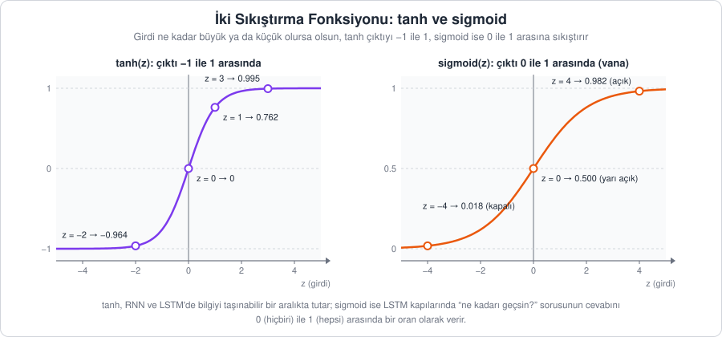

*Şekil 12.3 — İki sıkıştırma fonksiyonu. Solda tanh: girdi ne olursa olsun çıktı −1 ile 1 arasında kalır (tanh(1) ≈ 0.762, tanh(3) ≈ 0.995). Sağda sigmoid: çıktı 0 ile 1 arasındadır ve LSTM kapılarında "ne kadarı geçsin?" oranı olarak kullanılır (sigmoid(−4) ≈ 0.018 neredeyse kapalı, sigmoid(4) ≈ 0.982 neredeyse açık). Büyük girdilerde iki eğri de düzleşir; bu yüzden sinir ağlarında veri önce ölçeklenir (12.1.4).*

**Kaybolan gradyan (vanishing gradient) sorunu:** Ağ, yaptığı hatayı geriye doğru yayarak öğrenir: Son adımdaki hatadan başlayıp her ağırlığın bu hatadaki payını (gradyanını) hesaplar ve ağırlıkları buna göre düzeltir. Açılmış ağda bu, hatanın zaman adımları boyunca geriye taşınması demektir (zamanda geri yayılım, *backpropagation through time*, BPTT). Hata sinyali geriye doğru her adımda bir sayıyla çarpılır. Bu sayı, "bir önceki adımın hafızası çok az değişseydi bu adımın hafızası ne kadar değişirdi?" sorusunun cevabıdır. $k$ adım geriye gitmek, $k$ tane böyle sayıyı art arda çarpmak demektir:

| Geriye adım sayısı $`k`$ | Çarpan 0.5 ise | Çarpan 0.99 ise | Çarpan 1.5 ise |
| --- | --- | --- | --- |
| 1 | 0.5 | 0.99 | 1.5 |
| 5 | 0.031 | 0.951 | 7.6 |
| 10 | 0.00098 | 0.904 | 57.7 |
| 20 | 0.00000095 | 0.818 | 3325 |

Örneğin çarpan 0.5 ise 10 adım sonra $0.5^{10} = 0.5 \cdot 0.5 \cdot \ldots \cdot 0.5$ (10 kez) $= 1/1024 \approx 0.001$ olur: 10 ay önceki bir gözlemin hataya katkısı binde bire iner. 20 adımda $0.5^{20} \approx 0.000001$, yani neredeyse sıfırdır ve ağ bu uzak ilişkiyi **öğrenemez**. Aynı fikrin matematiksel yazımı şöyledir:

$$
\frac{\partial h_t}{\partial h_{t-k}} = \prod_{j=0}^{k-1} \frac{\partial h_{t-j}}{\partial h_{t-j-1}}
$$

> **Simge notu:** $`\partial`$ *(kısmi türev, "del")*: yuvarlak yazılmış bir d harfidir; $`\partial h_t / \partial h_{t-k}`$ "$`h_{t-k}`$ çok az değişirse $`h_t`$ ne kadar değişir?" sorusunun cevabı olan duyarlılık (eğim) sayısıdır · $`\prod`$ *(büyük pi, çarpım)*: altındaki ve üstündeki sınırlar arasındaki terimleri birbiriyle **çarp** demektir; 3.14 olan π sayısı değildir. Toplam sembolü Σ (büyük sigma) terimleri toplar, ∏ ise çarpar · $`j = 0`$'dan $`k - 1`$'e: sayaç j sırayla 0, 1, ..., k − 1 olur; böylece tam $`k`$ tane çarpan vardır

Günlük hayattan bir benzetme: Kulaktan kulağa oyununda mesaj her kişide biraz bozulur; zincir uzadıkça ilk söylenen cümle sona hiç ulaşmaz. Çarpanlar 1'den büyükse bunun tersi olur ve gradyan kontrolsüzce büyür (tablodaki 1.5 sütunu: 10 adımda yaklaşık 58 kat); buna **patlayan gradyan** (*exploding gradient*) denir. Bu durum genellikle gradyanı bir üst sınırla kırparak (*gradient clipping*) önlenir: Gradyanın büyüklüğü belirlenen eşiği (ör. 1) aşarsa eşiğe indirilir.

Zaman serisinde bunun anlamı şudur: Basit bir RNN, geçen ayın etkisini öğrenebilir ama 12 ay önceki mevsimsel etkiyi öğrenmekte zorlanır ($0.5^{12} \approx 0.00024$).

#### 12.2.2. LSTM Hücresi

**LSTM (Long Short-Term Memory, Uzun Kısa-Süreli Bellek)** mimarisi bu sorunu çözmek için geliştirilmiştir. LSTM'in sırrı, **kapı (gate)** adını verdiğimiz kontrol mekanizmalarıdır. Kapılar, hücrenin hafızasına hangi bilginin gireceğine, hangisinin kalacağına ve hangisinin çıkacağına karar verir. Böylece ağ, hangi bilgiyi uzun süre saklayacağını ve hangisini unutacağını veriden öğrenir.

Kapıları bir musluğun vanası gibi düşünebilirsiniz. Her kapı **sigmoid** fonksiyonuyla 0 ile 1 arasında bir sayı üretir (Şekil 12.3, sağ): 0 "vana tamamen kapalı, hiçbir şey geçmesin", 1 "vana tamamen açık, hepsi geçsin", 0.9 ise "yüzde 90'ı geçsin" demektir. Bu sayı, geçirilecek bilgiyle çarpılır. Bir defter benzetmesiyle: Unutma kapısı eski notların üzerini çizer, giriş kapısı deftere yeni not ekler, çıkış kapısı da defterden o an gereken kısmı yüksek sesle okur.

Bir LSTM hücresinin üç temel kapısı vardır:

1. **Unutma Kapısı (Forget Gate):** Geçmiş hafızadan hangi bilgilerin artık gereksiz olduğuna karar verir ve onları siler.
2. **Giriş Kapısı (Input Gate):** Yeni gelen bilgiden hangi kısımların önemli olduğuna karar verir ve bunları hafızaya ekler.
3. **Çıkış Kapısı (Output Gate):** Mevcut hafızaya ve yeni girdiye bakarak, bu zaman adımı için ne tür bir çıktı üreteceğine karar verir.

Aşağıdaki şema, bir LSTM hücresinin içsel çalışma mekanizmasını kavramsal olarak göstermektedir. Hücre durumu ($C_t$), bilgiyi uzun süre taşıyan bir "hafıza bandı" gibidir ve kapılar bu bant üzerindeki bilgi akışını kontrol eder.

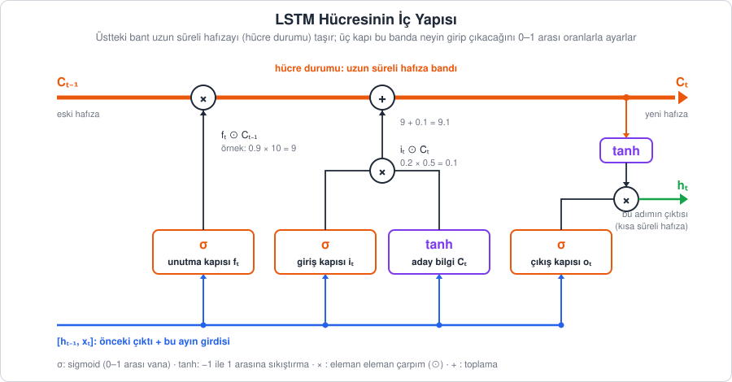

*Şekil 12.4 — LSTM hücresinin iç yapısı: Üstteki turuncu bant hücre durumudur (uzun süreli hafıza). Unutma, giriş ve çıkış kapıları (σ) bu bant üzerindeki bilgi akışını 0–1 arası oranlarla düzenler. Şekildeki küçük sayılar, aşağıdaki sayısal örneği izler.*

**Tanım (LSTM denklemleri):** Her zaman adımında hücre, önceki gizli durum $h_{t-1}$ ile yeni girdi $x_t$'yi birleştirir ve şu hesapları yapar:

```math
\begin{aligned}
f_t &= \sigma\left(W_f [h_{t-1}, x_t] + b_f\right) \\
i_t &= \sigma\left(W_i [h_{t-1}, x_t] + b_i\right) \\
\tilde{C}_t &= \tanh\left(W_C [h_{t-1}, x_t] + b_C\right) \\
C_t &= f_t \odot C_{t-1} + i_t \odot \tilde{C}_t \\
o_t &= \sigma\left(W_o [h_{t-1}, x_t] + b_o\right) \\
h_t &= o_t \odot \tanh\left(C_t\right)
\end{aligned}
```

> **Simge notu:** $`\sigma`$ *(küçük sigma)*: burada sigmoid fonksiyonudur; çıktıyı 0 ile 1 arasına sıkıştırır ve kapının "ne kadar açık" olduğunu gösterir. İstatistikteki standart sapma σ'sı ve toplam sembolü Σ (büyük sigma) ile karıştırmayın · $`W_f, W_i, W_C, W_o`$ ve $`b_f, b_i, b_C, b_o`$: her kapının kendi ağırlıkları ve sabit terimleri; alt indisteki f, i, C, o hangi kapıya ait olduklarını gösterir · $`[h_{t-1}, x_t]`$: iki vektörün uç uca eklenmesi (birleştirme); ör. $`[0.2, -0.1]`$ ile $`[0.5]`$ birleşince $`[0.2, -0.1, 0.5]`$ olur · $`\tilde{C}_t`$ *(C tilda t)*: hafızaya eklenmeye aday yeni bilgi · $`\odot`$ *(Hadamard çarpımı)*: iki vektörün eleman eleman çarpımı; ör. $`[0.9, 0.1] \odot [10, 20] = [0.9 \cdot 10,\ 0.1 \cdot 20] = [9, 2]`$ (sonuçlar toplanmaz) · $`f_t, i_t, o_t`$: unutma, giriş ve çıkış kapılarının değerleri · $`C_t`$: hücre durumu (uzun süreli hafıza) · $`h_t`$: bu adımın çıktısı (kısa süreli hafıza)

$W_f [h_{t-1}, x_t]$ yazımı, $W_{f,h}\, h_{t-1} + W_{f,x}\, x_t$ ile aynı şeydir: Ağırlık tablosu, dünkü hafızayı çarpan parça ile bugünkü girdiyi çarpan parça olmak üzere ikiye bölünüp sonuçlar toplanır. Örneğin $h_{t-1} = [0.2, -0.1]$, $x_t = [0.5]$ ve $W_f = [0.4, 0.6, 1.0]$ ise birleşik yazımla $0.4 \cdot 0.2 + 0.6 \cdot (-0.1) + 1.0 \cdot 0.5 = 0.08 - 0.06 + 0.5 = 0.52$ bulunur; ayrık yazımla da hafıza parçası $0.4 \cdot 0.2 + 0.6 \cdot (-0.1) = 0.02$, girdi parçası $1.0 \cdot 0.5 = 0.5$ ve toplam yine $0.52$'dir. Bölüm 15.2 bu ikinci yazımı kullanır: Girdiyi çarpan ağırlığa $W$, önceki gizli durumu çarpan ağırlığa $U$ der ($W x_t + U h_{t-1} + b$).

**Sayısal örnek:** Hafızayı tek bir sayı olarak düşünelim. Önceki hafıza $C_{t-1} = 10$ olsun (ör. "yaz zirvesi yaklaşıyor" bilgisini taşıyan büyük bir değer). Kapılar bu adımda $f_t = 0.9$, $i_t = 0.2$ ve aday bilgi $\tilde{C}_t = 0.5$ üretmiş olsun:

1. Unutma: $f_t \cdot C_{t-1} = 0.9 \cdot 10 = 9$ (eski bilginin %90'ı korunur)
2. Ekleme: $i_t \cdot \tilde{C}_t = 0.2 \cdot 0.5 = 0.1$ (yeni bilginin %20'si eklenir)
3. Yeni hafıza: $C_t = 9 + 0.1 = 9.1$
4. Çıktı: $o_t = 0.5$ ise $h_t = 0.5 \cdot \tanh(9.1) \approx 0.5 \cdot 1 = 0.5$

Unutma kapısı $f_t = 0$ üretseydi $C_t = 0 + 0.1 = 0.1$ olurdu, yani eski bilgi tamamen silinirdi. Unutma kapısı 12 ay boyunca 0.99 civarında kalırsa hafızadaki 10'un $10 \cdot 0.99^{12} \approx 8.86$'sı bir yıl sonra hâlâ duruyor olur. Basit RNN'deki 0.5 çarpanında aynı oran $0.5^{12} \approx 0.00024$ idi.

**Denklemlerin yorumu:**

- $f_t$, $i_t$ ve $o_t$ kapılarının her elemanı 0 ile 1 arasındadır. 0 "tamamen kapalı", 1 "tamamen açık" demektir.
- Dördüncü satır LSTM'in kalbidir: Yeni hafıza $C_t$, eski hafızanın unutma kapısından geçen kısmı ($f_t \odot C_{t-1}$) ile yeni aday bilginin giriş kapısından geçen kısmının ($i_t \odot \tilde{C}_t$) **toplamıdır**.
- Bu toplama yolu kaybolan gradyan sorununun çaresidir. Unutma kapısı 1'e yakın tutulduğunda bilgi (ve hata sinyali) hücre durumu boyunca neredeyse hiç zayıflamadan birçok adım taşınabilir (12.2.1'deki tablonun 0.99 sütunu). RNN'deki gibi her adımda bir `tanh` ile yeniden sıkıştırılmaz.
- Son satırda çıkış kapısı, hafızanın ne kadarının bu adımın çıktısı $h_t$ olarak dışarı verileceğini belirler.

LSTM'in daha sade bir akrabası olan **GRU** (Gated Recurrent Unit), unutma ve giriş kapılarını tek bir "güncelleme kapısı"nda birleştirir ve ayrı bir hücre durumu tutmaz. GRU, LSTM ve 1D-CNN'in Python uygulamaları Bölüm 15'te ele alınmaktadır.

#### 12.2.3. Transformer Modelleri ve Dikkat Mekanizması

Başlangıçta doğal dil işleme (NLP) için geliştirilen **Transformer** mimarisi, zaman serisi tahmininde de kullanılmaktadır. RNN ve LSTM'in aksine diziyi adım adım işlemez. Bunun yerine **dikkat mekanizması (attention mechanism)** sayesinde dizinin tüm adımlarına aynı anda bakar ve her adım için "geçmişteki hangi zaman noktaları şu an benim için önemli?" sorusunu yanıtlayan ağırlıklar öğrenir.

Fikri bir kütüphane benzetmesiyle anlatabiliriz: Aradığınız konuyu bir fişe yazarsınız (**sorgu**), raflardaki her kitabın sırtında bir etiket vardır (**anahtar**), kitabın içeriği ise **değerdir**. Fişiniz hangi etiketlere çok benziyorsa o kitaplardan daha çok, az benziyorsa daha az yararlanırsınız. Dikkat mekanizması bu "benzerliğe göre ağırlıklı yararlanma" işini sayılarla yapar.

**Tanım (ölçekli nokta çarpımı dikkati):**

$$
\mathrm{Attention}(Q, K, V) = \mathrm{softmax}\left(\frac{Q K^{\top}}{\sqrt{d_k}}\right) V
$$

> **Simge notu:** $`Q, K, V`$: her zaman adımından öğrenilen "sorgu" (query), "anahtar" (key) ve "değer" (value) vektörlerinin alt alta dizildiği tablolar (matrisler) · $`K^{\top}`$ *(K transpoz)*: K tablosunun satır ve sütunlarının yer değiştirmiş hâli; $`Q K^{\top}`$ çarpımı, her sorguyu her anahtarla karşılaştıran bir benzerlik tablosu üretir · nokta çarpımı: iki listenin eleman eleman çarpılıp toplanması; ör. $`[1, 0]`$ ile $`[2, 1]`$ için $`1 \cdot 2 + 0 \cdot 1 = 2`$; listeler aynı yöne baktıkça sonuç büyür · $`\sqrt{d_k}`$ *(karekök d k)*: anahtar vektörlerinin uzunluğunun (eleman sayısının) karekökü; puanların aşırı büyümesini önleyen bölen · $`\mathrm{softmax}`$: bir sayı listesini toplamı 1 olan pozitif ağırlıklara çeviren fonksiyon

**Sayısal örnek (softmax ve ağırlıklı ortalama):** Model Temmuz 1960'ı tahmin ederken üç geçmiş adıma bakıyor olsun: geçen yılın aynı ayı (Temmuz 1959, 548), geçen ay (Haziran 1960, 535) ve altı ay önce (Ocak 1960, 417). Sorgunun bu üç anahtarla ölçeklenmiş benzerlik puanları 2, 1 ve 0 çıkmış olsun. Softmax önce her puanı $e \approx 2.718$ sayısının kuvveti yapar, sonra toplama böler:

1. $e^2 \approx 7.389$, $e^1 \approx 2.718$, $e^0 = 1$; toplam $\approx 11.107$
2. Ağırlıklar: $7.389 / 11.107 \approx 0.665$, $2.718 / 11.107 \approx 0.245$, $1 / 11.107 \approx 0.090$ (toplamları 1)
3. Sonuç (değerlerin ağırlıklı ortalaması): $0.665 \cdot 548 + 0.245 \cdot 535 + 0.090 \cdot 417 \approx 364.4 + 131.1 + 37.5 = 533.0$

En benzer adım (geçen yılın Temmuz'u) sonuca en çok katkıyı yapar, ama diğer adımlar da tamamen yok sayılmaz.

**Yorum:** Her zaman adımı bir *sorgu* üretir ve bunu diğer tüm adımların *anahtarlarıyla* karşılaştırır. Benzerlik ne kadar yüksekse o adıma o kadar büyük ağırlık (dikkat) verilir. Sonuç, diğer adımların *değerlerinin* bu ağırlıklarla alınmış ortalamasıdır. Örneğin aylık bir seride model, Temmuz'u tahmin ederken geçen yılın ve iki yıl önceki Temmuz'un değerlerine yüksek dikkat vermeyi öğrenebilir. Uzaktaki bu adımlara bir RNN'deki gibi adım adım değil, **doğrudan** ulaştığı için hata sinyali uzun bir çarpım zincirinden geçmez ve kaybolan gradyan sorunu yaşanmaz.

Bilinmesi gereken birkaç nokta:

- Dikkat mekanizması sıraya kendiliğinden duyarlı değildir. Zaman bilgisini modele vermek için girdilere bir **konum kodlaması (positional encoding)** eklenir.
- Her adım diğer tüm adımlarla karşılaştırıldığı için hesaplama maliyeti dizi uzunluğunun karesiyle artar: 100 adımlık bir dizide $100 \cdot 100 = 10\,000$, 1000 adımlıkta $1\,000\,000$ karşılaştırma gerekir. Zaman serisine özel Transformer türevleri (Informer, Autoformer, PatchTST, Temporal Fusion Transformer vb.) bu maliyeti azaltmaya ve seriye özgü yapıları kullanmaya odaklanır.
- Transformer'lar genellikle **çok miktarda veri** ister. Tek bir kısa seride (ör. 144 aylık `AirPassengers`) basit modellerden daha iyi olmaları beklenmemelidir. Güçlerini binlerce ilişkili seri ya da çok uzun, yüksek frekanslı verilerde gösterirler.

---

### 12.3. Klasik, Makine Öğrenmesi ve Derin Öğrenme Yaklaşımlarının Karşılaştırılması

| Ölçüt | Klasik istatistiksel (ARIMA, SARIMA, Prophet, VAR) | Makine öğrenmesi (XGBoost, Random Forest) | Derin öğrenme (LSTM, GRU, 1D-CNN, Transformer) |
| --- | --- | --- | --- |
| Girdi | Serinin kendisi (ve varsa birkaç dışsal değişken) | Özellik tablosu: gecikmeler, takvim, dışsal değişkenler | Kayan pencereyle hazırlanmış diziler (3 boyutlu) |
| Temel varsayımlar | Durağanlık (ARIMA, VAR) veya belirli bir bileşen yapısı (Prophet); çoğunlukla doğrusal | Yok denecek kadar az; doğrusal olmayan ilişkileri yakalar | Yok denecek kadar az; en esnek yaklaşım |
| Veri ihtiyacı | Az (onlarca–yüzlerce gözlem yeterli) | Orta | Fazla (binlerce gözlem veya çok sayıda seri) |
| Özellik mühendisliği | Gerekmez; fark alma ve derece seçimi gerekir | **Kritik**: başarı büyük ölçüde özelliklere bağlıdır | Daha az; desenleri diziden kendisi öğrenir |
| Ölçekleme | Genellikle gerekmez (log dönüşümü gerekebilir) | Ağaç modellerinde gerekmez | Gerekir (ör. 0–1 aralığına) |
| Trendi geleceğe uzatma | İyi | Zayıf (ağaçlar eğitim aralığının dışına çıkamaz) | Orta; ölçekleme ve fark almaya bağlı |
| Yorumlanabilirlik | Yüksek (katsayılar, bileşenler) | Orta (özellik önemleri) | Düşük ("kara kutu") |
| Belirsizlik aralığı | Doğal olarak üretilir | Ek yöntem gerekir (ör. kantil regresyon) | Ek yöntem gerekir |
| Hesaplama maliyeti | Düşük | Düşük–orta | Yüksek (GPU gerekebilir) |
| Bu derste | Bölüm 7, 9, 10, 11 | Bölüm 13, 14 | Bölüm 15 |

**Hangisini seçmeliyim?** Tek bir kısa ve düzenli seride klasik modeller çoğu zaman yeterlidir, hatta daha iyidir. Çok sayıda dışsal değişken, doğrusal olmayan etkiler ya da takvim etkileri söz konusuysa makine öğrenmesi öne çıkar. Çok büyük veri setlerinde ve karmaşık ardışık desenlerde ise derin öğrenme avantaj sağlar. Hangi yaklaşım seçilirse seçilsin, modeller Bölüm 8'deki metriklerle, aynı test dönemi üzerinde ve basit bir referans modelle (naive) karşılaştırılarak değerlendirilmelidir. Bu ilkeler Bölüm 17'deki altın kurallarda da özetlenmektedir.

---

<a id="bolum-13"></a>

## 13. XGBoost ile Zaman Serisi Tahmini

Şimdiye kadar zaman serilerine farklı açılardan yaklaştık: ARIMA seriyi istatistiksel bir süreç olarak modelledi (Bölüm 7), Prophet trend ve takvim etkilerini ayrıştırdı (Bölüm 9). XGBoost (Extreme Gradient Boosting) ise bambaşka bir yol izler: zaman serisini bir **regresyon problemine** (sayısal bir hedefi girdilerden tahmin etme problemine) dönüştürür ve bu problemi çok sayıda küçük karar ağacının birlikte çalışmasıyla çözer.

Bu dönüşümün özü şu soruda yatar: *"Geçmiş değerleri ve takvim bilgisini biliyorsam, gelecek değeri tahmin edebilir miyim?"* Bunun için geçmiş gözlemleri (gecikme/lag özellikleri) ve takvim bilgilerini (ay, çeyrek) girdi olarak kullanırız. Zaman serisini bu şekilde denetimli öğrenme formatına çevirmenin genel mantığını Bölüm 12'de görmüştük; bu bölümde onu somut bir modelle uygulayacağız.

Bölümün akışı şöyledir: önce XGBoost'un dayandığı kavramları (karar ağacı, gradient boosting, düzenlileştirme) ele alacağız; ardından ağaç modellerinin zaman serilerinde karşılaştığı en önemli sınırlılığı, yani **ekstrapolasyon yapamamayı** tartışacağız. Son olarak modeli önce Python ile, sonra kod yazmadan Weka Explorer ile uygulayacağız.

### 13.1. Temel Fikir: Karar Ağacından Gradient Boosting'e

#### 13.1.1. Karar Ağacı

**Açıklama:** Karar ağacı, veriyi art arda sorulan "evet/hayır" sorularıyla gruplara ayırır. Örneğin yolcu sayısını tahmin eden bir ağaç şöyle kurallar öğrenebilir: *"Önceki ayın yolcu sayısı 300'den fazlaysa **ve** ay Temmuz ise tahmin 350'dir."* Her soru bir **düğüm**, soruların sonunda varılan her grup bir **yaprak** olarak adlandırılır. Ağaç soruları kendisi seçer: Her adımda olası bütün eşikleri dener ve iki gruptaki hatayı en çok azaltan soruyu seçer.

Şekil 13.1, `AirPassengers` eğitim verisine tek bir özellikle (`lag_1`, önceki ayın yolcu sayısı) uydurulmuş gerçek bir ağacı gösterir. Derinlik 2 olduğu için ağaç en fazla iki soru sorar ve dört yaprağa ulaşır.

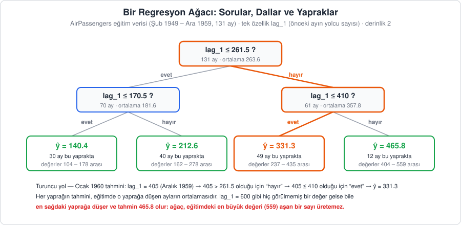

*Şekil 13.1 — `AirPassengers` (Şubat 1949 – Aralık 1959) üzerinde, yalnızca `lag_1` özelliğiyle kurulmuş derinliği 2 olan bir regresyon ağacı (scikit-learn ile gerçek uyum). Her yaprağın tahmini, o yaprağa düşen ayların ortalamasıdır. Turuncu yol Ocak 1960'ın tahminini izler. En sağdaki yaprak, eğitimdeki en büyük değer 559 olsa bile 465.8'in üzerine çıkamaz.*

**Tanım:** Bir regresyon ağacı, girdi uzayını (girdilerin alabileceği tüm değer bileşimlerini) $T$ adet ayrık bölgeye ( $R_1, R_2, \dots, R_T$ ) ayırır ve her bölgeye sabit bir değer atar. Bir gözlemin tahmini, düştüğü yaprağın değeridir:

$$\hat{y}(x) = w_j \quad \text{eğer } x \in R_j$$

Kare hata kullanıldığında $w_j$, eğitimde o yaprağa düşen hedef değerlerin **ortalamasıdır**. Bu ayrıntı, 13.3'te göreceğimiz ekstrapolasyon sorununun kaynağıdır.

> **Simge notu:** $`x`$: burada serinin tek bir değeri değil, bir satırın bütün özellikleri (ör. `lag_1` = 405) · $`\hat{y}`$ *(y şapka)*: modelin tahmini · $`w_j`$ *(w j)*: j. yaprağın tahmin değeri (yaprak ağırlığı) · $`\in`$ *(elemanıdır)*: "içinde yer alır"; $`x \in R_j`$ "x, j. bölgeye düşüyor" demektir. Bu işaret epsilon (ε) harfi değildir · $`R_j`$ *(R j)*: ağacın j. bölgesi (yaprağı) · $`T`$: yaprak sayısı (Şekil 13.1'de 4)

Şekildeki turuncu yolu izleyelim: Ocak 1960'ı tahmin ederken `lag_1` Aralık 1959'un değeri olan 405'tir. İlk soru "405 ≤ 261.5 mi?" sorusudur; cevap hayır olduğu için sağa gidilir. İkinci soru "405 ≤ 410 mu?" sorusudur; cevap evet olduğu için tahmin, bu yapraktaki 49 ayın ortalaması olan **331.3** olur (gerçek değer 417'dir; iki soruluk bir ağaç kaba bir tahmincidir).

Yaprak değerinin neden ortalama olduğunu küçük bir örnekle görelim. Bir yaprağa 400, 430 ve 460 değerli üç ay düşmüş olsun. Ortalama 430'u tahmin edersek kare hatalar toplamı $30^2 + 0^2 + 30^2 = 900 + 0 + 900 = 1800$ olur. 440'ı tahmin etseydik $40^2 + 10^2 + 20^2 = 1600 + 100 + 400 = 2100$ olurdu. Kare hatayı en küçük yapan tek sayı ortalamadır; ortalama ise hiçbir zaman yapraktaki en büyük değeri aşamaz.

Tek bir ağaç tek başına genellikle zayıf bir tahmincidir: sığ tutulursa veriyi kaba basamaklarla özetler (Şekil 13.1'deki gibi yalnızca dört farklı tahmin üretir), derin tutulursa eğitim verisini ezberler (aşırı öğrenme).

#### 13.1.2. Boosting: Hataları Adım Adım Düzeltmek

**Açıklama:** *Boosting*, çok sayıda zayıf modeli **sırayla** kurarak güçlü bir model elde etme fikridir. İlk ağaç veriye kaba bir uyum sağlar. İkinci ağaç veriyi değil, **ilk ağacın yaptığı hataları** (artıkları; artık = gerçek değer − tahmin) öğrenir. Üçüncü ağaç, ilk ikisinin toplamının hâlâ düzeltemediği hataları öğrenir ve bu böyle sürer. Her ağaç küçük bir düzeltme yapar; yüzlerce düzeltmenin toplamı güçlü bir model oluşturur.

Bunu bir öğrencinin sınava hazırlanmasına benzetebiliriz: ilk deneme sınavından sonra yalnızca yanlış yaptığı konulara çalışır, ikinci denemeden sonra yine kalan yanlışlarına odaklanır.

**Sayısal örnek:** Üç aylık küçük bir veri düşünelim: A, B ve C aylarının gerçek değerleri 100, 130 ve 160 olsun. Her ağacın katkısını yarıya indirelim (öğrenme hızı $\eta = 0.5$; pratikte 0.05–0.1 gibi daha küçük değerler kullanılır, burada etkiyi açıkça görmek için büyük seçtik). Her ağaç tek bir soru sorar, yani veriyi ikiye ayırır ve her gruba o gruptaki artıkların ortalamasını verir:

| Adım | A | B | C | Kare hata toplamı |
| --- | --- | --- | --- | --- |
| Gerçek değer $`y`$ | 100 | 130 | 160 | |
| Başlangıç tahmini $`f_0`$ = ortalama | 130 | 130 | 130 | $`30^2 + 0^2 + 30^2 = 1800`$ |
| Artık 1 (gerçek − tahmin) | −30 | 0 | 30 | |
| Ağaç 1: {A} ve {B, C} grupları | −30 | 15 | 15 | |
| Tahmin 1 = önceki + 0.5 × ağaç 1 | 115 | 137.5 | 137.5 | 787.5 |
| Artık 2 | −15 | −7.5 | 22.5 | |
| Ağaç 2: {A, B} ve {C} grupları | −11.25 | −11.25 | 22.5 | |
| Tahmin 2 = önceki + 0.5 × ağaç 2 | 109.375 | 131.875 | 148.75 | 217.97 |
| Artık 3 | −9.375 | −1.875 | 11.25 | |

Ağaç 1'in {B, C} yaprağı, iki artığın ortalamasıdır: $(0 + 30) / 2 = 15$. A ayının tahmini $130 + 0.5 \cdot (-30) = 115$ olur. Her turda artıklar küçülür ve kare hata toplamı 1800 → 787.5 → 217.97 diye düşer. Şekil 13.2 aynı mekanizmayı daha büyük bir veride gösterir.


*Şekil 13.2 — Gradient boosting mekanizması. (1) İlk ağaç veriye kaba bir basamak fonksiyonu uydurur. (2–3) Sonraki her ağaç, o ana kadarki toplam modelin artıklarını (kırmızı) öğrenir. (4) Ağaçların toplamı veriye giderek daha iyi uyar; yüzlerce küçük adımla (η = 0.1) pürüzsüz bir uyum elde edilir.*

**Tanım (Gradient Boosting):** Başlangıç tahmini $f_0$ (genellikle hedefin ortalaması) olmak üzere, $m$. adımda önce her gözlemin artığı hesaplanır:

$$r_i^{(m)} = y_i - \hat{y}_i^{(m-1)}$$

Ardından bu artıklara yeni bir ağaç $f_m$ uydurulur ve model küçük bir adımla güncellenir:

$$\hat{y}_i^{(m)} = \hat{y}_i^{(m-1)} + \eta f_m(x_i)$$

$M$ ağaç kurulduktan sonra nihai tahmin, tüm ağaçların katkılarının toplamıdır:

$$\hat{y}_i = f_0 + \eta \sum_{m=1}^{M} f_m(x_i)$$

> **Simge notu:** $`i`$ (alt indis): kaçıncı gözlem olduğu (yukarıdaki örnekte A, B, C) · $`(m)`$ (parantez içindeki üst simge): kaçıncı adım olduğu; **bir üs değildir**, "m'nin kuvveti" diye okunmaz · $`r_i^{(m)}`$ *(r i, m. adım)*: m. ağacın öğrendiği artık · $`\hat{y}_i^{(m-1)}`$: bir önceki adımdaki tahmin · $`\eta`$ *(eta)*: öğrenme hızı (learning rate), her ağacın katkısını küçülten katsayı; Latin n harfine benzer ama Yunanca eta harfidir · $`f_m(x_i)`$ *(f m, x i)*: m. ağacın i. gözlem için verdiği değer · $`\sum_{m=1}^{M}`$ *(büyük sigma, toplam)*: m'yi 1'den M'ye kadar değiştirip terimleri topla; yani $`f_1(x_i) + f_2(x_i) + \dots + f_M(x_i)`$ · $`M`$: toplam ağaç sayısı

Örnekteki A ayı için son formül şöyle işler: $130 + 0.5 \cdot (-30) + 0.5 \cdot (-11.25) = 130 - 15 - 5.625 = 109.375$.

Yönteme "gradient" (gradyan) denmesinin nedeni şudur. **Kayıp** (loss), bir tahminin ne kadar kötü olduğunu ölçen sayıdır; kare hata kaybı $L = \frac{1}{2}(y - \hat{y})^2$'dir (baştaki ½ yalnızca hesabı sadeleştirmek içindir). **Türev**, tahmin çok az değiştiğinde kaybın ne hızla değiştiğini (eğimini) söyler. Kare hata kaybının tahmine göre türevinin ters işaretlisi tam olarak artıktır:

$$-\frac{\partial L}{\partial \hat{y}} = y - \hat{y}$$

Sayılarla deneyelim: $y = 100$ ve $\hat{y} = 90$ iken kayıp $\frac{1}{2} \cdot 10^2 = 50$'dir. Tahmini 1 artırıp 91 yaparsak kayıp $\frac{1}{2} \cdot 9^2 = 40.5$ olur; yani tahmindeki 1 birimlik artış kaybı yaklaşık 10 birim azaltır. Eğim yaklaşık −10'dur, ters işaretlisi +10'dur ve bu da artığın kendisidir ($100 - 90 = 10$). Yani artıklara ağaç uydurmak, kaybı en hızlı azaltan yönde (gradyanın tersi yönünde) adım atmakla, yani **gradyan inişiyle** aynı şeydir. Başka kayıp fonksiyonları (ör. mutlak hata) kullanıldığında ağaçlar artık yerine bu negatif gradyana uydurulur.

> **Simge notu:** $`L`$: tek bir gözlemin kaybı · $`\partial`$ *(kısmi türev, "del")*: bir büyüklüğün diğerine göre değişim hızı; $`\partial L / \partial \hat{y}`$ "tahmin çok az değişince kayıp ne kadar değişir?" demektir

#### 13.1.3. XGBoost'u Farklı Kılan: Düzenlileştirme

XGBoost, gradient boosting'in hızlı ve düzenlileştirilmiş (regularized) bir uygulamasıdır. Klasik gradient boosting yalnızca tahmin hatasını küçültmeye çalışırken, XGBoost amaç fonksiyonuna ağaçların **karmaşıklığını cezalandıran** bir terim ekler. Sözle: *toplam puan = tahmin hatası + karmaşıklık cezası*; model bu toplamı küçültmeye çalışır, dolayısıyla hatayı çok az azaltan karmaşık bir ağacı kurmaya değmez.

$$\mathcal{L} = \sum_{i=1}^{n} l(y_i, \hat{y}_i) + \sum_{m=1}^{M} \Omega(f_m)$$

$$\Omega(f) = \gamma T + \frac{1}{2} \lambda \sum_{j=1}^{T} w_j^2$$

Burada ilk terim tahmin hatasını (ör. kare hata), ikinci terim ise her ağacın karmaşıklığını ölçer. $T$ ağaçtaki yaprak sayısıdır.

> **Simge notu:** $`\mathcal{L}`$ *(kaligrafik L)*: en küçüklenecek toplam amaç fonksiyonu · $`l(y_i, \hat{y}_i)`$ *(küçük l)*: tek bir gözlemin kaybı, ör. $`(y_i - \hat{y}_i)^2`$ · $`\sum_{i=1}^{n}`$: i'yi 1'den n'ye (tüm eğitim gözlemleri) kadar değiştirip topla · $`\Omega`$ *(büyük omega)*: ağaç karmaşıklığı cezası · $`\gamma`$ *(gama)*: her yeni yaprak için ödenen ceza · $`\lambda`$ *(lambda)*: yaprak değerlerinin büyüklüğüne verilen ceza (L2 düzenlileştirme) · $`w_j^2`$: j. yaprağın değerinin karesi (burada üst simge 2 gerçekten bir üstür)

**Sayısal örnek:** $\gamma = 1$ ve $\lambda = 1$ olsun. Üç yapraklı, yaprak değerleri 2, −1 ve 3 olan bir ağacın cezası $\Omega = 1 \cdot 3 + \frac{1}{2} \cdot 1 \cdot (2^2 + (-1)^2 + 3^2) = 3 + \frac{1}{2} \cdot 14 = 3 + 7 = 10$'dur. İki yapraklı, yaprak değerleri 1 ve −1 olan daha sade bir ağacın cezası ise $2 + \frac{1}{2} \cdot (1 + 1) = 3$'tür. Karmaşık ağaç hatayı sade ağaca göre en az $10 - 3 = 7$ birim daha fazla azaltmıyorsa XGBoost sade ağacı tercih eder.

**Yorum:** $\gamma$ büyüdükçe model yeni bir bölme yapmak için daha fazla hata azalması "talep eder": Bir bölme, hatayı en az $\gamma$ kadar azaltmıyorsa yapılmaz ve ağaçlar sade kalır. $\lambda$ büyüdükçe yaprak değerleri sıfıra doğru çekilir ve her ağacın tek başına yapabileceği aşırı düzeltmeler engellenir. Kare hata kaybında XGBoost'un bir yaprağa verdiği değer, *yapraktaki artıkların toplamı / (yapraktaki gözlem sayısı + λ)* formülüyle hesaplanır. Artıkları 10, 20 ve 30 olan bir yaprak için (toplam 60, gözlem sayısı 3): $\lambda = 0$ iken $60 / 3 = 20$ (düz ortalama), $\lambda = 1$ iken $60 / 4 = 15$, $\lambda = 3$ iken $60 / 6 = 10$ olur. İki cezanın ortak amacı, modelin eğitim verisini ezberlemesini (aşırı öğrenme) önlemektir.

XGBoost bunlara ek olarak ikinci dereceden türev bilgisini (eğimin yanında eğimin ne kadar hızlı değiştiğini, yani kayıp eğrisinin bükülmesini) kullanan hızlı bir bölme arama algoritması, eksik değerleri kendiliğinden yönetme ve paralel hesaplama gibi mühendislik iyileştirmeleri de sunar. Tablo biçimindeki (yapılandırılmış) verilerde çoğu zaman en iyi sonuç veren yöntemlerden biri olmasının nedeni budur.

#### 13.1.4. Temel Hiperparametreler

| Hiperparametre | Formüldeki karşılığı | Ne işe yarar? | Tipik değer |
| --- | --- | --- | --- |
| `n_estimators` | ağaç sayısı $`M`$ | Kaç düzeltme adımı yapılacağı. Az olursa eksik öğrenme, çok olursa aşırı öğrenme riski; erken durdurma ile belirlenir. | 100–1000 |
| `learning_rate` | $`\eta`$ | Her ağacın katkısı. Küçük değer daha yavaş ama daha kararlı öğrenme sağlar, daha çok ağaç gerektirir. | 0.01–0.1 |
| `max_depth` | ağaç derinliği | Bir ağacın art arda kaç soru sorabileceği; derinlik 4 en fazla $`2^4 = 16`$ yaprak demektir. Derin ağaçlar karmaşık etkileşimleri yakalar ama ezberlemeye yatkındır. | 3–6 |
| `subsample` | — | Her ağaçta kullanılan satır (gözlem) oranı; rastgelelik ekleyerek aşırı öğrenmeyi azaltır. | 0.7–1.0 |
| `colsample_bytree` | — | Her ağaçta kullanılan özellik (sütun) oranı. | 0.7–1.0 |
| `gamma`, `reg_lambda` | $`\gamma`$, $`\lambda`$ | 13.1.3'teki düzenlileştirme cezaları. | 0 / 1 (varsayılan) |
| `early_stopping_rounds` | — | Doğrulama hatası bu kadar tur boyunca iyileşmezse eğitimi durdurur. xgboost 2.0 ve sonrasında modelin kurucusuna (`XGBRegressor(...)`) yazılır; eski kodlardaki `fit(..., early_stopping_rounds=...)` biçimi artık hata verir. | 20–50 |

**Not —** `n_estimators` ile `learning_rate` birbirine bağlıdır: öğrenme hızını yarıya indirirseniz, aynı uyumu yakalamak için yaklaşık iki kat ağaç gerekir. Örneğin $\eta = 0.1$ iken 30 birimlik bir artığı tam öğrenen bir ağaç tahmini yalnızca $0.1 \cdot 30 = 3$ birim düzeltir; $\eta = 0.05$ iken aynı ağaç 1.5 birim düzeltir.

### 13.2. Zaman Serisini XGBoost'a Hazırlamak

XGBoost zamanın akışını kendiliğinden anlamaz; ona göre her satır birbirinden bağımsız bir örnektir. Bu yüzden zamansal bilgiyi **özellik mühendisliği** ile satırların içine yerleştirmemiz gerekir (dönüşümün genel mantığı için bkz. Bölüm 12). Kullanacağımız özellik grupları şunlardır:

| Özellik grubu | Örnek | Neyi yakalar? |
| --- | --- | --- |
| Gecikmeler (lags) | `lag_1`, …, `lag_12` | Kısa dönem bağımlılık ve (12. gecikme ile) mevsimsellik |
| Hareketli istatistikler | `rolling_mean_12`, `rolling_std_3` | Yerel düzey (trend) ve oynaklık |
| Yıllık değişim | `lag_1 − lag_13` | Büyüme hızı |
| Takvim | `month`, `quarter` | Takvime bağlı mevsimsel etkiler |

Hareketli standart sapma, son birkaç ayın ne kadar dalgalandığını ölçer. **Standart sapma**, değerlerin ortalamadan tipik olarak ne kadar uzaklaştığını gösteren yayılım ölçüsüdür: Şubat–Nisan 1949'un değerleri 118, 132 ve 129'dur; ortalamaları 126.33, standart sapmaları yaklaşık 7.4'tür. Üç ay da 126 olsaydı standart sapma 0 olurdu. Yıllık değişim ise örneğin Ocak 1960 satırında `lag_1 − lag_13` = Aralık 1959 − Aralık 1958 = $405 - 337 = 68$ olarak hesaplanır: Son bilinen ay, bir yıl öncesine göre 68 bin yolcu artmıştır.

**Not —** Her özellik yalnızca tahmin anından **önce** bilinen bilgilerle hesaplanmalıdır. Örneğin $t$ anının özelliği olarak $y_t - y_{t-12}$ kullanmak, hedef değeri ($y_t$) özelliğin içine gizlemek anlamına gelir: Ocak 1960 satırında bu özellik $417 - 360 = 57$ olur ve içinde tahmin etmeye çalıştığımız 417 vardır. Model bu durumda eğitimde ve testte olağanüstü başarılı görünür, ama gerçek gelecekte bu bilgi elimizde olmayacağı için çalışmaz. Bu hataya **veri sızıntısı** (data leakage) denir (bkz. 12.1.5). Python kodunda bu yüzden hareketli istatistikler ve yıllık değişim, `shift(1)` ile bir adım kaydırılarak hesaplanmıştır.

### 13.3. Önemli Bir Sınırlılık: Ağaçlar Ekstrapolasyon Yapamaz

Bu bölümün belki de en önemli uyarısı budur. **Ekstrapolasyon** (dışdeğerleme), eğitimde görülen aralığın dışına taşan bir tahmin üretmektir. 13.1.1'de gördüğümüz gibi, bir ağacın her yaprağı eğitimde o yaprağa düşen hedef değerlerin ortalamasını verir. Bunun doğal sonucu şudur: tek bir regresyon ağacının tahmini **hiçbir zaman** eğitim verisinde görülen en küçük ve en büyük hedef değerin dışına çıkamaz.

$$\min_i y_i \le \hat{y}(x) \le \max_i y_i$$

> **Simge notu:** $`\le`$ *(küçük eşittir)* · $`\min_i y_i`$, $`\max_i y_i`$ *(minimum, maksimum)*: i'yi tüm eğitim gözlemleri üzerinde gezdirerek bulunan en küçük ve en büyük y değeri

Şekil 13.1'deki ağaçta bunu doğrudan görürüz: `lag_1` = 600 gibi eğitimde hiç görülmemiş bir değer gelse bile gözlem en sağdaki yaprağa düşer ve tahmin 465.8 olur. Gradient boosting topluluğunda bu sınır tam olarak kesin olmasa da (çok sayıda ağacın küçük katkıları toplanır) pratikte geçerlidir: model, eğitimde gördüğü düzeyin belirgin biçimde üstüne çıkamaz.

**Bu neden zaman serilerinde sorun?** Trendli bir seride (AirPassengers gibi) gelecek değerler çoğu zaman geçmişte hiç görülmemiş düzeydedir. Model, girdi olarak "zaman" veya "yıl" bilgisi verilse bile, eğitim aralığının dışındaki bir yıl için en son öğrendiği yaprağı kullanır ve tahmin düz bir tavana takılır. Model trendi "devam ettiremez"; yalnızca eğitimde gördüğü en yüksek düzeyi tekrar eder.


*Şekil 13.3 — Trendli bir seride ağaç tabanlı model (kırmızı) test döneminde eğitimdeki en yüksek düzeyin etrafında kalır ve trendi izleyemez. Trend önce çıkarılıp ağaç yalnızca trendden arındırılmış bileşene uygulandığında ve trend sonra geri eklendiğinde (yeşil kesikli) tahmin gerçek seriyi izler.*

AirPassengers verisinde de bu durumu görürüz: eğitim dönemindeki en yüksek değer 559 iken 1960 yılının test döneminde değerler 622'ye kadar çıkar. Seviye üzerinden eğitilen bir XGBoost modeli yaz zirvesini sistematik olarak **düşük** tahmin eder: 13.4'teki koddaki "Ekstrapolasyon kontrolü" çıktısında modelin testteki en büyük tahmini 544'tür, yani eğitimdeki 559'un bile altında kalır.

**Çözümler:** Temel fikir, modele eğitim ve test döneminde aynı aralıkta kalan bir hedef vermektir.

1. **Fark alarak tahmin:** Seviye ($y_t$) yerine bir önceki döneme göre değişim tahmin edilir ve sonra seviyeye geri dönülür (fark operatörü için bkz. Bölüm 2.1):

   $$d_t = y_t - y_{t-1}, \qquad \hat{y}_t = y_{t-1} + \hat{d}_t$$

   Burada $d_t$ bu ayın değişimi, $\hat{d}_t$ *(d şapka t)* modelin tahmin ettiği değişimdir. Örneğin Aralık 1959 = 405 ve Ocak 1960 = 417 ise $d = 417 - 405 = 12$'dir; model Ocak için $\hat{d} = 10$ tahmin ederse seviye tahmini $405 + 10 = 415$ olur. Değişimlerin aralığı zamanla çok daha az kayar (AirPassengers'ta aylık değişim eğitimde −101 ile +76, testte −98 ile +87 arasındadır); bu yüzden ağaç bu hedefte sınır sorunu yaşamaz. Mevsimsel veride $d_t = y_t - y_{t-12}$ (mevsimsel fark) da kullanılabilir.

2. **Trendi çıkarma (detrend):** Önce basit bir trend modeli (ör. doğrusal regresyon) uydurulur, ağaç yalnızca trendden arta kalan kısmı öğrenir, tahminde trend geri eklenir (Şekil 13.3'teki yeşil çizgi).

3. **Logaritma + fark:** Mevsimsel dalgaların genliği seviyeyle birlikte büyüyorsa (çarpımsal yapı, bkz. Bölüm 2.4) önce logaritma alınıp sonra fark alınabilir; bu durumda model yaklaşık yüzde değişimi öğrenir. Örneğin 100'den 110'a çıkışta doğal logaritmaların farkı $\ln 110 - \ln 100 \approx 0.095$'tir, yani yaklaşık %10'luk artışa karşılık gelir.

**Not —** Bu sorun yalnızca XGBoost'a özgü değildir; Random Forest, REPTree gibi tüm ağaç tabanlı yöntemler (13.5'te Weka'da kullanacağımız algoritmalar dahil) aynı sınırlılığa sahiptir. ARIMA ise fark alma işlemini modelin içinde yaptığı için (Bölüm 7) trendi doğal olarak sürdürebilir.

### 13.4. Python ile XGBoost Uygulaması

Aşağıdaki kod AirPassengers verisi üzerinde uçtan uca bir XGBoost uygulamasıdır: veri hazırlığı, özellik mühendisliği, eğitim/doğrulama/test ayrımı, erken durdurma ile model eğitimi, değerlendirme, özellik önemi, görselleştirme ve zaman serisi çapraz doğrulaması. Kodu çalıştırmak için `pip install xgboost` ile paketi kurmanız gerekir.

Programın tamamı (yaklaşık 430 satır) uygulama dosyasındadır; aşağıda yalnızca kilit satırlarını görüyorsunuz.

```python
# XGBoost ile AirPassengers — kilit satırlar (tam kod: Codes/python/ch13_xgboost.py)
# 2) Özellik mühendisliği: her özellik yalnızca geçmiş bilgiden (shift) üretilir
for lag in range(1, 13):
    df_features[f'lag_{lag}'] = df_features['Passengers'].shift(lag)
df_features['rolling_mean_12'] = df_features['Passengers'].shift(1).rolling(12).mean()
df_features['seasonal_diff'] = df_features['Passengers'].shift(1) - df_features['Passengers'].shift(13)
df_features['month'] = df_features.index.month
df_features = df_features.dropna()          # ilk satırlardaki NaN'lar atılır

# 3) Zaman sıralı bölme: son 12 ay test, eğitimin son 12 ayı doğrulama
split_point = len(X) - test_size
X_train, X_test = X.iloc[:split_point], X.iloc[split_point:]
y_train, y_test = y.iloc[:split_point], y.iloc[split_point:]
X_tr_in, X_val = X_train.iloc[:-val_size], X_train.iloc[-val_size:]
y_tr_in, y_val = y_train.iloc[:-val_size], y_train.iloc[-val_size:]

# 4) Erken durdurmayla ağaç sayısını bul, sonra tüm eğitim verisiyle yeniden eğit
params = dict(learning_rate=0.05, max_depth=4, subsample=0.8,
              colsample_bytree=0.8, random_state=SEED)
es_model = xgb.XGBRegressor(n_estimators=1000, early_stopping_rounds=50, **params)
es_model.fit(X_tr_in, y_tr_in, eval_set=[(X_val, y_val)], verbose=False)
best_n = es_model.best_iteration + 1
model = xgb.XGBRegressor(n_estimators=best_n, **params)
model.fit(X_train, y_train)

# 5) Test tahmini ve metrikler (MAE, RMSE, MAPE; bkz. Bölüm 8)
y_test_pred = model.predict(X_test)
test_mae, test_rmse, test_mape = calculate_metrics(y_test, y_test_pred, "Test Seti")
```

Bu satırların her biri belirli bir iş görür:

1. **Gecikmeler:** `range(1, 13)` 1'den 12'ye kadar sayıları üretir (13 dahil değildir). Her tur için `shift(lag)` ile `lag_1` … `lag_12` sütunları oluşur (12.1.2'deki `shift` açıklaması).
2. **Hareketli ortalama ve yıllık değişim:** `shift(1).rolling(12).mean()` her ayın yanına kendisinden önceki 12 ayın ortalamasını yazar. `seasonal_diff`, `shift(1) - shift(13)` yani `lag_1 − lag_13` farkıdır (13.2'deki örnek: 68).
3. **`dropna()`:** En uzun kaydırma `shift(13)` olduğu için ilk 13 satır NaN içerir ve atılır; 144 aydan **131** satır (Şubat 1950 – Aralık 1960) kalır.
4. **Bölme:** `split_point = len(X) - test_size` = $131 - 12 = 119$'dur. `X.iloc[:119]` ilk 119 satırı (Şubat 1950 – Aralık 1959) eğitime, `X.iloc[119:]` son 12 satırı (1960) teste ayırır. Eğitimin içinden `iloc[:-12]` ile ilk 107 satır (Şubat 1950 – Aralık 1958) asıl eğitime, `iloc[-12:]` ile 1959 yılı doğrulamaya ayrılır. Hiçbir aşamada satırlar karıştırılmaz.
5. **`params` ve `**params`:** `dict(...)` hiperparametreleri bir sözlükte (anahtar–değer listesi) toplar. `XGBRegressor(..., **params)` yazımındaki iki yıldız sözlüğü "açar", yani `learning_rate=0.05, max_depth=4, ...` argümanlarını tek tek yazmışız gibi iletir. Böylece aynı ayarlar üç ayrı modelde tekrar yazılmadan kullanılır. Ayarların anlamı: `learning_rate=0.05` her ağacın katkısını %5'e indirir; `max_depth=4` her ağacın en fazla 4 soru sormasına izin verir; `subsample=0.8` her ağacın satırların rastgele %80'iyle, `colsample_bytree=0.8` ise 21 özelliğin rastgele %80'iyle (16 özellik) kurulmasını sağlar; `random_state=SEED` bu rastgeleliği sabitler, böylece kod her çalıştığında aynı sonucu verir.
6. **Erken durdurma:** `XGBRegressor(n_estimators=1000, early_stopping_rounds=50, ...)` en fazla 1000 ağaç kurmaya hazırdır, ama doğrulama hatası art arda 50 ağaç boyunca iyileşmezse durur. `fit(X_tr_in, y_tr_in, eval_set=[(X_val, y_val)], verbose=False)` modeli asıl eğitim verisiyle kurar; `eval_set`, içinde `(girdi, hedef)` çiftleri bulunan bir listedir ve model her yeni ağaçtan sonra bu kümedeki hatayı (varsayılan olarak RMSE) ölçer. `verbose=False`, her turun hatasının ekrana yazdırılmasını engeller. xgboost 2.0 ve sonrasında `early_stopping_rounds` kurucuya yazılır; `fit()` içine yazılırsa hata alınır.
7. **`best_iteration`:** Doğrulama hatasının en düşük olduğu turun numarasıdır. Python'da sayma 0'dan başladığı için bu numaranın 1 fazlası ağaç sayısıdır: `best_n = best_iteration + 1`. Bizim çalıştırmamızda `best_iteration` = 172, yani `best_n` = 173'tür; eğitim, 173. ağaçtan sonra 50 tur daha denenip iyileşme görülmeyince 223. ağaçta durmuştur.
8. **Yeniden eğitim ve tahmin:** `XGBRegressor(n_estimators=best_n, **params)` aynı ayarlarla, ama tam 173 ağaçlık yeni bir model kurar ve `fit(X_train, y_train)` ile doğrulama yılı dahil bütün eğitim verisinde eğitir. `model.predict(X_test)` 12 test ayı için 12 sayılık bir NumPy dizisi döndürür. `calculate_metrics` ise üç değer döndürür; `a, b, c = ...` yazımı bu üç değeri sırayla üç değişkene atar.

Program sırasıyla şu adımları izler:

1. **Tekrarlanabilirlik ve veri:** Tohum sabitlenir (`SEED = 42`), AirPassengers okunur ve `Month` sütunu tarih indeksi yapılır.
2. **Özellik mühendisliği:** 12 gecikme (`lag_1`–`lag_12`), 3/6/12 aylık hareketli ortalamalar, 3 ve 12 aylık hareketli standart sapmalar, yıllık değişim (`seasonal_diff`), ay, çeyrek ve normalize yıl üretilir; toplam 21 özellik. Normalize yıl, yılı 0–1 aralığına taşır: (yıl − 1949) / (1960 − 1949); örneğin 1955 için $6 / 11 \approx 0.545$. Hepsi `shift` ile yalnızca geçmiş bilgiden hesaplanır (takvim bilgileri zaten önceden bilinir); NaN içeren ilk satırlar atılır.
3. **Eğitim / doğrulama / test ayrımı:** Son 12 ay test, eğitimin son 12 ayı erken durdurma için doğrulama kümesidir.
4. **Model:** Erken durdurmayla uygun ağaç sayısı (`best_n`) bulunur, model bu sayıyla tüm eğitim verisinde yeniden eğitilir.
5. **Değerlendirme:** `calculate_metrics` eğitim ve test için MAE, RMSE ve MAPE yazdırır; ardından eğitimdeki en büyük değer, testteki en büyük gerçek değer ve en büyük tahmin yan yana basılır (ekstrapolasyon kontrolü).
6. **Özellik önemi:** `feature_importances_` yatay çubuk grafikle çizilir ve en önemli beş özellik listelenir.
7. **Görselleştirme:** Tüm seri üzerinde eğitim/test tahminleri ve test döneminin, eğitimdeki tavanı gösteren yatay çizgiyle ayrıntılı görünümü çizilir.
8. **Çapraz doğrulama:** Eğitim verisi üzerinde 5 fold'lu `TimeSeriesSplit` ile (sabit `best_n`) her fold'un RMSE, MAE, MAPE değeri ve "ortalama ± std" özeti hesaplanır (ayrıntısı Bölüm 16'da).

Programın ekran çıktısının önemli kısımları (xgboost 3.4, Windows; aradaki satırlar `...` ile kısaltılmıştır):

```text
Özellik mühendisliği sonrası:
  Gözlem sayısı: 131
  Özellik sayısı: 21
...
Veri bölümü:
  Eğitim: 119 gözlem (1950-02-01 00:00:00 - 1959-12-01 00:00:00)
    (bunun son 12 ayı erken durdurma için doğrulama)
  Test: 12 gözlem (1960-01-01 00:00:00 - 1960-12-01 00:00:00)

XGBoost modeli eğitiliyor (erken durdurma)...
Seçilen ağaç sayısı: 173
...
Eğitim Seti Performansı:
  MAE:  1.54
  RMSE: 1.98
  MAPE: 0.64%

Test Seti Performansı:
  MAE:  30.48
  RMSE: 37.81
  MAPE: 6.23%

Eğitimdeki en büyük değer : 559
Testteki en büyük değer   : 622
Testteki en büyük tahmin  : 544

En önemli 5 özellik:
        feature  importance
         lag_11    0.057858
          lag_1    0.098623
 rolling_mean_3    0.181947
rolling_mean_12    0.219770
         lag_12    0.383104
...
Fold 1: RMSE=36.61, MAE=27.78, MAPE=11.83%
Fold 2: RMSE=23.79, MAE=20.05, MAPE=9.00%
Fold 3: RMSE=56.07, MAE=44.53, MAPE=12.93%
Fold 4: RMSE=31.45, MAE=26.30, MAPE=7.30%
Fold 5: RMSE=47.87, MAE=36.43, MAPE=8.04%

Ortalama Sonuçlar:
  RMSE: 39.16 ± 11.52
  MAE:  31.02 ± 8.54
  MAPE: 9.82% ± 2.19%
```

> **Uygulama dosyası:** [`Codes/python/ch13_xgboost.py`](Codes/python/ch13_xgboost.py) · [Notebook](Codes/notebooks/ch13_xgboost.ipynb) · [](https://colab.research.google.com/github/erkanozhan/AI_Based_Time_Series-Data_Analytics/blob/main/Codes/notebooks/ch13_xgboost.ipynb)
>
> Bu bölümdeki kodların tamamı bu dosyada. Bilgisayarınızda çalıştırmak için depo kök dizininde `python Codes/python/ch13_xgboost.py` komutunu kullanın ya da dosyayı VS Code'da açıp hücre hücre çalıştırın. Kurulum yapmadan denemek için Colab bağlantısını kullanabilirsiniz.
>
> Dosya, 13.4.2'deki fark üzerinden tahmin kodunu da içerir.

#### 13.4.1. Kodun Önemli Noktaları ve Çıktının Yorumlanması

- **Üç parçalı ayrım:** Son 12 ay test setidir ve yalnızca en sonda, performansı raporlamak için kullanılır. Erken durdurma için gereken doğrulama seti, eğitim verisinin son 12 ayından ayrılır. Test setini erken durdurmada (`eval_set`) kullanmak, test bilgisini model seçimine sızdırır ve sonuçları olduğundan iyi gösterir.
- **İki aşamalı eğitim:** Önce doğrulama seti üzerinde uygun ağaç sayısı (`best_n`, bizde 173) bulunur, sonra model bu ağaç sayısıyla tüm eğitim verisinde yeniden eğitilir. Böylece en yakın tarihli 12 ay da öğrenmeye katılır.
- **Metrikler:** MAE, RMSE ve MAPE'nin tanımları ve yorumu için Bölüm 8'e bakınız. Testte MAE = 30.48, model 1960'ın her ayında ortalama yaklaşık 30 bin yolcu yanılıyor demektir; MAPE = %6.23 ise bu hatanın gerçek değerlerin ortalama %6'sı kadar olduğunu söyler. Eğitim hatasının test hatasından düşük çıkması beklenen bir durumdur; ancak burada fark çok büyüktür (eğitim MAE 1.54, test MAE 30.48). Model eğitim verisine neredeyse birebir uymuştur; bu, aşırı öğrenmenin ve aşağıdaki ekstrapolasyon sorununun birlikte görüldüğü bir durumdur.
- **Ekstrapolasyon kontrolü:** Kod, eğitimdeki en büyük değeri, testteki en büyük gerçek değeri ve testteki en büyük tahmini yan yana yazdırır. Seviye modelinin en büyük tahmini (544), eğitimdeki en büyük değerin (559) bile altında, gerçek zirvenin (622) ise çok altındadır. Bu, 13.3'te anlatılan sınırlılığın ta kendisidir. Detaylı test grafiğine eklenen yatay kesikli çizgi de bu tavanı gösterir.
- **Özellik önemi:** `feature_importances_`, her özelliğin ağaçlarda yaptığı bölmelerin hatayı ne kadar azalttığının (XGBoost'ta varsayılan ölçü *gain*) payıdır; tüm özelliklerin değerleri toplanınca 1 eder. AirPassengers'ta `lag_12` (geçen yılın aynı ayı) 0.38 ile açık ara en önemli özellik çıkar; onu 12 ve 3 aylık hareketli ortalamalar izler. Bu, serinin güçlü yıllık mevsimselliğini ve yerel düzeyini modelin kendiliğinden keşfettiğini gösterir. Önemi sıfıra yakın özellikler modelden çıkarılarak daha sade bir model denenebilir.
- **Çapraz doğrulama:** `TimeSeriesSplit(n_splits=5)`, 119 aylık eğitim verisini her biri 19 aylık beş doğrulama dilimine böler; ilk katta model yalnızca 24 ayla, son katta 100 ayla eğitilir. Katlar arasındaki hata farkı (± işaretinden sonraki değer, yani beş katın standart sapması) modelin farklı dönemlerdeki tutarlılığını gösterir: RMSE ortalaması 39.16, katlar arası yayılım 11.52'dir. Çapraz doğrulama yalnızca eğitim verisi üzerinde yapılır; test seti yine dokunulmadan kalır.

**Not —** Kodun ürettiği sayılar XGBoost sürümüne ve işletim sistemine göre küçük farklılıklar gösterebilir; yorumlarken sayıların kendisinden çok göreli büyüklüklerine (eğitim ile test farkı, seviye modeli ile fark modeli farkı) odaklanın.

#### 13.4.2. Ekstrapolasyon Sorununa Çözüm: Fark Üzerinden Tahmin

13.3'teki ilk çözümü uygulayalım. Aşağıdaki kod, yukarıdaki kodun devamıdır (aynı `X_train`, `X_test`, `params`, `best_n` ve `calculate_metrics` nesnelerini kullanır). Hedef olarak seviye yerine bir önceki aya göre değişimi kullanır ve tahmini `lag_1` ile toplayarak seviyeye geri döner.

```python
# =============================================================
# 9) EKSTRAPOLASYON SORUNUNA ÇÖZÜM: FARK ÜZERİNDEN TAHMİN
# =============================================================
#
# Seviyeyi (Passengers) değil, bir önceki aya göre DEĞİŞİMİ
# tahmin edelim. Değişimin aralığı eğitim ve test döneminde
# benzer olduğundan ağaçlar bu hedefte sınır sorunu yaşamaz.
#
#   hedef:          d(t) = y(t) - y(t-1)
#   geri dönüşüm:   ŷ(t) = y(t-1) + d̂(t)      (y(t-1) = lag_1)

d_train = y_train - X_train['lag_1']

diff_model = xgb.XGBRegressor(n_estimators=best_n, **params)
diff_model.fit(X_train, d_train)

y_test_pred_diff = X_test['lag_1'].values + diff_model.predict(X_test)

print("\n" + "=" * 50)
print("SEVİYE MODELİ vs FARK MODELİ (Test)")
print("=" * 50)
calculate_metrics(y_test, y_test_pred, "Seviye modeli")
calculate_metrics(y_test, y_test_pred_diff, "Fark modeli")
print(f"\nFark modelinin testteki en büyük tahmini: {y_test_pred_diff.max():.0f}")
```

Kodun üç kilit satırı şunlardır:

1. `d_train = y_train - X_train['lag_1']` yeni hedefi, yani her ayın bir önceki aya göre değişimini üretir. İki pandas nesnesi tarih indeksine göre eşleştirilerek çıkarılır; örneğin Şubat 1950 satırında $126 - 115 = 11$ bulunur.
2. `diff_model.fit(X_train, d_train)` aynı özelliklerle, ama bu kez değişimi hedef alan yeni bir model eğitir. Kısalık için ağaç sayısı olarak seviye modelinde bulunan `best_n` kullanılmıştır; daha titiz bir uygulamada fark modeli için de ayrı bir erken durdurma yapılabilir.
3. `X_test['lag_1'].values + diff_model.predict(X_test)` ters dönüşümdür: Bir önceki ayın bilinen değerine tahmin edilen değişim eklenir. `.values` tarih etiketlerini bırakıp düz bir diziye geçer; böylece iki 12 elemanlı dizi eleman eleman toplanır. Ocak 1960 için: `lag_1` = 405 (Aralık 1959), tahmin edilen değişim ≈ 31.83, seviye tahmini $405 + 31.83 = 436.83$ (gerçek değer 417).

Çıktı:

```text
==================================================
SEVİYE MODELİ vs FARK MODELİ (Test)
==================================================

Seviye modeli Performansı:
  MAE:  30.48
  RMSE: 37.81
  MAPE: 6.23%

Fark modeli Performansı:
  MAE:  24.36
  RMSE: 30.52
  MAPE: 5.03%

Fark modelinin testteki en büyük tahmini: 596
```

**Yorum:** Fark modelinin testteki en büyük tahmini (596, Ağustos 1960) artık eğitimdeki tavanı (559) aşar ve yaz zirvesine yaklaşır (gerçek değer 606). MAE 30.48'den 24.36'ya, yani yaklaşık %20 düşer; RMSE ve MAPE de benzer biçimde iyileşir. Fark modeli her ayı kusursuz tahmin etmez (Temmuz 1960'ın 622'lik zirvesini iki model de yaklaşık 545 civarında tahmin eder), ama artık tavana takılmaz. Bu iyileşme, modelin daha "akıllı" olmasından değil, ona öğrenebileceği aralıkta kalan bir hedef vermemizden kaynaklanır.

**Not —** Bu örnekte yalnızca hedefi farka dönüştürdük; özellikler (gecikmeler, hareketli ortalamalar) hâlâ seviye cinsindendir. Daha ileri bir uygulamada özellikler de farklar ya da oranlar biçiminde (ör. `lag_1 - lag_2`) tanımlanarak sınır sorunu tamamen ortadan kaldırılabilir.

---

### 13.5. Weka Explorer ile Uygulama

Kod yazmadan aynı mantığı görmek isterseniz Weka'yı kullanabilirsiniz. Weka'nın standart kurulumunda XGBoost bulunmaz; ancak burada önemli olan algoritmanın adı değil, **zaman serisini gecikme özellikleriyle bir regresyon problemine dönüştürme** fikridir. Bu dönüşümü Weka'da bir filtreyle yapıp ardından Weka'nın ağaç tabanlı ve boosting tabanlı regresyon algoritmalarını kullanacağız. Aşağıdaki adımlar ve sayılar Weka 3.8.6 ve `timeseriesForecasting` 1.0.27 paketiyle denenmiştir.

Weka standart hâliyle zaman serisi araçları içermez; bunun için `timeseriesForecasting` paketinin kurulması gerekir.

#### 13.5.1. Paket Kurulumu

1. Weka'yı açın. Karşınıza gelen **Weka GUI Chooser** penceresinin menüsünden `Tools → Package manager` seçeneğine gidin.
2. Açılan pencerenin arama kutusuna `timeseries` yazın.
3. Listede `timeseriesForecasting` paketini seçip **Install** düğmesine tıklayın.
4. Kurulum tamamlandıktan sonra Weka'yı kapatıp yeniden başlatın. Bu paket hem bu bölümde kullanacağımız `TSLagMaker` filtresini hem de Bölüm 14'te ele alacağımız `Forecast` sekmesini ekler.

#### 13.5.2. Veri Yükleme

1. AirPassengers veri setini `https://github.com/erkanozhan/AI_Based_Time_Series-Data_Analytics/blob/main/data/AirPassengers.csv` adresinden indirin: sayfadaki **Raw** düğmesine sağ tıklayıp "Bağlantıyı farklı kaydet" seçeneğiyle dosyayı bilgisayarınıza kaydedin.
2. Weka GUI Chooser'da **Explorer** düğmesine tıklayın.
3. `Preprocess` sekmesinde `Open file...` düğmesine tıklayın, dosya türü olarak CSV'yi seçip indirdiğiniz dosyayı açın.

Alternatif olarak **Raw** düğmesine tıklayınca açılan sayfanın adresini kopyalayıp `Open URL...` ile dosyayı doğrudan yükleyebilirsiniz. Bu adres `raw.githubusercontent.com` ile başlamalıdır.

**Not —** Weka CSV dosyasındaki `1949-01` biçimli tarihleri varsayılan olarak **nominal** (metin kategorisi) olarak okur. `TSLagMaker` filtresinin trend ve takvim özelliklerini üretebilmesi için tarih sütununun gerçek `Date` tipinde olması **ve** adının `Month` olmaması gerekir: Filtre, ay bilgisini taşıyan kendi sütununa `Month` adını verir ve aynı adlı ikinci bir sütun eklenemez (Weka bu durumda "name 'Month' already in use" hatası verir). Her iki düzeltmenin nasıl yapılacağı Bölüm 14.1'de anlatılmıştır; devam etmeden önce tarih sütununu `Date` tipine çevirip adını `Tarih` yapın.

#### 13.5.3. Özellik Mühendisliği (Dönüşüm)

Python'da `shift()` fonksiyonu ile yaptığımız gecikme üretimini Weka'da `TSLagMaker` filtresiyle yapacağız. Ancak bu filtre, hedef (class) olarak seçilmiş sütunun gecikmelerini üretmeyi reddeder; denerseniz Weka "Can't create a lagged version of the class attribute ... insert a copy of the class globally into your data first and then lag this" hatası verir. Gerekçesi şudur: Değerlendirme sırasında hedefin değerleri gizli tutulur, dolayısıyla hedeften türetilen bir sütun bu değerleri sızdırabilir. Weka'nın önerdiği çözüm, hedefin bir kopyasını oluşturup gecikmeleri kopyadan üretmektir. Bu nedenle önce verimizi üç adımda hazırlayacağız.

Tüm filtreler `Preprocess` sekmesindeki **Filter** bölümünden şu şekilde uygulanır: `Choose` düğmesine tıklayın, ağaçtan filtreyi seçin, filtre adının yazılı olduğu kutuya tıklayarak ayarlarını açın, `OK` deyin ve son olarak sağdaki `Apply` düğmesine basın.

1. **Sütunu kopyalama:** `filters → unsupervised → attribute → Copy` filtresini seçin. `attributeIndices` ayarına `Passengers` sütununun sıra numarasını (genellikle `2`) yazıp uygulayın. Listenin sonuna `Copy of Passengers` adlı yeni bir sütun eklenir.
2. **Yeniden adlandırma:** Kopyanın adındaki boşluklar ileride sorun yaratabilir. `filters → unsupervised → attribute → RenameAttribute` filtresiyle bu sütunun adını `YolcuGiris` gibi bitişik bir ada dönüştürün (ayarlar: `attributeIndices` = `last`, `find` = `.*`, `replace` = `YolcuGiris`; `.*` "adın tamamı" anlamına gelen bir kalıptır) (alternatif olarak `Edit` penceresinde sütun başlığına sağ tıklayıp `Rename attribute` da kullanılabilir).
3. **Sıralama:** Weka, hedefi belirtilmemiş verilerde varsayılan olarak **en son sütunu hedef** (class) kabul eder; `Preprocess` sekmesinde denetimli (supervised) bir filtre uygulanırken de sağ alttaki `Class` kutusunda seçili sütun, yani başlangıçta son sütun hedef sayılır. `filters → unsupervised → attribute → Reorder` filtresinde `attributeIndices` ayarını `1,3,2` yapın. Böylece sıralama Tarih, YolcuGiris (girdi), Passengers (hedef) olur ve `TSLagMaker` hedefi doğru tanır.

Hazırlık tamamlandıktan sonra asıl dönüşüme geçin: `filters → supervised → attribute → TSLagMaker` filtresini seçin ve ayarlarını şöyle yapın. Ayar penceresinde ayarlar ilk sütundaki okunaklı adlarıyla görünür; parantez içinde Weka'nın iç adları da verilmiştir:

| Arayüzdeki ad (iç ad) | Değer | Açıklama |
| --- | --- | --- |
| `Fields to lag` (`fieldsToLag`) | YolcuGiris | Gecikmesi alınacak kopya sütunun adı |
| `Timestamp field` (`timeStampField`) | Tarih | Zamanı gösteren tarih sütunu. Boş bırakılırsa Weka yapay bir sıra numarası (`ArtificialTimeIndex`) kullanır ve aşağıdaki ay özelliği **hiç üretilmez**. |
| `Periodicity of the data` (`periodicity`) | MONTHLY | Verinin aylık olduğunu belirtir |
| `Maximum lag length` (`maxLag`) | 12 | Mevsimselliği yakalamak için bir yıl geriye bakılır |
| `Adjust for trends` (`adjustForTrends`) | True | Zaman indeksine dayalı trend özellikleri ekler |
| `Add month of the year` (`addMonthOfYear`) | True | Hangi ayda olduğumuzu belirten özellik ekler |

`Apply` düğmesine bastığınızda veri setinin 3 sütundan 30 sütuna genişlediğini göreceksiniz:

- `Month`: ay adı (`jan`, `feb`, …, `dec`) taşıyan nominal sütun (Python'daki `month` özelliğinin karşılığı),
- `Tarih-remapped`: 0, 1, 2, … diye artan ay sayacı (trend özelliği); `Tarih-remapped^2` ve `Tarih-remapped^3` bu sayacın karesi ve küpüdür,
- `Lag_YolcuGiris-1`, …, `Lag_YolcuGiris-12`: geçmişe yönelik gecikme sütunları (Python'daki `lag_1`…`lag_12`),
- `Tarih-remapped*Lag_YolcuGiris-1`, …: zaman sayacı ile her gecikmenin çarpımı. Bu sütunlar, trend ilerledikçe gecikmelerin etkisinin değişebilmesine izin verir; `Adjust for trends` = True iken otomatik eklenir.

İlk 12 satırda gecikme değerleri doğal olarak eksik olur; Weka eksik değeri `?` ile gösterir (pandas'taki NaN'ın karşılığı). İsterseniz filtrenin `Remove instances with unknown lag values` ayarını True yaparak bu satırları Python'daki `dropna()` gibi baştan atabilirsiniz.

**Not —** Filtreyi uyguladıktan sonra `Attributes` listesini mutlaka kontrol edin. `TSLagMaker` gecikmesiz `YolcuGiris` sütununu normalde kendisi siler; yine de bu sütun listede duruyorsa hedefin (Passengers) **birebir kopyasıdır**. Onu işaretleyip listenin altındaki `Remove` düğmesiyle silin; aksi hâlde model cevabı doğrudan girdiden okur, `Correlation coefficient` 1'e çok yakın çıkar ve sonuçlar tamamen yanıltıcı olur (13.2'de anlatılan veri sızıntısı). `Tarih` sütununu da aynı yolla silin: Zaman bilgisi artık `Tarih-remapped` sütunlarında sayı olarak bulunur, ayrıca `SMOreg` ve `LinearRegression` gibi algoritmalar tarih tipindeki sütunları kabul etmez ("Cannot handle date attributes!" hatası).

#### 13.5.4. Model Kurma ve Değerlendirme

1. `Classify` sekmesine geçin. `Start` düğmesinin hemen üstündeki açılır listede hedef olarak `(Num) Passengers` sütununu seçin. `TSLagMaker` sütunların sırasını değiştirdiği için `Passengers` artık son sütun değildir; liste varsayılan olarak son sütunu (`Tarih-remapped*Lag_YolcuGiris-12`) gösterir ve bunu değiştirmezseniz Weka yanlış sütunu tahmin etmeye çalışır.
2. `Classifier` bölümündeki `Choose` düğmesiyle bir algoritma seçin. Zaman serilerinde sık kullanılan seçenekler:
   - **`trees → RandomForest`:** Birbirinden bağımsız çok sayıda ağacın ortalamasını alır, genellikle kararlı sonuçlar verir.
   - **`trees → REPTree`:** Hızlı çalışan ve budama yaparak aşırı öğrenmeyi azaltan tek bir karar ağacıdır.
   - **`meta → AdditiveRegression`:** Weka'daki **gradient boosting** karşılığıdır; XGBoost'a en yakın seçenek budur. Ayarlarında `classifier` olarak `trees → REPTree` seçin; `numIterations` ağaç sayısını ($M$), `shrinkage` ise öğrenme hızını ($\eta$) belirler (ör. 200 iterasyon, 0.1 shrinkage).
   - **`functions → SMOreg`:** Destek vektör makinelerinin regresyon sürümüdür. Varsayılan doğrusal çekirdekle ağaçlardan farklı olarak trendi eğitim aralığının dışına taşıyabilir; 13.3'teki sınırlılığı karşılaştırmak için iyi bir referanstır.
3. `Test options` bölümünde `Percentage split` seçeneğini işaretleyip oranı `80` yapın. Bu, verinin ilk %80'iyle modelin eğitileceği, kalan %20'siyle sınanacağı anlamına gelir.
4. **Çok önemli:** Weka, `Percentage split` kullanıldığında varsayılan olarak veriyi bölmeden önce **karıştırır**. Zaman serisinde bu, geleceği görerek geçmişi tahmin etmek demektir. Bunu önlemek için `More options...` düğmesine tıklayın ve **`Preserve order for % Split`** kutucuğunu işaretleyin.
5. `Start` düğmesine basın.

**Not —** 144 satırın %80'i $144 \cdot 0.8 = 115.2$, yuvarlanınca 115 satırdır: Eğitim Ocak 1949 – Temmuz 1958, test ise kalan 29 ay, yani **Ağustos 1958 – Aralık 1960** dönemidir. Eğitimdeki en büyük değer 491 (Temmuz 1958) iken test dönemindeki değerler 622'ye kadar çıkar. Bu yüzden RandomForest, REPTree ve AdditiveRegression gibi ağaç tabanlı yöntemlerin zirveleri düşük tahmin etmesi beklenir (13.3). Aynı deneyi SMOreg ile tekrarlayıp hataları karşılaştırmak öğretici olacaktır.

#### 13.5.5. Sonuçların Yorumlanması

Analiz tamamlandığında sağdaki `Classifier output` panelinde bir sonuç özeti görürsünüz. Odaklanmanız gereken temel metrikler şunlardır (tanımları için bkz. Bölüm 8):

| Metrik | Anlamı |
| --- | --- |
| **Correlation coefficient** | Tahmin ile gerçek değer arasındaki doğrusal ilişkinin gücü (−1 ile 1 arası). 1'e ne kadar yakınsa tahminler gerçek değerlerle o kadar birlikte iner çıkar; ancak 1'e "fazla" yakınsa veri sızıntısından şüphelenin. |
| **Mean absolute error (MAE)** | Hataların ortalama büyüklüğü (yolcu sayısı biriminde, bin kişi). |
| **Root mean squared error (RMSE)** | Hataların karesi alındığı için büyük sapmaları daha fazla cezalandıran hata ölçüsü. |
| **Relative absolute error / Root relative squared error** | Modelin hatasının, her zaman eğitim verisinin ortalamasını tahmin eden basit bir modelin hatasına oranı (%). %100'ün altındaki değerler modelin bu basit yaklaşımdan iyi olduğunu gösterir. |

Yukarıdaki ayarlarla (Tarih sütunu silinmiş, %80 sıralı ayrım) bizim denememizde test döneminde şu sonuçlar elde edildi:

| Algoritma | Correlation coefficient | MAE | RMSE | Relative absolute error |
| --- | --- | --- | --- | --- |
| RandomForest | 0.882 | 44.0 | 63.2 | %21.9 |
| REPTree | 0.884 | 105.0 | 113.3 | %52.4 |
| AdditiveRegression (REPTree, 200 iterasyon, shrinkage 0.1) | 0.904 | 45.7 | 60.6 | %22.8 |
| SMOreg | 0.969 | 15.3 | 19.8 | %7.6 |

Tablo 13.3'teki sınırlılığı açıkça gösterir: Eğitim aralığının dışına çıkabilen SMOreg'in hatası, ağaç tabanlı yöntemlerin üçte biri civarındadır. REPTree satırı ise ayrı bir ders verir: Korelasyon 0.88 gibi yüksek bir değerdir, ama MAE 105'tir. Korelasyon yalnızca tahminlerin gerçek değerlerle **birlikte** inip çıkıp çıkmadığını ölçer; tahminlerin hepsi gerçeğin 100 birim altında olsa bile yüksek çıkabilir. Bu yüzden korelasyon tek başına başarı ölçüsü olarak kullanılmamalıdır.

Bu değerleri Python ile elde ettiğiniz sonuçlarla (13.4) kıyaslayarak hangi algoritmanın veriniz için daha uygun olduğuna karar verebilirsiniz. Kıyaslamanın adil olması için test döneminin iki ortamda da aynı olmasına dikkat edin: Python'da test yalnızca 1960 yılıdır (12 ay), buradaki %80 ayrımında ise 29 aydır.

#### 13.5.6. Tahmin Değerlerinin Raporlanması ve Gelecek Tahmini

Şu ana kadar modelimizin ne kadar hata yaptığını ölçtük (MAE, RMSE). Ancak bir yönetici ya da karar verici "Hata oranımız %5" cevabını duyduğunda hemen şunu soracaktır: *"Peki sayı kaç? Önümüzdeki ay tam olarak kaç yolcu bekliyoruz?"* Weka'nın standart çıktı ekranı yalnızca özet istatistikleri verir; tek tek tahmin değerlerini görmek için küçük bir ayar yapmamız gerekir.

**1. Test verisi üzerindeki tahminleri görmek**

Ayırdığımız %20'lik test kısmındaki (modelin hiç görmediği, "gelecek" kabul ettiği) ayların tahminlerini listelemek için:

1. `Classify` sekmesinde `Test options` bölümündeki **`More options...`** düğmesine tıklayın.
2. Açılan pencerede **`Output predictions`** satırının yanındaki `Choose` düğmesiyle **`PlainText`** biçimini seçin (CSV veya HTML de seçilebilir; okunması en kolay olanı PlainText'tir).
3. `OK` diyerek pencereyi kapatın ve yeniden **`Start`** düğmesine basın.

Sonuç ekranında artık *Summary* bölümünün üzerinde şuna benzer bir liste görürsünüz (RandomForest ile alınmış gerçek çıktıdan bir kesit):

```text
=== Predictions on test split ===

    inst#     actual  predicted      error
        1    505        441.282    -63.718
        2    404        427.184     23.184
        3    359        380.222     21.222
      ...
       24    622        448.403   -173.597
       25    606        440.565   -165.435
      ...
```

Burada:

- **inst#:** Test setindeki gözlemin sıra numarası (1'den başlar; 1 = Ağustos 1958, 24 = Temmuz 1960).
- **actual:** Gerçekleşen değer (veri setindeki gerçek sayı).
- **predicted:** Modelin tahmini.
- **error:** Tahmin ile gerçek değer arasındaki fark (predicted − actual); örneğin ilk satırda $441.282 - 505 = -63.718$.

Bu liste, modelin hangi aylarda başarılı, hangi aylarda (ör. yaz zirvelerinde) başarısız olduğunu satır satır incelemenizi sağlar. Ağaç tabanlı bir model kullandığınızda zirve aylarında `error` değerlerinin sistematik olarak negatif (düşük tahmin) çıktığını görürsünüz: Temmuz 1960'ta gerçek değer 622 iken RandomForest'ın tahmini 448.4'tür. Bu denemede RandomForest'ın 29 test tahmininin en büyüğü 457.5'tir, yani eğitimdeki tavanın (491) bile altında kalır.

**2. Veri setinde olmayan tarihleri tahmin etmek (gerçek gelecek)**

Burada önemli bir ayrıma dikkat edin. Yukarıdaki işlem, elimizde zaten var olan ama modelden sakladığımız veriler içindi. Peki veri setimiz Aralık 1960'ta bitiyorsa ve biz **Ocak 1961**'i tahmin etmek istiyorsak ne yapacağız?

`TSLagMaker` ile özellikleri elle ürettiğimiz bu yöntem buna doğrudan izin vermez. Ocak 1961'i tahmin etmek için modele "bir önceki ayın (Aralık 1960) yolcu sayısını" girdi olarak vermemiz gerekir; bu değer elimizdedir. Ancak Şubat 1961'i tahmin etmek için henüz gerçekleşmemiş olan Ocak 1961 değerine ihtiyaç duyarız. Elimizdeki tek şey, modelin Ocak 1961 için ürettiği tahmindir. Bu tahmini girdi olarak kullanıp bir sonraki ayı, onu da kullanıp bir sonrakini tahmin etmeye **özyinelemeli tahmin** (recursive forecasting) denir (12.1.3). Bir adım ileri tahmin eden model $f$ ile, $T$ son gözlem zamanı olmak üzere:

$$\hat{y}_{T+1} = f(y_T, y_{T-1}, \dots), \qquad \hat{y}_{T+2} = f(\hat{y}_{T+1}, y_T, \dots), \qquad \hat{y}_{T+3} = f(\hat{y}_{T+2}, \hat{y}_{T+1}, \dots)$$

Burada $T$ = Aralık 1960, $T + 1$ = Ocak 1961'dir; şapkasız $y$ gerçek değerleri, şapkalı $\hat{y}$ tahminleri gösterir. Ufuk uzadıkça girdilerin giderek daha büyük bir kısmı modelin kendi tahminlerinden oluşur; bu yüzden hatalar birikir. Bu mekanizmanın ayrıntısını Bölüm 14'te göreceğiz.

Veri setinin bittiği tarihten ileri bir tarihi tahmin etmek için iki yolunuz vardır:

1. **Elle yöntem (zahmetli):** Veri setinin altına yeni tarihleri ekleyip yolcu sayılarını boş (`?`) bırakırsınız. Weka'da tahmin alıp çıkan sonucu bir sonraki satırın gecikme sütunlarına elle kopyalayarak ilerlersiniz. Bu yöntem yavaş ve hataya açıktır.
2. **Forecast sekmesi (önerilen yöntem):** `timeseriesForecasting` paketiyle gelen `Forecast` sekmesi bu işi otomatik yapar: gecikme özelliklerini kendisi üretir, kurduğunuz modelle bir adım ileri tahmin yapar, bu tahmini bir sonraki adımın girdisi yapar ve 1961 yılının tahminlerini tablo ve grafik olarak sunar.

Bu bölümde temel mantığı kavramak için `Explorer` ekranındaki `Classify` sekmesini kullandık. Geleceğe yönelik bir tahmin raporu hazırlayacaksanız, burada öğrendiğiniz veri hazırlığı mantığıyla `Forecast` sekmesini kullanmanız daha doğru olacaktır. Bir sonraki bölüm tamamen bu sekmeye ayrılmıştır.

---

<a id="bolum-14"></a>

## 14. Weka Zaman Serisi Tahmin Modülü (Forecast Sekmesi)

Bölüm 13.5'te Weka `Explorer` içindeki `Classify` sekmesini kullanarak işin mutfağını gördük: gecikme özelliklerini `TSLagMaker` filtresiyle elle ürettik ve bir regresyon algoritmasıyla test dönemini tahmin ettik. Bu yolun iki eksiği vardı: veri setinin bittiği tarihten sonrasını (ör. 1961 yılını) tahmin etmek zahmetliydi ve modelin "1 ay sonrası" ile "12 ay sonrası" için ne kadar başarılı olduğunu ayrı ayrı göremiyorduk.

Bu bölümde her iki sorunu da çözen **`Forecast`** sekmesini inceleyeceğiz. Bu sekme, Bölüm 13.5.1'de kurduğumuz `timeseriesForecasting` paketiyle birlikte `Explorer` penceresine eklenir. Forecast sekmesi gecikme ve takvim özelliklerini kendisi üretir, seçtiğiniz algoritmayla **özyinelemeli** çok adımlı tahmin yapar ve modelin başarısını her tahmin ufku için ayrı ayrı raporlar. Gecikmeleri arka planda kendisi ürettiği için 13.5.3'teki kopyalama, yeniden adlandırma ve sıralama adımlarına burada gerek yoktur.

Bu sekmeyi hatasız kullanabilmek için veri setinin teknik olarak doğru hazırlanması gerekir: Weka'nın zamanı anlayabilmesi için tarih sütununun `Date` tipinde olması ve sütun adının `Month` **olmaması** (Weka'nın kendi ürettiği sütunlarla çakışmaması) şarttır.

### 14.1. Veri Hazırlığı: İki Farklı Yöntem

Veriyi hazırlamanın iki yolu vardır; ikisini de bilmenizde fayda var.

#### 14.1.1. Yöntem A: Dosya Yüklerken Ayarlama (Invoke Options)

Veriyi yükleme aşamasında Weka'ya "bu sütun tarihtir" diyebiliriz. Bu yol, sonradan dosya düzenlemekle uğraşmaktan daha temizdir.

1. `Explorer` penceresinin `Preprocess` sekmesinde **`Open file...`** düğmesine basın.
2. Dosya seçim penceresinde CSV dosyanızı seçin, **ancak hemen `Open` demeyin.**
3. Pencerenin altındaki **`Invoke options dialog`** kutucuğunu işaretleyin.
4. Şimdi `Open` deyin. Karşınıza CSV yükleyicisinin ayar penceresi gelecektir.
5. Bu pencerede şu iki satırı bulup değiştirin:
   - **`dateAttributes`**: Tarih sütununun sıra numarası (AirPassengers için **`1`**).
   - **`dateFormat`**: Dosyadaki tarih biçimi, harfiyen (AirPassengers için **`yyyy-MM`**; `yyyy` dört haneli yıl, büyük `MM` iki haneli ay demektir; küçük `mm` ise dakika anlamına gelir).
6. `OK` dediğinizde veri seti, tarih sütunu `Date` tipine dönüşmüş olarak açılır. Sol alttaki `Attributes` listesinde sütuna tıkladığınızda sağ panelde `Type: Date` yazdığını görmelisiniz.
7. **Çok önemli son adım:** Üstteki `Edit...` düğmesine basın. `Month` sütununun başlığına sağ tıklayıp `Rename attribute` seçeneğiyle adını **`Tarih`** olarak değiştirin ve `OK` ile kaydedin. Forecast sekmesi aylık veride kendisi de `Month` adında bir takvim sütunu ürettiği için bu değişikliği yapmazsak ad çakışması nedeniyle hata alırız.

#### 14.1.2. Yöntem B: ARFF Dosyasını Düzenleyerek Dönüştürme

Dosyayı doğrudan (seçenek penceresi olmadan) yüklediyseniz tarih sütunu nominal olarak okunur. Weka'nın standart kurulumunda nominal bir sütunu doğrudan tarihe çeviren hazır bir filtre bulunmaz; bunun yerine veriyi Weka'nın kendi dosya biçimi olan **ARFF**'e kaydedip sütun tanımını bir metin düzenleyicide değiştirebiliriz. ARFF dosyasının başında her sütun bir `@attribute` satırıyla tanımlanır; altında `@data` satırından sonra veriler gelir.

1. **ARFF olarak kaydetme:** `Preprocess` sekmesinde üstteki `Save...` düğmesine basın ve dosyayı örneğin `AirPassengers.arff` adıyla kaydedin.
2. **Tanımı değiştirme:** Dosyayı Not Defteri gibi bir metin düzenleyiciyle açın. `@attribute Month {1949-01,1949-02,...}` diye başlayan uzun satırı (nominal sütunun bütün değerlerini sayan satır) tümüyle silin ve yerine şu satırı yazın:

   ```text
   @attribute Tarih date yyyy-MM
   ```

   Bu tek satır hem sütunun adını `Tarih` yapar hem de tipini `yyyy-MM` biçimli tarih olarak tanımlar. `@data` altındaki `1949-01,112` gibi satırlara dokunmayın; bu değerler yeni tanımla tarih olarak okunur.
3. **Yeniden açma:** Dosyayı kaydedip Weka'da `Open file...` ile açın. `Tarih` sütununa tıkladığınızda `Type: Date` yazdığını görmelisiniz.

---

### 14.2. Forecast Sekmesi: Temel Ayarlar (Basic Configuration)

Verimiz hazırsa `Forecast` sekmesine geçelim. `Basic configuration` alt sekmesinde şu ayarları yapın:

1. **Target selection (tahmin hedefi):** Listeden `Passengers` sütununu işaretleyin.
2. **Time stamp (zaman damgası):** `Tarih` sütununu seçin.
3. **Periodicity (periyot):** **`Monthly`** seçin. Bunu seçtiğimizde Weka ay ve çeyrek özelliklerini (`Month`, `Quarter`) otomatik olarak ekler ve gecikme aralığını 1–12 ay olarak ayarlar.
4. **Number of time units to forecast (tahmin edilecek adım sayısı):** **`12`** yazın. Bu, verinin bittiği tarihten sonraki 12 ay, yani 1961 yılının tamamı için tahmin istediğimiz anlamına gelir. Aynı sayı, değerlendirmede hangi ufka kadar hata hesaplanacağını da belirler (bkz. 14.5).
5. **Perform evaluation:** Bu kutucuğun işaretli olduğundan emin olun; aksi hâlde yalnızca tahmin üretilir, başarı ölçülmez. Bu kutu işaretlendiğinde Weka, `Advanced configuration` altındaki `Evaluate on training` seçeneğini de kendiliğinden işaretler; bunu 14.3.5'te düzelteceğiz.

#### 14.2.1. Arka Planda Ne Olur? Özyinelemeli (Recursive) Tahmin

Forecast sekmesinin içindeki algoritma (ör. `LinearRegression` ya da `RandomForest`) aslında yalnızca **bir adım ilerisini** tahmin etmeyi bilir: son 12 ayın değerlerini ve takvim bilgisini alır, bir sonraki ayın değerini üretir. Peki 12 ay ilerisini nasıl tahmin eder?

**Açıklama:** Weka, Bölüm 13.5.6'da elle yapmanın ne kadar zahmetli olduğunu gördüğümüz işlemi otomatik yapar. Ocak 1961 tahmini üretildikten sonra bu tahmin, sanki gerçekleşmiş bir değermiş gibi girdi penceresine eklenir, penceredeki en eski değer dışarı atılır ve Şubat 1961 tahmin edilir. Aynı işlem istenen adım sayısına ulaşılana kadar tekrarlanır.

**Tanım (Özyinelemeli çok adımlı tahmin):** Bir adım ileri tahmin yapan model $f$, son gözlem zamanı $T$ ve kullanılan gecikme sayısı $p$ olmak üzere, $h$ adım ilerideki tahmin şöyle üretilir:

$$\hat{y}_{T+h} = f(\tilde{y}_{T+h-1}, \tilde{y}_{T+h-2}, \dots, \tilde{y}_{T+h-p})$$

Burada girdideki her değer, gözlenmişse gerçek değerin kendisi, henüz gözlenmemişse modelin önceki adımda ürettiği tahmindir: $s \le T$ için $\tilde{y}_s = y_s$, $s > T$ için $\tilde{y}_s = \hat{y}_s$.

> **Simge notu:** $`T`$: son gözlemin zamanı (AirPassengers'ta Aralık 1960) · $`h`$: kaç adım ileriye tahmin yapıldığı · $`p`$: modelin geriye baktığı gecikme sayısı (burada 12) · $`\hat{y}_{T+h}`$ *(y şapka, T artı h)*: T anından h adım ilerisi için üretilen tahmin · $`\tilde{y}_s`$ *(y tilda, s)*: s anı için girdide kullanılan değer (gerçek ya da tahmin); dalgalı çizgi (tilda) "bu değer gerçek de olabilir, tahmin de" demektir · $`s`$: girdideki herhangi bir ay · $`\dots`$ *(üç nokta)*: aradaki terimler · $`\le`$ *(küçük eşittir)*

Formülü $p = 12$ ile somutlaştıralım:

- $h = 1$ (Ocak 1961): Girdiler Ocak–Aralık 1960'tır; 12 değerin **12'si de gerçektir**.
- $h = 2$ (Şubat 1961): Girdiler Şubat–Aralık 1960 (11 gerçek değer) ile Ocak 1961 tahminidir (1 tahmin).
- $h = 12$ (Aralık 1961): Girdiler Aralık 1960 (1 gerçek değer) ile Ocak–Kasım 1961 tahminleridir (11 tahmin).


*Şekil 14.1 — Özyinelemeli tahmin. Her adımda model yalnızca bir adım ilerisini tahmin eder (turuncu); bu tahmin bir sonraki adımın girdi penceresine eklenir ve en eski değer pencereden çıkar. Üçüncü adımda girdilerin üçte ikisi artık modelin kendi tahminleridir.*

**Yorum:** Bu yöntemin doğal bir sonucu **hata birikimidir**. 1 adım ileri tahminde bütün girdiler gerçek değerdir. 12 adım ileri tahminde ise yukarıdaki örnekte görüldüğü gibi 12 girdinin 11'i modelin kendi (hatalı olabilecek) tahminleridir; ilk adımlarda yapılan küçük bir hata sonraki adımlara taşınır ve büyüyebilir. Bu yüzden uzun ufuklu tahminlerin hatasını ayrıca incelemek gerekir (14.5).

**Not —** Ağaç tabanlı bir temel öğrenici (ör. `RandomForest`) seçerseniz, Bölüm 13.3'teki ekstrapolasyon sınırlılığı burada da geçerlidir: özyinelemeli tahmin trendi eğitimde görülen düzeyin üzerine taşıyamaz. Bizim denememizde (held out 0.1, bkz. 14.3.5) RandomForest'ın 1961 tahminlerinin en büyüğü 517.6 (Ağustos 1961) çıktı: Eğitimdeki en büyük değer olan 559'un bile altında ve Temmuz 1960'ın gerçek değeri 622'nin çok altında. Aynı ayarlarla `SMOreg` Temmuz 1961 için yaklaşık 660 tahmin etti. Forecast sekmesinin trend ayarlaması (`Lag creation` sekmesindeki zaman indeksi özellikleri: zamanın kendisi, karesi, küpü ve gecikmelerle çarpımı) bu sorunu doğrusal öğrenicilerde (ör. `LinearRegression`, doğrusal çekirdekli `SMOreg`) kısmen çözer; ağaçlarda ise çözmez.

---

### 14.3. Gelişmiş Ayarlar (Advanced Configuration): Sekme Sekme İnceleme

Şimdi `Advanced configuration` alt sekmesine geçin. Burada altı ayrı sekme göreceksiniz: `Base learner`, `Lag creation`, `Periodic attributes`, `Overlay data`, `Evaluation` ve `Output`. Aşağıdaki ayarları sırasıyla yapın.

#### 14.3.1. Base Learner (Temel Öğrenici)

Tahmin algoritmasının seçildiği yerdir. Varsayılan `LinearRegression` basit kalabilir. `Choose` düğmesiyle **`functions → SMOreg`** veya **`trees → RandomForest`** seçebilirsiniz. Gradient boosting denemek isterseniz **`meta → AdditiveRegression`** (Bölüm 13.5.4) da seçilebilir. Seçtiğiniz algoritmanın ayarlarını, algoritma adının yazılı olduğu kutuya tıklayarak değiştirebilirsiniz.

#### 14.3.2. Lag Creation (Gecikme Oluşturma)

Modelin geçmişe ne kadar bakacağını belirleyen ayardır. Ana ekranda `Periodicity: Monthly` seçtiğimiz için Weka gecikmeleri zaten 1'den 12'ye kadar ayarlamıştır. Bu değerleri değiştirmek ya da açıkça görmek isterseniz:

- **Use custom lag lengths:** İşaretleyin.
- **Minimum lag:** `1` olarak bırakın.
- **Maximum lag:** **`12`** yapın. Mevsimselliği yakalamak için modelin bir yıl geriye bakması gerekir; 12. gecikme "geçen yılın aynı ayı" bilgisini taşır.

Aynı sekmedeki `Include powers of time` (zamanın karesi ve küpü) ve `Included products of time and lagged variables` (zaman × gecikme çarpımları) seçenekleri varsayılan olarak açıktır; bunlar 13.5.3'te gördüğümüz trend sütunlarını üretir.

#### 14.3.3. Periodic Attributes (Periyodik Özellikler)

Ana ekranda `Periodicity: Monthly` seçtiğimiz için Weka ay ve çeyrek özelliklerini zaten otomatik ekler. Bu sekmedeki `Customize` kutusu işaretlenerek özel tatil günleri gibi ek takvim özellikleri tanımlanabilir; bizim örneğimizde müdahale etmenize gerek yoktur.

#### 14.3.4. Overlay Data (Dış Değişkenler)

Tahmini etkileyebilecek dış değişkenlerin (döviz kuru, akaryakıt fiyatı vb.) tanımlandığı yerdir (`Use overlay data` kutusu). Model bu değişkenlerin **aynı aydaki** değerini girdi olarak kullanır. Dolayısıyla geleceği tahmin ederken bu değişkenlerin gelecekteki değerlerinin de bilinmesi gerekir: Örneğin 1961 için tahmin istiyorsanız veri dosyasına 1961'in 12 ayını eklemeli, akaryakıt fiyatı sütununu (plan ya da beklenti değerleriyle) doldurmalı, yolcu sayısını ise boş (`?`) bırakmalısınız. Dış veri kullanmadığımız için burayı boş geçiyoruz.

#### 14.3.5. Evaluation (Değerlendirme)

Modelin başarısının nerede ve nasıl ölçüleceği burada ayarlanır. Bu sekme, sonuçların güvenilirliğini doğrudan belirlediği için en dikkatli ayarlanması gereken sekmedir.

**Sağ taraftaki test seçenekleri:**

- **Evaluate on training (eğitim verisiyle test et):** `Perform evaluation` işaretlendiğinde bu kutu kendiliğinden işaretlenir; **işaretini kaldırın.** Bu, soruları önceden gören bir öğrencinin sınava girmesi gibidir. Model eğitim verisini ezberlemiş olabilir (aşırı öğrenme); hata olduğundan çok düşük görünür, ama gerçek gelecekte model başarısız olabilir.
- **Evaluate on held out training (ayrılmış veriyle test et):** **İşaretleyin.** Yanındaki kutuya ya bir gözlem sayısı (ör. **`12`**) ya da 1'den küçük bir oran (ör. `0.1`, verinin %10'u) yazılır; kutudaki varsayılan değer `0.3`'tür. `0.1` yazarsanız Weka eğitim kısmını $144 \cdot 0.9 = 129.6 \approx 130$ ay olarak yuvarlar ve son **14 ayı** (Kasım 1959 – Aralık 1960) saklar.
  - **Mantığı:** Weka serinin son kısmını (ör. son 12 ayı) eğitimden çıkarıp saklar, modeli geri kalan veriyle eğitir, sonra saklanan dönemi tahmin ederek gerçek değerlerle karşılaştırır. Gerçekçi başarı testi budur (eğitim/test ayrımının mantığı için bkz. Bölüm 8).

**Sol taraftaki metrik listesi (`Metrics`):** Başarının hangi ölçütlerle raporlanacağını buradan seçersiniz. Varsayılan olarak işaretli olan şu ikisinin seçili kaldığından emin olun (tanımları için bkz. Bölüm 8):

- **Mean absolute error (MAE)**
- **Root mean squared error (RMSE)**

İsterseniz ölçekten bağımsız karşılaştırma için **Mean absolute percentage error (MAPE)** da işaretleyebilirsiniz.

#### 14.3.6. Output (Çıktı Ayarları)

`Start` düğmesine bastıktan sonra karşımıza ne çıkacağı burada belirlenir.

**Sol panel (çıktı seçenekleri):**

- **Output predictions at step:** İşaretleyin ve yanındaki adım değerini (`Step to output`) `1` bırakın. Böylece test için ayırdığımız dönemin 1 adım ileri tahminlerini gerçek değerlerle birlikte sayısal döküm olarak görebiliriz.
- **Output future predictions beyond end of series:** **En önemli ayar budur;** varsayılan olarak işaretlidir, işaretli kaldığından emin olun. İşaret kaldırılırsa veri setinin bittiği tarihten sonraki (1961 yılı) tahminleri göremezsiniz.

**Sağ panel (grafik seçenekleri):**

- **Graph predictions at step:** İşaretleyin. Seçtiğiniz adımdaki (ör. 1 adım ileri) tahminleri, gerçek değerlerle birlikte aynı grafikte çizer; tahmin ile gerçek çizgilerin ne kadar üst üste bindiğini gözle görmenizi sağlar.
- **Graph target at steps:** İşaretlerseniz tek bir hedefin birden fazla ufuktaki tahminlerini (ör. `Steps to graph` kutusuna `1,3,12` yazarak 1, 3 ve 12 adım ileri tahminleri) gerçek değerlerle birlikte aynı grafikte görürsünüz. Ufuk uzadıkça tahmin çizgisinin gerçekten nasıl uzaklaştığını görmek için kullanışlıdır (14.5).
- **Graph future predictions beyond end of series:** Varsayılan olarak işaretlidir; 1961 tahminlerinin grafikte görünmesi için işaretli kalmalıdır.

---

### 14.4. Sonuçların Okunması

Ayarları yaptıktan sonra `Start` düğmesine basın. Sonuçlar sağ taraftaki `Output` (metin) ve grafik panellerinde görünür.

**1. Grafik yorumu:** Grafiğin sağ tarafına odaklanın.

- **Test bölgesi:** Saklanan dönemde (held out = 12 ise 1960 yılı, 0.1 ise Kasım 1959 – Aralık 1960) iki çizgi görürsünüz: gerçek değerler ve tahminler. Birbirlerine yakınlıkları modelin başarısını gösterir. Özellikle yaz zirvelerinde tahminin gerçeğin altında kalıp kalmadığına bakın.
- **Gelecek bölgesi (1961):** Verinin bittiği noktadan sağa, boşluğa doğru uzanan tek çizgi, geleceğe dair özyinelemeli tahminimizdir. Bu bölgede karşılaştırılacak gerçek değer yoktur.

**2. Metin paneli yorumu:** Metin panelini kaydırarak şu başlıkları bulun (başlıkların tam yazımı Weka sürümüne göre küçük farklılıklar gösterebilir):

- **`=== Evaluation on test data ===`:** Ayrılmış (held out) veri üzerindeki değerlendirme sonuçlarıdır. 14.3.5'te seçtiğimiz **MAE** ve **RMSE** değerleri burada, her tahmin ufku için ayrı sütunlarda yer alır (ayrıntısı 14.5'te). Bu değerler ne kadar düşükse model o kadar başarılıdır.
- **`=== Future predictions from end of test data ===`:** 14.3.6'daki ayar sayesinde burada önce serinin son ayları, ardından **1961 yılının aylık yolcu tahminleri** listelenir. Tahmin edilen değerlerin yanında `*` işareti bulunur; bu işaret o satırın gerçek veri değil tahmin olduğunu gösterir. RandomForest ile (held out 0.1) aldığımız çıktıdan bir kesit:

```text
1960-11         390
1960-12         432
1961-01*    390.0954
1961-02*    404.0546
1961-03*     421.685
...
1961-07*    514.9335
1961-08*    517.6031
...
```

Sizin değerleriniz seçtiğiniz algoritmaya ve ayarlara göre farklı olacaktır; örneğin `LinearRegression` aynı ayarlarla Temmuz 1961 için yaklaşık 680 tahmin eder.

---

### 14.5. Adım Adım Hata Analizi (Ufuk Testi)

`=== Evaluation on test data ===` başlığının altındaki tablo, yan yana uzanan geniş bir tablodur ve genellikle gözden kaçar. Oysa modelin güvenilirliğini, yani **kararlılığını** ölçen asıl yer burasıdır: tablo, modelin performansını tahmin ufkuna göre ayrı ayrı raporlar.

**Açıklama:** Bir modelin "gelecek ayı" tahmin etmesiyle "bir yıl sonrasını" tahmin etmesi aynı zorlukta değildir. 14.2.1'de gördüğümüz gibi, 1 adım ileri tahminde bütün girdiler gerçek değerlerdir; 12 adım ileri tahminde ise girdiler büyük ölçüde modelin kendi tahminlerinden oluşur ve hatalar birikir. Bu nedenle tahmin ufku uzadıkça hatanın artmasını bekleriz.

Tabloyu şöyle okumalısınız:

- **Sütunlar (`1-step-ahead` … `12-steps-ahead`):** Her sütun bir tahmin ufkunu ( $h$ ) gösterir.
  - **`1-step-ahead`:** Modelin 1 ay sonrasını tahmin ederken yaptığı hata.
  - **`12-steps-ahead`:** Modelin 12 ay (1 yıl) sonrasını tahmin ederken yaptığı hata.
- **Satırlar:** İlk satır `N` (14.6), sonraki satırlar 14.3.5'te seçtiğiniz metriklerdir.

Aşağıdaki değerler `RandomForest`, `Monthly` periyot, gecikme 1–12 ve held out = `0.1` (14 ay) ayarlarıyla elde edilmiştir. Weka bu tabloyu yatay basar; okumayı kolaylaştırmak için burada satır ve sütunları yer değiştirerek veriyoruz:

| Ufuk $`h`$ | N | MAE | RMSE |
| --- | --- | --- | --- |
| 1 | 14 | 31.9 | 44.3 |
| 2 | 13 | 35.0 | 46.6 |
| 3 | 12 | 36.4 | 48.2 |
| 4 | 11 | 35.9 | 48.7 |
| 5 | 10 | 38.9 | 51.1 |
| 6 | 9 | 43.2 | 54.1 |
| 7 | 8 | 45.3 | 57.0 |
| 8 | 7 | 48.5 | 60.3 |
| 9 | 6 | 46.7 | 60.4 |
| 10 | 5 | 34.5 | 45.2 |
| 11 | 4 | 20.5 | 23.0 |
| 12 | 3 | 17.4 | 19.3 |

- `1-step-ahead` sütununda MAE **31.9**'dur: Model bir sonraki ayı tahmin ederken ortalama yaklaşık 32 bin yolcu yanılıyor demektir (AirPassengers değerleri bin yolcu cinsindendir).
- `5-steps-ahead` sütununda MAE **38.9**'dur: 5 ay sonrasını tahmin ederken hata payı artmıştır; 8 adımda 48.5'e kadar çıkar.
- 10, 11 ve 12 adımda hata yeniden düşer (12 adımda 17.4). Bu, modelin uzak geleceği daha iyi bildiği anlamına **gelmez**: Bu sütunlardaki ortalamalar yalnızca 5, 4 ve 3 tahmine dayanır (N değeri, 14.6).

**Yorumlama mantığı:** Normal şartlarda geleceğe ne kadar uzak bakarsak belirsizlik o kadar artar; MAE ve RMSE değerlerinin tabloda sağa (yukarıdaki tabloda aşağıya) doğru büyümesi beklenir.

- Hata değerleri 1. aydan 12. aya doğru **çok hızlı artıyorsa**, model kısa vade için güvenilirdir ama uzun vadeli planlama (ör. gelecek yılın yatırım kararları) için risklidir.
- Hata değerleri **sabit kalıyor veya az artıyorsa**, model kararlı (stabil) ve güvenilir bir yapıdadır.
- Hata uzun ufuklarda **beklenmedik biçimde düşüyorsa**, önce `N` satırına bakın; az sayıda tahmine dayanan ortalamalar şansa çok açıktır.

**Özetle:** Raporlarınızda yalnızca tek bir genel hata değeri vermek yerine bu tabloya dayanarak *"Modelimiz ilk 3 ay için isabetli tahminler yapıyor, ancak 6. aydan sonra hata payı belirgin biçimde artıyor"* şeklinde ufka bağlı, ayrıntılı bir yorum yapabilirsiniz.

---

### 14.6. Tablodaki "N" Değeri ve Veri Sınırı

Tablonun en üstündeki **`N`** satırı, o ufuk için **kaç tahminin gerçek değerle karşılaştırılabildiğini**, yani hatanın kaç gözlem üzerinden hesaplandığını gösterir.

14.5'teki çıktıda `1-step-ahead` için **N = 14** iken `12-steps-ahead` için bu sayı **N = 3**'e düşer (held out oranı `0.1` seçildiği için 144 aylık verinin son 14 ayı saklanmıştır, bkz. 14.3.5). Bu düşüş bir hata değil, test verisinin sonlu olmasının doğal sonucudur.

**Açıklama:** Test için ayrılmış 14 aylık gerçek veri olduğunu düşünün. Weka, tahmine eğitim verisinin sonundan başlar ve test verisi boyunca birer ay ilerleyerek her noktadan yeniden tahmin yapar.

- **Kısa vade (1 ay sonrası):** Hangi noktadan başlarsanız başlayın, bir sonraki ayın gerçek değeri test verisinin içindedir. Böylece 1 adım ileri tahmin 14 kez kontrol edilebilir.
- **Uzun vade (12 ay sonrası):** 12 ay sonrasını test edebilmek için başlangıç noktasının en az 12 ay sonrasında hâlâ gerçek veri bulunmalıdır. Başlangıç noktası test verisinin ortasına ya da sonuna geldiğinde 12 ay sonrası veri setinin dışına, yani bilinmeyen geleceğe taşar; karşılaştırılacak gerçek değer kalmadığı için o noktalarda hata hesaplanamaz.

**Tanım:** Test için ayrılan gözlem sayısı $k$ ve tahmin ufku $h$ olmak üzere, $h$ adım ileri tahmin için hesaplamaya giren gözlem sayısı:

$$N_h = k - h + 1$$

> **Simge notu:** $`N_h`$ *(N h)*: h adım ileri tahminde hesaplamaya giren tahmin sayısı; alt indis hangi ufka ait olduğunu gösterir · $`k`$: saklanan test ayı sayısı · $`h`$: tahmin ufku

Formülün mantığı basit bir saymadır: $h$ adım ileri tahminle kontrol edilebilen ilk test ayı $h$. aydır (eğitim sonundan $h$ adım sonrası), sonuncusu ise $k$. aydır. $h$'den $k$'ye kadar (ikisi de dahil) $k - h + 1$ tane ay vardır; örneğin $k = 14$ ve $h = 12$ için 12., 13. ve 14. aylar, yani $14 - 12 + 1 = 3$ ay. $k = 14$ için: $N_1 = 14$, $N_3 = 12$, $N_6 = 9$, $N_{12} = 3$. Bu değerler, 14.5'teki Weka çıktısının `N` satırıyla birebir aynıdır.


*Şekil 14.2 — Saklanan 14 aylık test verisinde ufuk (h) uzadıkça değerlendirilebilen tahmin sayısı azalır. Yeşil hücreler, h adım önceki bir başlangıç noktasından tahmin edilip gerçek değerle karşılaştırılabilen ayları gösterir; mor ok, eğitim sonundan başlayan ilk h adımlık tahmini temsil eder.*

**Yorum:** `N` ne kadar büyükse, hesaplanan hata ortalaması (MAE, RMSE) o kadar güvenilirdir. `N`'nin çok küçüldüğü uzun ufuklarda (ör. N = 3) ortalama hata yalnızca birkaç denemeye dayanır; bu tek bir şanslı ya da şanssız aydan kolayca etkilenebilir. 14.5'teki tabloda 12 adım ileri MAE'nin (17.4) 1 adım ileri MAE'den (31.9) düşük çıkması bunun tipik bir örneğidir: 17.4, yalnızca Ekim–Aralık 1960'a ait üç tahminin ortalamasıdır ve bu aylar zirve aylarından uzak, tahmini görece kolay aylardır. Tablonun sağ tarafındaki uzun vadeli hata değerlerini yorumlarken bu kısıtı göz önünde bulundurun.

**Not —** Held out alanına `12` yazıp 12 adım ileri tahmin isterseniz $N_{12} = 12 - 12 + 1 = 1$ olur; 12 aylık ufkun hatası tek bir tahmine dayanır. Uzun ufukların hatasını güvenilir biçimde ölçmek istiyorsanız test için ayırdığınız dönemi ufuktan belirgin biçimde uzun tutmalısınız (ör. 12 aylık ufuk için 24 ay). Birden fazla başlangıç noktasıyla sistematik değerlendirme fikrinin daha genel hâli Bölüm 16'da (TimeSeriesSplit) ele alınacaktır.

---

<a id="bolum-15"></a>

## 15. Derin Öğrenme ile Tahmin: LSTM, GRU ve 1D-CNN

Bölüm 12'de yapay zekanın zaman serisine nasıl uygulandığını kavramsal olarak gördük: seriyi kayan bir pencereyle denetimli öğrenme problemine dönüştürmek ve LSTM hücresinin kapılar aracılığıyla "neyi hatırlayıp neyi unutacağına" karar vermesi. Bölüm 13'te aynı dönüşümü ağaç tabanlı XGBoost ile kullandık. Bu bölümde üç derin öğrenme mimarisini AirPassengers verisi üzerinde, Keras ile adım adım uyguluyoruz:

| Mimari | Temel fikir | Seriye nasıl bakar? |
| --- | --- | --- |
| **LSTM** | Kapılı tekrarlayan ağ, ayrı bir uzun süreli hafıza (hücre durumu) taşır | Pencereyi baştan sona adım adım "okur" |
| **GRU** | LSTM'in sadeleştirilmiş hâli, daha az kapı ve parametre | LSTM gibi adım adım okur |
| **1D-CNN** | Evrişimli ağ, kısa desenleri filtrelerle arar | Pencerenin üzerinde küçük bir filtre gezdirir |

Üç modelin adil karşılaştırılabilmesi için hepsi **aynı veri hazırlığını** (15.1) ve Bölüm 7'deki ARIMA uygulamasıyla **aynı test dönemini** (son 60 ay) kullanacak. Bölümün sonunda (15.5) ARIMA, XGBoost, LSTM, GRU ve 1D-CNN'i aynı ölçütle, RMSE ile karşılaştıracağız.

Başlamadan önce bir sinir ağının ne hesapladığını kısaca hatırlayalım. Bu bölümdeki bütün modeller aynı küçük yapı taşından, **nörondan** kurulur. Bir nöron üç şey yapar: (1) Gelen her sayıyı kendine ait bir **ağırlıkla** (katsayıyla) çarpar, (2) bu çarpımları toplayıp üzerine **yanlılık (bias)** adı verilen sabit bir sayı ekler, (3) sonucu bir **aktivasyon fonksiyonundan** geçirir. Örneğin girdiler 0.2 ve 0.5, ağırlıklar 0.4 ve −0.1, yanlılık 0.05 ise toplam $0.2 \cdot 0.4 + 0.5 \cdot (-0.1) + 0.05 = 0.08 - 0.05 + 0.05 = 0.08$ olur. Aktivasyon fonksiyonu bu ara sonucu belirli bir biçime sokar. Bu bölümde üç tanesini kullanacağız:

| Aktivasyon | İşlevi | Örnek değerler |
| --- | --- | --- |
| **ReLU** | Negatifi 0 yapar, pozitifi olduğu gibi bırakır: $`\max(0, u)`$ | ReLU(0.08) = 0.08, ReLU(−3) = 0 |
| **Sigmoid** | Her sayıyı 0 ile 1 arasına sıkıştırır | sigmoid(−3) ≈ 0.05, sigmoid(0) = 0.5, sigmoid(3) ≈ 0.95 |
| **tanh** *(tanjant hiperbolik)* | Her sayıyı −1 ile 1 arasına sıkıştırır | tanh(−3) ≈ −0.995, tanh(0) = 0, tanh(0.5) ≈ 0.46 |

Yan yana duran nöronların oluşturduğu gruba **katman (layer)** denir. Keras'taki `Dense` katmanı, her nöronun önceki katmanın bütün çıktılarına bağlı olduğu en basit katmandır. Ağırlıklar ve yanlılıklar başta rastgele küçük sayılardır. **Eğitim**, bu sayıları modelin tahmin hatası küçülecek biçimde adım adım düzeltme işidir. Hatayı ölçen formüle **kayıp fonksiyonu (loss)**, düzeltmeyi yapan yönteme **optimizasyon algoritması (optimizer)** denir. Bu ikisini 15.2'de kodla birlikte ayrıntılı göreceğiz.

### 15.1. Ortak Veri Hazırlığı

> **Uygulama dosyası:** [`Codes/python/ch15_derin_ogrenme.py`](Codes/python/ch15_derin_ogrenme.py) · [Notebook](Codes/notebooks/ch15_derin_ogrenme.ipynb) · [](https://colab.research.google.com/github/erkanozhan/AI_Based_Time_Series-Data_Analytics/blob/main/Codes/notebooks/ch15_derin_ogrenme.ipynb)
>
> Bu bölümdeki kodların tamamı bu dosyada. Bilgisayarınızda çalıştırmak için depo kök dizininde `python Codes/python/ch15_derin_ogrenme.py` komutunu kullanın ya da dosyayı VS Code'da açıp hücre hücre çalıştırın. Kurulum yapmadan denemek için Colab bağlantısını kullanabilirsiniz.
>
> Dosya 15.1'den 15.5'e kadar baştan sona çalışacak sırayla düzenlenmiştir. 15.5'teki `rmse_arima` değeri için Bölüm 7.7'deki `auto_arima` modeli dosyada yeniden kurulur; Bölüm 7'nin kodunu ayrıca çalıştırmanız gerekmez.


Bu alt bölümdeki kod, 15.2–15.5'teki bütün modellerin başlangıç noktasıdır. Burada üç şey yapıyoruz: veriyi eğitim ve test olarak ayırmak, ölçeklemek ve kayan pencereyle Keras'ın beklediği üç boyutlu şekle getirmek. **Keras**, Python'da sinir ağı kurmayı birkaç satıra indiren bir kütüphanedir ve **TensorFlow** kütüphanesinin içinde gelir (`tensorflow.keras`).

#### 15.1.1. Veri, Eğitim-Test Ayrımı ve Ölçekleme

Sinir ağları, girdiler küçük ve benzer aralıklarda olduğunda daha kararlı öğrenir. Yolcu sayıları 104 ile 622 arasında değişir. Bu büyüklükteki değerler sigmoid ve `tanh` gibi aktivasyon fonksiyonlarını **doygun** bölgelerine iter: sigmoid(300) ile sigmoid(600) bilgisayarda ikisi de 1.0000 çıkar, yani nöron 300 yolcu ile 600 yolcuyu birbirinden ayıramaz. Daha da kötüsü, eğri o bölgede tamamen düzleştiği için bir ağırlığı biraz değiştirmek çıktıyı hiç değiştirmez. Eğitim, "ağırlığı biraz değiştirirsem hata ne kadar değişir?" bilgisine dayanır (bu bilgiye **gradyan** denir). Çıktı değişmeyince gradyan sıfıra yaklaşır ve öğrenme durur. Bu yüzden veriyi `MinMaxScaler` ile 0–1 aralığına çekiyoruz:

$$
x'_t = \frac{x_t - x_{\min}}{x_{\max} - x_{\min}}
$$

> **Simge notu:** $`x_t`$: $`t`$. aydaki yolcu sayısı (alt indis $`t`$ ayın sırasını gösterir: $`x_1`$ Ocak 1949, $`x_2`$ Şubat 1949, …) · $`x'_t`$ *(x tırnak t)*: aynı değerin ölçeklenmiş hâli; buradaki tırnak işareti türev anlamına gelmez, yalnızca "dönüştürülmüş x" demektir · $`x_{\min}`$, $`x_{\max}`$ *(x min, x maks)*: eğitim dönemindeki en küçük ve en büyük değer

Formül, her değerden en küçük değeri çıkarıp sonucu aralığın genişliğine böler. Böylece en küçük değer 0'a, en büyük değer 1'e gider. Eğitim dönemimizde (1949–1955, ilk 84 ay) en küçük değer 104, en büyük değer 364'tür; aralığın genişliği $364 - 104 = 260$ olur. Buna göre:

- Ocak 1949 (112 yolcu): $(112 - 104) / 260 = 8 / 260 \approx 0.03$
- 234 yolcu: $(234 - 104) / 260 = 130 / 260 = 0.5$, yani aralığın tam ortası
- Temmuz 1960 (622 yolcu, test döneminde): $(622 - 104) / 260 = 518 / 260 \approx 1.99$

Burada $x_{\min}$ ve $x_{\max}$ **yalnızca eğitim döneminden** hesaplanır. Ölçekleyiciyi tüm seriyle fit etmek, test dönemindeki en büyük değeri (1960'taki 622) modele önceden "fısıldamak" demektir: o zaman 622 tam 1'e, eğitim dönemindeki 364 ise yaklaşık 0.50'ye denk gelirdi ve model "serinin ileride neredeyse iki katına çıkacağını" girdilerin ölçeğinden sezebilirdi. Bu, küçük ama gerçek bir veri sızıntısıdır. Konunun çapraz doğrulamadaki karşılığını Bölüm 16.4'te ayrıntılı ele alacağız.

```python
import numpy as np
import pandas as pd
import matplotlib.pyplot as plt

import tensorflow as tf
from pmdarima.datasets import load_airpassengers
from sklearn.preprocessing import MinMaxScaler
from sklearn.metrics import mean_squared_error

# Tekrarlanabilirlik: ağırlıkların başlangıç değerleri rastgele atanır.
# set_random_seed, Python'un, NumPy'ın ve TensorFlow'un rastgele sayı
# üreteçlerini tek satırda aynı tohuma sabitler.
SEED = 42
tf.keras.utils.set_random_seed(SEED)

# Bölüm 7'deki Python uygulamasıyla aynı veri: 1949-1960 aylık yolcu sayıları (144 gözlem)
data = load_airpassengers(as_series=True)
dates = pd.date_range(start='1949-01-01', periods=len(data), freq='MS')  # grafikler için tarih ekseni

# Ölçekleyici 2 boyutlu dizi bekler: (gözlem sayısı, 1)
dataset = data.values.astype('float32').reshape(-1, 1)

# Bölüm 7'deki ARIMA ile aynı ayrım: son 60 ay (1956-1960) test dönemi
test_horizon = 60
train_size = len(dataset) - test_horizon   # 84 ay eğitim

# Ölçekleyici YALNIZCA eğitim dönemiyle fit edilir; test dönemine sadece dönüşüm uygulanır.
scaler = MinMaxScaler(feature_range=(0, 1))
scaler.fit(dataset[:train_size])
dataset_scaled = scaler.transform(dataset)

print(f"Eğitim: {train_size} ay, Test: {test_horizon} ay")
print(f"Ölçeklenmiş eğitim aralığı: {dataset_scaled[:train_size].min():.2f} - {dataset_scaled[:train_size].max():.2f}")
print(f"Ölçeklenmiş test üst değeri: {dataset_scaled[train_size:].max():.2f}")
```

Çıktı:

```text
Eğitim: 84 ay, Test: 60 ay
Ölçeklenmiş eğitim aralığı: 0.00 - 1.00
Ölçeklenmiş test üst değeri: 1.99
```

Kodu satır satır okuyalım:

1. `import numpy as np` satırı NumPy kütüphanesini yükler ve ona kısa bir takma ad (`np`) verir; bundan sonra `np.array(...)` yazmak yeterlidir. `from sklearn.preprocessing import MinMaxScaler` ise kütüphanenin tamamını değil, yalnızca adı geçen aracı getirir.
2. `tf.keras.utils.set_random_seed(SEED)` rastgele sayı üreteçlerini sabit bir başlangıç değerine (**tohum**, *seed*) bağlar. Sinir ağının ağırlıkları başta rastgele seçildiği için tohum sabitlenmezse her çalıştırmada farklı bir model elde edilir. Tohum aynı makinede sonuçları büyük ölçüde tekrarlanabilir kılar. Yine de işletim sistemi, işlemci ve TensorFlow sürümü değiştiğinde sayılar biraz farklı çıkabilir; bu bölümde verdiğimiz derin öğrenme sonuçlarını bu yüzden "yaklaşık" olarak okuyun.
3. `load_airpassengers(as_series=True)` 144 aylık yolcu sayısını bir pandas serisi olarak getirir. `pd.date_range(start='1949-01-01', periods=144, freq='MS')` ise grafiklerin yatay ekseni için 144 tarih üretir (`'MS'`: her ayın ilk günü, *month start*).
4. `data.values.astype('float32').reshape(-1, 1)` üç iş yapar: değerleri NumPy dizisine çevirir, sinir ağlarının kullandığı 32 bitlik ondalık sayı türüne dönüştürür ve diziyi tek sütunlu bir tabloya çevirir. Örneğin `[112, 118, 132]` listesi `reshape(-1, 1)` ile `[[112], [118], [132]]` hâline gelir; şekli `(3, 1)`, yani 3 satır ve 1 sütundur. `-1` "satır sayısını sen hesapla" demektir. `MinMaxScaler` girdiyi bu tablo biçiminde ister.
5. `train_size = 144 - 60 = 84`. `dataset[:train_size]` köşeli parantez içindeki **dilimleme** ile ilk 84 satırı (Python'da 0'dan 83'e kadar olan sıra numaraları) seçer.
6. `scaler.fit(...)` yalnızca eğitim dönemine bakarak $x_{\min} = 104$ ve $x_{\max} = 364$ değerlerini **öğrenir**. `scaler.transform(dataset)` ise öğrenilen bu iki sayıyla formülü serinin tamamına **uygular**. Öğrenme ile uygulamanın iki ayrı adım olması, sızıntıyı önlemenin anahtarıdır.
7. Son üç `print` satırı birer f-string'dir: `f"...{değişken:.2f}..."` küme parantezindeki değeri metnin içine, virgülden sonra 2 basamakla yazar.

**Çıktının yorumu:** Eğitim döneminin ölçeklenmiş değerleri tam olarak 0–1 aralığındadır. Test döneminin üst değeri ise 1'in belirgin biçimde üzerindedir (1.99, yukarıda elle hesapladığımız değer). Bu bir hata değildir: model, eğitimde hiç görmediği büyüklükte değerleri tahmin etmek zorundadır. Gerçek hayattaki tahmin problemi de tam olarak budur.

> **Not —** Güçlü trend içeren serilerde sinir ağları eğitim aralığının dışına **ekstrapolasyon** (bilinen aralığın dışına taşma) yapmakta zorlanır ve tahminler sistematik olarak düşük kalabilir. Bunu hafifletmek için seriye önce log dönüşümü ve/veya fark alma (Bölüm 2.4 ve 7.6.3) uygulanıp model farklar üzerinde eğitilebilir; aynı fikrin XGBoost'taki uygulaması Bölüm 13.4.2'dedir. Bu bölümde kodu sade tutmak için ham seriyle çalışıyoruz.

#### 15.1.2. Kayan Pencere: Seriden Girdi-Hedef Çiftlerine

Bölüm 12'de gördüğümüz gibi, zaman serisini denetimli öğrenmeye çevirmenin yolu **kayan penceredir (sliding window)**: Son `look_back` gözlem girdi, hemen sonraki gözlem hedef olur. `look_back = 3` için:

| Girdi (X) | Hedef (y) |
| --- | --- |
| $`x_1, x_2, x_3`$ | $`x_4`$ |
| $`x_2, x_3, x_4`$ | $`x_5`$ |
| $`x_3, x_4, x_5`$ | $`x_6`$ |

Tablodaki alt indisler gözlemin sırasını gösterir: $x_1$ birinci ay, $x_4$ dördüncü ay. Somut sayılarla düşünelim: Seri 10, 20, 30, 40, 50, 60 olsun ve `look_back = 3` seçelim. Pencere her satırda bir adım sağa kayar:

| Örnek | Girdi (X) | Hedef (y) |
| --- | --- | --- |
| 1 | 10, 20, 30 | 40 |
| 2 | 20, 30, 40 | 50 |
| 3 | 30, 40, 50 | 60 |

6 gözlemden $6 - 3 = 3$ örnek çıkar, çünkü ilk 3 gözlemin önünde yeterli geçmiş yoktur ve hiçbir zaman hedef olamazlar. Genel kural: $n$ gözlemli seriden `n - look_back` örnek elde edilir.

Aylık ve 12 aylık mevsimselliği olan bir seride `look_back = 12` iyi bir başlangıçtır: Model her tahminde tam bir yıllık döngüyü görür. Çok küçük pencere yeterli bağlam vermez; çok büyük pencere ise örnek sayısını azaltır ve aşırı öğrenme (modelin genel deseni değil eğitim verisinin ayrıntılarını ezberlemesi) riskini artırır. AirPassengers'ta $144 - 12 = 132$ örnek elde ederiz.

```python
def create_dataset(series, look_back=1):
    """
    Kayan pencere: her örnekte look_back geçmiş değer girdi,
    hemen sonraki değer hedef olur.

    series   : ölçeklenmiş seri, boyut (n, 1)
    Döndürür : X boyutu (n - look_back, look_back), y boyutu (n - look_back,)
    """
    X, y = [], []
    for i in range(len(series) - look_back):
        X.append(series[i:(i + look_back), 0])   # girdi penceresi
        y.append(series[i + look_back, 0])       # pencerenin hemen sonraki değeri
    return np.array(X), np.array(y)

look_back = 12
X_all, y_all = create_dataset(dataset_scaled, look_back)   # (132, 12) ve (132,)

# i. örneğin hedefi serinin (i + look_back). gözlemidir.
# Hedefi test dönemine (son 60 ay) düşen örnekler test kümesine gider.
split = train_size - look_back   # 84 - 12 = 72
trainX, trainY = X_all[:split], y_all[:split]
testX, testY = X_all[split:], y_all[split:]

# Keras'ın tekrarlayan ve evrişimli katmanları 3 boyutlu girdi bekler:
# [örnek sayısı, zaman adımı sayısı, özellik sayısı]
trainX = trainX.reshape(trainX.shape[0], look_back, 1)
testX = testX.reshape(testX.shape[0], look_back, 1)
print("trainX:", trainX.shape, " testX:", testX.shape)   # (72, 12, 1)  (60, 12, 1)

# Karşılaştırmalarda kullanacağımız gerçek test değerleri (orijinal ölçek) ve tarihleri
testY_inv = scaler.inverse_transform(testY.reshape(-1, 1)).ravel()
test_dates = dates[train_size:]
```

Çıktı:

```text
trainX: (72, 12, 1)  testX: (60, 12, 1)
```

`create_dataset` fonksiyonu yukarıdaki küçük tabloyu kurmanın kod hâlidir:

1. `def create_dataset(series, look_back=1):` bir fonksiyon tanımlar. `look_back=1` varsayılan değerdir; çağırırken başka bir değer verilmezse 1 kullanılır. Üç tırnak arasındaki metin (*docstring*) fonksiyonun ne aldığını ve ne döndürdüğünü anlatan açıklamadır.
2. `X, y = [], []` iki boş liste açar. `for i in range(len(series) - look_back):` döngüsü `i = 0, 1, 2, …` değerlerini sırayla dener. Python saymaya 0'dan başlar; 144 gözlem ve `look_back = 12` için `i` 0'dan 131'e kadar gider, yani 132 tur atılır.
3. `series[i:(i + look_back), 0]` dilimi, `i`. satırdan başlayıp 12 satır alır (son sınır dahil değildir: `i = 0` için 0–11. satırlar) ve yalnızca 0. sütunu seçer. Bu 12 sayı bir girdi penceresidir. `series[i + look_back, 0]` ise pencerenin hemen arkasındaki tek değerdir, yani hedeftir (`i = 0` için 12. satır, Ocak 1950). `.append(...)` her turda bulunanı listenin sonuna ekler.
4. `np.array(X)` listeyi 132 satır ve 12 sütunlu bir tabloya çevirir; şekli `(132, 12)` olur. `y` ise 132 sayılık bir dizidir: `(132,)`.

Ardından örnekler eğitim ve test olarak ayrılır. `i`. örneğin hedefi serinin `i + 12` numaralı gözlemidir. Eğitim dönemi 0–83 numaralı gözlemlerdir; hedefi bu aralıkta kalan örnekler `i + 12 ≤ 83`, yani `i ≤ 71` olanlardır. Bu da $0$'dan $71$'e kadar $72$ örnek eder: `split = 84 - 12 = 72`. Kalan $132 - 72 = 60$ örneğin hedefleri tam olarak test dönemindeki 60 aydır. `X_all[:split]` ilk 72 satırı, `X_all[split:]` 72. satırdan sonuna kadar olanları seçer.

`trainX.reshape(trainX.shape[0], look_back, 1)` satırı tabloyu Keras'ın istediği üç boyutlu şekle getirir (15.1.3). `trainX.shape[0]` şeklin ilk sayısıdır, yani 72. Son iki satırda test hedefleri orijinal ölçeğe geri çevrilir: `inverse_transform`, ölçekleme formülünü tersine işletir: $x_t = x'_t \cdot (x_{\max} - x_{\min}) + x_{\min}$. Örneğin $0.5 \cdot 260 + 104 = 234$ yolcu. `.ravel()` `(60, 1)` şeklindeki tek sütunlu tabloyu düz bir 60 sayılık diziye çevirir. `dates[train_size:]` ise 84. sıradan başlayan 60 tarihi, yani Ocak 1956–Aralık 1960'ı verir.

**Açıklama:** İlk test örneğinin girdisi, eğitim döneminin son 12 ayıdır (1955). Bu bir sızıntı değildir; çünkü 1956 Ocak'ı tahmin ederken 1955'in değerlerini bilmek gerçekçidir. Her test tahmininde model, bir önceki ayların **gerçek** değerlerini görür. Buna **tek adımlı (one-step-ahead) tahmin** denir (Bölüm 12.1.3). 15.5'teki karşılaştırmada bu ayrıntı önemli olacak.

Eski sürümlerde sık görülen `range(len(dataset) - look_back - 1)` döngüsü gereksiz yere son gözlemi kaybettiriyordu. Yukarıdaki fonksiyon tüm gözlemleri kullanır.

#### 15.1.3. Girdi Tensörünün Şekli

**Tensör**, sayıların belirli bir düzende yerleştirildiği çok boyutlu bir kaptır. Tek bir sayı sıfır boyutlu, bir liste tek boyutlu, satır ve sütunlardan oluşan bir tablo iki boyutlu bir tensördür. Üç boyutlu tensörü, üst üste konmuş tablolardan oluşan bir yığın ya da "listelerin listelerinin listesi" gibi düşünebilirsiniz. Bir tensörün **şekli (shape)**, her boyutta kaç eleman olduğunu söyleyen sayılardır: `(72, 12, 1)` "72 tane, her biri 12 satır ve 1 sütundan oluşan tablo" demektir.

Keras'ta `LSTM`, `GRU` ve `Conv1D` katmanları girdiyi üç boyutlu bir tensör olarak ister:

- **Örnek (sample):** Kaç pencere var? Bizde eğitimde 72, testte 60.
- **Zaman adımı (time step):** Her pencerede kaç ardışık gözlem var? Bizde `look_back = 12`.
- **Özellik (feature):** Her zaman adımında kaç değişken ölçülüyor? Tek değişkenli seride 1. Yolcu sayısının yanına yakıt fiyatı ve tatil bilgisi eklenseydi 3 olurdu.

Küçük bir örnekle görelim. Seri 10, 20, 30, 40, 50 ve `look_back = 3` ise `create_dataset` iki pencere üretir. `reshape` öncesi ve sonrası:

```text
reshape öncesi, şekil (2, 3):        reshape(2, 3, 1) sonrası, şekil (2, 3, 1):
[[10, 20, 30],                       [[[10], [20], [30]],
 [20, 30, 40]]                        [[20], [30], [40]]]
```

Sayılar ve sıraları değişmez; değişen yalnızca kabın düzenidir. Sağdaki yapıda her sayı kendi küçük listesine (`[10]`) girmiştir: Bu iç liste o zaman adımındaki **özellikler** listesidir ve tek değişkenli seride tek elemanlıdır. Bir eleman üç sıra numarasıyla bulunur: `X[1, 2, 0]` "2. örneğin 3. zaman adımındaki 1. özelliği" demektir ve değeri 40'tır (Python saymaya 0'dan başladığı için 1 ikinci, 2 üçüncü elemanı gösterir). Her ay için yolcu sayısıyla birlikte yakıt fiyatı da olsaydı iç listeler iki elemanlı olurdu, örneğin `[10, 3.2]`, ve şekil `(2, 3, 2)` olurdu.


*Şekil 15.1 — Kayan pencereyle oluşturulan 2B tablo (72 × 12), `reshape` ile [örnek × zaman adımı × özellik] biçiminde 3B tensöre dönüşür. Modelin girişine yazılan `Input(shape=(12, 1))` yalnızca son iki boyutu içerir; örnek sayısı yazılmaz.*

### 15.2. LSTM ile Tahmin

LSTM'in iç yapısını Bölüm 12.2.2'de kavramsal olarak gördük. Kısaca hatırlarsak: Hücre, uzun süreli bilgiyi taşıyan bir **hücre durumu** $C_t$ ve her adımda dışarıya verilen bir **gizli durum** $h_t$ tutar. Hücre durumunu bir defter, gizli durumu ise o defterden o gün dışarıya söylenen özet gibi düşünebilirsiniz. Üç **kapı** bu iki durum arasındaki bilgi akışını denetler. Kapı, 0 ile 1 arasında bir değer alan bir vanadır: 0 "tamamen kapalı, hiçbir şey geçmez", 1 "tamamen açık, her şey geçer", 0.9 ise "bilginin yüzde 90'ı geçer" demektir.

Her kapı aynı tarifle hesaplanır: Bu ayın girdisi $x_t$ ve bir önceki adımın çıktısı $h_{t-1}$ birer ağırlıkla çarpılıp toplanır, yanlılık eklenir ve sonuç sigmoid ile 0–1 arasına sıkıştırılır. Kapılar arasındaki tek fark, her birinin kendi ağırlıklarına sahip olmasıdır. Bir zaman adımındaki hesaplamanın tamamı şöyledir:

```math
\begin{aligned}
f_t &= \sigma\left(W_f x_t + U_f h_{t-1} + b_f\right) &&\text{(unutma kapısı)}\\
i_t &= \sigma\left(W_i x_t + U_i h_{t-1} + b_i\right) &&\text{(giriş kapısı)}\\
o_t &= \sigma\left(W_o x_t + U_o h_{t-1} + b_o\right) &&\text{(çıkış kapısı)}\\
\tilde{C}_t &= \tanh\left(W_c x_t + U_c h_{t-1} + b_c\right) &&\text{(aday hafıza)}\\
C_t &= f_t \odot C_{t-1} + i_t \odot \tilde{C}_t &&\text{(hafıza güncellemesi)}\\
h_t &= o_t \odot \tanh\left(C_t\right) &&\text{(çıktı)}
\end{aligned}
```

> **Simge notu:** Alt indis zamanı gösterir: $`t`$ "bu adım" (bu ay), $`t-1`$ "bir önceki adım" (geçen ay) · $`x_t`$: bu adımın girdisi (pencere içindeki o ayın ölçeklenmiş yolcu sayısı) · $`h_t`$, $`h_{t-1}`$ *(h t, h t eksi bir)*: bu adımın ve önceki adımın gizli durumu (çıktısı) · $`C_t`$, $`C_{t-1}`$ *(C t)*: bu adımın ve önceki adımın hücre durumu (uzun süreli hafıza) · $`f_t, i_t, o_t`$ *(ef, i, o)*: unutma (*forget*), giriş (*input*) ve çıkış (*output*) kapılarının değerleri · $`\sigma`$ *(sigma)*: sigmoid fonksiyonu, çıktısı 0 ile 1 arasındadır ve kapının "ne kadar açık" olduğunu belirtir. Burada standart sapma anlamına gelmez; büyük harf $`\Sigma`$ (toplam işareti) ile de karıştırılmamalıdır · $`\tanh`$ *(tanjant hiperbolik)*: çıktısı −1 ile 1 arasında olan aktivasyon · $`W, U`$ *(dabılyu, u)*: öğrenilen ağırlıklar; $`W`$ girdiyle, $`U`$ önceki gizli durumla çarpılır. Alt indisleri ($`W_f`$, $`W_i`$, …) hangi kapıya ait olduklarını gösterir · $`b`$: öğrenilen yanlılık · $`\tilde{C}_t`$ *(C tilda t)*: hafızaya eklenmeye aday yeni bilgi · $`\odot`$ *(eleman eleman çarpım, "Hadamard çarpımı")*: iki sayı listesinin aynı sıradaki elemanlarını çarpar: $`[1, 2] \odot [3, 4] = [3, 8]`$

Tek birimli bir hücrede bütün bu harfler sıradan sayılardır. 50 birimli bir katmanda ise her harf 50 sayılık bir listeyi, $W$ ve $U$ de ağırlık tablolarını temsil eder; hesap her birim için aynı biçimde tekrarlanır.

**Sayısal örnek (tek birim):** Bir önceki adımda hafıza $C_{t-1} = 2.0$ olsun. Unutma kapısının girdisi $W_f = 1.5$, $x_t = 0.4$, $U_f = 2$, $h_{t-1} = 0.5$, $b_f = 0.6$ ise:

```math
\begin{aligned}
W_f x_t + U_f h_{t-1} + b_f &= 1.5 \cdot 0.4 + 2 \cdot 0.5 + 0.6 = 0.6 + 1.0 + 0.6 = 2.2\\
f_t &= \text{sigmoid}(2.2) \approx 0.90
\end{aligned}
```

Diğer kapıların da aynı yolla $i_t = 0.2$, $\tilde{C}_t = 0.5$ ve $o_t = 0.5$ çıktığını varsayalım. Hafıza güncellemesi ve çıktı:

```math
\begin{aligned}
C_t &= 0.9 \cdot 2.0 + 0.2 \cdot 0.5 = 1.8 + 0.1 = 1.9\\
h_t &= 0.5 \cdot \tanh(1.9) \approx 0.5 \cdot 0.956 \approx 0.48
\end{aligned}
```

Eski hafızanın yüzde 90'ı korunmuş, üzerine yeni bilgiden küçük bir pay eklenmiştir. Unutma kapısı 0.1 olsaydı $C_t = 0.1 \cdot 2.0 + 0.1 = 0.3$ çıkardı: Hücre eski hafızayı büyük ölçüde silmiş olurdu.

**Açıklama:** $C_t$ denklemi LSTM'in kalbidir. Unutma kapısı $f_t$ sıfıra yakınsa eski hafıza silinir, bire yakınsa korunur. Giriş kapısı $i_t$ yeni bilginin ne kadarının yazılacağını belirler. Hafıza **toplama** ile güncellendiği için gradyan uzun diziler boyunca kolayca sönmez. Sade bir RNN'de hata sinyali geriye doğru her adımda 1'den küçük bir sayıyla çarpılır: Çarpan her adımda 0.5 olsaydı 12 adım sonra sinyal $0.5^{12} \approx 0.00024$'e, yani neredeyse sıfıra inerdi. LSTM'de unutma kapısı 1'e yakın tutulduğunda bu çarpan da 1'e yakın kalır. Bölüm 12.2.1'de sözünü ettiğimiz **kaybolan gradyan** sorununa LSTM'in çözümü budur.

Modelimiz tek bir LSTM katmanı (50 birim) ve tek nöronlu bir çıktı katmanından (`Dense(1)`) oluşuyor. Keras'ta bir model dört adımda hazırlanır: (1) katmanlar sırayla dizilir, (2) `compile` ile hatanın nasıl ölçüleceği ve ağırlıkların nasıl düzeltileceği seçilir, (3) `fit` ile model eğitilir, (4) `predict` ile tahmin üretilir.

```python
# 15.1'de hazırlanan trainX, trainY, testX, testY, scaler, dates, test_dates,
# testY_inv ve look_back değişkenlerini kullanır.
from tensorflow.keras.models import Sequential
from tensorflow.keras.layers import Input, LSTM, Dense

model_lstm = Sequential()
# Girdi şekli: (zaman adımı sayısı, özellik sayısı) = (12, 1); örnek sayısı yazılmaz
model_lstm.add(Input(shape=(look_back, 1)))
# 50: katmandaki hafıza birimi (gizli durum boyutu) sayısı
model_lstm.add(LSTM(50))
# Tek nöronlu çıktı katmanı: bir sonraki ayın (ölçeklenmiş) değeri
model_lstm.add(Dense(1))

# Kayıp fonksiyonu: ortalama kare hata; optimizasyon: Adam
model_lstm.compile(loss='mean_squared_error', optimizer='adam')
model_lstm.summary()

# epochs: eğitim verisinin model üzerinden kaç kez geçirileceği
# batch_size=1: her örnekten sonra ağırlıklar güncellenir (küçük veri için uygun, ama yavaş)
# verbose=2: her epoch için tek satır bilgi
model_lstm.fit(trainX, trainY, epochs=100, batch_size=1, verbose=2)

# Tahminler ve orijinal ölçeğe geri dönüş
train_predict = scaler.inverse_transform(model_lstm.predict(trainX, verbose=0))
test_predict = scaler.inverse_transform(model_lstm.predict(testX, verbose=0))

rmse_lstm = np.sqrt(mean_squared_error(testY_inv, test_predict[:, 0]))
print(f'LSTM Modeli RMSE Değeri: {rmse_lstm:.2f}')

# Görselleştirme: eğitim tahminlerinin hedefleri look_back. aydan başlar
plt.figure(figsize=(15, 7))
plt.plot(dates, dataset[:, 0], label='Orijinal Veri')
plt.plot(dates[look_back:train_size], train_predict[:, 0], label='Eğitim Tahminleri (LSTM)')
plt.plot(test_dates, test_predict[:, 0], label='Test Tahminleri (LSTM)', color='orange')
plt.axvline(test_dates[0], color='gray', linestyle=':', label='Test başlangıcı')
plt.title('LSTM Modeli ile Yolcu Sayısı Tahmini')
plt.xlabel('Tarih')
plt.ylabel('Yolcu Sayısı')
plt.legend()
plt.show()
```

Kodun önemli satırları şunlardır:

1. **`Sequential()`** boş bir model açar; `add(...)` ile eklenen katmanlar verinin içinden sırayla geçeceği bir hat oluşturur: girdi → LSTM → Dense → tahmin.
2. **`Input(shape=(look_back, 1))`** modele her örneğin şeklini bildirir: 12 zaman adımı, her adımda 1 özellik. Örnek sayısı (72) yazılmaz, çünkü model aynı şekildeki istediği sayıda örneği işleyebilir. (Eski Keras sürümlerinde bu bilgi `LSTM(50, input_shape=(12, 1))` biçiminde katmanın içine yazılırdı. Keras 3 bu yazımda uyarı verir ve ayrı bir `Input` satırını önerir.)
3. **`LSTM(50)`** 50 birimli bir LSTM katmanıdır. Katman, penceredeki 12 değeri Ocak'tan Aralık'a sırayla okur ve her adımda yukarıdaki denklemleri işletir. Okuma bitince son adımın gizli durumunu, yani 50 sayılık bir özeti verir. 50, bu özetin ne kadar "geniş" olduğunu belirleyen bir tasarım seçimidir; daha büyük sayı daha fazla öğrenme kapasitesi, ama aynı zamanda daha fazla ezberleme riski demektir.
4. **`Dense(1)`** 50 sayılık özeti tek bir sayıya, bir sonraki ayın ölçeklenmiş tahminine çevirir. Aktivasyon verilmediği için çıktı herhangi bir değeri alabilir; regresyon problemleri (sayı tahmini) için doğru seçim budur.
5. **`compile(loss='mean_squared_error', optimizer='adam')`** eğitimin kurallarını belirler. **Kayıp fonksiyonu** olarak ortalama kare hata (MSE) kullanılır: Gerçek değerler 0.2 ve 0.4, tahminler 0.1 ve 0.5 ise hatalar 0.1 ve −0.1, kareleri 0.01 ve 0.01, ortalamaları 0.01 olur. **Optimizasyon algoritması** Adam ise her güncellemede her ağırlığı, kaybı azaltan yöne doğru küçük bir adım kaydırır. Adımın büyüklüğünü **öğrenme oranı** (Adam'da varsayılan 0.001) belirler. Adam, her ağırlık için adımı geçmiş güncellemelere bakarak kendisi ayarladığı için çoğu problemde iyi bir varsayılan seçimdir.
6. **`summary()`** katmanları, çıktı şekillerini ve öğrenilecek **parametre** (ağırlık ve yanlılık) sayısını tablo olarak yazdırır.
7. **`fit(trainX, trainY, epochs=100, batch_size=1, verbose=2)`** eğitimi başlatır. **Batch** (yığın), ağırlıklar bir kez güncellenmeden önce birlikte işlenen örnek sayısıdır. **Epoch** ise eğitim verisinin tamamının modelden bir kez geçmesidir. `batch_size=1` ile 72 örneğin her birinden sonra güncelleme yapılır: bir epoch'ta 72 güncelleme, 100 epoch'ta $72 \cdot 100 = 7200$ güncelleme. `batch_size=16` seçilseydi bir epoch $72 / 16 = 4.5$, yani 5 yığın (dört tane 16'lık, bir tane 8'lik) ve 5 güncelleme olurdu. Küçük yığın daha çok ve daha "gürültülü" adım, büyük yığın daha az ve daha düzgün adım demektir. `verbose=2` her epoch için kaybı tek satırda yazdırır; bu satırlarda kaybın giderek küçüldüğünü görmeniz beklenir.
8. **`predict(trainX, verbose=0)`** her örnek için bir tahmin üretir; sonuç `(72, 1)` şeklinde, 0–1 ölçeğinde bir tablodur. `inverse_transform` tahminleri yolcu sayısına geri çevirir. `test_predict[:, 0]` "bütün satırlar, 0. sütun" demektir ve tabloyu düz bir diziye indirir.
9. **RMSE** (kök ortalama kare hata, Bölüm 8.2.2): `mean_squared_error` hataların karelerinin ortalamasını, `np.sqrt` bunun karekökünü alır. Böylece hata yeniden yolcu biriminde okunur.
10. Grafikte eğitim tahminleri `dates[look_back:train_size]`, yani 12. ile 83. sıradaki 72 tarihe çizilir: İlk 12 ay hiçbir örneğin hedefi olmadığı için bu ayların tahmini yoktur. `plt.axvline` test döneminin başladığı yere dikey bir çizgi koyar.

**Çıktının yorumu:**

- `model_lstm.summary()` LSTM katmanı için 10.400 parametre gösterir. Dört ağırlık seti ($f, i, o, \tilde{C}$) vardır. Her set, her birim için 1 girdi ağırlığı, önceki gizli durumdaki 50 değer için 50 ağırlık ve 1 yanlılık, yani 52 sayı içerir: $50 \times (1 + 50) + 50 = 2550 + 50 = 2600$. Dört set için $4 \times 2600 = 10.400$ olur. Buna `Dense` katmanının $50 + 1 = 51$ parametresi eklenir; toplam 10.451.
- Eğitim tahminleri gerçek seriyi yakından izliyorsa ama test tahminleri özellikle 1959–1960 tepelerinde gerçek değerlerin altında kalıyorsa bu, 15.1.1'deki ekstrapolasyon sorununun işaretidir.
- `rmse_lstm` yolcu sayısıyla aynı birimdedir (bin yolcu). Bizim çalıştırmamızda 46.19 çıktı. Aynı bilgisayarda kod tekrar çalıştırıldığında aynı sayı elde edildi; ama başka bir işletim sistemi, işlemci ya da TensorFlow sürümünde sizin değeriniz farklı olabilir. Farkın ne kadar büyük olabileceğini 15.3'te göreceğiz. 15.5'te diğer modellerle bu değer üzerinden karşılaştıracağız.

### 15.3. GRU: Zaman Bağımlılıklarını Daha Sade Bir Yapıyla Öğrenmek

LSTM güçlüdür ama biraz ağırdır: iki ayrı durum vektörü, üç kapı ve dört ağırlık seti taşır. **GRU (Gated Recurrent Unit)** aynı fikri daha sade bir yapıyla uygular. Ayrı bir hücre durumu yoktur; hafıza doğrudan gizli durum $h_t$ üzerinde tutulur ve iki kapı yeterlidir:

- **Güncelleme kapısı (update gate)** $z_t$: Ne kadar yeni bilgi alınacağını ve eski bilginin ne kadarının korunacağını tek bir düğmeyle ayarlar. LSTM'deki unutma ve giriş kapılarının birleşmiş hâli gibidir.
- **Sıfırlama kapısı (reset gate)** $r_t$: Aday bilgi hesaplanırken geçmiş bilginin ne ölçüde devre dışı bırakılacağını belirler.


*Şekil 15.2 — LSTM hücresinde turuncu hücre durumu bandı $`C_t`$ ve üç kapı (f, i, o) vardır. GRU'da tek bir durum $`h_t`$ vardır; güncelleme kapısı z eski durumla aday durumu $`(1-z)`$ ve $`z`$ oranlarında karıştırır, sıfırlama kapısı r ise adayın hesaplanmasında geçmişin etkisini ayarlar.*

GRU'nun bir zaman adımındaki hesaplaması:

```math
\begin{aligned}
z_t &= \sigma\left(W_z x_t + U_z h_{t-1} + b_z\right) &&\text{(güncelleme kapısı)}\\
r_t &= \sigma\left(W_r x_t + U_r h_{t-1} + b_r\right) &&\text{(sıfırlama kapısı)}\\
\tilde{h}_t &= \tanh\left(W_h x_t + U_h \left(r_t \odot h_{t-1}\right) + b_h\right) &&\text{(aday durum)}\\
h_t &= \left(1 - z_t\right) \odot h_{t-1} + z_t \odot \tilde{h}_t &&\text{(yeni durum)}
\end{aligned}
```

> **Simge notu:** $`z_t`$ *(z t)*: güncelleme kapısının çıktısı (0–1 arası) · $`r_t`$ *(r t)*: sıfırlama kapısının çıktısı (0–1 arası) · $`\tilde{h}_t`$ *(h tilda t)*: aday gizli durum, yani bu ayın girdisinden ve sıfırlama kapısından geçen geçmişten hesaplanan "yeni durum önerisi" · $`1 - z_t`$: kapının "kapalı" kalan payı; $`z_t = 0.3`$ ise $`1 - z_t = 0.7`$ · Diğer harfler ($`\sigma`$, $`\tanh`$, $`W`$, $`U`$, $`b`$, $`\odot`$) LSTM'dekiyle aynı anlamdadır.

**Açıklama:** Son denklem bir **ağırlıklı ortalamadır**: Eski durumdan $1 - z_t$ kadar, yeni adaydan $z_t$ kadar alınır ve iki pay her zaman 1'e tamamlanır. $z_t$ sıfıra yakınsa model eski durumu olduğu gibi korur, yani "bu ay önemli bir şey olmadı" der. Bire yakınsa durumu büyük ölçüde yeni adayla değiştirir. $r_t$ sıfıra yakınsa aday durum geçmişi neredeyse yok sayar ve yalnızca yeni girdiye bakar. Bu, serideki ani bir kırılmadan sonra "baştan başlamak" için kullanışlıdır.

**Sayısal örnek (tek birim):** Eski durum $h_{t-1} = 0.8$, aday durum $\tilde{h}_t = 0.2$ olsun.

- Güncelleme kapısı neredeyse kapalı, $z_t = 0.1$: $h_t = 0.9 \cdot 0.8 + 0.1 \cdot 0.2 = 0.72 + 0.02 = 0.74$. Yeni durum eskisine çok yakın kaldı.
- Güncelleme kapısı neredeyse açık, $z_t = 0.9$: $h_t = 0.1 \cdot 0.8 + 0.9 \cdot 0.2 = 0.08 + 0.18 = 0.26$. Yeni durum adaya yaklaştı.

Sıfırlama kapısının etkisini görmek için adayın hesabına bakalım. Basitlik için $W_h = 1$, $U_h = 1$, $b_h = 0$ ve bu ayın girdisi $x_t = 0.3$ olsun. $r_t = 1$ iken geçmiş tam olarak hesaba girer: $\tilde{h}_t = \tanh(0.3 + 1 \cdot 0.8) = \tanh(1.1) \approx 0.80$. $r_t = 0$ iken geçmiş tamamen devre dışı kalır: $\tilde{h}_t = \tanh(0.3 + 0 \cdot 0.8) = \tanh(0.3) \approx 0.29$. Gerçek modelde $z_t$ ve $r_t$ sabit değildir; her ay, o ayın girdisine ve önceki duruma bakılarak yeniden hesaplanır ve bunları üreten ağırlıklar eğitimle öğrenilir.

> **Not —** Kaynaklarda son denklemde $`z_t`$ ile $`1-z_t`$ bazen yer değiştirmiş olarak yazılır (Keras'ın uygulaması $`h_t = z_t \odot h_{t-1} + (1-z_t) \odot \tilde{h}_t`$ biçimindedir). Bu yalnızca kapının neyi "açık" saydığıyla ilgili bir gösterim farkıdır; model aynı şeyi öğrenir.

Böylece GRU, LSTM'e göre:

- daha az parametre kullanır (üç ağırlık seti),
- daha hızlı eğitilir,
- küçük veri kümelerinde ezberlemeye biraz daha az eğilim gösterebilir.

Zaman serisi söz konusu olduğunda GRU da tıpkı LSTM gibi belirli sayıda önceki adımı (son 12 ay) girdi olarak alır ve bir sonraki adımı tahmin etmeye çalışır. Aşağıdaki kodda LSTM'le **birebir aynı** veri hazırlığını, aynı `look_back = 12` değerini ve aynı eğitim ayarlarını kullanıyoruz. Böylece iki model arasındaki fark, rastgele başlangıç ağırlıkları dışında, yalnızca hücre yapısından kaynaklanır:

1. 15.1'de 0–1 aralığına ölçeklenmiş ve pencerelenmiş veriyi alıyoruz.
2. Son 12 gözleme bakarak bir sonraki ayı tahmin eden GRU modelini kurup eğitiyoruz.
3. Test verisi üzerinde RMSE hesaplıyoruz.

```python
# 15.1'de hazırlanan trainX, trainY, testX, testY, scaler, dates, test_dates,
# testY_inv ve look_back değişkenlerini kullanır.
from tensorflow.keras.models import Sequential
from tensorflow.keras.layers import Input, GRU, Dense

# Aynı başlangıç koşulları için tohumu yeniden sabitliyoruz
tf.keras.utils.set_random_seed(SEED)

model_gru = Sequential()
# Girdi şekli LSTM'dekiyle aynı: (12 zaman adımı, 1 özellik)
model_gru.add(Input(shape=(look_back, 1)))
# 50 birimli GRU katmanı
model_gru.add(GRU(50))
model_gru.add(Dense(1))

model_gru.compile(loss='mean_squared_error', optimizer='adam')
model_gru.summary()   # GRU katmanı: 7.950 parametre (LSTM'de 10.400)

# LSTM ile aynı eğitim ayarları: adil karşılaştırma için
model_gru.fit(trainX, trainY, epochs=100, batch_size=1, verbose=2)

# Tahminler ve orijinal ölçeğe dönüş
train_predict_gru = scaler.inverse_transform(model_gru.predict(trainX, verbose=0))
test_predict_gru = scaler.inverse_transform(model_gru.predict(testX, verbose=0))

rmse_gru = np.sqrt(mean_squared_error(testY_inv, test_predict_gru[:, 0]))
print(f'GRU Modeli RMSE Değeri: {rmse_gru:.2f}')

# Görselleştirme
plt.figure(figsize=(15, 7))
plt.plot(dates, dataset[:, 0], label='Orijinal Veri')
plt.plot(dates[look_back:train_size], train_predict_gru[:, 0], label='Eğitim Tahminleri (GRU)')
plt.plot(test_dates, test_predict_gru[:, 0], label='Test Tahminleri (GRU)', color='green')
plt.axvline(test_dates[0], color='gray', linestyle=':', label='Test başlangıcı')
plt.title('GRU Modeli ile Yolcu Sayısı Tahmini')
plt.xlabel('Tarih')
plt.ylabel('Yolcu Sayısı')
plt.legend()
plt.show()
```

Kod, LSTM kodunun neredeyse aynısıdır; değişen iki şey vardır. Birincisi, `LSTM(50)` yerine `GRU(50)` katmanı kullanılır. İkincisi, model kurulmadan önce `tf.keras.utils.set_random_seed(SEED)` yeniden çağrılır. Böylece GRU'nun ağırlıkları, LSTM eğitimi sırasında üretilen rastgele sayılardan etkilenmeden, aynı tohumdan başlar ve kodu tek başına çalıştırdığınızda da aynı sonucu verir. `compile`, `fit`, `predict` ve `inverse_transform` satırları 15.2'de anlattığımız gibi çalışır.

**Çıktının yorumu:** Keras'ın varsayılan GRU uygulaması (`reset_after=True`) her ağırlık seti için iki yanlılık tutar. Bu yüzden parametre sayısı $3 \times [50 \times (1 + 50) + 2 \times 50] = 3 \times [2550 + 100] = 3 \times 2650 = 7950$ olur. LSTM'in 10.400 parametresine göre fark $10400 - 7950 = 2450$, yani yaklaşık %24'tür ($2450 / 10400 \approx 0.236$).

Bizim bilgisayarımızda `SEED = 42` ile GRU'nun test RMSE'si **183.64** çıktı; LSTM'in 46.19'unun yaklaşık dört katı. Eğitim hatası ise iki modelde de benzer ve küçüktü (yaklaşık 13–15 yolcu). Sorun eğitimde değil, test döneminde ortaya çıkıyor. Bunun bir model hatası mı yoksa şanssız bir başlangıç mı olduğunu anlamak için aynı kodu yalnızca tohumu değiştirerek yeniden çalıştırdık:

| Tohum (`SEED`) | LSTM test RMSE | GRU test RMSE |
| --- | --- | --- |
| 42 | 46.19 | 183.64 |
| 1 | 50.10 | 47.31 |
| 7 | 93.19 | 52.66 |

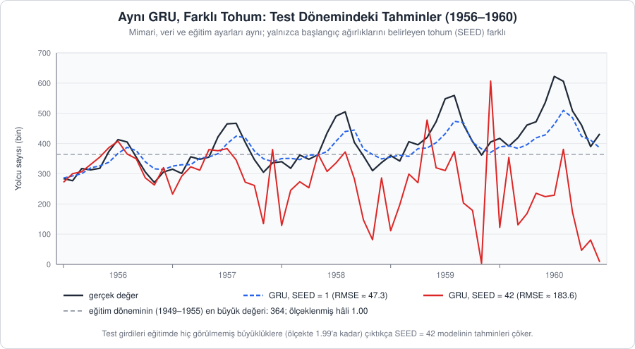

*Şekil 15.3 — Aynı GRU mimarisi, aynı veri ve aynı eğitim ayarlarıyla, yalnızca tohum değiştirilerek eğitildi. `SEED = 1` ile tahminler (mavi, kesikli) gerçek seriyi izler; `SEED = 42` ile tahminler (kırmızı) girdiler eğitim döneminin en büyük değerini (gri kesikli çizgi) aşmaya başladıktan sonra dağılır ve 1959–1960'ta sıfıra kadar düşer.*

Tablo ve Şekil 15.3 bu bölümün belki de en önemli dersini veriyor: Küçük bir veri setinde, eğitim aralığının dışına çıkmak zorunda kalan bir sinir ağının sonucu **başlangıç ağırlıklarına çok duyarlıdır**. 15.1.1'de gördüğümüz gibi test girdileri ölçeklenmiş değerde 1.99'a kadar çıkar; modelin bu bölgede nasıl davranacağını eğitim verisi hiç belirlememiştir. Bir tohumda ağırlıklar bu bölgede "makul" bir davranış üretir, diğerinde üretmez. LSTM de bu sorundan muaf değildir (`SEED = 7` ile 93.19). Bu yüzden iki modeli tek bir çalıştırmayla karşılaştırıp "LSTM GRU'dan iyidir" ya da tersini söylemek yanlış olur. Doğru yaklaşım, her modeli birkaç tohumla ve birkaç zaman dilimiyle (Bölüm 16'daki zaman serisi çapraz doğrulaması) değerlendirip ortalamaya bakmaktır. Sorunun kendisini hafifletmenin yolu ise seriyi farklar üzerinden modellemektir (15.1.1'deki not): Farklar eğitim aralığının dışına çok daha az taşar.

### 15.4. 1D-CNN: Desen Tabanlı Yaklaşım

Şimdiye kadar zaman serilerine iki temel felsefeyle yaklaştık: geçmişi hatırlamak (LSTM, GRU) ve kurallar oluşturmak (XGBoost, Prophet). Yapay zeka literatüründe, genellikle görüntü işlemeyle özdeşleşmiş olsa da zaman serilerinde de başarılı sonuçlar veren bir yöntem daha vardır: **1D-CNN (bir boyutlu evrişimli sinir ağı)**.

CNN'leri çoğunlukla "bu resimde kedi var mı?" sorusuyla duyarız. Orada ağ, resmin üzerinde küçük pencereler gezdirerek kenarları ve köşeleri öğrenir. Zaman serisinde mantık aynıdır; yalnızca pencere iki boyutlu bir resim yerine tek boyutlu bir dizi üzerinde kayar. Filtreler, verinin içindeki yükseliş eğilimini, ani düşüşü veya tepe noktasını birer **desen** olarak tanımayı öğrenir.

LSTM veriyi bir hikâye gibi baştan sona okuyup aklında tutmaya çalışır; CNN ise veriye desen taraması gibi yaklaşır. "Geçen ay ne oldu?" sorusundan çok "Son üç aydaki hareketin şekli neye benziyor?" sorusuna odaklanır. Bu özellik gürültüyü süzmede ve kısa vadeli desenleri yakalamada etkilidir. Ayrıca hesaplamalar paralel yapılabildiği için LSTM'e göre daha hızlı eğitilir.

#### 15.4.1. Evrişim, Filtre, `kernel_size` ve Havuzlama

Evrişimin fikri basittir: Birkaç sayıdan oluşan küçük bir **filtre** (ağırlık listesi) serinin üzerine konur, altında kalan değerlerle eleman eleman çarpılır, çarpımlar toplanır ve tek bir sayı elde edilir. Sonra filtre bir adım sağa kaydırılır ve aynı işlem tekrarlanır. Sonuçta seri boyunca "bu konumda filtrenin aradığı desen ne kadar güçlü?" sorusunun cevaplarından oluşan yeni bir dizi çıkar. Bu diziye **özellik haritası (feature map)** denir.

**Tanım (1D evrişim):** Uzunluğu $K$ olan bir filtrenin ağırlıkları $w_0, \dots, w_{K-1}$ ve yanlılığı $b$ olsun. Filtrenin $t$ konumundaki çıktısı:

$$
y_t = g\left(\sum_{k=0}^{K-1} w_k x_{t+k} + b\right)
$$

> **Simge notu:** $`\sum`$ *(büyük sigma, "toplam")*: altındaki $`k=0`$ ile üstündeki $`K-1`$ arasındaki her $`k`$ için yanındaki terimi yazıp hepsini toplamak demektir. $`K = 3`$ için $`\sum_{k=0}^{2} w_k x_{t+k} = w_0 x_t + w_1 x_{t+1} + w_2 x_{t+2}`$ olur. LSTM'deki küçük $`\sigma`$ (sigmoid) ile karıştırmayın · $`K`$: filtre uzunluğu (Keras'ta `kernel_size`) · $`k`$: filtre içindeki sıra numarası (0, 1, …, K−1) · $`w_k`$ *(dabılyu k)*: filtrenin $`k`$. ağırlığı, eğitimle öğrenilir · $`x_{t+k}`$: serinin $`t+k`$. değeri; $`t`$ filtrenin o anda başladığı konumdur · $`b`$: yanlılık · $`y_t`$: filtrenin $`t`$ konumundaki çıktısı · $`g`$: aktivasyon fonksiyonu (burada ReLU, $`g(u) = \max(0, u)`$, yani negatifse 0, değilse kendisi)

**Sayısal örnek:** Şekil 15.4'teki elle seçilmiş filtrenin ağırlıkları $w_0 = -1$, $w_1 = 0$, $w_2 = +1$, yanlılığı $b = 0$ olsun. Seri 1949'un ilk ayları: 112, 118, 132, 129, 121, 135, … Filtre ilk üç aya oturduğunda:

```math
\begin{aligned}
y_1 &= (-1) \cdot 112 + 0 \cdot 118 + (+1) \cdot 132 = -112 + 0 + 132 = 20 &&\Rightarrow \text{ReLU: } 20\\
y_2 &= (-1) \cdot 118 + 0 \cdot 132 + (+1) \cdot 129 = -118 + 0 + 129 = 11 &&\Rightarrow \text{ReLU: } 11\\
y_3 &= (-1) \cdot 132 + 0 \cdot 129 + (+1) \cdot 121 = -132 + 0 + 121 = -11 &&\Rightarrow \text{ReLU: } 0
\end{aligned}
```

Bu filtre aslında $y_t = x_{t+2} - x_t$ farkını, yani "iki ay sonraki değer bugünküne göre ne kadar yüksek?" sorusunu hesaplar. Pozitif sonuç üç aylık bir yükselişi, negatif sonuç düşüşü gösterir; ReLU düşüşleri 0'a çevirir ve yalnızca yükselişleri bırakır. 12 aylık seride filtre 10 farklı konuma oturabilir ($12 - 3 + 1 = 10$), bu yüzden 10 çıktı oluşur: 20, 11, 0, 6, 27, 13, 0, 0, 0, 0.

**Havuzlama (pooling):** `MaxPooling1D(pool_size=2)` bu diziyi ikişerli gruplara ayırır ve her gruptan yalnızca en büyüğünü tutar: (20, 11) → 20, (0, 6) → 6, (27, 13) → 27, (0, 0) → 0, (0, 0) → 0. 10 değer 5'e iner. Havuzlama hem hesabı küçültür hem de desenin bir ay erken ya da geç görülmesini önemsiz kılar: Yükseliş grubun birinci ya da ikinci ayında olsun, sonuç aynıdır.

**Açıklama:** Filtre, serinin üzerinde birer adım kayarak (`strides=1`) her konumda ardışık $K$ değerin ağırlıklı toplamını hesaplar. Aynı ağırlıklar serinin her yerinde kullanılır (**ağırlık paylaşımı**). Bu yüzden "Şubat–Mart yükselişi" deseni hangi yılda görülürse görülsün aynı filtre tarafından yakalanır. Yukarıdaki $[-1, 0, +1]$ filtresini biz seçtik; gerçek modelde 64 filtrenin her birinin ağırlıkları eğitim sırasında öğrenilir ve her filtre kendine farklı bir desen (yükseliş, düşüş, tepe, çukur …) bulur.


*Şekil 15.4 — Üç elemanlı bir filtre 1949 yılının 12 ayı üzerinde kayar. Her konumda bir çıktı üretilir, ReLU negatifleri sıfırlar, `MaxPooling1D(pool_size=2)` ise uzunluğu yarıya indirerek her çiftteki en güçlü sinyali tutar.*

Keras'taki `Conv1D` ve ilgili katmanların parametreleri:

| Parametre / katman | Anlamı | Bizim modelde |
| --- | --- | --- |
| `filters` | Kaç farklı desen aranacağı; her filtre ayrı bir özellik haritası üretir | 64, sonra 128 |
| `kernel_size` | Filtrenin aynı anda kaç zaman adımına baktığı | 3 (üç ay) |
| `padding` | `'valid'`: kenar eklenmez, çıktı $`n-K+1`$ uzunluğundadır; `'same'`: kenarlara sıfır eklenir, çıktı uzunluğu girdiyle aynı kalır | `'same'` |
| `MaxPooling1D(pool_size=2)` | Ardışık iki değerin en büyüğünü alır: uzunluk yarıya iner, küçük kaymalara karşı dayanıklılık artar | 12 → 6 → 3 |
| `Flatten` + `Dense` | Özellik haritalarını tek bir sayı listesine açıp tahmine dönüştürür | 384 → 50 → 1 |

Tablodaki sayıları birlikte izleyelim. Girdi 12 aylık penceredir. `padding='same'` serinin iki ucuna birer 0 ekler; 14 değerlik dizide 3'lük filtre $14 - 3 + 1 = 12$ konuma oturur ve uzunluk 12 olarak kalır (`'valid'` olsaydı yukarıdaki örnekteki gibi 10'a inerdi). İlk evrişim katmanındaki 64 filtrenin her biri ayrı bir 12 değerlik özellik haritası üretir; çıktının şekli `(12, 64)` olur. Havuzlama uzunluğu $12 / 2 = 6$'ya indirir. İkinci evrişim katmanı 128 filtreyle `(6, 128)`, ikinci havuzlama `(3, 128)` verir. `Flatten` bu $3 \times 128 = 384$ sayıyı tek bir uzun listeye dizer; `Dense(50)` bunları 50 sayıya, `Dense(1)` de tek tahmine indirir.

Birden fazla evrişim katmanı üst üste konduğunda ikinci katmandaki bir filtre, ilk katmanın desenlerinin birleşimine bakar. Havuzlamayla birlikte her katman serinin daha uzun bir bölümünü "görür". Buna filtrenin **alıcı alanı (receptive field)** denir. Örneğin ilk katmandaki bir filtre 3 ayı görür. Havuzlamadan sonra ikinci katmandaki 3'lük bir filtre, her biri iki ilk-katman çıktısını özetleyen 3 değere, yani 6 ilk-katman çıktısına bakar; bu 6 çıktının her biri 3 aylık, birbirine bir ay kaydırılmış dilimlerden geldiği için toplamda $6 + 2 = 8$ aylık bir dilimi kapsar.

#### 15.4.2. 1D-CNN Uygulaması

Aşağıdaki kod 15.1'deki ortak veriyi kullanır. Evrişimli model LSTM'den çok daha fazla parametre taşır (44.261; LSTM'de 10.451). Bu kadar parametre 60 örnekle eğitildiğinde model genel deseni öğrenmek yerine eğitim verisini ezberleyebilir. Bunu izlemek için eğitim kümesinin son 12 ayını **doğrulama (validation)** kümesi olarak ayırıyoruz: Model bu 12 ayla eğitilmez, yalnızca her epoch sonunda bu aylardaki hatasına bakılır. Eğitim hatası düşmeye devam ederken doğrulama hatası artmaya başlarsa model ezberliyordur. **Erken durdurma (early stopping)** tam bu anı yakalayıp eğitimi keser.

Tam program (yaklaşık 260 satır) uygulama dosyasındadır; aşağıda kilit satırlar yer alıyor. Dosyada katmanlar tek tek, açıklamalı olarak alt alta yazılmıştır.

```python
# 1D-CNN — kilit satırlar (tam kod: Codes/python/ch15_derin_ogrenme.py)
val_size = 12
X_train, y_train = trainX[:-val_size], trainY[:-val_size]   # eğitim
X_val, y_val = trainX[-val_size:], trainY[-val_size:]       # doğrulama (erken durdurma)
X_test, y_test = testX, testY

def build_cnn_model(look_back, filters=64, kernel_size=3, dropout_rate=0.2):
    model = Sequential([
        Input(shape=(look_back, 1)),                                              # (12, 1)
        Conv1D(filters=filters, kernel_size=kernel_size, activation='relu',
               padding='same'),                                                   # (12, 64)
        MaxPooling1D(pool_size=2), Dropout(dropout_rate),                         # (6, 64)
        Conv1D(filters=filters * 2, kernel_size=kernel_size, activation='relu',
               padding='same'),                                                   # (6, 128)
        MaxPooling1D(pool_size=2), Dropout(dropout_rate),                         # (3, 128)
        Flatten(), Dense(50, activation='relu'), Dropout(dropout_rate),           # 384 -> 50
        Dense(1)                                                                  # regresyon çıktısı
    ])
    model.compile(optimizer=Adam(learning_rate=0.001), loss='mse', metrics=['mae'])
    return model

model_cnn = build_cnn_model(look_back, filters=64, kernel_size=3, dropout_rate=0.2)
early_stop = EarlyStopping(monitor='val_loss', patience=20, restore_best_weights=True, verbose=1)
history = model_cnn.fit(X_train, y_train, epochs=300, batch_size=16,
                        validation_data=(X_val, y_val), callbacks=[early_stop], verbose=1)

test_pred_inv = scaler.inverse_transform(model_cnn.predict(X_test, verbose=0))
y_test_inv = scaler.inverse_transform(y_test.reshape(-1, 1))
rmse_cnn = np.sqrt(mean_squared_error(y_test_inv, test_pred_inv))   # 15.5'te kullanılır
```

Kilit satırları sırayla açıklayalım:

- **`trainX[:-val_size]` ve `trainX[-val_size:]`:** Eksi işaretli sıra numaraları sondan sayar. `[:-12]` "son 12 hariç hepsi" ($72 - 12 = 60$ örnek), `[-12:]` "son 12" demektir. Doğrulama kümesi, eğitim döneminin son yılıdır (1955); zaman sırası bozulmaz.
- **`def build_cnn_model(look_back, filters=64, kernel_size=3, dropout_rate=0.2)`:** Modeli bir fonksiyonun içinde kurmak, aynı mimariyi farklı ayarlarla (ör. `filters=32`) tek satırda yeniden üretmeyi sağlar; dosyadaki hiperparametre karşılaştırması bunu kullanır. `Sequential([...])` katmanları `add` yerine köşeli parantez içinde bir liste olarak alır; iki yazım aynı modeli kurar.
- **`Conv1D(filters, kernel_size, activation='relu', padding='same')`:** 15.4.1'de anlatılan evrişim katmanıdır: 64 farklı 3'lük filtre, ReLU aktivasyonu, uzunluğu koruyan kenar dolgusu.
- **`MaxPooling1D(pool_size=2)`:** İkişerli gruplardan en büyüğünü tutar ve uzunluğu yarıya indirir (15.4.1'deki örnek).
- **`Dropout(0.2)`:** Eğitimin her adımında katmandaki nöronların rastgele seçilmiş yüzde 20'sini geçici olarak kapatır (çıktılarını 0 yapar). Her gün rastgele birkaç üyesi izinli olan bir ekip düşünün: Ekip tek bir kişiye bağımlı kalamaz ve işi paylaşmayı öğrenir. Ağ da böylece tek tek nöronlara dayanmak yerine daha genel desenler öğrenir. Tahmin sırasında (`predict`) dropout kapanır ve bütün nöronlar çalışır.
- **`Flatten()`** `(3, 128)` şeklindeki tabloyu 384 sayılık tek bir listeye dizer; **`Dense(50, activation='relu')`** ve **`Dense(1)`** bu listeyi önce 50 sayıya, sonra tek tahmine indirir.
- **`compile(optimizer=Adam(learning_rate=0.001), loss='mse', metrics=['mae'])`:** Kayıp yine ortalama kare hatadır (`'mse'`, `'mean_squared_error'` yazımının kısaltması). Öğrenme oranı açıkça 0.001 olarak verilmiştir. `metrics=['mae']` ortalama mutlak hatayı da izler; MAE eğitimi etkilemez, yalnızca raporlanır.
- **`EarlyStopping(monitor='val_loss', patience=20, restore_best_weights=True)`:** Her epoch sonunda doğrulama kaybını (`val_loss`) izler. **Sabır (patience)**, iyileşme olmadan kaç epoch bekleneceğidir. Örneğin doğrulama kaybı en düşük değerine 35. epoch'ta ulaşmış ve sonraki 20 epoch boyunca bu değerin altına hiç inememişse eğitim 55. epoch'un sonunda durur. `restore_best_weights=True` modelin ağırlıklarını 55. epoch'taki hâlinden 35. epoch'taki en iyi hâline geri çevirir.
- **`fit(..., epochs=300, batch_size=16, validation_data=(X_val, y_val), callbacks=[early_stop])`:** 300 yalnızca bir üst sınırdır; erken durdurma genellikle çok daha önce keser. 60 eğitim örneği 16'lık yığınlara bölündüğünde her epoch'ta 4 güncelleme yapılır (16 + 16 + 16 + 12). `validation_data` doğrulama kümesini, `callbacks` ise her epoch sonunda çağrılacak yardımcıları (burada erken durdurma) verir. `fit` eğitim boyunca kaydedilen kayıpları `history` nesnesinde döndürür; dosyadaki öğrenme eğrileri bu kayıtlardan çizilir.
- **Son üç satır** test tahminlerini ve gerçek değerleri `inverse_transform` ile yolcu sayısına çevirir ve test RMSE'sini `rmse_cnn` adıyla saklar.

Program sırasıyla şu adımları izler:

1. **Ayrım:** 15.1'deki 72 eğitim penceresinin son 12'si doğrulama kümesi olur; test kümesi 60 örnektir.
2. **Mimari:** İki evrişim bloğu (`Conv1D` → `MaxPooling1D` → `Dropout`), ardından `Flatten` ve iki `Dense` katmanı. `padding='same'` ile uzunluk evrişimde korunur, havuzlamada 12 → 6 → 3 olur.
3. **Eğitim:** En fazla 300 epoch, `batch_size=16`; doğrulama kaybı 20 epoch iyileşmezse erken durdurma devreye girer ve en iyi ağırlıklar geri yüklenir. Kayıp ve MAE öğrenme eğrileri çizilir.
4. **Değerlendirme:** Tahminler `inverse_transform` ile orijinal ölçeğe döndürülür; eğitim, doğrulama ve test için RMSE, MAE ve MAPE yazdırılır. Test RMSE'si `rmse_cnn` olarak saklanır.
5. **Görselleştirme:** Gerçek seri üzerinde eğitim, doğrulama ve test tahminleri çizilir.
6. **Hata analizi:** Test hatalarının histogramı, zaman içindeki seyri ve gerçek–tahmin saçılım grafiği çizilir; hataların ortalaması ve standart sapması yazdırılır.
7. **Hiperparametre karşılaştırması (isteğe bağlı):** Üç farklı `filters` / `kernel_size` / `dropout_rate` yapılandırması denenir; en iyisi **doğrulama** RMSE'sine göre seçilir.

Tam kod: [`Codes/python/ch15_derin_ogrenme.py`](Codes/python/ch15_derin_ogrenme.py) · [Notebook](Codes/notebooks/ch15_derin_ogrenme.ipynb)

Bizim çalıştırmamızda programın sayısal çıktıları şöyle oldu (model özet tablosu ve epoch satırları kısaltılmıştır; aynı bilgisayarda tekrar çalıştırıldığında aynı sayılar elde edildi; başka bir ortamda birkaç birim, hatta 15.3'teki gibi daha fazla fark olabilir):

```text
Eğitim: 60, Doğrulama: 12, Test: 60 örnek
 Total params: 44,261 (172.89 KB)
Restoring model weights from the end of the best epoch: 16.
Eğitim 36 epoch sürdü.

1D-CNN MODEL PERFORMANSI
Eğitim          RMSE:   13.65   MAE:   10.46   MAPE:  5.74%
Doğrulama       RMSE:   24.66   MAE:   20.47   MAPE:  6.99%
Test            RMSE:   32.43   MAE:   26.41   MAPE:  6.42%
Ortalama hata: 18.38 (0'a yakın olmalı)
Hata std     : 26.72

Yapılandırma 1: {'filters': 32, 'kernel_size': 2, 'dropout_rate': 0.1}  ->  doğrulama RMSE: 26.66
Yapılandırma 2: {'filters': 64, 'kernel_size': 3, 'dropout_rate': 0.2}  ->  doğrulama RMSE: 22.23
Yapılandırma 3: {'filters': 128, 'kernel_size': 3, 'dropout_rate': 0.3}  ->  doğrulama RMSE: 26.14
Seçilen yapılandırma (doğrulamaya göre): {'filters': 64, 'kernel_size': 3, 'dropout_rate': 0.2}
Bu yapılandırmanın test RMSE değeri: 27.91
```

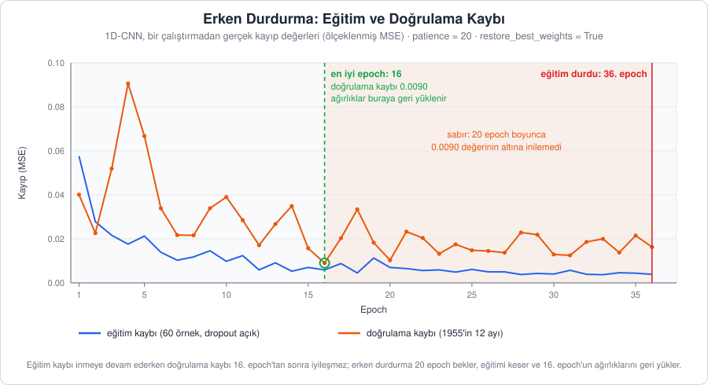

*Şekil 15.5 — Yukarıdaki çalıştırmanın öğrenme eğrileri. Eğitim kaybı (mavi) düzenli olarak azalırken doğrulama kaybı (turuncu) en düşük değerine 16. epoch'ta ulaşır. Sonraki 20 epoch'ta (turuncu gölgeli bölge) bu değerin altına inilemeyince eğitim 36. epoch'ta durur ve 16. epoch'un ağırlıkları geri yüklenir.*

**Çıktının yorumu:**

- **Parametre sayısı:** 44.261 parametrenin hesabı: ilk evrişim katmanında her filtre 3 ağırlık ve 1 yanlılık taşır, $64 \times (3 + 1) = 256$. İkinci katmanda her filtre 3 zaman adımı × 64 özellik haritası = 192 ağırlık ve 1 yanlılık taşır, $128 \times (192 + 1) = 24.704$. `Dense(50)` için $384 \times 50 + 50 = 19.250$, çıktı katmanı için $50 + 1 = 51$. Toplam $256 + 24.704 + 19.250 + 51 = 44.261$.
- **Öğrenme eğrileri (Şekil 15.5):** Erken durdurma devreye girdiğinde doğrulama kaybının en düşük olduğu epoch'un ağırlıkları geri yüklenir. Bu çalıştırmada en iyi epoch 16, eğitimin durduğu epoch $16 + 20 = 36$'dır. Doğrulama kaybı eğitim kaybından çok yüksekse model ezberliyordur; dropout oranını artırmak ya da filtre sayısını azaltmak denenebilir.
- **Eğitim, doğrulama ve test RMSE:** Eğitimden teste doğru hatanın artması (13.65 → 24.66 → 32.43) normaldir: Model eğitim verisini zaten görmüştür, doğrulama yılı (1955) eğitime en yakın dönemdir, test dönemi ise hem daha uzun hem de eğitimde hiç görülmemiş yolcu düzeyleri içerir. Test RMSE'nin eğitimin birkaç katı olması hem aşırı öğrenmeye hem de 15.1.1'deki ekstrapolasyon sorununa işaret eder; burada oran $32.43 / 13.65 \approx 2.4$'tür.
- **Hata analizi:** Hata burada "gerçek eksi tahmin" olarak hesaplanır. Ortalama hata 18.38, yani pozitiftir: Model test döneminde ortalama olarak yaklaşık 18 bin yolcu **düşük** tahmin yapıyor. Bu, sistematik bir sapmadır ve yine ekstrapolasyon sorununun işaretidir. Hataların zamanla büyümesi, trendin model tarafından tam yakalanamadığını gösterir.
- **Hiperparametre karşılaştırması:** Doğrulama RMSE'si en küçük olan yapılandırma (2) seçildi. Bu yapılandırma ana modelle aynı ayarlara sahip olduğu hâlde doğrulama RMSE'si farklıdır (22.23 ve 24.66), çünkü döngüdeki modeller farklı rastgele başlangıç ağırlıklarıyla kurulur ve erken durdurma sabrı 15'tir. Üç yapılandırma arasındaki farklar (22–27) bu rastgelelikten kaynaklanan farkla aynı büyüklüktedir; yani bu küçük deneyle hangi ayarın gerçekten daha iyi olduğunu kesin olarak söyleyemeyiz.

> **Not — Neden `BatchNormalization` kullanmıyoruz?** İnternetteki birçok 1D-CNN örneğinde her evrişim katmanından sonra bir `BatchNormalization` katmanı bulunur. Bu katman, bir önceki katmanın çıktılarını eğitim sırasında her yığının kendi ortalamasına göre, tahmin sırasında ise eğitim boyunca biriktirdiği ortalamalara göre yeniden ölçekler. Büyük veri setlerinde eğitimi hızlandırır ve kararlı kılar. Bizim denememizde aynı modelde her iki evrişim katmanının arkasına bu katmanı eklediğimizde sonuç çarpıcı biçimde kötüleşti: Eğitim RMSE'si 118.68, test RMSE'si 247.86 çıktı ve model test döneminde ortalama 234 bin yolcu düşük tahmin yaptı; yani model kendi eğitim verisini bile tahmin edemez hâle geldi. Olası neden, yalnızca 60 örnek ve 16'lık küçük yığınlarla hesaplanan yığın ortalamalarının hem birbirinden hem de tahmin sırasında kullanılan birikmiş ortalamalardan çok farklı olmasıdır; trendli bir seride her yığın farklı bir yolcu düzeyini temsil eder. Ders: Bir katmanın "genellikle işe yaradığı" söylense bile, eklediğiniz her bileşenin kendi verinizdeki etkisini ölçün.

1D-CNN'in zaman serilerindeki **güçlü yanları:**

- Yerel desenleri (trend değişimleri, ani sıçramalar, kısa mevsimsel şekiller) iyi yakalar.
- Hesaplamalar paralel yapılabildiği için tekrarlayan ağlardan daha hızlı eğitilir.
- Ağırlık paylaşımı sayesinde evrişim katmanlarının kendisi az parametre taşır (bizim modelde ilk katman yalnızca 256); parametrelerin büyük kısmı ikinci evrişim katmanında ve sondaki `Dense` katmanındadır.

**Zayıf yanları:**

- Çok uzun vadeli bağımlılıkları yakalamakta zorlanabilir; alıcı alanı sınırlıdır.
- Sıralı yapıyı doğrudan modellemez; iki desenin hangi sırayla geldiği bilgisi havuzlamayla kısmen kaybolur.
- Mevsimsellik için ek özellik mühendisliği gerekebilir.

**İyileştirme önerileri:** Daha fazla Conv1D katmanı kullanmak, alıcı alanı genişletmek için **genişletilmiş evrişim (dilated convolution)** uygulamak, CNN + LSTM hibrit modeller kurmak ve mevsimsel farkı alınmış veriyle çalışmak.

#### 15.4.3. 1D-CNN ile Tekrarlayan Ağların Karşılaştırması

**Odak farkı:** LSTM ve GRU zaman içindeki bağımlılığı modeller; "Ocak ayındaki olay Kasım ayını nasıl etkiledi?" sorusuna cevap arar. 1D-CNN ise yerel yapıları modeller; "her krizden sonra bir U dönüşü oluyor" gibi şekilsel çıkarımlar yapar.

**Hız:** AirPassengers küçük bir veri olduğu için farkı hissetmezsiniz. Ancak milyonlarca satırlık veride LSTM'in eğitimi günler sürebilirken CNN aynı işi saatler içinde tamamlayabilir. CNN'de her konumdaki evrişim birbirinden bağımsızdır ve paralel hesaplanır; LSTM ise $h_t$'yi hesaplamak için $h_{t-1}$'i beklemek, yani sıralı gitmek zorundadır.

**Karma kullanım:** Modern araştırmalarda **CNN-LSTM hibrit** modelleri sıkça görülür. Önce CNN ile verideki önemli desenler çıkarılır, sonra bu özellikler LSTM'e verilerek zamansal ilişki kurulur.

### 15.5. Model Karşılaştırması

Artık çantamızda beş farklı yaklaşım var:

| Model | Yaklaşım | Bölüm | Tahmin biçimi (bu karşılaştırmada) |
| --- | --- | --- | --- |
| ARIMA / SARIMA | İstatistiksel, doğrusal | Bölüm 7 | 60 ay ileriye **çok adımlı** tahmin |
| XGBoost | Ağaç tabanlı, gecikme özellikleri | Bölüm 13 | Tek adımlı |
| LSTM | Tekrarlayan sinir ağı | 15.2 | Tek adımlı |
| GRU | Sade tekrarlayan sinir ağı | 15.3 | Tek adımlı |
| 1D-CNN | Evrişimli, desen tabanlı | 15.4 | Tek adımlı |

Karşılaştırmanın adil olması için hepsini **aynı test döneminde** (1956–1960, son 60 ay) ve aynı ölçütle (RMSE, bkz. Bölüm 8.2.2) değerlendiriyoruz:

- `rmse_arima`, Bölüm 7'deki Python uygulamasında (`auto_arima` ile `train_data = data[:-60]`, `test_data = data[-60:]`) hesaplanan değişkendir. Aşağıdaki kodu notlardaki sırayla çalıştırıyorsanız Bölüm 7.7'deki Python kodunun aynı oturumda çalıştırılmış olması gerekir. Uygulama dosyası ise bu modeli kendisi yeniden kurar; bizim çalıştırmamızda `auto_arima` yine sabit terimli ARIMA(1,0,0)(0,1,1)[12] modelini seçti ve RMSE 47.87 çıktı (Bölüm 7.7.5'teki yaklaşık 47.9 ile aynı).
- `rmse_lstm`, `rmse_gru` ve `rmse_cnn` bu bölümün 15.2–15.4 kodlarından gelir.
- Bölüm 13'teki XGBoost uygulaması farklı bir test dönemi (son 12 ay) kullandığı için RMSE'si doğrudan karşılaştırılamaz. Aşağıda XGBoost'u aynı 60 aylık test dönemi için, 12 gecikme ve ay bilgisiyle yeniden eğitiyoruz.

```python
# Gerekli değişkenler:
#   rmse_arima                     -> Bölüm 7'deki Python uygulaması (ARIMA, son 60 ay test)
#   rmse_lstm, rmse_gru, rmse_cnn  -> bu bölümün 15.2, 15.3 ve 15.4 kodları
#   dataset, dates, test_dates, look_back, SEED -> 15.1
import xgboost as xgb

# ---- XGBoost (Bölüm 13) aynı test dönemi için: 12 gecikme + ay bilgisi
s = pd.Series(dataset[:, 0], index=dates)
feat = pd.DataFrame({'y': s})
for lag in range(1, look_back + 1):
    feat[f'lag_{lag}'] = s.shift(lag)     # yalnızca geçmiş değerler: sızıntı yok
feat['month'] = feat.index.month
feat = feat.dropna()                      # ilk 12 ayın gecikmeleri eksik

train_f = feat[feat.index < test_dates[0]]
test_f = feat[feat.index >= test_dates[0]]   # 60 ay

model_xgb = xgb.XGBRegressor(n_estimators=500, learning_rate=0.05, max_depth=4,
                             subsample=0.8, colsample_bytree=0.8, random_state=SEED)
model_xgb.fit(train_f.drop(columns='y'), train_f['y'])
pred_xgb = model_xgb.predict(test_f.drop(columns='y'))
rmse_xgb = np.sqrt(mean_squared_error(test_f['y'], pred_xgb))

# ---- Karşılaştırma tablosu
results_df = pd.DataFrame({
    'Model': ['ARIMA (Bölüm 7)', 'XGBoost (Bölüm 13)', 'LSTM', 'GRU', '1D-CNN'],
    'RMSE': [rmse_arima, rmse_xgb, rmse_lstm, rmse_gru, rmse_cnn],
}).sort_values('RMSE').reset_index(drop=True)
print(results_df.to_string(index=False, float_format='%.2f'))

# ---- Görsel karşılaştırma
plt.figure(figsize=(9, 4))
plt.barh(results_df['Model'], results_df['RMSE'], color='steelblue')
plt.gca().invert_yaxis()                  # en iyi model en üstte
plt.xlabel('Test RMSE (bin yolcu, düşük = iyi)')
plt.title('Son 60 Ay (1956-1960) için Model Karşılaştırması')
plt.grid(True, axis='x', alpha=0.3)
plt.tight_layout()
plt.show()
```

Kod üç bölümden oluşur:

1. **XGBoost için tablo:** `pd.Series(dataset[:, 0], index=dates)` yolcu sayılarını tarihlerle etiketlenmiş bir seriye çevirir. `s.shift(lag)` seriyi `lag` ay aşağı kaydırır: 112, 118, 132 serisinin `shift(1)` sonucu boş, 112, 118 olur; yani her satıra bir önceki ayın değeri yazılır. Döngü 1'den 12'ye kadar bütün gecikmeleri `lag_1`, …, `lag_12` sütunları olarak ekler; `feat.index.month` ise ay numarasını (1–12) ekler. İlk 12 satırda bazı gecikmeler boş kalacağı için `dropna()` bu satırları atar.
2. **Ayrım ve eğitim:** `feat[feat.index < test_dates[0]]` yalnızca Ocak 1956'dan önceki satırları seçer (köşeli parantez içine bir koşul yazmak, koşulu sağlayan satırları süzer). `drop(columns='y')` hedef sütununu girdilerden çıkarır. XGBoost Bölüm 13'teki ayarlarla eğitilir ve 60 test ayını tahmin eder. Bu satırlar her test ayı için gerçek geçmiş değerleri kullandığından XGBoost da LSTM, GRU ve CNN gibi tek adımlı tahmin yapar.
3. **Tablo ve grafik:** `pd.DataFrame({...})` model adları ile RMSE değerlerinden iki sütunlu bir tablo kurar, `sort_values('RMSE')` satırları küçükten büyüğe sıralar ve `to_string(index=False, float_format='%.2f')` tabloyu satır numarası olmadan, iki ondalıkla yazdırır. `plt.barh` yatay çubuk grafiği çizer; `invert_yaxis()` en küçük hatayı en üste getirir.

Bizim çalıştırmamızda tablo şöyle çıktı:

```text
             Model   RMSE
            1D-CNN  32.43
              LSTM  46.19
   ARIMA (Bölüm 7)  47.87
XGBoost (Bölüm 13)  89.42
               GRU 183.64
```

ARIMA ve XGBoost satırları her çalıştırmada aynıdır. LSTM, GRU ve 1D-CNN satırları ise tohuma, işletim sistemine ve TensorFlow sürümüne göre değişir; sizin tablonuzda sıralama bile farklı çıkabilir.

**Sonuçların yorumu:** Tablo en düşük RMSE'den en yükseğe doğru sıralanır. Sonuçlar tohum ve kütüphane sürümüne göre değişse de bu veri setinde şu genel tablo ortaya çıkar:

- **1D-CNN** bu çalıştırmada en düşük hatayı verdi (32.43). Kısa vadeli desenleri iyi yakalar ve her ay bir önceki 12 ayın gerçek değerlerini gördüğü için (tek adımlı tahmin) işi görece kolaydır. Yine de 15.3'teki tohum deneyi, bu sıralamanın tek bir çalıştırmaya dayandığını hatırlatır.
- **LSTM** (46.19) ile **ARIMA (SARIMA)** (47.87) neredeyse aynı hatayı verdi. Bu, ARIMA lehine güçlü bir sonuçtur, çünkü ARIMA çok daha zor bir görevi çözer (aşağıdaki nota bakın). ARIMA trend ve 12 aylık mevsimselliği açıkça modellediği için eğitim aralığının dışına da doğal biçimde uzanır; üstelik sonucu tohuma bağlı değildir.
- **XGBoost** bu testte zorlandı (89.42): Karar ağaçları eğitimde gördükleri en büyük değerin üzerinde tahmin üretemez (ekstrapolasyon sorunu, bkz. Bölüm 13.3). Eğitim döneminin en büyük değeri 364 iken XGBoost'un 60 test ayındaki en büyük tahmini yaklaşık 361'dir; test dönemindeki 364'ün üzerindeki rekor yolcu sayılarına (en yüksek 622) hiç ulaşamaz.
- **GRU** (183.64), 15.3'te gördüğümüz gibi bu tohumla test döneminde çöktü; başka tohumlarla LSTM'e yakın sonuçlar (yaklaşık 47–53) verdi. Derin öğrenme modelleri kısa vadeli desenleri iyi yakalar, ancak 72 eğitim örneği derin öğrenme için çok küçüktür ve 15.1.1'de gördüğümüz ekstrapolasyon sorunu tahminleri kararsız kılabilir.

> **Not —** Bu karşılaştırma tamamen simetrik değildir. Bölüm 7'deki ARIMA, test dönemini tek seferde, **60 ay ileriye** tahmin eder (çok adımlı tahmin). Diğer modeller ise her ay için bir önceki ayların **gerçek** değerlerini görür (tek adımlı tahmin), yani daha kolay bir görev çözer. Örneğin Aralık 1960'ı tahmin ederken ARIMA'nın elinde yalnızca 1955 sonuna kadarki veri vardır; LSTM ise Aralık 1959–Kasım 1960 arasındaki 12 gerçek değeri görür. ARIMA buna rağmen LSTM'e yakın sonuç veriyorsa bu, onun lehine güçlü bir kanıttır; 1D-CNN'in bu çalıştırmadaki üstünlüğü de aynı gözle, yani daha kolay bir görevde elde edildiği bilinerek okunmalıdır (çok adımlı tahmin için bkz. Bölüm 12.1.3 ve 14.2.1). Tamamen eşit koşullar için ya ARIMA da her ay yeni gözlemle güncellenerek tek adımlı tahmin yaptırılmalı ya da sinir ağları kendi tahminlerini girdi olarak kullanarak (özyinelemeli) çok adımlı tahmine zorlanmalıdır.

Genel ders şudur: Bu tür küçük, düzenli ve klasik zaman serilerinde iyi ayarlanmış bir ARIMA modeli oldukça başarılıdır. LSTM, GRU ve 1D-CNN gibi derin öğrenme modelleri ise çok daha fazla veriye sahip, çok değişkenli, karmaşık ve doğrusal olmayan desenler içeren problemlerde gerçekten öne çıkar. Veri bilimcinin ustalığı, verinin yapısına bakarak hangi aracın daha iyi çalışacağına karar verebilmesindedir. Her problemin kendine özgü dinamikleri vardır; en iyi modeli bulmak için denemeler yapmak ve sonuçları dikkatle analiz etmek gerekir.

Son olarak, buradaki bütün sonuçlar **tek bir** eğitim-test ayrımına dayanıyor. 1956–1960 dönemi bir modele "şanslı", ötekine "şanssız" gelmiş olabilir. Birden fazla zaman dilimi üzerinde, geleceğe sızıntı yapmadan güvenilir bir karşılaştırma yapmanın yolu olan **TimeSeriesSplit** yöntemini Bölüm 16'da ele alıyoruz.

---

<a id="bolum-16"></a>

## 16. TimeSeriesSplit: Zaman Serisinde Çapraz Doğrulama

Bölüm 8'de modeli eğitim ve test olarak ikiye ayırıp hata metrikleriyle değerlendirdik. Bölüm 15'te beş modeli aynı 60 aylık test dönemi üzerinden karşılaştırdık. Her iki durumda da sonuç **tek bir** test dönemine dayanıyordu. O dönem bir model için "şanslı", öteki için "şanssız" olabilir: Test dönemine denk gelen bir kriz, bir tatil kayması ya da olağandışı bir yıl sıralamayı tek başına değiştirebilir.

Makine öğrenmesinde bu sorunun standart çözümü **çapraz doğrulamadır (cross-validation)**: Veri birkaç kez farklı biçimlerde bölünür, model her bölmede yeniden eğitilir ve performans bölmelerin ortalaması olarak raporlanır. Ancak alışılmış çapraz doğrulama zaman serisinde doğrudan kullanılamaz. Bu bölümde nedenini ve doğru yöntemi, `TimeSeriesSplit`'i ele alıyoruz.

### 16.1. Neden Rastgele K-Fold Zaman Serisinde Yanlıştır?

**Tanım (K-fold çapraz doğrulama):** Veri $K$ eşit parçaya (fold) bölünür. Her turda bir parça doğrulama, kalan $K-1$ parça eğitim için kullanılır. $K$ turun hatalarının ortalaması modelin performans tahminidir. Genellikle bölmeden önce veri **rastgele karıştırılır** (`shuffle=True`).

Burada $K$ yalnızca parça (fold) sayısını gösteren bir harftir. Örneğin 100 gözlem ve $K = 5$ için her parça 20 gözlemdir. 1. turda 1. parça doğrulamaya ayrılır ve model kalan $5 - 1 = 4$ parçayla (80 gözlem) eğitilir; 2. turda 2. parça doğrulamaya ayrılır, ve böyle devam eder. 5 tur sonunda her gözlem tam bir kez doğrulamada yer almış olur. Turların hataları 10, 12, 9, 11 ve 13 çıktıysa performans tahmini $(10 + 12 + 9 + 11 + 13) / 5 = 55 / 5 = 11$ olur.

Bu yöntem, gözlemlerin birbirinden bağımsız olduğu tablo verilerinde (ör. farklı hastalar, farklı müşteriler) sorunsuz çalışır. Zaman serisinde ise iki temel sorun doğurur:

1. **Gelecekten sızıntı (look-ahead leakage):** Karıştırılmış bir fold'da model, örneğin 1958 ve 1960 verileriyle eğitilip 1955'i "tahmin eder". Bu gerçek hayatta asla mümkün değildir; 2010 verisiyle 2008'i tahmin etmek istemeyiz. Model, geleceğe ait trend düzeyini zaten öğrendiği için doğrulama hatası yapay olarak düşük çıkar.
2. **Otokorelasyon nedeniyle komşu sızıntısı:** Zaman serisinde ardışık gözlemler birbirine çok benzer (Bölüm 6'daki ACF). Mart 1955 doğrulamadaysa ama Şubat ve Nisan 1955 eğitimdeyse, model Mart'ı komşularından neredeyse "okuyarak" tahmin eder. Bu, gerçek bir tahmin başarısı değildir. Gecikmeli özellikler (`lag_1`, `lag_2`, …) kullanıldığında sorun daha da belirginleşir: Bir satırın hedefi, başka bir satırın girdisidir.

Sonuç: Rastgele K-fold, zaman serisinde **gerçekte olduğundan çok daha iyi** görünen, iyimser performans tahminleri üretir. Bu tahminlere güvenerek seçilen model, canlıya alındığında hayal kırıklığı yaratır.

Doğru değerlendirme **gerçek tahmin koşulunu taklit etmelidir**. Tahminin yapıldığı ana $t$ diyelim (ör. Aralık 1955'in sonu). Model, $t$ anına kadar olan veriyle eğitilir ve yalnızca $t$'den **sonraki** gözlemler üzerinde test edilir. Bu işlem farklı $t$ noktaları için tekrarlanır. Literatürde bu yaklaşıma **kayan başlangıç noktası (rolling origin)** ya da **ileriye doğru yürüyen doğrulama (walk-forward validation)** denir.


*Şekil 16.1 — (a) Rastgele K-fold'da doğrulama gözlemleri (turuncu) zamana dağılır ve her fold'un eğitim kümesinde doğrulamadan sonraki gözlemler bulunur. (b) TimeSeriesSplit'te doğrulama her zaman eğitimden sonra gelir ve eğitim kümesi genişler. (c) Kayan pencere varyantında eğitim uzunluğu sabittir; `gap` eğitim ile doğrulama arasına tampon koyar.*

### 16.2. Genişleyen Pencere ve Kayan Pencere Doğrulaması

Zamana saygılı çapraz doğrulamanın iki temel biçimi vardır. Günlük hayattan bir benzetmeyle: **Genişleyen pencere**, her yeni tahminde doğduğunuz günden bu yana tuttuğunuz bütün günlükleri yeniden okumaktır; okunacak sayfa sayısı her seferinde artar. **Kayan pencere** ise yalnızca son altı ayın günlüklerini okumaktır; yeni bir ay eklendiğinde en eski ay rafa kaldırılır ve okunan miktar hep aynı kalır.

Bunu kesin olarak yazmak için birkaç harf kullanacağız. $n$ gözlemli bir seride $k$. fold'un doğrulama kümesi $t_k$ anından hemen sonra başlayan $h$ gözlemden oluşsun.

**Tanım 1 (Genişleyen pencere, expanding window):** $k$. fold'da eğitim kümesi serinin başından $t_k$'ye kadar olan tüm gözlemlerdir:

$$
\text{Eğitim}_k = \lbrace 1, \dots, t_k \rbrace, \quad \text{Doğrulama}_k = \lbrace t_k + 1, \dots, t_k + h \rbrace, \quad t_1 < t_2 < \dots < t_K
$$

**Tanım 2 (Kayan pencere, sliding / rolling window):** Eğitim kümesi sabit uzunlukta, $m$ gözlemdir ve fold'lar ilerledikçe pencere ileri kayar:

$$
\text{Eğitim}_k = \lbrace t_k - m + 1, \dots, t_k \rbrace, \quad \text{Doğrulama}_k = \lbrace t_k + 1, \dots, t_k + h \rbrace
$$

> **Simge notu:** $`\lbrace \dots \rbrace`$ *(küme parantezi)*: içine yazılan gözlem sıra numaralarının oluşturduğu küme; $`\lbrace 1, \dots, 12 \rbrace`$ "1'den 12'ye kadar bütün gözlemler" diye okunur, üç nokta aradaki sayıların atlandığını gösterir · $`k`$ *(küçük k)*: fold'un sıra numarası (1., 2., …) · $`K`$ *(büyük K)*: toplam fold sayısı · $`t_k`$ *(t k)*: $`k`$. fold'da eğitimin bittiği an (tahmin başlangıç noktası); alt indis $`k`$ bu anın hangi fold'a ait olduğunu söyler · $`t_1 < t_2 < \dots < t_K`$: her fold'un başlangıç noktası bir öncekinden daha ileridedir · $`h`$: doğrulama kümesinin uzunluğu (tahmin ufku) · $`m`$: kayan penceredeki sabit eğitim uzunluğu · "Eğitim" ve "Doğrulama" yanındaki alt indis $`k`$: o kümelerin $`k`$. fold'a ait olduğu

**Sayısal örnek:** $n = 24$ gözlem, $K = 5$ fold ve $h = 4$ olsun. Fold'ların başlangıç noktaları $t_1 = 4$, $t_2 = 8$, $t_3 = 12$, $t_4 = 16$, $t_5 = 20$ olur. 3. fold'a bakalım ($t_3 = 12$):

- Genişleyen pencere: Eğitim $\lbrace 1, \dots, 12 \rbrace$ (12 gözlem), doğrulama $\lbrace 13, \dots, 16 \rbrace$, çünkü $t_3 + 1 = 13$ ve $t_3 + h = 12 + 4 = 16$.
- Kayan pencere, $m = 6$: Eğitim $\lbrace 12 - 6 + 1, \dots, 12 \rbrace = \lbrace 7, \dots, 12 \rbrace$ (6 gözlem), doğrulama yine $\lbrace 13, \dots, 16 \rbrace$.

Beşinci fold'da ($t_5 = 20$) genişleyen pencerenin eğitimi 20 gözleme çıkar, kayan pencereninki ise $\lbrace 15, \dots, 20 \rbrace$ olur ve yine 6 gözlemdir. Genişleyen pencerenin bu beş fold'unu 16.3'teki kod çıktısının ilk bölümünde aynen göreceksiniz; tek fark, Python saymaya 0'dan başladığı için orada her sıra numarasının bir eksik yazılmasıdır (1–12 yerine 0–11, 13–16 yerine 12–15).

| Özellik | Genişleyen pencere | Kayan pencere |
| --- | --- | --- |
| Eğitim uzunluğu | Her fold'da büyür | Sabit ($`m`$) |
| Eski veriler | Hep kullanılır | Pencereden çıkınca unutulur |
| Uygun olduğu durum | Serinin yapısı zamanla fazla değişmiyorsa, veri azsa | Yapısal değişim (rejim değişikliği) varsa, eski veri yanıltıcıysa |
| Fold'lar arası karşılaştırma | İlk fold'lar az veriyle eğitildiği için daha kötü görünebilir | Her fold aynı miktarda veri gördüğü için daha dengeli |
| `TimeSeriesSplit` ayarı | Varsayılan | `max_train_size=m` |

**Açıklama:** Her iki yöntemde de doğrulama kümesi **daima** eğitim kümesinden sonra gelir. Aradaki fark, eski bilginin ne kadar süre "hafızada" tutulduğudur. AirPassengers gibi kısa ve düzenli bir seride genişleyen pencere doğal tercihtir. Pazarlama politikası değişmiş bir satış serisinde ya da kriz öncesi ve sonrası davranışı farklı olan finansal bir seride kayan pencere daha gerçekçi olabilir.

### 16.3. `TimeSeriesSplit` Parametreleri

> **Uygulama dosyası:** [`Codes/python/ch16_timeseriessplit.py`](Codes/python/ch16_timeseriessplit.py) · [Notebook](Codes/notebooks/ch16_timeseriessplit.ipynb) · [](https://colab.research.google.com/github/erkanozhan/AI_Based_Time_Series-Data_Analytics/blob/main/Codes/notebooks/ch16_timeseriessplit.ipynb)
>
> Bu bölümdeki kodların tamamı bu dosyada. Bilgisayarınızda çalıştırmak için depo kök dizininde `python Codes/python/ch16_timeseriessplit.py` komutunu kullanın ya da dosyayı VS Code'da açıp hücre hücre çalıştırın. Kurulum yapmadan denemek için Colab bağlantısını kullanabilirsiniz.


scikit-learn'deki `TimeSeriesSplit` sınıfı, yukarıdaki iki yöntemi dört parametreyle uygular:

| Parametre | Varsayılan | Anlamı |
| --- | --- | --- |
| `n_splits` | 5 | Fold sayısı $`K`$ |
| `test_size` | `n // (n_splits + 1)` | Her doğrulama kümesinin uzunluğu $`h`$. Aylık veride 12 seçmek, her fold'u tam bir yılla test etmek demektir. |
| `gap` | 0 | Eğitimin sonu ile doğrulamanın başı arasında atlanan gözlem sayısı |
| `max_train_size` | `None` | Verilirse eğitim kümesi en fazla bu kadar son gözlemden oluşur (kayan pencere, $`m`$) |

Tablodaki `//` işareti Python'da **tam sayı bölmesidir**: Bölümün yalnızca tam kısmı alınır, küsurat atılır. 24 gözlem ve 5 fold için varsayılan doğrulama uzunluğu $24 / 6 = 4$; 131 gözlem için $131 / 6 = 21.83…$ olduğundan `131 // 6 = 21` olur. `None` "değer verilmedi" anlamına gelir; `max_train_size=None` eğitim uzunluğuna sınır konmadığını, yani genişleyen pencereyi gösterir.

`TimeSeriesSplit` fold'ları serinin **sonundan geriye doğru** yerleştirir. Doğrulama kümelerinin toplamı $K \cdot h$ gözlemdir ve son doğrulama kümesi serinin son gözlemiyle biter. Bu yüzden ilk doğrulama kümesi $n - K \cdot h$ numaralı gözlemden başlar (Python'un 0'dan sayan numaralandırmasıyla). Her fold'un eğitimi ise doğrulamanın başlangıcından `gap` kadar önce biter.

**`gap` neden gerekir?** İki tipik durum vardır. Birincisi, gerçek hayatta verinin gecikmeli gelmesidir: Bu ayın satış raporu ancak iki ay sonra kesinleşiyorsa model, son iki ayı görmeden tahmin yapmak zorundadır. İkincisi, çok adımlı tahmindir: 3 ay sonrasını tahmin eden bir modelde, eğitimin son gözlemleriyle doğrulamanın ilk gözlemleri arasındaki güçlü otokorelasyon sonucu iyimser gösterebilir. `gap`, bu tamponu kurar.

Aşağıdaki kısa kod, 24 gözlemlik bir dizide üç farklı ayarın fold'larını yazdırır. Şekil 16.1'deki (b) ve (c) panelleri tam olarak bu çıktılardan çizilmiştir.

```python
import numpy as np
from sklearn.model_selection import TimeSeriesSplit

X = np.arange(24).reshape(-1, 1)   # 24 ardışık gözlem (ör. 2 yıllık aylık veri)

def show_folds(tscv, title):
    print(title)
    for k, (tr, te) in enumerate(tscv.split(X), 1):
        print(f"  Fold {k}: eğitim {tr.min():>2}-{tr.max():>2} ({len(tr):>2} gözlem)  "
              f"doğrulama {te.min():>2}-{te.max():>2}")

show_folds(TimeSeriesSplit(n_splits=5), "Genişleyen pencere (varsayılan):")
show_folds(TimeSeriesSplit(n_splits=3, test_size=4, gap=2), "Genişleyen pencere + gap=2:")
show_folds(TimeSeriesSplit(n_splits=4, test_size=4, max_train_size=6, gap=2),
           "Kayan pencere (max_train_size=6) + gap=2:")
```

Çıktı:

```text
Genişleyen pencere (varsayılan):
  Fold 1: eğitim  0- 3 ( 4 gözlem)  doğrulama  4- 7
  Fold 2: eğitim  0- 7 ( 8 gözlem)  doğrulama  8-11
  Fold 3: eğitim  0-11 (12 gözlem)  doğrulama 12-15
  Fold 4: eğitim  0-15 (16 gözlem)  doğrulama 16-19
  Fold 5: eğitim  0-19 (20 gözlem)  doğrulama 20-23
Genişleyen pencere + gap=2:
  Fold 1: eğitim  0- 9 (10 gözlem)  doğrulama 12-15
  Fold 2: eğitim  0-13 (14 gözlem)  doğrulama 16-19
  Fold 3: eğitim  0-17 (18 gözlem)  doğrulama 20-23
Kayan pencere (max_train_size=6) + gap=2:
  Fold 1: eğitim  0- 5 ( 6 gözlem)  doğrulama  8-11
  Fold 2: eğitim  4- 9 ( 6 gözlem)  doğrulama 12-15
  Fold 3: eğitim  8-13 ( 6 gözlem)  doğrulama 16-19
  Fold 4: eğitim 12-17 ( 6 gözlem)  doğrulama 20-23
```

Kod üç adımdan oluşur. `np.arange(24)` 0'dan 23'e kadar 24 tam sayı üretir; `reshape(-1, 1)` bunları tek sütunlu bir tabloya çevirir (her satır bir "gözlem", değeri de kendi sıra numarası olduğu için çıktıyı okumak kolaydır). `show_folds` fonksiyonu kendisine verilen ayarlı `TimeSeriesSplit` nesnesinin `split(X)` metodunu çağırır. `split`, her fold için iki dizi verir: eğitim satırlarının sıra numaraları (`tr`) ve doğrulama satırlarının sıra numaraları (`te`). Verinin kendisini değil, yalnızca hangi satırların hangi kümeye gideceğini söyler. `enumerate(..., 1)` fold'ları 1'den başlayarak numaralandırır. `tr.min()` ve `tr.max()` eğitim kümesinin ilk ve son sıra numarasını, `len(tr)` eleman sayısını verir. f-string içindeki `:>2` sayıyı iki karakterlik alana sağa yaslı yazar; tek basamaklı sayıların önüne boşluk gelmesinin nedeni budur.

**Çıktının yorumu:** Varsayılan ayarda `test_size = 24 // 6 = 4` olur ve fold'lar serinin **sonundan geriye doğru** yerleştirilir: son fold daima serinin son gözlemleriyle biter. İkinci ayarda 3 fold × 4 gözlem = 12 gözlem doğrulamaya gider; ilk doğrulama kümesi $24 - 3 \cdot 4 = 12$ numaralı gözlemde başlar. `gap=2` ile eğitimin son iki gözlemi atlanır: 1. fold'da doğrulama 12'de başladığı için 10 ve 11 numaralı gözlemler kullanılmaz ve eğitim 9'da biter. Üçüncü ayarda ilk doğrulama $24 - 4 \cdot 4 = 8$'de başlar; eğitim yine iki gözlem önce (5'te) biter. `max_train_size=6` ile eğitim kümesi her fold'da en son 6 gözlemle sınırlanır ve ileri kayar: 2. fold'da eğitim 9'da bittiği için $9 - 6 + 1 = 4$'ten başlar.

> **Not —** `TimeSeriesSplit` veriyi **sıralı** kabul eder; karıştırmaz ve tarihlere bakmaz. Bu yüzden veri çerçevesinin tarihe göre sıralı olduğundan ve (panel verilerde) her satırın tek bir zaman noktasına karşılık geldiğinden emin olun.

### 16.4. Her Fold'da Ön İşleme Yalnızca Eğitim Verisiyle Fit Edilmeli

Zamana saygılı bölmek tek başına yetmez. Veriyi dönüştüren **her** adım (ölçekleme, eksik değer doldurma, özellik seçimi, PCA gibi boyut indirgeme yöntemleri vb.) yalnızca o fold'un eğitim kümesinden öğrenilmelidir. Aksi hâlde sızıntı bölme yoluyla değil, ön işleme yoluyla gerçekleşir.

**Açıklama:** `MinMaxScaler`'ı döngüden önce **tüm seriyle** fit ettiğimizi düşünelim. Ölçekleyicinin öğrendiği $x_{\max}$, 1960'taki 622 yolcudur. Aşağıdaki kodun 1. fold'unda model yalnızca 1949–1955 ile eğitilir ve bu dönemin en büyük değeri 364'tür. Tüm seriyle fit edilmiş bir ölçekleyici bu 364'ü 1'e değil, $(364 - 104) / (622 - 104) = 260 / 518 \approx 0.50$'ye çevirirdi. Model, eğitim verisinin hiçbir zaman 0.50'nin üstüne çıkmadığını görür ve "ölçeğin geri kalanı ileride doldurulacak" bilgisini dolaylı olarak almış olur. Doğru sıra şudur:

1. Fold'u böl: `train_idx`, `val_idx`.
2. Ölçekleyiciyi **yalnızca** `train_idx` ile `fit` et.
3. Aynı ölçekleyiciyle hem eğitim hem doğrulama verisini `transform` et.
4. Modeli eğit, doğrulamada tahmin yap, tahmini `inverse_transform` ile orijinal ölçeğe döndür ve hatayı hesapla.

Aşağıdaki kod bu kalıbı Bölüm 15.3'teki GRU modeliyle uygular. Her fold'da doğrulama kümesi tam bir yıldır (`test_size=12`).

```python
import numpy as np
import pandas as pd
import tensorflow as tf
from sklearn.preprocessing import MinMaxScaler
from sklearn.metrics import mean_squared_error
from sklearn.model_selection import TimeSeriesSplit
from tensorflow.keras.models import Sequential
from tensorflow.keras.layers import Input, GRU, Dense

SEED = 42
tf.keras.utils.set_random_seed(SEED)   # Python, NumPy ve TensorFlow tohumları

df = pd.read_csv('data/AirPassengers.csv', parse_dates=['Month'], index_col='Month')
if '#Passengers' in df.columns:
    df.rename(columns={'#Passengers': 'Passengers'}, inplace=True)
values = df['Passengers'].values.astype('float32').reshape(-1, 1)

look_back = 12

def create_dataset(sequence, look_back=1):
    """Kayan pencere (Bölüm 15.1): look_back geçmiş değer girdi, sonraki değer hedef."""
    X, y = [], []
    for i in range(len(sequence) - look_back):
        X.append(sequence[i:(i + look_back), 0])
        y.append(sequence[i + look_back, 0])
    return np.array(X), np.array(y)

tscv = TimeSeriesSplit(n_splits=5, test_size=12)
fold_rmse = []

for k, (train_idx, val_idx) in enumerate(tscv.split(values), 1):
    # 1) Ölçekleyici YALNIZCA bu fold'un eğitim gözlemleriyle fit edilir
    scaler = MinMaxScaler(feature_range=(0, 1))
    scaler.fit(values[train_idx])
    scaled = scaler.transform(values)   # dönüşüm tüm seriye uygulanabilir; öğrenilen min/max yalnızca eğitimden

    # 2) Pencereler: i. örneğin hedefi serinin (i + look_back). gözlemidir
    X_all, y_all = create_dataset(scaled, look_back)
    target_idx = np.arange(look_back, len(values))
    tr_mask = target_idx <= train_idx[-1]      # hedefi eğitim döneminde olanlar
    va_mask = np.isin(target_idx, val_idx)     # hedefi doğrulama döneminde olanlar
    X_tr = X_all[tr_mask].reshape(-1, look_back, 1)
    X_va = X_all[va_mask].reshape(-1, look_back, 1)
    y_tr, y_va = y_all[tr_mask], y_all[va_mask]

    # 3) Her fold'da SIFIRDAN yeni bir model (önceki fold'un ağırlıkları taşınmaz)
    model = Sequential([Input(shape=(look_back, 1)), GRU(50), Dense(1)])
    model.compile(loss='mean_squared_error', optimizer='adam')
    model.fit(X_tr, y_tr, epochs=100, batch_size=8, verbose=0)

    # 4) Tahmini orijinal ölçeğe döndürüp hatayı hesapla
    pred = scaler.inverse_transform(model.predict(X_va, verbose=0))
    true = scaler.inverse_transform(y_va.reshape(-1, 1))
    rmse = np.sqrt(mean_squared_error(true, pred))
    fold_rmse.append(rmse)
    print(f"Fold {k}: eğitim {df.index[train_idx[0]]:%Y-%m} - {df.index[train_idx[-1]]:%Y-%m}, "
          f"doğrulama {df.index[val_idx[0]]:%Y-%m} - {df.index[val_idx[-1]]:%Y-%m}, RMSE = {rmse:.2f}")

print(f"\nGRU çapraz doğrulama RMSE: {np.mean(fold_rmse):.2f} ± {np.std(fold_rmse):.2f}")
```

Kodun 15. bölümden farklı olan kısımları döngünün içindedir:

1. `pd.read_csv(..., parse_dates=['Month'], index_col='Month')` CSV dosyasını okur, `Month` sütununu tarihe çevirir ve satır etiketi (indeks) yapar. Bazı kopyalarda sütun adı `#Passengers` olduğu için `rename` ile `Passengers`'a çevrilir.
2. `TimeSeriesSplit(n_splits=5, test_size=12)` 144 aylık seride son $5 \cdot 12 = 60$ ayı beş yıllık doğrulama dilimine ayırır; ilk doğrulama dilimi $144 - 60 = 84$ numaralı gözlemde, yani Ocak 1956'da başlar. `tscv.split(values)` her turda `train_idx` (eğitim aylarının sıra numaraları) ve `val_idx` (doğrulama aylarının sıra numaraları) verir.
3. Her turda **yeni** bir `MinMaxScaler` oluşturulur ve yalnızca `values[train_idx]` ile fit edilir. Dönüşüm tüm seriye uygulanır; bu bir sızıntı değildir, çünkü kullanılan en küçük ve en büyük değerler yalnızca eğitim aylarından öğrenilmiştir.
4. Pencereler bütün seriden bir kez kurulur; sonra her pencerenin hedefinin hangi aya düştüğüne bakılarak ayrılır. `target_idx = np.arange(12, 144)` her pencerenin hedef ayının sıra numarasıdır (1. pencerenin hedefi 12. ay, …). `target_idx <= train_idx[-1]` her pencere için "hedefi eğitimin son ayında ya da öncesinde mi?" sorusunu sorar ve `True`/`False` değerlerinden oluşan bir **maske** üretir. `train_idx[-1]` eğitimin son ayının numarasıdır (`[-1]` "sondan birinci eleman"). `np.isin(target_idx, val_idx)` ise "hedefi doğrulama aylarından biri mi?" sorusunun maskesidir. `X_all[tr_mask]` yalnızca maskesi `True` olan satırları seçer.
5. Her fold'da model **sıfırdan** kurulur. Önceki fold'un ağırlıklarıyla devam etmek, o fold'un doğrulama yılını görmüş bir modelle başlamak, yani sızıntı olurdu.
6. Tahminler ve gerçek değerler `inverse_transform` ile yolcu sayısına çevrilir, RMSE hesaplanır ve `fold_rmse` listesine eklenir. `{df.index[train_idx[0]]:%Y-%m}` biçimi bir tarihi "yıl-ay" olarak yazar.
7. Son satır beş RMSE'nin **ortalamasını** (`np.mean`) ve **standart sapmasını** (`np.std`) yazdırır. Standart sapma, sayıların ortalamadan tipik olarak ne kadar uzaklaştığını ölçer: Her sayının ortalamadan farkının karesi alınır, bu kareler ortalanır ve karekök alınır.

Bizim çalıştırmamızda çıktı şöyle oldu (GRU'nun rastgele başlangıcı yüzünden sizin sayılarınız birkaç birim farklı olabilir; tarih aralıkları ise hep aynıdır):

```text
Fold 1: eğitim 1949-01 - 1955-12, doğrulama 1956-01 - 1956-12, RMSE = 31.67
Fold 2: eğitim 1949-01 - 1956-12, doğrulama 1957-01 - 1957-12, RMSE = 25.72
Fold 3: eğitim 1949-01 - 1957-12, doğrulama 1958-01 - 1958-12, RMSE = 33.82
Fold 4: eğitim 1949-01 - 1958-12, doğrulama 1959-01 - 1959-12, RMSE = 40.78
Fold 5: eğitim 1949-01 - 1959-12, doğrulama 1960-01 - 1960-12, RMSE = 28.84

GRU çapraz doğrulama RMSE: 32.17 ± 5.09
```

Ortalama $(31.67 + 25.72 + 33.82 + 40.78 + 28.84) / 5 = 160.83 / 5 \approx 32.17$'dir. ± işaretinin ("artı eksi") sağındaki 5.09 standart sapmadır ve fold hatalarının ortalamanın çevresinde tipik olarak 5 birim kadar dağıldığını söyler.

**Çıktının yorumu:** Beş fold, 1956'dan 1960'a kadar her yılı ayrı ayrı test eder ve eğitim kümesi her fold'da bir yıl büyür (genişleyen pencere). Fold'ların RMSE değerleri birbirinden belirgin biçimde farklıdır: En kolay yıl (1957) ile en zor yıl (1959) arasında 15 birimden fazla fark vardır. Yolcu sayısı ve mevsimsel dalgalanmalar yıllar içinde büyüdüğü için son yıllarda hata büyüme eğilimindedir, ama bu artış düzenli değildir; bir yılın kolay ya da zor olması o yılın kendine özgü hareketlerine de bağlıdır. Bu nedenle performansı tek bir sayı olarak değil, **ortalama ± standart sapma** olarak raporlamak gerekir. Standart sapmanın büyük olması, modelin dönemden döneme kararsız olduğunu gösterir. İki modeli karşılaştırırken aradaki fark bu standart sapmadan küçükse, "biri diğerinden daha iyi" demek için yeterli kanıt yoktur. Yalnızca 1956'yı test etseydik (Fold 1) bu modelin hatasını 31.67 sanacaktık; yalnızca 1959'u test etseydik 40.78. Hangisinin "doğru" olduğunu tek bir dönemle bilemeyiz.

> **Not —** Aynı ilke hiperparametre seçimi ve erken durdurma için de geçerlidir. Erken durdurmada izlenen doğrulama kümesi, hatası raporlanan fold'un kendisiyse sonuç yine iyimser olur: Model tam da o dönemde en iyi göründüğü noktada durdurulmuş olur. Doğrusu, erken durdurma için fold'un **eğitim** kısmının sonundan ayrı bir iç doğrulama dilimi ayırmaktır. Ağaç tabanlı modellerde ölçekleme gerekmez, ancak gecikme ve hareketli ortalama gibi özelliklerin yalnızca geçmiş değerlerden (`shift(1)` ile) üretildiğinden emin olmak gerekir. scikit-learn'de ön işlemeyi `Pipeline` içine koymak, `fit` işleminin her fold'da otomatik olarak yalnızca eğitim verisiyle yapılmasını garanti eder.

### 16.5. Uygulama: GRU ve XGBoost ile Kapsamlı Bir Örnek

Aşağıdaki kod, bu bölümdeki fikirleri önceki bölümlerle birleştiren uçtan uca bir örnektir:

- **GRU (Bölüm 15.3):** Veri ölçeklenir (ölçekleyici yalnızca eğitim dönemiyle fit edilir), kayan pencereyle (`look_back = 12`) üç boyutlu tensöre çevrilir, erken durdurmalı bir GRU modeli eğitilir ve son 24 ay üzerinde test edilir.
- **XGBoost (Bölüm 13):** 12 gecikme, hareketli ortalama ve standart sapmalar, mevsimsel fark ve takvim özellikleri üretilir.
- **TimeSeriesSplit:** XGBoost için 5 fold'lu genişleyen pencere çapraz doğrulaması yapılır; her fold'da RMSE, MAE ve MAPE hesaplanır.
- **Karşılaştırma:** Son olarak iki model, aynı son 24 aylık test dönemi üzerinde karşılaştırılır.

Programın tamamı (yaklaşık 380 satır) uygulama dosyasındadır; aşağıda kilit satırlar yer alıyor (dosyada MAPE de hesaplanır ve her fold'un tarih aralığı yazdırılır).

```python
# GRU + XGBoost + TimeSeriesSplit — kilit satırlar (tam kod: Codes/python/ch16_timeseriessplit.py)
# 3) Ölçekleyici YALNIZCA eğitim dönemiyle fit edilir; son 24 ay test
scaler = MinMaxScaler(feature_range=(0, 1))
scaler.fit(values[:-test_size])
values_scaled = scaler.transform(values)
X_all, y_all = create_dataset(values_scaled, look_back)       # (132, 12), (132,)
X_all = X_all.reshape(X_all.shape[0], X_all.shape[1], 1)     # [örnek, zaman adımı, özellik]

# 5)-6) GRU: erken durdurmayla en iyi epoch'u bul, sonra tüm eğitim verisiyle yeniden eğit
history = model_gru.fit(X_train_final, y_train_final, epochs=200, batch_size=8,
                        validation_data=(X_val, y_val), callbacks=[early_stop], verbose=1)
best_epoch = int(np.argmin(history.history['val_loss'])) + 1
model_gru_final = build_gru_model(look_back, units=50, dropout_rate=0.2)
model_gru_final.fit(X_train, y_train, epochs=best_epoch, batch_size=8, verbose=0)

# 8) XGBoost için TimeSeriesSplit: her fold'da sıfırdan model ve fold metrikleri
tscv = TimeSeriesSplit(n_splits=5)
for fold, (train_index, val_index) in enumerate(tscv.split(X), 1):
    X_tr, X_va = X.iloc[train_index], X.iloc[val_index]
    y_tr, y_va = y.iloc[train_index], y.iloc[val_index]
    model_xgb = xgb.XGBRegressor(n_estimators=500, learning_rate=0.05, max_depth=4,
                                 subsample=0.8, colsample_bytree=0.8, random_state=SEED)
    model_xgb.fit(X_tr, y_tr)
    y_va_pred = model_xgb.predict(X_va)
    rmse_list.append(np.sqrt(mean_squared_error(y_va, y_va_pred)))
    mae_list.append(mean_absolute_error(y_va, y_va_pred))
print(f"RMSE: {np.mean(rmse_list):.2f} ± {np.std(rmse_list):.2f}")
```

Kilit satırlarda iki yeni fikir vardır. Birincisi **en iyi epoch'u bulup yeniden eğitmektir**. Erken durdurma için eğitimin son 12 ayı doğrulamaya ayrıldığından ilk model bu 12 ayı hiç görmez. Oysa bu aylar test döneminden hemen önceki, en güncel bilgidir. Bu yüzden önce doğrulamalı eğitimle "kaç epoch iyi?" sorusu cevaplanır: `np.argmin(history.history['val_loss'])` doğrulama kaybı listesinde en küçük değerin sıra numarasını verir; Python 0'dan saydığı için `+ 1` ile epoch numarasına çevrilir (ör. liste [0.30, 0.20, 0.25] ise `argmin` 1 döndürür ve en iyi epoch 2'dir). Sonra aynı mimari sıfırdan kurulur ve doğrulama dahil bütün eğitim verisiyle (`X_train`, 108 örnek) tam o kadar epoch eğitilir. İkincisi, XGBoost döngüsünde `X.iloc[train_index]` kullanılır: `.iloc[...]` bir pandas tablosundan satırları **sıra numarasıyla** seçer; `split` sıra numarası verdiği için doğru seçim budur. Her fold'da `XGBRegressor` yeniden oluşturulur, `fit` ile eğitilir, `predict` ile doğrulama aylarını tahmin eder ve hatalar listelere eklenir. XGBoost'un parametreleri (`n_estimators`, `learning_rate`, `max_depth`, `subsample`, `colsample_bytree`) Bölüm 13.1.4'te açıklanmıştır.

Program sırasıyla şu adımları izler:

1. **Hazırlık:** Tohumlar sabitlenir, AirPassengers yüklenir, özet istatistikler yazdırılır ve seri çizilir.
2. **GRU için veri:** Ölçekleyici yalnızca eğitim dönemiyle fit edilir, kayan pencereyle (`look_back = 12`) üç boyutlu tensör kurulur; son 24 ay test, eğitimin son 12 ayı doğrulama kümesidir.
3. **GRU modeli:** `GRU(50)` → `Dropout(0.2)` → `Dense(1)`; erken durdurmayla eğitilir, öğrenme eğrileri çizilir ve doğrulama kaybının en düşük olduğu epoch (`best_epoch`) bulunur.
4. **Son GRU modeli:** Doğrulama dahil tüm eğitim verisiyle `best_epoch` kadar yeniden eğitilir; eğitim ve test için RMSE, MAE, MAPE hesaplanıp tahminler çizilir.
5. **XGBoost özellikleri:** 12 gecikme, `shift(1)` ile hareketli ortalama ve standart sapmalar, sızıntısız mevsimsel fark ve takvim özellikleri üretilir.
6. **TimeSeriesSplit:** 5 fold'lu genişleyen pencere; her fold'da sıfırdan bir XGBoost modeli eğitilir, RMSE, MAE ve MAPE hesaplanır ve sonuç "ortalama ± std" olarak raporlanır.
7. **Son XGBoost modeli:** Son 24 ay dışarıda bırakılarak eğitilir, test metrikleri ve özellik önemi grafiği üretilir.
8. **Karşılaştırma:** GRU ve XGBoost aynı son 24 ay üzerinde tabloyla ve yan yana grafiklerle karşılaştırılır.

Tam kod: [`Codes/python/ch16_timeseriessplit.py`](Codes/python/ch16_timeseriessplit.py) · [Notebook](Codes/notebooks/ch16_timeseriessplit.ipynb)

Programın bizim çalıştırmamızdaki çıktısının özeti aşağıdadır. XGBoost sonuçları her çalıştırmada aynı çıkar (tohum sabit, ağaçlar CPU'da belirlenimci biçimde kurulur). GRU satırları ise işletim sistemine ve TensorFlow sürümüne göre birkaç birim değişebilir.

```text
Eğitim (final): 96, Doğrulama: 12, Test: 24
Eğitim 200 epoch sürdü; en iyi epoch: 195
GRU Eğitim      RMSE:   16.84   MAE:   13.30   MAPE:  5.38%
GRU Test        RMSE:   43.51   MAE:   35.80   MAPE:  7.77%

Özellik mühendisliği sonrası gözlem sayısı: 131
Özellik sayısı: 22
Fold 1: eğitim 26 gözlem (1950-02 - 1952-03), doğrulama 21 gözlem (1952-04 - 1953-12)
         RMSE: 34.74, MAE: 27.26, MAPE: 11.69%
Fold 2: eğitim 47 gözlem (1950-02 - 1953-12), doğrulama 21 gözlem (1954-01 - 1955-09)
         RMSE: 39.19, MAE: 27.17, MAPE: 9.38%
Fold 3: eğitim 68 gözlem (1950-02 - 1955-09), doğrulama 21 gözlem (1955-10 - 1957-06)
         RMSE: 26.00, MAE: 17.91, MAPE: 5.18%
Fold 4: eğitim 89 gözlem (1950-02 - 1957-06), doğrulama 21 gözlem (1957-07 - 1959-03)
         RMSE: 42.10, MAE: 30.79, MAPE: 7.48%
Fold 5: eğitim 110 gözlem (1950-02 - 1959-03), doğrulama 21 gözlem (1959-04 - 1960-12)
         RMSE: 54.52, MAE: 42.39, MAPE: 8.66%
RMSE: 39.31 ± 9.35
MAE:  29.10 ± 7.90
MAPE: 8.48% ± 2.15%
XGBoost Test    RMSE:   58.04   MAE:   45.87   MAPE:  9.58%

Model                 RMSE        MAE       MAPE
GRU                  43.51      35.80      7.77%
XGBoost              58.04      45.87      9.58%
```

**Çıktının yorumu:**

- **GRU bölümü:** 132 pencereden son 24'ü test, kalan 108'in son 12'si doğrulama olduğu için ilk eğitim 96 örnekle yapılır. Bu çalıştırmada doğrulama kaybı 200 epoch boyunca yavaş da olsa iyileşmeye devam etti; en düşük değer 195. epoch'ta görüldüğü için erken durdurma devreye girmedi ve eğitim üst sınırda (200) bitti. Son model bu yüzden 195 epoch eğitildi. Son model doğrulama dahil tüm eğitim verisiyle yeniden eğitildiği için tek bir test dönemi (son 24 ay) üzerinden değerlendirilir. Test hatasının eğitim hatasının yaklaşık 2.6 katı olması ($43.51 / 16.84 \approx 2.6$), modelin eğitimde görmediği 1959–1960 yolcu düzeylerinde zorlandığını gösterir.
- **XGBoost özellikleri:** Gecikmeler, hareketli ortalamalar ve `seasonal_diff` için 13 aylık geçmiş gerektiğinden ilk 13 satır eksik değer içerir ve atılır; $144 - 13 = 131$ gözlem kalır ve ilk satır Şubat 1950'dir. 12 gecikme, 3 hareketli ortalama, 2 hareketli standart sapma, 1 mevsimsel fark ve 4 takvim sütunu toplam $12 + 3 + 2 + 1 + 4 = 22$ özellik eder.
- **XGBoost çapraz doğrulaması:** `n_splits=5` ve `test_size` verilmediği için doğrulama uzunluğu `131 // 6 = 21` aydır; eğitim kümesi her fold'da 21 ay büyür (26, 47, 68, 89, 110). Her fold'un tarih aralığı yazdırılır; doğrulama dönemlerinin her zaman eğitimden sonra geldiğini buradan teyit edebilirsiniz. İlk fold'lar az veriyle eğitildiği için ve son fold'lar eğitim aralığının üzerindeki rekor değerlerle karşılaştığı için (ağaçların ekstrapolasyon sorunu, Bölüm 13.3) fold hataları farklılaşır: En iyi fold (3) ile en kötü fold (5) arasında iki kattan fazla fark vardır. Raporlanan "ortalama ± std" değeri (39.31 ± 9.35), tek bir test döneminden elde edilen sayıdan çok daha güvenilir bir performans tahminidir.
- **Özellik önemi:** Bu çalıştırmada `lag_12` (bir yıl önceki aynı ay) toplam önemin yaklaşık yarısını (0.49) tek başına alır; onu 12, 3 ve 6 aylık hareketli ortalamalar (0.15, 0.12, 0.12) ve `lag_11` (0.05) izler. Önem skorlarının toplamı 1'dir. Bu tablo, serinin güçlü mevsimselliğini (`lag_12`) ve trendini (hareketli ortalamalar) yansıtır.
- **Karşılaştırma:** Bu çalıştırmada aynı son 24 ayda GRU (RMSE 43.51) XGBoost'tan (58.04) daha iyi sonuç verdi. XGBoost'un zayıflığının kaynağı Bölüm 13.3'teki tavan sorunudur: Eğitim döneminin (1950–1958) en büyük değeri 505 iken XGBoost'un testteki en büyük tahmini yaklaşık 493'te kalır, oysa Temmuz 1960'ta gerçek değer 622'dir. XGBoost elle çıkarılan özelliklerle çalışır, daha kolay yorumlanır ve tohumdan etkilenmez; GRU ise ölçeklenmiş girdilerle eğitim aralığının biraz dışına çıkabilir, ama sonucu tohuma ve donanıma bağlı olarak değişir (15.3'te aynı GRU mimarisinin bir tohumda test döneminde çöktüğünü gördük). Seçim, verinin büyüklüğüne ve problemin yapısına göre yapılmalıdır. Buradaki karşılaştırma yine **tek** bir 24 aylık döneme dayanır; daha adil bir karşılaştırma için GRU'yu da 16.4'teki gibi aynı `TimeSeriesSplit` fold'larıyla değerlendirip iki modelin "ortalama ± std" değerlerini yan yana koymak gerekir.

> **Not —** Bu kodda iki sızıntı tuzağından özellikle kaçınılmıştır: (1) `MinMaxScaler` tüm seriyle değil yalnızca eğitim dönemiyle fit edilir; (2) `seasonal_diff` özelliği hedefin kendisini içermez. `Passengers - Passengers.shift(12)` yazılsaydı bu ayın gerçek değeri özelliğin içine girer ve model cevabı soru içinde bulurdu; `past - past.shift(12)` ise yalnızca geçen ayın ve ondan 12 ay öncesinin değerini kullanır. Ayrıca XGBoost'un çapraz doğrulama döngüsünde erken durdurma kullanılmaz (16.4'teki nota bakın) ve son GRU modeli toplam epoch sayısıyla değil, doğrulama kaybının en düşük olduğu epoch sayısıyla eğitilir.

---

<a id="bolum-17"></a>

## 17. Zaman Serisi Tahmininde 10 Altın Kural

Bu son bölüm, ders boyunca gördüğümüz yöntemlerden bağımsız olarak geçerli olan temel ilkeleri bir araya getirir. Algoritmalar (ARIMA, Prophet, XGBoost, LSTM vb.) değişse de bu kurallar değişmez. Her kuralın yanında, konunun ayrıntılı olarak işlendiği bölüme atıf verilmiştir.

---

### 17.1. Görsel İnceleme Tartışılamaz (Visual Inspection is Non-Negotiable)

Herhangi bir modelleme kodu yazmadan önce veriyi mutlaka grafiğe dökün. Özet istatistikler yanıltabilir, ama grafikler nadiren yanıltır. Grafikte şunları arayın:

- **Trend:** Veri yukarı mı, aşağı mı hareket ediyor?
- **Mevsimsellik:** Tekrarlayan bir desen var mı? Dalgaların genliği seviyeyle birlikte büyüyor mu (toplamsal mı, çarpımsal mı)?
- **Aykırı değerler (outliers):** Olmaması gereken ani sıçramalar var mı?
- **Boşluklar:** Eksik veri var mı?

Neden özet istatistik yetmez? İki seri düşünün: A serisi 1, 2, 3, 4, 5 ve B serisi 5, 4, 3, 2, 1. İkisinin de ortalaması $(1 + 2 + 3 + 4 + 5) / 5 = 3$'tür ve en küçük, en büyük değerleri de aynıdır. Ama biri sürekli artan, öteki sürekli azalan bir seridir; bunu ancak sırayı, yani grafiği görünce anlarsınız. Zaman serisinde bilginin önemli bir kısmı değerlerin **sırasındadır**.

Bileşenler ve ayrıştırma Bölüm 2'de, görselleştirme ve ACF/PACF grafikleri Bölüm 6'da ele alınmıştır.

### 17.2. Veriyi Asla Karıştırmayın (Never Shuffle Your Data)

Standart makine öğrenmesinde eğitim/test ayrımı için veriyi karıştırmak (shuffle) yaygındır, ancak zaman serilerinde bu büyük bir hatadır. Zaman tek yönde akar; bugünü tahmin etmek için gelecek haftanın verisini kullanamazsınız. Daima **zamansal ayrım (temporal split)** kullanın:

- *Örnek:* **Eğitim:** Ocak 2020 – Aralık 2023 | **Test:** Ocak 2024 – Mart 2024

Karıştırmanın ne yaptığını küçük bir örnekle görelim. Bir dükkânın 6 aylık satışları 10, 12, 14, 16, 18, 20 olsun. Veriyi karıştırıp 3. ayı (14) teste ayırırsak model 2. ay (12) ile 4. ayı (16) eğitimde görür ve 14'ü ikisinin ortasından kolayca "tahmin eder". Gerçek hayatta ise 4. ayı bildiğiniz bir anda 3. ayı tahmin etmeniz gerekmez; test her zaman bilinen son günden **sonrası** olmalıdır.

Eğitim-test ayrımı Bölüm 8'de, zaman sırasını koruyan çapraz doğrulama (TimeSeriesSplit) Bölüm 16'da anlatılmıştır.

### 17.3. Bir Referans Noktası Belirleyin (Establish a Baseline: The Naive Model)

Karmaşık bir modelin (örneğin LSTM) gerçekten "iyi" olup olmadığını anlamak için bir kıyaslama noktasına ihtiyacınız vardır. Modelinizi daima **saf yöntem (naive method)** ile karşılaştırın:

- **Naive 1:** Yarının değeri, bugünün değeri ile aynı olacaktır.
- **Naive 2 (mevsimsel):** Önümüzdeki Haziran ayının satışları, geçen Haziran ile aynı olacaktır.
- *Kural:* Karmaşık modeliniz bu basit yöntemleri geçemiyorsa, canlıya almaya değmez.

*Sayısal örnek:* Son üç günün satışı 100, 120, 110 ise naive tahmin yarın için 110'dur; hiçbir hesap gerektirmez. Yarın gerçekleşen satış 115 olursa naive yöntemin hatası $115 - 110 = 5$ olur. Aylarca uğraşılan bir LSTM modeli aynı gün 108 tahmin etmişse hatası $115 - 108 = 7$'dir ve naive yöntemden kötüdür. Bir günlük karşılaştırma elbette yetmez, ama uzun bir test döneminde de durum böyleyse karmaşık modelin bir katkısı yoktur.

Referans modelle karşılaştırma ve hata metrikleri Bölüm 8.1.2'de ele alınmıştır.

### 17.4. Durağanlığa Saygı Gösterin (Respect Stationarity)

Çoğu klasik istatistiksel model (ARIMA, VAR gibi), serinin istatistiksel özelliklerinin (ortalama, varyans) zaman içinde değişmemesini varsayar. **Ortalama** serinin tipik düzeyidir; **varyans** ise değerlerin bu düzeyin çevresinde ne kadar geniş dalgalandığının ölçüsüdür. Ortalaması ve dalgalanma genişliği zamanla değişmeyen seriye **durağan** denir.

- Veride trend varsa farkını alın (difference it): Her değerden bir öncekini çıkarın. 100, 110, 125, 135 serisinin farkları $110 - 100 = 10$, $125 - 110 = 15$, $135 - 125 = 10$ olur; sürekli yükselen seri, 10–15 civarında dolaşan bir seriye dönüşür.
- Mevsimsellik varsa mevsimsel fark alın: Aylık veride her değerden bir yıl önceki aynı ayın değerini çıkarın (ör. Temmuz 1950 eksi Temmuz 1949: $170 - 148 = 22$).
- Varyans seviyeyle birlikte artıyorsa logaritmik dönüşüm uygulayın. Logaritma büyük sayıları küçüklere göre daha çok sıkıştırır; böylece seri büyüdükçe genişleyen dalgalar eşitlenir. Örneğin 10 tabanında 100'ün logaritması 2, 1000'inki 3'tür: 900'lük fark 1'lik farka iner.
- Durağanlığı yalnızca gözle değil, ADF ve KPSS gibi testlerle de doğrulayın.

Durağanlığın tanımı Bölüm 2.5 ve 3.2'de, ADF ve KPSS testleri Bölüm 7.5'te, fark alma ve log dönüşümünün ARIMA/SARIMA'da uygulanması Bölüm 7.6'da işlenmiştir. Makine öğrenmesi modelleri durağanlık varsaymasa da, trendli serilerde fark almanın ağaç tabanlı modellere nasıl yardımcı olduğu Bölüm 12.1.4 ve 13.4.2'de tartışılmıştır.

### 17.5. Alan Bilgisi > Algoritmalar (Domain Knowledge > Algorithms)

Bir algoritma, satışlardaki ani artışın "Kara Cuma" (Black Friday) yüzünden olduğunu veya düşüşün bir sunucu kesintisinden kaynaklandığını kendi başına bilemez.

- **Özellik mühendisliği:** Tatilleri, hava durumunu veya pazarlama etkinliklerini dışsal değişkenler olarak modele ekleyin. Bağlam (context), genellikle hiperparametre optimizasyonundan daha güçlüdür.

Prophet'ta tatil etkileri Bölüm 9'da, gecikme ve takvim özellikleriyle özellik mühendisliği Bölüm 12 ve 13'te ele alınmıştır.

### 17.6. Veri Sızıntısına Dikkat Edin (Watch Out for Leakage)

Zaman serilerinde veri sızıntısı sinsi olabilir. Model eğitilirken tahmin anında bilinemeyecek bir gelecek bilgisi kullanılırsa, model eğitimde harika görünür ama üretimde (production) çuvallar.

- *Örnek:* Ocak 2024'ün günlük satışlarını tahmin etmek için Ocak 2024'ün "aylık ortalama sıcaklığını" kullanmak. (Ay bitene kadar aylık ortalamayı bilemezsiniz!)
- *Diğer sık hatalar:* Ölçekleyiciyi tüm veriyle uydurmak (Bölüm 15.1.1 ve 16.4), hareketli ortalamayı `shift(1)` olmadan hesaplamak, sıradan k-katlı çapraz doğrulama kullanmak (Bölüm 16.1).

`shift(1)` hatasını sayılarla görelim. Satışlar 10, 20, 30 olsun ve 3. günü tahmin etmek için "son 3 günün ortalaması" özelliğini kullanalım. `shift(1)` olmadan bu özellik 3. gün için $(10 + 20 + 30) / 3 = 20$ olur; yani tahmin etmeye çalıştığımız 30 değerini zaten içerir. Doğrusu, ortalamayı yalnızca önceki günlerden almaktır: $(10 + 20) / 2 = 15$. İlk hâliyle model eğitimde harika görünür, çünkü cevabın bir parçası sorunun içindedir; ama yarın için bu özelliği hesaplayamazsınız, çünkü yarının satışını henüz bilmiyorsunuz.

Zamansal ayrım Bölüm 8'de, sızıntı türleri Bölüm 12.1.5'te, zaman serisine uygun çapraz doğrulama Bölüm 16'da anlatılmıştır.

### 17.7. Diyagnostikler Önemlidir: Hataları Kontrol Edin (Diagnostics Matter)

İyi bir model tüm "sinyali" alır ve geriye yalnızca "gürültü" bırakır. Modelin artıklarını (hatalarını) kontrol edin. **Artık**, her dönem için gerçek değer eksi tahmindir. Hatalar **beyaz gürültü (white noise)** gibi, yani önceden kestirilemeyen, birbirinden bağımsız küçük sapmalar gibi görünmelidir:

- Ortalama sıfır olmalı.
- Varyans sabit olmalı.
- Otokorelasyon olmamalı (hataların ACF grafiğine bakın).
- *Hatalarda bir desen varsa, modeliniz bir şeyi gözden kaçırmış demektir.*

*Örnek:* Altı ayın artıkları +5, +7, +6, +8, +6, +7 ise hepsi pozitiftir ve ortalamaları $(5 + 7 + 6 + 8 + 6 + 7) / 6 = 39 / 6 = 6.5$'tir. Model her ay yaklaşık 6.5 birim düşük tahmin ediyordur; bu bir desendir ve düzeltilebilir (ör. trend eksik modellenmiş olabilir). Artıklar +3, −2, +1, −4, +2, 0 gibi işaret değiştirerek sıfır çevresinde dağılıyorsa (ortalama $0 / 6 = 0$) modelin kaçırdığı belirgin bir yapı görünmez. Bölüm 15.4.2'deki CNN'in "Ortalama hata" satırı bu kontrolün bir örneğidir.

ACF grafiğinin okunması Bölüm 6'da, ARIMA artıklarının kontrolü Bölüm 7'de gösterilmiştir.

### 17.8. Belirsizliği Kucaklayın (Embrace Uncertainty)

Nokta tahminleri (ör. "Satışlar 105 adet olacak") neredeyse her zaman bir miktar yanlıştır. Bunun yerine karar vericilerin riski değerlendirebilmesi için **tahmin aralıkları (prediction intervals)** sunun:

- *Örnek:* "Satışlar %95 olasılıkla 95 ile 115 adet arasında olacak."

Bu cümlenin pratik anlamı şudur: Model bu biçimde 100 tahmin aralığı verirse, gerçekleşen değerin bunların yaklaşık 95'inde aralığın içine düşmesi beklenir. Aralığın genişliği belirsizliğin ölçüsüdür: "95–115" ile "60–150" aynı nokta tahminine (105) sahip olabilir, ama ikincisi karar verici için çok daha riskli bir duruma işaret eder. Depo planlayan biri, ilk durumda 115 adetlik stokla rahat ederken ikinci durumda çok daha temkinli davranmalıdır.

Aralığın düzeyini de mutlaka belirtin: Örneğin Prophet'ın `yhat_lower`/`yhat_upper` sütunları varsayılan olarak %80'lik aralığı verir (Bölüm 9). ARIMA'nın tahmin aralıkları Bölüm 7'de ele alınmıştır.

### 17.9. Doğru Metriği Seçin (Choose the Right Metric)

Yalnızca R² değerine güvenmeyin. **R²** ("R kare"), modelin serideki değişkenliğin ne kadarını açıkladığını 0 ile 1 arasında bir sayıyla özetler; 1'e yakın olması iyi sayılır. Trendli serilerde ise bu ölçüt kolayca yanıltır: AirPassengers'ta hiçbir şey öğrenmeyen naive yöntem bile ("bu ay = geçen ay") yaklaşık 0.92'lik bir R² verir, çünkü seviyesi sürekli artan bir seride dünkü değer bugünün düzeyini zaten büyük ölçüde belirler. İş durumunuza uygun metriği seçin:

- **RMSE:** Büyük hataları ağır cezalandırır (büyük sapmaların kritik olduğu tahminler için iyidir).
- **MAE:** Yorumlaması daha kolaydır (hataların ortalama büyüklüğü, serinin kendi biriminde).
- **MAPE:** Yüzdelik olduğu için farklı ölçekteki serileri karşılaştırmaya uygundur, ancak gerçek değerler sıfır ya da sıfıra çok yakınsa kullanılamaz.

*Sayısal örnek:* Beş günün mutlak hataları 1, 1, 1, 1 ve 10 olsun. MAE bunların ortalamasıdır: $(1 + 1 + 1 + 1 + 10) / 5 = 14 / 5 = 2.8$. RMSE ise önce kareleri alır, ortalar ve karekök alır: $\sqrt{(1 + 1 + 1 + 1 + 100) / 5} = \sqrt{104 / 5} = \sqrt{20.8} \approx 4.56$. Tek bir büyük hata (10) RMSE'yi MAE'nin 1.6 katına çıkarmıştır; büyük hatalar sizin için özellikle pahalıysa (ör. hastane yatak planlaması) RMSE'ye bakmak bu yüzden anlamlıdır. MAPE'nin sıfır sorunu da sayılarla görülür: Gerçek değer 0.5, tahmin 1 ise hata yalnızca 0.5 birimdir, ama yüzde hata $0.5 / 0.5 = 1$, yani %100'dür; gerçek değer 0 olsaydı sıfıra bölme yüzünden hiç hesaplanamazdı.

Bu metriklerin formülleri, karşılaştırması ve Python uygulaması Bölüm 8.2'de verilmiştir.

### 17.10. Karmaşıklık ≠ Doğruluk (Complexity ≠ Accuracy)

Her problem için en yeni Transformer veya derin öğrenme modelini kullanma eğilimi vardır. Oysa birçok gerçek dünya tek değişkenli (univariate) zaman serisinde üstel düzeltme (ETS) veya ARIMA gibi basit modeller, karmaşık sinir ağlarından daha iyi performans gösterir.

- Basit başlayın; karmaşıklığı ancak basit modeller yetersiz kaldığında artırın.

Bu dersin kendi sonuçları da bunu gösterir: Bölüm 15.5'teki karşılaştırmada yalnızca birkaç parametresi olan ARIMA modeli, 60 ay ileriye tahmin gibi çok daha zor bir görevde bile, her ay gerçek geçmişi gören 10 binden fazla parametreli LSTM ile aynı düzeyde hata verdi. Aynı GRU mimarisi tohum değiştiğinde 47 ile 184 arasında değişen hatalar üretti; 1D-CNN'de iki evrişim katmanının arkasına birer `BatchNormalization` katmanı eklemek ise test hatasını 32'den 248'e çıkardı. Karmaşık model daha fazla veri, daha fazla ayar ve daha fazla denetim ister; bunlar yoksa üstünlüğü kâğıt üzerinde kalır.

Klasik, makine öğrenmesi ve derin öğrenme yaklaşımlarının karşılaştırması Bölüm 12.3'te, derin öğrenme modellerinin karşılaştırmalı uygulaması Bölüm 15'te yer almaktadır.

---

### 17.11. Kapanış

Bu on kural, ders boyunca izlediğimiz yolun özetidir: Veriyi önce **görün** ve anlayın (Bölüm 1–6), basit ve yorumlanabilir modellerle **başlayın** (Bölüm 7–11), her modeli **dürüst** bir test düzeniyle ve bir referans modele karşı **ölçün** (Bölüm 8 ve 16), karmaşık yapay zeka modellerine ise ancak gerçekten katkı sağladıklarında **geçin** (Bölüm 12–15). Hangi algoritmayı kullanırsanız kullanın, iyi bir tahminin sırrı çoğu zaman modelden çok veriyi, zamanın yönünü ve belirsizliği doğru ele almaktadır.

**Kaynak:** https://ozancanozdemir.github.io/posts/2025/12/10-rules-time-series-forecasting/

---
