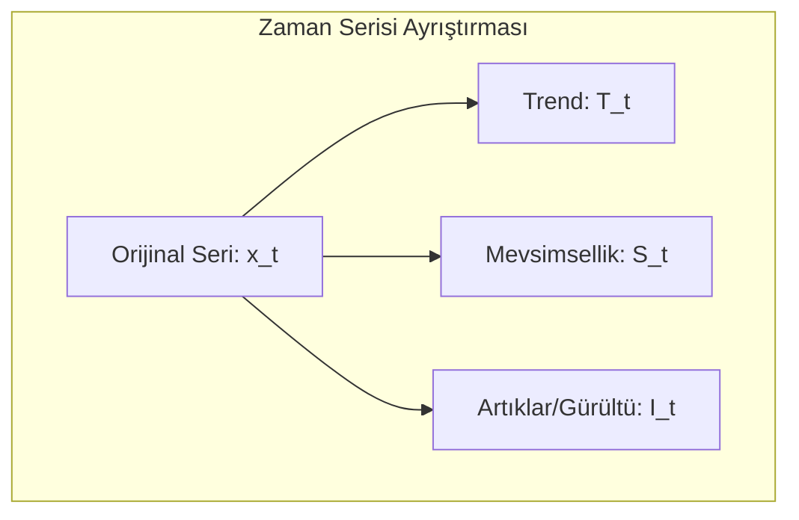

# Yapay Zeka Tabanlı Zaman Serisi ve Veri Analizi

### Ders Notları

---

# BÖLÜM I: TEMELLER

## 1. Zaman Serisi Nedir?

Gençler, zaman serisi analizine hoş geldiniz. En basit tanımıyla zaman serisi, belirli bir zaman aralığında ardışık olarak gözlemlenen veri noktaları dizisidir. Box ve Jenkins'in klasik tanımına göre, "zamana bağlı olarak düzenli aralıklarla kaydedilen gözlemler dizisidir."

Bu ne anlama geliyor? Günlük hayattan birkaç örnek verelim:

- Bir hastanedeki günlük hasta kabul sayısı
- Bir şirketin aylık satış rakamları
- Bir meteoroloji istasyonunda kaydedilen saatlik sıcaklık ölçümleri
- Bir hisse senedinin dakikalık fiyat hareketleri

Zaman serisi analizi; finans, ekonomi, sağlık, mühendislik ve çevre bilimleri gibi pek çok alanda karşımıza çıkar. Peki amacımız ne? Geçmiş verilerden yola çıkarak geleceği tahmin etmek, verideki anormal durumları tespit etmek ve verinin altında yatan temel desenleri ortaya çıkarmaktır.

Bu ders boyunca şu temel sorulara yanıt arayacağız:

- Verinin geçmişindeki desenler (pattern) nelerdir?
- Gelecekteki değerleri nasıl tahmin edebiliriz?
- Serideki olağan dışı değişimleri (anomalileri) nasıl tespit ederiz?
- Bir zaman serisini hangi temel bileşenler oluşturur?

---

## 2. Temel Kavramlar ve Bileşenler

Gençler, bir zaman serisini analiz etmeden önce temel kavramlarını anlamamız şart. İşte en önemli kavramlar:

- **Gözlem (Observation):** $x_t$ ile gösterilir ve $t$ anındaki veri noktasını ifade eder. Örneğin, 15. gündeki işlem sayısı $x_{15} = 120$.
- **Zaman Dizini (Time Index):** $t = 1, 2, ..., T$ şeklinde, gözlemlerin sıralandığı zaman noktalarıdır.
- **Trend:** Serideki uzun vadeli artış veya azalış eğilimidir. Bir e-ticaret sitesinin yıllık satışlarının sürekli artması pozitif bir trend örneğidir.
- **Mevsimsellik (Seasonality):** Belirli ve sabit periyotlarda (günlük, haftalık, yıllık) tekrar eden dalgalanmalardır. Yaz aylarında artan dondurma satışları klasik bir mevsimsellik örneğidir.
- **Döngüsellik (Cyclicity):** Mevsimsellik gibi periyodiktir ancak periyotları sabit değildir ve genellikle daha uzun vadelidir. Ekonomideki iş döngüleri (genişleme ve daralma dönemleri) bu duruma örnektir.
- **Durağanlık (Stationarity):** Dersin en kritik kavramlarından biridir. Bir serinin ortalama, varyans gibi istatistiksel özelliklerinin zamanla değişmemesi durumudur. Birçok klasik model, serinin durağan olmasını veya durağanlaştırılmasını gerektirir.

### 2.1. Zaman Serisi Bileşenleri

Bir zaman serisini genellikle dört ana bileşenin birleşimi olarak düşünebiliriz. Amacımız, bu bileşenleri ayrıştırarak serinin yapısını ortaya çıkarmaktır:

$$
x_t = T_t + S_t + C_t + I_t
$$

- $T_t$: Trend (Uzun vadeli yön)
- $S_t$: Mevsimsellik (Sabit periyotlu dalgalanmalar)
- $C_t$: Döngü (Değişken periyotlu dalgalanmalar)
- $I_t$: Rastgele Gürültü (Açıklanamayan, öngörülemeyen dalgalanmalar)

Bu ayrıştırma işlemi, serinin yapısını anlamamızda ve doğru modeli seçmemizde yol gösterir.



---

## 3. Zaman Serisi Tipleri

Gençler, analize başlamadan önce elinizdeki verinin türünü doğru sınıflandırmanız gerekir. Çünkü her seriye aynı yöntem uygulanmaz.

### 3.1. Değişken Sayısına Göre

- **Tek Değişkenli (Univariate):** Tek bir değişkenin zaman içindeki değişimini inceleriz. Örnek: Sadece altın fiyatları.
- **Çok Değişkenli (Multivariate):** İki veya daha fazla değişkenin eş zamanlı değişimini inceleriz. Örnek: Altın fiyatları, enflasyon oranı ve faiz oranlarının birlikte analizi.

### 3.2. İstatistiksel Özelliklere Göre

- **Durağan (Stationary):** İstatistiksel özellikleri zamanla değişmeyen seriler.
- **Durağan Olmayan (Non-Stationary):** Trend veya mevsimsellik gibi nedenlerle istatistiksel özellikleri zamanla değişen seriler.

### 3.3. Ölçüm Zamanına Göre

- **Kesikli (Discrete-Time):** Gözlemlerin belirli zaman aralıklarında (saatlik, günlük, aylık) yapıldığı seriler. Analiz ettiğimiz serilerin büyük çoğunluğu bu tiptedir.
- **Sürekli (Continuous-Time):** Gözlemlerin zamanın her anında mevcut olduğu teorik seriler. EKG sinyalleri gibi.

### 3.4. Rastgelelik Durumuna Göre

- **Deterministik:** Gelecek değerleri hatasız tahmin edilebilen, matematiksel bir fonksiyonla ifade edilebilen seriler.
- **Stokastik:** Gelecek değerleri belirsizlik içeren ve rastgele bir bileşene sahip olan seriler. Gerçek dünyadaki serilerin neredeyse tamamı stokastiktir.

---

# BÖLÜM II: R İLE UYGULAMA

## 4. Tarih ve Zaman Nesneleri

Gençler, zaman serisi analizinin belki de en can sıkıcı ama en önemli konusuna giriyoruz: tarih ve zaman nesneleri. Birçok öğrenci burada takılıyor. Neden? Çünkü tarih formatları dünyada standart değil.

### 4.1. Tarih Formatı Sorunsalı

Şu tarihe bir bakın: `01/02/2024`. Bu ne anlama geliyor?

- **Amerika'da:** 2 Ocak 2024 (Month/Day/Year)
- **Avrupa'da:** 1 Şubat 2024 (Day/Month/Year)
- **Japonya'da:** 2024, 1 Şubat (Year/Month/Day)

Eğer verinizi okurken bu formata dikkat etmezseniz, tüm analiziniz en başından çöp olur. Kendinize bir iyilik yapın ve tek bir standarda bağlı kalın: **ISO 8601 formatı (YYYY-MM-DD)**. Bu format evrenseldir, makine dostudur ve gelecekteki baş ağrılarından kurtarır.

### 4.2. R'da Tarih Nesneleri

R, bu format karmaşasını yönetmek için özel veri tipleri sunar. Bunlardan ikisini bilmek zorundasınız:

1. **`Date`**: Sadece tarih bilgisi (gün, ay, yıl) tutar. Saatle işiniz yoksa bunu kullanın.
2. **`POSIXct` / `POSIXlt`**: Tarih, saat ve hatta saat dilimi gibi daha detaylı bilgileri içerir. `POSIXct` daha yaygın kullanılır ve genellikle daha verimlidir.

```r
# Bugünün tarihini al
bugun <- Sys.Date()
print(bugun)
#> [1] "2024-10-26"
class(bugun)
#> [1] "Date"

# Şu anki zamanı al
simdi <- Sys.time()
print(simdi)
#> [1] "2024-10-26 15:30:00 EEST"
class(simdi)
#> [1] "POSIXct" "POSIXt"
```

Peki, elimizdeki "03/15/2024" gibi bir metni R'ın anlayacağı bir `Date` nesnesine nasıl çeviririz? `as.Date()` fonksiyonu ile. Ama bir püf noktası var: R'a hangi formatta yazdığınızı söylemeniz gerekir.

```r
# Amerikan formatı (MM/DD/YYYY)
tarih_us <- as.Date("03/15/2024", format = "%m/%d/%Y")

# Avrupa formatı (DD/MM/YYYY)
tarih_eu <- as.Date("15/03/2024", format = "%d/%m/%Y")

# Uzun format
tarih_uzun <- as.Date("15 Mart 2024", format = "%d %B %Y")
```

**Ezberlemeniz Gereken Format Kodları:**

Bu kodlar, R'a metnin hangi parçasının gün, ay veya yıl olduğunu anlatır:

- `%Y`: 4 haneli yıl (örn: 2024)
- `%m`: Sayısal ay (01-12)
- `%B`: Tam ay ismi (örn: Ocak, February)
- `%b`: Kısa ay ismi (örn: Oca, Feb)
- `%d`: Gün (01-31)

### 4.3. `lubridate` Paketi

`as.Date()` ve format kodları güçlüdür ama her seferinde uğraşmak yorucu olabilir. `lubridate` paketi tarih işlemlerini basitleştirir.

```r
# install.packages("lubridate") # Yüklü değilse
library(lubridate)

# lubridate'ın güzelliği, format kodlarını düşünmeden tarihleri okuyabilmenizdir
tarih1 <- ymd("2024-03-15")      # Year-Month-Day
tarih2 <- dmy("15-03-2024")      # Day-Month-Year
tarih3 <- mdy("03/15/2024")      # Month-Day-Year

# Tarihten bilgi çekmek çok kolay
year(tarih1)   # 2024
month(tarih1)  # 3
day(tarih1)    # 15
wday(tarih1, label = TRUE) # Haftanın günü (örn: "Fri")
```

### 4.4. Tarih Aritmetiği ve Diziler

Tarihleri bir kere doğru formata getirdikten sonra onlarla matematiksel işlemler yapabiliriz. Bu, özellikle "30 gün sonrası" veya "iki olay arasındaki gün sayısı" gibi hesaplamalar için kritiktir.

```r
baslangic <- as.Date("2024-01-01")

# Tarihe gün, ay, yıl ekleme (lubridate ile)
baslangic + days(30)
baslangic + months(3)
baslangic + years(1)

# İki tarih arasındaki fark
bitis <- as.Date("2024-12-31")
fark <- bitis - baslangic
print(as.numeric(fark)) # 365 gün

# Aylık bir tarih dizisi oluşturma
aylik_dizi <- seq.Date(from = as.Date("2024-01-01"),
                       to = as.Date("2024-12-31"),
                       by = "month")
print(aylik_dizi)
```

---

## 5. R'da Zaman Serisi Nesneleri

Gençler, tarih ve zaman sorununu çözdükten sonra veriyi R'ın analiz için kullandığı özel bir nesneye dönüştürmemiz gerekiyor: `ts` (time series) nesnesi.

Bir `ts` nesnesi iki temel bilgiyi içerir:

1. **Veri:** Sayısal değerlerden oluşan bir vektör.
2. **Zaman Bilgisi:** Serinin başlangıç zamanı (`start`) ve frekansı (`frequency`).

### 5.1. Frekans Kavramı

Frekans, bir zaman döngüsünde kaç gözlem olduğunu belirtir. Bu parametreyi yanlış ayarlarsanız, mevsimsellik gibi önemli desenleri modelleyemezsiniz.

| Veri Tipi | Frekans |
|-----------|---------|
| Aylık | 12 |
| Çeyreklik | 4 |
| Yıllık | 1 |
| Günlük | 365 (veya 365.25) |
| Haftalık | 52 |

### 5.2. `ts` Nesnesi Oluşturma ve İnceleme

```r
# Örnek 1: Manuel Veri ile ts Nesnesi Oluşturma
# 2024 yılına ait aylık satış verisi
veri <- c(100, 105, 98, 112, 108, 115, 120, 118, 125, 130, 128, 135)

# ts nesnesi oluşturalım: 2024'ün 1. ayından başlıyor, frekansı 12
satis_ts <- ts(data = veri, start = c(2024, 1), frequency = 12)

print(satis_ts)
#>      Jan  Feb  Mar  Apr  May  Jun  Jul  Aug  Sep  Oct  Nov  Dec
#> 2024 100  105   98  112  108  115  120  118  125  130  128  135

# Örnek 2: R'ın Dahili Veri Seti (AirPassengers)
# Bu veri seti, 1949-1960 yılları arasındaki aylık uluslararası 
# havayolu yolcu sayılarını içerir.
data(AirPassengers)

# Veriyi ve yapısını inceleyelim
print(AirPassengers)
class(AirPassengers) # Zaten 'ts' formatında

# ts nesnesinin özelliklerini kontrol edelim
start(AirPassengers)     # Başlangıç: [1] 1949    1
end(AirPassengers)       # Bitiş:   [1] 1960   12
frequency(AirPassengers) # Frekans: [1] 12 (aylık veri)
cycle(AirPassengers)     # Her bir gözlemin döngüdeki yerini gösterir

# AirPassengers veri setini görselleştirelim
plot(AirPassengers,
    main = "Aylık Uluslararası Havayolu Yolcu Sayıları (1949-1960)",
    ylab = "Yolcu Sayısı (Bin)",
    xlab = "Yıl",
    col = "darkblue")
grid()
```

### 5.3. `xts` ile Gerçek Dünya Verileri

`ts` nesnesi, ders kitaplarındaki gibi düzenli aralıklı veriler için uygundur. Ancak gerçek dünya verileri nadiren bu kadar düzenlidir. Hafta sonları işlem görmeyen borsa verilerini veya bazen kesintiye uğrayan sensör kayıtlarını düşünün. `ts` nesnesinin sabit frekans yapısı bu gibi durumlarda yetersiz kalır.

`xts` (eXtensible Time Series) paketi, `zoo` paketi üzerine inşa edilmiştir ve her bir gözlemi kendi hassas zaman damgasıyla eşleştirir. Bu sayede düzensiz ve yüksek frekanslı verilerle çalışmak kolaylaşır.

```r
# Gerekli paketi yükleyelim
# install.packages("xts") # Yüklü değilse
library(xts)

# Düzensiz aralıklı bir veri oluşturalım (hafta sonları atlanmış)
degerler <- c(101, 103, 102, 105, 104)
tarihler <- as.Date(c("2024-01-22", "2024-01-23", "2024-01-24", 
                      "2024-01-25", "2024-01-26"))

# xts nesnesi oluşturalım
veri_xts <- xts(x = degerler, order.by = tarihler)

print(veri_xts)
#>            [,1]
#> 2024-01-22  101
#> 2024-01-23  103
#> 2024-01-24  102
#> 2024-01-25  105
#> 2024-01-26  104
```

**`xts`'in Gücü: Sezgisel Filtreleme**

`xts`'in en büyük avantajlarından biri, tarih bazlı alt kümelemenin çok kolay olmasıdır:

```r
# Belirli bir tarih aralığını seçmek
veri_xts["2024-01-23/2024-01-25"]

# Sadece belirli bir ayı veya yılı seçmek
# veri_xts["2024-01"] # Ocak ayının tamamı
# veri_xts["2024"]    # 2024 yılının tamamı

# Günlük veriden haftalık verilere geçelim
haftalik_veri <- to.period(veri_xts, period = "weeks")
print(haftalik_veri)

# Aylık ortalamaları hesaplayalım
aylik_ortalama <- apply.monthly(veri_xts, FUN = mean)
print(aylik_ortalama)
```

Özetle, elinizdeki veri düzenli aralıklı ve klasik bir zaman serisi ise `ts` nesnesi işinizi görecektir. Ancak düzensiz, yüksek frekanslı veya üzerinde karmaşık tarih/saat manipülasyonları yapmanız gereken bir veriyle çalışıyorsanız, `xts` daha uygun bir araçtır.

---

## 6. Keşifsel Analiz

Gençler, veri hazırlandıktan sonra sıra onu tanımaya geliyor. Keşifsel analiz, modelleme öncesi serinin karakteristik özelliklerini anlamamıza yardımcı olur.

### 6.1. Temel Fonksiyonlar

**`lag()` fonksiyonu:** Zaman serisi analizinin en temel araçlarından biridir. Bir serinin geçmiş değerlerini mevcut satıra taşır. Bu, "dünkü değer bugünü etkiler mi?" sorusunu araştırmak için kullanılır.

```r
# USgas veri setini kullanalım
library(TSstudio)
data(USgas)

# 1 ay önceki değeri (lag-1) ve 12 ay önceki değeri (lag-12) oluşturalım
USgas_lag1 <- stats::lag(USgas, k = -1)
USgas_lag12 <- stats::lag(USgas, k = -12)

# Orijinal seri ile gecikmeli değerleri karşılaştıralım
comparison_df <- cbind(
    Original = USgas,
    Lag1 = USgas_lag1,
    Lag12 = USgas_lag12
)
head(comparison_df, 15)
```

Bu gecikmeli değerler, "geçen ayki tüketim" veya "geçen yılın aynı ayındaki tüketim" gibi bilgileri modelimize birer özellik olarak eklememizi sağlar.

**`decompose()` fonksiyonu:** Bir serinin iç yapısını incelememizi sağlar. Bu fonksiyon, bir zaman serisini üç temel bileşenine ayırır: trend, mevsimsellik ve geriye kalan rastgele gürültü.

```r
# USgas serisini bileşenlerine ayıralım
USgas_ayristir <- decompose(USgas)

# Sonuçları çizdirelim
plot(USgas_ayristir)
```

Bu komutu çalıştırdığınızda karşınıza dört parçadan oluşan bir grafik çıkar:

- **Observed:** Orijinal verinin kendisi.
- **Trend:** Serideki uzun vadeli artış veya azalış eğilimi.
- **Seasonal:** Her yıl tekrar eden sabit döngü.
- **Random:** Trend ve mevsimsellik çıkarıldıktan sonra geriye kalan, açıklanamayan kısım.

### 6.2. ACF (Otokorelasyon Fonksiyonu)

Serinin geçmişiyle olan ilişkisini anlamak için ACF kullanılır. Bir serinin bugünkü değeri dünkü değerine ne kadar benziyor? Peki geçen haftaki değerine? ACF bu soruların cevabını verir.

ACF grafiğini okumak sezgiseldir:

- Her dikey çubuk, belirli bir gecikmedeki (lag) otokorelasyonu gösterir.
- Mavi kesikli yatay çizgiler güven aralığını temsil eder (yaklaşık ±1.96 / √N).
- Bir çubuk bu bantların dışına çıkarsa o gecikme istatistiksel olarak anlamlıdır.
- Çubuklar yavaşça azalıyorsa güçlü bir trend olabilir.
- Belirli aralıklarda (ör. lag-12, lag-24) tepe görmek mevsimselliğe işaret eder.

**ACF'nin Matematiksel Tanımı:**

$$
\rho_k = \frac{\text{Cov}(x_t, x_{t-k})}{\text{Var}(x_t)} = \frac{\sum_{t=k+1}^{T} (x_t - \bar{x})(x_{t-k} - \bar{x})}{\sum_{t=1}^{T} (x_t - \bar{x})^2}
$$

**Örnek Hesaplama (ACF Lag-1):**

Elimizde beş günlük sıcaklık verisi olsun: $x = [10, 12, 15, 11, 17]$.

1. **Ortalamayı Bul:** $\bar{x} = (10 + 12 + 15 + 11 + 17) / 5 = 13$

2. **Hesaplama Tablosu:**

| t | $x_t$ | $x_{t-1}$ | $(x_t - \bar{x})$ | $(x_{t-1} - \bar{x})$ | Çarpım | Kare |
|:-:|:-----:|:---------:|:-----------------:|:---------------------:|:------:|:----:|
| 1 | 10 | - | -3 | - | - | 9 |
| 2 | 12 | 10 | -1 | -3 | 3 | 1 |
| 3 | 15 | 12 | 2 | -1 | -2 | 4 |
| 4 | 11 | 15 | -2 | 2 | -4 | 4 |
| 5 | 17 | 11 | 4 | -2 | -8 | 16 |
| **Toplam** | | | | | **-11** | **34** |

3. **Sonuç:** $\rho_1 = -11/34 \approx -0.324$

Bu sonuç, dünkü ve bugünkü sıcaklıklar arasında zayıf, negatif bir ilişki olduğunu gösterir.

**Kod Örnekleri:**

```python
# Python ile ACF
from statsmodels.tsa.stattools import acf
import numpy as np

data = np.array([20, 22, 21, 23, 24])
acf_values = acf(data, nlags=2)
print(f"Lag-1 ACF: {acf_values[1]:.3f}")
```

```r
# R ile ACF
data <- c(20, 22, 21, 23, 24)
acf_result <- acf(data, plot = FALSE)
cat("Lag-1 ACF:", round(acf_result$acf[2], 3))
```

### 6.3. PACF (Kısmi Otokorelasyon Fonksiyonu)

PACF, ACF'nin bir adım ötesidir. ACF, bir gecikmedeki korelasyonu ölçerken aradaki tüm gecikmelerin etkisini de içerir. PACF ise bu ara etkileri "temizleyerek" sadece o gecikmenin doğrudan etkisini gösterir.

PACF özellikle AR (Otoregresif) modellerinin derecesini belirlemede kritiktir:

- PACF belirli bir gecikmeden sonra keskin bir şekilde sıfıra düşüyorsa, bu AR modelinin derecesini gösterir.
- Örneğin PACF lag-2'den sonra sıfıra düşüyorsa, AR(2) modeli uygun olabilir.

```r
# ACF ve PACF grafiklerini yan yana çizelim
par(mfrow=c(1,2))
acf(AirPassengers, main="ACF")
pacf(AirPassengers, main="PACF")
```

### 6.4. Model Seçiminde ACF ve PACF Kullanımı

| ACF Davranışı | PACF Davranışı | Önerilen Model |
|---------------|----------------|----------------|
| Yavaş azalıyor | Keskin kesiyor | AR süreci |
| Keskin kesiyor | Yavaş azalıyor | MA süreci |
| İkisi de yavaş azalıyor | İkisi de yavaş azalıyor | ARMA süreci |

---

## 7. ARIMA Modelleri (R)

Gençler, ARIMA (AutoRegressive Integrated Moving Average) zaman serisi analizinin temel taşlarından biridir. Bu model, serinin geçmiş değerlerine (AR), geçmiş hatalarına (MA) ve fark alma işlemine (I) dayanır.

### 7.1. ARIMA Bileşenleri

**AR (Otoregresif) Bileşeni:**

Serinin mevcut değerini, kendi geçmiş değerlerinin doğrusal bir kombinasyonu olarak modeller:

$$x_t = c + \phi_1 x_{t-1} + \phi_2 x_{t-2} + ... + \phi_p x_{t-p} + \epsilon_t$$

**MA (Hareketli Ortalama) Bileşeni:**

Serinin mevcut değerini, geçmiş tahmin hatalarının doğrusal bir kombinasyonu olarak modeller:

$$x_t = c + \epsilon_t + \theta_1 \epsilon_{t-1} + \theta_2 \epsilon_{t-2} + ... + \theta_q \epsilon_{t-q}$$

**I (Bütünleşme/Fark Alma) Bileşeni:**

Durağan olmayan serileri durağan hale getirmek için fark alma işlemi uygulanır:

$$\Delta x_t = x_t - x_{t-1}$$

### 7.2. ARIMA(p,d,q) Notasyonu

- **p:** AR terimlerinin sayısı (kaç geçmiş değere bakılacağı)
- **d:** Fark alma derecesi (durağanlık için kaç kez fark alınacağı)
- **q:** MA terimlerinin sayısı (kaç geçmiş hataya bakılacağı)

### 7.3. R ile ARIMA Uygulaması

**1. Durağanlık Testi**

```r
library(tseries)

adf.test(AirPassengers)
#>  Augmented Dickey-Fuller Test
#> data:  AirPassengers
#> Dickey-Fuller = -1.9819, Lag order = 5, p-value = 0.5841
#> alternative hypothesis: stationary
```

p-değeri (0.58) yüksek olduğu için seri durağan değildir.

**2. Seriyi Durağanlaştırma**

Durağanlığı sağlamak için iki yaygın işlem yapılır:

1. **Logaritmik Dönüşüm:** Artan varyansı stabilize etmek için kullanılır.
2. **Fark Alma:** Trendi ve mevsimselliği ortadan kaldırmak için kullanılır.

```r
# Önce log dönüşümü, sonra mevsimsel (lag=12) ve normal fark alma
AP_stationary <- diff(log(AirPassengers), lag = 12) %>% diff()

# Durağanlaşmış seriyi çizelim
plot(AP_stationary, main="Dönüştürülmüş AirPassengers Serisi",
     ylab="Fark Değerleri", col="darkblue")
grid()

# Tekrar ADF testi
adf.test(AP_stationary)
#> p-value = 0.01
```

Artık p-değeri (0.01) düşük olduğuna göre serimiz durağandır.

**3. Model Belirleme**

Durağan serinin ACF ve PACF grafiklerini inceleyerek ARIMA modelinin `p` ve `q` parametreleri için ipuçları ararız.

```r
par(mfrow=c(1,2))
acf(AP_stationary, main="ACF")
pacf(AP_stationary, main="PACF")
```

**4. Otomatik Model Seçimi**

`auto.arima()` fonksiyonu, en iyi SARIMA modelini AIC (Akaike Information Criterion) gibi bilgi kriterlerine göre otomatik olarak seçer.

```r
library(forecast)

fit <- auto.arima(log(AirPassengers), seasonal = TRUE)
print(fit)
#> Series: log(AirPassengers) 
#> ARIMA(0,1,1)(0,1,1)[12] 
#> 
#> Coefficients:
#>           ma1     sma1
#>       -0.4018  -0.5569
#> s.e.   0.0896   0.0731
#> 
#> sigma^2 estimated as 0.001348:  log likelihood=244.7
#> AIC=-483.4   AICc=-483.21   BIC=-474.77
```

### 7.4. SARIMA Modelinin Yorumlanması

`auto.arima()` fonksiyonu `ARIMA(0,1,1)(0,1,1)[12]` modelini seçti. Bu model iki ana bölümden oluşur:

**Mevsimsel Olmayan Kısım: `(0,1,1)`**

- **p=0:** Otoregresif bileşen yok
- **d=1:** Bir kez fark alınmış (trend kaldırıldı)
- **q=1:** Bir önceki ayın tahmin hatası kullanılıyor

**Mevsimsel Kısım: `(0,1,1)[12]`**

- **P=0:** Mevsimsel otoregresif bileşen yok
- **D=1:** Mevsimsel fark alınmış (yıllık mevsimsellik kaldırıldı)
- **Q=1:** Geçen yılın aynı ayındaki tahmin hatası kullanılıyor
- **[12]:** Mevsimsel periyot 12 ay

### 7.5. Model Doğrulama

Kurduğumuz modelin gerçekten işe yarayıp yaramadığını artıkları inceleyerek anlayabiliriz. İyi bir modelde artıklar:

1. **Ortalaması sıfır olmalı**
2. **Sabit varyansa sahip olmalı**
3. **Otokorelasyon içermemeli** (beyaz gürültü)

```r
checkresiduals(fit)
```

Bu fonksiyon bize üç grafik sunar:

- **Artıkların Zaman Grafiği:** Herhangi bir belirgin desen olmamalı
- **Artıkların ACF Grafiği:** Tüm çubuklar güven aralığının içinde kalmalı
- **Ljung-Box Testi:** p-değeri > 0.05 ise artıklarda otokorelasyon yoktur

### 7.6. Tahmin

```r
# 12 ay ileriye tahmin
fc <- forecast(fit, h=12)

# Tahminleri görselleştirelim
plot(fc)

# Tahmin değerlerini görelim (orijinal ölçeğe dönüştürerek)
print(exp(fc$mean))
```

---

# BÖLÜM III: PYTHON İLE UYGULAMA

## 8. Veri Hazırlama ve Görselleştirme

Gençler, bu bölümde Python ile zaman serisi analizine geçiyoruz. Python'un zengin kütüphane ekosistemi, veri hazırlamadan model kurmaya kadar her aşamada güçlü araçlar sunar.

### 8.1. Gerekli Kütüphaneler

```python
# Temel kütüphaneler
import pandas as pd
import numpy as np
import matplotlib.pyplot as plt

# Zaman serisi analizi için
from statsmodels.tsa.seasonal import seasonal_decompose
from statsmodels.graphics.tsaplots import plot_acf, plot_pacf
from statsmodels.tsa.stattools import adfuller

# Model kurma için
from pmdarima import auto_arima
from sklearn.preprocessing import MinMaxScaler
from sklearn.metrics import mean_squared_error, mean_absolute_error
```

### 8.2. Veri Yükleme ve İnceleme

```python
# AirPassengers veri setini yükleyelim
df = pd.read_csv('data/AirPassengers.csv')

# Sütun adını düzeltelim (bazen '#Passengers' olarak geliyor)
if '#Passengers' in df.columns:
    df.rename(columns={'#Passengers': 'Passengers'}, inplace=True)

# Tarih indeksini ayarlayalım
df['Month'] = pd.to_datetime(df['Month'])
df.set_index('Month', inplace=True)

# Veri setine göz atalım
print("Veri seti özeti:")
print(f"  Gözlem sayısı: {len(df)}")
print(f"  Tarih aralığı: {df.index.min()} - {df.index.max()}")
print(f"\n{df.head()}")
print(f"\nTemel istatistikler:\n{df.describe()}")
```

### 8.3. Görselleştirme

```python
# Seriyi çizdirelim
plt.figure(figsize=(12, 5))
plt.plot(df.index, df['Passengers'], linewidth=1)
plt.title('Aylık Havayolu Yolcu Sayısı (1949-1960)')
plt.xlabel('Tarih')
plt.ylabel('Yolcu Sayısı (bin)')
plt.grid(True, alpha=0.3)
plt.tight_layout()
plt.show()

# Bileşenlere ayırma
decomposition = seasonal_decompose(df['Passengers'], model='multiplicative')

fig, axes = plt.subplots(4, 1, figsize=(12, 10))
decomposition.observed.plot(ax=axes[0], title='Orijinal Seri')
decomposition.trend.plot(ax=axes[1], title='Trend')
decomposition.seasonal.plot(ax=axes[2], title='Mevsimsellik')
decomposition.resid.plot(ax=axes[3], title='Artıklar')
plt.tight_layout()
plt.show()
```

### 8.4. Durağanlık Testi

```python
def adf_test(series, name=""):
    """
    ADF testi uygular ve sonuçları yorumlar.
    """
    result = adfuller(series.dropna(), autolag='AIC')
    
    print(f"\n{name} - ADF Testi Sonuçları:")
    print(f"  Test İstatistiği: {result[0]:.4f}")
    print(f"  p-değeri: {result[1]:.4f}")
    print(f"  Kritik Değerler:")
    for key, value in result[4].items():
        print(f"    {key}: {value:.4f}")
    
    if result[1] < 0.05:
        print("  → Seri durağan (H0 reddedildi)")
    else:
        print("  → Seri durağan değil (H0 reddedilemedi)")
    
    return result[1]

# Test edelim
adf_test(df['Passengers'], "Orijinal Seri")
```

### 8.5. ACF ve PACF Grafikleri

```python
fig, axes = plt.subplots(1, 2, figsize=(14, 4))

plot_acf(df['Passengers'], lags=36, ax=axes[0])
axes[0].set_title('ACF')

plot_pacf(df['Passengers'], lags=36, ax=axes[1])
axes[1].set_title('PACF')

plt.tight_layout()
plt.show()
```

---

## 9. ARIMA Modeli (Python)

Gençler, R'da gördüğümüz ARIMA modelini şimdi Python ile uygulayacağız. `pmdarima` kütüphanesinin `auto_arima` fonksiyonu, R'daki `auto.arima()` ile aynı işlevi görür.

### 9.1. Model Kurma

```python
from pmdarima import auto_arima

# Logaritmik dönüşüm uygulayalım (varyans stabilizasyonu için)
log_passengers = np.log(df['Passengers'])

# En iyi modeli otomatik olarak bulalım
model = auto_arima(
    log_passengers,
    seasonal=True,
    m=12,  # Mevsimsel periyot
    trace=True,  # Denenen modelleri göster
    error_action='ignore',
    suppress_warnings=True,
    stepwise=True
)

print(model.summary())
```

### 9.2. Eğitim/Test Ayrımı ve Değerlendirme

```python
# Son 12 ayı test için ayıralım
train = log_passengers[:-12]
test = log_passengers[-12:]

# Modeli eğitim verisiyle kuralım
model_train = auto_arima(
    train,
    seasonal=True,
    m=12,
    suppress_warnings=True,
    stepwise=True
)

# Tahmin yapalım
predictions = model_train.predict(n_periods=12)

# Orijinal ölçeğe dönüştürelim
test_original = np.exp(test)
predictions_original = np.exp(predictions)

# Performans metrikleri
rmse = np.sqrt(mean_squared_error(test_original, predictions_original))
mae = mean_absolute_error(test_original, predictions_original)
mape = np.mean(np.abs((test_original - predictions_original) / test_original)) * 100

print(f"\nTest Seti Performansı:")
print(f"  RMSE: {rmse:.2f}")
print(f"  MAE:  {mae:.2f}")
print(f"  MAPE: {mape:.2f}%")
```

### 9.3. Tahminlerin Görselleştirilmesi

```python
plt.figure(figsize=(12, 5))

# Gerçek değerler
plt.plot(df.index, df['Passengers'], label='Gerçek', color='blue')

# Tahminler
test_dates = df.index[-12:]
plt.plot(test_dates, predictions_original, label='Tahmin', 
         color='red', linestyle='--', marker='o')

plt.title('ARIMA Model Tahminleri')
plt.xlabel('Tarih')
plt.ylabel('Yolcu Sayısı')
plt.legend()
plt.grid(True, alpha=0.3)
plt.tight_layout()
plt.show()
```

---

## 10. Facebook Prophet

Gençler, Prophet algoritması Facebook tarafından geliştirilen ve özellikle mevsimsellik ile tatil etkilerinin belirgin olduğu zaman serilerinde etkili sonuçlar veren bir araçtır.

Prophet, karmaşık görünen bir zaman serisi grafiğini anlaşılması kolay bileşenlere ayırır:

- **Trend:** Serinin uzun vadedeki genel yönü
- **Mevsimsellik:** Belirli periyotlarda kendini tekrar eden düzenli dalgalanmalar
- **Tatiller:** Bayramlar gibi belirli günlerde yaşanan özel olaylar

Model matematiksel olarak şöyle ifade edilir:

$$y(t) = g(t) + s(t) + h(t) + \epsilon_t$$

- $g(t)$: Trend fonksiyonu (parçalı doğrusal veya lojistik)
- $s(t)$: Mevsimsellik (Fourier serileri ile)
- $h(t)$: Tatil etkileri
- $\epsilon_t$: Hata terimi

### 10.1. Python ile Uygulama

Prophet, veriyi belirli bir formatta ister. Tarih sütununun adı `ds`, tahmin edilecek değerin adı `y` olmalıdır.

```python
from prophet import Prophet
import pandas as pd
import matplotlib.pyplot as plt

# Veri setini yükleyelim
df = pd.read_csv('data/AirPassengers.csv')

# Prophet'ın gerektirdiği formata dönüştürelim
df.columns = ['ds', 'y']
df['ds'] = pd.to_datetime(df['ds'])

# Modeli oluşturalım
model = Prophet(
    yearly_seasonality=True,   # Yıllık mevsimsellik var
    daily_seasonality=False,   # Günlük mevsimsellik yok
    weekly_seasonality=False   # Haftalık mevsimsellik yok
)

# Modeli eğitelim
model.fit(df)

# Gelecek tarihleri oluşturalım
future = model.make_future_dataframe(periods=12, freq='MS')

# Tahmin yapalım
forecast = model.predict(future)

# Sonuçları görelim
print("--- Tahmin Sonuçları (Son 12 Ay) ---")
print(forecast[['ds', 'yhat', 'yhat_lower', 'yhat_upper']].tail(12))
```

### 10.2. Görselleştirme

```python
# Tahmin grafiği
fig1 = model.plot(forecast)
plt.title('Prophet ile Yolcu Sayısı Tahmini')
plt.xlabel('Tarih')
plt.ylabel('Yolcu Sayısı')
plt.show()

# Bileşen grafikleri
fig2 = model.plot_components(forecast)
plt.show()
```

Bileşen grafikleri, modelin öğrendiği yapıları ayrı ayrı gösterir:

- **Trend grafiği:** Yolcu sayısındaki genel artışı gösterir
- **Yıllık mevsimsellik grafiği:** Hangi aylarda artış, hangilerinde azalış olduğunu ortaya koyar

---

## 11. XGBoost ile Zaman Serisi Tahmini

Gençler, XGBoost (Extreme Gradient Boosting) bir karar ağacı algoritmasıdır. Karar ağaçları veriyi "Evet/Hayır" sorularıyla böler. XGBoost, bu ağaçların her birinin zayıf tahminlerini bir araya getirerek güçlü bir model oluşturur.

XGBoost zamanın akışını kendiliğinden anlamaz. Veriyi ona uygun hale getirmemiz, yani gözetimli öğrenme formatına çevirmemiz gerekir. Bu dönüşümün özü: "Geçmiş değerleri biliyorsam, gelecek değeri tahmin edebilir miyim?" sorusunu sormaktır.

### 11.1. Özellik Mühendisliği

Zaman serisini regresyon problemine dönüştürmek için geçmiş gözlemleri (lag özellikleri) ve takvim bilgilerini (ay, çeyrek) girdi olarak kullanırız.

```python
import numpy as np
import pandas as pd
import xgboost as xgb
import matplotlib.pyplot as plt
from sklearn.metrics import mean_squared_error, mean_absolute_error
from sklearn.model_selection import TimeSeriesSplit

# Tekrarlanabilirlik için
SEED = 42
np.random.seed(SEED)

# Veri yükleme
df = pd.read_csv('data/AirPassengers.csv')
if '#Passengers' in df.columns:
    df.rename(columns={'#Passengers': 'Passengers'}, inplace=True)

df['Month'] = pd.to_datetime(df['Month'])
df.set_index('Month', inplace=True)

# Özellik mühendisliği
df_features = df.copy()

# Gecikme (Lag) Özellikleri - Son 12 ay
for lag in range(1, 13):
    df_features[f'lag_{lag}'] = df_features['Passengers'].shift(lag)

# Hareketli İstatistikler
df_features['rolling_mean_3'] = df_features['Passengers'].shift(1).rolling(3).mean()
df_features['rolling_mean_6'] = df_features['Passengers'].shift(1).rolling(6).mean()
df_features['rolling_mean_12'] = df_features['Passengers'].shift(1).rolling(12).mean()
df_features['rolling_std_3'] = df_features['Passengers'].shift(1).rolling(3).std()
df_features['rolling_std_12'] = df_features['Passengers'].shift(1).rolling(12).std()

# Mevsimsel Fark
df_features['seasonal_diff'] = df_features['Passengers'] - df_features['Passengers'].shift(12)

# Takvim Özellikleri
df_features['month'] = df_features.index.month
df_features['quarter'] = df_features.index.quarter
df_features['year_normalized'] = (
    (df_features.index.year - df_features.index.year.min()) /
    (df_features.index.year.max() - df_features.index.year.min())
)

# Eksik değerleri temizle
df_features = df_features.dropna()

print(f"Özellik mühendisliği sonrası:")
print(f"  Gözlem sayısı: {len(df_features)}")
print(f"  Özellik sayısı: {len(df_features.columns) - 1}")
```

### 11.2. Model Kurma ve Eğitim

```python
# Özellik ve hedef değişkenleri ayıralım
feature_cols = [col for col in df_features.columns if col != 'Passengers']
X = df_features[feature_cols]
y = df_features['Passengers']

# Eğitim / Test ayrımı (son 12 ay test)
test_size = 12
split_point = len(X) - test_size

X_train, X_test = X.iloc[:split_point], X.iloc[split_point:]
y_train, y_test = y.iloc[:split_point], y.iloc[split_point:]

print(f"\nVeri bölümü:")
print(f"  Eğitim: {len(X_train)} gözlem")
print(f"  Test: {len(X_test)} gözlem")

# XGBoost modeli
model = xgb.XGBRegressor(
    n_estimators=1000,
    learning_rate=0.05,
    max_depth=4,
    subsample=0.8,
    colsample_bytree=0.8,
    random_state=SEED,
    early_stopping_rounds=50
)

# Modeli eğitelim
model.fit(
    X_train, y_train,
    eval_set=[(X_train, y_train), (X_test, y_test)],
    verbose=False
)

print(f"\nKullanılan ağaç sayısı: {model.best_iteration + 1}")
```

### 11.3. Performans Değerlendirme

```python
# Tahminler
y_train_pred = model.predict(X_train)
y_test_pred = model.predict(X_test)

# Metrik hesaplama fonksiyonu
def calculate_metrics(y_true, y_pred, set_name=""):
    """Tahmin performans metriklerini hesaplar."""
    y_true = np.array(y_true).flatten()
    y_pred = np.array(y_pred).flatten()
    
    mae = mean_absolute_error(y_true, y_pred)
    rmse = np.sqrt(mean_squared_error(y_true, y_pred))
    
    mask = y_true != 0
    mape = np.mean(np.abs((y_true[mask] - y_pred[mask]) / y_true[mask])) * 100
    
    print(f"\n{set_name} Performansı:")
    print(f"  MAE:  {mae:.2f}")
    print(f"  RMSE: {rmse:.2f}")
    print(f"  MAPE: {mape:.2f}%")
    
    return {'mae': mae, 'rmse': rmse, 'mape': mape}

print("=" * 50)
print("XGBOOST MODEL PERFORMANSI")
print("=" * 50)

train_metrics = calculate_metrics(y_train, y_train_pred, "Eğitim Seti")
test_metrics = calculate_metrics(y_test, y_test_pred, "Test Seti")
```

### 11.4. Özellik Önemi Analizi

```python
# Özellik önemlerini görselleştirelim
feature_importance = pd.DataFrame({
    'feature': feature_cols,
    'importance': model.feature_importances_
}).sort_values('importance', ascending=False)

plt.figure(figsize=(10, 8))
plt.barh(feature_importance['feature'][:15], feature_importance['importance'][:15])
plt.xlabel('Önem')
plt.title('XGBoost Özellik Önemi (İlk 15)')
plt.gca().invert_yaxis()
plt.tight_layout()
plt.show()
```

### 11.5. Weka ile XGBoost

Weka'da zaman serisi analizi için `timeseriesForecasting` paketinin kurulması gerekir:

1. **Paket Kurulumu:**
   - `Tools → Package Manager` menüsünü açın
   - `timeseriesForecasting` paketini arayın ve kurun
   - Weka'yı yeniden başlatın

2. **Veri Hazırlama:**
   - CSV dosyasını Weka formatına çevirin
   - `Preprocess` sekmesinde `TSLagMaker` filtresini uygulayın
   - Parametreler: `lagRange = 1-12`, `timeStampField = Month`

3. **Model Kurma:**
   - `Classify` sekmesine geçin
   - Algoritma olarak `trees → REPTree` veya `functions → SMOreg` seçin
   - `Test options` bölümünde `Percentage split` (%80) seçin
   - `Start` düğmesine basın

4. **Sonuçların Yorumlanması:**

| Metrik | Anlamı |
|--------|--------|
| Correlation coefficient | 1'e yakın = iyi uyum |
| Mean absolute error | Ortalama mutlak hata (MAE) |
| Root mean squared error | Kök ortalama kare hata (RMSE) |
| Relative absolute error | %100'den düşük = ortalamadan iyi |

---

## 12. Hata Metrikleri ve Model Değerlendirme

Gençler, modelleri kurduk, tahminleri ürettik. Ancak bir modelin iyi çalışıp çalışmadığına sadece grafiklere bakarak karar veremeyiz. Bilimsel bir kıyaslama için somut, sayısal kanıtlar gerekir.

### 12.1. MAE (Mean Absolute Error)

Tahmin ile gerçek değer arasındaki farkın mutlak değerinin ortalamasını alır:

$$MAE = \frac{1}{n} \sum_{i=1}^{n} |y_i - \hat{y}_i|$$

**Yorumu:** MAE değeriniz 20 ise, modeliniz ortalama ±20 birim sapıyor demektir.

**Avantajı:** Anlaşılması ve açıklanması kolaydır.

**Dezavantajı:** Büyük hataları küçük hatalardan ayırt etmez.

### 12.2. RMSE (Root Mean Squared Error)

Hataların karesini alır, ortalamasını bulur, sonra karekök alır:

$$RMSE = \sqrt{\frac{1}{n} \sum_{i=1}^{n} (y_i - \hat{y}_i)^2}$$

**Yorumu:** RMSE her zaman MAE'den büyük veya ona eşittir. Aradaki fark büyükse, model bazı noktalarda çok büyük hatalar yapıyor demektir.

**Avantajı:** Büyük hataları cezalandırır. Kritik sistemlerde tercih edilir.

### 12.3. MAPE (Mean Absolute Percentage Error)

Hataları yüzde cinsinden ifade eder:

$$MAPE = \frac{100}{n} \sum_{i=1}^{n} \left| \frac{y_i - \hat{y}_i}{y_i} \right|$$

**Yorumu:** MAPE %5 ise, model ortalama %5 oranında yanılıyor demektir.

**Avantajı:** Ölçekten bağımsızdır. Farklı büyüklükteki veri setlerini karşılaştırabilirsiniz.

**Dezavantajı:** Gerçek değer sıfıra yakınsa sonuç patlar (sıfıra bölme sorunu).

### 12.4. Metriklerin Karşılaştırması

| Durum | Tercih Edilecek Metrik |
|-------|------------------------|
| Sonuçları müşteriye açıklamak | MAE (anlaşılır) |
| Büyük hataların maliyeti yüksek | RMSE (cezalandırıcı) |
| Farklı ölçekleri karşılaştırmak | MAPE (yüzde) |
| Genel değerlendirme | Üçünü birlikte kullanın |

### 12.5. Standart Değerlendirme Fonksiyonu

```python
import numpy as np
from sklearn.metrics import mean_absolute_error, mean_squared_error

def evaluate_model(y_true, y_pred, model_name):
    """
    Model performansını değerlendirir ve sonuçları yazdırır.
    
    Parametreler:
        y_true: Gerçek değerler
        y_pred: Tahmin edilen değerler
        model_name: Modelin adı
    
    Döndürür:
        dict: MAE, RMSE ve MAPE değerlerini içeren sözlük
    """
    y_true = np.array(y_true).flatten()
    y_pred = np.array(y_pred).flatten()
    
    mae = mean_absolute_error(y_true, y_pred)
    rmse = np.sqrt(mean_squared_error(y_true, y_pred))
    
    # MAPE hesaplarken sıfıra bölmeyi önle
    mask = y_true != 0
    mape = np.mean(np.abs((y_true[mask] - y_pred[mask]) / y_true[mask])) * 100
    
    print(f"\n{'=' * 40}")
    print(f"{model_name} Performans Sonuçları")
    print(f"{'=' * 40}")
    print(f"MAE:  {mae:>10.2f}")
    print(f"RMSE: {rmse:>10.2f}")
    print(f"MAPE: {mape:>9.2f}%")
    
    return {'mae': mae, 'rmse': rmse, 'mape': mape}
```

### 12.6. Sonuçların Yorumlanması

Metrikleri karşılaştırırken şu sorulara yanıt arayın:

**MAE ve RMSE birbirine yakın mı?**
- Evet → Model tutarlı hatalar yapıyor
- RMSE çok yüksek → Bazı noktalarda büyük sapmalar var

**MAPE makul düzeyde mi?**
- %5-10 → İyi performans
- %10-20 → Kabul edilebilir
- %20+ → Model iyileştirilmeli

**Eğitim ve test metrikleri arasında fark var mı?**
- Eğitim çok düşük, test yüksek → Aşırı öğrenme (overfitting)
- İkisi de yüksek → Yetersiz öğrenme (underfitting)
- İkisi yakın → İyi genelleme

---

# BÖLÜM IV: DERİN ÖĞRENME

## 13. LSTM (Long Short-Term Memory)

Gençler, şimdiye kadar gördüğümüz ARIMA gibi klasik modeller, verideki doğrusal yapıları ve düzenli kalıpları yakalamada başarılıdır. Ancak gerçek dünya verileri her zaman bu kadar öngörülebilir değildir. Bazen serinin içindeki ilişkiler o kadar karmaşık ve doğrusal değildir ki, bu istatistiksel modeller yetersiz kalır. İşte bu noktada derin öğrenme modelleri devreye girer.

### 13.1. LSTM Nedir?

Tekrarlayan Sinir Ağları (RNN), en temel haliyle bir "hafızaya" sahip ağlardır. Bir adımdaki hesaplamadan elde ettikleri bilgiyi bir sonraki adıma aktarırlar. Ancak bu temel hafıza, uzun serilerde zayıflar. Uzun bir cümledeki ilk kelimeyi, cümlenin sonuna geldiğinde unutabilir. Buna teknik olarak **kaybolan gradyan (vanishing gradient)** sorunu diyoruz.

LSTM mimarisi bu sorunu çözmek için geliştirilmiştir. LSTM'in sırrı, **kapı (gate)** adını verdiğimiz akıllı kontrol mekanizmalarındadır. Bu kapılar, hücrenin hafızasına hangi bilginin girip, hangisinin kalıp, hangisinin de çıkacağına karar verir.

Bir LSTM hücresinin üç temel kapısı vardır:

1. **Unutma Kapısı (Forget Gate):** Geçmiş hafızadan hangi bilgilerin artık gereksiz olduğuna karar verir ve onları siler.
2. **Giriş Kapısı (Input Gate):** Yeni gelen bilgiden hangi kısımların önemli olduğuna karar verir ve bunları hafızaya ekler.
3. **Çıkış Kapısı (Output Gate):** Mevcut hafızaya ve yeni girdiye bakarak, bu zaman adımı için ne tür bir çıktı üreteceğine karar verir.

### 13.2. Python ile LSTM Uygulaması

```python
import numpy as np
import pandas as pd
import matplotlib.pyplot as plt

import tensorflow as tf
from tensorflow.keras.models import Sequential
from tensorflow.keras.layers import LSTM, Dense, Dropout
from tensorflow.keras.callbacks import EarlyStopping

from sklearn.preprocessing import MinMaxScaler
from sklearn.metrics import mean_squared_error, mean_absolute_error

# Tekrarlanabilirlik için
SEED = 42
np.random.seed(SEED)
tf.random.set_seed(SEED)

# Veri yükleme
df = pd.read_csv('data/AirPassengers.csv')
if '#Passengers' in df.columns:
    df.rename(columns={'#Passengers': 'Passengers'}, inplace=True)

df['Month'] = pd.to_datetime(df['Month'])
df.set_index('Month', inplace=True)

# Değerleri al
values = df['Passengers'].values.astype('float32').reshape(-1, 1)

# 0-1 aralığına ölçekle
scaler = MinMaxScaler(feature_range=(0, 1))
values_scaled = scaler.fit_transform(values)

print(f"Veri seti: {len(values)} gözlem")
print(f"Tarih aralığı: {df.index.min()} - {df.index.max()}")
```

### 13.3. Veri Hazırlama

```python
def create_dataset(sequence, look_back=1):
    """
    Zaman serisini gözetimli öğrenme formatına dönüştürür.
    
    Parametreler:
        sequence: Ölçeklenmiş zaman serisi (2D array)
        look_back: Kaç geçmiş gözleme bakılacağı
    
    Döndürür:
        X: Giriş matrisi (n_samples, look_back)
        y: Hedef vektörü (n_samples,)
    """
    X, y = [], []
    for i in range(len(sequence) - look_back):
        X.append(sequence[i:(i + look_back), 0])
        y.append(sequence[i + look_back, 0])
    return np.array(X), np.array(y)

# look_back = 12 seçiyoruz (1 yıllık örüntü)
look_back = 12
X_all, y_all = create_dataset(values_scaled, look_back)

print(f"X boyutu: {X_all.shape}")  # (132, 12)
print(f"y boyutu: {y_all.shape}")  # (132,)

# Eğitim / Test ayrımı
train_size = int(len(X_all) * 0.8)
X_train, X_test = X_all[:train_size], X_all[train_size:]
y_train, y_test = y_all[:train_size], y_all[train_size:]

# LSTM için 3D format: (samples, timesteps, features)
X_train = X_train.reshape((X_train.shape[0], X_train.shape[1], 1))
X_test = X_test.reshape((X_test.shape[0], X_test.shape[1], 1))

print(f"\nEğitim: {X_train.shape[0]} gözlem")
print(f"Test: {X_test.shape[0]} gözlem")
```

### 13.4. Model Kurma ve Eğitim

```python
def build_lstm_model(look_back, units=50, dropout_rate=0.2):
    """LSTM modeli oluşturur."""
    model = Sequential([
        LSTM(units, input_shape=(look_back, 1), return_sequences=True),
        Dropout(dropout_rate),
        LSTM(units),
        Dropout(dropout_rate),
        Dense(1)
    ])
    
    model.compile(optimizer='adam', loss='mse', metrics=['mae'])
    return model

# Model oluştur
model = build_lstm_model(look_back, units=50, dropout_rate=0.2)
model.summary()

# Early stopping
early_stop = EarlyStopping(
    monitor='val_loss',
    patience=20,
    restore_best_weights=True
)

# Eğitim
print("\nModel eğitiliyor...")
history = model.fit(
    X_train, y_train,
    epochs=200,
    batch_size=16,
    validation_split=0.2,
    callbacks=[early_stop],
    verbose=0
)

print(f"Eğitim {len(history.history['loss'])} epoch sürdü.")
```

### 13.5. Tahmin ve Değerlendirme

```python
# Tahminler
train_pred = model.predict(X_train, verbose=0)
test_pred = model.predict(X_test, verbose=0)

# Orijinal ölçeğe dönüştür
train_pred_inv = scaler.inverse_transform(train_pred)
test_pred_inv = scaler.inverse_transform(test_pred)
y_train_inv = scaler.inverse_transform(y_train.reshape(-1, 1))
y_test_inv = scaler.inverse_transform(y_test.reshape(-1, 1))

# Performans metrikleri
def calc_metrics(y_true, y_pred, name=""):
    rmse = np.sqrt(mean_squared_error(y_true, y_pred))
    mae = mean_absolute_error(y_true, y_pred)
    mape = np.mean(np.abs((y_true - y_pred) / y_true)) * 100
    
    print(f"\n{name}:")
    print(f"  RMSE: {rmse:.2f}")
    print(f"  MAE:  {mae:.2f}")
    print(f"  MAPE: {mape:.2f}%")

calc_metrics(y_train_inv, train_pred_inv, "LSTM Eğitim")
calc_metrics(y_test_inv, test_pred_inv, "LSTM Test")
```

### 13.6. Görselleştirme

```python
# Eğitim süreci
fig, axes = plt.subplots(1, 2, figsize=(12, 4))

axes[0].plot(history.history['loss'], label='Eğitim')
axes[0].plot(history.history['val_loss'], label='Doğrulama')
axes[0].set_xlabel('Epoch')
axes[0].set_ylabel('MSE')
axes[0].set_title('Kayıp Fonksiyonu')
axes[0].legend()
axes[0].grid(True, alpha=0.3)

axes[1].plot(history.history['mae'], label='Eğitim')
axes[1].plot(history.history['val_mae'], label='Doğrulama')
axes[1].set_xlabel('Epoch')
axes[1].set_ylabel('MAE')
axes[1].set_title('MAE')
axes[1].legend()
axes[1].grid(True, alpha=0.3)

plt.tight_layout()
plt.show()

# Tahmin grafiği
plt.figure(figsize=(14, 5))
plt.plot(df.index, df['Passengers'], 'b-', label='Gerçek', alpha=0.7)

train_dates = df.index[look_back:look_back + len(y_train_inv)]
test_dates = df.index[look_back + len(y_train_inv):]

plt.plot(train_dates, train_pred_inv, 'g--', label='Eğitim Tahminleri', alpha=0.7)
plt.plot(test_dates, test_pred_inv, 'r--', label='Test Tahminleri', linewidth=2)
plt.axvline(x=test_dates[0], color='gray', linestyle=':', label='Test Başlangıcı')

plt.xlabel('Tarih')
plt.ylabel('Yolcu Sayısı')
plt.title('LSTM Model Tahminleri')
plt.legend()
plt.grid(True, alpha=0.3)
plt.tight_layout()
plt.show()
```

---

## 14. GRU (Gated Recurrent Unit)

Gençler, GRU, LSTM'e benzer bir yaklaşımı daha sade bir yapıyla uygular. LSTM'in üç kapısı varken GRU'da iki kapı bulunur:

- **Güncelleme Kapısı (Update Gate):** Ne kadar yeni bilgi alacağını, ne kadar eski bilgiyi koruyacağını ayarlar.
- **Sıfırlama Kapısı (Reset Gate):** Geçmiş bilgiyi ne ölçüde devre dışı bırakacağını belirler.

GRU, LSTM'e göre daha az parametre kullanır, daha hızlı eğitilebilir ve küçük veri kümelerinde ezberlemeye biraz daha az eğilim gösterebilir.

### 14.1. Python ile GRU Uygulaması

```python
import numpy as np
import pandas as pd
import matplotlib.pyplot as plt

import tensorflow as tf
from tensorflow.keras.models import Sequential
from tensorflow.keras.layers import GRU, Dense, Dropout
from tensorflow.keras.callbacks import EarlyStopping

from sklearn.preprocessing import MinMaxScaler
from sklearn.metrics import mean_squared_error, mean_absolute_error

# Tekrarlanabilirlik için
SEED = 42
np.random.seed(SEED)
tf.random.set_seed(SEED)

# Veri hazırlama (önceki bölümle aynı)
df = pd.read_csv('data/AirPassengers.csv')
if '#Passengers' in df.columns:
    df.rename(columns={'#Passengers': 'Passengers'}, inplace=True)

df['Month'] = pd.to_datetime(df['Month'])
df.set_index('Month', inplace=True)

values = df['Passengers'].values.astype('float32').reshape(-1, 1)
scaler = MinMaxScaler(feature_range=(0, 1))
values_scaled = scaler.fit_transform(values)

# create_dataset fonksiyonu (önceki bölümde tanımlandı)
def create_dataset(sequence, look_back=1):
    X, y = [], []
    for i in range(len(sequence) - look_back):
        X.append(sequence[i:(i + look_back), 0])
        y.append(sequence[i + look_back, 0])
    return np.array(X), np.array(y)

look_back = 12
X_all, y_all = create_dataset(values_scaled, look_back)

# Eğitim/Test ayrımı
train_size = int(len(X_all) * 0.8)
X_train, X_test = X_all[:train_size], X_all[train_size:]
y_train, y_test = y_all[:train_size], y_all[train_size:]

# 3D format
X_train = X_train.reshape((X_train.shape[0], X_train.shape[1], 1))
X_test = X_test.reshape((X_test.shape[0], X_test.shape[1], 1))
```

### 14.2. GRU Model Kurma

```python
def build_gru_model(look_back, units=50, dropout_rate=0.2):
    """GRU modeli oluşturur."""
    model = Sequential([
        GRU(units, input_shape=(look_back, 1), return_sequences=True),
        Dropout(dropout_rate),
        GRU(units),
        Dropout(dropout_rate),
        Dense(1)
    ])
    
    model.compile(optimizer='adam', loss='mse', metrics=['mae'])
    return model

# Model oluştur ve eğit
model_gru = build_gru_model(look_back, units=50, dropout_rate=0.2)

early_stop = EarlyStopping(
    monitor='val_loss',
    patience=20,
    restore_best_weights=True
)

print("GRU modeli eğitiliyor...")
history_gru = model_gru.fit(
    X_train, y_train,
    epochs=200,
    batch_size=16,
    validation_split=0.2,
    callbacks=[early_stop],
    verbose=0
)

print(f"Eğitim {len(history_gru.history['loss'])} epoch sürdü.")

# Tahmin ve değerlendirme
test_pred_gru = model_gru.predict(X_test, verbose=0)
test_pred_gru_inv = scaler.inverse_transform(test_pred_gru)
y_test_inv = scaler.inverse_transform(y_test.reshape(-1, 1))

rmse_gru = np.sqrt(mean_squared_error(y_test_inv, test_pred_gru_inv))
mae_gru = mean_absolute_error(y_test_inv, test_pred_gru_inv)
mape_gru = np.mean(np.abs((y_test_inv - test_pred_gru_inv) / y_test_inv)) * 100

print(f"\nGRU Test Performansı:")
print(f"  RMSE: {rmse_gru:.2f}")
print(f"  MAE:  {mae_gru:.2f}")
print(f"  MAPE: {mape_gru:.2f}%")
```

---

## 15. 1D-CNN (Bir Boyutlu Evrişimli Sinir Ağları)

Gençler, CNN algoritmaları genellikle görüntü işleme ile özdeşleşmiş olsa da zaman serilerinde de başarılı sonuçlar verir. Orada algoritma resmin üzerinde küçük pencereler gezdirerek kenarları ve köşeleri öğrenir. Zaman serisinde de mantık aynıdır.

AirPassengers verisinin grafiğini düşünün. Veriyi bir bütün olarak ezberlemek yerine üzerinde kayan bir pencere gezdiriyoruz. Bu filtreler verinin içindeki yükseliş trendini, ani düşüşü veya tepe noktasını birer desen olarak tanımayı öğreniyor.

LSTM veriyi bir hikaye gibi baştan sona okuyup aklında tutmaya çalışırken, CNN veriye desen taraması gibi yaklaşır. "Geçen ay ne oldu?" sorusundan ziyade "Son üç aydaki hareketin şekli, daha önceki yıllarda hangi şekle benziyor?" sorusuna odaklanır. Bu özellik verideki gürültüyü filtrelemede ve kısa vadeli desenleri yakalamada etkilidir. Ayrıca LSTM'e göre hesaplama maliyeti daha düşüktür.

### 15.1. Python ile 1D-CNN Uygulaması

```python
import numpy as np
import pandas as pd
import matplotlib.pyplot as plt

import tensorflow as tf
from tensorflow.keras.models import Sequential
from tensorflow.keras.layers import (
    Dense, Flatten, Conv1D, MaxPooling1D, 
    Dropout, BatchNormalization
)
from tensorflow.keras.callbacks import EarlyStopping
from tensorflow.keras.optimizers import Adam

from sklearn.preprocessing import MinMaxScaler
from sklearn.metrics import mean_squared_error, mean_absolute_error

# Tekrarlanabilirlik için
SEED = 42
np.random.seed(SEED)
tf.random.set_seed(SEED)

# Veri hazırlama
df = pd.read_csv('data/AirPassengers.csv')
if '#Passengers' in df.columns:
    df.rename(columns={'#Passengers': 'Passengers'}, inplace=True)

df['Month'] = pd.to_datetime(df['Month'])
df.set_index('Month', inplace=True)

values = df['Passengers'].values.astype('float32').reshape(-1, 1)
scaler = MinMaxScaler(feature_range=(0, 1))
values_scaled = scaler.fit_transform(values)

# create_dataset (önceki bölümde tanımlandı)
def create_dataset(sequence, look_back=1):
    X, y = [], []
    for i in range(len(sequence) - look_back):
        X.append(sequence[i:(i + look_back), 0])
        y.append(sequence[i + look_back, 0])
    return np.array(X), np.array(y)

look_back = 12
X_all, y_all = create_dataset(values_scaled, look_back)

# Eğitim/Test ayrımı
train_size = int(len(X_all) * 0.8)
X_train, X_test = X_all[:train_size], X_all[train_size:]
y_train, y_test = y_all[:train_size], y_all[train_size:]

# CNN için 3D format: (samples, timesteps, features)
X_train = X_train.reshape((X_train.shape[0], X_train.shape[1], 1))
X_test = X_test.reshape((X_test.shape[0], X_test.shape[1], 1))

print(f"Eğitim: {X_train.shape}")
print(f"Test: {X_test.shape}")
```

### 15.2. 1D-CNN Model Mimarisi

```python
def build_cnn_model(look_back):
    """1D-CNN modeli oluşturur."""
    model = Sequential([
        # İlk Conv1D katmanı
        Conv1D(filters=64, kernel_size=3, activation='relu', 
               padding='same', input_shape=(look_back, 1)),
        BatchNormalization(),
        MaxPooling1D(pool_size=2),
        
        # İkinci Conv1D katmanı
        Conv1D(filters=128, kernel_size=3, activation='relu', padding='same'),
        BatchNormalization(),
        MaxPooling1D(pool_size=2),
        
        # Flatten ve Dense katmanları
        Flatten(),
        Dense(64, activation='relu'),
        Dropout(0.2),
        Dense(1)
    ])
    
    model.compile(
        optimizer=Adam(learning_rate=0.001),
        loss='mse',
        metrics=['mae']
    )
    return model

model_cnn = build_cnn_model(look_back)
model_cnn.summary()
```

### 15.3. Eğitim ve Değerlendirme

```python
# Early stopping
early_stop = EarlyStopping(
    monitor='val_loss',
    patience=20,
    restore_best_weights=True
)

# Eğitim
print("\n1D-CNN modeli eğitiliyor...")
history_cnn = model_cnn.fit(
    X_train, y_train,
    epochs=200,
    batch_size=16,
    validation_split=0.2,
    callbacks=[early_stop],
    verbose=0
)

print(f"Eğitim {len(history_cnn.history['loss'])} epoch sürdü.")

# Tahminler
train_pred_cnn = model_cnn.predict(X_train, verbose=0)
test_pred_cnn = model_cnn.predict(X_test, verbose=0)

# Orijinal ölçeğe dönüştür
train_pred_cnn_inv = scaler.inverse_transform(train_pred_cnn)
test_pred_cnn_inv = scaler.inverse_transform(test_pred_cnn)
y_train_inv = scaler.inverse_transform(y_train.reshape(-1, 1))
y_test_inv = scaler.inverse_transform(y_test.reshape(-1, 1))

# Performans
print("\n" + "=" * 50)
print("1D-CNN MODEL PERFORMANSI")
print("=" * 50)

rmse_train = np.sqrt(mean_squared_error(y_train_inv, train_pred_cnn_inv))
rmse_test = np.sqrt(mean_squared_error(y_test_inv, test_pred_cnn_inv))
mae_test = mean_absolute_error(y_test_inv, test_pred_cnn_inv)
mape_test = np.mean(np.abs((y_test_inv - test_pred_cnn_inv) / y_test_inv)) * 100

print(f"\nEğitim RMSE: {rmse_train:.2f}")
print(f"\nTest Performansı:")
print(f"  RMSE: {rmse_test:.2f}")
print(f"  MAE:  {mae_test:.2f}")
print(f"  MAPE: {mape_test:.2f}%")
```

### 15.4. Model Karşılaştırması

```python
# Tüm modellerin test performansını karşılaştıralım
models_comparison = pd.DataFrame({
    'Model': ['LSTM', 'GRU', '1D-CNN'],
    'RMSE': [rmse_lstm, rmse_gru, rmse_test],
    'MAE': [mae_lstm, mae_gru, mae_test],
    'MAPE (%)': [mape_lstm, mape_gru, mape_test]
})

print("\n" + "=" * 50)
print("DERİN ÖĞRENME MODELLERİ KARŞILAŞTIRMASI")
print("=" * 50)
print(models_comparison.to_string(index=False))
```

---

# BÖLÜM V: MODEL DEĞERLENDİRME

## 16. TimeSeriesSplit ile Çapraz Doğrulama

Gençler, rastgele karıştırarak K-fold çapraz doğrulama yapmak, zaman serilerinde sorun yaratır. Zaman bilgisinin korunması gerekir; 2010 verisiyle 2008'i tahmin etmek istemeyiz.

`TimeSeriesSplit`, veri sırasına saygı gösteren bir çapraz doğrulama yöntemidir:

- İlk bölümü eğitim, hemen sonrasını doğrulama olarak alır
- Sonra penceresini biraz daha ileri kaydırır ve aynı işlemi tekrarlar
- Her adımda eğitim kümesi büyür, doğrulama kümesi zaman içinde ileri kayar

```
Fold 1: Eğitim [----]     | Doğrulama [--]
Fold 2: Eğitim [------]   | Doğrulama [--]
Fold 3: Eğitim [--------] | Doğrulama [--]
```

Böylece modelin farklı dönemlerde nasıl davrandığını görebiliriz ve zaman bilgisi bozulmadan birden fazla deneme üzerinden ortalama bir performans hesaplayabiliriz.

### 16.1. Python ile TimeSeriesSplit Uygulaması

```python
import numpy as np
import pandas as pd
import xgboost as xgb
from sklearn.model_selection import TimeSeriesSplit
from sklearn.metrics import mean_squared_error, mean_absolute_error

# Veri hazırlama (önceki XGBoost bölümündeki df_features kullanılıyor)
# Özellik ve hedef değişkenler
feature_cols = [col for col in df_features.columns if col != 'Passengers']
X = df_features[feature_cols]
y = df_features['Passengers']

# TimeSeriesSplit ile 5-fold çapraz doğrulama
tscv = TimeSeriesSplit(n_splits=5)

# Sonuçları saklamak için listeler
rmse_list = []
mae_list = []
mape_list = []

print("=" * 50)
print("XGBOOST - TIMESERIESSPLIT ÇAPRAZ DOĞRULAMA")
print("=" * 50)

fold = 1
for train_index, val_index in tscv.split(X):
    # Eğitim ve doğrulama kümelerini ayır
    X_tr, X_val = X.iloc[train_index], X.iloc[val_index]
    y_tr, y_val = y.iloc[train_index], y.iloc[val_index]
    
    print(f"\nFold {fold}:")
    print(f"  Eğitim: {len(X_tr)} gözlem ({y_tr.index.min()} - {y_tr.index.max()})")
    print(f"  Doğrulama: {len(X_val)} gözlem ({y_val.index.min()} - {y_val.index.max()})")
    
    # Model kur ve eğit
    model = xgb.XGBRegressor(
        n_estimators=500,
        learning_rate=0.05,
        max_depth=4,
        random_state=42,
        early_stopping_rounds=30
    )
    
    model.fit(
        X_tr, y_tr,
        eval_set=[(X_val, y_val)],
        verbose=False
    )
    
    # Tahmin
    y_pred = model.predict(X_val)
    
    # Metrikler
    rmse = np.sqrt(mean_squared_error(y_val, y_pred))
    mae = mean_absolute_error(y_val, y_pred)
    mape = np.mean(np.abs((y_val - y_pred) / y_val)) * 100
    
    rmse_list.append(rmse)
    mae_list.append(mae)
    mape_list.append(mape)
    
    print(f"  RMSE: {rmse:.2f}, MAE: {mae:.2f}, MAPE: {mape:.2f}%")
    
    fold += 1

# Ortalama sonuçlar
print("\n" + "=" * 50)
print("ORTALAMA PERFORMANS")
print("=" * 50)
print(f"RMSE: {np.mean(rmse_list):.2f} (±{np.std(rmse_list):.2f})")
print(f"MAE:  {np.mean(mae_list):.2f} (±{np.std(mae_list):.2f})")
print(f"MAPE: {np.mean(mape_list):.2f}% (±{np.std(mape_list):.2f}%)")
```

### 16.2. Sonuçların Yorumlanması

Çapraz doğrulama sonuçlarını yorumlarken dikkat edilecekler:

- **Standart sapma düşükse:** Model farklı dönemlerde tutarlı performans gösteriyor
- **Standart sapma yüksekse:** Model bazı dönemlerde iyi, bazılarında kötü çalışıyor (yapısal kırılmalar olabilir)
- **Son fold'lar daha iyi performans gösteriyorsa:** Model yeni veriye daha iyi uyum sağlıyor
- **İlk fold'lar daha iyi performans gösteriyorsa:** Veri yapısı zamanla değişmiş olabilir

---

# BÖLÜM VI: ÇOK DEĞİŞKENLİ ANALİZ

## 17. VAR (Vector Autoregression) Modelleri

Gençler, şimdiye kadar tek değişkenli zaman serilerini inceledik. Ancak gerçek dünyada ekonomik, finansal veya fiziksel sistemler nadiren tek bir değişkenden ibarettir. Enflasyon, faiz oranları ve döviz kurları birbirini etkiler. Bir ülkedeki işsizlik oranı, büyüme hızı ve tüketim harcamaları arasında karşılıklı ilişkiler vardır.

VAR (Vector Autoregression), birden fazla zaman serisinin birbirleriyle olan dinamik ilişkilerini modelleyen çok denklemli bir sistemdir. Her değişken, hem kendi geçmiş değerlerinden hem de diğer değişkenlerin geçmiş değerlerinden etkilenir.

### 17.1. VAR Modeli Nedir?

İki değişkenli basit bir VAR(1) modeli şöyle yazılır:

$$
\begin{aligned}
y_{1,t} &= c_1 + \phi_{11} y_{1,t-1} + \phi_{12} y_{2,t-1} + \epsilon_{1,t} \\
y_{2,t} &= c_2 + \phi_{21} y_{1,t-1} + \phi_{22} y_{2,t-1} + \epsilon_{2,t}
\end{aligned}
$$

Burada:
- $y_{1,t}$ ve $y_{2,t}$: İki farklı değişkenin $t$ anındaki değerleri
- $\phi_{ij}$: $j$. değişkenin gecikmeli değerinin $i$. değişken üzerindeki etkisi
- $\epsilon$: Hata terimleri

Matris formunda:

$$
\mathbf{y}_t = \mathbf{c} + \mathbf{A}_1 \mathbf{y}_{t-1} + \boldsymbol{\epsilon}_t
$$

### 17.2. VAR Modeli Kurma Adımları

1. **Veri Hazırlama:** Değişkenleri seçin ve aynı frekansta olduklarından emin olun
2. **Durağanlık Kontrolü:** Her seri için ADF testi uygulayın
3. **Gecikme Seçimi:** Bilgi kriterleri (AIC, BIC) ile optimal gecikme sayısını belirleyin
4. **Model Tahmini:** OLS ile her denklemi ayrı ayrı tahmin edin
5. **Stabilite Kontrolü:** Karakteristik köklerin birim çember içinde olduğunu doğrulayın
6. **Artık Analizi:** Otokorelasyon olmadığını kontrol edin
7. **Yorumlama:** IRF, FEVD ve Granger nedensellik testleri yapın

### 17.3. Python ile VAR Uygulaması

```python
import numpy as np
import pandas as pd
import matplotlib.pyplot as plt

from statsmodels.tsa.api import VAR
from statsmodels.tsa.stattools import adfuller
from statsmodels.stats.stattools import durbin_watson

# Tekrarlanabilirlik için
SEED = 42
np.random.seed(SEED)

# Veri yükleme
df = pd.read_csv('macro.csv')
df['date'] = pd.to_datetime(df['date'])
df.set_index('date', inplace=True)

# Kullanılacak değişkenler
vars_selected = ['inflation', 'interest', 'exchange']
df_var = df[vars_selected].copy()

print("Veri seti özeti:")
print(f"  Gözlem sayısı: {len(df_var)}")
print(f"  Tarih aralığı: {df_var.index.min()} - {df_var.index.max()}")
print(f"\n{df_var.describe()}")
```

### 17.4. Görselleştirme ve Durağanlık Testi

```python
# Değişkenlerin zaman içindeki seyri
fig, axes = plt.subplots(3, 1, figsize=(10, 8), sharex=True)

for i, col in enumerate(vars_selected):
    axes[i].plot(df_var.index, df_var[col], linewidth=1.2)
    axes[i].set_ylabel(col)
    axes[i].grid(True, alpha=0.3)

axes[0].set_title("Değişkenlerin Zaman İçindeki Seyri")
axes[2].set_xlabel("Tarih")
plt.tight_layout()
plt.show()

# Durağanlık testi fonksiyonu
def adf_test(series, name):
    """ADF testi uygular ve sonuçları yorumlar."""
    result = adfuller(series, autolag="AIC")
    
    print(f"\n{name}:")
    print(f"  Test istatistiği: {result[0]:.4f}")
    print(f"  p-değeri: {result[1]:.4f}")
    
    if result[1] < 0.05:
        print("  → Seri durağan (H0 reddedildi)")
    else:
        print("  → Seri durağan değil, fark almak gerekebilir")

print("=" * 55)
print("DURAĞANLIK TESTLERİ (ADF)")
print("=" * 55)

for col in vars_selected:
    adf_test(df_var[col], col)
```

### 17.5. Gecikme Seçimi ve Model Tahmini

```python
# VAR modeli oluştur
model = VAR(df_var)

# Gecikme seçimi
lag_order_results = model.select_order(maxlags=8)

print("\n" + "=" * 55)
print("GECİKME SEÇİMİ")
print("=" * 55)
print(lag_order_results.summary())

print("\nKriterlere göre önerilen gecikmeler:")
print(f"  AIC : {lag_order_results.selected_orders['aic']}")
print(f"  BIC : {lag_order_results.selected_orders['bic']}")
print(f"  HQIC: {lag_order_results.selected_orders['hqic']}")

# AIC'ye göre gecikme seç
selected_lag = lag_order_results.selected_orders['aic']
print(f"\nSeçilen gecikme (AIC): {selected_lag}")

# Modeli tahmin et
results = model.fit(selected_lag)

print("\n" + "=" * 55)
print("MODEL TAHMİN SONUÇLARI")
print("=" * 55)
print(results.summary())
```

### 17.6. Stabilite ve Artık Kontrolü

```python
# Stabilite kontrolü
print("\n" + "=" * 55)
print("STABİLİTE KONTROLÜ")
print("=" * 55)

is_stable = results.is_stable()
print(f"Model stabil mi? {is_stable}")

if is_stable:
    print("Tüm kökler birim çemberin içinde - model stabil.")
else:
    print("UYARI: Model stabil değil! Yeniden gözden geçirilmeli.")

# Karakteristik kökler
roots = results.roots
print(f"\nKarakteristik kökler (mutlak değerler):")
for i, root in enumerate(roots):
    print(f"  Kök {i+1}: {np.abs(root):.4f}")

# Artık analizi
print("\n" + "=" * 55)
print("ARTIK ANALİZİ")
print("=" * 55)

residuals = results.resid
dw_stats = durbin_watson(residuals)

print("\nDurbin-Watson istatistikleri:")
for i, col in enumerate(vars_selected):
    dw = dw_stats[i]
    if 1.5 <= dw <= 2.5:
        yorum = "kabul edilebilir"
    elif dw < 1.5:
        yorum = "pozitif otokorelasyon olabilir"
    else:
        yorum = "negatif otokorelasyon olabilir"
    print(f"  {col}: {dw:.3f} ({yorum})")
```

### 17.7. Tahmin (Forecast)

```python
print("\n" + "=" * 55)
print("TAHMİN (FORECAST)")
print("=" * 55)

forecast_horizon = 4  # 4 dönem ileriye tahmin

# Son 'selected_lag' gözlemi başlangıç değeri olarak al
lagged_values = df_var.values[-selected_lag:]

# Tahmin üret
forecast_values = results.forecast(y=lagged_values, steps=forecast_horizon)

# Tarih indeksi oluştur
freq = pd.infer_freq(df_var.index)
if freq is None:
    freq = 'MS'

idx_forecast = pd.date_range(
    start=df_var.index[-1] + pd.DateOffset(months=1),
    periods=forecast_horizon,
    freq=freq
)

df_forecast = pd.DataFrame(forecast_values, index=idx_forecast, columns=vars_selected)

print(f"\n{forecast_horizon} dönemlik tahminler:")
print(df_forecast.round(2))

# Görselleştirme
fig, axes = plt.subplots(3, 1, figsize=(10, 8), sharex=True)
for i, col in enumerate(vars_selected):
    axes[i].plot(df_var.index[-24:], df_var[col].iloc[-24:], 
                 label='Gerçek', linewidth=1.2)
    axes[i].plot(df_forecast.index, df_forecast[col], 
                 'r--', label='Tahmin', linewidth=1.2, marker='o')
    axes[i].set_ylabel(col)
    axes[i].legend(loc='upper left')
    axes[i].grid(True, alpha=0.3)

axes[0].set_title("Gerçek Değerler ve Tahminler")
plt.tight_layout()
plt.show()
```

### 17.8. Impulse Response Function (IRF)

IRF, VAR analizinin en önemli araçlarından biridir. Şu soruyu yanıtlar: "Bir değişkene verilen şokun diğer değişkenler üzerindeki etkisi zamanla nasıl gelişir?"

Örneğin faize bir birimlik şok verildiğinde:
- Enflasyon nasıl tepki verir?
- Döviz kuru nasıl tepki verir?
- Bu etkiler kaç dönem sürer?

```python
print("\n" + "=" * 55)
print("ETKİ-TEPKİ ANALİZİ (IRF)")
print("=" * 55)

# 12 dönemlik tepkileri hesapla
irf = results.irf(12)

# Tüm değişken çiftleri için IRF grafikleri
fig_irf = irf.plot(orth=False)
plt.suptitle("Impulse Response Functions", y=1.02)
plt.tight_layout()
plt.show()

# Belirli bir ilişki: Faiz şoku → Enflasyon tepkisi
fig_pair = irf.plot(impulse="interest", response="inflation")
plt.suptitle("Faiz Şokuna Enflasyonun Tepkisi")
plt.show()
```

IRF grafikleri şöyle okunur:
- Yatay eksen: Dönem sayısı (şoktan sonra geçen süre)
- Dikey eksen: Tepkinin büyüklüğü
- Sıfır çizgisi: Tepki yok
- Çizgi sıfırın üstündeyse: Pozitif tepki
- Çizgi sıfırın altındaysa: Negatif tepki

### 17.9. Forecast Error Variance Decomposition (FEVD)

FEVD, her değişkenin tahmin hatasının varyansının ne kadarının hangi değişkenden kaynaklandığını gösterir.

```python
print("\n" + "=" * 55)
print("VARYANS AYRIŞTIRILMASI (FEVD)")
print("=" * 55)

fevd = results.fevd(12)
print(fevd.summary())

# Görselleştirme
fig_fevd = fevd.plot()
plt.suptitle("Forecast Error Variance Decomposition")
plt.tight_layout()
plt.show()
```

### 17.10. Granger Nedensellik Testi

Granger nedenselliği şu soruyu yanıtlar: "X'in geçmiş değerleri, Y'nin tahminini iyileştiriyor mu?"

Bu mutlaka gerçek bir neden-sonuç ilişkisi olduğunu göstermez. Her iki seri de üçüncü bir değişkenden etkileniyor olabilir. Yine de öngörü ilişkilerini anlamak için faydalıdır.

```python
print("\n" + "=" * 55)
print("GRANGER NEDENSELLİK TESTLERİ")
print("=" * 55)

# Test 1: Faiz → Enflasyon
gc_int_inf = results.test_causality(
    caused="inflation",
    causing=["interest"],
    kind="f"
)
print("\n1) Faiz → Enflasyon:")
print(gc_int_inf.summary())

# Test 2: Döviz kuru → Enflasyon
gc_exc_inf = results.test_causality(
    caused="inflation",
    causing=["exchange"],
    kind="f"
)
print("\n2) Döviz Kuru → Enflasyon:")
print(gc_exc_inf.summary())

# Test 3: Enflasyon → Faiz
gc_inf_int = results.test_causality(
    caused="interest",
    causing=["inflation"],
    kind="f"
)
print("\n3) Enflasyon → Faiz:")
print(gc_inf_int.summary())

# Test 4: Döviz kuru → Faiz
gc_exc_int = results.test_causality(
    caused="interest",
    causing=["exchange"],
    kind="f"
)
print("\n4) Döviz Kuru → Faiz:")
print(gc_exc_int.summary())
```

Test sonuçlarının yorumlanması:
- p-değeri < 0.05 ise Granger nedenselliği var diyoruz (H0 reddedildi)
- Çift yönlü nedensellik de mümkündür (enflasyon faizi, faiz de enflasyonu etkiler)

### 17.11. Gretl ile VAR Kurulumu

Gretl'de VAR kurmak için iki yol vardır:

**1. Menü Üzerinden:**
- `Model → Time series → VAR` menüsünü açın
- Değişkenleri sırayla seçin (örn: inflation, interest, exchange)
- Gecikme sayısını belirleyin (örn: p = 2)
- Deterministik terimleri seçin (sabit, trend)
- "OK" düğmesine basın

Sonuç ekranından:
- `View → Impulse responses` ile IRF grafikleri
- `View → Forecast error variance decomposition` ile FEVD tabloları
- `Tests → Granger causality` ile nedensellik testleri

**2. Komut Dili ile:**

```gretl
# Veri dosyasını aç
open "macro_data.gdt"

# Zaman serisi yapısını tanımla (2000:01'den başlayan aylık veri)
setobs 12 2000:01 --time-series

# VAR modelini tahmin et (2 gecikmeli)
var 2 ; inflation interest exchange

# Impulse response hesapla (12 dönemlik)
irf 12

# FEVD hesapla
fevd 12

# Granger nedensellik testleri
granger inflation ; interest
granger interest ; inflation
```

### 17.12. VAR Modelinin Kullanım Alanları

VAR, özellikle şu tip sorular için kullanışlıdır:

- Para politikası şoklarının (faiz değişimleri) enflasyon, çıktı, döviz kuru üzerindeki etkisi
- Enerji fiyatı şoklarının üretim, tüketim ve fiyatlar üzerindeki etkisi
- Finansal piyasalarda endeksler arası etkileşimler
- Çok boyutlu ekonomik göstergelerin birlikte öngörülmesi

Önemli olan tek bir denklemle sınırlı kalmak yerine, değişkenlerin birbirini nasıl gecikmeli olarak etkilediğini birlikte görebilmektir. VAR, bu etkileşimi hem tahmin hem de yorumlama açısından anlaşılır bir iskelet üzerinde sunar.

---

## 18. Özet ve Sonuç

Bu ders notlarında zaman serisi analizinin temel kavramlarından ileri düzey uygulamalarına kadar geniş bir yelpaze ele alındı.

### 18.1. Öğrenilen Konular

**Temel Kavramlar:**
- Zaman serisi tanımı ve bileşenleri (trend, mevsimsellik, döngüsellik, gürültü)
- Durağanlık kavramı ve önemi
- ACF ve PACF grafikleri

**Klasik Yöntemler:**
- ARIMA ve SARIMA modelleri
- Durağanlık testleri (ADF)
- Model seçimi (AIC, BIC)

**Makine Öğrenmesi:**
- XGBoost ile zaman serisi tahmini
- Özellik mühendisliği (lag features, rolling statistics)
- TimeSeriesSplit ile çapraz doğrulama

**Derin Öğrenme:**
- LSTM ve GRU mimarileri
- 1D-CNN ile desen tanıma
- Model karşılaştırması

**Çok Değişkenli Analiz:**
- VAR modeli
- IRF ve FEVD
- Granger nedensellik

### 18.2. Hangi Modeli Ne Zaman Kullanmalı?

| Durum | Önerilen Model |
|-------|----------------|
| Basit, durağan seri | ARIMA |
| Güçlü mevsimsellik | SARIMA, Prophet |
| Doğrusal olmayan ilişkiler | XGBoost, LSTM |
| Kısa vadeli desenler | 1D-CNN |
| Birden fazla değişken | VAR |
| Tatil etkileri önemli | Prophet |
| Hızlı prototipleme | Prophet, auto_arima |

### 18.3. Genel Öneriler

1. **Veriyi Tanıyın:** Modelleme öncesi keşifsel analiz yapın (görselleştirme, ACF/PACF, decompose)

2. **Durağanlığı Kontrol Edin:** Durağan olmayan serilerle çalışmak sahte ilişkilere yol açabilir

3. **Basit Başlayın:** Önce ARIMA gibi basit modelleri deneyin, gerekirse karmaşık modellere geçin

4. **Doğru Değerlendirin:** TimeSeriesSplit kullanın, rastgele karıştırma yapmayın

5. **Birden Fazla Metrik Kullanın:** MAE, RMSE ve MAPE birlikte değerlendirin

6. **Aşırı Öğrenmeye Dikkat:** Eğitim ve test performansını karşılaştırın

7. **Yorumlanabilirlik:** Model sonuçlarını mantıksal açıdan değerlendirin

---

**Ders Notları Sonu**
